# 10：最短路径与最小生成树内容回顾 🧭

在本节课中，我们将要学习两个重要的图算法：用于寻找最短路径的**迪杰斯特拉算法**，以及用于构建最小生成树的**普里姆算法**和**克鲁斯卡尔算法**。我们将通过具体的例子，一步步理解这些算法的工作原理。

## 本周安排 📅

本周的实验室是项目二的工作日，因此没有单独的实验作业。大家可以在实验室中专注于项目二，如果需要帮助，可以前往实验室寻求协助。项目二A部分的截止日期是本周五，即10月28日。此外，期中调查问卷将于下周二（10月25日）截止，请务必填写。

## 迪杰斯特拉算法 🧮

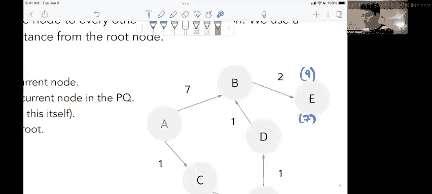

上一节我们介绍了本周的安排，本节中我们来看看最短路径问题。迪杰斯特拉算法是一种路径查找算法，它解决的问题是：给定一个源点，如何找到从该源点到图中所有其他顶点的最短路径。

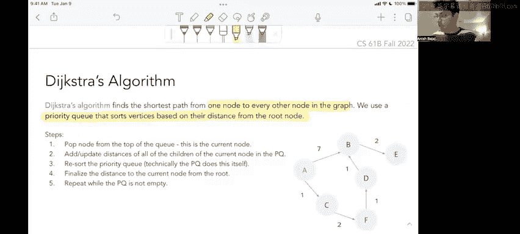

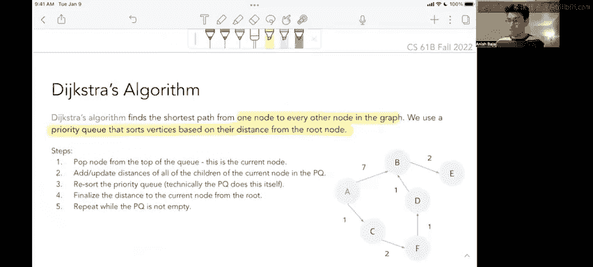

### 无权图与广度优先搜索

首先，考虑一个所有边权重都为1的简单图。在这种情况下，从源点A到其他顶点的“最短路径”就是经过边数最少的路径。例如，从A到E的最短路径是 `A -> B -> E`，总共经过两条边。

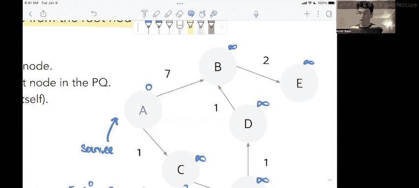

此时，我们可以直接使用**广度优先搜索**算法。BFS从源点A开始，按照距离源点的边数（层数）依次访问顶点。访问顺序本身就代表了基于边数的最短路径。

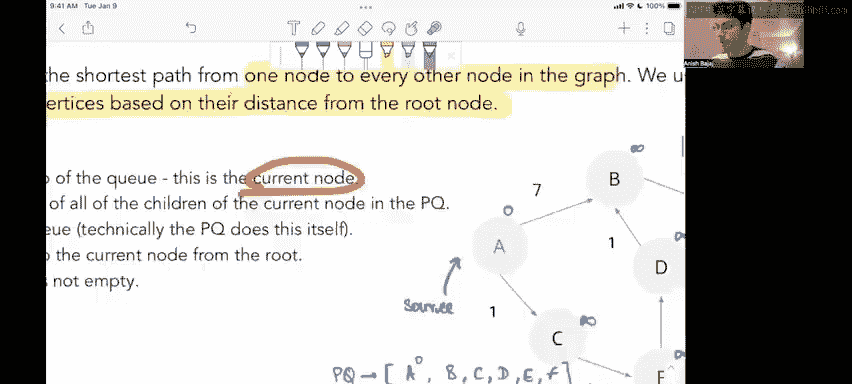

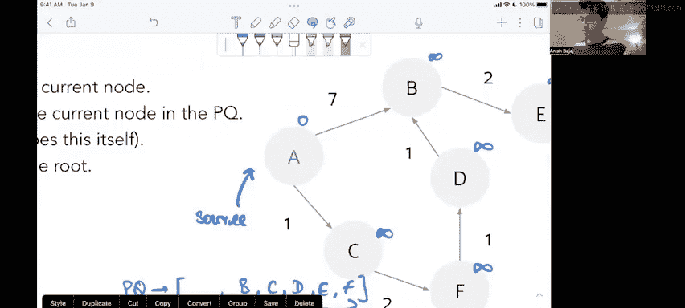

### 加权图与迪杰斯特拉算法

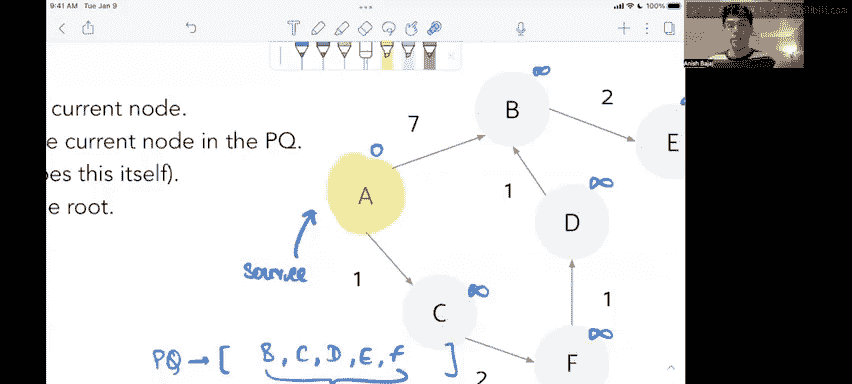

然而，当图中的边具有不同的权重（或成本）时，情况就不同了。此时，路径的成本是路径上所有边权重的总和，而不仅仅是边的数量。

例如，考虑一个加权图。路径 `A -> C -> F -> D -> B -> E` 的总成本是 `1 + 2 + 1 + 1 + 2 = 7`，而另一条路径 `A -> B -> E` 的成本是 `7 + 2 = 9`。因此，最短路径变成了前者。BFS无法处理这种加权边的情况，这就需要迪杰斯特拉算法。

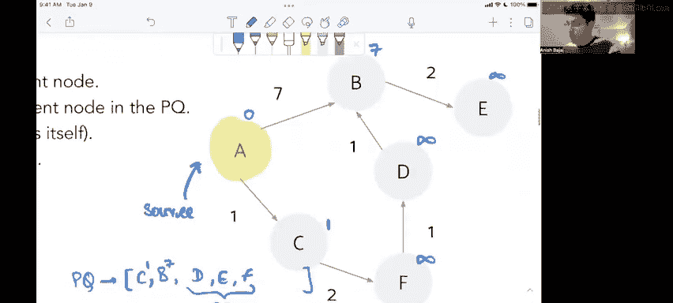

迪杰斯特拉算法的核心思想是：使用一个**优先队列**，根据顶点到源点的当前已知最短距离来排序顶点。算法会不断从队列中取出距离最小的顶点，并尝试通过它来更新其邻居顶点的距离。

以下是算法的关键步骤概述：

1.  初始化：将源点距离设为0，其他所有顶点距离设为无穷大（∞）。将所有顶点加入优先队列。
2.  循环，直到队列为空：
    a. 从优先队列中取出当前距离最小的顶点 `u`（即出队）。此时，到 `u` 的最短距离就已确定。
    b. 遍历 `u` 的所有邻居顶点 `v`。
    c. 计算通过 `u` 到达 `v` 的候选距离：`distance[u] + weight(u, v)`。
    d. 如果这个候选距离小于 `v` 当前记录的距离，则更新 `v` 的距离，并将 `v`（或其新距离）重新加入优先队列。

### 算法演示

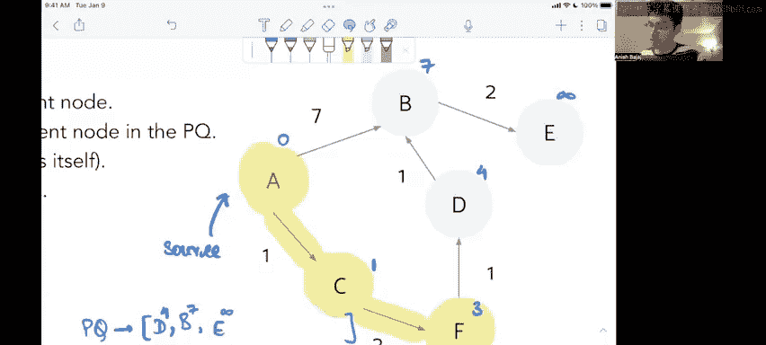

让我们通过一个具体的加权图来演示迪杰斯特拉算法的执行过程。假设源点为A。

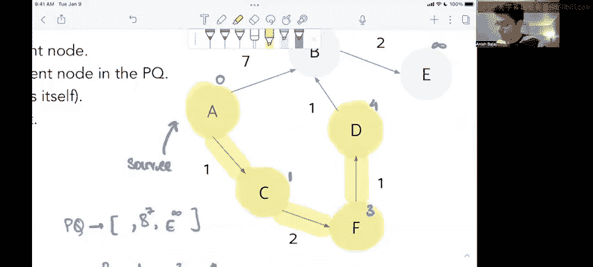

**初始化**：
- 距离：`A=0`, `B=∞`, `C=∞`, `D=∞`, `E=∞`, `F=∞`
- 优先队列：`[A(0), B(∞), C(∞), D(∞), E(∞), F(∞)]`

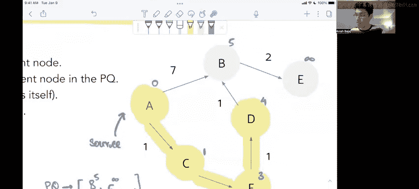

**第一步**：取出A。更新邻居：
- `B`: `0 + 7 = 7 < ∞`，更新 `B=7`
- `C`: `0 + 1 = 1 < ∞`，更新 `C=1`
- 队列排序后：`[C(1), B(7), D(∞), E(∞), F(∞)]`

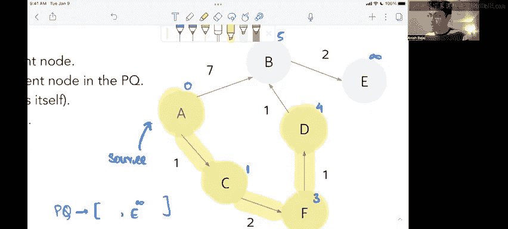

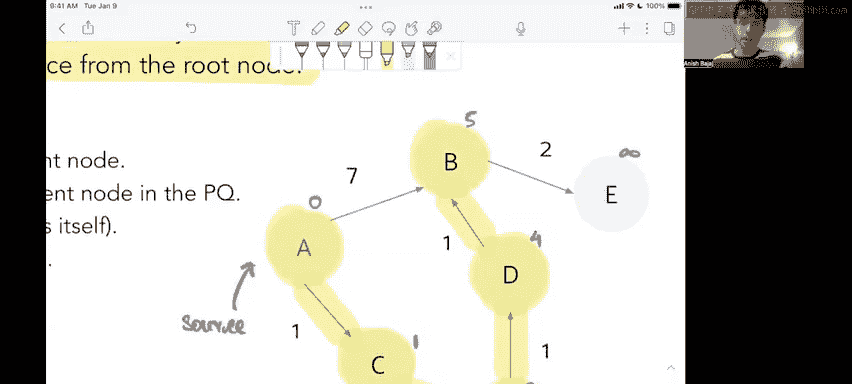

**第二步**：取出C。更新邻居F：
- `F`: `1 + 2 = 3 < ∞`，更新 `F=3`
- 队列：`[F(3), B(7), D(∞), E(∞)]`

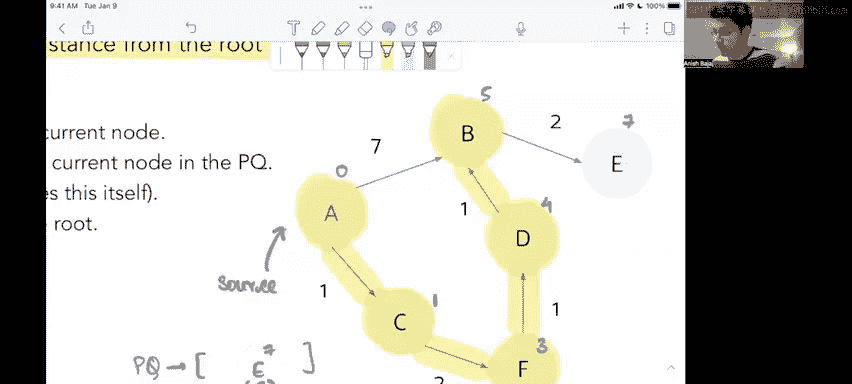

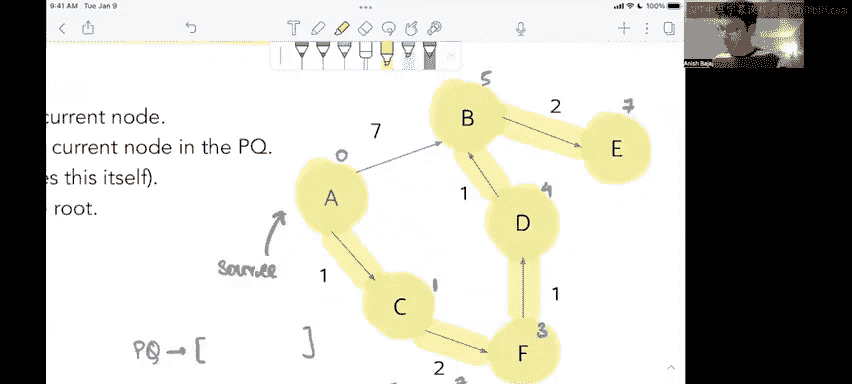

**第三步**：取出F。更新邻居D：
- `D`: `3 + 1 = 4 < ∞`，更新 `D=4`
- 队列：`[D(4), B(7), E(∞)]`

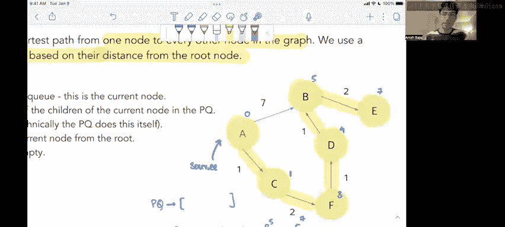

**第四步**：取出D。更新邻居B：
- `B`: `4 + 1 = 5 < 7`，更新 `B=5`
- 队列：`[B(5), E(∞)]`

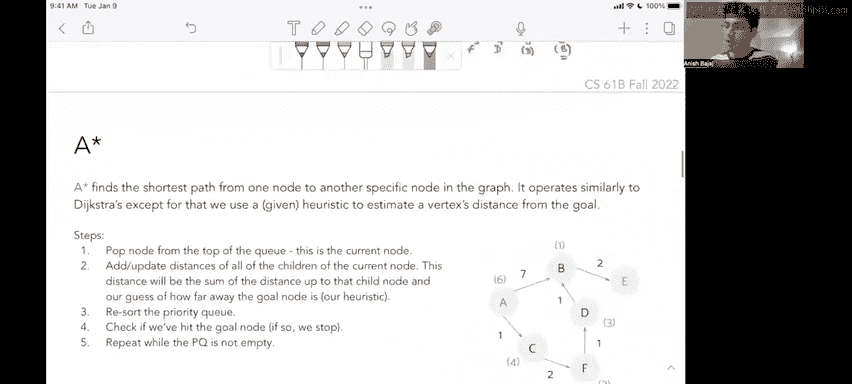

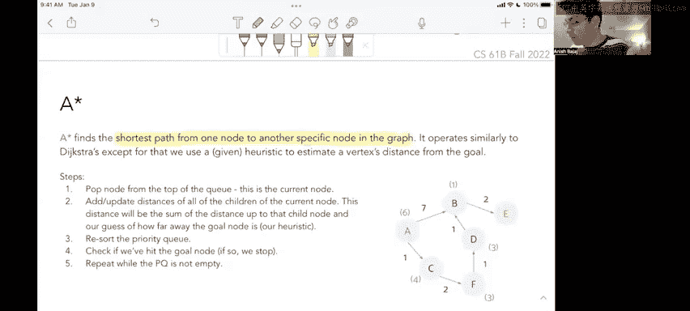

**第五步**：取出B。更新邻居E：
- `E`: `5 + 2 = 7 < ∞`，更新 `E=7`
- 队列：`[E(7)]`

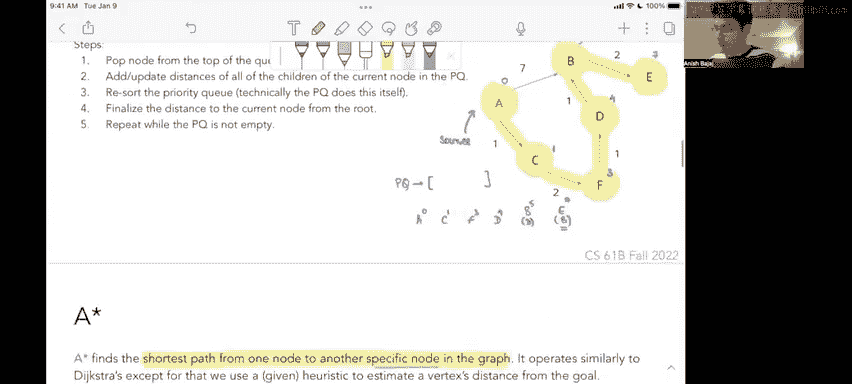

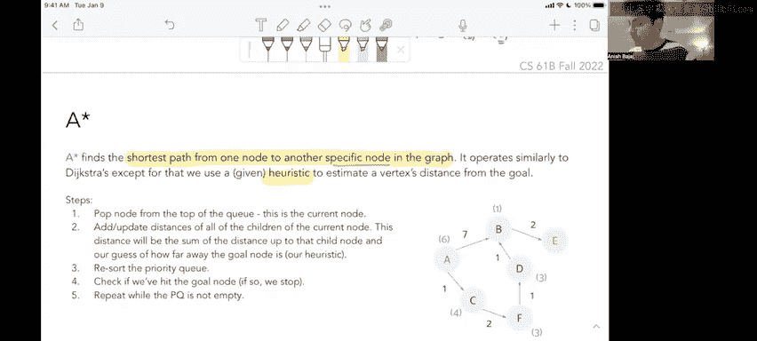

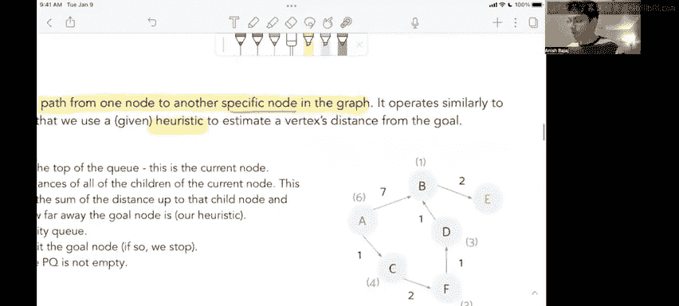

**第六步**：取出E。队列空，算法结束。

最终，我们得到了从源点A到所有顶点的最短距离：`A=0, B=5, C=1, D=4, E=7, F=3`。通过记录每个顶点是由哪个顶点更新而来的，我们就可以重构出完整的最短路径树。

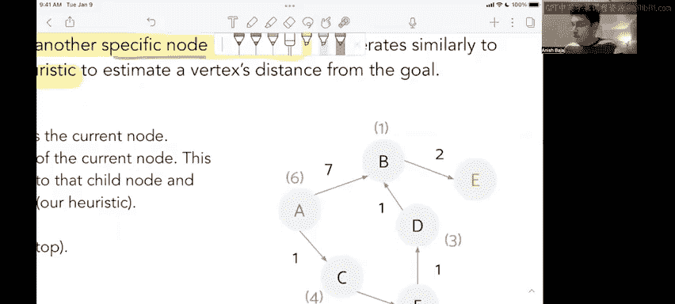

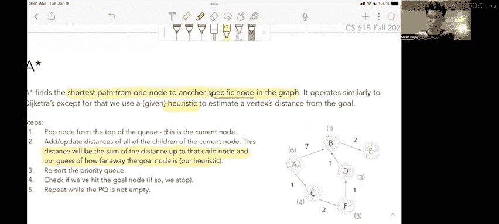

## A* 搜索算法 ⭐

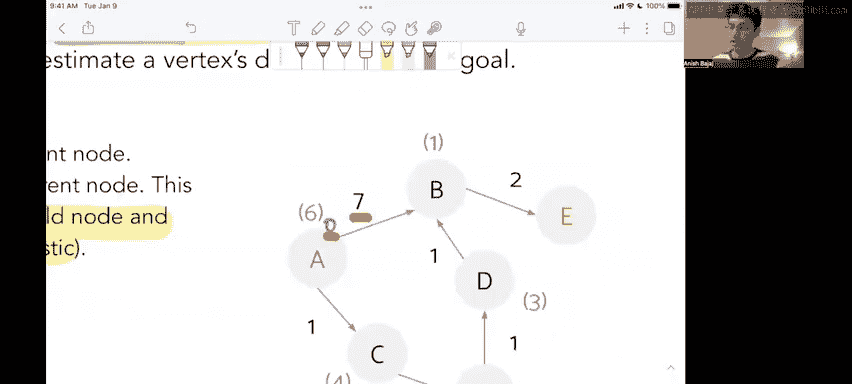

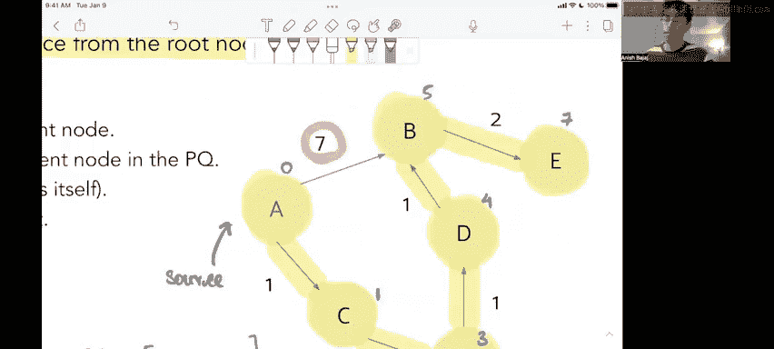

了解了迪杰斯特拉算法后，我们来看它的一个优化变体——A*搜索算法。迪杰斯特拉算法寻找从源点到**所有**其他点的最短路径，而A*算法则专注于找到从源点到**某个特定目标点**的最短路径。

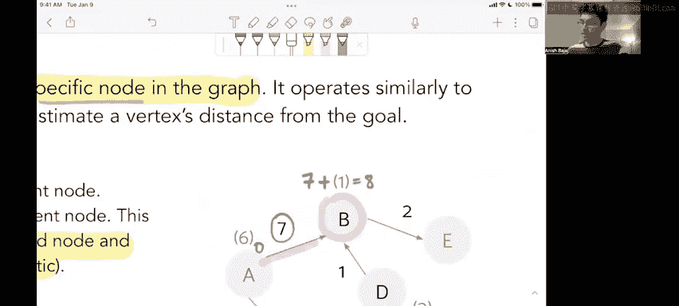

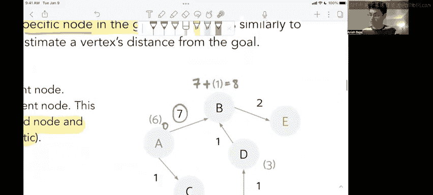

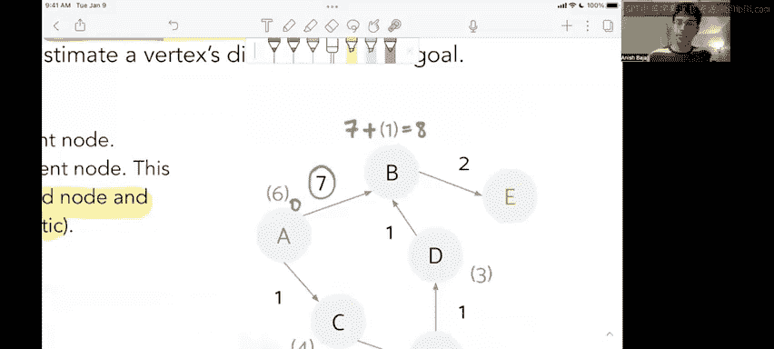

A*算法的核心改进在于引入了一个**启发函数** `h(n)`。这个函数用于估计从当前顶点 `n` 到目标顶点的剩余距离。在优先队列中，顶点排序的依据不再是单纯的从源点出发的实际距离 `g(n)`，而是 `f(n) = g(n) + h(n)`，即实际距离加上启发式估计。

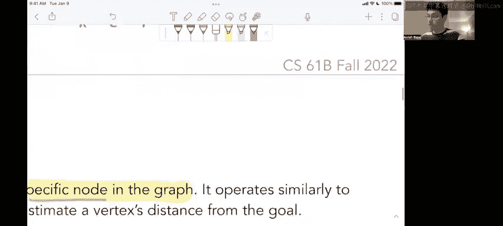

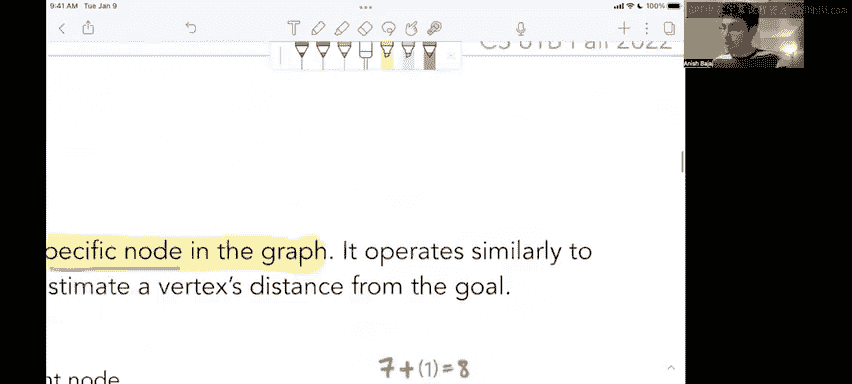

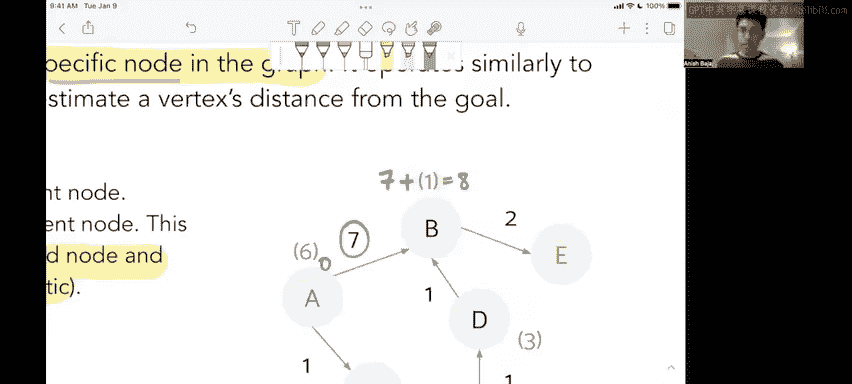

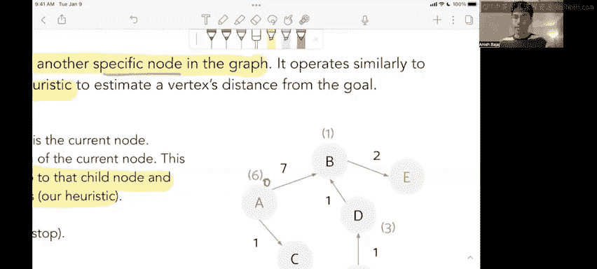

这意味着，A*算法会优先探索那些看起来更接近目标的路径，从而可能更快地收敛到目标点。然而，启发函数的选择至关重要：

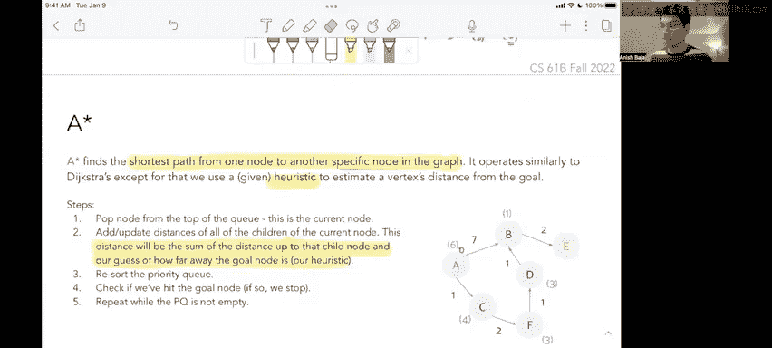

- **可采纳性**：如果启发函数 `h(n)` **永远不会高估**从当前点到目标点的实际成本，那么A*算法保证能找到最短路径。
- **一致性（或单调性）**：一个更强的性质，能保证算法效率更高。

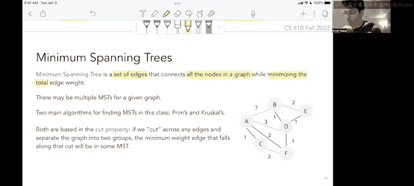

如果启发函数设计得不好（例如估计值远高于实际值），算法可能会绕远路，甚至可能无法找到最优解。在极端情况下，如果 `h(n) = 0`，A*算法就退化成了迪杰斯特拉算法。

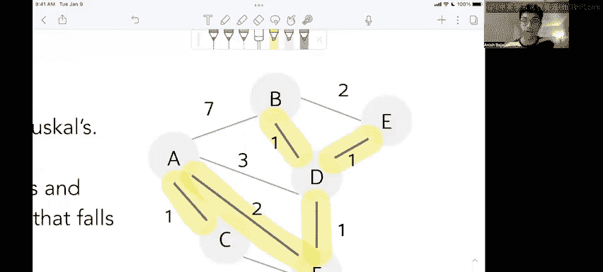

## 最小生成树 🌲

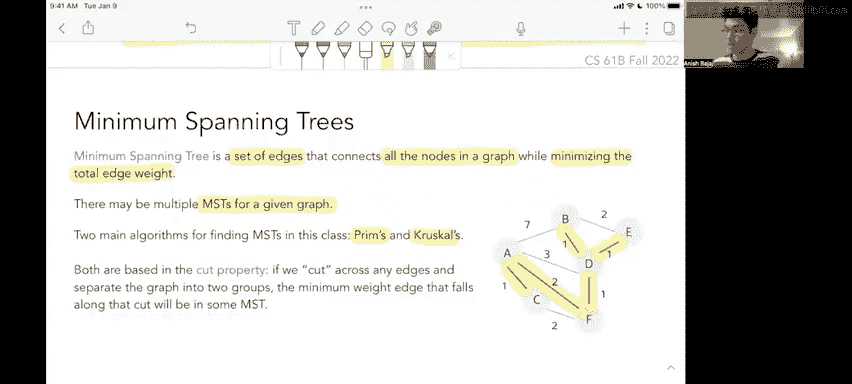

前面我们学习了寻找点之间最短路径的算法，现在我们将目光转向连接所有点的另一种方式——最小生成树。最小生成树是指一个无向连通图中，连接所有顶点且**总边权之和最小**的子图，并且这个子图是一棵树（即无环且连通）。

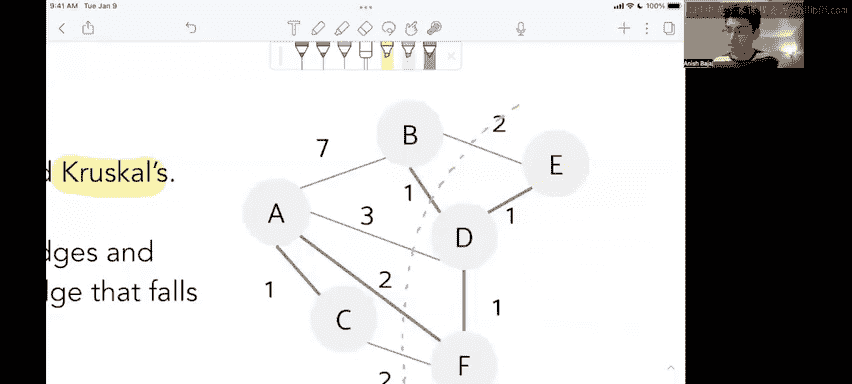

### 割性质

普里姆和克鲁斯卡尔算法都基于一个关键原理：**割性质**。
> 对于图中的任意一个割（将顶点分成两个不相交的集合），横跨这个割的最小权重的边，必然属于图的最小生成树。

### 普里姆算法

普里姆算法从一个任意顶点开始，逐步“生长”出一棵最小生成树。它的思路与迪杰斯特拉算法非常相似，但目标不同：迪杰斯特拉关心的是到源点的距离，而普里姆关心的是到**当前已构建的树**的距离。

以下是普里姆算法的步骤：

1.  选择任意一个顶点作为起始点，加入最小生成树集合。
2.  在所有**一端在树中、另一端不在树中**的边里，选择权重最小的那条边。
3.  将这条边以及它连接的那个新顶点加入最小生成树集合。
4.  重复步骤2和3，直到所有顶点都包含在树中。

**算法演示**（从顶点A开始）：
1.  树集合：`{A}`。候选边：`A-B(7)`, `A-C(1)`, `A-D(5)`。选最小边 `A-C`，加入C。
2.  树集合：`{A, C}`。候选边：`A-B(7)`, `A-D(5)`, `C-F(2)`。选最小边 `C-F`，加入F。
3.  树集合：`{A, C, F}`。候选边：`A-B(7)`, `A-D(5)`, `F-D(1)`。选最小边 `F-D`，加入D。
4.  树集合：`{A, C, F, D}`。候选边：`A-B(7)`, `D-B(1)`, `D-E(1)`。选最小边 `D-B`，加入B。
5.  树集合：`{A, C, F, D, B}`。候选边：`B-E(2)`, `D-E(1)`。选最小边 `D-E`，加入E。
6.  所有顶点都已加入，算法结束。得到的最小生成树总权重为 `1+2+1+1+1 = 6`。

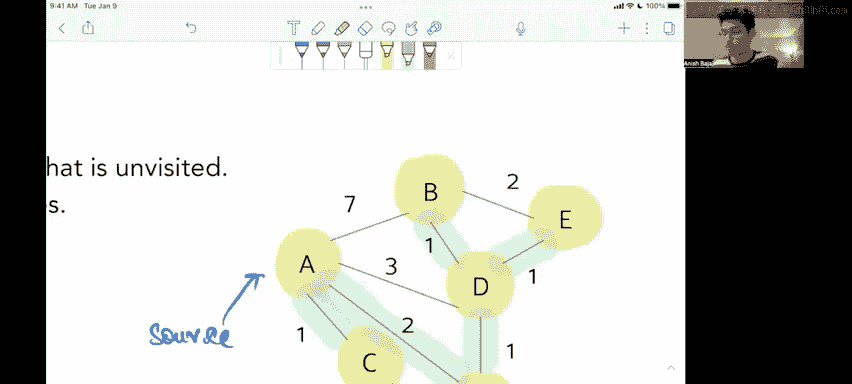

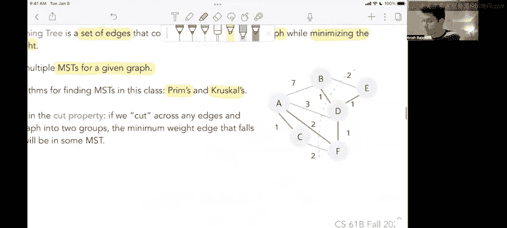

### 克鲁斯卡尔算法

克鲁斯卡尔算法采用了另一种“按边构建”的思路。它先将所有边按权重从小到大排序，然后依次考虑每条边，如果加入这条边不会在已形成的森林中构成环，就将其加入最小生成树。

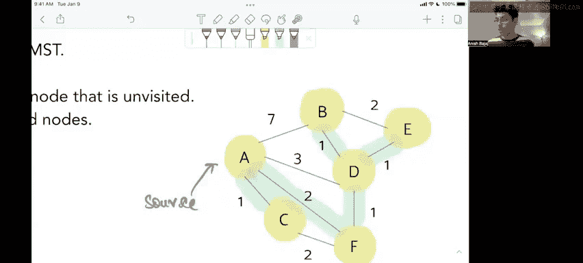

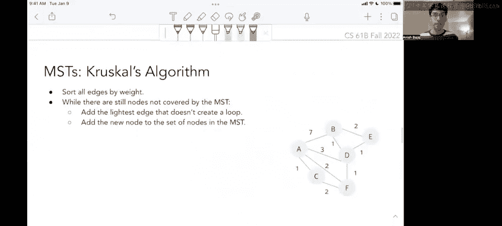

以下是克鲁斯卡尔算法的步骤：

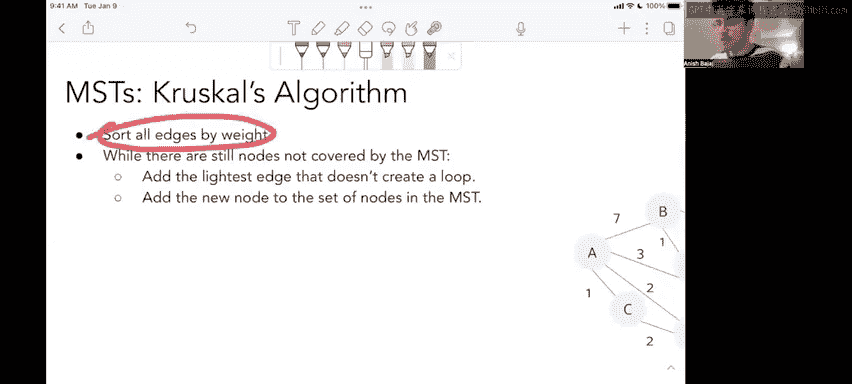

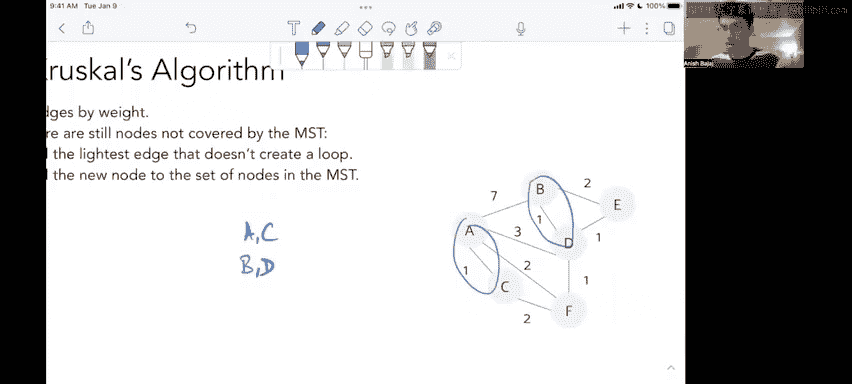

1.  将图中所有边按权重升序排序。
2.  初始化，使每个顶点自成一个独立的连通分量（通常使用并查集数据结构高效实现）。
3.  按顺序遍历排序后的边。对于每条边 `(u, v)`：
    a. 如果 `u` 和 `v` 当前不在同一个连通分量中（即加入这条边不会形成环），则将这条边加入最小生成树，并合并 `u` 和 `v` 所在的连通分量。
    b. 否则，跳过这条边。
4.  当最小生成树中包含 `|V| - 1` 条边时，算法结束。

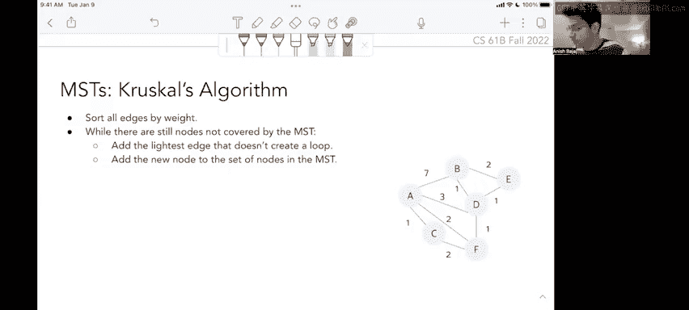

**算法演示**：
1.  排序后，权重为1的边有：`A-C`, `D-F`, `B-D`, `D-E`。
2.  依次加入 `A-C`, `B-D`, `D-E`, `D-F`（加入时检查均不构成环）。
3.  接下来考虑权重为2的边：`C-F`, `A-F`, `B-E`。
    - 加入 `C-F`，不构成环。
    - 加入 `A-F`？此时A和F已在同一连通分量中（通过A-C-F），加入会形成环，故跳过。
    - 加入 `B-E`？此时B和E已在同一连通分量中（通过B-D-E），加入会形成环，故跳过。
4.  已加入 `5` 条边 (`|V|=6`)，算法结束。得到的最小生成树与普里姆算法结果一致（可能因边权重相同、选择顺序不同而有结构差异，但总权重相同，均为6）。

**注意**：由于图中可能存在多条权重相同的边，普里姆和克鲁斯卡尔算法在具体执行时，可能会因为处理边的顺序（ tie-breaking ）不同而产生结构不同的最小生成树，但只要算法正确，它们的总权重一定都是最小的。

## 总结 📝

本节课中我们一起学习了图论中的两个核心问题及其经典算法：

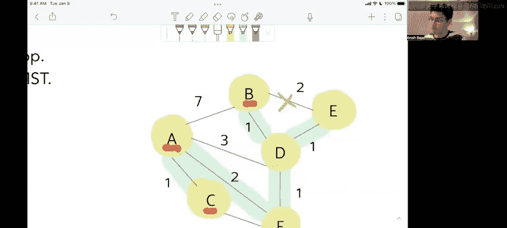

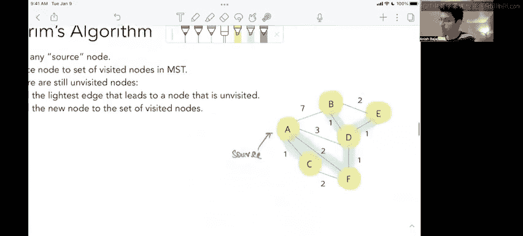

1.  **最短路径问题**：我们深入探讨了**迪杰斯特拉算法**，它利用优先队列，能有效找到从单一源点到图中所有其他顶点的最短路径。我们还了解了其优化版本**A*搜索算法**，它通过引入启发函数来加速向特定目标点的搜索过程。
2.  **最小生成树问题**：我们学习了两种构建最小生成树的贪心算法：**普里姆算法**（从点出发，逐步生长）和**克鲁斯卡尔算法**（从边出发，按权排序并避免环）。两者都基于**割性质**，并能保证找到总权重最小的连接方案。

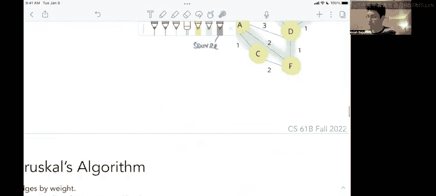

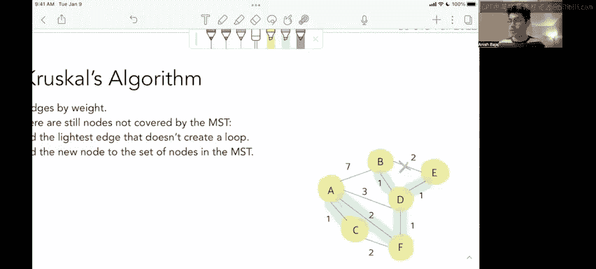

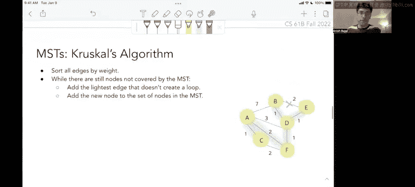

理解这些算法的步骤、异同以及它们背后的原理（如贪心选择性质），对于解决许多实际的网络优化、路径规划问题至关重要。