# 54：最短路径算法详解

在本节课中，我们将学习两种重要的最短路径算法：**Dijkstra算法**和**A\*算法**。我们将通过一个具体的图例，逐步演示它们的运行过程，并比较两者的异同。课程分为两部分：第一部分（A）专注于理解Dijkstra算法，第二部分（B）则探讨A\*算法及其启发式函数。

## 概述

我们将分析一个给定的图，从起点 **A** 到终点 **G** 寻找最短路径。首先，我们会使用Dijkstra算法，该算法会系统地探索所有节点以找到全局最短路径。接着，我们将使用A\*算法，它通过引入**启发式函数**来优化搜索过程，旨在更快地找到目标。

---

## Dijkstra算法详解

上一节我们介绍了课程目标，本节中我们来看看Dijkstra算法的具体执行步骤。Dijkstra算法使用两个核心一个记录**已知最短距离**的表格，和一个用于选择下一个探索节点的**优先队列**。

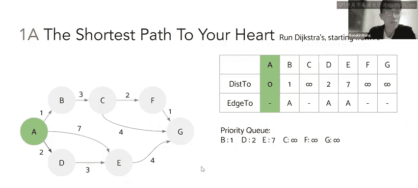

表格包含两列：
*   **`distanceTo`**: 记录从起点 **A** 到当前节点的已知最短距离。
*   **`edgeTo`**: 记录到达当前节点之前，经过的**上一个节点**。这用于最终重构出完整路径。

初始时，我们只知道起点 **A**，其 `distanceTo` 为0。其他所有节点的距离未知，因此标记为无穷大（∞）。优先队列最初也只包含 **A**。

以下是算法的执行步骤：

1.  **起点初始化**
    将起点 **A** 加入已知集合。从 **A** 出发，我们可以更新其邻居节点 **B**、**D**、**E** 的信息。
    *   `distanceTo[B] = 1` (A->B), `edgeTo[B] = A`
    *   `distanceTo[D] = 2` (A->D), `edgeTo[D] = A`
    *   `distanceTo[E] = 7` (A->E), `edgeTo[E] = A`
    同时，优先队列更新这些节点的距离值。

    

2.  **探索节点 B**
    从优先队列中弹出距离最小的节点，即 **B** (`distanceTo=1`)。将其标记为已确认（绿色）。探索 **B** 的邻居 **C**。
    *   路径 A->B->C 的总距离为 1 + 3 = 4。
    *   由于 `distanceTo[C]` 原为 ∞，现在更新为 4，`edgeTo[C] = B`。

    

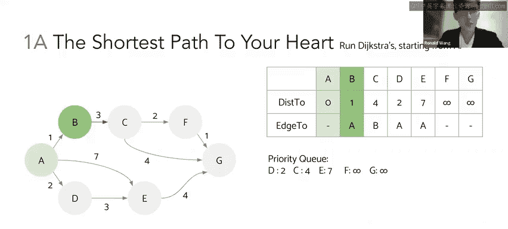

3.  **探索节点 D**
    下一个优先队列中距离最小的节点是 **D** (`distanceTo=2`)。确认 **D**。探索 **D** 的邻居 **E**。
    *   路径 A->D->E 的总距离为 2 + 3 = 5。
    *   这比之前直接 A->E 的距离 7 更短。因此，我们更新 **E** 的信息：`distanceTo[E] = 5`, `edgeTo[E] = D`。这体现了Dijkstra算法能找到更优路径的关键步骤。

    

4.  **探索节点 C**
    接下来弹出节点 **C** (`distanceTo=4`)。确认 **C**。探索 **C** 的邻居 **F** 和 **G**。
    *   `distanceTo[F] = 4 + 2 = 6`, `edgeTo[F] = C`
    *   `distanceTo[G] = 4 + 4 = 8`, `edgeTo[G] = C`

    

5.  **探索节点 E**
    弹出节点 **E** (`distanceTo=5`)。确认 **E**。探索 **E** 的邻居 **G**。
    *   路径 A->D->E->G 的总距离为 5 + 4 = 9。
    *   这比当前已知的到 **G** 的距离 8 要长，因此**不更新** **G** 的信息。算法会忽略非更优的路径。

    

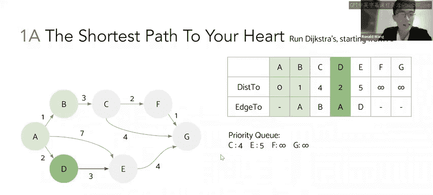

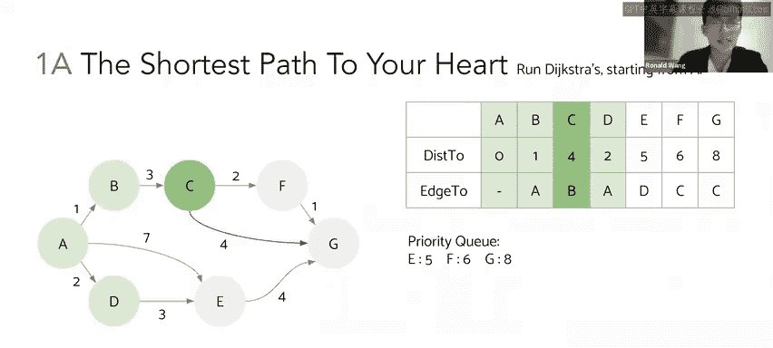

6.  **探索节点 F 并找到最短路径**
    弹出节点 **F** (`distanceTo=6`)。确认 **F**。探索 **F** 的邻居 **G**。
    *   路径 A->B->C->F->G 的总距离为 6 + 1 = 7。
    *   这比当前到 **G** 的距离 8 更短。因此，更新 **G** 的信息：`distanceTo[G] = 7`, `edgeTo[G] = F`。

    

7.  **算法终止与路径回溯**
    当优先队列为空时，算法结束。最终表格给出了从 **A** 到所有节点的最短距离。
    *   到 **G** 的最短距离是 **7**。
    *   通过 `edgeTo` 链可以回溯出路径：`edgeTo[G]=F` -> `edgeTo[F]=C` -> `edgeTo[C]=B` -> `edgeTo[B]=A`。因此，最短路径为 **A -> B -> C -> F -> G**。

    

**总结**：Dijkstra算法通过不断从优先队列中取出距离最小的节点进行探索和松弛操作，最终计算出从起点到所有其他节点的最短路径。它保证找到的路径是最短的，但需要遍历所有节点。

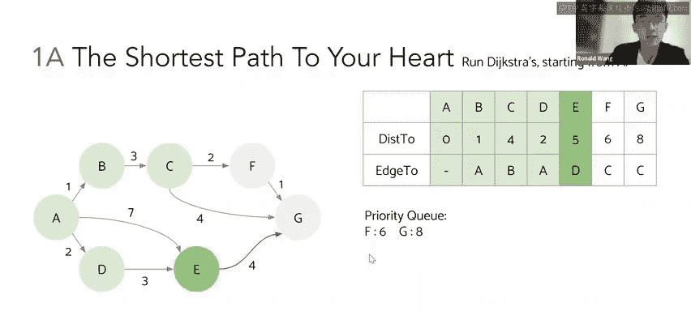

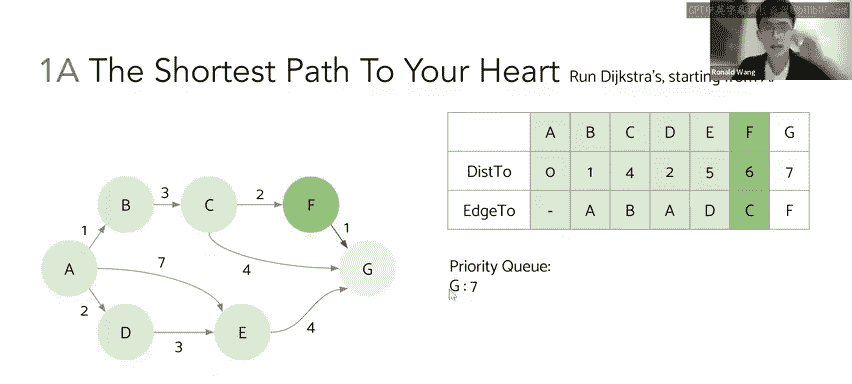

---

## A\* 算法与启发式函数

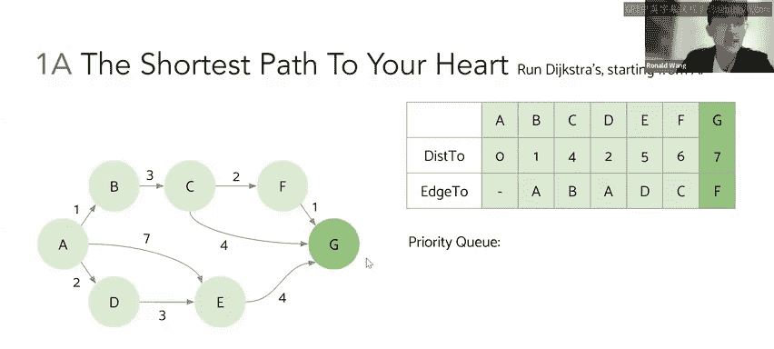

上一节我们详细了解了Dijkstra算法，本节中我们来看看A\*算法如何利用启发式信息来优化搜索。A\*算法与Dijkstra的主要区别在于**优先队列的优先级计算方式**。

在A\*中，节点在优先队列中的优先级（`priority`）不再仅仅是 `distanceTo`，而是：
`priority = distanceFromStart + heuristicEstimate`
其中 `heuristicEstimate` 是从当前节点到目标节点 **G** 的**估计成本**（图中蓝色数字）。对于目标节点 **G**，其启发值通常为0。

A\*算法的终止条件是：当目标节点 **G** 从优先队列中被弹出时，算法立即结束，因为我们相信一个好的启发式函数能引导我们直接找到最短路径。

以下是A\*算法的执行步骤：

1.  **起点初始化**
    起点 **A** 的 `distanceTo = 0`，启发值 `h(A)=7`，因此其在优先队列中的优先级为 `0 + 7 = 7`。弹出 **A**。
    更新邻居 **B**, **D**, **E**：
    *   **B**: `distanceTo=1`, `h(B)=6`, `priority = 1+6=7`
    *   **D**: `distanceTo=2`, `h(D)=6`, `priority = 2+6=8`
    *   **E**: `distanceTo=7`, `h(E)=3`, `priority = 7+3=10`

    

2.  **探索节点 D**
    优先队列中优先级最低的是 **D** (`priority=8`)。弹出并确认 **D**。更新其邻居 **E**。
    *   路径 A->D->E 的 `distanceTo = 5`。
    *   `priority = 5 + 3 = 8` (优于之前的10，因此更新)。

    

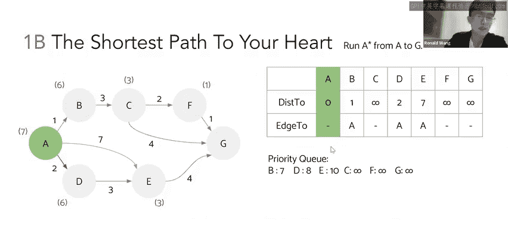

3.  **探索节点 B**
    下一个优先级最低的是 **B** (`priority=7`)。弹出并确认 **B**。更新其邻居 **C**。
    *   `distanceTo[C] = 4`, `h(C)=3`, `priority = 4+3=7`

    

4.  **探索节点 C**
    弹出 **C** (`priority=7`)。确认 **C**。更新其邻居 **F** 和 **G**。
    *   **F**: `distanceTo=6`, `h(F)=1`, `priority = 6+1=7`
    *   **G**: `distanceTo=8`, `h(G)=0`, `priority = 8+0=8`

    

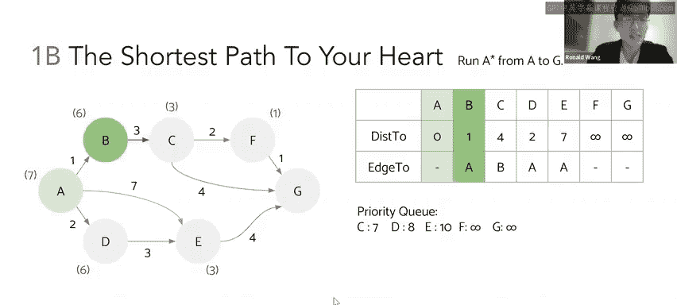

5.  **探索节点 F 并抵达目标**
    弹出 **F** (`priority=7`)。确认 **F**。更新其邻居 **G**。
    *   路径 A->B->C->F->G 的 `distanceTo = 7`。
    *   `priority = 7 + 0 = 7`。这比队列中 **G** 原来的优先级 8 更低。
    现在，优先队列中优先级最低的节点就是 **G** (`priority=7`)。

    

6.  **算法终止**
    弹出 **G**。因为 **G** 是目标节点，A\*算法**立即终止**。它没有去探索从 **E** 到 **G** 的路径（优先级为9），从而节省了计算。
    最终路径与Dijkstra算法找到的一致：**A -> B -> C -> F -> G**，总距离为7。

    

**总结**：A\*算法通过将“到达起点的实际成本”与“到达终点的估计成本”相加来指导搜索方向。一个好的启发式函数能有效缩小搜索范围，更快地找到目标。

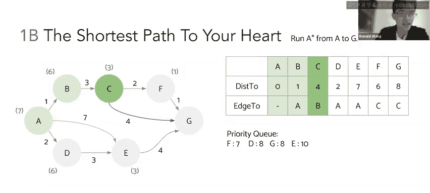

---

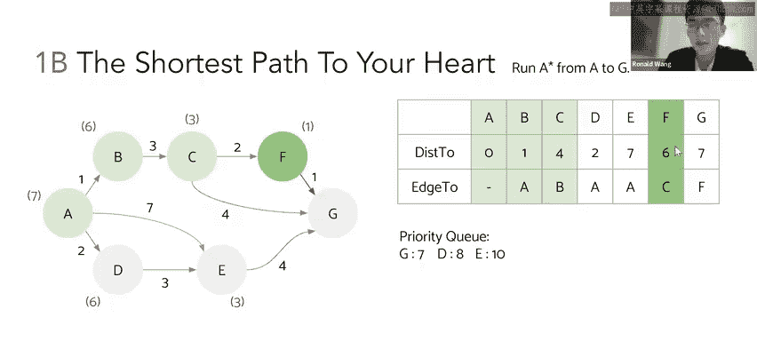

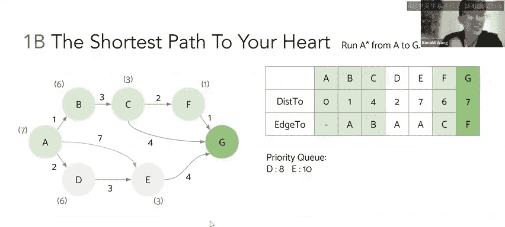

## 启发式函数的评估：可采纳性与一致性

在上一节我们运行了A\*算法，本节中我们来探讨如何判断一个启发式函数是否“好”。一个好的启发式函数必须保证A\*算法能找到最短路径。这通常通过两个性质来检验：**可采纳性**和**一致性**。

以下是这两个性质的定义：
*   **可采纳性**：对于图中任意节点 `n`，启发式函数值 `h(n)` **必须小于或等于**从节点 `n` 到目标节点 **G** 的**真实最短距离**（即“乐观估计”）。
    `h(n) <= trueDistance(n, G)`
*   **一致性**（或单调性）：对于图中任意相邻的节点 `v` 和 `w`，启发式函数需满足三角不等式。即，从 `v` 到目标 `G` 的估计值，不能大于从 `v` 到 `w` 的实际成本加上从 `w` 到 `G` 的估计值。
    `h(v) <= dist(v, w) + h(w)`
    其中 `dist(v, w)` 是连接 `v` 和 `w` 的边的权重。

让我们用课程中的启发式函数来检验：

1.  **检验可采纳性**
    *   对于节点 **F**: `h(F)=1`，真实最短距离 `F->G=1`。`1 <= 1`，成立。
    *   对于节点 **D**: `h(D)=6`，真实最短距离 `D->E->G=3+4=7`。`6 <= 7`，成立。
    *   对于节点 **C**: `h(C)=3`，真实最短距离 `C->F->G=2+1=3`。`3 <= 3`，成立。
    检查所有节点后，可发现该启发式函数满足可采纳性。

2.  **检验一致性**
    我们检查几对相邻节点：
    *   **C 和 F**: `h(C)=3`, `dist(C,F)=2`, `h(F)=1`。`3 <= 2 + 1` 成立。
    *   **A 和 E**: `h(A)=7`, `dist(A,E)=7` (直接边权重), `h(E)=3`。`7 <= 7 + 3` 成立。
    检查所有边后，可发现该启发式函数也满足一致性。

由于该启发式函数同时满足**可采纳性**和**一致性**，因此它是一个“好”的启发式函数。使用它的A\*算法**保证**能找到从 **A** 到 **G** 的最短路径。

---

## 本节课总结

在本节课中，我们一起学习了：
1.  **Dijkstra算法**：通过维护一个到起点的最短距离表和一个优先队列，系统地探索所有节点，最终找到从起点到所有节点的最短路径。其核心是每次选择当前距离最小的节点进行“松弛”操作。
2.  **A\*算法**：在Dijkstra的基础上引入**启发式函数**，将 `(实际成本 + 估计成本)` 作为优先队列的优先级。这能有效引导搜索方向，在满足条件时更快地找到目标路径。
3.  **启发式函数的性质**：为了保证A\*算法找到最优解，启发式函数需要具备**可采纳性**（乐观估计）和**一致性**（满足三角不等式）。我们通过实例验证了给定启发式函数的有效性。

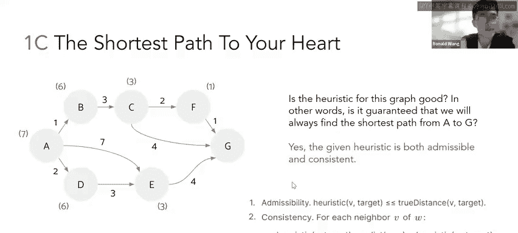

通过对比，我们看到Dijkstra算法是一种“盲目”但保证最优的全局搜索，而A\*算法是一种“有信息指导”的、更高效的搜索，但其最优性依赖于启发式函数的质量。