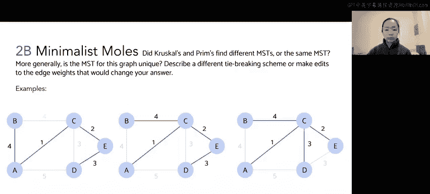

# 10：最小生成树算法应用

在本节课中，我们将学习如何应用克鲁斯卡尔算法和普里姆算法来求解给定图的最小生成树，并探讨最小生成树的唯一性问题。

## 概述

我们将分析一个具体的图例，分别使用克鲁斯卡尔算法和普里姆算法来构建其最小生成树。过程中会应用特定的边选择规则（平局决胜规则），并最终讨论该图的最小生成树是否唯一。

---

## 克鲁斯卡尔算法求解

上一节我们介绍了最小生成树的概念，本节中我们来看看如何使用克鲁斯卡尔算法求解。

克鲁斯卡尔算法的核心是：**反复添加不构成环的最轻边，直到所有顶点都包含在生成树中**。

以下是应用该算法的具体步骤：

1.  初始时，最小生成树不包含任何顶点和边。
2.  当前最轻的边是 **A-C**，权重为1。添加此边，并将顶点A和C加入生成树集合。
3.  下一个最轻的边是 **C-E**，权重为2。添加此边，并将顶点E加入生成树集合。
4.  下一个最轻的边权重为3。此时有两条候选边：**C-D** 和 **D-E**。根据平局决胜规则（选择连接字母顺序较低顶点的边），我们选择 **C-D**。添加此边，并将顶点D加入集合。
5.  下一个最轻的边是 **D-E**（权重3），但添加它会形成环（C-D-E），因此跳过。
6.  下一个最轻的边权重为4。候选边为 **A-B** 和 **B-C**。根据平局决胜规则，选择 **A-B**。添加此边，并将顶点B加入集合。
7.  此时所有顶点（A, B, C, D, E）都已包含在生成树中，算法结束。

通过克鲁斯卡尔算法得到的最小生成树包含的边为：**A-C**, **C-E**, **C-D**, **A-B**。

---

## 普里姆算法求解

了解了克鲁斯卡尔算法的过程后，我们再来看看普里姆算法如何从另一个角度构建最小生成树。

普里姆算法的核心是：**从任意一个顶点开始，不断添加连接“已访问集合”与“未访问集合”的最轻边**。

以下是应用该算法的具体步骤：

1.  从顶点 **A** 开始，将其加入已访问集合。
2.  从A出发的边中，最轻的是 **A-C**（权重1）。添加此边，并将C加入已访问集合。
3.  从集合 {A, C} 出发，连接未访问顶点的最轻边是 **C-E**（权重2）。添加此边，并将E加入集合。
4.  从集合 {A, C, E} 出发，连接未访问顶点的最轻边权重为3。候选边为 **C-D** 和 **E-D**。根据平局决胜规则，选择 **C-D**。添加此边，并将D加入集合。
5.  从集合 {A, C, D, E} 出发，连接最后一个未访问顶点B的最轻边权重为4。候选边为 **A-B** 和 **C-B**。根据平局决胜规则，选择 **A-B**。添加此边，并将B加入集合。
6.  所有顶点均已访问，算法结束。

通过普里姆算法得到的最小生成树包含的边同样为：**A-C**, **C-E**, **C-D**, **A-B**。

---

## 最小生成树的唯一性讨论

我们已经看到，在给定的平局决胜规则下，两种算法找到了相同的最小生成树。现在我们来探讨一个更一般的问题：这个图的最小生成树是唯一的吗？

观察该图，我们可以发现：
*   存在两条权重为3的边：**C-D** 和 **D-E**。
*   存在两条权重为4的边：**A-B** 和 **B-C**。

这意味着在构建最小生成树的过程中，当需要在相同权重的边之间做选择时，如果采用不同的平局决胜规则（例如随机选择），就可能得到不同的最小生成树。

例如：
*   一个有效的MST可能包含 **A-B** 和 **C-D**。
*   另一个有效的MST可能包含 **B-C** 和 **C-D**。
*   再一个有效的MST可能包含 **A-B** 和 **D-E**。

因此，**该图的最小生成树并不唯一**。它存在多个有效的解，具体结果取决于算法中处理等权重边时所采用的规则。

---

## 总结

本节课中我们一起学习了：
1.  如何使用克鲁斯卡尔算法逐步构建最小生成树。
2.  如何使用普里姆算法从起点扩展构建最小生成树。
3.  在给定的特定平局决胜规则下，两种算法得出了相同的结果。
4.  通过分析图中的等权重边，我们认识到一个图的最小生成树可能不是唯一的，其最终形态会受到边选择规则的影响。