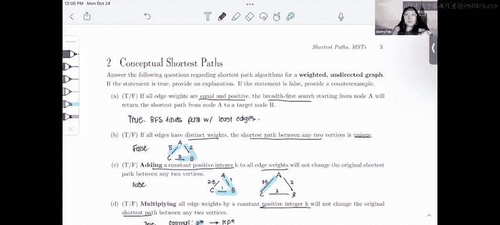

# 57：最短路径问题解析 🧭

在本节课中，我们将学习关于加权无向图中最短路径的几个核心概念。我们将通过分析四个判断题，来理解不同条件下最短路径算法的行为。

---

## 问题A：权重相等时BFS是否有效？

上一节我们介绍了问题的背景，本节中我们来看看第一个具体问题。

如果图中所有边的权重都相等且为正数，那么广度优先搜索（BFS）能否找到最短路径？答案是**正确**。

**核心原因**：
BFS算法总是能找到边数最少的路径。当所有权重相等时，我们可以将图视为无权图。此时，边数最少的路径，其总权重也必然最小，因此就是最短路径。

**公式化理解**：
设每条边权重为常数 `w`，路径 `P` 的边数为 `n`，则总权重 `W(P) = n * w`。BFS找到边数 `n` 最小的路径，也就最小化了 `W(P)`。

---

## 问题B：权重不同是否意味着最短路径唯一？

在理解了BFS在等权图中的应用后，我们接下来探讨权重与路径唯一性的关系。

如果图中所有边的权重都互不相同，那么任意两点间的最短路径是否唯一？答案是**错误**。

**反例说明**：
我们可以构造一个简单的反例来证明其错误性。

以下是该反例的图示描述（节点A、B、C构成三角形）：
*   `A --5--> C`
*   `A --2--> B`
*   `B --3--> C`

在这个例子中：
*   路径 `A -> C` 的权重为 **5**。
*   路径 `A -> B -> C` 的权重为 `2 + 3 = **5**`。

虽然所有权重（2， 3， 5）互不相同，但节点A到C存在两条总权重相同的最短路径。因此，权重不同并不能保证最短路径唯一。

---

## 问题C：为所有权重增加一个常数会改变最短路径吗？

接下来，我们研究对图进行整体修改会产生什么影响。

如果为图中的每一条边的权重都增加一个相同的常数 `K`，最短路径会改变吗？答案是**正确**，最短路径**可能**会改变。

**反例说明**：
考虑以下初始图：
*   `A --1--> B`
*   `A --3--> C`
*   `B --1--> C`

最初，最短路径 `A -> C` 是 `A -> B -> C`，总权重为 `1 + 1 = 2`，小于直接路径 `A -> C` 的权重3。

现在，为每条边权重增加常数 `K=1`：
*   `A --2--> B`
*   `A --4--> C`
*   `B --2--> C`

增加常数后：
*   路径 `A -> B -> C` 的新权重为 `2 + 2 = 4`。
*   路径 `A -> C` 的新权重为 `4`。

此时，两条路径权重相等。但关键在于，这种操作**惩罚了边数更多的路径**。如果常数 `K` 足够大，原先边数少但权重和稍大的路径，可能会成为新的唯一最短路径。

---

## 问题D：将所有权重乘以一个正常数会改变最短路径吗？

最后，我们来看另一种常见的权重变换。

如果将图中每一条边的权重都乘以一个相同的正常数 `k`，最短路径会改变吗？答案是**错误**，最短路径**不会**改变。

**证明思路**：
设原图中最优（最短）路径为 `P*`，其权重为 `W(P*)`。任意其他路径 `P` 的权重为 `W(P)`。根据定义，对于所有其他路径 `P`，都有：
`W(P*) < W(P)`

将所有权重乘以正常数 `k` 后：
*   新路径 `P*` 的权重变为 `k * W(P*)`
*   新路径 `P` 的权重变为 `k * W(P)`

由于 `k > 0`，不等式两边同乘 `k` 不会改变不等号方向，因此：
`k * W(P*) < k * W(P)`

这意味着原最短路径 `P*` 在新图中仍然是权重最小的路径，即最短路径没有改变。

---

## 总结与应试技巧 📝

本节课中我们一起学习了加权无向图中最短路径的四个重要性质：
1.  在等权图中，BFS可以找到最短路径。
2.  边权重互不相同，不能保证最短路径唯一。
3.  为所有权重增加一个常数，可能改变最短路径，因为它会惩罚边数多的路径。
4.  将所有权重乘以一个正常数，不会改变最短路径。

**应对此类概念题的技巧**：
*   若要证明某个陈述**正确**，可以提供一个简要的证明草图（如问题A和D）。
*   若要证明某个陈述**错误**，最有效的方法是构造一个**反例**（如问题B和C）。
*   在构造反例时，应尽量使用简单的图（例如包含2-3个节点的图）来清晰地展示矛盾。

掌握这些基础概念和解题方法，将有助于你在图论相关问题中做出准确判断。祝你在后续的学习中顺利！