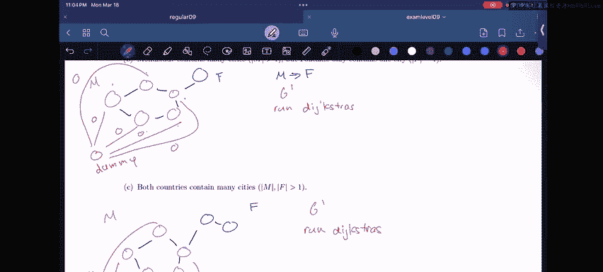
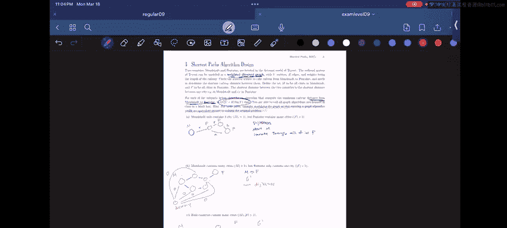

# 60：4 - 算法设计问题解析 🚂

在本节课中，我们将学习如何解决一个算法设计问题。我们将逐步分析问题描述，理解其核心概念，并设计出满足特定时间复杂度要求的算法。通过本教程，你将掌握如何通过修改图结构来简化问题，并运用已知的图算法作为“黑盒”来求解。

## 问题背景

两个国家，莫斯塔德和方丹，位于虚构的世界Tva中。Tva的铁路系统可以建模为一个**加权有向图**，其中包含 **V** 个顶点和 **E** 条边，边的权重代表铁路的长度。旅行者希望找到从莫斯塔德到方丹的最短铁路距离。

定义集合 **M** 为莫斯塔德的所有城市，集合 **F** 为方丹的所有城市。两国之间的最短距离，就是任意城市 **c_M ∈ M** 到任意城市 **c_F ∈ F** 之间的最短距离。

对于后续的每个子问题，需要描述一个算法，在 **O((V + E) log V)** 时间复杂度内计算出从莫斯塔德到方丹的最短铁路距离。你可以将课堂上学到的所有图算法当作“黑盒”来调用。提示：对于某些部分，可以考虑修改图结构，使得运行一个图算法能得到与原问题等价的答案。

## 问题分解与解决

上一节我们介绍了问题的基本设定和目标。接下来，我们将针对三种不同的场景，逐一设计算法。

### 场景一：M有一个城市，F有多个城市

在这种情况下，莫斯塔德只有一个城市，而方丹有多个城市。

以下是解决此场景的步骤：
1.  将莫斯塔德唯一的城市作为起点。
2.  以该城市为源点，运行**迪杰斯特拉算法**。
3.  算法会计算出从该源点到图中所有其他顶点的最短距离。
4.  遍历方丹集合 **F** 中的所有城市，从迪杰斯特拉算法的结果中找出到这些城市的最小距离，该距离即为所求答案。

**算法核心**：`distance = min(Dijkstra(source_city_M)[city] for city in F)`

### 场景二：M有多个城市，F有一个城市

现在，莫斯塔德有多个城市，而方丹只有一个城市。

我们不能像场景一那样简单地指定一个起点。这里需要运用提示中的技巧：**修改图结构**。我们引入一个**虚拟节点 D**。

以下是具体的操作步骤：
1.  创建一个新的虚拟节点 **D**。
2.  从虚拟节点 **D** 向莫斯塔德集合 **M** 中的每一个城市添加一条有向边，并将这些边的权重都设置为 **0**。这样就得到了一个新图 **G‘**。
3.  以虚拟节点 **D** 为源点，运行**迪杰斯特拉算法**。
4.  算法会计算出从 **D** 到图中所有顶点的最短距离。由于从 **D** 到 **M** 中任何城市的距离都是0，因此从 **D** 到方丹唯一城市 **F** 的最短距离，就等于原图中从任意 **M** 城市到 **F** 城市的最短距离。
5.  返回 `distance[D][city_F]` 作为答案。

**算法核心**：通过添加零权重的边，将多源起点问题转化为单源起点问题。

### 场景三：M和F都有多个城市

这是最一般的情况，两个国家都包含多个城市。

解决思路结合了前两个场景的方法。我们仍然需要引入虚拟节点来处理多起点的问题，同时需要处理多终点的问题。

以下是解决此场景的步骤：
1.  创建一个新的虚拟节点 **D**。
2.  从虚拟节点 **D** 向莫斯塔德集合 **M** 中的每一个城市添加一条有向边，并将这些边的权重都设置为 **0**。得到新图 **G‘**。
3.  以虚拟节点 **D** 为源点，运行**迪杰斯特拉算法**。
4.  算法会计算出从 **D** 到图中所有顶点的最短距离。
5.  遍历方丹集合 **F** 中的所有城市，从迪杰斯特拉算法的结果中找出到这些城市的最小距离，即 `min(distance[D][city] for city in F)`，该值即为最终答案。

**算法核心**：`distance = min(Dijkstra(dummy_node_D)[city] for city in F)`

## 总结

本节课中，我们一起学习了如何为一个复杂的图论问题设计算法。我们面对了三种不同的起点和终点配置场景，并通过以下关键策略解决了问题：
1.  在单起点、多终点时，直接运行迪杰斯特拉算法并比较终点距离。
2.  在多起点时，引入**虚拟节点**并添加**权重为0的边**，巧妙地将多源问题转化为单源问题。
3.  综合运用虚拟节点和最小值比较，解决了最通用的多起点、多终点问题。

所有这些算法都满足 **O((V + E) log V)** 的时间复杂度要求，核心在于将迪杰斯特拉算法作为可靠的基础工具进行调用和适配。