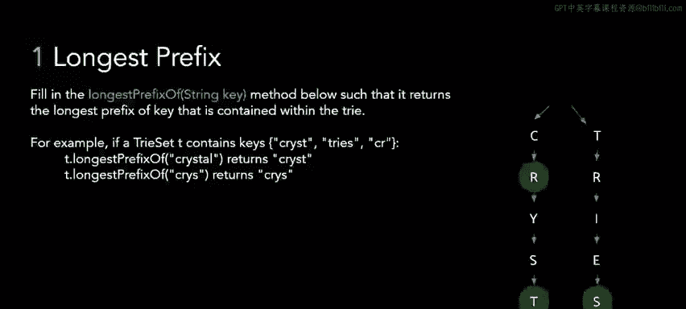
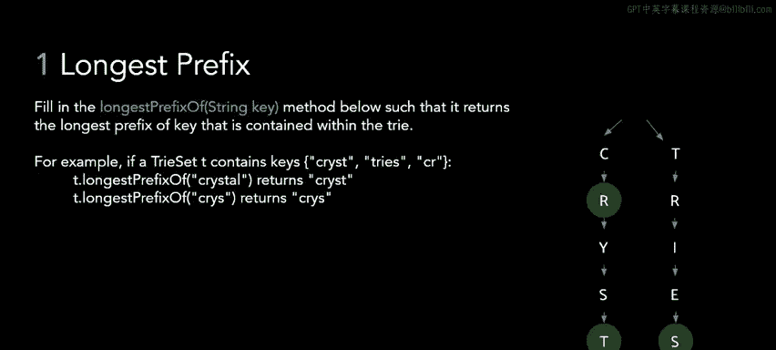
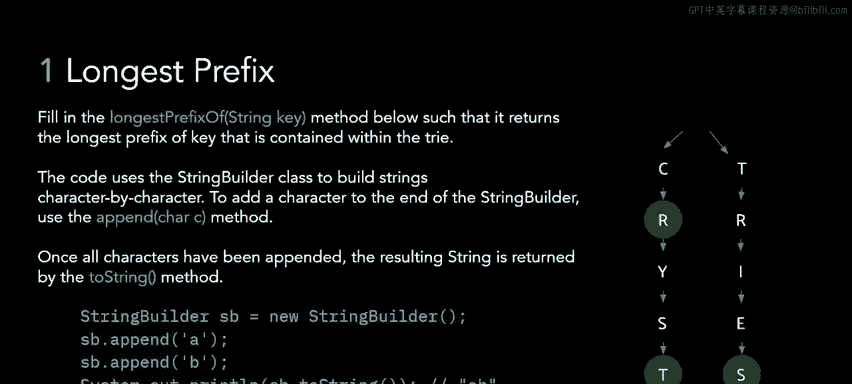
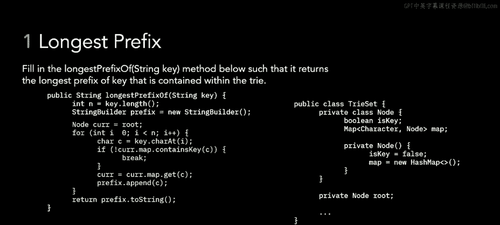
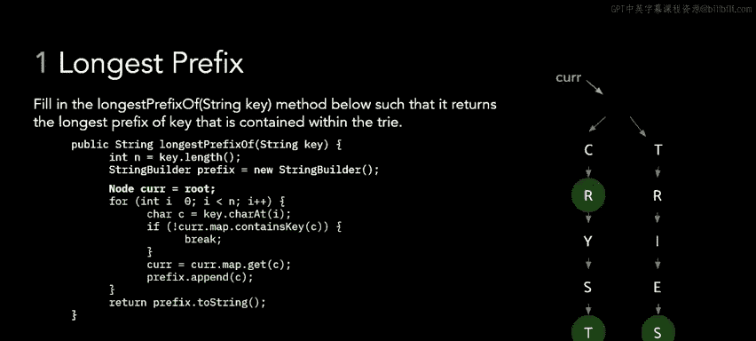
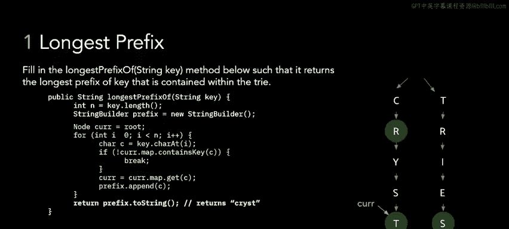

# 62：2 - 实现Trie树的最长前缀方法 🧩

在本节课中，我们将学习如何为Trie树数据结构实现一个名为 `longestPrefixOf` 的方法。该方法的目标是，对于一个给定的输入字符串，返回Trie树中包含的、能作为该字符串前缀的最长字符串。

## 问题概述与示例

问题要求我们在一个Trie类中实现 `longestPrefixOf` 方法。该方法将返回给定字符串在该Trie中的最长前缀。

例如，考虑右侧所示的Trie树，它包含字符串 “cry”、“crystal” 和 “trie”。如果我们尝试获取字符串 “crystal” 的最长前缀，方法应返回 “crys”。如果我们尝试获取字符串 “chris” 的最长前缀，由于Trie中只有 “cry” 与之匹配，方法应返回 “cry”。

## 关于代码框架的说明

本问题的骨架代码使用了一个名为 `StringBuilder` 的类。`StringBuilder` 的功能与Java中的基本字符串类似，但有一个关键区别：它不是使用加号 `+` 来拼接字符串，而是使用 `.append()` 方法。这种差异使得 `StringBuilder` 在频繁向字符串追加内容时效率稍高。

## 算法思路解析

现在是一个好时机，建议您先暂停视频，查看问题描述和骨架代码，并尝试自己思考如何解决这个问题。我将给您一些时间。

好的，希望您已经暂停视频并尝试构思了算法。接下来，我们将一起探讨解决方案。

基本思路是：我们想要遍历键（key）字符串中的所有字母，同时根据每个字符在Trie树中向下遍历。循环将持续进行，直到我们遍历完键的所有字符，或者在Trie中到达一个节点，该节点没有与下一个字符匹配的子节点。在后一种情况下，我们将提前结束循环并返回。在此过程中，我们会记录所有已成功匹配的字符，它们将构成我们的返回值。

## 算法逐步演示

让我们通过一个具体的例子来观察这个算法的执行过程。假设我们有右侧所示的Trie树。

我们尝试获取字符串 “crystal” 的最长前缀，期望返回 “crys”。我们将从根节点开始遍历，当前指针 `curr` 指向根节点。

1.  我们获取给定键字符串的第一个字符，即字母 `c`。
2.  我们检查当前节点的子节点映射（`curr.map`）是否包含这个字符 `c`。因为包含，所以我们不执行 `break` 语句。
3.  我们将当前指针 `curr` 更新为那个子节点（c节点），并将该字符 `c` 追加到输出结果 `StringBuilder` 中。此时输出为 `"c"`。
4.  循环继续，我们获取键中的下一个字母 `r`。
5.  检查c节点是否有一个包含字母 `r` 的子节点。因为存在，我们再次将当前指针前进到r节点，并将 `r` 追加到结果中。现在结果是 `"cr"`。
6.  我们继续这个过程：检查y是否是r节点的子节点（是），前进并追加 `y`，结果变为 `"cry"`。
7.  检查s是否是y节点的子节点（是），前进并追加 `s`，结果变为 `"crys"`。
8.  检查t是否是s节点的子节点（是），前进并追加 `t`，结果变为 `"cryst"`。
9.  当我们处理到 “crystal” 中的字母 `a` 时，会检查当前的t节点是否有一个包含字母 `a` 的子节点。因为不存在，我们将触发 `if` 语句中的 `break`，从而退出循环。
10. 最后，方法返回我们迄今为止构建的前缀，即字符串 `"cryst"`。

## 核心逻辑总结

本节课中，我们一起学习了如何为Trie树实现 `longestPrefixOf` 方法。其核心算法是**同步遍历输入字符串和Trie树**，在每一步检查当前Trie节点是否拥有与输入字符匹配的子节点。如果匹配，则继续向下遍历并记录字符；如果不匹配，则立即停止遍历。最终，所有成功匹配的字符序列就构成了最长前缀。这个方法充分利用了Trie树高效前缀查询的特性。