# 64：判断二分图与DFS错误分析

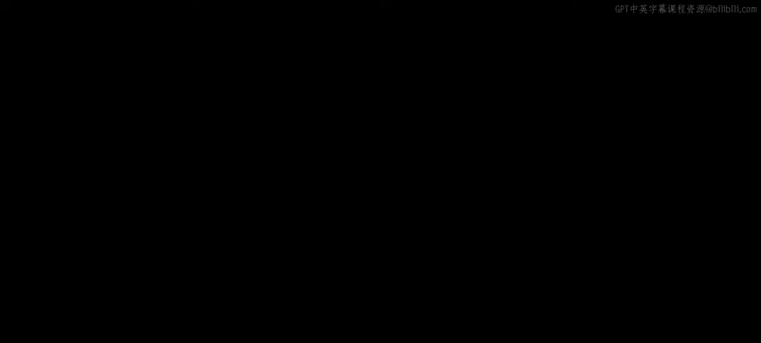

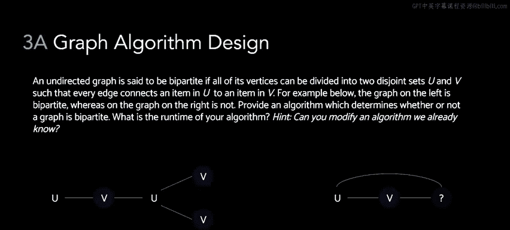

在本节课中，我们将学习如何判断一个图是否为二分图，并分析一个深度优先搜索（DFS）伪代码实现中的错误。

## 什么是二分图？🤔

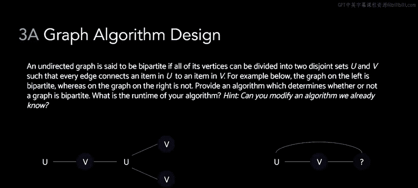

一个图是二分图，当且仅当我们可以将其所有顶点分割成两个不相交的集合 **U** 和 **V**。其中，集合 **U** 中的所有顶点只与集合 **V** 中的顶点相连，反之亦然。

用公式描述，即对于图中的任意一条边 `(u, v)`，都有 `u ∈ U, v ∈ V` 或 `u ∈ V, v ∈ U`。

## 二分图示例

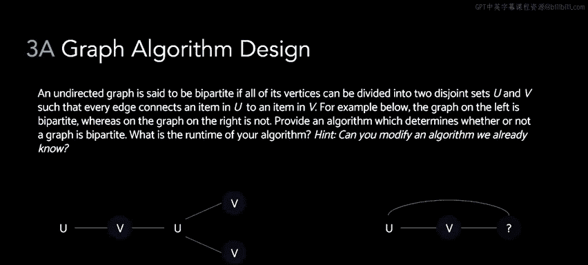

为了更直观地理解，我们来看两个例子。

以下是两个图的示例：

*   **左侧图**：是二分图。因为所有标记为 **U** 的顶点，其邻居都只标记为 **V**；所有标记为 **V** 的顶点，其邻居都只标记为 **U**。
*   **右侧图**：不是二分图。无论将图中标记为问号的顶点分配到集合 **U** 还是 **V**，都会违反规则。如果将其分配到 **U**，则会出现两个 **U** 集合的顶点相邻；如果分配到 **V**，则会出现两个 **V** 集合的顶点相邻。

## 判断二分图的算法

上一节我们介绍了二分图的定义，本节中我们来看看如何用算法来判断一个图是否为二分图。

一种解决方法是使用广度优先搜索（BFS）或深度优先搜索（DFS）的变体。我们需要遍历图中的每一个节点。在遍历过程中，我们将每个节点标记为属于集合 **U** 或集合 **V**。

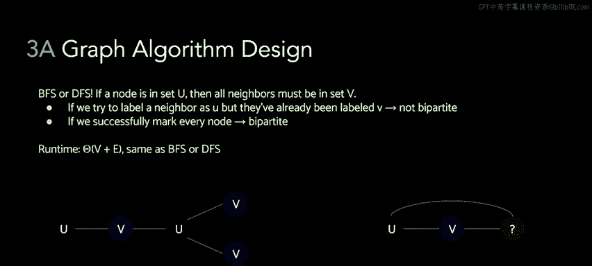

以下是算法的基本步骤：

1.  从任意一个未访问的节点开始遍历，将其标记为集合 **U**。
2.  访问其所有邻居节点，并将这些邻居节点标记为集合 **V**。
3.  接着，从这些邻居节点出发，继续遍历，并将其邻居节点标记为集合 **U**。
4.  如此反复，在遍历过程中不断切换标记的集合。
5.  如果在遍历过程中，发现某个节点的某个邻居节点已经被标记，且标记的集合与该节点相同，则说明图中存在一条边连接了同一集合的两个顶点，该图不是二分图。

例如，在右侧的非二分图上运行此算法：我们会从左边的节点（标记为 **U**）开始，将其邻居（中间节点）标记为 **V**，再将中间节点的邻居（右边节点）标记为 **U**。此时，当我们检查右边节点的邻居（即左边的节点）时，会发现它已被标记为 **U**，从而得出存在两个相邻的 **U** 节点，因此该图不是二分图。

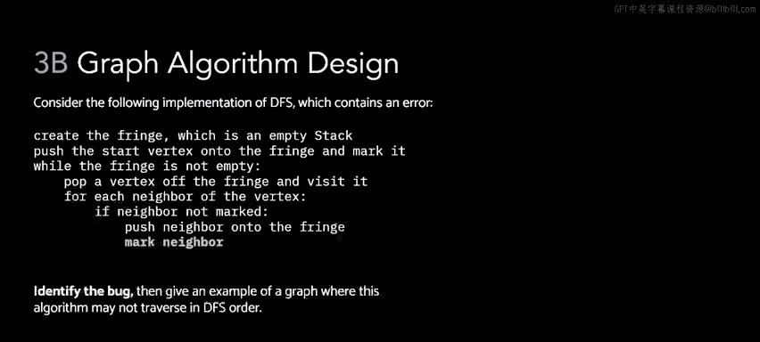

## 分析DFS伪代码中的错误

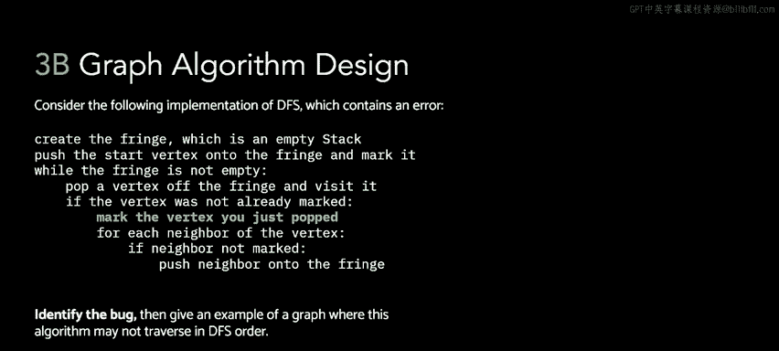

理解了如何判断二分图后，我们来看一个与图遍历相关的具体问题。题目提供了一个深度优先搜索（DFS）的伪代码实现，但这个实现存在一个小错误。

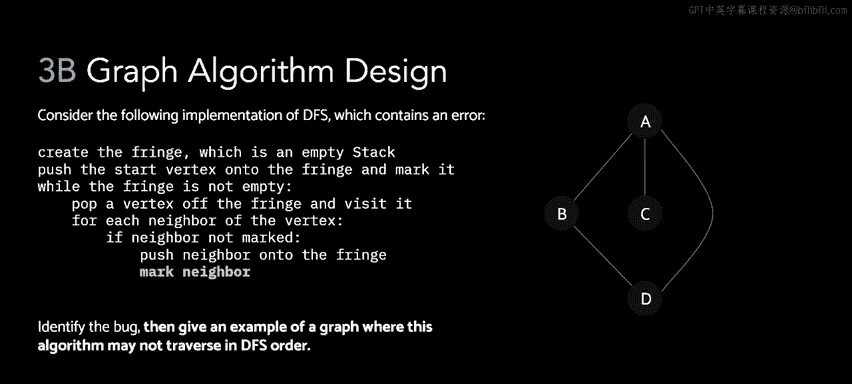

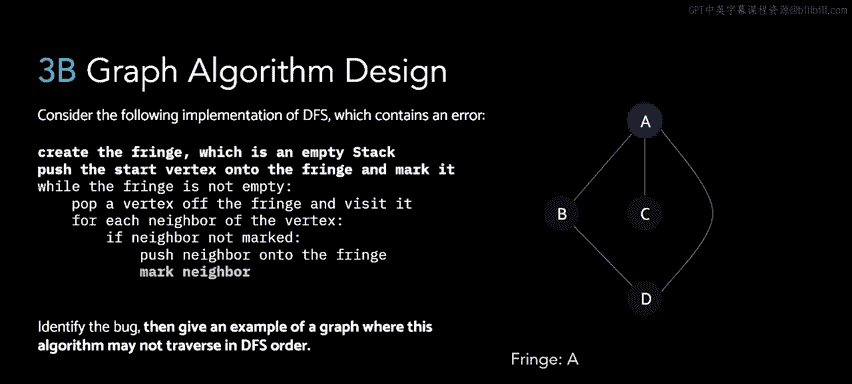

这个伪代码实现与课程讲义中给出的标准实现有一个关键区别：它**在将邻居节点推入栈（fringe）时，就立即将其标记为已访问**，而标准的DFS实现是在**从栈中弹出节点时才将其标记为已访问**。

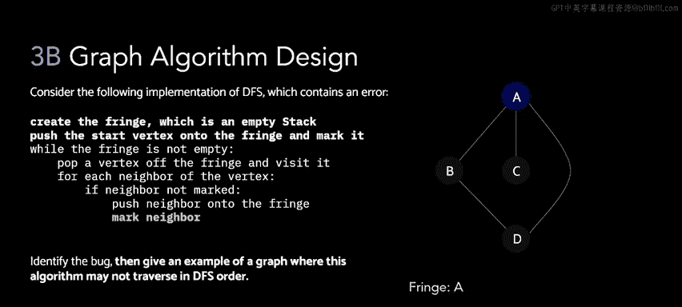

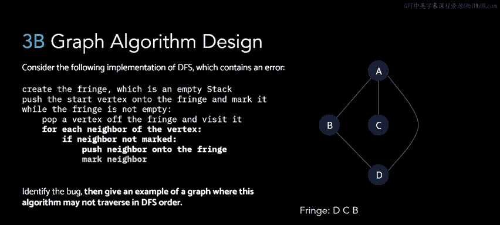

让我们通过一个示例图来看看这个错误会导致什么后果。

假设我们有以下简单图：`A` 连接 `B` 和 `C`，`B` 连接 `D`。

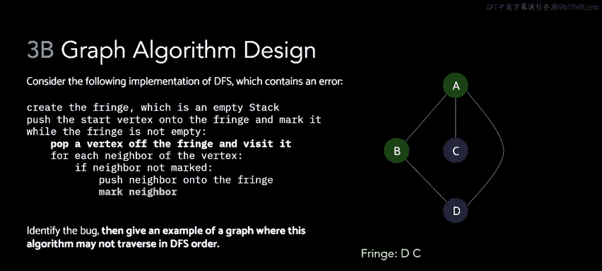

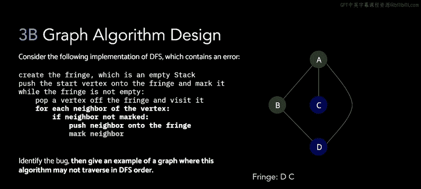

以下是错误实现下的遍历顺序分析：

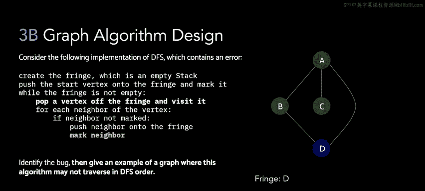

1.  从节点 `A` 开始搜索，将其推入栈。
2.  弹出 `A` 并访问。然后访问 `A` 的所有邻居 `B` 和 `C`。**错误发生在这里**：伪代码在将 `B` 和 `C` 推入栈时，就立即将它们标记为已访问。
3.  弹出栈顶元素 `B` 并访问。接着，尝试访问 `B` 的邻居 `D`。然而，由于 `D` 未被访问，将其推入栈并**立即标记**。
4.  弹出栈顶元素 `C` 并访问。`C` 没有未访问的邻居。
5.  弹出栈顶元素 `D` 并访问。此时 `D` 的邻居 `B` 已被访问。
因此，在此错误实现下，节点的访问顺序是：`A` -> `B` -> `C` -> `D`。

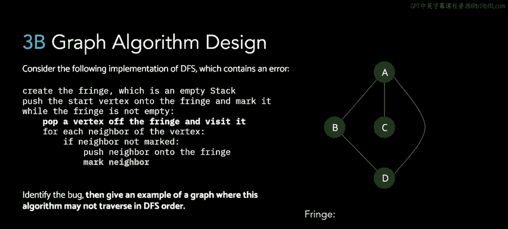

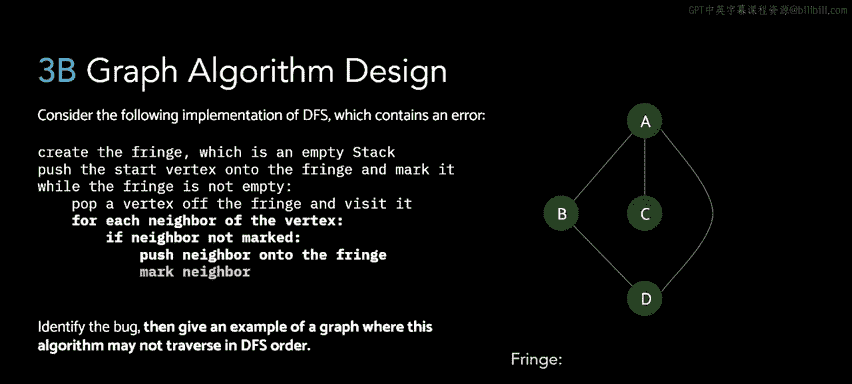

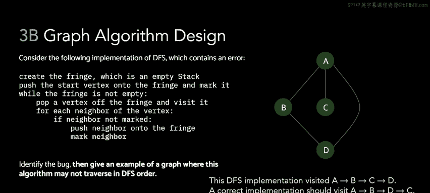

然而，正确的DFS实现应该产生不同的顺序。因为在标准实现中，节点是在弹出时才被标记，所以在访问 `B` 时，`C` 和 `D` 都还未被标记。正确的访问顺序应该是：`A` -> `B` -> `D` -> `C`。

## 总结

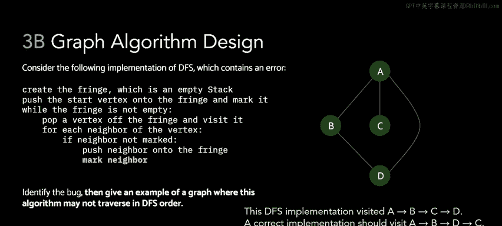

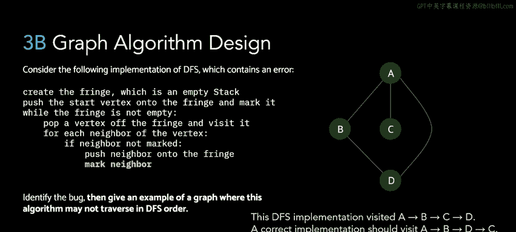

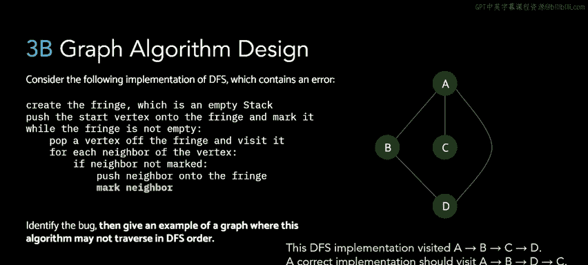

本节课中我们一起学习了两个核心内容：
1.  **判断二分图**：我们学习了二分图的定义，并掌握了一种基于BFS/DFS遍历的算法。该算法通过为节点交替标记两个集合，并在遍历过程中检查是否有相邻节点被标记到同一集合，从而判断图的二分性。
2.  **分析DFS错误**：我们分析了一个DFS伪代码中的常见错误——过早标记节点。通过对比错误实现与标准实现在一个具体图上的遍历顺序，我们理解了“在入栈时标记”与“在出栈时标记”这一区别对深度优先搜索遍历顺序产生的实际影响。