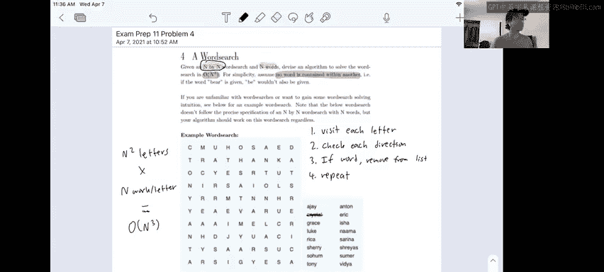

# 66：1 - Spring 2023 考试级问题 2 的运行时分析 🧮


在本节中，我们将详细分析一个特定算法的时间复杂度。我们将逐步拆解代码逻辑，计算其大O表示法，并解释每个步骤对总运行时间的影响。

---

## 概述

我们即将分析的算法旨在解决一个在N×N网格中搜索字符串的问题。其设计时间复杂度为O(N³)。接下来，我们将通过伪代码来验证这一复杂度。

## 算法结构与运行时拆解

上一节我们介绍了算法的基本思路，本节中我们来看看其具体的运行时构成。以下是算法核心步骤的伪代码描述：

```pseudo
对于网格中的每个字符 (共 N² 个):
    对于八个方向中的每一个:
        获取字符串 S
        对 S 运行 LPS（最长前缀搜索）
        从 Trie 树中移除
```

### 外层循环：遍历网格

首先，算法需要遍历整个N×N网格中的每一个字符。网格总共有 **N²** 个字符，因此仅这一部分就构成了一个 **O(N²)** 的循环。

### 中层循环：检查八个方向

对于网格中的每个字符，算法需要检查其八个可能的延伸方向（上、下、左、右及四个对角线方向）。这是一个固定的常数循环，共 **8** 次迭代。因此，中层循环为外层循环增加了常数倍的迭代次数。

### 内层操作分析

现在，我们需要分析在内层循环中执行的三个主要操作各自的时间复杂度。

以下是每个操作的具体分析：

1.  **获取字符串 S**：此操作沿着一个方向回溯网格并收集字母。在最坏情况下，字符串S的长度等于网格的边长 **N**（例如，从一边到另一边）。因此，构建字符串S是一个 **O(N)** 的操作。
2.  **对 S 运行 LPS (最长前缀搜索)**：此操作在Trie树中搜索字符串S的最长前缀。由于需要逐个字符遍历S（长度最多为N）并在Trie树中进行匹配，在最坏情况下（例如，整个S都是某个单词的前缀），需要进行 **N** 次比较。因此，这也是一个 **O(N)** 的操作。
3.  **从 Trie 树中移除**：此操作与LPS搜索类似，需要沿着Trie树的路径遍历字符串S的每个字符以进行删除。其时间复杂度同样为 **O(N)**。

由于这三个操作是顺序执行的，整个内层代码块在最坏情况下的时间复杂度是 **O(N) + O(N) + O(N)**，简化为 **O(N)**。

## 总时间复杂度计算

现在，我们将所有层次的复杂度结合起来计算总运行时间。

*   外层循环：**O(N²)** 次迭代。
*   中层循环：每层外层迭代中，有 **8** 次（常数）迭代。
*   内层操作：每次中层迭代中，执行 **O(N)** 的工作量。

因此，总时间复杂度为：
**O(N²) × 8 × O(N) = 8 × O(N³)**

在大O表示法中，我们忽略常数系数。所以，算法的最终时间复杂度为 **O(N³)**。这与我们最初预期的复杂度约束相符。

## 总结



本节课中我们一起学习了如何系统地分析一个复杂算法的时间复杂度。我们通过将算法分解为嵌套循环和内部操作，逐步计算了每部分的开销，并最终得出其大O表示为 **O(N³)**。关键点在于识别出最耗时的操作（获取字符串、Trie树搜索/删除）其成本与网格维度 **N** 呈线性关系，且这些操作被嵌套在遍历整个网格（N²）的循环中，从而形成了立方级的复杂度。