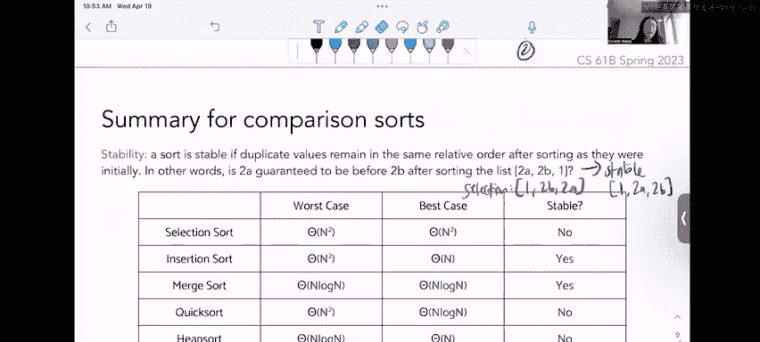

# 13：排序算法综述


在本节课中，我们将学习几种不同的排序算法。排序是计算机科学中一个非常重要且有趣的主题，因为它是一个简单但日常应用广泛的问题，例如如何按字母顺序或数字大小排列列表。计算机需要明确的指令来完成排序，我们将探讨几种不同的排序方法及其时间复杂度。

## 插入排序

上一节我们介绍了排序的重要性，本节中我们来看看第一种算法：插入排序。插入排序通过遍历列表，并在必要时将元素向后交换以维持有序性。

**核心过程**：从数组起始位置开始，将每个元素与其左侧元素比较。如果当前元素小于左侧元素，则交换它们的位置，并继续向左比较，直到该元素处于正确位置。

以下是插入排序的步骤示例，对列表 `[3, 5, 1, 2, 4]` 进行升序排序：
1.  从 `3` 开始，左侧无元素，位置正确。
2.  看 `5`，`5 > 3`，位置正确。
3.  看 `1`，`1 < 5`，交换得到 `[3, 1, 5, 2, 4]`。`1` 继续与左侧 `3` 比较，`1 < 3`，交换得到 `[1, 3, 5, 2, 4]`。
4.  看 `2`，`2 < 5`，交换得到 `[1, 3, 2, 5, 4]`。`2` 继续与左侧 `3` 比较，`2 < 3`，交换得到 `[1, 2, 3, 5, 4]`。
5.  看 `4`，`4 < 5`，交换得到 `[1, 2, 3, 4, 5]`。

**时间复杂度**：
*   **最坏情况**：当列表完全逆序时（如 `[5,4,3,2,1]`），需要进行约 `1+2+...+(n-1)` 次交换，总时间复杂度为 **O(n²)**。
*   **最好情况**：当列表已完全有序时，只需进行一次线性扫描，时间复杂度为 **Θ(n)**。

## 选择排序

了解了插入排序后，我们来看另一种直观的排序方法：选择排序。选择排序在未排序部分中反复查找最小元素，并将其放到已排序部分的末尾。

**核心过程**：在数组的未排序部分中进行线性扫描，找到最小元素，将其与未排序部分的第一个元素交换，然后该位置被视为已排序。

以下是选择排序的步骤示例，对列表 `[3, 5, 1, 2, 4]` 进行升序排序：
1.  扫描整个数组，找到最小值 `1`，与第一个元素 `3` 交换，得到 `[1, 5, 3, 2, 4]`。位置0已排序。
2.  在剩余部分 `[5, 3, 2, 4]` 中找到最小值 `2`，与第二个元素 `5` 交换，得到 `[1, 2, 3, 5, 4]`。位置0-1已排序。
3.  在剩余部分 `[3, 5, 4]` 中找到最小值 `3`，它已在正确位置。
4.  在剩余部分 `[5, 4]` 中找到最小值 `4`，与第四个元素 `5` 交换，得到 `[1, 2, 3, 4, 5]`。
5.  最后剩余 `5`，已在末尾。

**时间复杂度**：无论输入如何，选择排序每次都需要扫描剩余部分寻找最小值。总工作量为 `n + (n-1) + ... + 1`，因此其时间复杂度始终为 **Θ(n²)**。

## 归并排序

前面讨论的插入和选择排序都是原地排序算法。现在我们将学习一种使用递归的算法：归并排序。归并排序采用分治策略，将列表不断二分，对子列表排序后再合并。

**核心过程**：
1.  **分割**：递归地将列表分成两半，直到每个子列表只有一个元素（自然有序）。
2.  **合并**：将两个已排序的子列表像拉链一样合并成一个新的有序列表。比较两个子列表的头部元素，将较小的放入结果列表，并移动该子列表的指针。

以下是归并排序的递归合并示例，对列表 `[3, 5, 1, 2, 4]` 进行排序：
```
分割: [3,5,1,2,4] -> [3,5,1] 和 [2,4]
        [3,5,1] -> [3,5] 和 [1]
        [3,5] -> [3] 和 [5] (基例)
        [2,4] -> [2] 和 [4] (基例)
合并: 合并[3]和[5] -> [3,5]
      合并[3,5]和[1] -> 比较1和3，取1；比较3和(空)，取3,5 -> [1,3,5]
      合并[2]和[4] -> [2,4]
      最后合并[1,3,5]和[2,4] -> [1,2,3,4,5]
```

**时间复杂度**：归并排序总是将列表分成两半，这会产生 **log n** 层递归。在每一层，合并操作需要线性时间 **O(n)**。因此，归并排序的时间复杂度为 **Θ(n log n)**。

## 快速排序

接下来我们看看快速排序，它使用了一种独特的划分过程。快速排序选择一个“基准”元素，通过划分将小于基准的元素放在其左侧，大于基准的放在其右侧，然后对左右子列表递归排序。

**核心过程（Hoare划分法）**：
1.  选择基准（例如第一个元素）。
2.  设置左指针 `L`（指向基准后第一个元素）和右指针 `G`（指向最后一个元素）。
3.  `L` 向右移动，直到找到大于等于基准的元素；`G` 向左移动，直到找到小于等于基准的元素。
4.  交换 `L` 和 `G` 所指的元素，然后指针各向内移动一步。
5.  重复步骤3-4，直到 `L` 和 `G` 指针交错。
6.  将基准与 `G` 指针当前所指元素交换。此时，基准处于其最终正确位置。

以下是Hoare划分法示例，对列表 `[3, 5, 1, 2, 4]` 以 `3` 为基准进行划分：
1.  `L` 指向 `5` (>=3，停)，`G` 指向 `4` (>3，移动) -> 指向 `2` (<=3，停)。交换 `5` 和 `2`，得到 `[3, 2, 1, 5, 4]`。指针移动：`L`指向`1`，`G`指向`1`。
2.  `L` 从 `1` 开始 (<3，移动) -> 指向 `5` (>=3，停)。`G` 在 `1` (<=3，停)。指针已交错。
3.  交换基准 `3` 与 `G` 所指的 `1`，得到 `[1, 2, 3, 5, 4]`。划分完成，`3` 左侧元素都小于它，右侧元素都大于它。
4.  递归地对子列表 `[1,2]` 和 `[5,4]` 进行快速排序。

**时间复杂度**：
*   **平均/最好情况**：如果每次划分都能将列表大致平分，递归深度为 **log n**，每层划分工作量为 **O(n)**，总时间复杂度为 **O(n log n)**。
*   **最坏情况**：如果每次选择的基准都是当前子列表的最小或最大值（例如列表已有序），那么每次划分只能减少一个元素，递归深度为 **n**，总时间复杂度退化为 **O(n²)**。因此，快速排序的性能**依赖于基准的选择**。

## 堆排序

最后，我们学习堆排序。堆排序首先将数组“堆化”成一个最大堆，然后反复将堆顶（最大元素）弹出并放到数组末尾，直到堆为空。

**核心过程**：
1.  **堆化**：从最后一个非叶子节点开始，以**从下到上、从右到左**的顺序，对每个节点执行“下沉”操作，确保其满足最大堆性质（父节点值大于子节点值）。
2.  **排序**：将堆顶元素（最大值）与堆的最后一个元素交换，堆大小减一（最大值已就位）。然后对新的堆顶元素执行“下沉”操作以恢复堆性质。重复此过程。

以下是堆排序示例，对列表 `[3, 5, 1, 2, 4]` 进行排序（视为二叉堆的层序遍历 `[3,5,1,2,4]`）：
1.  **构建最大堆**：
    *   从最后一个非叶子节点开始调整。节点 `2` (值4) 和 `1` (值5) 已满足。
    *   节点 `0` (值3)：子节点 `5` 更大，交换 `3` 和 `5`，得到 `[5,3,1,2,4]`。
    *   节点 `1` (新值3)：子节点 `4` 更大，交换 `3` 和 `4`，得到 `[5,4,1,2,3]`。堆化完成。
2.  **排序**：
    *   交换堆顶 `5` 与末尾 `3`，弹出 `5` 到末尾，堆变为 `[3,4,1,2]`，对 `3` 下沉得到 `[4,3,1,2]`。
    *   交换堆顶 `4` 与末尾 `2`，弹出 `4` 到倒数第二位置，堆变为 `[2,3,1]`，对 `2` 下沉得到 `[3,2,1]`。
    *   重复此过程，最终得到有序数组 `[1,2,3,4,5]`。

**时间复杂度**：构建堆的时间为 **O(n)**。每次弹出堆顶并下沉调整需要 **O(log n)**，共进行 n 次。因此，堆排序的时间复杂度为 **O(n log n)**。

## 排序算法的稳定性与原地性

在比较了各种排序算法后，我们还需要了解两个重要概念：稳定性和原地性。

**稳定性**：如果一个排序算法能保证相等元素的相对顺序在排序后保持不变，则该算法是稳定的。
*   **稳定**：插入排序、归并排序。（插入排序只进行相邻交换；归并排序按顺序合并。）
*   **不稳定**：选择排序、快速排序、堆排序。（它们可能进行非相邻元素的交换，破坏原有顺序。）

**示例**：对 `[2_a, 2_b, 1]` 进行稳定排序，结果应为 `[1, 2_a, 2_b]`。选择排序可能将 `2_b` 与第一个 `2_a` 交换，导致结果为 `[1, 2_b, 2_a]`，破坏了稳定性。

**原地性**：在CS61B中，如果一个排序算法除了输入数组外，使用的额外空间小于对数级别（通常指 **O(log n)**），则被认为是原地排序。
*   **是**：插入排序、选择排序、堆排序、快速排序（通常实现是原地的）。
*   **否**：归并排序（通常需要与输入数组等大的额外空间进行合并）。

---



本节课中我们一起学习了五种经典的比较排序算法：插入排序、选择排序、归并排序、快速排序和堆排序。我们分析了它们的工作原理、时间复杂度的最好与最坏情况，并了解了算法的稳定性与原地性概念。掌握这些算法的特点有助于我们在不同场景下选择合适的排序工具。