# 12：排序算法详解 🧮

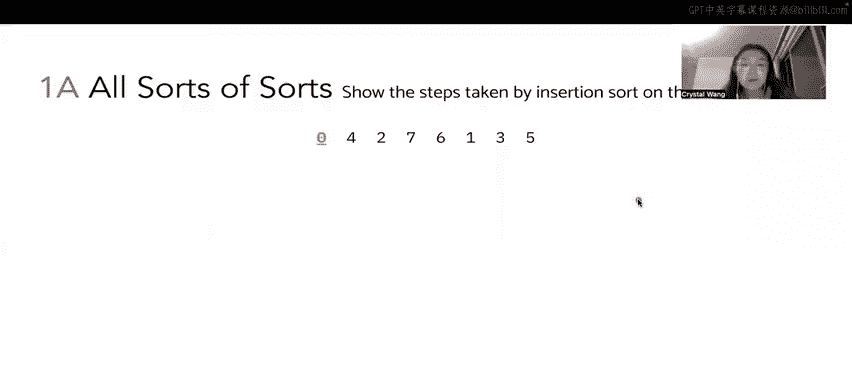


在本节课中，我们将学习四种基础排序算法：插入排序、选择排序、归并排序和堆排序。我们将通过一个具体的整数列表 `[0, 4, 2, 7, 6, 1, 3, 5]` 来逐步演示每种算法的执行过程，理解它们如何将无序列表变为有序。

---


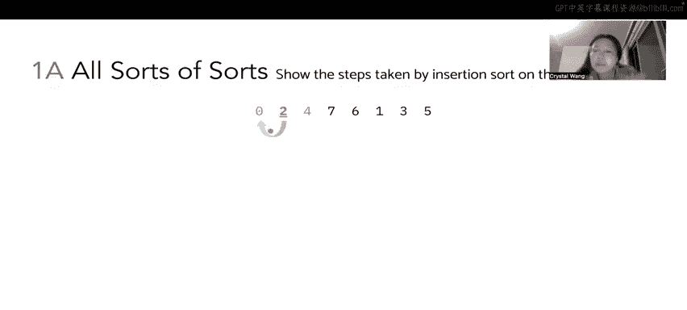


## 插入排序详解 🔄


上一节我们介绍了课程概述，本节中我们来看看第一种算法——插入排序。插入排序的核心思想是：遍历数组，将每个元素“插入”到其左侧已排序部分的正确位置。具体做法是，将当前元素与其左侧邻居比较，如果它更小，则交换位置，并持续向左比较和交换，直到它不小于其左侧邻居或到达数组开头。


以下是插入排序在示例列表 `[0, 4, 2, 7, 6, 1, 3, 5]` 上的逐步执行过程：

1.  从索引1（元素4）开始。4 > 0，无需交换。数组状态：`[0, 4, 2, 7, 6, 1, 3, 5]`。
2.  处理索引2（元素2）。2 < 4，交换2和4。交换后2 > 0，停止交换。数组状态：`[0, 2, 4, 7, 6, 1, 3, 5]`。
3.  处理索引3（元素7）。7 > 4，无需交换。数组状态：`[0, 2, 4, 7, 6, 1, 3, 5]`。
4.  处理索引4（元素6）。6 < 7，交换6和7。交换后6 > 4，停止交换。数组状态：`[0, 2, 4, 6, 7, 1, 3, 5]`。
5.  处理索引5（元素1）。1 < 7，交换。1 < 6，交换。1 < 4，交换。1 < 2，交换。1 > 0，停止交换。数组状态：`[0, 1, 2, 4, 6, 7, 3, 5]`。
6.  处理索引6（元素3）。3 < 7，交换。3 < 6，交换。3 < 4，交换。3 > 2，停止交换。数组状态：`[0, 1, 2, 3, 4, 6, 7, 5]`。
7.  处理索引7（元素5）。5 < 7，交换。5 < 6，交换。5 > 4，停止交换。最终排序数组：`[0, 1, 2, 3, 4, 5, 6, 7]`。


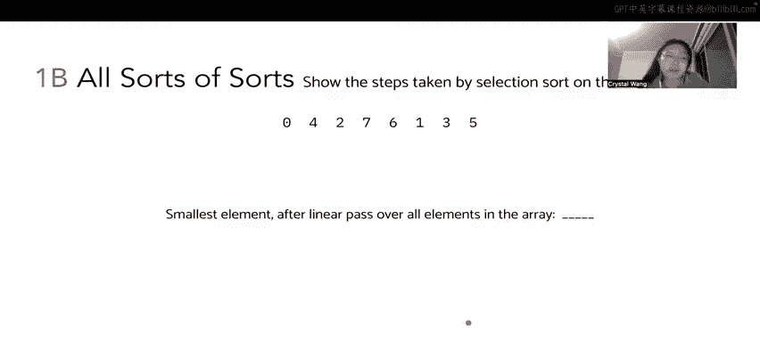

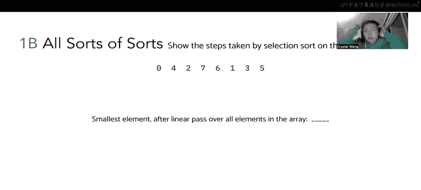


插入排序的伪代码可以描述为：
```python
for i in range(1, len(array)):
    j = i
    while j > 0 and array[j] < array[j-1]:
        swap(array[j], array[j-1])
        j -= 1
```

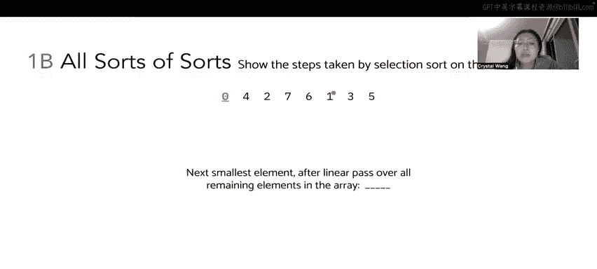


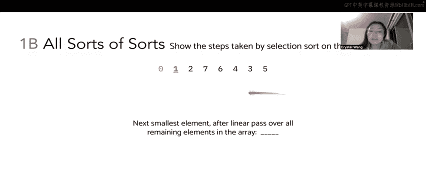

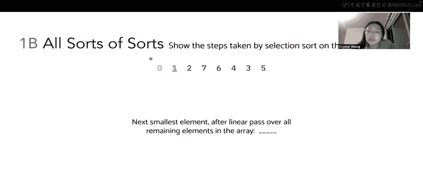

---

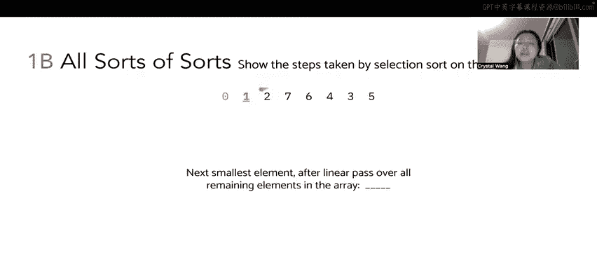


## 选择排序详解 🎯


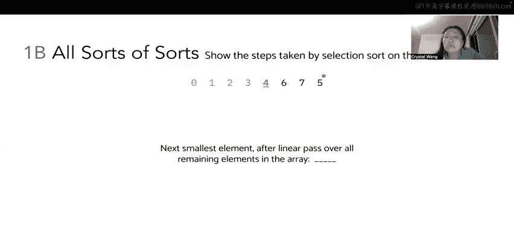

理解了插入排序后，我们来看选择排序。选择排序的思路是：重复地在未排序部分中寻找最小（或最大）元素，并将其放到已排序部分的末尾。具体来说，第一次遍历找到全局最小元素放到位置0，第二次在剩余部分找到最小元素放到位置1，依此类推。


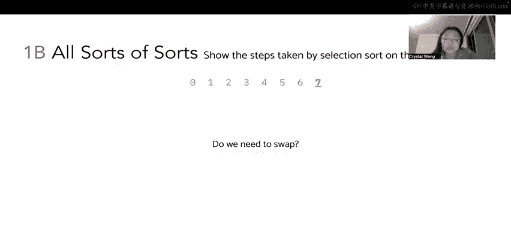

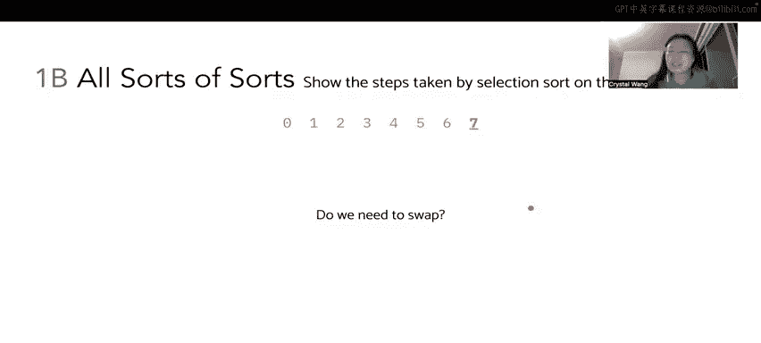

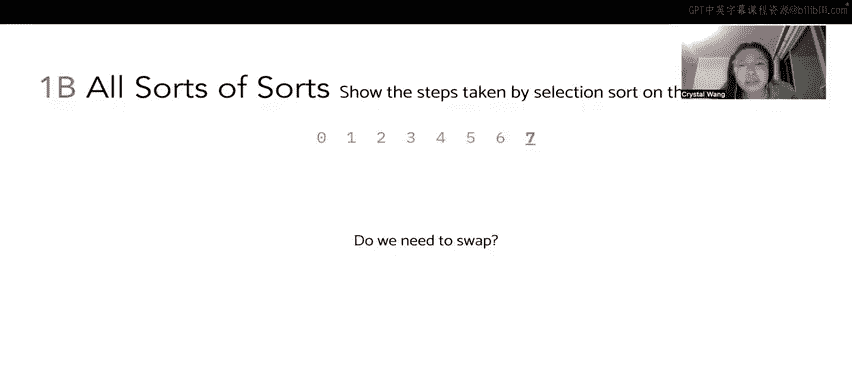

以下是选择排序在同一个列表上的执行步骤：

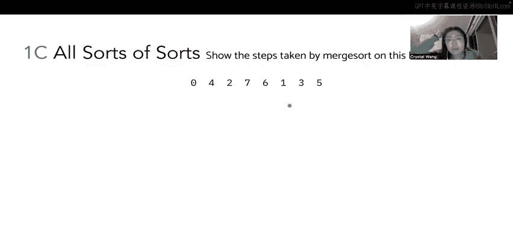


1.  第一次遍历，找到最小元素0，它已在位置0。已排序部分：`[0]`，未排序部分：`[4, 2, 7, 6, 1, 3, 5]`。
2.  在未排序部分 `[4, 2, 7, 6, 1, 3, 5]` 中找到最小元素1，将其与位置1的元素4交换。数组状态：`[0, 1, 2, 7, 6, 4, 3, 5]`。
3.  在剩余未排序部分 `[2, 7, 6, 4, 3, 5]` 中，最小元素2已在位置2。数组状态不变。
4.  在剩余未排序部分 `[7, 6, 4, 3, 5]` 中，找到最小元素3，将其与位置3的元素7交换。数组状态：`[0, 1, 2, 3, 6, 4, 7, 5]`。
5.  在剩余未排序部分 `[6, 4, 7, 5]` 中，找到最小元素4，将其与位置4的元素6交换。数组状态：`[0, 1, 2, 3, 4, 6, 7, 5]`。
6.  在剩余未排序部分 `[6, 7, 5]` 中，找到最小元素5，将其与位置5的元素6交换。数组状态：`[0, 1, 2, 3, 4, 5, 7, 6]`。
7.  在剩余未排序部分 `[7, 6]` 中，找到最小元素6，将其与位置6的元素7交换。得到最终排序数组：`[0, 1, 2, 3, 4, 5, 6, 7]`。

选择排序的伪代码可以描述为：
```python
for i in range(len(array)):
    min_index = i
    for j in range(i+1, len(array)):
        if array[j] < array[min_index]:
            min_index = j
    swap(array[i], array[min_index])
```


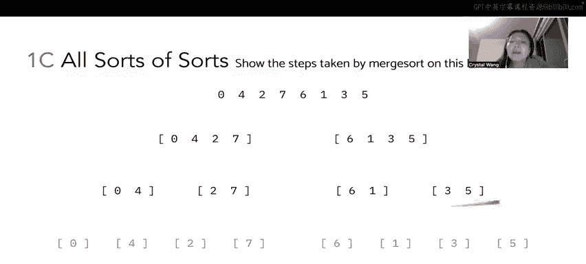

---

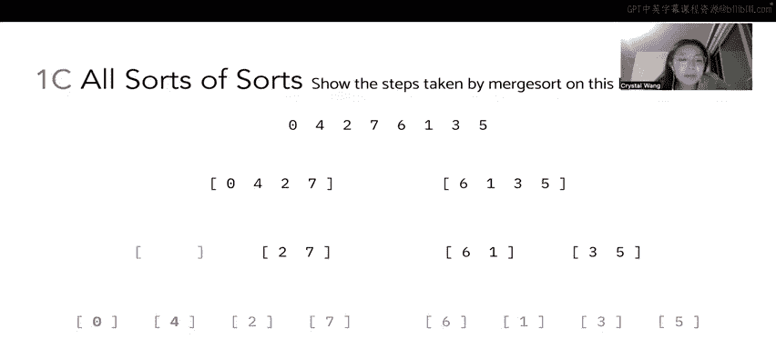


## 归并排序详解 🤝

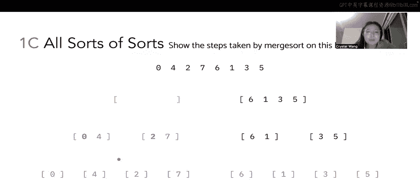

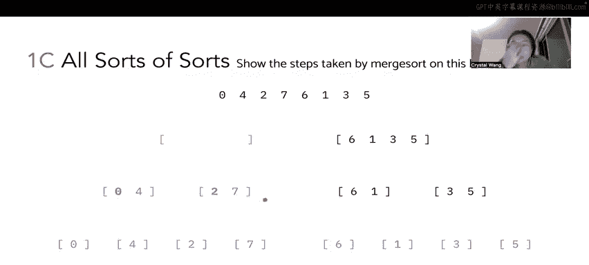


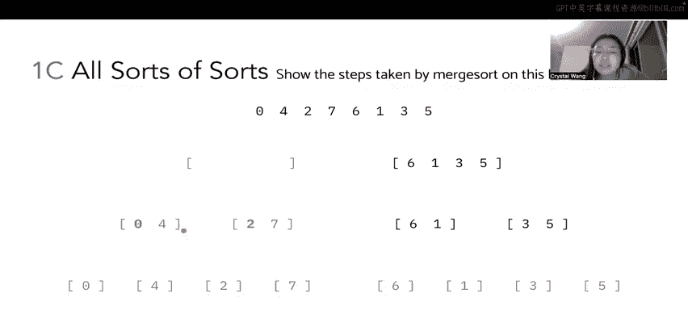

前面介绍的插入和选择排序比较直观，现在我们来探讨更高效的归并排序。归并排序采用“分而治之”的策略：首先递归地将列表拆分成只有一个元素的子列表（自然有序），然后反复将两个有序子列表“合并”成一个新的有序列表，直到整个列表有序。


以下是归并排序在示例列表上的执行过程，我们用树形图表示拆分与合并：


1.  **拆分阶段**：将列表 `[0, 4, 2, 7, 6, 1, 3, 5]` 不断对半拆分。
    *   第一层：`[0,4,2,7]` 和 `[6,1,3,5]`。
    *   第二层：`[0,4]`, `[2,7]`, `[6,1]`, `[3,5]`。
    *   第三层：`[0]`, `[4]`, `[2]`, `[7]`, `[6]`, `[1]`, `[3]`, `[5]`。每个子列表都已有序。


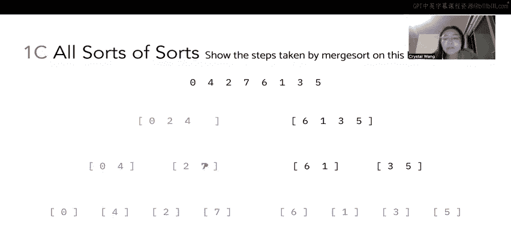

2.  **合并阶段（自底向上）**：
    *   合并 `[0]` 和 `[4]`：比较0和4，得到 `[0,4]`。
    *   合并 `[2]` 和 `[7]`：比较2和7，得到 `[2,7]`。
    *   合并 `[0,4]` 和 `[2,7]`：比较两个子列表的头部（0和2），0小，输出0；再比较4和2，2小，输出2；再比较4和7，4小，输出4；最后输出7。得到 `[0,2,4,7]`。
    *   同理，合并 `[6]` 和 `[1]` 得到 `[1,6]`。
    *   合并 `[3]` 和 `[5]` 得到 `[3,5]`。
    *   合并 `[1,6]` 和 `[3,5]`：比较1和3，输出1；比较6和3，输出3；比较6和5，输出5；输出6。得到 `[1,3,5,6]`。
    *   最后，合并两个大子列表 `[0,2,4,7]` 和 `[1,3,5,6]`：依次比较头部，按顺序输出 `[0,1,2,3,4,5,6,7]`。

归并排序的核心操作是合并两个有序数组，其伪代码如下：
```python
def merge(left, right):
    result = []
    i = j = 0
    while i < len(left) and j < len(right):
        if left[i] <= right[j]:
            result.append(left[i])
            i += 1
        else:
            result.append(right[j])
            j += 1
    result.extend(left[i:])
    result.extend(right[j:])
    return result
```

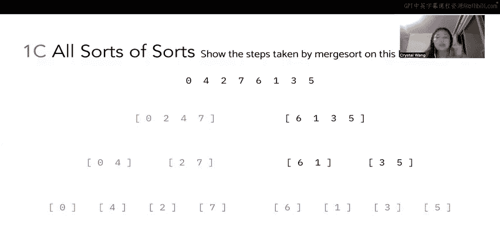


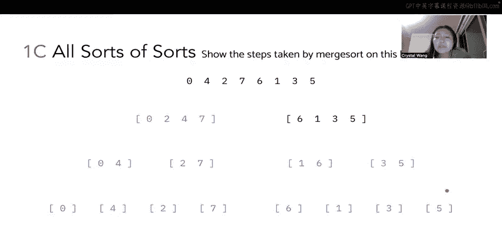

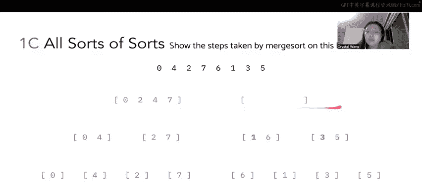

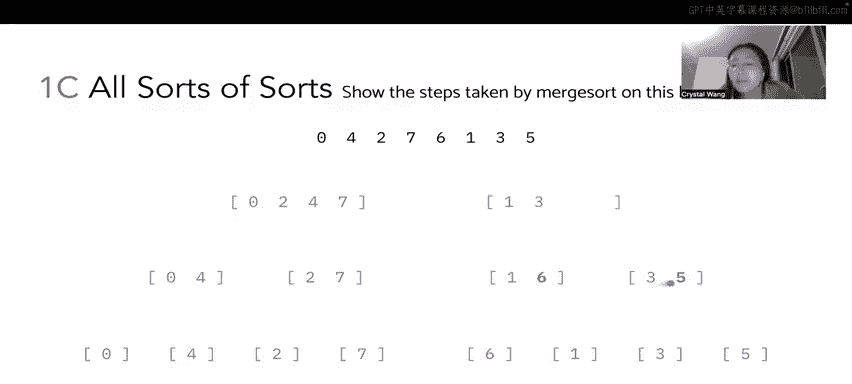

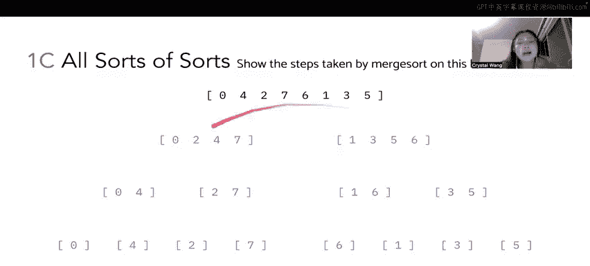


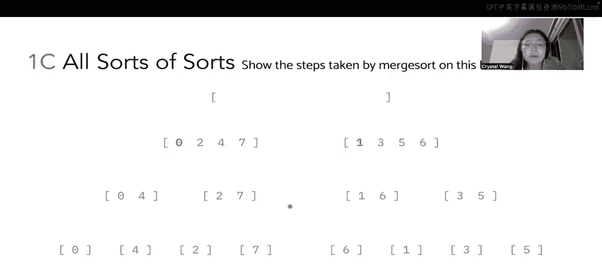


---

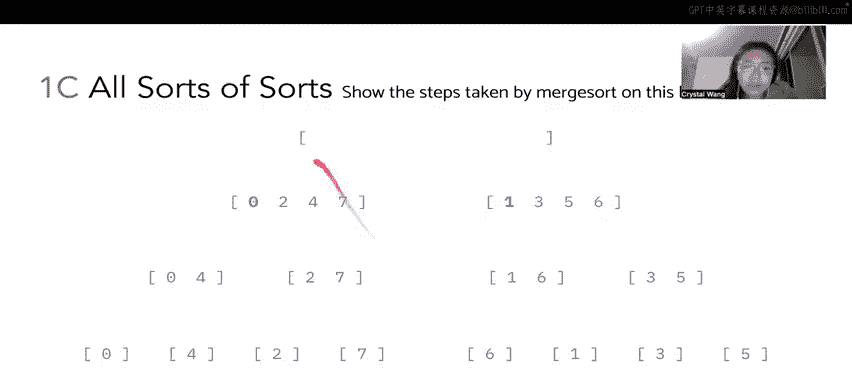


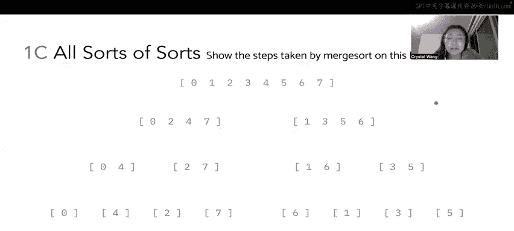


## 堆排序详解 ⛰️


最后，我们学习堆排序。堆排序基于“二叉堆”这种数据结构。它首先将列表构建成一个**最大堆**（每个节点的值都大于或等于其子节点的值），然后重复将堆顶的最大元素与堆的最后一个元素交换并移除，再重新调整堆结构，直到堆为空，从而得到一个升序排列的列表。


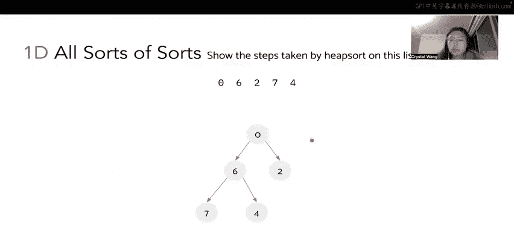


我们使用一个较小的例子 `[0, 6, 2, 7, 4]` 来演示堆排序，以避免过于复杂的堆图。


1.  **构建最大堆**：
    *   初始列表可视作一个完全二叉树：根0，左孩子6，右孩子2；6的左孩子7，右孩子4。
    *   调整过程（从最后一个非叶子节点向上）：
        *   节点6：其子节点7更大，交换6和7。树变为：`[0, 7, 2, 6, 4]`。
        *   根节点0：其子节点7更大，交换0和7。树变为：`[7, 0, 2, 6, 4]`。
        *   节点0（新的左孩子）：其子节点6更大，交换0和6。最终得到最大堆：`[7, 6, 2, 0, 4]`。对应的数组是 `[7, 6, 2, 0, 4]`。


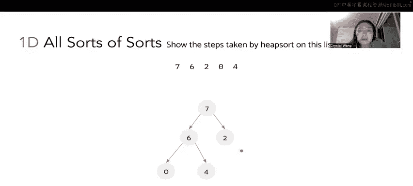

2.  **排序阶段**：
    *   **第一轮**：堆顶7是最大值，与堆尾元素4交换。将7移出堆（放入数组末尾）。数组变为 `[4, 6, 2, 0, 7]`。调整新堆顶4：与较大的孩子6交换。堆恢复为 `[6, 4, 2, 0]`，对应数组 `[6, 4, 2, 0, 7]`。
    *   **第二轮**：堆顶6与当前堆尾0交换。移出6。数组变为 `[0, 4, 2, 6, 7]`。调整堆顶0：与较大的孩子4交换。堆恢复为 `[4, 0, 2]`，对应数组 `[4, 0, 2, 6, 7]`。
    *   **第三轮**：堆顶4与当前堆尾2交换。移出4。数组变为 `[2, 0, 4, 6, 7]`。调整堆顶2：其孩子0更小，无需交换。堆为 `[2, 0]`。
    *   **第四轮**：堆顶2与堆尾0交换。移出2。数组变为 `[0, 2, 4, 6, 7]`。
    *   **第五轮**：堆中只剩0，移出。最终得到排序数组 `[0, 2, 4, 6, 7]`。


堆排序中关键的“下沉”操作伪代码如下（用于调整堆）：
```python
def sink(array, k, end):
    # k: 当前需要下沉的节点索引
    # end: 堆的边界
    while 2*k + 1 <= end: # 如果有左孩子
        j = 2*k + 1 # 左孩子索引
        if j < end and array[j] < array[j+1]: # 如果右孩子存在且更大
            j += 1 # 指向更大的孩子
        if array[k] >= array[j]:
            break
        swap(array[k], array[j])
        k = j
```

---


## 总结 📝


本节课中我们一起学习了四种经典的排序算法。
*   **插入排序**：通过构建左侧有序序列，将新元素插入正确位置。
*   **选择排序**：通过在未排序部分中反复选择最小元素来构建有序序列。
*   **归并排序**：采用分治思想，先拆分再合并，是稳定的高效排序算法。
*   **堆排序**：利用最大堆数据结构，通过反复移除堆顶元素来完成排序。


每种算法都有其独特的思路和适用场景，理解它们的手动执行步骤是掌握其原理的关键。