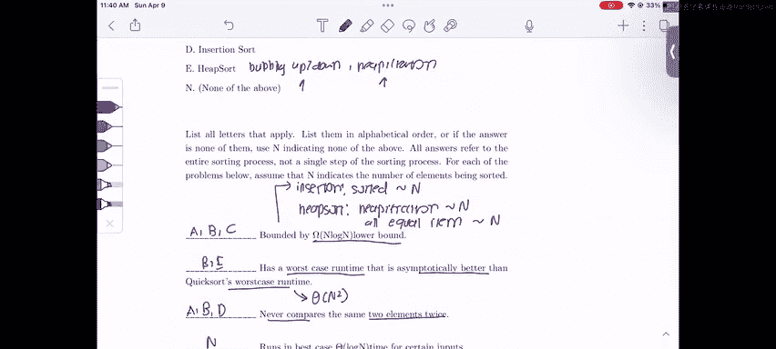

# 75：3 - 排序算法概念复习 🧠


在本节课中，我们将一起复习2023年春季考试第13级的第2题。这是一系列关于排序算法的判断题和概念题。由于在考试中测试排序的代码题较为困难，因此这类概念性或算法设计题是常见的考察形式。我们将逐一解析这些问题，帮助你巩固对排序算法的理解。

## 插入排序的性能分析

上一节我们介绍了本课程的目标，本节中我们来看看第一个具体问题。

题目指出，如果一个系统运行插入排序的速度比预期快得多，我们可以得出什么结论？

根据课堂所学，插入排序在数组已排序或接近排序时运行速度非常快。这是因为插入排序的运行时间为 **θ(n + k)**，其中 **k** 是逆序对的数量。如果数组接近排序，**k** 的值会非常小，算法运行时间基本是线性的。因此，我们可以得出结论：该数组是已排序或接近排序的，这正是插入排序运行如此之快的原因。

## 插入排序的最坏情况输入

接下来，题目要求我们构造一个能引发插入排序最坏情况运行时间的5整数数组。

我们刚刚讨论了插入排序的最佳情况是数组已排序。那么，最坏情况自然与之相反，即数组**反向排序**。这是因为在反向排序的数组中，逆序对的数量达到最大。

以下是5整数最坏情况输入的示例：
```
[5, 4, 3, 2, 1]
```
在这个数组中，每一对数字之间都存在逆序，因此逆序对数量最大，导致插入排序运行最慢。

## 堆排序的稳定性

现在，我们来看一个关于堆排序的简单判断题：堆排序是稳定的吗？

答案是**错误**。稳定性是指排序后相等元素的相对顺序保持不变。例如，如果有两个元素 `20A` 和 `20B`，在最终排序数组中，`20A` 应仍在 `20B` 之前。

然而，堆排序由于堆操作（如上浮或下沉）可能会打乱相等元素的相对顺序。虽然这里不展开完整示例，但你可以通过运行堆排序算法验证，相等的元素在最终数组中的顺序可能发生交换。因此，堆排序不是稳定排序。

一般来说，对于稳定性，你最好记住哪些排序是稳定的，哪些不是，因为在考试中自行证明可能比较困难。

## 选择归并排序而非快速排序的理由

题目要求我们给出一些选择归并排序而非快速排序的理由。

在课堂上我们了解到，快速排序在经验上通常更快，但我们并不总是使用它。以下是几个归并排序可能更优的场景（本题答案不唯一）：

以下是几个可能的原因：
1.  **时间复杂度保证**：归并排序在任何情况下都是 **θ(n log n)**。而快速排序在最坏情况下可能是 **θ(n²)**。如果我们希望保证总是 **n log n** 的时间复杂度，可能会选择归并排序。
2.  **稳定性**：归并排序是稳定的，而快速排序（特别是使用霍尔分区时）不是。
3.  **可并行化**：归并排序可以并行执行，因为它的两个子部分在最后合并前互不干扰。如果计算机有多个核心，可以同时排序两个子部分。
4.  **链表排序**：归并排序常用于链表排序。快速排序的分区操作涉及元素位置的交换，这在链表上很难实现，因为链表节点不能轻易地交换位置。

## 排序算法属性匹配

接下来是一个匹配题。题目给出了五种排序算法（快速排序、归并排序、选择排序、插入排序、堆排序）以及一个“以上都不是”的选项。我们需要将每个属性与匹配的算法字母连线，一个属性可能对应多个算法，也可能没有。

### 属性一：下界为 Ω(n log n)

这个属性意味着该排序算法即使在最好情况下，运行时间的下界也是 **n log n** 或更慢。

匹配的算法是：**A (快速排序)、B (归并排序)、C (选择排序)**。
*   快速排序和归并排序的平均和最坏情况都是 **n log n** 量级。
*   选择排序无论如何都是 **θ(n²)**，比 **n log n** 慢。
*   插入排序在数组已排序时是线性的 (**θ(n)**)，优于 **n log n**。
*   堆排序在堆化（线性时间）且所有元素相等时，可能不需要进行上浮或下沉操作，也可能达到接近线性的性能。

### 属性二：最坏情况运行时间渐进优于快速排序的最坏情况

这个问题分两步：首先确认快速排序的最坏情况是 **θ(n²)**，然后找出哪些排序的最坏情况严格优于它。

各算法最坏情况：
*   快速排序：**θ(n²)** (自身不优于自身)
*   归并排序：**θ(n log n)**
*   选择排序：**θ(n²)**
*   插入排序：**θ(n²)**
*   堆排序：**θ(n log n)**

因此，答案是：**B (归并排序) 和 E (堆排序)**。

### 属性三：永远不会比较同一对元素两次

这个属性比较 tricky，最好逐个算法分析。

以下是分析过程：
1.  **快速排序 (A)**：选择枢轴 `P`，将元素与 `P` 比较以分到左右两侧。一旦一个元素与 `P` 比较过，`P` 在后续递归排序中就不再参与比较。左右两侧的元素只在各自子数组内比较，不会跨子数组重复比较。因此，**快速排序满足条件**。
2.  **归并排序 (B)**：递归排序两半，然后合并。合并时，只比较来自两个不同子数组前端元素的大小，以决定谁先放入结果数组。来自同一子数组的元素在递归过程中已被排序，在合并时不会相互比较。因此，**归并排序也满足条件**。
3.  **选择排序 (C)**：寻找最大值时需要反复遍历未排序部分，并将当前元素与已知最大值比较。在这个过程中，同一个元素可能会被多次与其他元素比较（例如，在寻找最大值的不同轮次中）。因此，**选择排序不满足条件**。
4.  **插入排序 (D)**：将元素向前交换到正确位置时，只与该元素之前的已排序部分进行比较。一旦一个元素被放置好，就不会再与后面的元素进行比较。因此，**插入排序满足条件**。
5.  **堆排序 (E)**：在堆化或元素上浮/下沉过程中，同一对父子节点可能会在调整堆结构的不同阶段被多次比较。因此，**堆排序不满足条件**。

最终答案是：**A (快速排序)、B (归并排序)、D (插入排序)**。

## 排序算法的最佳情况时间复杂度

最后一个部分：哪些排序算法在最好情况下能以 **θ(log n)** 的时间运行？

答案是**以上都不是**。根据课堂证明，任何基于比较的排序算法都不可能优于 **θ(n)**。原因很简单：为了正确排序，算法必须至少查看数组中的每一个元素一次。如果不查看所有元素，就无法知道数组的全部内容，因此不可能有运行时间优于 **θ(n)** 的排序算法。

## 总结

本节课中我们一起学习了多个关于排序算法的核心概念：
1.  分析了**插入排序**在已排序或接近排序数据上的优异性能，及其最坏情况输入。
2.  明确了**堆排序**不是稳定排序。
3.  探讨了在**时间复杂度保证、稳定性、可并行化和链表排序**等场景下，选择**归并排序**而非快速排序的理由。
4.  通过匹配题，深入理解了不同排序算法在**时间复杂度下界、最坏情况性能以及比较行为**上的特性。
5.  重申了基于比较的排序算法其**最好情况时间复杂度不可能优于 θ(n)** 这一重要结论。



希望本次复习能帮助你更好地掌握这些排序算法的核心概念，祝你在61B课程后续学习中顺利！