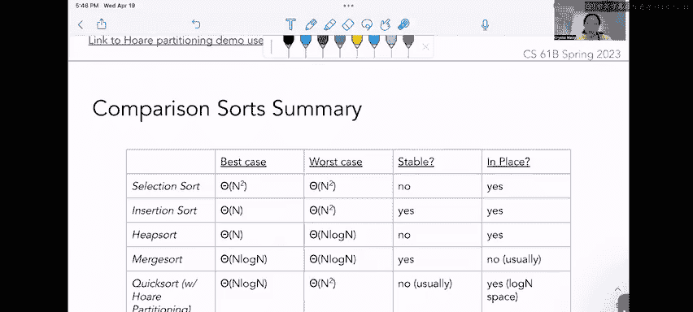

# 76：排序算法进阶

在本节课中，我们将学习两种非比较排序算法：计数排序和基数排序。我们还将回顾快速排序的另一种分区方案。这些内容将帮助我们理解不同排序算法的适用场景和性能特点。

## 基数与计数排序

上一节我们介绍了比较排序，本节中我们来看看非比较排序。首先，我们需要理解“基数”的概念。

基数可以被视为一个数字系统的基础，或者一个可供选择的字母表或数字集合。例如，英文字母表的基数是26，阿拉伯数字的基数是10。基数本质上是一组不同的元素。

基数排序通过使用计数排序，每次按一个数位对列表进行排序。这与我们之前学习的比较排序不同，比较排序直接比较列表中的元素。

为了建立直观理解，我们先看一个计数排序的例子。

假设我们要排序的列表是 `[9, 2, 1, 0, 9]`。

如果我们使用比较排序（例如选择排序），我们会直接比较数组中的元素来找到最小值并交换。

计数排序则不同。它依赖于元素的基数。在这个例子中，我们只有一位数，所以基数（或字母表）是数字0到9，共10个可能的值。

使用计数排序时，我们需要一个计数数组。

计数数组的长度等于基数大小 `R`。这样，计数数组为每一个可能出现的不同元素预留了一个位置。因为我们的数字范围是0-9，所以计数数组长度为10。

接下来，我们遍历待排序数组中的每个数字，统计每个数字出现的次数。

以下是统计过程：
*   看到数字9，在计数数组索引9的位置加1。
*   看到数字2，在索引2的位置加1。
*   看到数字1，在索引1的位置加1。
*   看到数字0，在索引0的位置加1。
*   再次看到数字9，在索引9的位置再加1，变为2。

最终，计数数组 `counts` 表示原始数组中每种元素的数量。从左到右读，它告诉我们有1个0，1个1，1个2，0个3...以及2个9。

得到计数数组后，我们遍历它，并根据每个索引（代表数字）的计数值，将相应数量的该数字放入最终的有序数组中。

排序过程如下：
*   索引0计数值为1，放入一个0。
*   索引1计数值为1，放入一个1。
*   索引2计数值为1，放入一个2。
*   索引3到8计数值为0，不放入任何元素。
*   索引9计数值为2，放入两个9。

这样我们就得到了有序数组 `[0, 1, 2, 9, 9]`。

计数排序能够工作的关键原因在于，我们预先知道数字的可能取值（0-9），并且这些值本身具有固有的顺序（0<1<2<...<9）。计数数组从左到右的遍历自然遵循了这个顺序。

在进入基数排序（本节课的核心）之前，我们先分析一下计数排序的运行时复杂度。

计数排序的运行时取决于两个因素：
1.  我们必须遍历待排序数组中的 `n` 个元素，进行统计。
2.  之后，我们必须遍历长度为 `R`（基数大小）的计数数组，来构建有序数组。

因此，计数排序的运行时复杂度为 **`Θ(n + R)`**。

## 基数排序

现在，我们将计数排序的概念扩展到基数排序。基数排序是计数排序的一种，它通过从最低位到最高位（或相反）逐位排序数字来工作。

**LSD基数排序** 代表“最低有效位优先”。这意味着我们首先只根据数字的最低位（个位）进行排序，然后依次处理更高位。

例如，对于数字列表 `[120, 923, 111, 014, 312]`，在LSD排序的第一轮，我们只关心每个数字的个位（用绿色下划线标出），完全忽略更高位。

LSD基数排序的一般运行时复杂度公式为 **`Θ(w * (n + R))`**。
*   `w` 代表列表中**最长键的宽度**（即最大数字的位数）。在上例中，所有数字都是3位，所以 `w = 3`。
*   `n` 是待排序元素的数量。
*   `R` 是基数大小。对于十进制数字，`R = 10`。

需要指出的是，LSD基数排序本质上是多次计数排序（每次处理一位）。我们使用 `w` 是因为对于像23和155这样的数字，我们会进行“左填充”（将23视为023），使所有数字宽度一致，以便逐位处理。

**MSD基数排序** 代表“最高有效位优先”。它与LSD类似，但是从最高位开始向最低位排序。

同样以列表 `[120, 923, 111, 014, 312]` 为例，在MSD排序的第一轮，我们只关心每个数字的百位（用绿色下划线标出）。

MSD基数排序的运行时复杂度表示为 **`O(w * (n + R))`**，使用大O符号。

这与LSD使用大Θ符号不同。原因是MSD排序**可以提前退出**。

例如，如果一个列表中的数字在最高位上已经各不相同（例如百位分别是1, 2, 3, 5, 6），那么经过第一轮排序后，整个列表的顺序就已经确定，无需再比较后续低位。因此，其实际运行时间可能优于最坏情况 `w * (n + R)`。而LSD排序由于从最低位开始，无法利用这种特性提前退出，必须处理所有 `w` 位。

## 快速排序分区方案回顾

现在让我们转换一下话题，回顾一下快速排序。上周我们讨论了快速排序，但没有深入探讨Hoare分区之外的其他方案。

**三路扫描分区** 是一种简单但不是“原地”的分区方法，不过它是稳定的。它围绕一个枢轴将数组分为三部分：小于枢轴的元素、等于枢轴的元素和大于枢轴的元素。

该技术通常需要创建一个单独的数组。操作步骤如下：
1.  第一遍扫描，收集所有**小于**枢轴的元素。
2.  第二遍扫描，收集所有**等于**枢轴的元素。
3.  第三遍扫描，收集所有**大于**枢轴的元素。

例如，对数组 `[3, 1, 2, 5, 4]` 进行三路扫描分区，选择第一个元素 `3` 作为枢轴。
*   小于3的元素：`[1, 2]`
*   等于3的元素：`[3]`
*   大于3的元素：`[5, 4]`

分区后得到 `[1, 2, 3, 5, 4]`。然后递归地对左子列表 `[1, 2]` 和右子列表 `[5, 4]` 进行快速排序。

**Hoare分区** 是一种不稳定但“原地”的分区算法。它使用两个指针，分别从数组左右两端开始（跳过枢轴），向中间移动。

步骤如下：
1.  左指针 `L` 寻找**不小于**枢轴的元素（即大于或等于）。
2.  右指针 `G` 寻找**不大于**枢轴的元素（即小于或等于）。
3.  当两个指针都停下时（即 `L` 指向不小于枢轴的元素，`G` 指向不大于枢轴的元素），交换它们所指的元素。
4.  指针继续向中间移动，重复步骤1-3，直到两指针**交错**。
5.  当指针交错后，将枢轴与**原右指针**所在位置的元素交换。

以同样的数组 `[3, 1, 2, 5, 4]` 为例，枢轴为3。
*   初始化：`L` 在索引1（元素1），`G` 在索引4（元素4）。
*   `L` 右移：1<3，继续；2<3，继续；5>=3，停在索引3（元素5）。
*   `G` 左移：4>3，继续；5>3，继续；遇到 `L` 指针，交错。
*   指针交错后，交换枢轴(3)与原右指针 `G` 当前位置的元素(2)。结果为 `[2, 1, 3, 5, 4]`。

然后递归地对 `[2, 1]` 和 `[5, 4]` 进行快速排序。

## 排序算法总结

最后一张幻灯片总结了比较排序算法（实际上来自第13次讨论），并添加了“是否原地”一列。

需要快速记住：比较排序与计数排序不同。比较排序直接比较列表中的元素，而计数排序依赖于一个具有固有顺序的预定义基数集。

在本课程中，我们将“原地”定义为算法占用**小于或等于对数级**的额外空间。

以下是常见比较排序的总结：

| 算法 | 最佳情况 | 平均情况 | 最差情况 | 是否原地 | 是否稳定 |
| :--- | :--- | :--- | :--- | :--- | :--- |
| 插入排序 | `Θ(n)` | `Θ(n²)` | `Θ(n²)` | 是 | 是 |
| 选择排序 | `Θ(n²)` | `Θ(n²)` | `Θ(n²)` | 是 | 否 |
| 堆排序 | `Θ(n log n)` | `Θ(n log n)` | `Θ(n log n)` | 是 | 否 |
| 归并排序 | `Θ(n log n)` | `Θ(n log n)` | `Θ(n log n)` | 通常否 | 是 |
| 快速排序 (Hoare) | `Θ(n log n)` | `Θ(n log n)` | `Θ(n²)` | 是 | 否 |

**一个重要结论是：比较排序在平均情况下无法快于 `Θ(n log n)`。**

原因简述是：每次比较最多能排除一半的可能排列。深入研究可能需要学习CS170等后续课程。

这与计数排序形成对比。例如，LSD基数排序的复杂度是 `Θ(w * (n + R))`。如果基数 `R` 和宽度 `w` 都很小，那么基数排序可能达到接近**线性**的时间复杂度 `Θ(n)`。

因此，在某些特定场景下（如待排序键的范围已知且有限），可能会选择计数/基数排序而非比较排序，反之亦然。我们将在练习中进一步讨论其优缺点。

本节课中我们一起学习了基数排序和计数排序的原理与复杂度，回顾了快速排序的两种分区方案，并对比了比较排序与非比较排序的根本区别和性能边界。理解这些概念有助于在实际问题中选择最合适的排序工具。