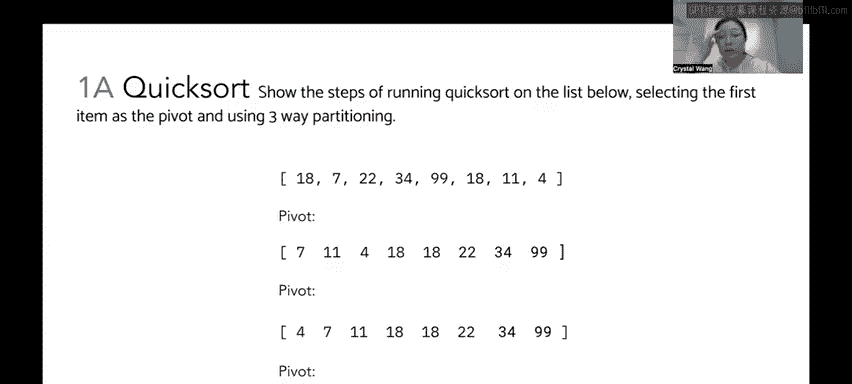
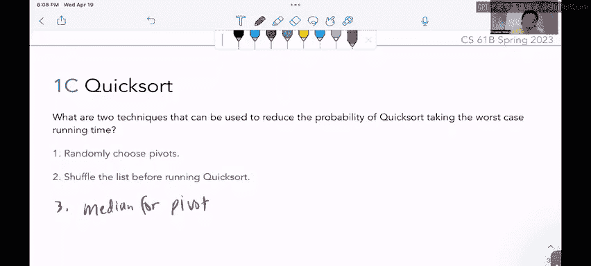

# 77：快速排序与三路分区

在本节课中，我们将学习快速排序算法，特别是其“三路分区”的实现方式。我们将通过一个具体的例子，逐步演示排序过程，并分析算法在不同情况下的时间复杂度。最后，我们将探讨如何优化快速排序以避免最坏情况。

---

## 三路分区快速排序步骤演示

我们被要求展示对以下列表运行快速排序的步骤，选择第一个元素作为基准，并使用三路分区法。请注意，这里使用的是非原地分区方案，这有助于我们更直观地理解过程。

初始列表为：`[18, 7, 11, 4, 22, 18, 34, 99]`。

### 第一轮分区

首先，我们选择第一个元素 `18` 作为基准。三路分区需要扫描列表三次：
1.  第一次扫描，找出所有**小于**基准的元素。
2.  第二次扫描，找出所有**等于**基准的元素。
3.  第三次扫描，找出所有**大于**基准的元素。

以下是具体步骤：
*   **小于基准的元素**：扫描列表，发现 `7`、`11` 和 `4` 小于 `18`。我们将它们放入新数组的前部。
*   **等于基准的元素**：扫描列表，发现基准 `18` 和另一个 `18`。我们将这两个 `18` 放入新数组的中部。
*   **大于基准的元素**：扫描列表，发现 `22`、`34` 和 `99` 大于 `18`。我们将它们放入新数组的后部。

经过第一轮分区后，我们得到以下数组：
`[7, 11, 4, 18, 18, 22, 34, 99]`

此时，基准 `18` 位于中间。所有小于 `18` 的元素在其左侧，所有大于 `18` 的元素在其右侧。然而，左侧的子数组 `[7, 11, 4]` 和右侧的子数组 `[22, 34, 99]` 内部并未排序。

### 递归处理左侧子数组

快速排序是递归算法，接下来我们需要对左侧和右侧的子数组分别进行排序。我们先处理左侧子数组 `[7, 11, 4]`。

选择第一个元素 `7` 作为新的基准，并对这个子数组进行三路分区：
*   **小于基准的元素**：扫描子数组，发现 `4` 小于 `7`。
*   **等于基准的元素**：扫描子数组，发现基准 `7`。
*   **大于基准的元素**：扫描子数组，发现 `11` 大于 `7`。

分区后得到：`[4, 7, 11]`。

现在，基准 `7` 的左侧只有一个元素 `4`，右侧只有一个元素 `11`。由于每个子数组仅包含一个元素，它们自然是有序的，无需进一步递归。至此，左侧子数组排序完成。

### 处理基准与右侧子数组

左侧子数组排序完成后，我们可以将已排序的左侧部分 `[4, 7, 11]`、基准部分 `[18, 18]` 组合起来。

接下来，我们需要递归处理原始列表分区后右侧的子数组 `[22, 34, 99]`。

选择第一个元素 `22` 作为基准，并进行三路分区：
*   **小于基准的元素**：扫描子数组，未发现小于 `22` 的元素。
*   **等于基准的元素**：扫描子数组，发现基准 `22`。
*   **大于基准的元素**：扫描子数组，发现 `34` 和 `99` 大于 `22`。

分区后得到：`[22, 34, 99]`。

基准 `22` 的右侧子数组 `[34, 99]` 包含多于一个元素，需要继续递归排序。

### 递归处理右侧子子数组

对子数组 `[34, 99]` 进行排序。选择第一个元素 `34` 作为基准，并进行三路分区：
*   **小于基准的元素**：扫描子数组，未发现小于 `34` 的元素。
*   **等于基准的元素**：扫描子数组，发现基准 `34`。
*   **大于基准的元素**：扫描子数组，发现 `99` 大于 `34`。

分区后得到：`[34, 99]`。由于每个分区仅包含一个元素，排序完成。

### 最终排序结果

将所有已排序的部分组合起来，得到最终的排序结果：
`[4, 7, 11, 18, 18, 22, 34, 99]`

---

## 霍纳分区法的时间复杂度分析

上一节我们演示了三路分区的过程，本节中我们来看看另一种分区方法——霍纳（Hoare）分区法的时间复杂度。问题是：对于 `n` 个元素，快速排序使用霍纳分区法的最佳和最坏运行时间是多少？给定两个列表 `[4,4,4,4,4]` 和 `[1,2,3,4,5]`（每次选择第一个元素作为基准），哪个列表会带来更好的运行时性能？

首先，回顾快速排序的时间复杂度：
*   **最佳情况**：`O(n log n)`。当每次分区都能将列表大致均匀地分成两部分时达到。
*   **最坏情况**：`O(n^2)`。当每次分区都极不均衡（例如，每次基准都是最小或最大元素）时达到。

现在，我们分析两个列表在霍纳分区下的表现。

### 列表一：全重复值 `[4,4,4,4,4]`

霍纳分区使用左右两个指针（L 和 G）。L 指针寻找**严格小于**基准的元素，G 指针寻找**严格大于**基准的元素。指针向中间移动，遇到不喜欢的元素则停止，然后交换两个指针所指元素，并继续移动。

对于全为 `4` 的列表，选择第一个 `4` 作为基准：
1.  L 指针发现 `4` 不严格小于 `4`，停止。
2.  G 指针发现 `4` 不严格大于 `4`，停止。
3.  交换 L 和 G 所指元素（都是 `4`，无变化）。
4.  指针向内移动一步，重复上述过程，直到指针交叉。
5.  指针交叉后，将基准与 G 指针所指元素交换。

**关键点**：尽管所有值都相等，霍纳分区仍然成功地将基准放置在了中间位置，从而将列表分成了两个大小大致相等的子数组（实际上所有元素都等于基准，但分区逻辑仍将其分开）。这导致了近似 `O(n log n)` 的性能。

### 列表二：已排序列表 `[1,2,3,4,5]`

选择第一个元素 `1` 作为基准：
1.  L 指针指向 `2`，发现 `2` 不严格小于 `1`，立即停止。
2.  G 指针从右端开始移动，发现 `5`、`4`、`3`、`2` 都严格大于 `1`，因此持续左移，直到越过 L 指针，指向 `1`。
3.  指针交叉，将基准（`1`）与 G 指针所指元素（`1`）交换，无变化。

**关键点**：这次分区实际上没有改变任何元素的位置。基准 `1` 被“放置”在正确位置，但右侧子数组包含了剩余的 `n-1` 个元素 `[2,3,4,5]`。下一次递归需要对这 `n-1` 个元素进行同样的操作。这导致了每次递归只减少一个待排序元素，形成了最坏情况的分区，时间复杂度为 `O(n^2)`。

**结论**：
*   列表 `[4,4,4,4,4]` 使用霍纳分区会得到接近最佳情况的运行时 `O(n log n)`。
*   列表 `[1,2,3,4,5]` 使用霍纳分区（并选择首元素为基准）会得到最坏情况的运行时 `O(n^2)`。

---

## 避免最坏情况的技术

从上一节的分析可知，快速排序的最坏情况发生在持续选择“坏”基准（如最小或最大值）时。本节我们探讨两种降低遭遇最坏情况概率的技术。

以下是两种常用技术：

1.  **随机选择基准**
    在每次分区时，不总是选择第一个（或某个固定位置）的元素，而是从当前子数组中随机选择一个元素作为基准。这可以确保即使输入是已排序的，算法也不会总是选中最小或最大值，从而在概率上避免持续的最坏情况分区。

2.  **在排序前洗牌列表**
    在执行快速排序之前，先将输入列表随机打乱。这相当于人为地引入了随机性，使得列表元素的分布变得随机，从而降低了选择到极端值作为基准的可能性。其效果与随机选择基准类似。

**补充说明**：理论上，每次都能选择中位数作为基准可以保证最佳性能 `O(n log n)`。然而，寻找中位数本身（例如通过“快速选择”算法）需要额外的时间开销，并不总是最高效的选择。因此，随机化方法（随机选基准或预先洗牌）在实践中是更简单有效的优化策略。

---

本节课中我们一起学习了快速排序的三路分区实现，并通过实例逐步理解了其排序过程。我们分析了霍纳分区法在最佳情况（`O(n log n)`）和最坏情况（`O(n^2)`）下的表现，并通过具体列表对比了其性能差异。最后，我们探讨了通过随机选择基准或预先洗牌列表来避免快速排序陷入最坏情况的实用技术。理解这些概念对于编写高效可靠的排序代码至关重要。