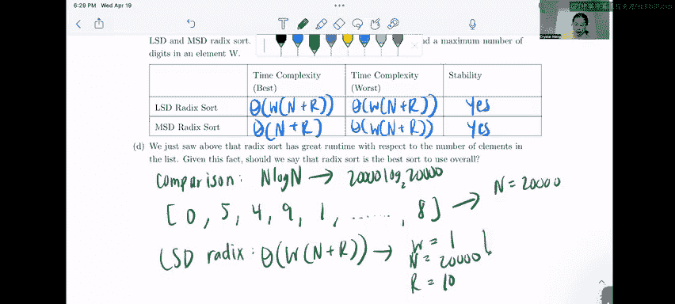

# 78：基数排序详解

在本节课中，我们将学习基数排序，包括其两种主要变体：最低有效位优先基数排序和最高有效位优先基数排序。我们将通过一个具体的例子来演示排序步骤，并分析它们的运行时复杂度、稳定性以及适用场景。

---

## 基数排序：14：问题2A - LSD基数排序步骤

上一节我们介绍了基数排序的基本概念，本节中我们来看看如何具体执行LSD基数排序。

我们被要求使用LSD基数排序对以下列表进行排序，并展示每一轮计数排序后的步骤。原始列表为：`[43092, 3315, 3326, 3395]`。排序过程从个位开始。

**第一轮：基于个位排序**
我们只关注每个数字的个位。个位数字分别是：2, 5, 6, 5。
根据个位数字排序，并保持稳定排序（即个位相同时，保持原列表中的相对顺序）。排序后列表为：
`[43092, 3315, 3395, 3326]`

**第二轮：基于十位排序**
现在，我们关注十位数字。当前列表的十位数字分别是：9, 1, 9, 2。
根据十位数字重新排序，同样保持稳定。排序后列表为：
`[3315, 3326, 43092, 3395]`

**第三轮：基于百位排序**
接下来，我们关注百位数字。当前列表的百位数字分别是：3, 3, 0, 3。
根据百位数字排序，百位相同的数字保持现有顺序。排序后列表为：
`[43092, 3315, 3326, 3395]`

**第四轮：基于千位排序**
然后，我们关注千位数字。当前列表的千位数字分别是：3, 3, 3, 0。
根据千位数字排序。排序后列表为：
`[3315, 3326, 3395, 43092]`

**第五轮：基于万位排序**
最后，我们必须检查万位数字以确保完全排序。当前列表的万位数字分别是：0, 0, 0, 4。
根据万位数字排序。由于LSD基数排序必须检查所有数位，即使列表看起来已排序，我们仍需完成这一轮。最终列表保持不变：
`[3315, 3326, 3395, 43092]`

---

## 基数排序：14：问题2B - MSD基数排序步骤

上一节我们完成了LSD排序，本节中我们来看看MSD基数排序的步骤。

我们使用MSD基数排序对同一个列表排序：`[43092, 3315, 3326, 3395]`。排序过程从最高位（万位）开始。

**第一轮：基于万位排序**
我们只关注每个数字的万位。万位数字分别是：4, 3, 3, 3。
根据万位数字排序。数字43092的万位是4，最大，因此被放置在最后，并设置一个“屏障”表示其位置已最终确定。排序后列表为：
`[3315, 3326, 3395, | 43092]`

**第二轮：基于千位排序（对屏障前数字）**
接下来，我们只对屏障前的数字（3315, 3326, 3395）检查千位。它们的千位数字都是3。
由于千位数字都相同，无法区分顺序，因此这部分的顺序保持不变。
`[3315, 3326, 3395, | 43092]`

**第三轮：基于百位排序（对屏障前数字）**
然后，对屏障前的数字检查百位。它们的百位数字也都是3。
同样，顺序保持不变。
`[3315, 3326, 3395, | 43092]`

**第四轮：基于十位排序（对屏障前数字）**
接着，对屏障前的数字检查十位。十位数字分别是：1, 2, 9。
这些数字是互异的，因此我们可以根据十位数字进行最终排序。由于十位数字已能决定顺序，且我们是从最高位开始排序的，因此排序可以在此停止。最终排序列表为：
`[3315, 3326, 3395, | 43092]`

---

## 基数排序：14：问题2C - 运行时与稳定性分析

前面我们演示了两种排序的过程，本节中我们来分析它们的运行时复杂度和稳定性。

以下是LSD和MSD基数排序的运行时与稳定性总结：

*   **LSD基数排序**
    *   **最坏情况运行时**：`Θ(w * (n + r))`
    *   **最好情况运行时**：`Θ(w * (n + r))`
    *   **是否稳定**：是
*   **MSD基数排序**
    *   **最坏情况运行时**：`O(w * (n + r))`
    *   **最好情况运行时**：`Ω(n + r)`
    *   **是否稳定**：是（在本课程讨论的版本中）

**分析说明：**
*   `n` 是元素数量。
*   `r` 是基数大小（例如，十进制数字为10）。
*   `w` 是元素的最大位数。
*   LSD排序必须遍历所有 `w` 个数位，因此最好和最坏情况相同。
*   MSD排序在最好情况下，如果高位数字互异，可能只需一轮排序即可结束。其一般情况运行时用大O表示。
*   两种排序都可以实现为稳定排序，这对于LSD排序的正确性至关重要。

---

## 基数排序：14：问题2D - 基数排序是最佳选择吗？

上一节我们分析了基数排序高效的运行时，本节中我们探讨它是否总是最佳选择。

虽然基数排序在某些情况下非常快，但它并非总是最佳选择。原因如下：

以下是需要考虑的几个关键点：

1.  **依赖数据特性**：基数排序的高效性依赖于较小的基数 `r` 和位数 `w`。如果 `w` 很大（例如，很长的数字），`w * (n + r)` 的运行时可能超过比较排序的 `O(n log n)`。
2.  **有限的适用数据类型**：基数排序最适合可以分解为数字或固定大小字母表元素的类型（如整数、字符串）。对于复杂的对象（如自定义类），难以直接映射到数字上进行排序。
3.  **与比较排序对比**：比较排序（如归并排序、快速排序）具有 `O(n log n)` 的平均情况运行时，不依赖于数据的特定表示形式，因此更通用。

**结论**：基数排序在数据满足特定条件（位数少、基数小）时性能卓越，但它不是通用的“最佳”排序算法。选择排序算法时应考虑数据的具体特征。

---

本节课中我们一起学习了LSD和MSD基数排序的详细步骤，分析了它们的运行时复杂度与稳定性，并讨论了基数排序的适用场景与局限性。理解这些将帮助你在不同情况下选择合适的排序算法。