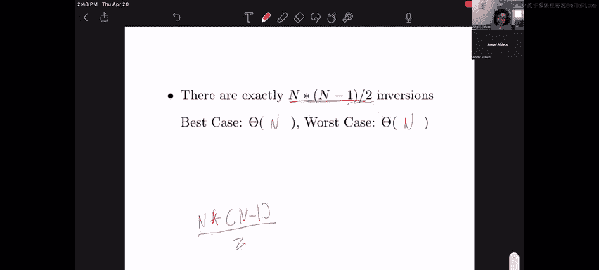

# 81：排序算法运行时间分析 🧮

在本节课中，我们将一起分析几种排序算法在特定场景下的最佳和最坏情况运行时间。我们将重点关注算法修改对渐近时间复杂度的影响。

---

## 排序算法运行时间表 📊

在开始分析具体问题之前，我们先回顾一下常见排序算法的运行时间。下表列出了几种排序算法在最佳和最坏情况下的时间复杂度。

| 排序算法 | 最佳情况 | 最坏情况 |
| :--- | :--- | :--- |
| 插入排序 | **Θ(n)** | **Θ(n²)** |
| 归并排序 | **Θ(n log n)** | **Θ(n log n)** |
| 快速排序 | **Θ(n log n)** | **Θ(n²)** |
| 堆排序 | **Θ(n log n)** | **Θ(n log n)** |

---

## 问题一：排序与运行时间

我们需要对一个包含 n 个唯一数字的数组进行升序排序。请确定以下排序场景的最佳和最坏情况运行时间。

### 第一部分：带插入排序的归并排序

**场景**：在归并排序中，一旦子数组（run）的大小小于或等于 `n/100`，我们就对这些子数组执行插入排序。我们需要填写其最佳和最坏情况的时间复杂度。

为了理解这个场景，我们首先需要知道子数组何时会达到 `n/100` 的大小。归并排序通过递归地将数组对半分割来工作。经过 `x` 层递归后，子数组的大小为 `n / 2^x`。

我们需要找到满足 `n / 2^x ≤ n / 100` 的 `x`。解这个不等式，我们得到 `2^x ≥ 100`。当 `x = 7` 时，`2^7 = 128`，满足条件，因为 `n/128 ≤ n/100`。

这意味着，无论输入规模 `n` 有多大，我们总是只需要进行 7 次分割/合并操作就能使子数组达到目标大小。这是一个**常数**级别的操作，不会影响算法的渐近时间复杂度。

接下来，我们对每个大小为 `n/100` 的子数组执行插入排序。插入排序在单个大小为 `m` 的数组上的时间复杂度是：
*   最佳情况：**Θ(m)**
*   最坏情况：**Θ(m²)**

将 `m = n/100` 代入，我们得到单个子数组的时间复杂度为 **Θ(n)** 和 **Θ(n²)**。注意，除以常数 100 在渐近分析中不影响结果。

我们总共有大约 100 个子数组。对每个子数组执行插入排序的总时间，在渐近意义下，仍然是：
*   最佳情况：**Θ(n)**
*   最坏情况：**Θ(n²)**

因此，对于整个算法：
*   **最佳情况**：**Θ(n)**
*   **最坏情况**：**Θ(n²)**

---

### 第二部分：使用线性时间中位数查找的快速排序

**场景**：在快速排序中，我们使用一个线性时间（`Θ(n)`）的算法来寻找中位数作为枢轴（pivot）。这如何影响运行时间？

首先，回顾标准快速排序。在最佳情况下（每次都能选中中位数），递归树的高度是 **log n**，每一层总共需要进行 **Θ(n)** 的比较和交换操作（分区操作），因此总时间为 **Θ(n log n)**。在最坏情况下（例如数组已排序且总选最小或最大元素作枢轴），递归树退化为链状，总时间为 **Θ(n²)**。

现在，我们修改算法，强制每次分区都使用线性时间算法找到中位数作为枢轴。这意味着在每个递归节点上，我们除了进行 **Θ(n)** 的分区操作外，还需要额外进行 **Θ(n)** 的中位数查找操作。所以每个节点的总工作是 **Θ(2n)**。

在渐近分析中，常数因子可以被忽略，因此每个节点的工作量仍然是 **Θ(n)**。递归树的高度因为总是选中中位数而保持为 **log n**。所以，总的最佳情况运行时间仍然是 **Θ(n log n)**。

关键的变化在于最坏情况。由于我们总是选择中位数，我们永远不可能遇到像“总是选择最小元素”这样的糟糕分区情况。因此，最坏情况下的递归树形状与最佳情况相同（平衡树）。所以，最坏情况的运行时间也变成了 **Θ(n log n)**。

总结：
*   **最佳情况**：**Θ(n log n)**
*   **最坏情况**：**Θ(n log n)**

---

### 第三部分：使用最小堆的堆排序

**场景**：我们实现一个使用最小堆（Min Heap）而非最大堆（Max Heap）的堆排序，同时保持常数空间复杂度。其运行时间是多少？

标准堆排序（使用最大堆）的步骤是：
1.  **堆化（Heapify）**：将无序数组构建成最大堆，耗时 **Θ(n)**。
2.  **排序**：重复将堆顶（最大元素）与堆末尾元素交换，然后对新的堆顶元素进行“下沉（sink）”操作以恢复堆性质，直到堆为空。这个过程需要 `n` 次操作，每次“下沉”耗时 **Θ(log n)**，因此总时间为 **Θ(n log n)**。最终得到一个升序数组。

如果使用最小堆，步骤类似，但每次弹出的是最小元素并放到数组末尾。最终，数组将按**降序**排列。

为了得到升序数组，我们需要在堆排序完成后，对得到的降序数组进行一次反转。反转一个数组需要 **Θ(n)** 的时间。

因此，使用最小堆的堆排序总时间包括：
*   堆化：**Θ(n)**
*   弹出并调整堆：**Θ(n log n)**
*   反转数组：**Θ(n)**

在渐近分析中，我们只保留增长最快的一项。**Θ(n log n)** 比 **Θ(n)** 增长得更快，因此总时间由 **Θ(n log n)** 主导。

所以，无论是最佳还是最坏情况，时间复杂度都是：
*   **最佳情况**：**Θ(n log n)**
*   **最坏情况**：**Θ(n log n)**

---

### 第四部分：自定义最优排序算法

**场景**：我们运行一个自己选择的最优排序算法，针对以下特定情况。

#### D.1 最多有 n 次逆序对（Inversions）

逆序对是指数组中位置错误的元素对。对于这种情况，**插入排序**是一个非常好的选择，因为插入排序的运行时间可以表示为 **Θ(n + k)**，其中 `k` 是数组中逆序对的数量。

*   当 `k` 最多为 `n` 时：
    *   最佳情况（`k` 很小，例如常数）：时间为 **Θ(n + 常数) = Θ(n)**
    *   最坏情况（`k = n`）：时间为 **Θ(n + n) = Θ(n)**
*   因此，在两种情况下，时间复杂度都是 **Θ(n)**。

#### D.2 恰好有一次逆序对

这意味着数组中只有一对元素需要交换。
*   **最佳情况**：这对元素恰好位于数组开头。我们可能只需要常数时间就能发现并纠正它。例如，检查前两个元素，发现它们逆序，交换即可。时间为 **Θ(1)**。
*   **最坏情况**：这对元素位于数组末尾。为了找到这个逆序对，我们可能需要扫描几乎整个数组才能确认其他部分都是有序的，并定位到错误的位置。时间为 **Θ(n)**。

#### D.3 恰好有 `n(n-1)/2` 次逆序对

`n(n-1)/2` 是包含 n 个元素的数组中所能拥有的**最大逆序对数量**。当一个数组完全逆序（即降序排列）时，就会达到这个最大值。

要将一个完全逆序的数组变为升序，最直接的方法之一就是将其反转。反转一个数组需要遍历它的一半元素并进行交换，这是一个 **Θ(n)** 的操作。

*   因此，无论是考虑找到这个最优方法（反转）的过程，还是执行它，在最佳和最坏情况下，时间复杂度都是 **Θ(n)**。

---

## 总结 📝

本节课我们一起分析了多种排序算法变体的运行时间：
1.  **混合排序**：归并排序与插入排序结合，其渐近时间由插入排序部分决定。
2.  **确定性快速排序**：通过线性时间中位数查找确保平衡分区，消除了最坏的 **Θ(n²)** 情况。
3.  **堆排序变体**：改变堆的类型会影响最终顺序，但增加一个线性时间的反转步骤不会改变其 **Θ(n log n)** 的渐近复杂度。
4.  **基于逆序对的自定义排序**：根据逆序对的特定数量，我们可以选择或设计算法来达到从常数时间到线性时间不等的效率，关键在于利用问题的特殊约束。

理解这些场景有助于深化对算法渐近分析核心原则的认识：关注增长最快的项，忽略常数因子和低阶项。