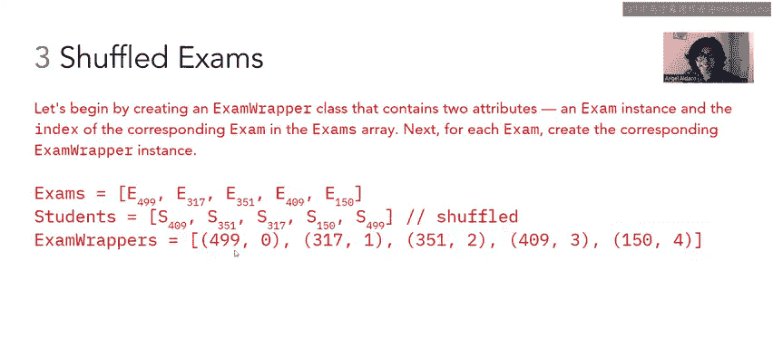
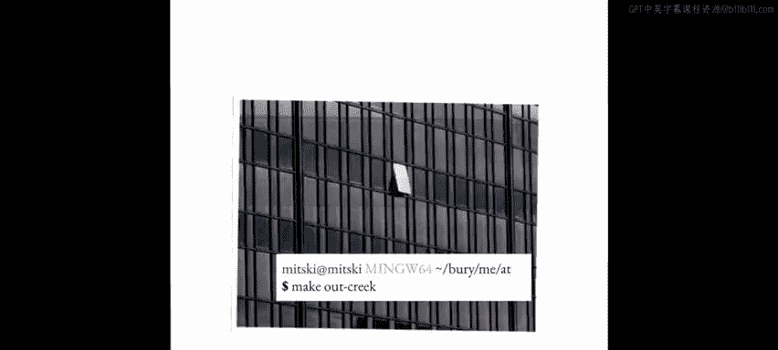

# 83：乱序考试问题


在本节课中，我们将学习如何解决一个关于“乱序考试”的问题。我们将处理两个数组：一个包含考试对象，另一个包含学生对象。每个对象都有一个`SID`（学生ID）属性。最初，两个数组在相同索引位置上的`SID`是匹配的，但后来学生数组被随机打乱了，而考试数组保持不变。我们的目标是在不改变考试数组的前提下，以 **O(N)** 的时间复杂度重新排列学生数组，使其`SID`再次与考试数组匹配。

## 问题背景与目标

上一节我们介绍了问题的基本设定。本节中我们来看看具体的视觉化示例。

假设我们有以下初始状态：
*   考试数组：`[499, 317, 351]`
*   学生数组：`[409, 351, 317]`

我们的目标是重新排列学生数组，使其变为 `[499, 317, 351]`，这样在索引`i`处，考试`SID`就与学生`SID`匹配了。

## 解决方案思路

为了解决这个问题，我们需要一个方法来追踪每个考试对象原本在数组中的位置，以便将正确的学生对象放回对应的位置。以下是解决此问题的核心步骤。

### 步骤一：创建考试包装器

首先，我们创建一个`ExamWrapper`类。这个类有两个属性：
1.  `exam`: 考试对象本身。
2.  `originalIndex`: 该考试对象在原始考试数组中的索引。

**代码示例**：
```java
class ExamWrapper {
    Exam exam;
    int originalIndex;

    ExamWrapper(Exam e, int idx) {
        this.exam = e;
        this.originalIndex = idx;
    }

    // 为了方便比较，可以添加获取SID的方法
    int getSID() {
        return exam.SID;
    }
}
```



然后，我们为考试数组中的每个考试创建一个`ExamWrapper`对象，并将它们存储在一个新数组中。此时，学生数组保持不变。

### 步骤二：对SID进行排序

接下来，我们需要建立学生`SID`与考试包装器`SID`之间的对应关系。一个高效的方法是使用基数排序。

以下是需要执行的操作：
1.  对学生数组中的学生`SID`进行基数排序，使其按升序排列。
2.  对考试包装器数组中的`SID`（通过`getSID()`方法获得）也进行基数排序，使其按相同的升序排列。

由于`SID`是固定长度的十进制整数，基数排序的时间复杂度是 **O(N)**，这满足我们的要求。

排序后，两个数组将基于`SID`一一对应。也就是说，排序后学生数组的第`i`个`SID`，与排序后考试包装器数组的第`i`个`SID`是相同的。

### 步骤三：重新排列学生数组

现在我们已经有了匹配关系，可以开始重新排列原始的学生数组了。我们需要创建一个新的学生数组（`studentsCopy`）来存放正确顺序的学生。

以下是重新排列的逻辑：
对于排序后学生数组中的第`i`个学生：
1.  找到排序后考试包装器数组中与之对应的第`i`个包装器。
2.  从该包装器中获取`originalIndex`（即该考试在原考试数组中的位置）。
3.  将当前学生放入`studentsCopy`数组的`originalIndex`位置。

**公式/逻辑描述**：
`studentsCopy[examWrapper[i].originalIndex] = sortedStudents[i]`

遍历所有学生后，`studentsCopy`数组中的学生`SID`顺序就会与原始考试数组的`SID`顺序完全匹配。

## 总结





本节课中我们一起学习了如何解决“乱序考试”问题。我们通过引入`ExamWrapper`来保存考试的原始索引信息，然后利用 **O(N)** 的基数排序对齐学生和考试的`SID`，最后根据包装器中的索引信息将学生重新排列到正确的位置。这个方法高效地满足了不修改考试数组且在**线性时间复杂度**内完成排序的要求。