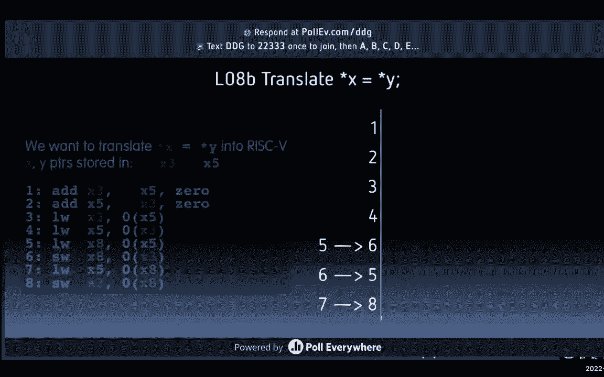

# CS 61C at UC Berkeley  - Fall 2022 - P10：Lecture 8： RISC-V DataTransfer - 这样好__ - BV1s7421T7XR

女士们先生们，欢迎来到，我想是第7课或第8课，丽莎七八，我想是第八课，作为女士们先生们，第八讲，风险五，数据传输。

好啦，所以我们总是从新闻中的计算开始，我发现这个很迷人，这是一个美丽的形象，这个赢得了今年科罗拉多州博览会的一等奖，我通常不看这张幻灯片，但我会读这个，因为今年的天气很好，的，这是从纽约时报。

科罗拉多州博览会的年度艺术比赛，颁发了所有常见类别的奖品，绘画，绗缝雕塑，但是有一个参赛者，西科罗拉多州普韦布洛的杰森艾伦，不是用木刷粘土进入的，他在中途创造了它，一种人工智能程序，可以将文本的行。

这是赢得这样一个奖项的第一批人工智能生成的作品之一，引发了艺术家的强烈反对，他们指责他们本质上是作弊，他说，你看，我告诉过你，我是怎么做到的，我完全披露了，我就是这样做的。

这个类别的名字就像新兴的数字艺术家，就像新兴的数字艺术，就像那种，你知道Photoshop，他们在想的其他事情，使用一些工具，但主要是手工做得很好，这个工具你只需输入单词，就会出现图片，但他一直在努力。

直到他得到一张照片，他喜欢人工智能的有趣之处，如果你观察中途并了解它是如何工作的，它的作用是，它采用了现有艺术家的风格，它从现有的艺术家那里学习风格，然后把它应用到新的东西上。

所以在某种程度上偷了那些风格，他当然必须有创造力，我们不只是创造了自己，如果我们必须对它做些什么，但是在吸收和吸收之间，就像取样一样，对什么，如果我从那里的说唱歌手中取样，然后我做了一个新的东西。

大部分是他们，但以不同的方式聚集在一起，他们到底多少钱，我多少钱，这是一个非常有趣的对话正在发生，为了这种数字的东西，这些大多取材于其他民间风格的人工智能程序，你能用多少，有趣的谈话，真的真的很迷人。

请随意阅读，如果你有兴趣的话，在内存中存储数据，这是你目前在丽莎所知道的，为我开球做得很好，这样我就能开到450码，我们谈到了三个新的指令，现在这些指令与c不同，我们在集合层，我们说的是风险，五个是A。

这是你到目前为止看到的三个，你看到一个广告，顺便说一句，如果你还记得，顺便说一句，这叫做维拉日志，它读起来像C，他们实际上故意把它设计成读起来像C，所以水流从右到左，就像你说的，你说。

R s One是一个指示器，表明您想从哪个寄存器读取，R s 1有这个值，R s 2有另一个寄存器要读取，这些寄存器实际上可能是相同的寄存器，这两个数字可能是你从这两个寄存器读到的相同索引。

你把它塞进我们的目的地，所以源1源2进入由目标寄存器的索引指示的寄存器，这和你说的做减法是一样的，在这里你可以添加一个即时的，所以现在我们可以在那里有一个常数，现在呢，其中一个元的东西被提出来。

你们会在接下来的5节课中看到，我们在讨论这个，你看到的每一条指令，必须以32位存储，那只是生活的事实，你看到浮点，至少周三在诱导浮点方面做得很好，星期三，这意味着如果你在做一个浮动，不是替身。

但是一个浮子，你不知何故在一些新的语义中使用了这三个二位，这种新方式，这些位表示这个特定的浮点数，其中一些意味着无限，其中一些不是数字，但那三个二位意味着什么，现在我们说，最终，我在给你一个小笑话。

两节课之后会发生什么，三堂课，每一个都必须是三个二位，很有趣，所以你在想，哇塞，那很酷，你怎么能有一个比特编码，我都指定了简历，顺便说一句，一个，记住这就像没有免费的午餐，记住我的故事不是免费的午餐。

你得有所收获才能有所收获，还记得我们说过的无符号数吗，可以达到这个巨大的范围，但如果你想否定，你得从积极的方面借点东西给消极的方面，你得向一个人借钱，天下没有免费的午餐，所以现在我在想哇。

我得具体说明一下，想想这个，我只想晚点再给你穿上这个，我想做一个加法，那是很少的一点，也许这不需要太多，相对于减法相对于好，这是一个，我必须具体说明，那个指数是什么，什么是第一，两个是什么，什么是RD。

所有这些都必须以某种方式融入三个两个部分，现在这让你很好地意识到，第一条和第二条都能有多大，会是，不会那么大的，因为我只有3个硬币能装3个看看这里，我必须马上做这件事，所以现在你想得很好。

那个常数能有多大，所以你开始意识到我们实际上会受到很大的限制，我们有多少寄存器，我不确定，至少我相信你明白了，我们还将在我们的直接投资能有多大方面受到限制，所以我只想为思考它埋下种子。

每次你看到指导男孩，其中一些也必须适合32位，我们现在怎么做，三个二位，二对三，二是四十亿。

好似，所以我们会有很多，但想想会很有趣的，所以这是一张很棒的照片。

我想我们以前展示过，但我们会花点时间讨论，在左边我们有我们的处理器，我们的CPU，控制和数据路径控制就像提线木偶，当数据路径是管道时打开什么，我们要看的东西是什么路线。

我们有几堂关于数据路径和数据路径中的控制的课，我们有程序计数器，程序计数器告诉我们，我们目前的计划是什么，我们目前的指示是什么，我们现在就跑，那是我们的柜台，我们会有一套寄存器，可能会有一些限制。

基于我们有多少位，二到我们有的位数，我们要帮助的寄存器数量是多少，你可以使用ALU，算术逻辑单元，做实际机器的东西，做乘法，做加法，做减法，那只是一个简单的alu，我们要建造。

但我们要把所有这些碎片拼凑在一起，这就是令人惊奇的地方，六二和三，我们走在一个高水平上，高级别，低一点低一点低一点，我们实际上建造了一台机器来建造这个Aliu，这将是非常美妙的和注册文件，这是。

这是大脑，这是我们的大脑，有我们的CPU非常非常快，快速访问寄存器，但我们没有太多，我们知道，因为比特数，我们都受限于32位指令，其中至少有三个必须是指数，也不能有那么多，所以我们没有那么多。

如此有限的登记册，在某种程度上，这就像我们的家，记忆是外围的东西，那里比较远，我们的家是CPU，我们是CPU，你想把你的大脑，你是CPU，这是一个非常强大的想法，你不仅可以存储你的数据，你知道。

但是你记忆中的程序，还有，这就是所谓的存储程序概念，计算机体系结构中最大的思想之一，以前不是这样的，但你实际上可以拥有单一记忆的想法，顺便说一下，记忆记忆的抽象观点是什么，记住这一点，我们说过。

丽莎说这只是一个长数组，记住一个长数组是零，这里是所有F的8个F在那里，你就是这么想的，这只是一个长数组，不知何故，它的某些部分是数据所在的地方，它的一部分是我们的程序在内存中的全部。

我们有一些操作将这两个很好地连接在一起，我想从记忆中得到一些东西，写一些读和写这个东西，我想能够读和写我的记忆，所以我要给它发个地址，我可能会传递要写的数据，但如果我只是在读它，这条线上什么也没有。

如果是，那就是垃圾，我不在乎，因为我只是读它，我不在乎，那条线上是什么，我可能会读到它，所以当我读书的时候，我关心下面这个，我正在从，顺便说一下，这很重要，这两个字我希望你非常自我中心，你是CPU。

先想想你自己，所以你要用的单词是从记忆中加载的，所以我在这里，我在右边，在这个屏幕的左边，我望向远方的记忆，我要加载和存储，这就是为什么我们不做另一种方式，因为否则我就会加载到内存中，禁止上传到CPU。

记忆又没有什么作用，记忆是被动的，我在大脑中，我从管子中装载或储存管子，所以那种动作，所以一定要记住这三个，让我们试着从，两个小东西会帮助你的大脑，你不会糊涂的，你不会记得你是CPU。

东西是一个被动装置，有一些有趣的IO，看看i o没有连接到CPU，I O穿过记忆，那不是很有趣吗？我们怎么画，稍后我们将展示基于内存的，我再一次，内存大得多，但是要慢得多，也便宜得多。

好啦，好啦，我们应该好好谈谈，我想丽莎展示了一种观点，对此的看法，我想对这个数据有另一个看法，通常是三个二位，这是一个三位一体的系统，八位块或字节，我们谈过了，在内存地址真正以字节为单位之前。

不是用语言，所以当你访问内存时，顺便说一下，这个词被称为字节寻址内存，您将通过指定字节来访问它，不是这个词，也就是其中的四个，但被咬了，总是关于咬人，你问的是，字地址相距四字节。

单词address与最右边字节的地址相同，最低有效字节，我叫小印第安人，我给你看这个，这张照片和丽莎展示的照片不一样，因为丽莎在谈论它，如果我拍这张照片，请注意这里，我们走吧，让我们只计算字节零一二三。

从右边开始看这个4 5 6 7 8 9 10 11，这是一张有效的图片，如果我这样画的话，或者是这样画的，同一张照片，我只是把它翻过来，当我在数组中存储字符时，像卡尔C字符C字符一个字符L零。

如果我把它放在这里，数组中的第一个是C，第一个，还是零，第一个C右牛，C中的第一个右，零的数组是C，那不是很好吗？如果上面写着，如果它的读数是零，但这里发生了什么，如果我这样写，嗯，C在这里。

然后是A和L，所以这就像，当我看角色的时候，意思是事情倒退了，右C是第一个字符，下面是字符串引号，C l未引用，那是一个c和a，一个l和一个零，记住有一个免费的零，你得到所有的字符串。

所以对于这张图片中的一个视频，右边的独联体，所以这是第0个字符，你知道的，零的数组是C右，来吧卡尔C是第一个，所以我把c a和l，所以是倒过来的，所以丽莎在谈论c阅读和写作，幻灯片在这里，我想耶。

太感谢你了，如果你需要一个滑梯，你需要一个滑梯甲板，请举手，然后我们会给你完美的，好啦，但请继续倾听，当你举手的时候继续听，所以如果你说的是，她说的是C，她说的是读写c数组，所以她是这样画的。

用左边最小的一口，你可以读到它是c a l 0，在这种情况下做她正在做的事情更有意义，但如果我加载，让我来这是我的最爱，这是我最喜欢的一段数据，零x，那只是一个，那只是个数字，如果红色从左到右。

就像在屏幕上一样，最低的一口是多少，谁知道谁知道这一口最低，就在这里就在这里，低，最小咬合力，好啦，那不是很好吗，如果你这样画的话，或者这样红色，就像你阵列里的死牛肉，所以我们在右边画一个零。

这样ES在右边，DE在左边，现在读起来是这样的，如果我想看一个浮点数，我不必不停地翻转每一口，移动它们，浮点数有正弦，记住正弦，指数，右边的尾数，你只想看看这些零件，让他们看看寄存器。

就像他们在记忆中的样子，所以从现在开始，我们将在一个单词中有零字节，在右边，就像这样，没什么不同，你可以用不同的方法画，当你画人物的时候，画路有意义，丽莎用左边的零给他们看，当你画像，从字面上看。

查看内存并对其进行比特，这更有道理，但他们和你一样，你应该可以来来回回，只是更容易看到死牛肉，在记忆中阅读，死牛肉，就是这样。

所以做什么，我要说的是死牛肉，这是我的，这是我的登记簿，这是我的记忆，应该是一样的，关于这个的问题。

所以让我们花点时间来谈谈大印度和小埃尼，这是一个非常有趣的谈话，谁知道格列佛游记，乔纳森·斯威夫特写了一本关于我们所有人旅行的精彩书，你应该知道，有一部杰克布莱克的电影，我觉得最近，他是个巨人。

在小人国的土地上，在这片土地上，乔纳森·斯威夫特创造的奇妙土地，人们为煮鸡蛋的哪一边而争吵，你开门吗，是煮鸡蛋，有小的一面和大的一面，或者小的一面和大的一面，小印第安人想在小端打开。

大结局是想在大结局上打开，我们只是为了一些琐碎的小事而争吵，但这就是它的来源，但现在你意识到一件有趣的事情，哦哦，顺便说一句，我们只是在讨论如何在一个单词中存储字节，它从来不是关于字节中的位。

字节中的位总是相同的，右边最小的，在一口中在一口中，右边最小的，左边最大的，但如果我们讨论的是如何将字节存储到内存中，这里是我在两边画地址零加这个三，记住我们要开始了，但现在我们说的是一些。

地址零到地址三，这里是地址0和地址3，所以在大印度对小印度，会发生什么，我正在加载，以下是我想储存的东西，我要储存在这里，数字十二十五，是零乘以三，零乘二一，零零或四，由一和一在零，有一个四和一个一。

如果它是一个小印度，它真的需要这里的咬，这里有点，数字，好啦，这里是零，一一零一，好啦，所以这是在一个字节内它们是一致的，但如果我有这个东西，十二十五看这个，我该怎么写，这是字面上的十二五无符号，嘿。

伙计们写十个二十五个没有签名，就是那个大家伙，如果你住在小，幸运的是，我们的系统确实有风险，五是一个小印度，然后这个10点25分看起来和那个一模一样，零四一零四一，原来如此，你在这个世界上。

留在这个世界上，它在寄存器里是什么样子的，它看起来像什么，你平时写字的方式，它就是记忆中的样子，如果你把0写在右边，3写在左边，大印第安人被翻转了，大印度人会说，哇塞，嗯，我们要写的小咬，大的。

我们将在单词的大侧写最小的字节，这就是为什么它是一个重要的开始，就像你从这个词从左到右，是大的一面，所以那个，四个零和零，我们在这个世界上，所以让我们从现在开始关注这个世界，即使你现在知道什么是大印度。

我们在一个小，只是让它容易，是的问题，再告诉我一次你的名字，我去耶，所以我觉得你没有一个标准化的超过，我希望看到它标准化，事实上，当你要采取，还记得我们讨论过移植代码吗，你的问题我还没问完。

但我要跳到答案，我喜欢这个主意，为什么我们不能把这个标准化，不同的架构师做不同的事情有不同的原因，所以当你取一段C代码时，你会看到什么，你想把它建在一台新机器上，全新机器，我买了台新机器，是吗。

可能是苹果的m系列，可能是手臂，可能是树莓派，不管是什么新系统，有些人做一些新的硬件，你要用C或者UNIX，你要运行一个叫配置的程序，谁运行过配置这个，你建过软件吗，任何人运行配置，没有人跑的身影。

我应该向您展示运行configure时会发生什么，它穿过来说，你支持吗，我知道，你支持一个几乎大的印度人吗，它会告诉你那是什么感觉，它问了系统的这些问题，系统必须声明它使用的是什么，你支持浮点标准吗。

现在每个人的答案都是肯定的，但在他们说不之前，对他们中的一些人来说，那么在你的C中，太难看了，你得说好，如果大印第安人的定义，如果大印度人，然后做这件事，有点，做，就像这个可笑的东西。

但是您可以询问一个系统，并获得非常可移植的代码，但我百分之百同意UJ的观点，应该有个标准，没有是，这里的问题，告诉我阿拉尼亚，走呀，走呀，那份工作，但让我们回到这张照片，我们再去看看卡尔，阵列牛。

那数组的第一口是什么，那是什么，cal c数组第一部分中的字符是什么，那么你会把它写在哪里呢，某个数组中的第0个拜登是什么，就在右边，右下角会有一个C，一个怎么样，就在它旁边，L怎么样，它会在两个。

零会在三个，所以如果你这样看，我喜欢看记忆的方式，哪个是这个，这就像，它是如何生活在我的大脑中的，我所有的弦都在一个词内向后，所以我有一个三个字符的字符串，它们都是倒着读的，所以露西说，我们把它翻过来。

所以说，我们可以正常的读弦，但当我说到装载浮子时，假设我把一个浮子装进去，我想用这个花车，在哪里，招牌在哪儿？有点在我的在我的在，我左边的彩车，应该是这样的，当我把它写在纸上的时候，左边是同一条路。

所以我宁愿看我的字节，那样从右到左。

如果有帮助的话，让我让我让我继续前进，但也许我们可以问这个问题，我想度过有趣的一天，我做了一些，我把幻灯片拼好了，原来那个大大小小的印第安人，现在你知道了，这是这门精彩课程的一个元点，你看到61。

看到你生活中的事情，你开始拿61 C，并适用于你的生活，现在你已经学会了，你要说，在那里等着，世界上人们做名字的方式要么是大的，要么是小的印度人，那不是很迷人吗？所以说，例如，我的姓，我姓加西亚。

我叫苏丹，如果我是小印度人，我要先说我的小事情，谁是我丹，还有我的姓，我的姓第二，但在中国，他们认为最重要的是你的姓，是你的家人，然后名字就在那里，所以他们会说，加西亚·丹，所以开关的名字，没有价值。

一个人是否更好，那只是不同的喜好，Java包，大的是什么？组织我的包，你好世界，大的那个，ISO 81601中的首次日期，顺便说一下，今天的课结束后，你们都应该用iso 86-1来写你们的日期。

Y Y Y Y破折号mm dd d，1975年，你试着用这些来分类一个文件夹，不是在几个月里，甚至不要排序，就像，一点都不像一月，否，J不比我的意思少，太荒唐了，四月是第一个对吧。

所以这是如此疯狂的美国人，做这种奇怪的事，所以从现在开始每个人都有86个，你的约会零一，顺便说一句，这将工作大约，你知道的，再过八千年，我们做得很好，吃披萨，先把地壳，吃大边倒着吃，小印度人说网络名字。

CS伯克利到U CS比伯克利小，伯克利比EDU人小，世界上有些人写日期、日、月、年，问题是如果我给你看70920，你不知道那是指月日还是日月，所以有点烦人，如果你总是写八十六一，几乎总是一年，月日。

所以这并不矛盾，吃披萨，先瘦下来，好啦，所以这是很多时间在这个大事情的想法上，我在这里告诉你，如何将数据从CPU来回传输到内存。

还记得以前的这张照片吗，我们以前见过，在我们核心的顶端，登记簿离他们真的很近，所以寄存器很小，快，但每比特都很贵，你下得越低，你变慢了，是我们在这个级别存储内存的常见方式，双倍数据速率我们以前见过。

快，合理能力，中等容量，但在更远的地方，所以我们开始了，哦寄存器，有三个两个寄存器，我把它送人了，有三个两个寄存器，两个寄存器，你认为我在指令中的每一个都用了多少位，然后有三个两个寄存器，有多少。

我如何索引三个两个东西，我会用多少位，五位，从0到3 1是我的收银机，好啦，三个两个寄存器，第三个两个字，我要建一个商店，总共128个字节，三个两个四个字节，每三乘四是一二八内存十亿，记住那件小事。

巨大的东西，还记得那个小三角形吗？越小越快，那么寄存器比DRAM快多少呢，哪里有井，以下是它的速度，太神奇了，就像几个数量级，更快的寄存器是惊人的，他们就在ZB上，他们在死亡边缘，就一次访问的延迟而言。

我们喜欢这一点，事情是这样的，接下来的单词我们会看到它有点复杂，得到一件东西需要很长时间，那是吉姆葛雷的照片，我们马上就要表演了，但使用后续的，因为当我去萨克拉门托拿数据的时候，我要带很多东西。

其实呢，所以后续的会很快，但第一个真的很慢，我们会在那里看到的，这是我们以前见过的美丽的吉姆·格雷的照片，他的类比，顺便说一句，我们爱，我在想，如果我和别人和戴维斯分享这些幻灯片，就像我去了萨克拉门托。

就像两分钟的路程，你在说什么，就像伯克利，反正只有演讲幻灯片，关键是寄存器就像我脑子里的东西，我忘记了一些事实，我的密码，它在我的脑海里，真的很快，还有一分钟，也许哦，他们用这个或那个。

但如果我在萨克拉门托写了那张纸，大概一个半小时，真的很烦，这就是我们想要多长时间的类比，基本上尽可能留在我的脑海里，我不想去萨克拉门托，太长了，太多纳秒等着我的CPU，我可以做它做工作，直到我拿到数据。

就是这里了，这个是大的，这是这里的大滑梯，我们在这里有一个新的指示，我们有一百个，这直接转化为风险是什么，一百个中的五个，它转化为什么，只是个声明，它实际上与任何风险五指令都没有一对一的联系，下一个有。

尽管g等于h加上3，顺便说一下，这真的是后面的人的小字体，所以前面有很大的空间，如果你发现，很难看到幻灯片出现在房间的前面，另外，你有讲义，希望g等于h加上3的a，我们在风险五中使用加载词。

我们要做的第一件事，这就是我有这个小东西，到目前为止的数据流，数据流总是从右到左，记住，就像广告一样，把右边的收银机拿起来，东西，在左边的那个人身上，每一个，你知道的，x等于y加上z把y和z填入。

X总是来自左边的右边的东西，这是你所见过的一切，Python 61 a每个类都是把右边的东西放在左边，这里也一样，从某种意义上说，我们是这样做的，让我们试试，我们聚聚吧，其实让我。

甚至可以显示我的使用光标，好啦，我们试试看，所以三个中的一个，我们在那里做什么，称为基寄存器，所以哎呀，刚刚发生了一些事，刚刚发生的事，是啊，是啊，当然不要那样做，在数组的底部x15个点，数组在哪里。

如果我说嘿，带我去哪里？其中a是十五寄存器，十五是什么，我得把截图弄丢，不知何故，啊，那很奇怪，当然屏幕共享，那很奇怪，怎么会这样？谢谢你的轻推，必须躲起来，这是我一直在屏幕上。

或者只是一个非常奇怪的人，是呀，好啦，谢谢你，好啦，所以x 15个点到数组的开始，现在我想要三个中的一个，现在呢，你知道我为什么要证明它是一百个中的一个，为什么，最重要的是什么，一百个不，的。

int说这些东西有四个字节宽，这意味着如果你要三个中的一个，我要跳过零一，二三，那是零的a，四五六七，那是一个中的一个，八九十十一那是二的一，三个中的一个在哪里，三个中a的最低字节在哪里，十二。

所以我拿我的三个，我乘以int的字节数，这就是我得到实际价值的地方，这就是为什么括号里写着x15，哪个是基址，和12字节的偏移量，这是全新的，所以慢慢来坐完这个圆圈，在幻灯片上给自己做一些笔记。

如果你需要帮助，数据流是这样的，这意味着我从这个值中读取，你也知道，因为这是一个负担，我从记忆中加载，让我们从内存中加载并填充到x10中，是的问题，你进来就走，你知道的，我如何定义，所以这是一个。

那是编译阶段，所以问题是，它在哪里被定义，我怎么知道，我是怎么得到的，我去了这里，你开始听到，我写了这个代码和我的信封背面，我是怎么得到这个代码的，这要么是由编译器完成的，要么是手工编译的。

编译过程将C转换为风险五，所以有人说，我需要一点空间，或者是编译器，智能智能系统，或者你在想怎么做，这上面说，我想试着用这些寄存器，不是那些，顺便说一句，试着优化我想做的事情。

您使用的寄存器总数称为您的足迹，你想尽量减少你的足迹，所以也许聪明地重用从头开始的寄存器，这样你就不会把它们都用完了，但你再也不需要他们了，问得好，它是怎么出现的，这是因为你亲手写的。

或者因为编译器这样做，让我去第二行，然后回答问题，我想做g=h加3，所以我我很多人认为在这个讲座之前，如果我想把两个内存值加在一起，我只是说在风险5中加上两个记忆值，事情不是这样的，它是如何工作的。

我去拿第一块记忆，我拿起第二块记忆，他们在收银台，我把它们加在一起，我得把它塞回记忆里，因为我不能直接操作，我唯一能做的就是抓住记忆，从并存储到，这就是为什么我要给你看。

如果我要以某种方式把h存储在本地，就像在寄存器里一样，我想把它加到3的值上，我得先拿个三，放入登记簿，那就做我想做的，第二条指令说把东西加到x11里，这就是g恰好在的地方，我没告诉你，但那碰巧是。

H是x12，x10是临时的家伙，当一个三分被拿着，原来如此，我得去回忆一下，现在抓住它，我把所有东西都登记好了，我能做到，我想把它们减去，当我添加它们时，您想添加一个即时，我可以在这里做，但我得去拿。

用它做点什么，如果我想把它放回记忆中，我得把它塞满商店，我甚至还没来得及，所以说，如果我只是在装货，好啦，我希望这回答了这个问题，是啊，是啊，怎么出来的，这是个好问题，他是怎么做到的，工作怎么样？

CS 164是一门教你的很好的课程，这是如何工作的，我们将能够手工编译，这样你就可以通过说，让我们看看我周围有什么寄存器，哦x x 10是免费的，我用x10，我不能用X，我不能用x12。

因为x12有一个值，我在这里用的，所以你需要留张桌子，当你这么做的时候，你留了一小桌，谁有什么，所以说，如果我已经把h和x12，我不能用x12存储成3，因为我会，否则我就会丢失数据，所以你有点。

这是个好问题，但一个很好的问题，你需要做这项工作，基本上，你可以编程系统自动为你做这件事，或者你可以这样做，保留一张桌子，所以，你不你重击。

你不想告诉我的事，你的名字，要去的工作，所以我们提到了。

就像在一百个会像在集会上什么都不做一样，你难道不想，把它推到堆栈里，就像局部变量一样，这是个好问题，我们稍后会讨论实际发生的事情，所以100是一种说法，我想要一些这个，它可能会移动东西，从这里开始。

就像这不会转化为任何风险5线，这将是你如何思考你的记忆和一件有趣的事情，全都是垃圾，所以它只是说好，不要用那一百块，因为那是留给A的，就在那里，说得好，是呀，更多问题，是呀，告诉我，我开始，你先走。

说它变慢了，为什么舞台上没有零，你什么意思，啊耶，是啊，是啊，是啊，是啊，是啊，是啊，好啦，所以所以对对，所以问题是再告诉我一遍这个基地址，基本上是水生的，问题在这里，这是不是在某个时候出现的。

我需要知道，有人需要填补，X15必须储存，必须塞满基址，不过，那是有效的，可能只是油，这是我的，这是我的一叠，记得它就在上面，所以抓住了，这可能是一个明确的地址，那是在这之前。

我还没有告诉你我们还没有讨论过堆栈，我不得不接受，但不知何故我告诉你，假设，x15知道数组的开始，这就是我所知道的，如果X15知道那可能是你，以后会是你，当你要做整件事的时候，你的填充物，X15的值。

您手动编译一些东西，我们看到的是许多，多行代码，我告诉你，给一个开始的x15分，这里有一个大数组，一百个整数，四百字节，X15有数组开始的地址，连续的内存，我告诉你，如果我给你三分，它看起来像什么。

三个中的一个，我知道x15是基址，三乘四等于十二，所以我要在这里写一个12，仅此而已，所以你的要求就像，一开始是怎么建起来的，答案是你会这么做的，或者编译器一开始就会这么做，我在看右边，一旦它设置好了。

一个x15设置好了，之后会发生什么，这是个好问题，所以x15点，开始，所以有这个，有一个，这是前面的x15点，几乎就像一份学生名单，这里有一份名单，这里是这里是第一个人的15分，所有这些整数都是在。

这段代码指向它的开始，如果你需要一个硬编码的值，你把任何东西乘以4，这就是你在LW命令中设置的常数，我本可以用x16，问题是我能用什么，我是说我只是我只是扔了另一个，我有一个划痕的天空，划痕空间，十五。

我就是这么做的，但是x16与此完全无关，因为那样就不像好了，那么下一个字节是x16，一点关系都没有，只是这碰巧是我使用的基地址指针，那是一张抓伤的脸，会把它储存起来。

十六个或十七个连接到数组没有什么特别的，一切都好，好啦，我们继续走，我很担心，我实际上无法完成，我有两个选择题，顺便说一句，我们有很好的问题，很好的问题，我真的很感激，呃，是呀，低鼓。

好啦，好啦，下一个，存储2号存储的负载，好啦，所以现在正好相反，但现在看这个，看动作，这是一个会打破你的大脑，很难就像英语很烦人，因为所有这些特殊情况。

这是特殊情况之一，其他人从右边被带走，塞进左边。

商店反其道而行之，但是商店有趣的是，它的语法与load完全相同。

看什么区别，看差异准备好了，负载寄存器逗号偏移量基址。

好啦，看看这个商店寄存器逗号偏移量地址，所以实际上他们在英语中看起来一模一样，只是语义学，发生的事情恰恰相反，所以看看这个，在这里，我们有100个10得到h加一个3，所以你已经看到了加载词之前的前两个。

现在我得了10分，得了3分，你见过十之前的第二个，是呀，哦哦哦，看看这个，挺酷的，我在那上面重用了10个好工作，我不必用另一个临时的扣杀速度，我要去喜欢超驰，反正，这就像说x十等于x十加十二，那很酷。

这意味着我不必使用另一个划痕寄存器，为了有更大的足迹，我这样手工编译真的很好，这有道理吗，现在x h加上3等于x 10，我现在要把它，我要把它储存起来在这里看我，我们去储存X10的消息。

里面有一个加3到这里，我们到这里来，我们十人一组，所以很抱歉10是一样的，十和十一点关系都没有，X10是把它放进一个10的临时空间，我的常数是多少？让我们一起做吧，我的恒定基寄存器指针是x15。

我想把这十个点，那么还有多少，第十个家伙是多少字节，这是一个整数，为什么第一行是int，这一切都暴露了，int，如果这是一个结构，那更大，不是那样的，这是一个整数，四点了，我数组中的4倍是40。

那是我的常量，现在我把它塞进一个10，我在那里很聪明地重复使用x10，我只想强调，给你自己留一点笔记，尽量减少寄存器占用。

所有这些东西，啊，那真的很好，好啦，现在还有一件有趣的事，但我们有攀登点击器，我真的很兴奋，这太棒了，我得去滑梯了，这是点击器之前的最后一张幻灯片，我相信除了J之外，文字的转移，把字节转移到。

加载字节存储字节呜呜，相同的格式，你只需把w换成a b我以前看过这个节目，打电话给电力公司，就像莱特曼，它会把毛衣上的W去掉，你会撕开它，在那里做一个B，你可以把这个字母人毛衣上的皮革换掉。

喜欢电力公司的人，没什么好吧，那么这是做什么的这个加载这个咬。

就在这里，我们走吧，在我们开始这个部分之前，这很重要，我们简单地提到，当你读写内存时，内存需要字对齐，你需要在四个数字的整数或倍数上阅读，所以这个基地址最好是4的倍数，这个常数最好是4的倍数。

如果我在阅读和写作，int，我将为，这就是所谓的字对齐，这些东西必须是四的倍数，你拿4的倍数，把它加到四的另一个倍数上，你得到4的倍数，所以这很酷，人们总是问，会不会是一个非数四，那是一个非移动的。

他们只是碰巧增加了布雷特，是呀，但是不要那样做，保持两个4的倍数干净。

但这里发生了什么，我在读一篇文章，一定要四的倍数吗，否，我想吃一口，就在那儿，这就是咬，不是不是那个东西，我在看字节，不再是言语，对呀，不只是一个，然后是第四个和第四个，这些是，但我想要那个字节。

这里的第二个字节，我想要第三个字节，所以x11是单词边界上4的倍数，但这意味着我希望第三个字节在那里，这可能是一个字符数组，我想要，那是第四个字，对呀，零一二三，现在第四个字，有趣的是。

就像负一记住负一是什么然后选择补语，减一的都是一，你知道为什么，因为零就是零，你往回走一英里，你把你的里程表包装成所有的，或者你是负一加一，它都是零，它包装是好的，如果我有这个，所有的，好像减一。

如果我说的是int下划线8，对吗，八位宽的int类型如果我顺便加载这个，这里是什么，它在哪里，那辆自行车在哪里被复制来观察低圈，幻灯片中非常重要的那个圆圈，该寄存器的低字节位置，因为我有一件事。

我被抓住了，听着记住从右边装货，我要带着一个很小的小指去那里，我对一个大词很有一手，有一点小指，有点小指，一点点捏，我在捏一口，这里是捏捏，咬伤，捏一下，你被困住了，但我正在填充一个四字节的东西，2。

我把它塞到哪儿？嗯应该是，是不是应该和，如果是最上面的字节，应该在不的右上方吗，它总是，不管它在哪里，它把低字节位置标准，好啦，所以如果这些都是我减去的一个负荷，我怎么处理另外三口，嗯，把它们变成零。

那看起来像什么，如果我说它是整数，让我们选择补四个字节，什么是低的，四个零的字节，剩下的数字看起来像什么，谁能告诉我，我把数字减一，它应该被保留下来，因为负1就好了，它看起来像什么。

如果我加载了1的8位和0的其余部分，这个数字对你来说是什么，二五五，我的数字从-1变成了2-5-5，因为它把零放在那里是有意义的，我不想那样，我希望它是负一，所以加载字节取那个位，不管那是什么。

这就是标志，在某种程度上有点，记住是零，如果它是零还是正，如果是阴性，就一个，记住这一点，它涂抹了它，所以现在我加载我的负一个，它把所有的都放在右边，那家伙会是一个，就像英式松饼上的一块美味黄油。

但这块黄油和鳄梨涂在吐司上，你把它抹得一干二净，所有这些比特都是从那个比特复制的，很酷吗，结果，现在都是一个了，这就是整型数的二分之一补数，所有的整数是多少？减一。

所以减一来自八乘八位变成了减一和三二位，它工作得很干净利落。

所以这真的很酷，PS，我们也有加载字节无符号，因为如果这个数字是一个无符号的8位，意思是二百五十五，我使用加载字节，突然变成了负1，或者它成为最大的数字，那是个无符号号码，无符号int，所以我不想那样。

所以说，如果我不想让它做得那么低，但是Unsign没有涂抹它，在那里写了所有的零，所以无符号把所有的零，加载字节会将该位涂抹在，所以这里装了一个25，未签名将保持二五五，不会变成负一，或者一些大数字。

如果它被视为a作为a作为int，就像我说的，好的，我的问题是，我得到了三个指示，这个不错，这里，我们顺路走，如果你还记得，呃，在这个上面，上面写着，文本ddg二，我的电话号码是多少？二二三三三。

短信DDG到二二三三三或去投票，EV网络，斜线DDG，我问你里面有什么，十二，我们一起读吧，我们在说什么，加i，X零，我希望你还记得X零是什么，让我们从最后一个开始，她演讲的最后一分钟是什么x零是零。

为零注册的Rezero，总是零，九十三英尺五，那是个有趣的数字，我把它装进x11，那是临时空间，划痕空间，存储单词x十一零x五有趣，x 5个点到某个数组，把这个词储存在最下面，这两个都是四的倍数。

所以我们很好，五个中的一个记住加载字节做什么，如果你抓住一个偏移量，所以我储存了一个词，但我读了一篇文章，我握住你的手，我用拳头塞一个字，我捏了捏我的镊子，我咬紧牙关，x12是什么样子的，应该点击投票。

有很多不同的选择，我把尽可能多的选项，如果我能让尽可能多的人，我想尽可能多地解决这个问题，让这种混乱浮出水面，我想我有时间问另一个问题，在这之后，这将是伟大的，看看这个数字，顺便说一句，不要只投多数票。

那就不好了，只要找到你自己的号码，是呀，问题，是呀，我们有一个小问题，我们有五级危险，我们正在做一个小endian，你是决定画右边的线形还是左边的线形呢？那由你决定，你怎么看，但总是有点，风险五。

在这里之后，我们不再谈论一点点了，从现在开始很少了，除非你在写日期，在这种情况下，你应该把它写成86，零一四，明智的毫米dd，这么好看，我是说，看看看看看看，我在努力让人们有不同的看法，我太高兴了。

这太棒了，这个以前是说右上角的一个数字，右下角，你应该说总共有多少人投票，我不认为这有什么奇怪的，但我喜欢，只是动态的，我没有删除幻灯片，太酷了，好啦，我看到很多人说，九十三，没人抢我的九。

九十九还是九十三，我不知道那个，我应该加一个93的选项，九十三，九十三，九十三，九十三四五，你知道的，我应该有那个的，我忘了那个。

我喜欢它，我可以冷冻它吗，那是之前那个。

我想没有办法阻止它，嗯好吧，我们试试看，这是我的，右边是我的记忆，如果可以的话，镜头可以对着我，这是我拿的93，太感谢你了，九十三华五，我把这个存起来，这将成为记忆，这是呃，这是一个进入内存的指针。

这是记忆，我从右边带来的，这边这个，确保我用正确的东西是x12，对呀，这是我的X12，我在里面储存了什么，九十三四十五九三五右，所以这里是九三五对，那很好，现在我想要x/x 5 x 5。

我应该说这x五个点战斗，只是想让你明白，所以这就像，也是x5这里有一个零，同样的事情那是什么没关系，所以现在如果我说1 x 5，它指向93，我加载那个字节，我把它放在这里，所以就这样了，咬在哪里。

去同一个地方，它去了同一个地方吗，否，它去哪里，最正确的人，九十三谁知道九十九的比特是多少，我的鳄梨吐司呢，把那个涂片，那边那个，上面的都是什么样子，然后呢，它看起来像什么，一个人在九三四年，哦对不起。

我的错，我的错，我的错，不不不，它值我一万K K K，让我们做吧，让我们做吧，我们就这么做吧，如果这些都是，这些都是，如果这些都是，呜呜，我有太多这样的东西，有F F F F和我没有，我做了太多。

一切都结束了，所以我得到六分九十三，好啦，不错嘛，哼，你忘了加载字节，那是那是个骗人的问题，这不是诡计，但它依赖于你记住加载字节，那涂抹，你们都忘了抹黑。

如果你把93，你在想加载字节，未签名，好啦，最后一个做，我有时间，好啦，下次人们会开始的，下次是个好机会，是一个小讲座，这是我做的最后一件事，太感谢你了，这是一个由两部分组成的讲座，我们就继续这个问题。

下次我们要做的第一件事，太感谢你了。

各位，星期三见。