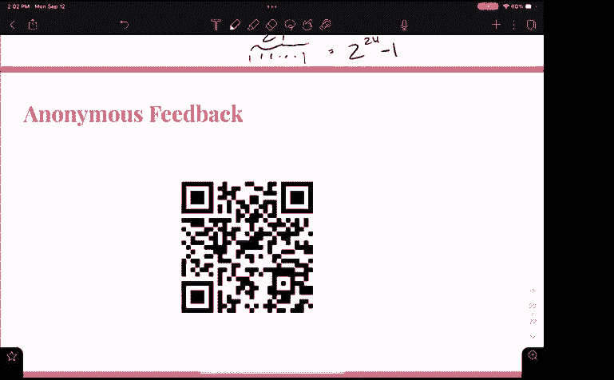

# CS 61C at UC Berkeley  - Fall 2022 - P11：Discussion 3： Floating Point - 这样好__ - BV1s7421T7XR

所以我想我们准备好了，大家都好吗？你们这周有项目要交吗，嗯，所以我们有一种合并的讨论，所以他们用半浮点符号，这是个新话题，然后我们有一半像C内存管理，嗯，好吧，首先物流，我相信你知道，一号项目周三交。

嗯，如果需要扩展，或者任何接触，员工的邮件，嗯，我们星期五照常有一个实验室，今晚我们还有作业要做，所以你需要帮助，有办公时间，嗯，我们要去，我会鼓励大家再次扫描这个二维码，我想感受一下，每个人都想掩护。

不管是种子内存管理还是浮点，我可以判断，所以如果你想检查一下，是啊，是啊，为了澄清大家都拿到了工作表，或者把它放在他们的iPad上，你需要一份工作表，呃，纸质工作表在前面，所以给它几秒钟，是啊，是啊。

Zoom上的人也可以随意填写调查，我可以在聊天中发送链接，如果这能让你，只是想澄清一下，看内存管理真的就像，如果声明数据类型，它在内存中存储在哪里，不管是出于功能，函数之外，我们不打算做。

就像今天的指针崩溃，如果这就是你想关注的，我建议明天去和卡罗琳讨论，她有一个深潜，但看起来大多数人都想再做一次C I刷新，这是现场直播，但你不知道爱，好啦，是啊，是啊，好啦，所以是的，所以我们就。

我们将主要关注C，我们会做一点浮点，差不多是一半一半，所以是的，我们要尝试两者兼而有之，不过，我们会，我们很快就会看完的，嗯，我们的记忆中有四个分区，嗯，我们有一个堆栈，它主要用于局部变量，它是。

它是我们可以修改数据的地方，嗯是的，我认为局部变量，局部常数，函数中的参数，记住C是一个按值传递的过程，所以如果你通过了，说整数而不是整数，指向将复制该整数的函数的指针，然后在该函数的堆栈框架中。

Key最著名的是你的MC，你的卡利，然后是移动东西或调整大小的现实，静态基本上就像一段稳定的内存，它将被代码的所有部分共享，无论你是在一个功能，函数之外，嗯，我们不能作为用户修改，静态内存中的任何东西。

嗯，所以字符串文本，就像你在这里看到的，我们有一个字符指针，S等于字符串文本将处于静态状态的文本，因此，如果您声明一个字符指针并将其分配给一个字符串，也就是说我们不能修改那个字符串，它是不变的。

有一个微妙的地方，如果创建字符数组，我们将看到这些问题中的一个，但实际上我们会解决这个问题，我以后再解释，然后我们还有代码段，也称为数据段，嗯，就本课程而言，你主要只需要关注它包含的事实，嗯说，就像宏。

当您执行标签以查找程序的顶部时，或者嗯，是啊，是啊，这是上学期留下来的，但是呃，稍微谈谈数组，嗯，我觉得我们会有点进展，在其中一个问题中，这是一种区别，我说的是弦，不管是字符数组还是字符指针。

有趣的是如果你创建一个字符数组，字符串文本将被放入静态内存中，但是这个静态字符串文本将实例化您的字符数组，在台阶上，您有该流的两个版本，字符数组允许我们在堆栈上修改它，但是当我们退出一个函数时。

我们正在修改字符串，堆栈数据消失了，嗯，这就是为什么您通常不希望返回字符数组，因为它可能会指向垃圾数据，嗯字符指针，但是，嗯，有人质疑，你刚才说，这两个版本，是呀，是呀，是呀。

所以当我们声明这个字符数组时，假设我们在一个函数中，我们把它设置成你好，嗯，你好将被放在静态，但是这个静态内存被用来创建一个字符数组，到堆栈上，所以我们的堆栈上有Hello和字符。

但在我们不能修改的静态内存中，但因为它也在静电上，我们可以修改那个流，然后字符指针，这只是一个内存地址，直接到静态字符串，从字面上看，所以我们可以把它传递给另一个函数，如果我们需要复制，你看，搅拌。

复制很多，可能在你的项目中，需要两个指针，所以这就是这种，这里的区别，你不能真的改变，有人对此有什么疑问吗，是呀，你知道的，所以当你喜欢的时候，做一条小溪，我喜欢或明星，例如，在函数中。

然后这个函数就消失了，就像事情消失了，那个静态变量就像一个静态变量，哈喽，停留在静态内存中，或者，你知道的，是啊，是啊，这是个好问题，所以静态记忆，就像现在一样，嗯，您可以添加到其中。

当然还有创建更多的字符指针，但它将在你的程序期间保留，所以一旦你的程序终止，那就是，我是说，我们不再担心那个地址了，因为我们的节目结束了，嗯，所以它基本上消失了，但如你所知，我们从来没有真正喜欢。

清除所有内存，它只是坐在那里，没有东西指着它，这回答了你的问题吗，或者是的，我只是在想我们应该，有没有责任，或者类似的事情不，因为这不是热度数据，所以每当我们使用免费的。

那个空闲呼叫对应于某个地方的malloc呼叫，这总是一个很好的练习就像，无论何时使用malloc，我会在它下面写免费，然后找出你以后需要免费的地方，但请记住一次失误，一个电话，相同的功能框架。

我们已经将其添加到静态内存中，也许那个函数我们仍然可以得到指向静态内存的指针，框架关闭，但我们仍然可以参考，是呀，您可以返回指针，嗯是的，是呀，绝对的，如果该指针存在于函数之外，嗯，我是说。

它还在静态内存中，所以肯定，是啊，是啊，那很有帮助，呃，关于动态分配，我觉得你可能已经练习过了，到现在为止，马利克，你会给它一个指定的字节数，你想从计算机中获得，它会给你返回一个指向内存某个部分的指针。

有这么多字节，嗯，但它可能包含垃圾数据可能包含来自另一个程序的剩余数据，所以我们不能假设它是在零初始化的，但是KC C我们做同样的事情，注意calc中的参数有点不同，指定此大小项的编号，你知道。

所以你指定大小，然后是物品的数量，这是一个有点不同的木槌，你只要把字节数传给它，但是calc会把一切都初始化为零，所以你可以相信这一切都是零，是啊，是啊，那么利用这些知识的好处是什么呢，呃。

这是个好问题，嗯，在一些不同的情况下，使用calc可能会有所帮助，就像，说，你很懒，你想初始化一个字符串，您不希望在字符串末尾包含空终止符，你有一个五个字符的字符串，当你实例化时，你必须做五个字符。

加一个右，呃，您可以在calc中执行六个字符，而且已经，你知道的，候补，嗯，这是一个很小的例子，没那么重要，但在有些情况下，你不知道绳子有多大，你要放进热记忆，所以最后你可能会有一点额外的。

你不想担心缩小它，在终结者中完美，所以你可以填写你的角色，你就完蛋了，在现实中，只拿一个指针，分配内存，冻结它并分配更多内存，所以说，或更少内存，呃，你基本上只是缩小，呃，您给出数据分配的窗口。

我想在mc和caleb的区别上加上一点，通常malloc实际上比calc快，你会看到，如果我们决定使用我们以前的优化项目，但是是的，使用malloc更快，在某些情况下，这其实是一个很好的观点。

有人知道为什么它更快吗？没错，所以Kalik是N个字符中的O个，你必须初始化，每一个字符都是零，而mc只是找到初始指针并返回它，这是一个恒定的时间，是啊，好吧，我的意思是说，但你得检查一下那个空间。

这是一个更像面向操作系统的问题，是啊，是啊，那更有方向，是啊，是啊，我跟你说实话，我不知道它是如何确定，比如它会回到哪里，这块内存，那是那是更在，就像操作系统，所以这是硬件引擎的问题，呃就像支票。

和老板喜欢喜欢你是喜欢软件，是啊，是啊，嗯，我是说，Calc也必须做同样的事情，因为它不想清零，对另一个分配实际重要的数据，所以我们几乎不用担心，因为不管怎样他们都得这么做，好吧嗯，让我们进入一个问题。

我觉得很简单，它需要一个内存块返回到另一个内存块，然后你知道，我们今天其实不打算报道，我想那是上周，是啊，是啊，在菜单上，我们加了点东西，所以说气动的，呃，就像五个州，然后我们的反应就像一百个什么的。

在最初的五个州，它没有一百个病例，所以我们得把现有的数据复制到另一个地方，右右，是啊，是啊，是啊，是啊，是啊，是啊，所以嗯，是啊，是啊，你基本上是把分配给你的那块，如果它不能，然后是的。

它会把它带到别的地方，但在更大的窗口，好啦，所以让我们做一些预先检查的问题，嗯，我们一起走过这些，内存扇区由硬件定义，不能更改，有人对此有什么想法吗，也许就不能改变了，我们能改变。

正在堆的内存扇区的扇区，堆栈，静态代码，对耶，所以我们可以改变堆，对这样我们就可以改变温度和堆栈，然后这个问题的另一部分，它们是由硬件定义的，不一定是真的，硬件将指定我们机器中的总内存空间有多少。

但是操作系统会把它们分成相应的部分，是啊，是啊，当我们打电话的时候，我们会更多地讨论记忆是怎样的，这些内存扇区的排序是在运行时定义的，而不是通过硬件，按部门分列的小问题，你指的是堆栈，是啊，是啊。

对于大型递归递归函数，您应该将数据存储在堆栈上的堆上，你们对这个事实有什么看法，假的，假的，你为什么认为酱汁因为本质上你会，您可能会结束许多类似堆栈调用的顺序，因为在递归中，我们有很多类似的电话。

同样的功能在一些如果你想看到，很明显你可以，所以我的意思是，我们可以看到递归基本上是一种um行为，不管怎么说，对呀，我们有一个函数调用，它调用其中的下一个函数调用，它在其中调用下一个函数调用。

一旦n个函数调用终止，这个终止，这个终止，所以它是，它基本上就像一个堆栈，对呀，嗯，所以当我们在这个堆栈框架里，如果我们想到的是记忆，我们希望这一切保持不变，直到所有这些递归的事情都完成了。

然后我们可以摆脱记忆有意义的方式，好啦，嗯好吧，所以我要给你们几分钟来看看这个，让我们试着为所有这些类型的数据找到一个家，是啊，是啊，一个问题是，你是说对于任何我们不应该使用的函数，建议你不要。

你能做到的，但是有一种叫做数据或内存碎片的东西，不断分配内存，中间可能有很多空隙，取决于大小和我们可以依靠的堆栈，你知道的，当我们完成这个函数，记忆消失了，但就像你一样，这个词很好，是呀，是啊，它。

你得花更多的时间，嗯时间，嗯，就我的时间而言，是啊，都是因为你会，您必须分配内存并返回空闲的，但我们喜欢看涨期权，你绝对可以，只是建议你这样做，谢谢你，每个堆栈都是一个好的大小，我是，这是个好问题。

我忘了做那件事，对不起，嗯，这是个问题，他们只会说在中央索引上使用生命是愚蠢的，有指向文件夹和文件夹的链接，我这边有一个很高的东西，你有一个布兰登和，是啊，是啊，是啊，是啊，所以有趣的是，呃，我是。

这是真的，有一个讨论，好啦，我去看看，在同龄人中随意交谈，如果你有任何问题，所以是的，或要求帮助的政策，你还记得我们链接到网站的哪个文件夹吗，就像谷歌幻灯片文件夹一样，啊，一切都是等待，是你贴的吗不是。

哎呦，我想我做到了，是呀，好吧不，我刚才，我是说，这很好，呃是的，所以两边是，呃，对不起，谢谢你，我以为我忘了，我不把那个具体的，虽然我把链接，但我没有把那个特定的幻灯片，嗯，我们击中了链接。

然后当我更新我的，可能会跳过链接，这个问题，有点太多了，所以要花很多时间，这是怎么回事，一个不是一个问题，好啦，为了节省时间，让我们，让我们开始吧，静态，是呀，是呀，这很容易，局部变量，静态堆栈右。

全球，静态静态，这三个人对每个人都有意义吗，这是个骗人的问题，实际上有三个方面，所以常数可以是，可能是一些事情，就像被定义为宏观常数一样，就像，圆周率等于三点，一个，四次罚款，我等于，是啊，是啊，嗯。

在定义宏的代码中，嗯，如果它是编译代码行的一部分，所以说，整数x等于x加一，就像一个可执行文件，C代码，如果一个加一个，实际上会编译并存储成代码，嗯，如果我们有常数整数，指令性常数x等于5。

不管那是什么就像全局变量，所以它是静态的，有人能想到这样的例子吗，是啊，是啊，如果你喜欢在你的主要功能，你说x等于红色，甚至在任何功能中，对嗯，如果您只是用堆栈将变量赋给常量，对不起，你知道的，本质上。

你是说局部变量和全局变量都可以是常数，是呀，是啊，是啊，常量的意思就像常量的常量，这不仅仅是指宏观定义的权利，是啊，是啊，所以是的，它有点大，是呀，好啦，呃，机器说明书，我们刚刚讨论过，代码正确。

我们将，当我们进入装配时，我们也会看到的，嗯，字符串怎么样？我们讨论过这个，关于静态和堆栈的一点知识，因为记住当我们创建字符数组时，是啊，是啊，是本地的，它是储存和静态的，但也可能是，是啊，是啊，是啊。

是啊，但它也可能是成堆的或健康的，是啊，是啊，所以它可以取决于它是指针还是数组，它可以复制过来，也可能直接指向静态内存，嗯我们有这个，是啊，是啊，我想我们有一个充满活力的，那么我们可以有一个动态分配。

呃，所以当我们谈论动态内存分配时，我们说的是malloc和calc，呃，命令，所以这些将返回堆内存，嗯，如果我想在其中创建一个动态数组，我们不能喜欢苹果，呃，堆栈记忆就是你说的，或者像这样。

不是由Malbut反正在那里，你可以创建堆栈空间，就像如果你创建一个字符数组，你想扩展它并添加到这个字符数组中，嗯，它将存储在堆栈中，是啊，是啊，但那不是，嗯，在动态配置方面，那只是静态的，但它会。

是呀，我是说你，您可以在字符串上复制，分配内存，绝对的，是啊，是啊，所以我猜，我想也可能是，我得考虑一下，是啊，是啊，这是一个很好的论点，也是，就像字符串的堆叠版本，难道不一定是字面上的字符串吗。

因为它只是复制字符来堆叠空间，字符串字面意思主要是像一系列带有all终止符的字符，有点灰色地带，是啊，是啊，那感觉好多了，嗯，我们有一个像指针这样的链表示例，但是。

我想这可能符合我们讨论过的每个人的最佳利益，浮点一点点，这些解决方案也在网上，如果你想看看，但是，我对这些幻灯片的想法，我真的希望他们，就像给你们一个好的参考表或备忘单材料，怎么了？演讲者，否，否。

所以我们需要思考，在浮点方面，就像从十进制到十六进制或二进制，嗯，通常使用我三七五四标准，这基本上只是告诉我们有一个迹象，八个指数位和二十三位数字，所以你可以在这里看到，你知道重要的是。

我们有两种主要的浮动类型，我们有一个规范化浮动和一个非规范化浮动，去归一化浮动对应于，非常，非常小的数字，其实呢，如果我们看这张桌子，我们看d范数，指数为零，在我的黎波里标准，我们的偏差是负一二七。

意思是零，加负一二七等于二等于负一二七，那是一个很小的数字，所以无论何时你在想，你知道的，这应该是d范数还是范数浮动，这就是你的数字是否按条件计算的问题，或者2到负的数量级1 2 6到偏的数量级2，嗯。

归一化浮点数仍然可以表示相当小的数字，它们可以表示2以上的数字到负数，两个，六个，或者它可以代表非常，非常大的数2对1 2，六个，当我们做数字表示的时候，我们谈到了偏见公约，我们讨论了无符号表示法，呃。

你可以看到这个指数字段表现得像一个偏置符号，你知道的，我们有1代表负，0代表正，如果我们看看长浮点二进制表示，就不会是这样了，不会像延长的标志一样，因为我们只有一点迹象，好啦，所以这是一个信号幅度。

从某种意义上说，然后重要是有趣的，因为重要，对应这些字段，所以它就像无符号二进制，但向后向右，所以我们有零点一，这些是二进制数，对呀，每个人都这样，如果你有零点五，你想代表这一点，在我们重要的。

我们就不会有零，零，零一，我们不会，我们不会零延长它，我们就会有1 0 0 0 0对，它在另一端延伸，这就是我想说的，对不起，到目前为止关于浮点有什么问题吗，是啊，是啊，你能，呃，在前面的这一边。

你知道吗，我是的，是啊，是啊，是啊，是啊，所以当你认为正常化和反正常化，想想小而大的数字，极小或较小的大数，归一化浮动可以表示小数字或大数字，非正规化浮动只能表示非常，非常非常小的数字，所以符号，啊。

是啊，是啊，是啊，是啊，就在这里，所以非正规化从这个隐式零开始，规范化从这个隐式的开始，然后点你重要的，还要注意，在作业中这里有一个小加一，浮点作业，你会清楚地看到加一在哪里起作用。

但是每个人都忘记了恶魔还有一个伴，它基本上是两者之间的界限，所以没有重叠，好啦，所以我想，这可能更容易，如果我们遇到麻烦，然后我们就可以，我们可以谈谈，我已经写下了你想要经历的程序，从小数到浮点。

和浮点到小数，但是让我们先解决几个问题，第四步是用i乘以3，E标准，我们有这些位场，让我们只是转换，这个数字变成十进制版本，如果可以的话，我给你几分钟时间，对不起，我不知道这张桌子对你来说是不是太小了。

但我包括了十六进制转换和二的幂，我不知道是什么事，你能告诉我，哎呦，我想是关于恶魔的，是呀，是呀，所以请记住很小的数字，一加一，一点七，好啦，让我们开始讨论这个，首先。

我们需要将这个十六进制转换为二进制，所以让我们来填补一些位，所以这是我们的位场，在这里，我们有我们的标志位，我们的标志是，一右，因为我们的前导x字符是f，所以它是1，1，1。

下一个十六进制字符也是s so one one one one two two one one，准确的说是1 0 0 1，我们需要继续吗不不，我知道指数是255，如果我们看看这张桌子。

我们的指数域是2 5 5，我们有两个选择，它要么是我们有效值的无穷大为零，但事实并非如此，所以说，我们有一个非零显著，我们已经可以看到我们有，继续下一个，我们有这个花车。

让我们把它转换成x中的浮点表示法，我希望我能放大这个，假设每个人都记下了号码，我将转到我的幻灯片，它描述了如何从小数开始，很有希望的流动，这很有帮助，从这个开始，有人想让我，我们应该在哪里。

我们从哪里开始呢？我要去，是啊，是啊，是啊，是啊，完全正确，我们可以写下符号位为零，我们有一个正数，我喜欢做的事，至少我不知道，我们有很多方法可以解决这个问题，但我认为最简单的方法是。

让我们把它转换成二进制，这个二进制，如果是阴性，我们做同样的事情，我们只是取它的负位正弦是1，我们把消极的积极版本，有道理，嗯但是是的，只有小数两边的无符号版本，将两者转换为二进制，很快的，所以三十九。

呃，原谅我，我对二的力量很不在行，所以我就这么做了，还是，这里有点，嗯，因此，在不超过我们的数字的情况下，我们的数字中最大的是32，三十九减三，二等于七，第二大的是四个，减去四和七，我们有三个。

结果是2比1，所以是三九，然后这是我的小数点，这里，呃，如果我们看这张桌子，我们从零点五开始，呃，写零点二五会很难，零点一二五，零点零六二五，好啦，你得到他们，我们的号码其实很容易签。

我们有零点五加上零点零六，二五，所以我们可以把这两个部分，那里有一点，零零，那里有一点，这对每个人来说都有意义吗，这可能会变得有点复杂，你必须做相反的事情，所以你会说你知道它是这么大，然后零点五。

如果是的话，你知道你，你检查一个零点五，减去零点五，你找到下一个，下一个，但在这里很容易，我们在零点五，减三，零点五六二五减零点五，接下来我们就在这里，现在我们要把这个小数移过来。

所以我们有两种不同类型的浮子，我们有一个规范和一个D规范，你觉得我们在和谁合作，诺曼底规范和，非常小，是的，是的，是啊，是啊，我们是在和非常小的人合作吗，我们将期待，所以如果我们用一个范数，我们将期待。

还是，就在这里，一个领先的，因为我们希望领头的那个，我们需要多少个十进制移位，五个耶，所以我们要把它移动五次，一二三四五，好啦，所以现在我们有一点，零一零一零一零一，一次，二到五，大家都跟着。

所以我们有点接近我们正在寻找的代表，我们看起来有点像这样，我们有一个2到某事的时间，一分，一些事情，我们现在需要用偏置符号表示五，这可能会变得有点棘手我们的偏见，负1，呃，负一二十七。

所以我们需要一些正负号，一二七等于五，所以我们可以做，让我们做，所以x是5，所以如果偏见，那么5-偏置等于Rx，我就不跟随了，所以这将给我们一，三，二，这就是我们的指数场，记住这是一个无符号号码。

再加上偏见，我们的偏见是负面的，所以它会把我们带回五个，所以我们有两个字段，到目前为止，我们有了我们的符号和指数，我们重要的，我想读出对我的意义，只是在事情上呃，在二进制点的右边，用零填充，在呃。

有衬垫，怎么呃，在左边这么近，但是请记住，这是小数点的右边，所以我们实际上想在右边垫，哦耶，对耶，完全正确，它是，它确实欺骗了很多人，但意义重大，会看起来像零，零一，一个，一个，一个，零，零一。

然后下面的所有这些零都记得这是我们最初，呃，所以让我们一起做这件事，所以我们有零的符号出价，我们有，呃，哦，伙计，一，三，二，指数井，二三四一二三四，不要对我评头论足，一二八位，是呀。

减去我们剩下的四个，好啦，他们不会跟来的，我是怎么做到的，可能更快的方法，但我已经习惯了，好啦，所以让我澄清一下，嗯，签了名，接下来是我们重要的，零，零，一个，零，零，继续，所以让我看看那些。

一至二十二，是呀，我是说，我们可以我们可以这样想，或者我们也可以，呃，把它翻译成十六进制，从左边开始，对呀，我们知道我们会有三个两个比特，所以这一切都将完美地映射成十六进制字符，所以我通常会做的。

如果我们知道它完全转换成十六进制字符，完美转换意义，好像是四的倍数，我们就可以说好，好吧，这里会有四个，所以我们有公牛4号，这将是，让我们做这个真正的快二，呃，就在这里，一个，可能又是我的笔迹。

剩下的就是0了，所以它在32位，表示四字节数，所以一个接一个，我们需要一个零，那里，三个字节，然后第四口，我很快就经历了，所以请提问，有很多东西要跟踪他们，再次，我知道乍一看可能，好像我们做得太多了。

所以我敦促你按照我的幻灯片在中央索引和张贴，看看这些小数，浮点，浮点到小数，所以当你做作业的时候，你得多加练习，是啊，是啊，你怎么认为，嗯好吧，所以我们只知道它不是负的二次方，一点六，所以是的。

对于d规范，我们说的是像这么小的数字，喜欢乘以2到负一点六九，是啊，是啊，但也可能是零点零，一乘以二的负数一二六，但那将是一个，嗯，在你们离开之前，我想已经很好了，我们有三分钟。

我确实有这些问题有点棘手，它会出现在你的考试和作业上，所以我们可以早点离开，或者我们可以过去，就像其中一个，如果你想，好啦，由你决定，但是呃，好啦，让我们来讨论下一个大于2的最小数。

可以用浮点表示法表示，但我想这意味着什么，我只是随便看看，因为我们时间不多，但是我们如何表示2和浮点，我们有消极的，一次，什么是积极的，会是0乘以2，我们知道我们在用规范化的流程工作。

所以会是一分什么的，所以让我们让这感觉太对了，2是我们想要的数字，所以说，我们走吧，是啊，是啊，这就是2的浮点表示法，所以要找到下一个大于2的最小数，我们只需要找到我们可以添加的最小增量，当我把零。

最后一个切中要害的，在那里你解释，对不起，哎呦，所以不是，这有点像，你得了1分0 0 0，所以在最后，最不重要的一个，你只要把它改成喜欢，是啊，是啊，是啊，是啊，没错，我们想把我们的重要性增加一个。

我们可以谈谈，这是一个就在这里，这里是二对二对三对，在我们的重要时期，我们有两个三个比特，所以这是1加2的负2，三次都是两次，因为记住我们这里有两个，所以那是，这就是解决办法。

我们能表示的最大奇数怎么样，我们说的是非常大的数字，所以我们有一个规范或规范规范，所以我们有一个除草的，我们的标志位，它很大，它将是负1到0，这里的诀窍是我们想找到一个奇数，我们可以表示。

意思是最不重要的一点必须是对的，嗯，但是我们需要用浮点表示，所以我们有了重要的部分，两个三比特，我们说的是指数移动的点，小数点后，我们正处于我们重要的，大家都明白为什么，基本上，如果我们修改我们的重要。

嗯，所以我们有一点，想要一个大数字，所以所有这些都将是一个，说是一个零，我们把二乘以二十三，这意味着它要把这个小数一直移过来，最后一点，所以它是一个整数，这一个甚至会是正确的，因为它们的最低有效位是零。

所以我们能表示的最大奇数是这个位为1，所以我们这里有领先的1和23个，所以我们有一个二，四位，数目，实际上这是什么，二除以二十四减去一，n位字符串可以表示0到2到n减去1，那是我们的射程。

请在出发前扫描这个，我们非常感谢您的反馈，如果你有任何我们今天谈到的问题，我可以。

