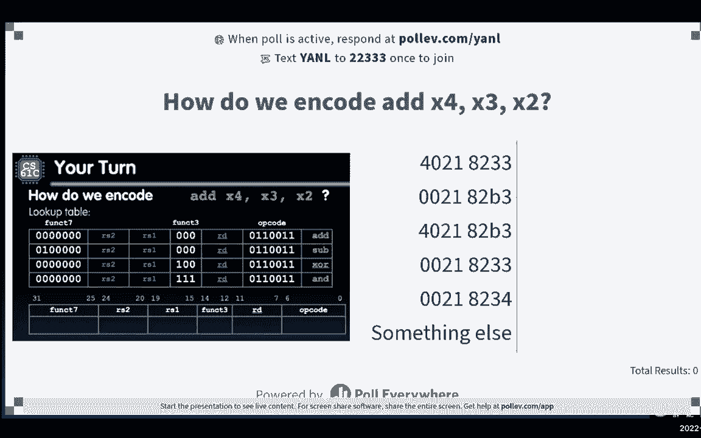

# CS 61C at UC Berkeley  - Fall 2022 - P14：Lecture 11： RISC-V Instruction Formats I - 这样好__ - BV1s7421T7XR

这个周末说好坏。

好啦，准备数到三一二三，好啦，我听到一些不好的，呃，我想聊天也能听到我，怎么样，聊得怎么样，周末，可怕，好啦，所以在周一乐观的部分，至少这个月或上个周末确实下雨了，雨下得也不大，因为事实证明。

我是说我们加州正处于极度干旱之中，如果雨下得太大，它实际上长得太像绿色的东西了对于即将到来的夏天来说，所以如果明年夏天超级热，然后所有的东西都会干涸，然后会有更严重的火灾，一种东西的组合现在很好。

我知道你们这周都很忙，尤其是在61年，我们有第二个项目，嗯，那出局了，其实这个项目对一个来说是相当小的，这就是即将到来的，星期三，在…的意义上，我认为风险五的一个特点是它看起来真的很可怕。

因为这是一种全新的思维方式，但是一旦你习惯了参考卡，你适应了，其实喜欢查东西，然后只是想一些事情，程序上，其实也没那么糟，从某种意义上说，有些人对有些人来说，它实际上比c容易，这是伟大的。

我想做的另一个班级通知，我们将开始亲自分配中期计划，所以你要做的那种小实验，但在我们真正向你们所有人释放所有这些物流之前，你得让我们喜欢，通过填写中期可用性表来帮助我们处理物流问题。

所以如果你还没有填写，你们中75%的人，这是伟大的，但剩下的两个5%是这样的，请务必填写，我们将开始把学生分配到期中考试教室，嗯明天晚些时候，我想是的，请务必填写，我想那里有我们。

美国点茎组织并在上面发帖，我们可以从那里开始，你有问题吗，我以为你会举手，不，好吧。

很酷，但是的，呃，让我们从新闻中的计算开始，我受到丹的启发我想做一些有话题性的事情，这是几个月前发布的一篇文章，六月二十二日，麻省理工学院计算机科学和人工智能实验室的研究人员在封面和引用。

苹果上无法弥补的缺陷，M一个芯片，所以它使用了一种不同类型的计算机架构师，它使用不同的ISA集，不是我们知道的风险5或x8 6，但这里的剥削是什么，这是一种叫做指针认证码的东西，实际上利用这一点。

那么什么点或认证码是，这有点超出了本课的范围，但我们的想法是检查看看，是否访问无效内存，或者像不属于你的记忆，硬件做了几次双重检查，所以这种攻击实际上结合了内存损坏，你们现在都看到了，通过做项目。

其中一个将内存损坏与硬件中的投机执行结合在一起，尝试获得更快运行的指令，按种预科，执行一些指令，事实证明，这可以被利用，你不能真的修补它，因为它在硬件中，非常吓人，非常刺激，是啊，是啊。

那么这里的答案是什么呢，答案是如果你学会了风险五，如果你学习计算机体系结构，所有这些事情，你可能会成为下一个，硬件修理工，或下一个硬件探索者，取决于你想去哪里，嗯，新闻中没有计算的一点，但我确实想提出。

我们要在伊丽莎白女王的葬礼上演讲，我只想承认，对于那些表示敬意的人，默哀，谢谢你，是啊，是啊，所以她要迟到了，今天晚些时候她的安息地，所以呃，今天我们要讨论的仍然是风险五，但我们将讨论风险五的部分。

那是机器语言。

到目前为止，我们一直在讨论汇编语言，所以这看起来像所有这些像负载，加载单词，存储单词，平等分支，所有这些类型的事情，现在我们要说好吧，嗯，我们知道，也可能你不知道，但我要重复一遍。

我们所知道的是这里有一条橙色的线，在那个蓝色高亮框下面，那条橙色的线就是我们所说的ISA，所以它是软件和硬件之间的层，我们还需要做一个抽象来获得硬件，这是为了表示我们在组装中的指令，作为0和1作为位。

这里有一点动漫和动画，但这里的想法是，这就像，有点像我们全球支持的第三只乌龟，取决于您计算的级别，假设这个世界是与计算有关的一切，第一个乌龟是编程语言，然后第三只乌龟就到了机器语言，观点，我不知道。

所以我们今天要做的是，我要做一个非常快，就像闪电历史谈话，大约需要五到十分钟，所有这些都来自，然后我们将讨论风险五是如何，实际指定指令在位级别上的外观，但让我们从历史开始，所以如果我们闪回一点，让我。

呃，看看有这个现场曲目章节可用，那太好了，但现在你可以看到标题，现在我们可以看到标题了，让我回顾一下，所谓的电子数值积分器，所以我们通常不记得它被称为积分器。

但我要告诉你任何应用程序都是在1946年创建的，实际上是的，它在1946年投入使用，所以这是二战发展的一部分，这是一项主要由宾夕法尼亚大学管理的努力，这在历史上被吹捧为第一台电子通用计算机。

当时快得惊人，我这么说是什么意思，我是说都是十进制的，但它能将十进制数字相乘，现在只需2。8毫秒，现在我们更接近纳秒类型的东西，但我是说如果我们仔细想想，如果这是第一台电脑，现在是2。8毫秒，真快啊。

乘法是你稍后会看到的东西之一，其实是基准之一，即使在今天，许多计算机体系结构是如何测量的，但是，这里有一个缺点，重新编程花了两到三天时间，为什么好，让我们在这里考虑一下贝蒂·斯奈德。

贝蒂斯奈德是一些斯奈德是她的娘家姓在这里，她实际上是六个程序员之一，它曾经被称为第一台计算机的计算机，所以让我解释一下，在过去，计算很好，你是一台电脑，你是一台人机交互，实际上能够连接这台特殊的午睡机。

为什么我对你们中一些熟悉历史的人是这么说的，你一定想得很好，这就像四十岁对吧，为什么女性电脑，我以为编程是男性主导的事情，就像在二十二，发生什么事了？嗯，事实证明，这一次是在20世纪40年代左右。

交流电是为二战而设计的，因此，我们实际上计算了很多，就像物理学和弹道导弹，轨迹之类的，我们可以长篇大论地谈谈战时的努力，燃料种类，大量技术开发，但这里的重点是，社会认为困难的部分是制定方程。

关于事物如何运行的数学方程，然后用计算机计算其中涉及的实际数字，所以他们说，哦耶，计算部分是女人的工作，所以他们有很好的，事实证明，实际上你在两三周内要做的是，你真的要连上你自己的电脑，事实证明。

这份工作实际上是相当困难的，所以计算机实际上是女性主导的工作，直到二十世纪七十年代左右，它是一种通用计算机，或者个人电脑是，极客文化来了，女人们慢慢地，所以现在情况稍微好一点，但我只是想提出来。

快闪三年了，我们有电子离散变量自动计算机到电子延迟存储自动计算器，这就是我们所说的第一台通用存储程序计算机，在上一张幻灯片中，我们所看到的是，计算一些东西大约需要三毫秒，挺快的嘛。

但重新接线花了两到三天，这个需要大约六毫秒的时间来乘积，但它是一台存储程序的计算机，所以这意味着每次你写一个新程序，你实际上不必物理地连接计算机的所有部分，对彼此，你实际上可以运行它，所以这种编译过程。

又名人类布线现在快得多，在过去，他们实际上不必使用编译器，但我们可以谈谈，然后再闪过五六年，我们有IBM 7，1952年零一，这是第一台商用科学计算机，所以我们还没有接触到个人电脑，这个有冰箱那么大。

我是这么想的，但是乘法现在不到半毫秒，我们有，我想我在上一张幻灯片上跳过了，但是我们有三个6位的，在IBM的案例中，它们被赋予了巨大的规模，这里有些有趣的东西，所以如果你把这个小图放大。

我不知道我能不能放大笔记本电脑上的，没有，那很酷，如果你把这里放大，是啊，是啊，所以好吧，是啊，是啊，只有一次成功了，所以如果你看到这里的这些小点，每一个都是寄存器。

所以有两个编程可访问的程序员可访问寄存器，所以人类可以接近，此处可用寄存器，有累加器可以添加东西，为了节省那里的东西，任何乘数斜线药水注册，这里还有一些其他的寄存器，如果你放大，你可以看到一些东西。

所以这个实际上就像这里的寄存器，它们闪烁着灯光向你展示有什么部分在打开，你就像，啊，会不会很酷，好像到处都在闪烁，你怎么知道发生了什么事，下面这些开关实际上是调试步骤。

所以你可以通过打开和关闭开关来完成代码，你可以看到灯光，嗯继续，这就是老派的gdp，金星的老派，如果我们，如果我们回到70年前，很酷的东西，反正，你可能你可能喜欢，有什么意义，丽莎，有什么意义。

这里的重点是我在上一张幻灯片上简短地提出的这个想法，称为存储程序计算机，所以存储的程序计算机是说，而不是有指令，有点像，你在不同的机器或机器的不同部分之间连接的东西，将所有指令表示为位模式，换句话说。

人数，如果你用比特来表示，数据也表示为位，所以说，因此，整个程序也可以存储到内存中，就像数据一样，这就是大家都熟悉的存储程序概念，这是你从22年的第一天开始就被教导的，但七十年前。

事实并非如此，我想指出的最后一点历史，这个概念是在eniac和edsac之间发展起来的，简单地说，作者：沃恩纽曼，事实上，他才是真正的功臣，但事实证明，这是从他与埃克特和马克利的讨论中产生的。

这里有个有趣的故事，所以这是一份被广泛分发的技术报告，存储程序的这个概念，这叫做报告初稿，原来冯·纽曼的同事，赫尔曼戈尔茨坦收到冯诺依曼的第一份报告草稿，他就像是在穿越美国的火车上，他就像，是啊，是啊。

这很有趣，我们能不能，把这个发给我们的合作者，好好谈谈，存储的程序很好，然后戈尔茨坦就像，哦耶，那是个好主意，把冯·诺依曼的所有作品都打印出来，像拉通宵类型，事情是两个，五页长或四十页长。

然后把它寄给不同机构的30个不同的人，是啊，是啊，这是正确的，就像，就像你给你的学生小组发电子邮件一样，就像嘿，你能再检查一下这封电子邮件的草稿是否正确吗，不管是谁看到的，只是把它炸给每个人，所以是的。

所以多年后，我们仍然没有学会如何，如何进行人际交流，挺有意思的，计算机存储程序的含义是什么？第一，电子邮件非常重要，你应该确保阅读，在你做任何疯狂的事情之前，仔细检查电子邮件。

但这里有两件事与61 C有关，第一个你们都熟悉的是所有东西都有一个内存地址，所以我们有一张类似于堆栈的图片。

还记得我们稍后会讲到的堆栈吗？

但是当指令出现在这个文本区域的时候，在下面，这意味着树枝和跳跃，你在风险5中看到过，现在他们还使用内存地址来引用不同的指令，跳转到那些指令，看看这也意味着什么，C指针只是内存的地址。

所以这导致了很多bug，在Java做一些保护之前，我们已经看到了这一点，C不，然后还有一个特殊的寄存器，所以我们讨论了程序员可访问寄存器，那三个两个寄存器，还有一种叫做程序计数器的特殊寄存器。

你在参考卡上看到的，丹尼斯简短地谈到了这件事，这将保留要执行的下一条指令的地址，所以这里的重点是PC实际上是一个指向内存的指针，它也被称为指令指针，如果你来自不同的建筑，所以所有东西都有一个数据地址。

或者对不起。

所有东西都有一个内存地址，第二件事，这就是我们今天要讲的，因为存储的程序意味着你可以把程序作为数据来编程，然后如果你有它作为数据，然后你可以把这些数据放在另一台计算机上。

所以这里的第二个要点是程序是以二进制形式分发的，换句话说，它们是组装的机器代码，机器代码是0和1，它们都被绑定到一个特定的指令集上，所以这里的指令集不仅定义汇编语言，以及汇编语言的0和1应该是什么样子。

然后更进一步，很多指令集，因为它们在我们的城市里使用，就像每一个指令集都是在一堆不同的设备上使用的，如果您更新了说明，你不希望在那个设备上的工作被落下，所以很多isas实际上是向后兼容的，例如。

这意味着x80，英特尔公司的“六架构”有点来自于“八零式”，八八八八，八十年代的零八，如果有一个程序是在这些机器上编译和组装的，你可以用X80来运行它们，六十四是我们今天的一个，有点酷，但值得思考的是。

我在上一张幻灯片上提到了一些东西，我再明确地说一遍，这里发生的事情是，因为机器作为程序是以机器代码分发的，那台机器编码那些0和1的配置方式，需要在不同的计算机之间保持一致，所以像风险五这样的指令集架构。

它定义了装配代码和机器代码，就不同的指令是什么样子而言，这里的一个例子是广告x18和x19，这里X十，汇编语言实际上变成了比特，你在右边看到的，你真的能做到，你们会在今天晚些时候的课上看到这个例子。

当我们讨论机器代码是什么样子时，这里有一些要点，它实际上是为处理器而设计的，而不是为人而设计的，所以有点看不懂，但在我们开始之前，我想让你知道的一件事，有一件事你应该记得或者你知道，当你继续前进的时候。

你会想到一切都有风险，差不多是三两比特，所以单词是三个二位，整数，我认为在很多架构中，我们看到的是我们的两个部分，指针是三个二位，但指令也是32位，所以风险五，对于不同类型的风险五架构也是如此。

他们都将使用32位单词，所以这意味着每条指令都被表示为三个二位，仅此而已，关于简单性的一个和另一个观点，在我们继续给你看一些机器代码之前，风险5，我们将在这里使用一些术语，所以我讲了一点单词。

你以前见过这个词的概念，但我们还将讨论单词中的字段，我们将定义哪些字段实际上是，它在这里的幻灯片上定义了，字段是一组位。

在这三个中，两个，然后至少在风险五，而不是有一个特定的指令，总是绑着喜欢加，比如说，好啦，我是说，让我往回走一点，风险五号的作用是，它有不同种类的指令，然后它对你见过的所有不同的指令进行分类。

在参考卡上，你看过的讲座和实验室，所有这些它将它们归类为这些R格式，I格式，S格式，而这一切，我们要把它们都检查一遍，但你可能会说，这是很多或者像，不能，我们只是说广告是指导，一和子是指令二。

为什么我们不能，用一个比特表示该指令，事实证明，你实际上想使用这三个二位，因为你想让CPU看起来像什么，我们将在几周后看到这一点，所以风险5的作用是，上面写着，而不是为每一条指令定义不同的字段。

只有大约40种不同的格式，让我们在这里有格式，所以我们今天要讨论前三个，然后我们下次再讨论下三个，准备好了吗，好啦，我听到一个，是啊，是啊，对我来说够了，至少我们今天有很多人，这有点令人兴奋。

我知道也有很多人在聊天，让我们来谈谈第一种格式，哪个才是最有意义的。

然后我们就像过山车一样继续，你就会明白，你就会明白，现在说不通，两周后你就像，哇塞，设计风险五的人实际上在思考事情是如何做的，那么上周我们讨论组装时，我们从风险5开始，在我们开始研究这种结构的前一周。

我们有个行动，所以关闭指令的名称，我们有注册目的地，写东西的地方，然后两个寄存器操作数或寄存器源，一二，那么这看起来像什么呢，这就是我们将在今天的课程中看到的，还有周三的讲座。

但是这个操作数或d one是2或op名，嗯看起来像下面的三个二位，换句话说，所有的r格式都有这些字段，机器码中的指令字段，让我为每个字段稍微解释一下这个图，你可以看到，这里有三排，最上面的一行是字段。

位位位置，所以它从零开始一直到三一，里面的名字，这就是这个领域的名字，然后你要用比特填充它，然后你要用多少位填充它，你要用第三个数字填充它，所以操作码，例如，是一个七位字段，让我们来谈谈其中的一些。

因为你就像，好啦，只是说说而已，这里发生了什么事？首先让我们想想什么，这里的目标是什么，这里的目标是我们想把汇编语言翻译成机器语言，这就是风险五A告诉我们的，这就像，如果你看到这个广告。

你应该把它翻译成这些，那么它是如何做好的呢，上面写着这个操作名称，所以你得到的指示，这里会有三个字段告诉你，那个指令是什么，第一个是操作码，操作码部分指定指令，从某种意义上说，我不想说太多。

但从某种意义上说，它大致告诉你它将是什么格式，这就是为什么它在开始，如果你想到像，这台机器能很容易地读出前7位，然后用操作码一起放克三个和放克七个字段，描述要执行的操作。

所以这里有17位专门用来告诉你什么操作，会有什么指示，我们会解释为什么，为什么他们都在一点点分裂，现在呢，注意这里，我会在另一张幻灯片上重复，是为了我们的格式说明。

这些指令与所有看起来像这样的东西有什么关系，经常是一个两个，这些是这里所有的算术和逻辑指令，所以所有这些像and和xors和向左移动，移动小于他们都将有这个操作码为零，一个，一个，零。

零，一个，一个，这里更有趣的是寄存器的样子，所以你可以看到，这些碎片就像翻转了一点，但如果我们从右到左阅读，我们首先看到的是，然后我们看到一个，然后我们看到RS 2，所以我在这里用了颜色编码。

我会试着在整个幻灯片中保持颜色编码的一致性，但这些都是相同的目标寄存器源寄存器和源寄存器两个，你们在以前的课上见过的，但现在在机器类代码版本中，现在你可能想知道，为什么只有五个像。

我以为寄存器就像三个二位数据，像什么，我们怎么把三个，二位对三十，两个比特像三次，这里发生的事情是，这是电脑指令，所以这条指令到底想说什么，是嘿，CPU访问此寄存器号。

所以你只需要5位来表示3个可访问寄存器，所以这些字段中的每一个都是5位来表示寄存器号，从0到31，我知道丹上周，啊，我们不是，我们不再用数字了，我们要用这个名字，原来机器代码使用数字。

所以我们跳回去登记一下号码，你就像，好啦，我看过定义，但我不完全明白这些片段是在哪里发生的。

让我给你看一个例子，会让事情变得更清楚，这是我之前在几张幻灯片上放的例子，让我们看看这个位模式最终会是什么，你就像，为什么好，就像我之前说的操作码，所以如果我们有这个添加指令。

汇编程序的工作之一是查看这个汇编指令，通过在表格中查找东西来将其翻译成位，这张桌子是你的F卡还是这里的绿卡，嗯，我们首先要说的是，哦耶，这里的操作代码，这是我们所有格式指令的操作代码，好啦。

然后注意这里，我在用寄存器这个词，在这里注册代码，因为我们有两个行动，我们有两个寄存器，然后我们写到的一个寄存器，我们需要这三个寄存器，是机器代码的R格式，第二件事是，如果我们在绿卡上查东西。

或者如果我们在CS 61 C代表卡上查一下，我们会看到放克3号和放克7号，如果它们都设置为零，这十个零位的组合将是汇编指令应用程序的功能，最后这里的三个寄存器是简单的位表示，无符号位表示，登记十八号。

注册十九卢比一注册十卢比二，你就像，哦好吧，好像那还不算太糟，就像我不知道广告是从哪里来的，但我觉得我确实告诉了我关闭代码是什么，我至少可以把这六个领域中的四个，现在这里还不错。

让我告诉你这些操作码是从哪里来的，所以这只是我的复制粘贴，把参考卡上的东西放进幻灯片里，所以不要觉得你必须抄下来，我们还有打印件，所以你也可以把那些捡起来，注意这里，我的意思是，好啦，这些其实是位。

三个二位字，所有十种算术的指令词，或者我们的格式说明处于风险五，所以我把收银机涂成灰色，因为这将取决于，你在看的确切的寄存器是什么，但是请注意这里所有相同的操作码，让我们看看我是否有动画。

所有相同的操作码，不同的放克放克3和不同的放克7，我想让你知道的是，你记得我们说的是，为什么我们甚至有17位来表示所有的信息，嗯，我讲了一点，至少在这里关闭代码，这七位表示指令的格式。

这将是我们拭目以待的事情，有不同的格式，然后这三个比特，函数三，嗯，只有三个比特，所以实际上我们只能代表2到3，就像一个指令，如果我们在这里有这个额外的领域，我们仔细看看这张桌子，有重复的放克3。

然后加和子有相同的恐惧三个字段，然后向右移动，逻辑与右移位算法，有同样的放克三场，你就像，好啦，嗯，我们想做什么，或者喜欢，这样想吧，风险，我想让一切都简单，也在写这些机器代码。

比如为cpu编写机器代码的规范，所以CPU想知道的是我需要把数字加在一起，哪些号码，这个放克七在某种意义上告诉你哪些数字，对，所以要加法，你只需把数字加起来，在r 1和r 2中表示减法。

你加上rs 1和rs 2的两个补数，你只需要一个比特来表示这些信息，与右移位逻辑和右移位算术类似，记住这两件事之间的区别是合乎逻辑的，意思是你把它当成一种没有签名的东西，然后你就像在上面涂抹零一样。

上部或城市向下涂抹零，喜欢用0填充上面的字段，然后在移位右算术中，你想保留招牌，咬，所以你只需要抹上1或0，当你向下移动的时候，同样，你只需要一个比特来表示这个信息，就是你是否需要签名，延展与否。

最后这里有一点，这张幻灯片上可能有一些你没有看到的说明，特别是转移，或者被设置为小于它所做的是它将目标寄存器设置为1，如果r，如果1大于r 2，所以这有点像布尔运算，到目前为止我们一直在冒险。

但是如果你对此感兴趣，你可以看看剩下的部分。

那么这里的重点是什么呢，这张幻灯片的重点是有十个说明，我们不指望你能全部记住，所以你才有裁判证，所以你才有绿卡，但是，了解一点什么，让你记住，就像向自己解释为什么这些位模式会这样工作。

也许你会在生命中的某个时候设计风险，轮到你了，所以我们要说，我们将在这里暂停一下，接受一点纯粹的指导，我们如何编码x 4 x 3 x 2的加法，我们如何对这条指令进行编码，暂时忽略注册表名。

把注意力集中在这里的注册号上，我有一些选择，我也为你准备了查询台。

我会试着到处拉，看看是否有效。

有用吗，或者不像以快速的方式繁殖。

所以我要分享我的屏幕和另一个，哎呀好吧，这个呢。

好啦，让我们花一分钟，稍微考虑一下，看看我们会去哪里，我的POV和舞蹈不一样，所以记住它将是Poll Ev dot，com斜线y a n l yan。

我暂时把投票结果藏起来，这样你就可以不用考虑同龄人的压力来思考事情。

好吧，今天注意力有点低。

我可以把墙变得有趣，我只是想我切换回选择一秒钟，有趣的好，我会回来的，我们这里气氛有点紧张，我忘了做，欢迎回到六十一吴类型的东西，也许我们现在就做，欢迎回到61英尺，对，我们再休息一下，因为再一次。

今天是星期一，现在是早上十点，我们从，这里基本上是台风季节，至少在湾区，我给你们讲个笑话，你怎么称呼住在堆里的爬行动物，一种生活在高温下的爬行动物，住在堆里的爬行动物，堆鳄鱼，我知道你喜欢。

什么是堆分配器，这就像决定，像malloc一样获得哪些内存块，是啊，是啊，是啊，是啊，好啦，所以让我们回到，好啦，你们都放了什么，我很好奇，好啦，所以我们有很多选择。

让我们来谈谈这件事，所以有不同的方法来做到这一点，有时我没有给你足够的时间，因为你就像计算机，您正在将一堆位转换为寄存器字段。

但是让我们在这里用消去法，这很可能是你们中的许多人很快，敏捷的人最终这样做了，我们要做的第一件事，这有点像复制你在家庭作业中所做的，或者你以后会做什么，当你执行你的项目时，你在桌子上查东西。

我告诉过你这是广告指示，你在桌子上查东西，你就像，好啦，那是我的行动代码，我的放克三场，我的放克七场，所以我要把它复制粘贴到32位的指令字里，那些田地应该在哪里，根据风险，我希望。

而不是像翻译所有的东西，我只是要翻译几个十六进制，或者一次几个十六进制数字，例如，我可以我可以翻译第一个，最低的四位是单十六进制数字三，我可以把上面的四位转换为单十六进制数字零。

然后现在突然间我已经排除了很多选择，你好像没事，那不是我只翻译成两个十六进制数字，这真的很好，我们想在这里做什么，请注意操作码有7位长，我们把其中四个翻译成一个十六进制数字。

所以我们离下一个十六进制数字只有一点距离，所以也许让我们翻译一下目标寄存器的寄存器，所以目标寄存器在这里，因为它是4号收银机，是位模式0 0 1 0 0，或者四个的无符号表示。

然后我实际上又创建了两个十六进制数字，因为第3个字段的注册有5位长，所以我们得到了另外三个-两个新的十六进制数字，实际上现在我们突然有了一个合理的答案，如果我们忽略其他选择，所以如果你喜欢，你知道的。

我很确定是别的什么，我们可以在这里翻译剩下的两个寄存器，一卢比和二卢比，他们将是三个和两个，然后你就可以做所有这些文本数字，是啊，是啊，中间有个问题，很好的问题所以问题是。

我还是不明白为什么我们用17位来表示10种不同的操作，之后会发生什么，为什么他们都在三个不同的地方，很好的问题我开始回答为什么我们有17位，至少有一种不同的恐惧，七个代表。

我还没说为什么他们都在不同的地方，事实证明，风险的长期设计原则之一，五个在机器学习级别或机器学习机器代码级别，你希望东西在不同类型的指令中处于相同的位置。

我们会看到的，在我今天谈到的最后两种格式中，很好，所以实际上。

让我们现在看看这个的一个版本，I格式化，这是R格式，这就是我们刚才看到的格式，但是立即呢，好啦，如果我们加i，这里加i和加well有什么区别，汇编指令的最后一部分是即时指令，好啦，好让你知道。

这就像一些常量，你只是提供，你提供的一些东西，如果使用R格式，所以如果你想在这里保持相同的格式，嗯，你可能会试着把你的直接代表，在RS-2字段的五个比特中发现这真的很小，因为你只能表示三个二值。

所以你得喜欢，将即时存储在内存中，或者类似的东西，所以我们要做的是把中间物放入所有，我们只是有不同的领域，所以我们把RS 2和Funk 7分开，创建一个12位长的字段，立即放入，所以我注意到了这个。

R格式基本一致，不过，再想想CPU想做什么，CPU将查看这三个二位，然后执行该指令，不知何故，所以我实际上可以重用，有很多硬件要处理，处理注册目的地的操作码将是处理过程，放克三r等于一。

然后现在到了最后12位，我从操作码就知道格式会不同，指示会有所不同，然后它会说好，接下来的十二个比特将是我的直接，我将代表，我会把这十二位解释为那个数字，我要把它加到R中。

但让我们更详细地看看，所以这是这里的布局格式，我们有和以前一样的寄存器，但现在没有更多的RS，不再有两个商店，因为我们有这个即时的，这个即时可以在一个相对较大的范围内保存值，所以这里要给它赋域来补域。

它将从负2478到正2477，CPU将签署扩展，做三个二位就能把它加到三个二位宽寄存器一个，然后把它存放在32位宽的2号寄存器里，你可能会想，这是我的意思，所以只有十二分之二，我们所有的其他媒介呢。

我们将讨论如何表示即时，比12位要宽，但为了这个，至少对这个代表来说，我敢肯定风险5设计师说2到12，对于大多数计算来说，这是一个合理的范围，我们也会看到这一点，所以让我们来看看这个。

我们这里有一个例子，所以这里的例子是我们有，如果我们想添加，我储存在x15，x 1加负50的结果，记住这里我们不必做减法，我们现在有一个不同的关闭代码，零零一，零零一一，对的那个，是啊，是啊，我想是的。

因此，但我们只有一个放克三个，这就是加i，或者在这种情况下是添加，它与我们在格式中看到的放克三人组非常相似，然后我们有注册目的地，我们有一个，然后我们也有直接的代表，那是二的补语，是阴性的，所以看起来。

好啦，从某种意义上说，我们只是在改变i格式，是啊，是啊，还有一个问题，否。

提出问题的问题，它把它带回到机器--机器代码的表示，所以，还记得在R格式中，我们有十种不同的指令，包括减法，但我们必须用放克3中的2到3位来表示它，然后放克七中的2到7位，现在以i格式，我们只有一个。

二到三位字段，或者一个三位字段，那是放克3，放克7，现在没了，因为它被立即和更早的，就像上一两个星期前，当我说没有潜艇的时候，因为你可以直接加一个否定的，事实证明，这实际上对机器代码表示非常有用。

因为现在我们不再需要代表十个指令，我们只需要代表，不用于i格式的中间体，但是我们仍然试图用同样的两个或三个来表示九个指令，我们有三个位放克领域，那么什么做了什么冒险五。

他们对某些指示说得好吗，我们实际上从来不需要12位媒体，这些是什么说明，移位指令，左移右移，你只会转移，在一个三三两两的单词里，所以你可以移动的最大空格数，你喜欢意味深长的是三零到三十一。

我是说零也是没有意义的，但你知道就像那个范围，因此，让我们只表示移位量，成形场，我不认为实际上有人说移动量字段，让我们把它表示为直接的最下面的五个位，然后用上面的七位，好啦，所以如果你看到61C的唱片。

这些都被认为是i格式，但是在圆锥C参考卡上有一个小i星格式，在移动操作中显示这种差异，就像以前一样，我们有同样的正弦，向右移动位，我们有的算术立即向右移动，算术。

只是看到这种一致性在不同格式之间是非常有用的，好啦，我们继续走，所以我说了一点，你可能在想，现在你就像，好啦，R格式，R和R格式代表寄存器，I和I格式代表立即伟大，但是i和i格式也代表load。

所以加载指令也使用i格式，你说为什么，让我们看一个例子，所以回想一下汇编指令是什么样子的，如果你想加载一个词，所以一个三两位，呃，部分数据从内存进入寄存器x14，嗯，哪个内存地址，你用。

存储在x寄存器的值加上它的偏移量，所以这是在提醒你组装版本是什么样子的，嗯，事实证明，这里的i格式的三个二位格式可以表示，这就是为什么首先你有一个不同的操作码，零零零一，现在你有了一个不同的放克三人组。

因为现在你正在加载一个词，但这些其他的东西在这里有合理的意义，你在写什么？你在写14号收银台，您使用哪个地址来计算这个基地址，或者对不起，使用哪个寄存器来计算基地址，然后加上您使用的寄存器2的即时值。

然后你在存储和注册的任何东西上加八个，这就是我所展示的，示例页面是，我们不需要创建一个新的格式来表示负载，因为把存储在寄存器中的东西加在一起的想法，注册一个或基本地址，在这种情况下，加上一个即时值。

然后用它做点什么，然后将结果存储在目标寄存器中的寄存器中，在负载中仍然如此，唯一的区别是你没有储存，你储存的东西的添加，就像内存中那个位置的数据进入寄存器。

好啦，这里是加载指令，更正式一点，所以我们有这个操作码，所以再次加载指令，他们有一个特殊的操作码，你可以在参考卡上查一下，现在我们有了一个目的地寄存器，和以前一样，有时我们称rone为基本寄存器。

因为它是我们开始寻找的基地址，然后我们有这个直接的偏移，我们添加到基址以在这里创建完整地址的这个常量值。

有一些加载说明，你们可能已经在丹的课上看到过了，但我只是要重复一下，我们在这门课上通常使用加载词，但事实证明，风险五也会加载位和加载半字，让我们来看看这个，我稍后会讲到签名，但由我们来装载，而不是装载。

加载字节和加载半字，但这两个人做的是一个符号扩展，好的，好的，假设您从内存中加载一个字节到寄存器中，嗯，寄存器有四个字节长，所以你在上面的三个字节上重复符号位，好啦，这就是加载字节的作用。

如果你有加载半个字或半个字是半个字，所以是十六位，两个字节，您将两个字节的内存加载到三个二位寄存器中，您仍然需要用符号位填充上面的两个字节，您还可以使用无符号加载字节，加载半字无符号。

但它真正的作用是零倾向，好啦，所以与其像，而不是复制你最上面的符号位，你实际上只是在上面的位上复制零来填充信息，你可能想知道，为什么只有五条指令，为什么没有未签名的加载字，好在，如果你是这样。

如果你从内存中加载三个二位到一个三个二位寄存器中，没有什么比上面的部分更值得考虑的了，因为你把收银台里需要的东西都抄了一遍，所以再一次，思考风险五，他们和教练在一起很舒服，或者至少是简单的想法。

嗯是的，这里有很多信息，但又一次，这堂课的重点是什么，这节课的重点是你可以做很多查找，我试图解释为什么这个建筑被设计成。

他们以前的样子，现在我们终于要回到，我们的第一个问题，或者就像观众中出现的一个问题，就像，是啊，是啊，为什么我们需要三个字段，为什么他们都像，分开一点，我们看到了一点，就寄存器2的去向而言。

但让我们在商店中更清楚地看到这一点--商店格式有自己的布局，它们看起来像这样，你有不同的操作代码，然后我们有rf1和r2，这些是什么，这些就是我们所说的存储在内存中的数据的源寄存器，然后基础寄存器。

在内存中的基址，然后你就像，哦耶，好啦，所以我记得就像加载一样，低基址，加上立即抵消，你仍然有12位的直接偏移量，但现在他们被分成了两个不同的领域，你就像，哦，我的上帝丽莎。

五个人在凌晨两点做什么有风险，他们做得很好，这个立即的偏移量是，与加载地址的偏移量相同，好啦，所以这和你用12位来表示信息是一样的，它恰好被这一区域较高的7位分了，然后下面这个区域的5位，你就像。

他们为什么要这么做，他们为什么不把收银机调低一点，他们为什么这么。

为什么现在是在第二台，在这张幻灯片上，记住我之前说过的话，这里的机器语言，不是给我们的，人类，它是为像这样的处理器准备的，它是为建筑设计师做一些有用的事情，并能够真正喜欢，高效地浏览说明。

即使跨越不同的格式，所以我们想让S格式尽可能接近，我们关心的其他事情，我们真正关心的一件事是，我们会，我们会在接下来的时间里强调这一点，实际上就在期中考试之后，所以我们会强调这一点，教师最重要的是指导。

说明书最重要的一点，读取寄存器在同一个地方，正确的寄存器在同一个地方，那么我这么说是什么意思，我是说，记得以前用R，比如R格式，指示我们有一、二、一、二，你从那里读取值，然后你把它们写进。

商店伙计商店读什么，来自两个寄存器的值，要存储到内存中的值，然后我们出发的地址，也没有收银台，所以说，因此，s格式实际上结合了来自i格式和，这里的r格式，或者i型和r型，也就是说。

我们希望将两个读寄存器从R格式保留下来，从原型，在同一个地方，我们没有地址，所以，因此，我们将把这些较低的位移动到这里的第三个位置，事实证明，实际上，这很像CPU不太关心立即读取和计算。

但它真正关心的是能够正确地访问寄存器，我再回答一个问题，是呀，啊，是呀，所以很抱歉，这应该是立即五和立即四，零，是呀，这里的5位，是啊，是啊，所以谢谢你，我们将看一个例子，下次，祝你星期一愉快。

下课后我会和你谈谈，星期三见。

