# CS 61C at UC Berkeley  - Fall 2022 - P16：Lecture 12： RISC-V Instruction Formats II - 这样好__ - BV1s7421T7XR

得让你跳啊跳，我不会让你跳，跳，让你跳，跳，跳起来让它变得更好，让它跳跳，我要让他们成功，你觉得我们今天要谈些什么？约翰，我们要谈谈斯托尔。

让我们回顾一下上次跳过的一个例子，首先呢，欢迎回来61 C，没错，这次我真的做到了，所以这是其中一个例子，但我把它翻转了一点，我是说我们要从这个机器代码开始，我们想把它分解成汇编语言。

那么你认为相应的组装指令是什么，我给你一点时间看看，我在查表上放了一点，左下角的绿卡，但试着提醒自己上次我们在做什么，呃，覆盖ISA以真正理解机器代码，所以我会给你一点时间让你重新定位，好了现在。

至少我们都像，哦耶，好啦，我记得说明书上写着，有一些读寄存器，或者我们称之为存储字的源寄存器，尤其是我们实际上对于任何存储功能，这实际上是存储词，存储单词指令，我们没有寄存器来写入输出。

因为关键是我们读了两个寄存器，其中一个有我们想存储到内存中的数据，其中一个有地址，我们将直接偏移量添加到，然后我们把数据移到内存中的那个位置，所以没有写寄存器，因此。

我们有RS 1和RS 2作为这里注册的读数，让我们从上一张表中稍微思考一下，这些是S格式指令，我们可以看到的是，首先是S格式说明，我们实际上总是有相同的操作码，你可以在桌子上查，零一零一零一。

然后现在到底是哪一种格式的指令，好吧那我们看看，三这个放克三场，它是一个三位字段，如果我们查一下，我会说，啊，实际上，这个0-1-0位模式就是我们所说的存储词，所以我写下了存储词功能的布局。

你可以在你的绿卡上查一下，在PC One C参考卡上，现在让我们尝试解析这些寄存器字段，然后也许中间，与我们上次看到的相比，这有点时髦，所以如果我们很好地解析寄存器，首先，注册源一。

这将是我们的基地地址，用于计算我们要存储到这里的基地址的地址，或者这里的寄存器被写成一个5位无符号数，根据登记号本身，所以如果我们真的计算它，它将是寄存器x2，然后同样地，我们可以计算出什么寄存器号。

R等于2，这将是源，里面有我们的数据，如果我们计算这个位模式，它将被注册x14，然后最后立即，记得那有点时髦吗，在这里，我们处理的是即时的12位中介，S格式中的格式，我们还在处理12位。

但现在他们分开了，前七还是高七，上面的七位，我们的位置25到31，然后下面的五位在指令中，第7位到第11位，所以如果我们把这两块地放在一起，并计算出这将是什么数字，这将是三十六，只是提醒自己如何计算。

然后需要注意的是，这个直接字段确实是有符号的，因为这是一种补牙类型的东西，所以我们这里有一个正的3 6，那么我们在一天结束时有什么，我们会有一个存储词指令，我们将数据存储在x14中。

登记x14到位于x2加36的地址，所以我想，这里最重要的是我们必须做这种连接的事情，与眼前，但它是相对简单的，我们只是查了一下，想起了这里的即时外观，这里还有一点要注意啊，是呀，最可能不是最重要的事情。

但就像思考五位设计师决定做什么风险一样，这里的两个寄存器，他们的来源，所以他们只读，它们实际上与R型的读数处于相同的位置。

另一个，呃，我想宣布一件事，丹，呃是最后一个推这个的，但我只是想提醒你，提醒大家，我们今天有个关于摩尔定律的很酷的演讲，免费午餐，它将由英特尔公司的执行副总裁，谁是安凯勒？

她将和我们的DJ金·尤院长交谈，这将是一次非常酷的谈话，我很兴奋能去那里，或者实际上，我希望我能在那里，但我们会看到的，希望大家都能到场，因为谈论摩尔定律真的很酷，我们也会更紧张一点。

我们会看到更多的摩尔定律，在这学期剩下的时间里，好啦，现在我们来谈谈跳跃，所以一开始我在说这个是不是，我是我不是在说纵横交错，呃，1992年的嘻哈二人组在谈论跳跃，也许也许也许Mac。

但我们现在要谈谈如何，这实际上可能被编码成机器代码，但在那之前，我需要揭示一个更像，剥开，再来一层洋葱。

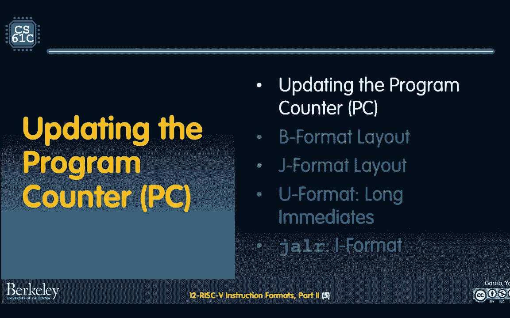

揭示我们在这里试图谈论的另一层，所以你们可能还记得这张图表，我们还没有讨论这张图表的所有部分，还有一件非常重要的事情我们还没有讨论过，我们现在要谈谈，这里的程序计数器，我们所说的PC，所以PC。

这里不是个人计算机程序计数器，程序计数器是什么，这是一个32位的寄存器，但这是一个内部寄存器，所以它是不可编辑的，在正常情况下，你会使用所有不同的风险五指令，而是，它是一个寄存器，总是存储指令。

它将在特定的状态周期中执行，好啦，那么这里的类比是什么呢，我觉得丹和我用了这个比喻，就像这是书桌，这是我们的登记簿，这就是我们要用的，你可以考虑一下，个人电脑有点像角落里的日历，你必须更新。

所以每次你走进，每次你每天你走进办公室，你改变日历，然后在CPU的世界里，你实际上可以回到过去，类似的事情，时间就像，就像记忆一样，然后你可以再改变一下日历，所以这种程序计数器总是存储，你那天要做什么。

它与我们所说的寄存器文件是分开的，我们将开始更多地使用这个词，参考三两指示。

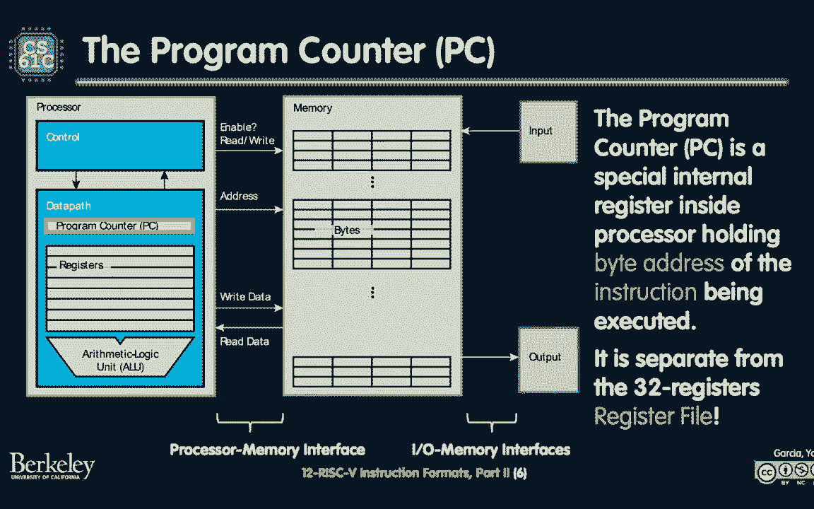

那些命名寄存器，这些编号寄存器x 0到x 3 1，那么程序计数器是如何工作的呢，它存储下一步要执行的指令的地址，所以如果我们记得我们的程序地址空间，在最下面是这个只读，或者这个片段叫做代码。

它通常被称为文本，如果你开始在金星的灵丹妙药实验室工作，以及文本是什么样子的，让我们假设它看起来像这样，我们的计划已经执行了一半，我们有与我们想要的每一个指令相关联的地址，我们想要执行的。

我们已经准备好了，我们下次会讨论加载和链接的问题，我把它们翻了一下，所以在我们最初的记忆图中，就像地址增加了，为了便于阅读而上升，我实际上包括了增加下降的地址，因为你可以执行第一行，然后下一行。

以此类推，等等，关于这个图的其他一些部分，那么什么是，呃，列出的或存储或加载到内存中的是四个字节，好啦，在那个特定的地址，例如地址十六进制十，我们把字节0存储在那里，它是大的还是小的取决于你的机器。

现在那个特定的机器代码与什么有关，是我在右边写的吗，哪个是原版，就像最初的汇编代码一样，然后它被组装成这个机器代码，然后存储或加载到那个位置，那么PC与此有什么关系呢，在我们执行这个广告指令之前。

程序是从哪里开始的，电脑确实是那个广告指令的地址，好啦，所以在这种情况下，它将是x 0 0 0或其他10，然后是寄存器文件，我在图表中把它们分开，提醒您，这是一个特殊的内部寄存器。

那么现在你认为当我们很好地完成这个广告后会发生什么，我们知道在十八岁的时候，我们会得到我们广告指示的结果，但广告的另一个作用是你可以在参考卡上看到，它实际上是增加PC，它增加了多少。

把它递增到下一条指令的位置下一条指令应该是什么，或者像下一个指令地址应该在哪里，在这种情况下是什么--嗯，下一条指令，如果我们只是抽象地，只看屏幕中间，我们知道的下一条指令是广告，幕后到底发生了什么。

当程序计数器，的确，立即添加的地址，好吧以此类推，等等，所以这张幻灯片的重点是向你展示，对于典型的指令，比如典型的生物，算术，逻辑，所有这些都将使程序计数器增加4字节，它是一条指令的长度在您的。

你的三位一体的指令，当时的力量，因此，所以分支实际上做的是，他们以不同于这种正常的方式更新程序计数器，每次添加四个字节，我这么说是什么意思，假设我们在做一个无条件分支，所以我们有这个。

我们有一个正在发生的循环，我们到了，我们得到这个j循环语句，然后现在我们要跳过指令，它被标记为循环资本L循环，那么跳跃是什么，好好干，在这种情况下，假设我们在十六进制十八，这是跳跃循环指令。

它想将自己更新为十六进制零C，我要把它写下来，但实际上引擎盖下发生的事情，就是，它不是说，嘿PC更新你自己到零零零，它实际上要说的是不，我想减去12到程序计数器，为什么这种有意义，这就像，好吧好吧。

我真的不知道，也许我开始的电脑在哪里，但我知道我想去的指令是在这之前的三个指令，这就是机器，汇编程序要做的事情，我们下次再谈这个问题，哦其实，我们现在要做的是，让我们看看在条件分支情况下会发生什么。

让我们假设我们回来了，我们在上面，我们试着把它分成相等的部分，但假设事物确实相等，所以我们要把树枝，在这种情况下，我们将跳到标签，以及标记为，这个十六进制一C的地址是什么。

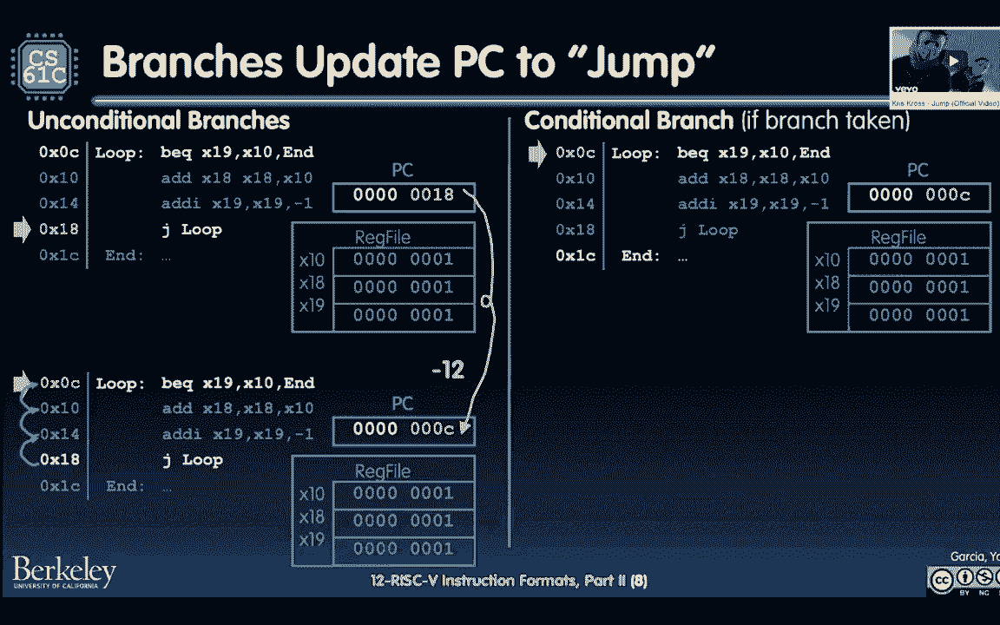

那么这个分支是做什么的呢，它增加了指令，换句话说，16字节的程序来了，所以你可以在这里看到树枝，不管是有条件的还是无条件的，他们确实会更新程序计数器，这就是当你跳下去的时候真正发生的事情。

这里的另一个注意是，所以这是树枝被拿走的时候，如果树枝没有被拿走，然后你只需将PC机增加4，这有点像这里的正常情况，好啦，所以你可以像什么是基本情况，基本情况是默认情况下所有不同的指令。

他们可能会增加四个，但是有一些特殊的情况，所有这些其他的事情，他们会以不同的方式更新程序计数器，这就是我们今天要讨论的，是啊，是啊，那是个问题，啊，太棒了，它会记录下我们下次要回答的所有标签吗，是呀。

就像，事实证明，这有点棘手，但我们要定义一些术语来帮助我们，我们不是，其中之一是这里的这个，它被称为PC相对寻址，所以其中一个问题，所以刚才的问题是，好啦，嗯就像，你怎么知道有哪些标签，什么感觉。

它们是绝对地址吗，所有这些PC相对寻址是什么，不是存储你要跳转到的实际地址，比如PC应该更新到的地址，您将存储到该地址的偏移量，这算是说，就像嘿，总是加四个，我不在乎你四点在哪里，或者更确切地说。

我不在乎你在哪里，总是十六岁，因为我想跳到那个位置，这允许位置独立的代码，我这么说是什么意思，让我们把刚才看到的代码，所以我们在左边我们从很低的地址开始，这里，十六进制零z x十，也许在不同的机器上。

我们实际上会把所有的东西都提高一点，因为有其他的说明要储存在某个图书馆的井里，如果我们使用相对寻址来执行分支等于，我们还是会加16个，因为我们想跳的那个标签，总是离我们当前的指令16个字节。

所以就像稍微想想这个，这里有一些价值，另一个价值是，如果你不用储存，您需要跳转到的整个三个二位地址，就像正负量一样储存，那是一个较小的领域，记住，我们正在考虑如何将所有这些编码成一条3位2位的指令。

所以至少在今天的前半段，通常更改程序计数器的数量相当小，因此，我们实际上将跳转编码为相对偏移量，我们实际上立即将其编码为一个符号，因为我们可以跳到更高的地址，或返回到较低的地址。

现在把这个和另一个版本对比一下，我们将在最后讨论，这就是所谓的绝对寻址，上面说你会提供整个32位的地址，如果我们在一个，如果我们在一个32位的机器上，然后我们会用整个地址覆盖整个程序计数器。

现在我们会尽量少用这个，因为嗯，首先，你必须总是计算特定的地址，也许这对定位独立代码来说有点脆弱，它将是与位置相关的代码，然后你还需要立即建立整个三个两个位，到目前为止，我们所知道的关于立即建立。

我们有一个加i，但这只建立了直接的12位，所以我们需要一些方法来构建上面的20位，这有点像术语，现在我们要更深入地研究实际的设计，但我们会有点喜欢，对于那些拿起讲义的人，伟大的。

或者对于那些正在看幻灯片的人来说，伟大的，因为这些是那种，今天剩下的时间里我要用的术语，程序计数器，PC相对调整。

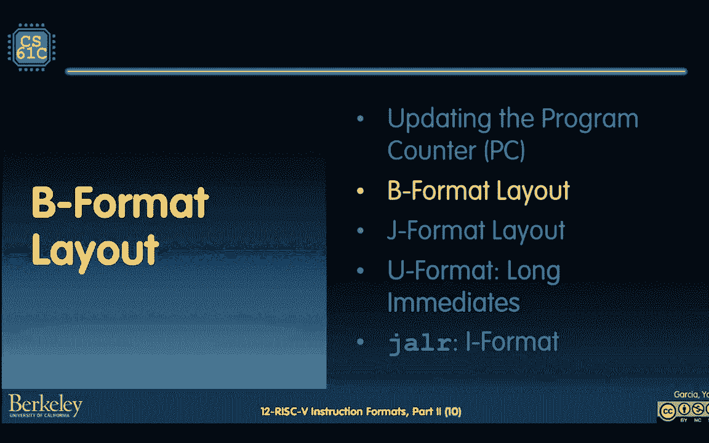

抵消，所有这些类型的事情，那么让我们来谈谈B格式，你认为b代表什么？是呀，条件分支，好啦，所以实际上这种格式，或分支，有条件，或者像条件分支，你知道那里有括号，但这里有什么例子。

分支如果等于b q r 1，R 2，然后你要跳到的标签，让我们考虑如何生成这条指令，以及它是如何类似于我们到目前为止所产生的，有两个读数寄存器，所以你把它和第一和第二进行比较，它们是否满足某种条件。

然后没有目的地寄存器，你不能把结果写在任何地方，然而，确实有一个直接的，所以我们要谈谈这个，这个媒体实际上是我们将如何编码标签风险五，一般用于标签，至少对于有条件的分支将使用PC相对寻址，换句话说。

让我点击通过，所以你可以看到发生了什么，换句话说，用于板凳，如果我们不分支，我们只需将程序计数器增加4字节，所以我们省下4个，如果我们分头行动，然后我们将此指令到标签的字节偏移量编码，好啦。

所以这是一个正数或负数，我们如何对其进行编码，我们将其编码为即时，让我们想想我们实际上可以对这个偏移量编码多少位，那么我们有什么，我们所拥有的，所以关于机器要记住的一件事是关于这些机器铭文。

风险五是他们总是有一个操作码，它在一定程度上指定了，以及CPU要做的，然后它们有另一个所有格式都通用的字段，就是他们有一个三位一体的放克三场，上面写着你要做的这一类事情，你要做这件事。

所以在B格式版本的分支中，这就像3b这个字段，这个三位字段类似于b e q或b n e或b l t，或者类似的东西，我们还有什么，我们还有什么要好好保存的，我们必须保存我们的两个源寄存器。

我们要比较的东西，我们知道他们会花五分钱，五位，每人给我们20个比特，我们肯定会用它来存储关于指令的重要信息，我们还剩下12个，然后我们要做的是，我们将有一个12位的直接场，它将代表相对偏移量。

注意这里我没有说相对字节偏移量，表示相对偏移量为，我们将稍微讨论一下这个表示法，不知何故，我们会知道或喜欢思考这个表示将是什么，我们有两个，我们有十二个比特，所以我们有2到12个可能的数字。

如果我们想前后跳跃，我们需要指定代表，所以我们实际上可以表示正二到十一，减去2到11，远离程序计数器，如果你想包括零种，那么我们会用什么样的单位呢，然后你就像，好啦，嗯。

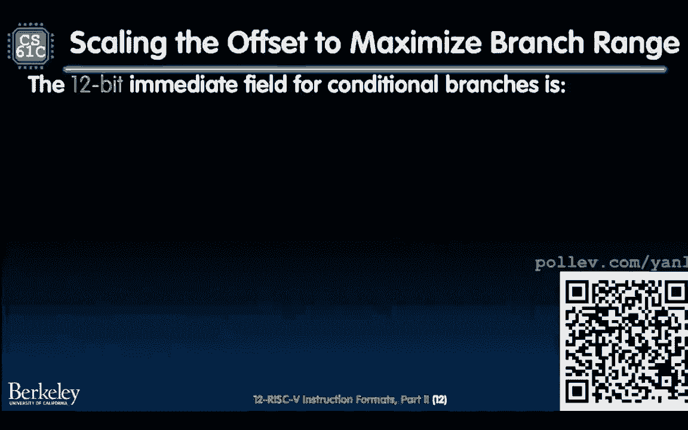

为什么，为什么我们不能用字节，以下是一些选择，我在这里说什么，我们有12位信息来表示我们想跳多远，如果我们跳下去，使得12位表示增加PC的字节数，有多少条指示，如果在这12个字节中。

如果我们真的说这十二个比特，我们实际上说过它们代表了一半的指导，每个两个字节，如果单位是四个字节呢，所以12位实际上代表了要跳转的指令数，因为风险5中的风险，它们总是32位的指令，你们觉得怎么样。

让我们试试聚V，所以我在Poly V an L有一个二维码，我给你一分钟考虑一下，和你的伴侣谈谈，这是一个密集的幻灯片，我们将更详细地讨论一下，但我只想让你考虑一下，这是一个设计挑战，如何使用这十二位。

我们知道必须签署，但是这些单位代表什么呢，是啊，是啊，试试二维码，看看能不能用，如果不行的话，下次我试试，等待演示，太棒了，这就是我喜欢听到的，我来发动，谢谢你，好啦，我觉得其实，如果我启动键，谢谢你。

啊哈，你看，我想已经开始了，我觉得挺新鲜的，他们会做一件事，U，波兰演员，啊，好啦，好啦，啊哈，好啦。

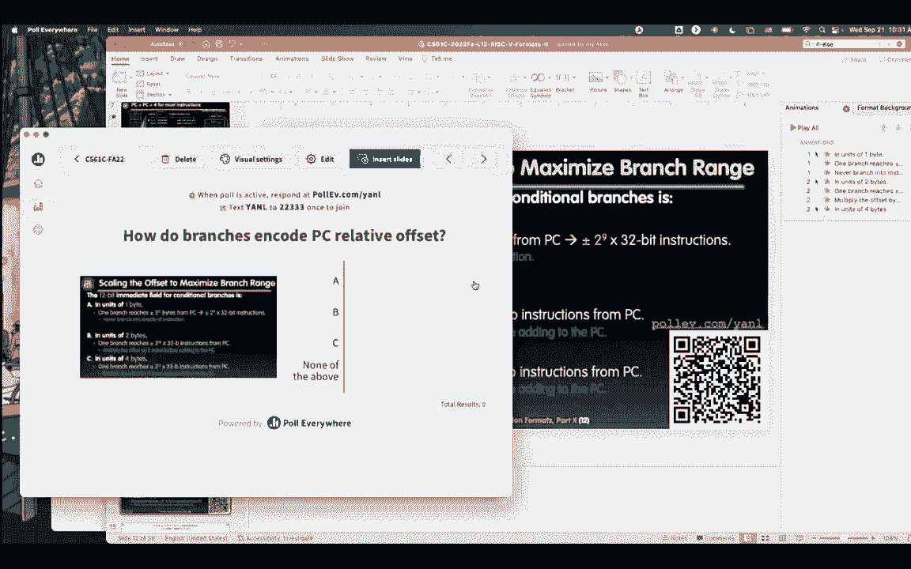

完成了，好啦，哎呦，是呀，好啦，所以你喜欢，我猜，我想大家真正想说的是，你必须有同伴的压力才能让事情发生，所以实际上我在屏幕上看到了，但在你的屏幕上，但这是故意的，所以我想这是我要走的路。

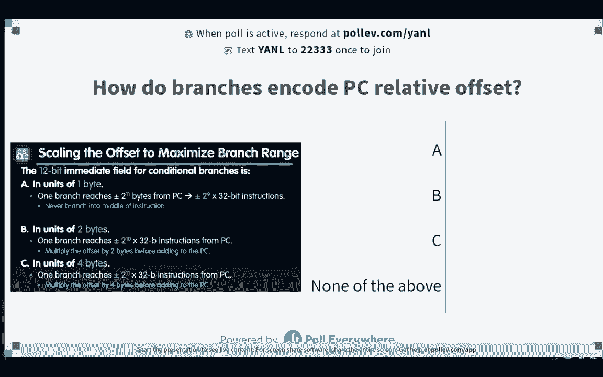

我要回到这张幻灯片，所以你可以看到东西，我不认为这会让任何人停止投票，所以再给自己几秒钟考虑一下，发生了什么事，让我们看看你们都说了什么，或者更确切地说，你们中的一些人说，好啦，这就是我们所拥有的。

我把这个弄大一点，有意思，很多人说，说呀，这里所看到的是，这些单位是以指令的大小为单位的，或者四个字节。

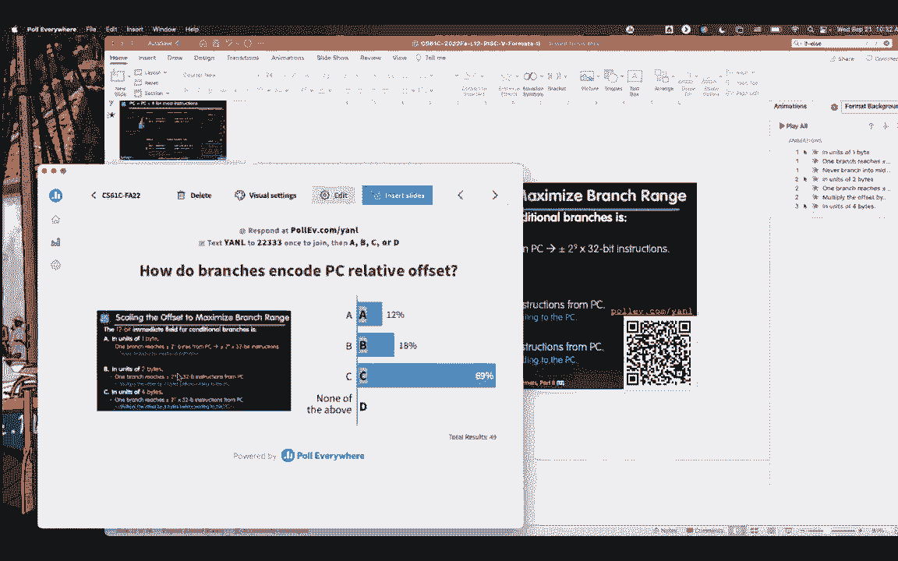

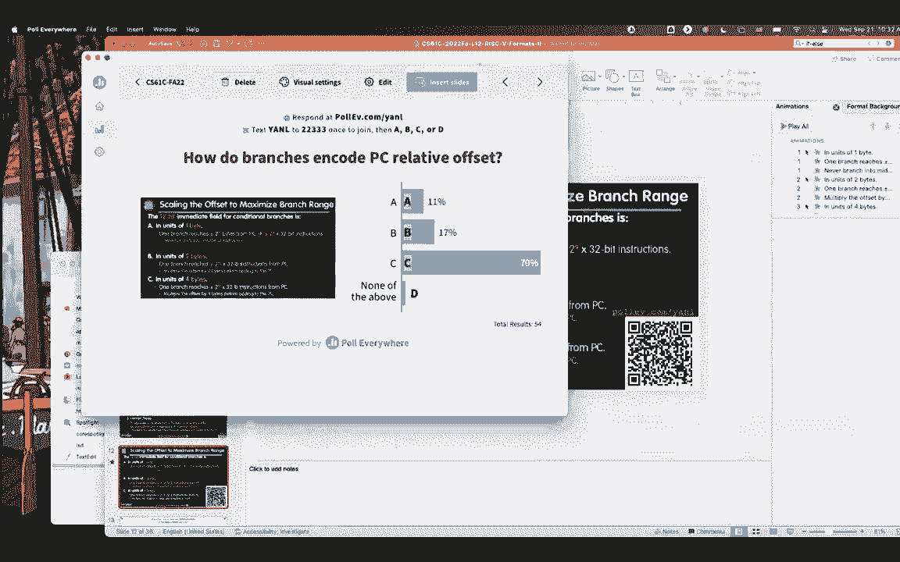

让我给你一个事实，我没有给你。

这是61岁的人，你喜欢的第一个学习机器语言的人，为什么会发生这种事，但后来作为一个人，你们所有要做的，Vlsi，你会像，哦耶，当他们这样做的时候，风险也是相当聪明的，所以这是想法五，尤其是房车三二一。

默认情况下，这是我们在这门课上学习的ISA的版本，六十四辆房车，六十四房车一号，二十八，所有可能有更大地址空间的不同体系结构，或者更多的记忆，或者类似的东西，它们都有32位的指令，团队钻头指令。

当您的特定架构非常非常小的时候，这是非常有用的，所以当你处理微处理器时，所有这些东西都像你不需要20个立即的，或者直接的12位，可能你的收银机可能没那么大什么的，所以有一些压缩版本，你可以处理。

还有一个可变长度的指令可能会发生，当风险五有不同的扩展时，有什么想法，风险被设计成这个巨大的架构，这是一个指令集，可以匹配许多，许多不同类型的体系结构，但是对于一个特定的架构，让我们说。

用于仓库计算机或个人计算机的微控制器，你可能有不同的事情想做，也许你真的想把一堆浮点塞进去，然后你需要在你的说明中有更多的空间，风险五实际上默认情况下总是支持16位指令，压缩模式，因此。

它将把我们所说的分支偏移量缩放两个字节。

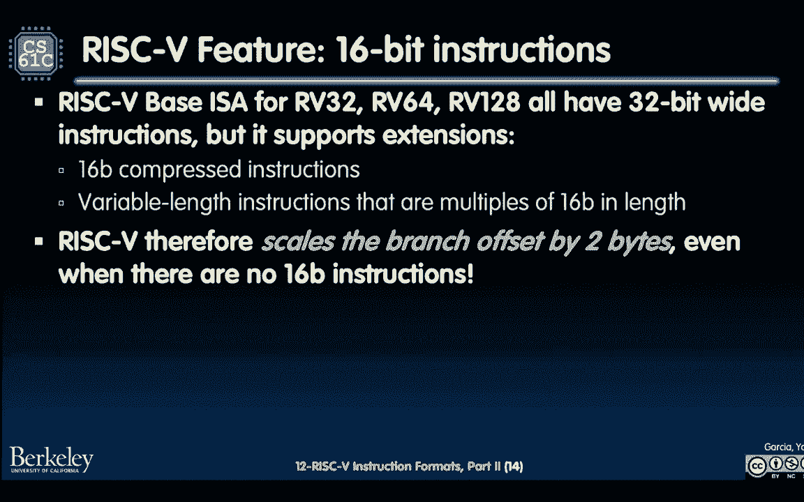

对这门课的启示是什么，所以我们有12个空间，我们可以说，好吧好吧，从这个特殊的指令，我们想更新程序计数器跳到这里，或者我们想更新程序跳回这里，在这个伟大的世界里，所有东西都是三三两两的。

所有的说明都是三个，两位宽，我们想要表示所有2到12个数字，或者在一个方向上加上2到11，另一个方向是2到11号，我们希望所有这些跳转实际上只是表示要跳转的指令数，因为这为我们节省了两个信息。

让我们可以跳得更远，但是，因为我们一直在支持，特别是这里的半指令，我们实际上只能在一个方向上跳转到一半的指令，在另一个方向有一半的指令，这对类似的人来说是真的，至少是类，因为我们处理的不是压缩指令。

但我只想指出这一点，你会看到，上一张幻灯片的答案是什么？答案是12位中间字段以两个字节为单位，就个人而言，就像使用半指令这个词，因为对我来说，但因此，我们仍然保存了一点信息，但是，为了创建字节偏移量。

我们需要将其添加到程序计数器中，我们总是只需要乘以2，这里还有一些其他的音符，为什么另外两个，不是风险五的作用，下面是一些关于设计师想从风险5中得到什么的猜测，其中之一是如果我们只表示12位。

就像字节本身一样，嗯，因为我们的指令总是在4的倍数的指令地址上对齐，较低的两个比特总是为零，所以有效地，就像即使我们有12位信息，较低的两位总是零，我们没有有意义地使用它们，所以如果我们把它截断。

把所有的东西都移过来，说，好吧好吧，而不是处理字节和地板和所有这些事情，如果我们只处理一些指令，这一个不处理这种压缩指令格式的风险五一，所以这有点像金发姑娘的事，但也是一个设计的东西。

风险五号决定用一半的指令作为他们的计数器，这里有一些关于数字的观点，呃，所以这里的意思是，如果你，递增的字节数，在一个方向上可能是正四零九，四个字节到程序计数器，再减去4 0 9，六个字节到程序计数器。

和一个二，所以为什么，积极和消极是不对称的，那是因为我们在这里用2的补数，所以有可能发生在，是啊，是啊，很多，你就像2是一个特殊的数字，所以让我们来看看在B格式方面发生了什么，让我们假设我们正在处理。

呃，所以我们所说的B格式，我们也称某人为类型，你会在课本上看到这一点，对于像以前一样阅读的人来说，所以让我们像我们像，让我们呼吸一点，说我们有RS一个RS两个，这些是我们相互比较的东西，这些是读寄存器。

因此，它们在读取字段位置，机器指令的源字段位置，我们这里有一个操作码，所有这些关闭代码将代表条件分支操作，或者实际上大多数B格式，在这些媒介中，有十二位中间体，我们把他们分开，与S格式非常相似。

因为我们想重用比特的目标寄存器字段，然后我们把这些连接在一起，这个东西不代表字节偏移量，但是半指令偏移了，然后我们把这个乘以2，所以我们实际上可以在一个方向上达到10+，在另一个方向上减去10。

那是因为一个比特是用来表示符号的，正负，然后一个比特用来表示我们需要，我们实际上是在处理一半的指令，而不是完整的指令，你在看这个，你就像这是什么这是什么，管道是这个还是这里发生了什么。

风险五还有一个古怪的地方，那实际上又是，那些漂亮的硬件工程东西之一，所以这个直接字段说的是指令的最高位，这是位索引12，第二高的位索引十，他跳过了十一点，有一秒钟，然后你从索引9到结束索引，以此类推。

以此类推你的直系亲属，突然你跳到这个区域，然后是四三二一，然后你一路往回跳，然后填位索引十一。

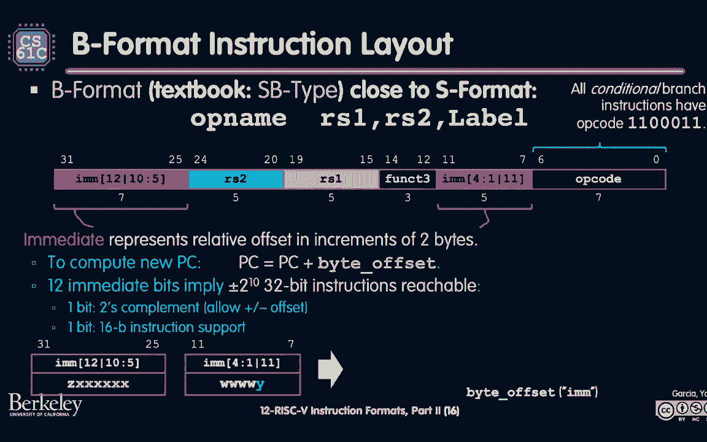

是啊，是啊，你就像什么，那么让我们看看它的图片，这里的图片确实表明我们有z，这是位索引十二，这里的索引11，这就是为什么我们有所有这些X，我们有所有这些W，如果我们试图用最小位的偏移量来表示相反的字节。

那里的指数总是为零，因为那是我们乘以2，所以这个底部的图表只是向你展示了，如何构造12位的字节偏移量，即时编码，是啊，是啊，真的真的很古怪，我们稍后会解释为什么，但我想给你看一个例子。

这样你就对这里发生的事情有了更多的内化，这是我们前面看到的程序计数器的例子，我们如何把这个b q很好地包括在内，第一步是，我们一秒钟也不担心眼前的事，让我们填写其他寄存器或其他字段，首先我们有操作码。

那将是B格式，操作码函数字段，那将是B Q都是零，一二好，这些分别是um x19和x10，所以我们把它们编码为数字19，还有现在没有签名的数字10，让我们看看眼前的，所以我试着对它进行了一点颜色编码。

但是第一步是什么呢？第一步是以字节为单位构造字节偏移量，然后我们把它转换成它的半指令版本，那么什么是，这里的字节偏移量是多少，嗯，我们将16条指令向前跳转到最后一条指令所在的位置，或向前16字节。

这是32位指令，好啦，所以只要记住一点数学。

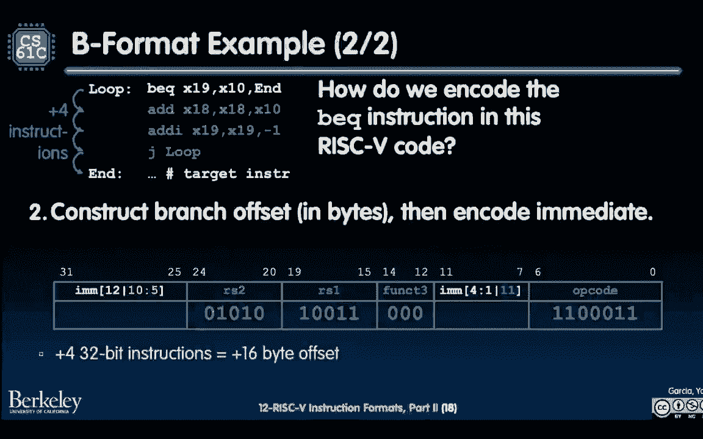

所以让我们代表16个，然后在二进制中使用十三位数字，使用13位，所以我们有一个13位的字节偏移，我们只是代表一个数字，这是十六岁还是这个，这是第四个，指数四打开了，因为这只是，十六加十六的签名版本。

现在我们有了这个编码，现在我们有了这个字节偏移量，让我们把它插到这里的编码中，发生的好事，最上面的一点，那是零指数，十到五，还有零位索引，位索引四是一全零，然后最后位索引十一零，好啦，所以你看到了吗。

这是一个多步骤版本，在这里我们创建了我们跳转的字节，然后我们把它编码到直接字段中。

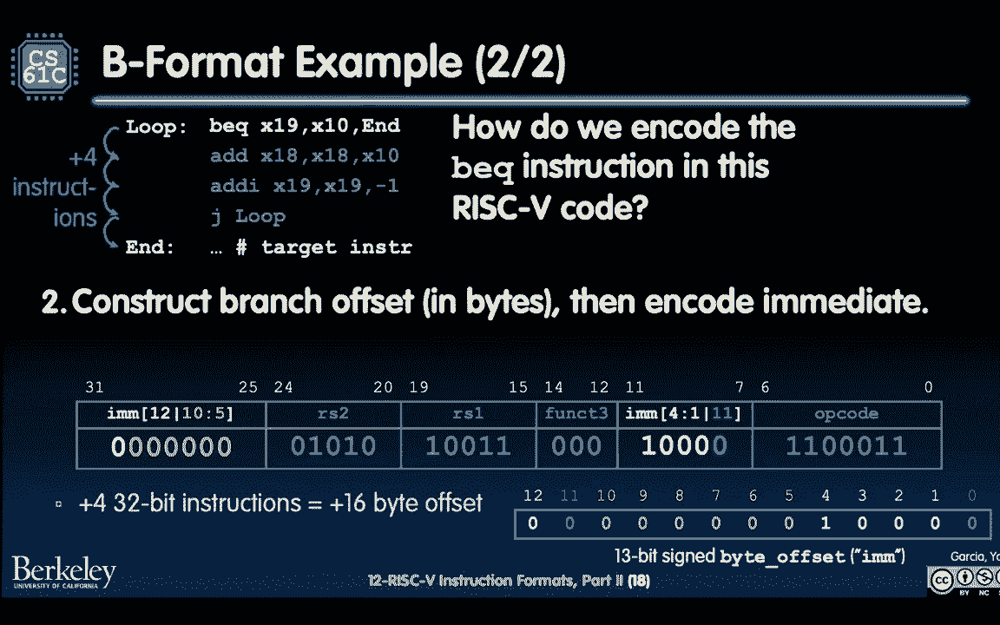

现在我要回答你们都想知道的问题，或者更确切地说，当我第一次读这篇文章时，我在想，所以做这种旋转的东西，就像我们已经用收银机做了一样，我知道你总是想在同一个地方读登记册，在指令的同一部分。

写在指令的同一部分，当然好，但是这里的直接呢，让我给你看我们目前看到的三种指令，到目前为止我们看到的三种格式，马上就用上了，请注意，这里我已经写好了所有事情的发展方向，第一名，也是I型。

我把这十二块分成上面的七块和下面的五块，我要用同样的字母来告诉你，至少在位置上是相似的，这里有一些我们首先可以看到的观察，如果我们，如果我们喜欢看这些位索引10到5，他们都一样，他们都在同一个指令中。

好啦，所以这实际上对硬件很有用，我们总是知道10个直接的会是指数3，其中一条指令等等等等，同样在底部的皮带上，我们看到1到4位总是在相同的位置，这些都是这里允许硬件的W，如果他们想把钻头。

他们总是可以选择索引的，然后导线是三位索引，然后把它连接到第一比特，以下是其他一些观点，虽然有些地方情况不同，其中之一就是我们所说的符号位，他们很抱歉，让我说这是指令中最高的位，位索引三一。

因为我们从零开始索引，有一件事很有用即使，I型和S型，这是比特索引11，对于bb类型，它是位索引12，有用的一点是，这总是最高的位，这是由指令表示的，这就是我们所说的符号位。

你涂抹的部分立即填充整个三个两个部分，所以这对于硬件在这个位置总是有最高的位仍然很有用，现在有一个B类型有一个13位的表示，因为末尾的隐式尾随零。

就像注意到这就是为什么这里有索引12，在另一边，我们也有一点不同，就是有点七，在f格式中，这实际上是位零，但在B格式中，这是11位，但是，除此之外，中介都一样。

就如何将指令的各个部分连接到你的直接本身而言，这对硬件来说是非常有价值的，那么这里你将看到的编码的要点是什么呢？我们刚刚走过，关于如何从bq格式的字节偏移量到b格式的字节偏移量，到这个即时编码。

你会看到这个编码，它对硬件非常有用，一旦你在项目3中开始连接你的CPU，您将实际看到这个值，但现在你喜欢，你知道的，只要练习一点点，就能流利地使用它，好吗，这些都是格式说明，我不打算再过一遍。

但它在那里，以防你想看。

然后现在我想涵盖接下来的几个跳跃，或者说，呃是的，接下来的几个跳跃是为了让我们这样做，这就是我们到目前为止所讨论的，即条件句，如果是循环，当循环时，所有这些通常都使用分支B格式，通常很小。

所以2到12位的跳跃位置，或者实际上是2到正负2到10的跳跃指令，这是可行的，但是，如果你想跳得更远，让我们说，例如，你有一个相等的分支，然后这远是超级超级远，这个标签超级超级远远超过十个指示，嗯。

您可以使用无条件跳转，所以我相信我们在上一节课上已经看到了这一点，但它不是，我会解释的，所以使用无条件跳转的等价代码，有更多的空间可以使用的是以下内容，而不是检查，如果事情是相等的，然后跳转检查。

如果事情不对等，然后跳近，下一条指令记住如果等价的话，那么您只需将程序计数器递增1，现在在这个指令中，你可以跳超级超级远，好啦，所以这是一种，这是我们看到很多，我们正在做的C代码。

然后我们试着把它编码成多个组装指令。

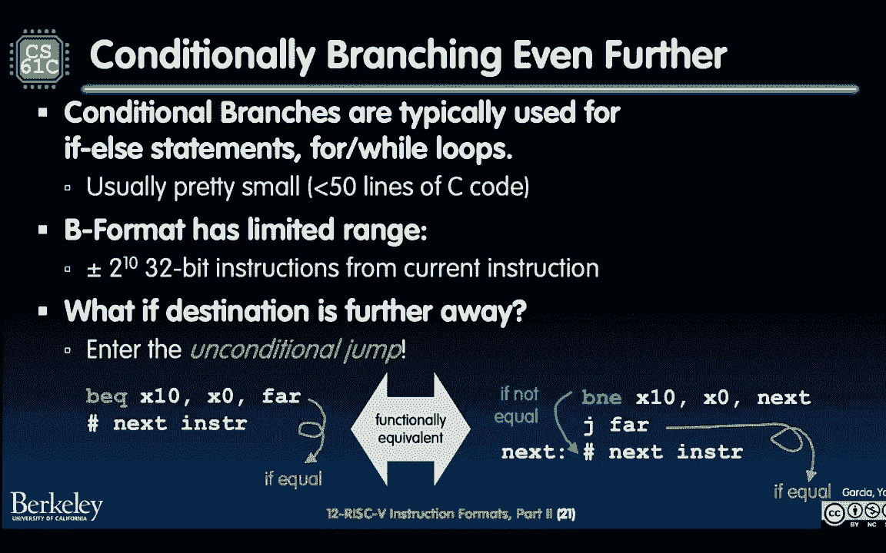

处理机器代码本身，61 CS金星为你做了很多，但了解原因是有用的，在汇编中实际编写的指令比实际编写的指令多。

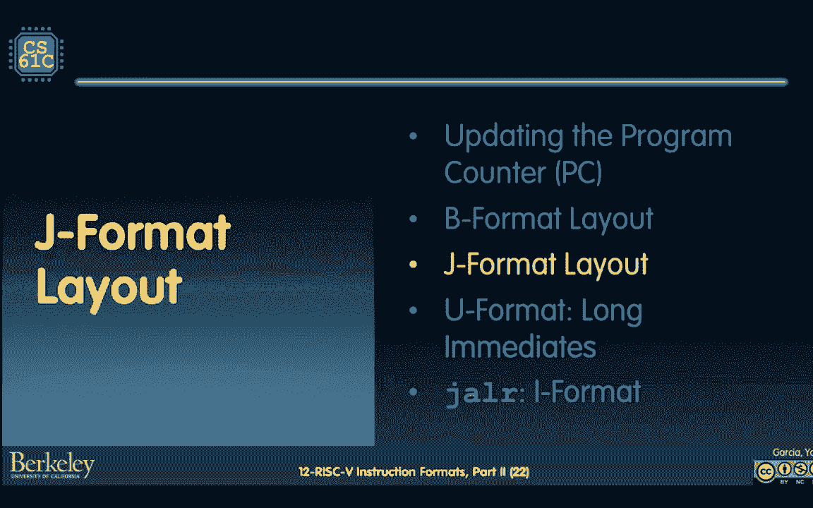

让我们来谈谈跳跃，到目前为止你所看到的，跳转链接，可能是个更好的名字，正如链接和跳转所做的那样，它跳到标签上，但在它跳到标签上之前，上面写着回信地址，因此它将以下指令写入您提供的任何目标寄存器。

我们已经看到了一些用例，其中一个确实是对函数的调用，例如，这个J A L是一个放克标签，这将跳转到放克标签，然后还将下一条指令存储到返回地址，命名寄存器x 1，我们刚才在上一张幻灯片中看到的另一件事。

如果你想跳得更远，您可以使用此跳转标签，或c，对不起，其实我们还没有看到，但不管怎样，到目前为止我们看到的另一个是无条件分支，如果你只是想跳到一个标签上，您可以使用pseudo指令j标签。

它有效地对实际指令jl做了同样的事情，但它丢弃了返回指令，是啊，是啊，有一个快速的问题，是啊，是啊，这是正确的，是啊，是啊，所以你可以想想，让我们看看，让我们看看灯板在这里能不能用。

所以你可以认为如果你有一个跳跃，所以嗯就像，假设我们把它放在某个寄存器里，然后我们跳，程序计数器当前位于此指令的开头。

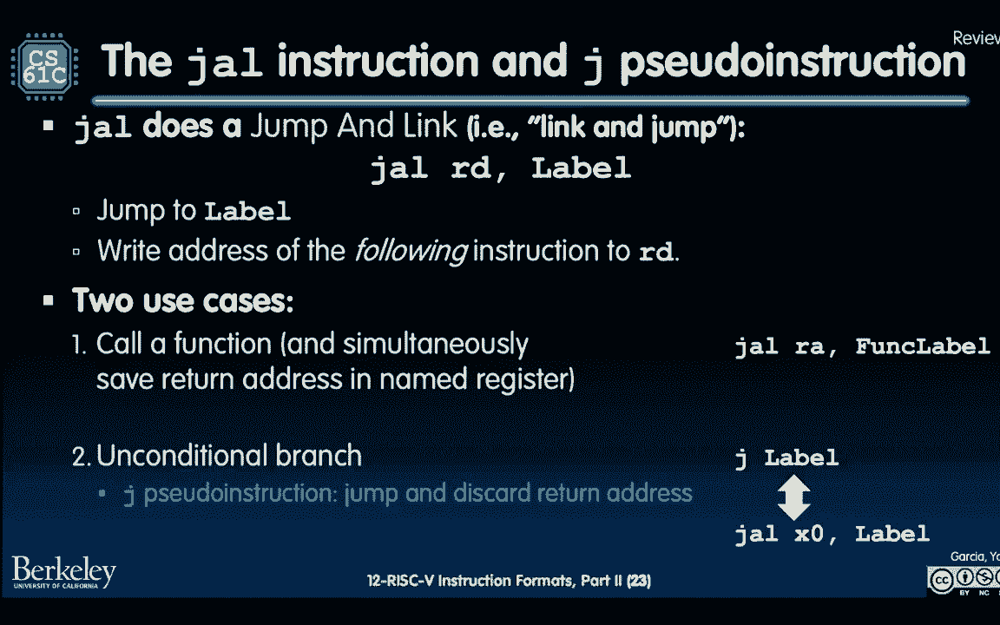

然后我们说，实际上，我们想把程序加四保存在这个家伙身上，是的，我们会在下一张幻灯片上看到，所以也许我真的应该跳到下一张幻灯片，那么这里的解释是什么呢，解释是我们，如果我们跳标签，在这种情况下是机器。

对于机器代码，我们要给程序计数器加一个相对偏移量，然后如果我们要写地址，以下说明地址，然后我们将把当前的程序计数器加4保存到寄存器中，所以这实际上就像，如果你，如果你一直在看参考表，你就像啊。

我终于明白这台电脑的意义了，PC Plus对于所有这些不同的东西意味着，接下来我们看到的无条件分支，这实际上将允许您进一步跳转，对于条件分支版本，让我们看看这个布局，相对简单，从某种意义上说。

J格式布局的全部要点是允许更长的跳转，更长的无条件跳跃，称为J格式，你会看到它被称为uj类型，如果你在看教科书，它已经，操作码和目标寄存器来存储PC，加上4，我在这里放了一个小肿块。

然后它有一个很长的直接，好啦，所以除了寄存器，除了操作码，这是因为这种格式只有一条指令，我们不再需要函数三了，我们有这个20位即时，它像以前一样疯狂地旋转，这又是一种将所有的部分排列在一起。

但这里有一些关于现在可以到达的东西的说明，请记住，以前我们有12位要处理，现在我们有二十个比特要处理，它仍然表示为半指令的跳转，就像半指令的单位，或者两个字节，因此，即使我们有20个比特。

我们去掉一个字节来表示符号，然后我们取一个位代表符号，然后我们去掉一点来表示我们要考虑的这一半指令，当时我们不会看到这样的例子，因为事实证明这更像是，你写偏移量，然后你就像把它映射回眼前。

所以你可能会在讨论中看到一些，当你工作的时候，跳得更远怎么样，你就像至少20块还不够，让我们继续走，以便跳得更远，注意我们到目前为止所做的，在j格式中，我们几乎就像，除非我们完全摆脱注册目的地。

我们实际上已经达到了存储空间的极限，立即进入，因为我们的操作码总是7位，我记得上次有个问题，喜欢好，七位，似乎我们只处理六种格式，就像七个比特，这里发生了什么事？你还记得我说过，风险五有延期。

原来很多扩展信息都写进了这7位，还有RV3 2和RV64，房车一二八，它们也被编码成这七位，所以我们不会谈论太多操作码的来源。

但这只是向你展示了它的位置，所以让我们来谈谈如何存储更多的信息，为了做到这一点，我们必须涵盖新的格式。

u格式如下所示，它被称为u是因为它代表上直接，让我展示一下你看起来很像J格式，是啊，是啊，但现在它不做任何跳跃它，只是一个普通的指令，是什么类型的指令，这里有两个说明，我要介绍，其中一个叫路易斯。

不是国王，但是鲁伊，然后还有一个UI PC，通常是这个首字母缩写，然后这里的其他东西，上直系亲属所做的是，上面真的说有个目的地寄存器，我的目标是更新这个登记册，特别是更新寄存器的上位，那么它擅长什么呢。

直接操作数，或者，让我们说，这里直接的20位，它们实际上代表了你要做的任何事情的前20位，你做了某种手术，然后你把它存储到这个目标寄存器中，注意这里，这完全不同，到目前为止，我们看到的许多其他媒介。

因为这次它不只是移动了一点，但它移动了12位，所以直接的确实代表了上面的20位，因为我们的中间人，至少在这个架构中。

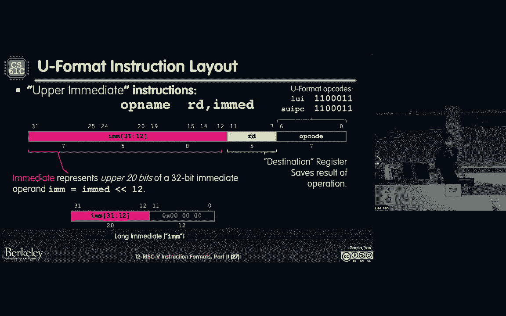

你就像有什么样的手术，嗯，其中之一是简单地将我们使用的即时操作数保存到目的地，这就是我们所说的路易斯，L u i加载上立即看起来像这样的，那么这意味着什么呢，我们创建移动了12位的操作数。

Fait进入目标寄存器，这就是路易斯，有吗，为什么这个有用，它现在终于让我们，经过这么多天创造了一个3位2位的值，上一次我们只能创建一个12位的值，但现在我们可以填满上面的20位。

我们可以创建这个3位2位值，让我向你展示如何，你把上面的20比特或5比特装上，然后你添加到同一个寄存器中，下面的三口，下十二位，就这样了，太完美了，实际上，这就是我们的伪指令李，如果你一直在用它。

这就是它的作用，上面说，啊，如果你必须推入12个以上，下面的十二位，它将添加一个路易，允许您保存这些信息。

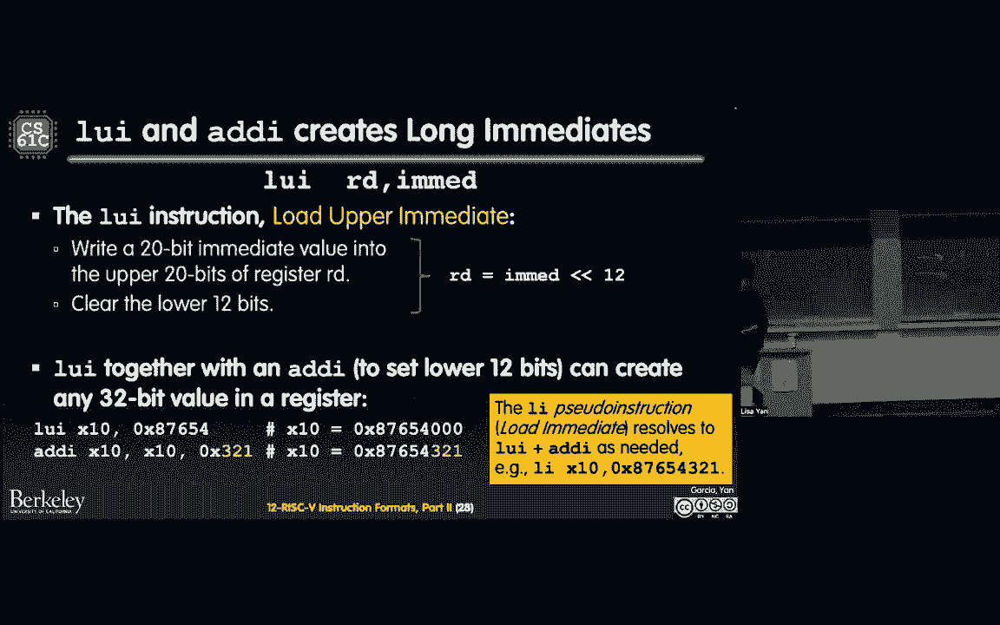

你就像，太完美了，这就像这就是我，这是巡航，就像，我甚至不用使用伪指令，就像，我可以只是路易和添加，我和我总是能节省三个两个比特，有一个警告，当然可以啦，但同样，这些警告是美丽的。

那么我们应该怎么设置波巴咖啡馆呢，如果这是我们的八个，呃八点或三点半，两位，立即，我们想储存的，让我们试试我们刚才在上一张幻灯片上看到的，上面的五个咬b零b c，然后加入下面的三口，阿菲，你得到了什么。

哦不，你得到了波巴自助餐，这里发生了什么，发生什么事了，记住我添加了什么，我说你马上就有信号了，因此，因为一封短信，十六进制字母a的最上面的部分确实是，它实际上会把整个事情弄脏了，你真正加在一起的。

在上面的五个小点中，你加在一起，波巴c和减一，然后下面的小点你只是在加零，然后一起，所以你最终会得到什么，你总是在较高的地方减去一个，较高的位，这不是你想要的，那么这里的解决办法是什么，风险五，好的。

好的，你知道这是合理的，你知道我们不想改变我的工作方式，因为我们总是希望加i正确地扩展，所以我们要在我们的LOI中添加一个，这是我们的目标，创建常数时，所以我们总是在上面加一个，如果我不总是这么说。

如果我们知道较低的位，它将在这里被分配编号，然后我们在上面加一个，然后标志的东西会自己解决。

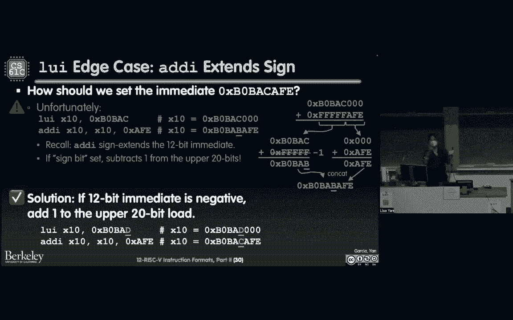

你就像，我永远不会做路易和阿迪，再一次，这是正确的，所以这张幻灯片的要点是用低即时，伪指令将向下编译到正确的，或者我们将组装到正确的路易，并根据需要添加眼睛，然后你就不用处理了，你就像没事一样，嗯。

如果我们总是马上装货，为什么你要给我看幻灯片，你将在项目中看到的一件事，实际上在这个项目中，现在您必须调试您的机器代码，一次，如果你看到一个随机的路易，如果你看到一个常数，这似乎不是你要做的常数。

你想回头看这些幻灯片，好啦，汇编程序正在做一些事情，实际上允许我编写我的汇编代码，我想要的方式，好啦，再等几分钟，我们将再讨论一个概念，AP C然后最后一跳，漂亮的跳转和链接寄存器，仍然是U格式。

这是我不想给你看的东西，丹，我不想像上周那样给你看，因为这实际上是处理程序计数器本身，将程序计数器存储到目标寄存器中，好啦，你还记得今天刚开始上课的时候，我就像程序计数器，就像墙上的日历。

然后你必须使用的所有寄存器都在这里，UI PC复制日历，向其添加一些信息，然后把它拍在你的桌子上，所以它是这样使用的，如果要增加程序计数器，比如，如果你想添加一些偏移量，并将其存储在x5中。

你可以在实践中做到这一点，最常见的用例是在PC上复制，就像你现在拥有的那样，好啦，所以你可以在这里看到，如果您添加了，如果你提供即时的零，很自然，这就像把零的上位和零的下位相加。

然后真正存储当前程序计数器，这是你在X5的标签上的地址，所以这是一种打开盒子的方式，你在程序中的位置，对J有用，R。

今天最后一件事，我知道我们经历了很多，但希望这会像，对你到目前为止所做的所有风险五鞠躬。

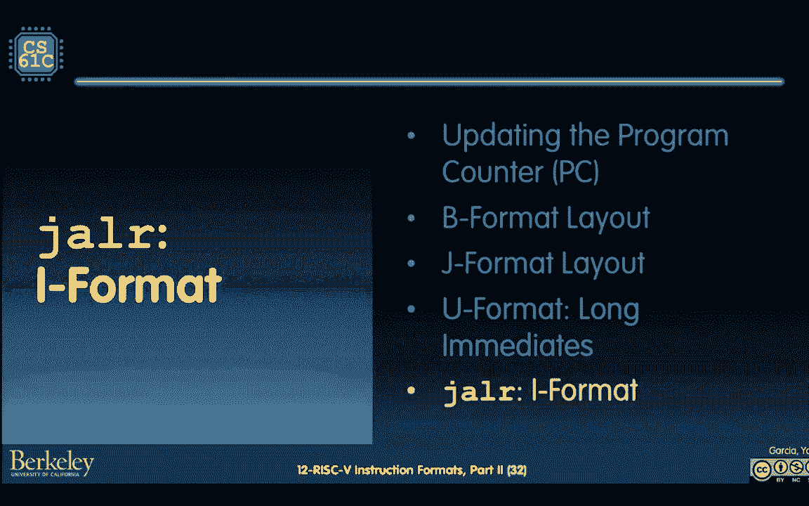

跳转和链接寄存器，这是我们见过的最后一个，我记得上周丹尼尔说，有很多问题，就像这两者有什么区别，为什么你会用jl和jr，让我们提醒你一下格式是什么，J a l r做的事情和J a l很相似。

但现在不是有一个程序，这是更新程序计数器的相对偏移量，它说不，是呀，亲戚从RS中得到实际地址，得到所有的三个两个位，根据需要添加相对偏移量，然后更新程序，节目遭遇，所以它真的在做绝对的寻址事情。

我们在刚开始上课的时候，它仍然做第二件事，所以它仍然将回信地址存储在，或者就像你知道下一个指令是什么，它仍然将其存储到注册目标中，但希望你能明白这就是为什么这里有一个额外的论点。

因为它没有从电脑上得到原始指令地址，它从rs1获取指令地址，到目前为止，我们只是在返回方面看到了用例，但现在希望你能明白为什么，果然转好了，因为它真正的意思是这个伪指令jr返回地址，下一条指令。

我不在乎下一条指示是什么，但把电脑更新为我的回信地址，加零。

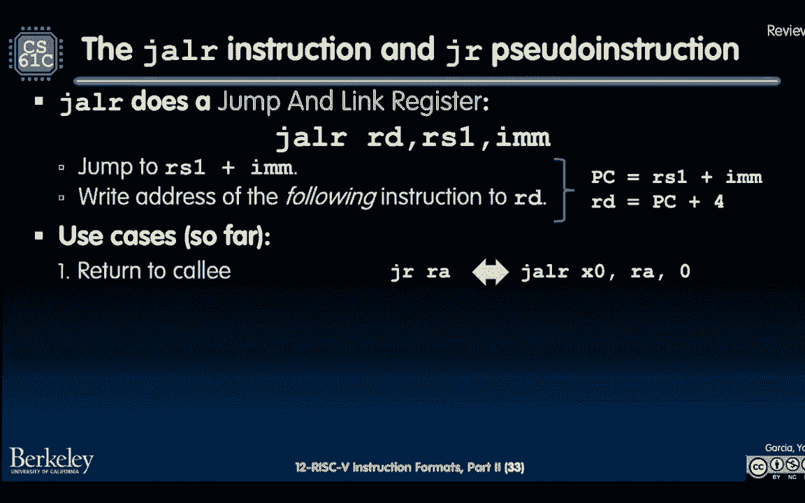

I格式看起来很简单，嗯，事实证明，您只需使用i格式，但它有一个不同的操作码目的地，立即注册源注册。

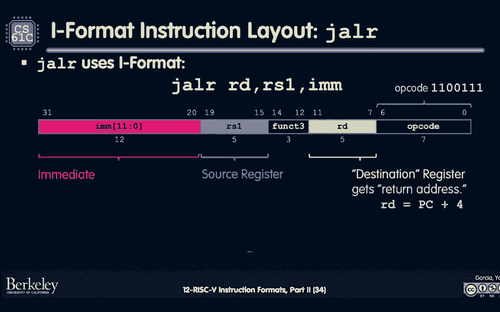

我只想结束这最后一张幻灯片，不像JL只能跳转20位，J a r实际上可以让你跳得更多，因为你可以创建完整的3个2位地址，然后跳，所以祝你周三愉快。

今天星期五办公时间见。