# CS 61C at UC Berkeley  - Fall 2022 - P18：Lecture 14 Intro to Synchronous Digital Systems - 这样好__ - BV1s7421T7XR

所有公共软件存储库的21TB快照，主要用二维码编码，那不是很迷人吗？位于挪威一座山中250米处，这个档案程序说希望是，通过存储和索引数以百万计的存储库，我们捕捉到了现代软件世界的一个有价值的横截面。

设计了一千年的档案，一张快照储存在一百八十多卷胶卷里，所以现在这很迷人，我希望你们都考虑一下自己的个人数据备份计划，我敢肯定你创造了很多东西，手机，电影，你所做的一切，你写的所有代码。

你是怎么把它备份的，无论你的计划是什么，你有能力对任何移动设备的丢失做出反应，所以只要确保，你关心的东西没有一个只在移动设备上，消失的瞬间或掉进水里或掉进水里，它不见了，你要确保它已经沉入云中。

沉到这个，现在有一些隐私的东西对吧，人们知道你有你的私人照片，可能是健身什么的，我不知道你在做什么，但你在做一些，这些照片真的想保密，吊杆，他们进入云端的那一刻，他们可以被黑，这是一个令人担忧的问题。

所以我很感激，但无论你做什么，确保你对失败有弹性，我们学到的一件事--计算机体系结构的大思想--是，冗余，所以要确保数据在多个地方，好啦，所以你想想，当我们谈论谷歌和开源软件以及备份时，确保这一点。

我想我有四个不同的地方我的数据试图同步到，万一我弄丢了我孩子的照片和所有的东西，所以非常重要，东西，好啦，我们开始吧，女士们先生们，欢迎来到CS 61。

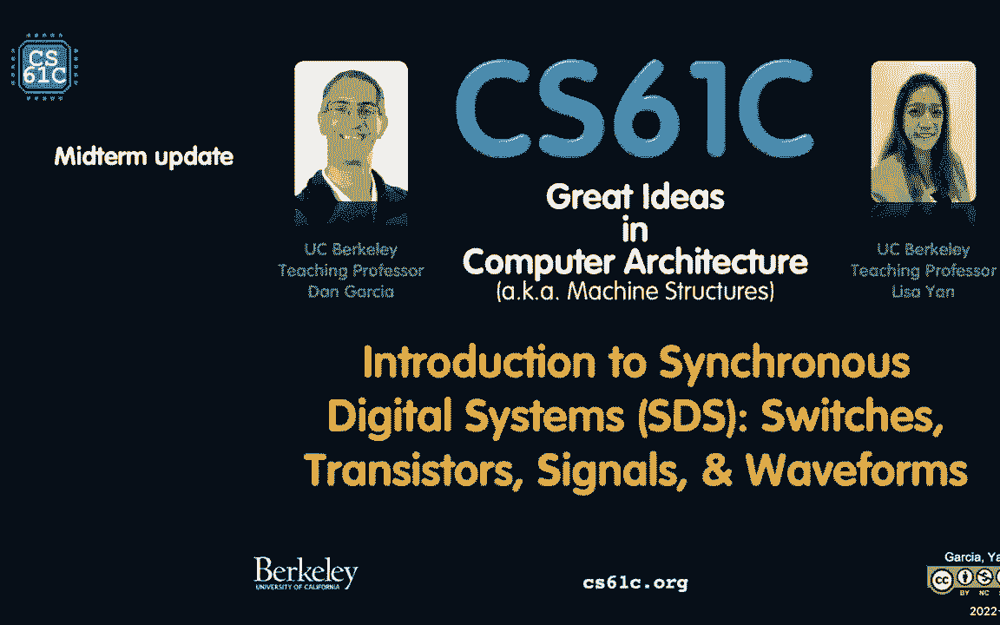

参见一个名为同步数字系统导论的新讲座，也称为SDS。

如果摄像机能把我放大，我这里有一个小演示，这是我几分钟前编程的微型位，我要给你一个小消息，你能看到这里的信息吗，我们准备好了，走哦，让我看看，你能看到留言吗，好啦，上面写了什么，C六二一C SD。

今天我们要学一个新题目，我想在那里给你一个小小的庆祝，所以是的，是呀，大人，哎呦，摄像机开着，我们知道为什么，哎呦，摄像机，照相机怎么了，谢谢你，摄影机开着，是啊，是啊，摄影机有问题，后面的摄像机坏了。

或者我没有设置变焦，至少能帮我解决这个问题，我以为我做的是对的，开始了，这是我的，开始了开始了，我们在做一件事，摄像机不在那上面，相机不是很好，我们可以把东西藏起来，谢谢你，是呀，是呀，好啦。

所以我会再按一次按钮，好啦，开始了，你不必做呜呜，我们再次，我就在这儿，把摄像机给我，我们走，谢谢你，很抱歉，我没按对按钮，好啦，我应该给你一个期中考试的最新情况，人们已经被审问过了，你知道的。

想知道期中考试的计划是什么，期中考试将在三周后举行，大约两到三周，交易是这样的，我想我在第一节课上就说过了，但我会再说一遍，期中考试有两部分，会有一个带回家的，你在家工作的期中考试，未经检验。

我们信任你就像，我们把项目托付给你，未经检验，你要单干了，这将是你的C编程和你的风险，完成5个方案拟订，都搞定了，没有时间，只要能把它压碎，我们会给你所有的测试用例，让我们有快乐的快乐，好啦。

所以你只要工作直到你得到测试用例，有福了，你把它压碎砰，提交，你们都完了，你知道你在银行里得到那些积分在银行里，然后你们要进行80分钟的考试，就像你在实验室里有90分钟的时间。

但是从一个班转到另一个班需要十分钟，所以八分钟的考试，我们会试着写出来，所以我们的助教可以在20分钟内完成，在那里你去草原，学习，你只会回答问题，但重要的是，你没有学习表，所以这只是字面上的。

你冷冰冰地走进来，我们要把你交给，我们所说的报价，未引用，绿色床单，也就是，我想在这一点上，它被吹成了五页的东西，这是在网页上，所以这将交给你，所以所有的哦，咬什么，看起来像，什么是一一，零零和c。

文件上有，什么是，风险五转换，这就是我们翻译过来的绿表上的所有内容，所以所有这些都将给你，所以你可以看着它说好，如果上面写着，我不需要记住它，否则你需要记住它，你会被要求做什么，你会被要求做这些事。

同步数字系统可以被要求做一切，到了考试的时候，这不是在编程方面，C和风险5在那边，剩下的，我们已经询问了您关于数字表示或基本转换的问题，你一定能做到，事实上，您需要能够从任何基转换到任何基，你会喜欢。

这不只是我教你的，我能教你什么，然后你如何从中学到其他东西，我教了你如何在二进制十六进制和十进制之间转换，你应该可以推断从任何基地转移，就像三垒到五垒，你应该能做到的，所以练习一下。

确保你知道那是为你而来的，好啦，所以这两个基本的转换，浮点，我们还没有在编程方面测试过你，是的，我们还没有测试你，可能是风险五，这些碎片是什么样子的，因为这不是在编程方面。

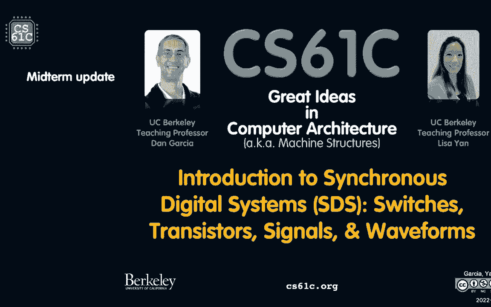

这就像如何编码一些东西，但这些碎片是什么样子的，如果我能从碎片，给汇编程序的机器代码。

或者把它组装成碎片，丽莎上周做的那些事，电话接通，那是在笔试上，我说，SDS与浮点，所以所有那些，所以基本上，这是一个比61年任何时候都轻量级的期中考试，因为我们会相信你，单独解码。

在没有计时器的情况下进行编程，就像一个真实的面试问题，你知道一些谷歌采访，说嘿代码，一些东西，你想花多少时间就花多少时间，这就是我们要给你的嘣，然后我们就和你在一起了，最好知道剩下的东西是冷的。

挺干净的，我希望你们都能把它压碎，我们都想有一个所有模特的王牌，所以我们希望你们都粉碎它，我希望你们所有人都能把这部分做得很好，我希望你们所有人都能把这部分做得很好，提前告诉你，会发生什么。

这就是我们现在正在做的事情，在后勤方面试图弄清楚，我们有750名学生，你什么时候能赶上那80分钟的时段，大约90分钟的时段，十分钟的过渡，所以这是一个80分钟的例子，你什么时候能来。

所以有很多关于这一点的调查，我们在找房间，还有这些废话废话，你用实验室，用你的笔记本电脑，所有这些事情，你有笔记本电脑，在不插上电源的情况下可以工作80多分钟，然后我可以把你放在房间中间像这样。

还是必须插上电源，但我们必须有电源条和所有这些东西，所以我们正在研究所有的细节，但物流显然仍有待解决，但计划已经准备好了，所以给你一些东西，一些用C语言编程的东西，然后摇滚到你的无学习表，离开它走进来。

我们给你一点点，你知道的，绿色床单和你的摇滚，好啦，有问题吗？这就是中期更新，希望你能用，这样做的目标是有一种新的方法，我们在61 C中评估，这使得您不必担心编程方面的时间安排。

但也要确保你知道这些关于非编程方面的问题，是呀，我们会给你草稿纸，所以我们会给你一些草稿纸，我们会收回来的，所以你可以写你需要的一切，然后我们从你那里拿回来，因为当我做那些小事情的时候，我也用草稿纸。

问得好，是呀，还有什么关于期中考试的问题吗？

埃德埃德会有所有的细节，当我们离约会越来越近的时候，太棒了好吧，我们去开关。

所以今天我们学习同步数字系统，什么是开关，所以大局，听我说，你以前见过这个，我要给你们看四五张幻灯片，你以前见过，这是老派的大图景，六一C是ISA就在中间，这个讲座是一个新模块的开始。

所以如果你之前很困惑，没关系的，全部重置，从字面上看，这是每个人的重置，我们现在在做什么，我们有点自上而下地接受了ISA，我认为丽莎结束了一天的工作能够从任何应用程序，你显然可以编码并看到一直到风险五。

一直到编译器，汇编器，链接器和加载器，带L的卡尔，所以你现在处于ISA的水平，那很酷，现在我们来看看这张照片，喜欢咬一个喜欢，从底部咬汉堡，我们要从最底层开始，一直到建立一个运行ISA的系统。

从字面上看，你会从上到下拥有整个东西，当这种情况发生的时候，这是令人惊讶的一天，我们从这幅画的底部开始，我们要努力向上。

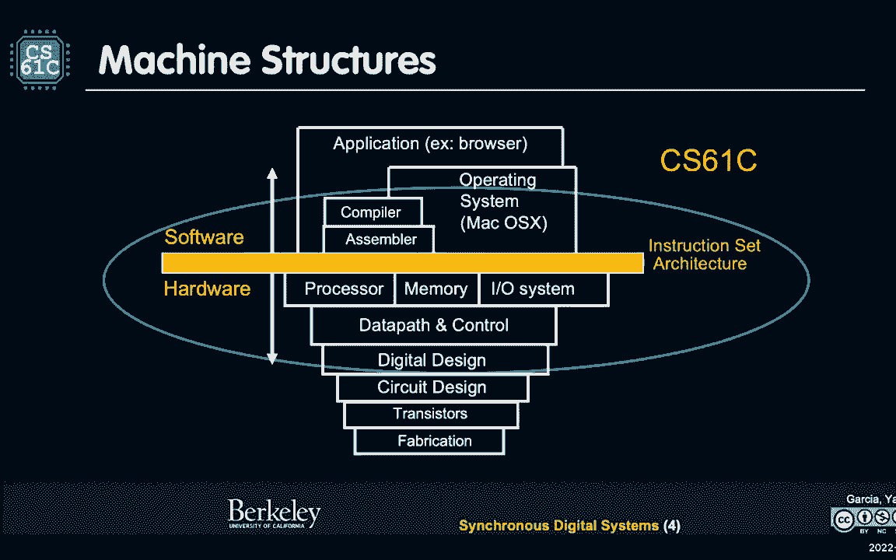

新的学校机器结构再次，你以前见过这个，我们在硬件描述或逻辑门的最低水平。

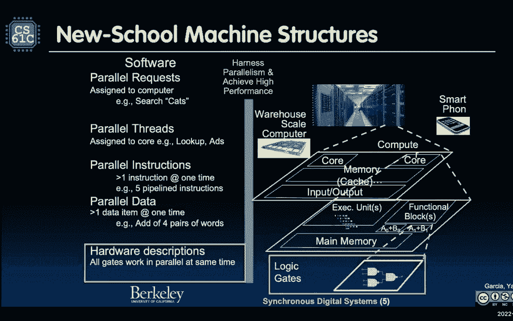

再次，中间是ISA的照片。

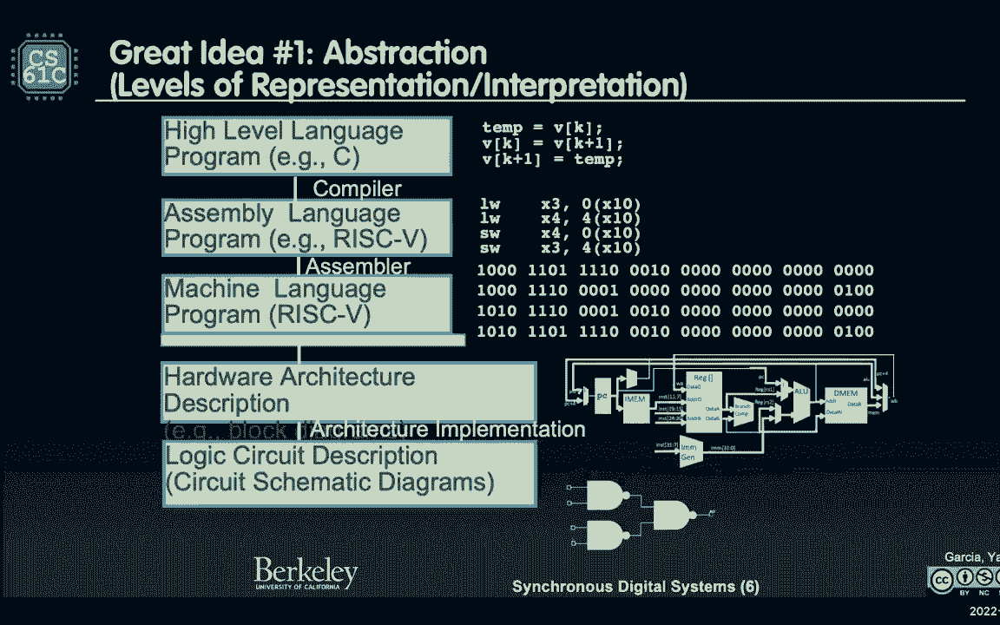

这是我们的抽象层，我们将在这里，在下部远离底部工作，一路向上，每次演讲，我将在前面讲座的基础上再接再厉，所以这一节我想是连续四节课，我们要建造我们的道路，然后我们要继续建设，你要建造的CPU级别越高。

那真的很酷，这是一堂很棒的课，这门课不是我发明的，我继承了这门课，太神奇了，我们继续添加丽莎，我和其他老师都加入了我们的小作品，但这是一门很棒的课，然后呢，我很荣幸能教这些美妙的东西。

我本科时最喜欢的课程之一，可能莉萨在本科时就选修了这门课。

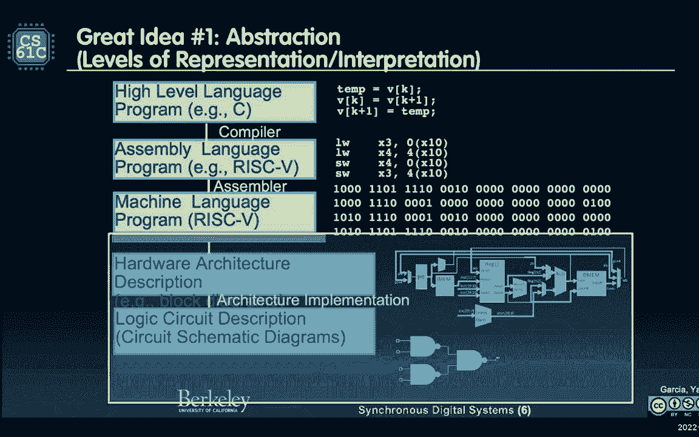

我在麻省理工学院上了他们的课，我们喜欢这东西，所以我们很高兴来到这里，所以我们说的是同步数字系统，那是什么意思，这些话是什么意思，同步这个词就像心跳一样，我的麦克风要看，就像我手指上的假心跳。

但是一个系统中的时钟有规律地连续运行的想法，有频率或周期，就像心跳砰砰砰砰，说做点什么，做某事做某事做某事的意思是运行指令，增量，电脑，继续这样做，字面上保持处理数据。

这就是我们的同步系统将以数字方式运行的东西，说世界是，我想我的第二堂课，世界是模拟的，但我们要把东西转换成数字世界，我们讨论了如何做到这一点，通过抽样，我们看到如果你有一些数据，然后你量子化了。

我们看到了这两个想法，电信号，我们要量子化成，不是伏特，但是1或0，所以我们有两个不同的值。

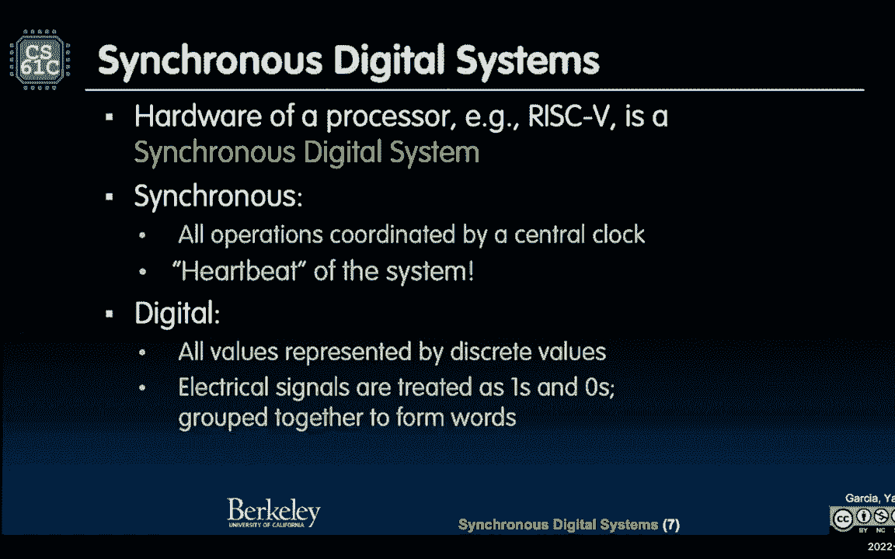

我们将以抽象的方式把它们分组，形成单词，你马上就会看到，它很酷，所以逻辑设计，顺便说一句，还有其他课程，如果你想了解更多关于这个的信息，一百五十元是很好的菜，一五十一，有一些很棒的后续课程，事实上。

如果你今天爱上了61 C苹果会很高兴见到你的，如果今天就像，我的天啊，我做不到，这是最神奇的新材料，苹果想雇你，有这么多人，他们在制造自己的硅，所以他们不能雇佣足够的人来制造自己的硅，他们想把一大群人。

所以我们希望你能爱上这个米切尔和苹果，尤其是爱上这种材料，然后说我想参加后续课程，151然后是接下来的比赛，你知道的，工作在等着你，有很多钱，你拿他们的包，他们拿了你的包，乡亲们，所以这真的很令人兴奋。

好的，好的，所以我们将讨论如何从下到上再构建一个处理器，了解最低的最低水平是如何，电流是如何均匀流动的，电压是多少，然后一路向上，为什么我们很关心硬件设计，当我们运行软件时。

了解硬件是如何工作的实际上很重要，所以他们说我是个软件人不，但了解硬件级别上发生了什么实际上很重要，事实上，这就是六二和c的特别之处，这将是，假设你决定成为一名软件开发人员。

你的余生都要知道它是如何运行的，会让你成为一个更好的程序员，当然，知道你将学会如何优化它，这个词你还没学会，现金是下面东西的一部分，如何管理自己的记忆，所有这些都能让你成为一个更好的程序员，你看。

它真的可以让你在那个水平上触摸硅，所以理解硬件是非常重要的，你在想处理器，他们擅长什么，什么不，他们做得很好，他们什么时候会失速，其中一件事就像放慢速度，变得黑暗，我的表演有点慢，是啊，是啊。

因为你不知道引擎盖下发生了什么，一旦你明白了，你避开那些时候，你试图优化时间，在那里你可以做事情非常快，而且非常有效，还有更多的课程，一五二也是我们150系列的CPU设计课程，顺便说一句。

伯克利是我们的硬件系列，你可以用标准处理器做很多事情，所以有些，有一个全新的运动，为非常专业化的东西设计定制硬件，这很令人兴奋，这是一个奇妙的领域。

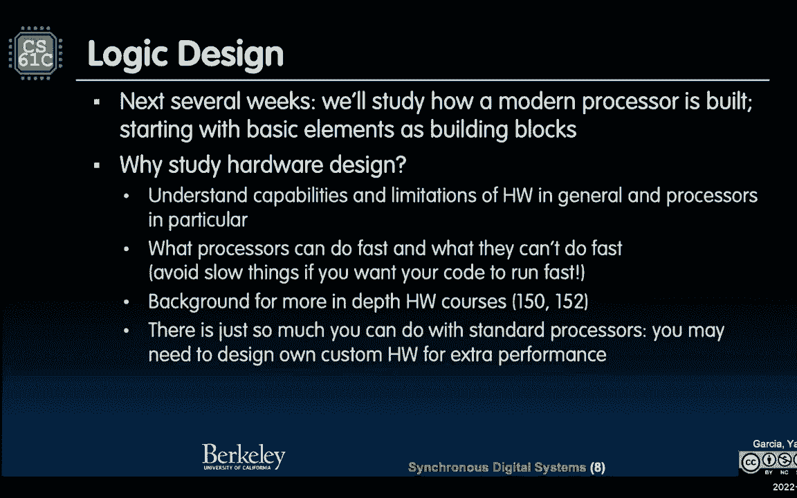

如果你决定跟随那个字段，这是一个简单的电路，让我们一起看看这个并理解它，这是一个开关，现在是一个开关，它显示为打开的，这是灯泡或电阻元件，会有点光的，你会看到一些输出，这是一个电源，这是如何工作的。

当a为零时，那个开关是开着的，电流必须流动，如果你从早期的物理课上学到了基本的电学知识，电流必须流动才能发生事情，所以如果没有电流流过电阻元件或光，现在开关一关，灯就会熄灭。

有一个循环，当我们有一个循环，好事是会发生的，从你身上流出的电流，想想当前的电子从电源流过光。

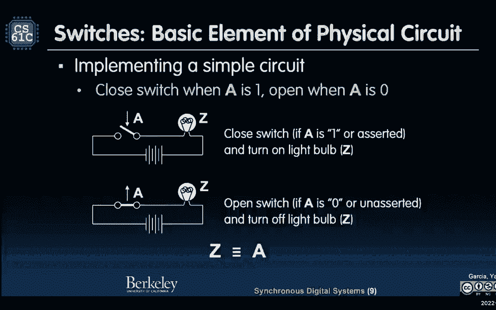

他们，这现在是一条直线，没关系，它看起来不像是，就像一个打开的开关，大门已经关上了，我不说，抽动的词门关闭了，循环还在继续，灯亮着，你能做到的，顺便说一下，我喜欢这个，你可以像今天一样吃双份。

一块电池和一块锡纸，你和你从手电筒里拿一盏灯，你可以做一盏灯，就像，我的天啊，仅此而已，它实际上是所有的动力源，你的电池，这是你的灯，就这样了，你只是把两者连接起来，做起来很容易，也很有趣，所以A继续。

事实上我有一件小事，但当我推它看看它在那里是否有效时，它就起作用了，嘣它继续，当我拉便便的时候，它爆炸了，所以把它推上，继续释放它，它爆炸了，所以事情是这样的，所以当它关闭电流时，如果我们称之为断言。

这是一个有点奇怪的图表，因为它就像一个，当这像它要做的事情，这是我说的，就像一个，什么能做到这一点，这里现在是一个关闭的，现在有光，如果这真的是那张照片，意思是说，如果你打开开关，如果取消断言。

然后电流停止流动，所以当一个变成一个，灯亮了，就像一对一，这就是我通过三个等号所显示的，所以我推，让我看看，让我们关闭一个准备关闭一个，现在我发布了一个，现在开了，什么都没发生。

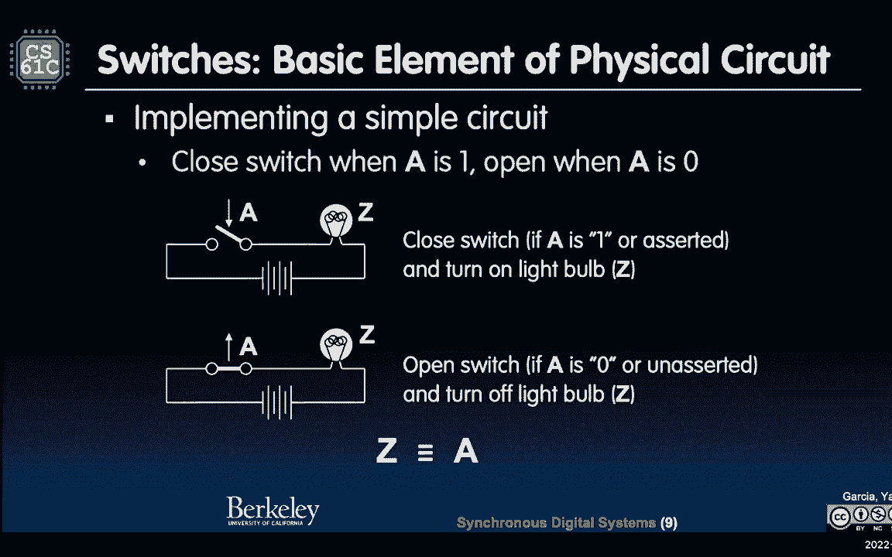

那是我的小照片，现在如果你有这样的想法，当A关闭时，电流可以流动，当a打开时，或者零电流不流动，让我们看看这个，如果我们有这条线，什么时候会有联系，图片左侧和右侧之间的电气连接，只在逻辑上，当a关闭时。

空白B关闭，只有当它们都关闭时，空白是什么，或者他们都被断言，或者两个人都记得这个词，我们试着用所有这些词，所以你变得很流利，断言，意思是他们去一个，左边和右边之间有电气连接吗，如果你把电池放在灯里。

就会产生联系，所以这很有趣看看这个，只是把A和B放进去，3。这个词你以前听说过吗？它们都必须在那里才能让电流流过那条线，看下图，现在你把它们建在，现在你说呢，那是什么逻辑。

那根电线的左边是什么时候连接的，在电线的右边，电流可以通过顶部或底部或两者兼而有之，如果两者都是，也没关系，它有点分裂，不过没关系，两者都有联系，电气，所以电流可以流动，电子可以流动。

所以底部的图片是合乎逻辑的还是很酷，所以我现在向你们展示了一个合乎逻辑的，或者只是用电线，顺便说一句，你也可以用锡纸做这个，还有你的铝箔，然后你把这个，你也没事，就是这样，让我们用电线把它分开，好啦。

在那里，哇，你今天就可以这么做，今天用锡纸，这是很有趣的问题，但要确保我不会失去任何。

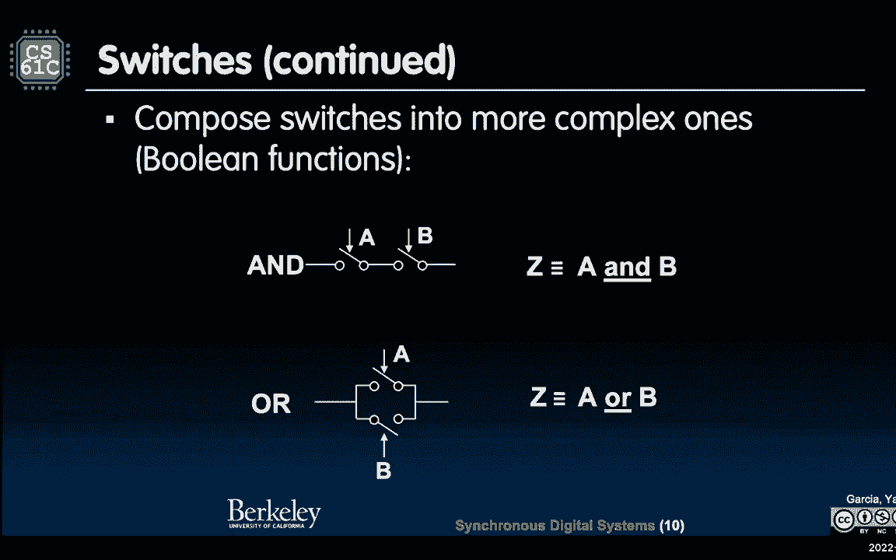

因为一个新的话题，我想失去任何人，这是有趣的一个，现在有一个历史笔记，人们习惯了，在过去的日子里，构建电路，有点临时的，没有关于他们的规则，没有一本书说过只需要建立一些电路，他们中的一些人做到了，啊。

你在建筑圈的最佳实践是什么，非常粘稠的，这是一种做这件事的艺术，而不是一门做事的科学，他们意识到共同的模式，就像我发现了一个叫做N的东西，嘿嘿，你也发现了一个N，挺酷的嘛。

那么也许这个克劳德·香农有一些基本的东西，信息论之父之一，把晶体管和这个叫乔治的数学家联系起来，公牛在这里，所以我们称它为公牛。

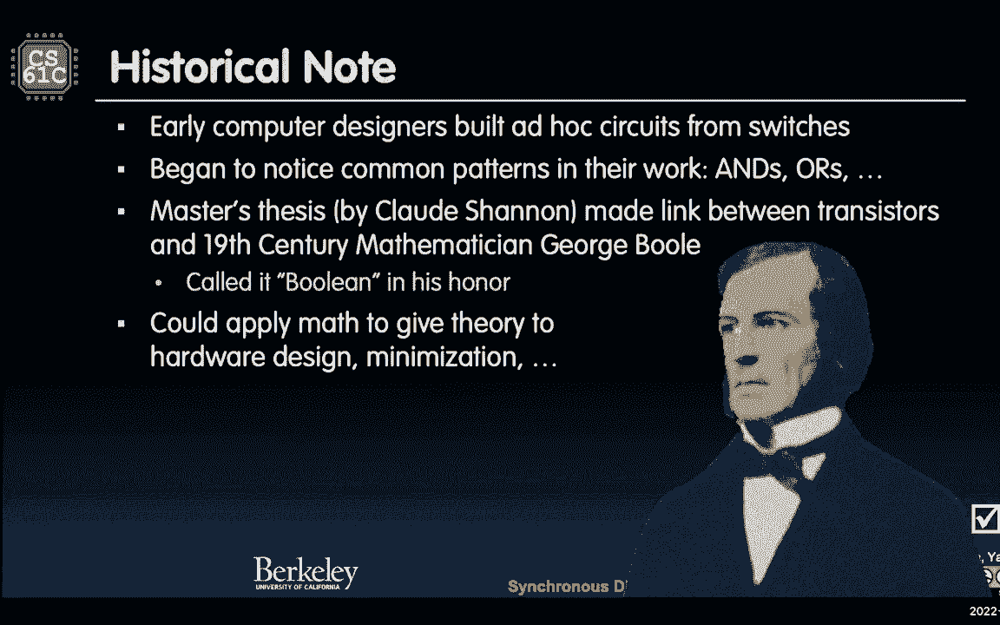

大写B怎么样，因为它是以某人的名字命名的，多么整洁，这意味着我们现在可以应用数学，多亏了布尔，我们可以把数学应用于电路设计，多么奇妙的联系，感谢香农和伯乐，对那些场晶体管的贡献，晶体管的历史。

晶体管诞生于1947年，圣诞节前两天，晶体管或半导体，这意味着它们有时会连接电力，但有时不要依赖其他非常强大的信号，你可以指挥也可以不指挥，我们将看到这是背后的基础，它们可以用来，不是开就是关。

那就像一个开关，或者你也可以有一个电源，实际上可以放大，如果有人有模拟放大器或收音机，你在家里给扬声器供电，你可以，扬声器是这样供电的，有一个由放大器供电的，现在，你听到我在房间里说的了，Lsb。

1222，我在说话，想把自己喊得上气不接下气，因为没有放大器，现在不是第二天发生的事了，但不久之后，他们意识到你可以用这个作为放大器，不只是一个或零，但实际上小信号，小波长，大信号，喔喔，太神奇了。

现在我可以为大喇叭和体育场供电，你在想你去过的每一场音乐会，你得感谢这些人，谁是乡亲，约翰·巴丁，威廉·肖克利和沃尔特·巴坦·肖克利是最大的，我说人类历史上最大最糟糕的种族主义者，所以抬起头来。

威廉·肖克利和阅读肖克利，只是啊，仅供参考，在那之前他们用的是真空管，你还记得真空管是他们如何编程的吗，早期的计算机，埃尼亚克和其他人，在那之后，我们现在有了微处理器，你有你的电脑。

我是说电子产品的小型化，多亏了晶体管，这是一件令人惊奇的事情，这是第一个晶体管，这很神奇，经营这个PBS的艾拉·弗拉托，特别，称为晶体管化，他说晶体管可能是20世纪最重要的发明，相当强大。

现在我们可以设计模型现代数字系统，使用这些转换的数组，全部放在一起，这项技术被称为半导体上的金属氧化物，那是苔藓，C代表互补，常开或常闭开关，我们将在下一两张幻灯片中看到这一点，它们被用作电压控制开关。

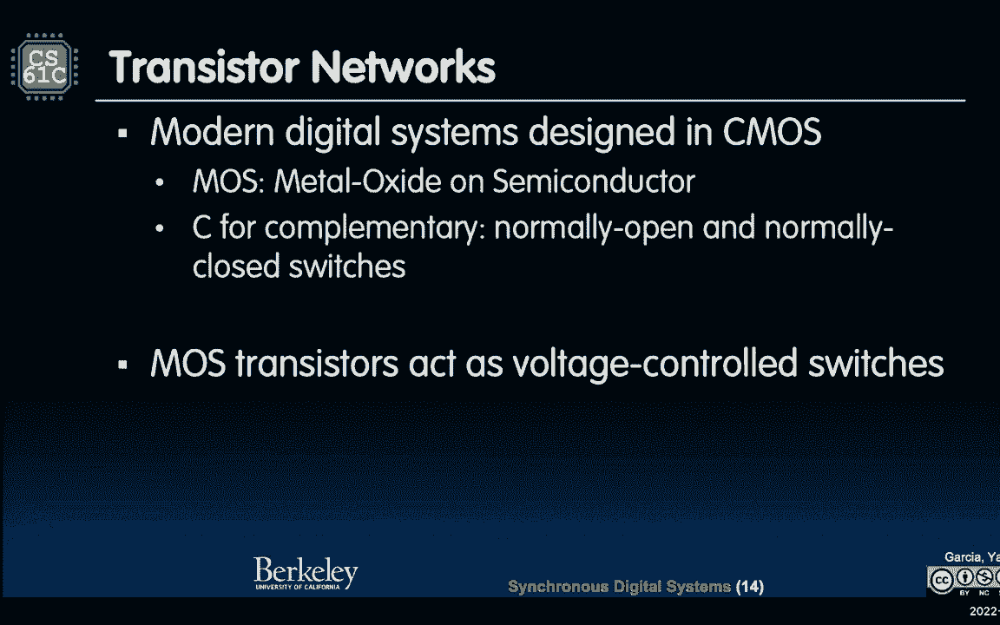

是苔藓晶体管，好吧，我们开始吧，我要花些时间在这张幻灯片上，所以你得到了一张照片，这是一张你可能以前见过的照片，但如果不是，你可能不知道它是如何工作的，让我们一起来理解，有三个航站楼，g和s的a d。

如果你忘了顺序，我在这里给你助记符，丹·加西亚说，如果你还记得那个DG，我不能，我就是不能，太近了，离DG太近，开始了，就像所有的水流都想排到闸门里，控制大门的人，不管这些事情是否有联系。

像你这样的线人，电压漏极和电源，真的是这样，如果现在栅极端子上的电压，电压总是两个引线之间的电压，在闸门和下水道之间，高于或低于源电压，在源头和排水口之间，然后在漏极和源之间建立导电路径，就像一扇门。

好啦，这里有饮料，这里是，这是消息来源，就像水源，我想这样流动，排水口在那里，它没有被榨干，我是门，它流动吗，它流动吗，还是不流动，我喜欢开关对吧，流还是不流，我如何控制那口井取决于。

我在这个门上有多少电压，所以有n通道和p通道，N代表负，G头呈阳性，但我喜欢记住的方式，它是n是正常的，什么叫正常，这只是我对自己的记忆，好啦，我想它就像看，如果我不在这里加电压，什么都不应该发生。

如果我，如果我找到像大门，对呀，就像你知道的，I，我不想给星门供电，星门不会有任何作用，门应该坏了，所以只有当我给大门通电时，大门才会打开，我说电源在星门上加一些电压，关门了吗，当它再次关闭时。

那我们就开始行动，所以这有点像，你不需要力量来让事情发生，当它发生时，两者之间有联系，记住我不是在放大，我只是在做一个关闭的开关或打开的开关，所以我的意思是，在正常情况下，我必须施加这个电压。

所以事情就是这样，我们开始了，当g较低时，也就是栅极电压，当那很低的时候，“那是什么？”“他们长什么样？”，顺便说一下，这个p通道正好相反，真的很好玩，我们将在这个世界上看到很多二元性，二元性就像阴阳。

在那里，事物以这种非常美丽的方式联系在一起，N和P就像对偶，像我这样的对偶在两者之间划清界限，就像有N个世界，P个世界是，就像奇怪的事情，就在这上面，然后是相反的世界，所以n是标准值，我觉得你应该。

你得加些电压才能把门关上，所以当g较低时，意思就是，假设大门就像没有，我不打算给星门供电，对不起，我不打算在门上放任何电流，不会给星门施加任何电压，没有电流从栅极流向排水沟，所以那是开放的。

什么都没有发生，但是P正好相反，它总是联系在一起的，总是关闭，直到你给闸门施加一些电压，然后它就会打开，所以恰恰相反，所以当g很低时，这是开放的，n通道打开，p通道关闭并反转，当我反转它时是什么循环。

我就是这么想的，我要在门上加些电压，现在呢，现在要关闭它了，它是一个连接的电路，p是相反的，现在开了，好啦，只要记住，所以正常，我应用它关闭，当我在那里放一些电压时，P就打开了。

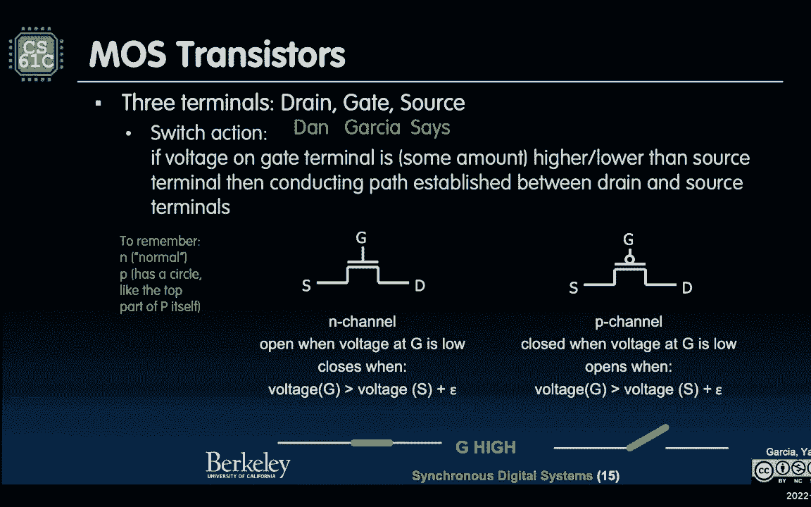

好啦，现在我要给你们看一些接线图，我们是如何联系的，我们在结束前看到了，或者我们得到了这看起来像什么，这是我的，我告诉你是三伏和零伏，顺便说一句，当我长大的时候，我们是TTL电路，是五伏特。

所以这是一个，现在是三伏，现在更低了，因为我们试图减少我们系统的能量，但现在我告诉你是3伏和0伏，当我们称这个为1和0，零是地面，就像真的掉到地上，电流只是流入地下，一个是电压源，x和y是什么关系。

y是输出，x是输入，看看我是怎么给他们接线的，上面的是P通道，底部现在是一个n通道，当x为零伏特时，好啦，所以我根本没有给X供电，X是零，那上面的门怎么办，关门了，不是吗，记住当它是零的时候。

从最后一张幻灯片开始就关闭了，所以我把这个画给我，就像电流上下流动，像这样上上下下，但有联系，好啦，是否有泡沫，我拿一根电线打个结，它还连接着，你拿一根电线，这样就上上下下了，那是有联系的，这是断开的。

所以你看到了什么为什么就像，顺便说一下，你永远不希望有一个输出同时连接到零，这将是非常糟糕的，所以我们要，希望在今天的课上没有，所以哪一个是为什么看到，这就是为什么我看到三个，或者为什么我看到零。

三个人等着，这很奇怪，当x为零时，Y是三，现在让我们把它翻过来，当x是3时会发生什么，恰恰相反的情况发生了，当x等于3时，这个关上了，记住这很高，这是正常的，普通单窗电源，我要关上那扇门。

现在在排水和源之间有一个联系，Y看到零，这看起来像什么，不是门，没门儿，我已经给你看了一个，一个或者，我不是不可能，那不是很棒吗，你一直想知道，电流流动和这个逻辑门之间有什么联系，我刚刚把它画给你了。

为了不，这很酷。

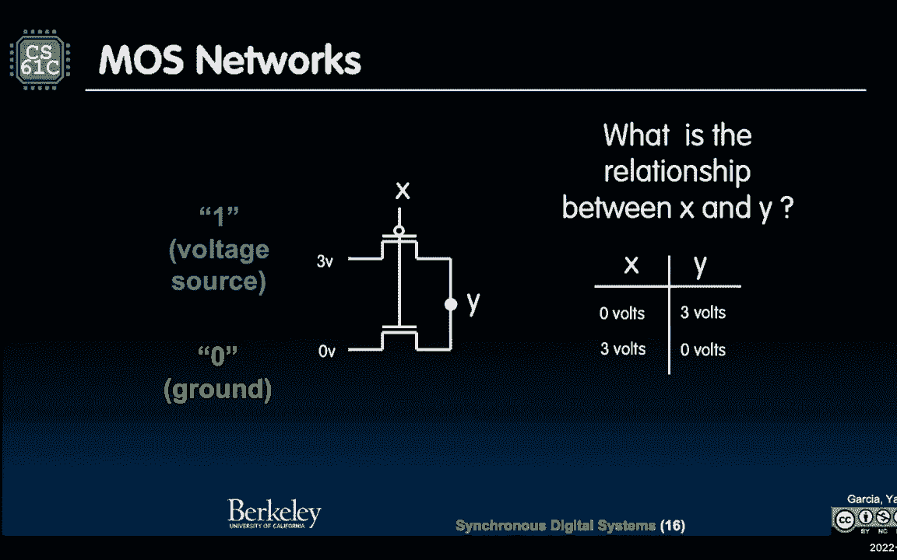

事实上，我要把他们联系起来，记住这里的这个东西，上面的那个，最上面的是，否则这就是结局对吧，你以前见过，让我们用一种有趣的方式，让我们看看能不能看到，C是我的输出，这是我的输出，C连接到这个家伙的中间。

我有一个安迪的事情是正确的，就像连续剧的结尾，安迪的事变成了地面，我发现了一个连接到电压源的东西，现在让我们问一个问题，我们的真理是什么，答案是这样的，真值表是什么样子的，让我们好好考虑一下。

我先做最下面一行，出于某种原因，我总是喜欢做最下面的一排，当a和b为一时，这些是封闭的，布罗姆所以C看到地面现在看到，希望更好，也看不到电压源，最好不要看到，让我们好好试试，这两个都是一体的，哦。

但是你看，这些是p通道晶体管，所以当你得到一个的时候，他们是做什么的，他们打开，所以我们也没有连接到电压源，所以看贝弗利看地面，无短路，我很好，所以这意味着输出为零，看到归零地，现在呢，这里是另一条路。

我可以看看这个，我可以这就是有趣的地方，这是，我也不一定要去，每个病例前三名的病例中每个病例都有两个病例中的一个，其中一个是零，如果其中一个是零，那么C就看不到地面了，因为这意味着其中一个垫底的人。

所以我不下去，这意味着一个或两个--一个或另一个或两个都为零，这意味着其中一个或另一个或两个都关闭了，我现在看到了逻辑上的电压源，我不是只有两箱，有底线，然后另外三行，其中一个或另一个为零，因此。

C和一个之间有一个通过左右或两个电压源的连接，所以它是一个，这是什么门，南德门，大家可以看到这个，记住是0 0 0 1，如果你记得你的真值表，如果我翻转它，它变成了一个nand或一一一零。

有一个结束的游戏，所以我给你打了一个结，我们把它们放在一起建造了这个nand门，一个字面上的两输入一输出与非门，这就是它的疯狂之处，如果我只给你一个和门，你回去的时候，至少我以前会开玩笑。

他们要去无线电小屋，无线电小屋现在停业了，但是你到了这个地方，弗莱的电子井，他们倒闭了，你去一家电子商店，你买一个二输入一输出与非门，但你买了一千个，我说，你能用它做任何电路吗，答案是。

你可以用与非门建造任何电路，那很酷，这是一个基本的组成部分，我们称之为基本子弹，你能相信吗，或者，但在和是的，带着奶奶，你能做到的，意思是你可以把一个nand变成一个坚果，一旦你有了一个结。

你可以把广告做成结尾，感谢摩尔定律，如果你有一个没有和结束，谢谢，你可以做一个或者你可以用人类之门建造任何东西，那不是很酷吗，我会给你一个基本的积木，从电池和手电筒上的电流开始。

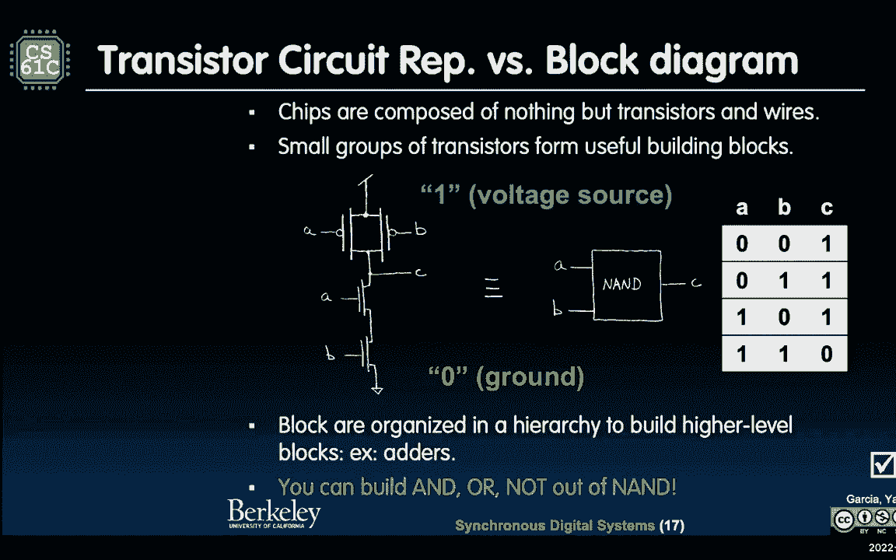

现在我们说的是逻辑，现在我们在数字领域，现在真的很有趣，让我们好好谈谈信号，如果你有这个，这些信号会随时间变化吗，是呀，我们现在谈谈那个。

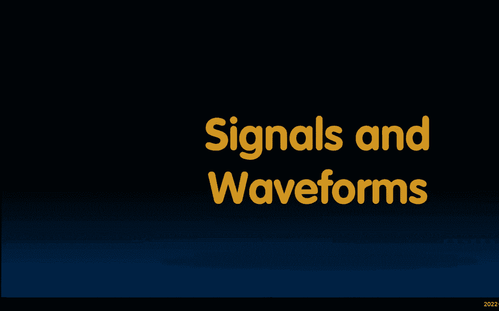

所以我们要从心跳开始，我们的钟，这是我们系统的时钟，三伏很高，零伏特很低，我们要观察电压随时间的变化，这里有两个新词，你可能有一段时间没看到了，一个是T代表期间，这是一个脉冲上升沿之间的距离。

以及纳秒内提到的下一个脉冲的上升边缘，与频率成反比，所以一纳秒周期是千兆赫，十到九，十到负九分之一，当这是数字的时候，我们真的只处理这个，当它是一或零时，会有一个过渡期，我们必须与之合作。

它不会是完美的，看看这个，有一些圆形的边缘，没有什么是完美的，啊，来吧，来吧，你说方波对吧，它应该是一个直角，而且是的，否，它是，这是一个模拟的世界，事物并不完全是圆的，会有一点时间，在这里运行的地方。

在那里四舍五入，但希望它非常接近方波，我们有，它不断地在电线上移动，从字面上看，我在发出信号，就像我们现在生活的那样，有这样的无线信息，如果你看看WiFi的无线信号，看起来是这样的，如果你测量这个东西。

我们要说的传播实际上是即时的，但我们将讨论延迟，当它们实际上更正式时，但有效的传播是瞬间发生的，和Applier意味着一根电线在一次只包含一个值，不是一就是零，从来没有中间的东西。

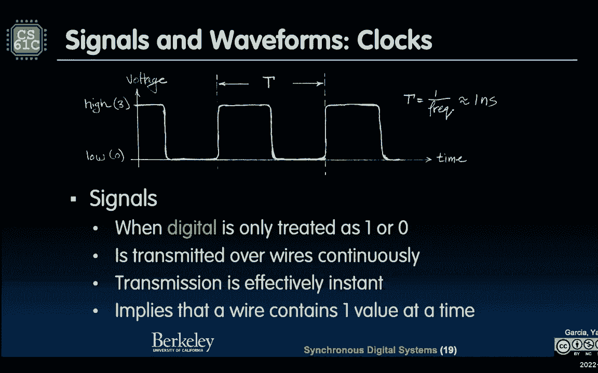

这是一个加法器电路，所以现在我们已经在这里了，我跳了很多，我还没有告诉你如何建立一个外部电路，这将在几节课中，但是想象一下这个加法器电路，它把b的n个比特和a的n个比特相加，我们需要那个，记住第一个。

我们向你们介绍的第一个指令是什么风险五，你不需要这样的东西来让它发生吗，你得到了一些信号，你得加上这两个，这里是三，二，三个二位数量，三个量b，你得有总数，总得有人做这项工作，这就是它的工作原理。

这是我的电压上升和下降，时间从左到右，现在你看到了一些关于B的有趣的事情，这真的很有趣，头号男孩，那个不是纯的，我真希望是，它不是，我们有生命，这是我的，这是我的月经，这是我的频率，所以这是我的。

这是我对时钟每次上升边缘的指示，给你看看这个，A和b。

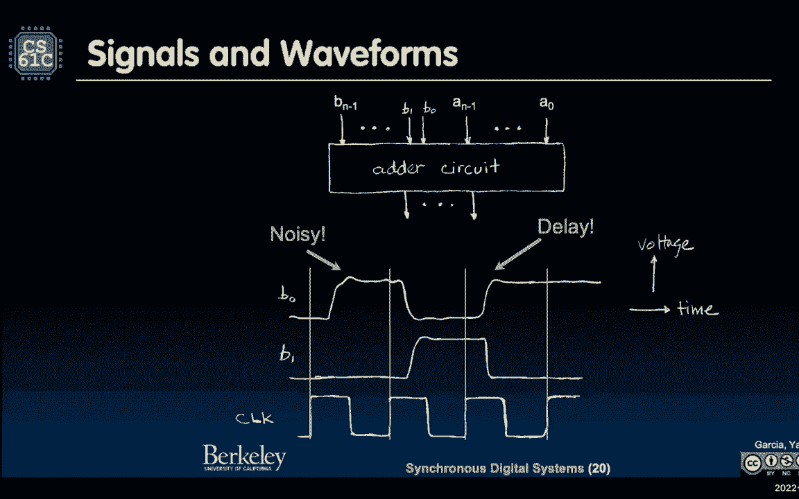

我不知道是谁创造的，A和b，我不知道花了多长时间从实际的32位。

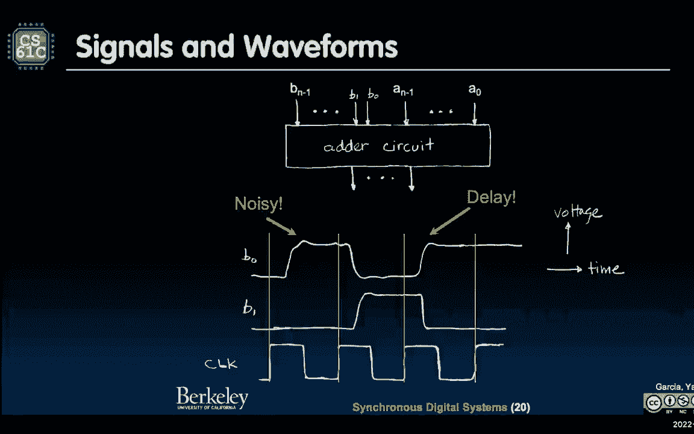

从登记文件里出来的，带寄存器，注册文件以到达，我们称之为算术逻辑单元，那是阿卢，那将是，在哪里做这件事，可能会有一些延误，谁知道我的身体里发生了什么，那些东西有多远，会有一些延迟。

所以我们已经看到了一些模拟的问题，这个模拟领域正在悄悄进入我美丽的数字世界的纯洁。

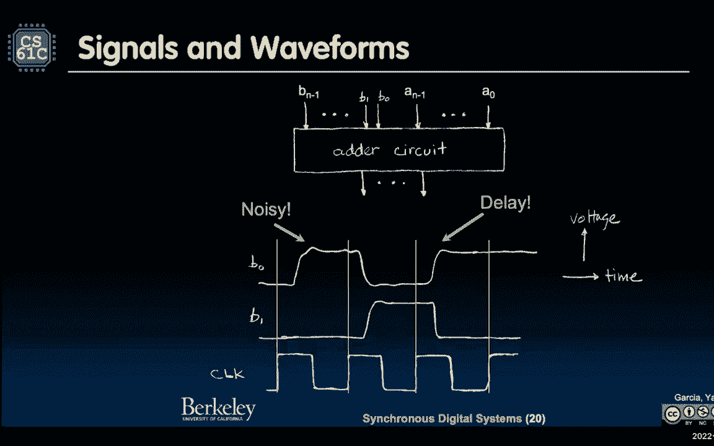

我们得解决这个问题，我们得学会如何处理它，现在我说的是把这些分组成单词，这是我们谈论它的插槽，我喜欢这个，这就像是一个抽象，我有四块，我在这里咬了一口，x0到x3，随着时间的推移，它们有以下值。

我画了1和0，约翰·瓦策尼奇，我感谢你把这张图拼凑在一起，现在画那些画，把你的头，每个人，把你的头，包括视频里的然后左转，我猜它是对着屏幕，逆时针方向，你看到了什么，哦，那就像读啃看，哦一对一，那是五。

哦一个一个，啊，那是六一一零零，那是八，看到你像表情符号一样把头向左转，你从表情符号中得到了一个表情符号，你在第一个路口向左转头，我收到了四个表情符号，我不知道，这个冒号减去右边是什么。

我忘记了我说的一些代码，丹把你的头向左，第一个表情符号，很多年前，真实故事，有一个，有一个七，所以现在我们可以用一种非常酷的方式来分组，所以现在与其有这些碎片，我可以考虑，看这个x的小写。

下标标明你的位置，我画的是大写的x，你看，这不是很漂亮吗？向量，如果你愿意的话，载体数量，五六八一七，排得很好。

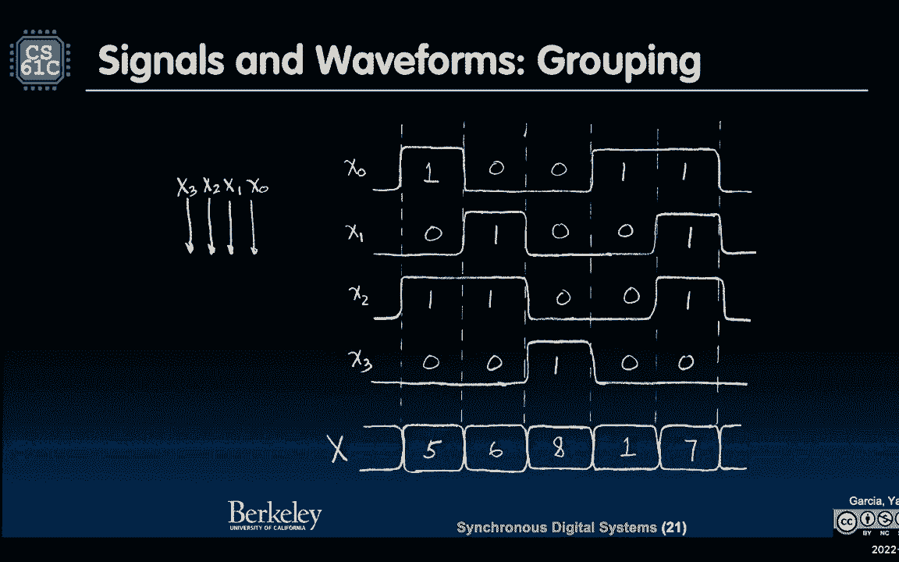

所以现在这很酷，呃，哎呦，这是我的蝰蛇，这是我的爵士表情，这是我的小蝰蛇，看这是一口，B是一口，看到有一小口出来，在第一张照片中，你可能首先看到的错误是什么，四进四出四进四出，那有什么不对。

我刚才说的话，当你添加像这样的东西时会发生什么，如果什么，如果A都是一，我加了一个，那里发生了什么，不是吗？我们要找的词是什么，说大声点，溢出，是不是溢出来了，确实如此，不应该。

我有一种方法来表明那里的溢出，所以是的，稍后我们实际上构建了这个，我们要在那里再做一点，看看它是否溢出来了，或者我们最后称之为执行的东西，它携带了，有像这样的携带吗，那就是，你知道那些，如果你在做加法。

就像正常的一年级数学一样，你还有一个专栏，当它移动到左栏时，这一点没有专栏吗？你知道应该有，所以说，应该有一个执行的加法器，在那里我们更正式地建立这个，但不管怎样，这里有一个B，这里的a和b是这些向量。

我画了一条线，斜线，表示该行有四位，这是一种很好的画法，这是我的A和B，甚至喜欢漂亮的颜色，二三四五加三十零一给你五，十三四和六，现在我要给你看这个，有一个延迟，如果A和B之间有漂亮的衬里。

需要一些时间，看他们多漂亮，他们排得很整齐，A和B切换到3和10需要一些时间，我没有看到3和10在线上，直到我们所说的加法器传播延迟之后，只是有些延迟，那会在我的加法器里，然后我保证我有一个收音机。

小腿或薯条，或者我的电子商店，他们说，啊，我想买一条蝮蛇，我说，哦哦，你知道这是什么吗，我有一个便宜的，有很长的传播延迟，到输出需要很长时间，在稳定之前，在保证稳定之前。

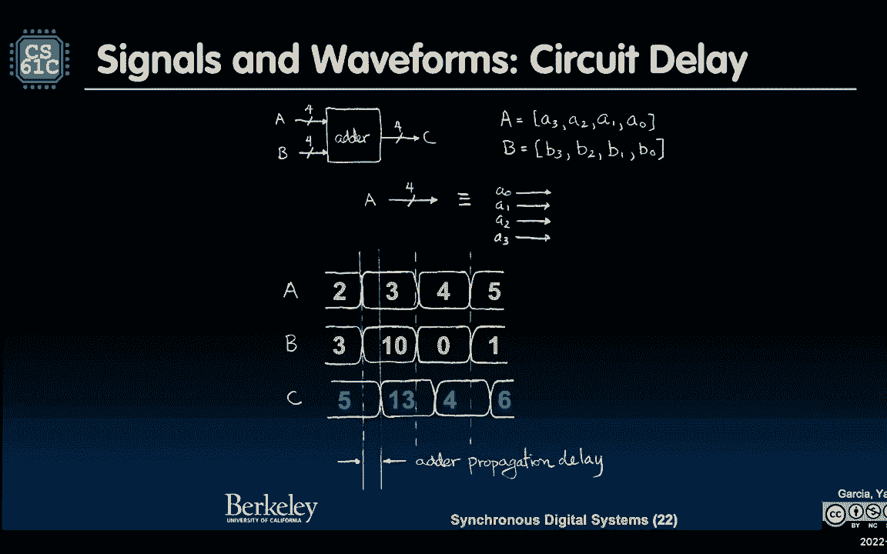

或者你可以花高价买这个镀金的，它的传播延迟要短得多。

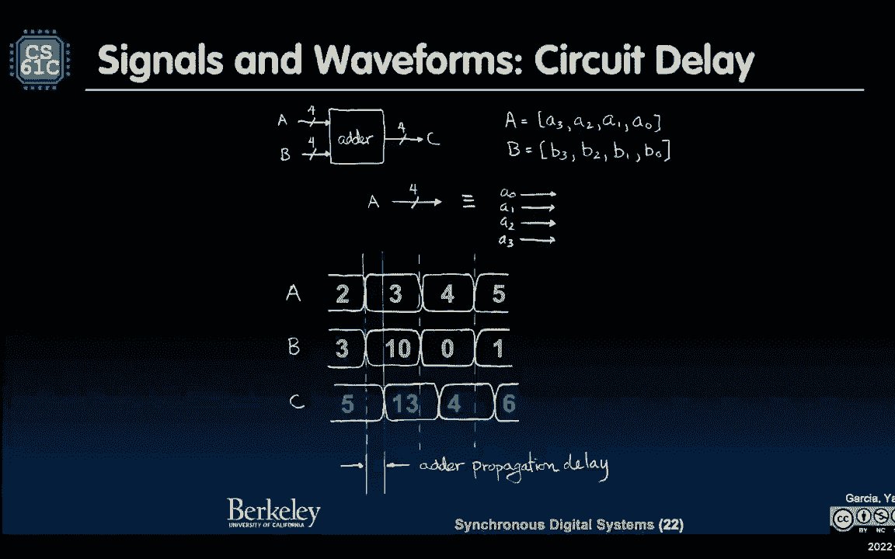

我只需要传播越低越好，我要多付一点钱买那个短一点的，你看到了吗，这就是，如果A和B改变繁荣，多长时间，直到我保证输出的总和是干净和正确的，这就是增加传播延迟的原因，你的笔记是如此正确。

如果你需要加上那个很酷的。

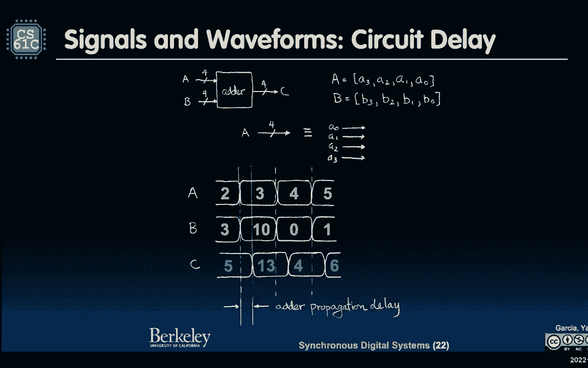

这是一个示例调试系统，让您实际查看，你可能在一个，五十还是一，五个，一个或其他类，如果你看看这里，就在那里，中间，你看不到三个，一个，两个，三个，四，它实际上将一组位分组为等价的数字。

所以正如你所看到的，而不是看那些像什么数字，啊，那是两个人花了半个小时来弄清楚这些比特是什么意思，就一个数字而言，有时他们会给你实际的数字，作为一个作为，作为它下面的一组位的组合，真的很酷。

它是一个调试器来调试您的。

顺便说一句，你的波形和定时错误，是一组全新的bug，你以前从来没有想过，像这样延迟的想法影响了这一点，它应该是稳定的，但事实并非如此，这就像是调试的另一个维度，你以前从没想过，我相信你从来没有。

如果你总是和软件打交道，在考虑时机，我的电路有故障，因为时机不对是你必须，然后开始学习如何欣赏问题，再告诉我一次你的名字，谢谢你。

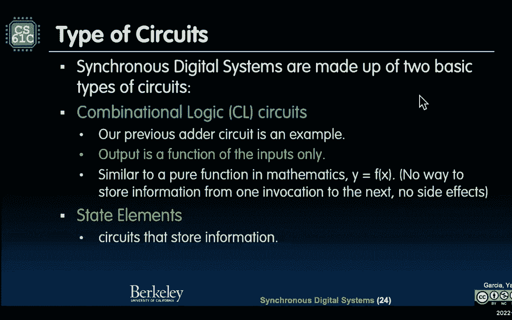

一点都不像，啊，我喜欢它，这是一个伟大的德拉雅，问了一个很好的问题，当A和B是你时就会发生这种情况，你说你知道你给了我一张很好的照片，A和B是同步的，当他们不同步时会发生什么，我们会讲到这一点的。

我们得等到他们同步，他们，他们不被允许，嗯，我们将要谈论一些事情，A没有钟，A只是一个组合逻辑，我们将在最后一张幻灯片上看到这一点，所以他们只是，延迟是在最长的一个进来，任何更长的，A或B，我加上传播。

那么输出就不稳定了，在那之前，所以你得等到最后一个进来，就像你在等家人的桌子，就像你妹妹从来不来吃晚饭，准时，你得等到那个人来，所以说，你可以说好，让我们祈祷或者开始晚餐吧，同样的想法。

所以要等到后面那个。

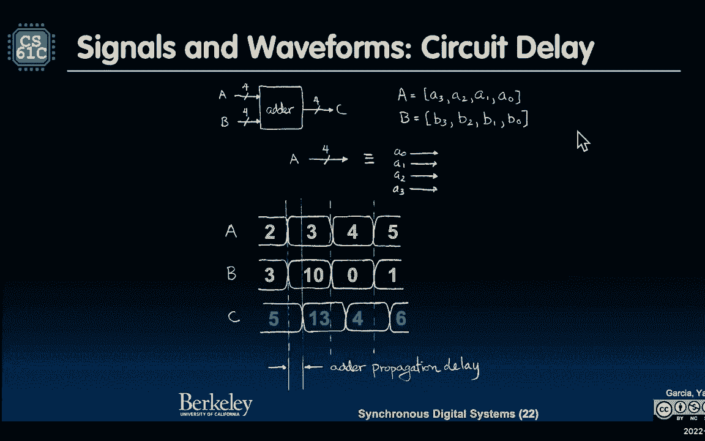

然后在后一个上添加添加的传播层，然后你知道你的数据，所以当你在你的时间图表中工作时，你把所有的因素都考虑进去了，A B要推迟了，因为它来自不同的地方，不管有多长的路，不管是什么，你都可以说。

那是我可以开始数数的时候，再加上传播，然后我知道我的蝰蛇会把它纠正过来。

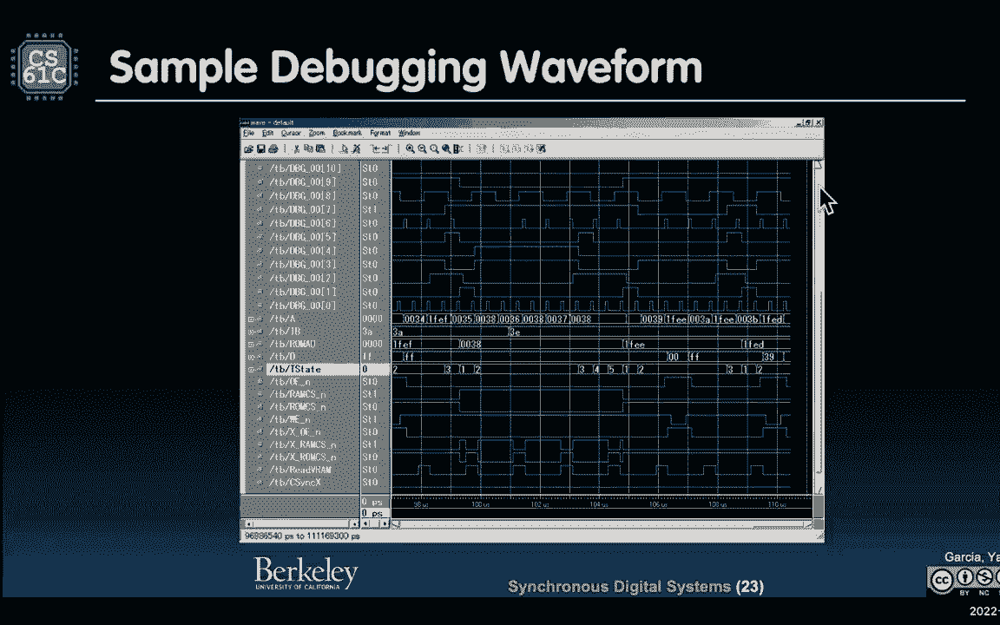

从这点来看，很好的问题，你真的真的很好，我只是把它联系在一起，有两种电路，一种叫做组合逻辑电路，我只是看着这完美的插曲，组合逻辑电路没有时钟，如果你还记得你的61，或者实际上这里有多少人来自CS 10。

我爱CS十家，任何人，这里有答案，十先令，我们还专注于函数式编程，我们称之为纯函数来区分非纯函数，纯函数是其输入的输出只是输入的函数的函数，你以前见过这个短语，这就是组合逻辑电路的全部--没有时钟。

相同的输入总是给你相同的输出可能会有一些延迟，但总是会给你同样的输出，功能上，我们喜欢组合逻辑电路，它们真的很容易调试，我们可以和他们合作，他们会有不同的延误，但它们有多复杂，但这些都是很好的状态元素。

我们还需要，我们得记住一些东西，没有办法，如果我们只有组合逻辑电路，我们可以做很多，我们当然可以做很多事情，但能有，你知道的，记住昨天的一些事情，以便能够加载一个文件，文件在哪里，它在州巡回法院。

那是在一张磁盘上，或者在闪光灯上寻找昨天停电时记得的东西，但我做了我的数据没有丢失很大，因为状态元素，有时状态元素是不稳定的，意味着当停电时，他们会失去它的，有时它们不易挥发，意味着当停电时。

他们会把它储存起来，这很好，所以我们喜欢不易挥发的东西，但它们通常更贵，速度也更慢，不稳定的东西真的很棒，就像一个寄存器，很棒的寄存器，非常快，拿到数据了，但突然间注册的力量失去了它。

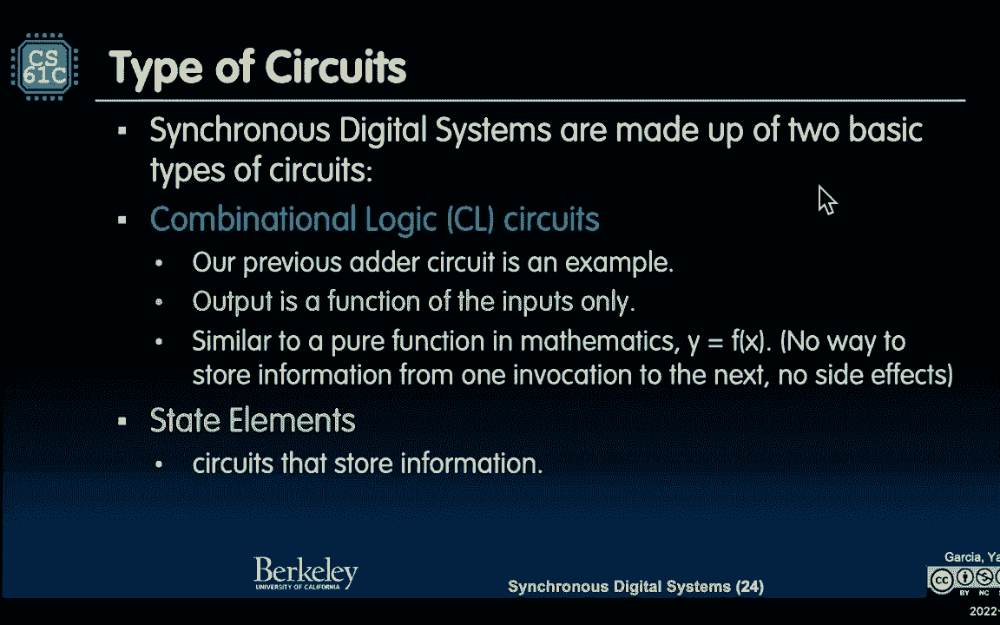

所以寄存器肯定是不稳定的，我说对了就像收银台一样，我刚说了注册这个词，看着我，所以这里有一个，这里有一个非常漂亮的顶层，黑色，有点像寄存器的黑匣子图，我有一个登记簿，它有N个输入和N个输出，顺便说一句。

它有，这个小三角表示，通常这将是一个时钟元素，连接到负载，以下是我注册的方式，我喜欢这个类比，对了，登记簿是朝前的，所以输出就在我面前，面向前方，输入在我身后，那些电线上上下下，摇摇晃晃，他们是1和0。

他们在闪烁，但我坚持保持我的产量，假设我有十个手指，十个都是，那是十二十四嘣，十二十三嘣，这是我的十块钱，好啦，十比特十二十二十二十三嘣，与此同时，所有的输入都在移动，摇摇晃晃，摇摇晃晃，我不在乎。

我无视它，我不跟你说话，因为我是收银员，我得抓紧我的锁，我的十二十三，谁需要它，突然间，我得到了一个上升的时钟边缘在我的负载，眨眼，上升时钟边缘，丹做一个负载，作为一名收银员，我的工作是什么，看着我。

我转过身，顺便说一句，这些更好的已经稳定下来了，我怎么能不转身抓住，有些东西还在摇摇晃晃，他们最好已经稳定下来了，这是约定，这个上去，我收银机上不断上升的时钟边缘，我转身，我抢了比较好的底座。

十个稳定位，是10位寄存器10位稳定，好的稳住稳住帮你抓住，稳住稳住稳住稳住，锁定了，这是我的新作品，锁定它，我现在要，你现在可以回去了，它回到过去并改变，但我把这个堵在里面了，谁需要这个，我在喂。

谁需要这个，哦，阿里乌需要它，我要在这里坚持住，我们紧紧抓住你，明白了就用吧，当你需要他们的时候就去吧，我猜这是什么，这个在这里，我们大概5-12和1-5-13，我猜，我不知道，我只是想大声说出来。

不对五十三对十二十三和五五十三，好啦，走呀，走呀，我有我的朋友，你想你，好极了，你想过另一个，你拿到了，还有人要吗？我拿到了，我把它锁在里面了，我不在乎，它在它的这一边，我只是把它锁在这里。

空白再抓一次，好吧，在这一点上，我不能相信它，因为我不知道会发生什么，当这个上升的时候，这可以用于任何事情，我要抓住，好吧，这里和现在新的部分，我已经锁定了它，现在你可以回去搬家了。

所以问题是什么样的协议，当我转身，这个，最好稳住，在这之间，我们要谈谈这个，有一个完整的描述，在这个钟升起来之前，它最好是稳定的，之后我会给你更多的细节，但像这样最好能稳住很长时间，上升时钟上升前后。

我去稳住它，稳住了稳住了我们可以走动了，我也可能需要一些时间，直到你在输出上看到，这个上去，我的逻辑需要时间，把它拿出来给你，所以这是一个寄存器，现在呢，有趣的是，寄存器闪烁，我们经常把它们绑在钟上。

所以每一次心跳，每次心跳加速，不只是随机的，当有人丽莎戳了我一下，转身不，每一个钟，我转身，抓住它，现在锁定它，眨眼高，时钟走高，转身抓住它，然后锁住它，所以能够拥有这个是一种整洁，是一个有节奏的动作。

我把它作为一个时钟元素，这显然是一个状态元素，是的问题，告诉我亚当去，而且是的，是呀，登记册，从收银机转身到更好地抓住它之间的时间，短于一个周期，因为如果时间在流逝，这正是打破，如果你超频你的系统。

你把你的月经尖叫下来，收银机上说我得到了一个承诺，我只能把它给你，在一定的时间内稳定下来，事情开始变得有点古怪，我试着这么做，我给你讲个故事，我有吗，我有时间，我告诉过我在19年试图超频我的旧Mac。

哎呦，我的天啊，九十六我去了，我在网上买了，在亚马逊之前，我去了这个东西，我把我的信用卡，我得到了一个钟的小芯片，我会去把新的钟放进去，太棒了，他们给了我三个钟，因为我试过这个，我就像哇哦，这样快多了。

我在计时，我真的很高兴，一旦我去了这样的，哦就像就像，包裹在特殊的东西里，并说，不要打开它，因为就是这里，我说我要试试看，我开了特快的，我把它放进去了，突然间我在Photoshop里，这么快。

我所有的文件都被损坏了，我保存在Photoshop中的每一个文件，因为那个小测试被破坏了，太过分了，这就是问题所在，我违反了我内部登记簿上的规范，这几乎正是问题所在，我无法在文件中存储东西。

不管发生了什么都没有被报道，但实际上更快，我很好，直到我去了某个秘密的，只是有点太快了，我只是我有损坏的文件，迷人的，所以我就这么做了，这正是打破，违反该规范的寄存器。

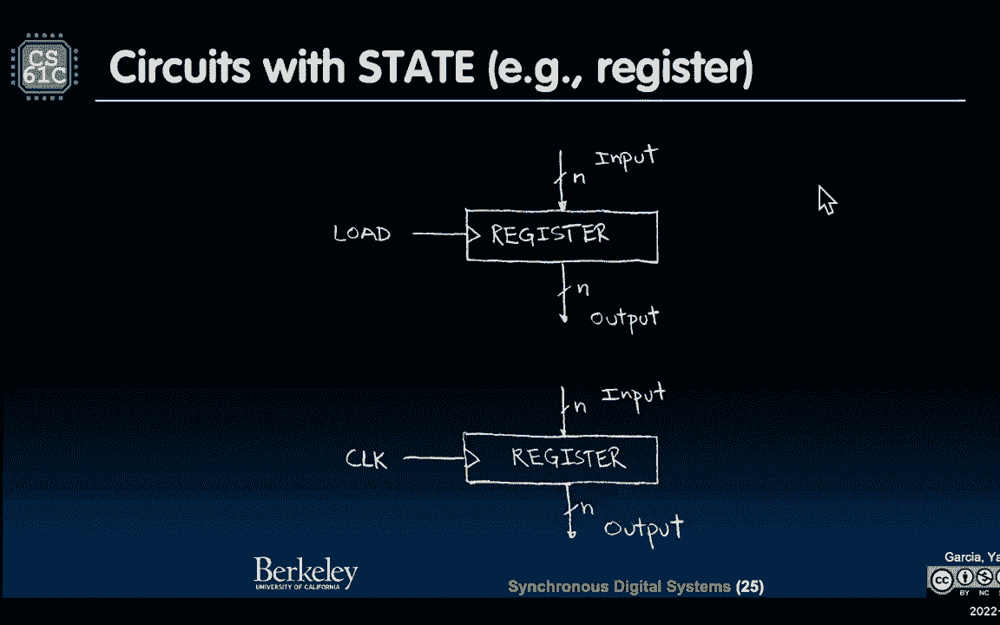

我们以后再说，我们会处理好的，听听有趣的问题，能呐喊罐头，与此不同的三个，但这是个有趣的问题，我问了是三个真假从左到右，第一个问题，软件在硬件上的峰值能超过ISA抽象边界吗，这是软件，有硬件。

下面的软件能峰值看看他们有什么吗，用于优化，用于优化，第二，软件是否依赖于特定的硬件，ISA的实施，这是ISA规范，风险是这样的，五是一个规范，丽莎做了一件硬件，弗兰克·亚当制造了一个硬件。

但它制造不同的硬件，不同的人，不同的公司可能会使软件依赖于特定的实现，最后是时序图，重要，它们是否在eee工具包中提供关键的调试工具？从左到右三个平行问题，一二三左一为一，下一个是两个，右边的是三个。

不要把它看作是更高的一点，左边是左边，一个是第一英尺，第二个是下一个英尺t，最后一个问题是最正确的F和T，让我们看看我们怎么走，看那个，看起来就是这样，这是一个离家出走的人，我的天啊，就像里根蒙代尔。

我不知道，好像没人知道这个笑话，好啦，对呀，挺稳定的，所以我听说，我听到你说的话了，让我们看看，你能看出来吗？你说的是假的，这就是我正在读的，因为左边的是你说的第一个问题，我能看看硬件吗，你说的是假的。

我能依靠特定的硬件吗，你说的是真的，你能为调试工具做时序图吗，你说的是真的，所以我要把这个冷冻起来，我不知道怎么冷冻，但我要把它冷冻起来，好啦，冷冻，快照它，心让我们，我到这里来，我要开始做最后一个了。

我们的计时图，一种关键的调试工具，我的妈呀，是呀，当你调试关键电路时，任何一种数字电路，那些计时图，我给你看了一张软件图片，最后一个是真的，你能偷看一下吗，你还记得丽莎和我用c语说过吗，你可以说磅。

如果争吵，如果我有硬件做这个，如果我有那么难，我做这个，我可以优化我想要的任何东西，所以我可以偷看，我当然可以偷看，我鼓励你偷看和喜欢，编写代码，以便它能够处理这个和这个。

如果LISA有了新的加速器峰值，如果我有加速器戳硬件，我有，我们将执行这段代码，因为这会利用加速器，你当然可以偷看，并被鼓励第一个是真的，所以现在在，我能相信那个抽象说。

如果您的硬件和您构建并支持ISA，你最好支持整个isa规范，所以那个我不能依赖任何东西，我只要我编码到ISA，我的软件应该能工作，所以我不能依赖任何东西，您的代码网络，如果你在运行丽莎的优化器。

没有丽莎的硬件，不，这太疯狂了，你得是个工人，任何处理风险5的人，所以这其实是，假的真的还是假的，你们六个，我们暂停提问好吗？所以是的，你应该偷看以优化，但是没有，您不能依赖于硬件的特定实现。

那是那是抽象的，这个想法是如果你，如果你有一个硬件，你支持ISA，风险五isa，低于这个标准的人，这就像，我明天再给你换，与鲍勃，苏和丽莎的，拉尔夫的，我不在乎，谁在下面，你的软件不能依赖于此。

太疯狂了，那么我们得到了什么。

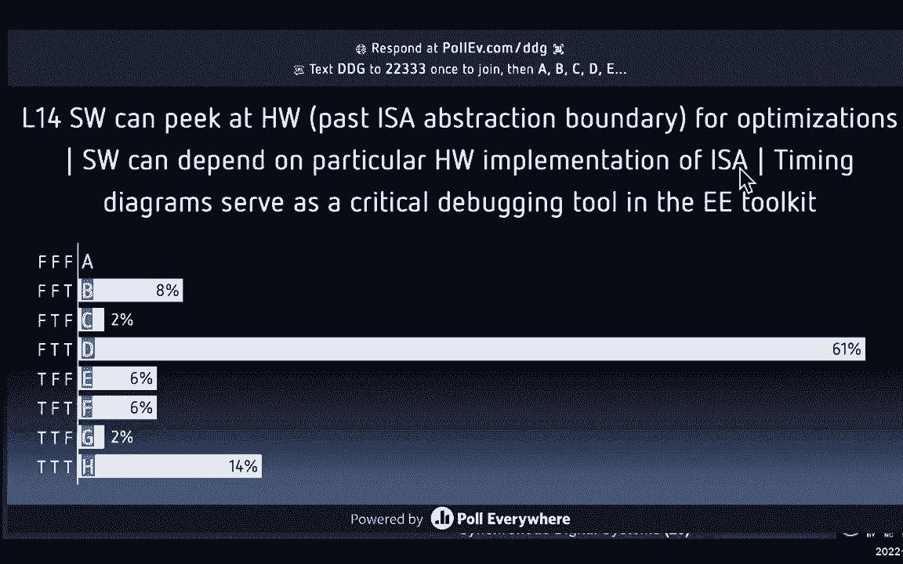

假的，真或F，我点击这个按钮，总之，这是一次多么好的演讲，我希望这对你有用，总之，时钟是我们系统的心跳，电压为模拟，我们量子化到零一，我们说过那个电路，延误是生活中的事实，以及传播延迟。

你看到了一些更正式的延迟，那里，两种类型的电路，组合逻辑，如纯函数和状态元素，如寄存器，转过去，抓住它，你就得到了它，我们会做更多的，星期三，谢谢大家。

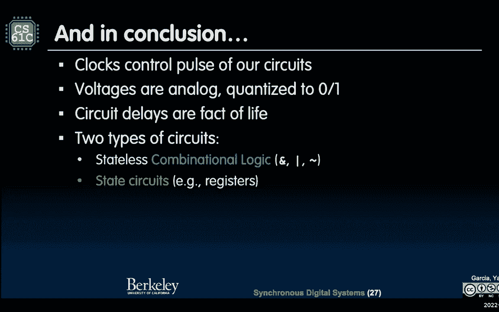