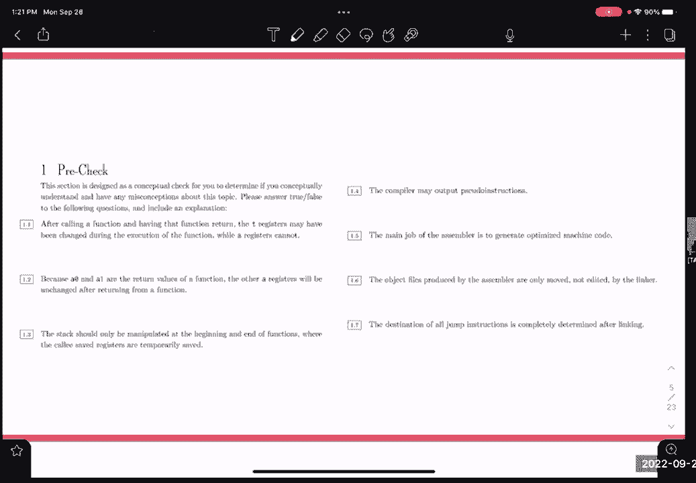
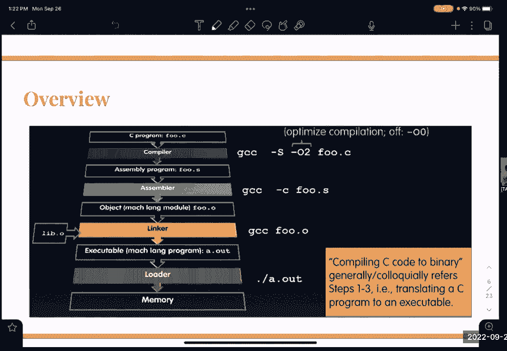

# CS 61C at UC Berkeley  - Fall 2022 - P19：Discussion 5： RISC-V Procedures, ISA, CALL - 这样好__ - BV1s7421T7XR

嗯，让我们快速扫描一下，今天我们有三个主题，我们接到电话，我们有风险，五翻译与呼叫约定，所以不管你们想关注什么，其实呢，有点像那样，对不起，我们有一点回声，你能把表格，或者任何人，你不知道，哎呦。

只有伯克利的电子邮件吗，给我一秒钟，是不是每个人都很难融入其中，好啦，请举手召集会议怎么样，我得到了一对夫妇的手冒险，五翻译，好啦，然后举手等待召唤，那里没问题，整个，嗯，对不起，我也有变焦的人。

但每个人都会说，呃，这么叫，大家都没意见吗，从打电话开始，假设我们能做到，接下来我们要召开会议，好啦，很抱歉这一切，是啊，是啊，真正快速的物流，你今晚有作业要交，然后呃，拟开展的项目。

下周三之前你还有一点时间，嗯，是啊，是啊，这周也没有实验室，是啊，是啊，所以我想看看大家都在哪里，所以让我们先从预先检查的问题开始，我给你一两分钟的时间，好啦，大家感觉怎么样，至少第一对夫妇，嗯一分一。

呃，所以它说t寄存器可能在函数调用中被更改了，但是A寄存器没有作为一个真假，少数人不喜欢那样，a寄存器用于返回值，所以很自然，至少有几个寄存器可能必须在函数中修改，把t寄存器，是啊，是啊。

所以我想可以肯定地说，一个寄存器和T寄存器，你必须假设它们在函数中被全面改变，我不能假设你可以依赖他们，一分怎么样，两个，你的盒子，所以另一个寄存器可以用作参数，传入指向数组的指针，你必须遍历数组。

你必须增加指针，嗯，即使它不是返回值，它仍然可以在您的函数中修改，您可以有两个以上的返回值，您可以使用所有的a寄存器作为返回寄存器，是啊，是啊，还有其他问题吗？堆栈应该只在函数的开始和结束时操作。

牧羊犬存放处暂时安全，我们同意吗，我不同意，我们确实使用堆栈作为序言和结尾，对，我们想保留我们的寄存器和回信地址，但是假设函数中的寄存器用完了，我们只有，我不知道有多少s寄存器和t寄存器，但你知道。

说你认为你十二岁，嗯，假设在函数中需要更多的局部变量或临时变量，你必须暂时在堆栈上存储一些东西，并稍后在函数中检索它，是啊，是啊，你肯定会这么做，因此，堆栈不仅用于序言和外延，一点四怎么样？

编译器可以放置或输出伪指令，编译器发出的伪指令，我得到了一个假的，有几个竖起大拇指，又有一个假的，呃是的，编译器肯定能吐出伪指令，编译器应该创建最优的汇编代码，所以在某些情况下，伪指令可能是最佳的。

但是，汇编程序将解析这些伪指令，然后将它们转换回常规指令，好啦，一点五，编译器的主要工作是生成优化的机器代码，就像我们刚才说的，竖起大拇指，不同意，是啊，是啊，编译器和定居者有什么区别，保持这种想法。

我们一会儿就讨论这个问题，我想这会影响你对这个问题的看法，但是，嗯，是啊，是啊，只是效率问题，对呀，在一般意义上，喜欢你选择的说明，你把它们放在哪里参考其他指示，只是程序的整体运行时，是啊，是啊。

但是呃，这是假的，所以编译器的工作是创建优化的汇编语言，但汇编程序随后转换为字节码或二进制，然后为引用创建类似的表，我们马上讨论，所以这是有道理的，对呀，是啊，是啊，等等，是一点五，因为它说，是啊。

是啊，所以汇编器不是发电机组，汇编程序确实会生成机器代码，但它的工作不是生成优化的机器代码，编译器将创建优化的汇编代码，然后转换为程序集中的机器码，问得好，仅移动汇编程序生成的对象文件，未由链接器编辑。

每个人都很熟悉链接器，或者我们应该直奔主题，我们有一些好的，让我们只是，我们直接去打电话，好啦，所以哦错了。

iPad，这是我们的流程，我们有我们的编译器，我们的装配工，链接器加载器，C a l l，他们都有不同的工作，编译器将接受像c这样的高级语言，C加加，Java，我们将把它编译成汇编语言。

这份工作解释了没有，那不是，是啊，是啊，所以它将输出优化的汇编语言，然后它将进入汇编器，汇编程序将接收所有这些点的文件，我相信你对这个项目很熟悉，现在呢，您一直在处理不同的程序集文件，嗯。

汇编程序将创建一个对象文件，有很多不同的领域，嗯，我们一会儿就讨论这个问题，我想把时间花在目标文件上，链接器将获取这些字段，并基本上将它们组合成一个，我们有所有这些不同的文件，它们有不同的功能。

不同的代码行，链接器会把所有这些东西，把它们合并成一个程序，然后装载机是你的一部分，所以你的，你的加载器将把它加载到内存中，并运行到目前为止关于这个的任何问题。

所以编译器，我们谈了一点，它吸收了c c加铁锈，它会输出，说，就像风险5或x86，嗯，它将包含伪指令，就像我们刚才说的，或者它可能包含伪指令，它将包含相对寻址，所以说你的跳跃和你的树枝。

它们将相对于程序计数器，你们讲了一些关于翻译和说明的内容，你的跳转指令有一个立即的偏移量，所以你跳了三行，就像12的偏移量，对呀，记忆中的三个字，相对寻址，不在原始内存地址中，但就节目而言。

然后它也会有，我是说标签，当然，函数名称和循环，所有这些我都可以跟随支持，所以汇编程序，呃，这是整个过程中最重要的话题，现在，你们在项目中使用汇编语言，嗯，程序集将获取所有这些程序集文件。

它会很好地输出一个目标文件，让我们首先谈谈什么是对象文件，一个目标文件将有这两个表，符号表和重新定位表，呃，这些基本上列出了所有帮助我们，呃，计算机知道在哪里跳转搬迁表，辅助符号表，我们以后再谈。

一秒钟后，它创建一些调试信息，所以对于你的cgdb，为了让它能够运行，它必须生成有关程序的某种调试信息，我们有数据段，所以它只是程序中所有的静态数据，考虑字符串或整数数组，或者别的什么。

文本段将是机器代码，所以你的指令被翻译成二进制，和对象的对象标头，文件头会产生这样的偏移量，所以它会说，向下三两字节是文本段的开始，然后从那里向下200字节，这将是符号表。

它基本上会告诉你的计算机在你的文件中跳转到哪里，阅读某个字段，我们还在泛泛而谈，但这对每个人来说都有意义吗，让我们来谈谈搬迁桌上的简单桌子，嗯，我这里有一个必须在你的集会上做两次检查，有谁知道为什么。

在没有立即看幻灯片的情况下，当我们在您的汇编代码中逐行进行时，可能有对尚未定义的标签的引用，这可能是你程序中的12行，你的电脑不能读取那个标签，也不能确切地知道它在哪里，直到它真正得到标签的定义。

所以在第一关，我们要解决所有的伪指令，所以这就是伪指令被修复的地方，我们将用所有标记的声明填满符号表，所以我们的标签，然后标签所在的地址，我们还将用任何数据填充它，就像我说的，字符串或整数数组。

然后是全局变量，所以任何跨文件使用的引用或变量，所有这些都会被扔到你的桌子上，然后我们就有了搬迁表，它将收集所有这些向前的引用，假设你在做一个跳跃指令，你要跳到某个标签，在你的代码中，你的搬迁表会说。

就像我刚得到这个标签，我不知道是什么，就放在这里吧，等到第二关，我们已经填满了我们的符号表，与标签在第二道上的所有位置，然后我们就翻译过来，我们会填好的，好啦，嗯，是啊，是啊，然后在代码块中。

所以这有点像是在玩链接器，我们一会儿再谈，有人有问题吗，是啊，是啊，符号表本质上是所有的变量，文件像一个凸起的权利，所有其他文件都可以被引用这么好的问题，呃。

所以每个文件中的每个程序集文件都有自己的目标文件，它自己的符号表将包含与这个文件相对应的所有这些标签，所以当我们把所有这些文件合并在一起的时候，所有这些目标文件，某些文件可能需要引用此符号表。

因为它可能引用了另一个文件中的标签，它必须知道它指向哪里，所以是的，这回答了你的问题吗，是啊，是啊，就像跟进一样，所以搬迁表将包含所有，呃，是啊，是啊，你用一些井，我们马上做一个例子。

我觉得这样比较合理，是啊，是啊，所以在第二次传球之后，然后搬迁方会用它，嗯，这是个好问题，我想，所以它有点像占位符，这有点像告诉链接器，代码的哪些部分仍然需要用适当的地址更新，假设我们有一个文件。

我们马上就会看完这个例子，但如果它引用了malc标签malloc是对的，它将链接到一些标准库，你在第二道关前的重新安置桌会有一个很大的问号，它旁边不知道什么是malloc，但是一旦我们有了链接器。

把所有的东西都合并在一起，然后我们来看看搬迁表，看看哪些事情还需要解决，然后我们会把这些联系起来，是啊，是啊，问得好，好啦，嗯，所以让我们就这样过一遍，假设我们有一个小代码块，好啦，呃，标签定义在哪里。

如果你们想给我，这些有点像数字，上面写着，一号线，呃两个，然后在第10行和第11行的说明和说明之间有一个空白，依此类推，那么哪些是我们的，与，是啊，是啊，是啊，是啊，所以我们会有零行放克的名字。

第16行，我们完成了，所以是的，我们会找到标签上提到的，我们想在这个代码块中吐出一些标签引用，循环十五，是啊，是啊，所以你不会说定义是从0到10，他们大概从一到十，就像你一样。

我们设置的标签定义是实际的，就像标签名称本身，第11行，是啊，是啊，是啊，是啊，所以标签实际上正好对应于这条线，真的吗，所以你可能已经在你的项目中看到了，你也可以把标签放在这里，但在下一行代码中。

它们仍然对应于同一行，同样的指示，标签基本上就像一个位置，对呀，所以我们走过这个，呃，啊，否，哦不，我们走吧，所以说，当我们穿过这里，我们拿起这个放克的名字，这是一个定义，这是哪一桌的？一张简单的桌子。

是的，是的，会做得很好的名字，然后呃，我们就说这是我们的起始地址，好啦，就像我们节目的开始，我们计算所有引用的地址，所以会是这样吗，你知道什么？电脑的事对吗，根据OH PC中的病毒，是啊，是啊。

当你处理代码时，PC可能会改变，但是呃，是啊，是啊，我们就用它作为我们程序的基本地址，所以所有东西都将从这个基地址偏移，你得到了它的方式，PC确实改变了，当您的计算机运行您的代码时。

所以它是一个程序计数器，所以当你去指导和指导，你的电脑会增加，嗯，但我们会从一般意义上考虑这一点，就像我们的基线一样，转到下一行，我们有什么标签要拿吗，不，去这条线，呃，我们有一个循环哪个表的引用。

那是去，搬迁表，所以我们在这里放一个环，我们不知道它会去哪里，好啦，嗯，我们跳到了10号线，我们有一个关于Malloc的参考，是呀，呃，因为循环是一个正向引用，不是什么好的，所以让我们假设你。

我们已经发现你说的对了，好啦，标签仍然会在搬迁表上，或者它会进入，如果我们，呃，你就会，你马上就会明白，对不起，好好想想这个问题，虽然嗯，十行，我们参考木槌，也是一个外部正向参考，我们不知道它会去哪里。

所以我们要把它记下来，现在我们找到循环的声明，所以我们把它放在符号表里，这将是在抵消上的，我现在有我的备忘单，所以这将是开始，这是我们的基址的偏移量，然后我们跳转到这个引用来循环，所以这是一种，呃。

你指的是什么，呃，我们在引用循环，但现在它是一个向后的引用，因为我们看着我们的符号表，我们意识到好吧，我们有循环，我们很清楚它在哪里，所以与其把它扔在我们的搬迁桌上，我们把它划掉填上然后开始，加四倍。

我们只要填上偏移量，是呀，我们忘了11号线的事，就像我们对符号表所做的那样，对不起，我们有一个循环，但是我们没有时间，呃，是啊，是啊，我们得到了，那是下一行，所以我们定义的下一行做对了，那是我们的定义。

所以这直接进入符号表，向前传球桌怎么样，随着搬迁到，所以这将是开始，另外这里有偏移量，好啦，所以我们定义了，这是我们的第一关，大家都同意，等等，我们，哎呦，对不起，我们漏掉了一些东西。

我们在这里引用完成，我的坏好渔获，是呀，我看了一眼，是呀，我们参考了完成，这是一个前瞻性的参考，所以应该在这里，这也是另一个问号，各位各位，好吧，这个，那么第二道，所以现在我们要经历，现在呢。

我们知道程序中的所有东西，我们有我们的符号表，充满了所有的标签，我们要穿过这里，我们要去看宣言，我们不需要在那里做任何事，这里什么都没有，我们看到对循环的引用，现在呢，我们知道环路在哪。

让我们把它压出来，把它扔上去，我们看到对MC的引用，我们能做点什么吗，是呀，还没完呢，呃，四乘七，我可能算错了，对不起，嗯，我们看到一个关于木槌的引用，我们能做点什么吗，当我们看到一个引用。

或者当我们看到对标签的引用时，第一件事是检查符号表，符号表不包含它，然后我们把它扔到重新安置的桌子上，问题是我们的搬迁表已经有了这个引用，所以它是一个外部参考，它在引用另一个文件，所以这也是。

当我们在这里解决这个循环时，我们只是把它退出，我们用start+4乘以11填充这个，但在这里，这个malloc仍然是未知的，所以这将留给链接器，然后我们继续往下走，我们看到完成了，我们知道他在哪里。

开始加四次，呃，十六七岁，不知道，然后我们继续前进，我们就完成了，那是我们的第二道关卡，我们基本上就是这样使用这两张桌子的，这是我们记账的一种方式，因为我们节目中的所有引用都是有意义的，真的吗。

然后我们就到了链接器，徘徊者不仅会把所有的东西，所以它将创建一个头文件，嗯，还是对不起，它不会创建头文件，它将把这些目标文件，包括标题文本数据和这些表，还有一些调试信息。

我们的工作是接收任意数量的目标文件，一个可执行文件，我们将结合文本和数据段，所以我们整个程序中所有的静态数据，所有的文件，所有的代码行，所以所有的文本都将以一种程序性的方式放在一起，所以一行行。

然后我们还将解析所有的引用，所以我们要找到所有剩下的，把这些表格合并在一起，所以我们要跳到哪里，此可执行代码提供给加载程序，加载程序将读取标题，找出哪些段是我们的文本段，我们的数据段，嗯。

我们要在堆栈上创建空间，请记住，我们仍然有堆栈帧，我们将在主存中创建空间，以便执行实际的指令，呃，我们要初始化寄存器，为运行和运行程序做好一切准备，拿一个六十二，如果你有兴趣了解更多关于这些，是啊。

是啊，所以在我们进入通话问题之前，有什么问题吗，是啊，是啊，你跟我说，呵呵，哎呦，它会出现在中央索引帖子上，在布兰登和基尔的讨论幻灯片下面，让我们开始吧，这需要一分钟左右，好啦，呃，多少次。

我想现在应该做过头了，但我有两张通行证，两张通行证，好啦，是的，是的，我们要做两次传球，呃，为什么，我想给我一个解释为什么，我们走两条路，第一部分和第二部分中的正向引用中的所有定义也是如此，在电源上。

是的，是的，所以我不打算把这些都写下来，但是但是是的，所以一次传递所有的正向引用，标签的所有定义，还将静态数据存储到符号表中，然后是第二步，尽可能地解析重新定位表，调用中的哪一步解决相对寻址和绝对寻址。

让我们从相对寻址开始，它是一个编译器，汇编器，链接器，装载机，它是相对的，因为我们是相对于地址做的，是啊，是啊，所以我们在汇编文件中使用了这个基地址，一切都与基址有关，嗯，绝对寻址怎么样。

问题是如果你看到，编译器，呃，创建程序集代码，然后对相对地址进行操作，因为这是汇编程序的输入，我们说，就像在一些相对的想法中，是啊，是啊，是啊，是啊，它还会吐出符号表，这些符号表都包含相对寻址，是啊。

是啊，所以绝对寻址是通过，从几个人那里得到了一个链接，是啊，是啊，因此链接器将在这些不同的文件中获取所有这些相对地址，并为所有文件一起创建绝对地址，是啊，是啊。

解释在那些特殊情况下它是如何像现在这样解决的，是啊，是啊，所以它吸收了，标准，就像你在这里看到的，它将接收所有像标准库文件这样的文件，当你喜欢标签的时候，包括标准库，是呀，是啊，是啊。

所以它将进口这里需要的任何东西，Dan或Lisa谈到了一些动态和静态链接库，也有一点需要调查，如果你有兴趣，好啦，呃，这其中的六个主要部分，我觉得我们刚刚经历了，有没有人想过这个问题。

还是你想直接进入另一个话题，经历过的举手，它只是在重复我们一直在谈论的一切，如果有人还不确定，我们有呼叫约定和翻译，我看到更多的人举手等待翻译，每个人都同意这一点吗，改为那样做，好啦，好啦，好啦。

让我们做吧，所以我们有风险五翻译，所以我们有这些组装说明，真正低级的代码代码，这直接转换成二进制，通过计算机或通过，所以大会将接受这些指令，把它变成二进制，所以我们需要知道这是如何翻译的。

这是由我们所有不同指令类型的表描述的，这告诉我们不同的领域，在不同的指令类型中，你注意到了吗，即时类型将有这个大的部分，用于上介质，对于非常大的介质，所以我们明白这些必须以某种方式转化为二进制，但是。

让我们试着解决一个问题，我觉得你们已经有家庭作业的问题了，在这个东西上，让我们做一个，然后我们会走过它，然后我们再经历另一个，所以我没想到会有这么多时间来做这件事，所以说，嗨，让我们进入第一个，所以说。

我们有添加，我是1×0负2×4，有人想建议第一步吗，查看代码，是呀，看那个，我发现我们的代码，是呀，所以让我们来弄清楚，我也把这个复制了一遍，我们有这个添加，我在这里田野，这是操作码，就是这种类型。

这是F3代码，所以我们把这些写下来，所以操作码是0，我们的f3是，还有什么领域，所以是什么类型，那是什么类型，我我打字是的，所以我们要看这里，我们已经拿到操作码了，已经有F 3代码了。

我们这里的RS是什么，就像寄存器名x 0一样，是啊，是啊，所以1等于0，在二进制中，全部为零，全是零，到底有多少个零，保持事情一致，好啦，然后我们有一个第三个字段，在这种情况下这是可能的，其中一个。

如果我们去，这张桌子我已经听过了，但是x 9是我们的s，在二进制中只有9，所以零一，零零一，好啦，所以我们得到了我们的第三个，我们找到一个，所以现在我们有了直接场，我们的中负数是多少。

所以我们必须把它转换成二进制，我们如何选择补语，我们先来，这只是一种，我是怎么做的，我们先，呃，在未签名版本中表示，然后翻转位，每人加一个，没问题，好啦，所以首先，我们的直接比特是多少，我有七个。

其他人，十二，是啊，是啊，我们这里的直接场是从0位到11位，所以我们需要一个12位的字段，让我们在这里代表二四，2的最大基数是16，所以这是我们的八位，所以这里是一个，这里是一个，归零归零归零。

大家跟着这个，一一一一零一一一加一，表示未签名版本，翻转了比特，增加了一个，现在我们得到了负2-4的补表示，是啊，是啊，你们知道为什么J型翻转时钟，比特，只要看看一般的J型媒体，据我所知。

主要与硬件有关，你知道，当我们开始研究数据路径时，你会学到更多关于这一点的知识，是啊，是啊，你在打字吗，从字面上看，意思是上面的二十位，或者喜欢，那只是整个指令的索引，从3个1到12个，是啊，是啊。

所以那些，这些就像直接的比特被显式地传递进来，是啊，是啊，让我们把这个用x写好，其实没有，让我们把所有这些东西结合起来，所以我们的第一个场是我们的直接场，正如我们所看到的，我们有我们的直接。

RS一放克三操作码，所以说，所以我们有一比一一比一，零，一零，零零，所以这是我们的直接，接下来我们有一个RS，也就是四个零和一个额外的零，我们有F3，也就是零一，零，零一，然后我们的操作码。

然后这个直接到x，也就是F E，所以你只是把一条指令从程序集翻译成二进制，我们可以很快做相反的事情，我们有一分钟，让我们谈谈我们将如何做到这一点，我们都看到它是如何正确翻译的。

所以我们得到这个十六进制数，你的第一步是什么？它变成二进制，把它变成二进制，查找操作码，是啊，是啊，一旦你有了操作码，然后你就可以把范围缩小到F3，三之后将它缩小到一种指令类型。

然后你会发现你有一辆RS-One还是一辆房车，你会发现如果你有一个即时的，好啦，如果你们能够，我真的很感激你对这件事的反馈，帮助我了解你们想从中得到什么，你是嗯，放置项目，所以退出时使用错误代码退出。

呃，假设有一个错误，就像退出程序一样，你一定要看书吗，增加堆栈指针和备份工作，你差不多，嗯，在这种情况下，我会推荐什么，比如在你做任何与堆栈相关的事情之前处理这些案件，好啦，是啊，是啊，所以差不多。

是啊，是啊。

