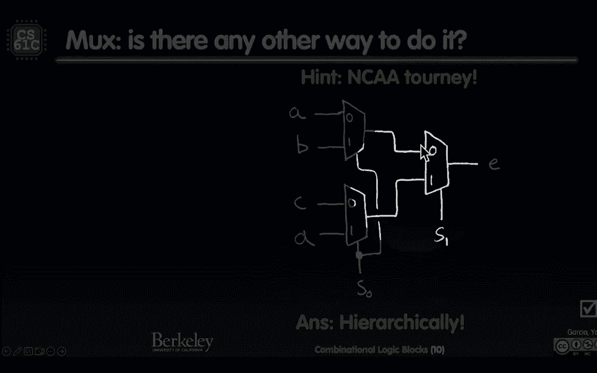
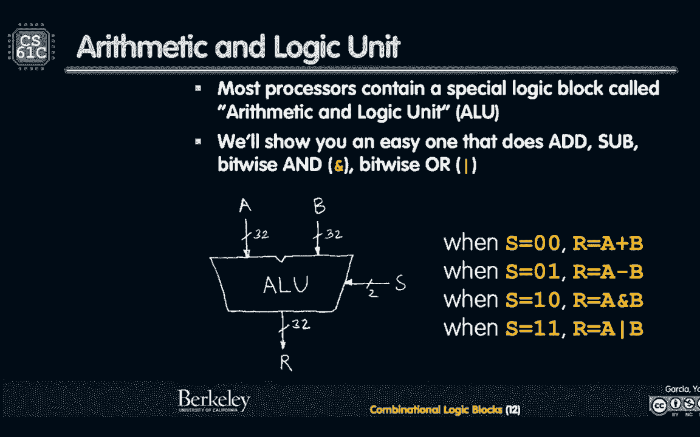
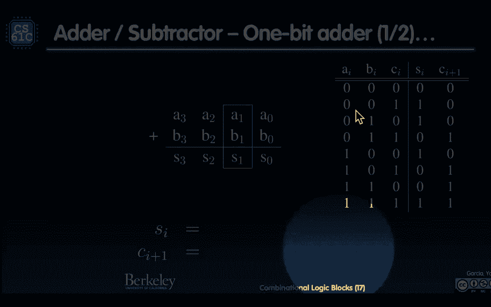
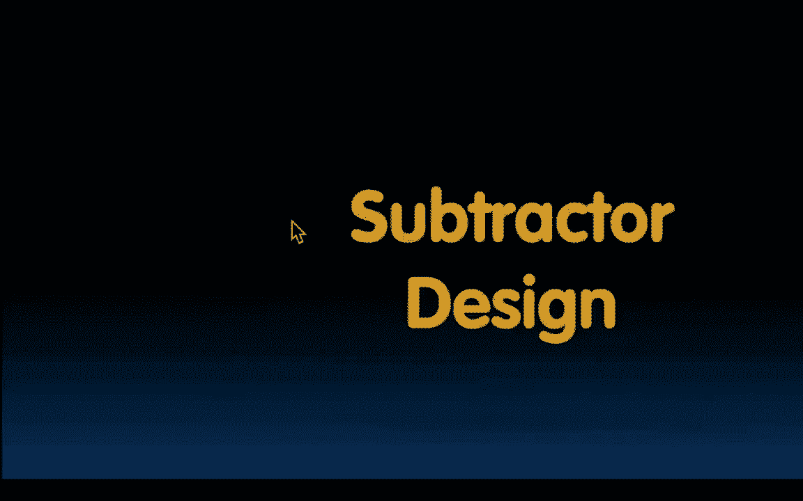

# CS 61C at UC Berkeley  - Fall 2022 - P22：Lecture 17： Combinational Logic Blocks - 这样好__ - BV1s7421T7XR

我们做得怎么样，我们这里有几个输入，几个人在投票，请投票，如果你能三个问题，然后我们再谈谈，这是我们星期五没有完成的遥控器，好啦，我喜欢这种主动学习，叫做主动学习，你问一些互动的事情，然后你们有对话。

你也许可以和你的邻居谈谈，或者这样做，我喜欢这种东西，那么我们得到了什么，所以我们基本上依靠假真的，但我们也有一口真正的井，他们在打架，我们看到了一个真实的虚假的真实，但每个人都相信最后一个是真的。

所以这很有趣，好的哇，好啦，所以我看到占优势的是d和f，字体很小，在这里，我得看看这个，好吧，第一个，所以不管怎样，没有一个真正的协议，除了最后一个是真的，这很有趣，好啦，第一个问题是硬件反馈。

类似于软件递归，其实是的，那是，这是我们在具有一定输出的软件递归中考虑的最接近的链接，反馈到输入中，我们认为反馈类似于，在某种程度上，你必须停止失控的递归，就像蓄电池一样，记住没有计时器的累积。

我认为这是失控的递归，在那里你没有一个基本情况，这是一种整洁，第二个问题是新时期，至少设置一个时钟，时钟到Q延迟，我说的是真的，是呀，这是基本的，你有，至少设置，现在正是时候，时钟到Q。

然后有一些组合逻辑，但是如果你没有组合逻辑，就是那样，所以那也是对的，所以我看到了真实和真实，最后一个，你能建立一个FSM来发出信号和相等数量的零和一吗，如果你还记得FSM。

我们看到每个状态在语义上表示1的数量，你已经看过了，那是零一，然后一个一个，然后两个一，当你回到零，当你另一个，它说可以，重置自己，然后继续，你还记得吗，这就像是那些状态的语义意义，我们吃得很好。

会有多少个州这样做，如果你必须记录有多少个0和1在它们的相等数量中，我们现在就开始吧，假设我答应你不超过两个，不超过两个，比任何时候都多，两个零还是两个一，所以我最多会有两个零，而没有一两个1，没有零。

所以也许那是零，然后这边一个这边一个，两个在这边两个就像五个州，好吧，如果我保证你连续不超过三个零，怎么样，在我给你一个或三个1和一个零之前，现在呢，三个州变成了七个州，当你意识到等等。

FSM是提前建立的，然后你试图在一个信号上运行这个，嗯，预付款的总数是多少？在你有之前你可能有零，它是无限的，我可能有无限个零，然后无限多的数字正好平衡了，你知道它是一个很大的正数，十亿个零。

然后是十亿个一，我想你不能提前，有号码，固定数目的状态的固定数目，因为我要做的就是再给你一个零分，比你有的州，你不记得你多了一个零，所以当你有所有其他的抵消它回到零，数字等于不可能建立的1和0的数量。

那不是很整洁吗，所以我要找的答案是真的真的假的，也就是g好的，那是商店，好的，便便，我总是要用手册点击这个才能通过，我必须点击那里。

给我点东西点击，然后去那里好吗，在新闻中竞争，这又是一个令人愉快的小视频。

我们玩得很开心，技术正在以惊人的速度加速，也许你看过波士顿动态，呃，会后空翻什么的机器人，这是一个机器人，它看起来像一个被砍下来的人，嗯。

所以这很酷。

所以那是呃，最新的机器人技术，很明显，这里面有很多计算机工程。

我必须喜欢，离开这里到下一个，我们怎么得到，我们怎么摆脱它，好啦，我得去那个，这是一个嵌入式幻灯片，好啦，那是一个嵌入式幻灯片演讲，哎呀哎呀，好啦，好啦，反正，所以这是相当令人印象深刻的。

我想五年内你会看到这样的机器人，跑得比人还快，我的意思是，你知道的，很接近它是它是它跌跌撞撞，但我认为这将是非凡的，我们要回顾一下，我是说没有轮子，我是说双足轮，显然他们可以。

他们现在可以从我们身边吹过去了，但那真是难以置信，可以去的RC车，你知道的，时速百里，他们现在能做的事很了不起，女士们先生们欢迎来到61 C，机密逻辑块，很高兴你们都来了，让我们开始考虑有一个人。

有两个信号，我还没给你看呢，顺便说一句，这很有趣，我已经向你展示了如何制作机密逻辑块，任何你想要的逻辑门，我们可以这么做，随便拿一张真值表，你可以把它嵌入到一个系统中。

讲了如何用有限状态机构建同步数字电路，那很好，比如数数3-1以及如何得到3，我们已经看到了，但你没有看到一个离开，在右边接收信号在左边接收信号，然后只有其中一个驱动输出，他们还没有那样做。

这就是我们现在要教你的，它叫多路复用器。

所以这是一个非常令人愉快的设备，你有n个a的比特和通道，你有n个b的通道。

但这是一座桥，其中一条过桥的小路被冲毁了。

所以这是一个旗人。

这是一个被标记的人，谁在说，你知道的，当这是零时。

A驱动输出，当这个信号是1时，然后B驱动输出。

这有道理吗，所以这有点像旗人说，好啦，这条路你可以走，这里有个大站，来这里，然后我把它翻过来，说你停下来，你可以这样走这么基本，它在做决定，谁来驱动输出，C，所以我们可以意识到，如果你做n位。

这是n位宽，你看到n位宽，二比一但n位宽，我们总是谈论这个，你可以想象一个更普遍的情况，它可能有四条车道合二为一，你知道这很难，你看，当海湾上有大车道关闭时，桥梁之类的建筑，所以如果我们现在看看二比一。

然后我们可以缩小，意识到这是32个平行的讨论正在发生，每一个，如果它是这些东西的n位宽，所有决定，无论A队还是B队获胜，所以A和B现在是位而不是n位宽的信号，我想问你真相表有多少行，让我们做吧。

让我们考虑一下，而且总的来说，如果我给你看样东西，我问你真相表有多少行，你的回答是什么？你是怎么开始考虑这个问题的，我们有多少输入，我们有多少位，输入的总比特数，二我听到二，我听到了吗，三个。

我听到四个吗，我得到了什么，三四个，谁给我四个，顺便说一句，这是一种罕见的情况，输入来自底部，我告诉过你，输入几乎总是来自顶部，从左边或从上面，s是输入，但是从底层，有点奇怪，但我们会接受的。

所以s a和b是我的输入，因此，我将在我的真理表中有一排，让我们看看这是否有意义，所以让我们来看看这个真值表，看看。

这是我做这件事的时候，还有一个光标，光标背面怎么样，好啦，所以当s为零时，S是零，C看起来像什么，他得到了什么，规则是什么来着，如果s为零，什么是C a权利，所以不管a是零，零一零一，当s为1时。

C是什么，零一，零一看副本B有道理，好啦。

挺酷的，不要太用力，所以我们可以建立我们的规范形式，做我们目前所学的一切，我们首先要做的是，我们去找每一排，写出s a和b的三个组合，使该行为真，这使得第一排不是S不是B等四个术语。

然后我们就可以得到我们的布尔代数，按摩乳液，然后是简化的工作，简化，你知道的，继续锻炼肌肉，继续锻炼肌肉，你得到一个非常简单的表达式，你得到的不是，这几乎是一个Mux僧侣的规则，但事实并非如此。

这是一个，当s为真时，是B，所以说，真正有趣的是，你得到了这个更加美丽和优雅的真相表，我们在条件逆变器之前说过，就像B和其他，这是一个，好像不是B成员，这是一种有条件的倒置，这漂亮吗，多么美丽。

我只是喜欢你的优雅，这个主题是，s是零c是a s是一，似乎很简单也很不错，好啦，问问题，那么我如何构建这个，我们如何构建这个电路，我给你这个，要走几道门，你能从那张照片上数出来吗，从那个东西。

有多少扇门，这是一个加分，两头是一个不，所以我有四个门，这就是我们的电路，没问题，就是这样，但这是一篇评论，这只是如何做到这一点的一个例子，没什么新鲜事，这里只是对如何做到这一点的回顾，宽一点。

多路复用器，现在让我们把它变得更一般，抽象的力量说你给我一些解决方案，现在让我们把它变得更一般，你现在是二比一，让我们把它拉长到四比一，如果是四比一，s需要多少位来确定哪个a b，我将从C或D中选择。

更多，它是，我知道，现在是早上，今天是星期一，我很感激我从一个到D的选择，答案在屏幕上有多少位s，二二，好啦，零零一零的模式，一个锁住了，让我们看看我们能不能进展顺利，首先我们如何建造。

我想问题是这个真理表中有多少行，让我们一起做吧，我的真值表里有多少行，我的解决方案在哪里，我的击掌在哪里，我们有多少输入，六二分之一是多少，你没有背下来，这个你还没背下来，你需要尽快记住。

我和你一起工作，我想当我们丽莎，当我们谈论缓存时，当我们要求他们记住特定的表格，有点太晚了，我们得把2加6等于64，记住二六六四，两个六，便于记忆，六十四那么六十四，我们现在应该把时间集中在64排吗。

记住加法器，我们说过，我们不要对这里的64排做2，这个我不想要64排，它是2到64行2 2 3 2位加法器，这就是我的方程，看它多漂亮就像，上次你看到这个，我们可以看看这个。

这就像什么时候，当这两个都是假的时候，什么时候B是什么时候那是假的，那是真的，什么时候，那是真的，那是假的，什么时候是D，当它们都是真实的时候，几乎和我们上次看到的一模一样。

我甚至不知道，我甚至不需要真相表，甚至直接到这里，那不是很整洁吗，所以如果我告诉你嘿，写下1代表3代表8个输入，你可以在扩展等式的基础上做到这一点，现在你可以在考试提示中为自己做这件事。

我把它加到期中考试里，这是我们美丽的真相表，你看，那张真理表多漂亮啊，对于s 1和s 0的每一个模式，输出是B、C或D，很清楚是什么，这没什么奇怪的，现在有没有另一种方法来建造。

这是构建这个提示的另一种方法，轻推轻推点头，NCW A锦标赛，如果你想到某种竞技体育锦标赛，你怎么能造四比一的渣土，如果你去炸薯条，有很多免费的2到1亩，记得我们之前说过，如何构建一个三输入XOR。

如果您只有两个输入xor，您可以级联它们，你能用，当然你能用，或者你肯定能做到不和不，这是点击器的问题，你不能把这两个输入中的两个，然后层次结构将它们级联起来，形成三个输入，没有，这不是一回事。

三个输入NAND的逻辑是不一样的，但是你能在这里用多路复用器做吗，我们有没有想过这样做，每个城市都这么做，你得看到一些点头，是啊，是啊，去吧，让我们看看我们是否能分层地做到这一点，就像那样。

我们把它们叠在一起，去看看，现在嘣，你已经得到了自己的第一轮比赛，S零决定A B或C D中谁赢，然后他们进去，然后是决赛，获胜的，你知道，决赛，最后一场比赛，这是全国锦标赛，决定者，S一个。

哪一个是另外两个的胜者，那不是很整洁吗，有趣的是，这是硬件，所以所有这些都是平行发生的，这意味着即使我们说在一天结束的时候，我要选d所以a b c和d，哦，我得到了，他们一直，他们那天早上醒来。

以为我没事，我要去开车，我要去开车，D秒零，伊罗说对不起，你怎么能不开车，所以要记住，我是说，我们最终的答案是，所以最终开车，对不起，所以要记住，D将是答案，密码是d，所以现在零是1，所以b通过。

B认为今天是我的日子，今天是我的日子，今天是我的日子。

好啦，今天是我的日子，D认为这是我的一天，B和D，在这里，一个说对不起。

今天是戴戴的日子，所以它还在那里，所以即使是这样，顺便说一句。

我在说什么，这条线上有数据吗，在那条线上有数据，即使它没有被使用。

所以这种等级制度，数据不断流过，然后在某个时候，她说对不起，我选今天的零点，说我会选择B或D，今天是国庆节，所以硬件需要所有这些都是同时发生的，它不像A和B，不要计算，数据通过。

只是没有在最后一刻被选中。

你可能看过这张照片，当我给你看CPU和数据路径的图片时，一种叫做算术逻辑单元的东西，这是我们的单元，将放在一个通用盒子里，它可以做我们需要的任何算术和逻辑，所以我们叫特种部队。

Alu装置，所以这是一个非常简单的，我给你一个很简单的，只会做广告或做减法，或按位或按位，或者从某种意义上说，如果你放大，只支持风险五，那些指示，在中介和寄存器上，你可以用我们今天建造的这个。

我真的在展示一些我们今天实际上可以使用的东西，相当强大，我不只是，啊，这是个玩具不，这是真的，32位宽实际上可以工作并支持它，如果我们只支持这四个行动，那漂亮吗，让我们一起做吧。

所以这里又是有趣和独特的地方，现在是另一个奇怪的事情，s线是从右边来的，从这里进去，而不是从左到右或自上而下，S从侧面过来了，无论如何，关键是S不像A那样决定，就像驱动输出的多路复用器。

S正在确定要做什么计算，那不是很有趣吗？所以它就像一个侧边命令，就像一个，今天就像窃窃私语，我想让你做一个OR，我把s值设置为，或者在输出的末尾，它将是任何A和B在那里它是或的。

所以就像你现在在低语该做什么命令，很酷的是什么，它几乎就像函数作为数据，如果我们像地图一样思考，你修补了数据的功能，就像s在编码函数要做什么，这是一个很普通的盒子，这会做很多事情。

如果你想象我把我的ALU扩展得更强大，还有更多的事情要告诉我做，今天轮班，或者其他非常聪明的东西或者这里的XOR，但让我们做一个异或，让我们做吧，你知道类似的事情，好啦，让我们看看如何建造它，开始了。

太刺激了，我要去那里打鼓。

它是，非常感谢，那是我简单的阿柳，让我们花点时间看看，并能够理解它在做什么。

A和B进来，被送到一个加法器蚂蚁减法器，我们最后会花时间，它们也被送到一个三两香蕉盒子里。

那很容易，只是有两个平行的，那里没有什么神奇的。

而这是一回事，这是三个平行的矿石，好吧，那么让我们回到我们的。

让我们回到这里一秒钟，记住让我们看看这里。

所以如果你看这个，这是一种算术和逻辑，我如何确定哪个是用。

当它是当一个，高位为零，它有点在算术空间，当一个是一个，它在逻辑空间里，好啦。

所以让我们记住，零算术，所以我们现在就到这里来，嗯。

这里是算术的家伙和零点，作为一个零项，哪一个，S 1表示当S 1为0时，它说我想在这里取出减法器，当一个是一个，我要加法器零点告诉我，哪一种和或哪一种是结束。

为了今天，那不是很整洁吗，现在呢，有趣的是，又不是说，我想让你再来一次，我几乎喜欢MUX，也就是说这些值一直到最后一个，如果我巧妙地雇佣他们，他们不是被选中的，这里发生了什么事？如果是时候或者。

我们只能说是时候，anbox还能用吗？实际计算一个值，并将该值发送到多路复用器，多路复用器的输入，我看到一些不是，是呀，它是，是硬件，它总是起作用的，性别是，即使n没有被选中。

此时and box正在做功，那三头两头在做他们的，然后呢，在那个多路复用器上有一个值等待被选择，也许哦挑我，选我，它不是被选中的，因为它将是O日，就像那样，加成物做功，但最后你会被一些渣滓忽视。

那天它不能开过桥了，这有道理吗，所以硬件，他们总是在同一时间工作，真的很重要，我就像嗯，让我们节省电力不，我做不到这个硬件，他们总是跑，他们总是在跑，他们在做他们该做的，不是很好，醒来做不不。

这只是要去做，我说不，四个都得到了三个或四个都得到了计算，我最后选择的唯一一个会被派来告诉我，你的名字，Miguel，走呀，走呀，那是个好主意，也许有一种方法可以思考头部。

我们能把我的广告减影装置关掉吗，我可以吗？这几乎就像有一辆车，然后你到了一个红绿灯，现在它自己关了，那是一辆漂亮的新车，在红灯时关掉自己，我的特斯拉不用任何动力，因为它是电动的，但重点是这么多电动的。

你知道汽车在红灯时自动熄火，你不能在这里做同样的事吗，你就不能把广告减影装置关掉吗，什么都不用做，这实际上是一些想法，你能做那个吗硬件更难做那个，关掉某些东西，只是这是一个和门，但你怎么能关掉，没有。

有另一个岔路口，或者它是一个和它只是一个和门，流出的电流，因为这有点难，你在那里能做的经常是，我们真的没有至少，我可以稍微说一下，但是，当你转换信号时，把它从0切换到1最终会有一些成本。

从0到1再到0的一点点成本，所以你可能会说，也许你只是做一些事情，所以只有所有的零，所以它没有切换它，如果你不打算做些什么，为什么一直切换到计算，它，两个都是零，而且总是零，当它不被使用时，总是零。

那没有切换那么多，实际上有可能，一些书，这一切实际上都将是零，什么没有被使用，但那只是一种，这是目前的优化，不管怎样，我们还是专注于我们在这里得到的东西，美图。

现在让我们在这里建立外减法器，我们顺路走，我不会花任何时间建造逻辑门。

因为他们就在那里，他们只是平行的，他们没有什么真正有趣的，外减法是这节课唯一有趣的东西，所以让我们花时间思考如何构建外减法器。

两种方法，真值表或将其分解成碎片并级联，我们该怎么办，好啦，好啦，必须举手，谁想做真值表，来真心话大冒险，我们走吧来吧，这就是怎么做的方法，我们走吧来吧，元音形式，两只手，真值表太棒了，好啦。

你负责六十四排的两排，你现在就开始，谁想做等级级联，是啊，是啊，是其他人，好啦，所以当其他人在做他们的真相表时，去找点乐子吧，我们要去吃午饭。

所以我们要看看一位加法器，只是一点错误，一位加法器的逻辑是什么，我们将从最简单的一个开始，最低有效位，好了，我们开始了，我想知道凯莉什么时候开始做一年级的数学题，但在二进制中，字面上是一年级。

这其实更容易，因为他们有十个不同的数字要关心这实际上是零1，它实际上比一年级的数学容易，这是我的总数。

如果我有一个，我有一个什么，这是加号，这就是我的总数，让我们做吧，零加零，这是较低的位，这是高一点的，零加零等于零，零加一等于一一加零等于一，一加一等于二，零下位，高位是一。

这有道理吗，我拿着那个，低位为零，现在就拿着那个，我有两张真值表，我看到了吗，我以前见过这些吗。

我见过这种模式吗，零一零一，是呀，我有它的XOR，我见过这种模式吗。

零零一，是呀，我有它的和，我最不重要的部分是XOR，我完成了，好啦，我想，顺便说一下，我要做一个盒子，也许在A和B中携带两个位，也许是从右边进来的，一般来说，向左侧推进，然后和。

所以它会像一个有趣的盒子，我们马上就会展示一张照片，让我们看看一般的情况，在一般情况下又是，我得了两个甲和两个乙，A和b，我可能得从其他早期的计算中吸取教训，我有我的执行和我的总数，所以真的。

我有三个部分加在一起，零还是一，零或一，零或一，A和B和携带，我只是基本上加了三个和最大值，是三对一一一是三，最小值为零。

所以这里是一个从零到三的数字，让我们一起做吧，把所有这些加起来，让我们把它们加起来为零。

零-零-低出价为零，出价高的是一个，几乎如果你把它翻过来，如果我像这样画了这个，它就会，它看起来，更符合逻辑的是，因为s是低阶位。

C是高阶位，好吧，我得到了多少一，二，三，一，所以这是一个，零上位，那是一个，一加一等于二，对了两个，高出价零携带一个低位零，这是一个是两个，那是二三看高一点抬一低一点一。

我真的应该把这个重新画成翻转的，所以进位在左边，因为它看起来像一个实际的两位值，因为它是两位值，它实际上是两位值，我到了，如果你翻转c，c，i，plus，one，and，s，of，i，好了，开始。

我不会给你答案，这次是什么，我们有三个，我有八排。

那个门是什么？你看到了什么，是吗？凯特看到的。

你以前看过账单，看看你能不能想通，I的S，C，我的，再加上一个勇敢的人，顺便看到了，我以前给过你这些门，所以它就在你的舌尖上，但你可能不记得以前的课了，让我们看看我们能做些什么谁想给我一些东西。

你可以告诉我你的名字比尔去，你想弄脏一些东西，你想在里面放点东西，我想要一个街区，虽然，可能来自组合逻辑讲座，所以我们提前看了两节课，也许周三我们做这个，我要一个街区，我甚至给你起了个名字。

我看到前面有只手，是啊，是啊，告诉我你的名字，姜，去吧，这可以是三路排气，哦是一个三向XOR门，看那个，让我们看看，记住三路，记住NYX或XOR的规则是计算什么，很奇怪，这就是，反正就是这样。

X是你记得。

好啦，当第一个是奇数时，它是一个，我们一起来试试，那么让我们看看这是高，当数字1是奇数时。

有一个一个，这是正确的，真二，是零，没有一个，很奇怪，那是一个，两个都不是，甚至没有和奇怪，太完美了，i的s是xor。

好啦，所以我喜欢那个，别人给我，i的c加上1以前见过这种模式，但它是什么，告诉我亚历克斯的名字，干得好，我的朋友，多数电路，让我们看看这对不对，让我们记住，大多数人说你是任何东西的输出。

大多数人都在投票，我们做的是零或一个蓝色或蓝色或红色，在这里，我们去零更多的零，更多的零，零上升，现在呢，是一二零上的两个一，我是零。

一二一一二一一三一一，就是这样，答案是多数，干得好，乡亲们，异或多数，谢谢你，如果你记得大多数，这是一个非常简单的模式，像a b、a c或b c，挺好的，就是这样，我们做了一个二位加法器。

我做了一个关于一个额外的参考点，顺便说一下，XOR在做什么XOR真的很漂亮，Xor就像把它们加在一起，我记得当数字1是z时，数字1是奇数，我在XOR之前说过，XOR的另一种思考方式，你以前听过这个。

就像你把它们加起来，不要携带，如果你看看把它们加起来的最低位，这就是你得到的，实际上就是这样，从字面上看，它是什么，它是，我把它们加起来，价值是多少？如果我不忘记携带，我忽略了携带就像，从字面上看。

这个的定义是什么，这是这上面写的，这是较低的位，当你把它们加起来，如果你想象Xor有这种美丽的平衡特性，所有的都取消了任何一个，如果还有一个，它取消了它回到零，这里有一个，这是一个，这是第二个，现在呢。

是零，这是第三个了，这是一个，这是第四个，是零，一直取消，所以说，如果你喜欢偶数，它们相互抵消，这是一个美丽的平衡，相互抵消，只有当你有了，所以这几乎就像谁还记得这个有趣的事实。

如果你看二进制并记住小咬，列，我做了第一堂课，我写了一个小专栏，所有奇数的共同点是什么？在最下面有一个，因为这个，就像同一个连接，不是因为这个，但以一种美丽的方式与此联系在一起，当它是奇怪的，很奇怪。

因为在得到的和中有奇数个1，所以所有偶数的最低位为零，就像说好，你有几个，他们平衡，如果他们平衡，是零，这是一种很好的思考方式，奇数在那里有一个1，跟这个差不多，当我把它们加起来的时候。

把一列东西加在一起，我得到这个就像，例如，我怎么说这五个，我可以说五个，你知道，五是一个零，二进制中的一个，下面有一个，表示五的另一种方法是什么，字面意思是一加一，一加一加一，五个一。

那里最低的位是多少，嗯，五是奇数，是啊，是啊，这意味着x的定义是奇数，我只是告诉你，Xor是关于奇数的，一个是一个，这是什么，这是最低的位是XOR，那确实是，那真的很漂亮，希望这是一种描述，好啦。

这是我的一位加法器的照片，我们现在知道了，这是盒子，我说的是这个盒子，是现在喜欢的盒子吗，我只有这些，我到处都有很多这样的东西，a和b的两位。

我得继续我的右边，我得在左边执行，我只是把它们放在一起，我真的有三两个从左到右。

那真的很酷吗，顺便说一句，这是我的X多数，我受够了，就是这样，X或者在上面的大多数是底部的，我感觉很好，我快做完我的，我的全部阿鲁，就像字面上的，我的失败就快结束了，我给你看了顶层的照片。

一个或那个很容易出减法器，我们少了减法器，那是很好的部分，我怎么做我怎么做减去，如果我做了一个n，如果我有所有这些，我去薯条，昔日的无线电小屋，我买了我所有的，我有满满一口袋的加法器，事实上，我有N个。

我可以做一个N位加法器吗，我有，我只是把它们连接在一起，与其说它们是层叠的，就像我以前做的那样，你在那里层叠，就像等级制度，就像你把它们从左到右，你知道有一些级联正在进行，不知何故。

携带携带不知何故在冒泡，例如，如果A都是一，我加了一个，嗯，那就像，像所有的9一样记住，再加一个，记得这一点，喜欢一年级，九加一等于十，那个现在一加九等于十等于一百，现在一个人拿着钥匙。

一个人一直拿着钥匙，冒泡着，同样的事情也发生在这里，如果我有所有的，我再开一英里，五负一加一负一都是一加一，1加1等于2，1加1等于2，1加1等于2，就像字面上的，同样的级联也会发生在携带冒泡的人身上。

一路走来，有趣的是，它的意思是不像和3 2位和门。

如果我说嘿，你的头是什么，1。过了一小段路和登机门，你们耽搁了多长时间？

你说10皮秒，然后我问你，你在通过一个3-2位的手动闸门时耽搁了多久？那么它们都是平行发生的，所以是十秒钟，都一样，现在我告诉你，如果你推迟一点，加法器是10皮秒，你通过n位加法器延迟了多少？嗯。

你通常说10，除了你，这家伙得等进位计算好。

也就是过了十点，这只还不能做任何工作。

然后它就醒了，它计算第二个，我们可能会冒泡到下一个。

再来十个，哦哦哦，你看我要去哪里，右边那个。

你现在有n乘以10皮秒，在最坏的情况下，这种携带可能会，一直向左冒泡，从右到左看，所以加法和减法实际上有更长的延迟，然后是一个和一个或门，因为这是平行发生的，这不是平行发生的，有一件事，事实上。

有一个聪明的设计，你可以计算出，基于某种比特模式，携带是否会在那里，你把它送到前面，你就像在看一些逻辑，会有人从下面咬一口吗，你向前传，所以下一口可以从携带开始，不必等到这四件事都做了。

就是那种聪明有趣的东西，所以有一些优化，如果你想知道怎么做，我们叫涟漪携带涟漪就像右边的涟漪，就像大的，一个大湖和湖中的一滴水和海浪，波纹这就是嘉莉的遭遇，这种涟漪携带是麻烦，所以你必须聪明地提前发送。

所以后面的部分可以知道嘿这个即将到来的携带进来还是不进来，而不是等到有多少，十倍于三一，在上面或上面之前的延迟的两倍在上面或上面，最左边的人可以说，好的，我要做最后的计算。

所以这是一些聪明的优化来尝试做到这一点，是呀，问题，世卫组织建议有两种方法来实现这一目标，对呀，我们可以创建级联加法器，我们可以使用真值表，向上看右边，如果我们走另一条路，有什么时机上的好处吗。

如果我们已经计算出了所有的结果，我们只需要比较一下，好啦，我们有这个输入，哎呦，我喜欢，我喜欢，我真的很聪明，很聪明，所以问题是什么，如果我们决定进去，什么都做什么都不做，把所有的事情都弄得乱七八糟。

您肯定不会遇到像这样的级联加法器问题，但你可能有更多的门，所以要计算出2到64是一项艰巨的工作，你没有人可以指，但也许就像八位加法器，你实际上可以玩这两个选项，在那里你有一个位加法器，然后八位加法器。

从字面上看，2到8 2 56，那不是很多行，你实际上可以做到这一点，并做逻辑来解决它，那是可能的，您可以在逻辑上这样做，让它只是vera log，让它顺其自然，看看会发生什么，然后比较两个有趣的事情。

我们一般不这样做，我们试着做这个，然后试着聪明一点，仅仅因为谁想尝试64是可行的，真的吗，所以这是到65，因为我有另一个C0的输入，所以实际上比那更糟，是呀，所以问题是另一个问题，哦耶，不用担心，哦。

不，停止分享，当然可以，好啦，在这里，我们去停止分享，好啦，所以别再分享他们的欢呼了，然后我们分享欢呼和流血，只说蓝色，当我点击某物时，那有帮助吗，好啦，然后我得把这个藏起来，哪个在那里，好啦。

当然不说话，那么溢出呢，让我们来谈谈溢出，现在我想问你一个问题是溢出，只是高水平的携带，只是c subn吗，他们有一些，他们把它们加在一起，我问你，你能用n位来存储输出吗，有道理，这似乎不符合逻辑。

这只是中国，当CN走高时，溢出来了，我不能储存对我来说有意义的东西，对呀，可以吗，我有个问题要问你，如果这n位是选择补码呢，什么是否定的，一二补语，我说过很多次了，你能储存所有的-2和-2的补数。

说当然，所以说，我可以加减一吗，所有1加减1，我能储存减二吗，是呀，会有一个CN吗，那样的话，应该溢出来了吗，不，你明白，如果你把所有的加所有的和无符号的，你显然不能储存它，那是最大的未签名数。

加上最大的未签名数，很明显你不能那么做，但如果我说的是2的补数，万众一心，减一等于全一，两个减一，我可以储存负2，是呀，所以我要找个座位，但我想在两个互补的世界里忽略它，但在没有签名的世界里，我在乎它。

所以我们现在要考虑对这两种不同的情况有不同的逻辑。

所以让我们来谈谈这个，这就是我花了很多时间做这件事的地方，玩PowerPoint试着看看，如果我加上，让我们看看我能不能放大，我会花一些时间在这方面，因为它是如此美丽的滑梯，希望这描述了你需要的一切。

但让我们花点时间看看这里，我们正在看的是像第一个真正的加法器在最低的水平，这是最低位加法器，最低位LSB，这个在那个上面，所以这是最低的两位，所以我基本上是从零开始加一个数字。

零还是零一还是一一还是一还是一，所以我加了两个2位的数字，最低两位数字，如果我添加第一个无符号，让我们看看这是否有效，好啦，开始了零零加零加一等于一，零加一等于零加二等于二，零加三等于三一加一二。

哪个是零，拿一个，这仍然是进位权，但还是二合一加二等于三，适合一加三，哦，四个可能有些问题，但这就是携带，这就是执行，这是那种，这是携带一，上面的人拿一个给这个，然后外面这个，最下面的一个是携带两个。

从最后一个加法器里出来的那个有道理，问任何问题，如果你有的话，二加三等于五，那是五个，没有携带一个，但是有一个二进位，二加二等于四，有一个携带二，无人携带，三加三，啊，那是六个，这是正确的。

有一个搬运一和一个搬运二，现在我们做的是没有签名的，在这里签了名，让我们看看这里，所以现在记住我把几个翻译成，这是二位二的补码，其中零为零，一个是一个，记住这两个的补语，正数总是和无符号减一一样。

我们知道负就是一，减二等于一零，如果你记得2的补语，还有一张底片，然后是积极的，现在我们得到的是，这是这些都还在停顿，和以前一样，一加一等于二，就是那个，再加上一个零是多少，查一下减去两个。

1加减2 in in like不是基数2，一加减二减一看看是什么，算出来了，所以那很好，别担心，一加什么都是一，一加一等于零，当你问自己，什么时候和的最低两位不代表正确的和，一加一等于几？

零一加减一等于零，它们相互抵消，一加一等于零，最低的两位是多少，零零它起作用了，不用担心，有执行，那是一个搬运一和搬运二，但最低位是正确的，减一加一等于，不错。这个怎么样，呃一个零。

我们起来负二加一负一负三，嗯，下面的两位当然不代表负3，因为我只能表示-1-2，好的减去2减去1 1和0，所以这是不正确的，可能一个零等于-2-2加减2等于-4，不能做减四加二位，所以这也是错误的。

看这个手表这个1和1是负1加负1，最低的两位是多少，减去二，它起作用了，所以一个起作用了，所以说，现在让我们把注意力集中在它不起作用的地方，最低的两个比特不起作用，有什么规律吗，当这种情况发生时。

我们在检查那只猫，我们在检查这里的搬运和这里的搬运，这里的这个搬运叫搬运一，这里的进位是输出进位或进位二，在这里左边那个，那么现在什么时候会发生这种情况，高阶加法器，让我们去更高的加法器。

这个输入携带一个，哪个是最上面的数字，上面是蓝色的，左边是带二的，哪个是左边的，所以这就是为什么我在这里描述它，如果我有，让我们做这个模式，我想我想标记这些东西，我想标记这些东西，如果我没有执行。

没有我喜欢，一点蓝色都没有，一点也不忧郁，一点蓝色都没有，一点蓝色都没有，一点蓝色都没有，看起来没有溢出，你同意，一点也不忧郁，两边都不能携带，无溢出，所以我们很好，我们说的是2的补码溢出。

无符号溢出只是在顶部执行，上面，执行，这是从一个二的补语溢出来的，看看这个，如果我没有蓝色，禁止携带或携带，无溢出，如果我有执行和执行，这是这些照片中唯一一张既执行又继续的照片，那很高，那又很高。

没有溢出不是很酷吗，减一加减一等于减二，如果我只看最低的两个位，减去两次发作，看一个，零是负二，减一加减一减二，它工作最低位工作不，即使我有所有这些负担，那不是溢出，只有当我带进去的时候。

但这里没有执行，这个是带进来的，但没有执行，那是溢出，那表示他们都是阳性，所以你看起来，那是正零，零那是个正数，一加一，我们不能储存两个，所以我把它带进去了，带进来了，我们带进去吧，但没有执行。

所以这将是零，这将是一个，这就是那个家伙的案子，这里，就是这个看，我做了一个动画，如果我执行了，Binode，进位a和b a或b或减二，其中一个是-2-2是最小的数，我可以代表看对了。

二位减去二是最小的，如果你再加一个负数，我不能再走了，那是我的极限在我的极限，我在墙边，我不能再消极了，呃不，我是负2，如果你给我增加任何负面的东西，我要过去了，减去2，其中一个是负两个。

你不能再添油加醋了，你可以做两个负数，二减一，我在中间，减一加减一，罚款减2，我能做到，一加一，一减二，我能做到，但我做不到，如果其中一个是负2，我不能再走了，看到有一点主动学习，我不能说得更消极了。

那是什么，哎呦，就是那两个，其中一个是负两个，这实际上是溢出，那么我什么时候有溢出，什么操作，这个，去看十月快乐的十月把戏空白，款待女士们先生们，这比秋天比春天好多了，教课。

所以无符号溢出只是最高的进位，补码溢出，我在看我在看最高级的加法器，我看着腐肉和最高级别的蝮蛇的执行。

就是这张照片，如果我回去，如果我回到这里，血滴血滴，有我的最高价值，我把这个和那个值，还有那些东西，这就是我的两个补数溢出，我花了十分钟跟你说。

这是我的设计，我喜欢这个，这就像是，有一些非常美丽的聪明，我喜欢这个，看得非常聪明，这里溢出，这实际上是作为有符号溢出。

但是二的补体溢出，因为未签名，只是不能，我撑不住了。

我得到了，你知道的，N位，撑不住了，我冒泡了，那是未签名的，有符号的溢出就是我们刚才看到的，我怎么做减法器，我把蝰蛇弄对了，我怎么做减法器。

这是最棒的部分，记住负b和正b是一样的。

好啦，你如何否定一个数字诱导的赞美，你怎么得到一个号码，你，翻转位，加一个，让我们看看我们能做什么，所以看，如果我能有选择地翻转比特。

我如何有选择地翻转位，记住这个XOR，Xor是一种条件逆变器。

我要取b是b把b放进这个鳍状肢里。

这个条件逆变器，当减数线高时。

当它是，我是说，你知道加减法，当减数线走高，B会发生什么，b变成像翻转的位b，但我得加一个看看。

我把减法线传到了。

所以当它是蝰蛇的时候，它增加了零，这只是总数，当它是减法器时，XOR上的条件逆变器，把b的所有位都翻转，减法线是正一，我只要插上电源，这个携带零就像，而不是有好，我有点别的事，否，就是这个就是这个。

记住所有的盒子看起来都一样，这个是空的，像扭动，就像这里的带电电线是零输入的，我插什么，我把它归零，因为你总是想开始加到零不，你接通了线缆，当Sub为零时，你在增加，你什么也没加，只是a到a加b。

当潜艇是一个，你得了正负分，B通过条件逆变器的位，加1 b现在已经倒置了，现在是负数，b翻转位，加一个翻转，条件逆变器的位加上子线上的位，很聪明，又是一堂课，他们通常为这部分鼓掌，那很酷，那是。

我没能成功，我没能成功，我不会为我自己拿走豆荚的，那真是令人印象深刻，那很酷，你可以通过将比特反转并加上一个来做减法器，它到底做了我想做的事吗。

我们的时间很充裕，这个问题五分钟，好啦，这样容易一点，具有四位信号的MUX的真值表是两到第四行，我们可以级联和一个位移位器做一个，用于左移位逻辑和右移位逻辑的N位移位器，如果我们想去圣洁的V点com。

斜杠ddg或text two two three two three text，DG呼叫二二三二三，我们马上就要关闭卫星防御系统了，这是一堂精彩的课，其中有这些很好的模块，我们已经用这个点击器完成了。

在我的总结幻灯片中，我们完成了SDS单元，这是件大事，您现在可以构建一个FSM，您现在可以构建一个ALU，它相当强大，我们要从下往上，如果你还记得咬ISA，从下到上从上到下，我们做到了。

我们现在可以接受任何C代码，并向下到位，风险五位机码，现在我们是从下到上的身体，试图从电流的基础上充电，这是如何流动的，这四堂课就讲到这里，是吗？你如何从模拟领域到糟糕的时机。

建立一个像调频和调频这样的系统，将帮助您构建一些状态机，如何用人字拖建立寄存器，如何构建ALU，如何拥有多路复用器，能做到的，我们现在要把这些放在一起，现在呢，我们在这个点击器完成后，我告诉你。

我们现在已经建造了足够多的东西，能够把这些大块放在一起，实际构建我们的数据路径，我要把麦克风递过去，周三给丽莎的点击器，我们将在两节课中讨论如何构建一个数据路径，她星期一会还给我的，接下来的星期一。

只要说，我们怎么控制它，就像提线木偶的弦一样，如何控制数据路径，打开和关闭东西，做不同的操作，相当强大的东西，我们都结束了，我们将有一个工作的风险氛围机器，神奇的一天，当这种情况发生时，好啦，开始了。

我是说一个假的真男孩，几乎每个人都明白，答案是假的，也是真的，为什么第一个。

我有张幻灯片，为什么第一个是假的，任何人，因为我们在这里看到了一个真正的4位标记表，信号控制16个输入，输入总数远不止四个，那是二十块，是二十排的第二排，连四排都不近，所以你不会用真值表。

只是太多的行只是级联他们，第二个我们可以，我们把它们叠在一起，答案是正确的，干得好，这么假，真，你们几乎都答对了。

那几乎太容易了，结论，准时看，看看这些人，我们做得很好，做了一些早期的事情，因为讲座开始得有点早，使用MUX在输入中进行选择，像路上的旗人，说好，你可以停下来，你们来吧，停在这里，你们发挥到了极致。

一般在2到1之间，四比一，那种完全没问题的事情，我们建造缪斯，按等级划分，您看到了alu可以使用多路复用器实现，我们有一个基本的和基本的，或者我们有一个聪明的原子减速器，非常非常聪明，不是我造的。

我只是非常非常聪明，其中加法器做一个普通的加法器，你基本上通过翻转b来处理减法，然后再加一个，你得了负b，非常非常酷的东西好吧，太感谢你了，人们是SDS管道将在周三开始通过数据路径，数据路径。

周三数据路径。

