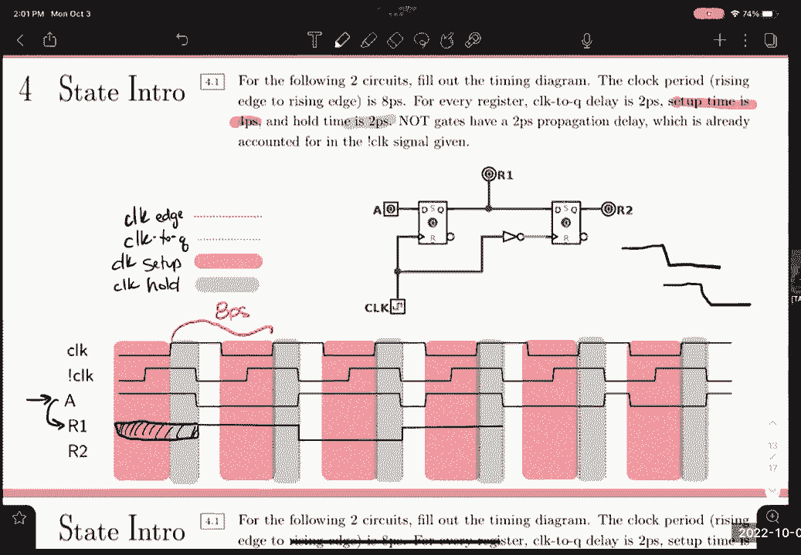

# CS 61C at UC Berkeley  - Fall 2022 - P23：Discussion 6： SDS, Logic FSM - 这样好__ - BV1s7421T7XR

今日三大话题，在我们开始之前，我只想指出你还有几个最后期限，嗯好吧，你有一周的家庭作业，五个，你这个星期三有项目要做，嗯是的，今天我们要跳来跳去，嗯，我们要处理布尔逻辑，我们要做一点调频，然后同步。

同步数字系统，大家对这些感觉如何，在聊天中是否有某个话题，花更多的时间在任何人身上，我想你们已经很擅长这个了，好啦，嗯，嗯，我们将从布尔逻辑开始，所以说，我们有三个主要的行动，和或不，然后你知道。

这些的组合，呃XOR是几个，我们这里有这些非常有用的身份，嗯，主要是对摩根来说往往是解决许多这些问题的诀窍，我想一个开始的好方法，如果有人对基本布尔代数有任何疑问，我们可以跳进一个问题，好啦，所以呃。

我们有这个问题，你的工作表上的三点一，基本上让我们，让我们试着利用摩根的谎言，这些就在这里，试图证明这种平等，我不知道，好啦，大家对这个问题的看法如何？也许我们可以在起点上得到一些建议，我将从，呃。

就左边，我会试着用左边来证明右边，所以我们有一个，那不是彩色的，我们没有a或a和b，我们可以说a和b也等价于不是a和b，似乎毫无意义，但这给了我们利用摩尔定律的机会，所以我们没有什么或没有什么。

我们可以把这些，成为，整个冬天，下一步，有人有什么建议吗，可能还会再出现在摩根定律里，是啊，是啊，是啊，是啊，当然啦，所以我想说的是a和b等于不对，是啊，是啊，是啊，是啊。

所以我们在这里用了一个摩尔定律，呃，不是a和b等于不是a和不是b，所以如果我们说在这种情况下，这个a对应于这个a，这个b不对应于a和b，假设，是啊，是啊，所以我们有点抱歉，是啊，是啊，我没解释清楚。

但是，整个学期我们都在伞下，所以那是，所以是的，我们没有A和B，所以不是a，b是b，如果有道理的话，对不起，像这样的线条，这是唯一的，是啊，是啊，所以如果我们看看德摩根定律，它说。

如果我们有这个不是什么，或者不是什么，然后我们就可以把它们拉到一起形成，不是什么和什么，所以我所使用的是像这样的谈话不是，这件上衣不是，可能有更好的解释，对不起，但你利用这些。

利用摩尔定律把它们结合起来，这样我们就有了一把伞，我们可以把这些术语，好啦，酷所以嗯，返回当前步骤，有人对我们如何前进有什么建议吗，我想把这个弄过来，当摩根再次怀疑时，启动我们。

我们可以在这里取这个内项，我们可以尝试再次利用摩根，好像我们在倒退，但我们得到了这个整体，不是三个术语都对，所以我会告诉你我的意思，我们有一个，结还没结，他们都这么做。

很多这样的问题也是一点点摸索出来的，嗯，要找到前进的方向可能有点棘手，但我们只是再次使用相同的身份对吧，但现在我们不再有这个术语了，我们有一个术语，如果我们把这个A分配到这些，我们有一个关键的取消步骤。

我们有一个而不是像这样的，好啦，所以这只是在正确的分配，但是有没有人注意到，我们可以吗是的，所以是零，那么什么是零呢？呃，八乘九，逆，是啊，是啊，是啊，是啊，所以你不能有真与假，对呀，所以总是零。

所以我们把这个处理掉，我们有，这个结果术语有意义吗，是啊，是啊，所以我想我们不能有两只动物，是啊，是啊，是啊，是啊，所以这也是，嗯，在这张桌子上的一个属性，嗯，很明显这个是反的，但基本上这里的想法是。

呃，A可以接受1或0，是啊，是啊，好的，这个术语是说，而不是一个所以A是一个，你得到1和0总是错的，或者零零一，嗯，是啊，是啊，永远不可能是真的，好啦，所以任何想法都更接近，下一步我们淘汰了一个学期。

有什么想法吗，是啊，是啊，你可以再次使用抵押贷款，把它分成不是一个或是的，是啊，是啊，又是摩根一家，这是跑步主题，又是这条法律，就在这里，我们可以说我们有，他们不会看到的，所以我们有一个完整的。

不是什么和什么，我们可以把它们分成一个或语句，而不是简单的只是对，这正是我们想要的，包括一些技巧，我说的有点快，所以请用问题来阻止我，让我们来决定你们想做哪一个，好啦，我们去吧两分钟后回来。

这个问题对你来说有什么特别的第一步吗，在这里使用任何身份，所以质疑，是呀，阅读一些共同的东西，比如是的，是呀，正是你所说的，是呀，是呀，分布式属性，对所以，是啊，是啊。

所以我们可以像一个普通的术语一样收集，对很好，所以我们就从这个开始，嗯任何，您想尝试隔离的任何常见术语，所以这个问题其实很有趣，如果你同时收集两个术语，效果最好，所以如果你注意到顺序。

我们没有一个不是纳粹，不是纳粹，如果仅仅是前两个任期呢，我们收集的不是一粒也不是一粒种子，让我们试试这个权利，这就给了我们，本学期，第一学期我们能做些什么呢？是呀，您可以将括号消除为1。

那一直是个好主意，我是说就是这样，我猜，然后另一个，所以是的，所以这基本上是说，真假权利，总是一个，所以我们要用所有，我们将这些分为三个术语，所以我们要做一个非c，他们真的没意见，所以它的作用是。

它允许我们消除整个方程中所有的蜜蜂，所以这将是一个，这将是一个，那将是一个，我们最终得到的不是一个不是C，好啦，你下一步想做什么，这里有一个小得多的表达式，你可以拿着，是啊，是啊，听起来不错。

我们会做同样的事，所以我们会收集你想收集的，好啦，所以对于c，我们不做a not c或a not c，又是同样的事情，这相当于一个，所以我们最终得到了表达式，对不起，我的字不是最好的，但这就是结果。

这是我们能做的最好的了吗？从更深层次去思考，这个表达在说什么，我你知道，除非你想不不，去吧，去吧，好啦，你可以用摩根做第一个，好啦，然后你得到，不是不是a加不是c加a，然后你就可以理解这个游戏了。

你说的是这里的这个，对不对，实际上左边的那个是第一次，所以对于不是A不是C，所以这里的第一个恒等式暗示它不是a，也不是b，但是这里我们没有a也没有i但是我们这里有这个定律，本质上是一样的，嗯。

我认为这是处理这个问题的更复杂的方法，就像你看到的，就像摩根对你大喊大叫，你想对摩根做什么，但我认为在这里思考这意味着什么更容易一点，我想这里其实还有另一个身份，也是，这就解释了，但是好吧，是啊，是啊。

我是说，我们有，不管怎样，这个表达式是说要么a为真，或者A是假的，C是假的，但如果A不是真的，所以让我们考虑一下A不是真的，这将立即跳转到这个表达式，这并不重要，我们已经知道A在那一点上是不正确的。

如果我们没看错话，我想就像这样，这里的短路被认为是短路，所以如果A为真，别担心另一个学期，但如果A是假的，然后我们检查另一个项，另一个项说a必须是假的，但我们看到它的唯一原因是因为A是假的，所以说。

这种需要，就像一张真值表，对这个有什么看法，但基本上这里的a不是a是多余的，所以它等价于一个而不是，C，嗯一个或一个或一个或不是，我谢谢你，谢谢你，所以我的意思是。

有没有一种方法可以用类似d的表达式导出它，我在直觉层面上理解它，这个的简称，是啊，是啊，是啊，是啊，好啦，所以你可以用另一种方式来处理这个问题，我们看到我们没有一个纳粹，再加上一个纳粹加AC。

理论上我们可以做的是复制a not i项，然后在那里做一些分组，然后我们会得到一个简短的公式，所以我想我可以把这个画出来，所以嗯，这么说吧，我将用另一种颜色来做这件事，假设我们做了和前面一样的事情。

a not c+a or not a not c+a not c+c，然后让我们决定在这里复制a not i项，所以在这种情况下，我们会，我们能做的是在理论上沿着c做一些事情，然后我们组织一个纳粹。

然后我们把前两个项分组，得到的不是a和a，然后我们也可以把第二个，然后我们还可以将后两项按，然后C组不一起看，然后这将给出与答案相同的公式，几乎是你可以使用的另一个很酷的技巧，你可以加上一个术语，就像。

所以这是指什么，我忘了身份叫什么，但基本上我想它就在这里的某个地方，是啊，是啊，的，强有力的身份，但基本上A或A只是一个，所以如果你已经有了一个术语，你也可以做那个术语或相同的术语，嗯。

我不立即使用这种方法的原因是，因为它要求你已经知道问题是如何发展的，对如何解决这个问题已经有了先验的知识，但如果那样的话，如果这样对你更好，那么这绝对是一种方法，是啊，另一个，就像直截了当的评论。

你会发现分布的地区，哦，你是说，右边这里，就像在表的分配行中，哦耶，你说的是，好啦，上面那个身份，是啊，是啊，因为如果你买了它，你会得到一个或一个不，然后就，是啊，是啊，我想我应该，是啊，是啊，我是说。

你可以，你也可以说你知道，这相当于，不是权利，然后拉一个不出来的分布，这也可能有效，因为这样你就会有一个，你没有一个会是，我把它画出来，我不是这样，我们会有很多不同的方法，但这个术语不是c或a。

你可以说这不是一个，我们一个都没有，它就是零，任何东西或者零就是任何东西，其实呢，那是，我不认为那是有效的，啊，我的意思是我是的，好吧，对不起，对不起，所以分配给井的第一根柱子，从分发行中，第一列右边。

如果你从加号开始工作，你可以看到并把它带回来，是啊，是啊，所以你把这里的c当作而不是a，然后展开它，哦不，所以A是所以我们会，我知道你想干什么，是啊，是啊，有道理，但理论上我们要做的是从这个公式中。

你可以你可以喜欢，退一步拓展，然后你可以从那里得到一个更短的，有很多很好的方法来解决这个问题，我鼓励你们回过头来再看看这道题中的其他问题，我想它们也会出现在你的作业上，也是，本周最大的话题是sds。

我真的想在SDS上有一个很好的基础，是每个人，好吧，这一点，这将在我们的下一个项目中发挥作用，我们要在那里建一个CPU，我们需要开始思考这些电路是如何工作的，所以我们要有一个钟。

这将使我们电路中的许多元素同步，呃，作为状态元素，我们知道这些状态元素，依靠时钟来更新一个值，呃，然后我们有像我们的和门这样的逻辑元素，我们的或门，不依赖时钟的东西，可以接受任何输入，然后输出。

人字拖有点超出了这门课的范围，但基本上寄存器包含人字拖，人字拖就像小嗯，记忆结构，然后是你们现在可能都很熟悉的寄存器，嗯，基本上只是这个类中的一个小存储位置，由于风险，我们将使用三个二位寄存器。

五三二位，嗯，所以这些将是我们电路的主要组件，钟，你可以猜到这很重要，我们的状态元素依靠时钟的上升边缘来处理输入，输出，所以我们有几种方法来观察这个时钟信号，所以上面的这个信号会说这是时钟，上升的边缘。

这些状态元素将等待上升边缘，我们有所谓的设置时间，所以我们基本上希望我们的输入信号在特定的时间内是稳定的，在我们的时钟边缘，基本上是说，你知道的，你不想处理一个到处都是的信号。

因为你不能真正依赖你读到的实际价值，所以说，你要等信号稳定一段时间，然后我们会有一定的等待时间，所以在时钟边缘之后，我们仍然希望它保持不变的价值，这样我们就可以处理这个值，把它放在记忆中。

或者储存或者寄出去，嗯，这个想法是，你不想要你的信号，您的输入信号在写入内存之前发生更改，所以是的，这就是我们的设置时间，我们的整个时间都与上升的时钟边缘有关，然后我们有一个时钟Q延迟。

所以Q a的时钟基本上是在时钟边缘之后的时间量，寄存器处理输入所需的时间，吐出输出，这些是真正的模拟设备，所以他们会有延误，没有什么是完美的，然后嗯，这些问题都很像我们要建立的基本思想。

在接下来的几周里，我们了解到这些，所以解决这个问题，嗯，这对你的，呃，您的数据路径，下周要讨论的话题，我想你今天可能已经开始讲他们了，也许嗯，但基本上这是，我们将有一些寄存器，一些组合逻辑和一些寄存器。

所以你可以把这看作是你的电路接受了一个输入，将输出放入类似或不类似的门阵列中，对信号进行某种计算，然后处理它作为电路的输出，这些寄存器可以看作是稳定输入，你电路的输出，否则你就会有瞬间的信号。

这可能会变得非常混乱，所以说，谈这个，如果我们想谈谈我们电路的计时，或者我们的时钟有多快，所有的中心都在关键路径上，关键路径在说，你知道的，在你的电路中可能有多条路径，呃，在这个寄存器和这个寄存器之间。

也许你有一系列，你知道的，上面所有的门，但在这里你只是短路了，所以你的电路可能有多条路径，我们得开始考虑，你知道的，如果我们的钟，如果我们的电路接受一个有价值的输入和输出，每个时钟周期，每一次升降滴答。

嗯对不起，从上涨到上涨，然后我们需要考虑我们必须处理的最长可能的延迟，所以我们不想在，一些信号还在努力通过这条路，所以是的，因此，我们的关键路径依赖于电路中最长的延迟，所以我们有时间排队。

有人记得Q的时钟指的是什么吗，真的很重要，所以寄存器的输入输出一个值所需的延迟，所以时钟的上升边缘到输出值，因为我们的Q时钟延迟了所以基本上这意味着我们有，我们时钟的上升边缘，这里有些延迟。

这意味着现在我们的输出来自我们的寄存器，进入我们的组合逻辑，我们需要考虑这将需要的最长延迟，然后我们需要有一定的时间，在下一个时钟滴答作响之前，我们的信号需要稳定，这样我们就可以可靠地输出这个值。

我要补充的一点是，像公式这样的东西很少，带着你应该记住的SD，这是其中之一，你绝对应该，因为你会在作业问题上一次又一次地看到这一点，甚至考试，是啊，是啊，所以记下来，就像我说的，一切都依赖于关键路径。

尤其是最小时钟周期，或者你知道，我们能拥有的最有效的时钟，因为我们的时钟越快，我们的电路越快，以及处理信息，让我们，让我们从那里进入，这些实际上是一些基本方程，可以描述你的电路。

基本上我们刚才说的是我们的时钟周期，呃，不能比这延误的组合少，对，如果我们的时钟比那快，然后我们就有了，我们正在处理甚至没有完成的信号，通过我们的电路，所以说，在类似的意义上，我们的整个时间。

所以一直以来，如果你还记得这是我们的时钟滴答作响，我们的计划，这是我们的家，嗯，我们不希望我们的整个时间大于最短路径延迟，因为我的意思是这可以被看作是我们之前谈论的，一直以来。

我们都不希望自己的价值改变，当我们试图处理它时，将它排序到内存或从寄存器输出，所以这是两个重要的方程，我会注意这些，它们以后会派上用场的，但是嗯，这有点重复我刚才说过的话，但让我们。

让我们在这里做一些理智检查，呃，所以一分，一个简化的布尔逻辑表达式不会影响硬件实现的性能，所以我们刚刚研究的这些布尔逻辑表达式，假设我们把它从七个项简化为两个项，这会影响硬件实现吗，是啊，是啊。

如果我们在思考逻辑门，我们有东西或东西和东西，如果我们能完全消除这些逻辑门，我们有最有效的表达，然后我们就有了潜在的最有效的电路，所以我想说，这是给那些少做16B晶体管的人的，这就像快。

所以在类似的音符上，逻辑门越少，电路越快，我们对此有什么看法，我得到了真实，是啊，是啊，这是个骗人的问题，它并不总是完全依赖于逻辑门的数量，但它们是如何配置的，假设我们收到了信号。

它向所有这些并行逻辑块展开，说他们都有同样的延迟，那就像，你知道的，从外部来看，你只有一个逻辑门，但如果它们都是串联的，然后他们都依赖对方的延迟，它锁住了，所以数量并不总是最重要的，但它是如何配置的。

最长的路，我应该说，我们再来一次，然后我们就跳到SD问题上，但是，嗯，让我们做一个点，五个最短的，两个状态元之间的组合逻辑路径有助于确定电路频率，和最小时钟周期，真假，最短路径，我们得到了一个真正的。

对我们来说，最长的路才是最重要的，好的时钟频率将依赖于最长的路径，最短的路径是什么并不重要，这个sds问题，我会走过这个，然后我会让你做第二个，所以说，在这里用这种传说，让我们先确定。

我们信号的这些不同部分，所以我们的时钟边缘，这是我们的钟，所以我们就把这些线放下，我们的时钟到Q，它说我们的时钟Q延迟是两皮秒，时钟周期是8皮秒，所以实际上让我们这样一个周期是从上升边缘到上升边缘。

所以我们Q的时钟是2皮秒，我在哪里可以把钟画到Q，想记住Q A的时钟是什么吗，所以它是从上升边缘到输出的处理延迟，2皮秒是这个周期的四分之一，因为它就在这里，差不多吧，好啦，所以这一切都是在说。

你看我们的钟是连在收银机上的，就在这里，这个输出r 1将依赖于这个时钟来q延迟，因为过了这么长时间，这个r one就会改变，取决于输入，所以当我们走过它的时候更有意义，嗯，但在我们到达之前真的很快。

我们有一个设置时间和整个时间，所以这里说，呃，设置时间为微微秒，所以这是在我们的时钟上升边缘之前的4微秒，我们有足够的时间，也就是，两皮秒，是在时钟上升边缘之前还是之后，是啊，是啊。

所以2微微秒实际上就是这个窗口，时间的片段并不总是像这样完美地排列在一起，所以别被骗了，但它看起来真的很不错，在本例中，好啦，所以现在我们有了所有这些颜色，可能会有点困惑。

但我只想及时指出我们一直在谈论的这些部分，以及它们与我们实际的时钟信号的关系，所以我们有一个，这个a将向r one发送一个传播信号，它是第一个寄存器的输出，信号R 1依赖于设置时间有一个稳定的信号。

所以我们有，记住，这是我们这里的信号，在我们的设置时间里看起来很稳定，它不会输出一个值，直到Q延迟这个时钟之后，这里的寄存器需要处理这个信号并将其吐回，所以正因为如此，我们的实际信号从这里开始传播。

它会一直排到下一个钟，这对最初的，我们不知道，关于我们的信号，我们没有足够的信息，我们真的毫无头绪，所以我们只能说我们无法确定这个信号，是一些垃圾数据，这就是这个符号的意思，就像我们忽视了这一点。

我们不知道，是呀，我很好奇，你能跟我一起去吗，呃，去杀了，你什么意思，对不起，Q延迟的时钟，所以时钟对你来说是，基本上只是上升边缘后的时间量，直到我们的寄存器可以输出一个值，那么多边形是什么呢？

整个时间要求我们的信号是稳定的，就像这样，我们的信号就在这里，所以在我们设定的时间内它是稳定的，但如果它下降到零，就在这个窗口，我们就不能处理这些信息，因为我们的信号到处都是，在我们实际处理它的时候。

是啊，是啊，所以在那条蓝线之后的一切，还是蓝线后面的一切，所有离开蓝点线的东西，是啊，是啊，会一直在上升的边缘下，不是蓝线之后的一切，蓝线前的一切，所以蓝线的意思是像这样。

所以这个绿色的部分是我们的全部时间，所以我们需要一个信号在我们的整个时间里保持稳定，我们还需要我们的A信号在我们的设置时间内稳定，是啊，是啊，有一个，是啊，是啊，呃，接下来就是，下一次尿床的时间，是啊。

是啊，正是伟大的伟大的问题，所以我们又有了这个红色区域，就在这个窗口，就在这里，我们的信号可以做任何事情，其实不重要，但现在下一个传播的信号将依赖于，我们的输入信号在这个红色窗口内是稳定的。

在这绿色的窗户里，是啊，是啊，如果你没有正确估计表中的蓝线，你就不会和那个，估计正确注意蓝线是什么样的，我们说它下降得太快了，右边是蓝线，信号就在蓝线前下降，哦不不，它是，它是稳定的，嗯。

那主要是因为我没有正确地画出蓝线，但是嗯，这条蓝线将是时钟边缘后的两皮秒，在这半个月的一半时间里，假设，所以这个上升的边缘，或者这个下降的边缘，我的意思是实际上就在，所以我们的整个时间，它是，呃。

我们安全了，我能去的是什么，不说话，啊，我们马上就会讲到，但基本上是时钟被输入我们这里的另一个寄存器，注意，这个像不是门，就在这里，它只会倒转我们的时钟，它也会有某种组合延迟，好啦，所以说，向前迈进。

我们现在已经将这个输入传播到这个输出，那么下一步是什么，好吧，首先我们要看看我们的设置时间和我们的设置时间，就在这个橱窗里看起来不错，注意我们的上升边缘就在这里，意味着我们的等待时间，对不起。

我在看输出信号，我们在这里的设置时间，我们在这里的所有时间，看起来很稳定，我们要降到零，这是我们的时钟Q延迟，就在这里就在这里，上升边缘到时钟到立方体，所以现在我们要输出一个新值，哪个是零输入值。

注意我们之前有一个，现在我们有一个零，所以这将下降到我们下一个排队的时钟蓝线，所以我们再做一次，我们看我们的输入信号，设置时间好，保持时间好，我们要跳回1，到下一个时钟，在线排队提问，所以嗯，有人问。

这是否意味着钟表必须持续，至少只要时钟摆动，就像一般情况一样，这确实意味着瓦罐罐必须，原来如此，嗯，时钟保持时间是否需要至少与排队的时钟一样长，是啊，是啊，如果一直以来，所以如果我们的。

说这是我们的投入，我们的输出只是以某种延迟传播，如果我们发出一个输出信号，嗯之前，就像实际的保持时间窗口已经结束，嗯，然后是的，我是说，我们可以有一个无限长的输入信号，假设我们有一个稳定的信号，是啊。

是啊，因为一般来说要输出信号，你想知道你的输入信号是稳定的，把信号输出到，如果你还在试图确定它是否稳定，有道理，是啊，是啊，我觉得，每个周期必须比整个时间的时间长，是啊，是啊，是啊，是啊。

那么这意味着什么呢？整个时间最多需要，供公众查询的地图，加上地图栏，我想你说的是关键路径，是啊，是啊，你一直在说的，在最长的组合延迟中，和设置时间，还是对不起，立方钟，嗯，这是指，就像你的整个电路。

所以更多的是这样说，就像你的关键路径基本上是从一个寄存器到另一个寄存器，这里最长的路是哪条，寄存器之间只有一条路径，我说的是像频率，比如我们有多少个周期，喜欢喜欢每一个，就像时钟，时钟必须大于整个时间。

加上上次，那不就意味着，然后，然后，就像循环是时钟的上界，到q，加上设置，加上另一个，就像延迟，如果他们之间有某种关系，就像我们上次的延误，还是对什么没有约束，我们的整个时间。

你的整个时间更多的是由系统的实际硬件决定的，嗯，如果你记得16b，因为你们中的那些已经拿了16b，就像你有你的RC电路，我们没有这个完美的正方形信号，我们实际上有更多像一口井，我想我应该做上升的边缘。

这个，会更像是，对所以我们的时间要求是，我们不想要这个窗户，因为这就像没有一个完整的信号，快到了，稳定了，但是嗯，你所说的将与数据路径更相关，也就是下周，所以我抱着这个想法，呃，你是，你在正确的轨道上。

但我们会回到这里，我们的时钟已经为我们确定了，就像这个时钟信号已经给了我们，我们不打算改变时钟频率，我们只是想看看，这些信号将如何在我们的系统中传播，所以现在已经两点了，嗯，做一个更全面的调查。

我建议明天去参加卡罗琳的讨论会，这是两个小时的讨论，如果你想多加练习，对不起，我们今天没时间了，但在上学期的网站上也可能有一些类似问题的前行者，所以你可以看看那里，谢谢大家。

只是，呃，我喜欢，呃。