# CS 61C at UC Berkeley  - Fall 2022 - P24：Lecture 18： RISC-V Single Cycle Datapath I - 这样好__ - BV1s7421T7XR

今天这么早录音，非常刺激，你们今天都好吗，我们可以做一个，让我们做一个像幸福检查，竖起大拇指，侧身向下竖起大拇指，侧身竖起大拇指，有很多侧身，那很酷，我知道是期中考试啊，感谢大家对我们的宽容。

当我们试图弄清楚61C期中考试的所有后勤工作时，我们快做完了，因此，如果你还没有收到关于物流时间的电子邮件，今晚晚些时候你可能会收到一个，就好像我们，我们实际上了解到，哦耶，你知道这个校园真的很大。

这意味着有很多人，也没有我们想要的那么多房间，确保你们都有空间做考试，所以我们差不多完成了，所以我们应该把这些拿出来，这些细节几乎在一天内就公布了，所以谢谢你继续关注期中考试，呃。

我们将在正常时间重新开始，所以在一分钟左右，但再一次，如果你正常服用，如果你记笔记而不拿讲义，今天是拿讲义的好日子，嗯，但如果你是数码的，你有PDF，那也很好，也是，但是有很多图表，所有权利，欢迎回来。

五十英尺，今天是星期三，你知道星期三意味着什么，周三意味着周五的公告，我们今天有一个系统午餐，对任何对计算机系统感兴趣的人开放，不管你是61岁，C 61，一个61，B一，五十二，一百六十四。

任何种类的课程，对计算机系统有点兴趣，来加入我和丹还有我们的同事娜塔莎教授，这学期教操作系统的骗子，她有个很棒的主意说嘿，你知道的，我们真的没有机会见到你们所有人，所以让我们做吧。

地点纪念林间空地刀片这里的意思是纪念刀片，星期五中午下午，这个星期五，我们会试着让它成为一件固定的事情，丹和我是第一批客人，有点，我们会，我们会继续公布，当娜塔莎协调他们自带午餐时，来加入我们吧。

我们也会自带午餐，但我们会给一个人带午餐，那个人就是她自己，我星期五再提醒它一次，但这是娜塔莎的一张可爱的照片，这就是为什么我们三个在同一张幻灯片上，但是今天我们要讲的是，再次，但现在。

我们将把丹一直在谈论的所有概念汇集在一起，在过去的几周里，围绕电路、电线和延迟，所有这些类型的事情，但我们要从小做起，我们将从这个叫做数据路径的东西开始，今天大部分时间，实际上是今天所有的。

还有整个星期五，所以再一次，如果你是那种纸上谈兵的人，请拿一份讲义，因为有很多图表，这是同一张图，只是要一遍又一遍地注释，所以这对你们都有帮助，看看这是否有效，万物生长，这是一个好时机就在这里。

这是因为我设置幻灯片太早，让我看看。

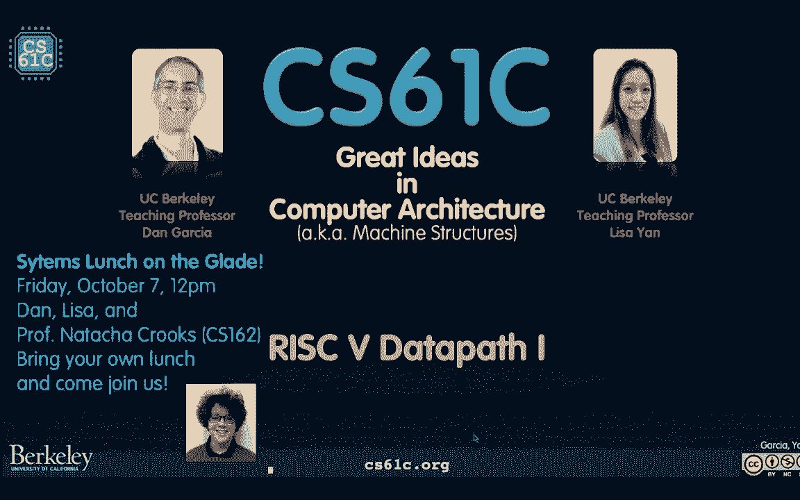

再来一次，我也很好，我的意思是，点击器不起作用，所以也许一些常规的事情，否，好啦，好啦，好啦，我知道为什么我知道我改变了什么，我改变了采访，这意味着什么都不起作用，好啦，又能用了，谢谢你，谢谢你。

我要把这个藏起来，上面的视频面板，好啦，所以今天我们要开始构建我们的CPU，你记得我告诉过你我们要造CPU吗？丹一直在说我们要做CPU，我们今天就要开始了，我们需要一点时间，事实证明。

你可以考虑一个CPU，我们没有这种软硬件水平，实际上把这些东西连接在一起就像面包板式的东西，所以这就是我们要做的。

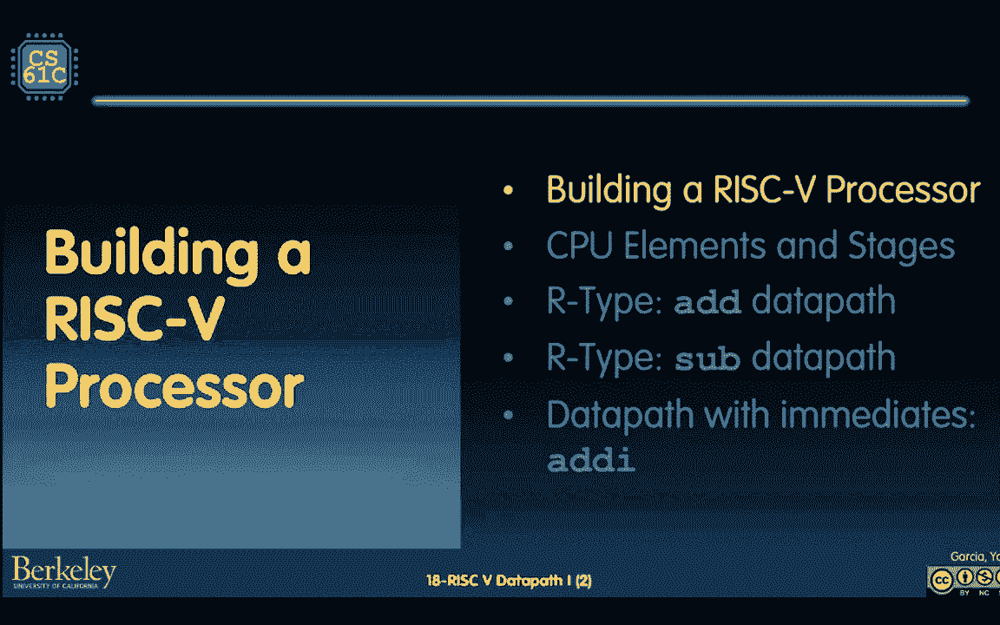

我将概述一下我的意思，所以当我们构建CPU时，中央处理器或处理器，我们实际上是在处理，抽象层，在ISA下面，所以低于这个风险，告诉我们所有指令最终都是位的五件事，所以你可以把我们。

因为我们从一只较低的乌龟开始，我们正努力向ISA前进，而在学期的早些时候，我们从最高的乌龟开始，然后我们要去ISA。

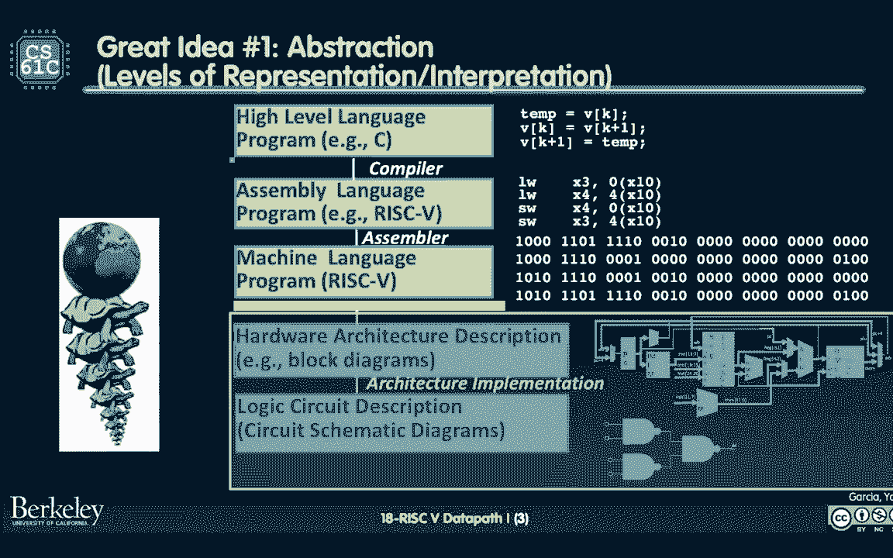

所以我们要在中间见面，这将是一段美好的时光，这是你到目前为止看到的关于旧学校机器结构的图表，如果你考虑到我们在61 C中所做的这个更大的框架，我们真的在不是的地方工作，我们将在这个较低的区域工作。

在过去的几节课里，我们已经讨论过电路设计和闸门，加法器，多路复用器，所有这些，现在我们要在这些街区上建造，我们实际上要用它们作为积木来建造什么。

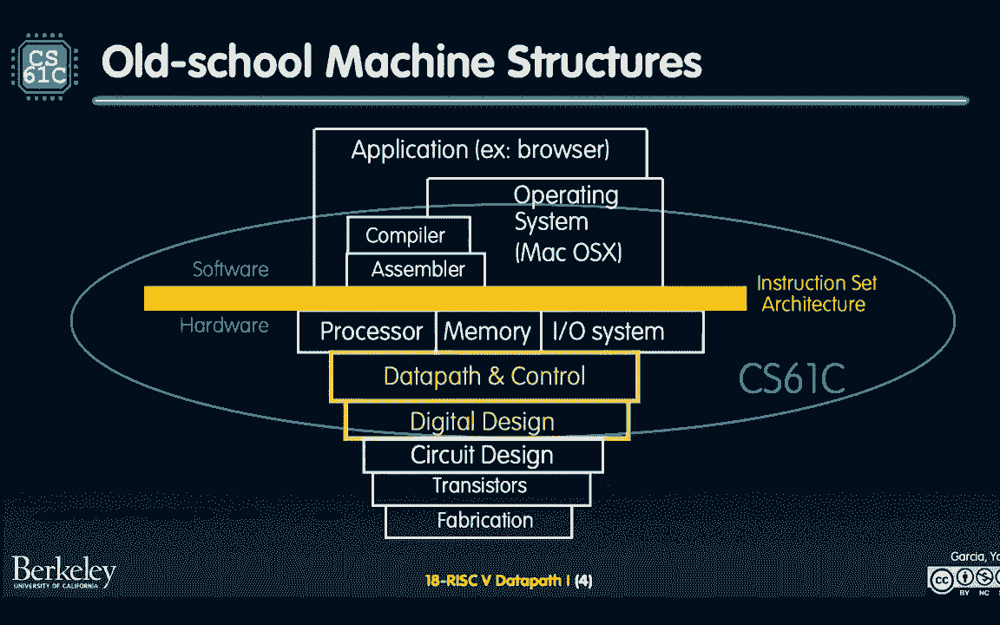

我们调用一个数据路径并设计一些控件。

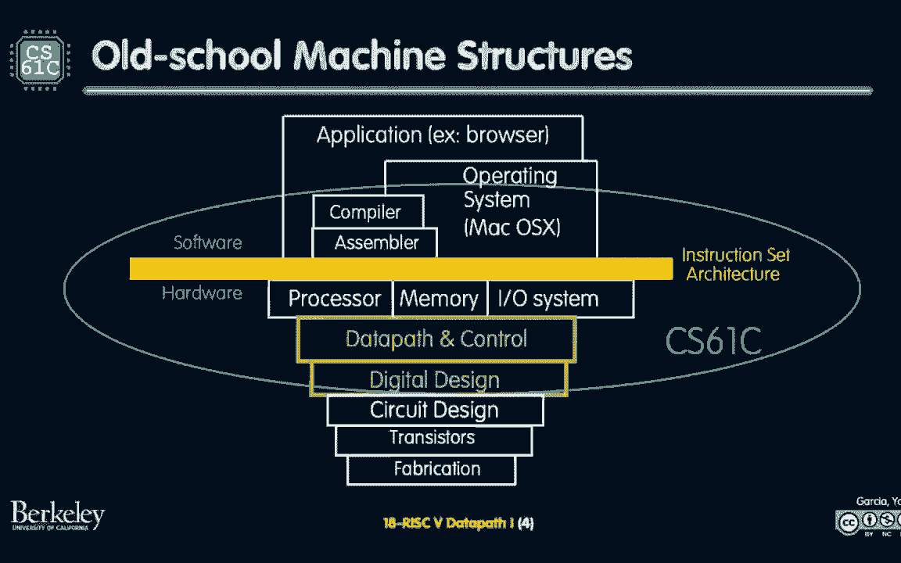

现在这是六十一的老派版本，所以让我们来谈谈新的学校版本的61 C，我们在第一节课也见过这个图表，但我只是想把它带回来，如果我们考虑61c，还有软件方面，就我们可以优化性能的所有事情而言。

然后在右边我们还有硬件尺寸，它也是为了性能而优化的，我们只是要在两个方向上优化它，我们现在考虑的是逻辑门来表示这些功能块，它最终将代表计算机上的核心处理器，在另一边，我们在考虑硬件描述。

所以从软件方面来说，我们认为，好啦，嗯，我们有这些方块，你知道它们都是定时的，它们都是连接在一起的，但我们会把它们看作是瞬间工作的，与一些时钟并行，我要谈谈这一点，然后我们星期一再谈。

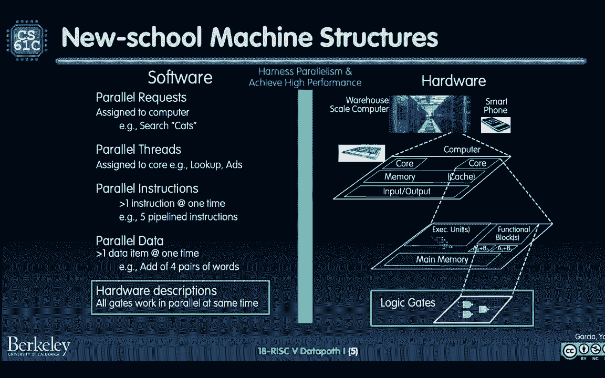

这是另一个图表，你又看到了，只是想唤起你的记忆，到目前为止，我们在这门课上看到的所有这些高级图表，试着把它和我们今天要做的事情联系起来，这就是我们所说的处理器，看小盒子显示，这就是我们所说的处理器。

这是我们大部分时间要集中的地方，现在我们刚刚把它画了一个方框图，在那里我们有一个控制，我们有一个数据路径单元，他们现在互相交谈，我是什么意思和对方好好谈谈，我们可以这样想，数据路径，所以底部的这个东西。

用电脑，与寄存器，用我们上次开始设计的alu，这是胸罩，这是处理器中实际包含执行操作的硬件的部分，然后控制，就是最上面的盒子，我们称之为大脑，所以这是处理器的一部分，也在硬件中。

但是告诉数据路径需要做什么，我会花很多时间来区分这些，在今天的过程中，因为事实证明对很多人来说，啊，所以数据路径就像不知道发生了什么，否，这里的想法是，如果你想想你的身体，我们要做很多类比。

如果你想到你的身体，你的肌肉，所以你的大脑，它们都很复杂，但从某种意义上说，它们不会改变，就像这些肌肉都会在我的手臂上，当我像这样挥动手臂的时候，我能这样挥舞手臂的原因是。

我告诉我的手臂做这个非常复杂的动作，好的，好的，所以数据路径可以做复杂的事情，但它需要有人告诉它该做什么复杂的事情，好的，好的，所以我们不会在这里重新布线，我们是说你的大脑或者你的麸皮，如果是这样的话。

然后现在大脑告诉你如何移动你的身体或移动你的数据路径。

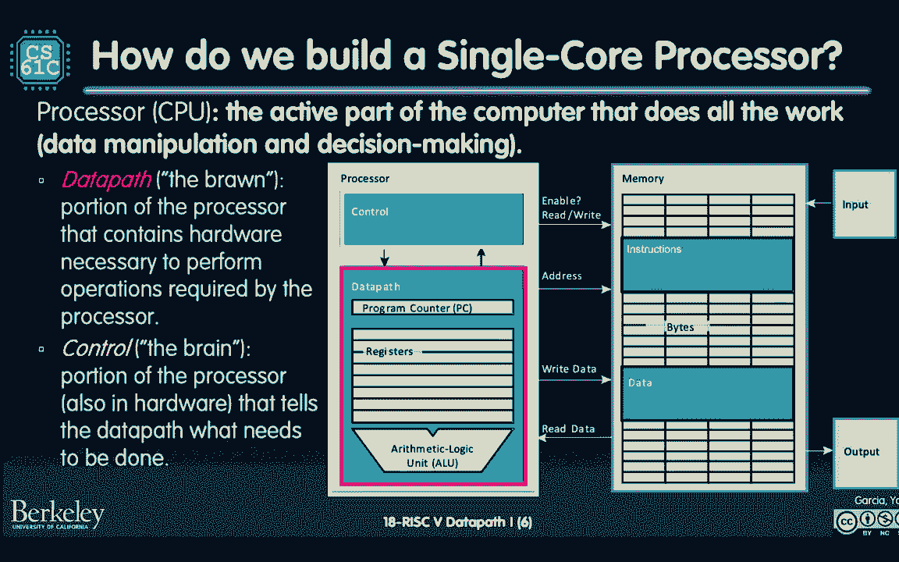

就是这个意思，再说一遍，我们的目标是什么，我们的目标是朝着ISO的方向前进，构建一个CPU，实际上可以执行我们的风险五ISA的所有指示，然后呢，我们将忽略其中一些你可能在实验室里见过的。

我们正在调用系统调用，我们将更多地关注，就像算术一样，树枝，跳跃，所有这些都在右边，如果你有兴趣，这是一个实际的风险五，在这里这个小盒子，那是中央处理器，现在呢，这就是碰巧是多核的。

我们将在这个类中讨论一个单核版本，稍后再讲一下多核设计，但这很酷，所以我们不会一直走到舞台上，我们实际上并不是在建造一个你可以很好地拿着的物理东西，我们要告诉你所有的逻辑，去设计一个这样的处理器，因此。

让我们开始一些回顾，如果我们谈论如何构建CPU，我们将使用我们和丹覆盖的所有块。

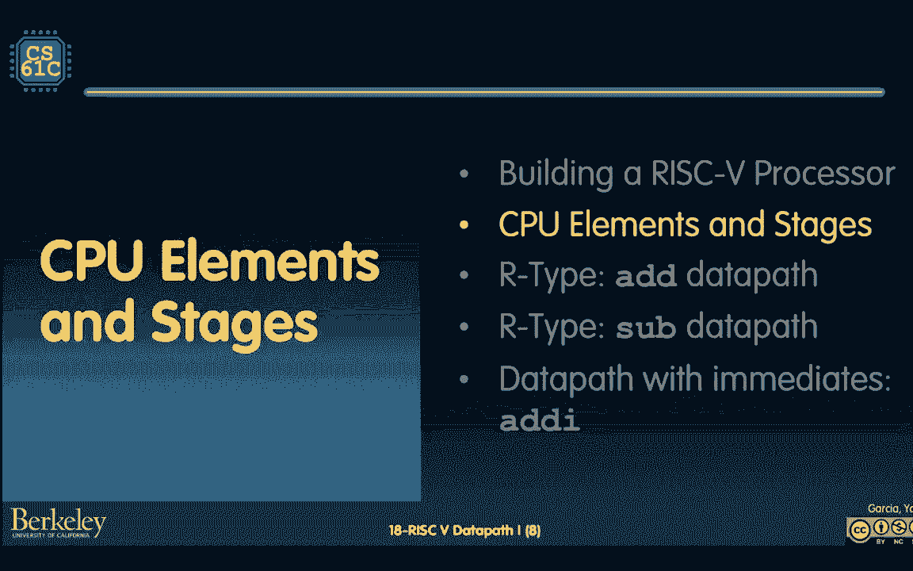

今天最后一次上课，不过，与其考虑实际的物理电线本身，接线到砂和矿石中，所有这些事情，我们将从框图的角度来考虑问题，我的意思是如果我们考虑多路复用，我们上次研究了多路复用器的布尔代数。

我们将把多路复用器看作一个块，我这么说是什么意思，我是说多路复用器，根据你们上次学到的，在两个输入a和b之间有一个选择器，它如何很好地选择这些输入，它有一种我称之为控制线的东西，哪里，让我们说。

如果位S是一，然后将选择A，如果s为零，然后选择B，我说的选定是什么意思，我是说，我将看到将承担一个价值，这个n位值a，如果s是1，然后c会得到b的值，如果s为零，好啦，所以你可以看到，是啊，是啊。

有三个输入，或者至少在这个，在本课程的这一部分中，我们将抽象这两个输入，A和b，它们是一种数据，然后是，下面是决定哪段数据进入下一步的控件，这里是另一个抽象，以及我们将如何思考它。

今天在课堂上我们有一个n位加法器，还记得丹上次展示了这种很棒的布线方式吗，带着东西，这样做，就像，带着这一点，然后加啊加啊加，最后是a和b的n位附加值，想象一下所有这些都被塞进了这个加法器里，好啦。

为什么这是一条蝮蛇，上面写着，加上它，它有两个输入，又是A和B，我已经把输入放在块上了，这让我们更容易，稍后我们将绘制我们的图表，但是我们把这两个值加在一起，A和B，我们得到这个大写的S。

也许有一些携带进来携带出去，但这里更重要的是，我们把两个n位值相加，这是我们上次开始讨论的最后一个图表，你要完成第三个项目，也在实验室里，这是算术逻辑单元或alu的概念。

上次我们讨论了如何实现加法和减法XOR，然后还要选择要输出的操作，现在我们要把它们都塞在同一个块上，所以这就是我们的阿卢，ALU和广告有什么区别，嗯，上面写着alu，事情会变得很清楚的。

为什么我以后要选择这个区别，但是现在注意它有这个选择器，现在呢，这次ALU行动，这就是为什么我要把它叫做，就像是在说，哦耶，实际上我想要一个XOR，今天或者我想要一个今天或者我想要一个广告。

所以这是要做什么，就是，它将取输入值a和b，然后你选择他们在一起，不管是什么，您选择加减XOR或向左移位，然后再次输出结果，有一种，这里有三个输入，但我们在考虑第三个输入，这个ALU作为选择器。

实际结果的控制器。

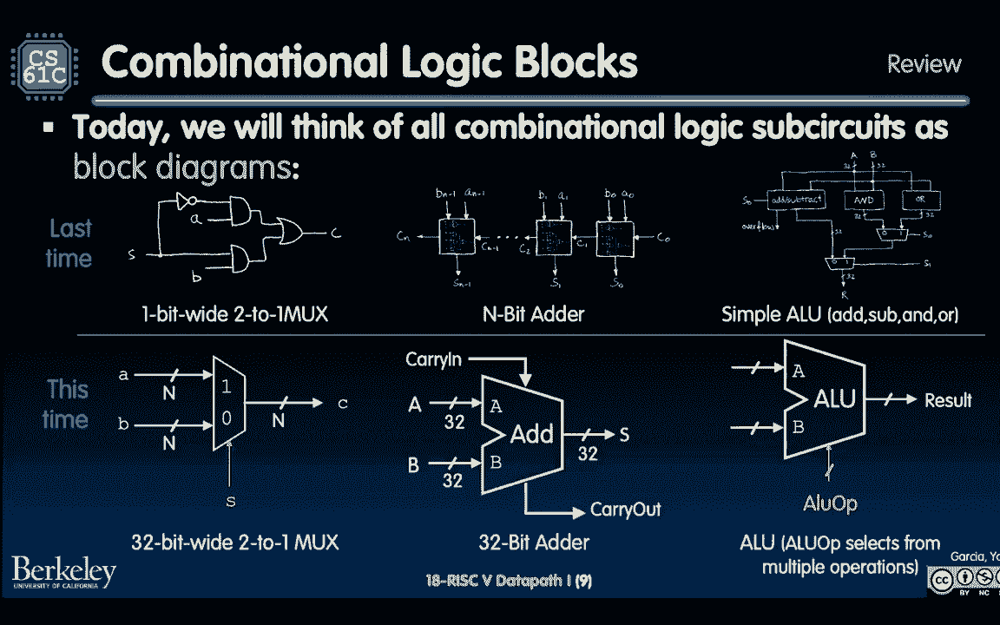

好啦，那么我们要怎么用这些碎片呢，到目前为止，您还学到了另一种类型的块，这是一个状态元素，所以我的意思是，通过这个，CPU将把所有这些组合逻辑块，我们在上一张幻灯片中看到的，它们是用组合逻辑门制造的。

和，或，x和所有这些，然后把它和状态元素结合起来，登记册，寄存器组，注册文件，还有记忆，在这门课上，我们会把它看作是一件神奇的事情，但我们有一个同步系统，所以在时钟的每一个滴答声中，我们将执行一条指令。

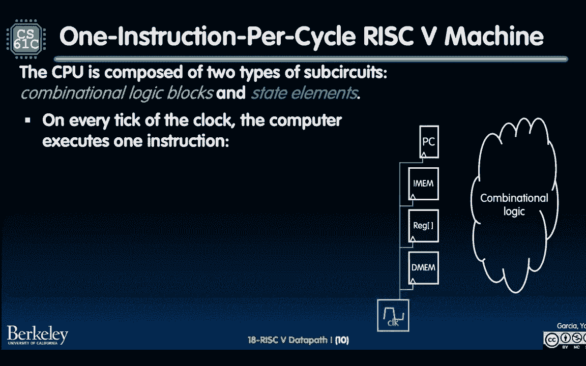

如何执行好。

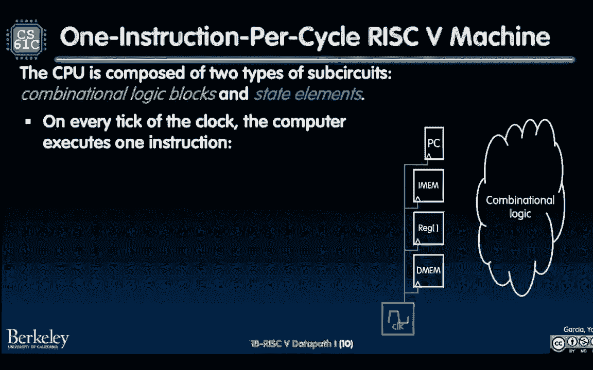

每个状态总是会输出一些东西，它要输出的东西将被输入到这个组合逻辑中，共同教育逻辑，这些明矾，这些缪斯只是要选择和处理输出，一旦完成，它会立即连接到所有的状态元素，就像我已经为你的更新做好了准备。

但收银机就像没有等待，等一下等一下，等到上升的时钟边缘，因为那是我更新的时候，我还在接线输出电流，我还没准备好听你的更新。

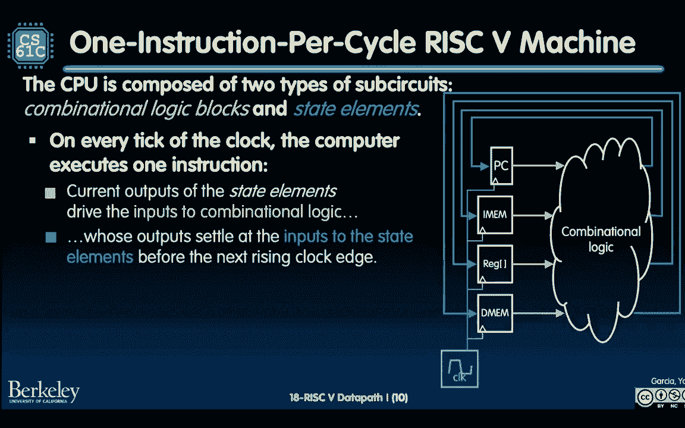

所以在上升的时钟边缘，会发生什么更新，好啦，所以现在同样的事情也会发生，所以就像更新了，好啦，现在我的输出仍在发生，但现在我要去拿一个新的输出，然后把它翻过来，组合逻辑就像，我准备好了，这是下一个输出。

或者这是下一个输入，然后这个州就会像，我还在等，然后下一个口袋就会发生，然后我们会有这个循环，原来如此，至少这是CPU要做的事情的想法，请注意，当我们想到CPU时，我们正在考虑更新，假设寄存器。

我们在考虑更新记忆，我们在考虑照着说明书念，如果你能在这里思考，我和DM，也许这代表指令存储器和数据存储器，我们一会儿也会讨论这个问题，事实上，事实上，我们现在就要开始了，所以回到处理器。

让我们来谈谈这三个状态元素，因为今天我们没有考虑这些状态元素是如何实现的，我们在更高的层次上考虑他们，这就是我们如何与这些块相互作用，我们表示为我们的状态元素，让我们再来谈谈这些，所以在CPU执行期间。

每一条指令。

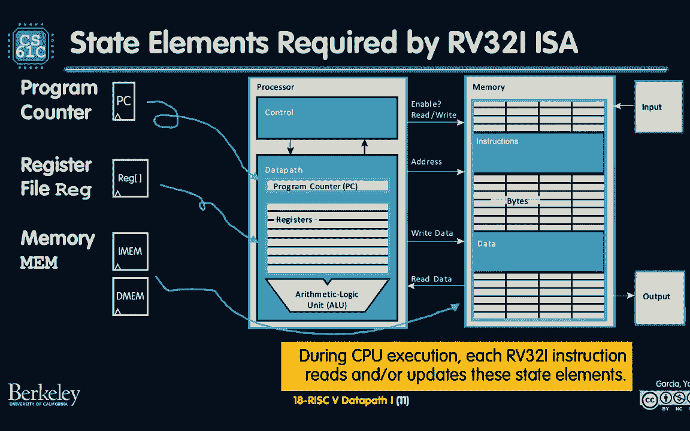

当你经历一个时钟周期，将确实更新这些状态中的每一个，让我们从第一个开始，第一个是我们的程序计数器，我们可以把它看作是一个3位2位寄存器，如果我们在三二，三个两位字节可寻址空间。

这就是我们今天如何表示寄存器，记得在引擎盖下，它实际上就像晶体管一样实现，所有这些事情，我们只是想在更高的一层，我们说有一个n比特的数据，在这种情况下，我们假设三、二，然后是n位的数据。

上面有一个右使能，让我们看看我是否点击到下一张幻灯片，是啊，是啊，上面有一个右使能，然后还有一个时钟信号从底部传来，现在这些电线可以有各种不同的顺序，但要知道，如果错误进入块，那是输入，箭要出方块了。

如果没有箭头，那就是输出，可能是输入，所以就像我故意没有在这里放箭一样，这样你就可以看到这些实际上是输入，除非箭现在朝外，登记簿是如何工作的，如果正确，则启用从图中顶部传入时钟的信号，如果那是一个。

当时钟边缘上升的时候，数据输出将以比特为单位获取数据，并现在输出这些数据，这里重要的是在其他情况下，输出的数据将输出它当前所知道的，这意味着这个寄存器总是输出一些东西，总是总是总是。

只有当时钟边缘上升时，它才会改变输出，右使能者是其中之一，只是想让你知道，所以说，当写启用为零时，它只是输出一个当前的东西，当写启用为1时，但这不是上升的包裹，它也会输出它当前的东西。

当我们看到第二个数据路径是如何工作的时，这将变得非常重要。

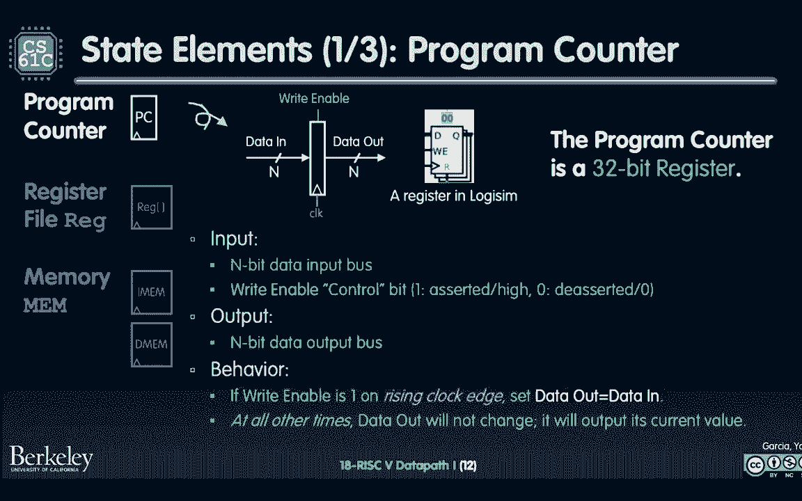

我们拥有的其他一些元素，我们有一个注册文件，所以在引擎盖下，我们知道什么，它可能是由寄存器组成的，嗯，我们想在上面一层，我们要说的是它是一个三二寄存器文件，至少风险五是这样的，在我们的风险五，三，二。

i，isa，它将有以下输入，注意现在有更多的输入，但让我来谈谈他们，有一个三两位输入数据总线数据W，有三辆精选巴士，卢比1卢比2卢比和卢比，我为什么叫它公共汽车，它由多个比特组成。

所以可能会有一些电线进来，你可以把公共汽车想象成一个东西的集合，就像，画成一根小电线，有一点闪光穿过它，然后有这么多的部分进入，这里有两个输出，数据一和数据二，他们都是三个二位。

然后是我们所说的控制信号，雷文，这将代表注册权启用，还有一个时钟信号，那么它是如何工作的呢？它以你所期望的方式工作，但我用了不同的我们喜欢的变量名，如果我们想六十一或六十一，B，我用了不同的变量名。

所以我们可以区分硬件的功能和我们认为的，关于风险五PSA水平，所以为了读取寄存器r s 1的值，我们会说，这是一个，这是索引，或者那是我们三个两个寄存器的寄存器号，然后我们将请求注册文件。

请得到这个特定的数据，这个特殊的三个二位数字，我们要为我们两个做同样的事情，它将是一个注册号，对于第二个寄存器数据红色，最后，这里的第三件事是寄存器号rd的寄存器值，现在记住什么是RD。

那是目的地登记号，那么这里到底发生了什么。

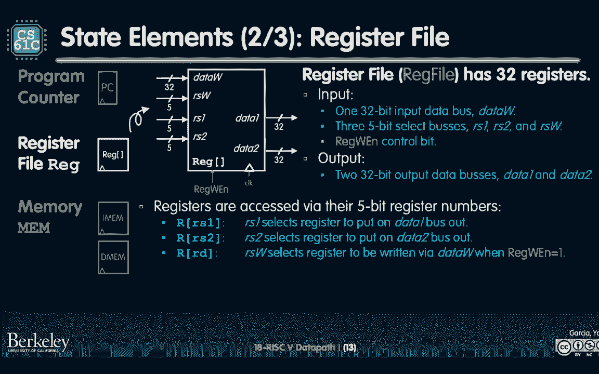

是不是最上面的两根线，如果我有一点轻的东西，今天行得通吗，啊耶，我们做到了，所以上面这两根线，三二五，这两个都是我们要写入以注册rd的数据，还有数字RD，我称之为RSW，W代表这里。

我们什么时候写类似于我们在上一页上看到的寄存器版本，也就是说，当注册权，使能是一，时钟信号是上升的时钟边缘，那是我们写入寄存器文件的时候，让我总结一下，REG文件的时钟行为。

正确的操作发生在上升的时钟边缘，其他时候，它只是一个组合逻辑块，至少我们是这么想的，好的，好的，所以这意味着，除了写以外的任何其他时间，所有读操作都允许是一个，上升的口袋发生了。

我们正在读取1号和2号寄存器，然后输出，好啦，所以我们总是读这个东西，然后它就发生了，当上升的时钟边缘和正确的使能，我们用这个3位2位值更新这个特定的单寄存器，再来一次。

所以这些同步状态元素只有在时钟上升时才有更新，上升，时钟边缘和右边，启用控制位为1的任何东西，其他时候只是作为阅读，现在凭记忆也是一样，就像我说的，在这个过程中，我们不会真正谈论记忆。

我只是要在这个框图的层面上讨论它，所以有了内存，我们有两个输入和一个输出，然后我们有一个小的控制部分，内存RW，我们还有一个钟，当我们读取此输入值a d r时，按以下方式访问，这个地址将选择单词。

在数据上发布的三个二位字，读取数据r，当我们写得好的时候，内存RW必须设置为一个上升的时钟边缘发生，然后地址addr现在实际上是我们要写的地址，我们写什么数据，我们接收输入数据w并把它放在。

或者把它放进存储在d d的单词中，是呀，请注意，现在地址实际上既是读取地址，也是正确地址，但是根据你在图中的位置有这种区别，时钟输入只是右边的一个因子，如果mrw是一个正确的发生在上升的时钟边缘，否则。

在任何其他时间，它大致充当组合逻辑块，我们还有一点时间，有一点延迟，我们将在星期一进一步讨论这个问题。

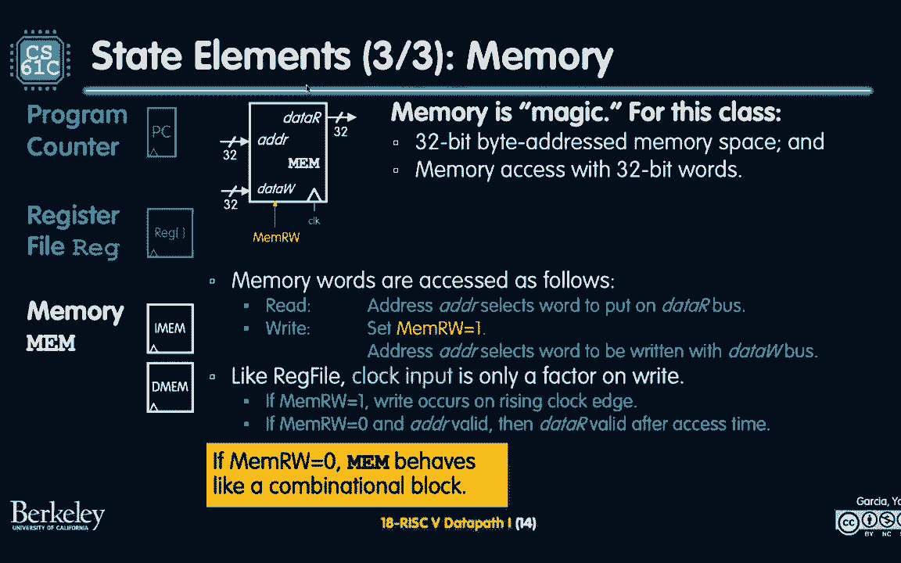

好时光，他有很多东西，或者就像你知道的那样，现在我们真的在一个稍微高一点的层次上思考事情，现在我们要回到IMM和DM，你看到的就像，总是在左边，你就像，为什么会有两个记忆，我们要谈谈。

然后我们再来讨论这个问题，三周时间或四周时间或五周时间，这里的记忆，我们知道在风险5中，当我们想到当我们用C语言编程时，我们把它看作是连续地址空间，但是，事实证明，这实际上更容易一点，我们要画的图。

还有我们为我们建造的处理器，因为两个块共享相同的地址空间，但两条通道，其中之一是IMM代表指令存储器，其中之一是DM代表数据存储器，IMM和DM的区别，IMM只读，它也有我们所有的指示，他们读书写字。

因为我们可以读写数据，但是我们将假设这里的imm块是只读的，好啦，现在呢，引擎盖下，这些都是缓存的占位符，我们将在几周后讨论，现在这里有一个纸条，你可能想知道，只读和然后读的区别，写。

下面是它将如何工作，我们今天要讲的一些图表，因为imm是只读的，还记得我之前说的吗，比如只读操作实际上是作为一个组合逻辑块运行的，所以我在这里，我们只是想说，如果地址是一个有效的指令地址。

它只是在访问时间之后输出特定的指令数据，好的，好的，所以我们将在，我们将在图表上看到这一点。

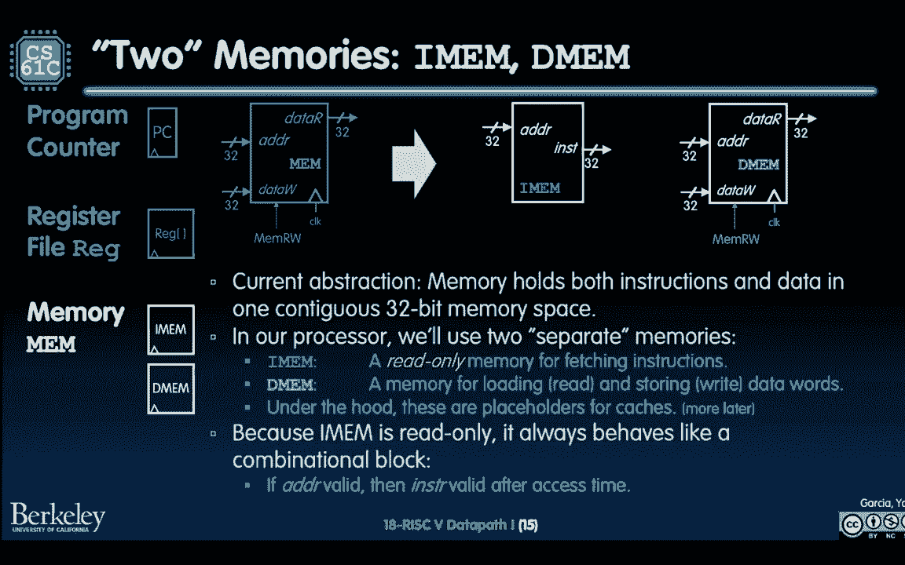

这就是为什么在这种情况下，如果我们看一下这里的图表，我身上没有钟，因为时钟只需要在上升的时钟边缘写入内存。

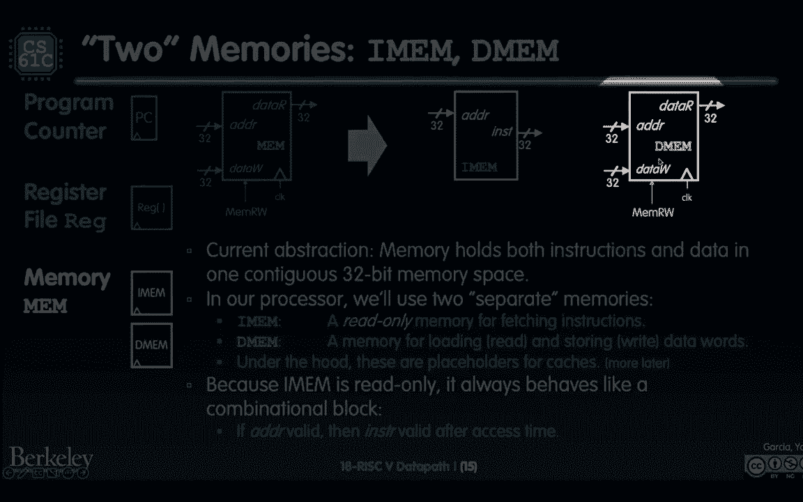

如果你要在图表中看到这个，我现在只想指出来，这就是为什么这里没有钟，好啦，所以你没事，现在呢，我经历了六种不同事物的定义，组合逻辑块状态，所有这些事情，我们怎么把这些放在一起。

我们只是要制造一个巨大的欺凌桌，然后就像去火腿一样，只要把这些电线放在一起。

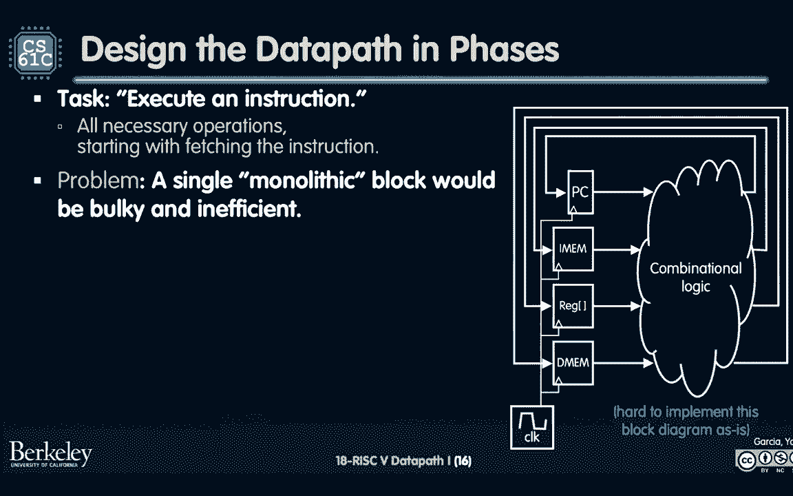

结果很难，这种铁板一块的想法，效率很低，会很笨重的，而且你实际上会遇到很多虫子，所以解决办法是什么，我们要把这个过程分成几个阶段，概念阶段，然后我们就知道了，下周我们将看到他们将是身体阶段。

但接下来我们会有这些概念阶段，我们将把它们连接在一起，执行我们风险的所有指示，五处理器，为什么这很好，嗯，一个较小的阶段更容易设计，更容易调试，您可以单独考虑增加程序计数器，而不是阅读指令，并处理指令。

第二个又是模块化，你可以把它们分开，您可以真正优化程序计数器逻辑，不用担心指导的东西，反之亦然，我们去看看，这是我第一次看清，这里没有电线，但这是我们指令执行阶段的想法，我一直含糊地称之为指令执行。

但让我们考虑一下，让我们考虑一下指令，也许加载字，例如，其实呢，是啊，是啊，我们下周再谈加载词，但让我们考虑一下负载，加载字，嗯，需要阅读说明，比如说明是什么，我不知道。

所以它将首先通过读取程序计数器值来获取指令，哪个是当前指令地址，然后访问指令存储器，一旦你读了那东西，你就像，好啦，三个二位，什么事？然后你就解码了，解码解码，你就像，哎呦，这是一个加载词。

主的话语有什么好处，我需要读一些寄存器值以便弄清楚，我还需要做一些即时计数，但需要找出在内存中访问哪个地址，它如何确定访问哪个地址，就像记忆中的许多人一样，它在alu上执行广告操作，最后。

一旦它有了内存中的地址，它读取一些内存，它不能访问内存，当它在内存中有这个值时，现在它写回来了，在这里画这个疯狂的箭头，现在它把它写回目标寄存器，有点像思考负载板，现在一点点，注意左边还有一个小圆圈。

这是给程序计数器的，因为每次你执行一条指令，您将更新您的程序计数器到下一个要执行的指令，那里也有一个小循环，请注意，在这张图中确实有反馈，这就是我们有一个，注意这个演讲是如何工作的，福克斯说好吧，PC。

请更新到下一个指令，PC更新指令，巴姆，然后所有喜欢的权利，你知道的，将单词加载到寄存器中，然后在最后更新PC，然后时钟结构执行，或者上升的时钟再次执行，然后它继续前进，你可以看到，有一个循环。

但它总是在等待它的更新，以获得不断上升的时钟边缘，这就是所谓的单周期处理器，因为我们说所有这些更新都发生在同一个时钟周期内。

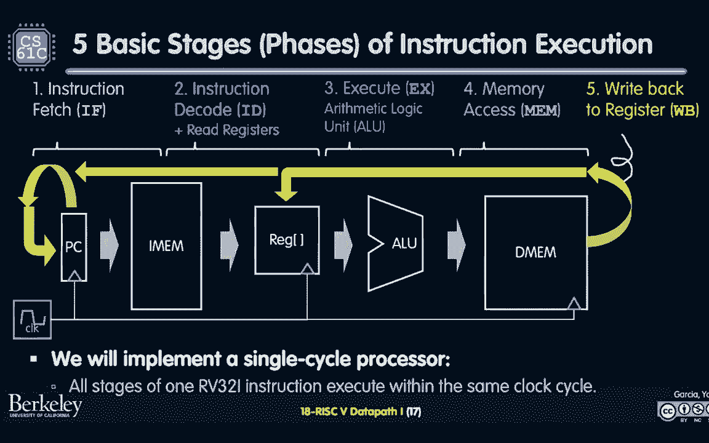

因为我们都被同一个人盯上了，然后这里还有一块，哪一个是控制，我怎么知道是加载词，暗地里有这种控制逻辑，这告诉我，发出所有这些信号，就像Moxes和写作，所有这些都是为了系统，它朝向数据路径本身。

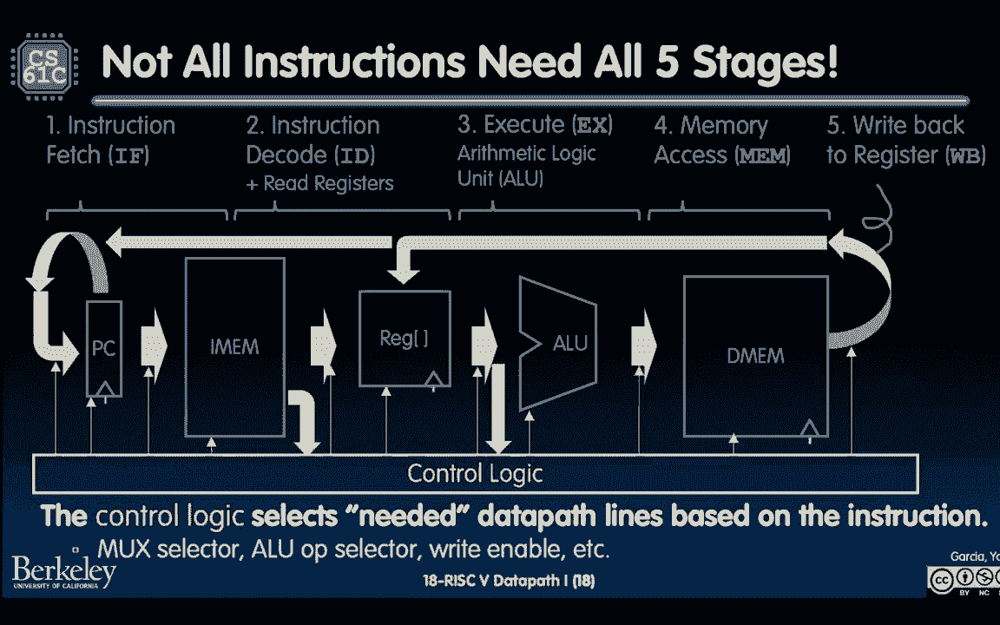

这就是我们可以想到这些阶段的一般想法，我们会谈谈，今天我们要举三个例子，下次我们将讨论分支和所有这些，但现在让我们把注意力集中在算术上，因为这是个很难的概念，很难理解，一旦你看到它。

你打算在项目和实验室做什么，你要把所有东西都连接在一起，所以这里的想法是，如果你有你的讲义，你知道怎么接线，你可以把这些点连接起来。

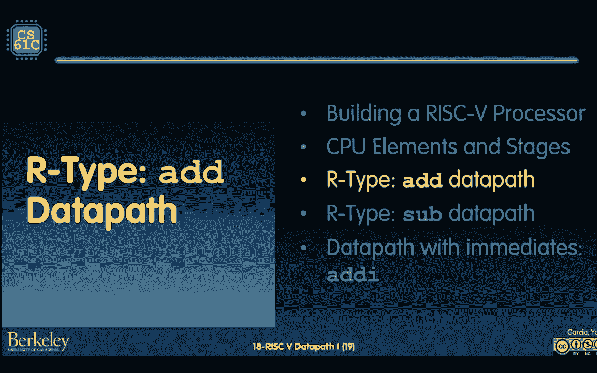

我们今天要做一点点对点的连接，所以我有点明白我在说什么，让我们先谈谈，当我们要建造我们的处理器时，我将从一条指令开始，假设我的isa只有一条指令，它是广告注册的，我这么说是什么意思。

我的意思是指令一加上x18到x10，然后即使在x18指令2中把x18加到x18，然后把它存储在x18指令3中，加上废话废话，所以只有一条广告指令，它让我们看到在更多的过程中发生了什么，这是我们的指示。

好啦，所以这是指令格式，还记得我们上次看过的所有机器代码格式，我们有个广告，为什么我们知道这是个广告，它是一种R R类型或我们的代码格式，然后我们这里有两个字段，三号基金和七号基金。

它们都是加放克3号和放克7号，然后我们有这三个寄存器，始终位于这些位的寄存器号，寄存器目的地位于第7位到第11位寄存器源1，读数寄存器在15到19，从20岁到24岁，我们一会儿就会看到为什么这很有用。

但是让我们想想现在更新的状态是什么，更新的状态，记住我们正在考虑的，好啦，我们有个人电脑，我们有注册文件，我们这里有记忆，两件事更新了，其中之一就是红色档案，目标寄存器被更新，没有其他内容。

其中之一就是电脑，PC机更新到下一条指令，或者我们加四个。

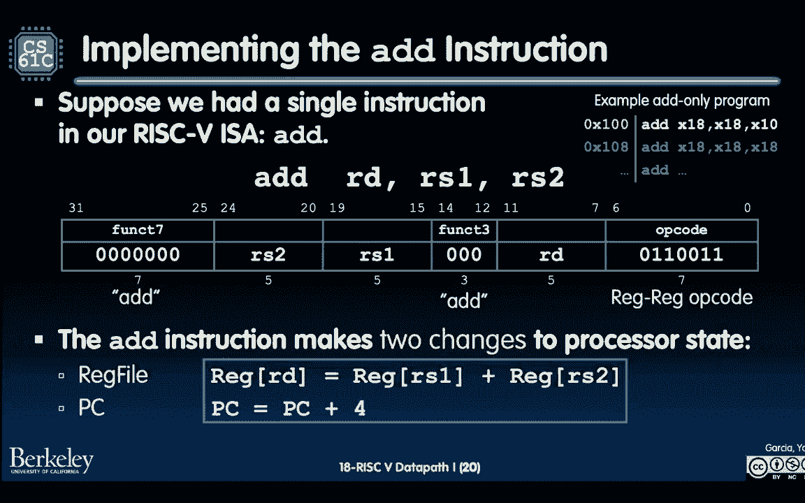

让我们来看看这个，这是以前的图表，但我加入了幻想，花哨的文字，我们要看看为什么，因为我要把它们连接在一起，然后我的记忆也变灰了，所以连滑梯上都没有，因为从上一页来看。

我们看到数据存储器实际上并没有被访问，所以我们要，我们只是要去断线现在，让我们的生活轻松一点，我们将根据我们的阶段或阶段布局看到这两个更新，PC等于PC加4。

目标寄存器等于源寄存器1和源寄存器2的值相加，我们会看到他们会，在这两个方面，所以PC将在左边，然后RS，寄存器更新将在右边。

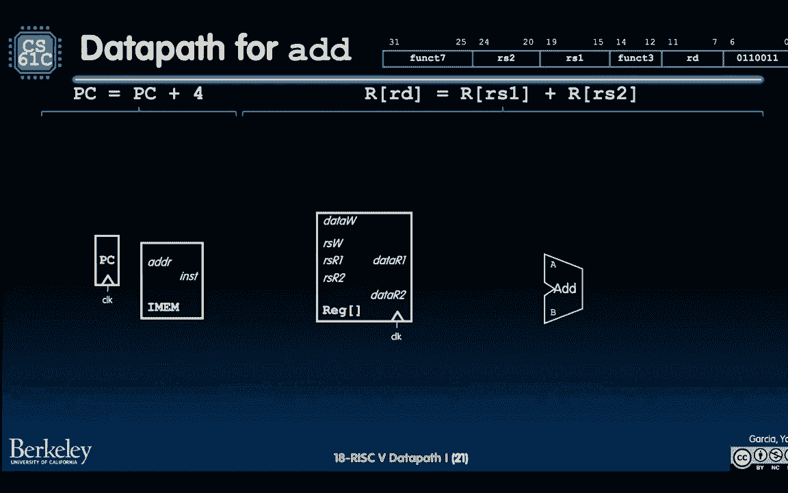

让我们检查一下电线，我们会有这些电线在这里和这些电线在这里。

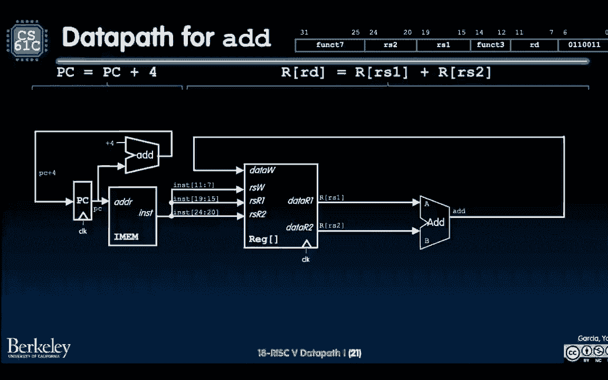

你就像，喔喔，那是从哪里来的，让我们说说慢一点，第一个循环，我们在上一张幻灯片上看到了一点，但现在我们实际上看到了，电线将增加PC到下一条指令，它还会输出PC值，记住PC值是指令的地址。

它将把这个输出到指令内存块中，但它在这里也有一个小循环，那个小循环是什么，它是把PC加在一起变成四个，直接形式的这个常数，你就像，丽莎，我能做什么，不是还有其他的指示吗？否。

记得我告诉过你这个处理器里只有一条指令吗？所以对于广告来说，这是一个广告管道，这里是一个广告数据路径，所以在PC中，我们确实有这个圈子，这将允许我们的PC输入边缘是当前PC加4，然后在时钟边缘。

它将更新为PC加4，现在所有其他的东西都注册了，以及如何更新寄存器，这里会有三个阶段，与，你看到的三组箭头，第一个是一次，2。你已经把这三段话按说明书读出来了，你怎么解码它们，我们将解码如下。

这就是所谓的分裂器，如果你没看过，嗯，我是说我们在以前的幻灯片上看到过，但我只是明确地告诉你，这是一个分裂器，所以这里的输入线。

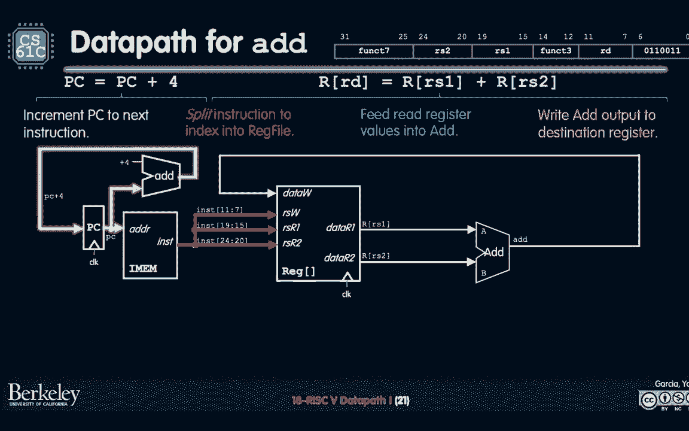

让我们来一点，是呀，是呀，好啦，所以这里的这个小输入线，这是三个二位。

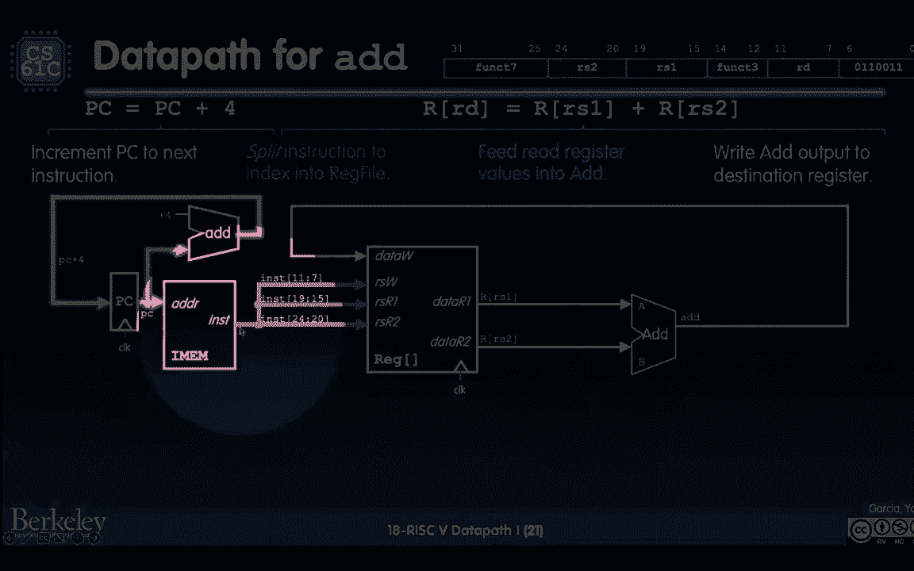

然后它分叉，我把它们标为7到11条指令线。

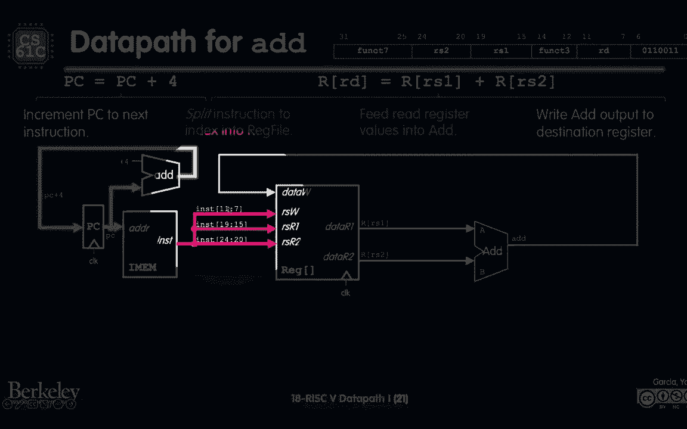

那是目的地寄存器号码，把15到19根金属丝，读一个那是一个，然后将2-4-2-3-2-4导线连接到rsr-2输入端，这是我们的RS 2号，然后寄存器文件就会变魔术，得到寄存器源值1和寄存器源值2。

把它们输出到这些蓝色箭头上，这三个二位总线，然后阿卢执行死刑，但在这里我们没有ALU，因为我们在处理这个案子，在这里我们有一个只是添加，所以我就把它画成了广告，这是一个广告块，我们马上就把它变回alu。

然后ALU执行什么，因为它只是把它们加在一起，给你这个输出，哪一个是这两个的附加版本，然后写发生在右边，输出呃得到加法器的输出，然后把它连接到数据W上，然后在下一个上升的poage上，会发生什么，好吧。

寄存器文件确实要用数据W更新rsw，因为那是当时的输入，和正确的时钟边缘与写使能，然后PC也会更新到下一个值，因为它在那个街区等着，现在这里有一点你就像，对呀，启用，你没说过，是啊，是啊。

所以我要在这里谈一下，我要把你见过的那些橙色箭头，上一次滑入此区域，称为受控逻辑，这将如何运作，嗯，我们将看到指令是如何输出的，并使用这些值。

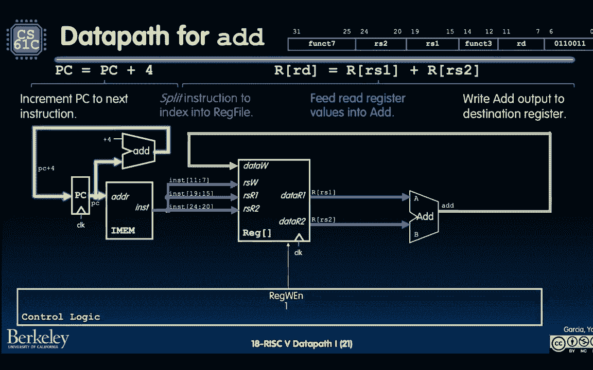

但我还是要把记忆放在一边，现在我们下次再谈记忆，否则事情就会变得复杂，当我们再次面对，一张非常复杂的图表，我想让你习惯，然后下次我们要练习，在这个记忆项目上再多一点，所以你可能想知道，为什么控制。

它分离了。

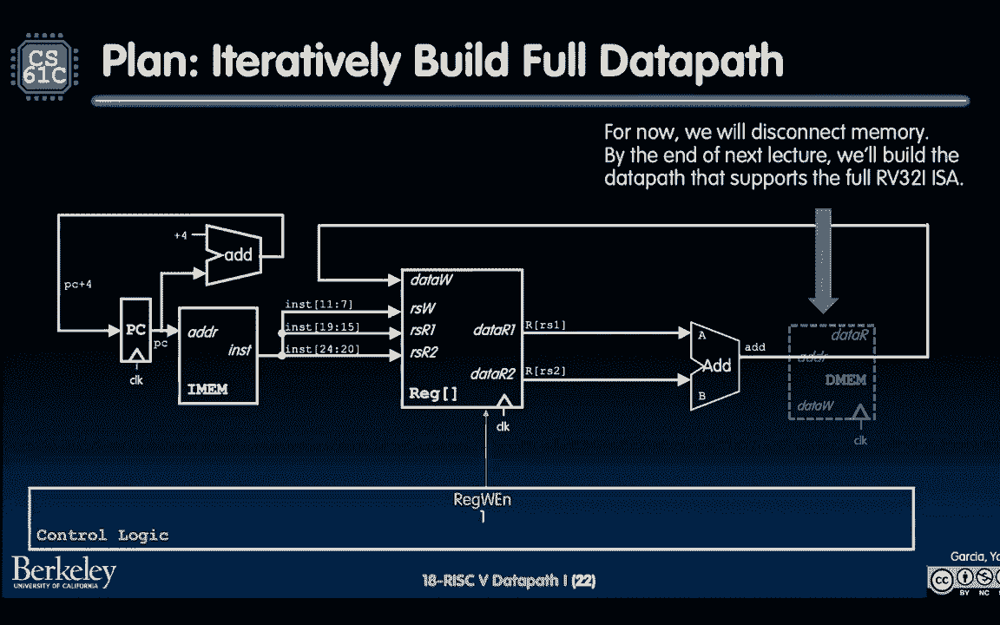

感觉很孤独，我们能把它插在这里吗，我要告诉你为什么子数据路径。

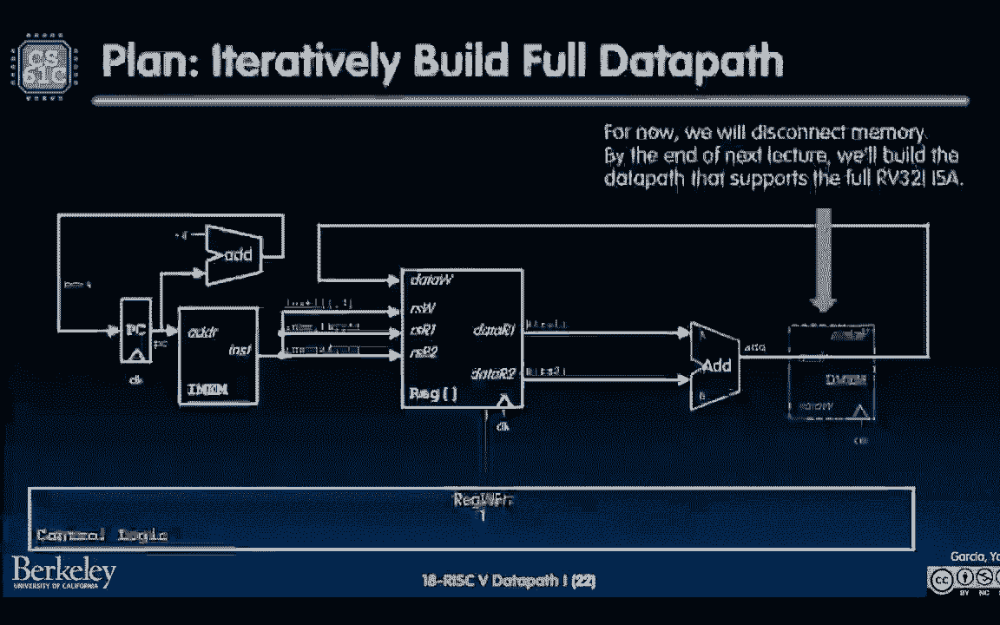

子数据，所以现在我们有了我们的我说。

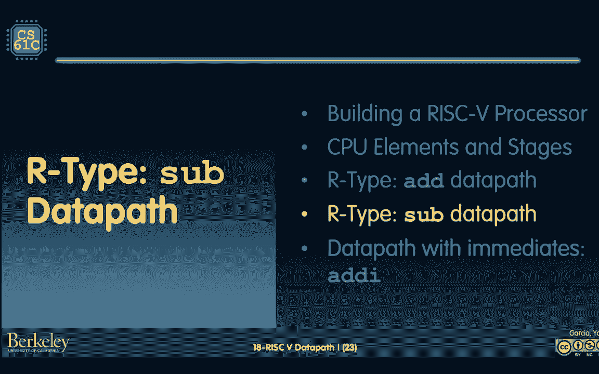

我们就像恭喜，其实呢，让我们回到上一张幻灯片，我们在这里做了一件很棒的事，恭喜你，我们制造了我们的第一个处理器，是呀，它只做加法，但我们制造了我们的处理器，是呀，是呀，是呀，是呀，是啊，是啊。

我们要做到这一点，下次我们建造整个处理器时，我们要做一个更大的庆祝活动，但每次都是一小步一小步。

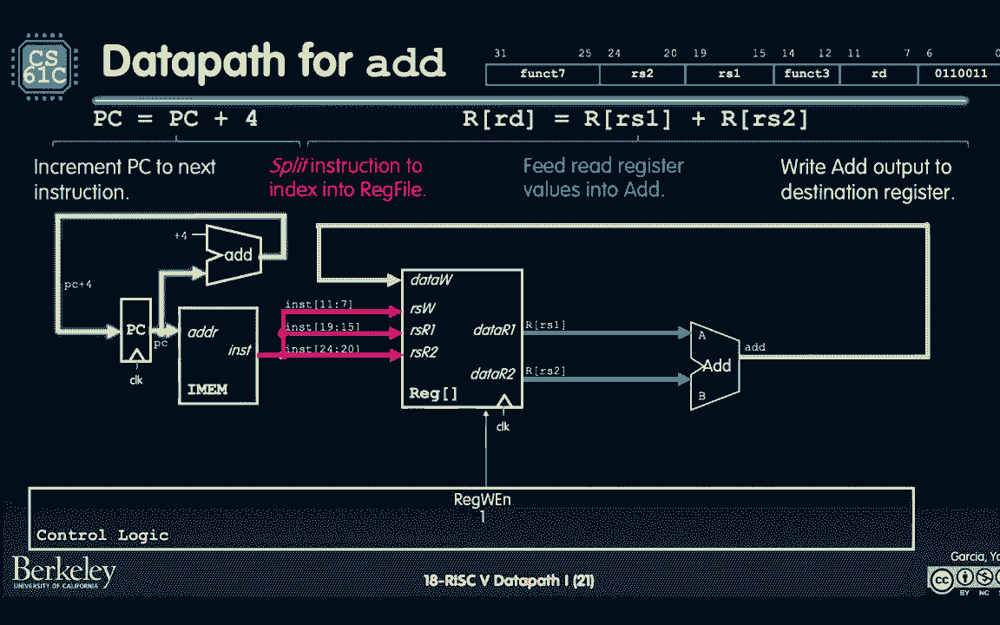

所以让我们构建我们的第二个处理器，现在是add和sub，这两个值之间的区别是什么，你看在房车里的这两个说明之间，三，二，我会说很好，只有一个很大的区别，有趣的权利，记得有一种像，它用了同样的芬克三场。

但放克七场是在我们指令的第三十位，如果有零或一，这表示加法或减法，现在你的大脑在动，你在往回想，然后减去它就结束了，你就像，啊，我知道怎么接线，我们在这里做一个方框图，我们不是在处理实际的电路。

就目前而言，大门本身，但是请注意相同类型的寄存器状态更新，但现在我们用减法代替，所以我们还是更新电脑，我们仍然更新Reg文件，但是reg文件输出现在略有不同，或者对不起，红色风格，目标数据略有不同。

这里的另一个音符，这个指令位三十，我将使用这种表示法，它将在加法和减法之间进行选择，现在你的大脑又开始放电了，你就像精选，选择这些来经常使用这个词，当思考控制逻辑时，这是正确的，它将被纳入控制逻辑。

我们马上就会知道。

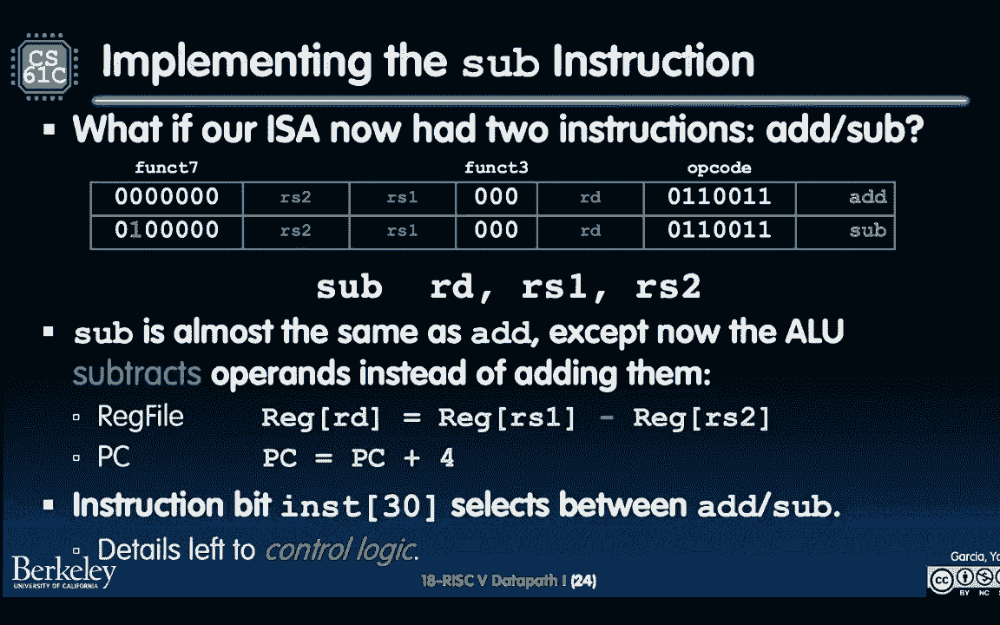

让我们回到我们的数据路径，我们的数据路径看起来非常类似于添加，好啦，以前的广告数据路径，但是，我现在已经改变了这个广告块，把两个寄存器值加在一起，我现在把这个变成一个alu，好的又来了，我不担心细节。

我只是说这是一个alu，当然它有加法和减法，好啦，所以又是，有点像你，你考虑抽象，我们说的是ALU是什么，我只是希望，它知道怎么做加减法，我想设计的是这个ALU是如何连接到这个整个系统中的。

那么我们该如何控制这一点呢，我们要说的减法，我们减去陆，这里的惯例通常是减法是一，我们将在第三项目中更多地看到这些，但现在你就像，好啦，嗯，如果我们让我们想想，让我们再后退一步，让我们看看这里的图表。

这些值就像是常数，是的，否则他们总是像硬连接到这里的高压，有点像，哎呦，我们总是要重写，启用，你就像，那可能没问题，我们只是在做算术，这里的算术说明，加减法，但是我们的选择，它也总是硬连线到潜艇。

广告呢，我们想方便广告，我们怎样才能告诉一个控制逻辑，做好什么，我们只需输入指令的三个两个位，到这个神奇的控制逻辑块，好啦，所以这个巨大的正方形，这实际上是另一个逻辑块，我不会告诉你它是怎么工作的。

丹会再多说一点，星期一，但这里的想法是它有一个单一的输入，指令的三个二位，然后它有各种输出到其他块来告诉它，如何选择和控制，所有这些，所以在这种情况下会发生什么，指令要进来了，控制逻辑将处理，它。

注意在指令的第30位中有一个，然后是什么把子一号喂到铝上，如果它看到指令，看到35指令中有一个零，它将在ALU选择中馈电，问题，你有什么问题，这是很难的东西，是呀，并提出这个问题。

为什么我们要把这三个二位都传递到控制逻辑中，我们只有一个好问题，因为我复制了这个图表，以后我会用它来做不同类型的指令，但你说得很对，所以这里的问题是，好啦，如果我们优化这个，它只是加减法。

我们怎么才能在指令位30，你说得很对，但在这种情况下，我输入了三个二位的指令，这样你就可以想象，一旦我们处理树枝和跳跃，所有这些事情，看看其他部分会很有用，除了第30个索引位，是啊，是啊，好问题。

好问题，这里的其他问题。

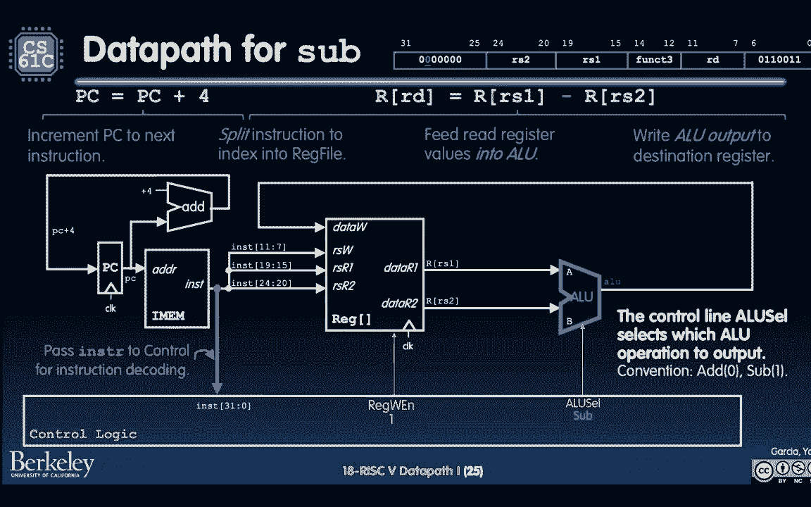

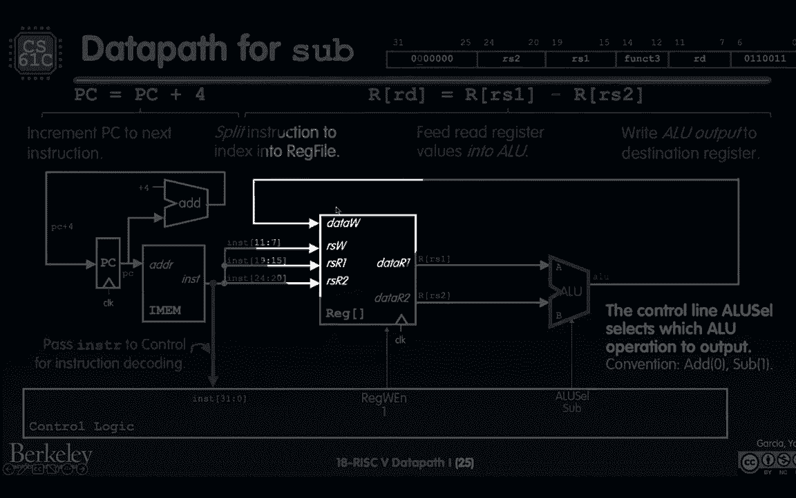

哎呦，奇妙的问题，问题是嘿，我们有这样的饲料。

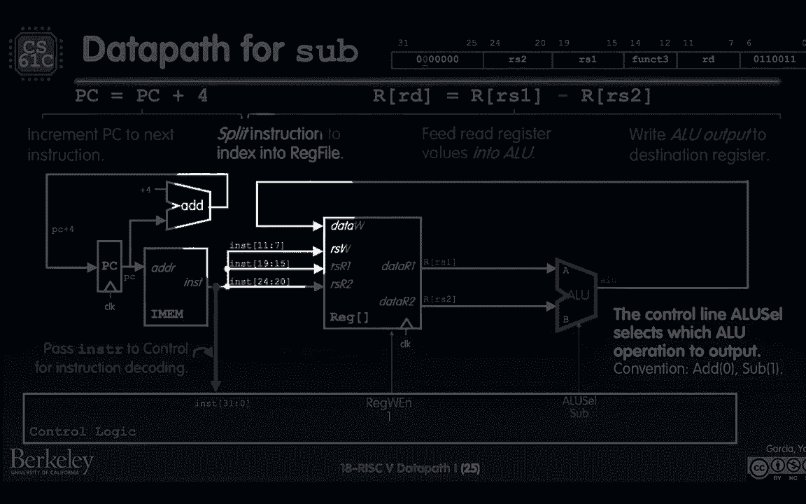

但是我们的数据路径中有这个循环，对呀，怎么会，rsw不会更改为下一条指令，比如什么时候，这是怎么回事，这是个好问题，所以在这种特殊情况下，记住正确的工作原理是在上升的时钟边缘。

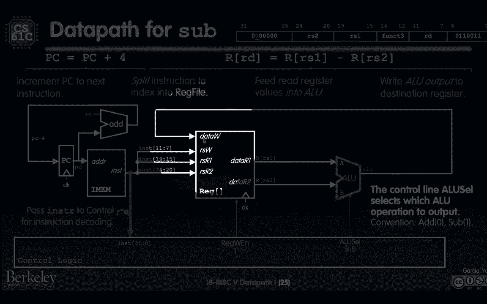

输入中当前的内容，会发生的，我是说马上就会有，你知道的，一点点实际，就像时钟到Q和所有的东西，但要发生的是，因为它是以这种格式连接的，在PC机进入指令存储器之前，然后在时钟边缘上升时输出下一条指令。

三线寄存器号码。

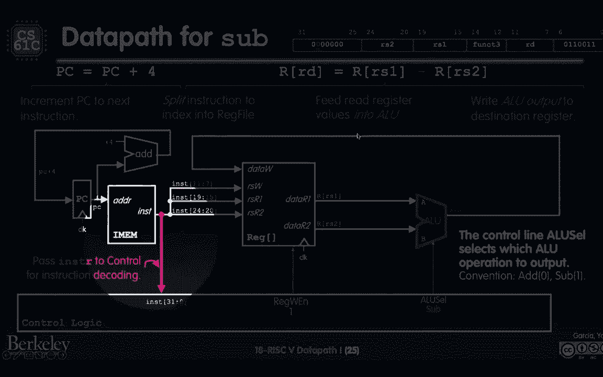

尤其是，带寄存器的电线，这里的收银机。

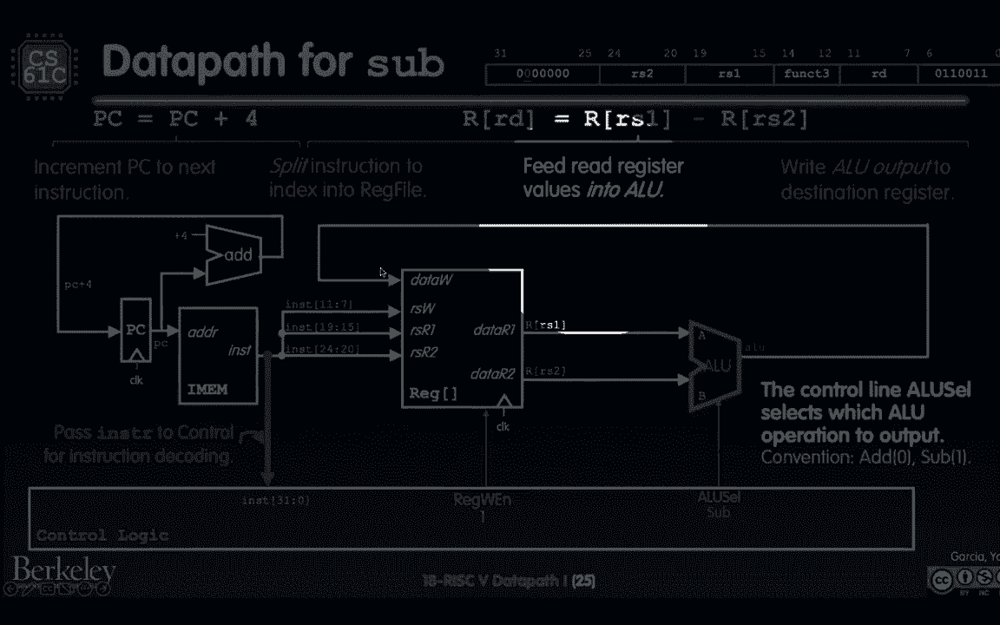

尤其是，这个号码仍然是，前面的指令，这有点令人困惑。

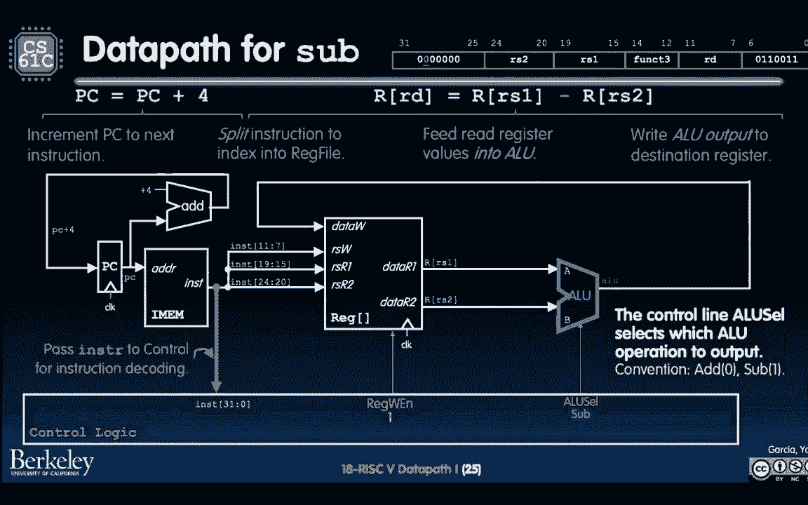

你说得很对，所以谢谢你问这个问题，所以再一次，在下一个指令之前这里发生了什么。

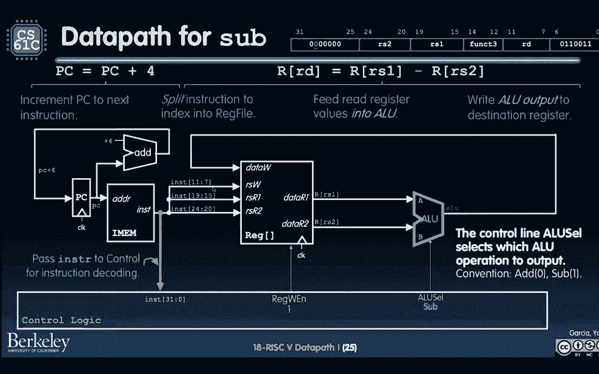

rsw仍然是上一条指令的目标寄存器。

在这一点上，因为我们假设我们的时钟周期足够长，此时，数据w已经有了可以写入的值，比如rsw，这几乎就会及时发生，类似的事情，然后PC将访问指令内存，然后填充新寄存器，W's和R's一和R's二，是啊。

是啊，好问题，这可能是那是，这可能是这里最复杂的部分，你可以认为PC本身就是一种，所以更新周期不会太重要，但是这里所有的方块都是这样的，所以我可以，我能理解对时间的担忧，是啊，是啊，然后会再多谈一点。

来了来了，星期一。

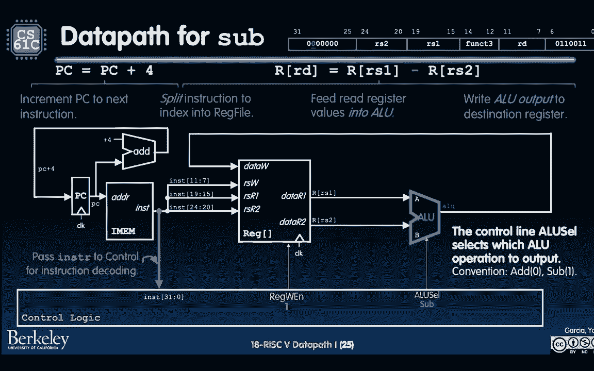

好啦，下面是控制与数据与数据路径的另一个类比，我认为这在这里很有用，这样想吧，你们中有多少人知道国际空间站，你们中的一些人以前听过这个首字母缩写，很好的想象数据路径在太空中，非常复杂的事情。

有时人有时其实不是，通常男人不要紧，任务控制中心在下面，这里的ISS就像，啊，我看到一些东西，这是所有的数据，比如，这是我看到的，这是说明书，但我身上没有足够的计算能力。

能够实际制定出所有这些后勤任务控制，就像指挥中心呼叫老鹰，控制中心呼叫老鹰，请启用注册权限，请表演替补，然后这一天就像没事一样过去了，我拿到了，我拿到了然后就像，好啦，现在下一条指令，请计算计算。

我需要做的是控制，就像，好啦，是啊，是啊，启用注册权限进行相加，所以有一种来来回回，你可以想象他们两个又在同时工作了，这里的控制逻辑，这只是另一个组合块，所以我们可以想象有这样一个循环。

在这里或不在这个循环，但这条路，然后还有这个路径和实际的数据路径，让我读这篇课文是这样的，我刚说了同样的话，就像我刚才说的，组成cpu的有两个抽象，我们认为它们是独立的东西，我们在画的时候。

使分离所有多路复用器变得更容易一点，所有这些都来自在引擎盖下传递的实际数据，组合逻辑元素和状态元素。

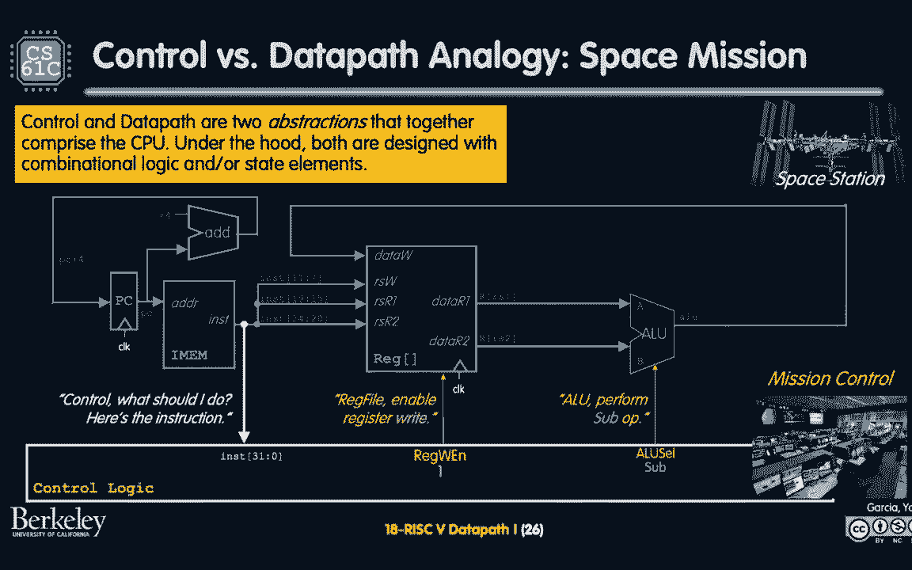

那么我们如何支持所有的r类型指令呢，我们之前暗示过，做减法运算，也就是说，我们只是要把所有的位传递给指令，的控制逻辑，我们将把指令的所有位传递给控制逻辑。

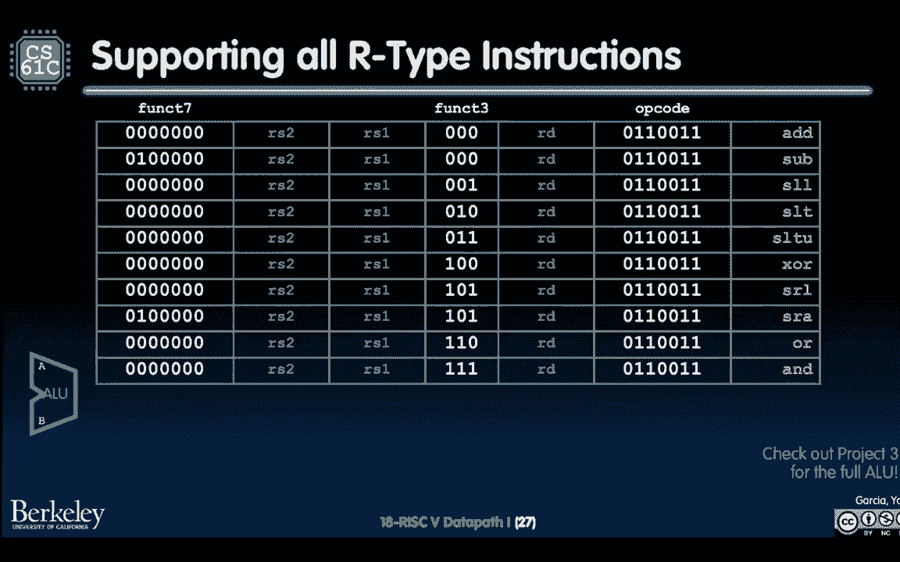

控制逻辑是放克3和放克7，然后只需更新alu select输入以实际选择正确的操作，异或和所有这些类型的东西，再说一遍，我们还没有讨论控制逻辑的逻辑，这里的想法是，我们在这个抽象级别上思考它，会成功的。

我们只需要告诉它输出什么，今天最后一件事，我们将在我们的CPU中再插入一条指令，它将是一种不同的格式。

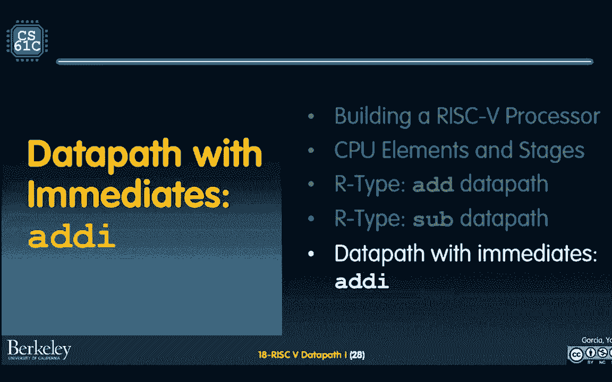

添加我结帐，你还记得，你还记得那张幻灯片吗，是啊，是啊，是啊，是啊，是啊，是啊，是啊，是啊，啊，好啦，它与你可能记得的上一张幻灯片有点不同，但这里的想法放克三仍然增加了，也许我们还可以用同样的ALU。

嗯哼，有趣有趣，仍然更新到各州，Reg文件和PC，但现在我们不再有读数寄存器一和读数寄存器二，现在我们必须生成我们的12位即时，然后把它加进去，这是对我们注册文件的更新，好啦，让我们考虑一下。

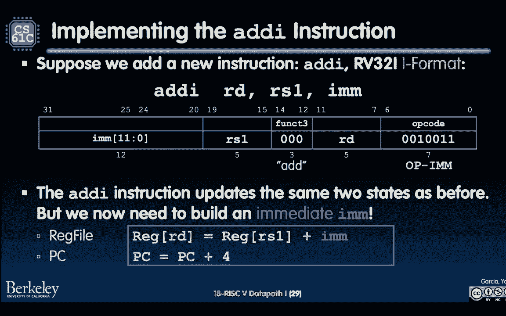

这就是我们所拥有的，还不错，好啦，但请记住我们在上一张幻灯片上所做的。

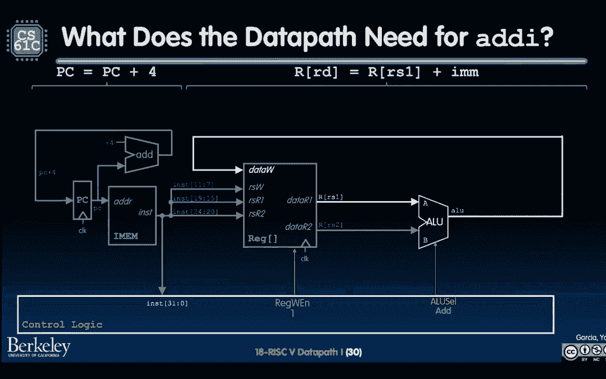

我们说我们想在幻灯片的顶部加在一起，我们说我们想把rs一或rs一的寄存器值相加。

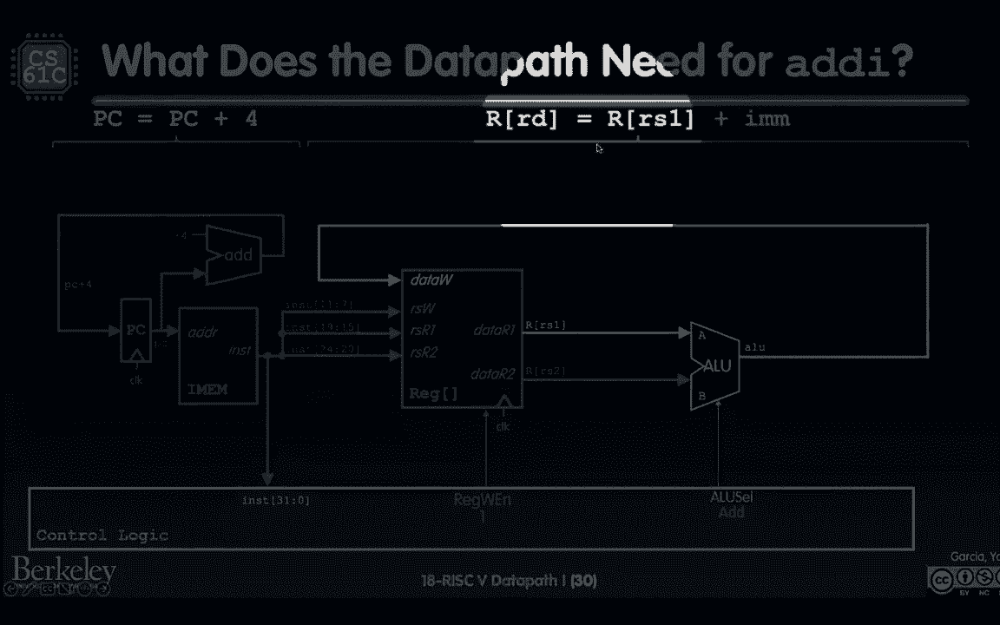

也有一些直接的，我们当前的数据路径有什么。

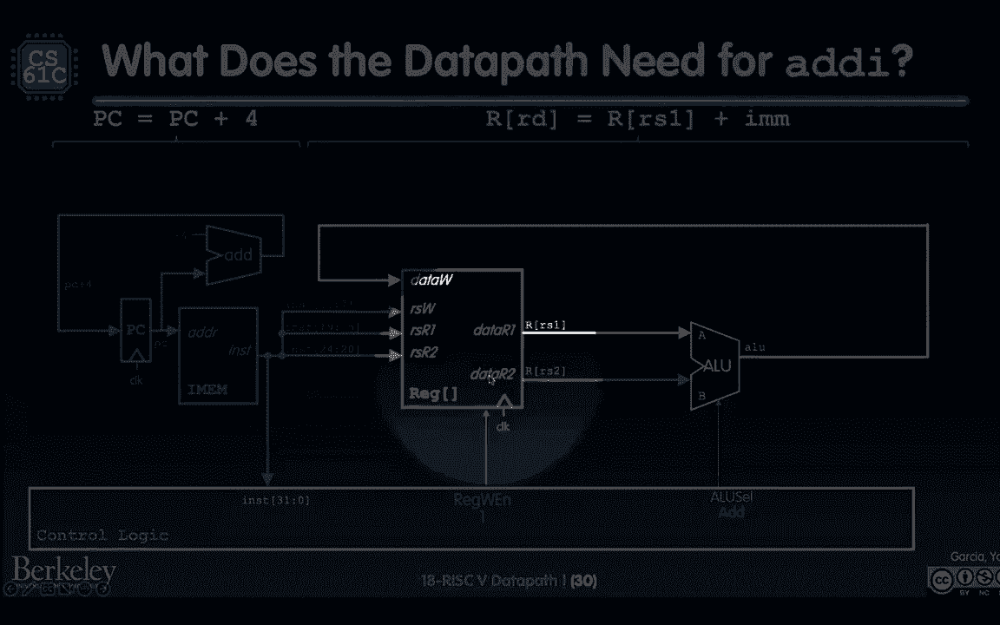

它总是把1和2加在一起。

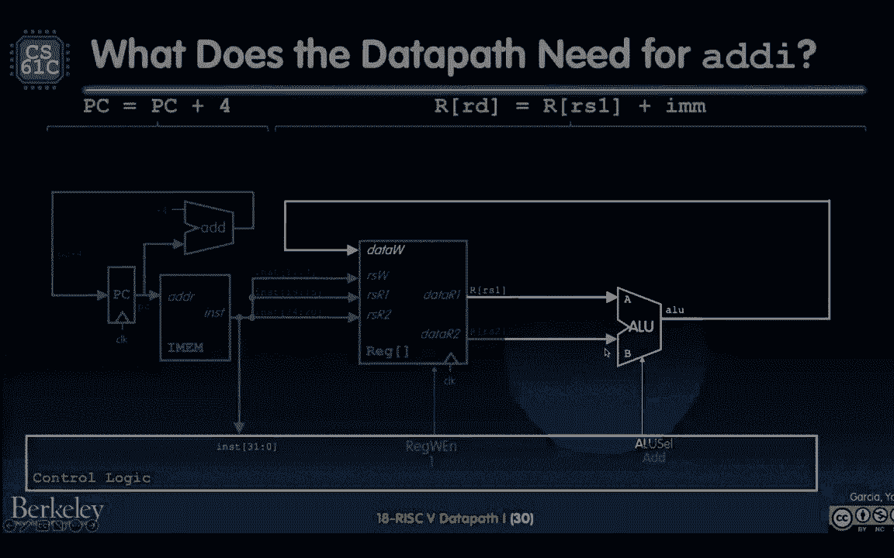

所以这里没有直接的，所以我们需要改变这一点，此数据路径以获得更多信息，在这里放更多的方块，也许我们可以考虑做以下事情，它是为了计算1加立即，然后存储到我们的注册文件中，这是输出线，看起来不错。

但是我们需要改变这里的输入，尤其是，我们需要将输入从RS 2改为即时，根据我们的指示，我们如何做好这件事，这里有几步，注意这里，指令有两个步骤，这个pc等于pc加4，那部分处理好了，我们不会担心的。

我们将真正关注这一代人，会有两步，所以再一次，我还有一片云，但我至少知道一步。

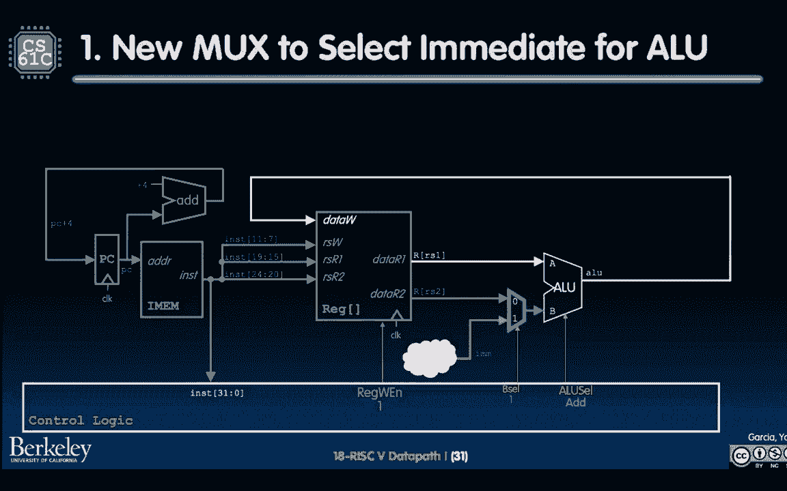

如果这片云，有点小，但这是立竿见影的，这个小方块。

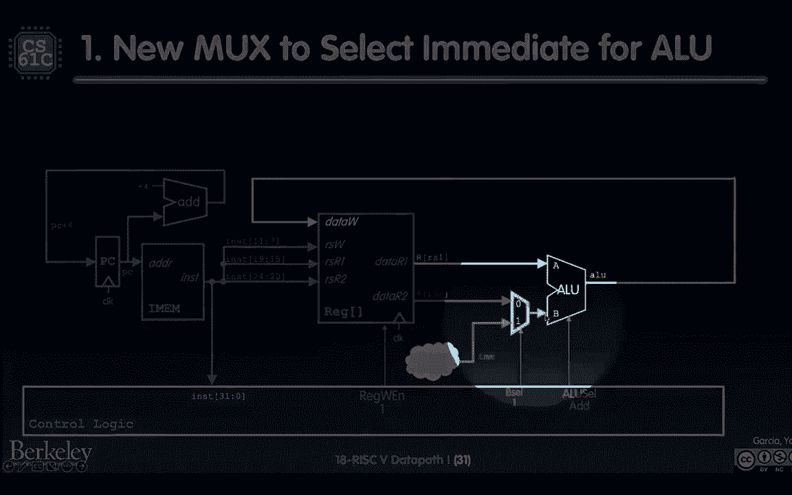

这是这根电线，说马上，如果这片云产生了一个即时的。

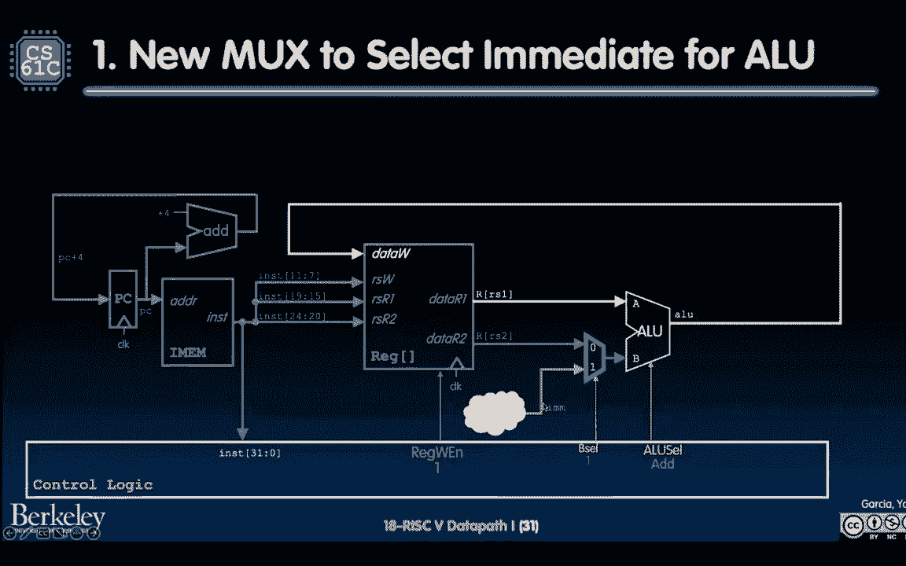

然后另一个连接到这个多路复用器的电线产生一个RS 2。

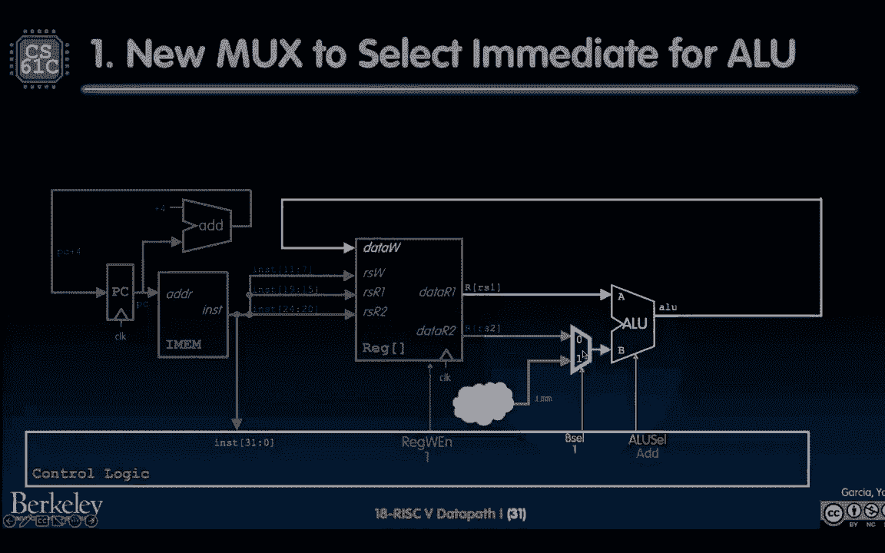

读取值r s 2，然后这个多路复用，你还记得把穆索画成梯形，此多路复用程序需要选择立即。

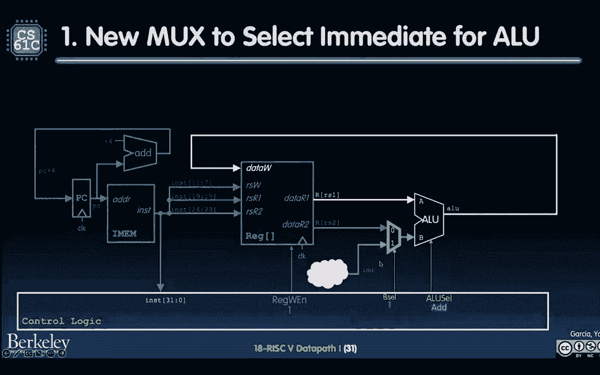

它如何选择即时的，它现在有一个新的标志进入控件，称为B Select。

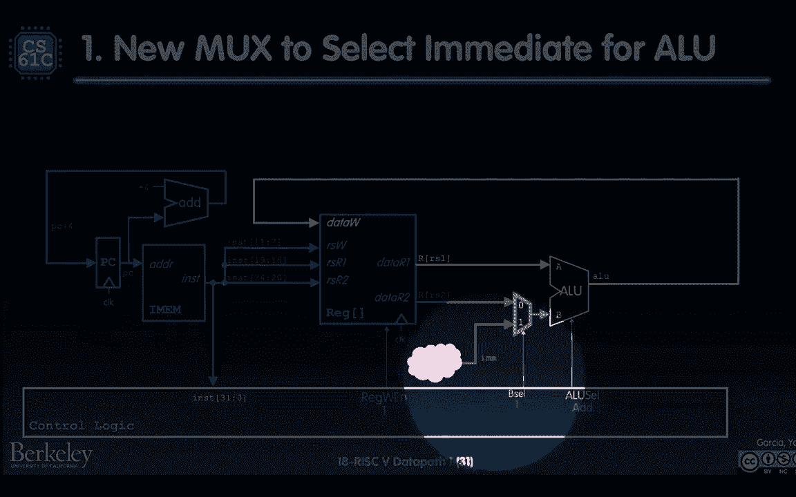

为什么是B选择它是ALU的B输入，所以你知道这就像，哦耶，这些控制的措辞有点道理，那么这里有什么意义呢，这里的重点是为了让这个，为了使这个加法发生，我们需要能够选择立即。

而不是寄存器来评估正在发生的事情，现在你就像，好啦，嗯，我怎么做即时丽莎，让我们，我们去看看，立即将通过另一个街区进行，我们一会儿会讲到，但我们将要看到的是，即刻将接受指令的一些部分，然后输出它又是。

有点小，但它将输出一个32位的即时值，然后它将被多路复用器选择，再加上寄存器一，值，让我们按顺序看看，一个的整个数据路径，哦耶，是啊，是啊，好啦，所以这里，我知道这太小了，所以这个特殊的分裂。

你还记得这份名单吗，这些箭在这里，这是指令位，所以我们要说，我们将得到说明书的上面12位，所以我们实际上可以生成我们的三个二位。

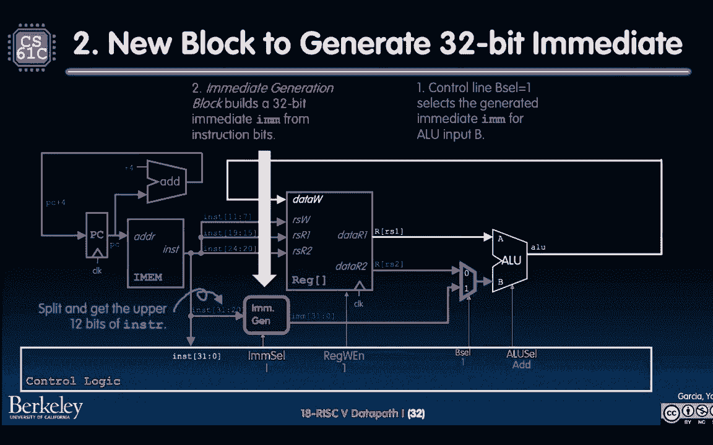

让我们先看看数据路径，我们再次将pc递增到下一条指令，这部分没有改变，我们解码刚才从Imen读到的指令，然后我们在这里把它分成一堆部分，我们把它分成两个输入，我们还把它分解成直接生成块的输入。

即时生成块将生成其即时。

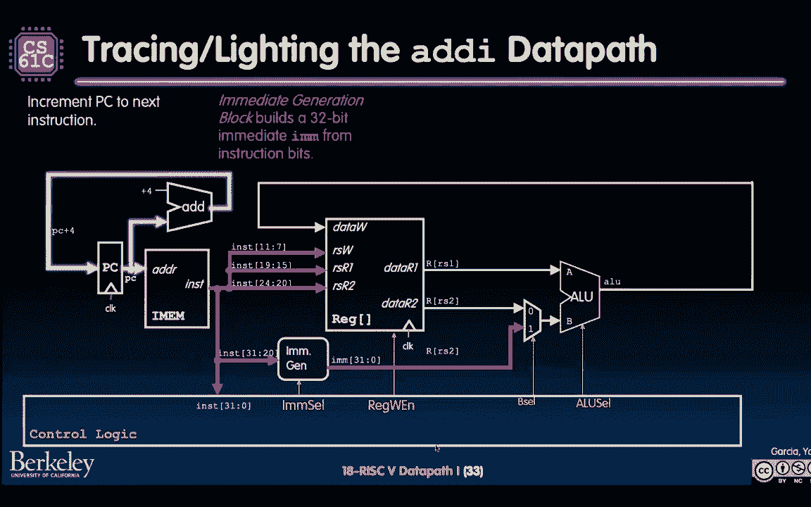

现在是三秒两秒，然后选择ALU的输入并计算这个广告，我们为输入选择什么输入好，那总是寄存器一，所以我们要保持原样，或者更确切地说，我们无法控制它，所以它将被注册为1作为输入b。

我们想选择立即和我们做得很好的方式，控制逻辑知道这将是一个广告，I和请求B选择是一，然后我通过这种方式，最后一步，嗯，在这一点上，我们把两个值加在一起，然后ALU想把这个保存到寄存器文件中。

所以它通过把电线连接到数据W来做到这一点，这里有一张纸条，就是这个数据指令。

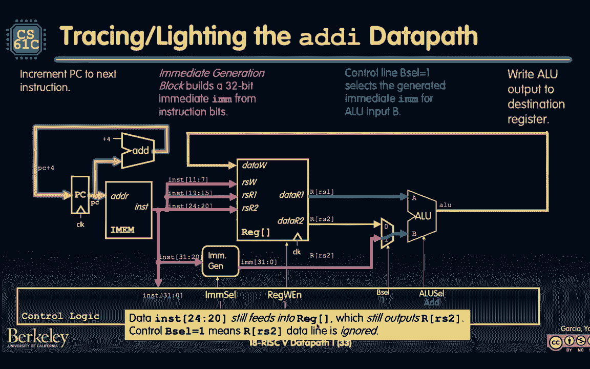

你们中的一些人可能很精明，你在看这个，你就像哇哦，但就像，我也不需要简历。

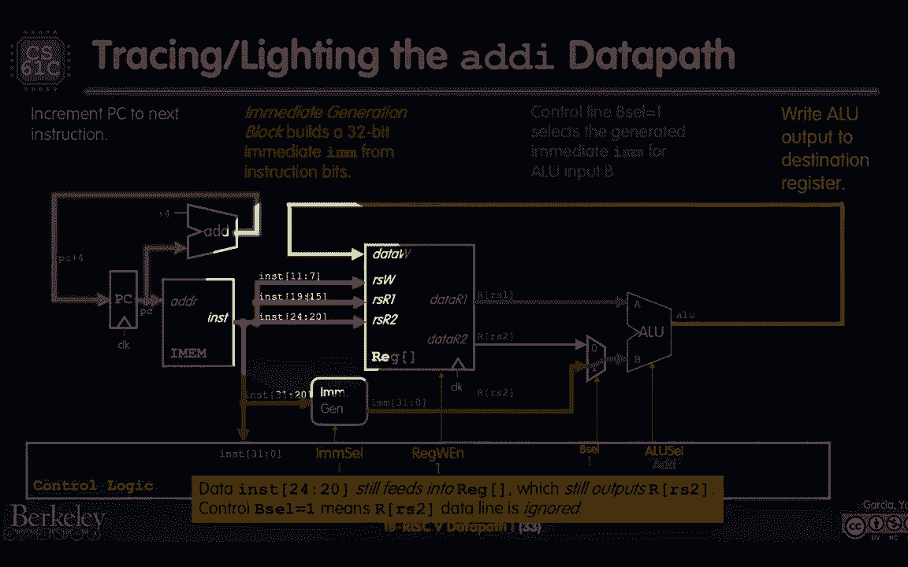

所以这东西还在接线，那是怎么回事？是啊，是啊，你说得很对，所以再一次，数据路径只是要做一些事情，只是会读到，不管卢比2的值是多少，这就像一些随机的一部分直接，它会读到这个，然后被多路复用器拦住。

因为控制位就像，哦就像，我不管2的输入值是多少，我只需要得到，我知道这个指令是有效的，好啦，所以这就是这里的一点，这有点酷。

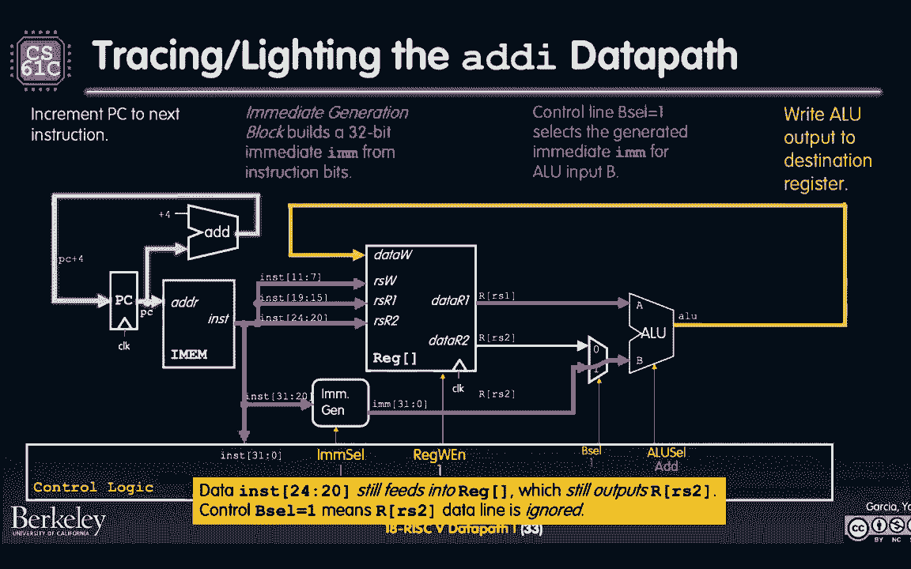

好的，好的，所以现在我们要再做一点点魔法，你可能想知道，这个直接生成块是怎么回事。

我对它的工作原理有什么直觉吗，有一种直觉，我要给你，还记得很多你会在他们的小屋看到的东西吗，他们都差不多，所以这里的想法是，如果我们试图从一个3位2位的指令，我把指令输入32位签名的。

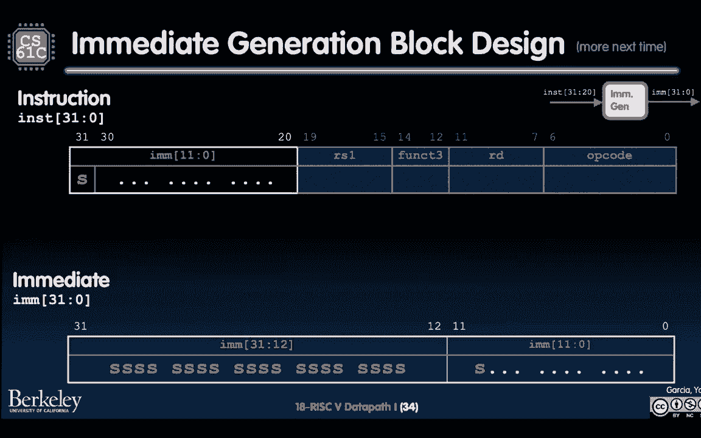

立即，我们要做两件事，我们要连接12根电线，从指令的上十二位到直接指令的下十二位，那么第二步是什么呢？我们要复制最上面的部分，这就是标志位，我们要把它抹掉，直接的所有上层，严格来说不是，是啊，是啊。

你好像没事，我可以涂这个吗，好像是的，但你知道分两步考虑更容易，立即，这里有12根电线，然后这个最上面的赋值位是重复的，连接到所有这些直接的其他部分，这就是直接块在非常高的水平上的工作方式。

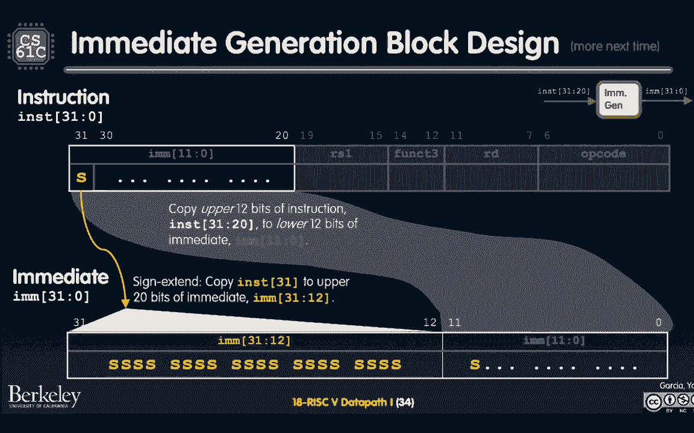

非常刺激，所以我们没有足够的时间来回答同伴指导问题。

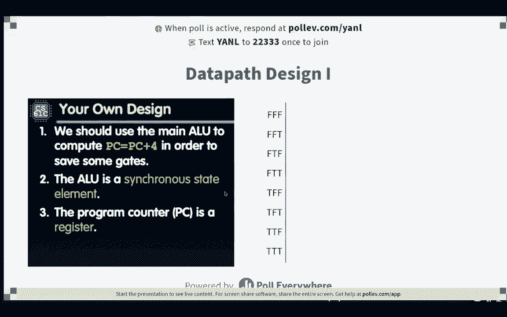

但它是可用的，答案有了，我鼓励你看看，我们从下一次开始，会有一个美好的周三吗，我们星期五再见，星期五记得带午餐，一会儿见，谢谢你。

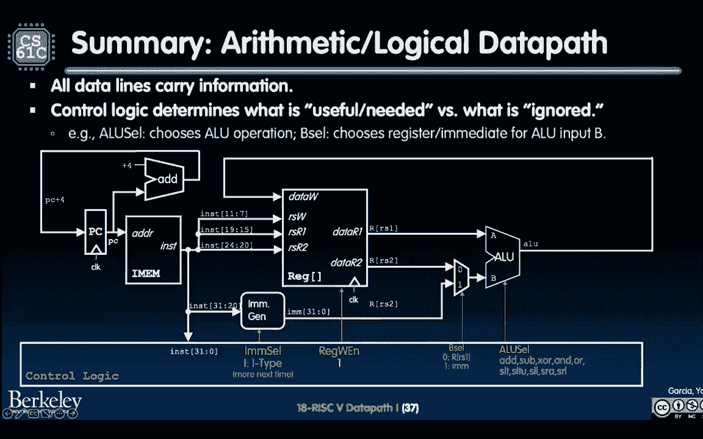