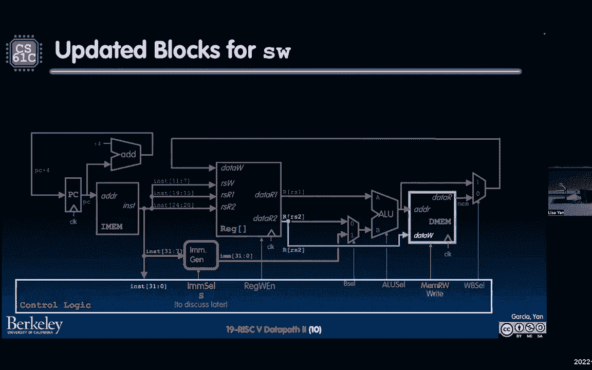
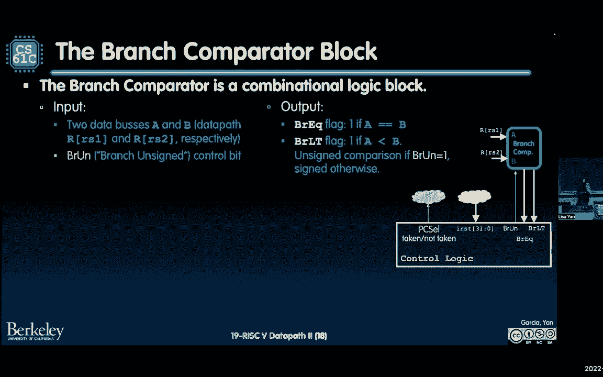

# CS 61C at UC Berkeley  - Fall 2022 - P25：Lecture 19： RISC-V Single Cycle Datapath II - 这样好__ - BV1s7421T7XR

今天是星期五，星期五，星期五一定要下来，每个人都期待着这一周的到来，周五下跌，每个人都盼望着周末的聚会，聚会，聚会，聚会，很有趣很有趣很有趣，期待这一周，我在高速公路上开得太快了，我想有时间休息和娱乐。

想想钱，知道是什么，我得到了这个，你得到了这个，我右边的朋友，我得到了这个，你现在得到了这个，你知道的，我们是前排座位上的胆小鬼，坐在后座上，试着让我下定决心，我能拿吗，今天是星期五，星期五。

星期五得下来，每个人都在寻找本周的新闻，每个人都盼望着周末的聚会，派对、派对和乐趣，好玩，好玩，好玩，期待周末，第三天是星期四，我们太兴奋了，今天我们要开个舞会，明天是星期六，星期天紧随其后。

我不要这个节拍，丽贝卡·布莱克，在开车的前后都很凉爽，巡航快车道，在我身边有车的情况下切换车道，但在我面前的是一把铲子，让nk tok嘀嗒嘀嗒，我的一个时间是星期五，今天是周末，我们会玩得很开心，来吧。

来吧，星期五来吧，星期五，你星期五得下来，每个人都喜欢一个外来词，我们将度过星期五，星期五，星期五下来，今天是星期五，你知道什么是星期五星期五是午餐与丹和丽莎，以及娜塔莎·库克教授，我带了防水布。

但当然，如果你们都来，也会很棒的，所以我们今天12点在纪念林间空地吃午饭，自带午餐，这将是一个好时机，我们将讨论系统，但你想谈什么我们就谈什么，真的吗，但大多数系统，我们要得到。

我们将继续我们上次看到的一些东西。

从某种意义上说，这有点像风险五讲座，当你学会了装配中所有不同的风险五指令，然后你用机器代码重新学习它们，现在您将在连接数据路径方面再次学习它们，我们在哪里，这里有什么想法，这里的想法是。

我们试图建立自己的CPU，在建造我们自己的CPU时，我们将，我们正在建立它，有点像一个接一个的指导，上次我们从add开始，然后我们引入了减法，然后我们加入中间体，现在我们要继续做所有的装载和储存。

所有这些事情。

所以这就是我们现在所处的位置，你可以看到我们还没有真正谈论记忆。

我们走吧，是啊，是啊，所以我们还没有真正讨论过记忆，它不是真的连接到任何东西。

然而，我们这里所拥有的足以让我们至少添加数字，不管他们是不是中间人，它的工作方式是首先PC。

它存储指令地址的类型，然后这个用来输入离子，它是一个存储设备，内存状态元素，然后在这一点上读出一条指令。

我们在这个小分水岭。

拆分器将三个二位的指令拆分为五个位的组，它确切地知道，它知道它正是寄存器目的地所在的地方，寄存器源和寄存器源，在这之后，寄存器文件将专门读出信息，它会读出寄存器1的值，寄存器源，并注册源2，第一和第二。

然后这些可能被添加到ALU中。

为什么我说潜在的好，因为有这种B选择这种B选择MUX。

记住MUX是如何工作的，多路复用器说，好啦，嗯，我将选择我的ALU B输入，要么是寄存器rs 2，要么是我的直接生成块中的值。

我如何生成一个即时生成块，嗯，我记得这个控制逻辑有点像任务控制中心，那种太空任务的想法，控制逻辑看到指令的所有三个两个位，意识到这是一个添加，我请求立即生成生成一个i类型的立即。

这是一个标志延伸三个两个位立即，然后还键入取消选择，就像一个人说的，嘿嘿，你对卢的投入，应该是一个，然后我把它们加在一起，请把它们加在一起，最后把这些写到寄存器文件中。

上次有个问题，我只是想再强调一下，这就是我们的整个设计。

这就是我们所说的边缘触发右，这可能是你见过的，但现在我只是明确地把这句话放在那里。

也就是说，当我们有了这个控制，在这下面，注册权限启用。

如果这是一个，我们正处于上升的时钟边缘，那么目前处于数据时代的任何东西。

寄存器文件的输入，就在那儿，这将在下一个时钟周期被写出来，是啊，是啊，在耶，在下一个批次周期开始时，所以一切都准备好了，就在十二点的时候，击中的那个，这时所有内容都被写入寄存器文件，但其他的。

所有的阅读，在整个时钟周期中发生的所有组合逻辑，好啦，这就是我们所处的位置，我们这里有一张图。

我们将在这张图的基础上，接下来我们要做的是。

我们来看看上次忽略的记忆元素，从负载开始。

让我们看看加载指令，你可能还记得，加载指令实际上没有使用不同的格式，它使用i类型，那是什么意思，这意味着所有字段都可以在相同的位置访问，这就是控制路径将要看到的，所以这是一个类似的路径添加，我为什么好。

因为加载词，记住这里的想法，这里的思想是加载词有一个地址，它如何计算那个地址，它把它计算为r s 1，眼前就像一个征兆，立即延长，但这是与I型相同类型的媒体，然后从这个地址加载进来，或者上面写着，好啦。

求求你了，从这个地址开始的单词中读取的内存，然后我要储存这个词，或者对不起，我要把这个词保存到目的地寄存器里，这里的目的地寄存器是x14，现在这里有一张纸条，所以我们在数据路径中考虑的一件事是。

而不是总是只考虑寄存器写什么的逻辑，我们实际上在更高的层面上考虑它，哪些状态元素，我们需要箭，我们需要导线来连接哪些状态元素，现在我们有我们的记忆读取，那个DM块要出来了，我们要读取寄存器文件。

得到RS 1的值，我们的基本地址，以及对寄存器文件的写入，以将内存字存储到寄存器中，Rd，然后我们还将增加PC到下一条指令，这样我们的管道才能继续，或者我们的数据路径可以继续执行我们的程序。

让我们来看看这个，有两个新街区，其中之一是在我们有记忆之前的那个伟大的街区，我们这里的记忆块，也就是我们的d mem块，这里的d代表数据，那将是我们的读写记忆，我们这里还有一个多路复用器。

我们的MUX在这里，我打算叫它wb select或dwb，细胞MUX，这个右后卫代表什么？选择，这是什么意思，选择要写回寄存器文件的值，所以让我们看看这些控制位是如何结束的。

当我们实际点亮下一张幻灯片上的数据路径时，最终工作，我会把它留在那里，因为你知道动画在那里，好吧，让我们看看这张幻灯片，然后我们在下一张幻灯片上再看一次，所以在这种情况下，我们将在一个特定的地址阅读。

哪个地址是由ALU计算的地址，所以alu会计算出这个地址，或者注册一个人的价值加上直接的，然后哪个值你写得好，因为我们在处理货物，我们想把内存中的值，我和这个男人，你为什么要选择，你就像，为什么喜欢。

这是为什么，为什么连这个都没有，请记住，整个数据路径旨在处理所有指令，好吧，有时候如果这是一个广告指示，您确实希望回写ALU的输出，但是因为这是一个加载指令，我们要写回内存的输出。

好啦，让我们在下一张幻灯片上看到这个，加载数据路径如何工作，第一步从电脑上获取信息，好啦，我们得到什么信息PC商店和下一条指令要写的地址，然后它访问指令存储器并说，请阅读这条特殊的三位二位指令。

然后在下一个时钟周期，我会增加自己，我会更新自己，加四接下来我们将立即生成这个3位2位，为什么因为记住加载是i格式是如此，每当控件看到i格式时，它会要求，好啦，这是我们的格式，所以，因此立即选择。

请在我的直接生成块中输入一个i，然后立即生成块就会像好吧，我拿到了，我要签字，扩展我的3个2位指令的上面7位，这将是我的三个两个位即时，然后发生了什么，我们做算术，我们执行ALU，我们为ALU执行什么。

我们把基址加起来，它是罗恩，加上我们刚刚生成的，我们怎么知道我们把直接的，因为B选择。

好啦，所以这又是，控制单元就像。

哦耶，这是我的类型，所以我需要，如果我正在生成，眼前的，我也需要确保我用它。

所以我要请求锁在这里选择一个，然后我把这两个加在一起，现在呢，发生的好事，在这一点上，ALU的功能就像一个加法器，或者像你知道一些做操作的东西，然后数据路径就像，好啦，嗯。

这里的输出实际上是我传递到内存中的地址，注意这里有一点双线。

因为在一种情况下，如果我们在这根电线的上半部分，我们会处于添加I的情况或广告的情况。

不过，既然我们来了我们就来看看下面的部分。

好吧，再来一次，这是控制逻辑为我们决定的，就像没事一样，嗯，我很确定我真的想取这个值，一些记忆，所以你看到的最上面的紫色线条，那个人要么死在穆拉格，要么不死，它只会输掉这场战斗，战斗的地方是WB细胞。

所以有一个注意，我不打算说太多，因为我们在课上有很多东西要讲，但也因为它实际上将是一个关于，嗯，项目三本身就是这个特定的加载指令，我们刚刚报道了加载词，但事实证明，有五种类型的加载指令。

所有不同类型的宽度，他们就像，哦耶，好啦，是呀，我记得，现在有负载，有加载半字，所有这些事情，大致思路是这样的，步骤在这里，然后您可以按照以下步骤，但这个想法是为了支撑更窄的负载。

你仍然从内存中加载一个3位2位的单词，但是因为你在骑马或者你在存钱，你可以在它从内存中恢复后对它进行操作，那我们该怎么办，我们加载单词，然后我们添加一个额外的逻辑来提取我们查看的正确字节。

然后我们签上我们的零，然而，我们希望实际上通过或加载半字来拟合加载的函数，或无符号加载，或加载半字无符号，所以这是用摩西和几个门实现的，你在逻辑模拟中看到的很多东西，这会使我们的图表变得复杂，不过。

我想专注于，教学的其他概念，但这是一般的想法，再看看第三项目，如果你，如果你真的想把它接上，你就会把它接上，这将是一个伟大的时刻。

至少加载字。

这就是一般的概念，请注意，加载是，是第一个真正使用了我们上次讲到的所有五个阶段的，包括这个内存访问存储。

另一方面，我们去看看，所以故事，记住，这是一个令人困惑的问题，它有装配指令，几乎和洛沃德一模一样，但现在形式完全不同了，我们去看看，在本例中，您要记住将存储存储到内存中的存储词，商店是什么。

它储存在哪里，嗯，首先，它计算地址为rs的地方是一个加号扩展的立即偏移量，然后它存储什么它存储RS作为两个，好啦，所以之前，加载词有RD时，因为它是将值写入的目的地，现在我们有两个RS。

哪个是要读取并放入内存的值，那么这意味着什么呢，这意味着我们有相同的状态元素访问，但我们对它们的访问不同，我们如何以不同的方式访问它们，是他们，那是现在的记忆，我们实际上是在记忆中写作，好啦。

因为它现在是商店注册文件，而不是做一个阅读，一次写，我们实际上做了两次阅读，其中一个读取是基地址，其中一个读数是我们以后要存储到内存中的值，好的，好的，所以就像，把寄存器寄存器文件的抽象。

相对于记忆本身，我们试图更新的东西，然后我们也更新PC到下一个指令，好啦，所以这就是存储词的想法，它阻止了。

那我们更新，我们去看看，实际上在上一张幻灯片上，你可能看到了这个，让我很快回去。

上一张幻灯片我告诉过你它是一种不同的格式，从某种意义上说，如果我们试图用这样的方法计算这个地址，你知道的，一加号扩展立即偏移量，突然间，我们现在有了两个不同的领域，我们必须访问它们来创建我们的即时。

这和我们以前看到的I型不同，在I型中，我们的12位偏移都在顶部，指令上面的所有位，现在我们的十二个偏移，一个12位的偏移量在上面的7位字段之间分裂，然后这个中间的五位字段。

原来的第3个字段在哪里，所以这是我们必须处理的事情，如何应对，记住我们今天的抽象是块，但我们都很好，我们要把这个魔法方块，这将是直接的世代块，只要我们通过正确的控制标志，假设控制标志是S。

它会立即为我生成正确类型的3位2位，所以这就是我们现在如何抽象它，大概10-15分钟，我实际上会更多地讨论它是如何实现的，但这里的想法是，好啦，我们有这个即时，我们可能会使用ALU计算地址。

这和我们在加载词中看到的很相似，但是现在我们也要给内存写一个值，我们要写哪个值r 2，哪一个是我们想要存储的数据。

通知，这就是为什么这里有额外的电线。

好啦，这条额外的电线裂开了，它对商店的输出很好。

它必须直接连接到我的所有其他操作，到目前为止，我们要把它连接到ALU，但我们知道有时我们需要它直接进入记忆，然后现在有了这个MEM读写，阅读MRW标志，我们要把它设置成。

因为我们要在下一个上升的PO上写更新，让我们再检查一遍，这个控件现在，至少控件立即选择在两个值之间进行选择，I和S I代表I类型S代表S类型，然后我们在这里的记忆，我们要说这个控制mm rw。

这是一个将允许我们保存，RS两根电线上的东西，在下一个上升的时钟边缘，在下一个周期。

在下一个周期开始时，现在这里有一点，这里有一个小任务给你们，你觉得怎么样，其余的控制位是如此记住，数据路径和控制的思想之一，所有这些都是我们实际上不喜欢的，数据路径只是通过管道传输信息，只是把这些东西。

控制实际上是限制，使信息能够通过所有的电线，所以我们已经讨论了一些关于立即选择的问题，那将是S，我们已经谈过mrw了，这将是正确的，我要把一个ALU选择为您添加，你觉得怎么样。

其他控制线将是，我给你点时间考虑一下，如果各地的民意调查都有效，反正会让我好起来的，我会在这里到处投票，所以是投票点，COM斜杠，Ya和Lyan，一旦你有了链接，我就会。

我要回到上一张幻灯片，哪个更大，这样你就可以考虑一下，和你的朋友谈谈，我们会回来的。

我们有一些初步的答案，这是非常令人兴奋的初步答案是，只有七个人同时回应，需要更多的时间有趣，在C和D之间有一个分裂，然后G开始流行起来，非常刺激，现在cd和g不相等，好啦，这就是我们要做的。

我们有大约50个人亲自来这里，这是非常令人兴奋的，这是一个很好的数字，我们数到三就开始，无论你在你的思维过程中处于什么位置，数到三，我们都会喊出我们认为是的那封信，或者你认为的多个字母，好准备好了。

就像是，你知道的，就像呼吸练习，就像十点半的事情，好啦，准备好了，一二三，美丽的合唱，所以好吧，所以在网上，我们听到C和A，然后有几个D和几个G很有趣，很有意思，所以让我们去好吗，好啦，是呀。

我听说另一个伟大的伟大的伟大的，我们再过一遍。

哦不，我有答案，好啦，没关系的，好啦，让我看看，让我们看看会发生什么，好啦，我们会点亮数据路径。

哦不，好啦，那不是双关语，我们只是要看看数据路径会告诉我们什么，控制位必须是什么，这样我们就可以储存，我们做的第一件事，因为它是商店商店不会以任何特殊的方式更换电脑，它只是递增到下一条指令。

所以我们要把这里所有的小路都点亮，而且这边没有控制，只是还没有，所以我们要留着它，接下来要发生的事情，指令正在进行，指令数据线要亮了，为了简单起见，我已经把那些不会被点亮的涂成灰色了。

根据以后发生的其他选择，这让我们更容易，所以记住什么商店，读取两个寄存器，其中记录了RS 1和RS 2，随便啦，这两个值是，其中之一是基本地址，其中之一是我们要存储到内存中的数据。

一旦我们将指令输入控制逻辑，我们要把管子插进去，把控制位传进去，我们传递哪些位，我们知道我们正在做的是立即处理一个S型，所以无论直接生成块做什么，我们要把它打进去，然后我们会得到一个真正的三个。

两位即时，那么如果我们立即产生，我们其实是想用它，所以我们要把b选择设置为1，我暂时跳过重写和启用，但在我们设置B到1之前，因为我们确实，想立竿见影，这里ALU将被添加，那是以前加的。

因为我们要加在一起计算这个地址r是一加直接，然后我们要访问内存，这是一种权利，所以这和右边之前的控制位是一样的，地址的正确工作是如何进行的，以及我们要写的数据字，然后将数据字写入设置地址，然后你就像。

啊，但是有一个数据读取输出正确，因为你记得记忆是怎么读的，写作品，它正好写在上升的口袋上，如果启用MRW，但其他时候，它只是作为一个组合块工作，所以确实会有信息从男人那里出来，现在你就像，哦不。

但我不能写回登记簿，因为记住这里的存储词根本不会更新我们的注册文件，它只写入内存，不是寄存器文件，为什么没有什么，为什么在这里的尽头没有任何东西真正亮起来，星星到底是什么，事情是这样的。

它实际上依赖于我们这里的控制位，好吧，这就是我要说的，控制逻辑说得很好的控制位，我很确定，储存词什么都写不出来，根本不更新我们的注册文件，它只更新内存，所以他们是，我将把正确的启用位设置为零。

如果是这样的话，不管W上的结果是什么，都在这里的reg文件中。

不管结果如何，因为Reg写入启用在上升时钟边缘为零，什么都不会写，没有什么会更新到Reg，因此，我们在这里选择什么实际上并不重要，因为我们很清楚，它将沿着这里的小箭头。

然后它会在这里结束，然后它就不会出事了。

所以这个星号，这就是我们所说的，我不在乎，周一我会再多谈一点，但那就是那颗星的意思，这意味着控制逻辑可以决定在特定的控制标志上放置零或一，然后实际的操作，演出，对状态的更新不会改变。

欢乐时光，所以我们要用这种不在乎的想法，将其扩展到不同类型的格式，下一个我们要看的是树枝长凳。

这有点复杂，因为我们现在有了一种新的类型，好啦，那么到目前为止我们看到了什么，我们见过我们的类型，平均I型，这是算术即时加载，我们见过这种类型的，哪个是商店，然后现在我们看到B型。

有时你感觉到它就像某人打字一样，这是一种新的格式，如果你看看中间人。

我们又在做一些即时的旋转，所以如果我们立即旋转。

格式看起来略有不同，我们该怎么办，我们把它扔进直接的世代块。

所以我们有了一种新的格式，然后我们刚刚说，立即生成块将处理它，我们只需要插一面新旗子，现在有一个新的控制位，国家做什么，更新了什么元素，有两个，其中之一是reg文件，RCP，访问的元素是什么。

其中之一是reg文件，它从寄存器中读取值，我们要一起比较，记住分支这里我们比较两个寄存器值，然后我们决定改变下一条指令，我们，我们，我们执行的基础上，比较的结果，所以我们要读这两个值，这两个文件。

然后我们要更新电脑，但现在我们要有条件地更新电脑，我说那口井是什么意思，程序计数器，如果我对第一和第二做了什么比较，如果成功了，然后我需要拿树枝。

什么把树枝，意思是拿树枝，意味着我确实将PC更新到了PC。

加上这个相对的偏移量，这个相对于偏移量，这是从我们的三位二位指令中的直接字段生成的，但如果比较失败，那树枝就不拿了，然后我会像往常一样更新电脑，又名下一条指令的增量。

加四，想法是这样的，好啦，所以我把这三个方程，然后从这张幻灯片的最后一张幻灯片中再来一些，我们需要进行三种不同的计算，然后我们还需要像，你知道的，在最左边有一小片云，那是我们在更新电脑，但要做到这一点。

我需要计算三件事，其中之一是我们需要计算如果分支被拿走会发生什么，所以PC要更新到PC的这个值加上立即，我们需要以某种方式计算，所以它在电线上准备好了，我们需要计算的第二件事，是我们要更新PC的值。

如果没有，如果树枝没有被拿走，那就是电脑加4，然后我们需要计算的第三件事是比较，分支等于分支不等于小于小于无符号，所有这些事情都需要以某种方式发生，所以我们需要一些方法来结合RS 1和RS 2。

在上面做一些算术或逻辑计算，不过，我会查清楚的，还记得这些计算组合逻辑块是什么样子的吗，它们看起来像一个小梯形，有一点点缺口，我们有多少这样的两个，在同一个时钟周期内，我们需要执行多少事情。

让我们看看我们能执行什么，PC等于，PC加四，我们有电线，我们有广告，我们有加四，这个我们肯定能做ALU，另一方面，我们决定哪一个会进入这个特定的时钟周期，嗯，这有点粗略，对吧。

因为还记得时钟周期发生了什么吗，我们不能在下一个操作之前对每个组合逻辑块只做一个操作，关于下一条指令的下一个信息，所以如果只有一个AU，我们实际上还需要一个算术，多一个硬件块。

这就是我们所说的分支计算块，分支计算块是什么样子的，好像是这个盒子，你就像没事一样，嗯，这个分支计算发生了什么，它将比较寄存器1和寄存器2的值，R是一，R是二，它将把这些信息输入控制逻辑，就像没事一样。

嗯，你知道我比较了第一和第二，他们是平等的，然后控制逻辑就像好吧，然后我要更新，我要选择我实际上更新到哪台电脑，好啦，或者我如何更新我的电脑，它是如何做到这一点的，向控制块提供更多信息。

然后出来进行某种模拟，一些电脑的选择器，让我们在这里谈谈这些幻灯片，所以我有一个控制幻灯片，B r u n和我这里有两张输出幻灯片，B r e Q和B r l t现在，如果你还记得缩写是如何工作的。

你可能知道这些意味着什么，但让我们明确地回顾一下，所以分支比较器块将是一个组合逻辑块，它是做什么的，它接受两个输入。

在边上有个小图，它接受两个输入，数据输入R一和R二，然后它还接受控制逻辑输入。

布吕恩，代表无符号分支，然后输出是什么，它输出两件事，其中一个是分支，等于标志一或零，就是说a等于b，A是A，B是输入，这里的数据输入，然后继续输出另一个标志，比吕特，也就是说，如果a小于b。

我会被断言，我现在是一个，现在你在想你就像，哦耶，如果小于不，我想对比一下，我需要知道值是有符号的还是非有符号的，这就是BRU和控制位允许你做的，好啦，上面写着，好啦，如果我像BTU一样，例如。

那么控制就不会，好的，好的，我在做BTU，那个指令是无符号的，所以我要把u n传递到组合逻辑块中。

然后你就可以做一个小于b的，两个都没有签名。

这是信息，再重复一下，所以记住控制逻辑在输入方面得到了什么，一旦从ima中读出指令位，它就会得到指令位，它将使用这些指令位设置bru n，对分支比较器进行有符号或无符号比较，然后呢，然而。

实际上在这一点上有另一个输出到控制逻辑中，哪个输出是b r l t和b r e q，这些是数据标志，这些是数据输出，进入控制逻辑数据线，然后根据这些信息，控制逻辑就像，好啦，嗯，PC选择，然后呢。

因此必须是零或一，这将决定什么，我更新我的PTO，下面是一些例子，假设我们做的分支少于，好啦，所以记住分支小于，如果它没有U，它会被签署，那么R u n就会像，你知道我要做什么，我要做一个符号比较。

所以我不打算断言自己，但以下是法国在个人电脑选择方面的决定，如果分支小于等于1，所以这里的输出标志是断言的，他们是不平等的，那么我真的应该接受，我应该接受任何适用于我的分支，这台电脑加即时，这相对简单。

但是让我们看一个大于或等于，因为这里有两个数据输出，其中一个是VR LT，其中一个是BR EQ，两者都不比这更伟大，它是如何工作的，这里有一些逻辑，如果我们要计算，A大于或等于B，这和说，不a小于b。

你看起来很好，好啦，那是怎么工作的，让我们考虑a大于b的所有情况，大于或等于b不是真的，如果a小于b，这就不是真的，在所有其他情况下，如果a小于b不是真的，那么a必须大于或等于b。

因为我们处理的是一维线，所以如果是这样的话，这是什么意思，这意味着如果我们的分支小于等于零，所以这是断言的，那么A确实不比B小，如果a不小于b，那么a必须大于或等于b，好啦，因此，在这种情况下。

选择PC，所以你可以看到，如果发生这种情况，就会有一点棘手的布尔逻辑，但就找出哪些幻灯片而言，这是一个很好的练习，你怎么不，以及德莫尔根定律的一切，以确保它为你自己工作。

好啦，这就是分支比较器块，现在我们是，我们还剩下一条指令需要计算，或者再做一次算术，我们需要计算的算术运算，在这一点上，我们有PC加4，我们知道如何做，有一个，有一条蝰蛇，我们还有一个分支比较器。

这就是r 1和r 2的比较，但现在我们需要计算PC加即时，我们实际上将使用我们必须计算的ALU，在这里放一些电线，你可以看到，现在我们有了一条新的电线，从PC一直到我们的ALU。

但是我们选择使用我们的RS是一个值，或将PC与。

让我们来看看这个，我其实更喜欢动画，因为它可以让你分阶段地看待事物，首先发生的事情，PC得到更新，所以我们有这个小，这根亮着的电线，穿过外墙，加四块，还有电线，一直到我们ALU的开始，就在缪斯女神面前。

然后读取指令，好啦，指示是什么，好好读，它会有这个。

它会，它将读第一和第二部分，这就是我们要比较的两件事，它还会输入指令，要求我们立即生成某种分支。

还没说过你是怎么做到的，但我们只是想象一下，这个立即生成块不会退化，三人行的正确类型，两位即时，它要做一个分支比较，在RS 1和RS 2的红色值之间，把这个放在这里，分支比较，它的读数是r 1 r 2。

分支比较，它输出b r e q和v r lt是什么意思，不管这个1还是0都进入了控制逻辑，此时计算的另一个算术运算，是阿卢，什么是ALU，计算PC加即时，它是如何做到这一点的，它使用选择来选择一个。

选择PC而不是RS One，它也用b选择这个来选择即时的，而不是两个，好啦，所以我把这两个选定的项目加在一起，然后把它接回电脑，最后在这里，在这一点上，分支比较器已经完成了它的工作。

把一切都输入控制逻辑，现在控制逻辑知道是否接受分支，然后它会从这两个项目中选择一个，PC加四或ALU输出更新，下一个上升的poage上的PC，现在你可能在想，这可能是最让我震惊的事情。

最多的时候我在看书，当我得知这件事的时候，第一次就像，这是同时发生的控制逻辑吗，为什么我可以说这就像第一次阅读指令一样，然后PC会在之后确定，就像那里发生的事，这样想吧。

一切都发生在下一个上升的时钟边缘，所以它并不真的有类似的物质，不管事情是否像中间那样发生，在右前方，所有这些都将以某种顺序完成，好啦，正因为如此，我们可以用这种方式编写控制逻辑，有组合逻辑。

有时他们会计算一些没有意义的即时值，但到了更新的时候，一切都会正常的，好啦，这是我们这里的电子产品的信任。

非常刺激，现在让我们稍微讨论一下直接生成块，事实证明，这是你要在实验室里做的事情。

这是非常令人兴奋的，我喜欢原木，因为它只是把电线连接在一起，最好的方法是立即，所以让我们考虑一下现在需要什么，所以到目前为止，我们已经看到了三种类型的即时，I型s型b型，让我们考虑一下i和s类型。

但我这里有两种格式的说明，然后我有一些地方，我有s或者像这样，比如说下面第三排，这是实际的三位二位指令，原来如此，我不知道是好是坏，但我知道至少在这张图中f是我的最高位，我的指示，三一。

如果我知道这是不是类型，我如何构建一个逻辑，允许我创建指令，对不起，创建三个二位即时，什么样的三个，两个两个位立即，我想从指令中扩展12位吗，从指令本身，我如何确定这一点，我们上次讨论过，我要签它延长。

从十二号开始，索引12位到3 1，好啦，这将是，我问我的最上面的一点从一个指示，接下来我要做的是，我要把一根小电线插进11号线，现在是眼前的一点，为什么我们会在下一页看到它实际上很有用，当我们谈论b型。

就目前而言，试想你只是在抄袭《三十一》，从指令进入立即的第11位，我还做什么，我可以在上面裁剪，剩下的六位，从最上面的领域到我直接的第五位到第十位，我知道这是真的，不管我处理的是i型还是s型。

我可以把这些线，我不必在他们之间做出选择，现在问题变成了，我该怎么处理下面的五位，我怎么知道哪些位，那些是，这就是多路复用器再次出现的地方，所以实际上最近的一代在这里会有一些多路复用器。

这将取决于你的即时，选择，所以在这个特殊的情况下，我们会这么说，如果我们的直接是我输入，或者成为，如果我们的指示我在哪里打字，我要从我的训诲中取二十四个零头，放在里面。

如果我的直接选择说我正在处理一个s类型指令，然后我要选择，这是我的7到11个指令，然后把它们放进去，好啦，所以请注意，就像输出线在某种意义上都是一样的，我总是会更新这一部分的即时片段，零到四。

但我是从哪部分指令中得到的，这就是多路复用器的用武之地，啊，有个问题，是啊，是啊，哦耶，多路复用器怎么知道这是哪里，我键入键入奇妙的问题，如果我们回到上一张幻灯片，请记住，这个立即生成块有一个控制标志。

就是这个，嗯，立即选择在这里出来。

好吧，在立即选择，我们回到这里，这就是直接生成块所在的地方，所以你会看到这里有一些侧面，这告诉我我在和什么类型的人打交道，所以如果我回到这张幻灯片。

我还没说b型呢，我们很快就会讨论的，嗯但是。

在这种情况下，我们是说，假设紧靠左边的恰好是0或1，如果这就像，你知道还有比这更复杂的，但如果我们对付的是国税局的人，在这种情况下我们会说好，嗯，立即选择，告诉我是哪种，因此，我将多路复用。

并选择这个特定的五位集，我们这种状态很好的问题。

让我们把它扩展到b类型，现在我不打算画盒子，因为它使图表变得相当复杂，但让我们观察几件事，所以我们再次处理相同的三个二位数据，数据是指令，但现在我们需要弄清楚如何立即填充到这三个位。

因为就像我们连接在一起的指令的实际部分一样，将取决于我们的指令类型，所以这里有一些在所有这些情况下的观察，我们掌握的最高情报是，或者我们掌握的最重要的信息，这个最上面的位总是指令的最上面的位。

所以我们总是要签署范围，不管那个词，I型S型或B型，我们总是要达到一个标志的程度，我们总是用指令的最上面的一点来表示扩展，就像你在上一页看到的那个小三角形，想象一下三角形也被画到幻灯片上，不一样，虽然。

让我想想s型和b型，因为他们两个是最亲密的，s类型和b类型如下，有两个直接的部分是不同的，其中一个被咬了，立即的十一个，我这么说是什么意思，我的意思是它们来自指令的不同部分。

取决于您在s类型中查看的是s类型还是b类型，是最高的，最大位，那个标志位，好啦，我们可以看到，我在这里用紫色突出显示，我也喜欢，你知道的，重新排序，稍微整理一下，所以你可以看到这个，实际上是指令位7。

这是7。

所以我要改变，我去换一下，如果你有讲义，你在这里也可以换这个，但如果你看到这里，这就像，哦耶，好啦，因为我的领域说我的第七位指令，至少在B型，我直接的第十一个位。

所以我必须在立即生成块中做一个必须的事情，另一个不同的地方是这里最有趣的地方，或分支类型中的最低有效位，记住我们实际上喜欢我们的，我们的媒体被代表为半词，所以我们总是有一个隐式尾随零，所以在分支中。

这总是零，然而，在商店里，我们总是会有这样的信息，因为商店在咬抵消，所以这是一个指令七，所以我们也要在那里做一个多路复用，根据我们的即时选择控制位值，有点像是，哦耶，有很多信息，但归根结底。

我们只是把买家联系在一起，我们在想要哪些数据之间做出选择。

根据指令的类型，现在呢，让我们来谈谈跳得好，还有两节，这是非常令人兴奋的，所以还有两个部分。

所以我们实际上还有一种直接的，我不打算报道会怎么样，呃，路由到直接生成块，但是直接是基于这里的j型，或者这个j格式，你还记得什么是跳跃吗，这个小东西，是无条件的垃圾，我们说我们将永远更新PC。

我们如何更新它，如何更新好，我们取直接的，我们把它当作一个字节，我们把它看作是相对的偏移量，我们把它转换成字节，然后我们把它加到我们电脑的当前价值上，对于跳转，我们要做的第二件事是保存返回地址。

在某个地方，我们将下一条指令保存到rd中执行，无论rd是什么，通常是它的返回地址或返回地址寄存器。

那么我们怎么做呢，这些更新，我要把状态更新的方程放在这里的顶部，所以我们可以看到他们，同时，有一个街区改变了，或者有两个街区改变了媒体一代，所以现在我们又在处理一种不同类型的即时，我只想说。

无论立即是J，然后通过有线立即产生块，它会输出正确的三个，我马上加两个，然后如果我们要把寄存器更新为PC加4，现在请注意PC+4一直到这里，在这个广告之外，我们现在没有任何东西可以更新它。

那我们该怎么办，你看，我们只是有点像，我们连上电线是因为它根本不存在，这是我们迭代地设计数据路径，现在我们有了这根电线，我们将能够支持对寄存器的两种更新，这些更新是我们的格式。

从内存中加载单词的寄存器的更新，然后还更新到PC加4的寄存器。

让我们看看数据路径，我们把电脑分成块，然后我们生成跳跃发生的瞬时，我们找出我们需要的指令位或控制位，然后我们用ALU计算PC加即时，你可以去看，因为我们的A选择和B选择。

我们将把个人电脑和任何直接的东西加在一起，我们生成，我们最终将选择PC+4，它一直都是有线的，从第一阶段开始，我们将选择PC加4以便能够写入我们的目标寄存器，然后注意这里的一些vlog。

PC选择我们称之为已取，因为我们总是无条件地跳跃，跳转就像不同的更新，那不是电脑加四更新，然后注意这里还有一些其他的东西，我们并不真的关心树枝，因为我们没有分支计算，不管怎样，我们总是要选择PC。

所以我们实际上并不关心。

分支的输出选择什么是正确的，再喝几杯，我们快到了，你见过的另一种跳跃是绝对跳跃，不再相对跳跃，但现在我们要处理的是j l l l j a l r，使用即时格式，那是什么意思，我们已经有了这个即时，好啦。

我们有了，我们知道这是我的类型，因为立即选择只是指令的类型，这里指令的格式，对状态的两个更改，所以现在我们还是要做r或z，我们仍然要在一些东西上添加媒体，但现在不是把它添加到PC上，这将是相对的。

我们把它加到这个绝对地址，1的r，然后我们有这个PC加四个更新，这是我们的回信地址，缓存，最后，这正是我在，在这张幻灯片的开头，这里的i格式只是意味着JLR确实会生成完全相同的即时。

因为格式类型相同，让我们照亮这条小路，把电脑输入方块，请注意，我已经将所有内容都连接到WB中了，在这里选择两个，因为我知道，但这就是我的更新，RD等于，PC加4，所以这就像，我们知道更新会发生。

所以我们只要照亮那条路，已经，我们将立即生成i类型。

只是我们在吃，嘿嘿，立即选择你的眼睛类型，请给我i型，那我们还能做什么，我们做的事情类似于从以前的跳跃，所以我们说，好啦，嗯，我们要把即时加一些值，但现在不是把它添加到PC上，它将是一个精选的。

我们把它加到RS 1的任何值，我们写它，这是寄存器，这里是选择0，最后，在最后我们写PC加四注册，就像又一次，这里有一点不同，尤其是如果你看A选择和，呃和凝胶说明书，但希望用颜色编码的图表。

允许你做一点比较和对比，最后将ALU输出写入PC机。

好再来一张，我们总是把你留在最后。

因为这是你在金星上看到的东西，你从大的方面看，所有这些事情，但你实际上并不经常使用它，当你是人类编译和组装的时候，所以我们现在要报道它，上中段，有什么想法，另一种即时格式，另一种即时格式，如何应对。

立即选择采用U型，不知何故，我们稍后处理块的组合，它用于两个指令，这种格式，其中之一是Li加载上面的位，将这20位媒体加载到一些更大的，三位二位即时输出，然后是U IPC，它将此设置立即添加到PC上。

好啦，所以这是我们储存碎片的一种方式，或者在PC上进行实际计算。

两者都碰巧将pc递增到下一条指令，而不是，或者幻想跳跃什么的，这将反映在我们的图表中，只有一件事改变了，是啊，是啊，我想只有一件事改变了，这又是直接的代块，我们只要加一个u型，它会以某种方式连接起来。

从某种意义上说，我们只是要连接所有的电线，以某种方式，我们会有一些缪斯女神，这将是一个好时机。

让我们为UI和AUC做练习，所以我们要把状态更新放在这里的顶部，所以我们都可以按照第一步，等于PC加四步二型立即进入立即生成块，并请求立即生成块以生成您立即键入的正确类型，第三步，这个有点棘手。

上面写着，好啦，您想将什么保存到寄存器中，我要再放一次，你只想把眼前的，这是我们的ALU数据库中没有的，还没有，所以我要创建一个新的标志，你选择，如果是b，那就意味着你只取b。

也许你做b加零取决于你特定的硬件实现，意思就是，我们不关心这里的输入是什么，我们只关心B是什么，我们要把它接上，然后当我们把事情写好的时候，如果wd select是一个，我们将写出ALU的输出。

在这一点上，它只是输入b，在这一点上是直接的，U型即时，然后我们要把它保存到我们的注册目的地，最后一个，加州大学，这里有什么区别，我们正在更新PC+立即，不仅仅是在瞬间加载它，所以唯一改变的是。

就在这里，现在我们有一个A选择，因为我们正在加载PC并将其添加到即时，这就是我们更新的，你和你的唯一区别。

所以最后我们做到了。

这是我们的数据路径，让我们说，让我们用热烈的掌声，下周下次我们要跳支舞，但现在你可以感觉很好。

你刚刚设计了百分之四十，80%的CPU，祝你周末愉快，一小时后林间空地见，再见，伙计们。

