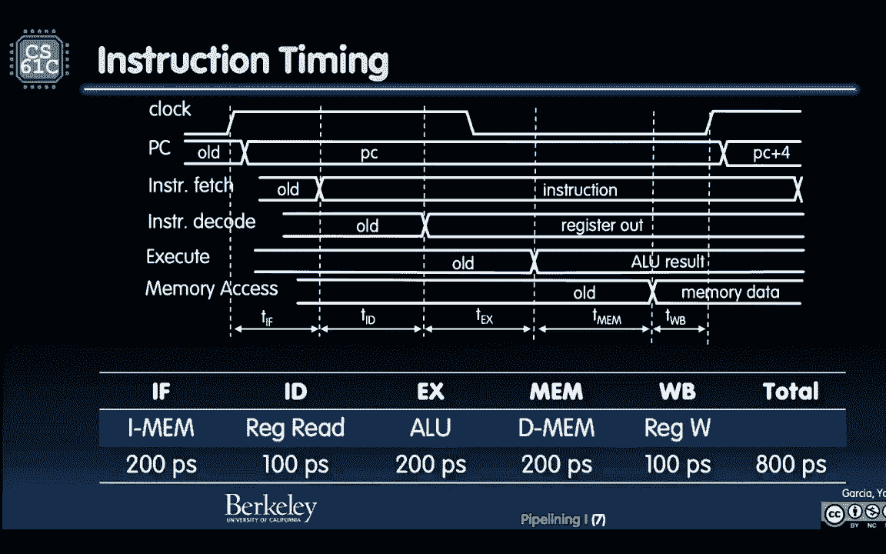
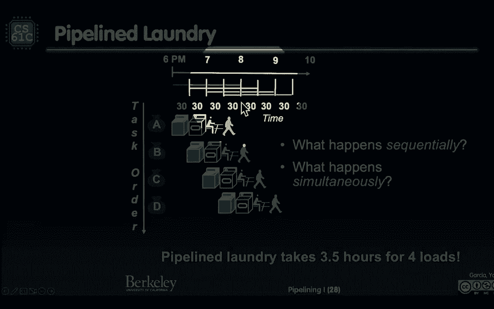
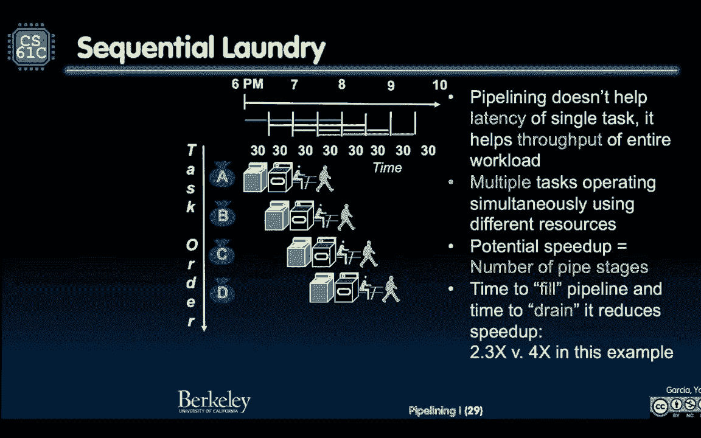

# CS 61C at UC Berkeley  - Fall 2022 - P28：Lecture 21： RISC-V 5-Stage Pipeline I - 这样好__ - BV1s7421T7XR

看起来我看到了两个。

不是四点，尽管总共有四个，这两个集合是平行的，好啦。

所以我可以数到三，所以我在看两个耶，做得太好了，每个人，还不算太糟，好啦。

新闻中的计算，量子计算是一个非常迷人的领域，它是物理学家与计算机科学家合作的混合体，包括理论计算机科学家，为了弄清楚我们能做什么量子计算，上线后，当它真的变得非常容易，呃，才能进入量子计算机。

人们在日常生活中使用它，你会看到很多事情在改变，就像你的密码不会和你可以使用的密码一样，因为量子美女擅长一次性尝试所有密码，真的很有趣，但只是为了给一些视角，他们真的还在婴儿期，看看这个数字。

这就像大数据，这是南威尔士大学的一条新的大新闻，他们在说什么量子计算处理器可以保持数据稳定，然后它决定它变得不稳定，是这样吗，就是这样，下一句是一百多倍的增长，所以这真的只是把它放在上下文中，对吧。

你的电脑保存了多年的数据，存档在磁盘和闪存上，所有这些，如果您使用的计算机没有其他非易失性存储，我们熟悉的量子计算机，当它在做的时候，这个底座正好可以支撑两毫秒，这是一件大事，比以前好一百倍。

所以只要把视角，我们不会很快在你的桌面上用量子计算机上网，但这是一个令人兴奋的一百倍的新突破，能够保存数据的性能只是为了把它放进去，女士们先生们，欢迎来到CS 61 C皮普洛，这是个新话题。

关于我提到很多次的一件事，我说这个61C太棒了，因为它的作用，是重新启动这些模块，你有一个SD模块，你有一个控制模块和一个数据路径模块，你的风险模块，五个模块可以看到所有这些模块都放在一个池中。

希望他们能互相帮助，有时他们重置SDS是完全重置，如果你在那之前把一切都搞糊涂了，让我们教你如何建造一些，你知道最后，我们显然是在建造一些对风险五有效的东西，但你基本上可以学习和、或、结和时间。

在不了解任何事情之前，这将作为一个新的模块构建，管道学习是一个新的模块，今天我们将第一次讨论表演，这确实建立在控制和数据路径上，所以我们仍然与之前的讲座有关，但这是关于我们如何让它更快。

我有点泄密了，我们在想什么，所有这些都是闲置的，五级管道的所有这些阶段，管道有一个单周期CPU，有五个阶段，我没说管道一个单周期CPU，五个阶段都闲置了，他们中的大多数人都无所事事，哎呦，我们去拿电脑。

然后它就会一直闲置，让我们从IMM中获取并解码它，然后就无所事事了，所以我们可以更有效率，这就是这节课的全部意义，理解如何使它更有效，在我们再次展示之前，你已经看过这张照片了。

今天我们要讲的是本学期的平行教学，我们要在左边的所有东西上做一个黄色的方框，今天，黄色的盒子在中间，用于并行指令，一次多条指令，这正是我们所说的，当我们看到我们的单周期CPU，我们能提高效率吗。

它将使用右边的硬件来实现它。

所以这是第一次介绍性能，这是我们第一次谈论性能，到目前为止，我们只是让我们造一台工作的机器，这就是我们所做的，让我们教你看，让我们把手指触碰的洞编成，那是一个盛大的庆祝活动，如果你们错过了。

我们必须围绕着你最终明白的事情跳舞，从上到下，整个学期的第一部分从上到下，计算机如何工作，字面上从上到下，来自cnn应用的两个电子，现在我们要说那太好了，我们得到了它的工作，但是有点慢，我们能快点吗。

这就是今天的意义。

所以我们要谈谈什么是绩效衡量和改进，这是我们的时机，之前的所有审查，没什么我们没见过的。

我们看到的一件事是800微微秒是我们的最终数字。

好的，好的，我们以前都见过，我想我上次展示过这张幻灯片。

好啦，所以八百皮秒是，那是什么意思，嗯，我们在找时机，我们看到我们的负荷词是我们的痛苦，和我们的基斯特指示，它将利用每一个循环，那是一个我们不能，你这么忙，我们走不开，你得把它锁起来，不是很好，嘿嘿。

当我们做分店的时候，我们不用MEMS，所以我们可以中途换一个钟，不不不，我们必须有一个锁定的时钟，所以800皮秒是我们的限制因素。

125G赫兹，但我们也看到了让我们回到这里。

这里没有元素，比两百多吗？看看这个。

所以理论上我们可以在5千兆赫的频率下工作。

如果我们很聪明的话，这里是1点2分5秒，因为我们必须在一个时钟周期内完成所有五个阶段，上升边缘，新的一天破晓了，哎呦，是广告，我废话废话废话废话废话，八百皮秒后，我受够了，我在眼睛的末端写了一些登记簿。

但这些元素中的每一个都是200皮秒，理论上我们可以在5G赫兹工作，那太棒了，如果我们能同时做这五件事，这意味着什么它就像一条装配线。

但我们稍后会讨论这个问题，所以这是令人兴奋的，那么，让我们首先谈谈业绩计量，让我们谈谈什么，我们正在对以前的东西做一些定义，你怎么看待表演，所以我们的单周期风险五CPU在一个点上执行指令，两个5千兆赫。

每八百秒就有一条新指令，顺便说一句，我们忽略了我们以前告诉过你的事实，啊，当你进入记忆，这比去登记处要多几百倍，我们假设调制解调器和调制解调器非常快。

我们可以在一个周期内做到这一点，我们以后再说，那是一种抽象，我们将讨论这一点，并揭示我们谈论的缓存。

但现在假设我们能做任何事，包括加载字，包括一个我们要记忆的存储词，一车一车地在商店里或半个字，我们都会假设我们可以在一个时钟周期内完成所有的事情，我们能提高性能吗，我以前见过，不那么明显是什么意思，嗯。

你的意思是，我想要一个更快的指令，这就是所谓的响应时间，所以一个工作更快，还是说总体上，我做更多的工作，单位时间内的更多工作，这就是我们通常所说的，总的来说，我们喜欢更多的工作，更多，我在做特斯拉工厂。

每天更多的车，不是一辆车的时间，我真的不在乎，你还记得我们之前，记住我用管道这个词，我们用管道，它是一个加法器和一个移位器，我们把一个，我们在中间放了一个寄存器，我们能跑得更快一点，我们看到了这一点。

因为这些延迟没有添加，我们在看关键路径，太酷了，同样的想法，我们不在乎我们可能要付出代价，计算通过加法器花了更长的时间，然后换挡器，我们不在乎，但我们现在可以跑得更快，所以我们真的希望你能有更多的工作。

这里有一个全新的东西，对了，这是全新的，我想这是两年前加的，我们只关心，让我们快点，在某个时候，人们意识到你知道什么是能量是一件大事，许多设备的能量，在最低最小的层次上，你的电话，你的手表。

如果你的表很热，你有没有把手机开着，放在口袋里，排水沟里很热，你的电池像这样，你不能在变焦呼叫超过一两个小时，太疯狂了，因此，电池寿命成为许多设备的一个真正问题，如果你说的是气候变化。

以及数据中心可能使用多少电力，我们也关心这个，所以我们意识到，出于许多原因，我们也关心能源，不只是让我们让它更快，不管那是五年前的感觉，也许更长。

但人们意识到哇，我们也很关心我们的效率，我喜欢这个类比，所以让我们和这个联系起来，所以我们有一辆赛车，你有一辆公共汽车，这两件事的通行能力是多少？我们往下看，嗯，赛车可容纳两人，这辆公共汽车能坐五十人。

但是赛车每小时200英里的速度也不是没有道理的，公共汽车大约50英里，因为有些限制，你知道你必须在火车轨道上停下来，这辆赛车的效率真的很低每加仑汽油能跑5英里，但实际上公共汽车的效率更低，每加仑两英里。

这很有趣，那么现在你更喜欢哪一个，嗯，大家赛车，什么赛车好。

这取决于你在做什么，我们将假设一次50英里的旅行，假设你去那里的方式，然后立即回去，这么说吧你知道，这是我们在做一些假的东西，但对于数字，你要开五十英里，然后立刻回去，立刻回去，在最后一张幻灯片中。

我们问，你关心一次指导的时间吗，你在乎时间吗，就像很多指示，整个部队的表现，还是你关心能量，让我们把这三件事都过一遍，与汽车类比，如果我关心一个人的旅行时间，这只是给一个人的。

我把这两样东西放在我的车库里，我有一辆赛车，我拥有一辆公共汽车，我要去50英里的地方，所以我开着我的跑车，如果我这么做了，我花了15分钟以每小时200英里的速度到达那里，如果我乘公共汽车。

我花了一个小时才到那儿，因为它的速度是每小时50英里，而这是一次50英里的旅行，好吧那么，如果我说的是，我现在得去个地方，只有我，就是这样，我要赶飞机，我要开跑车，我相信对我的朋友来说，我要开跑车。

我想按一个日期，我要开跑车，很多原因，就像现在的跑车，我们谈谈吧，现在呢，我们得找一百个人，那里有，你知道的，有一栋着火的大楼，我们得疏散他们，或者洪水之类的，我们得疏散一百人，这很严重。

一百人必须疏散多快，我能疏散一百个人吗，五十英里井，让我们来看看，如果我坐跑车，我要带一百个人，五十次旅行，七百五十分钟，如果我乘公共汽车，只是两趟，乘公共汽车的时间是120分钟，跑车750分钟，男孩。

那辆公共汽车太棒了，这就是公共汽车的目的，让很多人从A到B，有效地看看那个，现在呢，我说的是高效，我应该好好利用，我会成为我自己，效率有多高，看看这个，我的跑车每位乘客五加仑，如果每位乘客每加仑汽油。

乘客半加仑，所以实际上公共汽车是相当有效的，原因有两个，如果我在乎一个指令，砍一个人，我要那辆跑车，但如果我关心让很多人从A到B的整体表现，我当然想坐公共汽车，我甚至不在乎能量，我也乘公共汽车，好东西。

所以这里有一个类比之旅，时间是程序执行时间，一件事完成一个节目的时间，一名乘客，需要从A到B，如果我说一百个乘客的时间，这里的类比是吞吐量，圈起来的是个新词，如果你不知道它的吞吐量，工厂能生产多少。

这是事实，你能把多少人从A圈移到B圈那个名字，如果您以前没有听说过吞吐量这个词，例如，每小时处理的服务器请求数，最后，每个乘客的加仑就像效率一样，我们将称之为每次任务的能量，每块电池可以看多少部电影。

你在一架大飞机上，在那架大飞机上你能看多少部电影，在你的电池没电之前，数据中心的收费或能源账单，我们正在考虑笔记本电脑的小、大、小设备的效率，数据中心大设备。

顺便说一句，关键是，它不是在看整体力量，人家说。

啊，只看整体功率，消耗整体动力不是一个好的衡量标准，因为看下面。

低功耗CPU可能运行更长的时间来完成一项任务，总体上比速度更快的计算机消耗更多的能量，以更高的功率运行更短的时间，所以这取决于你不能只说权力，你得看看，你得看看效率，那是一件非常重要的作品，好啦。

但我可以问任何问题。

这不是很多新东西，那很难而且，如果你能记住这些，这只是到目前为止我们所使用的一些术语，所以这是我们第一次真正给你一个方程，我想我们给了你一个等式，顺便说一句，这是一个布尔代数方程。

但是当我们第一次给你一个方程，这叫铁律，铁律手段顺便一提，如果你看《权力的游戏》，铁律是说你不能不尊重上级，你被杀了，铁律就是要遵循铁律，你死定了，你知道你有，但我刚看了最近的一集，如果你要找上级谈话。

不正确，它在你的头上，就是，这就是铁律，你不能不尊重你的指挥官，所以铁律就像被锁在里面，就是这样，它是印成铁的，你不能改变，不是很好，是稻草，我可以把它吹倒，没有铁律意味着它在那里，处理器性能。

这已经存在很多年了很多年了很多年是这个方程吗，让我们把三个学期都过一遍，所以每个节目的时间，我有一个程序，那要花多少时间呢？它是三件事的函数，顺便说一句，如果你像我一样喜欢单位，我真的很喜欢看这个。

因为你可以划掉，我如何获得每个节目的时间，每个程序的井指示。

我要击中的指令总数，我的档案有多大，是个大文件吗，可执行文件是一个小文件，每条指令有多少时钟周期，您以前没有听说过，我们称这个为cpi或每条指令的循环，有点奇怪。

如果你没有想过，我会在一秒钟和每个周期的时间里讨论这个问题，我们的时钟显示。

所以指令取消循环取消，我每个节目都有时间。

看看结果如何，所以想想那些单位，我们会，我们现在来谈谈这三个术语，每条指令的循环叫做cpi，或者平均有多少个时钟周期，这其实是一个平均值，在所有的指令上。

好啦，所以每个程序的第一条指令，你知道你会，你亲手把c编成了风险五，有时候会浮肿，有时很短，你可以考虑一下，就是这么回事，它是由，你想做什么，你的算法是什么，你在这方面有多聪明。

是这个还是现在突然六十一，A和B开始考虑，这就像运行时间，对呀，你要走的步数，现在呢，我们关心的，我们以前不在乎，因为我们做了婴儿的小问题，我们现在知道我们关心它，因为我们需要这东西越快越好。

你想要一个非常高效的算法，所以你要做更多的步骤，显而易见，您的编程语言，取决于您的编程语言，可能会影响，可能你的算法，也许一种编程语言，有风险吗，你实际上有更多更小的步骤，或者有一个sik。

复杂指令集计算机，在那里你有一个指令，他们会做很多事情，所以这也取决于你的编程语言依赖于什么，如果您的编译器是，以及编译器上的设置，您可以有优化设置，冲啊冲啊冲啊二三，以下是收紧代码的优化设置。

最后是ISA的总体情况。

这对人们来说有点难，这被称为CPI或每条指令的时钟周期，这里最重要的部分是括号，平均来说，又不是说，因为我有无数不同的指令，我有个广告，我有货，我开了个店，我有树枝，平均是多少。

每条指令的时钟周期当然是由你的ISA决定的，你的ISA是你如何定义的。

你的那个语言是什么，这很重要，这取决于处理器实现是什么。

也可能是微架构，你是怎么造出那个处理器来让它工作的。

例如，我们正在努力建立我们的单一循环，现在为一个cpi设计的cpu单秒风险五。

有时你有一个非常我提到的。

有一个风险模型，风险模型是每个人的G都很快，每条指令都有一个时钟周期，型号CC，你可以想象一个叫做字符串复制的风险五指令，你可以想象，不会是冒险风格的事情，这将是一件非常复杂的事情，有可能是。

可能是其他的微码，做这件事，当然不需要，如果我有一根长长的绳子，它当然不能对一个长字符串只接受一个指令，把它从A复制到B，顺便说一句，他们以前有的六件事，是什么，他们以前告诉你的那个是什么。

他们说就像多项式乘法什么的，一些复杂的指令做了所有这些事情，但这是一条很容易写的指令，编译器，只要说，哦，马球明矾，一个多项式多项式乘法就完成了，但像这样的风险代码应该是20行或30行。

但它变成了C代码的一行，所以取决于你，你如何定义你的ISA和你拥有什么，但通常字符串复制是一个库例程，每条指令需要更多的时钟周期，去计算那个超标量，这是一个你没见过的新词，超标量意味着它几乎是一对一的。

这里意味着每个指令发生的事情不仅仅是一个时钟周期，你基本上可以在一个时钟周期内做平行的事情，这就是我们今天要讨论的，我们也称之为超级标量，所以接下来的几节课我们会讨论这个，其中cpi小于1，哇塞。

那一定会很棒的。

让我们做吧，顺便说一句，最后最简单的是每个周期的时间，那是你的钟，那是你的水晶，你的石英水晶，振荡。

你应该参加一些课程来学习它是如何工作的，很酷，这取决于。

当然逻辑门的关键路径，我们谈过了，很多关键路径，在它变成125G赫兹之前你能运行多快，我们的技术随着技术的变小，作为您的进程大小，工艺尺寸是两条线之间的距离，如果你把它放大，这里有一条信号线。

这是另一条信号线，芯片上的距离是多少，这就是所谓的进程大小，数字每两年下降一次，真是难以置信，从5纳米到现在有多小，它们现在是5纳米、2纳米和3纳米，到达那个水平板的不可思议的工程。

世界上最好的工程师是美国宇航局的人，做着令人惊奇的事，顺便说一下，小行星撞击成功，你以前见过这个吗，我对此很兴奋，能够偏转来到地球的小行星，他们是了不起的工程师，望远镜太神奇了，做计算机架构的工程师。

建造那些，极低水平芯片，他们所做的非常不可思议的事情让他们变得更紧，把摩尔定律从，尽我们所能往上走，最后是电力预算，这就是你到这里的地方，正如我们所说的，哇塞，这是一个移动设备，我可能需要曲柄回来。

让时光倒流，不是曲柄，这样我就能跑得更快，把它调回来，可以有更长的电池寿命，有一个更凉爽的系统，等等，你的电力预算是多少？较低的电压降低了速度，这很有趣，较低的电压降低了速度，你知道的。

电压与速度有什么关系，有一些，有一些爱，这就是双面人会进来的地方，并能够有几堂关于这一点的讲座，但那其实很有趣，事实上电压会影响速度。

这是我们在61年的时候经常做的事情，这节课教了15遍，我们以前有，和一台Mac电脑，当时IBM的笔记本电脑运行得非常快，1千兆赫，1千兆赫和Mac，我的旧婴儿Mac笔记本电脑以800兆赫的速度运行。

所以ibm是更快的笔记本电脑，这和我们所做的很相似，我们会说准备好了，我们会在一个大文件上显示两个屏幕的Photoshop模糊，全部加载到内存中，去记住Mac的运行频率是800兆赫。

所以它应该会输给一台千兆赫的机器。

它会压碎，它将压垮IBM的笔记本电脑，看着那个啊啊啊啊苹果太有趣了。

但关键是让我们看看为什么这会发生得很好。

两个进程B的指令数或编译不太好，我们说过的那些事。

更多指令点击处理器B，所以它已经输了。

你有更多的事情要做平均cpi，看看这个平均cpi 2 5比1。

那真的很有趣，也许这是件很恶心的事，所以每一个指令我都给了你一些不同的东西，我花了更长的时间，这很难想象，但实际上每条指令需要更多的时钟周期，对呀，在你完成一件事之前，一个指令向上两次半。

时钟速度更慢，所以想象Bub是一个较慢的时钟速率。

这就是我之前提出的论点，更多的指示。

但是CPI，一个的乘积，前两个数字是零点。

七，右边的机器五毫秒，你以为他会失去更多的指示，较慢的时钟速率，但CPI是获胜的因素，你最终会有一个，有一整段视频是关于这个的，真的很好玩，我们实际上可以让我们让我们表明一个观点，至少它是一个参考。

这期视频，它叫我，兆赫神话，苹果熄灭了，就像真的很小，三百二十乘二百四十谈论这个，我们要播放视频，我们不再做了，我们应该参考一下，虽然，兆赫史密斯谈论为什么这会赢，为什么你会知道，字面上生活在61 C。

我们会展示这个演示，我们说，就像，怎么可能认为跑得更慢，会赢，这张幻灯片解释了为什么它赢了，都是关于CPI的，挺酷的，所以按，或者B更快，尽管执行了更多的指令，并且有更低的，比如什么。

这怎么可能，CPI是神奇的东西就是那么整洁，让我们来谈谈CMOS中的效率。

顺便说一句，我之前提到过，他们能够冷却一些早期的芯片，早期的芯片，我想在某个时候有400瓦，只是一块芯片，你可以煎一个鸡蛋，功率密度太疯狂了，所以你曾经，大家都知道，你不能只拥有电子产品，免费船长。

不是免费的，午餐，就在我吃这些的时候，呃，晶体管从1翻转到零，零到一，即使拿着一个1或拿着一个零，这个功率损失，天气很热，事情变热了，为什么那口井。

有两个原因，这是我们经典转换器的图片，我们已经看到，这是一幅稍微知道那个形状意味着什么的画。

两条平行线，正如你所看到的，在W班之前，我想十六岁，你知道这件事，我希望电容器，好啦，那是电容器，电容器是不喜欢电压变化的东西，他们喜欢保持电压变化，你可以有一个很好的电容器，可以保持一段时间的电荷。

只是伟大的电容器想要对抗电压的变化，他们不喜欢，所以他们很擅长这个，意思是他们会守住它，如果你把它带到一定的价值，它不想放弃超过1，如果你拿着它一个，它会试着帮你拿一个，那帮混蛋真厉害。

所以电容器不喜欢电压变化，我们在哪里失去动力。

我们因漏电而失去电力，如果我有一辆车，不要改变它，没有人改变任何价值观，就拿着吧，只是漏电，就像电阻器，只有热力和动力，只是漏到地上，那很糟糕，这是我们这里的逆变器，我们看过图纸了，此外。

给这些电容器充电以实际改变也是有成本的，我告诉过你电容器正在努力改变，所以我会选1到0或者0到1，它不喜欢那样，他们想拿着他们是什么，这就是电容器所擅长的。

所以当我这样做的时候，你失去动力了，损失能量到电容次数。

电压平方，而事实证明，这是，这滑梯不是我做的。

我继承了幻灯片，他们告诉我们，其中70%实际上是在，充放电的电容器，关于，百分之七十的能量都在那里，百分之三十到泄漏，所以我想减少这个。

记住这一点，所以这实际上是第二个方程，每个程序的第二方程能量，这有多酷，谈能量，现在又来了，你看看你，看看我们的部队，每条指令的能量，像指令取消给我每个程序的能量，这真的很酷。

现在它告诉我现在网上有什么，每条指令的能量。

比例是这里与CV平方的比例符号。

所以现在我想减少我每个程序的能量，我可以减少之前的指示吗，也许让它更有效率，使用编译器，尽可能地优化它，这是我们谈论的第一件事，更少的指示，做一个更好的算法，做点聪明的事，但我真的能做什么。

这取决于每个任务，但总的来说，对于系统来说，我可以影响每个指令的能量，所以电容取决于很多技术，核心数，你有很多东西，在简历的平方里，另一个是v的平方，哦，我喜欢平方项，你碰那个，你得下降一个平方。

我们喜欢这样，那是电源电压，就像我说的，从字面上看，当我三十岁的时候坐在你的座位上，五年前，我们有一个五伏的，TTL是五个，每张幻灯片，我给你看我的幻灯片，一个说，合理的是五伏特，就是这样。

我会测量五伏，有五伏特，那很好，我拿万用表，现在是五伏特，我们说的是在某个时候，他们说现在我们搬到三个，哦三，现在很有趣，我们在一个，比那个少，都是因为这个，所以我们在谈论的事情不是，收费高达五百元。

我的容量必须达到五伏才能给电容器充电不，只剩下一个了，也许其中的一小部分，太不可思议了，因为它不是，它不是，实际相等意味着这就是规则，显然其他一切都排除在外，比例显示，就像里面有一些常数，我们在擦血。

我们身后的一些细节，我们只是说大致成比例，当它线性生长时，我们也将线性增长，否，不不，有些常量我们不关心好问题，谢谢你，是呀，当我们处理密码的时候，是啊，是啊，就像所有的肯定，你在解决过滤问题吗，是呀。

当你做分析的时候，你也在这么做，是的，是的，这里，正确，当你真的爱，当你生活在更大的世界里，你远远超出了这个水平，你的数字摘要水平，抽象之美，你生活在数字世界里，我们不在乎电压和功率。

没有什么可以告诉你电力使用情况，那不是什么，上面有很多东西，在很高的水平上漂浮，东西是免费的，我可以冲过去，没有力量，没有暖气，就是这里，我们在谈论现实，我们在说你的苹果，你的情报，你在建造真正的电路。

你关心热量，你在乎权力，你关心能量，所有这些事情，仅仅做原理图的最大水平，你在做1和0，所以我想降低电容和电压，减少每项任务的精力，就是这个意思。

好啦，有点，我在为他们的所作所为陷害你，所以说，这就是我们现在要做的，当我们考虑下一代处理器时，拥有下一代意味着功能大小，这个功能大小越来越小，队伍越来越小，这样电容就会下降，让我们也降低电压。

我们控制了电压，让我们降低一个较小的电压，我们不必绘制图表，你不必在相同的电压下供电。

所以让我们在那里做一点改变，每次制造下一代处理器都会有很大的不同。

你可以在能源消耗方面得到巨大的差异。

这是伟大的，通常你甚至会降低时钟速率，看看现在的高端电脑，现在你买的高端电脑，比如说苹果，你会说你知道，去喜欢的互联网档案网站，你可以看到老苹果，我们两千年后去买台电脑吧，是它过去的成本。

它看起来像什么，你可以看到时钟的频率在上升，现在他们真的要下去了，真的很了不起，或稳或降，就像在过去的十年里，他们没有改变，我有张幻灯片给你看，但这很有趣，所以再一次，提高能源效率的关键。

多亏了摩尔定律，也就是说越来越多的晶体管芯片，不同特征大小，包装得越来越小，更小和降低的电源电压，它是一个平方项。

我们非常乐意，这个是大的，我想确保把时间花在，这个问题我想保留一会儿，因为我会在这张照片上花很多时间，它讲述了一个完整的故事，它的华丽是因为它是，这张照片太美了，我是一个超级可视化迷。

我真的很喜欢美丽的景象，这是一个美丽的可视化，截至2010年的原始数据，由这些出色的研究人员收集和绘制，他们和我们一起分享这项工作，我们现在可以和你分享。

有五条曲线，蓝色，黄色。

红色，有点青色和白色，单位低于曲线，单位在这边。

这只是十的幂，这就是为什么它是美丽的，你可以有五条不同的曲线，相对的幂为十，都在同一条曲线上，他们做这件事的方式，它们并不重叠，真的非常好，好啦，我给你讲个故事，那么摩尔定律是关于什么的呢。

摩尔定律说过程性能的指数增长是对是错，我喜欢那样陷害别人，那是不对的，摩尔定律说，从七十年代开始，这是一个指数级的增长，每两年前两次，然后每18个月翻一番，你会看到曲线上有一个小弯曲。

在每个集成电路的晶体管数的某一点上。

非性能也呈指数级增长，但它是关于每个集成电路的晶体管，那是最上面的一个。

注意摩尔定律还在继续，蓝色持续，大约每18个月翻一番，所以摩尔定律仍然存在，就目前而言，这里发生了什么。

故事的下一部分是典型的权力，所以这就是很小的力量。

这是瓦特对吧，所以我们在瓦特，十比一等于几十瓦，在某个时候，这个数字开始波动得太高，十的平方就像你有一个400瓦的芯片。

我记得他们卖PlayStation 3的时候有一件大事，我第一次看到400瓦的CPU，就像，就像游戏机里的四个灯泡，那太好了，只是在玩游戏，想象一下给你的父母留下四盏灯，比如关掉你的灯，是啊，是啊。

只开了四盏灯，当你玩PlayStation 3中的任何游戏时，它真的是一个非常热的芯片，必须冷却它，是他摸了摸后背，风扇真的从后面泵出了很多热量，这是一件大事，所以他们没能冷却那些薯片。

功率密度是另一个曲线滑动，我没有别的了，他们无法冷却它，功率密度接近，火箭发动机的，功率密度每米的平方功率，无法冷却。

频率在上升，所以记得所有的频率都在上升，往上走，发生了什么事，在2005年发生了翻天覆地的变化，巨变是，他们不能再冷却了，所以猜猜他们停止让他们更快。

看那条曲线，就是这些，这些是实际芯片的数据点，这不仅仅是我画的曲线，这些是真正的设备，他们不再恶作剧了，还记得我长大的时候吗，你只是每年都把它，哦快看，今年这些电脑有多快，可能是500兆赫，千兆赫。

一点五二，我记得每一声，我们就像在庆祝击掌，我们作为工程师是多么神奇，但是我们不能再给他们降温了，猜猜当你逐渐减少频率时会发生什么。

会发生什么，这是您的单线程性能。

三分之一的性能表明没有人知道如何编程并行机，所以我们只是编写具有单线程代码的代码，你没有，你不能分，你不知道，你知道你的C代码一次只做一件事，又不是说，我在做很多事情，一次只做一件事。

所有单线程性能应用程序发生了什么。

通过这个叫做Spec int的东西来衡量，这只是一个，它是我们用来衡量事物有多快的指标。

你能解国际象棋吗，你知道他们有几个不同的基准，看它变平了。

我们就像，你还记得你是怎么，你知道数据越来越大，我们现在在视频和YouTube上有照片，数据的追求更多，数据是永恒的，但突然间你告诉我每台电脑，如果它只是一个单线程应用程序，在单线程硬件中是扁平的。

我们该怎么处理，对数据的渴望和对更强大的渴望，更好的电子游戏对吧，每一个电子游戏，我需要更多的像素和抱歉平坦，所以这是一个曲线影响另一条曲线影响另一条曲线的故事。

所以这里才这么有钱，那么他们在2005年做了什么呢，核心的数量从零或一个。

这是一个两个继续增长。

现在你有了双核，双核，这是二合一CPU，两个不同的计算单元，好啦，当我们进入这个更多的两个时，我们会给你看一些照片，现在是四个了，现在有八个了，顺便说一句，我们总是这样。

有gpus图形处理单元来处理屏幕上的像素，我们一直说，但它们是分开的，我们说的是CPU，现在呢，有四八个，什么是56英特尔有一个56核心的机器，现在你可以买到高端的苹果是56核，记得吗。

我想是两个八核的五六个，逻辑课程，这个我们以后再说，也许是28个核心，我的意思是就是这样，那是2005年的巨变，是人们平行。

不是因为这是个机会，哦，一片新的更绿的田野，因为我们被困住了，我们在墙边，我们在权力，所有，我们不能再冷却了，所以我的观点是这是对，不是为了庆祝，但作为对这堵墙的反应，它被锁住了，山崩没有夺走我的路。

我不能再进步了，我走这边，这就是为什么，你看到了什么，呃，第四条曲线在这里，即并行性能持续增长，这是这里缺失的曲线，实际上我们有并行性能继续，但我想我已经解释了所有这些片段，很酷。

这是个精彩的故事，我的压缩机48年趋势，每个点，每个数据点都是一个实际的设备，是呀，哦我的天啊，问题是人们是否一直在研究并行处理，是呀，人们一直在做并行处理像cr cray在1990年。

当我还是个本科生的时候，克雷，是这种大的弧形还是大的装置，就像这件家具，是啊，是啊，他们已经做并行编程很长时间了，是啊，是啊，丹尼尔·爱丽丝，我想是渴望这个名字，就像，哎呦，我想我不明白，I，啊。

那很有趣，所以问题是为什么，摩尔定律为何如此重要，嗯，我认为摩尔定律不是最后的东西，但我越想有表现，人们想要拥有，你知道的，我是，我是芯片制造商，我不能只做和去年一样的薯片，别有一番风味，好像没有。

你得快点，你只需要成长，你有一个，我们都看到了，就像我说的，自七十年代以来，对更多数据的渴望一直存在，告诉我，告诉我对更多数据的渴望没有增加的一年，今年比去年四十八年来，所以你得用某种方式去做。

我们所做的是，这条曲线，当你转弯的时候，这个钟快一点，你有摩尔定律，允许更多的CPU，更多CPU设计，芯片上的更多晶体管，允许你用它做更多的事情，所以我们的藏匿处越来越大。

我们的CPU有16位宽的计算机到32到64，才能处理好。

我们有很多事情可以谈，能够使一个过程或更快，但这基本上是用户对拥有更快的计算机的渴望，所以摩尔定律帮助了我们，这和摩尔定律不一样，在一天结束的时候，你想要更快的产品，这就是它不太重要的地方。

让我们把最高的数字，不管是什么原因。

让我继续走，因为我还有几张幻灯片，我想去，所以这个想法在1974年被称为伯纳德缩放，罗伯特丹纳德观察到功率密度，对于给定的硅面积，这里的功率密度量保持不变，当晶体管的尺寸缩小时，所以请记住，过渡变小了。

工艺规模越来越小，总体情况，迪斯变大了，但后来我就像，你知道的，这件事真的很有趣，功率密度不变，记得那天有多热吗，我怎么能冷静，我可以称之为密度吗？这意味着她的米的平方，我可以，我可以得到，我可以。

但我冷却它，我可以，因为密度是恒定的，我可以做我以前做过的同样的事情，但是首先，这张幻灯片上的第一个字是结束，它于2005年结束，这就是发生了什么你说，2005年发生了什么，我们去了Perl。

那是一种反应，它的来源是什么，我们不能我们看到丹纳德说了我声称的事情，从七十四年开始，力量，密度开始起飞，我们不能用传统的方法冷却它们，哎呦，让我们把不起作用的水冷却一下，让我们把不起作用的油冷却一下。

我们不能保持我们的东西凉爽，就是这样，这就是不开火的原因，在那里一切都坏了，所以近几年，工业一直未能恢复，一直未能降低供电电压，就像进一步降低它意味着增加泄漏功率一样，晶体管开关不能完全关闭的地方。

更像是一个调光开关而不是打开，你知道的，你希望它在那里被称为，但是为什么我们有1和0而不是0，一二，为什么是二进制和三进制，因为晶体管是双稳态的，他们很稳定，锁定在1，它们稳定地锁定在0和变焦，好啦。

现在它就会变成1，它想要么是1要么是0，就是这样，这就是这些晶体管的美妙之处，问题是当我们不断降低电源电压时，你得到的转换开关不会卡到零或一，他们有点去，他们被困在中间，那真的很糟糕，伙计们。

那真的就像，也许那真的很糟糕，还有转换的大小，因此电容不会像以前那样收缩，代代相传，你真的有种感觉，你见过这个吗，他们其实，有一个平版印刷，他们印刷，现在你有了一张二维的照片，晶体管极限为。

他们意识到他们现在需要堆叠它们，你怎么冷却它，这是统计数据，所以所有这些，对人们来说，这是一个很好的机会，谁想跟随这个领域去思考，那意味着什么呢？多层堆叠晶体管，把它打印出来，就像那些很酷的东西。

权力变得越来越令人担忧，我说过力量墙，如果我是幂律，我只是告诉你一些历史，所以这是能量，这是另一个图，顺便说一句，这是第三个方程，这是图表，方程式，是第三个等式，每秒任务等于功率。

这是一个有趣的焦耳每秒乘以能源效率的任务，每焦耳圆。

这个我们说的是效率力量，我们将来能做什么，能源效率说明是给Jeed的，是功率约束系统所有计算设备中的关键指标，例如，一个只能在200兆瓦内工作的数据中心。

你需要更好的能源效率才能在相同的功率下获得更多的性能，对于能量受限系统，所以瓶颈是能量是一种力量，对于功率受限系统，那可能是一个数据中心，对于能量约束系统，就像电话。

你需要更好的能源效率来促进延长和促进更好的电池寿命，看这个上面的方程，让我们看看我们可以花一个小时在这个顶级方程上，嗯，意思是如果我降低我的力量，我要降低我的表现，意思是如果我增加我的力量。

我可能是一个更好的表演，那太好了，所以如果我只关心性能，就这样，该死的气候变化，让我们加大马力，加大马力，谁在乎能源效率对吧。

只要加大我的力量，我去看表演，但这种力量是一个关键的关键因素，能源效率真的很重要，无论是宏观层面，在数据中心层面和微观层面，在笔记本电脑、手机或手表级别，好吧，我们开始新的话题。

十分钟，让我们做这个管道，去洗衣服，希望这是一个与人们相关的类比，谁在宿舍里，我记得当我还是个研究生的时候，我住在这里的一所国民住宅里，我们共用一套衣服，这一切都与我非常相关。

当我住在一个共享的生活空间里，Avi，博拉，卡罗琳和丹每人有一堆衣服要洗，干折收起，所以洗衣机，你知道那个烘干机，你知道当你做完的时候你得把它折叠起来，你得把它收起来，你有莉安，去把它收起来。

他们每个人都需要三十分钟，洗衣机烘干机折叠区和收起，需要三十分钟，每个人都有一点类比，图标的小图片，所以让我们按顺序做好这件事。

五四人先和abcd，这是我们第一次，我起床了，几乎就像在Covid，你说的地方，一次只能有一个人在房间里，我对Covid的类比，于是亚比走进去，在我们身后锁上了门。

所以现在我控制自助洗衣店阿比负责他们的四件衣服，单循环CPU然后宝拉起来，好啦，非常感谢，击掌作为出路，然后上船洗手，好吧，然后博拉进来，把他们所有的衣服都洗了，需要两个小时，等等卡罗琳等等丹。

四人总时间，四批货算上八个小时，那是在Covid期间，只有一个人可以同时拥有四样东西，你看到和我们的管道有联系吗，单周期CPU数据路径，如果没有，在接下来的几张幻灯片中就会很明显，那是什么。

每个人都是怎么做的，顺便说一下，然后Covid就过去了，现在你可以让更多的人在自助洗衣店，你通常是怎么把它做好的，我们有相同的想法，阿维进来了，他们的，但是，我必须要等两个小时才能开始吗？

还是宝拉必须等几个小时才能开始，没有人能忍受开始，洗衣机一脱就脱，在上面跳来跳去，卡罗琳说洗衣的那一刻是免费的，我跳到他们身上，丹说只要洗衣机空出来，我在跳那个，所以现在看看这张美丽的照片。

这个奇妙的类比，好啦，作为老师的类比有时并不完美，然后类比也是如此，还是关于真正的作品，所以这很令人困惑，如果类比与这里的真实情况不完全匹配，类比百分之百匹配，就像我们所说的手套。

所以我们会花更多的时间在这个类比上，因为它很美，所以有几件事，管道洗衣，记得八个小时后，三个半小时装了四批货，那太棒了，我们喜欢这个，这就是世界上每个人洗衣服的方式，所以希望我和这个有联系。

对于一个家庭的房子也是如此，如果你在Covid-19期间住在家里，你知道你父母和你都有你要洗的衣服，你在家里也这么做，你又不是非得住在宿舍里才能做到这一点，那么这里发生了什么，事情是这样的。

按顺序发生的事情，我们都做同样的事，顺序不变，我经历了四个阶段，我洗的衣服有四个阶段，我按顺序检查了四个，什么都不会改变，在那个房间里，如果你和某人在一起，你们都在互相走动，这就是发生的事情。

同时发生了什么，看这个时间在七点三十分到八点之间，欠下的四个阶段都在使用。

把他的东西放进洗衣机，卡罗琳正在晾晒她的东西，鲍里斯在叠东西。

阿维正在收拾他的东西，所以及时上上下下地吃一片，这就是同时发生的事情，即使顺序不变，你只是把它们堆叠起来，以一种美丽的方式重叠起来。

让我们谈谈一个生词把这个词圈起来。

如果你还没有看到潜伏期，一项任务的时间，所以一个新词，延迟流水线对延迟没有帮助，事实上，这是期末考试的问题，真假，驾驶对潜伏期有帮助吗，一个人洗衣服的时间是在两个小时前，已经两个小时了，事实上。

它实际上可能比它会慢，如果只有我，我马上给你看，但它确实有助于第二部分，哪个是用公共汽车疏散的人，吞吐量，洗衣房可以帮助洗衣的总量，那个洗衣房的吞吐量比连续阶段高得多，为什么？

因为有多个任务同时使用不同的资源，潜在的加速是多少，嗯，其实呢，如果你看看这个，有四个不同的车站阶段，潜在的加速是4，在一个完美的世界里，应该是四个，因为所有的东西都在外面跑。

四种不同的东西都在那里工作，那太好了，为什么这之前没有潜在的加速，连续八个小时是八个小时，跑四等于跑二，这不是两个钟头吗？这花了三个半小时，为什么，因为有些时候你没有充分发挥效率。

在四个都被使用的地方及时切一片，只有光标所在的位置才是使用所有四个光标的唯一时间片，当同时使用三样东西时，效率就低了，更不用说当两件事，当一件事发生的时候就更不用说了，那叫做填满管道和排干管道的时候。

其实呢，你可以想象一所大学或一个高尔夫球场，有很多管道的类比，如果你在那天打高尔夫球，一天开始了，每个人都要从一个完整的开始，我们就说好了，从2号洞到18号洞是空的，有一大堆车准备打高尔夫球。

但他们不能因为他们要经历一个，因为这是一条管道，所以每个人都玩一个，然后下一个洞，有一个和两个，还有一二三，因为那是填满高尔夫管道的，你可以想象一所大学，你见过默西瓦斯，大学，第一年。

你看他们把新生管道，第二年，他们招收了大一和大二的学生，我不知道这是否真的发生过，但这是他们应该做的，首先使用知识，大三学生，第一批，大三学生，现在你已经有四年的人经历了，突突地通过了，UCR说决定。

或者你们中的一些人看到不用它们，但决定取消，我们要关闭它，就像一个教职员工在培养研究生，他们说我要退休了，你现在必须，它的结局是什么，你得等等，就像高尔夫球场一样，现在呢，没有人，天快黑了。

没有人开始玩，上一个打一号洞的人，当他们抓住第二个，没有人是完整的。

在某个时候，在某个时候没有人，这里没有人在洗。

没有洗衣机，所以洗衣机是闲置的，没有人是完整的，没有新生明白吗，你要关闭大学，你在冲洗输油管，然后第二年就没有人在一年级和二年级了。

在某个时候，这里没有人在做，我的光标里没有人，就在这里，没有人在做。

是啊，是啊，就在那里，没有洗衣机或烘干机，同样的想法，你在冲洗输油管，这就是效率低下，所以我们没有快四倍的原因，八除以四等于二，我们得了三分，第五是因为我们在灌水和排水。

我们的效率不是一直都很高，所以现在让我们做一个新的东西，我有我有20秒，我猜点击器会转到下一次，一台新洗衣机需要二十分钟，一个新的藏匿者需要20分钟，管井提速多快，如果你仔细看，我要在前面扣十分钟。

在后面扣十分钟，但中间还是要三十岁，这是一个有趣的问题，我不能就因为这只是看。

这么说吧，这个小守望者效率高一点，而且这个藏匿更有效率一点。

但我还得等其他阶段，效率不如，这两个三十岁。

管道的速度，就像，这里十分钟，那里十分钟，就是这样，一点也不多，所以管道费率，你能以多快的速度进入下一个阶段，受限于最慢的管道阶段，管道级长度的不平衡降低了速度。

这是这里的关键，好啦，我会点击这个，我会说结论，我们也许可以推迟到下节课开始的时候，如果你想要好的结论指令时间，因为我们在看指令计时，指令定时是复杂度的函数，建筑技术流水线增加频率，我们喜欢每秒的指令。

但并不减少完成一条指令的时间，响应时间，焦耳每秒和每次任务的能量，这只是为另外两堂关于流水线的讲座做准备，丽莎会在周五和周一送，太感谢你了，伙计们呜呜叫。

