# CS 61C at UC Berkeley  - Fall 2022 - P29：Lecture 22： RISC-V 5-Stage Pipeline II,Hazards - 这样好__ - BV1s7421T7XR

他比平时吃得早，好吧，早上十点零九点在这种情况下，还有，我们有期中考试，这可能就是为什么它很孤独，但我真的很感谢你们能来，到目前为止，你们中有多少人参加了期中考试，好啦，所以百分之八十。

有多少人还没有参加期中考试？好啦，凉凉的凉凉的，是啊，是啊，所以这就像面对面的部分，似乎有70%的人服用过，那很酷，嗯，它似乎运行得很好，我们有一些后勤，也许我会点击进入，嗯，所以就在这里。

我要把它保存到更新的幻灯片上，但这只是几分钟前被炮轰的一个公告。

一小时前，差不多吧，关于面对面的考试，只是一些提醒，所以如果你呃，你绝对可以自带电脑，但是我们也有实验室电脑，有些不起作用，但是我们正在努力，我是说，现在我们对哪些有效有了很好的了解，所以呃。

如果你的电脑有问题，就来吧，然后我们会把你安排在实验室的电脑上，嗯，其他注意事项这里有一个带回家的考试，您应该已经开始收到GitHub回购电子邮件，如果你还没有，那很好，就像在，我们有点像，你知道的。

把这些发邮件出去需要一段时间，所以你会慢慢地得到所有的信息，因为明天早上考试就要开始了，所以你会收到这些邀请，然后他们可能有任何东西，我也不是完全没事，作为一般提醒，你可以在上面看到。

我有喜欢的讨论设置为私人讨论线程，只有这样才能贯穿始终，嗯，周日，可能到周一也是，所以不要讨论考试，如果你有任何紧急情况，或者如果你有任何问题，请把它们贴在，Ed，我们也一直在慢慢地回答他们。

所以考虑到这一点，所以再一次。

祝你考试顺利，如果你还没有，呃，如果你还没开始，对于那些继续考试并带回家的人，呃，祝你带回家的部分好运，一旦它下次出来，呃明天，但今天我们正在推进管道的想法，丹说过管道，星期三结束时。

特别是你们还记得你们在处理洗衣的例子，是啊，是啊，我们都记得洗衣的例子，今天我们再复习一下洗衣房的例子。

但我也想提醒你一下风险五，我们一周前做的那个数据路径，因为我认为只要记住那个巨大的图表以及它是如何工作的就会很有用。

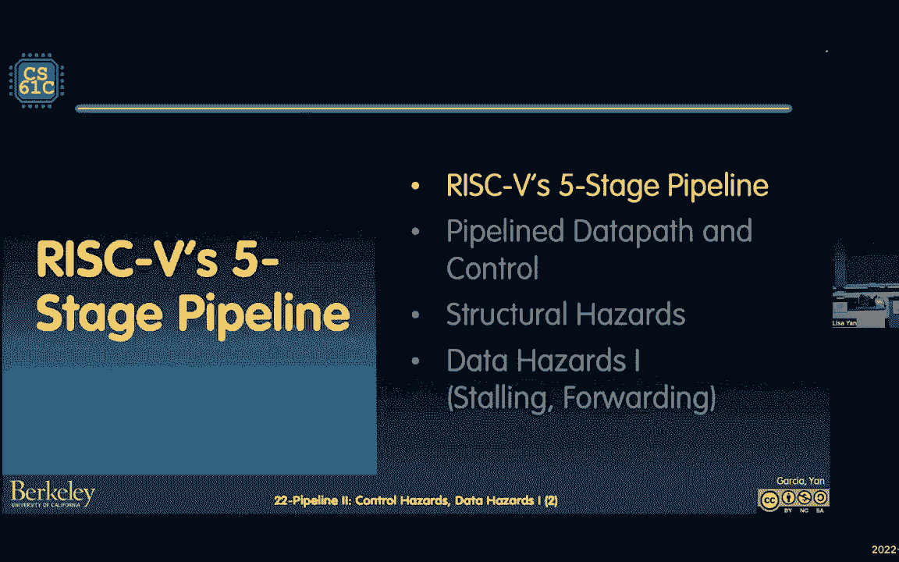

我们今天要做的一件事是，我们将参考这些阶段，我们今天要做这个，星期一，我们将用它们的两三个字母缩写来称呼这些阶段，好的，好的，所以从左边开始，我们有指令提取，第二部分我们称之为指令解码ID。

但实际上你能想到的是，因为这是寄存器访问，中间的寄存器文件访问，这里我们有ex，代表执行，那是ALU做的大部分工作，然后我们有mem或m a，你可能把它看作是，MEM含义数据，内存访问，比如读或写。

在最后，我们回到了，所以这又回到了寄存器，比方说更新寄存器文件等等。

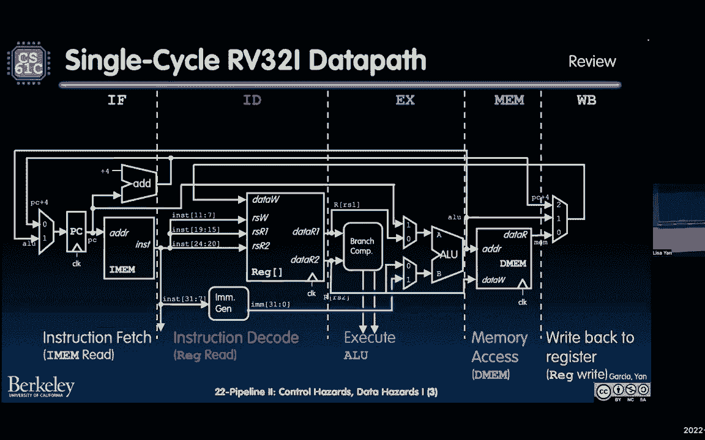

现在以此类推，我知道，右后卫有时会让人有点困惑，右后卫是什么，我通常在这里强调一下，教科书是这样写的，你可能会有不同的看法，取决于谁是谁在教它，通常右后卫是从内存输出，包括盒子。

也许所有的盒子和东西通过设置，注册文件的时间，然后我们将在一次中看到什么，我们稍微谈谈管道，这也包括实际reg文件本身的编写，但在我们得到真正的管道版本之前，我们不会到达那里，但这是单周期的。

这就像如果我们有一个单一的时钟周期，然后右后卫就会包括穆斯和所有这些，因为在下一个时钟周期，那时真正的写作就会发生在时钟边缘上升的事情上。

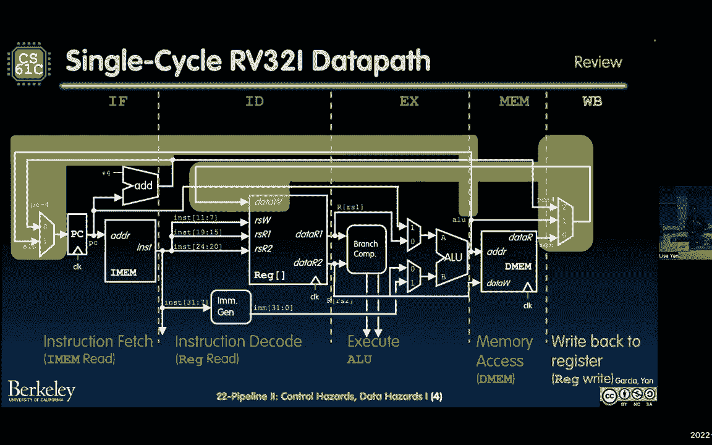

我们会看到轻微的侵犯，一旦我们进入输油管，但是因为这张图很像，里面有很多电线，我们将使用一个简化，也就是，你知道的，上次Dan给你上课的时候，就像在星期一，我认为这些阶段的时间，我们将代表。

阶段的时间是由花费最多时间的元素主导的，好啦，所以这是有道理的，有组合逻辑门，有多路复用器，所有这些东西，但也有像我，这个巨大的内存读取访问是组合逻辑块，这是主导i f阶段的大事，嗯我，有一个注册文件。

有一个巨大的阿卢·梅姆，有数据存储器DM，然后右背WB，还有注册文件，好啦，所以你可以看到，好像有点阴影，我们将进一步讨论这个问题，但有一件事我真的想指出的是，寄存器文件在这里显示了两次。

作为两个不同的符号。

就像这两个符号看起来非常相似，其中一个有注册文件，右边有阴影部分。

这就是我们所说的“读取寄存器文件”。

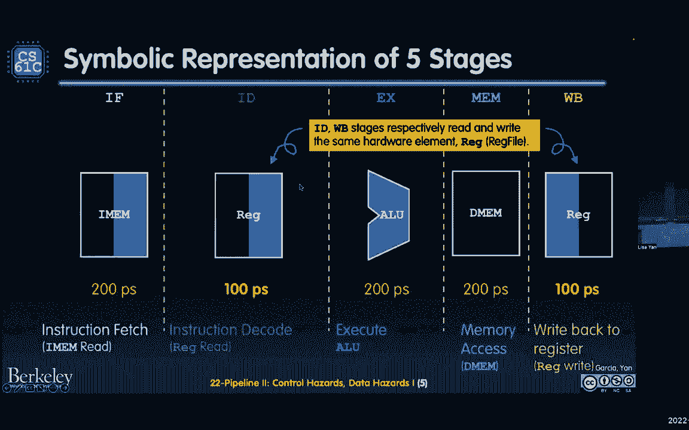

好啦，所以这就发生在指令解码阶段。

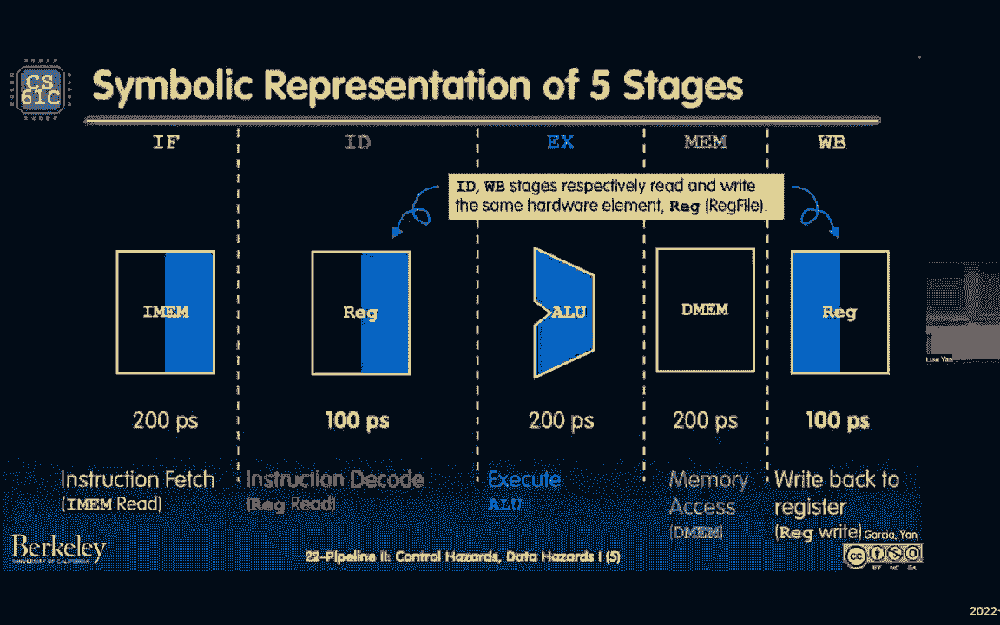

其中一个正在写寄存器文件，阴影部分在左边的地方，好啦，所以它要被遮蔽的原因，左右会更快一点清晰，但我只想指出，即使这里有五个阶段，实际上有四种主导元素，因为id和wb共享其中一个硬件元素是veg文件。

其中一个碰巧读到，其中一个碰巧写了，所以我只是想这么做，然后我想注意的最后一件事是，从上次开始，还是两次前的，当丹试图计算时钟周期的时间时，事实证明，如果我们有一个单周期CPU。

然后我们要把所有这些元素加在一起，整个时钟周期是800皮秒，对于一个阶段，单周期CPU。

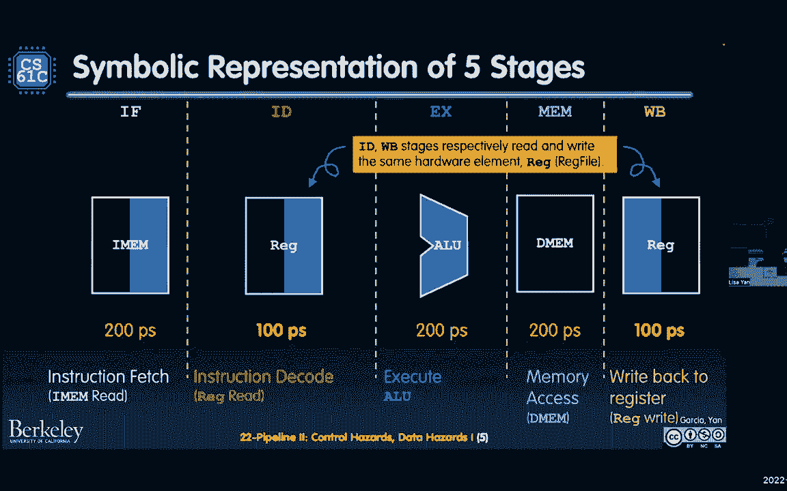

好啦，那么单个CPU是什么样子的呢，然后是顺序数据路径，也就是我们所说的单周期CPU，嗯，整个时钟周期需要800皮秒，让我们假设我们添加了一条指令，如果我们添加一条指令，呃，是我呀。

如果我们把t 1和t 2相加并存储在t 0中，然后我们必须按顺序做所有这些事情，或者可以通过阅读指令开始，意识到这是一个，或者就像读取不同的寄存器并在某个时候存储它，但这里的想法是。

如果我们点击这个动画的其余部分，它看起来很像你上次看到的洗衣图，好啦，所以这里的想法是，假设我们有鲨鱼，这是我们的指示，我们喜欢，我们意识到这是一条鲨鱼，然后我们就一直带着它，到数据路径的末尾。

然后我们把它放下，好啦，但是只有一个人，只是丽莎做得对，然后现在我们意识到就像一只熊猫，然后我们一路带着熊猫，然后我们把它放下，好啦，嗯，我们实际上不喜欢把它放在数据包的末尾，对吧。

会有一些写回寄存器文件的事情发生，但你大概明白了，舞台上只有一个人。

管道数据路径是什么样子的，同样地，我们还得和鲨鱼走同样长的路，但现在我们有一个，我不知道，我们要做志愿者吗，你想抱着鲨鱼吗，你想抓住鲨鱼，好啦，我们没有，我看到了我看到了拿毛衣的手。

我看到你的手先上来了，好啦，所以我们要，我们要一起抓住鲨鱼，也许我们也会有另一个志愿者，你想上来吗，所以我们要做一个管道，我是说我这里只有两件东西，因为我发现我只找到了两个毛绒动物，好啦，你叫什么名字？

珍，好啦，所以珍要站在这里，然后你叫什么名字？凯西，好啦，凯西，你要去，你要坐在椅子上，好啦，所以这就是我的想法，我们得到指示，我就像，哦耶，好啦，是鲨鱼，开始吧，然后你要拿着它，是啊，是啊。

你看你已经知道该怎么做了，多么迷人啊，好啦，好啦，让我们去队长和只是一轮耶，非常可爱，很可爱的主意，但不管怎样，这就是现在的想法，原来珍和凯西，他们不只是舞台，它们实际上是管道寄存器。

我们会回到那个想法，好啦，我们会回到原来的想法，但我只是想确保我们做的面团，反正，所以在这一点上，我们有了刚刚发生的事情，我捡起了鲨鱼，它代表了我，发现这是广告，然后在下一步发生了什么。

我把鲨鱼传给了登祖，然后我拿起了大约，从某种意义上说，我有点像我的男人，我意识到接下来会发生什么，因为我是凭记忆读指令的，然后当我拿起，下一个，熊猫，鲨鱼已经在路上了，好啦，这里的鲨鱼代表广告。

熊猫代表广告，同样地，如果我有第三个毛绒动物，那就是加载词，我可以阅读并意识到这是一个特殊的毛绒动物，当詹森和凯西带着这里的其他元素，现在请注意，这种权衡，就像，当我个人完成时突然更快，对呀。

所以在连续的情况下，我不得不穿过整个舞台，然后往回走，这就是我的时钟周期，就像一个上升的边缘和下降的边缘，现在我只是做了一个交接，然而，就像升起一样，然后跌倒就像我的手臂来回移动。

所以这是一个更短的时钟周期，尽管这些说明书有不同的长度不同的尺寸，他们可能会花更长的时间来搬运熊猫和其他东西，我仍然要等同样长的时间，好啦，换句话说，这个时钟周期是一样的，不管在哪个阶段执行。

因为只有一个大钟，呃，整个数据路径，这就是我们在这里阅读这个特殊图表的方式，时间从左到右，然后所有这些内存项的使用是垂直表示的。

这是图表的另一个版本，还有一些，左边有大约五个说明，它们可能没有任何有用的意义，但他们就是那样，你知道，就像假设之前有一些安排，你知道所有的事情，那么这里依次发生的是什么，嗯，按顺序，指令仍在执行。

各阶段按顺序执行，好啦，所以换句话说，但他们在或的情况下和AA的情况下，好吧，对于这个指令。

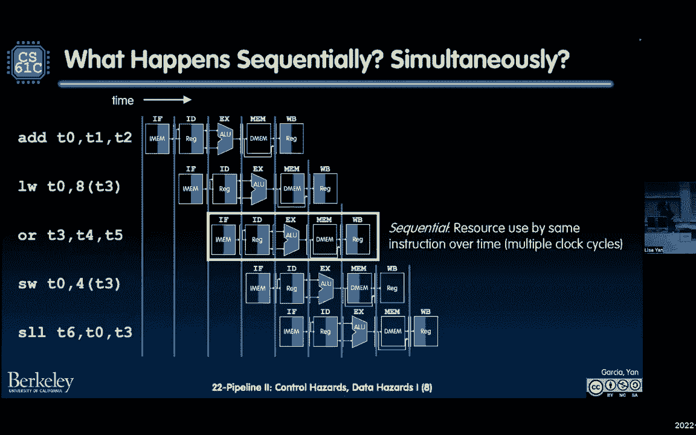

我们要做的第一件事是，我们仍然从i中读取指令本身，然后在下一个循环中，我们仍然这样做，从reg文件读取寄存器，然后我们执行ALU，然后我们不访问数据存储器，我们只是通过它来获得R格式。

最后我们把目的地写回T 3。

好啦，所以我们需要五个时钟周期，我们仍在按同样的顺序进行各个阶段的工作，然而，现在使用的是什么，你还记得管道的整个想法吗，记得洗衣服就像，我们有洗衣服的人，然后烘干，然后这个折法，然后把它收起来。

这些事情可以同时发生，就实际的CPU本身而言，同时视图是什么，所有五个阶段。

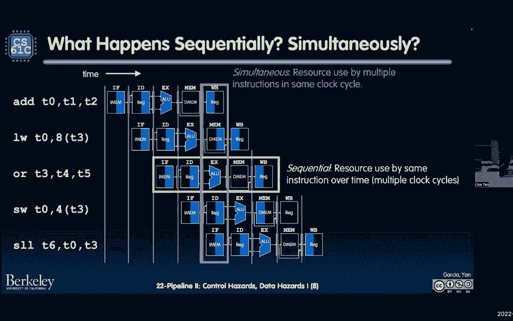

我们可以在这里注意到，在最上面，这个广告说明刚刚完成。

在后台用右手，然后第二个指令。

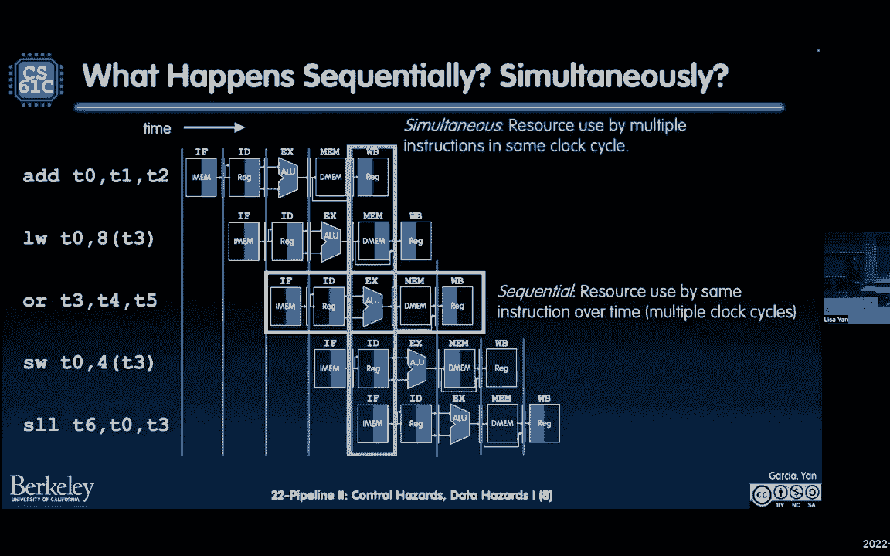

最重要的是最后一个离开舞台的人，它正在加载，从数据存储器加载数据，或者从数据存储器中读取。

然后同样地，alu执行第三条指令，以此类推。

等等，所以所有五个阶段都在使用，它们在同一个时钟周期内被不同的指令使用，一条指令确实会使用，也可能不使用数据路径中的阶段，所以我想给你们看这张图表。

因为我知道这可能是今天最具挑战性的一个，我们会再看到的，所以我只想喜欢，你知道，至少在这上面花点时间，所以你今天可以一直重复，现在让我们比较一下这两个单循环和管道，上次丹肯定是用两个元素来谈论性能的。

其中一个是延迟，一个是吞吐量，出现了赛车和巴士的对抗，我们要再看一遍，但现在有了CPU本身，所以我们要做的第一件事是计算延迟，什么是CPU中的延迟，延迟是一条指令执行单个指令所需的时间，“那又怎么样呢？

指令必须经过所有的步骤，或者有可能经历所有的阶段，让我们把最长的指令考虑在内，在单循环情况下加载单词，请注意，你还记得我们在这里工作的数字。

我们有二百个，两百，二百一百，这100皮秒级实际上是注册文件。

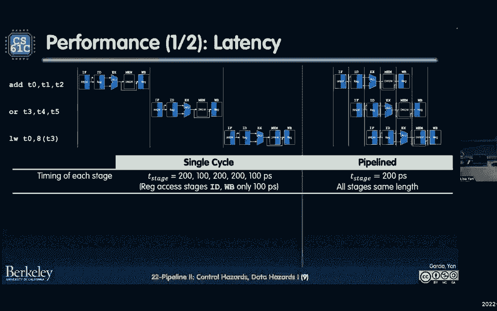

读写，嗯，分别，那将很快生效，但实际上，如果这是每个阶段的计划，然后单周期的指令延迟，只是所有这些阶段加在一起，所有这些阶段的时间加在一起，因为指令必须按顺序执行，好啦，那将是一百个人，哦耶，有个问题。

啊，问得好，问得好，太棒了，是呀，然后问这个问题，你叫什么名字？好啦，好啦，所以学生，宽泛的书或问题，如，好啦，等一下，记住这些指示，为了引起一些奇怪的依赖，这就是所谓的危险，我们将用今天的后半段时间。

周一现在也在谈论这个，你只需要明白，舞台管道的事，假设我们现在不关心执行的结果，我们只是想，你知道的，执行这个任务，然后耶，你说得很对，数据路径在逻辑上有工作，我们会解决很多问题，是啊，是啊，事实上。

我是有目的地把这个挂起来的，所以我们会有很多这样的问题，所以做得很好，不过，好吧，所以现在，我们在哪里，我们只是想知道这里的表演是什么，我告诉你的是，左手边是你所期望的，延迟时间是八百微微秒。

你只要把所有的阶段加起来，但是，对于管道版本，现在所有的阶段都必须是相同的长度，换句话说，他们必须花同样的时间，每秒钟有两百人，你就像，好啦，嗯，为什么有些像块的不比其他的快，对呀。

注册文件只需要一百人几秒钟，这里发生了什么事？记住一个阶段的长度取决于时钟周期，这是一个在那边，时钟频率的反比，在这种情况下，我们有一个时钟，它为所有五个阶段提供信息，好的，好的，那个钟快了，当然可以。

但情节还是一样，又不是说，如果一个阶段发生得更快，我们可以插入不同的情节，这个想法是我们有一个单一的时钟系统，但碰巧是管道，所以它与所有这些地方的开始有关，稍后我们将通过管道寄存器显示，那意味着什么。

然后是寄存器文件，尽管访问元素的时间相当快，在读写方面，只有一百人秒，我们得等一会儿，所以在所有其他元素完成之前，它有点空闲，因为它正等着被抓住，因此，教学时间将是200倍，五个。

其中五是这个指令要经历的阶段数，再一次，我们在想，这是最长的指令，哪个是加载词，哪个，它在这里执行和访问管道的所有不同阶段。

五个阶段，现在第二个，我们使用的第二个性能指标吞吐量有点复杂，从某种意义上说，它必须处理这个问题，就像处理器性能的铁律，然后我们也没有完全明确地告诉你，一个程序的程序的吞吐量是多少，或吞吐量。

数据支柱的吞吐量是，所以我现在就告诉你，这就是表演的铁爱过程，这是什么？每个程序的时间（以秒为单位）等于每个程序的指令数乘以，循环，每条指令的平均周期，每个周期的时间量，好啦。

每个周期处理器吞吐量的状态数是我们所说的，每次或每秒的平均指令数，好啦，比如在一个特定的时间段里有多少个赞，一秒钟，CPU中的这个数据路径能通过多少条指令，这是一个很好的衡量标准。

现在你会注意到这里的一些东西，有多少人记得化学中的化学计量学，好的，好的，你可能从来没有听说过这个词的发音，这是一个从t o i开始，然后在结尾有化学反应，故事几何学在这里是单位对消，所以我想做的是。

我有一个吞吐量的等式，随时间变化的指令数或每次指令数，在处理器性能的铁律中，什么样的单元与此相匹配，这里的后两部分，一种相反的，好啦，换句话说，在指令时间上的循环，每个周期的时间，给我每次指令的时间。

然后我翻转，我做了相反的，随着时间的推移，这会给我一些指示，所以这是一种思考，吞吐量与你们上次看到的铁律有什么关系，原来是这样，我们如何计算这个指令数，请注意，这并不取决于程序，这是一种假设。

就像平均而言，吞吐量是多少，我们要做的第一件事就是，在我们的阶段方面与我们所拥有的相匹配，然后我们的时钟循环，所有这些对这个方程本身，我想指出的第一件事是T循环，这正好是时钟上的一个。

或者这正好是每个周期的时间，好啦，所以800皮秒和200皮秒，对于管道中的单个循环，有一种叫做cpi的东西，上次丹真的很强调，有点像处理器固有的东西，老实说，我认为这可能是这里最令人困惑的术语。

因为cpi是每条指令的平均循环数，好啦，换句话说，如果我喜欢，我其实喜欢思考每个周期的指令，这些事情的反面，因为这让我能做的，每个时钟周期内完成的指令的平均数是多少？然后我把它反过来。

所以在左手边有一个单循环版本，老实说，这有点道理，就像没事一样，一条指令占了整个周期，所以一旦这个循环平均完成，一条指令就完成了，好啦，所以1/1的逆就是1，现在呢，那是最理想的，事实证明。

有一点像内存访问之类的东西，我们几个星期后再谈，那么右手边的管道呢，我认为很容易认为这将是5个CPI，嗯，但它不是，是一个cpi，然后呢，你知道的，又老实说了，好像比一个小一点，因为事情是如何运作的。

你可以拿一五二了解更多信息，让我们考虑一下，一点点cpi，cpi的倒数是每个周期完成的平均指令数，我们有一个阶段性的管道，平均，一条指令将在右后阶段，在一个周期内就在后台，一旦写回阶段完成。

该指示将完成，其他指令还在处理中，所以每次你有一个时钟周期，好的，好的，完成了多少指令，唯一完成的是平均在右后方的那个，你知道有一些，有一些说明不能马上使用，所以如果你取1比1，那是一个。

要了解更多信息，请查看维基百科，昨晚很有用，好啦，那么这对我们有什么帮助呢，虽然，如果我们要计算吞吐量，我们有一个循环，然后我们还有cpi，好啦，在一个单一周期的情况下大致如此，我们的吞吐量足足有八百。

就像一次，八百就是八百，然后是管道，它将是200或200的1倍，然后你取这两个东西的逆，那么这意味着什么呢，这意味着吞吐量增益是4 x，这一切都取决于这个情节周期，所以换句话说，我们在说什么。

记住你就像，好啦，这里的吞吐量是多少，每秒执行的指令数，因为嗯，这是一个时钟系统，我们从那里得到第二个单元，因为时钟更快，最小时钟周期快了四倍，吞吐量提速也是4倍，好啦，是啊，是啊，问题，是啊，是啊。

是啊，是啊，好问题，所以让我重复一下我的解释，因为我觉得老实说，这里滑梯最具挑战性的部分之一，我会考虑每个周期的指令，好啦，所以与此相反的一秒钟，和每个周期的指令，我一直认为它是每个周期完成的指令。

不是我碰巧被执行的指令的数量，因此平均每个周期完成一条指令，这是一个完成右后卫，所以这是相反的，然后我喜欢做一个的逆，这只是一个，是的，所以这就是为什么我推荐喜欢，维基百科上的CPI文章实际上就像。

太奇妙了，我不知道你们有没有遇到过这种情况，但现在你知道了这么多，如果你看看维基百科，你实际上可以阅读和理解它，那是个好地方，因为我知道有时候，这是相当困难的。

但我绝对建议检查一下CPI，它是它是一个相当大的，他们实际上有这个例子。

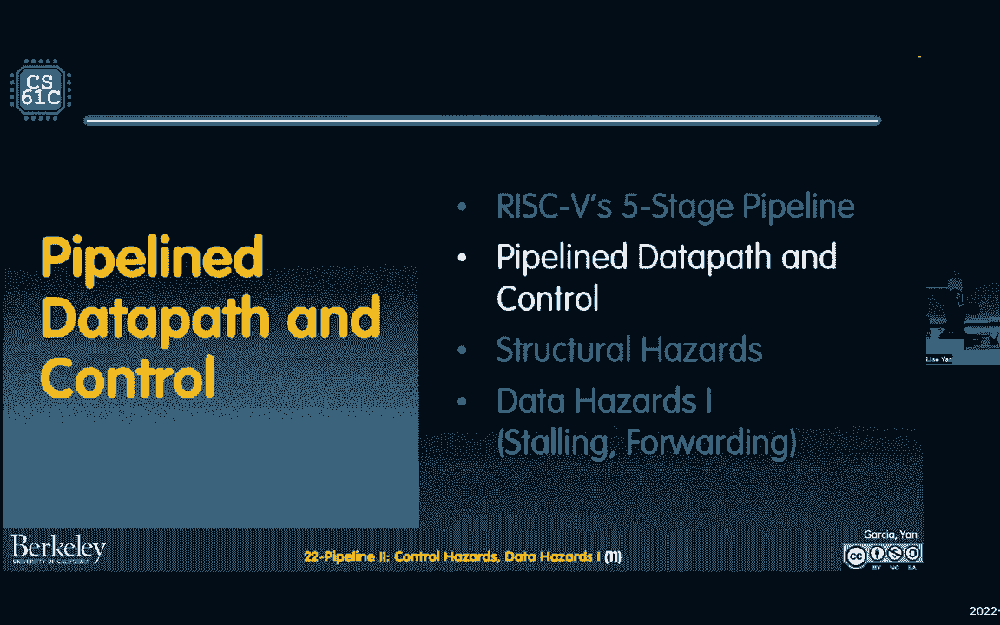

完全正确，然后他们把它写在文本上，所以这很好，所以这是比较管道是好的，增加吞吐量实际上不会改变延迟，事实上，延迟会稍微恶化，但是吞吐量增加了4倍，太棒了，因此，让我们稍微思考一下。

我们希望如何构造这个数据路径，这是我们的单周期数据路径，但请记住，我们在处理单周期数据路径时遇到的一个挑战是，或者喜欢，我们不能在这里放个钟的原因之一，是因为在这一点上所有这些元素，PC Reg文件。

Dmam，他们都用同样的东西打卡，然后就这样，因此，一条指令就会把它扫过整个过程，所以我们需要做的是设计我们的管道寄存器，或者管道数据路径是我们需要以某种方式分离这些指令。

这样数据就不会在整个过程中流动，一下子，您希望数据首先流过第一阶段，然后等到第一阶段的数据是第二阶段的数据完成，然后流经第二阶段，以此类推，我们如何进行管道寄存器，就是现在，我们回到之前凯西的演示。

就像他们现在是管道寄存器一样。

所以让我们提醒自己管道寄存器是什么，你真的看到了，但它们不叫管道寄存器，这是两周前左右的回顾，在左手边，我们有一个循环，加法器和移位器，你喜欢地看着它，我知道我知道你喜欢地看着它。

你可能也在考虑期中考试，不过没关系，然后单周期的一个问题，一个是现在，因为在开头和结尾有两个寄存器，你的时钟周期取决于延迟，加法器和移位器的传播延迟，管道版本将允许您增加时钟周期，好啦，所以你放了很多。

加法器和移位器之间的管道寄存器。

这是干什么用的？这可以让你有一个更快的时钟，因为现在你的时钟是这两个延迟中的最大值，如果你用同样的时钟，所有的状态元素，第二件事是你得到了更高的每秒吞吐量输出，因为你的时钟没问题。

所以这有点像我们在数据路径上看到的，是一个更简单的版本，但你明白了，所以你只是在你的阶段之间拍打或注册，他们只是引用，但实际上它们是字面上的，这里有字面上的阶段，我们去看看，我把图表稍微放大了一点。

因为事实证明我们实际上必须投入，所有这些管道寄存器，我定义这些管道寄存器的方法，就像你在文学作品中看到的那样，他们被定义为，呃，阶段i f和id之间的边界，把它写成i f斜杠id，对它们都是类似的。

好啦，所以有四组管道寄存器，因为现在有连续五个阶段。

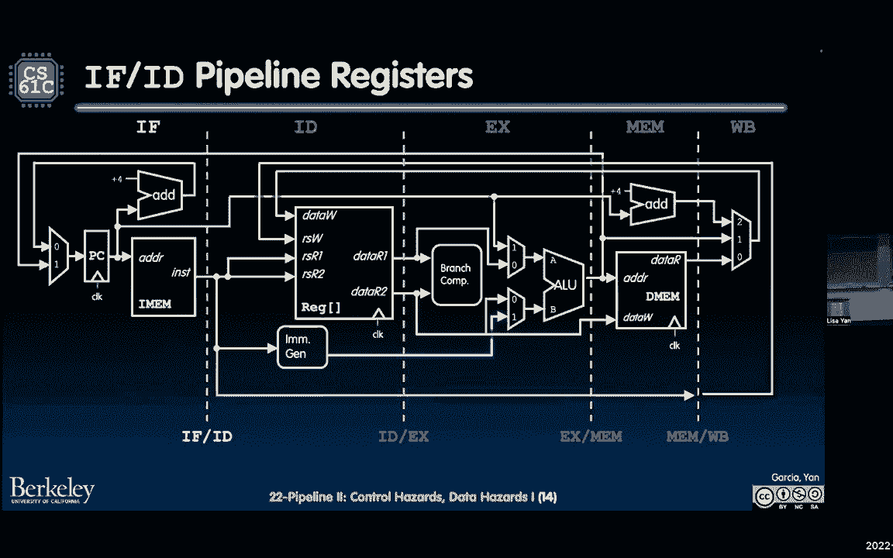

让我们来看看这里的第一套，IIG管道寄存器，我怎么知道这里只有两个寄存器，我只是想把一个阶段的输出，因为一个阶段的输出会立即流入下一个阶段，我不希望这种事发生，我只是在等待时钟的到来。

所以如果我只是沿着这些箭头，就像看看我的边界线在哪里，这里正好有两个输出箭头或两根输出线。

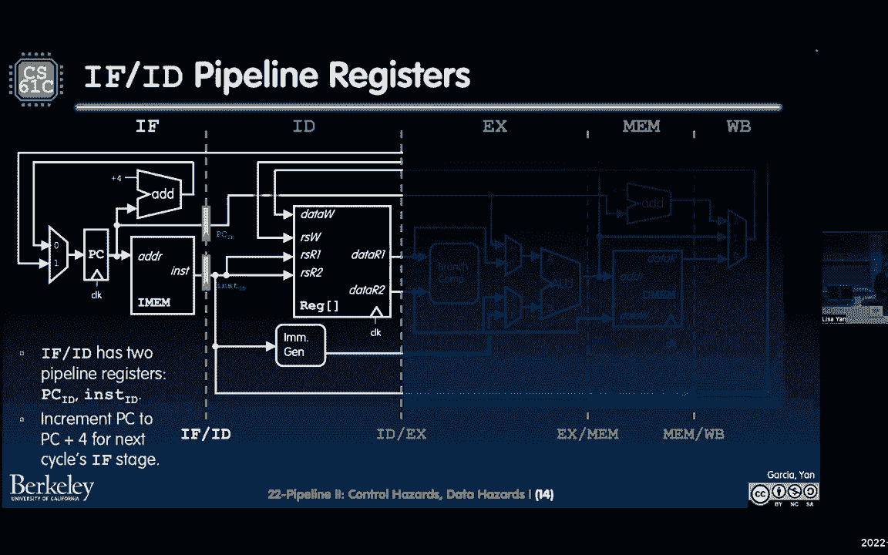

其中之一是个人电脑，它被转发到所有的ALU和所有的，其中一个是在我的指令提取中读出的指令词。

周期或阶段，打扰一下，这里只有两个管道寄存器，有时你会看到它被画成一个巨大的酒吧，但将画为两个独立的东西，然后注意这里的i f阶段，至少在我们目前的版本中，我们要把个人电脑增加到个人电脑，下一个加四个。

舞台，所以这将允许我们做什么，一旦时钟再次滴答作响，这个I F阶段确实会阅读下一个指令，好吧，因为我们有这个权利回来，如果我们没有这台电脑加四个更新就在这里，然后如果只是想不知道什么时候更新。

直到最后一个阶段是，它是这样做的，有点像思考这里的区别，在单级和流水线版本之间，让我们看看这里的第二部分，现在我们有更多的箭头，所以我会在中间打一堆寄存器，阶段ID指令解码的所有输出。

这是寄存器文件访问和阶段e x，这是alu执行，有一些分支计算，我们下次再讨论这个问题，现在请注意，这里有一些像你一样的东西，你可能马上就想知道，呃，几件事，其中之一就是，我还在继续，指示词的三十二位。

事实证明，这将有助于控制，所以有点像，我一看到这东西，我只是把它转发，这是我转发的一个新数据，但其他你喜欢的人。

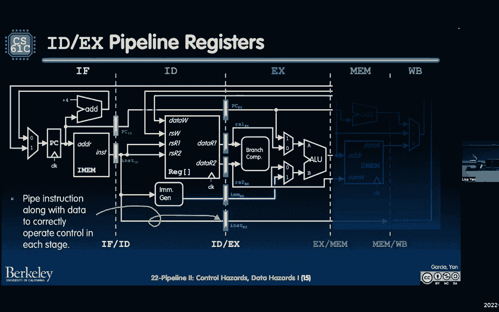

好啦，我在我的ID中计算的那一刻，所以我应该把它归档，我从寄存器文件中读取的所有数据。

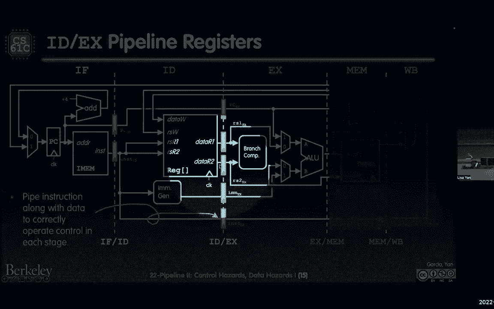

是呀，还有电脑，我需要把它转发给ALU，但你可能会想，哦好吧，就像，这些呢，上面这些线，他们说你没有，你没有把小登记簿放在那里。

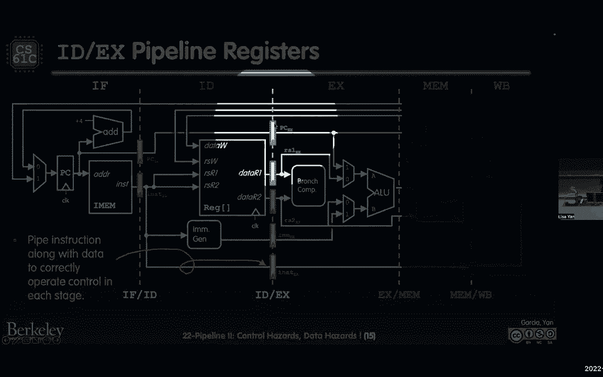

发生什么事了？这些箭是向后的，所以这实际上是一个不同阶段的一部分。

所以我现在要忽略这一点，我只是在想这个阶段和下一个阶段之间的所有错误。

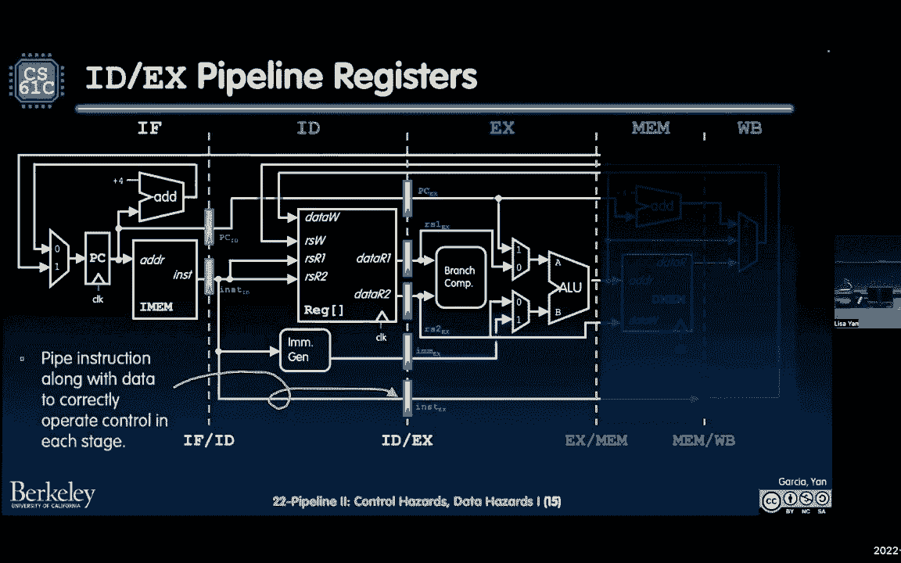

是啊，是啊，还有一个问题，是啊，是啊，啊，一个奇妙的问题，我们一会儿再谈控制，是啊，是啊，是啊，是啊，所以问题是，你也转发，控制标志，我们用三张幻灯片来讨论，从字面上看，是啊，是啊。

但我只想通过剩下的管道，还有几个音符，让我看看，我们这里有什么，就我们的笔记而言，嗯，我们有，我们也转发指示，再来一次，然后我们也向前，卢比2，记住RS 2和存储词有点像，那是那是。

我们要存储到内存中的数据，我只想说，然后最后又回来了，如果我把它放在决定写哪个元素的MUX之前，我在这里保留了三个元素，我对右后标记的三个输入，这里有张字条，我其实有个加法器，就像一个四加四的加法器。

这是为了简化硬件，再加上四个加法器很便宜，所以这样我就不用，PC和PC都加四个，我只是增加了PC的增量，当我知道我需要它的时候，它就在红色的盒子里。

有两种加法器，这是一张纸条，然后底部还有一个小分割器，所以让我们来做一个快速的，其实很好，我们不做这个问题的互动版。

但我们只是想看看，很快的，这只是把这个图再翻译一遍，从左边的变成我们知道的右边的，让我们假设我们在这件事上，时钟周期，屏幕上列出的所有五个指令都在操作，那他们是怎么运作的，在这五个阶段中。

哪一个教学是在哪里，老实说，这只是看图表的问题，所以我们要看一下图表，我暂时不理会各地的民意调查，如果我们看这个图，然后我们就像放大，像摆动一点，广告正在使用的单位，正在用于的舞台，最上面的广告。

就在后面，因此使用dm的加载字，或者是用x e x，然后商店用呃，身份阶段，最后，如果I F阶段被左移位使用，逻辑，所以我只是在写，但注意这里就像，即使黑暗从上到下，现在突然间。

数据管道就像反向问号一样，对人们来说，意识到这一点往往有点挑战性。

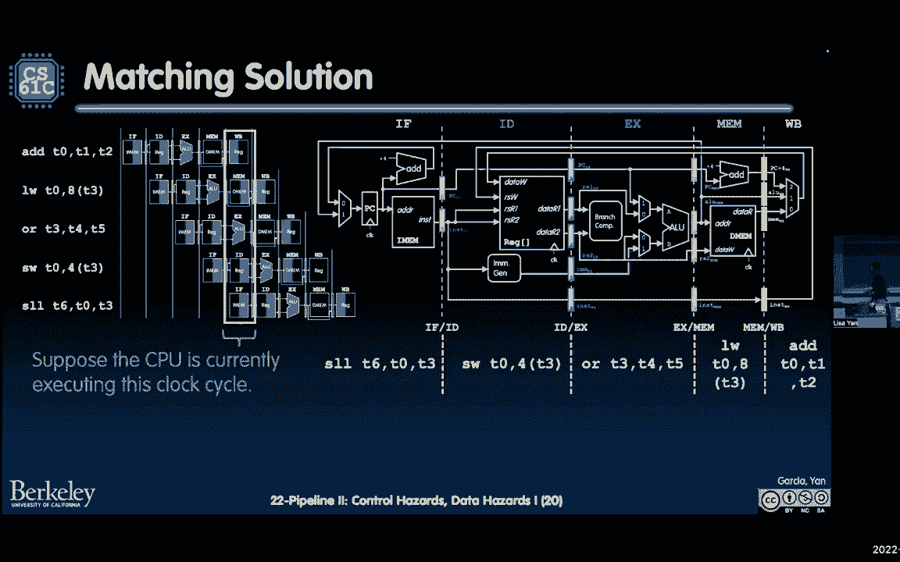

但这是有道理的，这里的存储移位左逻辑是发生的最新指令，所以它在最左边的起点，开始-开始阶段，然后在下一个时钟周期，不管是什么从左移逻辑是这样计算的，也就是指令被拿来了，这有点像在管道寄存器前等待。

然后砰的一声，它进入指令解码，好啦，然后它就像在ide x处等待，然后等待，等待，等待，然后砰的一声，它继续到x，以此类推，好啦，所以这有点像思考管道阶段实际上是如何工作的，现在回到控制问题。

所以我们就像，我们讲了一点指令位是如何被转发的，然后有人问，好吧，好吧，控制位呢，因为你知道，有一个完整的转发逻辑，我是任务控制中心，这是在哪里发生的，有几个选择。

我们在这门课上教的一个有效的方法是在教学中解码，一旦你得到指示，除了分支，你还知道很多控制标志，我们下次再谈板凳的事，例如，你只是喜欢转发这些，你把它们放在小小的登记簿里，或者你做一个巨大的。

非常非常长的寄存器，你把来自所有不同管道寄存器的所有数据，进入巨大的长寄存器，所以这里让我们来看看，就像在指令解码阶段，这就是我们把指令分开的地方，我们就像弄清楚如何读取寄存器文件。

然后我们也把它转发到这个控制逻辑块，它让我们的WB选择我们的MEM读取，写我们的A选择B选择，你有什么，然后我们把它们放进小寄存器里，每一个都像一堆碎片在一起，或者一堆旗帜在一起，好啦，所以在这里。

我有三类IX的控制标志，它对应于每一组控制标志，将用于以下阶段，就是，您可以看到随着时间的推移，管道慢慢地摆脱了控制标志，因为一旦你在一个阶段使用它们，你不用再用了，在下一阶段。

因为有不同的元素需要控制，好吧好吧，有一种东西叫转发，我们稍后再讨论这个问题，但这有点像你计算一次控件，然后你把它传下去。

现在很刺激，我们在哪里这么管道，其中一件事，CPU数据路径的一个很酷的地方是，你第一次想看的时候，你就像，怎么会有人想出这个，但是61的好处是，我们不是要求你想出一个数据路径，我们告诉你数据路径是什么。

然后只要你明白，然后你就可以画了，或者你可以把这些碎片连接在一起，所以我们慢慢做的。

随着时间的推移，我们正在剥洋葱，就像某个人某个人，其中一个学生在办公时间像，哎呦，也许史莱克应该成为61年的吉祥物，因为这里有个洋葱的比喻，但我们在脱皮，再来一层洋葱再来一层洋葱，你所说的危险。

我们的数据路径，我把所有的指示都整理好的方式。

这会引起一些问题，几个问题，会发生这种事，这里有一个，这可能是一个你没有做任何事情，所以他们中的一个就像，嘿嘿，我们有IMM和DM，他们都是凭记忆读的，这可能吗？就像物理上可能一样，第二，我们有低潮。

商店里的词，然后我们有一个或，或者先发生，或写进T三，但商店的词必须从第三个读来，但就像第三个是在回信之前写的，就像，这可能是什么，比如我们在这里做什么，这个问题和第二个问题就像，分支机构如何再次工作。

我们下次再谈这个，但这是三类事情。

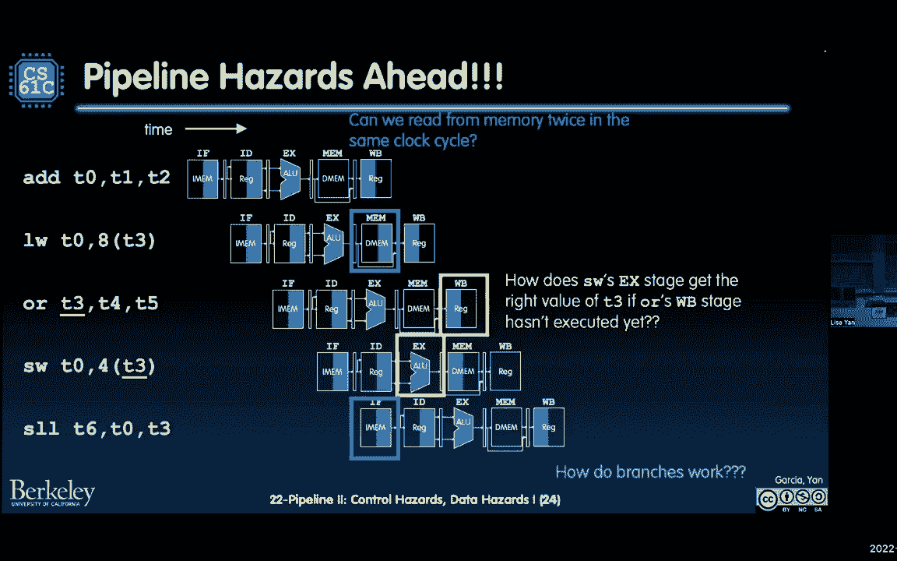

指令按顺序执行可能行不通，所以什么是危险危险是描述这种情况，计划指令不能以预期的或适当的方式执行它，这里有三个不同的版本，我们要逐一检查，其实呢，我们将在每一个项目上花很多时间，其中之一是结构性的。

我们有数据危险，我们也有控制危险，现在呢，他们在这里有合理的名字，所以结构意味着硬件结构不起作用，所以我们从薯条店买来的硬件，它不支持我们想要使用手臂的方式。

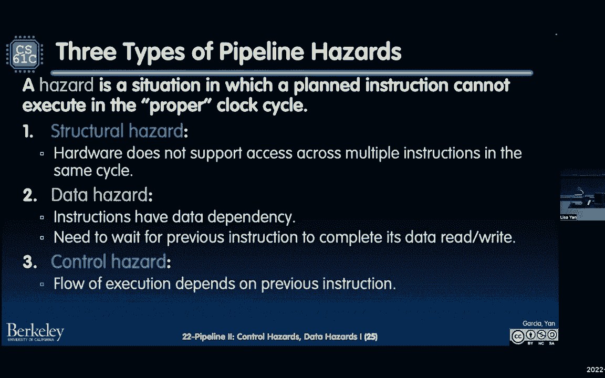

我们的接入系统数据危险，这是数据依赖关系。

所以这有点像T三，商店的词和我们之前看到的东西，这次我们要开始讨论一点，下次再谈，然后控制危险就像我们在按顺序执行指令，但突然间我们需要跳到某个地方，就像我们如何跳跃，就像我们有一些指令是主动执行的。

我们需要撤销这一点。

怎么会这样？这就是我们下次要讨论的，但现在让我们来看看结构性风险，只是一点点数据危险，所以你有个主意，结构上有，哦对了，我想指出，所以对于你们所有人来说，你知道这就像四四十。

所以如果你听说有三十个人在变焦，或者对于变焦的人来说，只是笔记，所以这个东西在决赛上，而不是期中考试，挺好的，也是最伟大的，我得到的一个很好的建议，我在决赛中做的事情是你会得到一张备忘单。

这就是树链非常有用的地方，记住所有这些对所有危险的不同定义，这里有一个，结构危险，定义和以前一样，2。这事什么时候发生，多个指令竞争对同一物理资源的访问，我喜欢这样想，作为嗯，这可能是一个古老的模因。

有个家伙，他拿着一堆台词，然后他就撑不住了，因为他忙得不可开交，那是结构性的危险，他没有足够的手，所以喜欢，在硬件方面，我们可以买更多的手，你知道我们可以做一个有很多手的人，但在现实生活中。

我们实际上可以做到这一点，所以这里有一个解决方案，如果你，如果你的资源不喜欢，我有，是啊，是啊，好啦，好啦，稍后我将向你们展示实际的例子，但这里有一个解决方案，如果你是硬件。

实际上无法支持所有这些人同时给你读书和写信，你的硬件只是说等等，然后时钟周期滴答作响，这就是所谓的cpu死机，不是超级低效，肯定管用，但会减慢吞吐量。

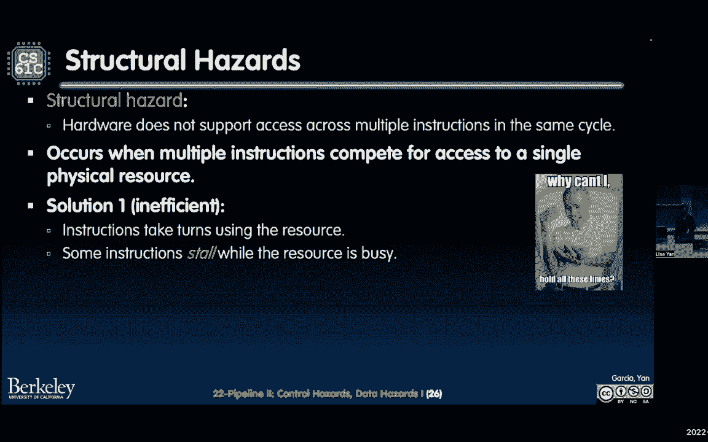

第二个选择是增加更多的硬件，让人类有更多的手，或者你知道，获取允许多次读取或多次写入的Fries仪器，或者我们现在不必在这个风险五系统中拥有多个权利，我为什么要谈论结构性危险，风险五的美妙之处。

我们向你描述的方式，所有这些结构性危险都已经避免了，好啦，所以接下来的幻灯片，我要向你展示的是风险五的美妙之处，事实证明，您实际上不必通过硬件来解决这些问题，因为我们已经为你设计好了。

下面是寄存器文件的示例，每条指令最多可以读取两个操作数，来源RS一个RS两个，然后一直到一个操作数，如果我们有一个类似于这样的寄存器文件块，这会造成结构危险，所以这个寄存器文件块是我编造的，上面写着。

好啦，我读到一个词，三个两个比特，我也读了一个RS，然后旗子告诉我是写还是读，我只能读出一个元素，好啦，我一次只能访问一个元素，这会造成危险，如果我先把这个块放进去。

因为我不能把它连接到我已经有的数据路径上，在我的寄存器文件中同时进行两次写或两次读，我们当前的寄存器文件，当我们画的时候，它确实处理了这个寄存器访问，潜在结构性危害，所以再一次，这里的想法是。

结构风险已经由风险五处理了。

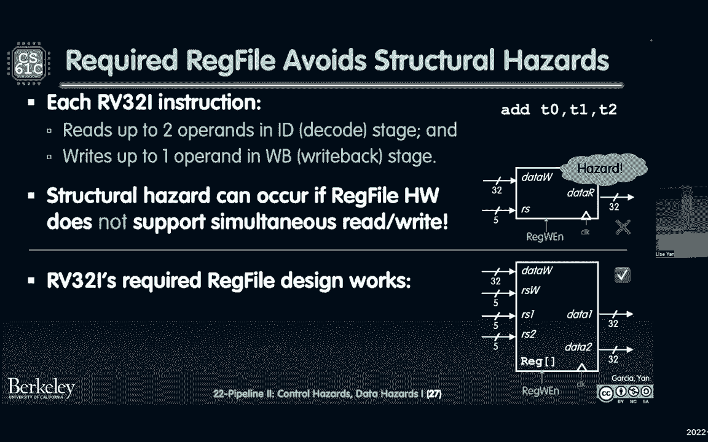

这是它的方法之一，所以说，有什么例子，这里有两个独立的读端口和一个独立的写端口，同一站点可以发生三次访问，两读一读，而在在呃，中间的图，像想象中的挡住的那个，我有，你不能让这种读和写同时发生。

这两个读和一个写发生在同一个循环中，因为它们只是没有足够的输入线或输出线，这里还有另一个结构性危险，就像我们向你们描述的风险5一样，它围绕着记忆，所以在这种情况下，假设我们有加载词和向左移动逻辑。

这两个处于同一阶段的人现在都在访问内存，其中一个碰巧在访问指令存储器，其中一个碰巧在访问数据存储器，但这在物理上是可能的吗，如果物理上不可能，这将是一个结构性的危险，好啦，这就像结构风险的概念一样。

如果物理上不可能，在这种情况下是一个结构危险，我们只有一个记忆，不会，实际上不能同时访问这两个，就像我们在这门课上抽象记忆一样。

但是，幸运的是IMM和恶魔在风险五架构方面说，请把这些单独的物理设备，我们就是这样画的，我记得在左边我们有CPU，在右边我们有两个元素，我们考虑这两个独立的图表元素，但在CPU上，我们让它们保持不同。

论船舶记忆，你会在这里看到我们使用的词是指令和数据缓存。

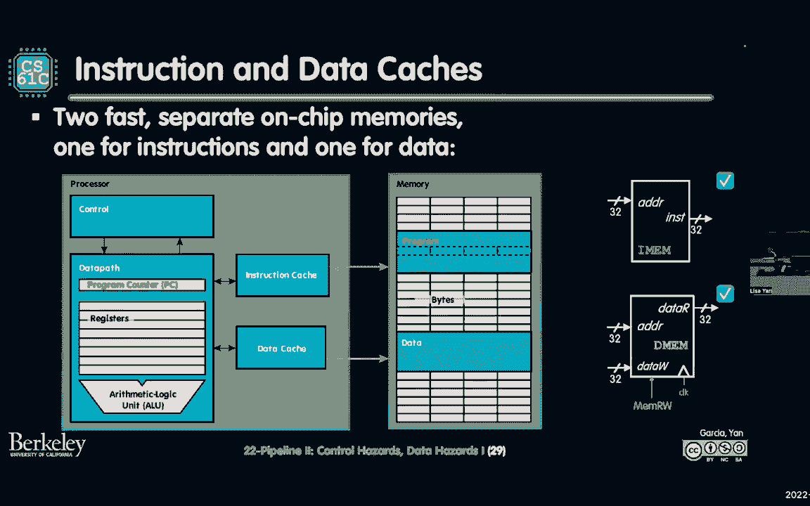

什么指令和数据缓存。

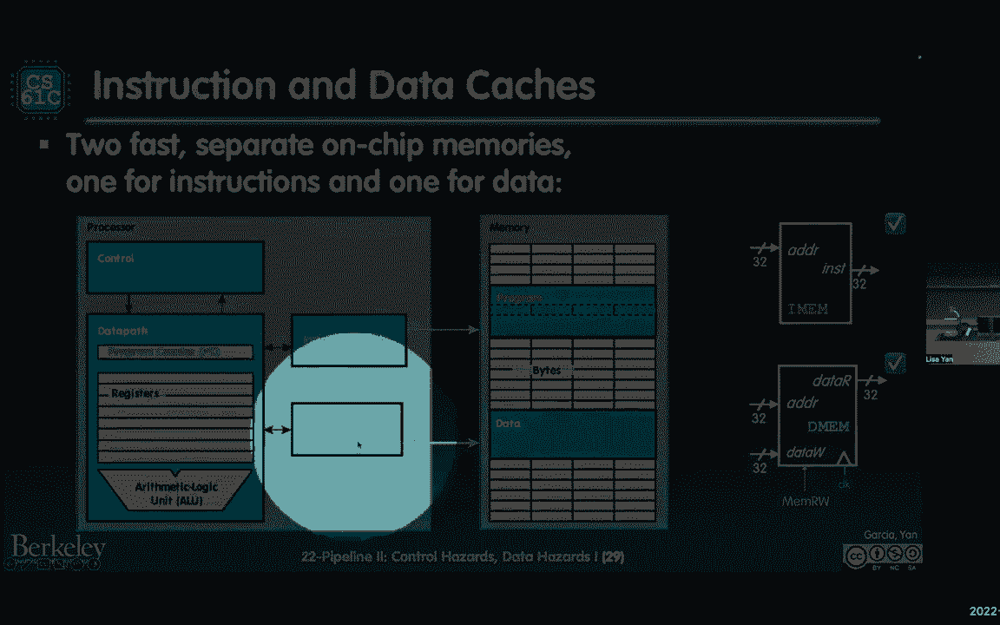

指令高速缓存数据高速缓存，我们将在两周后讨论缓存，在两个讲座时间，我们快到了，但是想象一下，目前，这只是两个独立的硬件项目，并坐在那里作为内存访问内存，读对了，一切都值得。

是啊，是啊，问题。

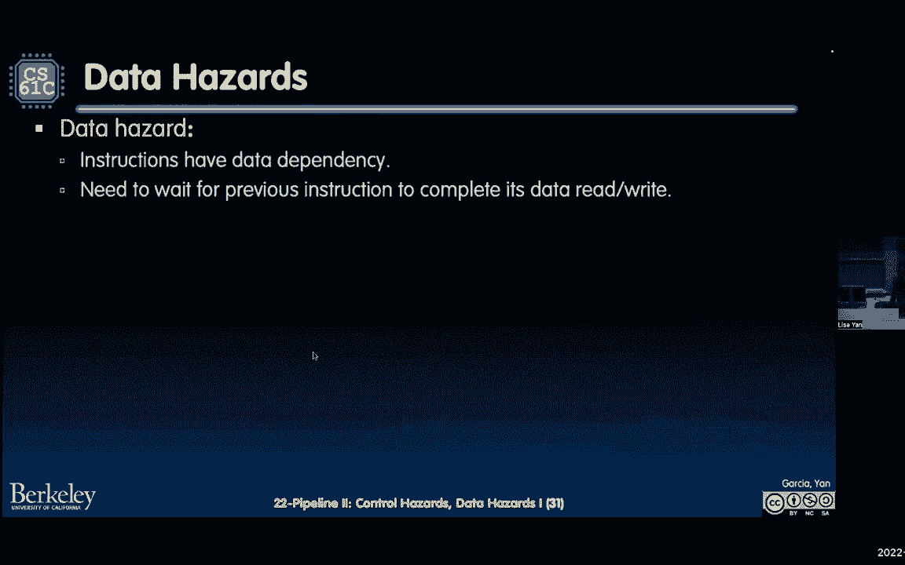

啊，太棒了，所以问题是嘿，注册文件右读。

你会说每一个都是100皮秒吗，是呀，刚好两点。

五张幻灯片，你们今天就在上面，就喜欢而言，你知道的，那是个很好的演讲，当你们问问题的时候，我有三张幻灯片完美，你知道更好，如果是一边，但是不管数据有什么危险，这是另一种危险，这是什么意思。

这意味着现在指令之间的数据，不知何故就像，不允许您按顺序执行所有指令，在预期的时钟周期内，所以就像管道一直被完全填满一样，在我们的架构中什么时候会发生这种情况，它只发生在这种情况下，好啦，我是说，你看。

在这种情况下，它发生在三种不同的情况下，这个条件是一条指令读取寄存器，但是前面的指令需要先写入寄存器，有很多不同的方式可以实现这个确切的场景，在这节课中，我们要考虑三种情况，其中一个是同时发生的。

写作和阅读在同一个阶段，这就是我们所说的寄存器访问，其中之一是ALU结果，今天结束的时候我们会讲到，其中之一是负载数据危险，好的，好的，所以这种超长时间的负荷实际上也会变成一种危险。

让我们谈谈我们中的一个刚刚提起的第一个案子，让我们假设我们处理这个add指令，存储单词指令，我在这两种情况下划了线。

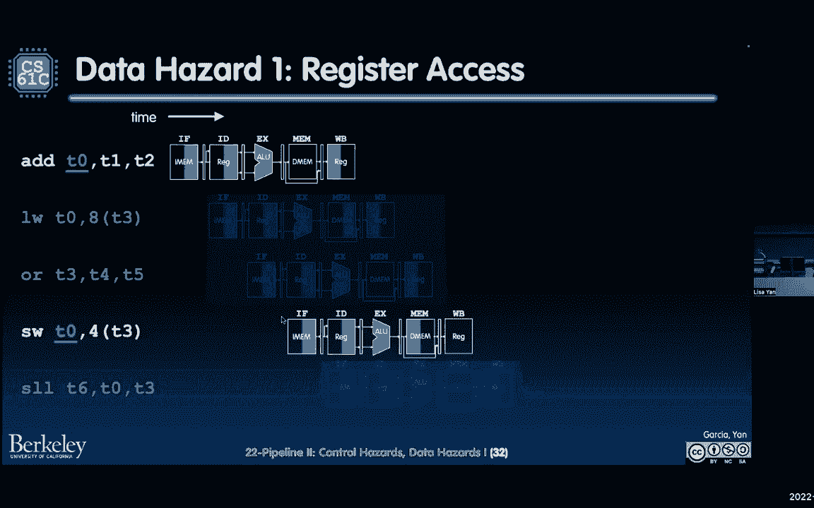

注意，广告中的顶部T零，这里是目标寄存器，然后底部归零储存。

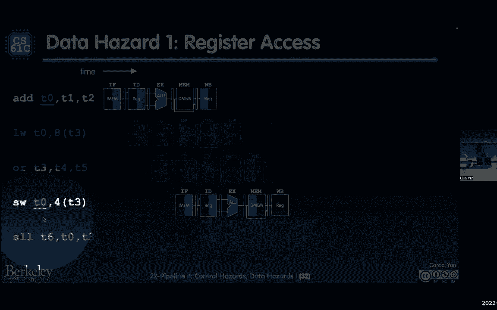

这是一个读寄存器，因为那是我们要存储到内存中的数据，但是，如果我们好好看看商店的话，在同一阶段读数为t零，那则广告写到零了，所以有可能，你知道可能会有数据危险，新值被写入如下，或者像之后。

旧值被意外读取，所以这将是一个数据危险，或者实际上这个东西通常只是一个数据危险，你不可能得到错误的信息，这不是结构性危害对结构性危害，就像这是不可能的，在这里完全有可能，因为我们有三个端口，两读一写。

它们可能发生在同一个循环中，但数据和内容可能有点混淆。

那么这里的解决办法是什么呢，解决方案是解决这种数据危险的硬件需求和硬件需求，现在我们明确地说，我们的注册文件，我们从薯条或其他需要写的东西上买的，然后在同一个循环中阅读，你好像是对的。

那怎么会发生这种事呢？假设有一些组合逻辑块的情况发生，但总的来说，这个寄存器文件，实际上这就是为什么我们用这种方式阴影图，寄存器文件，但它是有效的，我们必须在舞台的第一部分写作，然后在舞台的第二部分读。

这是一件单品，你还记得刚开始上课的时候，我们很好，寄存器文件是单个硬件元素，这是真的，它是一个必须同时读写的单一硬件元素，又名在同一时钟周期，但实际上我们说的是在同一个时钟周期，你需要先写出东西。

在那些你们都得到的输入中，然后你读什么，你呀，所以对这个有一些要求，其中之一是我们确实需要先读后写，在同一阶段是可能的，我们把它写成100微微秒，加上100微微秒，可能会有一些重叠，但总的来说。

你可以这样想，一百人秒，然后这个是，呃，但是，如果你想写然后读，可能并不总是可能的，尤其是如果你的时钟超级超级快，好啦，所以就像这样，这就是为什么这里是用小字体写的，在大多数情况下。

对于我们将要研究的所有类型的体系结构，我们正在处理的时钟周期，我们将拥有物理上能够写入和读取的寄存器文件，因此，这种类型的数据危险不是一个问题，现在这里有另一个数据危险，这就是我们今天要结束的。

这就是ALU的结果，这是三个数据危险中的第二个--我们下次会做下一个，但这种数据危险又一次地处理，第一条指令只是为了让它变得简单，所以就像，你知道，这是一组与上次幻灯片略有不同的说明。

但是如果我们看看零点是什么时候写的，就像在正确的后台潜艇里或者他们可能不会得到正确的结果，或者事实证明他们有，但让我们来看看这个，你还记得我们是怎么读这些图表的吗，我们从左到右，这是时间不同的时钟周期。

所以我在这里所做的就像，我刚刚补了一个零的值，让我们假设在添加发生之前，五点开始，然后在这之后，就像零一样，它的更新值是九。

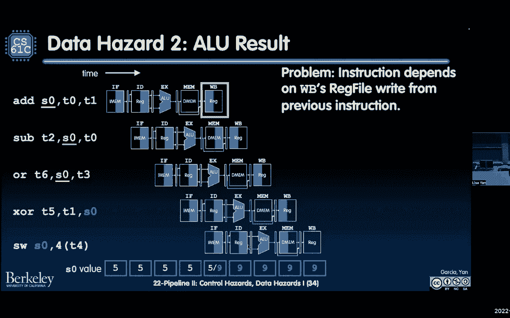

所以发生的好事，在第一阶段。

五点了，什么都不读，第二阶段什么都没写，它是红色的，或者因为零在第三阶段不是红色的，由于在第四阶段或第四个时钟周期中不编辑零，最后在第五个时钟周期。

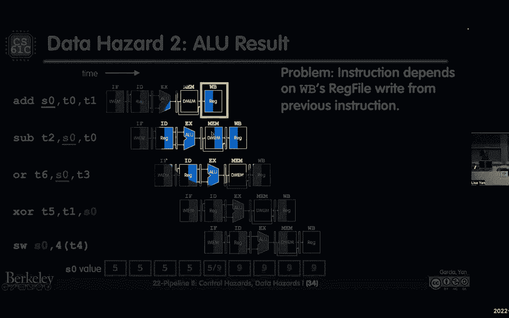

右边的读数是五变成九，好啦，所以在所有其他的时钟周期中，到现在为止，零号还是好的，因为没有任何右后卫发生在零号，至少在这组特定的指令中，我们有这样的，因此，“好”是什么意思。

这意味着对于子和或这两个读取寄存器文件，具体来说，在s零改变正确值之前，在时钟周期中读取f零，好啦，请注意，这里我们实际上是在处理这两个抽象层，我们就像，好的，好的，我们知道机器代码的作用。

或者程序集代码应该做的，但实际上数据不起作用，我们认为它将被翻译的方式，程序集代码告诉我们需要做的，应该是在Sub发生之前t零加t一的更新值，但是，因为我们的管道建设，这会导致数据危险。

因为我们正在做的是，在更新新值之前，我们正在读取x零的旧值，现在呢，原来这里的另外两个指令，这些很好，嗯，因为我们通过做一个。

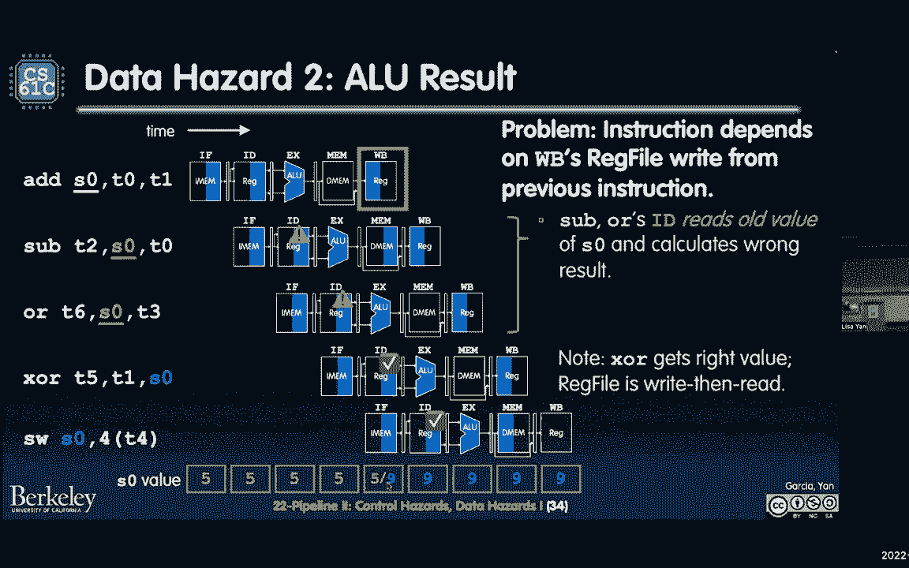

我们修复了数据危险x，或者说x或s为零，嗯，它发生在与写零相同的循环中。

如果我们有写，然后b，这会解决的，好啦。

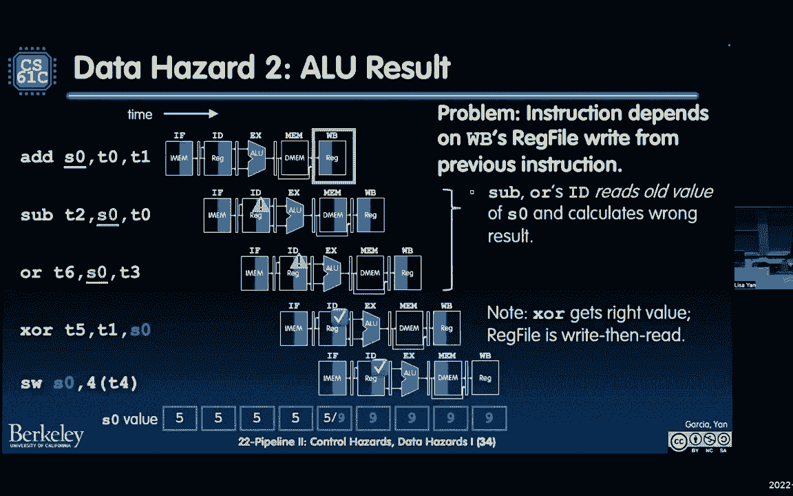

之后的任何指令都将是正确的值，让我们想想怎么解决这个问题。

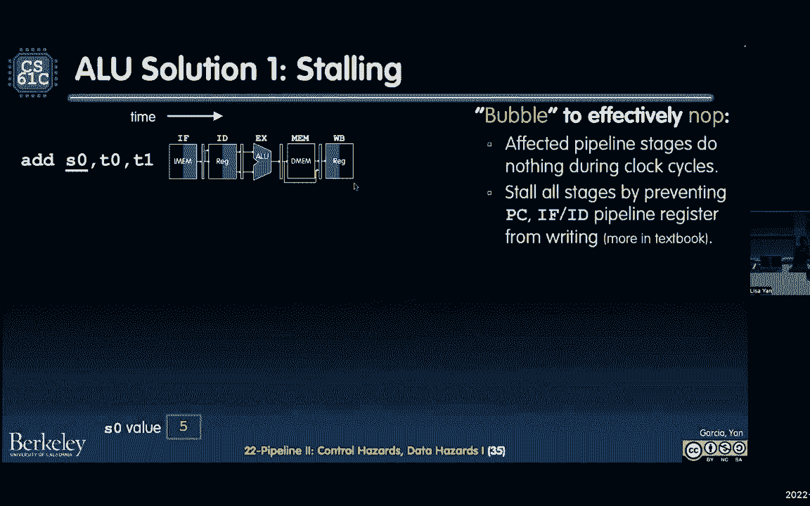

那我们怎么，这就是应该回到第一张幻灯片的内容，我只想专注于副指令，然后随时阅读喜欢的答案，或在课本上或之后的幻灯片上的说明，但让我们把注意力集中在一个子指令上。

现在我们知道，右后卫发生在第五循环，假设我们在做指令解码，好啦，就像我们读的那样，我们把指令艇拿来，我们想通过舞台，然后我们就像，哦废话，哦废话，我们不能进入下一阶段，因为当我们做指令的时候。

解码子实际上使用前面指令中的一个目标寄存器，好像有一些，你知道的，一个额外的状态被存储到这里的管道和数据路径中，所以你就像流产，中止，在这个指令的任何一个阶段中，都不会执行任何其他操作。

这就是我们所说的泡沫，我们称之为，有时你看到它，它叫，这就像一个有效的无行动，这和你所认为的一个，作为一种风险，五努普，不过没关系，然后我们再试一次，我们就像，好的，好的，在下一个周期对。

我们还没有把电脑更新为电脑加四，因为我们想再试一次，所以我们再试着做一遍指令，我们喜欢把指令子拿来，然后当我们做指令解码的时候，我们就像，哦不，还是和以前一样的指令，像一个零，还没准备好，中止中止板。

然后你就像泡泡一样，关于在此期间不将任何内容更新到其他阶段的信息，最后你第三次再试一次，你就像好的指令提取，然后在指令解码的时候你就像，呃零分，下一步就准备好了，然后你就继续前进。

你有没有看到我们喜欢浪费时间，我们在舞台上浪费了表演，因为所有这些都像第二和第三阶段。

下面是第二条和第三条有效的指令，他们就像，好啦，好吧，这意味着在我们处理的时间里，让我们假设第五个循环中的最后一个，寄存器在后面，然后减法读到。

这意味着内存和执行阶段，这些根本没有被使用，在…的意义上，就像任何正在计算的值，他们不会传给下一个，管道的下一阶段，所以这里有一点舞台表演，那么我们做得好的是什么呢，原来这是一个选择。

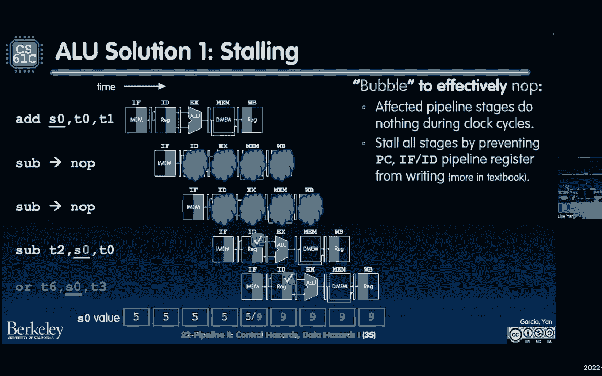

它确实减少了，性能证明，您可以在编译器级别上，如果你知道指令顺序，然后你可能会重新排序说明，这样您就没有数据依赖关系，你不会导致所有的数据，但事实证明，下一次，第二个解决方案转发实际上更好。

所以祝你期中考试愉快，让我们看最后一张幻灯片。

祝你期中考试好运，参加，星期一见，所以谢谢你。

