# CS 61C at UC Berkeley  - Fall 2022 - P2：Lecture 2： Number Representation - 这样好__ - BV1s7421T7XR

但乔治·弗洛总是咔嚓咔嚓。

我的点击器现在不起作用了。

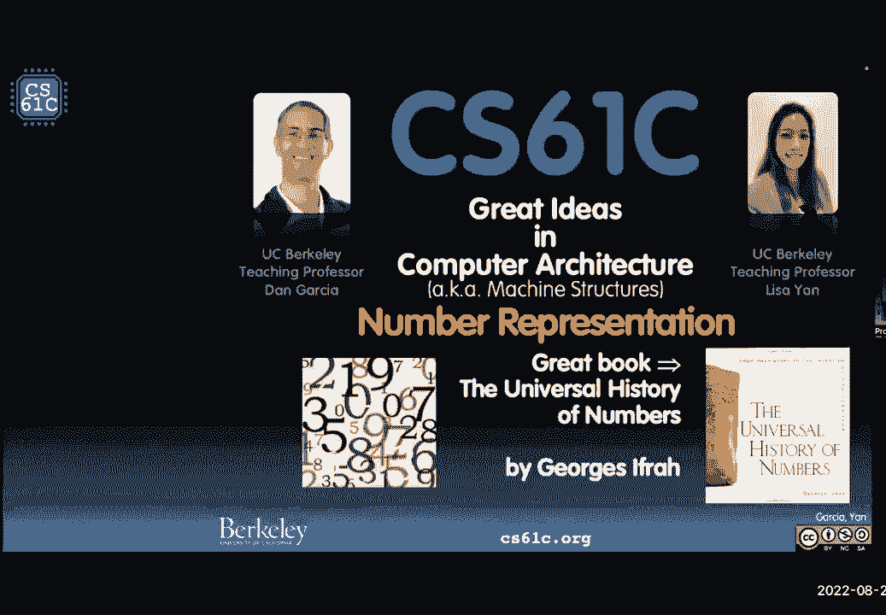

我不知道为什么这么高兴，哎呦，有好的好的，太奇怪了，好啦，嗯，我们总是在新闻里做计算，计算，今天的新闻很遥远，考试前扫描学生的房间，在考试前必须扫描房间的人，举起手来，法官说那是违法的，不能再这样了。

侵犯你的隐私，有趣的谈话，在这之后谈话还继续吗，但那是，显然有一个民意调查，你知道的，在尝试测试完整性之间的让步，你可以想象对了，人们可以把所有这些东西放在房间里，所以你想证明房间是干净的。

与学生的隐私，房间里可能有东西，比如驾照申请或者其他可以定罪的东西，你在房间里应该有一些隐私，所以我看到了那边，我也看到了试图保持测试，你知道远程考试的完整性，那就是拉，拉啊拉啊推，现在很有趣。

从现在开始，法官说那是违法的，我们会看到它在哪里，跟进有趣的对话，好啦，好啦，谈数字表示，我不记得短语数字表示数据模拟到数字，顺便说一下，有讲义，有人要施舍吗，举起手来，如果你想分发，我们今天有讲义。

我们能不能，我们能在给人们的施舍上得到一些帮助吗，我可能会施舍给你，我现在不想让你做笔记，所有的笔记都以PDF格式在线，如果你是那种，我喜欢笔记本电脑，用笔记本电脑做笔记，用平板电脑做笔记，如果你。

那很好，如果你想要施舍，把你的讲义留着，我们会把那些讲义给你的，很高兴见到你，我的朋友，我们有给人们的讲义，你可以在页边空白处标记，好的然后我们要做的是，我们会数出有多少施舍，下次我们就少赚一点。

所以我们今天给大家做了一个，但如果你不想要，不要拿，然后我们将来会拯救更多的树，好啦，但是把手举起来，我们会把那些讲义给你的，将来我们也可能把它们放在门边，好让你进来的时候拿上，我们会我们会跟上节奏的。

数据嘘，把手举起来，我们会给你的，数据启动模拟，世界是模拟的，世界上的一切都是模拟的，不启动数字，现实世界是模拟的，导入模拟信息，你得做两件大事，第一条，这里有一条曲线，这里有一条曲线，好啦，模拟信号。

这可能是振幅电压什么的，这是模拟信号，你要做的第一件事就是问嘿，你声音有多大，你声音有多大，你声音有多大，每隔一定时间取样，你以前听过这个词吗，就是这个让这些小棒棒糖取样，你问价值是多少。

当时的数值可能是3。56。2。3，好的，好的，接下来就是你说得很好，那是一个很难储存的数字，这是一个非常大的无理数，我们必须量化你有一个尺度，那个尺度说得很好，我们要在这个标尺上用一些斜线。

我们测量每一根棒棒糖，他们有多高，所以有两件事，一种是你试吃棒棒糖，这是第二张照片，然后你问滑泵在某种测量上有多高，在有哈希线的码尺上，然后你说什么，不管是什么，不管是什么，有多少哈希，那就是。

这就是量子化。

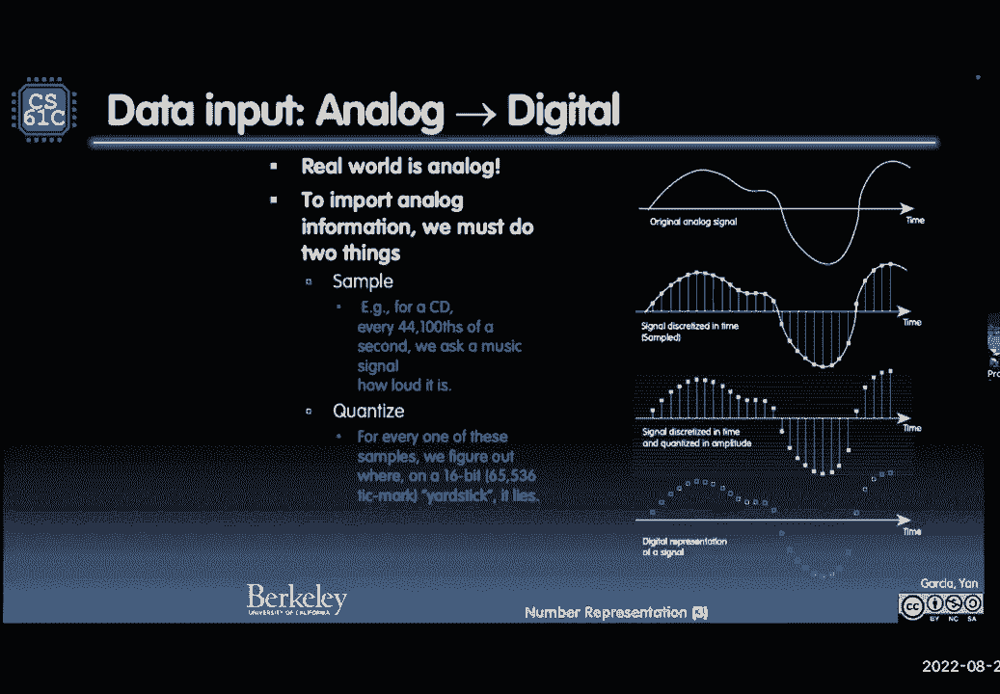

好啦，我点击，我的事情不是在这里我们去，但是，不一定是天生的模拟，你可以有存在于计算机中的数据，一个艺术家的程序员的想法，看看这些美丽的图片，这些漂亮的三维图形，我在这个部门获得了图形博士学位。

我在拍这样的照片，我喜欢这东西，所以你可以让一些人进入一个程序，做一些惊人的射线追踪，这个的图片，这些都不是来自对世界的采样，这都是在电脑泡菜中诞生的，我还没告诉你什么是比特，但是一点点。

这种想法在计算机中存储了一些比特可以代表任何东西，例如两个六个字母，我可以用五个比特，为什么那五个比特是五个电灯开关，五个灯开关有多少种不同的设置，嗯，每一个都是一个，一为零，好的开或关。

五个不同的电灯开关有多少种不同的设置，三十二二二，两次两次两次，每一个都是两个的选择，所以有三个两个可能的选择，我当然可以在那些里面储存两个六个字母，所以这些灯的设置之一是，另一个设置是B等。

所以这是相当强大的，所以如果你说好，我还希望能够做标点符号的大写和小写，我可能需要七块，事实上，我们存储了八个比特，如果我们能做到七位，八位称为ASCII，所以如果你想说，我想在计算机中存储一些字符。

问你想问，我站着看，怎么样，呃，以美国为中心，那就是，你知道的，因为他代表着美国信息交换标准代码，因为我们代表了我们自己的字母表，不是另一个字母表，对呀，所以很明显我们应该给一个美国人贴上标签。

我们只是在储存，B和C不是，每个国家都用bs和cs作为他们的字母表，但事实证明，一个Unicode小组说，你知道的，让我们更笼统地说，外面的世界，让我们试着存储人们在字符集中使用的其他符号。

所以unicode作为一个开源联盟出现了，他们现在有不同的套件，所以八位有点落后，与ASCII兼容，但你也有十六位，二到十六是个很大的数字，大约一万六千，二到三十岁，二大约是四，当二三二三两年，四百万。

不过，我们马上就会讲到，好啦，嗯，我告诉你吧，那是很快的事了，好啦，40亿所以你可以拥有40亿件东西，所以这很酷，四十亿个不同的字符，四种不同的符号，图片，你可以有一个表情符号，是呀，里面也有表情符号。

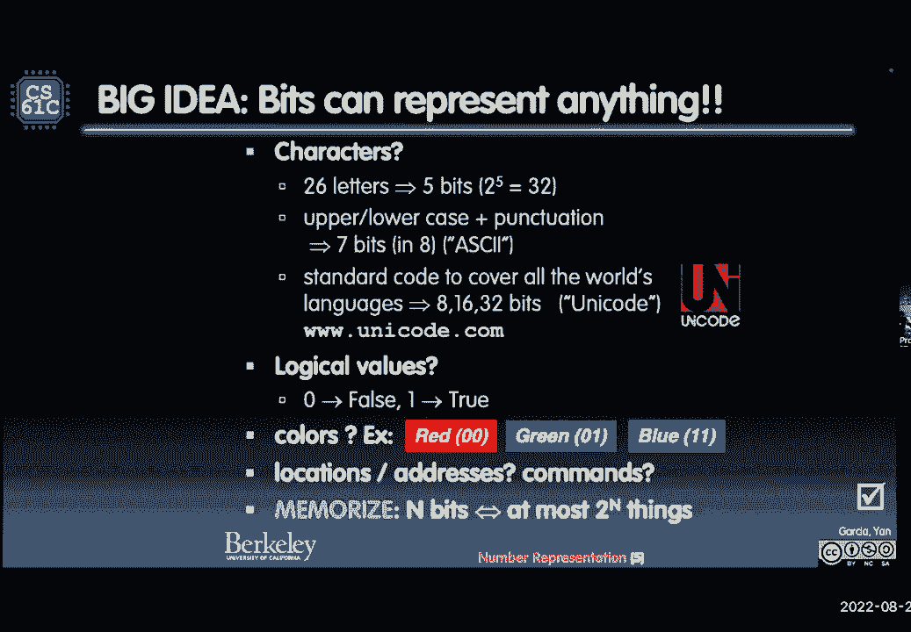

所以这真的很酷，真的很丰富，非常好，您还可以具有逻辑值。

真假零和一，你可以做颜色，我可以选择颜色，我是说碎片可以是颜色，是呀，因为比特可以代表任何东西，位代表情感，情感呢，真的有点可以做情感，愤怒，零零快乐，零一收到，如果你能列个单子。

您可以为它分配一个位模式，那不是很酷吗，所以即使是情感，地点，地址，命令，这是要记住的关键，把你的笔记圈起来，绕到这边来，这是我们要测试你的一件事，这是我在这里测试你的第一件事。

N位最多是N件事的2比N，如果你有两个，如果你有两个以上的N个东西，你做不到n位只有n的2次方可能，n位设置，好啦。

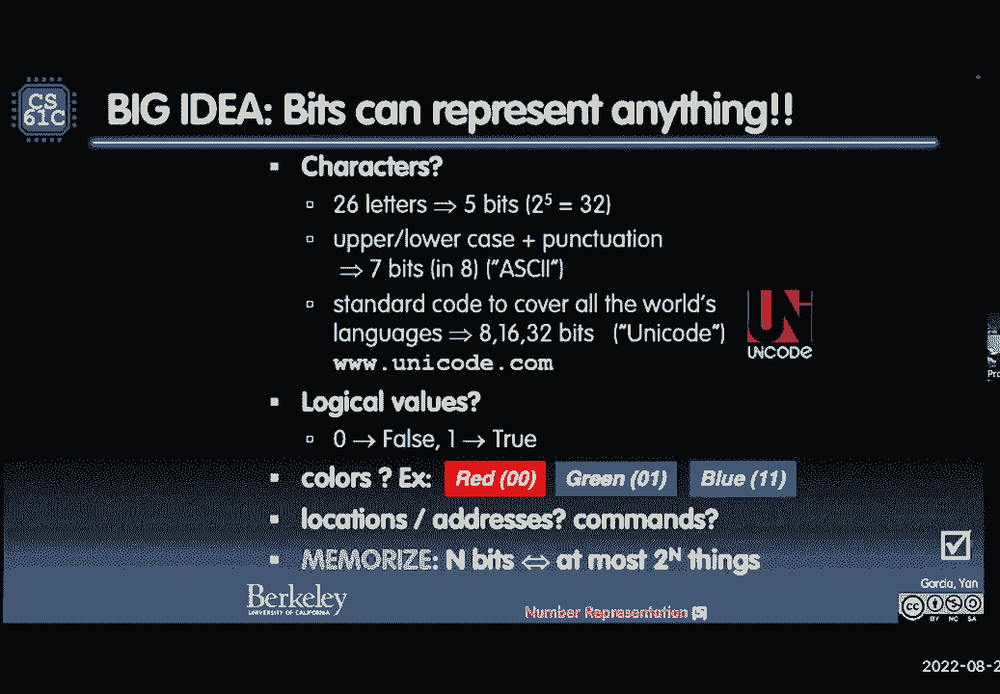

很容易，这是我们第一次互动尝试，我们试试这个，这是一个叫做民意测验的系统，到处都是，免费的，对校园里的每个人都是免费的，我们试试看，这里，我们走，你得有个问题，你要用多少位来表示，哇塞，我们试试这个。

用多少位表示圆周率，一比九，因为圆周率是三点，一个四，所以这是三个人的这种模式，关键是看不见的，四个人中就有一个，一共是九位，六十四，因为Max和计算机有64位，机器的每一个比特或无穷大，好啦。

我们这样做有两种方法，你要么，如果你现在有电话，我们试试这个，这都是免费的，我只是想知道是谁干的，这只是为了好玩，文本ddg，我名字的首字母，丹加西亚博士二二三三三，一旦你这样做，你进去说，哦好吧。

欢迎到任何你想投票的地方投票，然后你用A、B、C、D或E投票，好啦，试试看，否则你在电脑上就可以走了，去投票，EV网络，斜线DDG，你会有一个很好的小界面，让我知道，如果你有什么麻烦，我们试试这个。

所以你试着给我竖起大拇指，如果你让它工作，如果上面说，哦，我得到了它的工作，我看到了，哦，我看到一些拇指，是呀，让我们试试这个好吗，太酷了，好啦，我要等到再试一次，有机会投票，稍等一下，哦不，哦当然。

我听到了我听到了开头，我听到火警的声音，我就像，哦，我的第一次演讲，第二讲，第二讲，好吧，我们开始吧，你要投票，为你的投票和竖起大拇指快速休息，点个赞，如果你做完了，竖起大拇指，如果你做完了。

让我看看房间，竖起大拇指，有些人还在点击，我看着人们低头看着，我要等，再过半秒打电话，这就是丽莎和我要做的事情，每次演讲，所以你习惯了，也许你有，也许你会记得二二三三三，你发短信DDG。

会有一种不变的东西，这就是我们要做的其他选择题，整个学期，好啦，我们好吗，每个人都投了票，每个人都投了票，你把你的电话号码，是呀，好啦，让我们看看会发生什么，我只是要去点击这个按钮很快发生。

希望这行得通，我点击右边，让我们看看这是否有效来吧，给我一些爱的点击器，来吧，来吧，给一些左边的点击器，没什么是不做的，我得手动点一下。

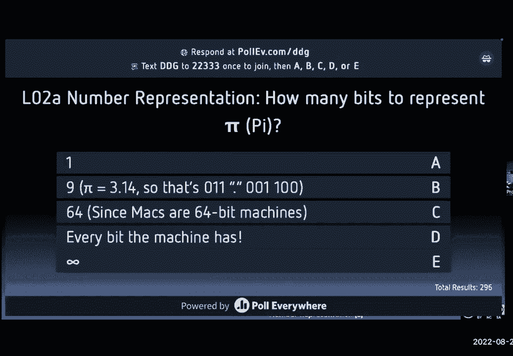

让我试试，他们应该告诉我答案，让我看看，哦嗬，那不是很酷吗，你没必要把幻灯片留在外面，这是个很酷的功能，男孩无限有趣，我要问你一个问题，丽莎，我要用这两个手指在二进制中，告诉你绕了多少圈，绕了半圈。

我绕了半圈，我要用我的四根手指用二进制告诉丽莎，丽莎，有多少次我绕了半圈，那么我走了多远，如果我做了，我走了多远，如果是一个，总圆周率到底有多远，等待堆，我皈依了，我皈依了。

我用一个比特告诉了一个圆周率，这个怎么样，我必须喜欢，盖上，所以我让她明白，零，一个圆周率，两个圆周率，三个圆周率，用两根手指，那是四种选择，但不知何故派被调职了，刚刚发生的事，那不是一个零，答案是零。

如果我想表达一个概念，我们都同意，我按圆周率计数，她懂得圆周率，二π三π，她用两块做了馅饼，告诉圆周率前面的数字，所以圆周率是免费的，你们知道圆周率是免费的吗，我在圆周率前面给出n，零位。

如果你想要圆周率，或者不是圆周率，那是一点，但我没告诉她，不是派告诉你的派，但协议是，一直都是圆周率，我给你一些数字，我不需要任何，只需要转换圆周率，这是个有趣的想法，这是一个完整的元的事情，说说那个。

你的朋友很酷，我喜欢这个诡计问题，你们都错了，我爱，那是我最喜欢的部分，好啦，我的点击器不太高兴，让我继续点击这里好的。

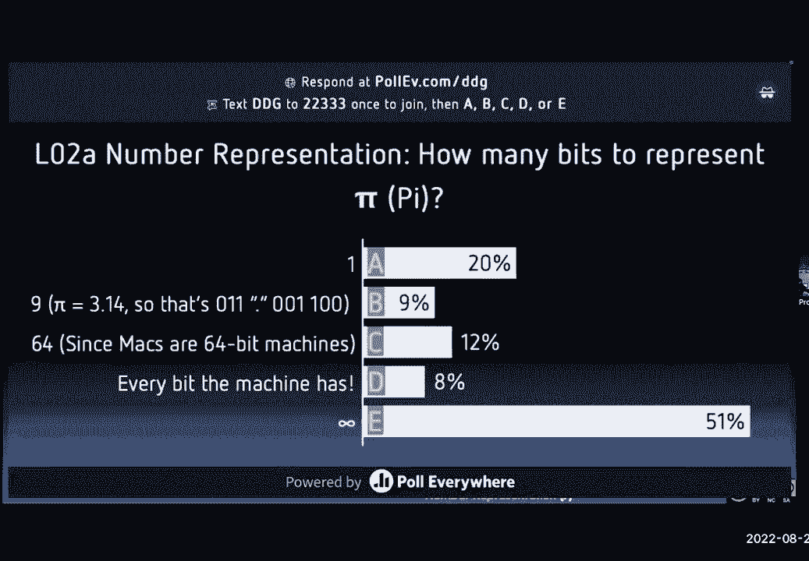

找不到的，这应该是这个总结，好啦，我们将讨论二进制十进制和十六进制是隐藏网络。

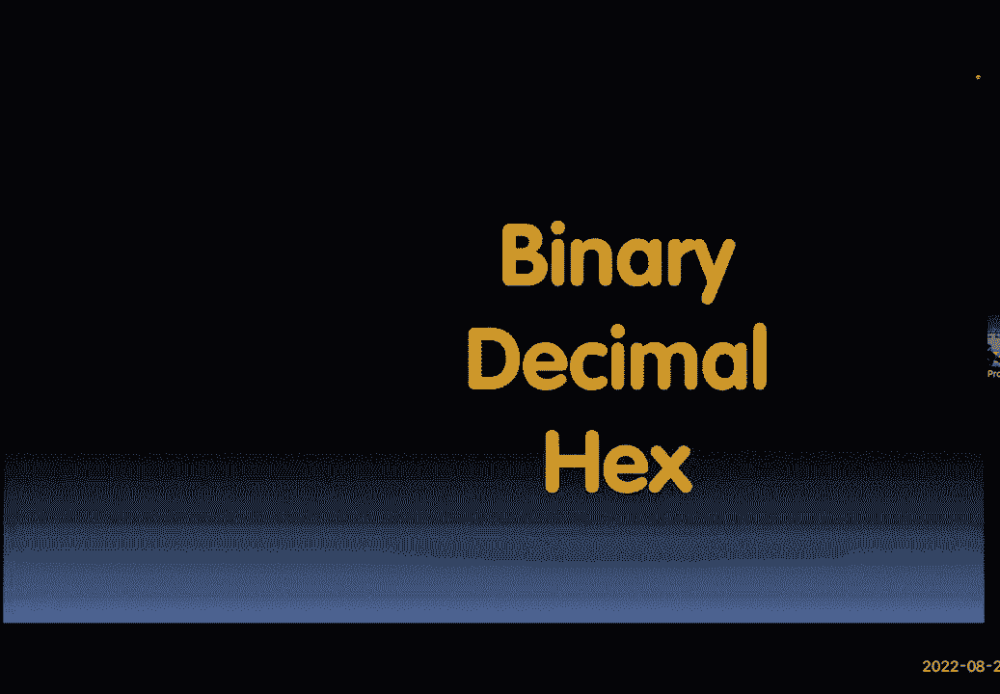

好啦，我想让你们都知道数字和数字的区别，谁听说过罗马数字，举起手来，谁听说过罗马数字，没有罗马数字，只有罗马数字，为什么这个滑梯我们开始了，有一条抽象的线，我喜欢这个，如果我教数学家，他们就像。

什么是抽象线，我只明白，我知道什么是抽象线，那很酷，有上线也有下线，记住那些事，线下是一个数字的概念，数字的概念是线下概念，我想让你们都呆一会儿，你就迁就我吧，闭上你的眼睛，闭上你的眼睛。

只是每个人都在四处张望，闭上你的眼睛，想想数字四，你的大脑正在为你形成什么，只有四个，想四个，好啦，睁开眼睛，好啦，你想的是它的概念的数字，他们只有一个，只有一种东西，我们都同意，它在零点的右边。

在号码线上，四点了，他们有多少种表现方式，那些是数字，这个是上面这种三角形的东西，这一次就像四个U R wao IV的符号，开始了，那是四个，我在你脑中传达了一个数字，你拿到号码了，好啦。

你的意思是在你的大脑里，你说四个是什么意思，但我把数据传给你的方式是通过一个数字，数字是数字是制造数字的符号，所以四十二四二由两个数字组成，四二，那是数字四二，代表四二的概念是那种很酷的。

所以这是一个罗马数字，iv是表示四的罗马数字，好啦，所以数字对数字，我可能会犯错误，但你猜怎么着，没有二进制数，有二进制数字，因为线以上的东西是你如何正确地表示它们，有十六进制数字，有十进制数字。

但是没有二进制数，所以人们说嘿二进制数，你得阻止他们说没有二进制数，数字是一个概念，你说的是二进制数字。

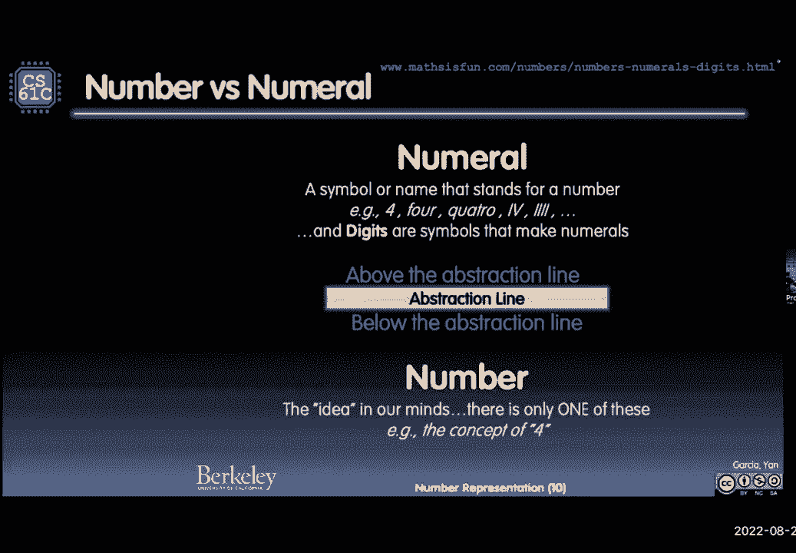

我可能会犯错误，因为我从小到大一直在想，但他们不像丹那样帮我纠正我，我想你说的是同一个号码，好啦，十进制，看这些以十为基数的数字，因为这个数字代表3771，我们要写下标告诉你什么基础，它是三乘以十。

那是什么意思，三十七是什么意思，如果我有的话，我今天赚了3771美元，或者今年的美元，说那是一大笔钱，那到底是什么意思，好像我很慢，我一年级的时候学过这个，是啊，是啊，但当我学习和改变基础时。

它会帮助你，这真的意味着三倍十到三千，记住这是三千一个大盒子，你只有三千加二百加七十个，你还记得他们展示了一个小正方形，十乘十，对然后一个一个，那么当我从滚动中改变底座时会发生什么，当我想到二进制。

记得我有十个不同的数字，为什么我有十个数字，我们稍后再谈，如果我想用两位数，零和一看看这个，二进制数字变成位，那不是很整洁吗，我和TS变成了碎片，这就是比特的意思，位表示二进制的BI，和数字的TS。

那很酷，希望你们今天能学到很多东西，顺便说一句，请随意领取讲义并写作，所有这些东西都写下来了，如果你只是在一张白纸上写，讲义会帮助你，不必用一些幻灯片复制，在你给幻灯片做标记之前，幻灯片就发完了。

所有这些没有人应该是我，你做你想做的，但是一张白纸在做笔记，我是想帮你，好啦，所以按手，如果你需要，二进制的一零一是什么，顺便说一下，你怎么知道这不是10101井，你一次也没有，突然之间，我想释放海妖。

现在有多个基地，然后我们得谈谈我们说的是什么基地，就像我说跳，你说我对全息甲板上的电脑有多兴奋，我说我想喝茶，上面写着，你要冷的还是热的，现在我说1，1，0，1，你说什么基础，丹。

所以我要把它们写在一般的地方，如果我没有基础，我们将永远是十垒，像这样，或者我可以用二进制的意思来使用这个词，暗示了一些其他的基础，我会写在这里，你会怎么做，说零b，如果我有那就是零，不是一个O零B。

那意味着什么，下面的内容都是二进制的，二进制数字，不是数字，但在数字意义上，治疗是二垒，或者我可以在这里写一个下标，上面写着基数2，好啦，所以一个一个，零一井，我以前是怎么做到的，记得吗，就像10比3。

10比2，十是多少十是基数，所以这意味着每一列在某种程度上，每一列都是那个幂的基，我们从右边开始，那总是一个，最右边的列总是一个基到一个是基，这是我有多少个碱基，底座平方底座2 3是底座对底座对3。

不管碰巧是什么，你得到它的底座立方体，所以如果我说1-1-0-1，这实际上意味着这些系数在这些项前面，所以是一乘以二的三，一八一四不二一八四一是十三，那不是很酷吗，所以在二进制中。

或零b一零一或一零一基，二是十进制的十三，这就是如何将二进制转换为十进制，我们要做所有这些。

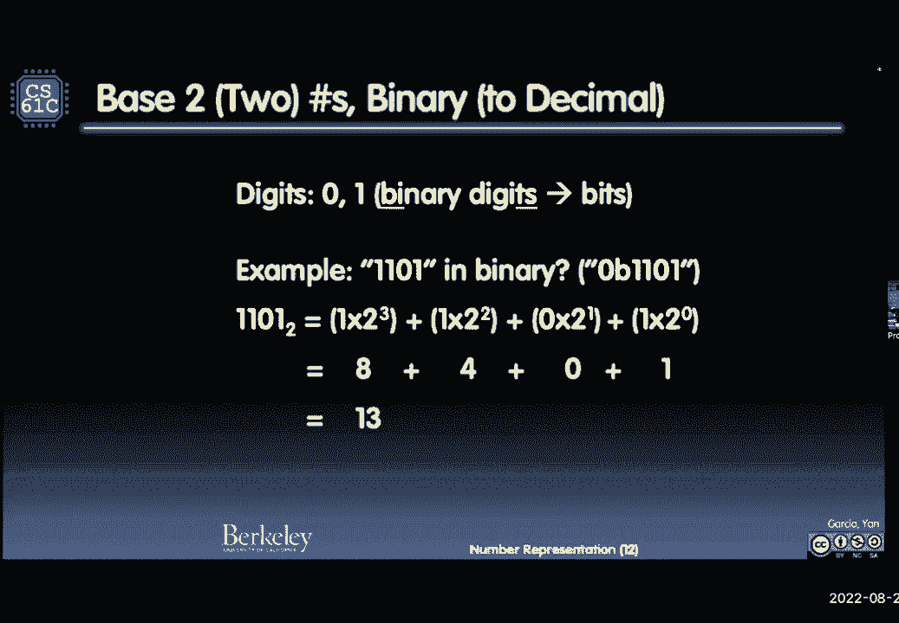

你知道的，等一下等一下，等一下等一下，对计算机科学家来说，还有其他有趣的基础，其中一个是十六进制的，十六进制很好，除非我以16为基数，那很好，除了那样，我们只有九位数，我们用来表示数字的九个字符。

我们得到了，如果我们需要，又多了六个，我们得有权利，我需要零到九，那是十分十分，从零到九是十件事，我还有六个，我还需要六个，我们怎么能借已经订了的东西呢？人类知道是有秩序的，或者至少美国人知道。

那些信呢，所以一旦我们过了九点，我们将开始使用字母，因为无论是人类还是美国人，你知道吧，所以一个，顺便说一句，你可能会认为，嘿，看看十六进制并不能真正翻译成其他语言，如果他们没有通过，F。

那不是很有趣吗？让我们想想我们是多么以美国为中心，当我们想出这个的时候，所以A是十，如果你看到角色，十字A，那意味着那个地方得了十分，B是十一，C是十二，D是十三是十四，F是十五，你可能会说，哎呦。

等一下，我以前见过，当我在html上看像颜色之类的东西时，是啊，是啊，F是最大的一个，F都是1，因为f是15，都是四个人，二进制中的一个，五和十六进制是什么？现在我们做十六进制到十进制。

那么在这里你如何表示，你可以在底座上说一些符号，对呀，那很好，或者我可以在零b之前说零x，现在是零x，零x 5或5小于16，到目前为止，一切都好，“好吧，这是什么？”，我们做同样的事。

我们把这些柱子做成十六根，基数16是多少，十六点到零点是正确的，大多数列，十六分之一是下一列，十六的平方等于二五六十六除以三等于四十，九十六完美，所以我们开始了，我有一个，这就是我必须查的，现在a是十。

或者我能记得十点十六分，一共一百六十五块一，所以1六十五加5等于1六十五，很酷吗，你可以这样想，作为，亚马逊盒子里你想卖给你的鸡蛋，让亚马逊把鸡蛋运给你，然后运给你，其中一个盒子里装着一个鸡蛋。

是一个很小的盒子，装一个鸡蛋，其中一个有十六个蛋，其中一个有两到六个蛋，大箱子顶住六六，好啦，所有这些都在说，我有十六个盒子中的十个，就像如果我哦，货到了，我得到了十六个中的十个，我得到了其中的五个。

我得到了多少鸡蛋，做一些数学十六乘以十加五，那不是很整洁吗，原来你是这么做的，想想亚马逊鸡蛋盒，想想这个挺酷的，谢谢你。

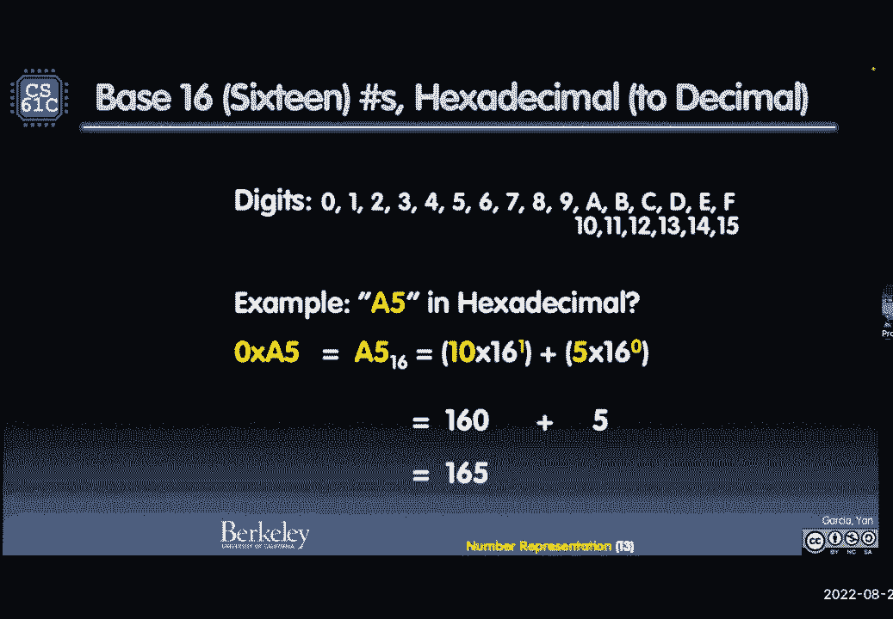

亚马逊，顺便说一句，每个垒都是十垒，就像等等，我喜欢这部动画片，我喜欢这部动画片，住在四号基地的外星人，为什么？因为这个外星人的手上总共有四根手指，上面说有十块石头，因为他们在四垒，他们看着四块石头。

他们说有十块石头，十，基数四是一，四和零一，所以他们说有十块石头，我说，哎呦，你一定是用了基本力量，参见我用十进制，我就想等等不，我用十进制，那个外星人知道零一、二、三和基地是什么，他们称之为十进制。

他们只知道这些，那不是很有趣吗？只是把它扔在那里，想想那种元，是的，每个地下室都有一个基地，一个基地有点奇怪，是啊，是啊，这个只是所有的，对了，基地一号是一元的，就像监狱里的日子，你喜欢进监狱吗。

一直在监狱里，我不知道，我没事，哼，那是我以前的时光，从监狱出来没关系，但不不，否，不羞耻的人，你知道，人们进监狱，出来吧，人犯的错在监狱里没关系，你的标记是这样的，就像理货标记，对呀。

你在监狱里呆了多少天，那是最基本的，继续为每个人砍一刀，好啦。

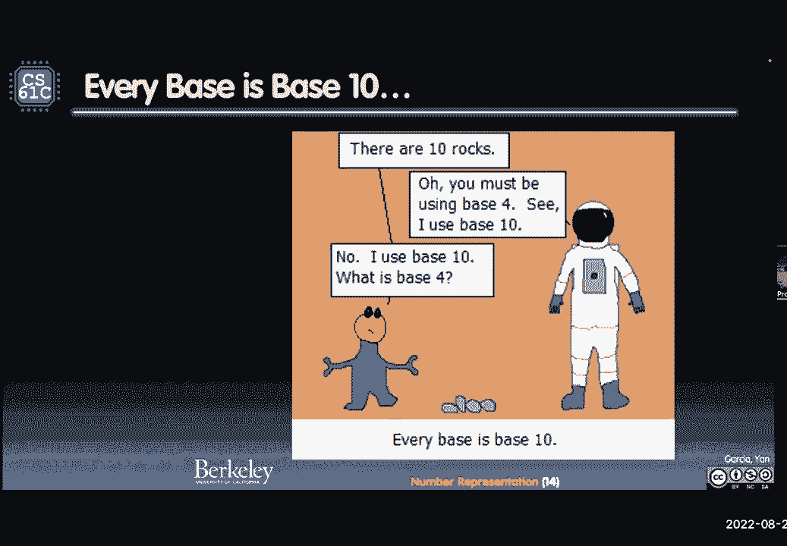

开始了，我们开始吧，我已经告诉过你如何把两个东西转换成十进制二进制十六进制，但我还没告诉你怎么回去，所以让我们来谈谈返回的算法，对每个碱基都是相同的算法，其实挺酷的，开始了，例如，十三记忆四是。

你知道13是什么吗，当时是1：01，但让我看看我有十三个，什么是什么在二进制中是什么，它是这样工作的，你从柱子开始，基于零基，到一垒到二垒，敬三个，你以前见过的东西，你写这个，所以这是在我们的十进制。

我们会写八四二一，这是它的工作原理，你去，顺便说一句，你可以继续写更多的专栏，你可以写16年，我们开始吧，这里左边有一个16，开始了，这是算法，很简单，从左到右，你从左向右，你说列小于或等于n有多奇怪。

这是我对此的看法，和我在一起，我要运回13个鸡蛋，到亚马逊，我运的每一箱都是我的麻烦，我得把它包起来，我要付邮费，我想要尽可能少的盒子，跟我说，所以我有一个二进制的。

我有一个能装16个鸡蛋的盒子我有一个能装8个鸡蛋的盒子，我有一个能装四个盒子的盒子，拿着两个盒子，拿着一个，亚马逊，不会拿一个没有装满的盒子，这只是数学上的智慧，你有一个完整的盒子。

所以我看着我的十三岁，我去，哦，16美元看起来多汁，我能在16美元里买13个吗？是呀，但我会有差距吗，哦，我有一个缺口，我做不到，所以我会用零，16个盒子有意义，我装不下13号和16号的箱子。

没有任何缝隙，所以我不会用16，我扔六十啊，那是个很好的盒子，我喜欢那个盒子的形状和颜色，好啦，我不能用那个，我有一个八盒，八个盒子里我能拿回多少鸡蛋，要做多少盒，我有足够的钱来填补至少一个，八块钱。

是呀，二进制中我能放多少八个盒子，只有一个，那么我该怎么看着我，我说，我有足够的钱吗，我做了，我在那里放了一个，然后我问自己，有什么问题，我还剩多少，好啦，13减去8，我得到五个。

现在我一直走在这条线上，好啦，我要用那个盒子，我买了四盒，我有多少鸡蛋够装满一个四个盒子，是呀，一个可以装多少盒，所以我把它填进去，放一个，做同样的事情，五减四等于一，我有两个盒子。

我可以把剩下的东西装满一个两盒的盒子吗，我画了一个零，现在有意义了吗，好吧，把它零，继续走过去，我还剩一个，我填满一个，我就完了，好啦，你对此很满意，这就是算法，我们现在试试，再用力一点。

我们去16号基地，开始了，好啦，我有一百六十五个鸡蛋，我有一个大盒子，有46个圣诞节用的大盒子，对96岁的人来说，这是一个美好的圣诞节，我可以在四十六个盒子里装满一百六十五个鸡蛋吗？

我可以在一个2-5-6的盒子里装满65个鸡蛋吗？我可以保持，我可以从一个大盒子开始，所以你可以继续零，你可以一直留下零，任何数字，你赚了多少钱，二三做到了，你还做了0 0 2 3，是呀。

你可以在任何数字的前面有零，所以我说一百六十五，开始了，我至少可以在一个16盒里装满65个鸡蛋吗？是呀，我可以装多少箱，我写十个吗，在那里我写了一个看，这是关键，你必须转换小，将其转换为，好啦。

一旦我装满十六个盒子，我还剩下多少五个，做同样的事情，循环循环五五，到目前为止，一切都好，那很酷，所以现在你可以在理论上转换，二进制和十六进制到十进制，十进制到二进制和十六进制，来来回回，还差一个。

如何无缝地从二进制到十六进制，这就是下一张幻灯片的内容，让我说到那。

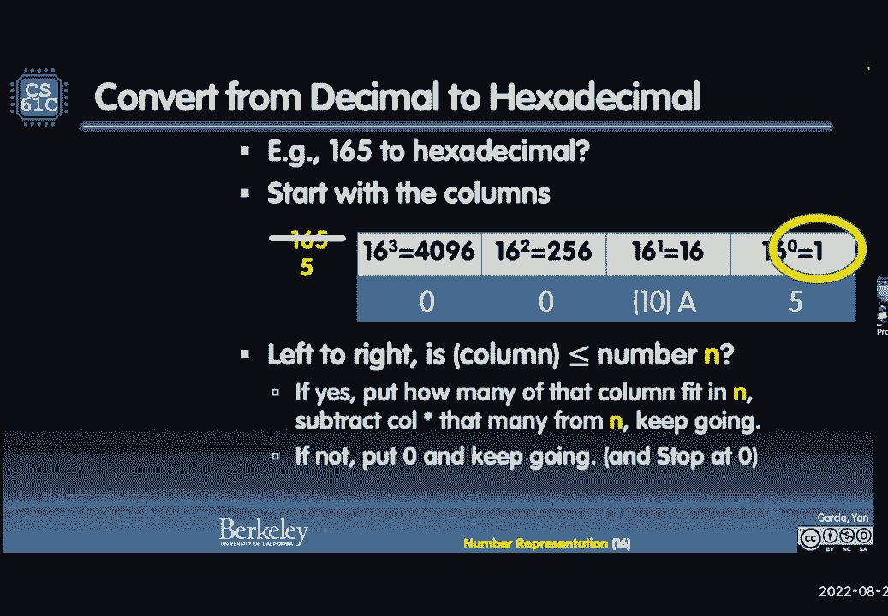

我必须，我想我得离得更近，让我看看，有道理，我们开始了，好啦，二进制十六进制是，他们都很容易，请不要，不要从小数点回到X，就像嗯，我需要从这里开车，我要从这里去奥克兰，从旧金山到奥克兰。

所以我知道有航班，从纽瓦克到奥克兰，那不是，不要不要走，不要走太远，别进小数再出来，呆在家里，保持六进制好的，二进制到十六进制很容易，总是在Pad上留下零，以生成四个四位值。

为什么这个表是单十六进制数字映射的表，我的朋友们，这是第一个值得纹身的人，我会提到更多值得纹身的事情，并说，你想做个临时纹身吗，或者一些很酷的东西，把二进制十进制十六进制转换表，我也鼓励你们记住。

因为我们都背下来了，所以请想想记住，这很酷，好吗，所以我们开始了，我得到了1 1 0 5个不同的二进制数字，丹说了什么？我必须在左边零垫，使它至少是四个长度的倍数，所以我要把它归零。

然后你就把它们映射成四个，但分成四块，四个大块，四个大块，因为你把它变成了4的倍数，你永远不会有任何奇怪的剩余，问题是为什么，你不知道为什么如果你跳过了一步呢，你跳过向左填充的步骤，你从左边开始。

看我的，答案是一个，E好的，一一四一一，零是一，E，如果你做错了怎么办，没有左填充，看我在这里我们去，我可以从左边走，一个，一个，一个，已经结束了，你错了，答案里没有F，答案是一个E。

所以你不能从左边走，除非是四的倍数，或者你可以从右边走，你可以从右边走，那很容易，左垫然后从左到右，好的或者从右边开始，如果你对二进制做十六进制，真的很简单，例如，如果我给你一个E。

你只要查找它们并将它们连接在一起，一e变成零，零比一，一一一零代表e，现在你得到一些零，你就把它们扔掉或者留在那里，没有，同样的数字并不重要，所以二进制到十六进制再回来，容易，他们两个。

简单的十六进制到二进制比另一种方式更容易，因为你不能在二进制旁边犯错，如果你留下0，那没有错，如果你把二进制变成十六进制，你可能会犯错误，如果你从左到右不填充它，到目前为止可能是错误的，好啦。

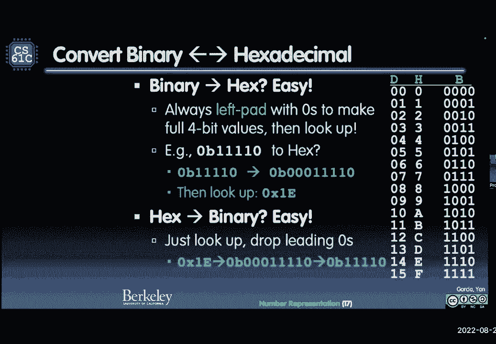

再见，哈克斯这么多只是花了一点时间比我想象的要长，让我们看看我在这里做得怎么样，好吧，现在四个比特是一点点，因为八位是一口，像计算机科学幽默一样咬一口，这是一个，咬了一口，字节听起来像b i t e。

你说吃半口，这是一点一滴的一点一滴，好啦，两个比特是什么？呃，我不知道我喜欢什么，我不知道，所以我们来了，咬一口，所以我之前看到的一个十六进制数字对吧，一个十六进制数字是你看到的16个东西，那是一点点。

好啦，所以那是一口，这些是我给你看的16种不同的咬在右边，好啦，两个十六进制数字，两个十六进制数字，让我们想想两个x数字转换成多少东西，二百五十六件事，零到二五五，为什么让我们让我们做更多的数学。

两个x位数在这里是4，每个十六进制是四位，4位加4位是8位，二和二五十六是多少？所以两个x位数分配给六个东西，其实你可以看到我，我可以在变焦上做这个吗，我不知道这在变焦上行不行，如果我这样做并放大。

注意你在磅号之前看到过这种代码吗，然后像这些希腊的东西，这就像，D零三六七F，那是一种颜色，那是零到百分之五十五的红色，零到五份绿色，两两五蓝色，当你把它们放在一起，你得到了这种美丽的粉红色，整洁吗。

所以如果你想知道，这是如何工作的，现在就是这样，你就像，哦，实际的部分是什么，我可以这么做，因为我可以给它一个十六进制到二进制，现在呢，实际数字是多少？从你知道的，二五，两个零到两个五这三个中的每一个。

我可以改变他们，挺酷的。

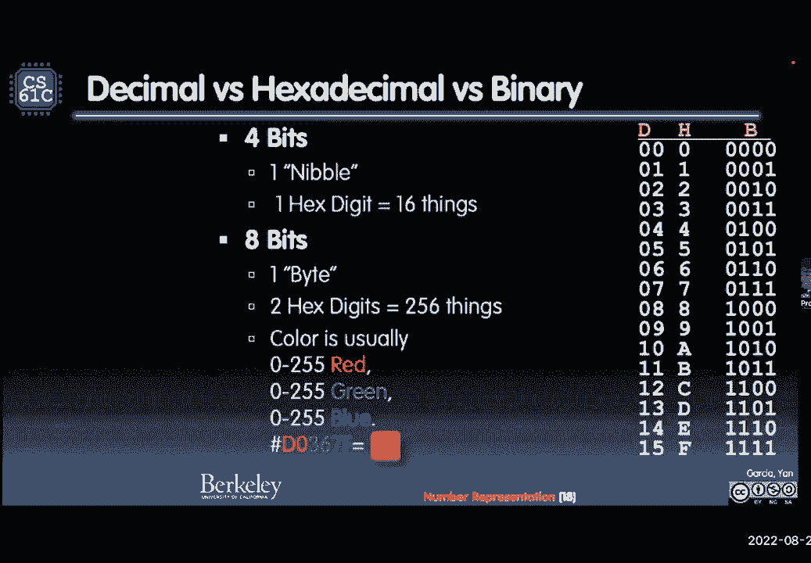

现在我们用哪个底座，我们为什么选择这些东西，小数对人类来说很棒，你知道的，如果人类在看一堆二进制数字，男孩让他做黑客肯定更有效率，它的效率提高了四倍，这是二进制数，我没说，数字数字得抓住我自己。

嘣看这有多小，这是十六进制数字，效率高得多，以四倍的优势，所以我们喜欢，例如，如果我必须转移颜色，如果你有，哎呦，我要做一个新颜色，我的网页我需要输入24个不同的1和0，讨厌的六个不同的十六进制字符。

小菜一碟，对呀，所以这很有趣，所以十六进制真的很棒，但对算术来说很糟糕，如果我想做一些二进制，算术真的很糟糕，二进制对这个很好，好啦，三二基十等于三二基十等于零二十，因为2乘以16等于3，二等于一。

就是三二位置的那个，或者在它后面加上0 b 1和5个0，好啦，另一种方式是你可以来回移动，我希望你能参加我的考试，流利，所有这些所有这三种方式，三箭六箭，三件事，小数，二进制十六进制。

能够从任何人到任何人，这在我的考试中是绝对需要的，好啦，所以练习练习练习，你会得到的。

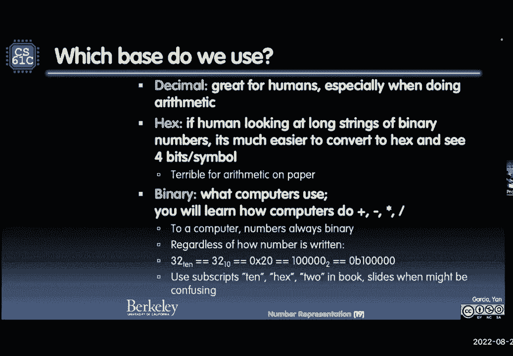

电脑也知道，我喜欢让我放大，所以你可以在网上看到这个，如果你在房间里看不到这个，因为它太小了，事情就是这样，那是代码的图片，有一张被这个东西取代的车的照片，这里面发生了一些事情。

那是一张毫无价值的幻灯片。

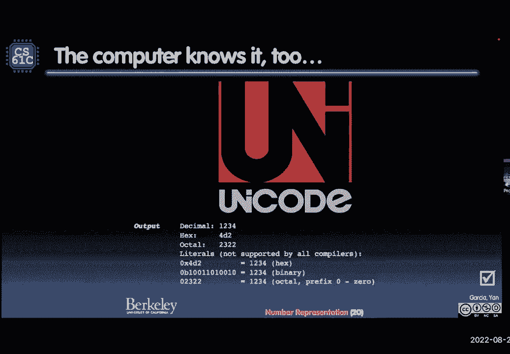

那是值得一滑的，嗯，我们将与您分享，原本应该是，有一张被替换的代码的图片，可能到处都是我的照片，所以谢谢投票，到处都好，这堂课的题目是数字表示权，想法是数字，它的表现形式是什么。

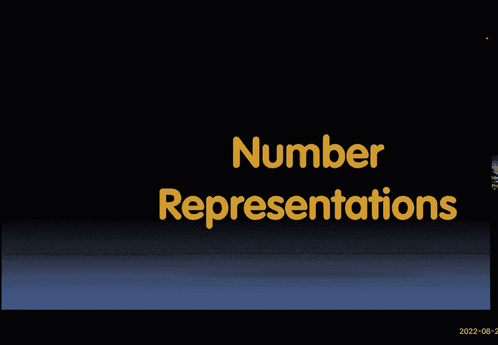

我们今天讨论这个，所以这就是问题所在，你能用数字的表示做什么，你能用这些数字做什么，这就是你能用数字做的一切，你一年级的时候，加减，乘除，但是等等，你是说这些基地，是啊，是啊，他们仍然工作相同。

因为十进制没有什么特别的，十进制没什么特别的，我失声了，我好兴奋，在基地也一样，排名第一的是什么？零一零，记住这个十十是十，那很容易，零一是十，为什么八加二等于十，十是十，什么都是一，一一说四二一。

七个模板，七是十七，如果你算一下，现在是十七岁，一个要带着看一个，这里有一个，这个一个变成两个，我们只能代表一个，那是零，加一等于零，拿着那个，加一等于零，拿着那个，因为它是16和17，会有用的。

它只是在美丽的，你带着，就像十进制一样，但每个插槽只能有一个或零，我的意思是，所以这真的很酷，这里有个问题，你怎么知道，如果一个数字比另一个大，就去，这几乎是个问题，那是一年级的学生，这里有一个。

这里有一个，我要在黑板上写点东西，三五，这里是四二，哪个更大，很难抬头，三比四大，我只看到3和4的符号，哪个更大，你得知道4是多大的，好啦，所以大一点的，所以有一个更大的井，但是三百对四十二怎么样，嗯。

三个现在不是说四个比三个大，但是三百比四十二大，为什么？因为有更多的斑点，那么如何在二进制中做到这一点，你怎么分辨两个二进制数字和数字，哪一个大两个二进制数字，是呀，告诉我告诉我你的名字。

告诉我你的名字，呃哈里，去吧，从左到右，是的，是的，如果左边大一点就对了，后来它变大了，但如果他们是一样的呢，所以呃，去参加我的婚礼而你一直在重复，你实际上递归，你向右递归需要。

所以这就是你在二进制中做的，好啦，在二进制数字中很酷。

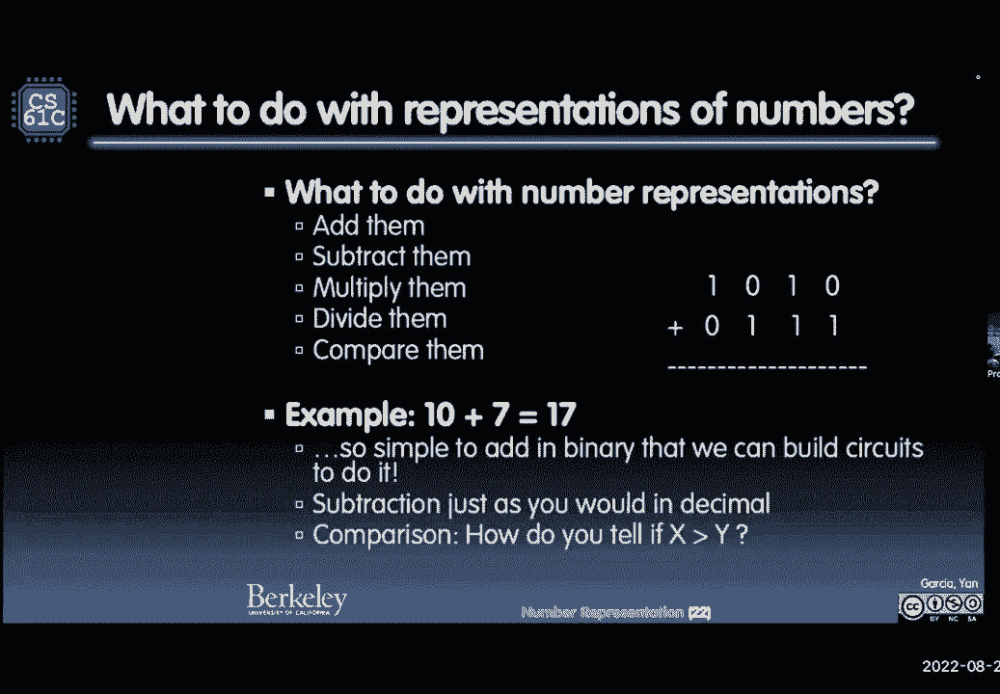

只有正数，所以现在流血，我的血呢，好啦，开始了，如果它们太大了怎么办，你说太大是什么意思，嗯，我这里有五块钱，这些表示很好，但它们是固定的，只有一定数量的东西，最后记住两件事，如果我想储存，两个到M。

再加上一个从没坐过旧校车的人，在一辆旧校车里看到了什么，当里程表读到9-9-9-9，你再开一英里，那个数字怎么了，它包裹到零，你认为在二进制中会发生什么，同样的东西不是那么整洁吗，所以用五个比特。

我可以从所有的零或零计数，这是我的，这是我的两个，我最大的数字是多少，五位，我最大的数字是多少，我最大的数字是多少，这其实是正确的，我最大的数字是多少，我可以用二进制数来表示，所以我说的没错，三一。

当我开一辆的时候会发生什么，我认为这是一个主导权，这是数字线是里程表，这是一条数字线，顺便说一句，底部是数字，数字在上面，数字线是下面的人，当我数到三，两个，再走一英里，它包装成所有的零。

这也是计算机中发生的事情，那不是很有趣吗？

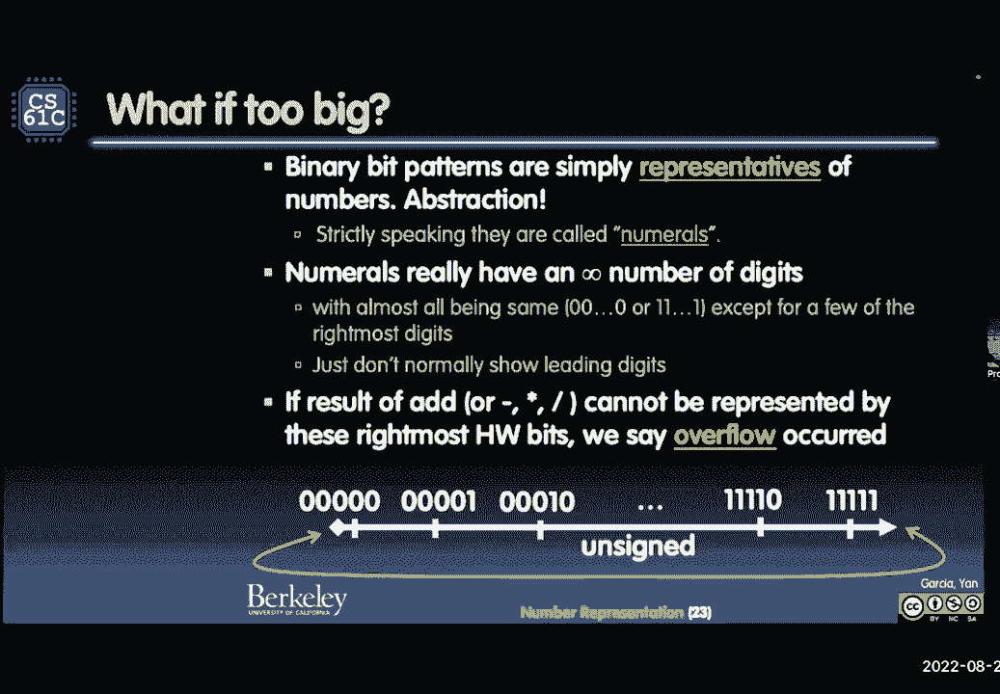

好啦，所以数字真的有无限个数字。

但是计算机是有限的，我们就像我们现在，我们在想哇哦，资源有限，我第一次不得不和他们分享，就像，你知道的，你告诉他们圣诞老人的事，他们没事，这是现实世界，伙计们，我们在计算机中有一个固定的数字空间。

我们认为它是完美的不是现在，固定基地会限制我们，这意味着有时我们的计算是不对的，十六加十六，我不能在这里储存，十六加十六，在这张地图上，在这张地图上，零，只有三个，两个包裹在那里，等等，六十六是零。

是呀，这里正好是零，因为我不能储存这三个，二是那么疯狂，所以我们称这两件事为无符号，因为我不是，没有任何迹象，没有正面或负面，这是第一部分，第二部分是当这个包装，我们说发生了溢流，好的，现在溢出来。

为什么箭反了，如果我在一两个，我减去一个，我要倒车穿过金门大桥，我们还有两英里，我不认为这样在车上行得通，但不管怎样，我会在里程表上看到一个，我会看到零，再走一英里，所有9，如果向前走被称为溢出。

你认为那叫什么，你觉得倒退叫什么，我听说我听说底流错了，这不是暗流，它也被称为溢出作为一个诡计问题，也叫溢出。

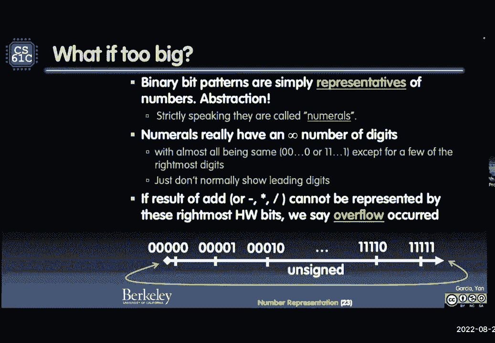

好啦，我们想做负数，这种积极的事情是疯狂的，我们如何做好负数，到目前为止，我们已经看到了未签名的，没有任何迹象，没有正负之分，没有任何迹象，我们做过无符号的数字，这就是我们以前所做的。

这是显而易见的解决办法，不如我们偷一点，如果我们从左边偷一点，左边是我们的标志位，只是为了让它在，让零表示正，一表示负，所以我们和以前一样，一点点，所以这样做，把零变成正，这意味着前16个数字是一样的。

所有的零到零一一一是从零到十五，和以前一样，一点都不奇怪，嗯，让我告诉你这个小故事，好啦，再来一个，让我们再走一英里，让我们再试一次，会发生什么，我还有15英里，这是它的底部，我先走了，注意这里。

然后是负的，我的意思是，一零零零是负零，因为左边就是，那是我的负号，现在剩下的都是零，所以是负零，等等什么耶，负零度现在让我们再行驶一英里，里程表是多少？读一零一，意思是负1，现在我走错路了。

记得我每多走一英里，我现在每走一英里都很积极，我是消极的，我们不喜欢那样，好啦，所以有些经理有这个缺陷，当你不断增加计数器，你现在变得更消极了，让我给你讲一个关于，天下没有免费的午餐，有一个世界。

有一个我喜欢这个故事，在这个寓言里，有一个城镇有长老，一群男人和女人，都是大头发，他痛苦地俯身，国王，非常强大的国王说，我想学所有关于经济学的知识，走开，走开，长老们和他们一起写，所以他们离开了。

花了一年时间回来，这里有八万七千页，当然国王，我们一整年都在努力工作，我们现在有，这就是经济学的全部，他说没时间读这个，回去让它更容易，所以说，我的天啊，就像回到画板上，长老们回去了，他们回来了。

他们说我们写了这本书，解释了所有的经济学，没有时间，把它弄小一点，因为他们一年后再回来，这部低俗小说不会让你有时间回到那个，这本漫画书将解释所有的经济学，没时间去了。

这份单面的行政文件只解释了所有的经济学，他们没有时间离开，他们回来了，他们说，好啦，我们已经归结为一个简单的想法，即所有的经济学都是，这不是免费的午餐，你不能不劳而获，就是这个意思。

这是一个非常有力的想法，为什么我在一个没有签名的五比特之前就提出来了，我可以从零到三一没有免费的午餐，说如果我偷了一点，我不能再这么大了，这是十六块，我以前可以做一边，我不能再做没有免费的午餐。

意思是我得拿点东西，我不得不付钱得到一些身份，一个非常强大的，在经济学和计算机科学中都有非常强大的想法，所以我偷了些东西，现在我可以从负0到负15，那太好了，两个零。

我的范围在某种程度上比0-3-1-3-2小了一点，我有两个不同的。

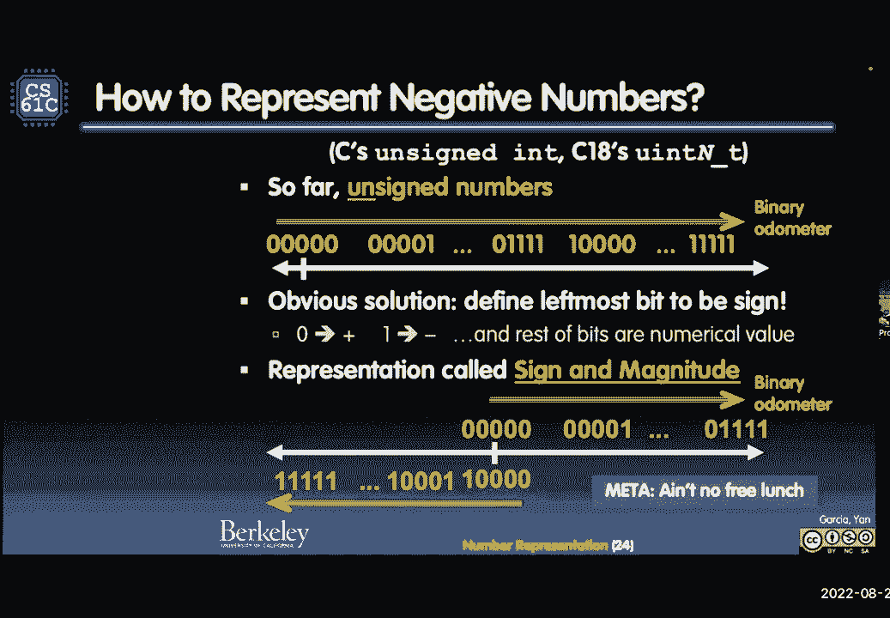

我也不喜欢那样，好啦，缺点，我们简单地讨论了一下算术电路，如果我试图建立像活页夹这样的东西，比如电路，实际的矿石和结来做实际的数学，真的很复杂，整个负面的事情让我们很难做到我们可以做到非常丑陋。

真的很丑，我们得到了两个零，我们谈过了，当我看到一个32位的数字，由八个十六进制数字书写的十六进制数字，所有的零都是零，左边那个是八一，零是八，所以如果我要给你看三个两个比特，左边的是一个。

变成了八零零零，那是负零，所以我得到了两个零，我不喜欢那样，我们讨论了二元变化方向的增加，我们也不喜欢那样，所以他们说，我们怎样才能解决这个问题，如果我们流血了怎么办，我得靠近点。

所以它实际上只用于信号处理。

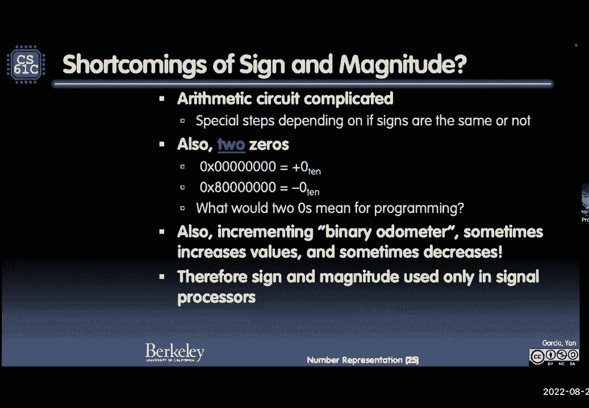

或者其他一些东西循环，如果我们把这些，我们翻转位，使其为负，全部翻过来，全部翻转成负数，我们谈谈吧，让我们看看那里会发生什么，所以这里是七零一一一，好啦，正七，你同意吗，减七等于一零零零，那很有趣。

我只是把所有的部分，“好”是什么意思，记住所有的正数都保持不变，所以零来适应，挺好的，从0到15不变，一切都保持不变，但是现在负数是多少呢？事情就是这样，什么会，让我们看看负零，都是对的。

因为负零把它们都翻转成1，负十五是多少？让我们走里程表，我们的里程表怎么了，开始了，我们快到十五了，什么是一零零零零等等，在这里，我总是很积极，现在看看会发生什么，因为这里的1-0-0。

那个比这个多一个里程表是这个，所以我实际上总是积极的，我很喜欢那样，那太好了，我们不喜欢的问题是什么，可能是一件事，我们不喜欢两个零，如果我们能喜欢，把底部移过来一个，我们会很好的。

所以这个代表负15到正，十五加两个零，如果我们能把这个东西放在左边一点就完美了。

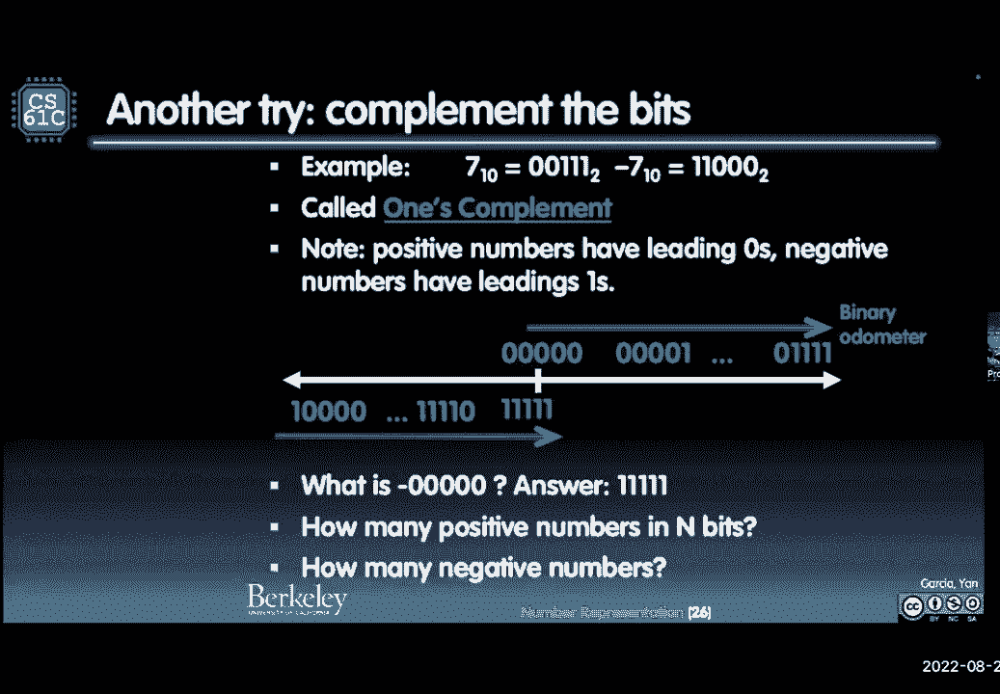

女士们先生们，欢迎来到，那是个缺点，我在这里说了一会儿。

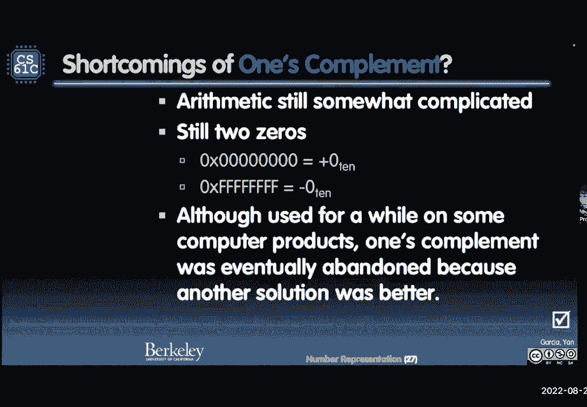

我们实际上不再使用它了，选择补语。

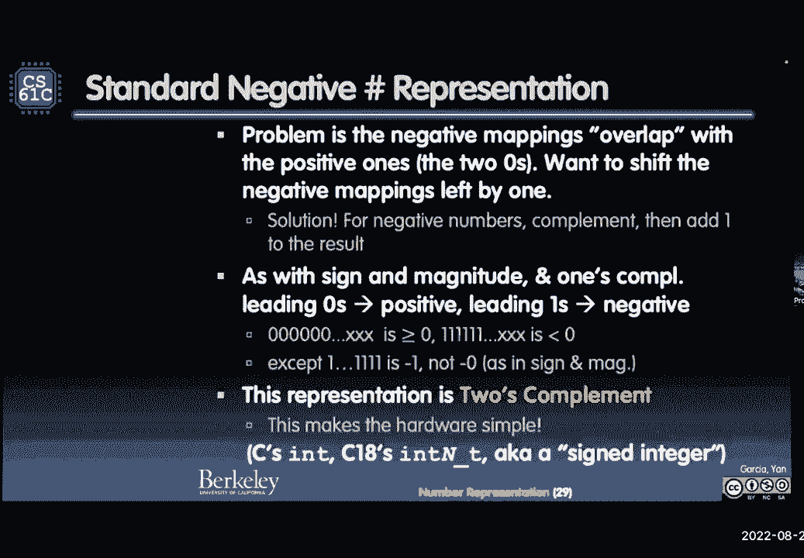

我们要把这个放进去，随着时间的推移，我们开始了，问题是零重叠，我们不希望这种事发生，我们之前说过，好啦，所以这对选择夫妇让这变得很容易，如果你说int，如果在你生命中的任何时候，你说过整型或整数之类的。

但是int，你不是在用，在前面这样选择补语，如果你说未签名，你在做之前的无悔，那是最简单的，如果你说选择补语，如果你说int，你的意思是选择赞美，很酷的循环，让我在这里做，就在这里，回来，回来，所以说。

这是公式，这里有一个思考的方法，记得我说过，把他们往左移那么多，我得花多少钱才能把它们转移到井里，如果你还记得之前的照片，我会把它们移到16个左右，记住那个数字，就像十五乘十六，然后我得到负16到负1。

十六是那个次方的二，减一作为负数，所以这里有一种方法来思考他的补语，最左边那个，倍增，这是最左边的系数，是二进制的负2，减去一个将整个负面完全转移到，所以负1是你能得到的最大的一个，你可以说服自己。

如果你把最左边的负16，就算加一个一个一个，15加16等于-1，所以左边的数字把他们转移到了，所以它们现在不重叠了，它们在图片中并不重叠，很酷吗，还有一件很酷的事，让我们做一些否定，我们开始了。

如果这是一个，零一，那是几号？我不知道，让我们把它倒过来，然后再加一个你必须，然后反转的时候再加一个，所以每当你把这里的东西颠倒过来，两个人的公司，你倒过来加一个，所以和我在一起所以1 1 0 1。

我不知道那个数字是多少，我来还原一下，哦哦哦一个零加一个，都是一那是三，所以一个一个，哦，一一定是负三，我们拿三把它倒过来，哦一个，哦1变成1 1 0，哦，我加一一零一，我又回到了负3。

所以实际上它是倒置的，加一个，反加一等于二的补码，它总是有效的，那不是很酷吗。

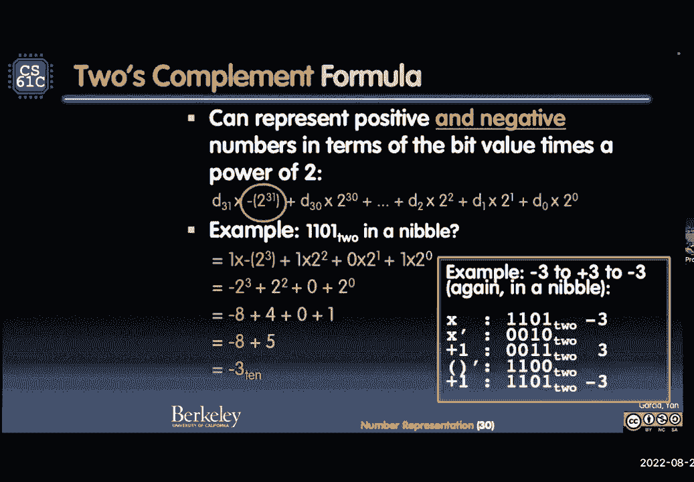

整洁的东西，顺便问一下，它对零有效吗，取零，把它们倒过来，所有的加一个，全部归零，还是零，所以负零就是零，它实际上也适用于零，那真的很酷，这是二的补数的数行，从零点开始，到15岁之前，那不是什么新鲜事。

你在这里看到了这个，这和底部是一样的，但是注意，我们把底部向左移动了一个，现在我没有两个零了，它只是完全有效，因为我得到的负数比正数大，最大正数，因为负数是负16，因为我把它移到了16。

所以我还有一个负数，然后我做一个正数，有点需要好了开始吧。

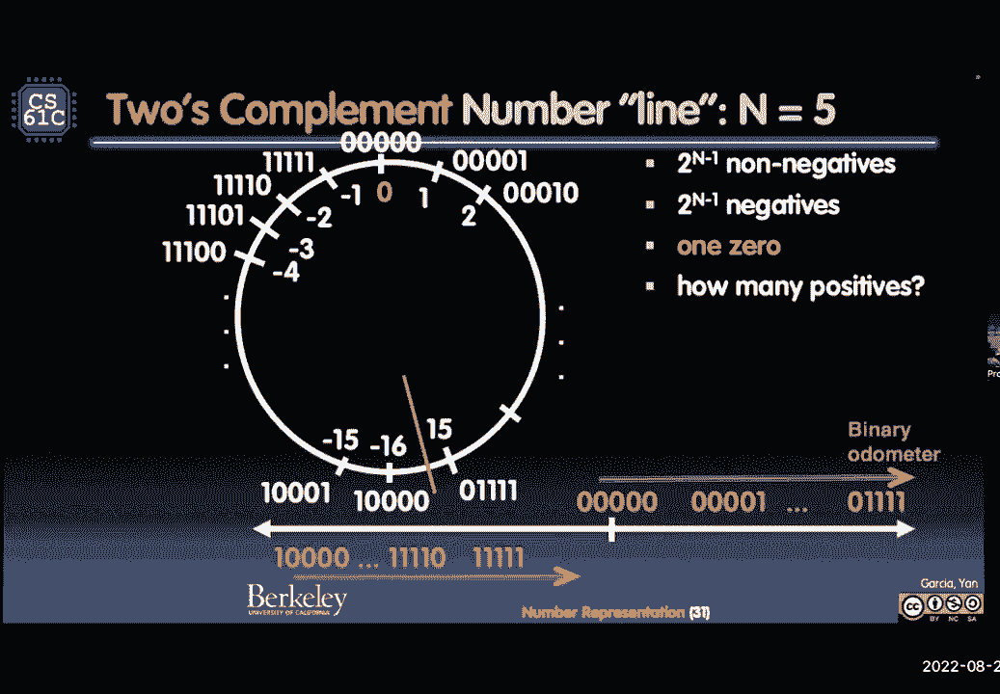

所以这是最后一个编码，我有三分钟的时间来报道这个，现在你是说，如果你有过从零到三五的电信号，你有没有过正弦波，好像不是正弦波，它不是在零附近摆动，就像在这里招手，就像这里是零，它在这里挥舞，好像会很酷。

如果我可以把它滑下来，所以我可以看着它，就像在示波器上，所以我们说的是，我给它加了一个偏见，如果我减去一个常数，它会减去这整条曲线，然后把整条曲线向下滑动，所以现在它在零度左右摆动，这就是它的作用。

它表明你知道整个零，从零到三十一，如果我把它切开，让我们把整个未签名的数字，对呀，整个未签名的家伙都是零，零到所有，记住那个零，所以这是所有1的零，如果我只是把整个东西，只是滑了一些，所以所有的零。

而不是在零，所有的表示都是零就是零，每隔一个零和无符号零，零和1补零，零符号曼零，只是恭维零，但在这里，我把零加到所有的数，以某种偏差把它们往后滑，所以所有的零现在是有意义的最大负数。

所有的1都是最大的正数，只是有偏见，记得丽莎和我说好要用圆周率来数吗，你同意解码这个的人，让我们就偏见达成一致，再给你五块钱，它的偏差是负15，基本上一般，默认情况下，偏见总是一个，这样你就多了一个。

一个比喜欢更积极，几乎比我有点相反，你得了负16分，但这里只有15分，恰恰相反，偏差是负15，所以最大的数字是负15，因为零加偏差是，所以这里是零编码从比特做无符号，然后你加上偏差，这就是你说的数字。

所以所有的零都在地图上，再加上偏差是负15，一直到十六岁，因为3 1减15等于16，所以偏向就是把整个东西向后滑动一些，这就是你要做的很简单，我想我没有时间回答点击器的问题。

但我做得很好涵盖了所有这些东西。

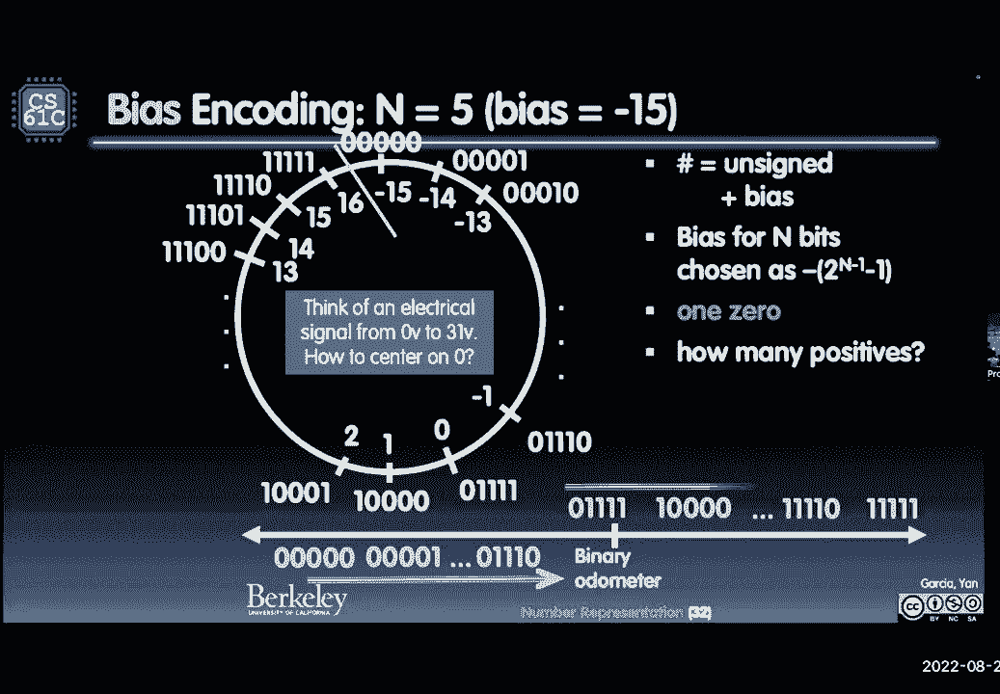

让我过去，点击器点击点击器，你也许该考虑一下，你怎么表示负2，十二点七十五，你怎么能做到一点点。

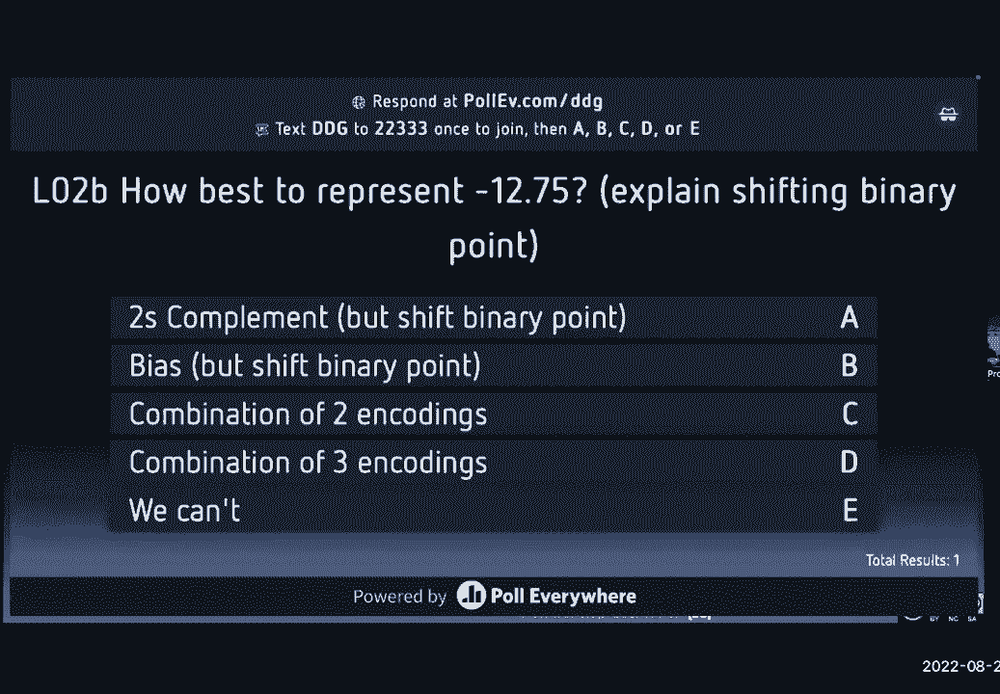

当阴性时，那很复杂，我想我得点击右键。

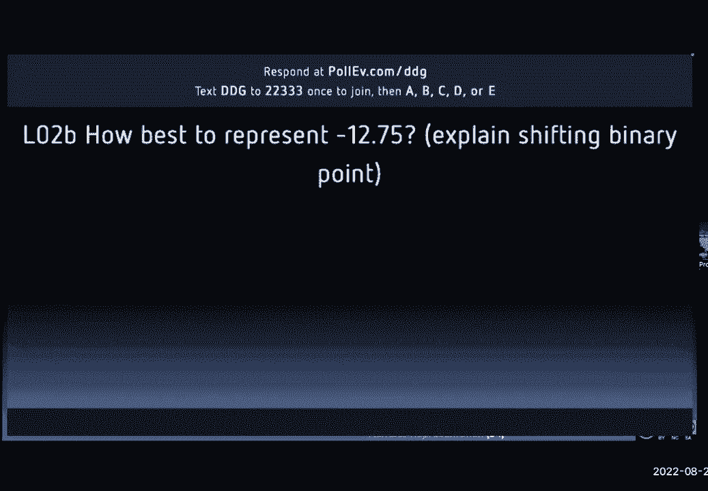

投票，好啦，总而言之，我们及时完成了，二到n位是二到末尾，东西，五种不同的整数编码，每种都有不同的好处，全部可测试，现在通过所有的无符号为零，二的补语，我们主要用，对所有的都是零，然后你又回到阴性。

最后又有一个负数和正数，节点两个零，非常感谢，数字表示和不要忘记。

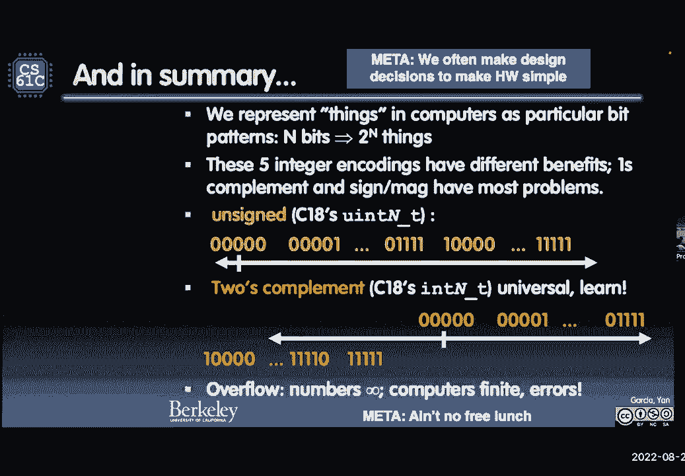

天下没有免费的午餐。