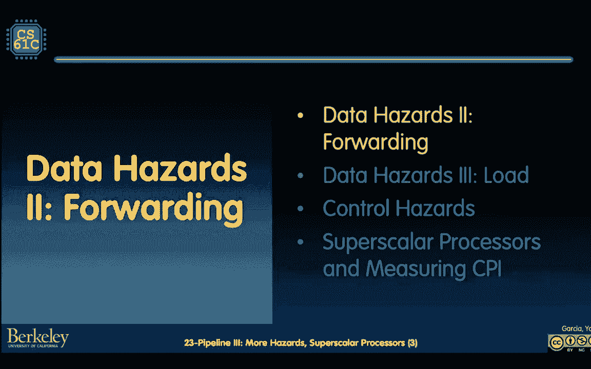
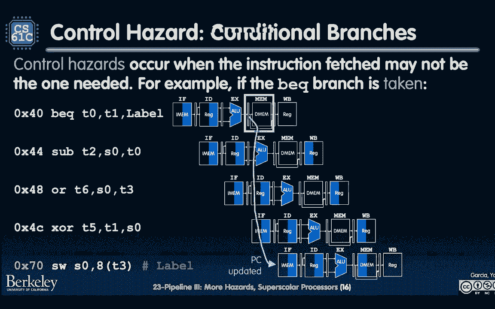
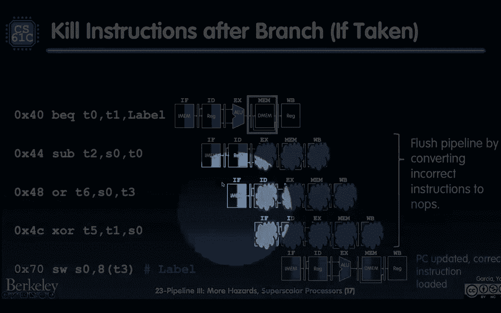

# CS 61C at UC Berkeley  - Fall 2022 - P30：Lecture 23： RISC-V 5-Stage Pipeline III,Hazards - 这样好__ - BV1s7421T7XR

拥有这一切，还有期中考试，所以这周请务必参加实验室，另外请填写期中考试复习表，或者在期中复习表上，就像丹在第一节课上说的，这是一个实验，在不同的时间亲自做，你们在实验室里做了，也用那个巨大的窗户带回家。

为了你，真正感受并建立你对风险五和风险C的信心，请让我们知道我们将来在这方面需要改进什么。

关于期中考试的其他注意事项，我想乔和公司是什么。

是的，公司发布了这篇教育帖子。

而且这些幻灯片应该很快就会出来，如果他们还没有，请不要谈论任务，还有几个学生在上，而且我们还没有写出解决方案，或者更确切地说，是对我来说，我们还没有为你们所有人发布解决方案。

但是当你被允许谈论期中考试的时候，我们会让你知道的，如果您在紧急情况下有任何与考试有关的问题，对此感觉不太好，不管怎样，请发邮件给我们，在伯克利大学六十一C给我们发电子邮件，我们可以帮你安排。

我们就能知道在这学期剩下的时间里什么对你有用，如果你喜欢，最后一件事，但在期中考试的这段时间里，现在你真的很担心赶不上课程，也许是因为期中考试后我们也讨论了很多内容。

请务必报名参加学生支持会议，您可以通过扩展表单来完成，谢谢你，我们期待着在这门课上继续支持你。

希望你能感受到我们61C家族大滑梯的支持，这真的只是一个顶级声明，你得仔细阅读每一个细节，但是我们有首尔国立大学的李杰教授，他实际上是作为实验室会议的一部分来发言的，所以当呃，当你这么做的时候。

当你读博士的时候，或者当你在那种学术环境中，你有不同的研究实验室，这并不总是意味着人们在做，你知道，就像生物学，实验类型，有时他们在设计gpus和这些不同类型的设备。

所以切片实验室实际上是一个领域特定的架构实验室，所以围绕不同类型的应用程序设计，在你们今天看到的所有处理器中，然后呃，李教授现在要在，呃，让我们看看一般的域特定硬件，如果你看了他的简历。

他真的读了博士学位，在这个地区，在另一个机构，也在谷歌呆过一段时间，所以我认为这将是伟大的，呃，这是这是变焦，我可能也会在周三的课上分享它，话虽如此，你们中有多少人复习了星期五的课，或者喜欢。

看了星期五的讲座很酷，所以我看到90%的人，没关系的，如果你不确定的话请举手，我们要做一个快速回顾，因为我知道每个人都有点回到这些事情上，期中考试之后，然后我们会我们会跳到这些事情的其余部分。

我们称之为危险，但在我们谈论危险之前，我想提醒你我们在这件事上的位置。

调用管道数据路径，那么管道数据路径有什么不同呢。

这是当不是只有一个指令，可以按顺序执行所有阶段，我们实际上有多个指令共享管道，然后我们思考这个问题的方式是，假设我们有一个加法指令紧跟着一个子指令，假设我们在这个特定的时钟周期中，当我们看到这个小的。

类似管道梯形图，这里是add指令当前处于执行阶段，在ALU阶段，所以目前使用管道的这一部分，然后子指令使用ID阶段，就是这个指令解码阶段。

这实际上意味着它正在访问寄存器文件，为什么我们可以让这些指令共享相同的管道，我们可以有这些叫做管道寄存器的东西，保存这些数据，所有指令的数据，然后在成本上升的边缘，把它冲洗出来。

以便能够让指令使用那个阶段，如果这有点像快照点，允许所有这些指令数据共享同一组导线。

但请注意，实际上有几个，呃，这里有一些叫做危险的东西。

特别是在我们的添加和子的情况下，现在我有三个指令，我还遵循了这个叫做或和或指示的东西，我们有这些叫做危险的东西，当一些指令在那里，实际上还不能正确执行。

因为它使用的源寄存器为零，它使用第四个寄存器为零，在之前的指令中写到的，我们知道如果我们把所有的细节都流水线在一起，然后零寄存器直到第五周期才会被写入。

如果我们从一、二、三、四、五开始。

如果那是第五周期，嗯，实际上潜艇在上一个周期需要它，就在这里。

因为它需要添加，或者你需要用t零减去s零。

它实际上是这里正在发生的事情，那井是在身份阶段吗，它读错了值，s零的旧值，在幻灯片的底部正好有五个，它不会更新到，假设新值，哪个是哪个是九，直到它被写回这个WB。

好啦，所以这就是这里的危险，Sub实际上不能与。

或者也读取错误的寄存器寄存器值x零，因此，从技术上来说，它也不可能发生在那里，因为有一种叫做数据危险的东西，它得到了错误的数据，那么解决办法是什么呢，嗯，我们最后一次谈到，这就是我们的结局。

我们谈到了一个叫做拖延管道的事情，换句话说，遵循一些指令，使它们实际上不执行，在他们等到没有更多的数据危险之后。

然后他们就可以跑了，这看起来像是当潜艇，有一些解码发生，然后，然后管道实现，哎呦，其实呢，我现在还不能开潜艇，因为我正在读的零还没有被写到更新，所以它让这些东西沿着管道冒泡，对于这个图来说。

这到底意味着什么，M，就我们的理解而言，管道阶段只是运行垃圾数据，所以它只是运行垃圾数据，它实际上并没有写任何东西来更新其他地方的所有状态，然后在第二盘的第二盘也是如此，它试图再次运行潜艇，但这就像。

啊，好啦，好吧，又来了，因为零还没有被写入，我没有S0的正确值，然后我要去努普，否则我会冒泡或失速，最后在这最后还是在这，呃，在倒数第二行，现在是潜艇，在这一点上，当寄存器文件为红色时。

将在此ID阶段从中读取，这个指令解码阶段很好，它发生在同一个循环中，当寄存器文件被写入后台右侧时，因为上次的寄存器文件是一个写，然后读这个可以发生在同一个循环中，所以这很好，最后一条指令。

或者在这一点上，嗯，我们肯定知道F0没有被写入，所以我们可以，我们可以像平常一样抓住它，有时讲座结束后会出现一些问题，感觉还行，嗯，就像，这是怎么发生的，这些泡泡是怎么起作用的。

你可以想象在之前的图表中，如果我很快回到上一张幻灯片，如果我很快回到上一张幻灯片，只需添加更多的电线和添加更多的块。

并添加更多通过管道寄存器布线的项，还记得上次我们谈到控制。

通过管道寄存器转发，大家可以想象一下，也有一些没有操作的谎言正在通过寄存器转发，以确保我们不会将任何内容更新到我们的状态文件中，像寄存器和内存，但是，事实证明，这实际上是一种昂贵的，就时间而言昂贵。

因为这意味着在接下来的两个周期里，你不能实际执行这些指令，你的整个管道都停止了，没有执行或没有执行，没有完整的，否，没有一个指令是完整的，所以转发是另一种硬件解决方案，实际上显式地有线连接。

管道的输出登记到不同阶段的不同部分，换句话说，在上一个版本中，我们在上一张幻灯片中，我们在考虑我们只能从寄存器中读取值，当它们都正确更新时，但我们知道，由于我们的五级管道，到那时。

到了第三季的时候。

我们确实有什么，结果f 0的值是正确的。

在舞台的最后，在此执行阶段结束时，因为零是g零加t一。

然后这个值通过dm，男人们，男子舞台，然后在后台写到右边，但在最后两个阶段并没有改变，所以所以，如果有一种方法可以直接连接前阶段的输出，前阶段的输入，然后我们就可以知道在下一个周期。

当我们执行子指令的alu部分时，我们实际上可以用S0的正确值执行，这是一个这是一个巨大的一口，但让我给你们看另一个例子，也就是说，在这一点上，让我们来看看OR指令，所以这个或指令有效地。

我想说的是在执行阶段，我们只需要知道零点的正确值，因为这是操作数之一，源运行良好，我们什么时候知道正确的值，嗯，从技术上讲，它是在前阶段写的。

但我们在后台的时候就知道了，但我们知道前男友的广告，广告的前任发生了，所以如果我们有类似，如果我们要把s零转到mem阶段。

因为它最终会被写到，右后卫。

我们可以把输出连接在一起，这是零进入或的执行状态，我想，老实说，这可能是所有图表中最具挑战性的图表，我们要在蔚蓝区做的，因为这里重要的是要知道，这就像是同一条管道。

好吧，就像我刚刚重复了三次管道，但这是同样的硬件，那么转发是什么意思呢，转发意味着结果及时转发到某个未来值，所以在这种情况下，我们说E，x在时钟周期三中添加EX的结果。

转发到su的ex和focycle four的输入，而不是等到时钟周期五，它被写入这个寄存器文件，然后同样地，或者它从这个男人的舞台转移到前任的输入中，第四阶段或，所以时间是向前的，是呀，有个问题，呃。

是呀，是呀，问得好，是呀。

所以有一个问题就像嘿，嗯就像，我们不能喜欢这里的紫色电线吗，从技术上讲，它来自记忆。

那是怎么回事，为什么它会变成x，它不应该从这里一路连接吗。

这是一个很好的观点，其中一些只是基于事物是如何连接在一起的，我想这里的重点是如果你把镜头拉近，让我们看看我能不能放大，我可能无法，但你会在幻灯片上看到的，没有，我不能放大，如果你把镜头拉近。

我要退出，你会看到我的秘密幻灯片，与所有不同的梦想，如果你把这里放大，您将看到我实际上使用了管道寄存器作为，电线从哪里来，好啦，所以你可以在这里看到，正在发生的是，它没有直接连接到ALU的输出。

或直接连接到M的输出，它真的来自我拥有的任何一组管道寄存器，因此，如果我们回到最初的幻灯片，你可以想象Alu值是在e x中设置的，这些紫色注册的英雄，以及这个MWB管道寄存器，所以所有这些都有ALU值。

电线就是从那里来的，实际上，让我们看看，让我们在下一节中看看这个，所以我要向你们展示转发是如何工作的，对于其中一种情况，这是广告子，我不会告诉你潜艇或一个是什么，是啊，是啊，我会，我让你自己想办法。

就像在喜欢，我尽量保持图表相对简单，因为它们非常复杂，但让我们再来看看这个，我们在想什么，我们在考虑这个案子，然后换人，然后我们从x值，这个特殊的管道寄存器，所以存储ALU当前结果的东西。

我们试图将它直接连接到ALU的输入。

所以即使我们在管道上及时转发了这个，数据路径，实际上看起来事情在倒退，因为我们处理的是同一条管道。

每个人都在使用相同的管道，如果我们想转发ALU的结果，让我们看看这是如何工作的，尽管该值存储在ex mem管道寄存器中。

好的，好的，中间这个。

让我来，现在让我强调一下，如果是这样的话，我们需要以某种方式连接这个管道寄存器。

我要留着，当这两个Muhere。

因为它最终会被加入，那么这是怎么发生的呢，只是有些电线。

所以我要把我连接在一起的东西，这里是，我说。

好啦，在内存中的管道寄存器输出，在记忆阶段，会发生什么，它要接上电线。

然后狼吞虎咽，连接到这两个标记，选择ALU输入A和B。

这里还有一些关于我当前指令的信息。

那么这个紫色的指令是什么，这是添加指令。

这里的蓝色指令是什么，它被转发到控制逻辑，这是第二条指令的子指令。

然后转发控制逻辑会做什么，就像是。

好啦，嗯，我知道铝的价值，哪个是输出，也就是f为零，它将需要用作源输入之一，事实上，输入ALU的A，为了下一阶段，为了下一步，那有点，这个文件是怎么回事，你有什么问题，是啊，是啊，我认为就电线而言。

这可能是最具挑战性的，因为在数据路径中，电线倒过来了。

紫色的线在向后，但在梯形图中，箭头是向前的，因为你在，我们在这里有什么问题，好的问题，是的，是的，是呀，是啊，是啊，让我回到上一张幻灯片，不幸的是，我的颜色在这里不完全正确，所以我可能会有点困惑。

呃，是否，到了上一张幻灯片，我们在这里做的是，我们把注意力集中在绿盒子上，我们在说，好啦，我们真正需要的是结果，它位于x和mem之间的管道寄存器，这需要转发给输入，E X阶段，因为从技术上讲。

前阶段是完全相同的X阶段，它只是被执行，每个周期，发生的事情是那么好，EX或管道寄存器的输出，就像回到X输入的电线，但随着时间的推移，至少在时间上，作为这条管道，就像这个特殊的梯子图。

我们看到事情进展顺利，所以这就是为什么我认为这是一个挑战，那么转发的是什么，平均转发意味着及时转发，这样你就不用等着写东西了。

我们将在，呃，这里的下一个例子。

也就是负载，所以让我们看看会发生什么，就像我说的，当我们试图喜欢，比只把东西写到寄存器文件更快，只有在正确的后台才会发生，让我们把这组特殊的指令，从添加到加载字到是否，然后左移，逻辑，在这种情况下，嗯。

我在这里突出显示了一些寄存器，我们可以，实际上他们可能有数据危险，但我们要通过把硬件，或将逻辑转发到我们的数据路径中，所以让我们看看，让我们看看转发可以修复的两个危险。

哪个是更多的硬件和更多的转发控制逻辑，其中一个在广告中写为零，所以更新s零的值，但在下一条指令中立即阅读，所以再一次，如果我们没有转发，这意味着我们必须把所有的管道，在零点之前一直有负载，但是。

因为我们确实有转发，我们会知道到那时，s或t一加t二在前阶段计算，我们可以直接把这个转发到e x阶段进行负载工作，现在为什么加载Word在执行阶段需要零，我们把八加零相加，只是记住负荷工作是如何工作的。

所以这很好，就像在绿色盒子里一样，如果你没事，这里的1和1怎么样？加载字指令中的一个是什么。

让我强调一下，让我看看我能不能做到，这里的一个是我们记忆单词的目的地。

或者像这样，我们的记忆字将生活在寄存器文件中。

所以第一个会在后台更新，但真的，它将在记忆阶段结束时被知道，在这种情况下，只要有一个，或者就像f 0加上8的值，就像你知道这个词在那个地址的价值一样，一旦这个词从内存中加载，从技术上讲。

我们需要在下一阶段把它写到s one，右边后台，但在这个时候，一旦内存字被加载到数据路径中，我们知道它的值是多少，所以我们可以把它作为一个来源转发给，所以这就是为什么你可以看到这根电线。

上面写着好吧，这就是一个值将被知道的地方。

我将需要它为ALU的输入在执行阶段。

好的，所以这就是我们所看到的。

这就是我们在这里看到的蓝色盒子，所以转发解决了这两种情况，因为否则我们将不得不等待另一个周期或拖延另一个周期，右后方写着，转发喜欢是快捷方式。

然而，这里有一个数据危险是四十个不能解决的，所以记住，好啦，当你看到这种类型的图表时，你的口头禅是什么，恰逢其时，转发及时向前，现在让我们看看这个特定的数据危险会发生什么，上面写着好，加载字。

S的一个将被写在后台的右边，但我们会在记忆阶段结束时知道的，但是，或者在E X阶段需要S一个，哦不，这是做什么的，你记得我说过的话，我说过MEM阶段的输出，就像那种管道寄存器，它将知道s的值。

但我们需要这个来输入牛阶段，所以这个箭头是时光倒流，没有进展，那么这里的问题是什么呢，到底发生了什么。

这里到底发生了什么，在相同的时钟周期中我们需要输入，它实际上是其他一些数据路径元素的输出，好啦，所以换句话说，这里的mem数据路径元素需要以某种方式向前向后。

或者像你知道像你知道，所以说，如果我们想想向前向后的事情，这个不太有道理，所以这实际上是不可能的，好啦，为什么物理上不可能，为了让这种情况发生，为了做到这一点，我们可以有这根电线。

我们需要像DM访问这样的MEM首先发生，然后是e和e x，就像alu，需要能够执行，较低的时钟周期仅是ALU或DM访问的长度，所以我们的时钟周期不够长，所以我们可以把这些东西连接在一起，我们该怎么办。

答案是。

当货物发生时，我们真的无能为力，没有硬件解决方案来修复这一个失速，我们有一个额外的摊位，给大家看一下，我来教你这个，呃，这在实践中是如何工作的，好啦，就硬件不可避免地要做的事情而言，因为我们不能后退。

对呀，因为我们不能把时间倒过来。

取而代之的是，当我们看到这个，或者我们知道我们无法在执行阶段及时得到s 1的这个值。

因此，我们将知道它，好的，好的，所以我们在这里称之为指令，我们称之为，负载延迟槽，暗示这就是延迟发生的地方。

所以一旦我们看到或这是这是，这就是我们一看到这个就要做的解释，或者它使用加载字的结果，哪个是S，然后它必须知道选择它，因为它知道它不能对我执行，当字的值仍从内存中加载时，它无法运行其执行阶段。

所以它必须再等第二个周期，然后在这一点上，它能够向前做，你在这里有什么问题，哦哦，伟大的洞察力，所以问题或洞察力是，好啦，所以如果加载延迟槽没有使用加载字的结果，那就不会耽搁了，是呀。

我们会在下一张幻灯片上看到，所以至少每个人都明白，或者还好，我要做的像点头，在这里检查，所以至少每个人都明白，如果我们有这种依赖性，在需要使用或指令的地方，作为一个我们不可避免地会有延迟。

我不需要做或不做，好啦，我们得到了，我们有一半，不在这里，我们会得到这个在这里，哦耶，还有一个问题，哎呦，只是为了所有人，为任何事或任何事，但接下来，是呀，另一个问题，是呀，哎呦，好问题，是啊，是啊。

这里有一个关于程序计数器的问题，这个noop到底会发生什么，所以禁制令真正做的是，上面写着好的，请不要实际更新程序计数器，因为我需要再次访问该指令，是啊，是啊，这是个好问题。

所以你也会把这看作是讨论的一部分，就像没事一样，嗯，如果需要重新加载上一条指令，个人电脑加四个，您不应该更新到下一条指令，因为那样你就会失去一切，这就是失速逻辑实际上为你实现的东西。

但就像它是一种方式或比什么更低，我们做了很多，好啦，所以让我们回到那个想法，这没关系，对于加载后立即使用加载结果的任何指令，我们将需要解决，但其他一切都会好起来的，这允许我们做什么。

看看我们的风险五说明书，试着重新排序，这样负载延迟就不会发生，这就是在代码编译阶段完成的，通常，在硬件级别上可能会发生一点重新排序，我们今天下课后再谈，让我们看看，所以让我们假设这是我们的C代码。

我们有几个数组访问，一个零，一个一，一个二，我们把它们加起来，然后我们把它们存储到同一个数组中，这在简单的编译案例中是什么样子的，所以让我们假设我没有考虑很多，像我这样的编译器，我没想太多。

我在想把c转换成风险五，我可能会做的是。

我会先装一个，我把它放在一个，我会装一个二，然后把它放进第二个。

这就是为什么那里有绿色价值，然后我会加一个1和一个2，又名零加一，也就是T 1和T 2我会把它存储到T 3，这是那里的前三个指示，然后我们的前四个指令。

然后我会把一个2装进T4。

然后把它们相加并存储这个值，呃，一个四，它需要在哪里。

然而，这会导致延迟，因为我们有一个行动，在这种情况下，紧随加载之后的add操作使用类似的值，使用t 2，使用加载字的结果，因此，在硬件层面上，这不可避免地低了一个层次，会造成延误，同样地。

同样的事情在7到8号线又发生了。

即加载字T 4的结果，这就是我们这里的A R A2，需要立即被读取为下一条指令的源。

所以这不可避免地会造成延误。

没什么大不了的，只会降低我们的表现，好啦，这其实是件大事，就像，哦不，是呀，问题，好啦，所以问题是关于游戏的，以及装载需要什么，这个稍微有点不一样，嗯，是啊，是啊，我很乐意事后再谈，这是说在汇编。

就像中央的柱子一样，此代码可能发生，这就像是完全可行的代码，它会正常执行的，只是执行得很慢。

那么什么是更好的汇编呢，如果编译器知道会有一个循环，延迟一个循环失速，然后它可以尝试重新排序指令，这样这些摊位就不会发生了。

我们去看看，我在这里做的唯一一件事，我把第三个加载字指令的集合，也就是我在访问一个2的值，我把它提前了，好啦，所以我有，我从数组中加载所有三个元素，数组元素零一和二，然后我添加它们并将单词存储在一起。

所以这将允许我做什么，现在不再有立即使用加载Word结果的指令，在他们的负载延迟槽里，这让我能做的，结果是什么呢？这是加载延迟后的一条指令，因此，只要我的管道有40个，这个问题就可以解决，是啊，是啊。

好啦，有一个问题要回答，因为你必须看起来像，是啊，是啊，是啊，是啊，这是个好问题，所以问题是如何编写编译器来使其工作，答案是很多很多人，是啊，是啊，但实际上更重要的答案在左边，也就是说。

您需要知道CPU正在处理的管道，因为如果你不知道负荷发生在第四阶段，处决发生在第三阶段，那你就不知道怎么重新排序了，所以这种事情，是啊，是啊，我要去，之后我要回答几个问题，但我还需要完成一个部分。

谢谢好的，这又是两个部分，好啦，所以这很低，然后你可以看到我们完全建立了我们对管道情况的了解，处理危险，现在我们有另一种危险。

我们上次简短地讲到的，这就是所谓的控制危险，所以我们又到了这里，这里危险的定义是什么，这意味着我们在技术上无法执行该指令，所以我们需要以某种方式解决问题，否则，我们看到管道降低了性能。

我们说过有两种危险，结构灾害，因为我们一开始是如何设计我们的管道的，然后数据危险，我们已经讨论了三个类别，其中一个是正确的，然后读取硬件解决方案，其中之一是转发解决方案，然后其中一个就好了。

我们需要在编译器级别上解决它，所以再高一级，好啦，带代码调度，我们再聊一个，这就是所谓的控制危险，危险控制说我们接下来要执行的指令，取决于我们执行哪条指令取决于当前指令的结果。

那么这种情况发生在哪里分支。

我在这里只讲一种类型的分支，因为这会让讲座变得简单一点，我将讨论条件分支。

所以条件分支，分支机构，你可能还记得，计算几件事，好啦，所以如果我们考虑一个b q源1，强制两个标签，它检查源1和源2是否相等，如果是这样，它会将PC更新为PC加偏移量，所以这里需要进行几种计算。

其中之一是分支比较器，它检查rs是否为1和r 2是否相等，然后它转发它来控制，另一件需要发生的事情是PC需要立即添加到一些，这在ALU中有效地发生了，这对我们的管道意味着什么，所以请注意。

我喜欢谈论事情，就像现在的访问级别，那实际上是故意的，这对管道意味着，通过我们的管道寄存器，是啊，男人，我们知道更新PC 2的价值，因此，在MEM中，在MEM阶段，这是PC更新的地方，我只是想让你知道。

那么什么是，这里的幻灯片有什么意义，这里滑梯的点，分支结果是在MEM阶段计算的，所以在那个阶段之后，然后我们就能够执行正确的指令，这就是导致控制危险的原因。

让我们来看看这个，让我们假设我们有左边的代码。

略有不同，它基本上是从一个分支开始的，等于，有几个说明，次级或F或发生的，然后有一个商店的词发生。

但是请注意这些说明的地址，好啦，这些就是指令地址本身，由男子状态，那么发生了什么，在这两者之间，呃，在这些更新之间，所以好吧，你可以在下一个阶段看到这里的箭头。

这是当我们得到正确的电脑为下一个教学，但这意味着中间的三条指令。

这是控制危险，因为这些指令执行得不有序，他们不应该被处死，但是为什么要执行呢因为前三个阶段的指令提取，它勾勒出了下一个指令PC加上四个PC，加四台电脑加四台以此类推，直到PC被明确更新。

分支的MEM阶段等于它得到了正确的PC，就是PC加偏移量，在这种情况下是7哈希十六进制7，所以这是一个控制危险，因为中间的三条指令，那么这里的解决办法是什么呢，不可避免地会有延迟。

所以事实证明，这也不是通过硬件解决的，但我们应该做的是如果这些指令开始执行，我们知道他们不应该喜欢这些结果，不应该发生，我们应该我们应该泡泡，我们应该在他们的舞台上泡泡。

我们需要确保他们的结果不会被写进，写入重新归档，写在记忆中的一切，好啦，所以我们这样做的方法是我们把这些疯狂的部分，我们在过去没有谈太多，使这些结果不会发生，好啦，所以我们在这段时间里浪费了管道。

但至少我们没有写我们应该写的东西，因为这将是这里的危险。

是啊，是啊，你不是在做一些指导吗？你知道你意识到这些泡泡有点。

呃，就发生的事情而言有点不一致，想象一下这里，只是意味着无论结果如何。

不应该在下一阶段被写出来。

这里的这些舞台，是呀。

问题好的，所以这里的问题是好的，是在这些指令上获取的。

或者在这些指令上仍在发生，你不是还在接受下一条指令，还在更新电脑吗，是呀，答案是，这是唯一一个碰巧被更新的状态。

不过，谢天谢地，只要结果和右后卫。

只要这些没有写入内存和reg文件，如果ALU执行垃圾也没关系。

如果我们在红色的时候读垃圾也没关系，指令解码时。

因为什么都写不出来，是呀，个人电脑除外，这是正确的，这是正确的，是呀，所以这里的澄清是，所以PC是递增的，你可以在左边看到这个，我用鼠标，你可以在左边看到这个，PC确实在增加，就像。

这就像因为指令获取发生了，然而，在此指令发生之前，PC将在此更新，因为在男子舞台上发生的事，是啊，是啊。

这是一个很好的澄清，谢谢你，哦耶，那是我的，哎呦，我喜欢这个，是呀，好问题，好问题，所以我偷偷地试图避免，因为一想到，但现在你又提起我所有不好的回忆，所以让我们稍微讨论一下，所以这里的问题是，嗯，嘿嘿。

PC不是因为像这样的分支而更新吗，这是你在一个周期内告诉我的，对呀，然后在一个循环中，会发生的是整个过程，我们知道分支会是什么，然后我们更新电脑，在管道阶段有什么不同，在流水线阶段的不同之处在于。

这个指令获取，此指令提取阶段为零，对以后其他阶段发生的事情的了解，所以你能想到的是，指令提取与单周期情况的差异，所以管道指令提取是PC总是更新到四个，除非某个更伟大的人告诉我单独更新它，好啦。

所以这意味着什么，让我向你们展示一下后一张图，所以这对我来说总是更容易让我们思考，因为我们现在看到了所有这些不同的指令，当分支等式执行指令时，去拿，PC将更新为PC加四，因为不可避免地。

它现在还不知道它是否在分枝，类似地，在Sub中，当我们执行这个指令时，获取，PC不可避免地会去更新PC加4，因为它还不知道，然后现在在或指令提取仍然上升到PC等于，PC加4以此类推，直到真正发生更新。

就发生在这根电线上，那是我们透过这一页看到的紫色电线，那么在控制逻辑方面发生了什么，就上次延迟的所有结果而言，是这里发生的PC选择吗，这只标记为一个如此拍摄的，当我们知道分支已经计算出正确的。

消息中的正确值，是啊，是啊，所以有点乱，这就是为什么我们得到这些额外的指示，这种控制危险，这是常有的事，那么解决办法是什么呢，解决办法就是解决，我是说我们稍后会看到一个更小的稍微改进的解决方案。

但这里的解决方案是，控制危险是什么，控制的危险在于，这三个指令发生在分支子或x之后，或者不应该执行到完成，因为如果他们完全执行，那他们执行得不正常，那我们该怎么办，我们停下来，我们只是说好吧，嗯。

不管这些指令的结果是什么，我们应该只是喜欢，只是不要用它们，他们会发生的，因为PC正在更新到PC，加四，因为直到这个阶段，我们才知道PC会是什么，但我们应该确保它们不会被写入注册文件，致。

那我们该怎么办，这似乎是不可避免的，每次我们做一个条件分支，实际上是一个正规的分支机构，以后再说吧，但是每次我们至少做这个条件分支，我们得等三个周期才能知道分支到哪里。

注意，如果我们不把树枝，然后之后执行的指令，他们无论如何都应该执行，所以那里没有危险，不过，感觉还可以，嗯，有时会有危险，就看我们接不接枝了，还请注意，我们在这节课中说，分支需要三个循环。

实际上有一种方法可以做一个循环版本，我们不打算在课堂上谈论，有一点。

它是，它实际上完全超出了范围，但如果你有兴趣，一定要读课本，但是我们能做的，请记住以前的负载解决方案是如何的，我们什么也做不了，我们只需要拖延和前进，然后我们可以在编译阶段做些什么，在这种情况下。

我们的解决方案是尝试在硬件层面上进行某种概率分析，就是做这个叫做分支预测的事情是什么意思，分支预测意味着好，像之前一样，我们知道分支的结果，我们能不能预测一下，下一条要执行的指令是什么。

然后如果可以的话，然后我们会喜欢，你知道平均来说，希望我们能预测正确的指令，所以我们不会再耽搁了，它来自于走错路，那么我们怎么做呢，这里有一个例子，我们已经有效地拥有的管道，分支预测，好啦。

从某种意义上说，它做了不拿树枝的预测，让我动一下，你可以在这里看到标题，预言说我们只是要预言我们永远不会拿走树枝，为什么我们可以说这就是预测的结果。

让我们来看看我们的管道，分支之后的下一条指令是什么，这是发生在十六进制四的子指令，这是我们应该执行的指令，如果我们不拿走树枝，所以从某种意义上说，这是我们的喜欢，我们天真的预测者总是不接受树枝。

所以这就是我们做的对，如果我们不拿树枝，我们不拿树枝，然后突然就像，也许在这个里面，哎呦，碰巧的是，我们确实有，不要拿树枝，然后我们得到它，我们其实这些。

这些数字稍有偏差，因为我忘了怎么做，如何添加数字，查看所有，你知道的，我不参加期中考试，所以在这种情况下我们说，好啦，平均。

至少，我只希望我永远不会走桥，那实际上是，我们正在使用的天真和常规的管道，所以在这里，所以这三个指令，如果树枝真的没有被拿走，这三个指令将执行，所以我们没有浪费，现在这是完全正确的。

如果在最后一条指令中，我们刚好把树枝，然后我们将有重量通过三个循环，那是不可避免的。

啊，是啊，是啊，看你像丽莎，还是不能做他，谢谢你，四英尺，我把它固定在前一个，然后在5点0分，看看你们，好啦，嘿嘿，好啦，酷，所以它在这下面。

所以这有意义吗，那么这里的目标是什么，让我搬到这个盒子里，我们的目标是如果我们错了，我们仍然需要三个周期，如果我们有一个更好的分支预测，这总是正确的，但至少我们可以降低这三个周期的平均成本。

我是说你可以计算出，如果你想，我们不打算进行概率分析，那么我们对控制危险有什么感觉，没有，网上有个问题，哎呦，好问题，我们可以使用代码调度吗，不知何故，那么我们可以做很多与分支有关的编译工作吗。

这是个好问题，有点复杂，答案有点复杂，我们可以使用代码调度吗，或者不记得整个冷冰冰的日程安排，这些指令无论如何都要执行，所以让我试着重组它们，这样他们就不会因为他们的数据而造成延迟。

这就是我们在课堂上的看法，但是，我接下来要讲的是一种方法，就像那种推测性的日程安排，这样我们至少能够执行一些可能发生的指令，所以答案不是。

不在这部分的范围内，所以我们到目前为止所说的，我们已经讨论过风险五的五阶段管道，为什么我说这是风险五的五阶段管道，它是基于ISA实际上允许我们做的所有这些很酷的事情，使流水线得以发生，例如。

所有指令都是三个二位宽，所以它总是可以准确地知道什么指令可以读取，它总是访问四个字节的内存来读取指令，这张幻灯片上的其他东西，加载存储地址是这样的，您可以在第三页中计算地址，我们到了，我们就在这里。

我们用ALU计算地址，然后在之后的下一阶段，在第四阶段，那就是我们进行内存访问的时候，幻灯片上还有别的东西，但你可以注意到我们描述的方式，如何设计数据路径，从概念上讲，每条指令都有五个状态步骤。

所以这很好，事实证明，这条管道实际上用于许多不同的设备，事实上，可能你正在使用的80%的设备都使用五级管道，某处，好啦，就像你是你的微波炉，你的车，如果你有车，你朋友的车，滑板车，就像我们周围的一切。

因为我们周围有这么多设备，现在他们都用五阶段的皮亚特，一个原来就像，好啦，你的手机，你的iPad，或者你的平板电脑电脑什么的，它们也有五级管道，但他们也有更复杂的管道，这就是我们如何改进这些。

喜欢电脑设备有更好的性能。

所以这里有三个选择，通话率。

管道深度和超标量处理器，让我们简单地谈谈他们中的每一个，我只是想把所有东西都放在我们谈过的同一个幻灯片软件上，如果我们有硬件，如果我们有快速的技术，然后我们可以提高时钟速率，但是我们不能增加太多。

即使我们的硬件真的很好，因为一个叫做能量耗散的东西，我们不知道如何冷却芯片，使一切都能正常运转，我们不想喜欢，进入超速状态，或者像融化我们的芯片，所以这个是可能的，但也导致了一些，一些，一些挑战。

这就像如果你把集成电路，或者如果你更偏向一边，这是你可能会经常处理的事情，一种选择二，这里是你增加管道深度，上面写着好吧，在我们的情况下，我们的风险五指令集，我们从不在指令的执行阶段上重叠，对呀。

每条指令或每个阶段一次只能由一条指令使用，我们可以重叠，就像把这些阶段分成更小的阶段，用更长的管道，更深的管道，像十个或十五个阶段什么的，这将允许每个阶段更少的工作，哪个能提高你的时钟频率。

这些数据危害的可能性更大，这些控制危险，我们所说的这些结构性危险，所以由于引入的延迟，每条指令将发生的附加循环，它实际上增加了我们每完成一条指令的周期，好啦，CPI，请记住，说明已完成。

因为每条指令都可能有额外的延迟，与之相关的额外粒子，这并不总是我们想去的地方，我们今天要简单讨论的第三个问题，然后我们会更深入地讨论，几周后就是所谓的超标量处理器，这实际上是很多台式机。

今天使用的手机和笔记本电脑，我们谈谈吧，真正的简短。

标量处理器有两个优化，至少相较于五个阶段，圆周率总是如此之远，一次又一次，这部分的想法就像最后几分钟，我们要从更高的角度来看待这个问题，所以你知道你的电脑和平板电脑里发生了什么。

只有两件事是超标量处理器做的，其中之一是它在每个时钟周期执行多个指令，它通过向不同的管道发出指令来做到这一点，不同的硬件管道可能都有不同的，呃，发展阶段，呃，与他们有关，所以说，例如，在右边的图表中。

我们有一个整数管道，一种类似于加载整数并将它们相加的方法，把它们储存起来，我们有另一个整数管道，我们还有一个浮点管道来计算浮点，也许我们有一个单独的负载存储管道，因为我们想设计我们的管道，这里，在最后。

我们把所有这些指令组合在一起。

这就是所谓的动态无序执行，决议，或提交单位，所以这里有几个音符，这有点像中间的蓝色子弹，如果我们每个周期执行多个指令，下去，因为在最好的情况下，如果我们这里有四条管道，这四个指令都执行了。

然后我们就完成了四个指令，职业自行车，就像零点，两个，每节课完成五个周期，你可以看到这里有进步，然后再一次，提交单元所做的是，你可以想象这些指令，我们不知道他们是否互相依赖。

因此提交单元将允许我们解决其中的一些问题，刚才提到的一个问题，所以这有点像硬件指令并行，我再过一分钟，只是为了告诉你这在实践中是如何工作的，至少从CPI的计算来看，也就是说，让我们把这个真正的芯片。

它是一个ARM处理器，这是一个五三，假设它有一个，假设那是两千兆赫和双问题，这意味着它的峰值dpi将是零点五，因为学员每个周期最多完成两个指令，然而，峰值cpi是你看到的实际cpi。

那么人们实际上是如何测量cpi的呢？它们在您的计算机将使用的实际不同应用程序上使用所谓的基准测试，像视频压缩，网络仿真。

所有这些类型的事情，然后他们用这个公式，铁律，我们都知道，我们用cpi，我们知道是因为你的硬件是如何创建的，每个程序的说明，如果你有基准，你很清楚基准是什么，他们说很多开发这些的人都知道这个基准。

这些处理器，你知道会有多少行代码，你只要运行程序，然后你测量程序所需的时间，你只需围绕这个公式进行划分和转移，从基准上衡量事物，您可以将CPI计算为每个程序的时间，除以每个程序的指令数。

乘以成本比率的1，让我们看看图表，这是最后一面，我为过去的时间道歉，这里cpi等于1，这个酒吧，理想CPI就在下面，那是零点五线，这就是cpi的峰值，上面写着，好啦，最佳，我们每个周期可以执行两个指令。

但实际上，我们在这里说，视频压缩，H二六四，呃B拉链二，就像文件压缩一样，最小成本流，基准说你的实际消费物价指数账户比一个大得多，所以有更多的危险，实际上还有很多处理内存访问问题的方法。

这就是我们下次要讲的，太感谢你了，我们星期三见。