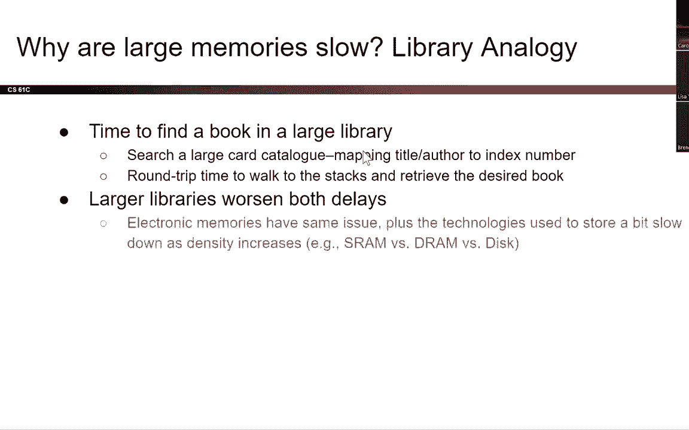
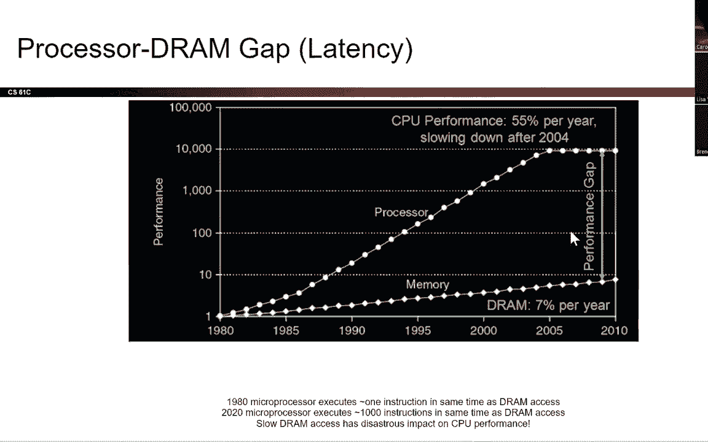
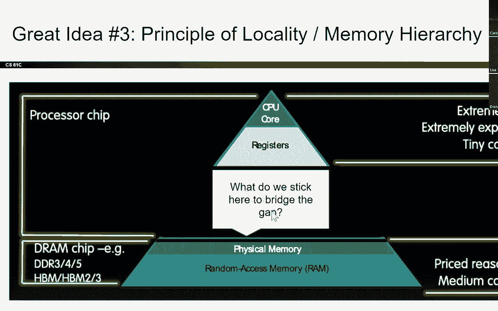
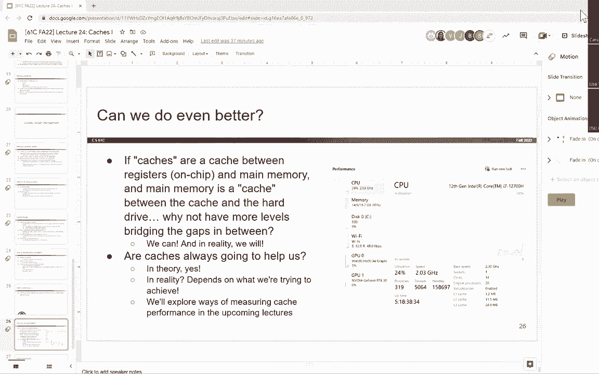
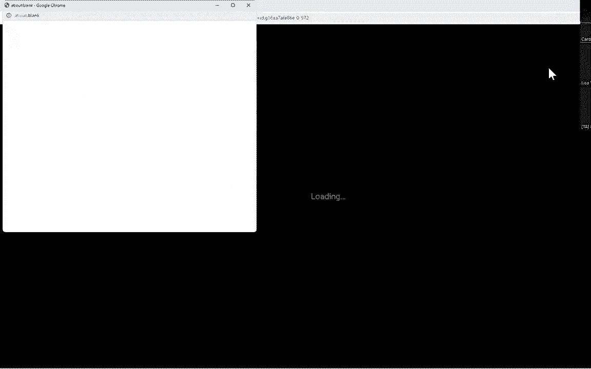
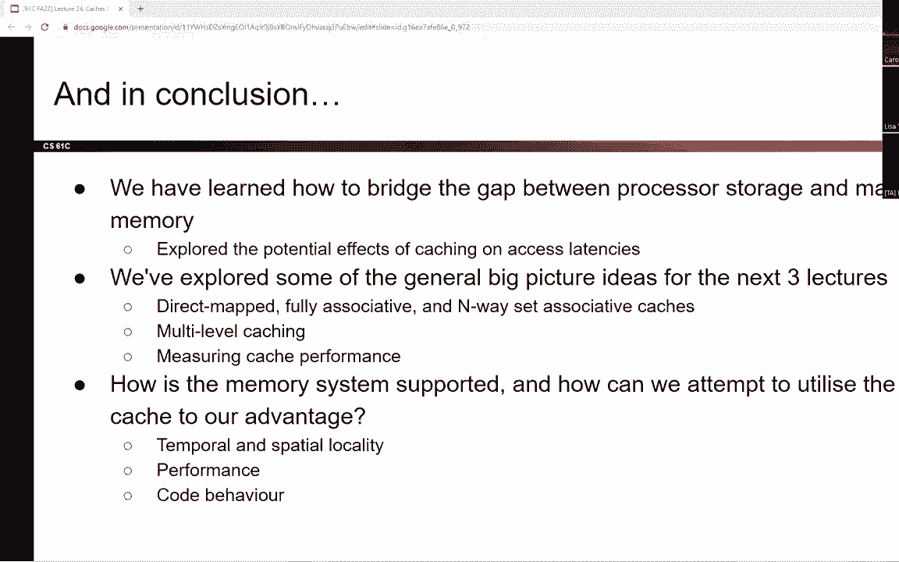

# CS 61C at UC Berkeley  - Fall 2022 - P32：Lecture 24： Caches - Direct Mapped I - 这样好__ - BV1s7421T7XR

是啊，是啊，喔喔，喔喔，期中考试结束了，谢谢你的耐心，当他们想出如何给你们所有人发布成绩时，处理所有发生的紧急情况，我们知道这是一个超长的期中考试，但是我们从学生那里得到的反馈是非常积极的，话虽如此。

你们也是学生，如果不是超级积极，我们也在想办法，有几个，在我们开始之前宣布另一个消息，这是一个民事订婚公告，你们中有多少人在加州登记投票，好啦，百分之五十的人，你们中有多少人计划在加州登记投票。

并有资格，好啦，好的好的，所以提醒一下你必须在周一前注册，往那边走，你可以在选票中收到邮件，如果你之前没有注册，星期一，你必须亲自去，选票退出，所以我想提醒你，所有选举日都是11月8日星期二。

好厉害好厉害，好啦，所以今天我们有一位很棒的客座讲师，你可能已经认识她了，她叫卡罗琳，她是我们的一员，我们的摇滚明星，或者61 c，这是一种方法，即使我今天在这里，这是我和丹的一种方式。

培养下一批伟大的讲师和导师，我们可以在，伯克利和世界各地的其他CS机构，废话不多说，卡罗琳今天要介绍缓存，让我们为卡罗琳热烈鼓掌，我先把它固定好，所以我可以用我的手测试，音频在线怎么样，就像这样，是啊。

是啊，所以我们今天的课，目前在打印它们方面遇到了困难，他可能会在某个时候带着咖啡出现，但我想我们也在想办法把这些推广到网上，在此期间，是啊，是啊，他们总有一天会好起来的，对不起，嗯，但是是的，真的很快。

就像上次的一个简短回顾，我知道我们可能没有机会，就像上一堂课完全没问题，缓存并不依赖于此，但我还是建议你有机会回去看看，上次我们谈到，在数据路径上展开，如何将我们正在进行的不同硬件部分并行化。

又名如果你看的话，它被称为流水线，所以一般的想法是在不同的阶段之间插入寄存器，有线组件，基本上是沿着不同阶段的时间值，在整个过程中，我们还意识到内存访问仍然非常慢，即使我们可以并行不悖。

所以我们想试着减轻这种情况，所以还有别的事，作为一个简短的提醒，流水线使数据依赖关系以危险的形式非常明显，所以我们讨论了三个主要的，如果这些术语对你来说真的很陌生，没关系，这堂课并不依赖于此。

然后一般的想法是好的，我们通过添加不同的硬件和不同的逻辑单元来解决这些问题，所以我们也试图修复这个想法的方法之一是，好啦，嗯，如果记忆真的很慢，为什么不投入更多的硬件，这就是我们在这节课里要探讨的。

嗯是的，也很抱歉，我今天视力有点差，所以如果你有问题，请随意，只是举起你的手，稍微挥舞一下，所以我们今天的议程是我们要讨论的，一些二进制前缀，我们要谈谈，回到，当我们谈到在不同的值前缀时，如何嗯。

我们可以看看数量级，我们还将回到嗯，可能是第二课，当我们谈到内存层次结构时，所以我们要再复习一遍，然后我们将直接进入缓存，所以二进制二进制前缀，做，这些前缀对任何人来说都很熟悉，好啦，如此熟悉，嗯。

我们可能已经被介绍给它在我们的整个，像中学时代，也许小学，也许是高中，所以如果是小学的事，嗯但是是的，这些都是很常见的前缀，它们也叫si，法语中国际单位制的意思，也就是我们已经用了一段时间的东西。

现在呢，另一个关键部分是它们都在十进制，所以就像10到第三个10到第六个10，十到N，这对我们的标准用户和公制来说真的很好，但它提出了一个小问题，我们一点一点地工作，在CS和硬件方面，就像，为什么不呢。

为什么我们的同类单位不与之对齐，是啊，是啊，所以当涉及到比特时，十进制是很难处理的，所以我们说，好啦，嗯，为什么我们没有二垒的东西，所以我们叫它别的，我们不知道那是什么，现在还有别的事。

所以你可能听说过，啊，是啊，是啊，我的电脑有一千字节，不是千字节，假设有千兆字节的存储空间，或者1TB的存储空间，然后你可能会进入你的系统硬件并查看它，就像等待，为什么上面写着，如果我有九十九万四千。

像这样的东西，好像不匹配，原因是这两个单元之间有某种差异，以及CS的不同部分很好地使用它们，我们还没有完全同意使用一个完整的系统，所以硬盘制造商和电信网络，善良的人，他们真的很喜欢用SI因子。

所以他们真的很喜欢根据标准使用这个，所以就像广告上说的那样，硬盘驱动器实际上容纳了你实际期望的90%，所以你实际期待的通常是，就像基础二领域的东西，但实际上他们提供的是基本时态，那么为什么这很重要呢。

如果我们从两边往前，我们可以看到这是两者的比较，嗯，基本单位种类，所以在右手边，嗯，如果我用鼠标，是呀，我们可以看到在右手边，我们可以看到SI的大小，所以我们看到10到3，代表公斤，大约有一千。

然后我们在这里有一个相应的类似的基数2因子，那是十分之二，大约是一千，但略高于这两个，四个字节没什么大不了的，那么如果我们去一兆字节的，所以说，我们有十到六，它大约有一百万字节，或者这就是我们所期待的。

或者这就是我们在那里看到的，如果我们看到这里的因子，呃，二到二十，所以二乘二乘以十，我们得到的比这稍微多一点，所以我们得到了40，八千，576个额外字节或额外字节，然后当我们往下走的时候。

我们看到我们得到的偏移量变得更大，所以两者的差别越来越大，这种差异反映在百分比上，如果我们仔细想想，如果我们回到之前的幻灯片，它会让我这么做的，和像之间的切换，我的老鼠呢，哦，我们走吧，好啦。

所以如果我们在硬盘里的这两者之间，我们实际上有10到12个字节，所以在硬盘世界中，1TB是10的12，但在操作系统方面它说，好啦，嗯，我想用二次方来表示事物，但我们可以从前面的图表中看到。

如果我们有10到12，它将内在地期望支持更多的字节，比我们实际，比我们实际拥有的，所以取而代之的是，我说，好啦，基数2和基数2是什么，这将是我们以前的90%左右，然后在网络方面，如果你看到像一兆比特。

一种交流，这不是真的在谈论它，就喜欢而言，哦，两个到嗯，两个到20，这将是像，好啦，我实际上只有10到6，所以这种差异并没有太大的区别，当你工作的时候，你不会注意到的，但当我们以后计算时。

这就有了很大的不同，因为这会让你的生活轻松很多，当你用二进制做事情，用比十进制更好的位时，比如，如果有人让你取10到6的平方根，或者像这样的基础两个，我不知道，我不知道你们怎么想，但我需要一个计算器。

嗯有什么问题吗，所以介绍一下，然后这些前缀，而不是被称为SI前缀，我们称他们为I，它代表，让我们看看国际电工委员会，回到1999年，这可能是我们这里一些人的出生年，也许90年代的婴儿。

它引入这些基本上是为了指定二进制量，所以我们可以看到它们和我们的SI非常相似，嗯速记，除了我们通常在末尾加上一个i，所以你把它念成，基本上就像Kib字节，也许字节，咬伤等，听起来有点傻，但这是我们用的。

所以现在如果我们提到像KB这样的东西，我们几乎总是指十进制的数量，如果我们把某物称为k ib，那么我们是特指它，在基数2中，有道理，一般的上升点头，好的太棒了，所以丹有一大堆助记符来记住这些。

如果你喜欢助记符，从这些中挑一个，或者只是为了好玩，想出自己的，但就我个人而言，我发现最容易记住的是，这些只是为了知道它们基本上对应于它们的si前缀，你通常不会被要求真正记住，或者能够计算出任何东西。

可能在这上面，所以你可以就像啊，奇怪的前男友，那将是最大的，我真的得记住，但是是的，所以现在我要继续前进，为什么我们一开始就需要这个，我们为什么要关心这口井，嗯，我们在后面的数据路径部分查看了这种图。

我们在课程开始的时候看了它，当我们有一个总的概述，所以这只是一般地映射计算机的组件，所以我们从左手边的处理器，我们走到这里我们在左手边有处理器，所以我们可以看到，通常有控制逻辑，我们有我们的数据路径。

那是一个可爱的盒子，我们有我们的档案和我们的登记簿就在这里，然后我们有我们的ALU在这里，所以这只是我们数据路径的一般思想，芯片上有什么，所以我们注意到有一种存储形式。

实际上是在芯片上或与处理器在同一种硬件上，这就是寄存器，那些存储值，但我们对寄存器的了解是，它们的数量非常有限，而且尺寸也非常有限，所以我们不能只拥有某种记忆，主存储器，是一个巨大的寄存器阵列。

所以取而代之的是我们这里的片外存储器，所以这就是我们所说的，啊，这是我们的主要记忆，所以我们这里有很多字节，会很漂亮的，非常非常大所以在两者之间，好啦，我们的处理器有时会写入内存。

它会提供一个地址来做到这一点，然后在两者之间，我们的接口基本上能够写入数据并从中读取数据，把东西搬来搬去，所以把东西带到登记处，然后将寄存器中的东西交换回主存，所以这就是我们的处理器内存接口。

你不需要真的记住那个术语，但这是一种控制器系统，一种能够进行这项工作的逻辑，现在在我们的另一边，我们有我们的输入和输出，我们将更多地讨论这个问题，在后来的讲座中，你可能听说过I O的想法。

所以这只是我们与外部世界交流的方式，所以说，又名，如何把东西带进来的系统里没有什么，然后把东西送出去，就像，例如，你的键盘就像你在发送信息一样，然后你的屏幕输出信息，这就是我们的i o内存接口。

我们会在很多很多节课上更多地讨论这个问题，所以整个问题就像，嗯，我们知道大内存是慢的，就像我们知道主存没问题一样，它比磁盘好，但也不是那么好，就像在时钟周期的尺度上。

我们的寄存器可能需要一个时钟周期才能访问，但是主存可能需要100个时钟周期，而我们的磁盘有一万个以上的时钟周期，所以一百块比一万块好多了，但还是没那么好，如果我们只能等这些手术，所以如果我们回想一下。

很久以前当我们谈到图书馆的类比时，为什么它实际上这么慢，如果我们在考虑它储存了什么，假设我们用图书馆的书写报告，我知道谁从图书馆借书，什么嗯，所以说你想让德萨林格丹喜欢他的经典作品，嗯。

所以我目前在当前的记忆状态是有点像好的，如果我有内存地址，我知道我想要什么，我们去图书馆，我们访问内存，然后我们穿过图书馆，穿过书架，说，好啦，现在这个架子没有我想要的东西，让我们去下一个。

这个架子上没有我想要的东西，你继续这样做，直到你找到那本书，或者你可以问图书管理员，但是我们没有图书馆员和主存，所以现在我们有了我们的书，然后我们从里面访问我们需要的任何数据，一旦我们完成了这本书。

我们把它放回去，但我们也许可以记住那本书在哪里，所以也许第二次你需要像捕捉骑行或其他什么，你可以直接去那个地方把书挑出来，所以如果我们需要在那个大图书馆里找一本书，好吧。

有时间我们需要实际目录东西在哪里，我们需要仔细检查并实际搜索，我们需要去喜欢，字面意思是步行去图书馆或公共汽车去图书馆并访问它，然后我们需要去身体上，去图书馆找那些东西，所以要花很多时间。

所以图书馆越大，通常越大，延误越严重，所以如果我们说像伯克利，我们有很大的伯克利公共图书馆，但不是那么大的权利，所以去那里不会花那么长时间，然后当你在搜索，可能需要几个小时，我们会说。

但这不是世界上最糟糕的事情，现在想象一下，如果你去纽约市公共图书馆，我不知道这是不是一件事，但就像，想象一下它要大十倍，可能就像在市中心，你可能不住在那里，所以到那里要花更长的时间，当你经历的时候。

你面对的是过道和过道的架子，然后可能要花一整天才能找到你需要的东西，所以如果我们把它带回主内存，那么这种数据结构越大，或者不是数据结构，存储东西所需的硬件结构，找到所说的东西需要的时间就越长。

所以有点看穿，呃，延迟间隙，我非常呃，无耻地从舞蹈幻灯片上偷了这个，但这是对事情进展的一个很好的解释，所以我们可以看到从1980年一直到2010年，这绝对是现代的，呃。

我们可以看到处理器的速度真的真的大幅提高了，所以我们看到有一个相当指数的增长和线性的，然后我们现在逐渐减少它，但是如果我们看看我们的内存访问延迟，我们可以看到这是一个非常非常缓慢的线性增长。

所以如果我们的处理器现在真的真的很快，我们说好吧，我经常需要访问内存，我需要你尽快，记忆将无法响应，他们就像举起，等一下等一下，你需要等到我做完之前，你实际上可以访问，所以我们这里有一个很大的差距。

这并不真正有效，那么那口井的解决办法是什么呢？我们要回到内存层次结构的东西，所以这个想法就像我们说的，如果你需要你，你有一本书，你很有可能会再次使用它，除非它可能像一个报告，你讨厌这本书。

但你知道我们不这么想，如果你还需要一本书，然后你去图书馆借一本新的，不过，那本书你可以帮我们保管，在你尝试退货前两个星期吧，但是你不退你以前已经退房的东西，所以希望这能让你收藏一些书。

这对任何报告都很有用，或者你将要做的任何有趣的事情，所以它使你不必在我的记忆中旅行，每次你需要的每一条信息。

那么我们就有了，我们看一下这样的东西，所以我们从CPU开始，嗯，然后我们有我们的寄存器，我们有我们的登记簿在这里，然后我们在这里有我们的物理记忆，然后我们有什么，嗯，在中间进行，但这里有个缺口。

那么我们到底要坚持什么来弥合差距呢，有什么想法吗，缓存，是啊，是啊，我知道很震惊，对嗯，正如这节课的标题所暗示的，我们把隐藏处放在那里，所以缓存的一般概念只是在，或者是两个不同点之间类似存储的中间形式。

所以就内存存储而言，我们的处理器所需的，然后我们实际的记忆速度是多少，所以我们增加了一个新的级别，称为内存缓存，所以实现明智，这是用一般的，我看还是集成电路设计作为CPU，所以后来。

我们将探索不同类型缓存的想法，实现可能喜欢什么，影响访问所需的时间，但我们只考虑缓存的一般情况，现在将以类似于处理器本身的方式在硬件中实现，因此，这有助于非常快速和非常好的快速访问。

但这也意味着它可能相当昂贵，这不是你必须记住的东西，但我们可能指的是SRAM这个术语，DRAM，嗯在剩下的时间里，我想那些隐藏处和讲座，所以SRAM就是同样的想法，但它是静态随机存取存储器。

DRAM代表动态随机存取存储器，你真的不知道，你需要知道两者的区别，只是SRAM通常更贵，硬件更贵、密度更低，所以它占用了更多的空间，而DRAM在这种情况下更密集，更便宜。

所以缓存本身通常是主存子集的副本，例如，在我们的图书馆类比中，我们的储藏室基本上是我们的房间，里面有我们需要的十本书，所以我们从图书馆借来的，有很多副本，我们拿一份副本，呆在自己的房间里。

所以我们从我们正在查看的任何内存块中复制一份，把它放进缓存里，所以有时我只是想注意一点，情况并不总是这样，有时我们实际上在内存块上移动引号，从主存进入高速缓存，这被认为是独占缓存，基本上是在说嘿。

如果数据只能同时存在于两个地方中的一个，如果它在缓存中，它已经不在主存里了，如果它在主存里，它不在缓存里，我们将在这节课中讨论的更常见的形式，包容性缓存的思想，只是嘿，我们会在每个地方都有一个副本。

你可能需要它，这样你就不用重复了，你要重复你自己，但它可能更容易访问，大多数处理器都有单独的指令和数据缓存，因此，如果您模糊地记得数据路径是什么样子的，我们有一个单独的物品和一个单独的恶魔。

所以这些事情都是分开的，我们通常有一个眼睛现金，然后还有一个D缓存，所以有时你可能会看到它的缩写是这样的，因为现金，你知道的，我不认为你在伯克利以外看到一个超级普通的，所以如果你没有在网上看到。

这可能就是为什么，但这是一个有效的速记，啊，是啊，是啊，这是个好问题，所以要重复，主存和磁盘和硬件有什么区别，是在执行方面，所以磁盘所需的硬件，便宜多了，你可以在里面储存更多的东西，但正因为如此。

您可能无法以最快的速度访问东西，因此，在不深入硬件部分的情况下，嗯，磁盘本身将是一个非常便宜的，但真的很慢，所以就喜欢而言，实际上是怎样的，就像在，就像这些旋转的圆盘，你必须喜欢，等某，喜欢指针到喜欢。

与旋转磁盘上存储您的东西的位置相匹配，所以如果你在等待像这样的东西每次都在盘旋，你正在访问一些东西，或许可以开始理解，为什么这么慢，所以与其直接访问像，例如，随机存取存储器，你不必等待任何类型的指针。

只是去那个地方，磁盘就像你等待指针满足特定的磁盘，在你想要的位置，呃，这回答了你的问题吗，好啦，所以总的想法是我们已经唠叨了很多，如果电平离处理器更近，通常它会更小，也会更快，但它也会更贵。

所以这就是为什么有一个权衡，这就是为什么我们不能一直拥有所有的寄存器，因为它占用了很多空间，但它会更贵，所以你不能想吃多少就吃多少，所以它通常是较低级别的子集，又名最近使用的数据副本。

所以如果我们想一些我们在寄存器级寄存器上更熟悉的东西，凭记忆加载东西，但这并不意味着你马上抹去记忆中的东西，你只要把它复制到离CPU更近的地方，现在CPU可以在任何操作中使用寄存器。

在数据路径上解码等等，一旦我们处理完这些数据，或者我们想加载新数据，所以我们必须更快地循环，然后我们把这些数据移回或复制回主存，所以有点，呃，在最低层在线的问题通常是磁盘。

它基本上包含了你可能拥有的所有可用数据，在任何时候都可能需要，我拍我的电脑滞后对不起，所以记忆层次的概念，它能阻止处理器，通过做所有这些替换，产生了一种记忆非常快的错觉，所以它在说嘿。

主内存将存储许多您可能需要从磁盘中获得的东西，所以你不必每次都去磁盘，你需要访问一些，它会进入主内存，我的记忆还是很慢，所以我们要把最近访问的，也许事情，然后放到缓存里，缓存快得多，大概有十个时钟周期。

然后现在它会从缓存中拿走东西，然后把它移到寄存器中进行瞬时的单周期计算，整个过程，暗指多次使用东西的想法，因为缓存是速度最快的，最昂贵的内存和寄存器以及较慢的部分，即DRAM。

我们也可以把DRAM或主存看作是，嗯，缓存和磁盘之间的缓存，所以如果我们仔细想想，我们所说的缓存或主存缓存，它在主存和寄存器之间，但是主存是介于，比如寄存器或主存缓存，然后是磁盘，所以你可以这样想。

只是这一切都渗透了，缓存包含数据副本，然后内存包含磁盘上正在使用的数据副本，所以通常缓存工作在两个一般的两个想法上，所以时间与空间局部性的概念，所以她的名字和时间有关，所以它基本上是在说嘿。

如果我们在这个特定的时间步骤使用它，我们很可能会使用相同的数据或相同的，是啊，是啊，类似的数据在下一次，未来或近一步，而空间局部性的概念是说嘿，我们在太空中真的很接近，所以如果我们考虑空间。

我们用内存地址来思考事情，它在说嘿，如果我使用内存地址a，很有可能，在不久的将来，我可能会使用内存地址A加，所以通过平衡这两个想法，缓存能够表现得更好，比你想象的要多，如果你只有其中一个，是啊，是啊。

所以在我们的范围内，我们通常只认为缓存是包容的，所以主存有磁盘上的副本，它不只是把它从磁盘上移走，呃，主存储器缓存有主存储器中内容的副本，是呀，所以你有冗余，同一数据的多个副本，你还记得这个吗，哦耶。

DRAM代表动态随机存取存储器，这是一个术语，我们有时用来指主存，所以它是用来实现，呃，主存储器，很多时候，还有其他问题吗？是呀，是啊，是啊，这是个好问题，所以在网上重复一下，嗯。

如果我们有随机存取内存和存储的东西存储在所有的地方，我们如何使用空间局部性的概念，所以我想我们是怎么想的，所以随机存取存储器的想法并不像，哎呦，东西随处乱摆，只是意味着我们知道，为了说。

在10号地址找东西，我们不一定要通过和搜索，好啦，零一二三，访问前面的每一个地址，以便到达地址十，意思是我们可以直接去那里，但对于你的空间局部性问题，我们中有多少人循环遍历过数组或迭代遍历过数组，是啊。

是啊，好啦，所以回到Java，我们并不真的考虑所有的东西都储存在哪里，但是如果我们记得在C语言中，当我们使用数组时，我们知道数组从一个内存地址开始，然后我们逐渐喜欢，假设它是四个字节的中间层。

一号物品已就位，项二等于加四，第三项是加8，依此类推，以此类推以此类推，如果我们遍历一个数组，这是在利用空间局部性的概念，如果缓存运行良好，那样的话，因为它说如果我们期望遍历数组，我们要访问每个元素。

这回答了你的问题吗，我只是在重复其他问题，那么我们如何利用这一点来利用我们的行为呢，所以有了时间局部性的概念，基本上，缓存的想法是将最近访问的数据保持在离处理器更近的地方，又名在缓存中，而在空间位置上。

它在说嘿，我们将移动由相邻单词组成的块，也就是离处理器更近的每四个字节，所以基本上我们整合的方式，两个在说好，所以我们知道很多时候，我们需要访问记忆中很接近的东西，所以我们要移动一个街区，假设一字节。

所以十个，两个四字节一起进入缓存，所以现在这意味着如果我有一个数组需要使用它，然后我们可以遍历，所有东西都在缓存中，我们也不必不断地从主存向缓存中加载单词，然后利用时间局部性。

我们可能会在一两节课的时间里探讨这个问题，但是有很多方法可以把东西转移到缓存中，把东西踢出缓存，就像寄存器一样，例如，我们不只是有无限多的寄存器供我们使用，所以我们必须替换值。

有时你可能会记得这种奇怪的东西来回移动的事情，在风险五项目中，所以有了缓存，它们就更大了，但在某一点上，你也会被填满，所以你必须把东西移回主存，所以时间地点就像，好啦，那我怎么知道该把什么搬回来。

所以这节课我们就不会讲得太多，但是有不同的方法，他们各有优缺点，所以在缓存设计方面，嗯，我们谈了很多关于缓存的工作，所以说，我们实际上是如何设计它们的，所以第一个问题，比如我们如何组织缓存。

所以我们知道主存就像一个从零开始的胖数组，一直到最后一个可能的索引或内存地址，但缓存显然不是那样的，理论上，是啊，是啊，我们可以有一个与主存大小相同的缓存，但那样就违背了目的。

所以我们知道缓存必须小于我的内存，而且要小得多，也不太贵，所以我们得想办法把它组织起来，所以一般来说，这取决于我们希望缓存的行为，所以有三个主要的类别，我们将谈论很多，在接下来的讲座中，一个是直接映射。

所以我们不打算扩大这个，但直接地图的想法是说，每个内存地址都进入缓存中的特定插槽，在任何一点上，它只能进入缓存中的一个可能的插槽，所以它非常坚硬，然后在光谱的另一边，我们有一个完全关联的缓存。

所以这个名字，意思是你可以去任何地方，所以只要你有什么尺寸，假设我们有一个十二十四字节的缓存，所以假设我们想用直接地图把一口移动到缓存中，它可能只进入这个特定的槽，但对于完全联想，它可以去任何地方。

然后我们有介于两者之间的地方，我们称之为N种方式将介于两者之间的标题联系起来，所以它可能会分成一定的块，它可以在块的某个子集中有一些自由，但它哪儿也去不了，所以我们会讨论这个，呃，下节课。

所以另一个问题，实际的内存地址映射到哪里，我们要改变吗，内存地址为，我们实际上如何做好这件事，缓存是内存的一个子集，这意味着它操作的内存地址必须是相同的，作为它在主存中对应的内存地址，所以它不会改变。

现在的主要区别是缓存，因为它小得多，我们的内存地址不能直接去缓存地址，否则我们很快就用完了缓存槽，我们进去谈，还有即将到来的关于我们如何计算东西进入哪个槽的讲座，我们如何绘制事物的地图。

那么我们如何知道哪些元素在缓存中，我们不能随便检查，所以基本上我们的想法是通过首先访问缓存来执行内存操作，如果我们有我们需要的数据，所以系统以某种方式识别它，它说嘿，我有你需要的数据。

我们要把它带回CPU，然后我们继续我们的行动，否则如果我们找不到，我们只是去说，现在让我们继续进入主内存，然后从主存中提取我们需要的东西，将其复制到缓存中，然后将其呈现回处理器。

所以我们可以看到这里有两种路径，你不需要弄清楚事情是如何发生的，这是在系统层面上，操作系统会处理这些事务，但我们在抽象的层面上更多地讨论它，在接下来的讲座中也是如此，是啊，是啊，是啊，是啊。

完全正确是的，我们从来没有明确说过，我想在缓存中搜索，或者我想在主存中搜索，它总是，我需要这个内存地址，在缓存里吗，是呀，好极了，如果没有，然后做一个，还有其他问题吗？然后最后一个问题。

这种问题可能是好的，主存储器，我们知道我们必须经历并解决一些问题，在这种情况下可能会有点慢，那么我们如何快速地添加，找出东西在缓存中的位置，我们知道它很快，因为它要小得多，它使用不同的硬件。

但我们还是需要一个简单的方法，在那里，事情是如此暗示这个话题，我们有一个TIO分解或标签索引偏移量的想法，所以基本上我们使用一个内存地址，并把它切成块，然后使用这些不同的块来找出如何索引到缓存中。

以及如何再次获得我们想要的数据，这是一个即将到来的讲座，我们没时间了，我觉得今天，但是是的，这又是一次，粗略地，对许多主题的概述，我们将涵盖任何问题，在我们继续之前，所以我们有好的。

现在我们知道事物之间有很多不同的层次，我们实际上是如何管理的，当我们在寄存器和内存之间，编译器想出了如何映射这些东西，所以如果你看看，所以很多时候，我们直接编译到一个可执行文件中，但是使用GCC。

您可以编译到每个，或者我们可以生成所有中间步骤的文件，所以如果你用破折号的标志，您可以生成，嗯，可能是一个x86的汇编文件，但总的想法是好的，如果我们有一个程序集文件，意思是我们用寄存器。

因为我们从来没有在C或C中指定寄存器，加号加号代码，这意味着编译器以某种方式找出需要哪些寄存器，所以编译器知道什么，呃，现有哪些登记册以及如何利用这些登记册，以便我们的代码在缓存和主存之间正确地运行。

然后是这种叫做缓存控制器硬件的东西，你不需要知道这是什么，但基本上只是在系统层面上，它发现，好啦，我们如何在内存和缓存之间通信，我们如何来回移动数据，祝福你，然后在内存和磁盘之间，它被认为是二级存储。

它是由操作系统决定的，这里有个术语叫虚拟内存，别担心，这是我们以后几节课要讲的内容，但基本上它是在说嘿，如果我有这个东西在磁盘上，然后我需要它，我需要把它放在主内存里，我实际上如何在两者之间翻译。

因为我们的磁盘存储比主存存储多得多，我们都会忽略这一点，嗯是的，主存储器，也是缓存，所以一般来说，最后是缓存，它们基本上是对处理器的暗示，因此内存是无限大的，也是非常非常快的。

现在我们有了一个单一的缓存，所以我们知道寄存器是一个时钟周期，缓存在10个时钟周期的规模上，然后主存立即一百个时钟周期，我们有没有办法做得更好，那么有什么想法呢，首先，我想我们能做得更好吗，是啊，是啊。

看到一些一般的点头，有什么关于我们如何做得更好的想法吗，是啊，是啊，我们可以有多个缓存，嗯，怎么样怎么样，还有别的吗？好啦，所以是的，第一个总的想法是好的，如果缓存是寄存器和片上内存之间的一种缓存。

缓存是主存，实际缓存和主存之间的CIS，我们能在两者之间插入更多的关卡吗，所以我们在10个时钟周期和100个时钟周期之间架起了桥梁，所以答案就在，是啊，是啊，事实上，我们实际上可以做到这一点。

有多个级别的缓存是非常标准的，这背后的想法被称为多级缓存，我们简单地讨论一下，我想在第四或第三次，我觉得，嗯讲座，还有一个问题，我们的缓存总是会很好地帮助我们，它们会永远使我们受益吗。

我们中的许多人都认为是的，他们会一直帮忙的，有时候呢，是呀，好的，好的，所以是的，从理论上讲，现金应该总是帮助我们，但我们将在本周晚些时候和下周通过更多的例子再次探讨这一点，但这基本上取决于你想做什么。

理论上，是啊，是啊，就像缓存被认为是主存和CPU之间的神奇桥梁，我们应该能够有一些东西供我们支配，无时无刻不在，但在现实中，它并不总是这样工作的，呃，这取决于我们试图实现的目标，所以有很多东西可以根据。

像缓存，缓存结构，可能缓存大小，也许东西被替换的方式，能进入的东西，嗯，这也取决于我们试图访问的数据，根据程序，然后我想记忆访问的模式，我们试图访问多少数据，有很多不同的因素可以影响到这一点。

所以在最坏的情况下，事实上，有一个缓存可能会让事情变得更糟，因为，就像，如果我们仔细想想，嗯，如果我们试图通过标准，好吧，CPU到主存的访问需要一百个时钟周期，我们完蛋了，尘土飞扬，我们有我们需要的。

但是假设我们总是执行缓存行为的最坏情况，所以最糟糕的缓存情况，嗯，我们最糟糕的访问时间是什么时候，假设我们有一个10个周期的缓存，是啊，是啊，没错，所以这将是110个时钟周期，因为我们得先去储藏室。

那里有十个时钟周期，好的，好的，我们现在没有我们想要的，我们必须去实际上积极的cps现在去主存和访问，再加上100个时钟周期，你可以想象，如果我们有一个程序，神奇地利用了有史以来最糟糕的缓存行为。

然后我们实际上可以让事情变得更糟，这可能不应该发生，假设您有一个合理的缓存设置，你没有积极地试图利用现金，但是是的，很有可能，所以我们将探索解决这个问题的方法，我们可以测量缓存行为。

或者我们可以测量缓存性能，它在接下来的课程中表现如何，就像一个快速的喜欢，所以如果你有一台Windows笔记本电脑，你或Windows系统，然后你去你的，是啊，是啊，如果你去完成你的任务，或者别的什么。

然后你就进入了第二个标签，它实际上向你展示了正在发生的很多事情，就像我们这里，其实我是要去拉起来，我们有，我们还有时间，我想我已经涵盖了我需要的一切，嗯，不过，让我简单介绍一下，我在说什么。

所以如果我们看看这个，是啊，是啊，这是相当有趣的，所以我实际上要看这里，我意识到我没有，所以我们有我们的CPU，所以这就像我们在这里有一些尖刺，也许变焦决定扣球什么的，我不知道发生了什么事。

我们还可以看到我们有一定程度的内存使用，所以现在我似乎在用安静的一点，因为我有太多的标签打开，我们有我们的磁盘，这里的数据，挺酷的，这是我们的关系网，在这个班上我们不关心这个，嗯，我们有我们的GPU。

在这门课上我们也不关心这个，但更有趣的是，如果我们去CPU本身，我不知道是否有人能看到这个，很明显，我也不能放大，但我会经历，所以我们可以看到我们只用了15%到16%的利用率，它跑得非常非常快。

如果我们有一个旧的系统，也许像啊说，假设这里有2800台笔记本电脑，想做我们想做的事，我有更高的利用率，CPU会着火，就像，我需要完成所有这些测试，我没有足够的资源，然后另一个有趣的东西在这里。

所以我真的看不清那边的一些东西，所以我会试着从这里读出来，但我们的基本速度就在这里，我们CPU的这个基本速度，基本上，像多快的想法，你能走多快，我们有我们的嗯核心，我想就在这里，一共十四个。

在这种情况下，所以我们的物理核心，我们有十四个，我们的逻辑处理器，我们有，我想二十个，是啊，是啊，二十个我看不懂其中的二十个，你不必担心两者之间的区别，但基本上这个想法就像硬件中实际存在的东西。

与硬件中不存在的东西，我们假装它们存在，然后我们启用了虚拟化，现在不要管那个，然后我们有我们的L，两个，两个和三个藏匿处就在这里，所以我把它藏起来了，上面说我们有1。2米。

但它实际上可能意味着这里的字节，然后对于l 2缓存我们有11。5然后l 3，我们有两个四，我相信这就是，我想可以，但这里的想法是，我们将讨论这种更多层次的缓存，但是lone缓存离CPU最近。

两个隐藏处在1和3之间，三个都在l2和主存之间，我们可以看到每增加一步，它的大小增加了，这意味着它的实施方式可能更便宜，而且密度会更大，又名你可以在更小的空间里有更多的存储空间，但是因为我们有。

它也会逐渐变得更慢，所以如果我们把所有这些想法，就像，好啦，我们从cpu到lone，是不是没有，现在去L 2，是不是没有，那就去三楼，如果不在那里，然后我们去做，但是是的，这只是一个简短的插话。

我不知道你是怎么把这个弄到麦克斯身上的，互联网可能会告诉你，很抱歉，我不使用max，嗯，但是是的，这只是一种很酷的东西，呃，或许能帮助你理解，是啊，是啊，你的人在网上说，系统层面上到底发生了什么。

我说话用我说话有人试试，是啊，是啊，嗯是的，好啦，让我看看能不能重新开始演示，哦耶，我真的能看到东西，是啊，是啊，呃，呵呵，好啦，所以说，如果我没理解错你的问题，就像对程序性能的理解，我们就像对待。

啊抓住你了，我想这取决于你问谁，因为如果你问，就像，呃，可能是七十人或六十一个B人，甚至当我们谈论渐近之类的概念时，就像是把它们当成恒定时间的操作，好的，好的，假设在硬件上一切都很好。

这里有一个关于事物应该如何表现的理论，如果我们有这个，嗯，这个程序在理论上，就像我们可能会做这么多的手术，它是如何缩放的，但如果你说到实际的表现，实际上，能够像基准一样，像时间一样，表演中的东西。

你不会想那样对待它的，你会想要像，好啦，如果我想最好地优化我的程序，我应该喜欢那种啊，知道我的缓存有多大，我怎样才能充分利用这一点，所以这就像，如果你把时间压缩到这样的水平。

你基本上想试着把东西最大化到你使用的任何硬件上，我认为渐近不，因为它的大意是，因为就像渐近线，不要依赖任何类似的特定数字，对呀，它依靠的是，就像，好啦，所以根据输入的数量，我该怎么表现，所以它其实。

它不依赖于任何与硬件相关的东西，所以我会说不，嗯好吧，是呀，让我重新开始。

看着就像我的老鼠在那边滞后，然后就像慢了三倍，很有意思，嗯是的，好啦，所以有点超越了，所以是的，总结一下我们只有五分钟的时间，所以有足够的时间来得出结论，对于任何遗留的问题。

我们已经学会了如何在处理器和内存之间架起桥梁，嗯，我们如何再次弥合这一点，缓存，我听到外面回响，嗯所以是的，我们还探讨了缓存对访问延迟的潜在副作用，又名如果你一直表现不好，然后你实际上会增加你的潜伏期。

我们还为接下来的三节课探索了一些更大的图景，所以不同类型的缓存行为，所以你如何访问东西，你如何分解事物，您有多级缓存的想法，又名，如果你有不同的缓存结构，在不同级别使用不同的硬件。

这如何改变我们的延迟和访问时间，也可能是我们如何测量缓存性能，我们也谈到了如何支持存储系统，我们如何利用缓存优势，所以我们试着说，好啦，让我们试着，也许构造我们的数据或访问它。

所以它遵循时间或空间的局部性，这是我们绝对不能做的，那就是，我们会在家庭作业的一些例子中看到这一点，然后嗯，你会在过去的考试中看到，也许在课堂上也会看到，但就像，假设我们有一个数组，啊。

我们可以同时将一半的数组加载到缓存中，假设我们有一个由十个二十四个字符组成的数组，所以十二十四字节，我们的缓存将是5 12，全联想，所以就像，数组的一半现在可以同时进入缓存，如果我们说我们进入，好啦。

假设我们访问索引零，你觉得我们会有什么样的行为，我们会直接在缓存里找到它吗，看到几个摇头，所以是的，如果我们试图访问索引零，在储藏室里是找不到的，因为我们还没把它带进来，但因为现在我们访问索引零。

我们要去回忆，从理论上获取缓存的五十二部分，然后把它插到，嗯，或抱歉数组，然后把它插到缓存里，现在我们在缓存中有512字节的数组，现在我们的下一个操作，假设我们在偏移量5 12处访问数组。

我们认为会发生什么，然后呢，我们在缓存里找到的，有几个摇头对吧，所以我们实际上并没有在缓存中找到它，因为缓存的位置是0到5-11，因为它有512个字节，512就像现在的指数是513。

所以现在我们必须回到主存，我们看到了这可能会有什么不好的表现，所以我们没有利用空间局部性的概念，在这种访问模式下，因为我们就像，我们真的跳过了我们刚刚加载的所有内容，在接下来的课程中我们会看到更多。

这怎么会真的真的很常见，然后性能代码行为，这也是因素之一，差不多就这些了，我有，嗯，是呀，有什么问题吗？感觉有点，哦是的，怎么呃，好啦，那么缓存如何影响数据路径中的时钟定时呢，对嗯，所以一般来说。

我想影响，就是有就是有，所以说，我想丹可能会在以后的课上钻进去，我不是百分之百，当然可以，但是理论上，它的工作方式是，它应该有点，我想已经考虑到永远不会要求你时间，就像数据路径方面的事情，就像，啊。

如果你在中间加三个缓存，像记忆一样，这会对事情有什么影响，嗯，我们将探讨平均内存访问时间，因为我们不可能预测代码的行为，在运行的每一个程序的每一个实例中，所以我们把它摊销，好啦，这里有一个大致的估计。

事情的平均值，事情会如何发展，我想回到盒子里，就像，我不知道丽莎能不能回答那个问题，更好，啊，对不起，简短的回答是，呃，如果你不能，我不知道谁在回答这个问题，你还好吗，是啊，是啊，所以简单的答案是。

如果你在拿东西的时候没有，然后一切都停滞不前，然后你花时间，所以如果你真的看看上一张幻灯片，上一节课的最后一张幻灯片，你会看到有一笔很大的费用，必须从记忆中提取东西，这就是许多减少的地方，呃。

上升的cpi来自，是啊，是啊，好啦，我们正好十一点，所以是的。

