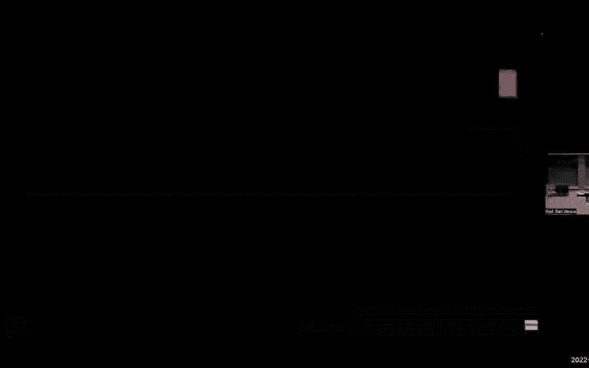
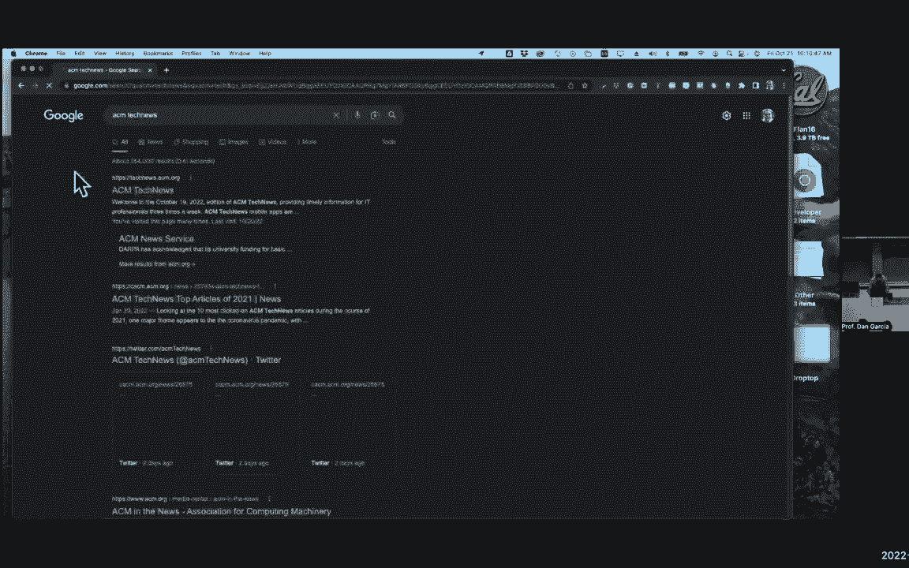
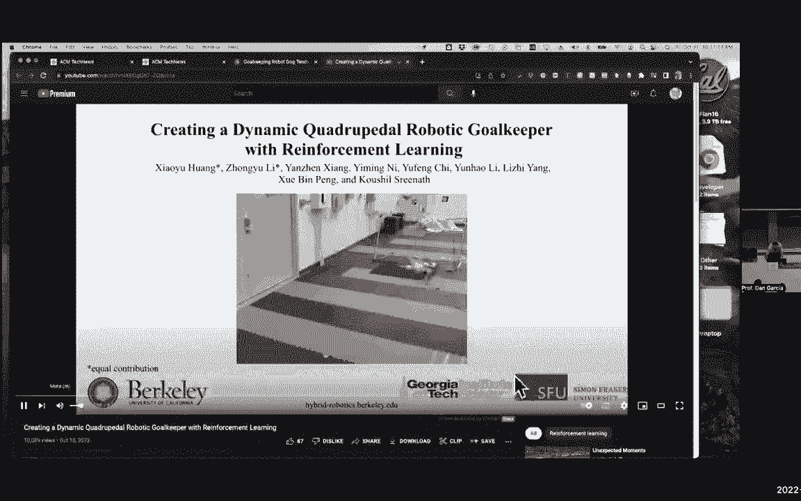
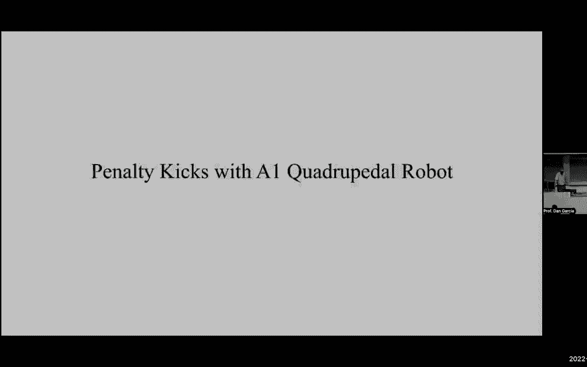
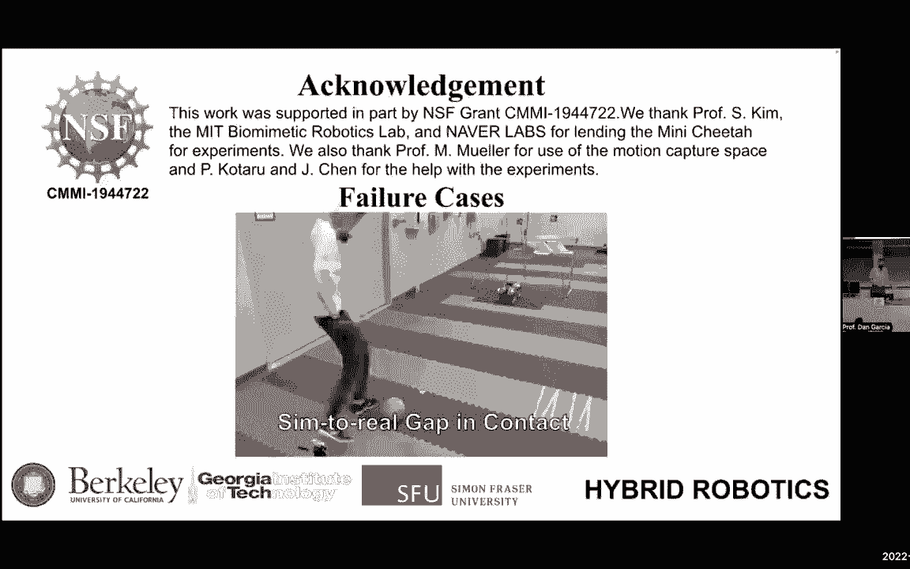
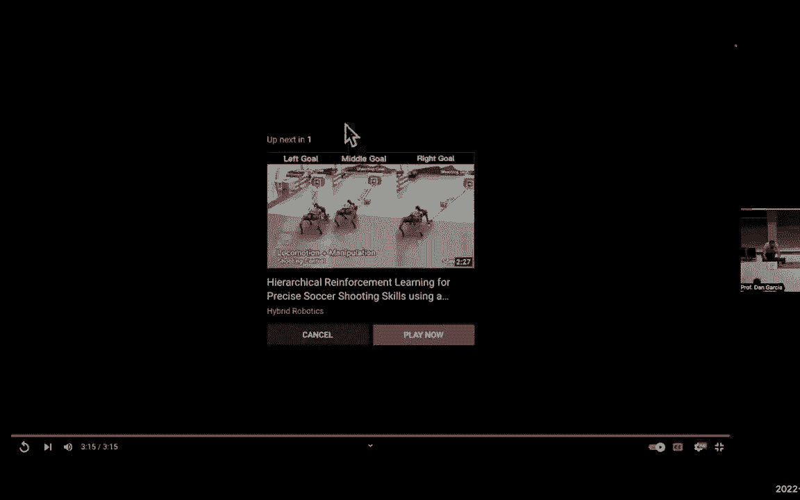
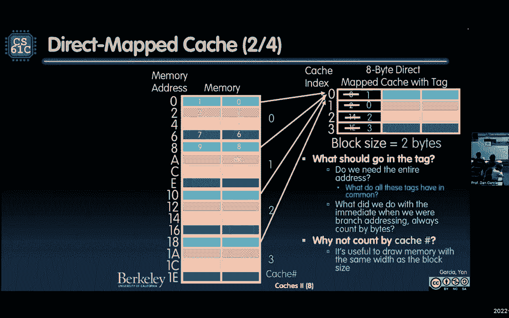
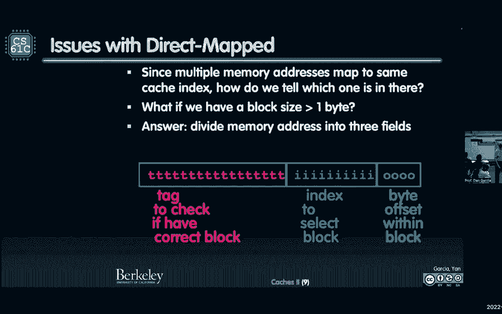
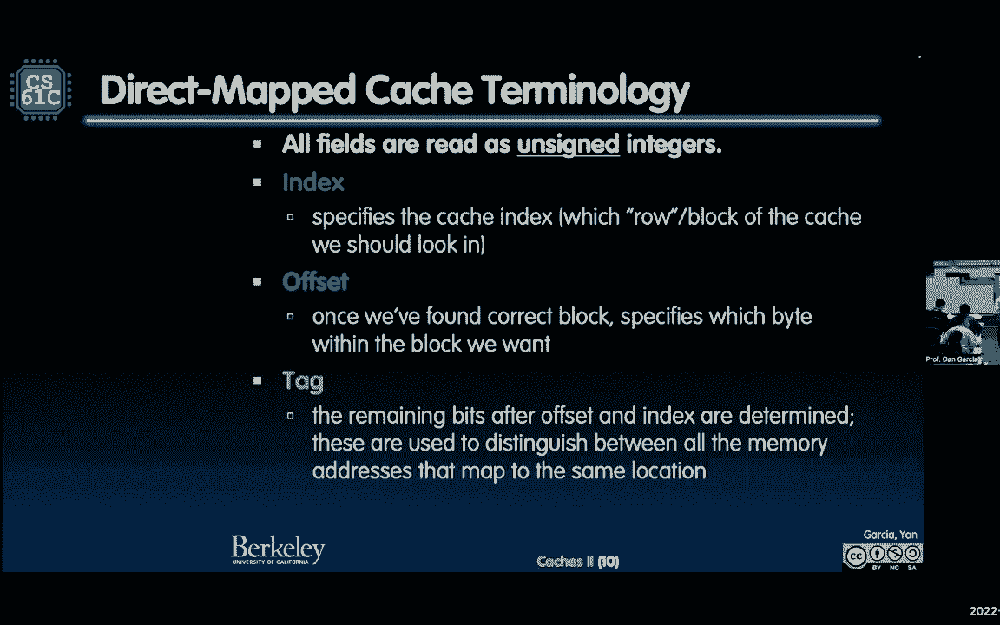
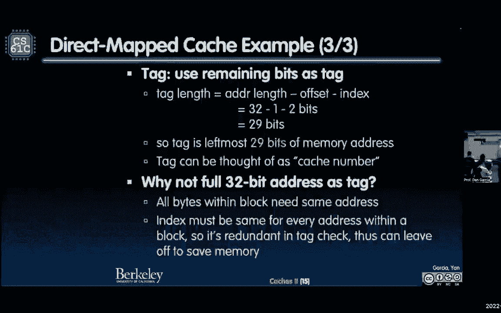

# CS 61C at UC Berkeley  - Fall 2022 - P33：Lecture 25： Caches-Direct Mapped II - 这样好__ - BV1s7421T7XR

天哪，我脑子里一直在赚钱，夫人我我我的现金，我的宝贝宝贝肿块，婴儿现金带婴儿婴儿现金带婴儿现金。

敞开心扉无时无刻不在赚钱，然后这么多我把A看她最好，我弥补了我的，他们走了，我对她说了这么多，当我没有我的，他们走了，你在节目中看到这个就在你的心脏，我左边那个，我有权在前面兑现给我。

我应该回去，叫我CA，你从我心里的现金里给了我一把刀，无时无刻不在赚钱，这么多这么多漂亮的宝贝宝贝。

那漂亮的现金，我脑子里的现金，无时无刻不在赚钱，也许我应该直接把现金给我，我不应该有人给我现金，当你得到表演的钱，无时无刻不在赚钱，把我打晕了。

当我们得到。

一二一过去。

让我们看看这是否也有效，我这里也有一个视频，我们总是从我们的计算开始，新闻有点早，这样我们就不会浪费上课时间了，很高兴见到你们对不起，但我需要解除静音，谢谢你，谢谢你，谢谢你需要解除静音，不知何故。

不知何故，我怎么静音了，静音，静音，我是，我不是，是呀，我不是，我不是哑巴，是啊，是啊，好啦，谢谢，谢谢你的小费，很容易被困住，好啦，这就是视频，好啦，所以嗯，计算新闻，欢迎大家回来很高兴见到你们。

你们都开始正式计算新闻，当计算机，消息来自伯克利，这是国家新闻，伯克利为人工智能实验室制造了一些新闻，所以加州大学，伯克利混合机器人实验室，能有一个迷你猎豹机器人和谢里夫在一起吗。

你知道这就像国际足联世界杯赛季，我们对此感到兴奋，希望你们都对此感到兴奋，我对此感到兴奋，可以救八十个，七点，5%的射门，这是一个小婴儿进球和一个小垒球，这不是正式的足球，就像全尺寸的，但很不错，嗯。

研究人员指定或设计了四足机器人，集成运动控制器，带有末端执行器轨迹的规划器，找到最好的机动方式，在球前面不到一秒钟，所以这很酷，我想给你看一个小视频，如果成功的话，我想我得点击这个按钮。

我觉得这个麦克风，这是我在YouTube上看到的一个很棒的视频，这一定行，我把它嵌入，它现在应该开始视频了，我点击，它不工作与点击，点击声，点击声，随着咔嗒声，这是我的视频，好啦。

去去视频去速度赛车手去，我不知道发生了什么事，点击，点击，点击，好啦，嗯，有一段球打机器人的视频，我不知道为什么它不快乐，呜呜，我嵌入了YouTube，我能出去吗，这是值得的，我会看YouTube视频。

所以这是一个YouTube视频，他们看到科技新闻，那真的很烦人。

这是头条新闻，从这个开始，好了伙计们，十月份去这里是值得的，然后十九，给我点东西，给我点东西，给我的东西是，我从哪里得到这段视频，守门员来了。

你在找文章。

有机器人做这件事的视频，这是我嵌入的，它应该起作用的，在这里行不通，我们走，给我一点声音。

当你在底部打开，但碰巧本身看起来很棒的是，所以说。

机器人最好的部分。

别再在街上打架了，向上反击一直到最后，世界，他们让我出去，直到我们到街上，你呀。

好东西，展示我们Colle的一些工作的好东西。

离开那里，离开那里。

啊那里那里，这样就完成了，关上它，然后回到这里，下一张幻灯片开始吧，好啦，好吧，把这个关了，把我们关了，今天是星期五，所以我想在星期五找点乐子，好啦，欢迎回来很高兴见到大家，欢迎来到CS六一C。

我想特别感谢卡洛琳，至少很明显，但是卡洛琳特别为精彩的演讲，他们有多棒，让我们为他们鼓掌，太棒了，好东西，我们正在为我们年轻的教师做好准备，精彩，所以我们说的是缓存，你看到这是个新话题了吧。

我们在管道上按下了重置按钮。

新话题，所以让我们深入挖掘并建立我们的第一个缓存，挺刺激的，我们将称之为直接映射缓存中的直接映射缓存。

是什么让直接地图变得容易，直接是最简单的计数，顺便说一下，一般直接地图是最容易捕获的一种，Y，因为每个地址只与一个地方相关联，它可以去，你记得卡罗琳说过，记忆金字塔，内存层次结构，缓存通常是更快更小的。

更昂贵的比特空间，我们可以保留一个副本，我想让你知道，如果你还记得记忆的概念，记住记忆应该如何在61年学会这一点，这个想法是你有一些非常复杂的，就像斐波那契或其他需要，如果你只是用天真的方式写。

在一百上运行斐波那契需要大量的时间，这是做不到的，但如果你一旦解决了一些问题就记住了它，你解决了任何谎言，一些数字是你记得的，下一次你打电话给斐波那契，你说我有这个吗，我已经计算过了，我有。

我就用这个值，这就是独联体，所以如果你想连接到软件，它的侧面抓住了，或者像记忆词典，或者你想用的任何东西，这让东西，因为你不想去萨克拉门托，你还想再次计算fibonacci的fib值。

如果你已经做过一次，就是这个意思，好啦，所以只要把它和你联系起来，所以在直接地图缓存中，如果我有副本，我必须知道它在哪里和一个直接的地图缓存，我只知道一个地方，它可以在直接的地图缓存中，所以这真的很酷。

我们不必看一个，让我们看看你想看看我有没有，我先走了，它通常在这里吗，这是我保持它的地方，它不在这里，所以我没有，所以不是说，我得去找，我没有马上拿到，我知道这很重要，直接地图缓存很容易。

一个块是和卡罗琳，你提到过这个，块是高速缓存和内存之间的传输单位，所以我们要把东西分块转移，不是字节也不是文字，但以块为单位，我们就是这样从记忆中来回移动东西的，然后缓存会有一个块，也称为缓存行。

就像吵架一样，这是一排，我们会看到的，好这里，这是第一张真正现金的照片。

哦我的天啊，所以让我们停下来思考一下，这是我的记忆简化的想法，一口一口，当你考虑缓存时，这真的很重要，知道如何，你为什么这么说，这是一个字节宽，左边的地址，很简单，这是我从零开始思考记忆的线性方式。

一直到底部的八个F，很简单，我用四种不同的颜色给它编码，为什么？因为我会有一张直接的地图，让我们读单词，四字节直接映射缓存，一个字节块大小，一个字节宽，它的宽度是一个字节宽，查看块大小，一个字节。

那么这意味着什么呢，这意味着我要读到记忆中的某个地方，事情是这样的，每个忧郁的人，你认为这是一种模式，四分之一进入第一个槽，让我们暂停一下，确保你明白那是什么，所以现在再也没有问题了，在缓存的什么地方。

我基本上是说，你是什么颜色，就像，我说，你的地址除以4是多少？所以它就像模四，如果是零，那你就是四的倍数，你是蓝色的，如果是一个，除以四后余数的mod是1，你会变红的，这有道理吗，所以让我们保持。

我们记下你的地址，基本上我们要看多少位，找出它应该在缓存中的位置，让我们现在想想，谁想说，我怎么能只看，以比特为单位查看剩余的mod，如果我们要找的是，我该怎么做呢，这里还有一个，我得到了三个两个比特。

我要看什么才能知道它在模组4中的划分是什么，四件事，所以第一个，两位，前两位，下面的两位，如果你把某物除以四，下面的两位告诉你4，让我们数数，零是多少，零的前两位是什么？1的头两位是什么？

2的头两位是什么？三三的头几位是什么？四零的头两位是多少？看看它是怎么做到的，前两位是一个零，四一一零是多少，所以它是前两个部分，是下面的两位，这就是我所做的一切，所以我看着你的两个位。

这就告诉你它是什么颜色，如果是两个零，是蓝色的，那不是很酷吗，一定要让每个人都知道，我有很多尸体，你说我有四个字节，我得到了这是，这是一个二到三二数组，然后我有两个到三十个或一个gibi。

还记得卡罗琳也说过一个吉比，我有一个吉比，蓝色的东西，都映射到同一个蓝色的东西，这是正确的，你可以找到他们去哪里啊，我们来谈谈我怎么回去，我们会谈谈，我只是不知道怎么把它放在那里。

我只想知道怎么把它放在那里，我不知道是不是这样，所以这里的亚当真的在问，如果我储存蓝色的东西，假设我把它储存在，在那里有八条生命，我怎么知道是八点，这就是你真正的，我觉得，这才是你真正想问的。

我怎么知道它来自八个，我们会尽快解决的，但你问了三张幻灯片，我只想确保人们知道它会去哪里，然后我们会有更多的工作来找出它来自哪一个，那很清楚，好的，好的，到目前为止一切都好，只要确保，好的，好的。

你看这幅画的下两位，我知道该去哪种颜色，你就去吧，在那里一切都会好的，所以这就是我现在说的所有话，但我要给你看这个东西，这里的现金可以从零四八任何倍数到四，四个街区，只有四个街区，四排，宽度为块大小。

所以这四个方块，我看到四排，任何4的倍数的内存位置都在那里，如果我们想要一个块大于一个字节呢，对我好点，能够在同一时间或此刻阅读一个单词，所以让我们在图片中做一个改变，以获得块大小，也许更大，一个字节。

我们现在开始，让我们暂停一下，现在看看这个，我有一个8字节的直接地图缓存，我所改变的只是块的大小，我改变了宽度，我不仅没有字节宽，它有两个字节宽，好吧，到目前为止，到目前为止，一切都好，顺便说一句。

现在，让我们假设我们读的是写字节，因为它有点复杂，如果我写的话，暂时是重叠的，现在只读写和字节，让它变得容易，只需通过它的存储加载非常简单，那么这又是如何工作的呢，每一个蓝色映射到每一个蓝色。

但它不再是我们最低的两个位了，是吗？让我们想想这里发生了什么变化，我怎么知道，感觉就像两块，那里有四样东西，所以它必须是一些二位，但它不再是最低的两个位了，之前是零四八现在看起来是零和一都变成了蓝色。

八号和九号都是蓝色的，所以这肯定不是最低的两位，但有两点告诉我，它是两个直接位，我只是抓住这些碎片，我看着它，但这不是最低的两个，我们能弄清楚是什么吗，从那里过去了一个，所以它不是最低的比特。

就像碎片一样，如果之前是0和1，现在是1和2，就像这两个，只是一个以上，有道理，我看着这两个部分，完全正确，在某种程度上，这里是有趣的，最低的部分会告诉我这张照片里是什么，哪些是蓝调，那不是很有趣吗？

所以让我们记住，最低的比特是，告诉我区块中的哪个字节，看看这张照片，下一个，下一组位将是哪个块，我有，我对亚当的问题仍有答案，如果我有一个蓝色的，我怎么知道它是从哪里来的，它是从零来的吗？

它是从八九来的吗？它是从右边来的吗，所以这是个问题，十和十一，好吧，在十六进制中，那是十六进制的，顺便说一下，这个在左边是十六进制的，顺便说一句，大家可以看到，很明显它有a和c和e。

所以我们要求一个字节，控制器，有一个控制就像，谁在跟踪这个，我提到过这个，有一个缓存控制器，记录这一切，所以你不用担心，这不是你的工作，这是硬件中缓存控制器的工作，真的很不错，找到正确的块。

并把它加载得很漂亮，它怎么知道，哦这里，它是，这是亚当的问题，我怎么知道正确的街区，我如何选择自行车，我们已经讨论过了，当右方块是时，两个位就结束了，从，那是块，正确的字节是最低位，如果是零。

这是最右边的一点，如果是一个，是左边，是左字节，零，是正确的字节，这是一个，是左字节，我应该确保我说的是对的，最低字节在右侧，是啊，是啊，最低字节在右侧，所以一个正确的正确，是啊，是啊。

原来如此事实上这东西管用吗？呃是的，在这里，我们走在这里，我们走，好啦，看，这是最低的一口，较高的字节和最低的位，零会在这里，一个会在那里，零会在那里，一个在那里，最低的，如果我查看内存地址。

最低的一点告诉我，右边是零，左边是最低位的，这在这里是相关的，我就是这样储存东西的，好啦，我就是这样推的，我就是这样把一个词放进记忆中的，这只是在想这个，所以，哦，在这里，我们去内存地址一，一，一。

哦一个，有什么问题，我想问一下，我们该怎么办，让我回去，我要为1101做什么，让我们滴水，好啦，我去一一零一，它在右边这张照片的什么地方，嗯，让我们说一个一个一个，左边那个是什么？左边是从哪里来的。

我是说你可以说，它在左边的什么地方？你能你能弄明白吗，这是一个强大的东西，一一零一，糟糕的是，较慢的方法是拿一个，一个，一个，把它转换成十进制，然后你在玩一些十进制的地址，然后你把它移回十六进制。

或者你可以聪明一点，把它放在二进制空间里，直接从二进制变成十六进制，一对一是什么？直接十六进制零一，不用去十进制，你能做到吗你还记得吗，当你从二进制到十六进制，这是在你期中考试的时候，你从左边开始。

你从右边开始，所以在右边，也可以拍拍从左边开始，你得记住衬垫，所以从右边开始，什么是最低的尼罗河，好像是一零一，我记得所有是4的倍数的，就像那些正常的字线，东西是零4 8和c所以当牙齿最后2位到零时。

它是一个C，所以一百，那不是，那不是零的两个比特，这是一个在那里，所以这是d和左边，左十六进制值是1 so 1 d so，我们在往下看，我们到下面去，我的光标呢？让我们得到它一秒钟。

我的光标A光标返回一D，我把它搬到这里来，这是一个C，那是一天，是那个家伙，这就是我们想要的，好啦，我们想抓住它，没有缓存，我只是在这里回忆，抓住那一口，所以一定是那边，见，地图就在那里，如果它在左边。

它将在这里的左边，它实际上是一对一的映射，见，一定在那里，我能通过看这些碎片就知道吗，让我们做吧，最低位是1告诉我它在缓存的左边，另外两位读为一个零，那是两个，得到它所以看看看，刚刚好，我们做了。

我们是在头上做的，我们开始吧，最低位的意思是在左边，接下来的两位是一个零，所以一零等于二，它就在那里，所以它在那里，所以我们可以做到，你可以用两种不同的方法来确定颜色，然后计算出箭头的方向。

或者只是看看这些碎片，我们谈过的，好吧，到目前为止，一切都好，这是关键问题，我怎么知道它来自哪个橘子，又来了，这是关键问题，我们得想个办法，我们还没有给你一个解决办法，这是我的，这里是我加的这个。

你们在行李认领处是做什么的？旅游业出现了一场运动，假设大约十五年前，在那里，每个经常旅行的人都买了同样的黑色面包卷，它大约有十二或十五英寸宽，大约二十英寸高，从字面上看每个人身上都有同样的卷。

看起来都一样的行李，他们都会站在SFO那里看着他们，他们看起来都一样，人们必须，哎呦，他们会怎么做，他们是做什么的，他们，他们检查标签，从字面上看，我们称之为标签，我们要在这个上面加一个标签。

想知道它是从哪里来的，就是这样，如此循环，我们把它包回去，我们添加标签中应该包含的内容，它从哪里来，就是这样，它就放在它来的地方，你进来，我知道该去哪里，我看着这些碎片，知道去哪里。

我看着那排我看着标签我说，这是我请求的内存地址，这是存储在此标记中的内存地址，现在是对的吗，我知道就像一个措辞，钥匙在字典里，它就在那里，如果它在那里，它是我的，那是我的排位，我拿到了，在缓存里。

快速创建，如果不是，它不在那里，现在我们要假装，我们只做阅读，我们不是在写记忆，我们只是在看书，我们只是在那里检查，只是阅读，记住，就像一本大字典，这是一个只读，就目前而言，读书写字要困难得多。

都在这里阅读，你们有多少人要去，每个街区不都应该是自己的吗，我不知道那是什么意思，你知道的，我是说，埃尔的观点是肯定的，所有住在那里的东西，就像同父异母的兄弟姐妹住在一起一样，就像他们来自。

他们出生在世界不同的地方，但他们现在碰巧在同一所房子里，这就是我们得到的，很难为每一行构建缓存，你想有一个缓存，按我们现在的方式处理，所以我们不会尝试为每一行建立一个新的缓存，这是我为你做的事，我有。

如果我把它的方式，这是最重要的，顺便说一句，如果你在做字幕，这从来没有教过我，我想要你，我看另一个现金，他们不教这个，这是一个特别的Danelisa的东西，当你抽到现金做这个的时候，做这些问题。

我要你画缓存的宽度和画内存的宽度完全一样，所以另一种方法是绘制缓存的宽度，它有多宽，你的街区有多老，方块的宽度是多少，它有多宽，这里有两个字节，我要你画一个完全一样宽度的记忆，不要画记忆，就像一个字节。

宽阵列，绘制与缓存完全相同的内存形状，你看我说的一样宽，这就是为什么一旦你这样做，然后你可以想到这整个缓存，在这整个缓存中，每两周我要花一秒钟，就像从字面上看，它完全符合那张照片，应该是一模一样的。

如果这个是一个宽的，很难弄清楚地图，但是通过画完全相同的宽度，然后你在房间里有很多回声，所以我有点热，那么这个宽度和他的记忆是完全一样的，现在你能做的就是把这个缓存，做一个盒子，做一个大长方形。

然后把这个长方形，把它画在这里，画这个长方形，画这个，画那个是一个完整的缓存，意义，如果我们开始打数组0 1 2 3 4，无论缓存大小如何，它真的会填满它，一旦填满，然后看看下一个尺寸。

所以我要把这个叫做，这就像缓存号为零，从下一个蓝色到这里的下一个是第一条，看到了吧，通过这样做，我现在可以想到哪个缓存大小的内存块，我正在读，这是这里的关键，上面的是零，然后一个，然后两个，然后三个。

我一直在往下走，我叫它缓存号，你马上就会明白为什么这很有趣，所以我需要整个地址都在标签里吗，我们总是想节省比特和保存，我不需要有很多多余的部分，如果我不记得了，当我们写的时候。

我们记得我们实际上写了什么，当我们做一个跳跃或树枝，你写所有的部分，否，因为我跳到了单词对齐或半单词对齐的东西，所以我留了一些，我必须把所有32位都放在我的标签里吗，或者我可以扔掉一些。

其中一些是我所在的行，这两块，其中一些是我在哪列，我需要这些碎片来告诉我它是从哪里来的吗，否，那是关键，那么我还剩下什么，如果我把这些碎片拿走，我还剩下什么，缓存号，那不是很整洁吗，我画了那个缓存。

我有这个缓存号，零，一个两个，这样我就可以把它们划掉，嗯，我们做了这个，记住，我刚才说的，当我做即时地址时，我数一个不，我不能买四个，我不能选择在哪里做，所以说，为什么不按现金号码数呢，哒哒哒。

以与块大小相同的宽度绘制内存是很有用的，我已经说过了，我把它划掉，我写，我们回去吧，八个要多少，什么现金号码是8，八个在一组，如果我如果我八个在一个，记住这一点，这个蓝色是唯一一组，这是唯一的现金号码。

那两个在哪里，那是零组，十四在哪儿，那是在两组中，哪儿有一个，三组中的E，所以我把它们划掉了，我写缓存号，很酷吗，所以基本上是所有的部分，但我用来计算我在哪一排的部分，我在哪个专栏，这里有三块钱。

我怎么知道是三个比特，因为它是8乘缓存2到3是8，所以我扔掉了最低的原木底座，缓存大小的两个，这就是我扔掉的碎片，剩下的部分是我的标签，就是这样，我们再来一次，我的缓存有多大8字节，多少位。

我需要给8字节缓存中的每一个字节寻址3位，所以我把这些扔得更低，更低的三个比特，记住最低的是哪列，我在中间，或者这三个中更高的是我所在的排，请记住，之前剩下的高位是我们用于标记的位，就是这样。

这就是大局。

这就是我在那里用的，它是，那是我的照片，我甚至没有彩色编码给你看，大多数地址看起来像，让我们一起做吧，这是容易的，我知道这很复杂，但这是最简单的，你能再硬一点吗，从这里开始，直接地图缓存的问题。

所以由于多个内存地址映射到同一个索引，我们怎么分辨哪一个在里面，就是那个标签，或者我的缓存号，是那种，在第一行零，下一个缓存大小，那是一个等等，现在，如果块大小大于一个字节怎么办，我们刚刚看到。

我需要三个字段，就像我们看到的，用于计算它在一个街区内的位置，这些告诉我我在哪个专栏，我今天大概要说十遍，希望你喜欢，哦，我明白了，好啦，较低的位是偏移量，它告诉我在街区的什么地方，哪个字节。

我想把接下来的部分，我的索引，告诉我哪排，我想知道哪个街区，我想吵架吗，这是下一组比特，剩下的是我的标签，所以我不必三个都用两个，我可以用这个，顺便说一句，这里是很酷的部分，这些总位数，如果这是。

会很有趣的，如果这是哪列，这是哪排，行时间列是面积，那是我缓存的大小。

我有那口井的照片，我只是把它描述得更多，所有领域都记得我们说过的，这很重要，就像我们说的，我吃了点东西，他们在编码什么，当我谈到浮点，当LISA提出浮点，这些位有不同的含义，这些是有偏见的编码。

这是标志，幅度编码，这是现场，记得有三块地，你记得有个选择题，有多少不同的格式，我需要储存，减去十二点，七十五，那是遥控器，对呀，人们我没有给你答案，我说你会听到答案然后飘起来。

答案是浮动中的三种不同格式，左边是符号星等，中间那个有偏见，右边的是无符号的，三种不同的格式在这里存储它们很容易，全都没有签名，这里没有消极的东西，这容易多了，但你现在记得三三了。

为什么我记得我说过是从左到右标签索引偏移量，但我为什么要在这里列出它们，我在这个顺序索引偏移量标记中列出它们，因为这是命令，我们检查他们，这是件有趣的事，索引告诉我我想要哪一行，奥菲说它是什么颜色的。

我想要哪个字节，现在我准备好得到字节了，但现在我做的最后一件事就是检查标签，确保标签是正确的，所以指数，行偏移量，如果，如果标签正确，是我的黑包，我可以从SFO回家，和所有的东西玩得很开心。

我合法合法地走私入境，我只是说法律上，好啦，你明白了，所以第一个索引，哪一行，哪个块偏移量。

检查哪一栏标签，并确保它是你的，好吧，到目前为止，一切都好，这是我做的照片，这从来没有作为这张照片的项目介绍过，我喜欢这张照片，因为我是视觉学习者，我觉得图形是个博士，我需要照片，那么面积是多少。

我缓存中的总字节数是多少，它是高度时间的乘积，宽度，这就像从一年级到一年级，二年级，方块的高度是多少？宽度是多少，块大小，这大概是，你可以听到我一遍又一遍地说同样的话，希望低连接。

我甚至把其他幻灯片的颜色保持不变，T tag guy索引在西班牙语中从西班牙语中的西班牙语偏移，西奥的意思是叔叔，所以只要记住西奥丹谢谢你，西奥丹教一些西班牙语，都是一、二、三的声音。

你说tio dio的意思是叔叔，tio是你能记住哪个顺序的方法，T在左边，都在中间，右边的O，就是这样，谢谢丹叔叔，我忘不了，现在你知道哪个是和和或哪个图片了，记得我给你的小礼物。

我给你这个西奥作为另一个助记符，所以这张照片，你觉得这张照片没问题吗，最右边的位偏移量告诉你块中哪个字节是宽度，索引最左边的位是您想要的块，标签是东西。

你检查最后一个好吗，让我们举一个例子，假设我们有八个字节的数据，好啦，缓存直接映射中的八个字节，或者两个街区，我们刚看到那个问题，那是二乘四的问题，我们刚刚看到它决定了标记索引和偏移量的大小。

如果我使用32位的架构我们已经这样做了，你大概已经知道了，但让我们一起慢慢做，偏移块中的字节数，嗯，块是两个字节，它有多宽，我们从偏移量开始，那是最慢的部分，有多少列，我有很好的，它告诉你问题告诉你。

它是一个两字节的块，每个块是两个字节，我有两样东西，那里有两个字节，多少位，我需要确定两个字节中的哪一个，我需要一点，好啦，所以现在的偏移量是一个位，一旦我这么做了，现在我知道这是一个简单的问题。

这实际上是一个二年级地区的问题，我已经告诉过你长方形的宽度是2，面积是八，它有多高？那么这是多少，它有多高？四二乘四等于八，索引四个不同的行需要多少位，二，就是这样，看到了吗？这是怎么回事，还不算太糟。

对呀，那个领域的知识真的很容易，整个街区，整个地窖都是我的地盘，宽度是块大小的字节数，高度是我的方块数，就像十个，这就像，我是时间我的数字六，我要去十次，一遍又一遍地告诉你同样的事情，所以这个是两个位。

许多块标签是剩下多少好，我已经保存了一个和两个，一加二等于三，三二减三等于二十九，29位标签，我们刚才说，为什么不扔三十二块钱，为什么废物吐口水，我们知道为什么浪费不想要不想要，不要浪费唾沫。

不需要用所有的位，反正我也要看看。

让我们做吧，哦我的天啊，我们会有真正的代码，太神奇了，这里，我们去真正的代码加载字，第一个是我的基本指针，零偏移的东西在调谐块，零p一包含十到二十二，十进制十进制，好啦，不是十六进制十进制。

在那个内存地址中，我得到了99的值，这是老派的，你就是这么做的，当你学会什么加载词，处理器会打招呼吗，记忆先生，记住这个记住处理器图片图片内存图片，记住这是这里和右边的输入输出，启用所有这些东西。

处理器说我要你的东西在10点22分，内存将地址发送到该内存块，说十点二十二，外面最好有一些数据，它是一个组合逻辑元素，我在阅读，就像漫画一样，甚至不同步，随便啦，不管多快，它可以找出地址。

它会给我一些价值，在最后得到99，发送处理器进程，谢谢你这么多的东西，我会继续前进的，继续前进，这就是加载词的作用好吧，容易，当有现金时会发生什么，让我们做吧，前两个是同一口井，第一个是一样的。

但这不一样，你先看缓存，你说我想要价值，一切都不一样，你看，而不是去回忆，现在我知道这是一个缓存，上面说我要先检查缓存，就像你在记忆课程中一样，一百个谎言，那是一个很大的计算，我希望我的字典里有它。

如果我真的用这个值，跟我们现在做的一样，跟我们现在做的一样，所以我问缓存或我的非常快的存储，我有十二十二吗，我过去要过二十二吗，它在我的缓存里吗，缓存以查看，如果它有它的副本，如果它找到了，算命中吧。

这是一个暴力，那件事我很抱歉，很受欢迎，它显示缓存读取它比去萨克拉门托快得多，顺便说一下，还记得萨克拉门托吗，进入记忆，真的很痛苦，现金真的很短缺，就像在校园里，找个地方让我去拿，是呀，这是我的办公室。

所以我们去抓，它，从他的办公室，把它带回来，我们都很高兴，点击率很高，我们喜欢孩子，当我错过了，哦，现在我错过了，它也不在那里，因为有其他人在场，或者因为我从来没有要求过什么，它是全新的，重新开始。

启动，那么它是做什么的呢，它必须去记忆，在1022处读取值，内存得到99，发送99到缓存，带着地址，他说，取代了在任何平方十二十二放在缓存中的九十九的词，所以下次我要求的时候，它在那里，这真的很重要。

就像你记得的那样，记住记忆，我没有一百个谎言，哦男孩，我去算一下，我等了一百年，我回来了，我把它塞进去，所以当我要一百个谎言的时候，下次我拿到了，这正是这里发生的事情，如果我，如果不是现金。

我得去做它去找它，意思是去萨克拉门托，然后把它放在我的短期斑点上，现在它在你的收藏夹里，现在它在你的收藏夹里，在你的手机上，关于你最近的研究，那是最近的事，因为它是我们的最爱，回你的电话。

你最后打电话给她，你的理由实际上是一个缓存，把手机拿出来，那是你的现金吗？这难道不比去看你的地址簿，艰难地通过没有好吗，我想我最近给丽莎打了电话，有那么好，是同样的想法，所有这些类比都与，是呀。

喜欢的结果，你觉得怎么样，保证是在那个哈哈哈好问题，我怎么保证会是那个地方，我们是直接映射的，直接地图意味着这些片段告诉我那个家在10点22分的确切位置，我看了最低的部分，告诉我什么样的行。

我要去哪个专栏，我要成为，我看下一个位索引告诉行在哪里，我现在进来了，我知道该怎么找，我检查了我的标签，标签上写的是十二十二还是其他的，移除的下位，相当于1022的标签是什么。

在我从缓存区域中删除较低的位后，我看着标签上更高的部分，是等价物吗，高位，不管那是什么，如果符合的话，我拿到了，如果它不在那里，它不是直接的地图是关键，顺便说一句，我不知道去哪里找，一百，还有你的生活。

你怎么知道的，嗯，这不是我做什么，函数是与FIB的类比，问题是，我怎么知道是二百二十二，它是我，我真的盲目地，我把我的，我瞎了，当它过去的时候，我盲目地去，我说，我去看看，十张二十二张地图的索引。

以确定现金的大小，我有什么争吵，我已经让我去字节，我准备好抓住那个字节了，但首先我们要检查标签，标签留下了，它不在那里，就是这里，所以我去萨克拉门托，我把它放在同一个广场上，然后我设置标签什么的。

等价的标签就在那里，现在我知道最后一次我会拥有它，这不是，我怎么知道，就在那里，它只是机械地做，没有，没有“如果”，唯一的“如果”是标签匹配，现在这是他们中唯一的，但它生活的地方还不够。

然后它生活在正方形中，我们都确定它是唯一的正方形，十个和九个将永远活一百万次，当我们在1099请求数据时，它必须住在同一个地方，那是直接的地图缓存，所以它住在哪里从来都不是一个问题，总是同一个地方。

唯一的问题是，标签匹配不匹配，它是从那个还是另一个，另一种颜色与他们检查标签的时间相同，以确保它是有问题的，告诉我名字，乔纳森·戈夫，所以说，书面发生的事情，因为可能会有点好笑，如果我改变它。

我在缓存和内存中是否发生了变化，或者只在缓存中，但是啊，所以我们今天不碰那个，但这就是为什么我一开始就说，这是阅读，阅读是一个简单的例子，只读数据，这就是我所做的一切，好啦，原因是，如果标签是错的。

然后，我要踢出整个街区，把我的街区从10点到9点，如果那是改变了的数据呢，这是非常微妙的事情，我们下次再谈，但我现在可以了，因为它不是，我只是踢出我的意思是，如果它不在那里，你看，这是一个小姐。

我得去萨克拉门托，我一个半小时后回来，好啦，给我萨克拉门托，我是开玩笑的，我们可以从萨克拉门托得到数据，我要去，不管那里有什么，我只是把它扔掉，我和萨克拉门托街区的十天组织合作，但这不是圣礼。

上交的实际数据，整片，我把它塞进去，我刚刚抛弃了另一个人，那是关键，我能做到这一点，因为光是读它，如果它在写。

会更复杂，好啦，问得好，但很好，很好的问题，你要这么做，我喜欢最聪明的，花了这么多时间在幻灯片上，我很高兴能和你分享这个，这是一个像教你，我没机会教花车是怎么工作的，我喜欢教书。

但这就像我教这些打开你的眼睛，这是如何工作的，以及如何真正理解，如何对待那些字节，这些片段，理解这些片段，这是我的缓存，我之前换了位置，我把缓存放在右边，左边的记忆，我只是交换了这两个。

所以这是同样的想法和注意，我已经画了缓存，现金有一定宽度，你告诉我问题是，CIS的尺寸是多少，它有多宽，也就是块大小，有多少行，它是显示您的块数，它显示了那个矩形的形状，你明白了，顺便说一句。

现金设计师可以说，你知道的，我得到了我得到了一个千字节，一个Kibibyte把我的现金放进去，我把它弄得又高又瘦吗，不要弄得太宽，宽度的选择，是设计师的选择，你有一个旋钮，如果我只有一个Kib字节。

那是十分之十的二分之一是二十四，奇比，所以现在作为一个10比特，我可以拥有它，十个一个，一个接一个，二乘五，五乘二，你明白了，我可以让它不同方向的行时间，身高达到十，我告诉过你要画出和缓存一样宽的内存。

不管是什么，内存宽度被绘制为块大小，不管块的大小是多少，你这样画记忆，答应我，你总是这样，你会的，你会发现这些问题很容易，你这么做是为了什么，我看到人们画记忆就像一个四，四个被一个吉比，或者一个接一个。

也就是2比32，就像不不不，始终绘制与缓存相同宽度的内存，你会发现这很容易，你不能，更难，我是说你仍然可以做所有的问题，但这很难，如果你那样做，画出和那个一样的宽度，好啦，然后同样的捕获数。

我叫它们标签号，现在呢，是标签，零一二右，只要做盒子就行了，零一二，最大限度，你懂的，现在标签索引偏移T o Theo Dan叔叔Dan，开始了，如果都是零，真实记忆中的零在哪里，顺便说一句，在缓存中。

这张照片上的地方和那里是一样的，你在顶部得到所有的零，对呀，如果i增加一位，那住在哪里，偏移量大了一个，那么它在哪里，左边一个，左边的邻居，你得到了它像六六八，野兽的邻居，那是个笑话，好啦，开始了。

现在都是，所有的偏移量都是1，在哪儿？一直走到左边，在那排什么，第一排零分，你拿到了，这有道理吗，所以那个警官将是我们的里程表，它只是滑过顶部，我只是在同一个街区的顶部吃了一口不同的东西。

顶顶最多标签顶，缓存中最多的现金数和最上面的块，你现在明白了，看看会发生什么，就像在过去你有一台打字机，它会去冰，然后轮到你了，你得去下一条线，这就是这里发生的事情，现在下一个。

如果我在里程表上再开一英里，我的内存里程表现在必应偏移量回到零索引，合二为一，下一个地点在哪里，就在下面，看那个，就在下面，顺便说一句，你知道的，你只要确保这里安全，那个点和缓存中的点一模一样。

会是下一个倒下的，零第一块，最右边的字节，所以这个，这就像一面镜子，好啦，不管我在这里画什么，它是这里发生的事情的一面镜子，你一定要明白，说同样的话，现在一直在上升，现在指数去最大的指数，哦，我的天哪。

所有覆盖你在矩形中的位置的位都是1，你在照片上的什么位置，现在呢，你拿那个，你明白它是如何越过顶部的，但从右到左，我们得把声音弄得太大，直到你在下一个左下角，呃，哎呦，开始了，接下来会发生什么。

偏移量为零索引，转到零标记，去一个，你在哪里，然后下一个看，你只是在下一个，你只要坚持下去，就像这样，他不知道，那里有很多白线，一直都是这样，这就是它的意义所在，现在你终于要得到它了。

看着它是如何工作的有点酷，继续看这个动画，如果你有能力看幻灯片和动画，比印刷动词好，因为看到这个很酷，直到我找到所有的，那是我最后的记忆地址，山上的最后一个，他就是死胡同里的那个人，最后一个在那里。

那是哪里，左下角，在缓存的什么地方，同一地点，缓存的左下角也是，好啦，对此有什么问题吗，我真的很想，我花了这么多时间在这上面，让你有一种喜欢的感觉，了解比特在哪里以及我们如何做到这一点。

现在我给你一个问题，好像很容易，看着我走到这里，我画了这幅画，我画这两个，好像这样容易多了，当你有了这个心智模型，知道这些部分是如何工作的，好啦，对此有什么问题吗，我很高兴你成功了，亚当走，井尺寸。

记住这里总是2点32分，什么都没变，这是一个32位的地址空间，按内存空间二比三，多少多少缓存，有多少标签，我把那段记忆，一个缓存的大小是多少，二到三二，好啦，我们就说2到3 2，所以如果我有。

假设一个缓存是二的十，十块钱，我还剩22块，所以说，而不是有四个gibi内存地址，有多少缓存大小，我有二对二十二，因为缓存的大小是10位2-3-2-2-2，除以二等于二等于三除以二等于十，是二对二。

两个，所以我有四个，可能有四百万个缓存，大小缓存在那里，你知道的，像这样画容易，啊哈哈，我们总是一致的，这是个好问题，如果我们不一致呢？不，我们一定会成功的，2的倍数总是一条线，这是另一个关键点。

我们永远不会成为问题，其中任何行、高度或缓存大小的值都不是2的幂，这将是所有，就像，又不是说，噢四三或者现金有四十二，不不是四三，太疯狂了，两点七是多少？那是什么意思，这将是一个很好的。

很好的二的幂很容易，好啦，让我们谈谈一些转弯。

现在呢，给你五分钟，我花了很多时间在演示上，这是一个术语，好啦，我们说的是缓存命中，当它在那里，这是一个缓存命中，如果是失手，缓存里什么都没有，你得找回你的记忆，有时石膏里有错误的标签，我们要调用缓存。

小姐，块置换，把那家伙带出去，就这些，那不是什么新鲜事，但就这样，好啦，现在，这其实是一种乐趣，我加了这张幻灯片，也是，因为我意识到我的系统的同事们正在用词语来描述缓存的运行情况，我就像，太酷了。

我得教你六二，看看人们，所以他们用一种声音，你听起来很酷，如果你这样说，所以当你的缓存是空的，什么都没有，当你熟记的字典，斐波那契的例子是空的，什么都没有发生，什么都没有打，所以那叫冷，缓存现在是冷的。

当你充满了价值，你有点，你开始跳舞了，你得到了你的最佳状态，你把它装满了，热身了，那不是很有趣吗？当缓存工作良好时，天气很暖和，就像，你把它装满了，现在你有很多现金，你根本不去圣礼，萨克拉门托你喜欢谁。

这就像最后一次，你知道昨天的报纸吗？和手说话的萨克拉门托，因为我就在这里，天热的时候，当现金很热的时候，一直命中，我只是喜欢这种思考这很有趣的模式，这是一个有趣的思考方式，好啦，所以这里有更多的术语。

哦，我们开始了，这里有一点数学，好啦，点击率是多少，我想我们称之为命中率，很简单的词，我占总访问量的比例是多少，是我们的点击率，那是我的命中率，我的失误率是多少？你可能不知道如何得到，如果我给你命中率。

漏率是多少？这是一个率减去你们是好的，或者你看笔记，好了，现在，我可能会说如果，当我错过了，我去萨克拉门托花了多长时间，那叫罚球失误，有道理对，命中时间是，如果我有它在缓存中。

只要告诉我它在缓存里有多少时间，这是伟大的，好吧顺便说一句，这包括检查标签的额外工作，顺便说一句，命中时间包括标签检查，谢天谢地，黑包就是我的黑包，但我也把它一分为二，顺便说一句，我们在伯克利发明了。

就像，我想我发明了和形状，伯克利发明的美元符号，或者钱，跟现金有关，你已经看到了，用于指令缓存和数据缓存的iDoll符号和D Doll符号，那是伯克利的现金，你们两个，这是伯克利的想法，我喜欢它，好啦。

所以还有一件事，问题来了，我有一些标签，你们知道什么是哨兵，我听到哨兵这个词，就像一种特殊的价值，那不是价值，这是正常数据的一部分，您可以分配，你可以把东西重置到哨兵，我们的标签有哨兵值吗。

所以我事先知道，他们是否记得事情，把垃圾热起来对吧，垃圾内存的所有值，所以我的标签是垃圾，嗯，如果标记是垃圾会发生什么，但恰巧和你身上的标签吻合，明白这是个问题，我们不能那样，我们不能有标签，是随机值。

可能正好与，当我刚开始的第一天，早上六点第一个电话，这是一个垃圾值，不过，刚好和，它在缓存里，我把垃圾拿出来，太疯狂了，我们不能那样，所以我们所拥有的，如果我们没有哨兵值，但我不知道，因为我已经用光了。

旧例子的29位，我对那个没有特别的价值，我得有办法说，不要相信那个数字，因为我不能相信这个数字，我们今天玩得很开心，星期五，所以我有一个叫做有效位的东西，那个有效的部分说，我到底能不能相信标签。

如果有效的说，不要相信标签，这是无效的，连标签都不要看，因为我没有，我可能会开始，然后重置现金，我该怎么办，我对每一行的有效位做什么，由有效位表示每行的一个块，我必须做什么才能将我的有效设置为零。

七比一，有效权利为零，这是无效的，一个有效，所以要把它们都归零，所以重置我的现金，将它们全部重置为零，或者清空我的缓存，如果我在中间呢，我需要喜欢切换过程，没门，是啊，是啊，就像你是个电影演员。

我去网络浏览器，那个缓存是电影里的，我不能从网络浏览器中提取，从电影数据来看，我得重置我的缓存，我该怎么做，把每一行都归零，现在它是无效的，我想我不会去擦洗它，让我擦洗一下，擦洗一下，我在擦洗。

再给我一点，但是硼砂什么的要废了，我刚重新设置了开的零，有效位，把它弄得很酷，我就是这么说的，有效位，一个是有效的零，即使有一个与有效位匹配的有效位。

说你不能相信价值，太疯狂了，所以这就是它的价值，好啦，所以这是我的一天，啊，看这个十六岁，哦我的天啊，十六起亚，我来晚了，总是那么有趣，好啦，我们下次再做选择题，十六千字节，啊，让我们做吧，基比字节。

16个字节块，我们动作快点，十六千字节，还记得卡洛琳的事吗？她告诉过你，如何思考，如何看待Kibis和这个K60，但是有多少位16 Kib字节，我们可能没有把两个放在X上，我们对X Y做了。

我不认为我们做了x y，我不认为我们做了什么，我不认为我们做到了，是啊，是啊，我们必须这么做，好啦，十六基布是十四比特，Kib告诉我10和6，十六岁就是十四岁，四点了，所以是十四比特。

我得到了14个比特作为我的标签，十六块，十六块，我需要访问多少不同的位，16块中的哪个字节，十六字节，我十六岁，一次一个字节，对数基数，十六之二等于四，所以整件事是四个，二乘十四是面积，这里有四个。

二对四十六，行多少位，有多少块，我有十个，就像你，减去他们，一共14位这里是4位，六十四减四等于十，基比玫瑰，所以我有一个Kibi街区，所以为了看，答案就在这里，那是一个kibi，民间十，二十四右。

那是个基比，所以你从照片上就知道答案了，我刚把它们都重置为零，我现在已经抹去了，我可以开始了，我们现在可以开始了。

我可以滚，但我滚了，全都是零，我准备好跳过点击器了，哦，实际上不用它就跳过了，好啦，我们已经学习了直接映射缓存的操作，数据透明移动的机制，在内存层次结构的各个级别中，绑定的一组地址。

我知道怎么从地窖里拿，地址给了我一组候选人的索引，所有蓝色的或任何蓝色的，我检查了标签，以确保它是我来自的蓝色，我们以前也有过，好啦，我们要多玩这个，我需要把这两个加到x y上，下节课。

所以你知道怎么玩数字，和我一样快，好啦，人们周末过得很愉快，很高兴再次见到你们，我们星期一见。

