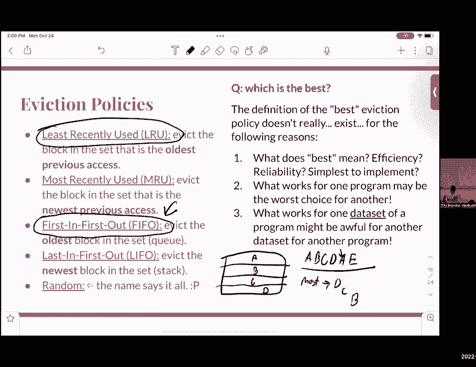

# CS 61C at UC Berkeley  - Fall 2022 - P35：Discussion 9： Caches - 这样好__ - BV1s7421T7XR

下午好，欢迎大家参加今天的第九节讨论，我们将对危险进行一点回顾，工作表上有一节，这就带来了一点数据风险，其中有一点危险，这在上周的讨论中已经涉及到了，本周我们将从谈论现金开始。

这周我想在缓存上花很多时间，今天的讨论，所以一点点物流，今天要交第六份作业，区域贸易协定达成了共识，家庭作业6对项目3来说是很好的练习，嗯，有几个问题我们认为很有用，所以我们建议你做，嗯。

三八工程上周到期，项目3b将在大约两周半后交付，具体是11月9日，呃是的，正如我刚才提到的我们的议程，我们将快速回顾一下猫的危害，既然这似乎是一个我们可能需要更多时间的话题。

然后我今天确实想把很多时间集中在缓存上，尤其是，我们将讨论直接数学和关联缓存，如果你们不熟悉这些术语，今天我们将更详细地讨论这些条款，另一个资源，我想指出我们的助教，卡罗琳是缓存的超级粉丝。

她实际上教了相关的讲座，的，一些与现金有关的讲座，她专门为这个主题做了茱萸，所以我强烈建议你们去看看，如果你们想喜欢，再详细一点看，得到任何关于卡什结果的澄清，好啦，所以考虑到这一点，呃。

我们要进入数据危险，就像我们上周说的，可能有一天我们会有两个类似的指令，在我们有添加的地方，我挑逗X零五，然后SLI T零二零二，关于这两条指令，我们注意到的是，第二条指令的值。

第二条指令中使用的值取决于第一条指令的值，这意味着，这意味着如果我们要做简单的单次骑行，我们希望得到这些更新的值，然后继续进行，然而，如果您以某种方式使用流水线来实现它，有点不一样，因为请记住。

在我们的风险五数据路径管道的右后台，我们在这里把我们的值写回实际的文件中，但是，我们要确保我的指令解码阶段，也就是我们从重新文件中读取值的地方，我们要确保它与之前的指令同步，因为在这里。

我们有右后卫一直到这里，然后我们一路来到这里，然后我们有指令解码一直到这里，我们得想个办法，不知何故，就像防止一种一致性在，比如读取相同的值，在这种情况下，我们有两个主要的解决方案来解决数据危险。

哪些是数据转发，这就是鸡蛋，也就是执行，然后将执行阶段的结果传递到指令中，执行阶段在指令解码后立即进入，还是有摊位，我们要做的就是，呃，把我们所有的管道，所以说，右后台将在第二条指令的指令解码前进行。

对此有什么问题吗，你什么意思，喜欢喜欢你，以后再说吧，呃是的，所以我们在这里看到的，如果我们用这个普通的例子，这正是我们最理想的，我们希望它离开，好啦，我不知道做这件事的确切方法，但让我们看看我能不能。

好啦，呃，一秒钟，伙计们，好吧，看，目前我们有这样的东西，对吧，好啦，现在当我们谈论，呃，拖延几乎意味着我们必须把我们的东西像一个舞台一样向右移动，或者类似的东西，所以像这样的东西。

然后我们就假设这已经不存在了，如果我们需要再来一次，我们会把它再移动一个阶段，然后把这个去掉，这有道理吗，呃，我觉得，就像一些事情就像，就像运行相同的蒸汽多次与失速，喜欢什么我很好奇。

当这些什么都不做时会发生什么，或者生病，或重复同样的状态，所以，嗯，有一个概念叫做不做或不做，在那里基本上只有管道零，因此零将通过您的数据路径，就像一句谢谢，因为我只是一个讲座，上面说。

我想改变所有的指示，你基本上可以解决一个额外的周期，只要不做任何事情，比如不做一个循环，直到结果完成，然后你可以处理像，就像你做的一样，呃，复制，我会回到那个，是啊，是啊。

所以如果我们在这里放一条空白管道，咖啡还在吗，就像耶，就在这里，哦耶，把它拖下来，然后像这样向右移动，所以如果你说中间，然后所有这些都是零，那么本质上你在做同样的事情，你只是在一个零指令中流水线。

但我想他们展示的方式可以改变，就像整个指令的执行，是啊，是啊，所以当你这么做的时候，当你插入一个旋钮时，需要实际的下一条指令，我们感兴趣的那个也只是在时间上转移了，所以一切都无所谓，比如什么是过程。

就像你已经处理了分解和解码，没关系，就像那些东西发生了什么，这有道理吗，喜欢不对的，是啊，是啊，因为对于不对的人来说，你只意识到你需要一个不是，当你按下第二条指令，你已经，然后你在解码。

然后你需要从上一条指令到第一条指令的执行结果，因为它现在，使其进入执行阶段，哦对了，原来如此，嗯，你说的是，在这里进行数据转发，还是你只是在说拖延时间，哦不，两个都喜欢因为喜欢，好啦。

这是解决同一个问题的两种方法，所以我们可以将一个阶段的输出连接到另一个阶段的输入，在这种情况下，我们要把短路，或者我们可以输入一些空白指令，它只会延迟，也许是时钟滴答作响，嗯，隔间和旋钮不那么受欢迎。

因为它们确实如此，他们只是在浪费时间，可以这么说，嗯，但是数据转发更复杂，它需要更多的多路复用输入，更多的控制，但是是的，两种不同的解决方案，关于数据转发或数据危险的任何其他问题。

还有另一部分数据危险涉及内存，所以几乎，我们通常的情况是，我们必须在指令之前阅读dm，从同一寄存器读取，例如，如果我们有一个呃，从零开始加载字t零，然后我们要求和，然后我们必须使用t 0的值。

当我们把s一加到t零时，然后将该值存储为1，最终发生的是我们需要，不管是用什么方法，或者在这种情况下，我们可以为了记忆的终结，到这第二个指令的开始执行阶段，但请注意，这只适用于所有其他指令，是啊，是啊。

有一点评论，呃其实没有井，我们现在要去控制危险，所以差不多，我们可能会，在控制风险中通常发生的情况是，在我们这样做的情况下，不知何故需要拿一根树枝，我们有一些，假设我们有我们，假设我们有这样的指示。

我只是要去复制这个，这里，所以通常情况下，当我们发现我们的前任是什么时，我们会定义，我们是否需要在执行阶段分支，就在后面，因为它就在后面，重写执行阶段周围的。

因为我们可以决定我们的个人电脑所以从这里开始，但我们可能会注意到，有时是在使用流水线，最终的结果是，因为我们希望执行add i指令，就像马上上台之后开始指导，在b q的指令提取阶段之后，最后会发生什么。

我们有一些额外的，我们有一些值存储，我们将从，就像执行阶段或内存阶段关于或指令解码阶段，或执行有关添加指令的阶段，如果我们要给，我们得想办法把整个输油管，因为我们不想使用从数据指令中得到的任何值，相反。

我们希望从标签中的第一条指令中获取相应的值，所以这就是为什么我们需要以某种方式处理这个问题，因为我们不想处理无关的价值，为了喜欢这个介绍，我们要，我们的解决方案是要么拖延管道，所以呃。

我们可以确保我们所能确保的，一旦我们知道我们是否真的跳了起来，然后我们可以开始执行下一条指令的下一个状态，或者我们可以使用分支预测，它选择一个被接受或不被接受的猜测，如果我们错了，然后。

当我们使用这个分支预测预测器时，我们继续推进管道，我们假设，哦，分支预测器是正确的，所以它会选择下一条我们想要执行的指令，下一条输入到管道中的指令是设置指令，如果我们错了，我们只需要冲洗，那就更多了。

嗯，这样效率高多了，我知道这很让人困惑，但有人对此有什么问题吗？就像分支预测一样，嗯，老实说，我认为这就像是基于生产错误，就像假设我们不拿树枝，发生的事情也是如此，基本上你像烧烤一样处理。

然后开始处理添加i，最终登上了，呃，我想是执行的问题，它实际上是要被拿走的，所以在这种情况下，例如，会发生什么，嗯，我指导了半过程，可以这么说，因为在那段时间里你要上台，在我的ID阶段。

最后他们会去执行死刑，我相信为了烧烤，然后就会像，好啦，我们不应该拿这个树枝，让我们跳到下一件事，所以你的意思是我们，我们开始流水线化对应于无分支的指令，但如果我们真的拿走了树枝，现在我们有了这一半。

是啊，是啊，所以我们要做的就是，这叫同花顺，所以我们冲洗管道，基本上，我们只是停止执行该指令，因为我们不想忘记，你知道的，你的CPU现在必须处理，切换到标签并处理那个，有点时间延迟，但有时你是对的。

有时候你不是，总比等着好，但就像爸爸一样，是啊，是啊，是啊，是啊，实际范围预测，我是说，我们在这门课上并没有广泛地讨论它，但这仍是一个正在进行的研究领域，所以我不会太担心细节，但总体思路是对的，是啊。

是啊，问得好，还有其他问题吗？好啦，所以考虑到我们所说的，有一个特别的问题，在我真正想讨论的危险部分的第一部分，就像，两个相邻指令之间的数据危险需要多少个停顿，为了控制危险，我们需要拖延多少个惩罚周期。

所以我给你们两到三分钟来完成，好啦，呃，希望，呃，你们花了点时间，这个问题，有人想第一次分享他们的答案吗，第一个问题，两个相邻指令之间的数据危险需要多少个停顿，为什么你说，因为有五个阶段。

你想在写完之后开始你的指令解码，好啦，是啊，是啊，我认为你的想法是对的，你们很亲密，但不完全是这样，所以让我继续喜欢，呃，复制这个，所以，所以我现在这样做，这就像我们现在的管道。

你是说我们希望这一切发生，就像我们需要等到右后卫完成执行后，所以在很大程度上，嗯，呃，我们必须适当地移动这个，所以我的意思是，对不起，哦，我们走吧，好啦，所以如果我们把这个移动一次，呃。

我们还没到那一步，如果我们再来一次，我们还没到那一步，哎呦，哎呦，我们还没到那一步，要么，如果我们把它移到这里，我们将在右后卫之后进行指令解码，所以这已经足够好了，所以在这种情况下，我们只需要三个循环。

现在呢，四，这对每个人来说都有意义吗，有人想试试，嗯，控制危险问题，对于一个控制危险，我们需要解决多少个惩罚循环，这是一条管道，是啊，是啊，这是一条管道，是啊，是啊，有人想回答下一个问题吗？

我还有最后一个，哎呦，会是同样的三个吗，因为与其担心回到教学中，解码我们需要的东西，我们想做的是，等到最后，我们想拖延时间，以便执行结束，呃，执行结束有点像，还是对不起，在记忆阶段之后。

然后我们要在记忆阶段之后在这里做指令提取，因为一旦我们在记忆阶段结束后在这里执行，我们一定会知道，好啦，我们是否真的拿走了树枝，指令获取我们实际获得下一条指令的地方，所以你几乎是，会一样的。

只不过我们要，就像三个惩罚周期一样，只是我们会担心不同的阶段，是呀，是啊，是啊，对不起，你能回答第一个问题吗，第一个问题，好啦，当然，所以我们做了一个危险，我们知道，嗯是我们想要使用的实际值。

会被写回右后方的指令中，我们知道指令解码是我们得到这些值的地方，所以最初发生的事情是我们，我们的输油管是这样的，但是现在我们要确保我们的指令解码发生在写回之后，因为在右后卫，因为我们实际上是在写。

我们知道在指令解码状态下，我们知道在，我们知道，如果我们有我们的指令解码阶段，回信后，然后我们就会有正确的值，所以这只是一个转变，循环的两个三个指令，是呀，所以在这种情况下，它是第一条指令的右后方。

快乐的同时在国王的指导部分，是呀，好啦，是啊，是啊，你知道他们都有点，它们都涉及到数据路径的不同部分，所以他们不会喜欢冲突，是呀，因为我们在等一个男人，但不是马上回来，就是它是，那时我们就知道了。

就像在电脑上一样，你去哪里，是啊，是啊，差不多吧，更像是执行死刑，我们从哪里得到的，只是回忆过后，这有点像一种安全保证，你可以说，嗯，我想这就像被送回去，是啊，是啊，是啊，是啊，你能再解释一下吗。

为什么你要为控件解三个循环，好啦，所以这有点像他说的，所以请记住在我们的麦芽酒里当我们从ALU那里得到我们的东西后，然后我们要把它发回电脑，我们得把它送回电脑模组，因为我们已经计算了PC单元。

不管我们是去ALU指令中的计算地址还是下一条指令中的计算地址，P c加4，然后嗯，你只有真正喜欢才能，呃，只会写在下一个时钟滴答声中，就像实际价值一样，我们想要我们想要得到的指令的实际地址。

会写在下一个时钟滴答作响，所以我们必须在内存执行后等待，因为这就像执行后的一个时钟滴答声，所以这几乎涉及到，然后我们知道在指令中提取，我们实际上是从实际地址得到指令的，那是来自PC寄存器的，所以，呃。

我们要做的就是确保，我们的指令提取阶段是在记忆之后，因为那是在时钟滴答滴答之后，将值写入PC寄存器后，还有人对此有什么问题吗？我很想进入缓存，所以是的，如果你们还在纠结，我真的建议在办公时间来。

我们真的可以用它潜入深处，但是，考虑到这一点，嗯，我们可以从进入缓存开始，所以嗯，我们一开始为什么要使用缓存，目前我们的系统包括在这里有指令，所以让我们把加载词设为零，零，P，然后我们假设。

每次我们装货的时候，我们从我们的直接物理记忆中加载，但是，我们将在这里看到的一件事是，访问物理内存需要很长时间，最多一百，有时长达一百个循环，如果你想更进一步，就像进入电脑的实际磁盘。

可能需要更长的时间，大约一万个循环或更多，所以我们想要的，所以我们想要现金的原因是，我把它作为我们的中间人，因为从缓存中访问某些东西比从物理内存中访问某些东西更容易，所以这就是为什么我们。

我们想让事情变得更快，并使用缓存，取而代之的是，我喜欢想到的一个例子是，嗯，我不知道这有什么关系，你们会发现这个类比，但是嗯，假设你在热气球上，你和你所有的补给都在地上。

你能真正得到材料的唯一方法是通过一根电线，差不多要10分钟，如果你知道你会访问很多，很多材料，就像在一定的时间内，中间最好有一个类似盒子的东西，存储所有的值，你要保持访问权限，你要继续访问。

因为你不能拿着热气球里的东西，所以接下来会发生什么，你可以很容易地从盒子里取回物品，如果有什么，喜欢继续使用它，等等，等等，所以这有点像一种方式，我喜欢考虑缓存，因为它更容易检索和编写东西，是啊，嗯。

当我们谈论缓存时，我们交谈，我们想使用现金的两个主要原因与离得很近有关，这需要空间局部性和时间局部性，所以呃，缓存的一个好处是空间局部性，这意味着如果我们要访问彼此靠近的项目，在记忆中。

我们的缓存不知何故起作用了，所以我们也储存了附近的所有元素，所以每当我们需要取回附近的元素时，很容易就喜欢，进入我们的缓存并取回它，再到时间地点，呃，这有点触及，呃，热气球，我是我之前说过的一个例子。

但是假设我们需要多次访问某个项目，如果我们把它放在我们的缓存里，这让我们更容易保持，从缓存中访问某些内容，等等，等等，等等，时间地点，算是确保了，如果我们很快得到相同的元素，它会在我们的缓存里。

然后我们就可以把它找回来了，对此有什么问题吗，如果我们把我们的缓存纳入我们对计算机外观的总体概念中，它会是这样的，目前我们已经讨论了我们的处理器，其中包括控制我们的数据路径，然后我们的记忆就在这里。

储存了很多东西，不过，现在按顺序，如果我们想让事情更快，我们必须在这里包含一小部分内存，这将是我们的缓存，这就是我们喜欢的地方，检索和写入值，等等等等，关于缓存需要知道的一点是，它相对较小。

与内存大小相比，所以最终发生的是，我们可以，我们会在这里有一个巨大的记忆，但相反，我们只会储存少量，所以在这种情况下，呃，这里只有四个和四个数据项，与整个记忆相比，我相信这里有16个，是呀。

你可以控制像，缓存中有什么，是呀，呃，我们会很好的，是呀，呃，我们会做得更多，我们会做得更深入，是啊，是啊，所以给你们一点词汇，所以每当我们说话的时候，我们的缓存，在我开始之前，我会的。

我喜欢把它想象成一个双D数组，它以这样的顺序存储了一大堆块，所以每当我们使用单词缓存行或块时，我们指的只是一个，所以如果我们知道这整件事是一个缓存，我们知道我们的，我们知道区块只是指这些井中的一个。

它存储了一行数据，然后是一套，嗯意思是，呃，它将是一组缓存行，以形成一个更大的组，它是由索引索引的，当我们进入并设置这样和方式设置，联想和完全联想，我会多讲一点，把它想象成一组积木，你可以简单地在里面。

您只需要一个索引就可以访问，而不是两个索引，如果我们有两个街区，然后结合律是，再次形成集合所需的行数或块数，当我们谈到方式设置时，我会更深入地讨论这一点，联想和驱逐是当我们想从一个。

从缓存中删除猫的项的操作是什么时候，这通常是在我们想喜欢的时候做的，把一组新的数据放进去，或者替换当前的，当前缓存中的内容，所以我会继续为这个做一个新的页面，因为这将是一个很大的，好啦。

所以我们在这个班上，我们讨论了三种主要的缓存，我们有直接映射，我们将从我们最严格的一个开始，也就是直接地图，嗯，每当我们把索引分类到缓存中，我们只是假设每件商品一个街区，所以如果我们知道这是我们的索引。

这是我们的数据，我们知道这是我们的索引，这是我们的数据，我们我们有点像是非常严格的限制，其实我把这个，我们这里很严格，并确保在一个特定的索引上只能检索特定的数据，又不是说。

我们可以假设同样的指数也意味着，我们可以把这些数据读到no，我们不能那样做，我们必须非常严格地限制它，然后我们有了完全关联的缓存，现在，我们在这里使用的是，我们需要一个索引来实际访问某些数据。

如果我们根本不需要使用索引呢，就像找到，空的，缓存中的任何空白区域，然后把我们的数据放进去，这就是完全联想，如果我们有一个很简单的缓存，上面都是这样的数字，不一定受指数限制，我们可以检索到哪些数据。

如果我们想的话，我们得看看，如果我们知道，我们在缓存中寻找的标识符，那我们就得找遍所有的街区，因为任何块都有可能存储我们的数据，最后我们已经准备好了，联想，我们结合了，比如没有索引来访问不同类型的数据。

实际上对一些数据使用索引，我们把它组合在一起形成，所谓的n路集合在单向上的联想，我喜欢认为它是，假设我们有，这是我们的索引，而不是简单地存储一行，而不是每个索引存储一行内存，我们可以储存两个。

也许甚至三个，也许甚至四个，我们不是，嗯，这取决于n是什么，所以如果我们说我们是双向集合联想，这意味着每个索引只存储两行，所以一组由两个缓存块组成，如果我们有三个，这意味着每个索引将有三个缓存行。

如果我们有四个，每个索引有四条高速缓存线，等等，有人对此有什么问题吗，嗯，有点让人摸不着头脑，就像上次重组一样，但不是另外两个，您如何访问，我们有一个标识符，关于我们是什么，我们在找什么样的数据。

这需要我们仔细检查每一个街区，如果块在完全关联的，n路集合联想，我们确实有一个索引，所以一旦我们这样做了，所以一旦我们得到索引，然后我们有一个要查找的缓存块列表，或者N个街区去看。

然后我们会像标识符一样查看，就像，如果这些块中的任何一个有标识符，还有其他问题吗？是呀，呃，标识符是什么那是标记，是呀，我们会更深入地研究它，呃，当我们谈论高速缓存线的结构时，但是是的，是呀。

这是确定的指数，我想类似地说，就像直接，E，是呀，是啊，是啊，稍作修改，在我们不需要的情况下进行轻微的修改，就像每个块有一个索引，我们只是，我们可以在某种程度上缩短缓存压力中索引所需的位数，呃。

还有其他问题吗？我们是不是应该重温一下，因为我知道这些都是新话题，我想我们今天才开始讨论关联缓存，值得花点时间，是啊，是啊，好像你，你介意吗，如果我稍微剖析一下，所以说，顺便说一句，谢谢你这么做，是啊。

是啊，所以这些都是新的话题，所以最初你们听说过直接地图缓存，所以我们有这个TIO分解，对呀，我们有标签，索引和偏移量，嗯，假设我们试着先读取缓存中的一行，我们要看看我们的索引，对呀，所以我们的缓存。

所以它是由这些线条组成的，指数等于零，指数等于一，依此类推，因此每个缓存行都有自己的索引标识符，所以如果我们知道索引，我们很清楚该去哪里找，如果我们知道偏移量，你知道这里的缓存线。

地址中的每一位都映射到内存中的一个特定字节，对呀，所以偏移量会说，好啦，嗯，我这里有这个索引，所以让我们跳入，假设3的偏移量，我们将读取索引处的第三个字节，然后我们要比较标签，就像，好啦。

我们找到了索引，我们找到了偏移量，但这是高速缓存线吗，我们在找，是啊，是啊，呃，我在课上看到我们从右到左跳，呃，是呀，是呀，我的意思是，它是，嗯，已经提出了，呃，无数的方式，但丹的看法是，是嗯。

在同行地址方面，事实上我会的，我建议重温他的方法，因为他用地址的确切部分来谈论这些事情，就像呃，右边像地下室，不过分，是啊，是啊，因为当我们看到一个地址，我们有阿牛，你知道一些，在以下方面的抵消，就像。

块中的字节数将是最后几位，对吗，它会告诉我们我们要找的确切字节，但中间有一段，那就是说有点像，我们在看哪块数据，所以这个指数，这是我们的索引，这是我们的补偿，这个指数会增加，不管有多大，这些偏移位是。

我们会不断增加一个，直到索引被实际修改，意思是它是一块记忆，嗯所以是的，嗯，丹的意思是，这将是最不重要的，然后是下一个，所以这是同样的想法，我不想把你弄糊涂，我们说的是同一件事，问得好，虽然。

嗯所以用这个想法，就像这些标识符，这个标签，本索引，这个偏移，当我们谈论结合律时，我们要么只是说，例如，例如，假设我们在缓存中以某个索引加载一个块，对呀，说，指数为零。

但是我们想从内存中读取另一个具有相同索引的东西，嗯，我们不能用相同的索引在缓存中存储两个东西，所以我们缓存里原来的东西会被抹去，它将被新事物所取代，我们试图访问不匹配的标签，是啊，是啊，是啊，是啊。

所以标签不匹配，它是，这是正确的索引，但这是错误的记忆块，是啊，是啊，然后我们更新缓存，然而，联想说得很好，如果我们的索引可以正确地存储两个不同的东西呢，我们可能不匹配第一个标签。

但是我们可以在同一个索引中重新加载另一个块，并且两者都有，所以这就是他所说的时间地点，这就像我们还没有摆脱旧的块，我们还是要把它留在身边，但现在我们有两个指数相同的街区，所以我想的是。

我想多拿点你旁边的东西，在记忆的旁边，就像你会拿同样数量的额外东西，好像就在附近，说得好说得好，那是空间局部性，哦是的，嗯哦我是说，你的方向是对的，是啊，是啊，缓存确实是这样做的，每当我们把一块记忆。

我们像所有的街区一样，我们就像，如果我们说我们从一个地址开始，我们会继续抓住每一个，就像咬我们可以放进我们的街区，所以这有点像空间局部性，我们在说布兰迪说的是，假设我们访问的是完全不同的内存使用区。

那时我们需要一个不同的标签，因此，我们必须以某种方式将新数据放入缓存中，因为我们可能会在稍后访问，因为这就是本所说的，就像，你让整个街区都搬过去了，但仍然被保留着，然后你有一个新的号码，它有同样的。

或者这是相同的索引偏移量，让我们也把它放在那种与同一指数有关的东西上，但它不一定是相同的抵消，好啦，或者至少像嗯，你好像在说，你会保留旧的街区，也有一个新的街区，是啊，是啊，没错，这就像时间的位置。

是啊，是啊，是啊，是啊，是啊，是啊，这是一个想法，我们可以访问的东西，是啊，是啊，我们不喜欢只是把旧的东西扔掉，就像我们还能坚持住一样，再坚持一下，也用同样的索引加载新的东西，是啊，是啊，你真是。

这两者都有空间局部性和时间局部性，因为当你加载新的，挡住他们，当你也在周围的东西，周围也是，是啊，是啊，是啊，是啊，在这方面，但是，有时在这种情况下，我们必须牺牲块的大小，因为我们想提高我们的联想能力。

对呀，因此，我们希望增加可以用相同索引加载的块的数量，但也许有时这需要我们缩小块，嗯取决于你对缓存的规格，你能用它工作多大的尺寸，与，但是嗯，是啊，是啊，是啊，是啊，所以当你遇到问题时。

你会被告知你的街区大小是这样的，或者您的总缓存大小如下，这就是你的联想性，你知道你有多少块，这类事情，就像维度，各种各样的问题，我知道我们今天可能什么问题都解决不了，但我认为这可能是值得的。

只要确保我们把这些想法钉牢，是啊，是啊，这些缓存是本课程的一个重要核心主题，所以让我们来谈谈完全联想，所以我们就有了这个方块，但现在让我们说谁在乎指数是好的，假设我们有一个空缓存，我们想读取一大块内存。

我们把它扔在这里，然后我们要读取不同的内存块，我们在这里将标记与加载的内存进行比较，他们不匹配，所以我们就把它扔在它的正下方，就像你有一个空的空间，让我们扔一堆东西在那里，我们试图解决这个问题。

这里是说这个东西是满的对吧，我们读到一段记忆，我们需要做多少比较，是啊，是啊，你得比对缓存里的每个标签，你没有命令，您没有索引，告诉您要与缓存进行比较的确切内容，因此。

您必须将标记与缓存中的每个成员进行比较，而这里说嗯，你在看指数为零的东西，这里有一些数据，您只需将标记与索引零进行比较，如果不匹配，你交换，但现在我们得做个比较，比较，比较比较，所以我们用这个来交换。

这是完全联想的，我们用N方式关联来交换这个，我们要准确地说出尼基刚才说的话，我们有指数的地方是零，指数一指数二，但现在每个指数可以携带多个块，就这样结束了，是啊，是啊，是啊，是啊，是啊，是啊，是呀。

在这种情况下，这将是一个双向集关联缓存，所以现在如果我们读取索引为零的东西，并将其加载到缓存中，我们读到其他索引为零的东西，我们做了一个对比，然后我们把它装进去，我们不必和其他任何东西比较。

所以我说我们试着读一些指数为零的东西，我们做一个对比，然后我们就大功告成了，我们不需要担心指数一指数二，像那样的事，我记得这些，这些标记和索引索引只是内存地址的一部分，在您的内存地址中有某些位字段。

所以我们真正要做的是优化，不仅是空间局部性，时间地点，但我们需要做的比较，当我们试图读取和加载内存时，是啊，是啊，可能会完全关闭，但这更像是一张哈希图，有点相似，很像吧，就像是一种外部训练，我猜。

或者当你有很多事情，那其实是那，是啊，是啊，那绝对是一个很好的类比，就像你可以假设，嗯，每个人都喜欢这个数字，因为它是双向的，联想的，就像一个索引，已经，就像两个博客，有点像数组，是呀。

你绝对可以这么看，对不起，如果我完全喜欢被劫持，哦不不不不不，这很有趣，这些想法是不是更有道理，现在呢，我觉得最重要的是，在你的脑海中有这些不同缓存的图像，当你和他们打交道的时候，知道如何构造它们。

把他们引出来，然后像这样更新这个缓存表，当您为，我们让我们得到一些索引为零的项目，是否有某种边界，我们只是随便进来的，只要检查标签，只是通过所有索引零的值，是啊，是啊，没有命令，是啊，是啊。

你只需要检查攻击，是啊，是啊，还有其他问题吗？是呀，但这就像是被欺负的好处，呃，我想说的完全关联缓存的一个好处是，我们不受索引的限制，如果我们知道我们可以在缓存中存储任何类型的块，不管是什么索引。

这都比简单地有一个索引要好，如果我们知道我们会有同样的索引，在我们的直接映射缓存中，嗯，然后我们知道这将是一个不同的标签，每次都意味着我们要继续驱逐，继续增加，不断驱逐不断增加，最好有，在这种情况下。

最好有一个完全联想的东西，是啊，是啊，这实际上是他提出的一个很好的观点，我们会讨论驱逐政策，所有这些东西都来了，但这是你必须记住的，也是你喜欢的，而且完全联想，您只需要在缓存已满时驱逐某些内容。

而另一个不一定是这样，啊，我们有什么，好啦，嗯，我想我们几乎涵盖了很多关于标签，索引和偏移量，所以说，但是我们实际上是如何计算比特数的，我想快速讨论一下，所以标签就像，我是说某种唯一的标识符。

我们正在寻找我们的缓存，在这种情况下，它将是我们内存地址的第一个t msb位，如何计算标签所需的位数，就是，我们必须计算，我们必须知道我们的系统中有多少位，然后减去索引的位数，和偏移量的位数。

我们怎么办，我们如何找到索引的位数，嗯，差不多吧，呃，我们需要索引缓存的设置号和它可以，如果我们说的是，如果我们谈得很好，好啦，稍等一下，是啊，是啊，我们在索引中所做的是。

我们需要找到实际存储在缓存中的集合数，然后我们通过这些索引，所以在这种情况下，呃，如果我们讨论双向集合联想，嗯好吧，让我们假设二的相似幂的情况，假设我们这里有另一个索引，这里是二三，因为我们有四套。

即使我们有八个街区，我们只需要一个二位的索引，因为我们只是想通过四分钱，另一种思考的方式，您实际上可以将直接映射视为单向设置关联缓存，因为只有一套，每个块一个有意义的索引，是啊，是啊，然后偏移量依赖于。

几乎是缓存块中存储的实际数据的偏移量，这取决于块的大小，所以说，假设我们能够在每个块中存储大约16个字节，我们需要的是找到，得到偏移量的位数，我们需要计算出实际上有多少位可以获取每个字节的索引。

在这种情况下，这将是四个比特，因为16字节的4位，十六中的第二把锁是四把，然后标签得到实际的位数，呃，就像我之前说的我们，如果我们知道缓存地址是多少位，然后我们减去偏移量位和索引位的个数。

对此有什么问题吗，偏移量在这个，偏移量以字节为单位，是啊，是啊，哎呦，关键的事情，是呀，抵消，咬，Snupets，嗯，好啦，嗯，有很多不同的，嗯，事实上，我确实想谈谈驱逐政策，呃是，我不打算说太多。

我只想谈谈最重要的，它们是FIFO和最近使用最少的，以及LRU最近使用或访问最少的，所以FIFO，如果我们的布景里有一堆积木，我们知道他们在，所以如果我们知道我们有四个街区。

我们知道我们的订单会像B C D E，如果我们知道，如果我们加上这些，其实呢，让我们改变它，只是为了保持对B的一致更改，好啦，所以说，这么说吧，我们将在缓存中插入以下四种块，我们知道第一个是a然后是b。

然后我们有c，然后我们有d b已经在我们的缓存中了，所以我们不需要，呃加上任何东西，但之后我们必须将e添加到缓存中，因为我们的缓存已经满了，我们无法知道，嗯，实际上我会把这个改成嗯。

我们必须把第一次放进我们缓存的东西驱逐出去，如果我们使用FIFO驱逐政策，在本例中，我们添加的第一个块是，所以我们必须去掉它，加上e，现在假设我们想使用最近使用最少或最近访问最少的。

我们可以按照下面的顺序再做一次，B、C、D，然后我们有一个，所以这改变了我们访问的顺序，因为现在我们，如果我们被告知我们最近使用的，这就像d c b a。

但现在我们又进入了一个，我们必须改变我们的顺序，这样DCB就可以向下移动，然后A成为我们最近使用的，然后现在我们要排除一个方块来添加e，我们得看看我们最近用得最少的，在这种情况下，那是b不是a。

与国际足联相比，所以我们要做的就是去掉b块，然后加上e，这有道理吗，好啦，我觉得，呃，我们缺少，我们差不多按时完成了，所以呃，我想我们可以称之为，是啊，是啊，是啊，是啊，对不起，我们没有谈到现金的问题。

但我真的建议你要么看看，也许卡罗琳的区，或者嗯，也许再看看讲座，但当然是我喜欢的笔记，他们是，它们连在幻灯片上，你会得到更多的练习，写作业之类的，但是哦是的，家庭作业七。

