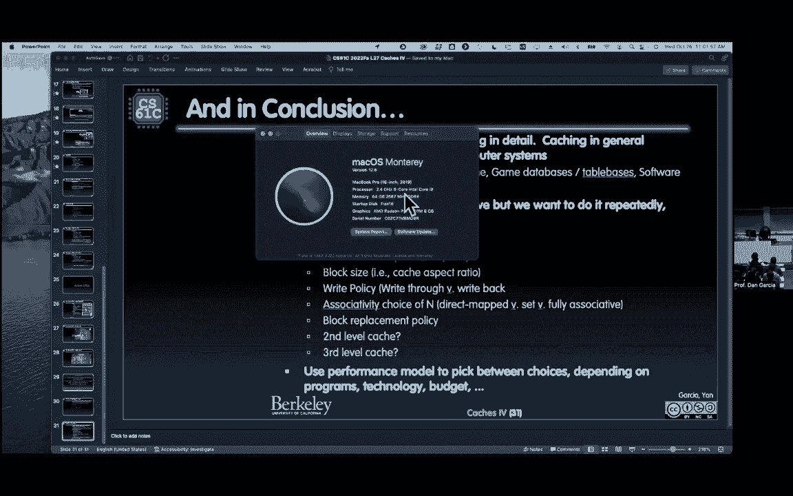

# CS 61C at UC Berkeley  - Fall 2022 - P36：Lecture27： Caches - Set - associative,Performance with Caches - 这样好__ - BV1s7421T7XR

所有这些奇妙的刺激，所以八年，记录保持的时间越长，他说能有这样的经历真的很了不起，多年来记录再次被打破，你的问题是，告诉我你的名字，塔罗斯科，让它跑得更快，就像缩短，呃，所以问题是这样更好。

让时钟走得更快更难吗，或者是关键路径，他们没有重新接线，所以他们没有试图对关键路径做任何事情，他们只是在看，如果他们能保持冷静，那是我的理解，你只是把一个内置的系统，我不知道他们还想黑多少东西。

制造一台工作的计算机，这只是CPU本身，无论它只是一个小buff，就像罐子里的大脑，还是只是CPU，还是一台完整的电脑在工作，对我来说完全不清楚，我只知道他们需要做的是让这些事情奏效。

是有显著的冷却策略，像以前一样的粉丝，以前所有的CPU都是冷却的，风扇吹过散热器，他会想到像散热器，在转移时，大量的表面积风扇吹过，热力学中的热力学者，对传热了解很多，以及如何从系统中获得热量。

这是关于让液氮尽可能靠近你，到实际的核心，做实际工作核心，做实际的工作，令人兴奋的东西，我只想分享英特尔核心的这一新记录，8。8千兆赫，好好想想吧，我们到最后了，女士们先生们，欢迎来到现金的部分。

四个CX XZ吴很高兴你们都在这里，一如既往，这是本单元的最后一堂课，这些部队来势汹汹，顺便说一句，一旦我们完成了缓存，缓存总是在期末考试中，二十五年来我做的每一次期末考试，现金一直在那里。

大概25年前，缓存是我们在早期教的，这不像我们用的最新的尖牙，多年的渔获，确保你对基础知识有所了解，直接地图完全关联，我们今天学到了。

我们将学习一个叫做集合联想的新课题，所以这是一个强大的东西，这就是我的幻灯片，设置关联缓存，那是什么意思，我之前说过，有很多旋钮，缓存真的很有趣，我要到前面去，所以我可以在这里展示我的旋钮。

我得站在同一个地方，我上一堂课，当我做这件事的时候，上一课，我说，有很多旋钮，你是缓存设计师，你想让系统尽可能快，第一个旋钮是什么？缓存的大小，第二个旋钮是什么？长宽比是怎样的？又高又瘦还是胖。

你知道的，又肥又宽，你的街区面积是多少，这就是我要说的，块的大小是多少，所以缓存的总体大小，你的街区面积是多少，还有什么，到目前为止我们讨论过的另一个参数是什么，我们所有这些都是复习。

这是我们到目前为止讨论过的另一个参数，写政策很好，没人说对了什么，政策利好，你回信了吗，或者你写完，好啦，到目前为止，我们刚才说的最后一个是，你要去直接映射，每个内存地址都直接到邮箱插槽。

在那里它完全结合，是整个旋钮的另一边，你可以去任何地方，去任何地方，就像是，你知道的，很像飞机座位，你得到一张罚单，说这是你的座位，或者这是你的票，坐在任何地方或设置联想，这是头等舱的票。

坐在头等舱的任何地方，这是一张长途汽车票，坐在其中一个教练区，所以也许你应该去某个地方，但不是所有地方都是这样，所以说，另一个旋钮是你的，是同一个旋钮，去任何地方去一个地方直接映射，去任何地方完全联想。

在中间的某个地方，就是我们今天要讨论的，好啦，所以设定结合律，顺便说一句，记住咒语，队里没有我，没有我在完全如此缓存，原来联想有一个，我不得不说A是如此充分，如果社会演员阵容没有，我在那做什么不。

我的意思是，没有索引，索引告诉你去哪里，如果没有，我只要你去任何地方，所以没有。

我完全在这样的缓存中，好的，设置关联缓存，在你有标签之前它们是什么，索引和偏移量，和古老而间接的马，索引告诉你该去哪里，办公室前的标签和以前一样吗，唯一的问题是，是索引，当我转动旋钮时，当我转动旋钮。

伙计，当我转动旋钮的时候，旋钮是什么，的位数，我是那个直达地图怎么样，我和你一样大，因为你得去每一个地方，所以我是尽可能大的，你可以一直在这个大旋钮上，我是零，没有，我不我在完全如此缓存。

因为你可以去任何地方，我告诉你去哪里，如果你能去任何地方，为什么你会有一只眼睛，如果我把我做几块呢，这就是我们所说的，所以眼睛变了，取决于我们在做什么，那么有什么区别呢，这现在指向正确的行。

我们要把这叫做布景，所以哦，你的是什么？你的票是什么？说你说你会坐在头等舱的任何地方，商务舱的任何地方，在经济舱的任何地方，所以我告诉你在片场去哪里，我们叫它一套，我们不会叫它，这里的座位等级。

我们不喜欢那个词，好啦，有什么区别，每个集合包含多个块，就像你之前说的，头等舱有很多座位，你可以坐在那里，有道理，一旦我们找到了正确的布景，哦，这是舱口，一旦你找到了布景，你在哪里，你在片场里去哪里。

在这个集合中它是完全关联的，所以你去任何地方，我们可以谈谈你应该去哪里，所有这些事情我只是去空位，如果它在那里，但如果它们都满了，你把谁赶出去，所以这是一个对话，我们马上就有，那么现在是什么情况。

我们以前的缓存有多大，记住我的区域，还记得我的面积论点吗，缓存大小是多少，面积宽度，乘以高度，宽度是多少，一二三偏移，高度是多少？一二三块数，索引权，好啦，这就是所有的评论，但那已经是连续三堂课了。

又怎么了？

什么事？缓存的大小为，套数。

就像真实的数量，你们有头等舱商务教练时间吗，每组的块数，乘以块大小，每个块的字节，当你相乘的时候，每个现金得到字节。

所以现在它只是三件事的产物，好了，就是这样，这是很酷，你看，四字节缓存，在那里一切都是一个词，这只是一口宽，我们回到第一张照片，我给你看过，没有一个字宽和字节宽，上面有四个字节。

所有红色的都去上面的任何一个区域，那不是很整洁吗，所有绿色的都去绿色的区域，所以很简单，两套两套，四字节缓存，我现在暂停，任何有关的问题，有我们的第一个是最简单的可能，会发生什么，我们读一个字很好。

我们没有那种奇怪的，我们说的只是这张图片的字节，我们想让事情变得简单，只是读写字节，所以如果你穿绿色，你可以去那些绿色区域中的任何一个，如果你是红色的，你去找他们中的任何一个，你是怎么控制得那么好的。

记住你去任何地方，你可以去任何地方，你想去免费的，不要去忙的地方。

到前面去，如果他们都很忙呢，这就是谁做的对话，我们踢出去，我们一会儿再谈这个，所以基本的想法，缓存是直接映射的，你还有眼睛，你的我告诉你什么，你的票怎么说，我们回凉亭去吧，你的票怎么说，去哪一组。

头等舱套装，业务集，右教练组，每个集合都与，让我们再做一次算法，给定内存地址，我们该怎么办，好啦，我有一个内存地址，我该怎么办，把它分成丹叔叔，把它分成什么什么，哪些地区，什么，我欠了丹叔叔丹叔叔。

所以加入下一个，现在还留着，因为它不完全是Oche，不，我完全是一个OE，所以有一个我去我的眼睛，我告诉我哪个设置不是，我不再说阻挡了，哪个设置去一次，我在片场，我擅长什么，我要把所有的标签。

任何人无效，伟大的空地，我拿到了，但如果它们现在都有效，我得决定该怎么做才能把别人赶出去，好吧比较一下标签，所有的标签，如果匹配，啊，我现在在看书，我在读书，我正在找，我在找，我有内存地址。

在我的缓存里吗，我不知道，我得到了正确的设置索引，这是正确的一套，我这里有两个人，我有两个红色的，所以让我们做的图片，两个红色，是这个吗检查标签，不，是这个吗？是呀，是喔，是这两个地方之一。

但我必须平行地做这件事，我不能去，我不能按顺序做，我们说的是一个硬件，这必须是平行的，又不是说，啊，你为循环，你所有的软件人都去做一个循环，因为没有，我可以看到这个硬件必须是并行的，如果发生匹配。

请命中，否则，您将使用偏移量字段，当，如果有其他错误，如果是失手，把它放进去，希望有一个空位，把它放进去，然后用偏移量来做，就像我以前做的那样，没什么不同，唯一不同的是，这是一个两步的过程。

而不是它就在那里，就在这个地区，现在我必须平行地检查所有这些以确定哪一个。

它在这个集合中是完全关联的。

它有什么好的，我记得想象第一张照片，是啊，是啊，回去，想象第一张照片，记住，我们这里有四种颜色，就像红色，绿蓝绿色和橙色，我想如果我在两个区域阅读和写作呢，最上面一行的，嗯，我会错过像，我在这里看书。

但写信给那里，但它们都碰巧被读到了，我不能把它们放在同一个地方，因为两条红线都指向同一个地方，所以我不能同时复制一个数组，就像你知道的，第一个元素是什么？进一步复制，第二个元素把它放在第二个元素里。

我不能从两个地方复制，如果我只有一个地方，有点像乒乓球，我喜欢读这一个和好，那不是，做一个疯狂的标签，因为这里有标签，从这里阅读，写信给那里，从那里阅读，把它装进去，嗯，不同标签，好啦，把那个拿掉。

把这个放进去，从原点的另一个地方阅读，好吧，那就把它踢出去了，我在打乒乓球，我总是想念，我不再想念了，因为我从一个红色读到了那个红色，在记忆中随便挑两块，最坏的情况，它们都是一样的颜色，我可以穿我的钱。

所以这很棒，看图片，你看，我得到了两个红色，所以这真的很棒，比直接的地图缓存要好得多，顺便说一下，如果我问你，让我的直接地图缓存看起来很糟糕，你知道你怎么让它看起来很糟糕，做两个红色，对两个红色读写。

你每次都会失踪，可能有道理，对呀，因为你不能在照片里放两个红色，现在你可以放两个红色，所以现在那个堕落的案子，或者从两个方面快乐地阅读和写作，但他们碰巧是同一个直接的讨厌鬼，看，这是个问题。

现在你完全没事了，两个都可以，你在阅读和写作，整整一个街区，你喜欢它，所以这很棒，所以我们很喜欢，只是从，顺便说一下，你知道直达地图是单向的，数字方式是该缓存中的块数，如果我说一种方式，那是直接映射的。

有一张谈话的幻灯片，解释了好吧。

所以啊，有一个单行道，数字方式是一组中的块数，所以如果我走一条路，意思是这只是集合中的一个块，我回到了直接映射，原来是那个旋钮，我所说的直接映射的旋钮意味着单向，集合关联，完全联想是一种方式。

事情可以在一个街区里进行，这就是全部，这是整个缓存，所以那是一种方式，但现在我们说的是两种方式，我给你看的照片是双向的，布景中的两个街区，四路可能是那一套的四种颜色，等等，等等，总是二的幂，好啦。

这些只是特例，更一般的集合，同事们喜欢更一般的，我们基本上有一个硬编码，数字对一，然后我们想把它剪成n，现在我们说实际上可能是一个变量，现在我们可以把它变成2的任意次方，二四等。

开始了，哦，我喜欢这些照片，你就是这样把它连接在一起的，哦我的天啊，看看多酷啊，这是，这是我的地址，我有标签，我有索引吗，是呀，我有我总是有一个索引，除非它完全是一个社会，那我就没有索引了。

所以我有一个索引，这是我的索引，这是我的字节偏移量，事情就是这样，指数下降，平行向上，这是四路，在四个独立的平行缓存中查找，你从四个独立的平行缓存中离开，理论上他们每个人都拿着一个红色的，我查了索引。

然后平行地我检查这是否和以前一样，我们上次看到这个，检查标记是否匹配，有效位是否在那一小段代码上。

我来演示一下这是个大密码，就在这里，这是后面的圆圈，这和我们上次看到的标签完全一样，有平等平等测试仪，这是一个和，它是有效的。

如果是这样，它是一个打击，很受欢迎，如果它是一个或任何这些是命中，我有四个平行的比较器。

如果是命中，但现在问题来了，那我怎么做，顺便说一句，如果他们中的一个很受欢迎，理论上只有一个应该是成功的，我如何发送，哪个街区，那是在它是多路复用器之前，以信号线为指标，索引的一些位，现在呢。

我有什么好的，有趣的是，这条线上写着。

不管是不是成功，理论上，只有其中一个会同时被击中，所以我介绍了一个四A四对一的渣滓，就在这里。

这是数据值，这是数据，数据数据数据数据都下来了。

去一个四对一的多路复用器，通常一个四比一的马克思，我将有两条信号线，四件事，我选择两个比特来决定这四个人中谁赢，但这里我有四条平行线，每次只有一个是高的，因为他们中只有一个。

所以我们要介绍一个有趣的逻辑。

称为一热编码。

其中有四条信号线，四输入四信号线。

一次只有一个会很热，我向你保证这就像合同，当时只有一个热的，我向你保证在信号线上，然后如果第一个是热的，你从第一个数据中提取，第二个是热的，从第二个数据中，三分之一数据，四分之一数据。

这基本上是你的分数，就像一个最大值，其中这个信号告诉你要从哪些数据中获取，你怎么发电报，什么会，这样做的逻辑是什么，记住原始MUX的逻辑，曾经是信号不是S是信号线，不是A或S和B。

记住我们以前就是这么做的，就像一个小小的决定，在a和b之间。

所以现在看看这个，假设这些信号线被称为，假设有一个光标。

我需要一个光标，A，假设信号线上的四个人。

我们要叫他们信号A，信号b，信号C，信号D，数据线是a b，C和d，那扇门的逻辑是什么，信号线a和a或信号线b和b，或者信号线c和c或者信号线d和d就像，如果你还记得我们是如何看待多路复用的逻辑的。

我们只有这些信号线，顺便说一句，这是每比特，把每一点加起来，你这样做三次两次，总共32个比特，好啦，所以一个热的说这四个信号中的一个会很高，它是什么，你只要得到相应的数据值。

神经集，这种作品真的很厉害，真的很整洁，很明显，你可以很容易地一起构建这个，我说好，那是什么，那个多路复用器是做什么的，如果他们中的两个人飞得很高，我不在乎，那不是合同，合同是，我只打算开它。

一个又一个，一个又一个，一切都会顺利的，如果发生其他事情。

我不在乎，用示例替换块之后会发生什么，那么现在让我们来谈谈我们的整块置换政策，谁做的，我踢出去，我去排队，你想去，你有没有见过飞机的人，你先坐下，你见过有人，哦等等，我的座位有人了。

他们有时会超额预订航班，人们很困惑，他们把空乘人员带来，他们都得弄清楚，这就是我们这里所拥有的，我得去读一个记忆的地方，它不在缓存里，标签不匹配，我得把它放在某个地方，但是已经满了，缓存已满。

我坐在哪里，我该怎么办，我该怎么处理那张直接地图，我们用直接地图做什么，那是我的座位，这是票，我应该坐在那里，把那个人赶出去，标签不匹配，他们老了，不能把他们弄出来，那很容易，全联想井。

你可以在任何地方写作，我们知道有一套，联想良好，我得走了，我首先索引到集合，那么我坐在头等舱的什么位置呢，我想找个地方，努力寻找空位，就是这个想法和设置联想，这里有个问题，如果我们有选择。

我们应该把传入块写在哪里，如果有一个有效的位，它是一个空行，有效位关闭表示空行，抓住空排，很明显什么，如果所有的值位都很高，所有的标签都不匹配，这就是问题所在，那么哪个区块被套现的规则是什么呢。

你在缓存里，你好像有段时间，就像社交媒体明星一样，它们在一段时间内是相关的，你知道你已经几个星期没发帖了，你从来没有，你被套现了，那不是很有趣吗？

他们从美国公众的意识中套现，有趣的权利，所以这里有一些块替换策略，哦我的天啊，有第五个旋钮，记住我给你的所有旋钮，这是第五个旋钮，我的替换政策是什么，记住你可以设计所有这些东西。

这真的是一个很大的创造力思考，为所需任务优化特定硬件，也可能这只是一个游戏工作站，所以看看所有的游戏工作流，代码对此做了什么优化，不管你在做什么，所以说，最明显的是什么块，上面有很多蜘蛛网。

好久没人碰过的方块是什么，你只能有五个，你知道，想象一下你得到了一个非常著名的影响者的近况，但你最近的来电名单上只有四个，这就是最近抓住的，所以你认识谁，全都满了，一个新的人真的很老。

他们在TikTok上跳舞什么的，跳什么舞？他们都有，他们玩得很开心，夏日趣味舞，我得补充一点，我得加上这个新的性感的人，但我有四个人已经在我的名单上了，谁被赶出去，你猜怎么着，谁已经不相关了。

谁还没有发帖，谁没有在全国范围内引起轰动，这就是lru的意思，鲁说，找到最老的那个，上面有蜘蛛网的那个，无下文，无员额，你在90年代的繁荣中很重要，你走得这么远，套现，它被访问，最近，好啦。

至少像最古老的一个时间地点，记住时间局部性是关于，如果只是今天的访问，很可能你在那之后很快就访问了它，但如果有什么东西很长时间没有被访问过呢，可能您的代码已经转移到代码的另一部分。

你不能再访问那个数组了，或者你不在那个指导区，不管是什么原因，你已经不在那个地区了，把他们弄出来，这太棒了，所以Pro是一个地方，好啦，双向集关联的con con，易于跟踪，你有一点。

这一点告诉你谁是最大的两个人，最古老的，没有，现在你现在，你年纪最大，现在你们两个稍微告诉你那东西很简单，你是如何跟踪订单的，现在你在跟踪，像窗户一样，他们甚至在你的屏幕上有很多窗口。

就像你把一个带到前面，不知何故，您的计算机跟踪窗口的顺序，就像你最好的朋友，因为现在你要搬家了，所以好吧，现在我摸这个，那是我最近的朋友，但现在我得把他们撞到前面，他们必须保持秩序。

所以如果我遵守我的四件事的命令，四阶乘是什么。

24你得记住这两个人中的哪一个。

我是来了解，编码这些东西的两个四个总顺序，你对这个阶乘说你想让我们有一些，我的天啊，因为我们说的是二的幂，二四八八阶乘你想开始玩吗没有，这就是为什么在硬件上真的很难，跟踪真的很难，所以双向前进。

即使向前也很复杂，我们可以再努力一点，还有别的选择吗？没有，反过来说呢？至少最近用得很好，不管谁先到先得，好吧忽略访问，你忘了访问权限，如果你先来，我只是很清楚地记录了这一点，很明显是你先来的。

你出局了还是随机的，让我们随便挑一个，实际上令人惊讶的是，有多好，现实生活中的随机行为，那样真的很有趣，有时候你很幸运，有时你不只是随机的，作品种类。

好啦，这里有一个例子，所以让我们举一个例子，这会有一点帮助，我们会做lru，因为U是最常见的，我们只有两个方向，所以两个方向超过一个位，我们跟踪哪一个是订单，所以这就是我们的线索。

记得我们说过记忆追踪吗，有时你会有记忆痕迹，你运行这个，我们谈过这个我们谈过，是一个，什么样的小姐，是一种能力吗，小姐是冲突吗，小姐是对的吗，所有不同的失误，所以我们开始了，零二，只是这些是内存地址。

这些数字实际上是记忆中的地址，零，这是第一个内存块2，用第二个，第三个关于点击量的问题，这是一个很好的考试问题，一个很棒的小测验给你，这个lru替换策略会有多少命中和多少未命中，在双向四字节缓存中。

好啦，所以这是我们之前的红色和绿色，所以这个看到了图片，这是我缓存中的四个字节，我要把它们画成这样，从它开始，就像一个地点，一和零只是为了，想起来有点难，但我这样画是为了让你看到布景所以现在。

如果我认为这样画的好处。

顺便说一句，这个集合是指向那个集合的索引点，哪一组像左和右。

好的，好的，所以思考的方式，而不是集合是分组和垂直，现在布景在左右水平的某个地方，所以我才那样做。

好吧，我们开始吧，哦二，哦一四，哦，二，三，四，五，三，五，四，这是我的事，好啦，这是我的，让我们一起做吧，所以有一个小动画幻灯片，所以我们会有一些动画幻灯片的乐趣，看这个作品，好啦，这是我的零点。

失手了，什么样的小姐，是谁成员，什么样的小姐，这个叫做，义务教育，你得接受，你得承受打击，每一个内存地址都会被强制错过，如果你有记忆，我说你从来没见过你得拿着，你得错过一次，好啦，顺便说一句，零失误。

你不会错过每一个地址，应该错过每一个街区，所以如果你逐块查看内存，如果那个街区以前从未见过，那一定是失手了，现在每一个情况都必须错过每一个街区，记住你的地址块，因为如果你的邻居，如果是一个宽阔的街区。

你让你的邻居，你得到了一个免费的打击，我是说每个街区，你怎么知道那是什么，你知道那很重要，所以我把它带到零盘，因为零就像集合的数字基本上是偶数还是奇数，把这个扔出去，好的，所以设置零，放入位置零，嘣。

那是我的，现在呢，包含数据零的，顺便说一句，这就是我给你看的，那是零，这并不意味着值为零，这意味着图片中的数据显示，这是地址，我说的是零点的数据会进入缓存，只要确保我不是，这是一张小小的婴儿小照片。

高速缓存的数据的数据是存储数据，而不是内存，所以零的数据，我现在只是在画零，但这是零的数据会生活在那个地方，我只是让你看看，这样你就不会糊涂了，然后我要做一个小标签，上面说lru钻头被设置为一号位置。

因为我刚刚碰到了那个场景的零点，因此，如果我在集合零中有另一个访问权限，放在右边，就是这么说的，只要确保我们清楚这里的标签是什么，好啦，下一个我只是把它复制下来，所以这是一种运行动画。

下两个二偶数或奇数，即使如此，它被设置为零，好啦，啊，我把它放在什么上，啊，伊茹告诉我，耶耶，我放在那里，我现在可以拿0和2，零的数据，两个在同一个地方，所以现在如果我把读数从0复制到2。

它们都在我的缓存里，他们不是在我的钱之前，好吧，因为我刚刚碰了两个，零是lru，到目前为止，我们只是把它复制下来，现在我又得了零，嘿嘿，这是个暗示，阿宇，我喜欢这种双向设置，Associcash，阿宇。

Lru必须搬家，我摸到了零点，我要把lru移到右边下一个拷贝，哦一个，哦，1是我的第一个奇数，得把它带到第一盘，同样的想法，确定Lub的位置，一开始四，哦，哦，我们来了四个，也是连设为零，但他们吃饱了。

那是第一次，我现在有一个冲突，顺便说一句，这是什么失手，这很重要，这是什么样的思念，这很难，冲突能力，或者第三种是什么，义务教育，这个是什么，我们以前从来没有读过四个，我们从来没有，你怎么会记得想象。

这是一个无限大小的缓存，全联想，无限大小缓存，四是无限大，所以不不不，不担心容量，全联想，不担心冲突，我数到四，我以前见过四个吗，否，那必须是强制性的，尽管它闻起来像，这是一个冲突，因为我穿不进去。

但在无限大的地方，全额连带现金，反正我也会错过的，必须是强制性的，所以每个指标都必须有一个强制性的，打了一个强制性的失误，每次，绝对不可能，即使是最好的情况，无限大，最好的情况是在那边。

在那边完全相关的最佳情况，四个还是不对，因为那是强制性的，是呀，Delanya，哦所以是的，我一般是怎么看的，我想你有点回到了第一条规则，我想我有一张幻灯片，它有一种算法来做到这一点。

你首先想到一个无限大的，全关联缓存，你去读的每一个街区，你第一次，必须是强制性的，所以你把所有的痕迹都标上，一旦你把它移除，然后你去下一个，然后你说，好啦，现在让我看看，如果它是有限的尺寸，全联想。

如此充分的联想，好啦，现在我错过了那个，所以我们往那边走，我们去重播吧，让我们重新开始我们的踪迹，我们将错过，有限尺寸，我所做的只是从无限到有限，但仍然完全联想，有什么变化只是大小，所以如果我错过了。

小姐，那是什么？那是一个容量小姐，因为如果我有更多的能力，我本来会一炮而红的，但是由于容量从无限到有限，那很成功，那是错过的容量，错过了剩下的都是冲突，你又失手了，不是为了，这不是强制性的。

因为你以前见过，如果它是无限的，我就不会很好地拥有它，所以在这种情况下，电容炎的想法现在消失了，我们是冲突，你就是这么做的，只是思考这个伟大问题的一种方式，好啦，我们继续走，我知道还有别的办法。

快走快走，是啊，是啊，一个快的，告诉我这个方块大小，你，啊，这是真的，是的，问题是，块大小如何发挥，这是怎样的思念，如果我调整它的一些参数，我会有一个不同的模式来追踪我的踪迹，完全正确，我不能提前。

好好告诉你，如果一个盒子我变大了，然后我会让所有的东西都从一种类型转换过来，我不能告诉你，取决于特定的痕迹，我可能对此有不同的看法，所以会影响到它，它会影响我的痕迹，我的标签，我所有的痕迹。

我有更多的命中或未命中，即使他们没打中，怀念什么味道，最后一次会影响到，因为我的钱少，适合固定缓存大小，你的意思是，如果我把它弄得更宽，如果我把它做得更宽更短，我会有这种方式命中，我会有命中。

我没有的地方，我以前也失手过，但你也会有失误，你以前有点击率的地方，因为方块比较少，所以它会影响痕迹和你，如何标记痕迹，但我不能提前预测，因为这取决于每个特定的痕迹，好啦，让我们继续好问题，很好的问题。

到目前为止，得到一个四四是一个强制性的失误，从没见过四个，把它带进来，谁得到，谁把lru拿出来，lru说那是最老的，那是一些蜘蛛网，LLA用蜘蛛网，啊，今天是万圣节，接下来，万圣节快乐。

对每个人来说都很早，不给糖就捣蛋，别忘了，所以你明白了，你可以把它拿出来，蜘蛛网男，蜘蛛网是两个，四个代替两个，现在你得给它贴上标签，那个零是有蜘蛛网的lru，好啦，你继续走，等等，等等。

下一个得零分的是什么？啊，很受欢迎，所以打，把lru钻头移过去，等等等等。

好啦，所以我想你可能可以自己做这件事，一起经营这件事，挺酷的，好啦，有一个现金模拟器，这是它的链接，你一定是装了一个现金模拟器，我实际上把这个精确的值，零二零二零一四零，如果你看不到。

也许我可以放大这个，在变焦上，这是如何工作的，看看这个，您输入了两组的缓存大小，你要用那个来代替吗，你可以玩替换策略，或者现金的不同方面，那不是很酷吗，输入十进制或十六进制，这个不管用。

因为这些都是一样的十进制和十六进制，这给你看一张图片，看看这个，这告诉你谁在里面，看0和4，一个是这个实际上是颜色代码，他们，你在开玩笑吧，多酷啊，这是结果看看这个，这是失手总数。

分类我们对它们的三种分类方式，以下是一些点击量，神秘之处在于命中率，多酷啊，这是我们的蓝色痕迹，你知道他们把什么列为四级冲突吗，整个建筑界都很困惑，想得很好，因为它试图找到一个位置，那里有零个和两个。

但没有，原来的报纸上说四个必须是强制性的，因为你以前没见过四个，怎么可能不是强制性的呢，所以这里有一点窃听器，我相信，我相信应该是，所以这是一个痕迹，这应该是强制性的，所以不要搞混了。

他们会喜欢所有的代码，做得很好，代码实际上是，我觉得做错了好吧，这是一个非常令人困惑的，就连建筑委员会，我们在这里面有一点，我可以向你展示所有从事建筑专业的教师的思路，他们是漫长的谈话。

我们最终都达成了协议，那是完全正确的。

这应该是强制性的，好啦，所以现在，让我们来谈谈性能，我二十分钟前，我想我能挺过去，最后我们有一个很好的选择题，等待你作为礼物，所以第一件事是，我们想弄清楚，我怎么会没事，让我们回到大局上来。

你是个现金设计师，你有所有这些旋钮，你可以控制。

目标是什么，架构中的目标是什么。

让事情更快，就像有人说的，谢谢你，让事情更快，所以你为特定的工作负载改变的所有旋钮，你要负责，使缓存尽可能快，那是什么意思，我们有一个非常明确的指标，您希望减少平均内存访问时间，去萨克拉门托有很多循环。

一个半小时，想用我们的现金减少，现金从未改变，你得到的价值。

我不告诉你，计算的作用，快点就好，就是这么回事，那是个大局观，那么你如何在所有这些旋钮中选择，你有这么多东西可以选择，这是这个的味道，这儿的那个旋钮好吗？你想象一个音乐设计师有四万个旋钮来做这件事。

这是性能模型，最小化，以平均内存访问时间为目标，不错的缩写，也就是命中时间加上罚失时间，漏检率，命中时间，他说无论哪种方式你都要付出代价才能拿到现金，不管你错过了还是击中了，你拿着现金，我们谈过了。

如果你击中它，你只要去缓存，如果你错过了，你进入内存，你得到缓存，不管怎样，你都得付钱，所以命中时间是，命中时间加罚球失误次数，漏率，所有这些都受到你选择的技术的影响，您选择的旋钮，以及程序行为。

就像我们说的，你想制造假象，这是我喜欢的幻觉，这是幻觉记忆层次结构，内存和最低区域一样大，但和最小的一样快就是那么酷，很酷的幻觉，所以我在想哇，你的意思是，我有四段记忆，二到三，以寄存器的速度。

二是四千兆字节的内存，是啊，是啊，就是这样的目标，我们想让你考虑一下，别担心，现金会解决的，给人一种你永远不会去萨克拉门托的错觉，很明显你有，但想想还是挺酷的，往那边走，让这个神奇的系统，我们如何改进。

糟糕的点球失误，这个点球很难。

这是我的照片，今天，一台3千兆赫的处理器要送到萨克拉门托，如果我是每个时钟周期的三分之一纳秒，对不起是的，每时钟周期新生的三分之一，80纳秒大约是200个时钟周期，我能做得更好吗，这是我给你看的。

这是在CAS的第一次讲座之前，我给你们看了这张照片，我们能不能，我们有一种神奇的东西让我们做得更好，我已经给你上了三堂四堂课了，关于如何解决这个问题的三堂三堂三堂四堂课，我们该怎么办。

我在里面放了一个缓存，现在我走了，有时缓存有它，现在从CPU的角度来看，我不知道这是抽象的界限，我不知道那里有什么，有人在造东西，不知何故它更快，有时我会去回忆，就像等待，它就在那里。

就像你有它就在那里，那很酷，这就是缓存的作用，但我告诉你，有时候缓存里没有，谁知道这个图片的一个强大的递归，我能做什么，如果我错过了，我叫它水平，一级现金，我该怎么办，今天在那个盒子里有第二笔现金。

任何事情，你都可以递归，现在可以递归了，二级不是二级，啊，我要去萨克拉门托不，您可以添加一个，让我们把，喜欢的第三级现金，就像一张网，就像一张安全网，我要表演高空钢丝，有一张小小的网，如果我掉下去。

有一张更大的网，你认为这是一个类比，我明白了，有一张更大的网，明白了吗，如果我掉出他们所有人，我去萨克拉门托。

在第二层。

两两现金。

这是我的照片，这是我的CPU缓存，有我的一级二级井，这就是CPU缓存的全部类别，一级，两级，三个缓存是这样的，每一关我们一起走，每一关都更大，每比特更便宜，更快或更慢。

慢下来整个树就像整个层次结构就像那样更高更快，每比特昂贵，小，我本来要给你看我电脑上的缓存配置，我可以查一下，我马上就去做。

让我们确保没有时间，我最后能做的，如果我有那个只是给你一些数字，大致上这是我的照片，让我们做一个在，我真的想确保我能挺过去，所以一个马特，这算不算，它被击中了，Lone命中，现在我没有顺便说一句。

我不能只说命中时间，我只说一次命中加上一次失误，我错过了一个点球，但是惩罚是什么呢，我得去萨克拉门托所有的时间不，我还有一张网，所以一升一罚不中等于，哎呀哎呀，我开得太快了，一二一错过点球是一二。

现在已经完成了，下面的网，看看时间是如何递归的，两次命中加上两次失误，我两次罚失点球，啊，顺便说一句，这也太，我想念我两个，我得去，我要去萨克拉门托，我可以在里面放三个，Cetera。

但如果我把这些放在一起。

我把蓝色换成了蓝色，对呀，看到蓝色，我换成了蓝色，我得到了什么，我很抱歉。

我得到这张照片，基本上就是这个地方，替换蓝色方程，在一个命中时间加上l，一个脱靶率乘以数量时取代这个方程，我两个命中时间，加上两次失误率乘以我两次失误点球。

让我们做题，让我们做一个简单的问题，一些简单的数字看看这个例子的感觉，嘿暂停，我们选号码是为了方便，仅供参考，命中时间是一个周期，那是典型的失手率，百分之五，那很好，我只漏掉了百分之五，那还不错。

我打了95%，我真的很擅长这个，呃哦，但是二十个哦，这很糟糕，20个循环错过点球，那是很多，那不是萨克拉门托，但那是阿拉米达还是什么，我不知道，马丁内斯的新片段是什么，大概二十个周期，阿门是什么，去吧。

不要看幻灯片上的答案，阿门是什么，漏率次数，错过点球，你能在脑子里做乘法吗，顺便说一下，这里有一个提示，五是二十分之一，对你们都有帮助，二十乘二十是一个二循环，那还不错，那还不错，我击中了它是一个。

平均来说，这是两个来吧，所以这很酷，我们喜欢我们的渔获，我们确实降低了我的平均内存访问时间，每次都是二十块，如果我没有这个陷阱，每次都是二十块，我要去，我每次都去马丁内斯。

那还不错，好啦，我们开始吧，我如何降低我的错过率，我不想错过，小姐很难，我不喜欢错过，我喜欢热门歌曲，点击率很高，是啊，是啊，表现良好，我可以让我的钱更大，好的，好的，那是有限度的。

第一级缓存的命中时间比周期时间短，这很好，这意味着l 1缓存基本上和时钟一样快，那太棒了，这意味着它在下一个时钟周期之前就已经准备好了，那太棒了，这意味着当它在缓存中时，就像有一个登记簿。

我基本上是去寄存器或去记忆，就像收银机一样快，我不必拖延这一切，这是真棒，因为我越来越大，缓存没有那么快，这只是现实，当你变得更大，你得弄清楚它们是什么，你得到的越大，他们身上有些东西。

你可以有充分的联想，放更多的地方去那里，或者至少去N路，关联到比直接映射更好的映射，所以直接地图很好，是一件简单的事情，但我们有很多失误，我们不一定有，所以只有两种方法比直接地图更好。

在许多情况下，并不总是，但在很多情况下，好啦，这里有一个典型的秤，它会显示我的电脑，但我会在最后给你看，如果我有时间，Lone是几十千字节，Kib字节，我们是2号基地不是10号基地，我应该是K。

我做了一个笔记，应该是K，我不是K，B，一个周期内数十个Kibibytes的命中时间，小姐率小，那很好，我们有很多，我们得到了很多点击在那里，因为时间的局部性，如果块大小大于一个空间位置。

所有这些都导致了巨大的命中率和反向的低命中率，L2和大约数百个Kibb字节击中时间几个时钟周期，一个不少于一个，但有几个还不错，小姐率十到二十，为什么脱靶率这么高，所以记住l1的失准率是l1的零头。

想念那也想念我两个，为什么这个小姐这么高，为什么百分之十二十相对比较高，那么为什么这么高，时间和空间的局部性意味着我把它们都抓住了，就像我一个真的很好得到这一切，你知道的，从数组的一部分复制到另一部分。

你有点，做一些简单的时空操作，你击中的是同一个区域，一旦你把这些都剪掉，你显然也在看指令四处走动，你并不总是只做射线的线性条带，但你知道你做了很多好事，每个人都得到了所有的好东西，就像街角的星巴克。

就像那让所有喝咖啡的人，街尾那个，他们没有所有人，但他们会找到一些想喝咖啡的人，但是那个角落的位置那是一个角落的办公室。

街角的星巴克，这是一个得到了很多好东西好吧，现在让我们来玩L2缓存，这实际上只是L 2缓存的数学问题，所有这些价值观加在一起，一次命中一次循环，我不是为你工作的，一失手率百分之五。

L两次命中时间是五个循环，记住我说过的少量循环，我两次失误是15次，哎呦，好啦，L 2是给YouTube上的人的，有人在走廊里大叫，我想让他们都保持一致，如果感觉你和我在一起，两罚不中两百秒。

也许关门错过点球是两百个循环，让我们算算，数学怎么说我错过了一个点球，循环记住命中时间，我两个命中时间，加上我两次错过率，离罚球点一五到两百是三十五，那是一次罚失点球。

那么现在的平均内存访问时间是多少呢？那是，我把所有的l2都打包到l1里了，现在呢，只是一个周期，加百分之五倍，三五，两百七十五圈，我们回去吧，那比两百好多了，它比，比四个小时好的两百块在哪里，好过五二。

所以两块七，五个循环现在很神奇，让我们看看这个。

如果没有左二，没有DL 2，让我们做同样的事情，只是治疗它，对不起，我两个对不起，你的房租到期了，你没付房租，我把你们两个带回去，对不起，把它放回去，把它还给薯条，薯条有两个，剩下的会发生什么。

那是同样的数字，一个周期百分之五的时间周期，11个循环，l 2将平均内存访问时间从11个改变，还是比以前好不了两百，比两百好，但还是很多，十一要等很多，十一只是等待，只是等待，直到它再次出现在吉他里。

到2。07，五大胜快四倍，真的很喜欢，耶耶，所以我喜欢我两个。

所以他们才加了，因为这个原因，他们把L三个都扯平了，让我们看看实际的CPU。

顺便说一句，这些幻灯片让我在这里结束，如果你有时间，谢谢你，这些幻灯片不会被测试，我们只是给你看一些计数，所以你可以把你的笔，把手放回去，别紧张，当我给你一次关于这件事的记忆之旅。

看看上面这个旧的CPU数据缓存，有哪些注意事项，数据高速缓存指令高速缓存偶像符号，D美元符号，他们已经把它放在系统上了，那很酷，令人兴奋的是，从外表上看，L2的标签在芯片上，但不是左二。

只是标签做标签比较没那么有趣，我们有地方放，让我们把标签放在L 2上，但是L2的实际数据，生活要大得多，住在别的地方不是很有趣吗，吊牌钻二号在那里，嗯，这里关于缓存还有什么有趣的地方。

中间有个缓存控制器，超级缩放器，你可以同时做三个指令，那很酷，我们谈到了超标量，意思是我可以同时做不止一件事，每条指令折叠，记住这一点，这样我就可以同时做三件事，我们喜欢我得到的指导，右上角的能量单位。

有一个存储单元来做大量的存储和一个浮点单元，所以理论上我可以同时做三件事，一个人在处理货物仓库，一个是处理整数计算，一个人在处理彩车，同时，下一个很酷，这是一个奔腾芯片上的指令和数据缓存，32千兆字节。

这里和这里。

这里还有什么有趣的，哦快看，优化为Opta供电的一兆字节功率。

这到底意味着什么功率优化，一共有两块钱，顺便说一句，当你看着CPU嗯，这不是示意图，喜欢喜欢照片，每当你看到什么，就像很多行和列，这可能是缓存，这东西很复杂，有很多电线和不同的形状。

但这看起来像一个很大的领域，就像天空中的一个大太阳，就像一个大的太阳能电池板，那些可能是缓存，可能是记忆，那是个L，那是一二，片上缓存，那很令人兴奋，哦伙计，我们正在讨论最近的事情。

这是英特尔核心的实际图片，我七，这是我的六个核心，我的每一个核心，让我们看看做，他们有一种区域，可能在看，有一个缓存，一，一，二，一，二，对，这一切可能会有一个渔获，在这些核心上共享了三个。

所以这真的很有趣，我们很快就会讲到的，当您有多个核心时会发生什么，还没教你，具有共享缓存的多个内核是很有趣的，所以这两个处理器在一个处理器上有两个核心，两人都独立工作，他们都共享一个缓存。

这是一种节省空间的有趣方法，但是l 1和l 2对每个课程都是独立的，好东西，好啦，我们有足够的时间，我好兴奋，我给你看看这个，我还向你展示了什么，我的电脑看起来像，让我们做吧，开始第27课。

双向集关联缓存的性能不能超过直接映射，Cache扔下挑战不能打败我在沙子里的谷仓，就在那里，问题二，n路集合关联缓存的最坏情况，是n个内存地址的重复模式，最近芯片的最终结果，L4在芯片上。

去你要去的地方，你是发短信给二二三三三还是你pov dot com，砍下GG并把你的选票放进去，我们有足够的时间，太厉害了，开始了，好好想想，我有多少，到目前为止，我有一票，人们能把你的手机拿出来吗。

对大家都好，投票就好了，是呀，对任何人，你投票了吗，我们在这里做得怎么样，很多很多自贸协定，顺便说一句，不要让屏幕，不要不要，不要被同龄人的压力所迷惑，顺便说一句，伙计们，请在即将到来的选举中投票。

不要让同龄人的压力影响投票，要么用心投票，和你一起投票真的觉得对，很容易，哎呦，每个人都在说，用这个吧，不，阅读规则，阅读阅读，提议，自己做决定，你是你自己的人，我们有很多FTF，但哦，F越来越强。

在外面，三足鼎立，在外面好吧，我想有个时间给你看，我在最后一张幻灯片中的幻灯片，所以让我们在这里做吧，让我们一起做，可以双向设置，关联现金副本，我是卡什的导演，这是下一张幻灯片，我把那个留到以后再说。

所以我们先救第一个，后面的高阶位，中间位，最坏的情况对N方式的最坏的情况对N方式的最坏的情况，意味着我的集合中的n个插槽是n个地址的重复模式，最坏的情况或最好的情况，那是最好的情况。

最好的情况是两件事嘣嘣嘣嘣，在繁荣繁荣和事情这是最好的情况，不是最坏的情况那是假的，那是最好的情况，L4在芯片上，现在你只是把它看作是一个共享的L 3，然后我把L4放在芯片上，所以L 4是另一回事。

如果他们有L四个，所以这是假的，落在较低的两位。

高的那个怎么样，让我们看看这里，我们准备好了，当然，我们去吧，考虑上一张幻灯片中的缓存，好啦，总容量为四字节的双向集关联缓存，也考虑一个直接的地图，一个块或一个直接的地图，所以你有四个斑点。

双向或直接地图，让我们做吧，哦二，啊，四，两个O和两个从未见过的强迫失误，哎呦，从没见过两个，如果你有，哎呦，很受欢迎，所以这很好，那是一样的，到目前为止，四个从未见过的四个，那是个失误，强制错过。

我们现在已经谈过了，你看这个，两边都是偶数，只有两个位置，所以看这个，O，2，O，4，踢出了两个，这也是不对的，现在和我在一起，看看这个，现在我有四个斑点，零一二三直接映射。

零二或错过零二或错过零四都是错过，踢出去，零二还在，两个有我的手指，两个在我的同一个地方，两个是命中，直接地图更好，那不是很迷人吗？直达地图比双向地图好，尽管我把这整个论点，哦，等等，两个人说这样更好。

我可以找到一个特别的线索让你的缓存看起来很糟糕。

这里有一个例子，那不是很有趣吗？我仍然是我最后一张幻灯片，也许如果我有一秒钟，我要给你看我的电脑，嘿嘿，我们详细讨论了缓存，有很多旋钮，看看旋钮，我有你在生活中看到的缓存。

看文件系统缓存网页缓存游戏数据库表ASS，软件记忆，我们一开始就说过了，其他人对缓存有很多想法，你在手机上回忆，那是个缓存，好吧，好主意，如果东西很贵，但我们想反复做，在缓存结果中执行一次，那都是记忆。

那正是用来记忆的课，所有的旋钮都是什么，看看这些疯子，现金规模，块大小，正确的政策关联性，整批更换政策，你有两个，你有第二层，捕捉什么是参数，你有第三层，捕捉什么是参数，它们可以是不同的，哦，我的天哪。

多有趣啊，一定是缓存，所有旋钮的设计师，并根据特定的工作量对其进行调整，使用性能模型在所有这些选项中进行选择，谁想快点看到我的电脑，让我们做它在这里，我们去。

我们出去吧，我要加上滑梯，我们在苹果下面讨论这个Mac，查看此系统报告，好啦，首先是2。5千兆焦耳。

好啦，六十四场演出到这里的很多地方，我去系统报告和我去，哦这里，它是哇哦，老兄，那是我的电脑，我的电脑，看看这个l 2缓存2 4 6千字节，多少比特，十八奇皮是一个，二十六是八，十八岁十六岁。

可能是第三字节，那是多少位？二十四个十六岁，两个买梅，十八岁至二十四岁，对呀，那不是很酷吗，总记忆只有六十四，给我好吧，就是这样，非常感谢，伙计们，这是卡修斯，我们星期五见。

