# CS 61C at UC Berkeley  - Fall 2022 - P37：Lecture 28： Flynn Taxonomy, SIMD - 这样好__ - BV1s7421T7XR

啊，谢谢你为我们录制，我们总是从新闻中的计算开始，你们中有多少人听说过，阿尔法的阿尔法是阿尔法，阿尔法零谁知道它是什么，所以有人想说什么，什么什么，什么是阿尔法去，是个棋手对吧。

就是那个神经网络棋手打败了一些职业棋手，而且很受欢迎，他们想一概而论，所以他们试图建立一个系统，在那里它不仅擅长下围棋，它很会玩，嗯，一般事物，也许对人类有好处，所以他们决定，所以零点是它的一个版本。

它和阿尔法零的更通用版本，他们决定看看它是否能治疗矩阵乘法，把矩阵乘法作为一个游戏的所有可能的方法，多矩阵乘法是线性系统的基础，我们使用的许多神经网络，所以他们所做的是，算法的效率有50年的记录。

把两个矩阵相乘，他们决定让阿尔法戈，把这当成他们试图竞争的游戏，它会学习策略或学习最好的，啊，在这里做这件事更好，这是在这里做的更好的事情，这是在这里做的更好的事情，所以他们得出的结论是。

他们在将两个矩阵相乘的效率方面打破了一项有五十年历史的记录，这位是日本名古屋大学的数学家，说这是一个非常惊人的结果，矩阵乘法在工程中无处不在，任何你想用数字解决的问题，您通常使用矩阵。

这是麻省理工学院的技术评论，说阿尔法零号打破了一项50年的记录，所以令人印象深刻的是，他们能够接受这一点，并概括这一点，想出一个更有效的方法来乘你的矩阵，挺酷的，所以这是好东西，我们开始吧。

我们正在讨论一个新的话题，我们关闭了缓存，我很高兴能给那个带你通过，缓存空间，那真的很有趣，希望人们对此感到满意，或者在讨论、办公时间和实验室里处理问题，对那种材料感到舒服，我们把这叫做软开放。

餐馆的软开放是指它不是真正开放的地方，你不是真的在宣传它，但你可以为人们服务，这样做，我们将把这称为一个叫做并行性的新主题的软开放，其中我们将试图描绘出，在接下来的几个片段中，我们将使用并行性。

所以今天这不是很多技术上的东西，它实际上是关于画一幅关于什么的画。

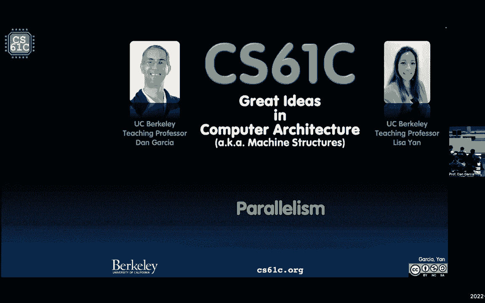

我们将使用并行性，所以欢迎来到61，C很高兴见到你们很高兴见到你们从上次开始一切都好，你上次看到的一个强大的想法是，如果你是一个现金设计师，你有很多旋钮，你可以控制很多，呃。

您可以使用调整缓存以获得最佳性能，谁记得，他们中的一些人，我是说，看着屏幕，其中一些是什么，第一名，缓存的大小，第二，捕获物的长宽比，是又高又瘦，是不是又宽又短，这真的是块大小，您的块大小是多少。

从萨克拉门托到缓存的内存来回传输的单位是什么，然后我们谈好了，那些都是阅读，我能要点别的吗，如果我有权利，如果我有权利，我得有个政策，我只在本地写入缓存吗，没有写完，也许在你身上流淌，一路走到记忆中。

如果我只是跑到缓存，让他们不同步，我们将称之为右后卫缓存，我们需要一个肮脏的一点，让我知道，当它们不同步时，然后我们讲了联想性，是吗？那个旋钮是什么？我们了解到如果联想，这是一种联想，如果n是1。

它是直接映射的，你只有一套，你可以去，你很清楚那是什么，那一套只有一样东西，如果它是n，n等于，的，缓存中的块数，它是完全联想的，你去他们中的一个只去一个地方，这就是每个人，我会坐在飞机上的任何地方。

全联想，请记住，在完全关联的缓存中没有i，没有索引，你只要去一个地方，你去做一件事，你用你的偏移量来计算，你要抢哪个专栏，你得弄清楚，如果标签匹配，当我替换一个块时，我有什么选择我的整块替换政策。

最近使用最少，FIFO随机，我还有第二层缓存吗，所有这些参数是什么，做，我有第三层缓存，所有这些参数，真的很精彩，非常非常丰富的空间供你决定，你可以为第一级和第二级制定一套完全不同的规则。

在第二层有一套不同的规则，三级，所有这些都是为了优化性能，对于您的机器将要做的工作负载，如果你要有一台只处理好游戏的机器，然后根据游戏要做的工作量优化你的现金，如果是别的事，那你想想，如果是通用的。

你必须有一个我们真正谈论过的广泛的粉碎，嗯，你如何优化这个，你如何有一个叫做规范的东西，规范int规范fp，有不同的规格，你可以使用不同类型的工作负载，这些工作负载是国际商定的，并使用。

很长一段时间以来，人们都试图作弊，并试图为特定的测试用例进行优化，就像其中一个测试用例是八皇后问题，你能把八个皇后放在一个棋盘上而没有一个吗，你知道控制其他人，所以这是一个非常简单的问题，你可以这么做。

一些人在优化代码，只为编译器中的八皇后问题。

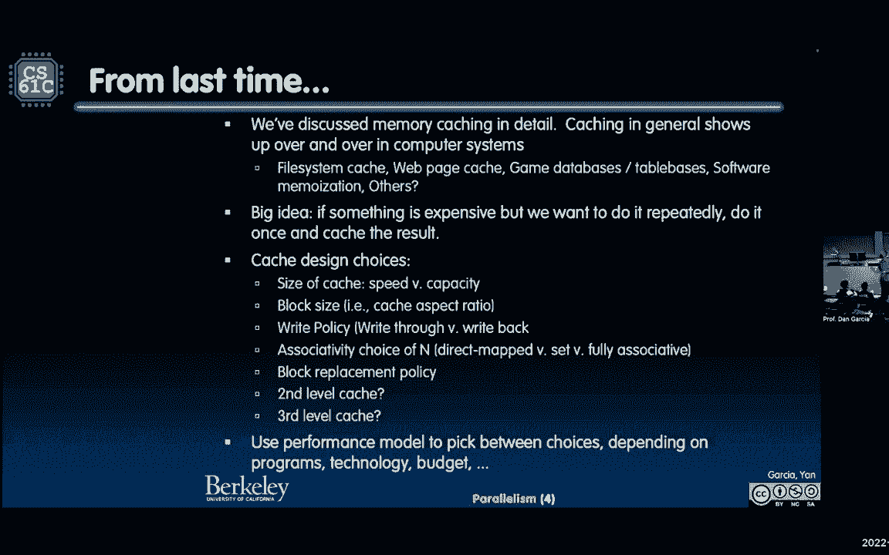

一点都不酷，所以想想所有这些基准，它们被称为基准。

您可能用来优化代码的所有基准，所以那总是开着，所以你使用的是性能模型。

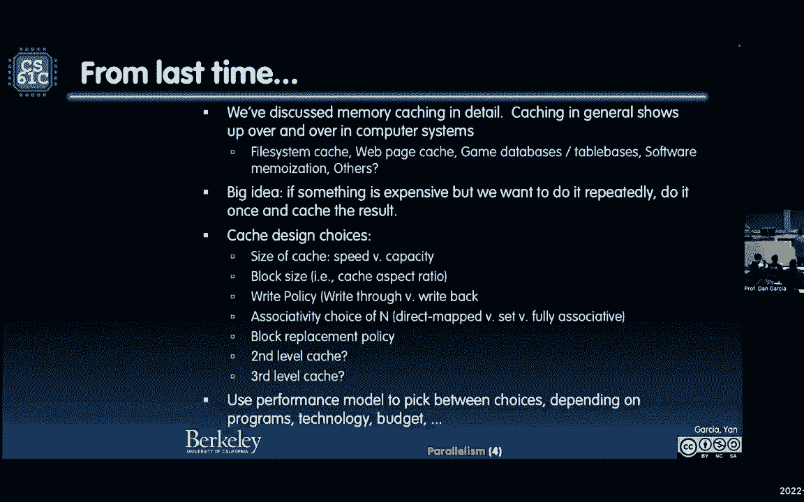

有了这些基准，试着优化你的代码-好吧。

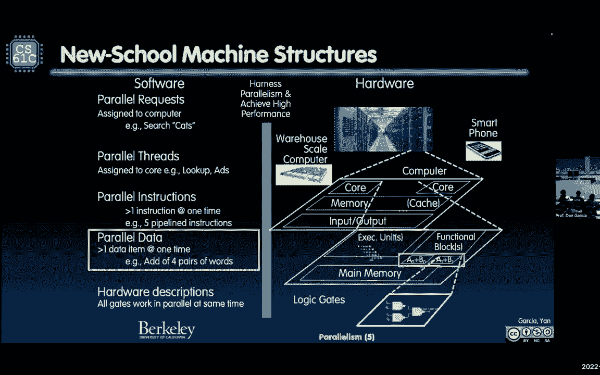

我们要开始一个新的话题，这是柔软的开放，一个叫做平行的话题，如果你真的对缓存感到困惑，重置你的大脑，过来吧，在线加入我们，和我们一起上课，你可以在这里重新开始，这很好，这张照片你已经看过很多很多遍了。

左边有五种平行，我们现在已经见过很多了，这很酷，就像，哇塞，我很高兴每隔几周就能看到这张照片，我看到了理解它的画面，你知道右边的照片。

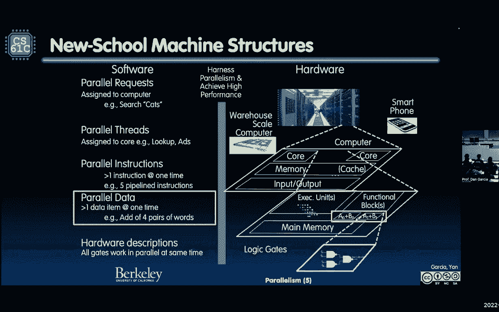

数据中心的顶部，有一台多核计算机，其中一个核心是功能块，执行单元，底部是今天的逻辑门，我们说的是并行数据，我们以前从来没有圈过那个盒子，这是我们第一次谈论它，你能用一个指令和一个广告吗，一次加四件事。

这就是今天的主题，4。你能不能一下子就把四件事加起来？现在作为一个程序员，你需要担心其中的多少。

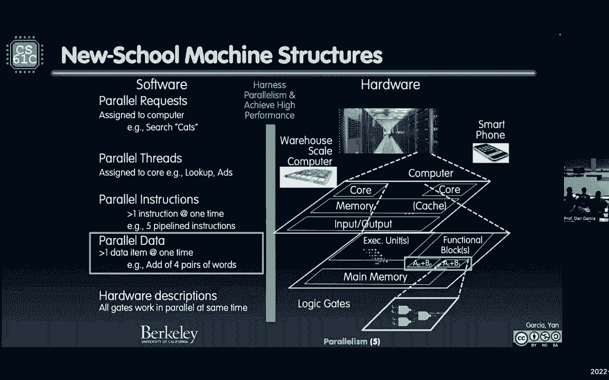

嗯，到目前为止，硬件描述在这里。

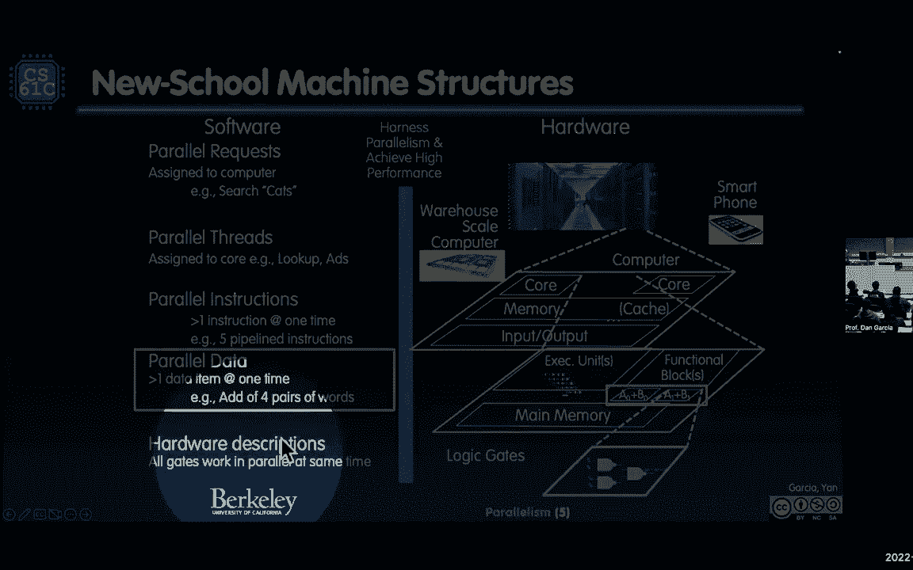

作为一个程序员，你必须真正担心这一点，呃，是也不是，但主要是为你做的，平行。

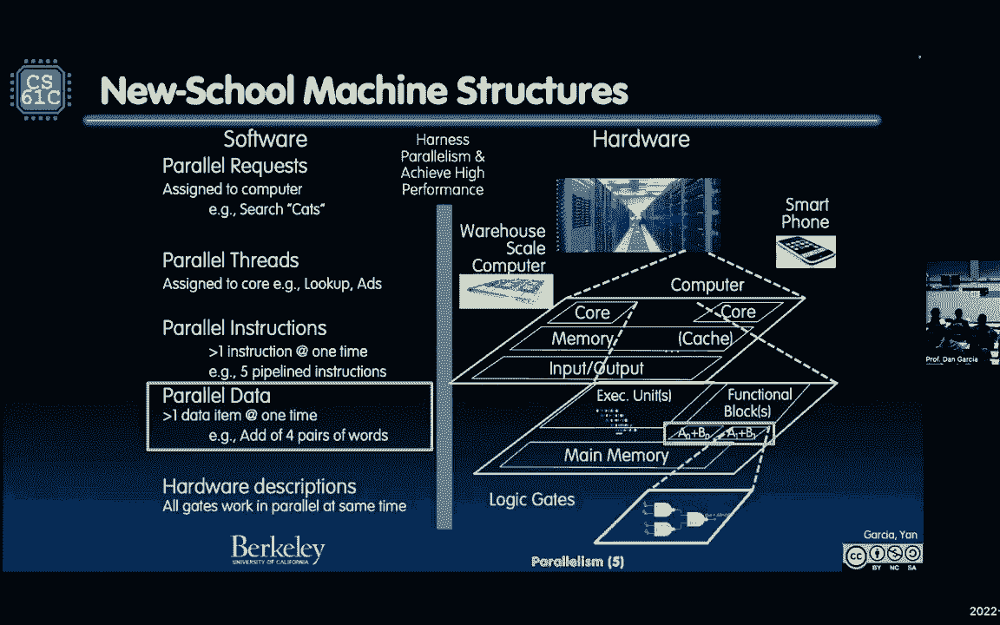

平行或平行，所有这些事情都是平行进行的，你不用太担心那个。

这里有与流水线并行的指令。

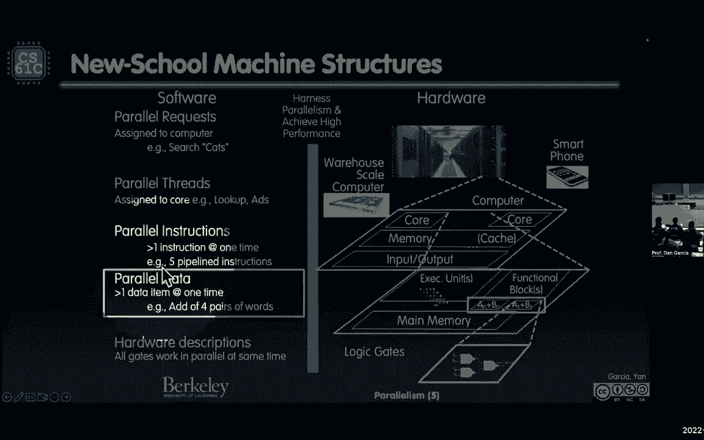

而且是的，对组装工作方式有一些优化，这样你就不用摆摊了。

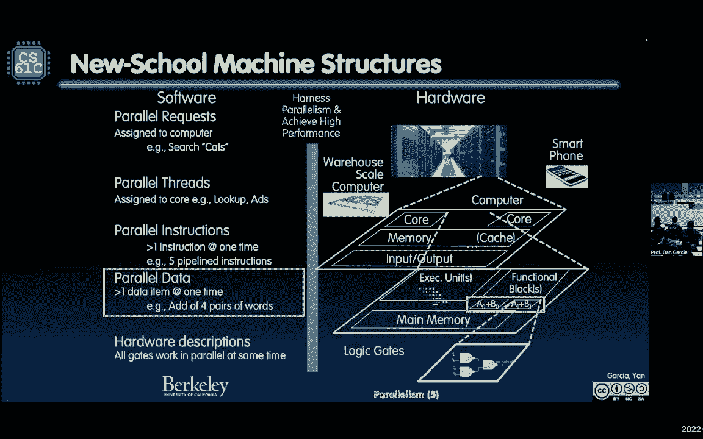

我很感激，但在大多数情况下，卡米洛会帮你处理这件事，所以我们担心你有一个管道系统。

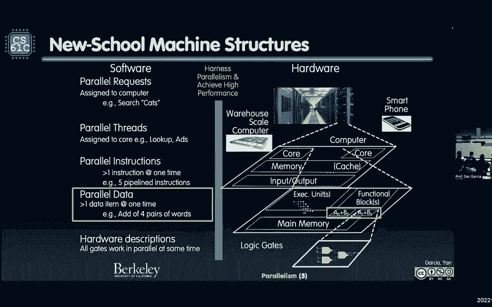

这只是一种自动，你免费得到的，如果可以的话，如果你是建筑师。

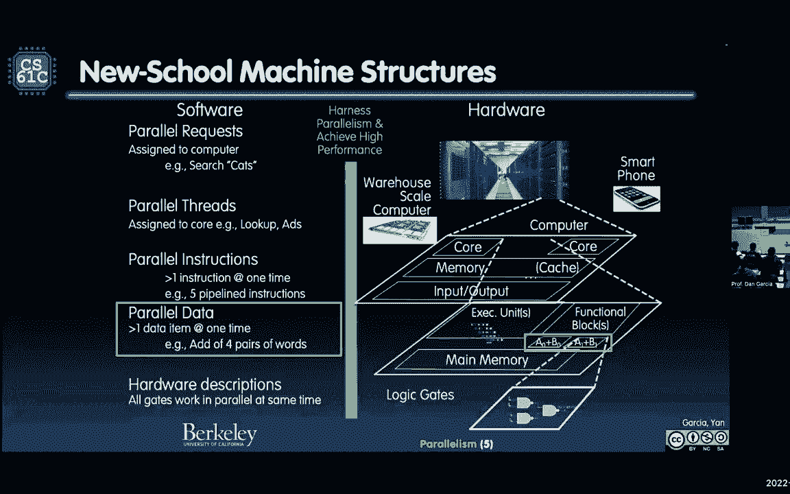

你在建造它，你为它做了很多工作，但如果你只是在软件层面，真的不用担心，太多太多。

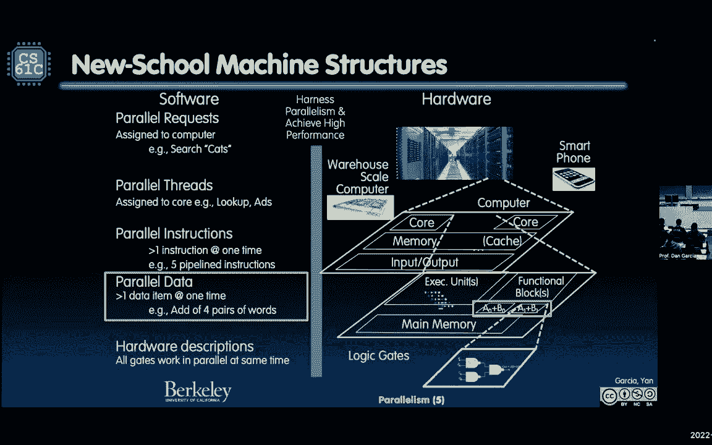

你以为我懂，希望我的编译能做正确的事情来优化，对于我的五级管道并行数据。

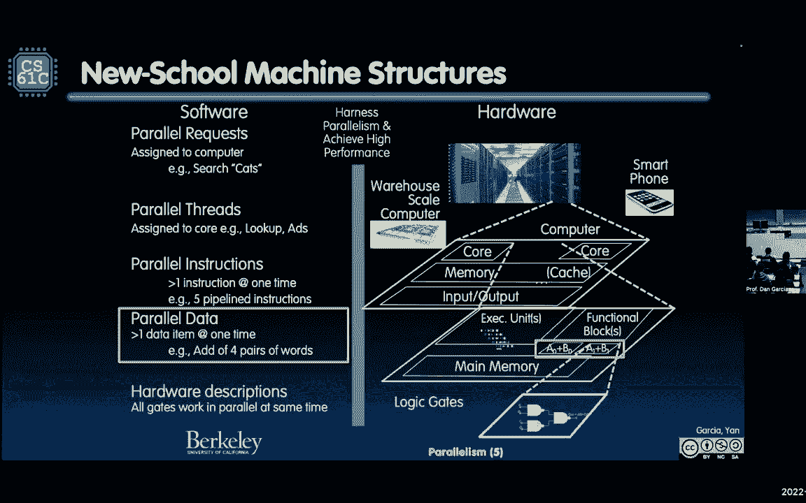

这真的是你第一次看到它，您必须明确地作为软件人员进行工作才能利用。

事实上，你可以有硬件，这可能会增加四件事。

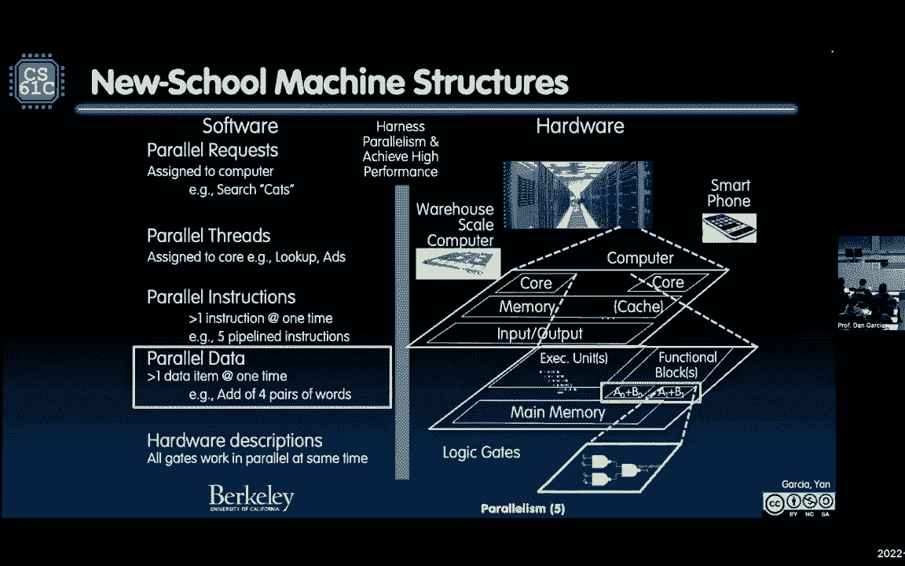

好啦，我一定是按了按钮，所以这是我们第一次谈论它，你必须明确地考虑这一点，你得做些工作，然后优化您的代码，其他优化是免费的，唱得很好，你在做一些工作，现在我要问你，你应该赶紧跑过去，你有错误代码。

你有错误的C代码，您是否应该快速尝试优化它。

为了并行化，我是唐纳德·克努斯，图灵荣誉教授奖得主，斯坦福大学，他有一句很好的名言，我想让你知道，我想让你读这句话，并生活在这句话中，真正的程序员，真正的问题是程序员花了太多的时间担心效率。

这就像我只是设置在错误的地方，在错误的时间，过早优化是万恶之源，嗯，至少在编程方面做了大部分，上面说的是，你去做那个代码，并行使用多个核，使用四个浮点数ADS，立刻，你最好让你的代码工作。

不要开始添加这些功能，然后你就想不通了，是并行化之前的核心问题吗，还是你在并行化上遇到了麻烦，使您的代码完全工作可靠，在每个广告中一次添加一个两个数字，一旦完全调试完毕，然后进行优化以增加速度。

所以在你把它锁定之前不要开始，清码，好啦，那真的很重要，所以确保我添加了幻灯片，因为它不是甲板的一部分，我意识到你知道你不应该就这么跳进去。

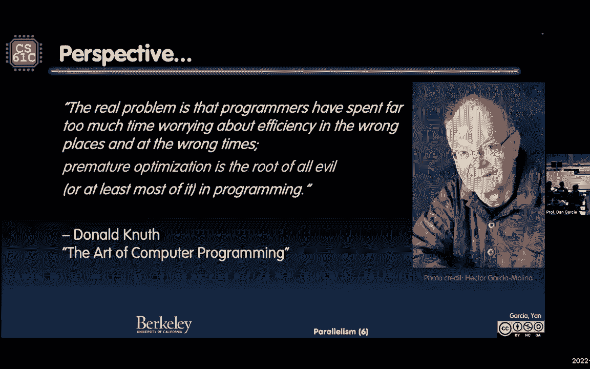

你真的想确保你有一个好的工作代码，在我们再做一次之前。

只是一个柔软的开口，我要说，我谈到了这个关于弗林分类法的想法，所以这是我可能需要放大，因为这里的字体很小，这张桌子不错，嘿嘿，好啦，看那个，这是一个相当快的转变，我觉得像戴托纳，新电池，好啦。

我把这里放大，可以支持串行操作，那是一排排，你的软件可以是顺序的，就像你一直写的那样，你可以同时做多件事，那么让我们先做软件，所以软件想想Windows Vista，想象一下任何操作系统。

你同时在做上百件事，你知道你在展示这个，你在读老鼠，你在放电影，运行1。4万个程序，同时，所有这些窗户你想都不敢想，很明显，软件在左边并行，所以想想你在写一些C代码，你不知道如何分叉、连接和执行线程。

它只是一段C代码，它运行矩阵乘法，所以软件可能是两种不同的口味，很明显，OS正在同时做许多事情，它将是并发的，你只有一个c程序运行矩阵乘法，现在呢，想想硬件是如何工作的，也许二十年前，二十年前。

二十年前我们就有操作系统了，我们并没有真正考虑并行硬件，意思是你没有能力同时发生多种事情，在相同的硬件上，你有一个CPU，一根线，你一次只做一件事，如何运行并行软件，嗯，一种模式是分时。

你给大家一点时间，只是四处走动，给大家一点时间，如果你有很多孩子，你就这么做，你给一个孩子，你把他哄上床，你就像第二个最小的孩子，我们给他们读了一个故事，放在床上，你给大家一点时间。

所以你想象你的硬件可能是串行的，是老式的硬件，这是英特尔奔腾4，在我们真正考虑多核之前，简单的老派奔腾四，但它能运行矩阵乘法和windows vista，在底部你可以想象出最漂亮的英特尔新内核。

我在多个核心中找到了七个，三级缓存，所有这些强大的东西，所以你想象你有硬件，不是串行硬件，旧学校还是新学校，其中有多个核心，多线程，下节课我们将讨论线程，所以这节课的关键部分是这四个都是可能的。

这四种组合都是可能的。

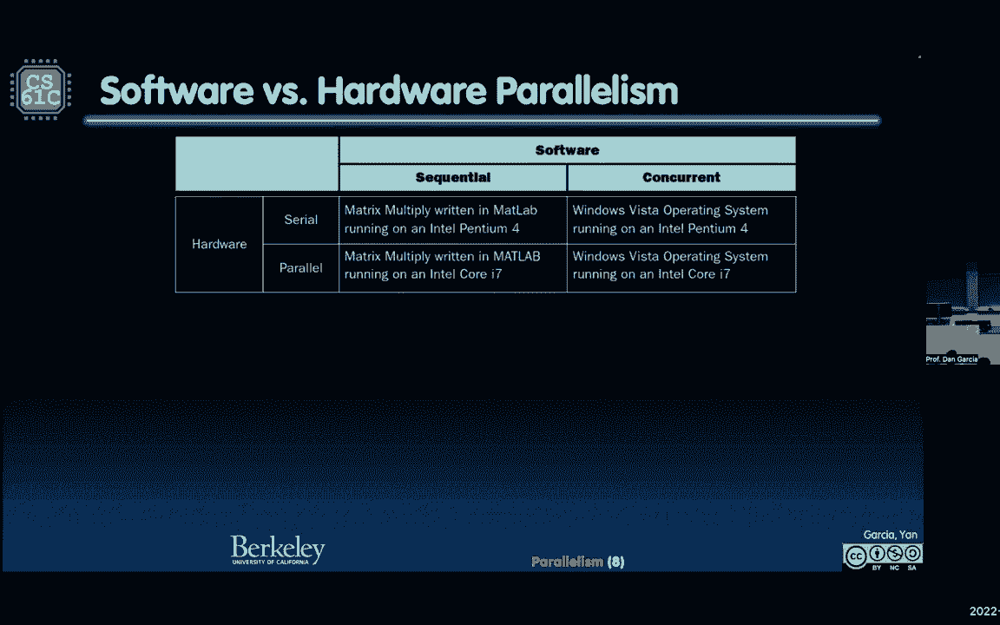

以及硬件中并行性的选择，顺便说一下，在这门课程中，我们教授，我们教如何构建并行硬件，我们教你如何编写并行软件，所以你把两块都拿出来是很酷的，因为我们看到整根手指都垂下来了。

我们讨论的是并发软件的两个级别上的并行性，就像vista可以在串行硬件上运行，正如我提到的，给大家一点时间，矩阵乘法可以在并发硬件上运行，这只是意味着你只能抓住其中的一种资源，和工作的时间。

所以这是一张很好的照片，向你展示这些是独立的选项，你应该可以在今天的软件上运行旧的学校硬件，理论上只要给一点时间，以及串行软件，只是一个并行硬件盒上的小矩阵多程序，其中它都将借用一个核心和一个线程。

做你的小矩阵乘法，并对此感到非常高兴，好啦，所以两个独立的东西，并发硬件和串行或并行软件，弗林分类法是一种说法，如果我有并行硬件，这种平行的思维方式是什么，是指令并行吗，在这种情况下。

多个指令可以同时发生，喔你是说，我可以同时做广告和装货。

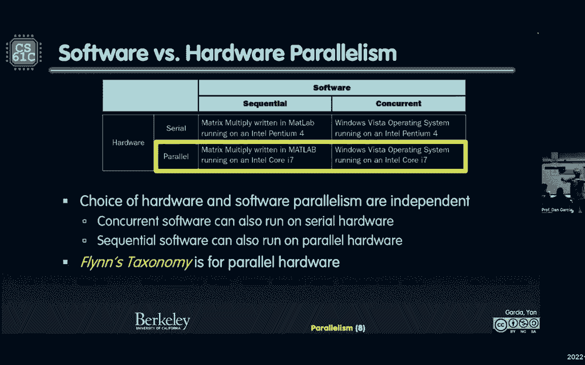

是啊，是啊。

所以我可以只做一个广告吗，我不做两个指令，只做一个广告是一回事，我的手术广告是什么。

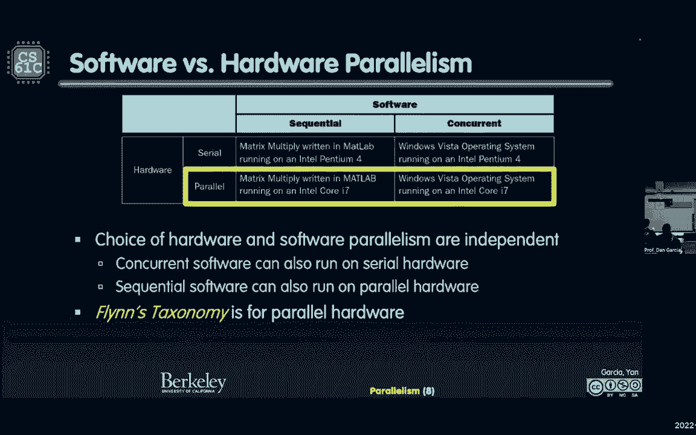

但我同时加了四样东西，或者同时做八件事，好啦，林恩的分类法是关于我是在瘫痪指令吗，这里有不同的东西，同时有帽子、帽子和担子，还是我在一个指令上瘫痪了我正在做的事情，所以我们今天就来谈谈。

最重要的是那梯子，它是关于今天关于许多事情的一个指令。

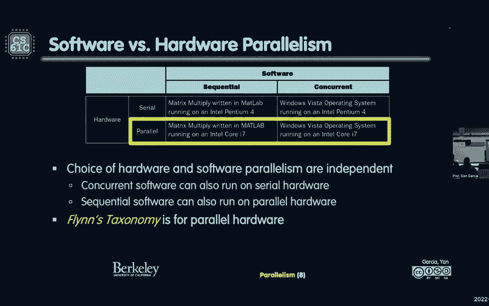

在下节课中，我们将讨论线程级并行性，在那里我有多个不同的事情同时发生。

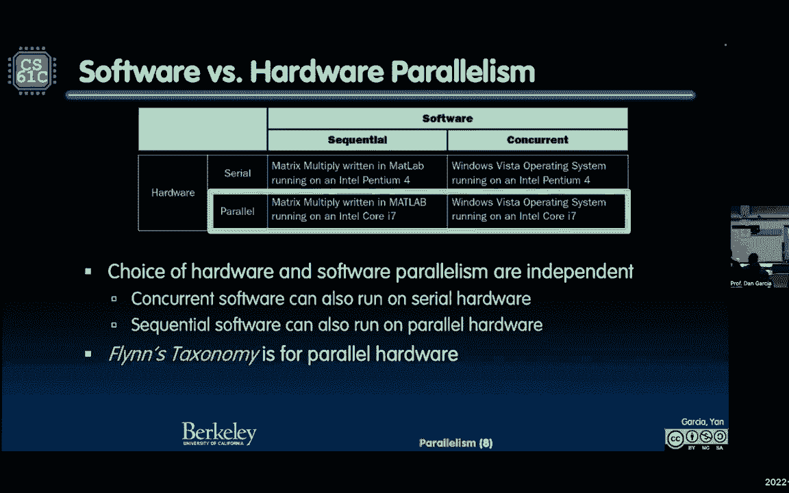

多重指令，好啦，照片是这样的，以下是你到目前为止所看到的，真的很好笑，生活就是这样，我想看看，如果你在生活中注意到这一点，我在这里的时间足够长，我意识到，记住，我们以为我们开始讨论直接地图缓存。

然后我们说不，它们是完全关联的缓存，然后我们意识到实际上我们已经硬编码了一个变量，就像集合的联想，我说我在教你n等于一组联想，直接地图，所以我锁定了，但事实证明n实际上只是一个，那里有个旋钮。

但我们只是为其中一个例子硬编码，所以我们了解到的是，到目前为止，有一个旋钮，我的指令是多么平行，我有多平行，这就是房间这边的指示，我听说我的数据可以，我们还没有真正谈过那件事，我们只是在用简单的方法。

一条指令在一条数据上，好啦，这就是我们目前所做的，很简单，我的指令池是一次一个指令，好啦，醒一醒，是广告，好啦，你在加什么，或者你可能会添加什么，需要两个数字，但是你知道，关键是。

你知道你在做一个简单的指令，也可能最多两件事，永远，就是这个想法，我有一个处理单元，顺便说一句，这叫做单指令，生活中每一天的单一数据，PC加四，你在干什么？我是一个单一的指令。

那一天你在单条数据上做什么，可能是两个数据，你知道的，是啊，是啊，是啊，是啊，一个广告需要两条数据，好啦，就是这个意思，所以所有这些都意味着，使用老派软件的老派处理器，我们只考虑并行性，否。

平行性一次一个，做点什么没什么难的，这个叫sii。

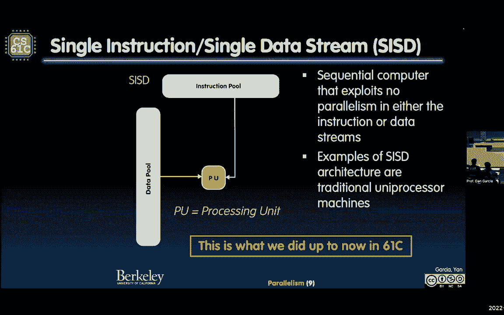

这就是这个讲座的内容，我已经说了三四次了，我再说一遍，一个广告同时做四件事，所以我们真的是八个人，因为我把这4加上这4一共是8个，所以应用单一指令流标准的计算机，你以前所做的一切，PC加四或PC加四。

一个指导小组一次做四件事，那真的很酷，快了四倍，我们喜欢这样，想象一个图形处理单元，想象一下你的GPU在做什么，现在，有一个GPU驱动监视器，很清楚为什么我有高清晰度，十九二十乘十。

八十乘十九二十乘十八十，谢谢二千二百万，两百万对，两千乘一千，大致，它大约有两百万像素，每一个也许三十分之一，六十分之一秒，我是说那应该有多亮，我不知道得有人计算，所以这是疯狂的平行，就是说，更新自己。

二百万件事情的六十分之一秒，你有多聪明，你可以想象一个GPU真的被推到了极限，与一些三维模型，你知道在驾驶模拟器上，我得弄清楚，那个像素的亮度是多少，这是两百万个独立的计算，每秒发生60次。

也许是高端GPU的二十个，所以想象一下，那就是操作是，你有多聪明，就这些现在是0到2 5穿过三条红色通道，绿色和蓝色，它经常平行地做这件事，所以你已经知道这是你以前见过的东西，每次你看你的屏幕。

你的终端，你的手机在做这个，它在说你有多聪明，仅此而已，我在问你，你有多聪明，每一个，你知道1601到1220到秒，所以并行数据，一条指令就在这里，你有多聪明，还是让我们做这四个的广告，再加上这四个嘣。

把它们砸在一起，那是它的演讲，这就是所谓的SIMD单指令，多个数据现在你可以想象我要去哪里，所有可能的指令组合都是单数或多数，数据是单倍的，星期一我已经给你们看完了。

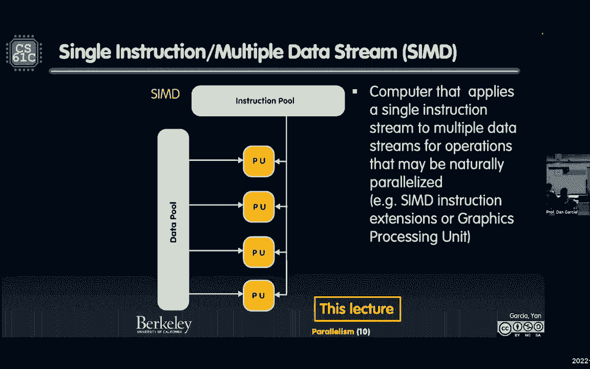

我们要介绍这个东西，就是这里了，这就像整个右下角，图的右上角，如果左边的图是单的，右边有多个指示，单在底部在顶部用于数据，就像图的右上角，右上角总是您想在任何图形中访问的位置，让我们看看图表的右上方。

这是带有多个数据的多个指令，所以我不仅可以，我把四个数字加到另外四个数字上，但我有多个指令同时发生，所以这个指令说在这四个上面加四个作为广告。

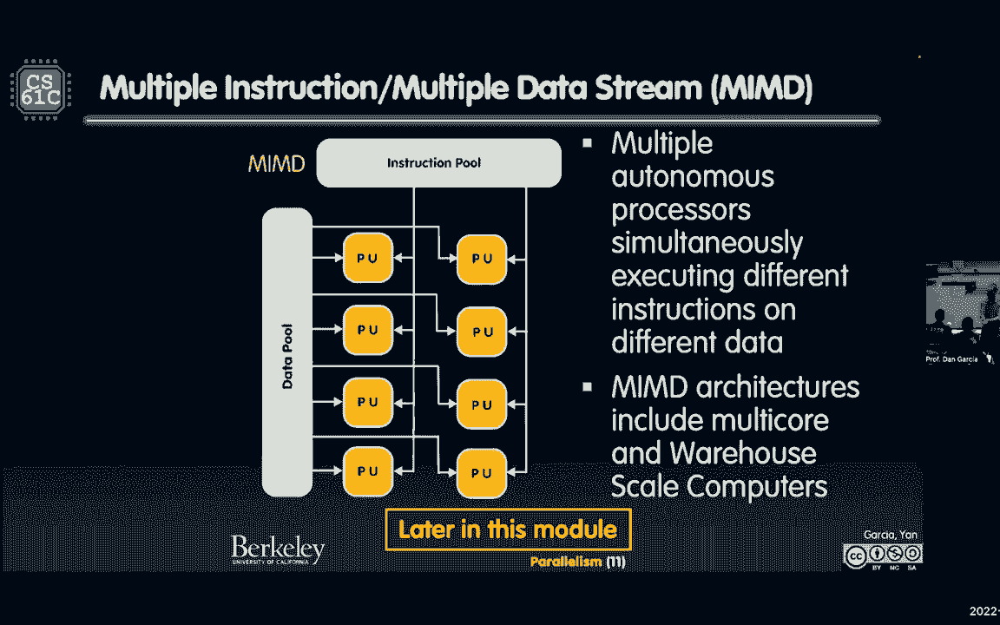

说明书上说，拿这四加四，做一个XOR或其他什么，所以这真的很酷，您可以想象您的代码有多快，有多精彩，如果这两件事我都做了，所以我是钥匙，我是钥匙，我们以后再谈这个，我们不会那样做的。

这堂课我们只是在做Simi，但我们要去伊米伊米是终极的，我们想做一般的明迪，顺便说一句，每个多核，每台仓库规模的计算机，可能你所有的手机都在做imi，我告诉你的这些都是你口袋里的东西。

我五年前就会这么说了，五年前你连电话都没有，但我们今天肯定有。

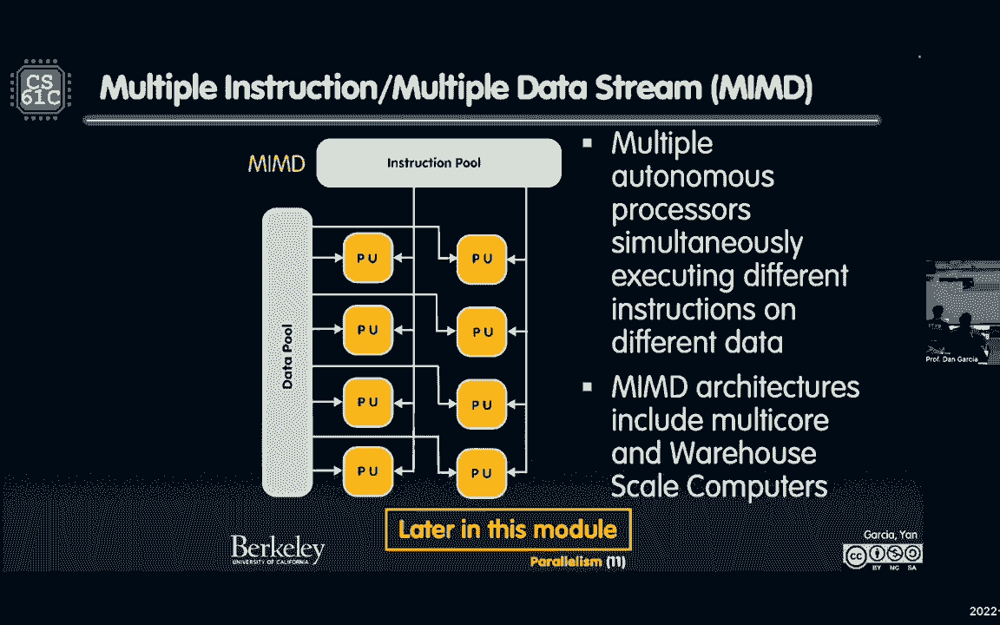

明迪，你的表可能快走了，很神奇的东西，这里的东西，我们可能在这里喜欢，图表中没有太多意义的部分。

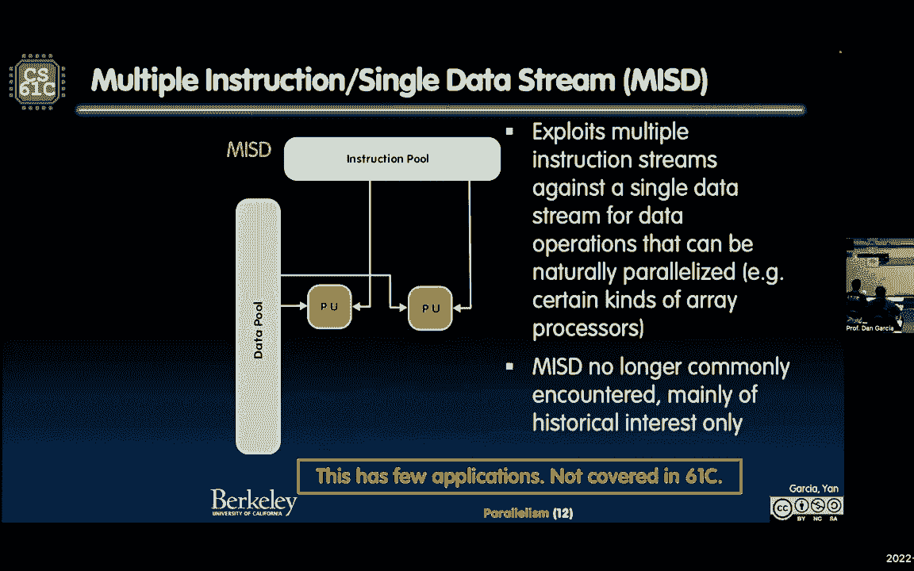

如果你有能力把四个数字加到另外四个数字上。

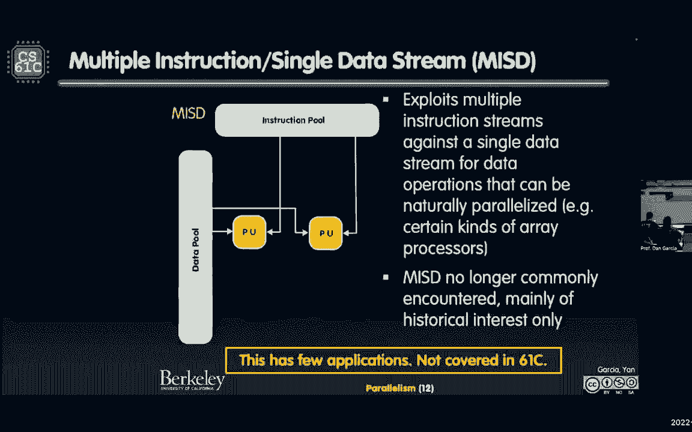

在一个时钟周期内发生加法，为什么不使用多个核心来做到这一点，所以这是单指令，我说多重指令和多重指令，但是单一的数据，我不能用四个广告了，即使我能做到，有电脑是没有意义的，在那里你可以有多个指令。

但实际上只在一个人身上做，你知道的，一次两个数字，那太傻了，如果我们有这种能力，所以这个叫MII，我们不这样做，真的不是没有人为它制造硬件，如果你要这么做，你写MD硬件，具有多个数据的多个指令。

所以D女士并没有真正被使用。

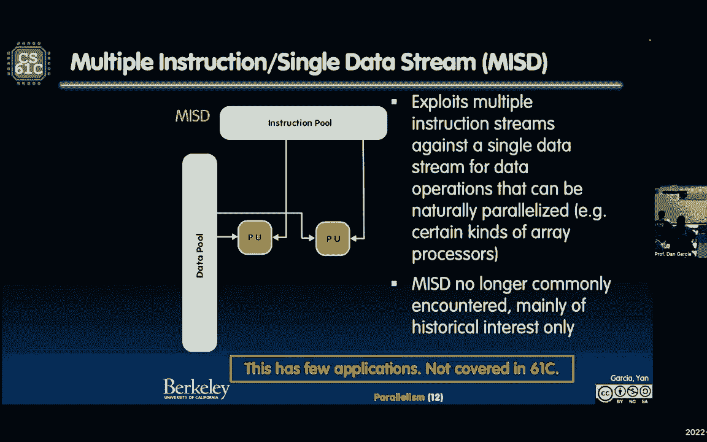

好啦，谁想出了这个叫做分类法，你以为，想象一下，达尔文，你怎么决定，你知道什么是，哎呦，是一匹马不，是驴，是骡子，这是一个分类法，当你看着这个世界，把它分成几部分，我是弗林教授，谁谈到数据流。

这是我的回忆，呃，这是指令流，MIMD SIMD单指令，单指令，多重数据，所以我们将属于这一类，这个盒子，西姆德，这是，我要告诉你，我们想在右上角，我们应该把这个翻过来在底部有一个，这是明迪。

我们下次会讲到，目前的新三叶草镇或更新英特尔硬件，确实有D女士和Sid是老派奔腾的例子，四台机器，所以这是一种标准，他就是弗林教授，我们称之为弗林分类学讲座，我们在那里解释这个。

我们今天谈论的是SIMD，然后又是MIMI，但现在你知道他们是什么了，但如果我在你走之前告诉你，西姆德，这就像要做一个新的希腊语单词。

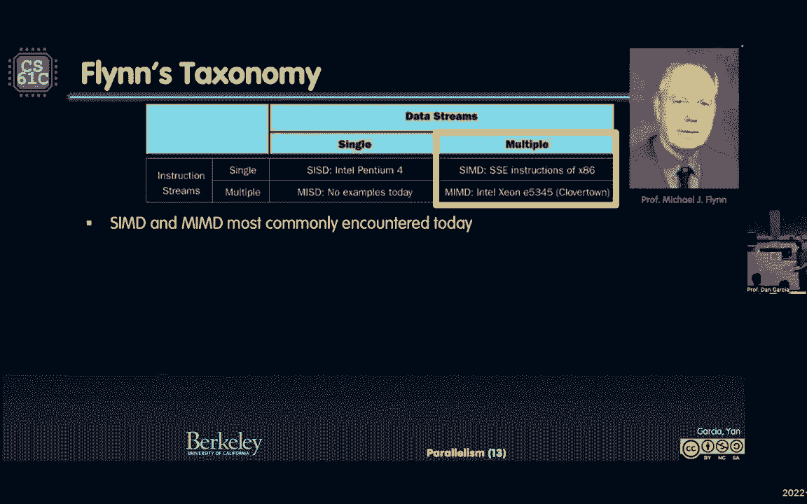

现在最常用的，Simd和Imi在那里谈论，那是最受欢迎的单曲节目，多数据是最常见的并行处理编程风格，我们以后再谈，SIMD正在使用专门的硬件，今天都是关于专用硬件的，你是怎么做到的。

你怎么能一次做四个广告，那不是我们建造的，我们在管道中建立了一个数据路径，使用数据路径和控制来运行我们的CPU，我们没有能力做到这一点。

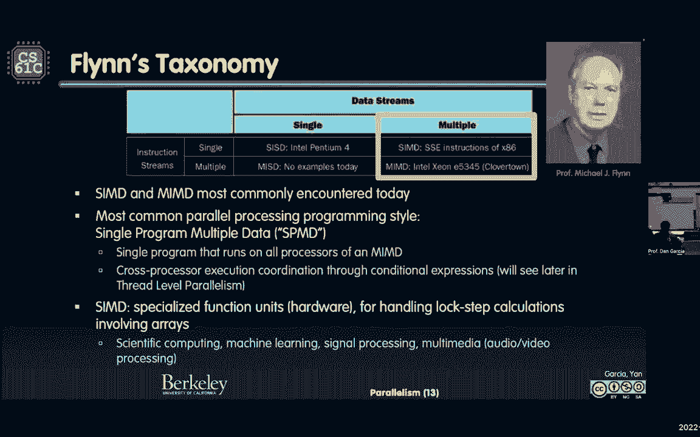

那么您将如何修改您的系统来处理这些问题呢？OK当然适用于数组。

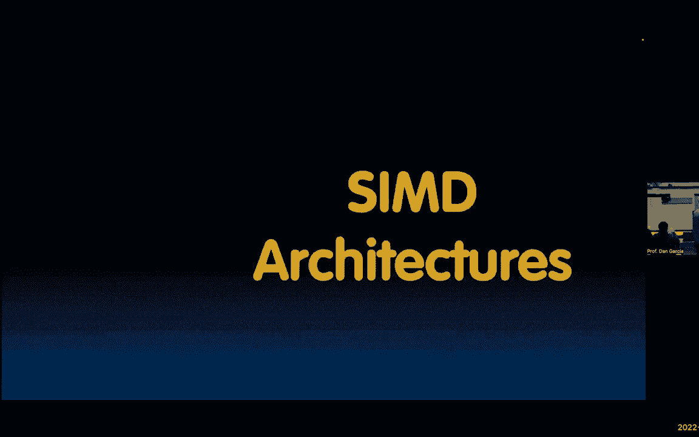

对呀，如果我只想把一个数组添加到另一个数组中，那么让我们来谈谈七十个建筑，数据级并行，一次手术，多个数据流，这是它在当前软件中的样子的图片，我们在加州大学伯克利分校教非专业学生。

这是一种叫做Snap的编程语言，基于许多编程语言，支持这种范式，蟒蛇也是，也是如此，很多熊猫，很多，情况想想这里的一个数组是数组，把它们加在一起，能够将两个数组添加在一起是有意义的，下面是数字。

一到四是数组，我再乘以一个月，我在一次手术中得到了1-4-9-16，我甚至不认为我没有三思而后行，我们在教本科生时谈论的领域，我们说乘法的定义域是什么，思考数学，什么能成倍增长，作为输入，他们都说数字。

他们都很自信，人数，我说如果我把它扩展为列表或数组呢，你能不能，把乘法取数组有意义吗，他们都说不，太疯狂了，这没有任何意义，然后给他们看，他们就像等着，其实有点道理，有一个数字列表。

让这些数字我可以把它们加在一起吗，我可以把它们相乘吗，是啊，是啊，为什么不考虑一下呢，这真的让他们了解了你可以在软件中考虑什么，我说的是，如何构建一个硬件来在一个时钟周期内实现这一点，这就是有趣的部分。

这就是我们正在谈论的，但在软件层面，有高中生，中学现在使用这些技术，所以这真的很酷，你可以用一种简单的方式思考，他们不是在写多核心的东西，但他们在中学可以用简单的方式思考，就是那个操作，它不整洁。

所以我只想确保我添加了幻灯片，以确保这个想法，不是吗，它不会火箭科学，孩子们可能会普遍地思考这个问题。

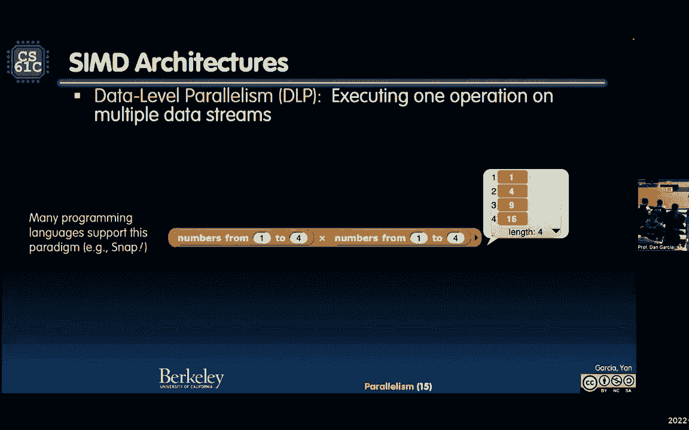

这是我的系数数组c，我得到了一个向量x，它们的长度都一样，我基本上是说，我应该得到i的c乘以i的x，这就是你在快照代码中看到的，对于大于或等于零且小于n的i，好啦，所以我在一个数组中有n个元素。

我应该能在一行一行里说出来，它只是碰巧起作用了，真的很棒，如果成功了，我希望这将在一个指令中工作，因为n是大的，所以就像我们在研究它的进化一样，他们首先从四件事开始，然后他做了八件事。

所以现在你看到了能力，他们增加了制造和更大的能力，今天每一代的硬件，这真的很酷，那就更快了，硬件，你可以看到，所以一个指令被提取解码为整个操作，乘法都是独立的，这是关键，不会打架的，不是很好。

这是一个邻居的函数，有点不同，我们说的是所有的乘法都是独立的，我们经常称之为尴尬的平行，因为如果你考虑数组，意思是它是如此平行，很尴尬，根本没有人是邻居，如果我有一个小机器。

你知道一只轮子上的小仓鼠就能做到，每个人都可以独立地做这件事，对于每个数组元素，他们需要了解他们的邻居，这是令人尴尬的平行想法，就是我们在这里讨论的，顺便说一句，我们还有做流水线的机器。

所以我们还在做其他事情，但我们只是在谈论一个发生得很好的手术。

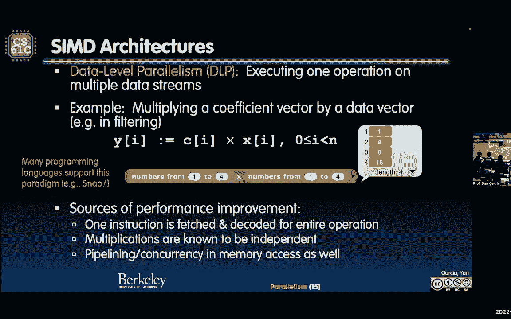

那这一定是最近的事，对呀，因为多核是最近才出现的，这一定是最近的想法，否，1957年在麻省理工学院我的母校，我们正在造一台叫TX2的机器，这是TX二号的照片，这是他们手册上的一张图片，德克萨斯二号。

如果你放大，我来告诉你这是什么样子，多酷啊，这是1957年，比以前多了十年，我出生在，好啦，开始了，所以应该强调，AE代表算术元素，程序员可以同时实现几个算术元素。

你可以在一个3个6位宽的数字上工作也可以在两个18位宽的数字上工作，给出两个完全独立的18位算术元件，它们分别是，但同时由正在执行的指令控制，你也可以做四个九，这是在他们得到应该是81632的想法之前。

他们只是随机的，九岁，十八岁，三十岁，他们真的不在乎他们的部分有多宽，这些话是如此的看看这个，这是一个非常大的想法，三十，六位宽数，这里有作业，或者两个18位宽的数字，每十七位的星等和一个符号。

或者看看这个，一个8和一个20，这是九块二十块，七四个九，那不是很酷吗，你看这一九一九二，七位数字和一个九位数字，你为什么要再做一个二七和九，我们回头看这个，我们学到了一些东西，但他们这样做了。

他们有你想要的任何东西，我们能应付，我们要制造硬件来处理三个六个或两个，十八二十七加一个九，这几乎就像做出改变一样，就像做出改变一样，给我25美分，我有多少钱一个旧的周六现场小品，你应该看看这个。

我们做出改变，这就像一些银行，我们做出改变，你给我们25美分，我们可以在五分钱内给你两次，我们可以给你五个五分钱，我们可以和你一起工作，这就是笑话，他们能做到的，你给我三块六。

我可以做一个三六个位的数字，我听到两个7比9，我们可以和你一起工作，一九五七年六十年前，所以在个人电脑的早期。

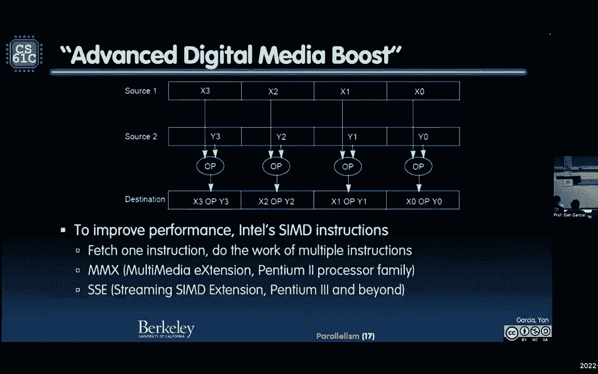

他们为这种新酷的东西做广告。

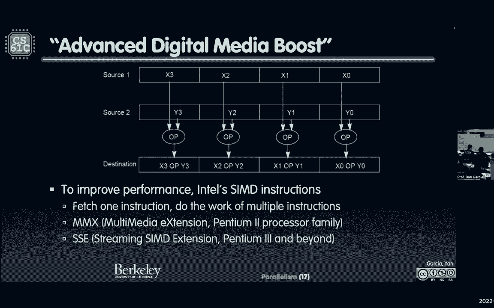

这个想法变得流行，我我说我在这里看起来像奔腾，奔腾一号，奔腾2英特尔在他们的硬件上引入了这些扩展来做到这一点，他们知道你知道我们在做什么，人们不能同时播放MP三流流，因为他们在做别的事情。

就像我们会跳过，你回到过去，你可以播放它，它会跳过，你在放音乐，它受不了，显然更快的机器会有所帮助，但他们意识到如果我们能，他们只是三队的常规操作，你在为整个溪流做什么，为什么我们不能一次做四个呢？

所以英特尔添加了这些SIMD指令，找一条指令，做多个指令的工作，你可以同时做四件事，如果你有四件事要做，一次做四件，他们称它们为早期的多媒体指令MX，他们真的是在播放MP3文件，也不是真正的电影。

但几乎是关于媒体，因为媒体是电影的一大长条，很多帧，他们都是一样的东西，你只是在做同样的事情，对于每个像素，对于每一组像素，你在做同样的事，所以多媒体是一个非常容易使用的案例。

为什么他们要使用SIMD指令。

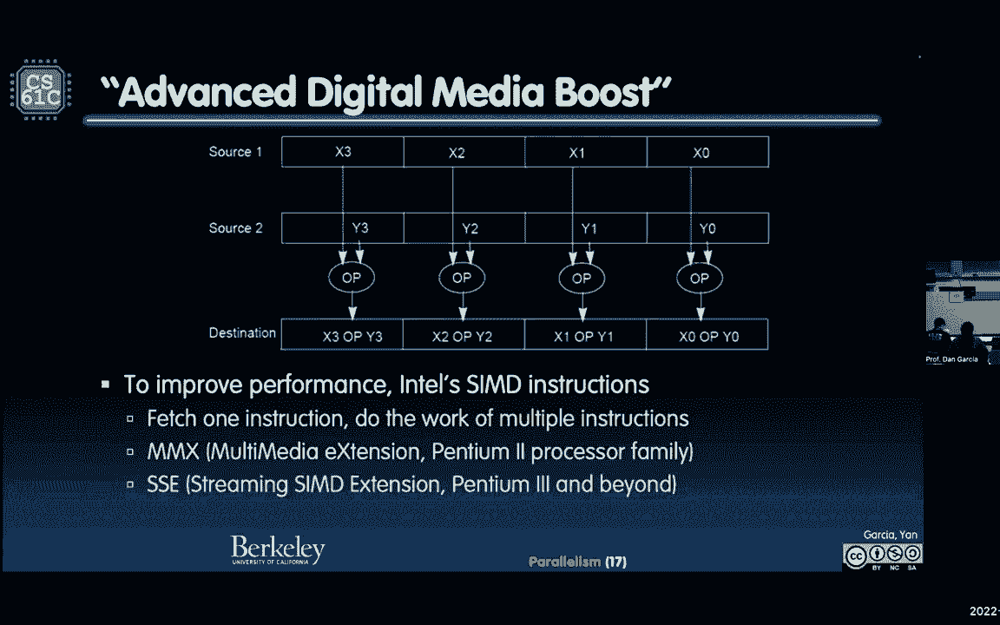

后来他们有了一种叫做SSC流式SIMD扩展的东西，但无论你说什么，西迪这个词，你知道我们在做什么，这就是源头上方的照片，一个有四个X的来源，两个有四个y，我做了个手术，x一个行动x x x行动y。

对于所有的四个元素，就这些，如果你走开，学会一件事，只是那张照片，这就是我们要做的，这就是我们的目标，所以再一次，这是一个柔软的开口。

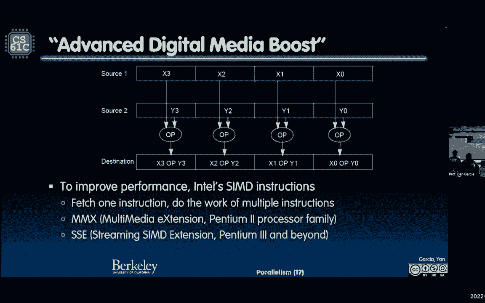

不太复杂，那么它的演变是什么呢，当我们作为英特尔的发展，也许你从屏幕的后端看不到这个，把灯关掉，他们告诉我们可以关灯，很难看到这一点，放映机不够亮，给大家看一下，他们开始了MMX，所以我们在这里。

我们从MMX奔腾2开始，有多宽六十四位，哦六十四位，我一次可以做两个三个两个两个花车，那很酷，所以我可以做漂浮，哇二哦大不了二，然后他们搬家了，就像你想象的那样，一百二十八，我一次可以做四个花车。

顺便说一句，这些是x86上面的扩展，X6还在工作，但如果你有，如果您使用分机，你有硬件来支持它，突然间你得到了很大的性能提升，一百二十八，看看这个，现在我们在核心沙桥，现在我们有256个，哇五十二。

看看这个，太神奇了，所以他们真的扩大了Sithessimi寄存器的宽度，我们增加了新的寄存器，这些是他们所说的，现在他们叫他们斧头，一个X是五十二，所有这些花哨的名字。

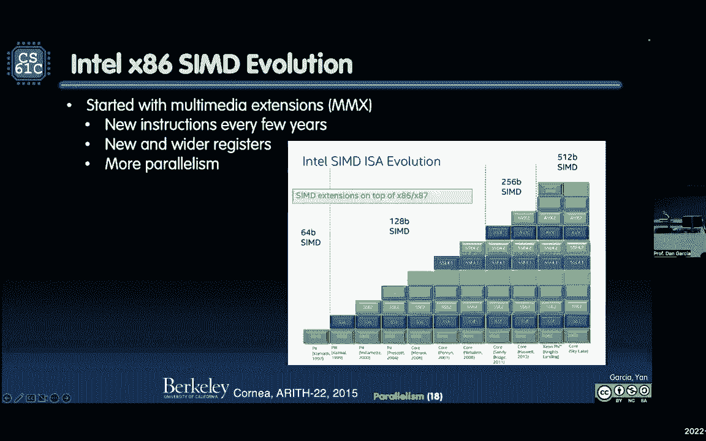

从本质上讲。

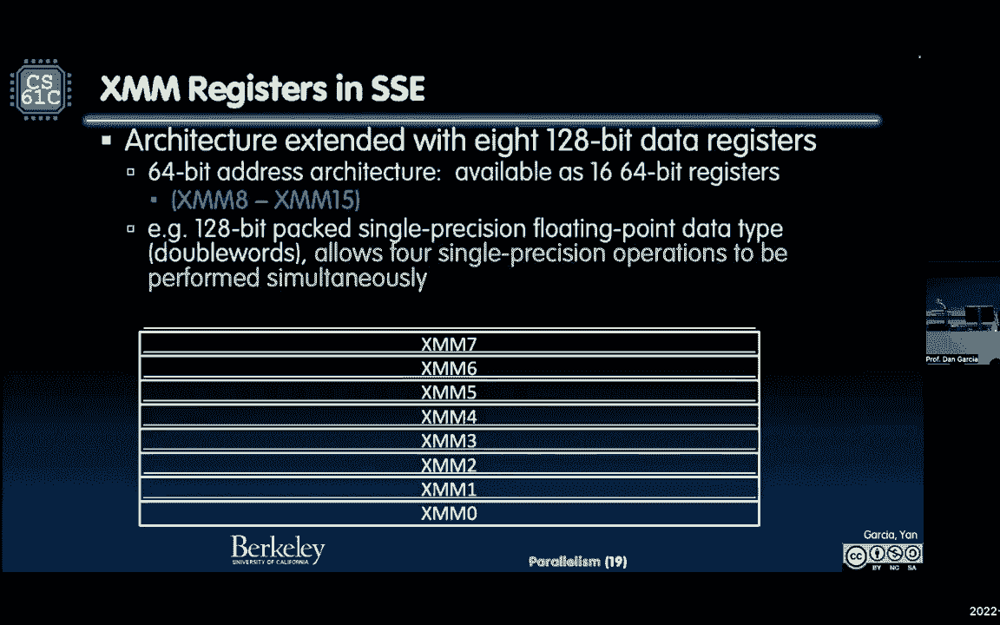

你有什么想法，嗯，你有这些非常非常宽的寄存器。

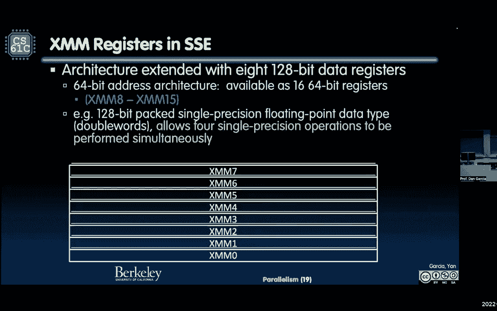

真正宽的寄存器，您将它们作为这些SIMD寄存器呈现给用户，所以为了让它起作用，你拿着你的数据，你把它复制到SIMD寄存器，你在SIMD寄存器上做一个广告，你可以把它复制回来，就是这个意思。

所以这是一个特别的地方，这些XMMS是，顺便说一句，你必须告诉他们他们是什么，你必须，你得声明它们是什么，是一个很大的数字吗，是一百二十八位的数字吗，还是两百六十四，还是三四三二，你得告诉她是什么。

所以一二八协议，单精度浮点数据类型表示单精度意味着浮点，浮子，单精度意味着浮动，双精度双精度，这只是意味着浮动，同时进行的方式，你所研究的不是整数数据，几乎所有人都在谈论浮点数据。

只是想让你们都知道多媒体就是声音，是关于浮点数据的，不是关于整数数据，所以让我们确保我们在这一点上意见一致。

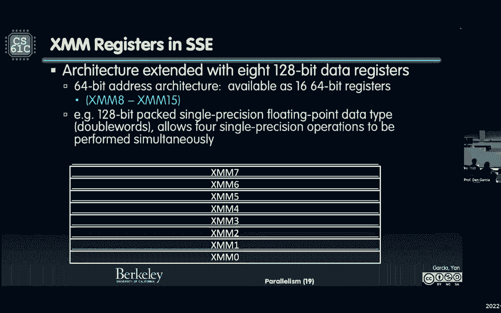

这是英特尔架构的图片。

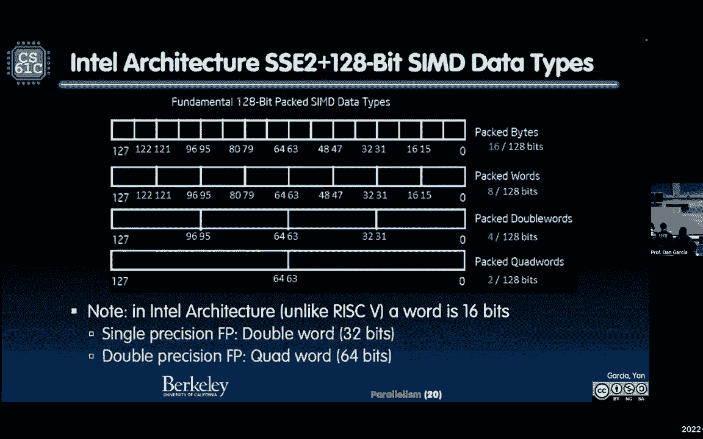

顺便说一句，这里有一件疯狂的事情，英特尔调用一个词。

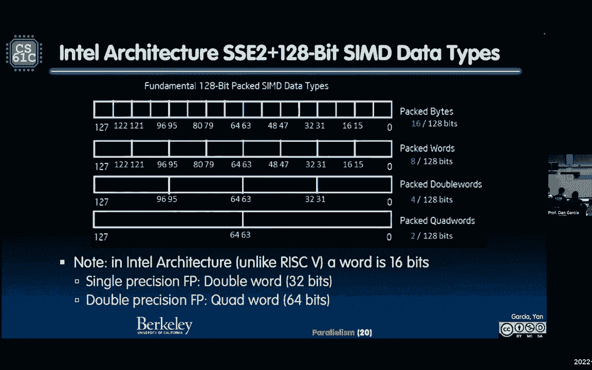

十六位，我们的话是三个二位。

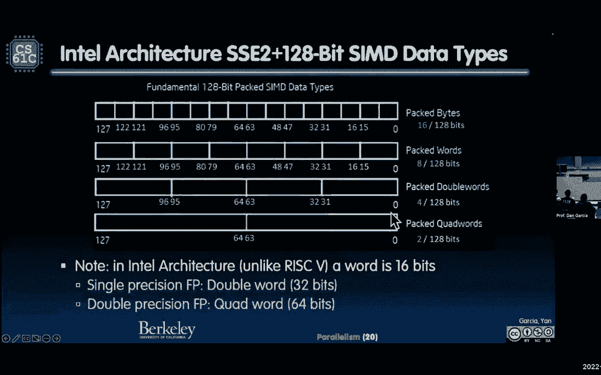

当你在屏幕上看到一个词，那是我们想象的一半大，作为一个词，他们叫三十二个比特。

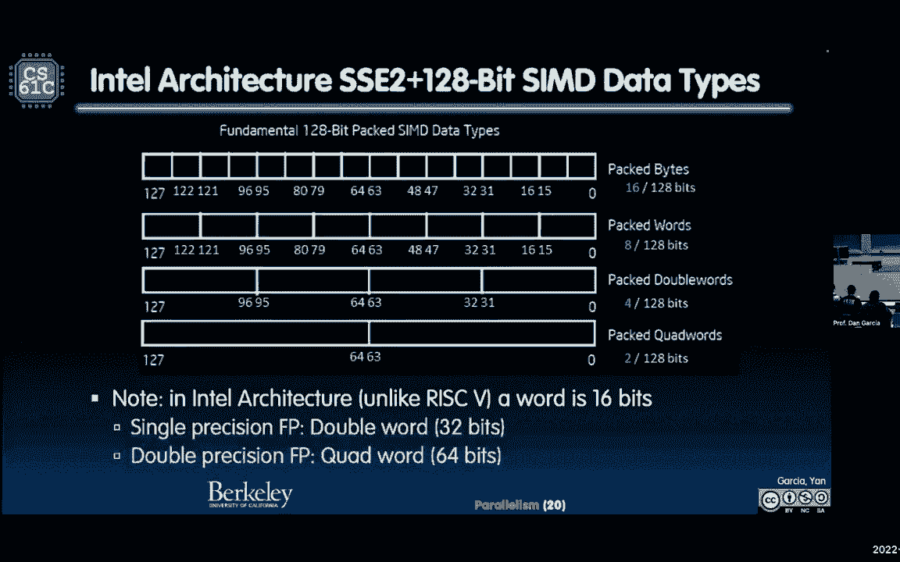

双字，所以一个正常的浮动，浮子，单精度浮子。

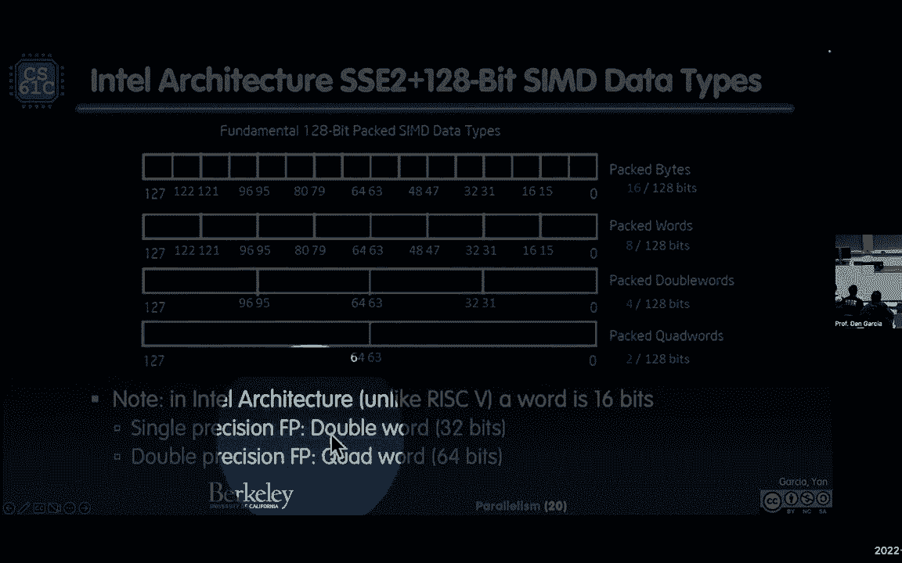

他们称之为双字，我们会把这个词叫做，只是确保你完成了他们的双精度浮动。

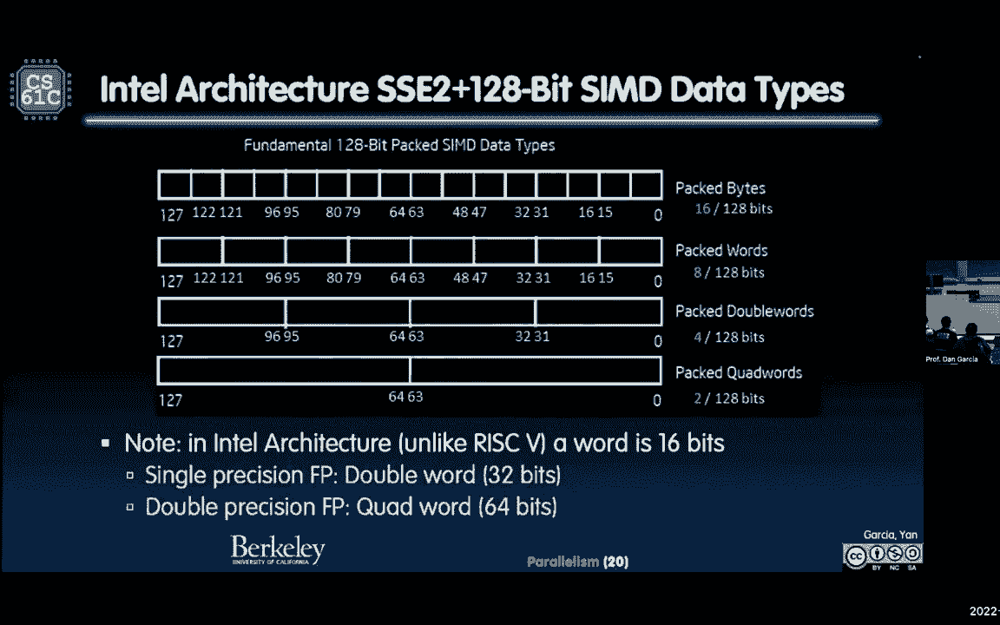

他们称一个四字，那么什么是双序呢，所以如果我有一百二十八位。

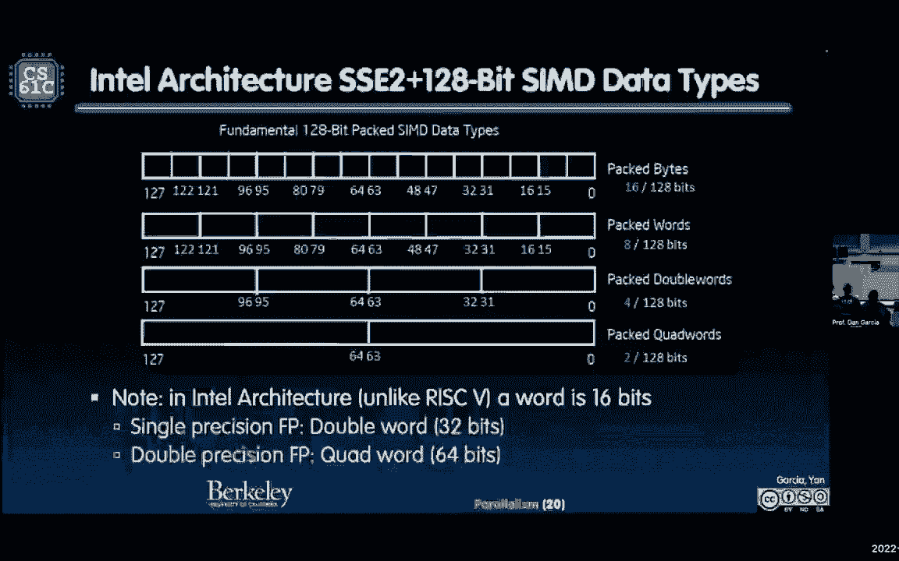

如我所说是一百二十八位，你可以像在麻省理工学院一样对待它。

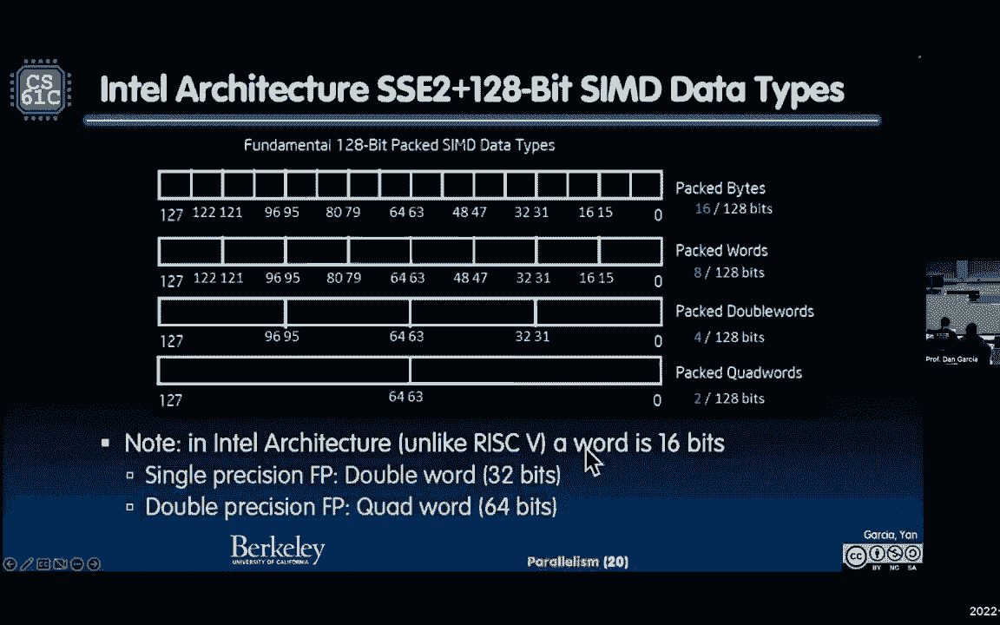

两天，你可以把它当作一大堆16个宽数字。

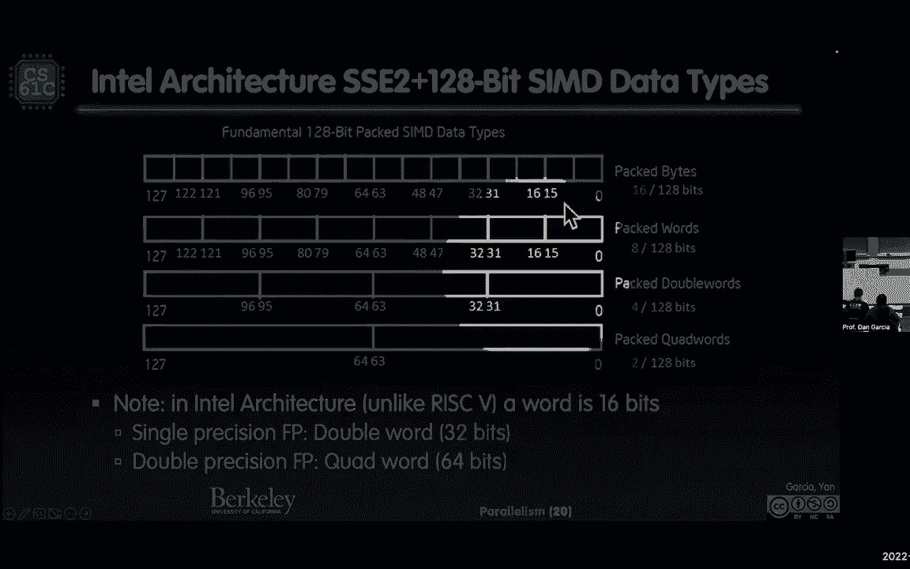

有点像半浮。


或者实际上，这都是字节，这些都是字节，打包字节，或包装的文字。


是半个字，这些是我们的花车或双人花车的包装花车。


你看他们的名字是不同的，因为他们确实有，所以你可以做，你可以一次做四个花车的想法。


就像我展示的照片一样，四个Y，我可以做手术。


所有这些都和我在屏幕上给你看的一样，也没什么特别的，但你能再做一次真的很酷。


这是，啊，现在你可以去5点12分，这是他们秘密的东西中的一张照片，当你移动到斧头时，你现在斧头五五十二斧头是二五六，SSC是一二八，AX512是512位宽，您可以再次进行这些操作，你想怎么分就怎么分。

这是一个内部，如果你读到底线，它说不是为了不是为了你的眼睛，只是这是一个内部的东西，在某个时候被释放了。


欢迎当然，这是你可以输入并进入你生活的东西，他有一台笔记本电脑，转到提示符并键入，转到终端提示符并键入ls cpu，那是常见的手术，它并不是在所有系统中都有效，如果你看到，如果成功的话，你会看到很多。

只是硬件是这样的，可以从软件中查询，我在强调，你看不到的，也许你能看到，听到FPU，SSC，SSC，两个AV x五个十二CD，这些都是代码说，我是硬件，支持这些SIMD操作。

因为我已经为他们准备好了登记簿，有点整洁，所以输入lcpu，想要什么，看看你是否在寻找叫做sse或v x的东西，如果是基于英特尔，如果是M，它可能非常不同，一个有一个，当然是一种不同的做事方式。

你还有一台英特尔硬件笔记本电脑，去看看，查看lcpu的功能并查找短语，VX SSSE，我以前说过的所有事情，有点酷，这是硬件申报的一种方式，这是我要给你的东西来支持你的软件。


那么你是如何处理的呢，我们现在怎么想这个。


让我们真正地下来，在我的演讲中完美的时机，到目前为止，你实际上是如何做到这一点的，假设我有一个巨大的数字数组，一百万个数字，大数数组，我想平方根，每个人都想自己取每个值和平方根，把它放回原位。

这就是我想做的事实，我想这么做，f等于f的平方根，F是一个大数组，我想平方根，数组，平方根取了一个列表，十天后记住平方根，只接受数字，现在它需要一个列表，我想重置F，将f重新绑定到f的平方根的结果。

所以这个数组中的每个数字都有平方根，把它放回原位，这在SIMI中是如何工作的，就像我说的，你得把它复制到，在那里做，然后带回来，那么让我们来谈谈我们如何做到这一点，那么家庭作业是如何坚持的呢？

在今天之前，坚持意味着老派的方式，对于数组中的每个f，我得把f加载到浮点寄存器，实际上有浮点寄存器，你可以在风险5中查一下，它们是浮动寄存器，计算平方根并写回，将值从浮点寄存器写回内存。

因为很明显这是从内存中加载的，在我的浮点寄存器中执行该操作，不是正常寄存器，浮点寄存器，然后把结果写回来，好啦，就是这样，那么SIMD是什么，做什么，如果我有一台机器，必须立即做。

所以我基本上把我的数组分成四个块，我说让我装四个元素，不是一个四个元素同时进入我的，如果我可以，这是一条路，就像你要去萨克拉门托，去萨克拉门托帮我抓四个元素，把他的东西带回来在我的宽SIMD寄存器里。


在一次操作中资本的平方根，然后把这四件事的结果写在一条指令中。


如果你能回到记忆中，就是这样，所以还是要做三次手术，但我的效率是你的四倍，我比你快四倍，处理那个数组，那不是很酷吗，亚当，SIMD寄存器显示路径，是呀，是呀，这是正确的，数据路径是我们所知道的一切。

都是电线的问题，我们知道，要让它工作和控制，只需告诉你将数据推送到哪里，那里有些井，你可以画一条模糊的线，说这是我所有的登记簿，或者你可以说好，这是整数寄存器文件，有浮板登记文件。

这是那里的SIMD空间，就画一条模糊的线，它是如何在您的系统中构建的，你不用担心这个，只是个特殊的接线员，你只需要知道，特别行动，做正确的事，如果他们是分开的，他们可能会分开。

因为你记得有一个标准的注册文件，那是三、二比特宽，风险五，我要给你看一片，风险五是考虑增加70件事，所以会有一个不，第三个两个宽的，但是一个单独的寄存器，会有一个特定的命令，上面写着去记忆。

把它放在更广泛的寄存器里，悉尼登记处，而不是32位宽的寄存器，所以它们不在标准的第三宽寄存器中，另外还有一件事，现在您是否将其视为全局寄存器文件的一部分，或者在这里，在这里，这取决于你想怎么想。

你有什么问题吗，哦耶，好啦，是啊，是啊，所以你继续，是呀，哦我的天啊，好问题，心肺复苏术有特别的指示吗，那是特别指示，那是一个神奇的指令，带着四样东西去萨克拉门托，我们说的不是现金。

我们说的是去萨克拉门托，别管现金了，这是在没有现金的情况下存在的，顺便说一句，我们不是在说现金，在这里，像以前一样去缓存里抓，你抓住一个街区，你试着让它尽可能高效，现在我说的是去拿四样东西。

最好是相邻的，我不是这里的人，一个不不不四个连续的东西把它们放在我的SIMI寄存器里，这就是我们正在谈论的，我得做一个特殊的手术，这三个都是特别指示，加载是一个特殊的指令，做它是SIMD指令。

然后复制回来是一个特殊的指令，储存回来，所以这三个都是特殊的指示。


使我的系统现在快了四倍，我想我回答了你的问题太棒了，所以这是一个例子，我们实际上深入了一点，显示更接近代码，顺便说一句，我要和你们分享幻灯片的结尾，我希望他们印出来了，有一个很好的例子，这叫做矩阵乘法。

我们没有时间的例子，那是，但是所有关于如何做到这一点的细节，所以在这里我要给你一个大局，但请随意通过矩阵乘法，上午，我要向你们展示一下发生了什么，假设我有两个向量，V一，这就是我想要的，我想要的。

我想到这个，顺便说一句，这是一个，这就像直接从图形中出来的，如果你选修另一门课，叫做，我在这里当研究生时教的，我想是八到十次，我喜欢这门课，你经常有一个点有一个X，Y z和一个W，w可以给你透视投影。

所以你必须有第四个坐标，当你在空间中有这些点，我们除以w，你就得到了这个美丽的透视投影，所以你必须继续第四维度，这是伟大的，如果你有什么，你可以同时做四件事，所以这两个向量x y z和w。

v1和v2想把它们相加，然后把结果填充到向量结果中，就像我之前说的，但现在我们讨论的是一个数组，我们说的是两种不同的四英寸宽的，四位非四维宽数，好啦，所以记得我说过你必须有三个指示，把它移过去。

做完再放回去，下面是三个说明，第一个叫做移动APS，V一的地址，无论你住在哪里，希望x、y、z和w在内存中不是连续的，从内存移动到XMM，我给你看了XMM是收银机的名字，xmm寄存器。

一条线就是边界上的一条线，包装意味着没有空隙，单精度意味着它是漂浮的，好啦，四个花车，意思是拿出4个彩车装到一起，嘣嘣嘣嘣，把它们像床块一样敲碎在一起，从内存添加到XMM寄存器，所以在这里。

这个看这个是做什么的，这在一个指令中很迷人，这是关于这不是，这不是简化指令集代码，其中有加载指令或操作指令，或者商店，这就是我们在过去的日子，他们现在做什么，看他们在做什么，我们没有这一切都在风险五。

这就是为什么x86要复杂得多，上面写着凭记忆复制，这是我的记忆错误，从内存复制到我的X和M寄存器，下一个说在一个障碍中快乐，为V二的另一部分记忆感到高兴，并添加到这个登记册上，那不是我们曾经拥有的。

我们已经把它带进来了，寄存器路径中的操作员寄存器寄存器寄存器，然后把它放回记忆中，我们只有这些，我们有很多货，不是这样的，这是加载第二行，这个广告PS说加载广告，同时，我们从没谈过这个。

就好像我们都在这个世界里，那是中投公司级别的指令，非常复杂的指令，同时加载和添加，我把它塞进XMM零相同的地方，最后我需要拿XMM零，它现在包含和并将其放回向量结果中，就是取x，mm，0。

然后把它放回矢量结果中，这和从xmm回到内存是一样的，所以第二个很奇怪，他们应该带我们四个，就像四个手术，加载一加载x，我们叫它什么，负载v1负载v2，做广告放回去，这是蒂多在三，因为有复杂的指令。

因为第二个是同时装出来的。


很奇怪，我们以前没做过，我现在如何用代码做到这一点，让我们再低一点，我快要让你看演示了，示例，矩阵相乘，我们有一个叫做本质的东西，我们谈过他是什么，内在是C中的方式，你指定我几乎就像指令一样。

您指定一些映射到相应指令的一对一行，所以你在写C代码，但看起来您实际上是在用C代码编写汇编程序，左边以此类推，我有下划线的数据类型，一种特殊的类型，M128D上面写着我有一个128bit宽的。

那里的向量，装载和储存只是我们说过的移动。


记住mov a d加pd乘pd。


这些是一些加载和存储以及一些算术操作符。


当你写的时候，变成实际的x86，这做了四个位宽。


把四个位移宽，推四字节加法做一些特殊的事。


所以你只能用c写，如果您有运行在英特尔硬件上的代码，那是x86兼容的，因为我们在谈论，只是x86世界的一部分，不是风险五，x86。

所以回到风险五，现在你说的是x86。

你为什么说回城，六班都是风险五好，因为我想让你知道，遗产现在，我们又回到了风险五，他们正在考虑把它们添加到草案中，是…的提案草案，我们怎么做，我们注意到，但很明显它已经存在很久了。

但是第一个版本没有任何SIMD操作，我们必须这么做。

我们必须是真实的，我们要有真正的表演，你得做一些模拟的事情，你为什么要把它做好，那都是草稿的一部分。


所以拿什么指令，做多个指令的工作，表示向量指令的运算符。

向量寄存器的前缀V，所以他们会有广告，把它塞进目的地，所以这就是我们在系统结束时如何做到这一点，假设他们是5比12，不妨尽最大努力，x8，6，5，12现在的号码是多少？让我们从那个开始。

然后五十二条河流轰隆作响，那很酷，不错嘛。

对呀，如果我做了矩阵乘法编码和C与AVX指令扩展，比天真61快多少，没有AVX的蟒蛇，你能跑多快，只要给我一种感觉，一次一样，同样的速度，该死的来吧，同样的算法要快十倍。


快一百倍，千千万万。


什么能给我一个粗略的感觉，这是信封的背面，C和VX在一起快多少。


只是天真的蟒蛇，小为循环，只有这么好，非常漂亮，温柔的循环，你看看你，看看你有趣，你给我手指什么的，我们到这里来，我们走好的，你做得很好，其实看看这个，哎呦，一百，十万一千人并驾齐驱，看赛马是一种乐趣。

看着你一千个。


答案是9961000获胜。


为什么这是你得到十亿个千兆浮点运算的图表，千兆亿，记住百万千兆亿，我说千兆，是十亿，如果我说gibi，那不一样，我刚刚做了这么多，用于简单矩阵的Python失败，乘法矩阵乘法是一个n次方运算。

如果想想Mulus的繁殖，所有的元素都是这一行和这一列，对于n的平方，所以每一个n平方的人都有n个东西，只是想想，还记得考虑什么矩阵相乘吗，它看起来像一个n立方体操作，那是相当昂贵的手术。

所以它不是很强大，看看这个失败的极客，顺便问一下，我们得到了什么，一台英特尔机器的理论极限是25千兆浮点运算，所以我只是从Python到C语言二百四十次，这就是为什么我们教你快240倍。

如果你只是从那里到那里，顺便说一句，你觉得怎么样，去找斧头的速度有多快，我做四到一次四，所以速度快了四倍，那是九百六十，它大约快一千倍，所以在浮点算子上关心速度的人，我不是在说浮点运算上的整数，是呀。

用Python编写算法很好，但是孩子，如果你想在真实的东西上运行这个，你要做一个模拟器，星期一给你9点60分，我说的是做咪咪，现在呢，我有多个核心，所有做这件事的人，所以你会得到很大的推动。

当你说到德拉尼亚有一个问题，我喜欢，否，它是，这看起来就像你在问的问题，它们是什么？它们是图书馆吗？他们是图书馆，它是汇编代码，有组装说明，移动API，x86的汇编级指令，从字面上看。

这就是它的工作原理，在线下，它实际上是在向向量移动，把那个空间做得很好，所以你在C中，我如何确保有那把特殊的斧头，这些就是本质，你把内部函数放在c中，它会确保这成为字面上的线条，去做正确的事。

那很难调试，你得想办法解决，因为如果你不打包，如果你不在，如果不是四年数组的倍数呢，你要做一些奇怪的事情，所有这些对于能够调试都很重要，你得先让你的代码工作起来，在你开始研究你的一个基本问题之前。

想想唐纳德·独木舟，亚当喜欢编译，它是编译器的工作，但你是C程序员，编译器接受这一行并直接将其映射到移动AP，但你必须补充说，如果你不这样做，如果你不做，你会是，你可以写，你可以写C代码。

这只是一个传统的n立方体的东西，它不会使用BX指令，即矢量静止不动，因为你必须把线放进去才能明确地移动，所以你必须考虑，您的数组是什么样子的，如何四个一个地移动，如果不是4的倍数呢？所有你要处理的事情。

获取代码，它没有优化，我喜欢你的想法，为什么不能有一个更聪明的编译器，我的意思是，为什么你不能有一个更聪明的编译器，你知道我看到你在做，你知道它几乎就像一个小剪贴板家伙，剪裁，你知道。

我看到你在做这种大的扫描和阵列，你不想在这里使用AX扩展吗，可能是未来的编译器，无编译器，我知道会自动做到这一点，未来的编译器可以自动做到这一点，太美妙了，或者你可以看看更高级的语言。

为你做的只是建造正确的东西，就像你可以生活在Python这样的语言中，可以用AX6编译成C，也许你知道你可以考虑从编程语言系统中构建不同的东西。


总之我们今天有点早，首先我想确保每个人都知道这是一个非常详细的例子，我只有三分钟的时间，这是一个60英尺的滑梯，我就像我不能做60张幻灯片，所以我把它全部推到例子中，你可以看看你自己。

这就是实际做矩阵的细节，再乘以这些斧头交换，他们不是风险五，所以你必须学习x86，一点点，这有点烦人，好啦，我们看到了他们中的四个，我们看到希德，到今天为止的一切都很简单，星期一有雾。

没人记得有一个情报，AVX L和SIMD指令因位宽不同而不同，随着这些指令的演变，他们从六十四开始到一二十八现在是件大事，四个花车是二十八，然后二六，那是八个花车，现在呢，他们大约5岁12岁。

也就是十六个花车，在某个时候，太棒了，它大约是多媒体的16倍，论多媒体数据，太棒了，总的来说，你怎么做，你在本质中看到，总的来说，咒语还为时过早，优化是编程万恶之源，非常感谢，每个周末，伙计们。

我们星期一见，当我们了解到吴敏迪，好东西。

