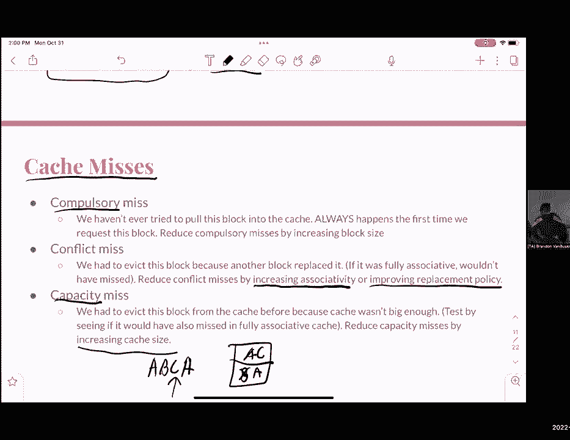

# CS 61C at UC Berkeley  - Fall 2022 - P39：Discussion 10： Multi-Level Caches, AMAT - 这样好__ - BV1s7421T7XR

今天大家万圣节快乐，呃，继续我们上周开始讨论的内容，进入一个更详细的主题，所以这几乎意味着我们将讨论缓存和缓存性能，一点物流，就像你们在，Ed，期中考试成绩出炉，呃，降级申请本周五截止，请提交请求。

即使你不确定你是否能拿回分数，如果你对这次考试后的感觉有任何问题，请随时联系我们的学生支持助教，愿意帮助你的人，实验室吃了这个星期五到期，它涵盖了并行性，我们会在这周的课上讲到，在缓存中的家庭作业七。

本周三到期，与周一相比，这是一个不同的步骤，项目3b下周三到期，所以正如我今天早些时候所说的，我们将在很大程度上涵盖不同类型的缓存，呃，更像是我们上周开始讨论的内容的延续，除了聊天，如果我们有时间。

我们将讨论缓存性能，或平均内存访问时间，我还想在这里强调的一件事是，如果您有兴趣在缓存中获得更详细的信息，我们的一个负责人写的课程笔记，卡罗琳太棒了，我强烈建议你们调查一下，所以一点点记忆，一点点回顾。

我们需要缓存的原因是我们希望主要关注以下内容，空间位置和时间位置，这意味着如果你知道你将访问，嗯，在记忆中彼此接近的记忆点，然后我们想让它更容易，所以你可以很容易地从记忆中快速获取一些东西。

所以缓存对空间局部性和时间局部性都很好，如果你知道你要抓一个类似的物体，以后，你不想浪费这么多时间去买每一件东西，每一次，缓存非常适合时间局部性，会不会嗯，因为我们可以在缓存中存储我们最近使用的项目。

然后我们可以继续从它身上拿走，正如我们从缓存访问周期时间中看到的，我们知道嗯，我们的循环时间来获得我们的时间，从l 1缓存或l 2缓存中获取项目，比物理内存访问要短得多，甚至一万，好啦，然后一点点词汇。

所以我们有一个叫做缓存线的东西，几乎是一个街区，它将我们将要访问的所有内存存储在缓存中，我们的布景，它是缓存行的数量，并形成一个更大的组，您仍然可以索引，当我们讨论n集联想时，我们会更深入地讨论这一点。

然后关联性是高速缓存行的数量，或再次形成集合所需的块，这将在我们讨论不同类型的缓存时讨论，然后呢，Evict是一种用于实际删除缓存行的策略，或者用缓存中的其他内容替换它，我有吗，哦，我们开始了，是啊。

是啊，所以在这里，呃，下面是我们使用的不同类型缓存的一些示例，我们有我们的直接地图缓存，它的结构是这样的，我们有我们可以存储我们的标签，我们知道我们将使用什么索引，在这种情况下，用一张直接的地图。

每个块是一个索引，所以第一行是零，然后一个，然后两个，然后三个，然后嗯你，我们有一个完全关联缓存的数据，没有索引，您不受um缓存地址索引的限制，你只需要有唯一的标识符，好啦，如果这是标识符。

我们可以继续看这张幻灯片，然后对于n组关联方式，在这种情况下，我们称之为双向联想，我们称之为双向联想，因为一套两个方块，不是这两个，不是这两组方块，每套两个块，然后它的作用很大程度上是我们有。

我们还有标签和数据，我们仍然有我们的索引，但在本例中，我们只需要a来支持两个有效的索引，零和一，因为呃，这是一个双向集合关联，因此，我们将有两个块到两组两个块，所以只有0和1，我们谈过的一件新鲜事。

我们还没机会和你谈谈，上周是正确的政策，我们实际上，我想我以后再讨论这个问题，但是是的，所以稍微休息一下，标签回顾，索引和偏移量，所以标签，正如我前面提到的，是缓存行的唯一标识符。

这是内存地址的第一个t msb位，然后索引几乎是指定集合数索引的位，所以如果它是一张直接的地图，只是每个块的索引，或者如果是，或者如果它是一个集合联想，然后是每一组的索引，这是下一个我MSB位。

然后进去，然后最后的oh msb位将用于存储偏移量，哪些是索引，这就是如何在一个块中索引以获得我们想要的实际数据，这取决于块的大小，我们可以看到，通过我们在这里的计算，所以对于我们的抵消。

我们看到它等于，我们可以计算出偏移量所需的位数，通过取原木底座，两个我们的街区大小，我们可以通过得到集合的数量和日志来获得的索引，两个那个，在这种情况下，它正好等效于缓存大小，除以相关相容性乘以块大小。

然后剩下的出价我们会攻击到目前为止的任何问题，所以我们之前想问的几个问题，我们实际上进入了什么时候，我们实际上需要计算一下，但是在哪里使用了多少位，每当我们需要喜欢的时候，使用现金演示。

我们需要回答以下问题，我们的物理内存大小是多少，我们的缓存大小是多少，我们的街区面积是多少，所有这些都可以用来寻找，缓存地址中需要的不同比特数，然后我们需要我们的现金组织方案。

如果它是完全关联的或直接映射的，或设置联想，因为这就决定了我们将如何以某种方式驱逐，这将决定我们如何从缓存中驱逐块，然后我们需要知道我们的驱逐政策是什么，我稍后会更详细地讨论，关于不同类型的驱逐政策。

然后我们需要得到每个，而且是的，这正是我们现在需要问的问题，作为一点回顾，我给你们几分钟，呃，就像一两分钟来回答下面的问题，是关于现金地址的，比如计算比特，好啦，所以让我们进入这个。

所以我们知道我们的缓存大小是32位，然后每个块大小是8字节大，呃，在这种情况下你会有多少块，然后呢，有人想回答这个问题吗，完全正确，是啊，是啊，所以我们将有四个位作为可能块的索引，呃，对于块。

那么这意味着我们实际上需要得到多少比特，实际上得到我们的索引，两个正好，是啊，是啊，所以我们要做4个对数中的2个，等于两个索引位，现在是三点二，我们需要知道我们想找出我们的标记和偏移量位是什么。

我们先从我们的偏移量开始，所以说，作为我们的补偿，我们需要知道我们的街区有多大，我们的块有8字节大，那么我们需要多少位作为偏移量位，准确的说是三个为什么如果我们做日志记录，八个中的两个，我们会得到三个。

我们做日志二的原因是如果我们有一个，在这种情况下，如果我们有一个三位偏移量，那么需要发生什么，有三个比特，对于我们可以寻址的字节类型，我们有八个可能的选项，因为这是字节可寻址的，在那里效果很好。

最后是我们的标签，我就这么做吧，所以如果我们知道我们有一个3位2位的地址，我们知道我们有两个索引位，然后我们知道我们有，然后我们知道我们有三个偏移位，等于三二减五，这等于两个七个标签位。

这是一个很大的标识符，但是是的，有人对此有什么问题吗，呃，所以对于偏移量，我们有三个比特，呃，我们在这里使用八个字节，所以我们是不是应该做很多，呃，呃八点，这是一个字节可寻址缓存，没有一点地址，我们是。

呃，系统通常是字节可寻址的，位不可寻址，我们只想得到这个，我们只想寻址每个字节，不是每一点，所以这就是为什么我们只关心八个字节，还有其他问题吗？让我们继续前进，所以说，正如我前面提到的。

我们需要考虑的一件事，每当我们使用缓存时，我们的驱逐策略，还有一对，有很多，但我强调的那些是最重要的，最近在FIFO中使用最少，所以FIFO意味着驱逐，队列中集合中最古老的块。

如果我们把它表示为一个队列，所以几乎，假设您在缓存中总共有三个块，你想插入一个b，C和D实际上，我们想用这个访问令，我们接下来要做的是简单地把它作为一个b插入，C，我们不需要插入b，因为它已经在里面了。

我们想驱逐我们片场最老的街区，我们想继续，然后嗯，删除添加到缓存中的第一个块中最早的一个，在这种情况下是一个，所以我们去掉它，用d代替它，然后至少最近用的，我认为这是一个更好的例子，如果我继续用这里。

嗯，我们想驱逐片场的街区，这是以前最古老的访问，不是添加的最老的，但最古老的通道，在这种情况下，我们会，我们仍将按以下方式插入abc，然后现在我们看到我们再次访问一个，所以最初我们的订单是。

是一个B C，但因为我们摆脱了，但是因为我们访问了一个，我们把a从最小，然后我们把b c移到后面，然后A成为我们最近使用的，最后，如果我们需要驱逐一个街区来存储D，我们必须看看我们最近使用最少的。

在这种情况下是b，所以如果我们去掉b和d，我们已经成功地使用了lru，或者至少最近用于驱逐适当的块，然后很多人都问，哪种驱逐政策最好，因为有时候你可能，因为我们想知道理想情况下什么是最好的方法。

驱逐最好的街区是什么，这样我们就不用一直往内存里加东西了，等等等等，最好的驱逐政策并不存在，或者从技术上来说是的，但这超出了这门课的范围，嗯，会是什么呢，究竟什么才是最好的，效率，可靠性，最简单的实现。

这真的是主观的，我们将如何定义我们最好的驱逐政策，所以是的，我们真的不能在这里定义最好的一个，呃，关于驱逐政策的任何问题，嗯那么嗯，在缓存轴上会发生什么，啊，我们要谈的原因。

我们将进入一个实际使用这个的例子，所以稍微注意一下这个是很好的，至少我们要做的第一件事是将缓存地址分解为tio原则，所以拿上我们的标签，然后我们的索引位，我们的偏移位，然后你就进去了，一旦我们得到索引。

我们将继续前进，在适当的索引去片场，所以如果他们是，然后如果在那个条目上，它是一个有效的条目，意思是我们可以接触到，我们可以通过适当的标记在索引中访问一些东西，那我们继续，我数到三，其实等一下。

我们将继续进行这一部分，否则我们就得，呃，将数据块加载到内存中，所以这就是我们的逻辑，然后有很多子集我们要做，如果缓存中有有效项，我们必须，首先呢，比较我们在单独标记中的标记，现金或税金现金。

如果它真的存在，那我们就继续，既然我们已经知道了偏移量，我们只需按n个单词读取数据，然后返回，然后如果我们没有它，然后我们需要，如果我们没有合适的标识符标签，我们确实有空间可以放在我们的索引集中。

然后我们继续，将数据块从内存加载到缓存中，如果没有，然后您必须使用适当的驱逐策略来踢出缓存行，然后继续从里面加载，现在在，啊，是呀，呃，所以如果我们有两个缓存，一二，如何从l访问。

l 1如何从l 2进入，嗯，差不多吧，嗯，就是这种过程有些重复，所以如果标签不存在，然后我们就去找L 2，如果它不存在，那我们就得从财政记忆中提取，是啊，是啊，但我的意思是只有标识符和高度任务。

但我怎么能从我读到喜欢，但是呃，我不知道它是否能从，就像从记忆中读到一样，或者不是，你对此有答案吗，我不需要其他问题，对不起，你能读一下你的问题吗，所以如果我们有两个缓存，我们的A和for怎么能，呃。

这里的低保政策是什么，哎呦，我们要多报道一点，当我们开始缓存一致性时，当我们谈论多个缓存时很有趣，但基本上有一个总线连接不同的缓存，他们可以通过这种管道发送信息，把这个问题保留到我们。

我想是第11次讨论，我们会涵盖很多现金一致性，是啊，是啊，问得好，好啦，现在呢，呃，我们讨论了几个场景，其中呃，我们无法访问缓存中的有效数据，这将被认为是所谓的缓存失误，有三种缓存丢失，你们需要知道的。

我们有一个强制性的小姐，我们试图在我们的缓存中查找，而且数据在任何时候都没有被添加到缓存中，无论如何，所以我们必须把数据添加到缓存中，所以这将被称为强制性的Remus，那我们就有冲突了小姐。

因为在这种情况下我们必须驱逐，我们必须替换现有的块，否则我们就得驱逐一个街区，因为它，啊，我们要更换一个方块，因为另一个街区取代了它，如果它是完全联想的，不会失手的，等我们满员了再谈，但是是的。

它几乎是在驱逐一个街区，因为另一个街区取代了它的容量，但是，嗯，这是一种相同的冲突线，但我们实际上能够，这有点像，假设我们有一个嗯ABC的例子，然后是一个，所以如果我们加上a和b，这么说吧。

我们的驱逐政策是先进先出，我们将继续驱逐A，把C，但如果我们想，呃，如果我们想得到一个，因为A不见了，在这种情况下，我们必须移除B，因为那是我们最老的，在我们的缓存里，然后用一个。

现在这将被称为容量错过，因为，假设我们的缓存中有更多的块，然后不得不替换的小姐，然后神话必须放置一个，C就不会发生了，所以这就是为什么它被认为是，这几乎意味着如果您要增加缓存大小，那就不会失手了。

有人对此有什么问题吗，嗯其实，我需要继续删除这里的一大堆东西，你们什么都没看到，对不起，呃，好啦，是啊，是啊，所以我们会继续，我们会走过这个，第一个例子，我们如何使用缓存。

关于这个缓存需要了解的一些事情是，它是一个双向集关联，我会把它画出来，会是什么样子，因为我们知道这是双向集合关联，我们知道每一组都有两个方块，我们可以很容易地考虑这样一个集合和集合零，然后这一套呢。

然后我们有一个八位地址空间，这将帮助您计算每个地址所需的位数，地址的每一部分，所以标记索引和偏移量，我们知道我们的缓存有八个字节块，和三个字节的缓存大小，这也应该是，这也有助于计算，呃。

缓存压力的tio分解，我给你们几分钟，至少工作一半，然后我可以走过去，只要我需要，呃，那个呃，我想他们忘了在这里更新，驱逐政策是，所以有一件事我建议你们，这里有一些lru位检查。

不管是最近使用的还是最近使用最少的，使用您喜欢的任何术语，好啦，让我们开始复习这个，如果你们没有机会完成所有的事，呃，别担心，但让我们继续，第一次休息，获取我们的标签索引和偏移细分。

所以考虑到我们使用的是一个8位地址空间，我们知道这是我们得到的位数之和，对于标记，索引和偏移量应为8，有人想给出他们的答案吗，为了崩溃，好啦，我觉得我能挺过去，呃，我们可以先计算我们的偏移量位。

因为我觉得这样更容易理解，呃，我们知道呃，我们有，嗯，我们有八个字节块，所以这直接建立在我们前面所做的问题的例子上，我们知道我们需要三个偏移位来表示一个8字节的块，所以我们将继续在这里这样做。

然后在这里为我们的，因为我们知道这是一个双向集关联缓存，我们有四个街区，我们知道我们只有两套，因为只有两种可能，我们需要取两个的日志，日志库，两个中的两个，在这种情况下，所以只有一个索引位。

最后我们有了我们的标签，所有的剩菜剩饭，这些是我们的MSB位，所以在这种情况下，我们只需要四个，因为我们知道我们有一个8位地址空间，现在我们可以继续快速地将这些地址分解为它们的tio，崩溃。

所以在这种情况下，我们的时间就是，然后零和一个零零，最后归零归零归零一归零一，然后呢，我就喜欢，就目前而言，我认为这应该足够了，我们会调查这件事，所以差不多现在我们要开始用我们的现金。

所以我们需要做的第一件事是查看我们的索引位，因为我们知道它的指数是零，我们需要看看我们的第一盘，然后差不多呃，我们需要检查我们的标记是否在like缓存中的任何地方，在这种情况下，嗯，零，零，零不在那里。

所以我们需要做的是把这个，我们需要做的是添加标签，零零零然后呃，因为这是lru，哦，我会继续，并设置lru位在这里是一个，因为那是我们最近用的，然后另一个块就会变成零，因为那是我们最近用得最少的。

我们根本没用过，然后我们会我们会，这将是一个烂摊子，因为以前缓存中不存在这个，但有没有人想回答，这将是强制性的，义务教育，是呀，为什么这是强制性的，以前储藏室里没有这个，所以是的，好啦。

然后我们继续看我们的下一个现金地址，它的标签是零零零，在指数零处为零，偏移量为1-0-1，如果我们看指数0，就像我们第一盘一样，我们有一个标签在零零零零，因此，这将是一个成功。

因为我们有匹配我们想要的现有数据，然后我们就有了下一个地址，也就是1 1 0 0，在索引1上标记，偏移量为零，现在如果我们去索引1，我们将看到那里实际上没有数据，这意味着我们的标签不会在那里。

这意味着我们需要将标记添加到这个缓存中，所以零一零一，我们的lru，在这种情况下，将被设置为1，因为这是我们最近使用的，然后为另一个未使用的块为零，在这种情况下，这将，我只是要继续说。

这是一个强制性的错过，因为我们没有这个，呃，呃，我们缓存中的数据，嗯，然后我们继续看一个一个，零，零，在这种情况下，嗯，嗯，这将是一个指数与偏移量为零，零，零一一，零，零标记不存在于索引一的缓存中。

所以我们会继续补充，所以应该是1 1 0 0，现在这实际上成为我们最近使用的，所以这将成为一个，我们的第二个块的lru位将是一个，第一个方块是零，这也将是一个强制性的错过，然后我们进入以下内容。

我们有了下一个地址，它是一个带有索引1和偏移量0的标记，我们有一个我们有，如果我们去索引一，我们看到我们有一个标签，我们有标记0 1 1 0，在这种情况下，这将是一个成功，因为我们有现有的数据。

然后我们继续看下一个，也就是指数为1的，以一零一作为结果，哦耶，啊，顺便说一下，我忘了做的一件事是我们这是我们最近用过的，因为我们最近访问了它，如果我们去，如果我们看这里，指数1。

我们将看到我们的集合目前没有一零一，因此，我们需要清除这个集合中最近使用最少的块，在这种情况下是1-1-0，在这种情况下，我可以继续，很容易地把它替换为1-1-0-1，然后因为这是我们最近访问的。

我们将继续，把它改为1，把它改为零，这将是一个，你可以称之为强制错过或冲突错过，我们就把它叫做失手，因为我不想看到任何错误的信息，好吧那我们有，嗯我们的下一个地址，指数为零，偏移量为1。

然后我们看到我们没有，嗯这里的偏移量，我们没有补偿，或者我们的索引零集中没有标记，所以我们继续加0 1 0 0，然后我们改变我们最近发布的最近使用的位，这个变成1，这个变成零，这就成了强制性的小姐。

应该知道嗯，这可能是一个强制性的失误或冲突MIA，强制优先购买权，好啦，这是强制性的，根据定义，是啊，是啊，我把它放在这里，它隐藏着冲动，嗯是的，是啊，是啊，所以我的意思是，在某些情况下。

这可以被视为强制错过，或者这里错过了冲突，我们是嗯，驱逐权，但我们的现金以前也没见过这种情况，所以因为我们的缓存没有看到数据块，这是自动强制的，嗯是的，我真的很喜欢第二次，那将是，它，是啊，是啊。

所以如果我们的现金看到了，但我们要驱逐一些东西来为它腾出空间，那就会有冲突，是啊，是啊，是啊，是啊，现金是多少，有元数据，有很多事情要做，我们不会教你在缓存系统，我们从很高的水平来看，但是是的，本质上。

您可以将其视为缓存，跟踪已经访问的内容，更多的现金，是啊，是啊，我会，我会去看看，一五二就够了，哎呦，具体包括什么，P喜欢深度缓存系统，深度缓存系统，六十二并不深究太多，嗯，我没有拿152。

所以我不知道什么是好的水平，但如果你好奇的话，我会调查的，是啊，是啊，如果我们查一下最近的两个地址，我们有标签，归零归零和指标归零，我们有我们有合适的标签，所以在这种情况下，它将是一个热门。

然后我们有最后一个，它是一个标签，一个一个，指数1为零，如果我们继续看这里，我们实际上没有，我们的布景里实际上没有这个标签，所以这将是一个错过，现在我有个问题要问你们。

我们以前在我们的索引中看到过一个零吗，所以这一定是冲突失误还是其他类型的失误，记住我们这里有三种失误，我们有我们的强制性冲突和能力，会不会是，这不是强制性的冲突吗，我想是冲突，但我会把，因为好吧。

所以呃，它的动作，呃，让我继续说，答案是一个容量小姐，它是电容炎的原因是记得我之前说过，当我举这个例子时，如果我们有两个街区，如果我们有两个块缓存，使用以下访问模式，a b，然后我们驱逐a把c。

然后我们驱逐B来放置一个，我们注意到，当我们不得不把一个背部，我们知道在某个时候存在于缓存中，这将被认为是一个电容失误，因为如果我们把缓存的大小增加到三个街区，我们不一定要驱逐一个移除，呃。

我们不一定要驱逐我们的A街区，会留在缓存里，如果缓存更大，那将是一个成功，但在这种情况下，我们的缓存不够大，所以我们不得不错过早些时候被驱逐的机会，当我们稍后访问它的时候再把它放回原处。

所以这就是为什么它是一个容量，如果剩下的钱是空的，如果剩下的钱是空的，除了那个索引和喜欢，让我们说，就像下一个零打开了，没有满满的烂摊子，但你没有地方放，因为不管是不是现在我想是的，我想这听起来是对的。

但我不太确定，如果我是诚实的，嗯对不起，我在聊天中回答问题，我喜欢在两个问题之间，但我没听到你说，如果您有关联缓存，或者我想就像就像，就像适当的能力，嗯，如果剩下的现金，但就像，现在就是这样，双向关联。

不会造成冲突，这个是为了把它抓到碗里，但是，从某种意义上说，嗯，我们按顺序追踪所有的入口，然后嗯，我们，因为这有点像人造术语，就像一个真实的物理系统，这些是识别某些失误的方法，所以有一点灰色地带。

你发现了那个灰色地带，所以谢谢你问这个问题，其实真的很重要，但是嗯，如果我们跟踪访问的轨迹，并像我们的关联缓存一样行事，是一个完全关联的缓存，往那边走，我们可以把积木扔进去，直到它满了，是啊，是啊。

然后呢，如果你说的重点，如果我们的完全关联缓存在这一点上是满的，那么这将是一个冲突小姐，这就是它的分类，丹就是这么形容的，我也不确定，是啊，是啊，嗯是的，因此，冲突未命中对应于缓存中仍有空间的情况。

嗯是的，完全正确是的，所以基本上这场冲突错过了一个结果，更多的是让你喜欢，是啊，是啊，是啊，是啊，完全正确是的，是呀，所以有权衡，完全正确，嗯有道理，突出这个，因为是的，就像你说的。

我们肯定可以增加联想性，以减少冲突失误，甚至指责改善置换政策，但是是的，再次耶，这是一个电容，因为在特定的场景中我们有一个，一个，零，零，但那必须被驱逐，所以我们把它放回去，这是一个电容。

对此有什么问题吗，好啦，我想在这里谈几件事，那是呃，我们有一些我们之前说过的东西，是专门错过的，在那里我们不需要写任何东西，让我们谈谈我们需要做的政策，如果我们必须写一些东西，所以在这种情况下，嗯。

我们有两种缓存在这里这里，穿过去再回来，当我们有一个写通过缓存，这几乎意味着，每当我们需要写东西的时候，或者在这种情况下可能，写东西的一个很好的例子是使用存储词函数，一个储存词指示和风险井，会发生什么。

首先我们要把它写到缓存中，然后呃，我们实际上会继续，然后把它写在物理内存中，还有，专门针对右后卫，事实上，关于这一点，有几件事要说的是，它非常，实现起来非常简单，因为它涉及到。

只需遍历直到到达物理内存并在那里写入数据，而且效率也很低，因为我们有缓存的原因是因为我们不想有，我们希望限制对物理内存的访问，因为这需要很长时间，这就是为什么它的效率很低。

因为我们每次写都要访问物理硅存储器，然而，它要多得多，简单多了，实际上更有效率，因为我们仍然有，呃，我们仍然会骑着东西去我们的缓存，但只有当我们需要驱逐某个街区时，我们将继续。

然后将缓存中的任何内容写入物理内存，为了判断块是否被修改，我们是否真的需要把一些东西写进记忆中，我们有一个元数据位叫做脏位，等于1，如果它被修改或等于零，如果没有修改，如果是在一个，那你就去吧。

然后当我们需要驱逐街区的时候，然后我们就把那个块写到物理内存中，然后嗯，这其中很大一部分是，这比直接穿过去更有效率，考虑到您在很大程度上是为了回写缓存而编写的，除了有一点你实际上必须写入物理内存，然后。

嗯，一个大的骗局是，它很难实现，呃，进入硬件，实际上，改变大故障可能有点棘手，我会稍微处理一下，但是是的，还有一些政策，呃，然后我们终于在缓存周围写了，如果我们需要写一些东西。

我们只是直接把它写进物理内存，我们根本不用缓存，然后我们，如果我们的缓存中有一些旧数据那就不一样了，如果我们必须写入旧数据，那么就会失效，那是用，它使用元数据，当我们有一个正确的失误时，有两个政策。

作为我们的义务小姐，所以有两种方式可以发生这种情况，这可能是一个正确的分配策略，在这种情况下，我们需要从物理上提取一些东西，我们需要从物理记忆中写出一些东西，我们实际上是从数据中提取内存。

然后我们在缓存中写入，在缓存本身，然后我们会使用某种类似于写回政策，通过政策来决定接下来会发生什么，不管我们是否写入物理内存，然后我们有一个写分配策略，也就是说，如果我们有我们的。

如果我们有无权分配的政策，也就是说，如果我们有一个书面失误作为我们的强制性失误，我们只是直接将数据写入物理内存，我们不会将任何内存拉入缓存，好啦，呃，我们没有太多时间来讨论这个问题。

但我确实想碰一点阿玛特，所以阿玛特，呃，代表平均内存访问时间，我很快就会写下来，平均内存访问时间用来测量，平均来说，有多少，需要多少时间，一般来说，我们希望我们的目标很低。

这在很大程度上取决于我们每个人的命中时间有多大，错过率和错过惩罚现在是计算的公式，瞄准的是命中时间加脱靶率乘以脱靶点球，这些术语中的每一个都意味着，以下命中时间是访问和加载缓存所需的时间，一个字一个字。

一个很好的思考方式是，假设我们实际上，呃，假设我们在这里有一个缓存，然后如果我们在这里缓存，然后如果我们真的有我们的数据在我们的缓存中，那就算成功了，然后我们把我们的命中时间。

只是我们实际访问缓存中的数据所需的循环数，我们的吝啬鬼，另一方面，另一方面就是，我们在缓存中找不到数据的时间百分比，然后我们必须把它乘以点球失误，这是实际访问更多，一种内存或另一种缓存，也许是错过了。

所以在这种情况下，对于错过惩罚的单级缓存，只是访问内存所需的时间，然后对于多级缓存，你必须做一些递归瞄准，在那里它变成了这样，如果我们想让我们的将军，我们可以说这等于1次命中，这么说吧。

我们现在有一个两级缓存，加上我一个错过率，然后我们需要继续，实际上得到L 2的地图，在这种情况下，它将成为L两个命中时间，是啊，是啊，所以这一点很重要，我想我们是时候，我想我们没有足够的时间来讨论这些。

Mac电脑，几个Mac问题，所以我想我们今天可以把它叫做讨论，是啊，是啊，如果你们有什么问题，随便问吧，或者你现在就来找我们，是啊，是啊，谢谢你，每个人都有一个伟大的万圣节，其他问题，所以制片人。

我们有，呃，三种不同，三个不同的，哎呦，三次不同的失误，是呀，是呀，我会回到那个，增加尺寸可以。

