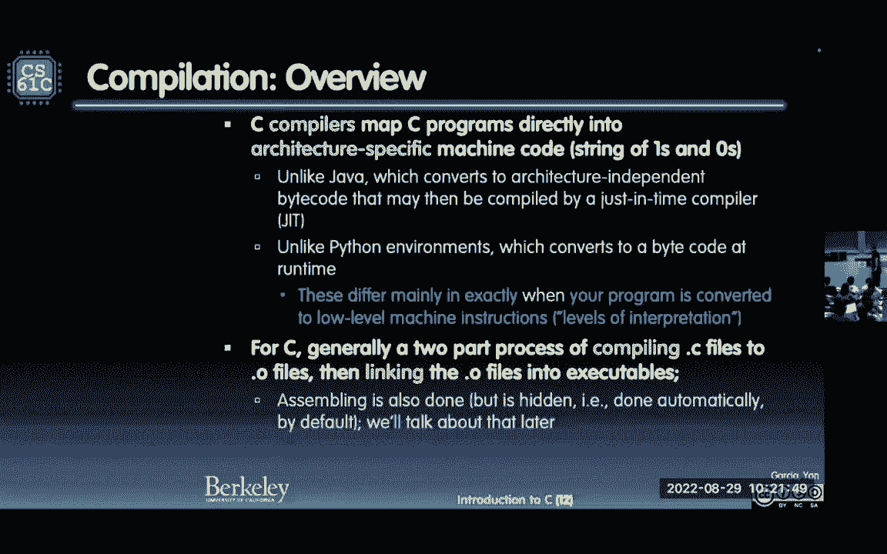

# CS 61C at UC Berkeley  - Fall 2022 - P3：Lecture 3 C Intro - Basics - 这样好__ - BV1s7421T7XR

很接近，非常非常感谢，非常接近 好的，所以这真的很有趣，C C+C Sharp 相当于前 4 种语言中的 3 种，所以学习 C 会让你变得非常高效，它会教你一个全新的视角，c 是方式。

在这里所以我们讨论了这个，C 是一种低级语言，所以你会欣赏机器，你将能够表现得更加出色，写代码，这确实比用 Python 编写的人快得多，Python，人们通常将实际上用 C 构建的库称为库。

所以 C 确实是你得到它的地方，从中挤出性能，好吧，美丽的呼喊，好的，回到我们之前看过的第一张幻灯片，这是抽象层次的大图，我们在顶部 好吧，我们从顶部开始，我们要去，深入研究软件，直到我们到达指令集。

架构层，然后从底部开始工作，我到了中间，所以我们要咬一口，几乎就像你咬了一口汉堡，可以，然后呢，到目前为止你学到的重要想法是，任何东西都可以用位来表示，你以前看到过，我们在第二讲中又看到了它。

船尾，迈克·弗利克 (Mike Flicker) 不太高兴，哎呀我每次都必须发出声音。

好的，所以它提示了一切并且一切都排队好了。

那很好，那挺好的，我们回去吧，所以我打赌。

不错的答题器 Dan 不错的答题器 是啊，好吧，所以，我会尝试点击一次而不是点击曲目，好吧，这是圣经，KNR 克尼根和里奇，确保您获得 ANCC 的第二版，标记早期版本，我实际上没有，这很酷。

结果出来了，c 是，很搞笑，我通常不看幻灯片，让我和你一起读一下这个，c 不是一种非常高级的语言，也不是一个大的语言，并且不专业，在任何特定的应用领域，这有点像80年代，但它没有限制。

我们喜欢非常低级的硬件，及其一般性，让它更方便，对许多任务有效，以及据说更强大的语言，他们正在将自己与 Fortran 进行比较，顺便说一下当时，和帕斯卡，启用第一个未用汇编语言编写的操作系统，所以。

这确实是我们当时必须写的，操作系统想象汇编中的162，艰难的事情，所以这是一件大事，你可以写这个，比组装的水平高得多，Unix 是一个很酷的东西，它是一个便携式的，操作系统，实际上。

可移植性是在伯克利完成的，伯克利标准发行版。

BSD 是当时的大太监之一，好的，现在我有第一个玩家问题，首先且仅用于讲座，这是我们每年都可以访问的，我真的很想感受一下，其程序是罗马 C 语言，所以问题说，在这堂课之前我这是你我学生。

会说我是一名扎实的 C 程序员，这是那些活物之一，这样你就可以实时看到，去，如果你不这样做，如果你看不懂它，它会显示文本 DDG，至 2 2 3 3 3，每堂课都一样，丽莎会有不同的代码。

然后输入 ABCD 或 E，或访问 pollev com，副总干事丹·加西亚博士，这很有趣，因为你会看到，总是很有趣，能够看到你在哪里，在你的同学中，不知道我们不是，如果你在a上就没有阴影。

或者如果你在 E 上则没有阴影，就在你碰巧在的地方并感受到它，好的，大多数人以前没有见过C，61 C 只是一般而言，这就是我们所看到的典型情况，有很多 b 和很多 A，一些涉足但大多是 b 的人，好吧。

顺便说一下，如果你懂Java，你大多知道我们要做什么，所以你知道你是否参加 6 到 1b，如果你已经采取了应该没问题，好的，并且，顺便说一句，我有大约 40 张幻灯片，所以这只是很多，告诉你关于C。

我认为，我们可能在前面的幻灯片中说过这一点，但我再说一遍，你不会从中学到C，你通过做来学习C，你可以通过实践来学习任何编程语言，所以只要听到它就会有点，我会尝试，引导您绕过问题并尝试突出显示，原因。

然后我们要做的是，花大部分时间教你。

基本的高级作品，那么丽莎下一堂课将详细介绍，好吧，那我们该怎么办？出色地，我们希望能够再次，利用其基本特征，硬件的，我们希望能够更接近硅，Python 确实允许这样做，c 我们喜欢它吗，例如第一次。

你要管理自己的记忆，这是一件大事，你没有用 Java 做过，你肯定不知道，Python，有一些特殊说明需要，能够与硬件对话来进行瘫痪，我们也会看到这一点，很酷的东西，C如你所见，从那次调查中。

C及其口味，是最流行的语言之一，40年后他们仍然是第二、第三和第四，太强大了，这对遗产来说意义重大，并说了很多关于卡内基的神奇之处，和里奇是，提出并发展这种语言，我还会看一些幻灯片，有一些进化。

所以它也是随着程序员一起进化的，但是如果你要开始一个新项目，全新的项目，你已经知道了 C，你会去C吗，我可能不会，这是双方的一些建议，尼克·韦弗和我以及丽莎，两种非常像 C 的语言。

但都经过优化所以生锈，是C，但很安全，C 有所有这些锋利的边缘，这可能会导致大量错误，所以他们说，你知道如果我们喜欢 C 但我们想要，消灭那些错误，所以生锈是可见但安全的，当你看到理论上是正确的。

进行所有必要的检查，它应该不会比生锈快，去是惊人的，你还不知道，关于什么是核心或如何驱动这些核心，但 go 会自动为你做，所以 go 只是说 write it and go，突然间我有了一台机器。

90 课程哇，它只是有效，令人惊奇，无需喜欢。

手动调整它，所以 go 非常适合该语言，好的，我的答题器可以工作，现在，我和以前一样说过你不会学习如何编码，只要听我说，这对于编程来说从来都不是真的，你必须自己做，这就是我们建立实验室的原因。

顺便说一下，有，全国各地的一些课程没有实验室，只是讲课讲课作业之类的，不，我们有实验室，所以我们可以继续研究并获得一些支持，我就是喜欢那个模特，我的植物之一，我的一位导师创建了 KNR 模型。

有些必须有，正如你所看到的，有两个资源，一个是 Java，简而言之，如果您来自 Java，第 2 章介绍了 Java 与 C 的不同之处，所以它很友善，好吧没有Java，让我了解一下 C 是什么。

boom 是什么，布莱恩·哈维说这太棒了，过渡注释是，可点击且该资源可用，也在网络上让我们确保，头 t 是，让我们确保该链接位于他们的网站上，令人惊叹的布莱恩·阿巴里资源最近退休了，名誉教学教授。

关键概念是 C 有这些锋利的边缘，指针被擦除，和内存管理有点低，调整您以前不必担心的事情，你肯定有指点，但你不知道里面有返回的指针，爪哇时代，关键的安全概念是所有这些都是不安全的，这一切都是真的。

你会搬起石头砸自己脚的地方，如果你的程序在这些区域包含空气，可能不会立即崩溃，这是最难处理的错误之一，可能不会，立即崩溃，而是让程序处于不一致的状态，经常被利用的状态，所以安全人员讨厌看到，因为它是。

为人们介绍了所有这些可能性，进后门做事，实际上从这个角度来看问题。

就像 Clicker 现在并没有真正让我开心，但来吧答题器，那里好吧，所以有两个，好的，所以有两张大图你需要知道，这几乎是一个像迷你164一样的教学，这是编程语言的讲座，关于我要教你一门新语言。

你可以问的第一件事是，它是编译语言还是解释语言，此时你应该了解两者，我相信Python是一种解释性语言，也经过优化编译，Java 是一种编译语言，但它是解释语言，这是一件有趣的事情，C全部编译完成。

好吧，所以你有点从解释，解释并编译为全部和全部编译，让我告诉你那是什么，这不起作用。

好的，那么编译器是做什么的，编译器获取源代码，并将其映射到特定于架构的东西，如果你是学习Python长大的，你不会欣赏，与系统打交道是什么感觉，哪里有特定于架构的代码，不会转移到其他人的设备上，一阵子。

英特尔拥有一切，Intel 是 Mac 的首选 CPU，Intel 的 CPU 选择，对于 PC 来说，你说相同的 CPU 不，但这些库被编译成可执行文件，你不可能谁曾经吃过生的。

在 Windows 机器上可执行，并将其移至 Mac 并使其正常工作，就是不行，这就是建筑学的具体内容，谁曾经使用过 Python 代码并致力于，无论你是什么机器，Python 代码随处可用。

和 Java 一样，因为这种解释，与Java不同，转换为与体系结构无关的字节码，好的，这这太棒了，今年爪哇他们有一件大T恤，跑一次就对了，任何地方 正确 正确，它立即跑到任何地方我的朋友，为sun工作。

他得到了一支笔，它实际上会泄漏，就像他的锅里漏满了墨水，它的侧面是一个像Java一样的Java，对吧，曾经跑过他的手和他的任何地方，很有趣，好吧，Python环境，再次转换为字节码以供运行时使用。

但总的来说，我要，传递给你的Python代码只是被解释，它在任何地方都有效，我们喜欢它，所以我们喜欢 Python 和 Java，但这就是我们为什么要这样做，为什么我们总是把自己锁在建筑中。

每个人都有一个答案，比如 p，它与性能押韵，履约权，一旦你编译下来，没有什么能比原始 C 的速度更快，编译为架构特定的代码，所以顺便说一下有两个问题过程，一般来说，你只会，现在，你只是想再次编译它。

当你头脑简单时可执行，还有一步，我有一个完整的，关于这个称为编译的讲座，组装和链接，那是什么咒语，卡尔，我只是喜欢这样来记住那是什么，我们将会看到，这三个步骤，整个讲座中更详细一点，这是该讲座的概述。

有一个编译步骤，还有一个组装步骤，这是为你保密的，你输入 GCC C 代码，你就会得到可执行文件，所以它正在秘密进行组装步骤，它正在执行链接步骤，链接步骤是引入一些库的地方。

你可以引入一些库来使其可执行吗，所以在Cal中编译汇编链接，你永远不应该忘记这一点，好的，再次眨眼，配合所有人。

这是图片，不错的照片，你有食物点 C，我正在研究食品点 C，Lisa 独立创作小节 C，太棒了，我们每个人都有一个编译器，我们每个人都得到这个 0 机器码，你不能运行 0 个文件。

他们可能与一个图书馆无形地联系在一起，活O，使，顺便说一句，我不想拥有，有没有人有任何点出局，你可以用破折号 o 标志来命名你的可执行文件，从现在开始就不再有点了，菜鸟这个词是什么，新手们。

他们都是点外的，你应该输入 GCC 破折号 O，可执行文件的名称，然后是您需要的所有 C 文件，好的，所以不要有任何疑问，这表明你不知道自己在做什么，o 破折号 o 然后有一个可执行文件名称。

通常是你蹩脚的可执行文件，如果你只有一个福，那就太棒了，你只要叫它你想要的名字就可以了，问题，这就是大局，现在为什么这有用，因为你猜怎么着，丽莎可以为我独立处理她的文件，所以整个团队，想象一切。

整个团队都在不同的部分工作，太棒了，所以服装开发，没错，这张照片也有很棒的地方，就说食物吧，假设这很大，它很大，丽莎和我都非常高效，我们编写了数百万行代码，需要很长时间来编译，我们就说。

假设丽莎没有碰她，所以她得到了她的，她做了她的巴多托，它位于我的目录中，我在我的 Foo 上工作，我做了一些更改，也许一行更改可以修复它，等待编译步骤的时间，我必须等丽莎的吗，不，因为我有她的芭铎。

我必须重新编译库吗，现在点 0 就在那里，看看那有多酷，所以能够做出改变真的很有用，如果我改变食物会怎么样，c 必须改变什么才能使我的新食物可执行，我必须编译，我有一个链接。

但我已经有条形灯和 LED 灯了，这就说得通了，我想要返工和重新编译，但这非常好，顺便说一句，为什么你把程序分成文件，这有意义吗，突然之间你就这么做了，你不必重新编译你喜欢的一切哦，这是什么功能。

这个栏的功能是什么，因为你已经有了那个酒吧，你没有碰它，你已经拥有了，所以绝对，主张，除以功能分解或之前的那个词，功能分解，你把你的程序分成不同的功能，他们每个人都处于不同的状态，C文件。

然后你不需要重新编译所有这些，很酷，好的，我需要走近一点因为我的数字。

好的，我们开始吧，有什么优点，我想我已经提到了其中一些事情，让我确保这里有很多东西要读，只要确保你涵盖了所有这些，合理的编译时间，现在，有一种东西叫做 make 文件。

并且 make 文件确实很好地告诉你，您所有文件的依赖项是什么，所以如果你触摸这个特定的可能会说，迷你图书馆不是住的哦，但你在食物中使用的小东西，比如说一个助手，谁知道谁需要那个。

你的 make 文件会知道，如果我换一个你 Foo 的迷你帮手，Foo 用户，也许还有 bar 用户，但其他的比如浴场和巴珀利不使用，我的 make 文件会知道，哦，如果我接触这个图书馆。

那么只有 Foo 和 bar 需要重新编译，所以你的make文件，非常高兴能够告诉您是否使用，作为一种帮助者，哪一个，点C源代码需要重新编译，以及如何自动执行只需说 make。

你只是说 make make，如果你学会了如何正确地进行试验，只是说让，然后自动将其构建在一起，这太好了，我们讨论过的运行时性能，这就是我们这样做的原因，运行时性能将进行编译，语言总是更快。

现在你说但是等等，你说的是使用真正重型设备的人吗，Python 中的科学计算，是的，你知道为什么，因为Python，当我们了解 Spark 时我们会看到这一点，可以驱动某个数据中心的一百万台机器。

所以这真的很酷，驾驶它们要容易得多，作为翻译演奏，突然间，一百万台机器醒来或运行一些，火花命令，确实如此，这真的很酷而且很强大，火花可以打电话，带有 Cython 的 C 低级库，所以如果你带进来。

斯蒂通和火花，你不仅得到了好处，低水平一些，真正适用于硬件的重型 C 库，该特定硬件适用于，但它被这些控制得很好，轻量级脚本语言，例如 Python，所以这实际上是一个不错的。

我们喜欢用 Python 作为数据科学的一种方式，那是因为你在这儿吗，如果你真的需要困难，真实的性能代码，无论如何，它是用 C 编写的，Python 调用它，所以你实际上可以在C中调用直接库。

来自 Python 非常酷的东西，所以我们喜欢合辑，我们可以与，一种我们两者都做的中间立场，生活在Python中，但实际上从 C 中获得了一些性能，现在，我们谈到了这样一个事实。

编译语言是特定于体系结构的，取决于，架构类型，也取决于库，改变的库，你还必须重新编译它，因为图书馆已经改变了，生活已经改变，神话是某种建筑，x86 您听说过风险 5，我们要看看这门课，和操作系统。

那些有图书馆，所以所有这些都被锁定，和依赖的，X 电缆必须重建，各种建筑，这称为移植代码，所以，C，是不可移植的代码，通常你必须确保你哦，在那台机器上我这样做并制作文件。

和configure这是一个Unix命令可以帮助你知道，好吧，这台机器有这些东西，这台机器的整数这个wad或这个wad，我们会知道并能够帮助您，但通常，如果你正在做真正低级的事情，真正的表演很难得到。

很难移植你的代码，你必须确保你知道，不同的，您最终将与之合作的建筑师，有人说嘿我有新的建筑，好吧，我需要知道如何获取我的代码，并让它与你的一起工作，因为你也有一些奇怪的事情。

所以编写可移植的代码真的很困难，你当然不能只运行一个可执行文件，可执行文件对于该架构来说有很多，好的，所以移植就是这个词，移植代码并不是一个简单的过程，取决于如何，架构不同的是，来自你正在处理的那个。

这样做的部分缺点是有一个变化，编译重复，更改编译，运行周期是您为开发权利所做的周期，让我更改一些代码，让我编译它等待等待等待然后运行它，所以你打印 1 ah 1，我的打印语句是错误的。

就像那是那么微不足道，但不，我必须经过编译阶段才能成为，能够拥有可执行的礼物，所以如果你这种人喜欢做，更改一行，然后看看是什么样子，这是一个缓慢的循环而且很烦人，所以无赖再次成为你的朋友，只能，地狱。

顺便说一句，这是一个很酷的功能，他们实际上是并行制作的，因为，你记得食物和酒吧是独立的，为什么它们不能并行，你实际上可以通过这个，并行计算，这真的很酷，该链接是连续的权利，它们全部合并成一个可执行文件。

这样你就可以获得最高的好处，但在奥姆达尔定律中你看到了，你的串行部分减慢了你的速度，所以猜猜瓶颈是什么，就像所有的水都想装进瓶子里一样，但有一个脖子可以做到，铰接的，几乎就像合并到。

20 条泳道上曾经拍摄过的姿势，海湾大桥有20条车道，但你要并入五号桥。

这就是所谓的瓶颈，关于多兹法，好的，这是链接阶段，好吧，所以我们之前的图片有所改变，但如果你有一件，这介绍了另一件作品，我之前提到过这很有趣，称为 C 预处理器或 CPP，我有食物。

C语言我通过C预处理器，我得到了这个有趣的实时文件，然后编译然后处理它，所以这是预处理之前的一个步骤，我预处理C，你为什么这么做，因为你可以在中引入非常酷的指令，这是C语言中的。

C 预处理器知道如何处理，例如，您可以注释掉整段代码，通过说英镑，如果定义一些变量，然后英镑，结束如果哪个是，这个变量被设置为正确的值，这整个代码甚至不存在甚至从未见过，所以这实际上很有趣。

这就是人们经常编写代码的方式，如果 def on，便士的架构说英镑，英特尔有这个库，然后运行这种特殊的东西，否则这个图书馆是新的特别的东西，所以能够拥有实际上很酷。

这些磅 if def 事物之间的可移植代码，CPP 命令以井号开头，例如冲击包括，你的声明中的第一行是令人震惊的包括，上面说去抓取该文件并逐字逐句地进行，将其直接放入您的代码中，你会得到一段更大的代码。

但无形中，就像你不知道它得到了它一样，但刚刚添加到其中，非常酷，所以文件 h 用于您自己的本地，dot H 文件或头文件 dot h 传感器头，或者，库的尖括号，然后它就会知道在哪里可以找到该库文件。

所以标准 I o 点 标准 Lymp，H 他们不在你的目录中，它们位于系统知道的目录中，你可以在命令行标志上指定，它可以引入一些代码，磅求 pi，当你在代码中看到 pi 的时候，这很酷，它被数字取代。

太酷了，无需说明变量的类型的作用，我们做类型看到的是类型语言没有，它是 INT 还是 double 或 float 否，就像字面上的 pi，这两个大写字母将替换为该数字，并将它们放在括号中。

如果结束如果我谈到那确实有条件工作，如果你真的想看看会发生什么，你可以使用 save temps 实际上拥有 GCC，说出所有临时文件的结果。

通常人们会忽略它们，但如果你愿意的话你实际上可以看到它们，这是最酷的宏，你想要快速做某事，人们通常不编写函数，他们编写宏并扩展宏，所以请记住这只是文本替换，例如，这是 min 函数。

X 和 y 的最小值，X 小于 y，问号，顺便说一句，这是一个内联 if else，如果你以前见过它，问号冒号，所以这里，我将把光标移动到缩放中的人可以看到的位置。

所以这是 X 小于 y 那么 x 否则 y，并注意到它们周围都有括号，现在这部分是因为，你要确保事情会这样发生，那些表情出来了，如果你可能有，通过在它们周围加上括号，你总是确保他们会做，通过他们自己。

这几乎就像添加一个，表达式中额外的括号，只要确保，首先完成此操作，然后再完成此操作，你不想有这样的表达，冒号或问号结束，没有优先权，然后表达式可能是错误的，所以只需在你的，宏如果你决定这样做。

这是一个有用的东西，顺便一提，你还必须知道宏是文本替换，所以Z是个傻瓜，会有一些副作用，比如 print hello，它不像函数调用，你得到实际的，你称它为实际参数值，然后将值放入函数中。

这就是 61a 中函数调用的工作方式，正确的，你得到你放入的参数值，但这只是文本替换，所以如果Fu有副作用，你认为你在想哦它会打电话给Fu，有副作用，它将打印一次 Fu，然后 Fu 的结果值。

被调用并与，W 然后你得到的下一个是这两个中较小的一个，如果你接到这个电话则不然，首先要测试它是否更小，当它发生在更大的时候，它会再次调用它，因为它正在替换它，两次所以想想吧，如果您使用宏。

您通常可以拥有，如果您有副作用，Foo 接听了两次电话，在那种情况下，当 Foo 碰巧是更大的家伙时，因为你没有获得价值，你只是将代码放入，如果你输入这个底部的家伙，Fu 最终成为两个中较大的一个。

的W，当它询问其价值时，谁被叫到这里，当Fu被叫到这里时，实际上得到了值，那是两倍。

两种食物与一种食物的比较，所以想一想，如果你有那个，C 与 Java 需要通过大量幻灯片来了解。

让我们来比较一下这张大旧桌子，我将阅读它并突出显示，这其中的关键部分，正如你所知，Java 是，一个，面向对象语言，就在那时 OOP 发生了一次大的运动，丽莎和我要去 6C，就像每次会议一样。

我们应该先做对象吗，最后的对象都是大约 10 个，15 年，一切都与物体有关，这就是他们想要谈论的一切，这就是新想法，由于所有原因，optidority 计划有其好处，你可以把它包在一起。

封装所有你想到的东西，很棒，我们也喜欢他们不说这是一种不好的语言，这是一种不同的思考方式，c 是一个，面向功能的语言，并不是说它是一种函数式语言，和一种像计划一样的感觉，或 ml1 你正在考虑的地方。

有那些副作用，C有很多副作用，它只是基于这些功能，但不是纯函数，可能有副作用的函数，再次使用 GCC hello dot C 进行编译，破折号你好，这样你就没有数据了。

在这里你将调用 Java C hello dot Java，进于出，或者你好这里将在你的可执行文件中，你会说 Java 你好，所以对于很多 cprg 来说这实际上是不同的。

为什么我前面一定要跑Java哦，因为这是 Java 依赖于绑定的代码，现在能够解释并使其发挥作用，你好，这个世界都有点丑陋，相比，Python 打印 hello，打印你好世界。

这是你的第一个 Python 程序，你已经进入了 tentedio 库，所以知道 printf 是，缅因州将有回报，整数表示它将有一个整数返回值，董事会会说我没有异议，打印高反斜杠，你之前就知道。

这里有打印行，你不需要反斜杠，因为该行，feed 是打印行的一部分，这就是与这里打印的不同之处，你必须有反斜杠才能使其工作，你必须返回 0 0，意味着大家都竖起大拇指，一切正常，没问题。

所以返回 0 意味着一切都很好，不要这样做，一切都很好，不用担心，如果你返回除 0 以外的任何内容，那就是错误代码，然后你可以在命令行上看到，反正，工作有点笨拙。

你看到所有这些代码只是为了说“Hello World”，C 稍微不那么笨拙，但仍然，有很多事情要做，再次，最重要的是这里的底线，你们中有人在关注什么吗，就是那个，新分配，并重新分配，当你不再提及它们时。

所以根本不用担心，自动垃圾收集，您将在本课程中真正了解到，为你做了，永远不必担心记忆力，工作就是聪明，看到这一切都是你自己做的，最大的区别就是内存管理，通过一种叫做马利克和免费的东西。

好的，第二个是一种更简单的语法，C 有这个反斜杠，星号，然后以星号斜杠结尾，这样做的担忧是，显然如果你遇到过这个麻烦，如果你有一条评论要放在中间，你说让我把整件事评论出来，出色地。

问题是现在你不能有嵌套的星斜线，你必须喜欢取消注释中间的一个，评论一下大的，如果你把这个带回来，如果你喜欢，记得再把中间的注释掉，这样，你不能在那里嵌套评论组的麻烦，Java 既有斜杠也有斜杠。

让我们转到该行的末尾，如果你有一个恒定的磅要找到，我们之前讨论过只进行文本替换，或常量说嘿，嘿大家，这永远不应该改变，这里的const你说的是Java中的final，有预处理器吗。

我刚才讲了那个叫CPP，可变装饰，必须发生在块的开头，Java 必须在您使用它之前发生，所以这实际上限制较少，变量命名只是，这是，哈梅尔案我们讨论过，你在 Java 中见过的一些方块。

这里我们像 Python 一样使用下划线，访问图书馆，我们将包括在内，您在工作现场导入。

几乎相同，运营商这很酷，这基本上就是这张幻灯片，向您展示 Java 和 C 有多接近，这是一个问题，是的，很好，告诉我你的名字，钱德里夫 好。

好吧，让我们采取，一个好问题，问题是定义缺点之间的任何表现，缺点就像创建一个变量而不是，定义的更改将是文本替换，所以这取决于，如果你有一些复杂的函数，比如宏，你可以，正如我之前提到的。

 pound 定义了一个宏，然后你就会有，因为你不会进行函数调用，你说的功能时间，我们将会看到，函数调用中有一些时间，所以这实际上是，为什么真正表现出色的人，正确的宏而不是函数调用，所以这与变量无关。

但更多关于函数调用，这就是我们真正看到的区别，好问题，这些都是所有的相似之处，几乎一切都一样，看算术作业，增加赋值，如加等于，这意味着它就像加等于 1，这意味着 a 等于 a 加 1，按位逻辑。

你会更多地看到这个，今天晚些时候，或者今天晚些时候，这个学期稍后一点，移位位为什么要移位布尔逻辑，你以前可能见过这个，这与您见过的质量测试非常相似，分组，顺序关系 自增自减 A++。

表示 a plus 等于 1 或 a 等于 a plus 1，选拔成员我们要讨论这个，这是您获得某些内容的方式，使用指针或使用结构体，去到达那些，结构体的字段，与Java不同，因为既有结构体又有指针。

所以在C语言中，你可以有一个结构，或指向结构的指针，你可能会使用，您使用点作为结构，和指向结构体指针的箭头，有点微妙，有点难看，正如我之前所说，问题 Mark equals 是一个内联 if。

C有更新吗，Michael 那你学过 C 的时候，1986年在高中读大学，自1986年以来一直更新，是的，1999年，它们带有 C 99 标准或 C 9 x 标准，达到那个目的，如果你没有默认得到那个。

你有破折号标准，性病等于 99，如果你打印这个，你会得到实际的标准版本，这有点酷，它会告诉你 1 9 9 9 0 1 一月 1999，这是维基百科上的参考，你得到了什么，你看，他们从 Java 中学习。

就像有些人说的，嘿 Java 有这个，为什么我们不能拥有那个，所以他们做了一些准备来看看，拥有一些从 Java 中学到的东西，人们喜欢，有点休息回来看看大家，就像隔壁的星巴克一样。

杀死一家妈妈和流行咖啡店，来吧，我们现在有赠款并且，表达了他们拥有的所有东西或其他什么，这就是C，当时正在尝试制作C，对于Java程序员来说更刺激，所以声明在 for 循环中，意味着你不必在顶部声明。

你放在 for 循环之前，我喜欢圣地亚哥，这很酷，双斜杠用于注释行，是的，最后就像哦，太棒了，这是一个很大的一个 这是一个很大的一个，变长非全局数组，我记得有一天，任何，如果你做了一个数组。

你必须在编译时知道这一点，就像不，事情不是这样的，你实际上可以，动态知道数组有多大，嘿用户你想要多大的数组 10，好的，10 个数组，你以前不能这么做，在用户之前你已经锁定了 10 个代码，参与其中。

所以现在这对程序员来说是一件大事，我们有明确的整数类型，所以现在我们真的拥有了这真的很酷，我现在可以说正好 64 位宽或 32 的整数，这是一个非常强大的东西，我想强烈倡导这一点。

现在我们有了布尔逻辑定义，呜所以就像，轮到，千年，这就是我们所拥有的，19 更新了吗 是的 有 woo，顺便说一下，我们现在有这个叫做 C11 和 C18，实际上17年就出来了。

但18号是他们最终发布的时候，所以它实际上在这里被称为C17所以2017，10 但实际上是 c18，因为他们修复了最后的一些错误，最终延续到 2018 年，这是两个新的新定义，顺便说一下，这是默认的。

我的 Mac 是新电脑吗，如果我输入 print 该行，我会得到 c18 或 c17，这很酷，这是 c11 与 Stu San 转移的一些参考资料，我们现在得到了多线程，等待计算机有多个核心。

最后将其添加到系统中是一件大事，Unicode 现在我们稍微谈谈 Unicode，现在我们有了 Unicode 支持，get s 一直是所有安全人员的祸根，我们出去吧。

get s 你甚至不能再使用 get s，所以离开那里，到你得到字符串的地方，那很好，输入您可以根据类型分派的通用宏，哦，宏可能知道它的类型，太酷了。

复数值，哦复数，以及其他一些很酷的东西，你可以阅读有关，好吧，这很有趣，所以，main 是顶层，每个 C 程序中都有的函数，通常当中间没有空隙时，你有这两件事，进入RGC和车星，RGV支架哦什么是一口。

这是什么意思，ARCC 告诉你参数的数量，好的，我们将包含字符串的数量，在命令行上，用空格分隔，顺便说一句，可执行文件算作一个，每个参数加 1，所以如果我输入的是 Unix 提示符，我输入排序。

我的文件，好的，弧C为2，因为你数为零，所以 argv 是一个指向包含这些的数组的指针，字符串，好的，所以这意味着 argv，零的，是排序你得到函数的名称，ARG v of 1 是我的文件。

就像 Python 一样，它变为 0 和 1，但不是 2，好的，所以如果你得到 2 你就可以得到 0 和 1 的访问权限，就像Python一样，你到底为什么想要，函数名称中的内容。

进入RGV你不知道你是谁吗，你做到了，你不知道你是谁吗，为什么我们需要 RGV 为 0，举个例子说明为什么你需要 RGV 为 0，在你的C代码中，为什么你实际上可能会使用它，我经常问这个问题。

我已经检查过这个课程，大约15次什么的，这很难，人们通常没有猜测，或者这个给了我一个，因为它很勇敢给我一个猜测，你为什么关心，RGB 0 是函数本身的名称，你的手也是 你的手，告诉我你的名字。

你叫什么名字，亚当亚当走，不是当前目录而是当前名称，你自己以及为什么你需要你自己的名字，哦耶，你能告诉我尽可能接近接近吗，非常接近，让我给你起个名字，马修去，哦，那很有意思。

也许你可以像系统调用一样调用，就是这样，我从来没想过那个，这是个好主意，你可以通过系统调用来调用自己，有趣的是我在想什么，但这很有趣我会接受，在使用中，类似字符串的错误，这是一个错误 这是你如何称呼我。

你会说用法字符串，然后你像这样打印出来，你想向他们展示如何正确称呼自己，但假设有人改名了，排序为我排序，那么你会想说，好吧，我是按照排序的名字，所以我要说的是，这就是你如何使用我的方式，否。

因为用户将排序重命名为我的排序，所以你会说这就是你如何利用我，Unix 百分比空间，argv 为 0 我的排序，文件 文件 文件参数 这是我的使用方法，所以为了打印出如何使用我，所以我们称使用字符串为。

好吧，有道理，所以，argv 为 0 在打印输出时很有用。

用法字符串，好吧，我们做得很好。

尝试在 15 分钟内完成剩余部分，好吧，我想我可以让这一切发生，好的，请参阅会员，这都是大局的内容，再说一遍，这不是你被评估的事情，但当您想到时我们会帮助您，你如何处理场景，好吧，到底是真是假。

100年前的计划很好，唯一错误的是英镑，如果其他一切都是真的，这里的原则相同，C 语言中唯一错误的，0 不太酷，困难时期，实际上很聪明，就像空列表一样，这是错误的，空字符串是错误的，不，c，零。

或空指针，你不知道任何指示，否则我会看到，所以空指针也是0，所以这两件事都是假的，其他一切都是真的，现在，我会说标准 v H 引入了金条类型，我鼓励你使用这些，在这种情况下 false 也会是。

那里为零。

好的，所以这里有一些变量，你可能在 Java 中看到过很多这样的情况，让我们看一下其中的一些，首先类型不能改变，一旦你声明 INT var 等于 2，var 是该程序生命周期的 INT，或该街区的寿命。

它可以是一个局部变量，对于不同的块，这种情况可能不同，INT 是整数，所以整数，这些是有符号的数字，数字选择补码，即 INTS，未签名，因此未签名的 INTS，我们将看看我们如何同时拥有这两者，INT。

类型指定，我可以指定 INT 和 u INT 的宽度，我们将在下一张幻灯片中看到，float 是这样的浮点数，小数，双打的空间更大，我们可以学习，关于浮点数中的浮点数和双精度数，演讲，字符 单个字符。

肺和长肺，我不想谈论他们，因为我想，你能够使用，INT 和 U INT，不是这些长肺，你需要知道它们是什么，因为你会看到这样的代码，在它们变得丑陋之前，因为它们会有所不同，取决于什么，你所在的系统。

所以就像那有多宽，我自己也不知道什么系统，太丑了所以我什至不知道你读了什么，你可以阅读它，但我几乎不想使用它，所以不用担心，读这篇文章，如果您看到其他人编写的代码，有长还是长。

长你应该使用 INT 并且你 INT。

所以这就是我坐在这里的，好的，INT 应该是整数类型，目标处理器工作效率最高，这就是我们选择 INT 的原因，好吧，但是在那时他们有 16 位机器，字长为 16 位，所以INTS是16，或 2 个字节。

长期以来几乎所有事件现在都是 4 字节，32 位，现在更多内部 64 位，所以，这又是保证，以及长的尺寸，long 大于 long 的大小，大于等于，大于等于 INT 的大小，同等大小的短的喜欢这么丑。

如此丑陋的糟糕设计，糟糕的设计，正确的设计始终表明它是什么，他们应该从那开始，让我们从它是什么开始吧，之后你就可以使用它了，好的，所以这将称为小于的短裤，丑陋的INTS，所以我们鼓励您使用 INT，n。

其中结尾是 8 16 32 64，或者你暗示这就是你想要使用的，好的。

所以专注于此，我们提到过你可以将 pi 定义为一个数字，你可以这么做，其中谈到常数，你做常量的方式你只需将它们锁定，黄金比例 1 6 2 和 8，一周中的天数是 7 定律是，光速定律，好吧。

光速定律加倍，好的，这是一件很酷的事情，枚举枚举，它说这将是其中之一，所以这些真的很好，我鼓励你使用枚举，如果你拿着这盏灯，我就会做一盏灯，这个灯有 3 种不同的颜色，红绿蓝，使用枚举。

不要对某些数字使用 INT 好吧，其中一个是红色的，不，让枚举为您完成工作，顺便说一下还有PS，你应该注意到这是在线下方，当你这样做时违反抽象，红色得到 0 绿色得到 1 蓝色得到 2。

但你应该知道因为，你应该只使用红色、绿色和蓝色，你永远不应该知道实际数字是多少，再次知道这是违反抽象的。

以东很棒，edoms 正在寻找非常好的阅读代码，读取可读代码，函数有类型，就像 Java 函数有类型一样，您需要声明您计划的数据类型，提前从函数返回，返回必须是任何 C 变量类型。

但它被放置在函数名称的左侧，或者你可以有一个函数，其工作是，只会有副作用，在这种情况下，你说它是一个 void 它没有返回类型，他的工作是打印一些东西，它只是有一个空白，甚至打印一些东西。

可能有一个返回类型，因为你可能会说，打印成功与否，但如果你没有返回类型，你可以说 void 也没关系，需要申报，传递给函数的值的类型，所以函数需要知道什么类型，被传入，并将从这些函数返回。

所以 INT 人数将返回 A3，浮动美元和美分返回这个，你需要提前告诉那是什么，为什么我们要这样做 为什么有类型，我的意思是Python作为一个方案要容易得多，为什么我们有类型语言，顺便说一句。

有些人喜欢，有些人喜欢，你怎么能有一种未输入的语言，事实上，我们 Synxee 中的许多人都在思考，适合新初学者的新语言，我们中的许多人都提倡，输入免费语言，例如 Python 和 snap。

和计划和计划和从头开始，人们让我们离开营地或争论，类型对于初学者来说非常重要，你能看出论据是什么吗，types 给我一个类型的参数，告诉我你的名字，告诉我你的名字，对我们来说是的，更难改正错误。

这意味着编译器会说嘿等等，这个功能正在发挥作用，但你正在一步步进入 INT，并且你确定你想这样做，所以编译器会有所帮助，所以这些人在争论，初学者需要这种支持，否则，比如为什么会出现错误。

因为你无法承受不同程度的伤害，你不能只是将它们转移过来并使其发挥作用，除非你施放它们，你可以这样做，但投射它，但他们不知道，他们没有铸造它，无需选角，我确定您想这样做，这是一个字符，我应该将其视为整数。

好吧，也许你会这样做，因为你知道自己在做什么，但可能不适合初学者，所以他们争论类型可以帮助初学者，我觉得他们很烦人，我发现你的代码确实适用于一些，小而美丽，像 Python 一样简洁，已加载。

您会想到我认为下面的类型，你应该是的抽象层，作为你的初学者，所以我不太喜欢它，但我听说过其他教育工作者，谁还关心非专业和专业，初学者程序员空间，谁非常强烈非常大声。

并大声争论四种类型，structs structs 是最重要的，让我再暂停一下，结构是构建抽象数据类型的方式，抽象数据类型的整体思想，你创造自己的类型，哦，这是一个高度，这可能有内部像你知道的。

高度可能有英尺和英寸，这是一个人的身高，以英制单位，你会做，在 OOP 中，您可以将类高度设置为右侧两个字段，英尺一英寸，好吧，你创造一个新的高度，创造新高度，我可以添加高度，所有那些。

您在中创建的抽象数据类型的想法，面向对象世界，你在C中这样做，你不知道，就像封装一样，你把它全部包裹起来，与方法和局部变量一起，这就是程序中的对象如此酷的原因，这里更明确，所以我们开始吧。

我可以做一个字节，只有一个类型，所以第一件事是 type def，type def 基本上可以让你说，我可以做新类型的工作，我将在这里用绿色将一个字节称为全大写，现在我只能说字节 b1。

b1 实际上是 u 和 8，正确的，u 代表什么意思 unsigned apit Wide value，但我只能称它们为“咬”，说咬咬咬，我可以在周围的地方使用咬，我喜欢，或哒哒哒，这就是你做的，A。

抽象类型，你说类型 def 结构，我将存储为您所看到的两个字段，记录的两个字段长度（以秒为单位）和年份，那是一首歌，所以我现在创建了一个新的数据类型，我需要做ADT，我实际上做了一个类型。

我把它做成了歌，我里面有两个字段，记录的年份长度和秒数，现在我们可以顺便说一下 type dev struct，这是一个结构并说出歌曲，就像绿色的东西这首歌是我们的类型，我只能说看，歌曲歌曲一。

这腾出了空间，所以通过说歌，为整数腾出空间的第一首歌，一个布兰顿秒和另一个整数，就像通过歌曲将这两件事合二为一，这有点酷，如何访问某些字段，好吧，因为歌曲是一个结构而不是指向它的指针，我将使用点符号。

所以你以前在工作中见过这个，歌场 歌场 还好，我有两首歌，每一首歌，有一个单独的字段，太酷了。

所以点表示法，你以前在工作和其他事情上见过，所以这并不陌生，好的，控制流程与Java基本相同，这再次表明Java的遗产Java来自C，所有 Java 程序员可能都是，当时的C程序员。

学习Java基本上就是拿着K和R在这里，我们怎样才能编写一种新语言，OOP 更好，比 C 但主要是，将种子人带入我们的家庭，所以，否则的话这是关键，你想要这些大括号，你不必。

但如果你没有的话就会出现很多错误，所以如果你使用浏览器总是，最遗憾的是大多数编辑现在都会把W说如果，并输入打开卷曲，它将看起来打开关闭大括号，把你的 if 部分放在那里，不，如果不需要的话。

它只会执行下一行不执行的操作，但我告诉你，总是进行色彩练习来避免错误，你也可以用 L 来搭配，并始终进行色彩练习，以避免出现一些错误，while 是一样的 do 是一样的。

do 语句 while 表达式。

好的，这是一个测试，然后执行此后的语句，for 循环是相同的，用于初始化检查和更新语句，switch 语句在这里是相同的，你必须有一个默认值，他们会坚持到底，除非这些 switch 语句中有中断。

这可能很有用，但也可能有问题，所以确保你在这些事情之间有一个休息时间，否则它会贯穿，当你学习汇编程序时你就会看到，你就会明白为什么会这样，你会看到准确的汇编编码映射，以及为什么它会滚动到下一个案例状态。

除非你能摆脱这个困境，这真的很聪明，另见 转到，你想写出世界上最糟糕的代码，写去的，尽可能避免去选择，我有点落后了，如果我有时间的话，让我在最后回答问题，但C已经选择树来避开它们。

除非您知道自己在做什么，否则不要使用它们，没有其他办法解决这个问题，即使这样和我们中的一个人谈谈。

它可能会找到解决办法，就在那里，你的第一个 C 程序，让我们花一些时间看一下。

我有 5 分钟左右的时间，快完成了，在这里说 1 2 让我看看一二三。

是的，快完成了，好的，我们开始吧，所以让我们放大，包括两个库，一个是数学库，main 不会有任何参数，所以我会在那里有一个空白，我声明 2 为整数角度，双角半径 pi 和值，这是一次声明多个变量的方法。

printf 计算机表的符号函数，圆周率，顺便说一句，这就是所有看起来像 Java 的东西，pi 等于 4 乘以 tan 弧度 1 的正切，好的，打印 F 值 pi 百分比 f，逗号 pi。

被填充在格式字段中，F 是一个流，这个选项卡使它看起来很漂亮，角度被重置，当角度小于等于 360 时，带有这个表达式的角度收音机，角度弧度的重要符号，在这里打印两件事，3天百分比，百分比 F 取第一个。

将其放入 3D 中，将其格式化为 3D，这是具有三位和值的整数，将其放入流程中，然后你的角度加等于10，完成和你得到什么，漂亮的餐桌科学，太酷了。

所以还不错，看起来也像Java，可变装饰我想我们之前讨论过，类似于Java，它们必须在使用之前出现，块的突然开始也是如此，这是一个很大的东西，我为你把它变成了黄色，变量在使用前必须初始化，如果没有。

它会存放垃圾，所以如果我说，啊，让我们看看这里，正确的 INT a 等于 0，b 等于 10，NCC 中的错误，我不能只做一个 INT，但在 C 99 中我可以，只是如果你担心的话。

你使用更新的 C 它看起来就像 Java，我现在在 4 循环中完成了这一点，它可以工作，但要知道如果我说进入X，什么是 X 大家 1 2 3 垃圾，X 未初始化，与 Java 不同。

Java 会进行初始化，因为那是 Java 的本质之一，Java 说，嘿，C 程序员的问题之一是，当你，创建一个变量并忘记初始化，然后使用它，印刷或其他东西，出问题了，是的，我们为什么不直接初始化它。

这是一个整数制造商 0，这是一个双重制造商 0，你只需将这些东西初始化为逻辑东西，没有C说你知道你在做什么，我们会给你绳子。

如果你想尝试的话你就得上吊自杀，做一些东西，很多 C 有未定义的行为，就像那样就像等等我向这个东西祈祷，为什么突然之间数字就大不相同了，我会把它调高，因为它是垃圾，垃圾意味着之前的内存位置是什么。

所以那只是垃圾，这真的很难，C 有未定义的行为，你几乎从来没有另一种语言，总是将事物初始化为标准事物，这里太疯狂了，因为所有的垃圾桶，围绕它生活可以围绕事物移动，我们经常称两种不同类型的错误，1。

重复所有的正常错误称为钻孔错误，很难的错误，像海森堡测不准原理一样重现，被称为 heisten bug，只是一种有趣的不同思考方式，顺便一提，如果你看看这个页面和维基百科，就会有类似的内容。

其他四种错误，就像曼达尔虫子。

对于像分形这样的东西，那种事快完成了，大结论，你所看到的做什么，利用硬件，有哪些对您来说不同的关键想法，指针擦除，记住你的管理你必须管理你自己，复杂的编译和链接以生成可执行文件。

优点或速度缺点会在编译周期减慢，最喜欢 Java，除了 2 分钟 2 分钟 2 分钟，2分钟，说大多数都像Java，除了4，不，哎呀，你必须自己做，80 个预告片定义了您的结构，零且无或假。

其他一切都是真理，CNN 有金条类型，使用 INT 和 u INT 表示整数，当你有这些垃圾时，你就会得到无聊的虫子，随机的可重复或海森错误，就像正在发生的事情一样。

Heisen bug 因为你很高兴拥有一些，在那里初始化变量，太感谢了，丽莎周三参加种子比赛。

