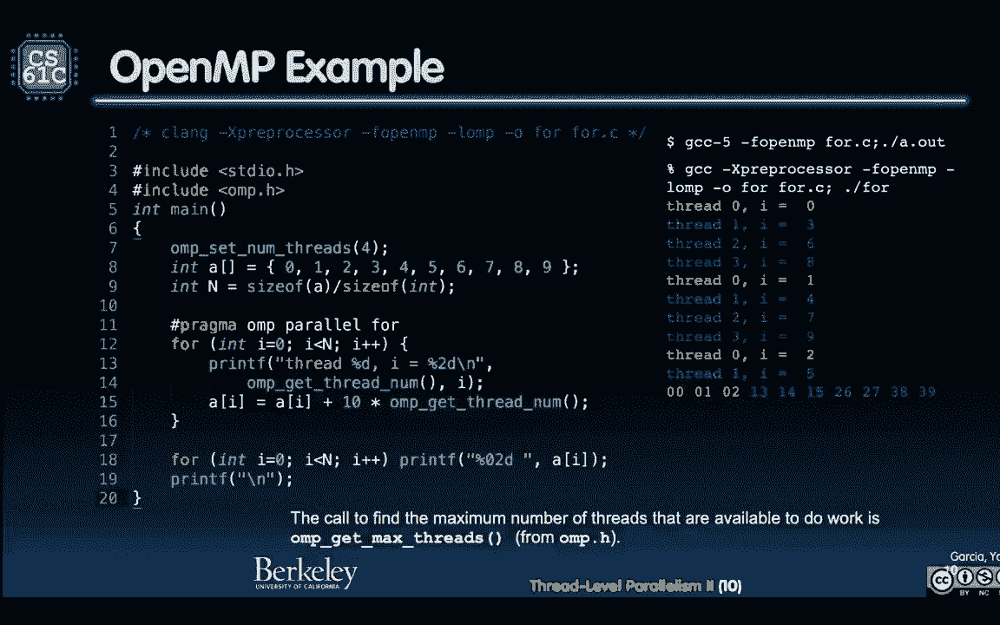
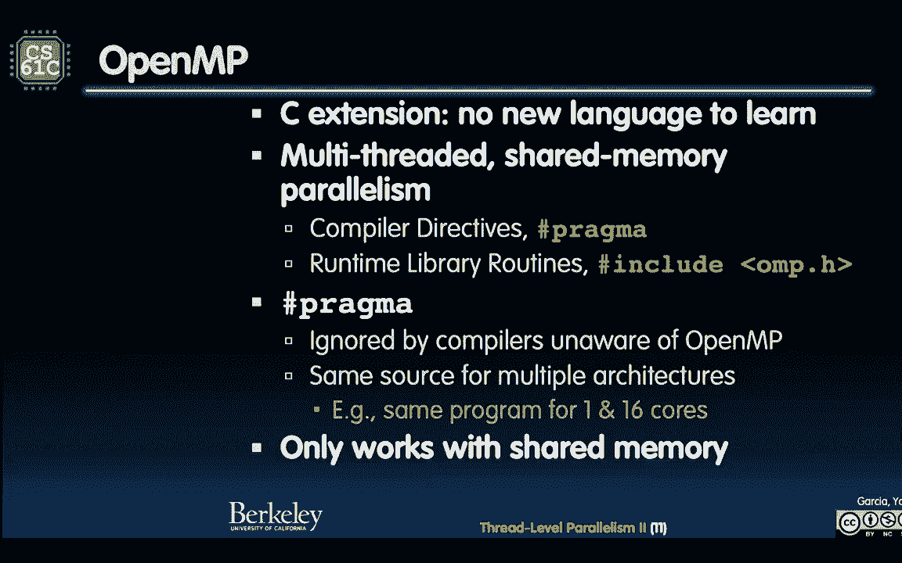
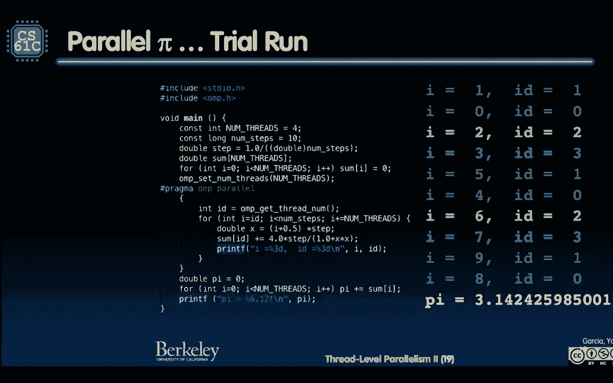
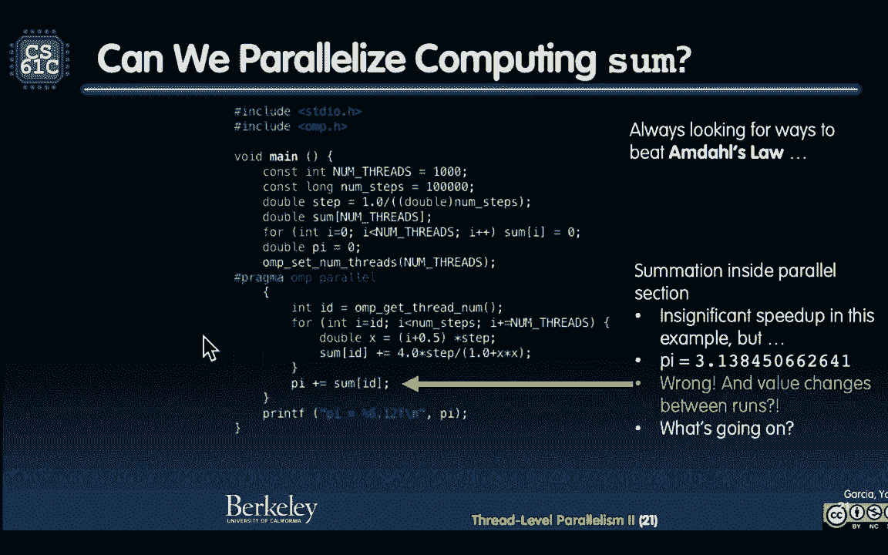

# CS 61C at UC Berkeley  - Fall 2022 - P40：Lecture 30： Parallelism II： OpenMP,Sharing lssues - 这样好__ - BV1s7421T7XR

我只是在猜想。

視覺上的遊戲玩家，是否能夠看到螢幕，如果你是視覺上的玩家，大部分遊戲都不能夠看到螢幕，這真的很可惜，所以我所說的，這是第一個，只有音量的電腦遊戲，這很難相信，我這麼說是因為，我玩過一些電動遊戲，在車上。

你可以玩電動遊戲，你在聊天的時候，我手上沒有開啟手機，但我在聊天的時候，有一點像是逃跑，你可以在Alexa上做一個逃跑房，這真的蠻好玩的，你可以去探索一下，免費的，你可以買一些額外的等級，所以我做的。

這算是一個遊戲吧，我走的步驟，我拿著繩子，然後把它們綁在車上，這是一些有趣的東西，但這不是一個遊戲遊戲，在手機遊戲的意義上，像是Twitch的反應遊戲，所以這在理論上，是，我寫在這裡，遊戲是一個。

在英國的慈善團體，Cost Charities，獲得了，Optical Retail Chain，Specsavers Inspire Award，由一隊，蘭卡斯特大學研究生團隊，創建了，世界第一。

只有音量的，電腦遊戲，我說的，也許是比較像Twitch的，反應的東西，但是，遊戲是，透過16層的洞穴，探索視覺障礙者，使用單純的聲音，來運行，遊戲是，沒有任何螢幕或聲音，當然，我玩的遊戲，是有聲音的。

你會聽到，是一個轉動的東西，這很酷，我想鼓勵更多的研究生，支持，視覺障礙者，和更多這樣的遊戲，所以很棒，慶祝，我看到的，是第一次，只有聲音，Twitch的，反應遊戲，讓我們來看看更多，我覺得這很愉快。

好東西，我想要強調，這件事，各位先生女士，歡迎來到，61C，Thread Level Parallelism Part 2，很高興見到你們。

如常，好，我們來開始聊聊。

Parallel Programming，語言，這些語言，支援，Parallel Programming，不同的層次，這可能是，控制很多機器，這可能是，控制機器的核心，不同層次的Parallelism。

看看這個，我在數嗎，是40，大約，40多，Parallel Programming，語言，看看你們的最愛語言，在這張清單上，很有趣，所以，我問你們，你們選哪個，好，我們開始，我們來看看表現。

你們有Project 4，Project 4是關於表現的，當然你們都知道C，我們想教你們，和一些圖書館一起教你們C，但是，我們來說說，只是玩玩，Lisa和我決定，開放任何語言，瘋狂地，任何語言你們想。

你們怎麼選，這很難，你們選擇了很多東西。

為什麼有這麼多，首先，我們要問，為什麼有陶瓷，陶瓷是一個方法，能夠明確地告訴你的組織，這是我想要你做的，這是我希望CMD的範圍，能夠有多廣，對，這是很棒的，CMD的功能很棒，記住。

CMD就是一個很廣的範圍，當你做這些，任何任何的工作，當然這是一項，非常激烈的研究，而，各位，研究進步，20年，去想要，怎麼翻譯，只用簡約C，簡約C，你不用做任何明確的工作，你不用做陶瓷，你只要說。

我想做一些東西，C是一個很快的語言，最後，C是一個錯誤的語言，C是關於，如何明確地翻譯，如何把這個部分，轉到這裡，你差不多想要，一個更高級的語言，像是SCHEME或PYTHON，說我想做這個。

複雜的複製碼碼，然後你來決定，怎麼做，所以C是一個，差在哪裡，差在哪裡，開始，因為它是，我知道，這個機器的運作，和現金的運作，和部分的運作，我想把這個部分，轉到這裡，然後做這個，你真的想要一個。

大型高級複製碼碼，讓我，在組件中，去更好地轉譯，所以，要翻譯C，或是像我說的，其他語言，到非常非常快的，對比式文字，這條問題，真的是太難了，他們已經在工作，20年了，很多很多的PhD的學生，都在找人。

在找一個新的語言，或者是一個，可以支援程式的人，如果你只用我們的方式，就更加有效地，翻譯成功，自動翻譯，intel其實也試過，他們有，我忘了這個東西的名字，他們有一個新的，如果你想要，更好地轉譯。

GPU，我之前也有說過，GPU有一個講座，我們正在討論，Apple，為他們的工程師，帶來一些東西，非常興奮，有一個GPU講座，給他們一個讚，GPU是一個，其他源頭，如果你可以，擁有一個，普通的GPU。

你只要寫一個程式，就能夠，你告訴它，你擁有的東西，我擁有這個GPU，或許我擁有，一個外置GPU，或許兩個，你可能有，其他網路的電腦，我會說，這是我擁有的，電腦程式，你去做最快的，最快的轉譯，你就能做到。

這是一個很好的方法。

總之，沒有一個明確的答案，他們有一個解決方案，我們來看看，社會如何回應，好，所以，選擇的數量，是一個表明，沒有一個宇宙性的解決方案，不是說，我們都同意，順便說，大部分人都同意，Python是一種方式。

教授初級數位數學，是最容易的語言，當然，空間有一個，相似的意義，這是有點奇怪，但是大部分人都意識到，Python是比其他東西，我們都用得更好，C++，和Java，還有其他語言，還有C，我的天啊。

人們都在用C。

幾年前，我們在南部的學校，也有在用C，作為他們的初級語言，啊，瘋的，我們從來沒有這樣做，所以，這是一個指標，但是還有一個指標，就是，他們有不同的任務，你會有科學數據，可能會在很多，流動點上，做一些工作。

他們在關心，這個多數的數字，網路伺服器，可能在處理，一些不同的問題，但是在另一個層面，我處理了一百萬的要求，因為我是CNN，我需要處理，每一個人，在找一些，新的地區新聞，在發生。

輸入輸出，說明，事情都在同時發生，所以這是另一個方式，我們沒有說過。

I/O，是關於數據的，你也知道，發生了什麼事，我們沒有說過，I/O的要求，在他們到來的時候，是不在你的控制之中，我們最接近，說到I/O的時候，就是在你，的集數機，記得嗎，第一天的SDS。

我們有一個集數機，你無法控制，X的進入，你記得那是一個X，你會有X0，加上X1，加上X2，你無法控制，X的進入，所以這是我們第一次，說到I，至少是一個問題，是一個無法同時發生的問題，特別的語言。

是用不同的工作，在621C，我們嘗試要強調C，我們嘗試要利用，我們到目前為止，所教你的，就是C語言，我們今天要教你，叫做OpenMP，這是一個圖書館的結構。

讓你得到，這些核心的資訊，來控制它，所以我們馬上開始，OpenMP，在這堂課之後，順便提醒，請把你的電腦打開，來跟著我來碼頭，如果你想要嘗試，好，Parallel loops，這是一個系統執行。

我們喜歡，只要在一顆子中，鋪一條線，0到99，看到那100個元素的，一顆子，這是一個系統執行，那在Parallel裡，發生什麼事，現在我有四個核心，我會做什麼，你想讓每個核心，隨機地，抓一些數字。

然後嘗試，做你身體裡，做的事，不，這樣就有道理，把它們分成小塊，像這裡，左邊的，如果你不能，看著文字，它說，i=0，-25，25<50，50<75，75<100，每個核心，抓一半，那些數字。

然後在那裡做事，這是一個，非常普遍的，標準，如果有，一些圖書館的支援，會非常好，對於這個非常普遍的東西，我想做一些東西，像一個地圖，我想把每個數字，切成一塊，或是一些東西。

這就是你做的，會非常好，如果有一些語言支援，對於這個，所以OpenMP，就像其他嘗試，做Parallel，像MPI，和其他東西，OpenMP說，我們來看看，能不能把，最少的一條文字改變。

所以你有你的文字，他們可以付錢，這是一種，手法，我能不能，把最少的一條文字改變，然後，他們只會說，這是一個叫做Pragma的東西，而Pragma，是被所有人都忽略了，除了有系統，有圖書館的設置。

還有多核心的設置，所以只有當你，包括OpenMP，它會看那條文字，就像隱藏的文字，只會使用，當你使用OpenMP，所以我包括了圖書館，OpenMP。h，所以我有一些，有關於一些方式的，我說方式。

不是說Java，一些功能，OpenMP提供的，我只需要做這個，然後自動就能做到，這太神奇了吧，一條文字，一條文字改變。

整個東西就能用了，我們來看看這個，這是一個例子，我會在現場，給你們做一個實際的示範，我們來看看，它在做什麼，我們來看看，我可能還要，放大一下，幸好Mac，讓我放大得比較容易，因為文字的寬度很小，好。

我們開始吧，我們開始，包括了StandardIO。h，包括了OpenMP。h，我把文字的數字，明確地設定為4，好，我有一條 Array，數字是0-9，n，是Array的大小，分別是int的大小，好。

然後我有一條線，PragmaOmpParallel4，我們來做一個結合吧，好，如果i是0-n，我會列出，文字的數字，i的價值，那條線，這是一個軟件的線，記得軟件的線，是如何被圖示到硬件的，誰知道。

但這是OS的一部分，在做這件事，所以，這是一個線的數字，我所列出的線的數字，是0-1-2-3，所以這樣比較好，這是它在運作的i的價值，好，那是，幸好i的價值，和a的價值是一樣的。

所以a(i)是和i(i)一樣的，0-9，0-10，然後我會做，我會，我會改變a(i)，我會改變a(i)的價值，是這裡的價值，變成以前的價值，加上，基本上我會將線的數字，塞進10的位置，你可以看到，它說。

把1的位置，0-9，保持一樣，然後再加10的位置，給線的數字，所以無論是什麼線的數字，你都會看到它在結果的系列裡，然後我會列出系列，列出系列，然後我會運作，然後會發生什麼事，這就是會發生的事。

我顏色上了這個，順便說，這是你運作的方式，這個顏色是在我們的檔案裡，你可以去看看這個檔案，我們會把連結放在網頁，我還會再次運作，但是我想給大家看這個，1的位置是數字，0-1-2-3-4-9。

10的位置是連結的數字，我顏色上了它們，所以橘色的都是連結0，這就變成0-1-2，因為如果是一個系列，你會想要1的核心，是0-1-2，2的核心是下一個區域，下一個顏色是藍色，這就變成3-4-5。

這很合理，你把它分成兩半，你得到1的系列。

你得到2的系列，這很合理，你得到3的系列，你得到4的系列，你想要它們都合理，為了現金的原因，所以綠色得到，因為這顯然不是多數的4，綠色得到2個，紫色得到2個，但是看一下這個系列，0-1-2-3。

0-1-2-3-0-1，所以它們是一種系列，但是現在，這只是一個，這只是一個運作，注意到，0的系列總是得到1-2，1的核心得到3-4-5，2的核心得到6-7。

3的核心得到8-9，現在我們來運作，看這多酷，我們現在直播運作，啪，線的系列的命令是什麼，3-2-1-0，有趣嗎，我們再運作一次，3-0-2-1，那這個系列的命令是否重要呢，不重要，因為它們都只是。

在這個系列的一部分上運作，但是你必須寫一份，可以任何一個系列運作的文件，這就是Ed Lee說的那部分，我有一張圖片，是關於管理這個不決心，這就是為什麼這麼難，這就是為什麼線階，啊哦，我們要走了嗎。

我們要走了嗎，這是手機，這是手機應用程式，我以為那是發射聲，謝謝，OK，不要慌張，我們還好，那是一個，Amber Alerts，在手機上，我們還好，但是確認你的手機，看看有沒有。

Silver Prius或其他東西，做錯了什麼，OK，我們開始，我們再一次，0-3-1，哦，看這，0-3-1，然後還有1-0要運作，這不酷嗎，這真是酷，看到這個行程，就把他們放在那裡，誰先完成，你就是。

你就是在線上，來吧，我們開始，我們開始，他們的命令，你必須寫一份，不可靠的命令。

這對你來說是新的，這對你來說是非常難的，這對你來說是新的，為什麼寫一份不可靠的命令，是非常難的，有什麼問題嗎，這是4。c，有什麼問題嗎，叫什麼名字，Leo，Leo，去吧，如果你有一個核心，我理解為什麼。

你需要多一條線，因為你需要多一個核心，沒錯，如果你有一個核心，你能在一個核心上運作嗎，我們學到了什麼，我們能在，老的Pentium 4建築上運作嗎，是的，你可以在一個核心上，運作不可靠的命令。

這比在那個核心上更快嗎，不，因為有時間，把線換掉，所以你其實，能在一個核心上運作得更快，比你自己把線插進去，如果我們有更多的核心。

我們會更快，這是目標，Selania，(…)。

OpenMP做了一個管理，把線插進去，你得說，你需要多少核心，你需要多少線，我已經說過了，有一個方法，可以要求最多的核心，我認為它說，看，OpenMP 得到最多的核心，你可以說。

OpenMP 設定的核心數量，是OpenMP 得到最多的核心，然後你最多的核心，好嗎，好，我們繼續，好。

所以OpenMP 總體上是什麼，它是一個C-Extension，沒有新語言，一條線，事實上，它幾乎是為了，你存在的對比文件，最少的改變，來做最佳的調整，你只需要在對比文件中，加一個for-loop。

你只需要在對比文件中加一個for-loop，你只需要在對比文件中加一條線，你只需要在對比文件中加一條線，你只需要在對比文件中加一條線，或者像這樣，它是多條線的，共用記憶體，我們說的共用記憶體模式。

這些系統都假設，這些線子，都有同一個記憶體空間，的擁有，組成方案是pragma，如果它不被用，就不存在了，記憶體的軟件，是include_omp。h，就像我剛才說的，無法在OpenMP上。

不存在於組成方案，同樣的源頭，有多個建築，這意味著，同樣的程式，有多個建築，這意味著，同樣的程式，有1個或16個核心，我猜我們看到，一個Intel的27個核心，或者28個核心，我相信，它只用共用記憶體。

所以這是主意，我們假設。

所有的核心，共用記憶體，這就用了，叫做fork-and-join的模式，這就是一個模式，叫做software pattern，你正在用很多，這其實是一個很大的動作，這其實是一個很大的動作，幾年前的。

pattern movement，它就像，你看，你用了很多軟件，你用了很多軟件，你用了很多軟件，好多人都在不同的应用上做同一件事，这些是在纳入和减少的，这是一个图案，这个扎在一起的是一个相对机计的图案。

就是说，你开始用这个产品选项，这个主机线，然后一直扎在一起，然后一直在线上，后来，只有并行然后尽希望在最好的情况下在同一时间完成，但是在最坏的情况下，其中一个完成在如此一段时间前，另一个就停止了。

没关系，然后它们合起来，我完成了，这些都完成了，这些都完成了，四组的结尾都完成了，现在我回到原来的设计图上，所以，主机线，所有的单线都是原来的设计图上的细节，所有的平行线都是原来的设计图上的细节，所以。

你可能会在设计图上再次扎一根，再做一个四组，分开，工作平行，然后再重新组合，我们还没有看到一句叫做"阿姆多斯法"的词，我们将在课36中看到，我们在课29中，我认为，所以，这将是七个课，我们将在此时讲。

但是，我将给你一个简单的提示，就是"阿姆多斯法"是说，只要你能够继续继续继续，每次你工作平行，你都不是能够做得那么顺利，当然，所有的细节，所有的核心都准备好，准备好撤离，但是，每次你工作平行。

只有一个它们能够在同一时间内运行，所以，你只要做到最多的平行，所以，在遇到平行细节时，它会进入一组平行细节，连续连续运行，最后，有一个"加"字说道这些，我还提到"阿姆多斯法"。

好的，所以我们有什么样的细节，我之前提到过，它们是软件细节，软件细节是当系统拿出一个软件细节，然后给它进行实际的核心运作，然后它就变成了一个软件细节，所以，你正在创造一个软件细节，它们在互联网上。

它们在互联网上，不是互联网，但是它们在这里，在空中飘落，然后它们只要被抓住，并被软件细节设置成为核心，OS会将要求的软件连续连续运行到可用的软件细节，希望它们都能连续连续运行。

所以OS的时间不会连续连续连续连续，这意味着，连续连续连续连续是一种时间分享，我说，你知道吗，我只有一台机器，一个核心，就像我之前提到的，如果我只有一台机器，一个核心，我能怎么运行，我还可以运行。

但是有些时间，有些时间，然后我会把它们分开，这很烦，也不太有效率，你只想它们完全连续连续运行，然后你完成了就完成了，所以你不需要为它们调节时间，好，但是这就是主意，其他设备，比如说机器。

它们在竞争硬件线，你在运行一台机器，它有一定数量的硬件线，有一定数量的核心，有一定数量的硬件线，它能运行，你还在运行其他东西，所以如果你要调节平行的速度，你应该调节到凌晨五点，调节到没有人在场。

确保你的机器基本上是静止的，如果你想要一台电脑，想要调节程序，就把其他东西都放弃，放弃Dropbox，放弃Google Drive在背后的沉浸，所有现在在消耗你的CPU的东西，全部放弃。

然后运行你的时机，运行你的平行计算机，看看它能做得怎么样，因为现实是，它是一个共享的资源，那些核心是一个共享的资源，它们在调节你的屏幕，你运行得快，你运行得快，你下载了一个文件在背后。

这些东西都在消耗至少一个核心，你希望那些核心能够，所有的核心能够做到你能做的最好，当你做你的测试。

做你的时机，看你能运行的速度，好了，我们来进一步，我们来实际的测试，我们想要做一件叫做，恶意的平行计算，恶意的平行问题，这些问题是如此的危险，他们不需要担心他们的邻居，每一件事都会是一个独立的。

这是完美的，就像那个数据，每一个人只是把它们拿走，然后加上一个十字数，在这里，我想能够计算π，这更好，因为我甚至不需要去记忆，甚至没有一个共享的资源，去记忆。

去看一个数据来做一些事，我只是要计算一些东西，然后计算π，所以我们开始吧，好了，那么这是一个圆圈的数据，一个阶段，一个阶段，一个阶段的范围是πr²。

让我们来做r1，r是1，中间的圆圈是什么。

那圆圈的数据是什么，x²+y²=1²，记得吗，有点不清楚，可能，好的，解决于y，所以你可以有一些阶段，所以解决于y，把y放在一边，所以x²+y²=1²，把x放在那里，就变成y²=1，1²=1，1-x²。

把两边的sqrt(r)，你会得到y=sqrt(1-x²)，看到了吗，现在，πr²，但是如果我说这个范围，这是整个圆圈的范围，但是如果我只是说，0-1的范围，我会看这个正面，那是1/4，1/4π。

我不想要π/4，我想要π，那就是把4的数字多了，所以4xsqrt(1-x²)，应该是π，所以我来解决，在数学上，我写了，把4xsqrt(1-x²)，从0到1，π，结果是π，第一个字，呼，问题是。

sqrt(1-x²)很烦，sqrt(1-x²)不是很快，sqrt(1-x²)可能要多一点，可能要多一点，我们不喜欢sqrt(1-x²)，还有一个方法，对于π的范围，就是4/(1+x²)。

这比sqrt(1-x²)更好，所以我们用这个方法，这是主意，在数学上，我们知道，4/(1+x²)dx，从0到1是π，你们可以花点时间，在数学上解决，现在，谁知道如何，把一个数字做成一个组合，某个数学家。

叫做伯纳尔，大家认识他吗，R，Riemann，伯纳尔·Riemann，他想到一个方法，让你们可以有一个小小的箱子，小小的图案，如果你们把图案做得小小的，它就会接近，这个绕过弯的结果，明白吗。

所以让我们做一下，让我们把π的图案加进去，来得到π，让我们试试，这是整个计算，我们可以加上图案，4/(1+x²)。

从0到1，让我们试试，让我们一起试试，嘟，这是一些文字，我会放大，让你们可以看，因为我知道，这很难，这是一个小字，让我们一起玩，开始，嘟，这些是π的数字，如果你们在意，这是一个不合理的数字。

所以这是一个无数的数字，3。1415926535，26535，这些数字会在我记录下，897 932 384 626 433等等，好，那么这个文字会做什么，数字的步骤，我们有10个步骤。

我们要做10个不同的角形，步骤是1/数字的步骤，这是步骤的大小，我们要按照这个数字步骤，数字是0，我们要，这应该是π，我们说数字是0，是什么，现在这是重要的事情，很多人，当他们笨笨地写这些东西时。

他们并没有意识到，你的四个步骤，应该是一个数字的数值，你不应该是一个四个步骤，在你在运行过程中，在你在运行过程中，的数字是一个浮在水面的数值，你们知道为什么吗，最好的练习，因为，在你浮在水面的数值下。

有时你可能会，有一个顶级的数值，在线条的情况下，你不想，当我改变了五到二十步骤，现在我有十，现在我有十一，现在我有二十一，现在我有四十，现在我有八十一，你不想要，你想要有一个明确的数值，你有多少步骤。

所以我会在，我的四个步骤，会在数字的数字上，但是我会用一些，浮在水面的数值，比如数字和步骤，在我的计算中，所以只有在你的最好的练习，当你在做数学计算，在科学计算中，让你的四个步骤，在数字上。

而不是在浮在水面的数值上，这是最好的练习，这是我自己的礼物，好，所以我会有，数量的步骤，乘以数量的步骤，和数量的箱子，它的价值是，它的价值是什么，x=i+1/2，乘以步骤，所以我会知道，我现在在哪里。

我现在在哪里，我现在在哪里，我现在在哪里，我现在在哪里，我现在在哪里，我现在在哪里，我现在在哪里，我现在在哪里，我现在在哪里，我现在在哪里，然后数字是，四乘以步骤，加上这个，这是4x，如果你想一下。

这是x，4加上，步骤大小，1/x^2，步骤大小，这个+是区域，这个+是区域，所以x是，我把这个数字放在x，步骤大小是，是我这个，这个步骤的大小，所以这个可以，让我们试试，我运行这个，我得到3。

142425985，不完美，但我只有10步，但还不错，还不错。

3。141，这是3。142，我可以运行这个。

我做了一个小的计划，每个数字的数据，是这个，我们做一个运行，我写了Pi，是Pi的实际价值，我写了，我写了这个价值，我印出这个，我说印出这个，在这个数据上，所以每次我们看到Pi的上半数，它就近得很。

注意到它在千数的位置上。

有点远，不错，好，所以这是Pi的运行，但是我们说的是，如何使用OpenMP，现在我们用一个简单的方法，来对比，嘣，Pi不太准确，只有10步。

让我们增加步数，并对比，嘣，好，我们还没有增加步数，还在10步，我只需要，说的是，Pragma Parallel 4，这就是我必须做的，好，Parallel 4，不错，你看到这个数字。

+=4*stepSize，但是有个问题，每一条线，注意一下，数字，开始在4轮外，你看到4轮的Parallel部分，数字在4轮外，但是我在4轮内增加，然后这个文件说，你知道吗，这会出现麻烦。

我们不能有多条线，全部都可以输入这个数字，这会给你麻烦，所以这个其实可以，给你同样的价值，可以看到。

它叫做Parallel Parallelized 1，这是Parallelized 1，让我们一起认识，这是一个过渡，让我们来做Parallelized 1，Parallelized 1。

同样的价值，对吧，看，同样的价值，但是，它没有更快，它没有更快，它并没有，它变成了一条软件线，因为它看到，数字在你的轮子里，数字开始在4轮外，它说我不能分开，这不可能，所以，这是问题，那我们怎么解决。

文件是会运行连接的。

所以我们来想一下，我们怎么想这个数字，每一个人都会，从各个地方，找出所有的数字，各个小角，但问题是，我怎么解决这个数字，他们都需要计算一个数字，如果每一个软件线，都能够记住，自己的数字，当当当。

这是关键的事情，这是目前的关键知识，目前我给你们展示的，图书馆，这是你第一个学习的事情，就是你需要每一个线，都记住自己的数字，好，现在你很酷，现在每一个人都能够，记住自己的数字，然后你需要想一下。

我怎么在最后，把所有的数字加在一起，好，所以数字数0和数1，在同一方向，这是两个软件线，然后数字，整体数，是这些小块的数字，0和1等等，在连接上，这是加在一起的，一般来说这是加在一起的，你加在一起。

它们都完成了，但是你，从虚拟的角度来看，你还是在加在一起，所有的数字，虽然虚拟的角度已经停止了，但是你还是要在，加在一起的方式里，让所有的数字都加在一起。

就这样，所以我们开始吧，我只需要做的，这里有什么不同，我只需要做的，现在我有，数字，而不是单单的数字，是一个软件，我会有多少个线，我会开始在四个线上，之后我会做很多个线，这会很酷，这是软件线。

我做了数字，这一个线，我总是说，你总是要用，四个线的准备格，在很少的情况下，最好是，如果你有一个四个线，有一个正确的指示，把它们放在同一个线上，现在这很明显，对所有，我的准备格，我把准备格给你。

这很明显，这基本上是一个，非常简单的方法，把所有的数字都降到0，这是一个非常清晰的方法，这是一个接受的训练，能够没有准备格，但在同一个线上，跟着四个线，我把数字的准备格，放在这里，而不是把四个准备格。

放在这里，我把它放在这里，我可以把它，放在上面，这是四个，其他的都是一样的，现在这个，这个变成了数字的ID，因为ID就是，收到的准备格数，这很漂亮，是0，1，2，3，我们说了四个准备格，它们的数字是0。

2，但准备格数少于0，所以是0，1，2，3，现在就完美了，所以这里有一个数字，它有一个空间，0，1，2，3，我把它们全部放到0，我告诉OMP系统，把它们放到4个准备格，就是4，然后每一个数字。

都得到这个准备格，这个准备格的贡献，好，现在我完成了，我说2π是0，然后这里是同样的，四个准备格，同样的一条四个准备格，但我只是加上所有的数字，而通常，这不会那么难，我意思是，这是很多的数学。

这是很多人，在这里做很多工作，这可能会很大，这只是我有多少条线，可能是1000，好，所以我必须付1000的费用，4个准备格，没关系，真的没关系，好，好，按照步数来看，可能会很大，步数可能会是1万。

所以我只是在测量很小的，但我只是在超过，1000条不同的线，没关系，我们来运行这个，你会看到，对了，这是很酷的，它显示了，我们现在还在印，对了，我们在印，i的数值和ID的数值，注意。

我还在看到一样的事情，就是，看这个ID，ID是，ID的数字是，线ID，i是这个运行的数值，所以，我们来看看，我们来看看，i是0，ID是0，i是1，然后线ID是，步数，i是ID，好，所以这个其实很酷。

一份文件，我想确保你能够理解，这让我感到很混乱，我第一次看到这个，我先确定一下，这很清楚，这很有趣，你开始，i是ID，然后i加=，无线，所以我们来一起做，所以这里是，我会在这个空间里测量，这是π。

我会在这个空间里测量0到1，我开始，我会在这里测量，i，开始，开始，i的数值，线ID的数值，你看，我看到了一个线数，所以，我们说它有四个线，这意味着，0是线数，ID的数字，0，那么它会在这里运行什么。

i+=num_thread，所以这意味着，我们来这里，ID的数字，所以这意味着，核0会做0。

接下来的会是+=num_thread，它会是0。

4，8，之前我说过，核一开始应该切成两半，它应该拥有整个图案，然后下一步核应该拥有这部分图案，和这部分图案，但是没有关系，我说一下，没有Pi的问题，它不需要核的图案，再有一个细分的区域。

我只是在参考这个空间，以某种方式，这些都很尴尬地相反，所以这很酷，说i=0=ID，所以，0 4 8 16等等，这些都会在同一颜色，注意到这里，i=0是红色，4=ID0，8=ID0，看到了吗，所以不说。

这整个区域是一台机器，一个核，这整个区域是另一个机器，它会说，不不不，我分开空间，用数据来分配，所以这些都是黄色的，这里是一个核，看到了吗，0 4 8，同样的ID，接下来的一颗，这颗是另一个颜色。

它会说，我要拿一颗，因为我开始，ID=数据的数据，所以这意味着现在看绿色，看绿色，绿色得到1 5 9，看到了吗，所以下一个机器得到5 9，这很有趣，17等等，这就是会发生的，这证明，如果我做到4。

我会有多少个ID，我有4个，我说过，数据是4，但是每个线都会拿，从它的数据开始，数据开始，以确保没有两个线，在加4，我们都在加4，不，我们不这样做，因为4的路径，这很聪明，所以，橘色的现在是2。

得到2 6 10等等，最后一个是，3，是鲜蓝色的，得到3 7等等，不酷吗，好的，所以，开始，这是一个对比测试，我得到3 4 1 4 2 4 2。

这还不错，但我只有10个步骤，所以现在我们开始，num步骤=10^6，这个scale up，我只需要改成num步骤，从10到1万，我明显地隐藏了列表，否则我会有1万个列表。

这就是我做的，开始，scale up。

我好兴奋，parallel，我认为它叫pi scale up，开始，而且，Pi是答案，好的，女士们先生们，耶，这不酷吗，你想看，调源的文件，到parallel，pi scale up。c。

你看，我刚才给你们展示的文件，是我做的所有工作，然后我打印f pi，是一个低调的pi，然后是一个上调的pi，是这个巨大的50个pi，看我能够多近，它打印的文件，我能够打印的近，证明。

它显然没有打印所有的数字，它没有能力，用双方来存储。

但是，我说过，当你运行时，基本上它们是相同的，只要双方能够存储，这太棒了，你可能会问，我们需要用1万个数字吗，我可以用，我可以用1万个数字，来达到这一场比赛，只有100万，你可以用这些数字来达到。

可能1万个数字是太多的，可能100万或1万个数字是太多的。

你可以用这些数字来达到，这不酷吗，好，让我暂停一下，让我问问问题，是的，这不太好玩吗，我只是想庆祝一下，这真的是一个很好玩的方式，我还有一个问题，我还有更多的问题要问，但没关系。

我可以用20分钟来回答这个问题，但我需要点时间，你再说一次，我可以说一次吗。

好的 开始，(问：如果你有8个硬件的硬件)，是的。

(问：如果你有8个硬件的硬件)，8个硬件的硬件，(问：如果你有8个硬件的硬件)，是的，(问：你最好的数字是如何设置的)，啊，这就是我这一部分的最好的问题，如果你知道你有8个不同的核心。

你最好的数字是如何设置的，你设置到8个，你有一个OS，OS需要运作，也许7个更好，就想着OS可以运作一个，我可以有7个自己的，所以你把整个世界分成7个不同的东西，但也许是你特别的，这只是一个运算。

但也许你有一个特殊的情况，一个核心的一个任务比另一个更难，因为某种方式，如果你分成7个同样的部分，6个都很开心，但是最后7个确实需要你通过，所以你只是在等待最慢的轮子，你见过一只小狗在前面走路。

然后有一个很慢的小狗，他就说：快点，我们要走，狗狗来了，所以你在等待最慢的轮子，所以可能有道理把问题分成更小的部分，让更慢的核心，无论是什么原因，可能是记忆的方式，可能是所有的现金都被减少了。

现金在那个区域里冷，谁知道是什么原因，这就是我喜欢让你来玩，让你来玩，并改变那些线条的数量，从我所有的数量，在核心上，甚至是邮轮的数量，现在是两个数量的数量，物理的数量，我们在上一堂课中谈到的。

到更大的数量，看看是什么，看看是否把所有的东西分成，分成多余的部分，如何把你所有的线条，分成多余的部分，就在想这个问题，所以我们要玩这个，这就是我希望你来玩，看看它会怎么样，看看你的表现会有什么变化。

这很有趣，然后去计算，甚至可以从4到8到16，现在你变得更大了，看看你的表现是什么，再次说，现在是5点，没有其他东西在跑，看看它会怎么样，这其实是一个很好的谈话，非常棒的问题，我看到另一个手。

这真的很棒，对，告诉我，你再说一次，好的，请继续，我会问你，我们说的，怎么分析所有的线条，那就是分析，分析的词吗，是的，你会说明，如何去到下一个线条，这是OPENMP，非常漂亮的地方，它会帮你。

这是线条的美丽之处，你只需要说，把前方的线条困扰了，它就会帮你，这正是你想要的，那如果，你说，我们想用最高的线条，然后，把最低的线条，如果我们不说，我们想用最低的线条，然后把最低的线条，把最低的线条。

把最低的线条，把最低的线条，把最低的线条，把最低的线条，把最低的线条，把最低的线条，把最低的线条，把最低的线条，把最低的线条，把最低的线条，把最低的线条，把最低的线条，把最低的线条，把最低的线条。

把最低的线条，把最低的线条，把最低的线条，把最低的线条，把最低的线条，把最低的线条，把最低的线条，把最低的线条，把最低的线条，把最低的线条，把最低的线条，把最低的线条，把最低的线条，把最低的线条。

把最低的线条，把最低的线条，把最低的线条，把最低的线条，把最低的线条，把最低的线条，把最低的线条，把最低的线条，把最低的线条，把最低的线条，把最低的线条，把最低的线条，把最低的线条，把最低的线条。

把最低的线条，把最低的线条，把最低的线条，把最低的线条，把最低的线条，把最低的线条，把最低的线条，把最低的线条，把最低的线条，把最低的线条，把最低的线条，把最低的线条，把最低的线条，把最低的线条。

把最低的线条，把最低的线条，把最低的线条，把最低的线条，把最低的线条，把最低的线条，把最低的线条，把最低的线条，把最低的线条，把最低的线条，把最低的线条，把最低的线条，把最低的线条，把最低的线条。

把最低的线条，把最低的线条，把最低的线条，把最低的线条，把最低的线条，把最低的线条，把最低的线条，把最低的线条，把最低的线条，把最低的线条，把最低的线条，把最低的线条，把最低的线条，把最低的线条。

把最低的线条，把最低的线条，把最低的线条，把最低的线条，把最低的线条，把最低的线条，把最低的线条，把最低的线条，把最低的线条，把最低的线条。

把最低的线条，把最低的线条，把最低的线条，把最低的线条，把最低的线条，把最低的线条，把最低的线条，把最低的线条，把最低的线条，把最低的线条，把最低的线条，把最低的线条，把最低的线条，把最低的线条。

把最低的线条，把最低的线条，把最低的线条，把最低的线条，把最低的线条，把最低的线条，把最低的线条，把最低的线条，把最低的线条，把最低的线条，把最低的线条，把最低的线条，把最低的线条，把最低的线条。

把最低的线条，把最低的线条，把最低的线条，把最低的线条，把最低的线条，把最低的线条，把最低的线条，把最低的线条，把最低的线条，把最低的线条，把最低的线条，把最低的线条，把最低的线条，把最低的线条。

把最低的线条，把最低的线条，把最低的线条，把最低的线条，把最低的线条，把最低的线条，把最低的线条，把最低的线条，把最低的线条，把最低的线条，把最低的线条，把最低的线条，把最低的线条，把最低的线条。

把最低的线条，把最低的线条，把最低的线条，把最低的线条。

把最低的线条，把最低的线条，把最低的线条，把最低的线条，把最低的线条，把最低的线条，把最低的线条，把最低的线条，把最低的线条，把最低的线条，把最低的线条，把最低的线条，把最低的线条，把最低的线条。

把最低的线条，把最低的线条，把最低的线条，把最低的线条，把最低的线条，把最低的线条，把最低的线条，等一下，怎么了？什么？但是。但是你。但是我们。为什么。为什么这么不决定呢？怎么可能呢？

我们没有证明不决定？为什么？因为有人在评论部门，"看起来这条路还不错"，"这条路的速度不大，只有1000个线"，但是。但是。但是Pi。变化了！在跑的过程中！

11，09，11。

这太疯狂了！这是怎么回事？大家看到了吗？这真的不好，这真的不好，之前Pi不正确，因为我们有步骤，这不错，但是我们只能改变数字，这太糟糕了，这就像是停火车一样，大家快点下火车，你做的什么都做错了。

我们只是想要更好，来吧，为什么。对，好，这就对了，我们在同一条线上，两条线，看起来像是在同一条Pi上，这是怎么回事？

让我们问个问题，先来这个，让我们简单化一下，但是。我喜欢你现在的想法，但是我不会给你答案，因为我想让你按下按钮，这就好玩了，来吧，记忆中的可能数值是什么？X1的位置，在这两条线上，通过两个同时的。

两条线，来吧，两条线，这怎么回事？首先，我让你知道，记忆中的数值，这是一个点，X1是一个点，*X1是100，好，所以是100，开始在100，一条线，会把数值转移到记忆中，*X2，转移到记忆中的*X2。

然后把它转回来，所以我希望，我希望这个，在线上做两次，做一次，从100到101，做两次，从101到102，这是我想要的，我不是说这是会发生的，这是我想要的，如果这个在线上运行，那是会发生的，好。

运行一次，100变成101，运行一次，101变成102，现在我说两台机器，要在同一时间运行，理论上，我希望是102，这是我想要的，让我们看看，为什么会发生什么，开始，投票，发邮件到22333。

或者到pollevy。com/ddg，然后投票，选择A-H，有时候是100，有时候是101，有时候是102，总是102吗，总是101吗，总是100吗，是哪个类型的，好，我看到大部分的人投票是F。

答案是F，请问为什么不是100，100是错的，为什么是100，你再说一次，对不起，(问题)，看你按照什么位置做这三个东西，你把这三个东西放在一起，有时候有人会拿到100或101，然后写这些东西。

所以有人会加1，为什么，我明白，有人可以告诉我为什么是别人，为什么是102，我希望是102，给我一个预订，我现在在做什么，传送，加载和购买，给我一个预订，这是传送，加载和购买，为核心1，线1，传送。

加载和购买，为线2，给我一个预订，给你102，有人告诉我，我怎么把手指放在这里，给我102，有人没有把手伸出来，我放在后面，后面通常很安静，给我一点爱，在后面，有人，这三个东西的订单是什么，记住了。

传送，加载和购买，为102，这是完美的订单，是个系列订单，对，1完整，1个线上来，早上醒来，(鸣)，传送100，做101，购买101，然后这一个醒来，传送101，做102，购买102，漂亮。

102就在这里，我得到的订单是什么，就在这里，好，对，像这样，或者任何地方，这些订单都没有完整，其实任何地方，这些订单都还在进行，而这些订单，没有完整的订单，任何时候，这些订单，都在这些订单下面。

这是关键，只要这些订单，在后面，这些订单，都可以在这里，或者在那里，任何地方，所以主意是，在理论上，他们两个都在传送100，他们都认为，他们在传送这些订单，并且在连接，然后再回到，对的101，但事实上。

他们两个都在串通101，而没有人能够，加上第二个订单，所以没有人能够做102，Adam，所以没有人能够，开始向前连接，在最开始的时候，在计划之前，在计划前，把价格给定下来，所以它不会出现问题，好有趣。

你连接这个，这是一个有趣的问题，问题是，有没有方法，向前连接，所以他们能够得到，对的价格，不仅是向前连接，这是一个有趣的解决方案，但你必须，基本上说，这必须在，在另一个订单之前完成，这就是他说的。

目前没有办法，去做这件事，我会告诉你，如何做到，但没有方法，去做到，所以，我们会给你，教你如何修改，但目前。

这并没有办法，所以这就是问题，问题是，我们在进行一个竞争，我给你说一句新的话，叫做竞争，他们两个在竞争，为了更新，而他们正好，遇到麻烦，他们两个，都失去了平衡，一个人，必须完全完成，才能做到。

这叫做竞争状况，所以我们看到，写下来，竞争状况，这就是现在发生的，这是问题，竞争状况，给你一个不决定性，因为谁，看谁赢得竞争，是给你答案的，那天，明天，下次我运行，是另一个人赢得竞争，所以发生的是。

看看，这里发生了什么，pi+=，是和说的一样，pi=pi+someid，所以发生的是，如果这总是这样，这些，这些都运行，我们叫做自动化，意味着它抓住价值，然后保存价值，不过是不够平衡，那你就没问题了。

但是发生的是，一个人，读了pi，然后在那个，那个组件，那个线，完成pi+someid的，右侧，看，pi+someid，发生的是，有人，进去，然后读了pi，在那个组件完成之前，所以我们看到的是，现实是。

它应该，更大，它应该更大，所有的资金。

应该更大，数据其实，并不成功，因为它们互相争吵，正是我们所见到的一样东西。

所以我们如何认可这个，你有一个麦克风，问题是，限制了共享资源的资源，给一个演员，只有一个人，可以一次次地剪辑文件，否则你又会遇到同样的问题，人们拿着麦克风，在同时试图说话，所以解决方法就是转过来。

一个人拿着麦克风，一步一步地说话，同时是一个好练习的方式，对于教室等等，所以这个概念叫做锁，可以利用锁来控制，共享资源的资源，你只需要一个锁，一个人拿着锁，你拿着锁，你才能拥有麦克风。

所以，int lock，0是开锁，1是锁，所以我们开始，我们来谈谈锁，看，锁不等于0，这意味着，等待锁释放，锁不等于0，1是锁，0是开锁，所以这里有个图线，它就在这里，直到锁变成0，当它完成时。

你设定锁，锁是1，然后你能够利用共享资源，然后你把锁释放，在最后，所以这里有个小图线，在等待锁变成0，当它完成时，它就会掉下来。

然后你设定锁，然后你把锁释放，在最后，所以这里发生了什么，准备，看这个，这个说，锁是0，它们两个图线，在等待锁的过程中，在等待锁，看这个，我会笑，看这个，好的，这个说，好，锁是0，到这里。

但是它还没有设定锁，以为它拥有，锁意味着你拥有，这个在等待，它看到锁是0，因为计划刚开始，所以这个，但是它设定锁之前，有些拖延，结果发生了什么，谁在笑，左边的说，我拥有锁，我拥有共享资源，右边的说。

我拥有锁，我拥有共享资源，它们两个在一起，在说同一种数据，这是，没有人理解，所以这就有点好笑，然后它们两个，设定锁，好的，我做好了，我们都很好，我们都以为，我们拥有锁，你看到吗，我试图修改，它不修改。

这是一种竞争状况，为了，锁，这还是一种竞争状况，这不，这不可行。

我喜欢，这是一种竞争状况，两个链接认为，它们设定锁，这个问题没有解决方案，甚至没有在工程师层层，我们需要介绍新的指示。

来修改它，这不酷吗，所以，结论，时间到，1100，OpenMP是一个简单的，C的平行延伸，我们看到平行4，是一个线，你需要修改，C是小的，C是学习的，不是很高级，容易出现麻烦，所以注意，竞争状况。

结果设定，不够好，你不想要竞争状况，我们会谈到，如何使用，安装层面控制，来做这件事，幸好有C层面控制，安装层面控制，我们需要安装层面控制，来修改它，我们下次再见，谢谢，呜，好，(最後。

我也是差一點就忘了關掉燈)。

