# CS 61C at UC Berkeley  - Fall 2022 - P41：Lecture 31： Parallelism III： Cache Conherence, Performance - 这样好__ - BV1s7421T7XR

在前面的方式，这次让我们一起干吧，欢迎大家来到61 C，让我们像往常一样从计算新闻开始，我发现了一张很有趣的纸条，你知道量子计算将彻底改变我们对计算机科学的看法，当它最终上线时，每个人都可以使用。

事实证明，你可以通过亚马逊访问量子计算，我不知道我最近才学会的，这是一个新闻，有一个新的计算公司叫Q时代，它加入了亚马逊的云计算，让你可以访问，这是个令人兴奋的新消息，另一个量子计算技术的提供者。

我们试着坐在前面，我们今天试着坐在前面，如果你们都能到前面来或者到前面来，你想坐在这个区的前面，看看我们能不能让每个人都看到这两个部分，如果你需要一些空间，前面都有缝隙，但每个人都尽量到前面来，好啦。

谢谢你，所以在这里，亚历山大基斯林说，量子计算的冒险之一是你可以对量子比特层进行编程，所以你不必把它们都用完，也就是说你不必拥有整台电脑，当你得到你的时间，当亚马逊，谁负责排队这些请求，说好的。

你该去拿电脑了，你不必用整个东西，我想在以前的化身中，你必须保存整个东西，现在你可以说，让我们用这两个人和那四个人比赛，也许这个8对那个16个量子比特，一定是两个四个六个量子比特是件大事，他们在八肘内。

几年前的四个量子比特，所以他们到了两个六的事实是一件非常令人兴奋的事情，您可以构建不同原子的不同迷你集群来并行计算，关于并行性的进一步讲座，所以我想考虑使用量子计算是非常令人兴奋的。

如果你不知道量子计算的基础知识，所有的电脑，所有的计算都是并行的，他们一起奔跑，所以不是一种线性算法，让我们搜索密码，让我们尝试进行密码破解，所以我们要有，哎呦，顺便说一句，这些量子比特处于叠加状态。

他们不是零就是一，他们在中间的某个地方，这真的是量子的一个基本问题，嗯，信息是它的那种在中间，只有当你问，它缓存什么对齐到零一，但它处于叠加状态，直到你问它值多少钱，这真是令人着迷的东西。

其中一个很好而不是喜欢，让我们搜索那个不起作用的密码，那是密码，现在的情况是，如果你有一些量子比特，它在同时搜索他们所有人，所以如果我有一个3位的密码，我有3个量子比特，它实际上在，它们同时的叠加。

真的很迷人，那东西是怎么工作的，有课程，我想我只是在这方面做了一些建议，量子计算的高级课程，由我们的同事乌梅什·瓦齐拉尼教授，因此，我建议任何有兴趣了解更多量子计算的人，好啦，让我们开始吧。

女士们先生们，本单元最后一课，此序列线程级并行性，第三部分，很高兴见到你们很高兴看到大家坐在前面，有更多的能量真是太令人兴奋了。

希望一切顺利，上次我们离开我们的英雄，我们对这种竞赛条件的问题感到震惊，如果你还记得，我们试着把这把锁，你抓住锁，说如果我有锁，我可以访问读写变量，但问题是即使是抢锁也有竞争条件。

这就是我们上次遇到的问题。

所以说，我们全面回顾，你到前面来的大照片，顺便说一下，如果你进来，我们会试着把每个人都派到前面去，如果你能做到，那就太好了，MP是C的简单并行扩展，所以这是一个很大的十英里回顾，你们都知道，看。

这真的很容易，你加一行，平行四，整个for循环是并行的，瘫痪在所有这些软件线程上。

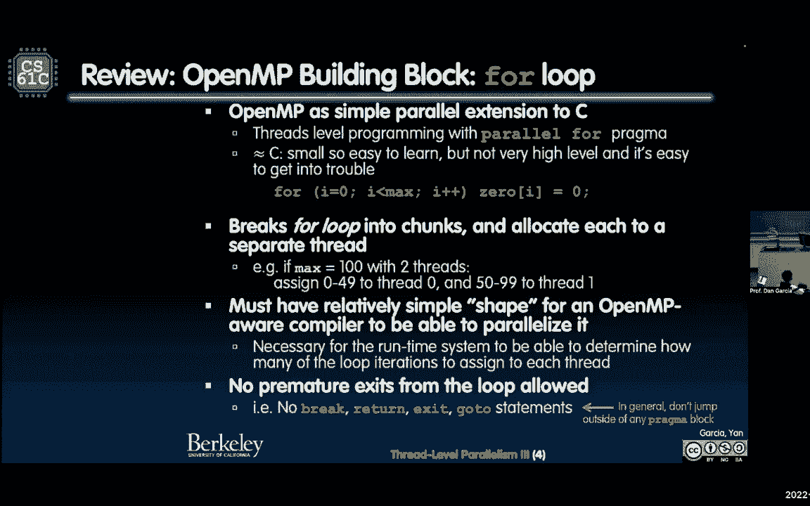

最终映射到硬件线程，真正美丽的务实是如何做到的，被不知道是什么的编译器忽略了，P是你在块中打破for循环，您将每个线程分配给一个单独的线程，所以如果最大值是100，如果你在浏览一个数组。

你会漏掉一些东西，我不知道，这是个好问题，这是个好问题，Python或其他语言自动为您做这件事吗，这取决于语言，Python中有一种方法可以实际请求，这叫做多处理，我想这叫做多处理模块。

所以你可以明确地做一些，但这样做，语言特征取决于你得到的，将取决于，取决于您选择的语言，所以是的，是这样的，我们只是在这个世界上生活和观察，但是请一定要探索Python中的多处理模块，我玩了一会儿。

挺有意思的，所以四圈分开，如果您有一个有一百个线程但有两个线程的数组，然后希望其中一个核心得到零到五十的分配，第二个是零到四十九，第二个是五十到九十九，原因是你想让每个核心，利用那个缓存。

受益权，你希望能够有时间位置，横扫的空间局部性，你不想让他们随机出现，抓住阵列的一部分，给一个数组的连续部分，那东西可以从，如果您有块大小，它将受益于这个块的大小，你的左一或左二缓存。

这就是现在一切都走到一起的地方，嗯，对于o p感知编译器，您必须具有相对简单的形状，做点聪明的事，好啦，所以对运行时来说是必要的，为了能够确定有多少循环迭代，分配给每个线程，这也是真的，你不能做那种。

我们称之为，呃，我们叫它臭C，就像非常丑陋的C，有去，断，回，你不知道怎么跳出来，你得一直这样，做你的工作，然后让我们出去，在平行区域之外做这件事，在平行区，只要用你的for循环非常干净，然后这样做。

总的来说还好，不要跳出任何语用块，他们基本上是这么说的，好啦，好啦，所以我们讨论了一场数据竞赛，我们有两个核心试图更新一个变量，就像圆周率的计算，每个人都想把他们的计算。

他们计算曲线下面积对圆周率的贡献。

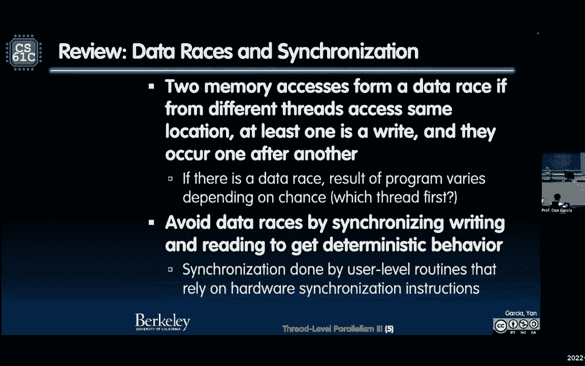

你想说，好啦，这是个问题，因为你确实想说圆周率加等于我的贡献，但是圆周率加等于圆周率加一个值的问题。

所以你在读旧的值，你在给它增加新的价值，然后你把它放回去，问题是，两个人可以抢旧的价值，将他们的作品添加到旧的价值中，两者都覆盖了它，你将失去其中的一笔捐款，这就是我们上次在比赛条件下看到的。

我们不喜欢那样，所以我们必须通过同步这些来避免数据库，好啦，我们想要有确定性的行为，所以我们看到我们有这些锁，但即使是抢锁也有竞争条件。

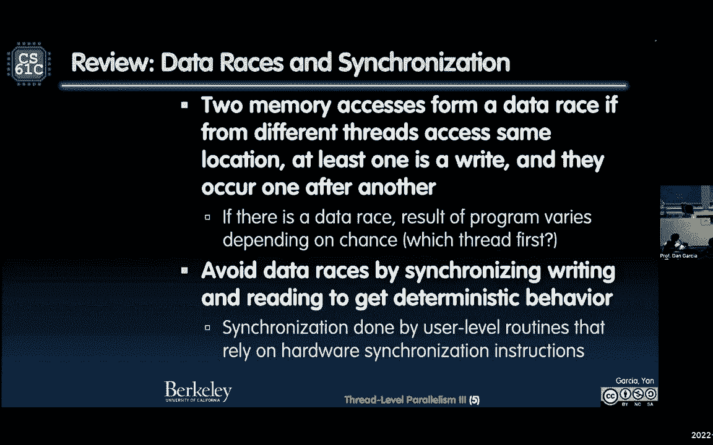

所以我们该怎么做，所以我的想法是，这是一个关于道路的大想法，也不管用，除非你的硬件里有这个，任何软件级的解决方案在海平面上都不起作用--在风险下也不起作用，五级不管用，你必须添加一条新的指令。

让你做一些叫做原子读取的事情，写它说我要在内存中做一些操作，没有人能阻止这一点，这是一个非常有力的想法，除非你有，否则你不能，我再说一遍，你不能解决争用条件，我们会解决这个问题，用这个新想法看看。

这是做不到的，是的，是的，你在网上也找不到，两条路都行不通好吧，所以我们将能够在一条指令中读写，在读和右之间不允许有其他轴，现在的关键是记住分享的东西，记住每个核心都有自己的寄存器集，他们自己的电脑。

希望你知道这一点，每个人可能都有自己的L，虽然这取决于您的特定架构，但每个人可能都有自己的，其中一个可能有他们自己的两个，他们可能有自己的L三个，但可能是共用的，因为L3通常都很大，好啦。

那么你能做什么，他们是如何交流的，我怎么做，他们怎么能有一个核心，与另一个核心对话，嗯，唯一有保证的共同点就是记忆，这是一个共享内存多处理器系统，所以记忆必须是我们交流的方式，我在这边，你在那边。

两个不同的核心，记忆是我们交流的唯一方式，这就是这个多处理的结束，共享内存，多处理是我们交流的方式，下面是典型的做法，我们将有所谓的原子，寄存器与内存的交换，这是价值，我要的东西是我的登记簿。

我当地的登记簿，我是核心，我的本地价值，我要把这个记在心里，我想和它进行原子交换，其他人都不能夹在中间，这里有一个值，我要把这个值，这样这个值就会进入内存，记忆中的东西在我的另一只手里，好啦，准备好了。

掉期，这就是我所拥有的，原子上，谁也阻止不了，两个指令会有读和写的链接，所以我要换一把锁，然后交换给锁，我们马上就会看到的，好啦。

所以风险五在两个方面都有差异，我们将重点讨论前者，只是交换，就这样吧，所以我们开始了。

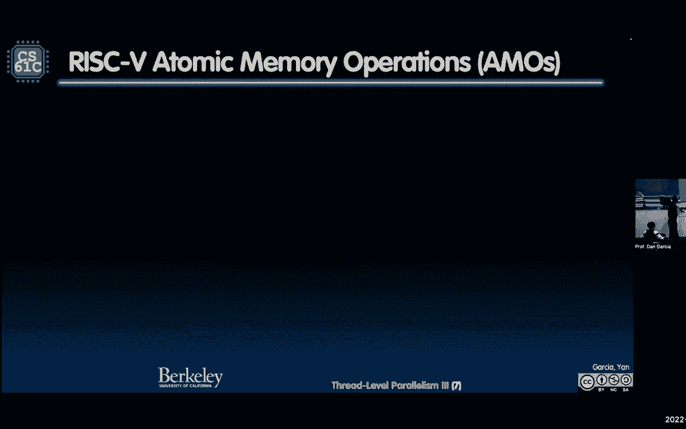

这又被称为amo原子内存操作，新指令，你不能解决争用条件，在其他系统中没有同等的弹药，他们称之为测试和设置，在这里我们称之为弹药，好啦，它们原子地对内存中的操作数执行操作，并将目标注册设置为原始内存值。

对呀，所以我想做点什么来回忆，我不是想换，我是说，取这个值，把它放在那里，像个商店，把它放在那里，或者这个主意怎么样，我想在寄存器中获取这个值，并将其添加到内存中，添加到内存中意味着什么。

意思是记忆等于记忆，再加上这个记住加等于，我们之前看到它有麻烦了，我们做不到，加等于内存，等于内存，再加上这个很酷，你可以不被打扰地做这件事，因为它是原子的，不能被打断，你还得到了好处。

在这只左手里是另一只，较早的值，所以如果我出于某种原因需要早期值，我可以这样做，否则我会把它设为零，谁在乎呢，但如果我关心早期的值，不管是什么原因，这些警察就是干这个的，所以我想做一个例子。

我要在这里给你看，我可以做所有这些事情，添加或交换XOR最大最小值和所有这些东西，这里有一个例子，它看起来像什么，然后给大家看一下这个，这是一则广告，所以今天和我在一起，这是我的右手，这是一个临时值。

我想加到圆周率上，圆周率在记忆中，好啦，圆周率在记忆中，我想把这个贡献添加到圆周率中，所以我叫弹药加，它的意思是，顺便说一句，这只左手得到了旧的值，所以不管圆周率是多少，一二三走，刚刚发生的事。

此贡献被添加到内存位置，所以内存是正的等于这个值，我的左手是什么？什么事？是以前的东西，如果我需要，让我们看看这个，我们到这边来，所以这是代码，弹药，加德会得到目的地，会得到旧的值。

RS 1是指向内存的指针，我有，我有一个观点，我想要哪一部分记忆，R2是我想要的值，所以让我来做一个伪代码，T获取内存的旧值，记忆那是，它等于，r 1的x的m，R 1是指针，查一下登记簿。

看看那个地址是什么，RS，R 1是R 1是寄存器保存指针的五位，在我的注册档案里找三个，指针的两位，进入记忆，获取该值，叫它T，把它储存在我左手中rd指向so rd的五个比特中，现在得到它在那里的旧值。

现在我做我的权利，这意味着r 1的x的m得到t的旧值，r 2的x，这就是我想添加的其他三两部分，所以第二部分包含了我对该地区的贡献，我想把这个添加到那个内存位置，由r one rd指向的包含旧值。

准备好了我们来查一下记忆位置，此值，把我的贡献加进去，谁也不能乱来，如果我在乎，这是在你做我的贡献之前曾经存在的旧价值，这是我在这里描述的任何操作，添加或者我正在做这个，使用此指针在此值上，我用左手。

旧的价值是什么，再一次，如果我不在乎，我把它设为X零，没人在乎它，我只是想了解更多关于释放的细节，获取锁并释放锁，我马上就给你看，但是这两个部分的细节，这些命令唱诗班和释放26和25。

你可以阅读更多关于它的信息，我没有花时间听讲座，这是相当复杂的，但你可以读到更多关于获得释放的信息，获得命令的条件，我来教你怎么用它来交换。

所以我可以补充一点，那很好，但实际上更有用的是如何首先实现锁，因为一旦我有了一把锁，我可以做任何事，所以让我展示我做一个锁，没有添加东西的想法，只是交换，记住，如果我不想要任何东西。

除了把这个值放在那里，再抢旧值，只是交换准备好了，把我的新值放在那里，抓住旧的，这就是我要怎么做我的锁，让我们给你看这个，好啦，所以假设锁在内存中，存储在寄存器中的零，锁在那里，因为a是指向内存的指针。

我把锁锁在那里，如果是一把锁，锁就被设置好了，这意味着锁是别人的，如果是零，锁就开了，所以如果它是零，没有人有它好吧，这是一段常见的记忆，你所有的核心，所有人都想抓住那段记忆，把你的贡献加进去。

如果零指向的值为零，那现在就没人和那段记忆说话了，它可以被抓住，这是一个，然后有人在，所以你不能这么做。

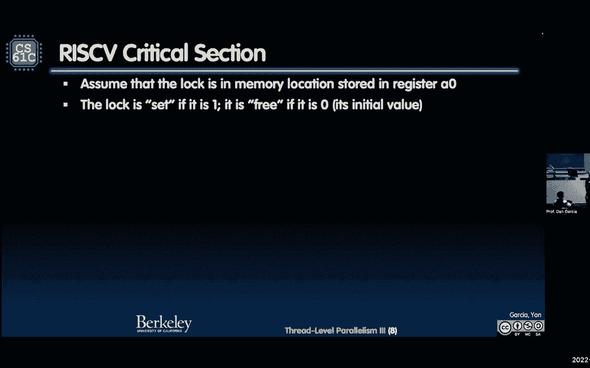

所以如果你想给它写信，对不起，这是一个，一定有什么东西被利用了。

就像有一盏灯亮着，就像一个，像个录音棚，灯亮着，当灯光亮起，有人在用它，作为一个类比是有道理的，当灯灭了，任何人都可以使用演播室，就是这个意思，好啦，所以零点指向光在记忆中的位置，所以让我们一起做吧。

我要从零到一，我基本上说T 0，我的暂时价值是1，我想要，这就是价值之一，我想把锁放在哪里，所以一个是价值，我要储存在，就像一个是你如何打开它，我要打开我的一个，这是关键台词，AMO交换T零T一A零。

好啦，那是什么意思，一个零，锁在内存中的位置，T零是我想储存在那里的，我想把灯打开，这是我的灯，我要把它打开，但我要叫交换，那么一个人还没有准备好，去交换，我试着在那里放一个，记住，所以记住。

左手永远是旧的价值，它是什么，如果是广告，它是在广告之前，现在我要拿我的一个，我想把这个塞进去，这是一个，一个是现在的旧价值，我要检查什么，我的下一句台词是什么，我想看看以前有没有人拿过。

那么我在检查什么，这个是1还是0，我想要什么，如果我想得到它，我希望它是零，我希望它是零，如果是一个，我该怎么办，继续尝试这个权利，继续尝试，一直试图交换它，直到它为零，直到t 1为零，力矩1为零。

那意味着我拿到了，这有道理吗，这意味着它是零，我得到了，所以看这里，我们走下一条线分支不等于零，一个人回去，继续尝试得到这个，所以我会继续尝试，这是我的一个，代表我对光的控制，你知道的，录音棚，锁。

是录音棚的锁，那怎么样，是啊，是啊，是我做的，好准备好了，把枪放下，好啦，我们会看的，是零吗，如果是零，会发生什么，这条线是干什么用的？如果是零，这说明分支不等于零，所以当它是一个，我一直在尝试。

参见分支不等于零，当它是一个的时候分支，回去，继续尝试，当它为零时会发生什么，它掉下来了，我们慢慢走，当它为零时，这意味着我得到了它，下一行是线程有锁，所以那个小小的旋转等待，继续努力把一个塞进去。

直到它最终归零，这意味着它是零，我拿到了，事实上它是原子的，意味着没有人可以插手，所以所有其他核心也在努力做到这一点，但只有一个会成功，不会有种族条件，这种原子记忆意味着不会有竞争条件，有趣的是。

点aq表示我正处于获取阶段，我在32位指令上设置了获取位，我得到了这个东西，这是一种在最低层次上正确排序的方法，所以现在我有锁现在在代码下一个，它是我的，没有人没有种族条件，我锁住了。

我拥有记忆的控制权，什么记忆，不管我在做什么记忆，我很幸运，不管锁代表什么，我拿到了，现在这个块可能是零，因为这就是我要说的，零可能是这个东西，但关键是，那是我的锁交换释放，当我完成后也是这样。

当我做完，我如何释放锁，顺便说一句，我真的得，如果你不打开锁，就像有内存泄漏，就像那样真的不酷，使用零号房间，把灯打开，我在用，然后开着灯离开，你离开了房子，灯亮着，但是房间里没有人。

你做的最后一件事就把它留在上面是没有任何意义的，你要做什么，你最好把灯关掉，所以你做的最后一件事就是AML交换，你告诉它释放x 0 a 0，零是锁所在的地方，X零表示商店。

这里的一个零和x零表示我不在乎它曾经是什么，顺便说一句，我就知道是一个，我知道它是一个，因为它是一个，因为我拥有它，我把它寄给了一个，但我在乎它曾经是一个，我根本不用。

所以我说X零是那种在他们之后得到它的RD，这有道理吗，所以你基本上是旋转等待，试图阻止他的，我的一种是当它是一个的时候，我一直得到一个，这意味着别人有它是灯亮着是的，灯还亮着是的，灯还亮着，哎呦。

灯关了，这意味着它是我的，我被这个密码弄糊涂了，那个核心是唯一一个拥有这个空间的人，那不是很酷吗，目的是避免竞争条件，问题是目的是什么，避免比赛条件的问题必须是一种方法，我认为是原子的低水平。

为了防止我们在演讲的最后一部分看到的，我们有三十分钟的时间，两个核心需要做同样的事情，但是因为读和写之间有一个延迟，记住，像读这个值，我把它放回去，那是竞赛条件，让我们做一个，我们来做一把锁。

在那里我有一个1和0，即使我得了1分和0分，旧值是多少，你看它，把我的，我会有一个种族条件，只有当你有这个原子允许，在那里没有人能进入阅读和交换的中间，它被称为测试，并设置了类似的想法，因为没人能插手。

我可以保证这把锁能用，这确实有效，这就是一切的运作方式，谢天谢地，但现在我们没有非决定论，这个想法是，你知道的，我一直在运行这个圆周率贡献程序，我们有所有的比赛条件，所以价值在变化。

就像我一直失去捐款一样，因为人们互相抨击对方的贡献。

太疯狂了，这种锁的想法是为了保证一个核心拥有一个串行。

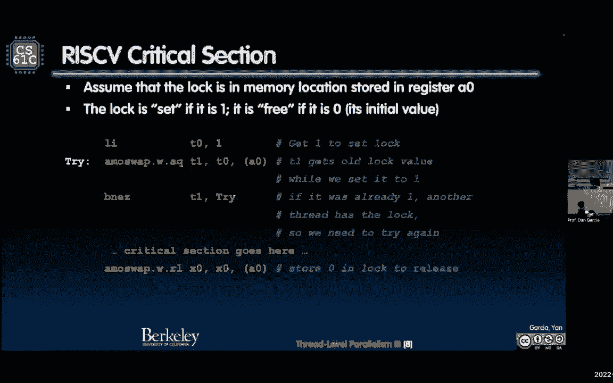

记忆的一部分，就是这个意思，只有一个人能同时做这件事，好问题，是呀，问题是它能跑得更快吗，它跑不快了，它实际上跑得更慢，因为在那里没有其他人可以做任何事，就像它说的，通常你们都只是并行工作，这不是不。

没有人在这个特定的事情，任何人都不能打断这件事。

所以它实际上运行得有点慢，这不是更快，这是中断的同步，你知道的，当锁为零时，不是零，将锁设置为1，做关键部分，然后释放日志零，这是我们尝试过的旧版本，啊，让我们在软件中做一个变量，毛茸茸的，毛茸茸的。

我们在C中，让我们把这个想法相同的块，但又一次，那是行不通的，我们看到它们为什么工作了因为它们都在检查你们俩为什么锁会在这里，为什么因为两个人都抓住了它，他们都认为他们抓住了它，他们不会都抓住它。

你不能让两个人认为他们有，这就是问题所在，种族意味着，他们都认为自己控制了共享资源，没有任何意义，他们都有权进入，他们会互相抨击对方的价值观，说不通啊，所以那不起作用，解决办法是这样的，这是一段代码。

你看到之前的负载指数T 0 1做我的交换，草不等于尝试和就在它下面，现在锁上了，我拿到了，这个电话在阿莫级别的风险五，与阿莫版，现在保证我控制了那个关键部分，现在只有一个核心可以拥有关键部分。

临界意味着只有一个人可以同时得到它，然后我用释放器解锁了它，我存储一个零，现在我又把灯关掉了，这盏灯是我们用来处理这个关键部分的，如果我有我的代码的某些部分，说只有一个人可以在该代码，不管那碰巧是什么。

也许它在读取数组中的十个值，不管是什么，但只有一个人在一个核心，一个可以做到这一点的硬件，你就是这样设置的，这就是你释放它的方式，检查灯光，当你抓住它的时候，这是你的，做你需要做的一切。

我保证只有一个核心可以运行，曾经很酷，原来如此，这是个好主意，我们还有很多要谈的，但这只是个开始，我们能这样做很好，但关键是你要面对的一个事实，除非我们增加弹药操作的风险，五个调色板。

我们解决不了这个问题，那是个好主意，所以我们确实加了，我们确实解决了，我们都很高兴，今晚我们可以睡个好觉。

那么这看起来像什么，我可以看到，让我们看看海平面，现在呢，我们离开海平面了，开始了，我放大，因为它有点小，我们还没弄清楚，把房间里的灯关掉。

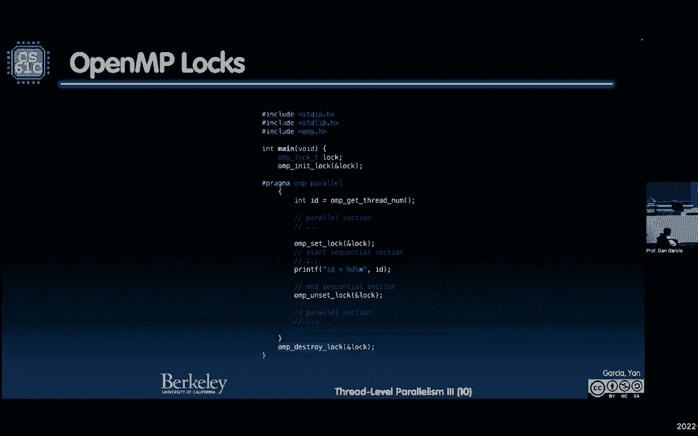

所以看看这个。

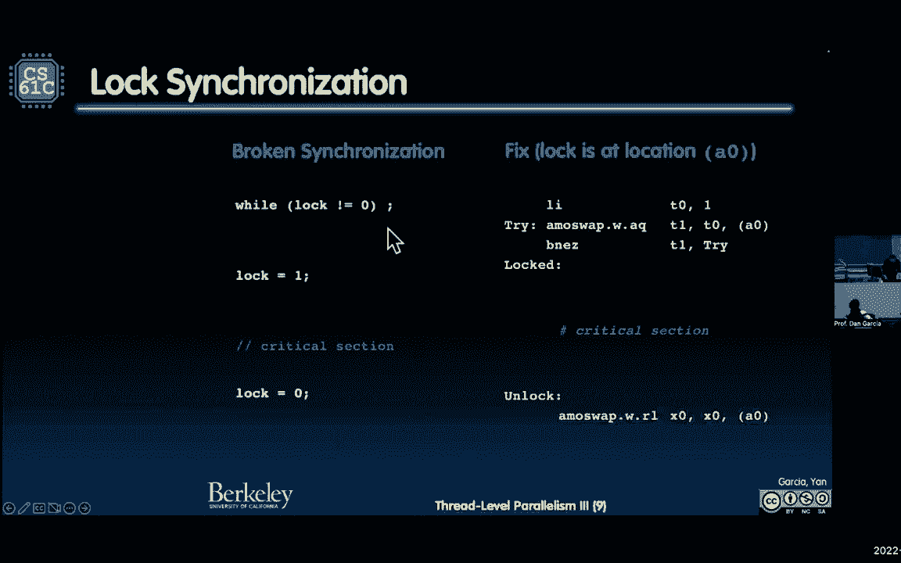

OMP锁，我做了一把锁，我初始化锁，不管锁是什么，我不在乎，这是一个抽象，我在这里初始化锁，我们去那个线程号，内部没有旋转等待，那边是树枝，我等于z，它的旋转在下面等待，所有，我要说的是，锁，很酷吗。

我知道我要按顺序做，这将打印出我在顺序部分需要做的任何事情，太漂亮了把锁打开，然后很明显你要做的是，把灯关掉，这是解开锁，打开这里的锁，相当不错的交易，如果你能把锁毁掉。

因为你不知道你用的是什么存储设备，你得确保自己收拾干净，所以你破坏了那里的锁，好啦，就是这样，所以做一把锁，初始化它，这是多么酷，得到线程号，废话废话，设置锁，在关键部分做任何你需要做的，又拆又毁。

很好的方法，亚当，十字架的方式，所以你不知道，也许有人你觉得这个房间，是啊，是啊，这是正确的，我不知道要多久，它会说，设置设置锁定你，你刚才说，我得等，我不会这么做的，系统会等待，的。

电脑会说核心在做什么，在临界区花了很长时间，它拥有这个房间，它正在为它需要做的任何事情录制一个长视频，你不明白，所以在你进入那个房间之前，所以你不知道，这一条线实际上可能导致很多很多个时钟周期的等待。

直到你得到房间，完全正确，这就是你想要的，我不在乎会慢一点，我只想保证，这不是不确定的，它是一个确定性的程序，一旦我拿到锁，没有人做比赛条件，我很乐意等待以避免比赛条件。

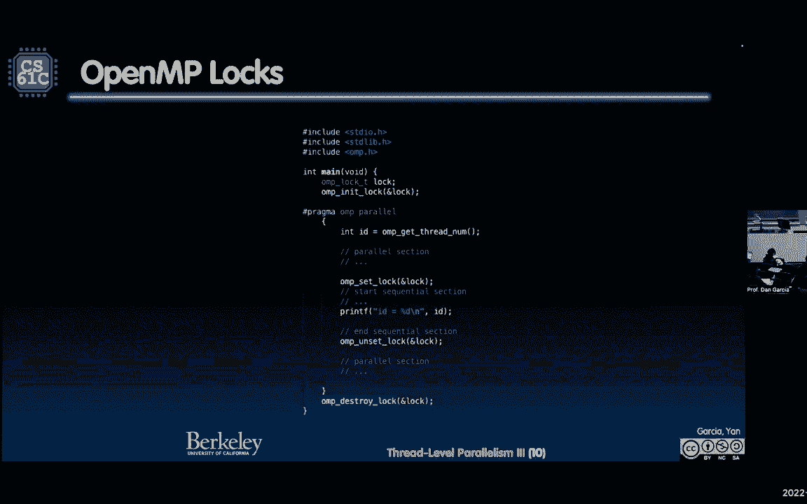

一个很好的问题，向你展示我指出的所有事情，让我缩放一下，这很酷，我很兴奋能和你分享这个，现在我们知道如何处理同步和避免竞争条件，孩子，那是一段时间的麻烦，好啦，所以通常同步。

您有更高级别的编程构造OPP有杂注，顺便说一下，我强烈地鼓励你，如果你真的在乎这个，也许是为了项目，四个轻推轻推眨眼眨眼，有一个学习教程，关于OMP的更多信息，如果您需要执行更多的操作。

而不仅仅是一个简单的for循环，我在课堂或锁上教过你，我在课堂上教过你，你还需要这些吗，有一个巨大的美丽的教程，他们把开放的MP小组，打开MP组织将其放在一起，在底部，你还有别的事可以做。

关键部分和原子部分，有阻隔就是命令，在并行中你可以做很多事情，您可能需要对此进行更细粒度的控制，杂注下的所有这些特征，允许你这么做，你玩它，从这里探索你需要的任何东西，我只是给你看一个基本的。

如何设置一些块，它们还提供私人变量约简，有很好的文件，所以打开它P是相当整洁的。

好啦，这是我的批评部分，记住，我们回去吧，我们试着做这件事，每个线程都在添加他们的贡献，两个圆周率，记住这就是他给我们带来麻烦的原因，让我们回到这一点，看看代码是什么样子的，我们要做的就是，看这块表。

这是在一个语用上看，多酷啊，我还在平行区，这是语用p平行。

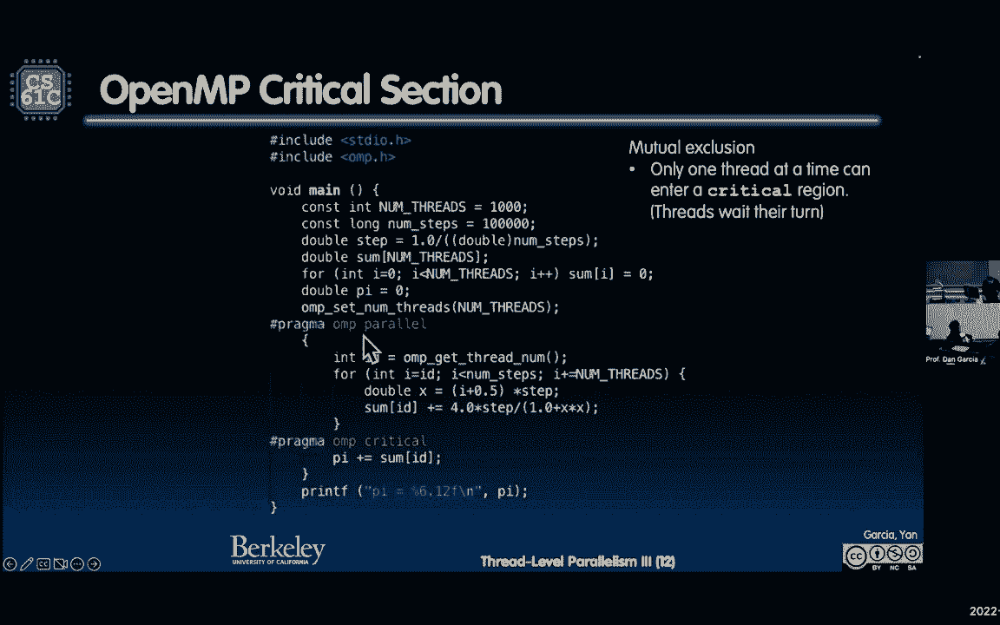

整件事，这个块叫做平行段，我加一句。

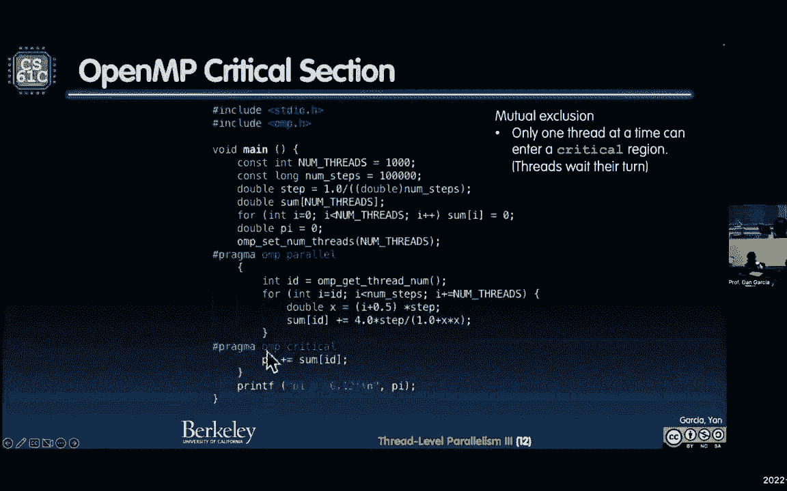

这是一个关键的部分，说只有一个核心可以写，一次可以访问那条线路，这就是问题所在，上次，一切四环都很好，对圆周率的贡献是麻烦，所以我们说好，让我们通过让每个核心都有i的π来解决它，每个核心都写到圆周率。

然后我得把它们都加起来，那不是很好吗？如果有办法公开MP，不必做圆周率数组，但只有一层，我们只是在尝试最简单的情况，所有我需要做的是添加omp临界，说圆周率加等于你的贡献，它的工作原理。

所以这比圆周率数组要容易得多，我必须每个人都增加他们的份额，我的意思是你可以做到这一点，如果你需要做什么，但这容易多了，天哪，真漂亮，它几乎是优雅的，几乎是美丽的，多干净啊。

我真的很喜欢他们开放P基金会的目标，也就是最小化您需要更改的代码量，基本上是一个工作的串行程序，那个，当你平行的时候，你加上两条紫色的线，现在使它平行，挺酷的，所以我很高兴。

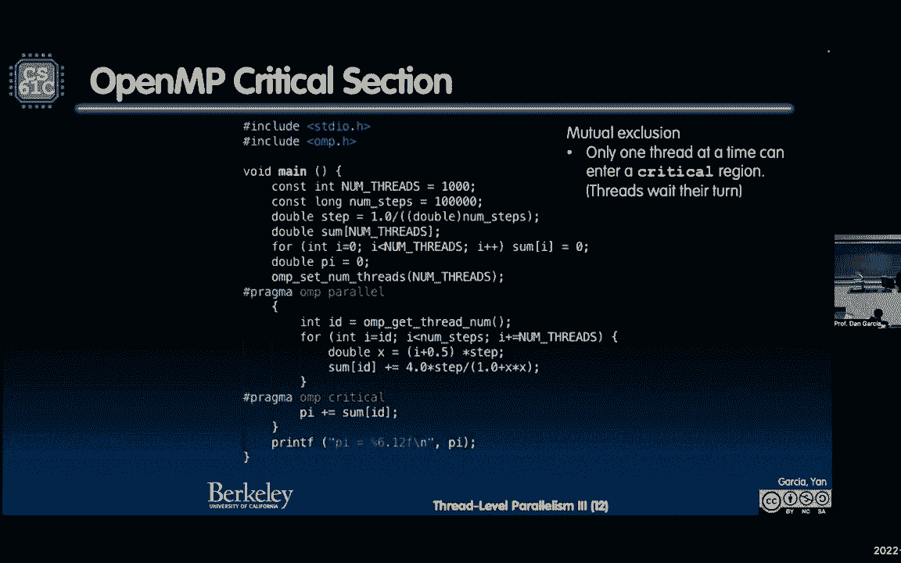

这是关键台词，让我们谈谈僵局，我喜欢这张照片，你可以看到这张照片，这是一张照片，我不知道这是在哪里拍的，但我相信这是世界上最糟糕的僵局，它是一个四向交叉点，每个人都想左转，但是在底部有一辆公共汽车。

你能看到这张照片吗，我就是喜欢这个，但是想象一下，想象一下看着你的房间，想象一下你得到了，试着去工作，看着这个，我来让你看看这个，你得明白这样有多好没人能打动所有人，这辆巴士是整件事的关键，这就像。

有一个游戏叫做，它叫什么，是这辆红色的车，这是一个塑料游戏，现在呢，这是一个滑块方案，红色的东西需要出去，它叫什么滑出幻灯片二进制艺术使它，这是个游戏，没人玩这个游戏，一辆小塑料车，他们需要出去滑出去。

你知道以前玩什么游戏，它叫什么，游戏的名字怎么样，没有人，反正也没人知道，你看情况有多糟，你被困住了，会不会卡住了，即使有锁，答案很不幸，是呀，这就是所谓的死锁，所以死锁是一个系统，你有。

也许是因为你有一系列的障碍，整个系统实际上不会移动，就像照片上一样，有一种叫做用餐哲学家问题的东西，这是一个非常棒的，有五位哲学家，每次坐着，每个人都有一张桌子，每个人都有，呃，两个器皿，右边一个。

左边一个，所以说，所以这是算法，思考到左叉子可用，当它是捡起来，当左叉子可用时，把它捡起来这对筷子有用，因为你需要两根棍子来做一顿饭，然后叉子，我不知道他们为什么给他做叉子，帝国主义。

我想在找到合适的叉子之前，当它在的时候，把它捡起来，当两把叉子都拿着的时候，我不要你再叉了，用筷子可能更好，太傻了，把叉子换成筷子，当两个叉子保持固定的时间，然后把右叉子放下，把左叉子放下。

从头开始重复，是啊，是啊，所以不管出于什么愚蠢的原因，每个人都需要两把叉子才能吃东西，所以你要等左边的，等待合适的，当你得到它，吃一点时间，然后把它们都按这个顺序放下来，如果并行运行，有什么可能。

这是常有的事，每个哲学家和我一起去，抓住左边的叉子，每个哲学家手里都有一把叉子，很饿，每个哲学家都在等待正确的叉子，永远不会到来，你明白了吗，你得吃两个，每个人都抓住左边。

算法说每个人都在并行运行这个程序，好吧，这五个人都在运行这个，所有程序并行，每一个都很好，我的工作是等待正确的岔路口，我可以有两把叉子做一些叉子的事情，我不知道，也许你把我拉走了，我不知道该怎么办。

K的两把叉子，但每个人都在看着这个差距，没有人会释放它，因为算法上说除非你同时拥有，你吃了一点时间，没有僵局，好啦，所以强有力的想法，那么解决办法是什么呢，你有，我有，我们就说头脑风暴吧。

您有解决这里死锁问题的方法吗，轮流做麦片，命令他们这是一种方法，把订单做好，你知道的，最古老的哲学家，你知道的，把它分在这里，你得吃东西，第一批，两叉都吃，吃完后把叉子都放下，下一个哲学家就会这么做。

所以这是一种方法，您可以正确地序列化它，很有效的解决方案，序列化它几乎总是有效的，那太好了，回到平行之前的日子，还有什么办法，如果我们想保持平行，怎么做呢？更像是更多的叉子，这是另一个很好的答案。

在滚动中，这是正确的，更多的叉子像，把叉子翻倍，你懂的，每个人都有吃的，太疯狂了，有更多的资源，我喜欢它，如果我们没有，我们不能改变那个，还有什么办法，是啊，是啊，告诉我你，是啊，就像如果你。

如果你等了一定的时间，而你实际上没有吃东西，但你拿着叉子，把它放下，等着再看一眼，所以随便找个时间放下叉子，如果你只是拿着一个，所以你打破了这一切，以一种最终会有效的方式，这样就能清除木头堵塞了。

但你得等适当的时间，我是说，你也可以，你知道的，就这样发生了，等待着，然后在别人注意到之前再抓住它，所以你必须能够与之合作，不管怎样，有很多方法可以解决这个问题，但基本上是你有一些随机性。

如果你意识到你不是在逃跑，然后你想离开这里，你说喜欢，让我放弃所有我不需要的资源，因为其他人可能在等他们，然后再等一会儿，也许四处走走，也许在街区里散散步，然后回来看看我能不能有我的资源，我需要这样。

如果你发现你在拖延时间，只是把它脱下来给它给人们，如果你需要，这是解决这个问题的办法。

这就是僵局，就是这样，我受够了僵局对话。

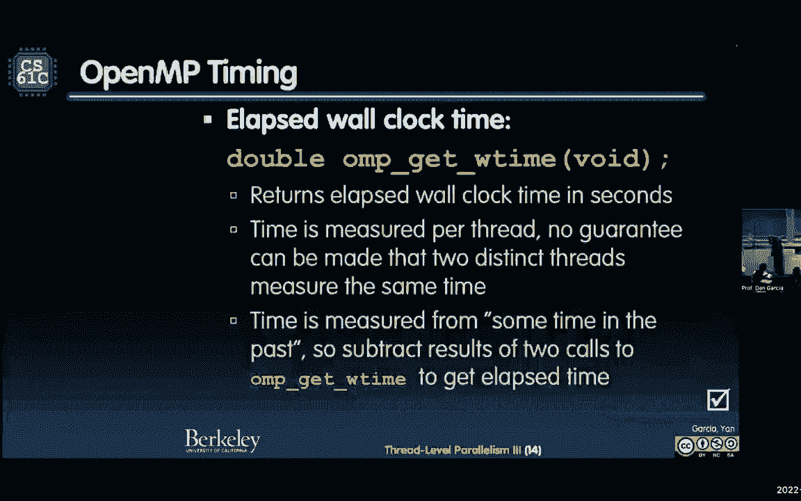

如果要计算代码运行的速度，这是做到这一点的一种方法。

P得到W时间代表墙时间返回，逝去的，墙时间（秒），每个线程测量时间，不能保证两个不同的线程同时测量，时间是从过去的某个时候计算出来的，所以减去其中两个调用的结果，基本上这里有一个非常酷的事情。

如果我说去墙时间，我不知道它是用什么量的，是从上月上周开始算的吗？我不知道它会，因为它是未知的，你计时的方式，有些东西是，你要两个，我说好，开始了，这里是结束，我减去，这就是花了多长时间，所以说。

我不在乎，它是从什么来测量的，我只关心，如果差异是正确的，所以我可以说是时候，从九百开始的微秒数，或者从2000年开始的几毫秒，我不知道它在做什么，但如果我减去其中的两个，那是经过的时间。

所以只要用两个电话来做你的延时。

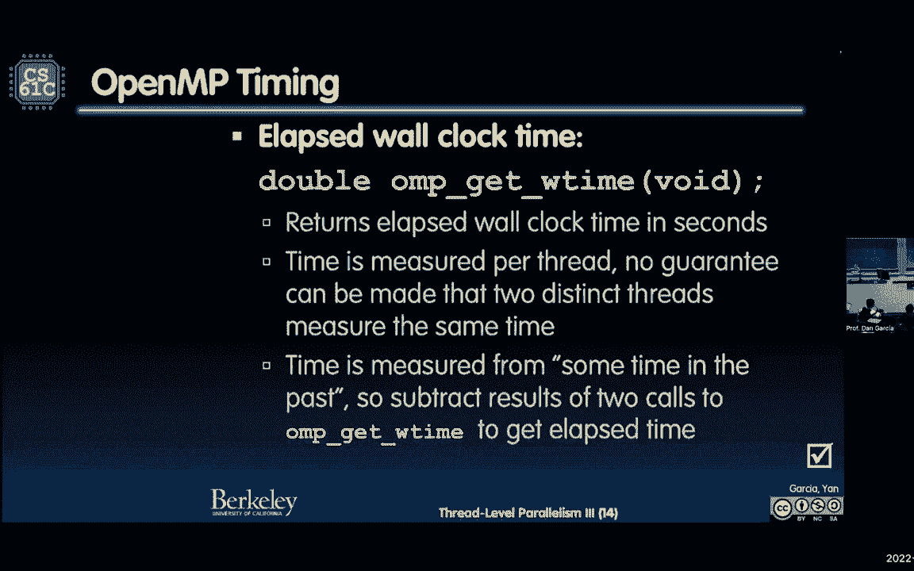

到目前为止还有什么问题吗，我们谈了很多，我们找到弹药了，我们已经想出了如何摆脱比赛条件，我们谈到了僵局，我们讨论了如何计时，挺酷的，东西，让我们来谈谈大的，20分钟共享内存和缓存。

好啦，你见过这个图片处理器和捕捉器，你有一些互连网络，然后你就有了记忆，这张照片和你之前看到的一样，试图侧身，如果你把头转向右边，记得吗左边是内核右边是内存和iOS，让我们面对同样的画面，好啦。

但是你有一些互联网络，它允许所有的缓存和处理器进入内存，然后通过共享的方式，瓶颈，哪个是连接网络，所以你希望那真的很快，关键是它是一个共享的连贯记忆，这意味着他们都访问了相同的内存。

我们将使用相同的内存空间。

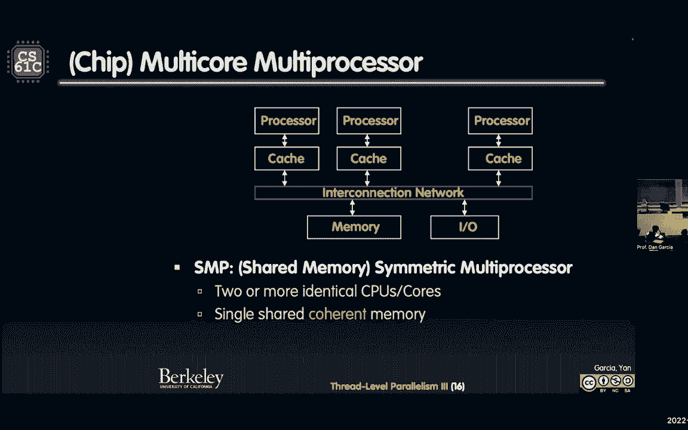

到这些核心中的每一个，硬件线程在相同的内存空间中工作，所以总的来说，如果我提出某种程度的并行性，或者我有一个新的架构，这是一个并行的架构，这是三个问题，你可以要求任何提出新建筑的人，好啦。

你有不同的工蜂，他们会研究一些东西，第一名，他们如何共享数据，这些工作如何共享数据，一般来说，你总是可以问这个问题，第二，他们又是如何协调工作的，这些都是一般性的问题，你可以问任何人。

如果我说我有一个新的酷炫的并行架构，问这三个问题，第三名，有多少处理器，能养活多少工蜂，好啦，所以任何提出新事物的人，问这三个问题，把这个写在你的QA表上，你会喜欢听起来很聪明。

好啦，第一个问题是最简单的问题，我们只有一个地址空间，我们刚才说，我说过作为一个单一的地址空间，2到32字节的内存，每个核心都能接触到，一样的，同一个共享的，不像另一个，一样的，第二，我刚说你协调。

我想我们在记忆之前就看到了，它们通过记忆协调，这是一个瓶颈，你得去萨克拉门托，是呀，你去萨克拉门托协调，就是这些弹药，内存交换，你将进入记忆，我交换的是记忆，用于共享数据必须通过同步原语进行协调，锁。

我刚才谈到了一次只允许一个进程访问数据，虽然那是评论，今天所有的多核计算机都是对称的共享内存，多处理器。

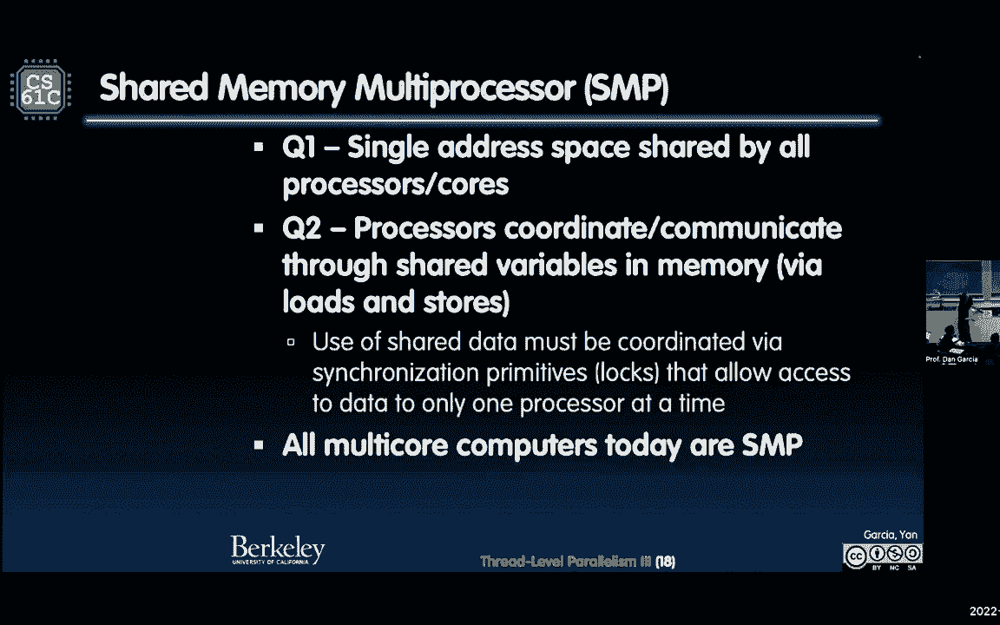

我说你之前说过瓶颈这个词，我再说一遍，内存是瓶颈，即使只有一个处理器，这是一个瓶颈，我们如何修复它的缓存，让我们看看能不能在这里修好它，每个酷的人都会得到自己的缓存。

每个人可能都有自己的L一个可能有自己的L两个，也许L 3有点复杂，现在被共享，但在未来可能是一个核心上的单曲，L三个和一个共享的，L四，谁知道未来会怎样。

使用缓存减少对主存的带宽需求，每个核心都有一个本地私有缓存。

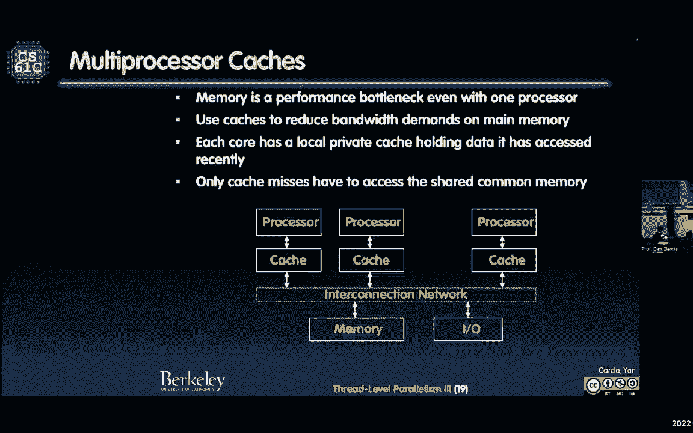

这是变得复杂的部分，我记得的，两节课前的点击器问题，最让硬件和软件设计师头疼的是什么，当我们平行的时候，记住答案是什么，好像百分之九十的人都相信，这就是我们要做的，现在我们正在研究为什么这这么烦人。

为什么这么头疼，每个缓存都有一个私有的，每个核心都有一个私人现金，你看你得说，为什么会有麻烦，你知道为什么会有麻烦，有一个共享的记忆很好，共享内存MOS保证。

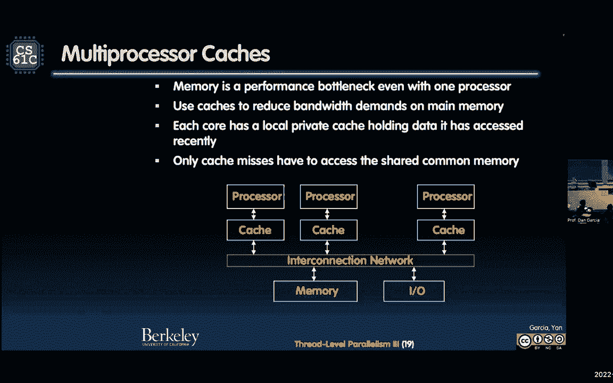

但现在突然间你做了一份私人副本，我的L和URL不一样，一个和版本不一样，现在也许他们对同一块内存有不同的值，因为记住你在缓存记忆，那只是复制品，如果他们不一样呢，不好，真的很糟糕，所以保持连贯性是问题。

如何在同一页上保持所有这些缓存的一致性，如果你愿意，在同一个街区的坏名声，如果你能看到，我说佩奇，这是个虚拟内存笑话，好啦，一两个星期后你就会明白这个笑话了，好啦，回到这个，那真的很有趣。

我们可以在这里做得很好，我们去只缓存错过，必须访问。

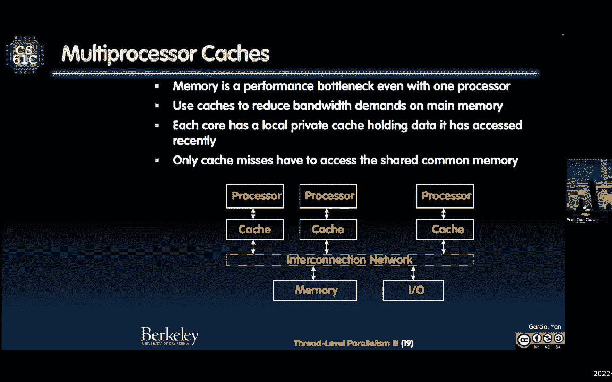

共享的共同记忆权，你是一个缓存命中，你拿到了，你在用你当地的东西工作，哦，缓存现在错过了，你得出去找一个新的方块把它装进去。

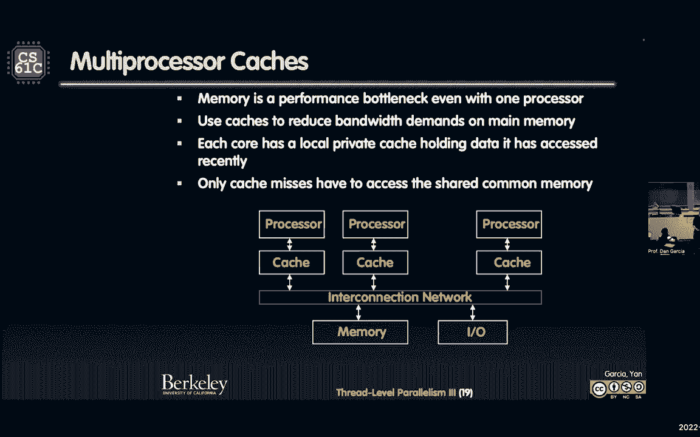

这就是问题所在，好啦，所以让我们做一个这样的样子，我喜欢这个小动画，一点乐趣，动画，游戏过程一和二阅读，一千的内存位置零，价值二十，开始了，一号处理器，它的内存地址是一千，它将值读取到这里。

我们去循环循环，它进入缓存，不在那里，进入记忆，转到内存位置，一千，往回走，20个进来，你把标签装上，或者相当于说一千，二十元，我是说一千个标签中的一小部分，你就说一千二，现在你有了自己的副本。

我们都很高兴，教授，两件相同的事，这只是暂时的阅读，开始了，它不在缓存里，进入记忆，同样的事情等等，等等，二十块，把它带回来本地副本20本地副本，大家都很高兴，谁开心，让我们点点头，你很高兴吧，没关系。

他们都在读二十个，因为你只是在读，阅读真的是如果整个世界都是一个阅读，这是件很容易的事，我们必须把所有的复杂性都找回来，它就不必处理它了，肮脏的人必须处理这一切，那是因为权利使事情变得复杂，阅读很棒。

你有副本，那是个很棒的复制品，这是一个很棒的网站，本地浏览器缓存，阅读的网络，只复制喜欢，哎呦，有一份纽约时报的版面，你那天早些时候读过，你不确定纽约时报改变了它，你不能改变它。

所以我们所有人都会有它的副本，没有人只关心。

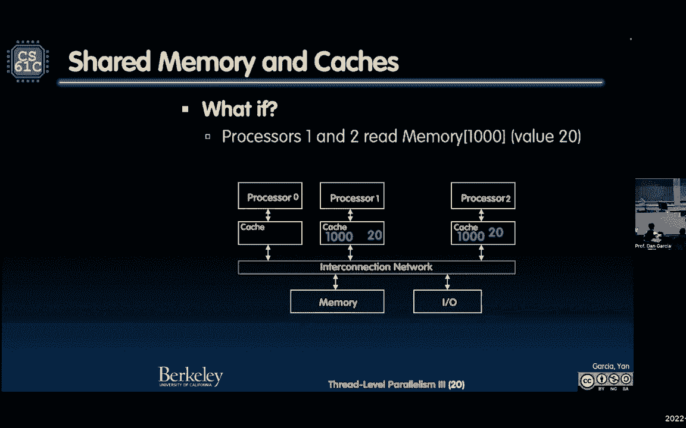

当有权利的时候，有问题吗，所以我们现在开始，我刚才说的话，写入问题，所以过程为零，它总是进程或零，我身边的痛苦写着记忆的位置，千加四十，谁预见到问题的到来，你看它慢，像慢吞吞的，就像慢动作，就像意外。

来了，就像这就像一个，就像摩托车开得太快，带着红灯，你知道这是不好的，你看到了，牛慢了下来，不，在这里，我已经在这里给你看了，我们去一千，它想写一个四十，在里面吗，不，所以它写的是四十，因为它正好穿过。

这就对了，我应该问你一个问题，它正好穿过正好穿过，它写信给四十个，好啦，我们做得很好，一切都很好，右火车失事，垃圾箱火灾，这是最糟糕的，因为在这种同时发生的事情中，号码应该是四十，我们以为是二十个。

我们以为北极星就在那里，在那边，四十是四十，问题是处理器一和处理器二，还以为是二十岁，真的很糟糕，所以我们必须再次考虑如何解决这个问题，缓存一致性，这就是你在这里看到的，那些缓存不连贯。

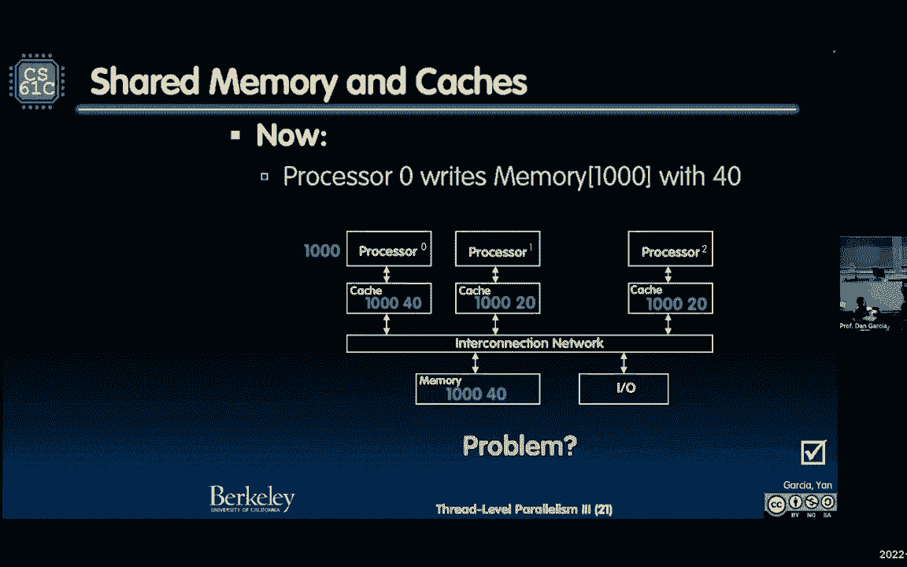

他们不是协议，如何解决现金一致性问题。

就是这样，看看，把滑梯命名为，缓存一致性，所以建筑商店。

现在呢，你现在穿上你的建筑师套装，你不是软件程序员，你是建筑师，你在建立一个系统，你怎么解决这个问题，你的工作是保持缓存的一致性，所以我们开始了，当任何处理器都有缓存时，错还是对。

通过网络通知其他处理器感兴趣，所以这意味着这是一个秘密渠道，就像一根松动的线聊天，像个暗道，与其他处理器通信的方式，嘿嘿，也许这里有问题，休斯顿，我们现在有麻烦了，如果他们只是像你刚才看到的那样阅读。

你可以让很多人都有它的副本，但当有权利，你得检查一遍，使其他副本无效，如果你无效，那实际上还是有效的，因为那样你就会是唯一一个有四十块钱的人，没有其他人有20或1000左右，顺便说一句，你会很好的。

我们说的不是地址，我们说的是一个，高速缓存和内存之间的传输单位是什么，一个街区不仅仅是那个槽，是整条线，是整个缓存线，你得把整个街区压扁，好啦，不仅仅是那个特别的，只是存储元件，一千个不，他们装的整块。

里面有一千个，那就是，你知道的，一千分，对不起，那里面有四二十个，但它是它在哪里，那个块的表示，那是一千个，抓住了成千上万的人，有一千个的网，如果你在做鱼的类比，在这里，我们从一个处理器写入事务。

现在看其他缓存，可以窥探，这是一个非常有趣的想法，窥探就像我在嗅，我嗅到了一个共同的互联，检查他们的标签，那不是很有趣吗？它们是有效的，无效，在另一个缓存中修改的相同地址的任何副本。

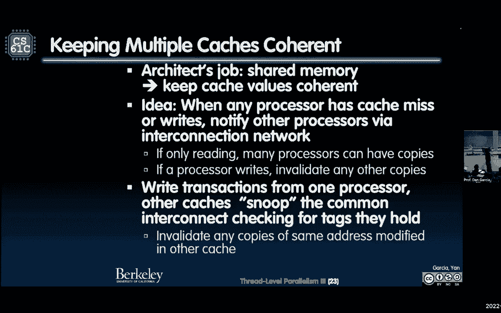

所以我们开始了，硬件如何保持缓存的一致性，每个缓存跟踪缓存中每个块的状态，情况如何，有几个不同的，让我们说一点点，一些州，我认为这表明，它就像一个有限状态机，你们分享的几个不同的州意味着。

让我们想想所有这些，就像，我动画的第一部分，我有最新的数据，所以我的一千是二十，这是最新的其他副本，其他缓存可能有副本，所以我有一千两，你有一千两，你有一千两，每个人都有一千两，我们很好，那很好。

我们只是在读书，我们很容易，就像简单的案子，好的读数，那是共享状态，所以我的部分会说它是共享的，就这样，我知道，只是为了让人们知道，你的状况如何？啊，我的状态如何？你在互连网络中询问其他事情。

你的状况如何？我被分享了，也就是说我有一份副本，但其他人可能有副本，也是，那很好，这就是共享的意思，他们都是，它可以在修改后的。

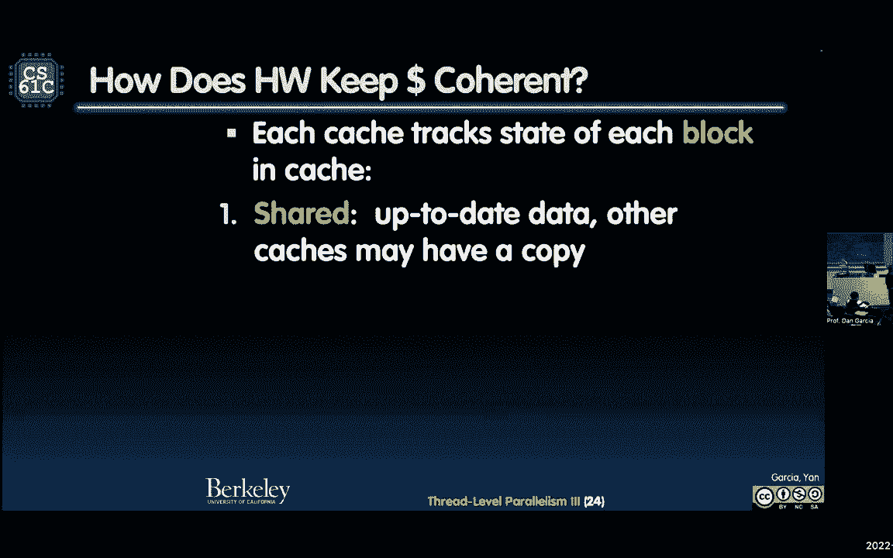

是另一种状态，最新数据，没有其他缓存有副本，这就是我，和我在一起，我写一个40，没有其他缓存有副本，我得让他们另外20个无效，所以其他的，扔掉你的二十块钱，相同的千个内存地址，扔掉你的二十块钱。

我要修改一下，有本地的，有这个，还有这个，实际上很有趣，好吧，写内存过期了，这意味着它又回到了右后卫系统中，我们其实很喜欢他们，如果你还记得我们喜欢右后卫系统，上面写着我给你看了正确的方法。

我之前一直在回忆，在动画中，这在右后卫系统中有效。

在右后卫系统中，记忆实际上已经过时了，就像普通的右后卫系统一样，只有一个处理器。

意思是你的记忆可能过时了，你有一点脏，上面写着我的本地缓存副本，最近的副本和内存已过时，肮脏意味着记忆是肮脏的，不是我的缓存更新鲜，记忆很脏，内存是旧的修改，会说我想，我是零号处理器，想写四十个。

我要让你的副本失效，然后我有修改过的版本，记住他还不知道这件事，因为我不想去萨克拉门托，所以右后卫说，不要进入过时的记忆，但我有唯一的副本，修改意味着我有唯一一个脏的副本。

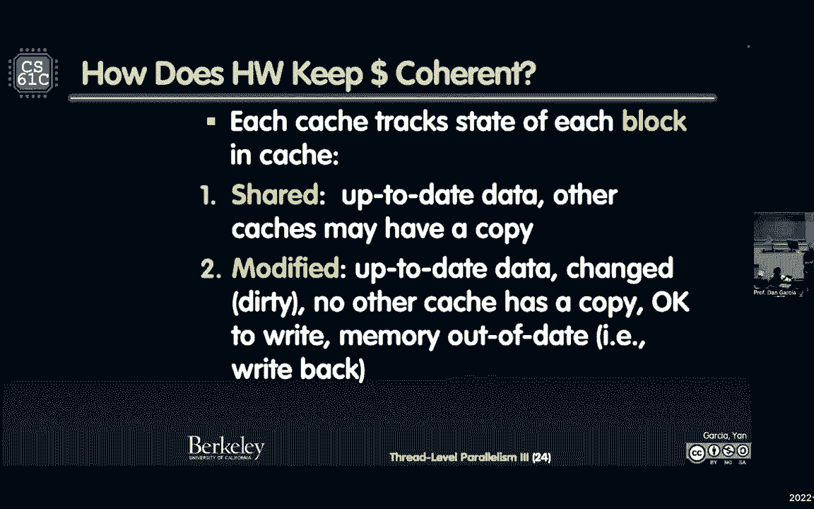

好吧，记忆是肮脏的，但我有唯一的副本，那是现在的活版本，好啦，所以现在这有点复杂，然后你就可以拥有这些状态。

顺便说一句，你可以忍受这些州，你可以分享它，动画被共享或修改，共享或修改，你可以更优化一点，如果添加到更多状态，它变得更复杂一点，呆在这陪着我，我们在伯克利发明的，顺便说一句，所以这有点酷。

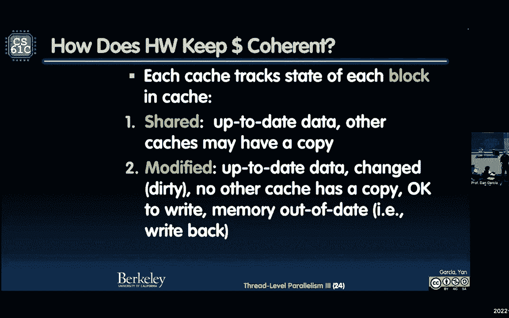

我给你看看这个，每个缓存跟踪每个块的状态，所以每一个方块，每行，它有这些部分，到目前为止共享或修改的这些状态位，我要在州的数量上再加一些位，我可能会考虑，其中一个叫这个有点复杂，但和我在一起叫做独家。

最新数据，所以我有最新的数据，没有其他缓存有副本，就像改造过的，写内存是最新的没关系。

所以两者的区别，修改内存之间的区别是过时的独占。

说记忆是最新的，所以我是否写回了记忆，这是一个小小的微妙之处，或者不是，避免直接进入替换块的内存，那其实很有用，这意味着如果我知道我的身份是独家的，这意味着修改，这意味着记忆是同步的。

如果我必须替换那个块，我可以把它换掉，因为记忆是同步的，如此排他性，实际上节省了一个内存，就在一个街区的替代品上，替换好的，因此在读取时应用数据。

而不是去记忆，所以如果我想读，我不做记忆，可以在那里抓住它，现在业主更复杂了，又是这个，我得读这个，因为人们总是把，所以我拿了这个，我试着多加点这个，让我慢慢读，看我们一起做，店主说我有一份最新的副本。

其他缓存可能有副本，记住共享状态，在股票之前没有人真正拥有它，就像每个人都平等地分享它，我加上一个想法，可能是有人说，我其实是它的主人，现在呢，你可以被分享，但我是它的主人，和我在一起，这是什么意思。

此缓存是具有缓存行有效副本的几个缓存之一，其他共享的，可能也有，但拥有对其进行修改的专属权利，它一定要看这个，它必须将这些更改广播到其他缓存，共享线路，和我在一起，这真的很酷。

这种自身状态的引入允许肮脏的数据共享，我不可能把纸条传给丽莎，传递纸条传递纸条给其他人，这是改变的值，那不是很疯狂吗，我还是老板，我想换我的20，所以二十个都是对的，所有二十个，我想加到40。

但我是老板，所以我赌四十，然后我传递到其他缓存，四四十，我无视，记忆不是那么快和酷，我不去萨克拉门托，他们得到了特别的秘密纸条，四四十，他们都更新自己，我还是老板，但现在他们又一致了，现在我们又连贯了。

那不是很酷吗，没人欣赏好吧，那很酷，没有主存，在使所有共享副本无效后，缓存行可能更改为修改状态，所以如果我想修改，然后出于某种原因去修改，说我想以某种方式记住，修改不同于拥有和排他性，我能做到。

但后来被修改了，手段，没有其他人有副本，记住修改过的，上面写着，没有其他人有副本，所以如果我想去修改，记住你们都是始终如一的，我将被修改，说你能抹去自己吗，你现在能抹去你自己吗，你现在被抹去了。

我被改造了，现在我有了唯一的话题，因为我被改造了，废话，废话，或者通过将修改写回主存来更改为共享状态，如果我现在把我的修改推到主存，我们又被共享了，这个FSM的一点微妙之处。

自己的高速缓存线必须用数据响应窥探请求，所以如果有人问你有有效的，是啊，是啊，我去看看，让我看看你的资料，看看你有什么有效值，所以不仅仅是，我在传纸条，我也可以要求和服务，如果你是老板。

您可能有一个请求，你的现金额是多少？哦耶，当然在这里，我把它给你，所以有一个非常聪明的优化，我在那里来回传递音符，告诉你新的价值是什么，或者响应您当前的价值，业主可以做到这一点，所以这是一件很酷的事情。

所以这叫莫西改装，拥有独家共享，我是残疾人，这就是你所看到的所有状态的可能性，所有的状态意味着，这意味着，你能拥有一个人，我们一起去吧，你能拥有一个人吗，哪里是我的，啊，给我在这里给我一些爱。

我能成为一个O吗，你是一个O，没有，我能成为主人吗，你被改造了，没有，我能拥有你的独家新闻吗，没有，我可以被拥有和你分享吗，是的，是的，有道理，你看，我只是在解释任意两个处理器的两个状态是什么。

任意两个核心，你懂的。

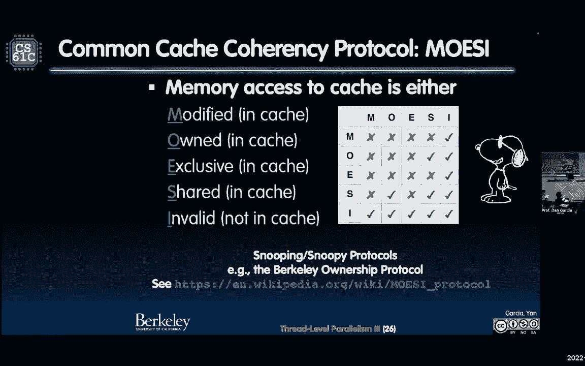

好啦，非常酷，所以唯一有趣的是两个人可以分享。

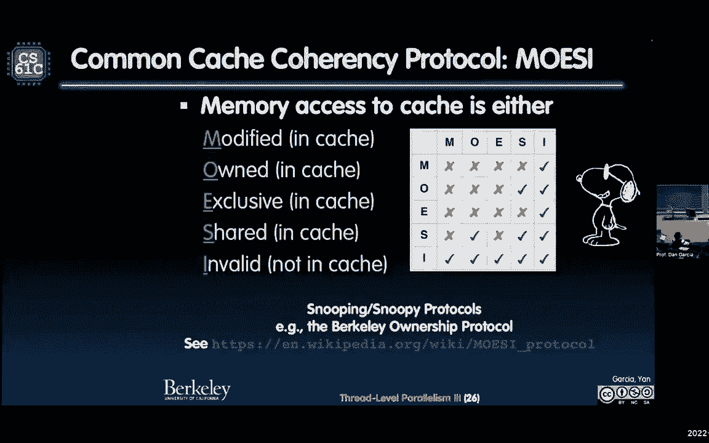

无效除外，你说的唯一绿色是，两个人可以共用，右下角的绿色，如果我被拥有，你可以被分享，拥有和分享，只有这样才能让这些都起作用，共享和拥有，拥有和共享，同一个还是共享共享，这就是我要说的。

其余的都是无效的，所以有三种可能的状态，在这里拥有和分享，拥有和共享或共享和共享，你就这点本事，你能做的只有这些，是一个莫西协议，也被称为伯克利所有权协议，谷歌熊市。

没人兴奋，好啦，所以现在有了COSO，好啦，加载时间，好啦，现在有了现金一致性，一千个人来到这里，我们去一千，处理器零，我想写作，我想现在的海关想写过程，零处理器零发送消息，请将您的其他副本作废。

他们使他们的二十岁无效，然后我写一个40。

我很好，所以这就是我告诉其他人做某事的想法，没时间问问题，对不起。

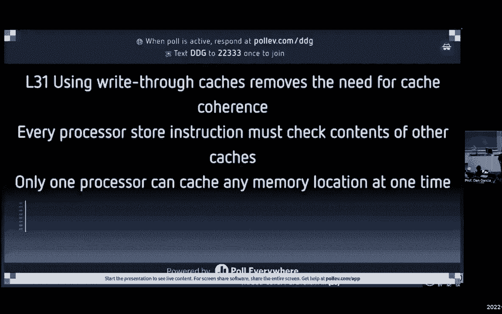

我有一个点击问题，或许下次我们可以从，在开始的早期，我不想失去这个，这是个很好的问题。

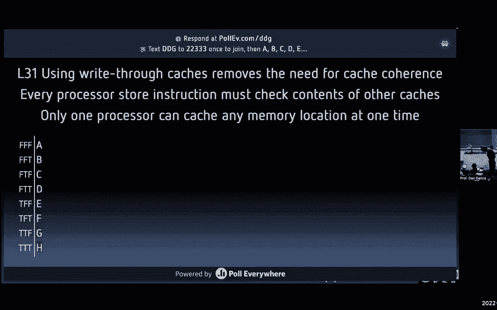

我想我有答案了，所以我跳过了，好啦，缺少缓存一致性是问题所在，这是什么意思，我试着在事情发生前完成它，两个处理器希望访问同一个块的两个不同位置，但他们是独立的，绿色的一个通往绿色区域的通道。

粉红色的一轴，粉红色的区域很好，对不对，块有32个字节，他们在阅读和写作，他们会说这是一场冲突，即使他们写的是记忆的独立部分，因为他们在同一个街区，这是个问题，假设我在写地点，但你写了整条框线。

你不能只写到一个地方，你写到整个街区。

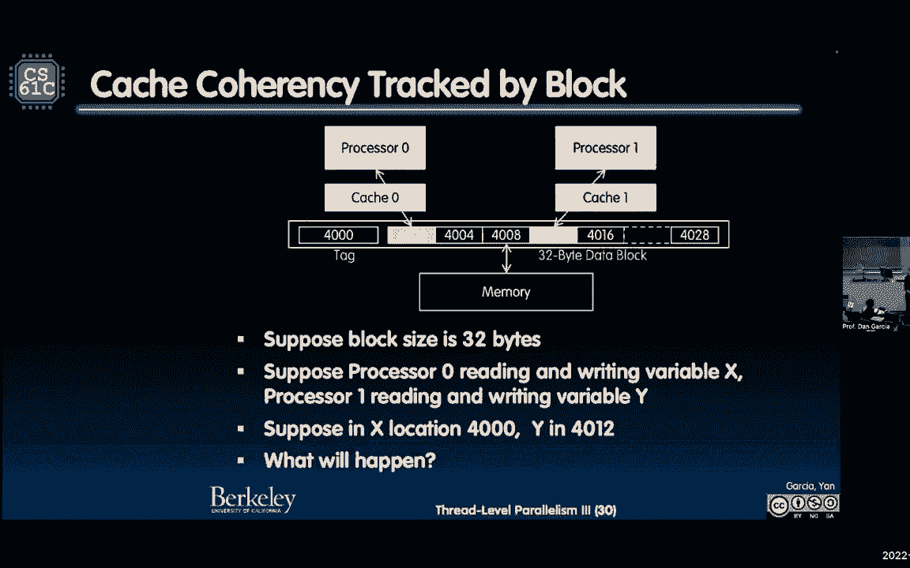

所以方块会在两个缓存之间乒乓，即使处理器正在访问不相交变量，这就是所谓的虚假分享，看起来他们住在同一个街区，他们不是，他们在访问同一个街区的不同部分，但东西系统认为他们在分享它，他们不是。

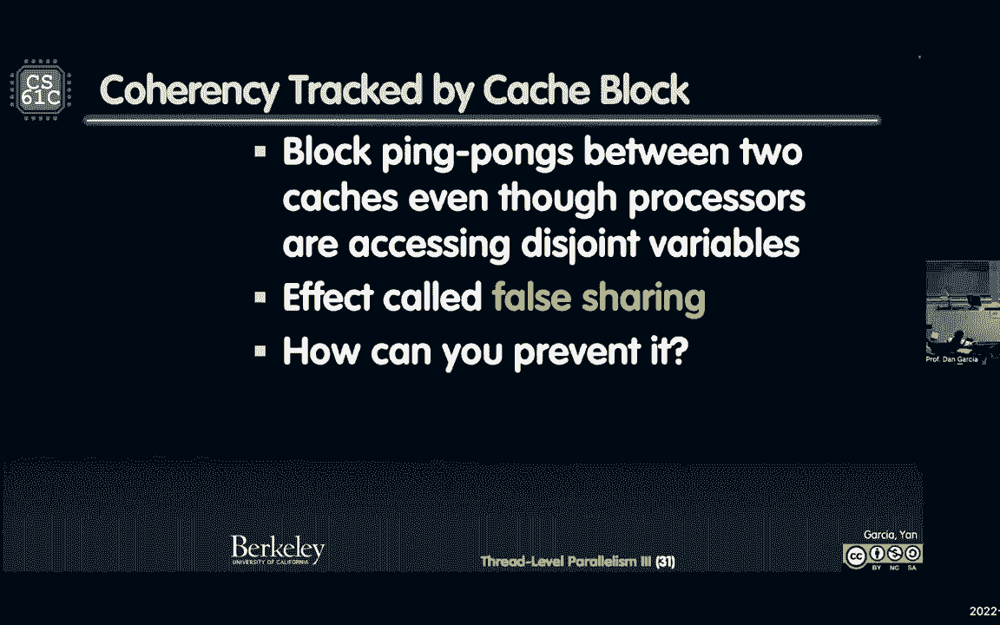

如何预防，嗯，我们看到三个C的强制能力冲突，现在最大的一个叫做连贯性。

两个不同的处理器在一个块内访问，不同地区，但实际上系统说对不起，你不能那么做，你的标签会和，你要重写，同样的事情，我不知道你在访问什么，所以那叫小姐，那是个问题，这也称为进程之间的通信。

一起研究并行程序，你以前从未见过，这以前从来都不是问题，并行程序，现在我们讨论两个并行程序运行同样的事情，操作同一块的两个不同部分。

有麻烦，连贯性失误可以主导总失误，最后，我看了最后一张幻灯片，Omp是种子的并行扩展，有所有这些扩展，私有变量的并行，减少额等，线程级别，并行，哈希一致性，执行情况，共享内存，即使有多个缓存的多个副本。

虚假分享，你真的认为你在分享，但它不是，你真的不是，你跑进了一个街区的独立部分，但系统很抱歉，你分享它是为了平，敲打东西，读写，阅读，小姐们，小姐小姐小姐小姐，块大小是问题所在，它想得越大，它就越大。

两个东西写到同一个块的可能性就越大，这让我很麻烦，如果你做一个较小的块大小，你没有那么多，较大的块大小，两个人写信告别同一段记忆的机会，同样的麻烦，所以块的大小是你的问题。

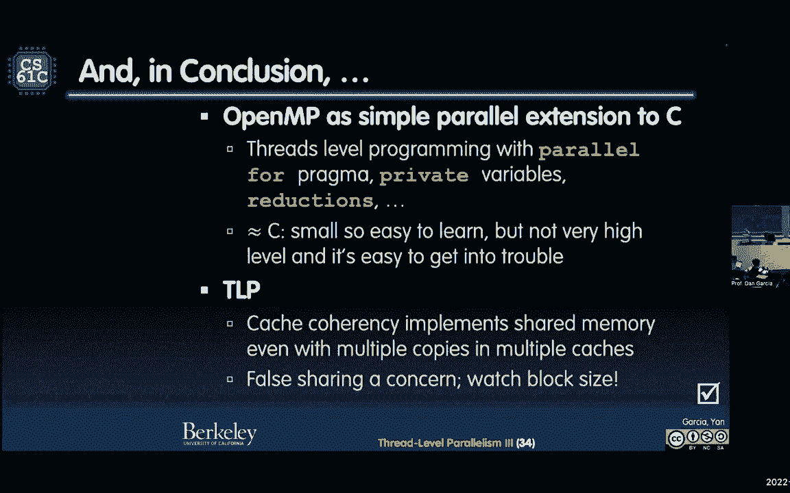

周末愉快，开始跑过来大约一分钟左右再见。