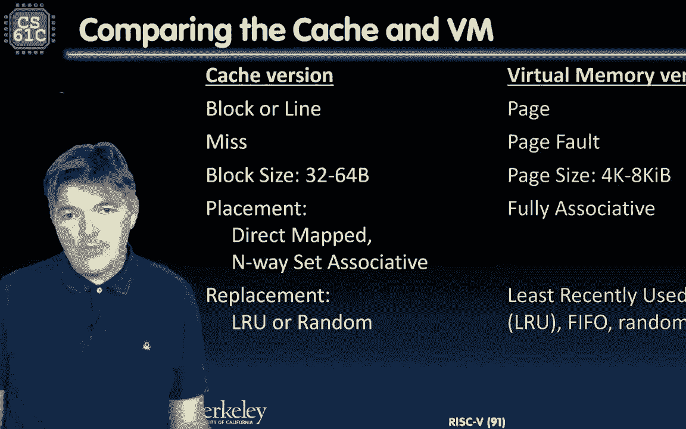
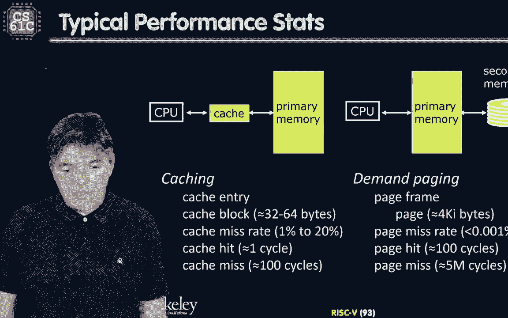
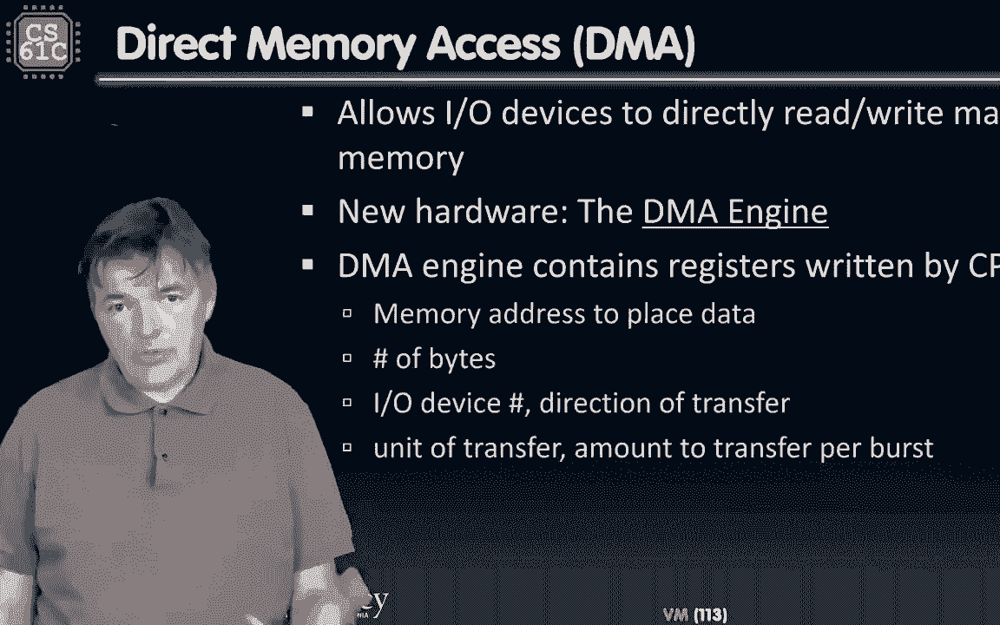
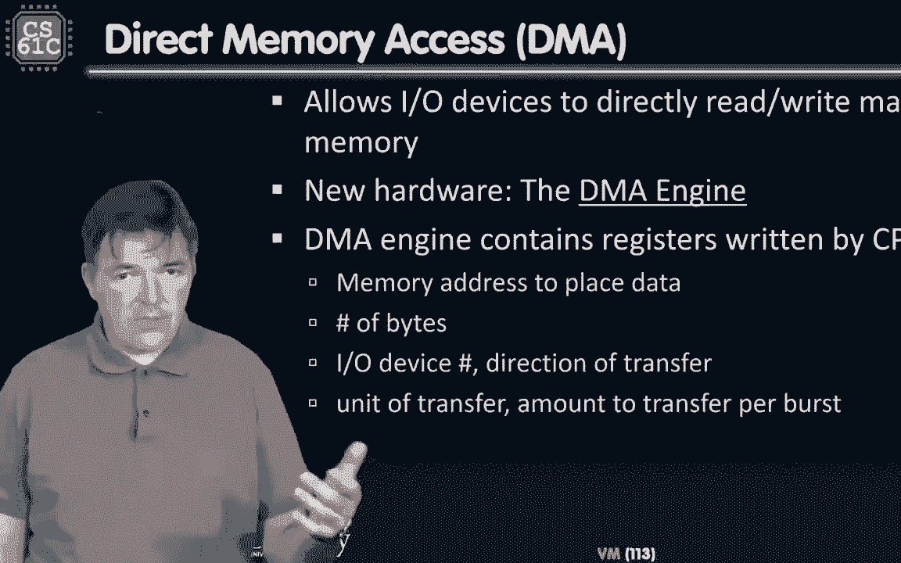
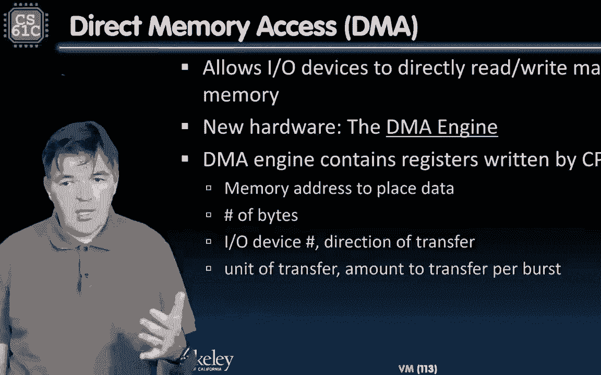
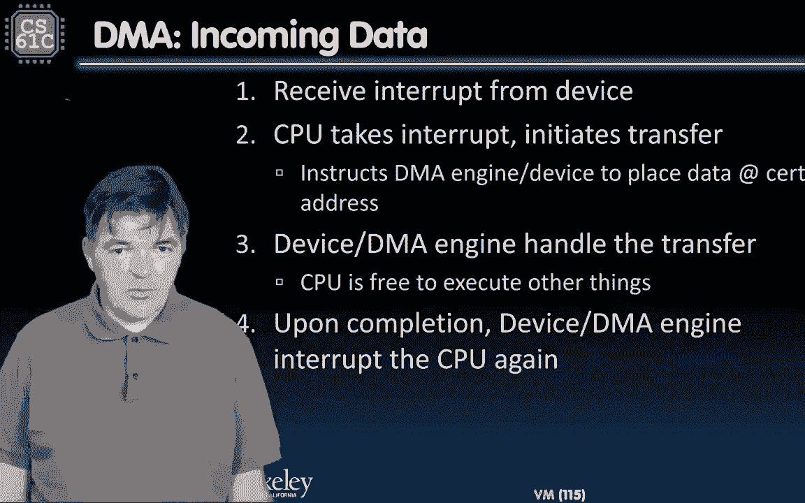
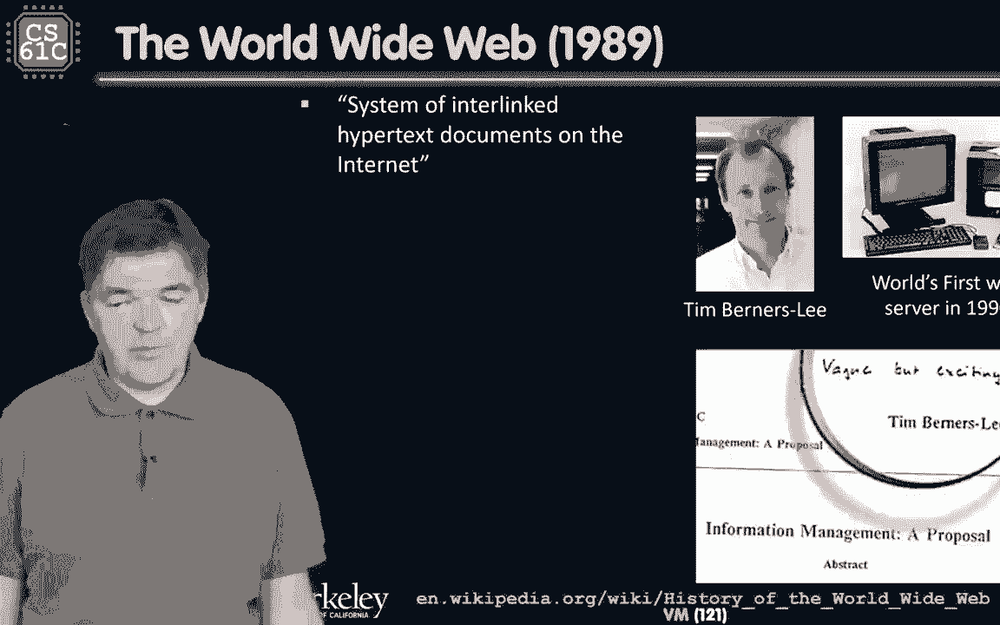
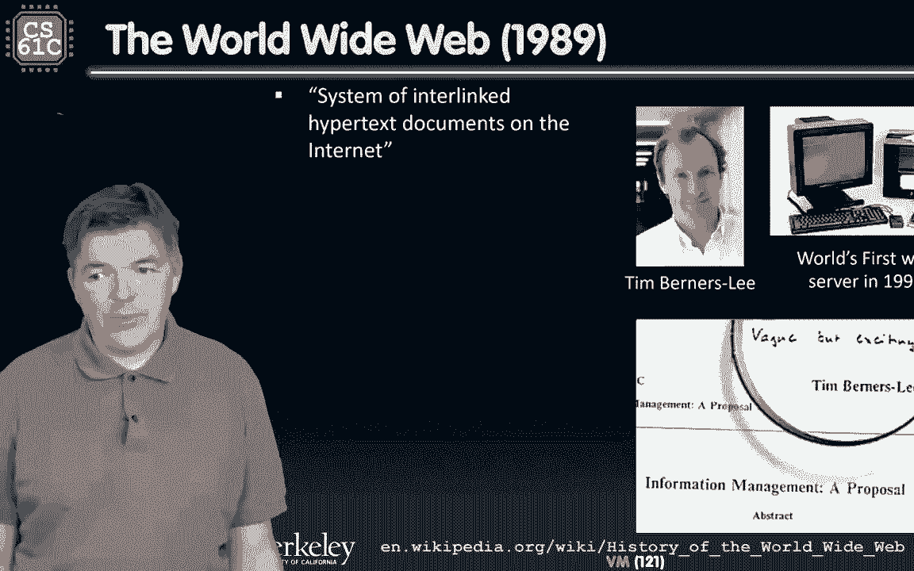

# CS 61C at UC Berkeley  - Fall 2022 - P46：Lecture 35： VM Performance, I／O - 这样好__ - BV1s7421T7XR

大家好，欢迎回到我们的操作系统和虚拟内存模块。

但是现在我们很清楚虚拟内存系统是如何工作的，甚至我们甚至知道如何实现它，所以剩下的就是评估它的性能，我们甚至知道，因为我们将使用一套相同的原则，我们已经使用了。

评估缓存的性能。

所以开始吧，让我们比较一下高速缓存和虚拟内存系统。

所以不管缓存版本是什么，不管我们叫它块还是线。

对应于虚拟内存系统中的一个页面，嗯，缓存未命中对应于页面错误，缓存中的块大小为3，2到64字节，我们正在处理的典型页面大小是KB，有时页面大小会小一点，到基比可以更大。

八到十六个奇比人，但我们通常处理四页。

在缓存中的放置可以是直接的。

映射或以任何方式设置关联，一般在。

虚拟内存系统，我们的页面是完全关联的。

缓存中的替换策略可以是最近最少使用的，也可以是随机的，或者介于两者之间的任何东西。

嗯。

在虚拟内存系统中，我们通常希望用最近使用最少的。

但有时我们会用一些东西来近似，这些东西最终可能是。

要么是先进先出，要么是随机的，右后卫政策。

回写到RAM。

万一，嗯，一个缓存，我们可以，我们可以选择在虚拟内存系统中直接和直接返回。

我们只回信。

因为回信的惩罚。

写入磁盘是如此之高，所以我们准备好评估性能了。

虚拟内存系统中的性能将以同样的方式评估。

如何评估缓存系统的性能。

虚拟内存是低于主存的内存级别。

在我们之前的计算中。

一切都停在主存的昏暗级别，现在呢。

虚拟内存通过在true中分页将DRAM扩展到缓存中。

我们的虚拟内存通过分页将该定理扩展到磁盘中。

所以尽管结核病出现在缓存之前，它影响数据。

你知道的，从磁盘到主存的数据传输。

所以在我们之前的计算中，主存是最低的。

我们只需要，说明我们的数据实际上不在DRAM中的情况。

但我们得找到一个磁盘才能取回它。

因此，每条指令的周期和平均内存访问的时间将被应用于，但这次，我们将把我们的主存看作是某种中级缓存，所以我们要检查一个缓存，命中未命中，当时的猜测，或计算，然后呢，两次命中和未命中。

然后我们会撞上公羊或错过，最终进入磁盘，以下是我们关心的一些参数。

所以当我们计算，你知道的，在我们的计算中，我们有CPU缓存和主内存。

现在我们将有CPU主内存和一个次内存。

所以当我们谈论缓存时，我们讨论了需求分页中的缓存条目。

我们正在处理页面框架。

三个2到64字节的缓存块，就像我们说的，在页面为QB之前。

当我们谈论缓存脱靶率时。

当我们得到个位数的东西时，我们通常很高兴。

所以通常情况下，你知道的，Lone缓存就像百分之一。

呃，点击率，百分之二十，也许十个，二，百分之二十。

现在失页率必须低得多。

通常嗯，万分之一还是十万分之一。

或更低。

你知道我们的缓存设计得很好。

在大多数情况下，基本上我们在一个周期内从缓存中获取数据。

缓存未命中对应于RAM中的页面。

所以这将是从十个几个，现在几十个循环到一百个循环。

页面丢失对应于五百万个时钟周期。

因为这是要多少我们去磁盘。

与吉姆格雷去冥王星的比喻相对应。

所以让我们来看看分页的影响是什么。

平均来说，内存访问是时间，嗯，因此，让我们假设我们有以下相当常见的内存参数。

我们可以插入任何你喜欢的数字。

在我们的考试中可以做到这一点。

所以说，嗯，让我们看看Lone缓存它是在一个时钟周期内完成的。

我们用95%的访问来做到这一点。

两个缓存需要十个时钟周期，命中率是六成。

假设100纳秒。

这对监控系统来说有点悲观，通常会更少，但这对当前的计算来说是可以的。

最后这个案子有两千万个时钟周期，比如说十毫秒。

我会更快，如果我们插入固态硬盘，所以不分页的平均内存访问时间。

嗯，这一次的计算是，如果我们没有错过。

如果我们找到了，我们可以在一个时钟周期内完成所有事情。

一个时钟周期内的缓存，然后我们需要加上错过的惩罚。

所以我们有5%的概率会失手。

一个，这将花费我们十个时钟周期。

然后我们错过了，嗯，在L 2。

一次有百分之五的失误，在L两次中，一个失踪的40%。

两百个循环，把我们带到公羊那里，所以计算为5。5个时钟周期。

好啦，这有点悲观，你知道的，现代系统会比这快一点。

但让我们看看，我们如何修改它以考虑分页内存系统。

所以要添加分页，我们需要做的是，我们需要拿这个五点五，针对并添加分页的影响，所以让我们这样做。

所以分页的平均内存访问时间相当于我们的5。5个周期。

加百分之五乘百分之四十五。

可能他们会错过，40%的小姐。

二乘一，减去我们的数据不在DRAM中的内存命中率。

它要走了，我们得找到一个磁盘。

这将花费我们两千万次循环，谨记。

两千万与任何其他数字相比都是一个巨大的数字，所以进入内存的命中率最好非常接近。

所以我们提到它必须比99%更好，但让我们来看看会发生什么。

如果只有百分之九十九，所以我们把它插入5。5加0点。

两次零点零一，也就是二千万的负九成九。

我们有四千张地图，那是慢了七百倍的机器，太可怕了，那是一场可怕的表演。

顺便说一句，这在实践中确实发生过。

如果，如果我们的物理内存快用完了，流程太多，课程太多。

也许共用一台机器，嗯，机器每一百个循环不断地交换。

或者将去与磁盘交换页面。

这就是所谓的痛击。

通常当机器在敲打时，它就像慢了一百倍到一千倍。

所以让我们看看如果你有更好的命中率会发生什么。

所以是的。

这就是我们所看到的，当一个程序。

你知道的，如果太多人共用一台机器，一个十秒钟的节目可能需要两个小时。

命中率是九十九点。

百分之九好，事情变得更好一点，但也好不到哪里去。

它仍然是四百块--比我们以前的差了很多，最后让我们看看如果这是一个更合理的数字会怎么样，如果我们的命中率或者误打误撞是万分之一，五点五到五点九，哪个更合理，这是我们经常遇到的事情。

这基本上就是我们需要做的，我们可以休息一下，然后我们将看到如何将IO设备集成到其中，一会儿见。

大家好，欢迎回到我们处理虚拟内存和操作系统支持的模块，但现在我们已经基本弄清楚了虚拟内存是如何工作的，所以我们想做的是，为了完成我们的计算机系统是添加IO设备。

所以让我们开始吧，到目前为止，我们在这门课上取得了巨大的进步，我们几乎造了一台计算机。

所以我们从一个高水平的C程序开始，通过第一个项目。

然后我们学习这五个的汇编语言。

我说并实践，并通过项目二真正巩固了它。

然后我们建立了一个数据路径，几乎可以执行我们的程序，从项目到减去等于。

但那并不难，虽然不是去教育那边实施。

他们只是增加了一个负担。

所以我们可以假设我们可以建造，我们几乎可以运行我们建立的所有项目2，我们也可以编译我们的项目一，并在我们的核心上运行它。

我们添加了高速缓存，然后我们连接虚拟内存。

因此，为了拥有一台计算机，我们所需要的就是添加IO设备。

这样我们就可以连接键盘和鼠标，并在屏幕上显示我们的结果。

或许呃，连接到网络。

这里的关键是我们想理解原则。

这些我是怎么，O，设备连接，这样我们就不必用一些特殊的程序一次做一个。

所以让我们开始吧。

那么我们如何与设备交互，所以我们有一个在CPU上运行的程序，然后它想在打印机上打印一些东西，或者从击键接收um输入，那么我们该怎么做呢。

所以我们有处理器和内存，有一些代码在上面运行，所以我们需要有一个I，O，键盘接口，网络鼠标。

显示器等，你想以统一的方式做到这一点。

这样我们就不必为他们每个人单独做了，通常会有太多的设备。

他们会有非常不同的要求。

或者他们呈现数据的方式，或者他们如何获取数据。

但你想试着以统一的方式对待他们，它们通常通过一些公共汽车的层次结构连接起来。

我们观看这些公共汽车的方式就像。

你知道的，公路，嗯，大量数据以相对较高的速度移动，然后是与高速公路相连的坡道。

我们只打算深入探讨设计公共汽车的细节。

嗯，我们可以把它们看作是连接到处理器存储系统的抽象的东西。

这些设备与世界其他地方的通信方式通常是通过标准化接口，它由命令和状态寄存器以及数据寄存器组成，一般来说，是检查状态的操作系统，其他设备准备好和我们对话，然后编排下面的进程如何访问这些设备。

所以标准化的接口他们通常有命令，我们说点什么吧，然后数据寄存器包含实际要打印的内容，我们如何支持这种I。

O，通过我们的ISA进行接口。

嗯，所以它在最底层是相对基本的。

以及处理器需要做什么的叶级别，它需要能够读取一系列字节。

写一个字节序列，不管是命令还是数据。

那么我们怎样才能做好呢，我们有两个选择，一种设计，特殊输入输出指令，匹配的硬件将与每种类型的设备对话，过去是这样做的，曾经有我，O，处理器中的指令，但事实证明这不是个好主意，因为这些设备会改变。

我们有了新的标准，每隔几年就有新的接口，旧的变老了，抛弃了过时的，我们的ISIS被支持的东西困住了，那可能是十岁、二十岁或四十岁，所以现在的大多数事情实际上都是，通过所谓的内存映射，I，哦嗯。

一般地址空间的部分，所以我们内存空间中的一些低地址，在我们的记忆中，位置是献给我的，我们的io命令和数据寄存器就放在那里，所以我们不使用记忆的那一部分，它对我们的程序是不可见的，它由操作系统管理。

我们的进程可以从那里读或写，嗯，所以如果他们被允许，它们可以使用正常的加载和存储指令来访问它们，或者可以通过系统调用访问它们，风险五是这样做的。

所以这里有一个例子，本例中有一些地址。

七个以下的所有地址。

我们的记忆，内存映射的保留，I，我们所有的外围设备都会在那里复制。

它们的控制状态寄存器，他们会给他们读和写。

那将是我们的交流方式，所以我们的程序和数据存储器将从地址8 0 0 0开始。

零零零，并上升到内存的顶部。

所以每个IO设备都有一个寄存器的副本。

在映射的内存中。

伊诺，有一件事要记住。

外面有各种各样的设备，它们可能以非常不同的速度运行。

所以如果我们的微处理器只是一个坐标，五处理器说五级管道在一个运行，它可以为每秒GIB的负载和存储，它可以在每个循环中写入，假设AAT在附近的某个地方，嗯一个。

它可以在每个循环中进行一次四字节加载或四字节存储，但是有一大堆设备可能无法使用它，或者一般不会使用它们，除非他们是公羊，所以让我们来看看外面有什么，所以如果你用键盘工作，真的吗，我们对着键盘说话的速度。

相当于每秒的字节，嗯对，我是说，这就是速度，我们可以键入的最大速度，嗯，你知道的，人类和人类的手指可以以每秒最大的速度产生几十字节。

如果是我，它是，你知道的，也许每秒几个字节，然后如果你在处理音频信号，通常与，你知道的，蓝牙现在通常被用来传输音频信号，每秒只有几百个基比，每秒可以达到3兆字节。

然后当我们谈论WiFi和以太网时，你也知道，最难的驱动器，我们可以达到更高的速度，但没有一个能接近，它们通常至少在数量级上，低于处理器的速度，直到我们像霹雳一样，然后嗯，现在呢，那些一般是。

那些超出核心读写带宽的，专为支持高端处理器而设计。

而那些有多个核心的，因为这些核心中的每一个都可能希望将数据加载或存储到内存中。

通常常见的IO设备既不传递也不接受数据，匹配处理器速度，我们得有办法适应，我们将看看几个可能的选择，怎么做，稍作休息后，到时见。

大家好，欢迎回到我们关于输入输出设备的讨论，我们已经看到我们经常处理各种各样的设备，它们通常使用非常不同的数据速率，他们中的一些人很慢，其中一些可以产生大量数据。

处理器需要跟上，我们也看到一般情况下，我们使用这些设备的方式是通过与它的内存映射寄存器对话，它们的内存映射寄存器，所以它们有两种寄存器，或至少，每种类型都有一个控制寄存器和一个数据寄存器。

这些控制寄存器基本上会告诉我们是否可以，向设备读写数据，我们可以用一个旗手在路上的比喻，这告诉我们是否可以通过，穿过部分道路，如果他们有升起的旗帜，这意味着我们通常应该停止，如果他们把旗子掉了。

那就可以走了，同样地，这就是控制寄存器告诉我们设备是否准备好接收数据的方式，如果我们写信给它，或者它已经准备好数据供处理器读取，那么应该从数据寄存器中读取的数据在哪里，这也是我们要写信给的登记簿。

在轮询过程中，处理器反复或定期检查控制寄存器，那里通常有一点是准备好的，就绪位意味着设备准备接收数据，或者它有一些准备发送到处理器的数据，未就绪信号为单位，它是由设备控制的。

设备um通过将其值从0改为1来设置它，然后处理器将从设备加载或写入设备，不管是输入设备还是输出设备，伊娥装置，将控制信号从1重置为零，就像我们说的，这是一个叫做轮询的过程，让我们看一个轮询代码的示例。

顺便说一句，这是最简单的程序，你知道的，我们将使用的最简单的方法，也是我们可以用来处理输入输出设备的方法，在本例中，我们有一个包含一个输入设备和一个输出设备的内存映射。

这些设备中的每一个都是一个控制器和一个数据寄存器，所以输入设备，一个输入控制寄存器和一个数据寄存器，输出设备有一个控制寄存器，一个数据寄存器，所以这里有两个循环，一个用于处理输入设备。

另一个与输出设备相反工作的，进入内存映射的条目被设置为值7 f f零零，最后三位是零，方便地使用路易将该地址加载到临时寄存器中，我们也不必在它后面立即添加，然后我们进入这个循环。

循环实质上从控制寄存器加载值，输入控制寄存器，并检查就绪位是否已断言，它是否等于1将留在这个循环中，只要等于零，这和立即将保持，你知道它将产生一个零的值，除非准备好了，哪个是这个寄存器中最低有效位。

如果是的话，它会退出循环并加载数据，我会做任何需要做的数据，在某个时候继续投票，输出轮询的工作方式与我们希望的完全相同，例如，当我们再次去路易斯的时候，从一个写到显示，我们要进入重量循环。

现在我们要检查适当的寄存器，我们要去，嗯，当设备准备好时写入它。

所以这是非常简单和方便的，但这并不总是处理。

I，O设备，所以让我们假设我们正在处理的标准处理器。

我们一直在处理以十亿赫兹时钟速率运行的。

假设一次轮询操作需要400个时钟周期。

所以我们称之为轮询例程，你知道的，检查设备，不管是键盘还是WiFi。

你知道它是准备好给我们发送数据还是接收数据。

然后回来有多少时间。

处理器需要花费多少百分比的时钟周期用于轮询，让我们看一个简单的例子，通常鼠标需要每秒拉三十次，为了避免屏幕上的抖动，嗯，那么让我们说说我们投票的成本是多少。

拉鼠标查看是否更改了此数据。

如果它改变了位置，当我们拉一只老鼠。

假设我们说每秒需要三十杆，每根杆子需要四百个钟才能完成。

那就是每秒一万两千个时钟。

所以如果处理器在拉鼠标。

那么这只是正在进行的总时钟周期的一小部分。

每秒钟都有。

所以我们把12k除以十亿个时钟周期。

虽然那是零点，零零，百分之一。

嗯，那不是很大的负担，因为处理器和处理器可以拉这种输入设备。

然而，如果我们把所有的设备都拉出来，这有点不实际。

我们不知道什么时候该停止寻找投票鼠标。

如果我们知道有人，如果没有老鼠活动。

现在没事了，嗯，让我们来看看不同的设备，拥有更多数据的设备，例如，嗯，如果你想拉一个磁盘和磁盘，假设是，中快，每秒能产生16兆字节的，我们需要每个极点做16个字节，所以我们需要每秒一百万杆。

你知道我们需要花多少周期，循环的百分比是多少，所以我们需要每秒做一百万杆，我们又要花四百个周期。

做每次民意测验，每秒有4亿个时钟，我们会花在轮询磁盘上的钱，我们每秒只有十亿个循环，这基本上意味着这个处理器将不做其他事情，把40%的时钟周期，基本上会使处理器无法做很多其他事情，顺便说一句。

还要拉出产生大量大块数据的磁盘，拉它们来接收小块的东西真的没有多大意义，因此，试图每极获得16个字节可能不是最好的方法，我们需要想出一个更好的方法来使用这些设备，可以产生大量数据，我们会发现。

当我们发现它很可能会在其他事情上使用更好的机制时，我会说的，稍作休息后，到时见。

大家好，欢迎回到我们关于输入输出设备的讨论，我们引入了轮询作为处理输入设备的一种方法，但它通常效率低下，尤其是那些有大量数据要发送或接收的，这是一种有效的技术，我自己过去也用过。

尤其是在做一些原型的时候，什么时候，例如，吃一个覆盆子皮，想嗯，弄清楚，如果某个新的IO设备工作正常，我们能做的最简单的事，设置一个非常短的轮询循环，看看设备通常做什么。

方式，我们如何使用IO设备是通过一个已知的中断机制。

因此，我们已经强调了轮询浪费处理器资源，为什么好，仅仅是因为输入输出设备是否有东西告诉我们，嗯还是不，不管怎样，我们去看看，它怎么样了，如果它没有数据给我们，我们仍然花费处理器周期，拉一下。

在现实生活中有一个类比，你知道的，当我们开派对的时候，这将轮询相当于设置一个计时器，每时每刻都去前门检查，如果有人来了，我们不这样做，因为很久以前人们发明了门铃来阻止我们这样做，所以当客人来的时候。

他们按门铃宣布自己，类似地，当他们有事情要告诉我们时，一个io设备会按门铃，他们的门铃是打断，所以他们会打断，或者在他们有数据要给我们的时候中断，或者如果有一些，他们想告诉我们一些事情，当前程序。

然后我们将把控制转移到操作系统中的陷阱处理程序。

为什么中断比轮询好。

因为当什么都没发生的时候，否，我没有消息，O，装置，没什么可做的。

如果有，如果设备没有产生大量数据。

也没有很多活动，这很好，因为我们只是周期性地收到这些中断。

并相应地处理它们，但是如果设备有很多。

我看到了，木卫一，嗯，中断是昂贵的，因为它们中断了当前的程序。

丢弃缓存，把TLB扔掉，我们得去拯救国家，拯救国家，恢复状态，然后你知道，预热缓存等，所以他们不是最好的办法。

适用于低速率器件，他们更喜欢投票，所以我的键盘等会使用中断。

在产生大量数据的设备中。

一种更常见的方法是，它们将用中断启动数据传输。

当他们有东西给我们的时候。

通过WiFi接收数据包，但转移通常是。

如果有很多数据要传输，它是通过使用不同的机制来完成的。

嗯，所谓的直接内存访问是或dma。

在我们进入下一节之前，我们将在下一节中讨论，有一种更古老的方式，基本上是精心策划的轮询，也就是所谓的IO程序，P o这是用旧的ATA风格的硬盘引入的，可能没有ATA明星，一种硬盘，本质上。

这是一个处理器的角色，以启动所有的数据时刻，从硬盘上，它是以一种比仅仅使用负载和存储更有效的方式完成的，但是货物和商店开始了，嗯，所以CPU通常会花费一些周期，呃，从磁盘和主存中获取数据。

但那是用来做主要计算的同一个CPU，所以处理磁盘是一项开销，通常，进入IO程序的是大约5%的处理器周期，这种事情还是会发生，大处理器中仍有指令正在处理，用于将一段数据从一个位置复制到另一个位置，例如。

如果你看看谷歌的工作量，他们报告说，大约5%的cpu周期使用mem copy之类的指令，从一个内存位置复制到另一个，我们将看到一些其他的方法，就像断开后的DNA轴，只要有可能，我们就会利用它们。

当我们有很多数据要移动时，稍事休息后再见。

大家好，欢迎回到我们关于输入输出的讨论。

到目前为止，我们已经看到了两种处理输入输出设备的机制。

中断。

中断，实际上被用于不产生大量数据的设备。

不要消耗大量数据。

那些消耗大量数据的现在通常是基于直接内存的。

访问是一种不同的机制。

让我们在这里介绍一下。

唯一能够控制数据传输到主存的设备。

是处理器本身，为了卸载处理器。

所以它不会花很多时间处理这些负载和存储。

我们得想出一个新装置，那就是。

新硬件，这将帮助处理器在主存之间移动大块数据。

可能和我们的处理器在同一个芯片上。

但它会。

操作它将在CPU的监督下控制内存通道。

所以本质上，这里将要发生的是DMA引擎将独立工作。

它有一些由CPU编写的寄存器。

你知道嗯，可能是记忆映射。

这些寄存器将包含。

用于放置数据的内存地址，要传输的字节数。

i的数目，O，应该做的设备。

在存储器上或从存储器转移到存储器的方向。

转移的单位和每节应该做多少。

因为它可以做多个。

为了说明这是如何工作的。

这里有一张课本上的图片，我们可以用。

CPU将启动传输。

不管是去记忆还是从记忆中，它将写，地址。

伯爵，和控制位进入DMA控制器。

反过来。

DMA将请求从设备传输到内存。

也许你知道，一般情况下，有大量的数据可以移动的是磁盘。

或者可能控制多个磁盘的磁盘控制器。

所以光盘现代磁盘通常有缓冲区。

它们可以提前读取并缓冲一些数据。

关于它们的不可忽视的数据量，所以dma引擎会告诉它，基本上，您将其缓冲区的内容转移到特定位置。

在CPU指定的内存中。

当它完成与转移。

会卖出去的，此控制器将向dma引擎发送确认。

引擎会中断CPU，告诉它完成了，文件已被移动。

移交已经完成，所以CPU只被中断两次--首先开始传输。

那么转移可能会很长，我们可能会移动兆字节或千兆字节的数据。

这是我通常做的，呃，当来回移动这些视频时，嗯然后你很清楚。

当数据移动时，CPU还可以做别的事情，当它完成的时候。

它又被打断了。

好啦。

让我们，你知道的，穿过那个，呃，对于数据的传入方向。

处理器将接收来自设备的中断。

呃，它需要中断，然后嗯，通过一个陷阱处理程序，它将启动转移，它会指示dma引擎，将数据放置在内存中的某些地址。

设备和DMA引擎将自己处理传输。

CPU可以自由地继续执行一个程序，你从中断的持续中返回，在完成时做它一直在做的任何事情。

该装置，桌子和这个箱子。

和DM引擎再次中断CPU一般，设备中断。

DMA控制器和DMA控制器中断。

告诉你的CPU已经完成了，在数据的传出方向，如果CPU有想要从内存移动到外部设备的东西，嗯，它首先启动传输，它通过读取设备的控制寄存器来确认设备已准备就绪。

然后开始转移，嗯可能更确切地说。

就像我们在这里说的，开始转移，它指示dma引擎。

嗯使用一个设备，告诉它数据在内存中的某个地址可用。

然后DMA将与设备一起工作。

处理传输的磁盘，CPU下一步想做什么就做什么。

设备确认它已经将数据接收到DME，DMA发动机，中断CPU以发出完成信号，就是这样，这听起来相当简单和酷，这些事确实，你知道的，我们提到过我们有程序，作为一种运作方式，在90年代有80张桌子，嗯。

DMA在2000年取代了它，现在大多数的磁盘，或者现在所有的磁盘都支持传输，但是还有一些其他的问题，这些dma控制器与处理器共享芯片区域，我们有自由。

我们想把它们插进去，那么我们要把我们的dma控制器放在内存层次结构中的什么位置呢？

嗯，有两个极端和许多其他变体。

首先，我们可以把它放在CPU和L一个缓存之间，所以我们可以把它插在那里。

如果我们那样做，我们得到了自由的一致性。

意味着处理器，记忆系统，缓存系统将处理一致性。

问题是每次我们启动主传输。

我们要用传输数据来破坏CPU的工作集。

另一种选择是将其放在最后一级缓存和主存之间，所以我们不会弄乱处理器缓存，处理器上的中断可以在处理完中断后立即进行，可以恢复它正在做的事情，我们需要实现一个新的一致性引擎，这通常是正在做的。

无论如何DNA必须，有一个具有一致性引擎的踢腿来支持它，这就是DMA和一般处理IO设备的方法。

下面是一个快速的例子。

然后我们就完成了这个模组，稍事休息后再见。

你好，欢迎回到模块的总结，它一直在处理，操作系统，虚拟内存，而我，O，设备，我们到目前为止谈到的设备，一般处理一台机器内的设备，一台计算机，磁盘，键盘，老鼠，显示器，以此类推。

我们是否做了一些不同的事情来通过网络将我们的计算机连接到我们的计算机上。

嗯，这一切都是按照同样的原则进行的，所以让我们快速回顾一下我们如何使用网络。

所以网络的想法最初是为了在计算机之间共享设备。

就像办公室里的打印机。

开始对在计算机之间移动文件更感兴趣。

而不是仅仅在我们过去拥有的设备上复制它们。

那叫做软盘，嗯，您可以使用FTP或文件传输协议直接将它们发送到另一个设备。

然后他们发现他们不必像。

键入了关于，你知道的，一些文件或，或者演讲之类的。

开始在计算机网络之间进行通信。

所以我们最终建立了世界各地的文件共享网络。

网，很多，很多，运行当今世界的许多其他事情。

互联网是如何开始的。

从很久以前的想法开始，大约1962年，利利德都叫湖，当他在做这些ARPA的时候，现在国防高级研究计划局写了一份备忘录描述了连接计算机的愿望，他的目标实际上是一个研究网络，它将连接斯坦福大学的计算机。

伯克利和加州大学洛杉矶分校在1963年，所谓的Arpanet首次亮相并连接，与加州大学洛杉矶分校斯坦福研究所相比，犹他州和加州大学圣巴巴拉分校而不是伯克利，然后罗伯特卡恩和本赛普发明了tcp。

它现在是互联网协议套件的一部分，这是一种方法，从第一天起，这种连接计算机的愿望很有吸引力，从那时到现在，互联网一直在呈指数级增长，在可预见的未来。

万维网是在我89年上大学的时候出现的。

一开始很笨重，它是由一个术语来实现的。

蒂姆·伯纳斯，李，呃，从，然后我想蒂姆搬到了麻省理工学院。

它被称为互联网上相互联系的超文本文档系统。

嗯它，这个想法源于，呃，在巴纳罗灌木丛的早期，嗯，一个真正伟大的计算先驱，称之为远见，像那样的系统，但没有实施，没过多久整个世界就爆炸了，我们目睹了结果，接下来是2001年的破产，但一切都恢复了。

我们可以进入任何地方，那么协议背后是什么。

嗯，数据包。

这些数据包是由软件产生的。

软件会，你知道的，软件应用程序将把数据复制到缓冲区。

或者计算某种校验和。

如果在传输过程中出现错误，因为当他们走得很远。

你知道远行或长途旅行，有些位可能会被损坏。

启动计时器，然后将数据发送到网络接口。

一种硬件网络接口，他说，开始。

数据以特定的方式打包，正如这里所示，嗯。

它有源的目的地地址。

长度，因为其中一些数据包可能是可变的，长度，有一些确认信息和有效载荷。

可能是评论，地址或数据。

最后有一个作为预告片，在印度以校验和的形式，最后检查他们，现在呢，嗯，在接收端，数据将显示在另一个网络接口中，嗯，你知道的，这是一个特殊的卡，将被转移到操作系统缓冲区，我想你在猜什么。

我们怎么会被转移到缓冲区，否则我们会检查，如果校验和正确，如果匹配，如果可以的话，它将把确认发回给发送者，嗯，如果不行的话，然后它会删除消息，呃，嗯，寄件人会再寄一次，寄件人也会再次发送，如果。

如果计时器过期后没有收到确认，如果一切都好，消息已收到，操作系统会将其复制到用户空间，并发出请求继续的信号，我想我们都知道，怎么做，为了实现这一切美好的事情，我们需要什么。

嗯，我们什么都知道，我们传统上，它是使用网络接口卡完成的。

嗯，这是一张像这样的卡，你现在会在服务器上找到，如果是笔记本电脑，它真的缩小到了一块木板上的芯片，你通常会发现有线或无线接口，一些旧卡中的数据是如何传输的，它是通过使用编程的，我喜欢新的卡片，是DMA。

所以dna是传递数据的机制。

这将在互联网上进行一次漫长的航行，从主存，当它到达目的地时也是如此。

它的网络接口卡将使用dma将其传输回内存。

就这样了。

我们就把这个模组，我们又做了一件事。

我们在了解计算机工作原理方面又迈出了一大步，我是说我知道我们都知道电脑是怎么工作的。

但我们现在真的知道它们是如何工作的。

我们还弄清楚了工作是如何进行的，我们如何与它互动。

我们确实需要上更多的课才能真正编写一个操作系统。

我们可能不需要那么做，我们可能会很高兴只知道如何互动，并选择一些其他的类，第一堂课是。

我们还在这个过程中建立了一个虚拟内存系统。

并弄清楚了各种物理设备是如何工作的，为什么我们有。

不同类型内存的速度和可负担性。

所以我们得到了为什么我们必须在这里建立这个大内存的物理原因。

所以我们可以建立这种无限快的幻觉，和无限大存储系统，最后。

我们知道了如何连接外围设备来执行输入和输出。

同样的机制用于。

和以太网卡连接到世界其他地方。

整个模组就到这里。

