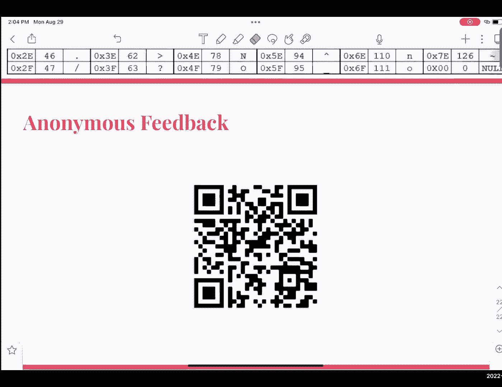

# CS 61C at UC Berkeley  - Fall 2022 - P4：Discussion 1： Number Representation - 这样好__ - BV1s7421T7XR

好啦，很抱歉，卡尔教什么，Cal Teach辅修K12的数学和科学教育，所以是的，考虑到这一点，呃，我们将讨论一些关于6-2-1-C，以及讨论将如何进行，所以讨论完全是可选的，出勤情况不会被追踪。

我们鼓励您尝试不同的部分，正如我们所知，可能会有一些教学风格更好的助教，那更适合你，所以是的，我们鼓励你尝试一下，TA之间的共识，所有核心的东西是讨论是非常有帮助的，所有课程的练习和复习，尤其是考试。

所以我们鼓励你们尽可能多地参加讨论，这样你就可以得到尽可能多的，离开这个球场，每周只有一次讨论，星期一或星期二，在这一节的最后会有一个匿名调查，所以请让我们知道如何改进一个部分，好啦。

所以我经常被问到的一个问题，你是如何在六个1C中成功的，我有三个主要的技巧，你们早点开始作业，嗯，科学最好早点开始，为了更好地掌握本课将涉及的概念，因为这些概念你不仅要学会如何应用它们。

你必须从概念上理解它们，所以是的，如果你早点开始作业，你更有可能真正理解这些概念是如何工作的，我相信这学期有四五个人在上这门课，他们都是被雇来照顾你的，到办公时间来，我们是来帮你的，我们真的很想帮助你。

并伸出援手，如果你需要任何支持，任何个人冲突，请发电子邮件给六一C电子邮件，我们有很棒的，学生支持，TAS是来帮你的，所以只要伸出援手，如果你需要帮助，嗯，家庭作业1已经发布，将在本周五到期，嗯。

我现在意识到项目一可能还没有发布，但它很快就会出来，我们将做两个半星期，但要尽快开始，正如我前面提到的，到目前为止，有人对这门课有什么问题吗，有很多，哦耶，明天有个实验室，我相信还是，哦耶。

每周都会有实验室，是的嗯所以是的，最终，在那里你会有你的单圈部分和你自己的最后期限，但是嗯，尽量早点开始，在很多这样的，因为你会很惊讶，一个虫子能花你多长时间，所以说，好啦，不要紧，嗯好吧。

今天我们要学习数的表示，我们报道这个的原因是，因为第一部分是计算机用数字存储一切，不管是数字，你写代码，编写存储在计算机上的文件，所有这些都以某种方式存储在数字中，所以我们在这里要做的是弄清楚。

在我们的系统中表示信息的最佳方式是什么，所以今天我们要讨论一个基转换，从十进制到二进制或者反之亦然，十进制到十六进制，反之亦然，以此类推，以此类推，在那之后，我们将介绍几种我们实际上代表的方式。

我们系统中的数字，即符号星等，一个组成部分，两分量与偏置，和编码，关于二进制，二进制i的意思是二，所以这意味着用二进制表示的数字是以2为基数的，这意味着二进制数字中的每一位或每一位数字。

可以是两个选项之一，零还是一，一个意味着使用位的值，零表示它不是二进制数，最重要的位位于左边，最低有效位位于右边，我们会再深入一点，至于为什么会这样，一个n位二进制数最多可以表示2到n个唯一数。

因为记住每个数字可以是零也可以是一，如果你有n个数字，你可以以此类推，得到总的概率，嗯，有两个到n个唯一数，位只是一位数，一小口就是四个比特，所以字节是8位，当我们开始十六进制时，小咬将是非常重要的。

二进制的前缀是零，B有一个小数，另一方面，另一只手是基础团队，所以对于二进制，我们有十六进制的两位数字的可能性，我们有16个，这就是为什么我们喜欢称之为比二进制对眼睛更容易，因为他们有很多。

因为我们看到的许多数字，十六进制是我们以前见过的数字，例如，零到九，十进制中的数字在这里，以及一些字母表，a b，一个十六进制数字等于一个半字节，四次出价，我们将更深入地讨论这一点。

当我们开始从二进制转换为十六进制时，十六进制的前缀是零x，到目前为止我们还有什么问题吗，我们测试它的东西，像其他基地一样，提出来，鸡蛋就像其他事情一样，我相信奥亚可能在讲座中被涵盖了。

所以也许这是你可以注意的，但我个人还不太确定，所以我找到了这个PDD，所以是的，所以我们实际上正在努力发布，讨论幻灯片，对全班同学来说，现在所有部分，他们现在不在网上，但我可以我只是在聊天中分享了。

让我把它放在正在讨论的中央索引上，一会儿就上来，是啊，是啊，谢谢。还有其他问题吗，好啦，所以考虑到这一点，现在我们可以继续进行基转换，所以当我们谈论基转换时，我们有很多方法可以在数字系统之间转换。

现在我们将专注于二进制到十进制，反之亦然，所以对于二进制到十进制，关于二进制数需要注意的一点是取决于索引，其中每个数字都位于，它可以或者它可以代表一定的功率上两个，所以如果我把这个例子放大一点。

对于零b的个数，你可以看到那条曲线，是吗，大家可以看到，好啦，嗯，正如你所注意到的，呃，第一个位，LSB，右边是二的零，是索引的第0位，因此它是二的零，然后你可以把它应用到，嗯。

这种逻辑在这里的所有其他部分，所以索引1位是2比1，索引二位是二到二，以此类推，以此类推，现在我们在这种情况下可以转换为十进制的主要原因，我们知道我们可以用2的幂来表示任何正整数。

一个完美的例子是105号，是啊，是啊，我们稍后会更深入地讨论这个问题，但是是的，嗯，从二进制转换为十进制时，一旦你知道，呃，什么二的力量，呃，数字代表你所看到的，你要做的是2的幂之和。

所以你可以在这里看到，编号为1的位是2到6，二到五，二到三，二到零，因为这些值是一体的，因此，我们需要在我们的，对十进制数字的计算，所以它变成了二的六，加二到五，加二到三加二到零，六十四加三。

二加八加一，一共一百零五，然后十进制到二进制，我们用我们可以，任何正的十进制数都可以表示为2的幂，我们要做的就是找到古墓的力量，最好的方法是找到2的最大次方，它比你有的十进制数还小。

所以在五个中的一个的情况下，的，二的最大次方是六十四，然后从105减去41，然后是三二，然后你得到，如果你减去这个，你得到九个，如果你减去8，你得到1，1是2的幂，二到零，减去1得到0，你可能注意到了。

呃，因为这是正二，我们知道有一定的，呃，它们所代表的二次方指数，所以在六十四的情况下，现在是二比六，因为我们知道二到六实际上是在这个小数中使用的，在这个二进制数中，我们要做的是。

确保二进制数的第六个索引位是1，然后因为我们有2到5，我们二进制数的我们的第五个索引位是1，2的3次方也是如此，二的零次方，所以我们能够，然后在这里得到这个号码，一零一一零一，那么我们有什么问题吗。

好啦，所以现在我们可以进入二进制和十六进制，反之亦然，所以二进制到十六进制，呃这么做，从二进制数的lsb开始，你把这些碎片分成小块，一个很常见的错误，我看到很多人犯的错误，当他们吃东西的时候。

他们去了什么，他们所做的是从MSV到LSV，从左到右，这是不正确的，你得从右到左，从伦敦商学院到MSB，然后您可以使用引用表将半字节转换为十六进制，呃，我们有，我们确实鼓励尽可能多地使用这个。

所以你可以在这里看到，我们有小数点0到12，我想它有点被切断了，但是代表每个十进制数的二进制数，如果你把它转换成十六进制，你可以得到，从0到0到s，所以在这里的例子中，零b零一零一零。

结果是我们从右到左，所以第一口是1 1 0 0，根据参考图表，它是C，然后我们有零零，零一是一，然后我们有0 1 1 0也就是6，所以总的来说，我们可以得到十六进制数0 x 6。

十六进制到二进制的一个C，而不是成群结队，最终发生的是，而不是将其分组为位，我们把它扩展成碎片，一旦我们知道每个十六进制数字是多少，我们可以使用引用表将其映射到适当的二进制位。

然后创建一个完整的二进制数，从那里有谁有任何问题，我们得到了数字6，是四点一点吗，我们在左边加上是的零，是啊，是啊，这是有原因的，这实际上是主要原因，为什么我们从LSB到MSB。

因为如果你把耳朵加到右边，你有效地改变了你的数字，创造了一个比，这是一个你可能不想要的数字，那里也有细微差别，如果是有符号的数字，就像2的补数，嗯，你应该在前加1而不是0，如果是阴性。

但我们很快就会讨论的，是啊，是啊，所以它并不总是你的一件事，是啊，是啊，还有其他问题吗？好啦，所以考虑到这一点，我们现在知道从十进制到十六进制，您只需使用二进制文件作为中间人。

我们知道如何将十进制转换为二进制，约束两个的力量，一旦你找到二进制，然后你可以把它分成小块，然后找到合适的十六进制数，我相信一个很好的例子就在这张照片中，或者其实没关系，是啊，是啊，从二进制到十六进制。

但是是的，您只需使用十进制到二进制，然后二进制文本十进制，好啦，所以考虑到这一点，让我们进入工作表，呃，第二，呃，上面写着，将下列数字从其初始评级x转换为其他两个通用费率，这意味着如果它是二进制的。

转换为十进制和十六进制，如果是十六进制，转换为二进制和十进制，如果是小数，把它覆盖到二进制和x，所以我们给你们几分钟看一下，我想我们可以开始查他们中的一些人，呃，有人有什么特别的问题吗，他们想开始检查。

这里有支持吗，好啦，所以考虑到这一点，我想我能做的就是从第一个开始，所以在这里我们有一个零b，哦耶一个一个，哦对不起，是啊，是啊，呃零一零一，我们以前就知道，为了把它转换成十进制，我们要做的是。

我们得找到力量，我们必须找到两个的相关幂，与数字1的每一个位，然后我们把这些总结起来，所以在这里，这是二的零，所以这是一个，这是二比一，也就是二，然后是二三二四二对二对五，三二三六，二到八。

我相信是两个，五个，六个，所以如果你把这些加起来，二百九十一个，呃，是啊，是啊，哦耶，那件事我很抱歉，哦耶，所以这是七个，然后右边，这样七个就变成了一百二十八个，然后第四位是十六，所以让我继续。

简单地重做这个，啊，一二八，然后十六岁，然后呢，休假，是一四七，是呀，是一四七，然后为了把它转换成十六进制，会记得我们要做的是，按小口分组，所以在这种情况下，我会把它往下移一点。

所以让我们把这个变成小食，所以我们的第一个小食将位于右边，所以应该是0 0 1 1，然后我们终于有了一个零零一，然后如果我们用我们的查找表，呃，零零一一应该等于三，然后一零一等于九，所以是零九三。

或者是的，有人对此有疑问吗，有人想让我再举个例子吗，好啦，呃，我会的，呃，有人还想看这部分吗，还是我可以继续前进，我想我会继续前进，然后改变他们，接下来的b部分是将以下数字从十六进制转换为二进制。

人们有机会进入这个部分吗，是啊，是啊，所以呃，考虑到这一点，我想我只负责第一个，所以请记住，当我们将十六进制转换为二进制时，而不是像把它分组成比特，我们得把它扩展成块，所以在这种情况下我们需要做的是。

我们需要找到映射到D的适当位，在这种情况下是1-0-1，呃，是1比0 1比3，会是零，零一一，然后对于d，它又是1，0，1，所以考虑到这一点，然后我们就有了二进制数，零b一零一零一零一，哪个。

如果你们好奇的话等于五十五万四千，一百八十九，是呀，这是不寻常的，我不认为你们这学期会被骗，所以是的，把它记下来就好了，是啊，是啊，是呀，因为你面前有十六进制数字，只要确保你按正确的顺序做就行了。

这才是最重要的，还有其他问题吗？所以一个关于喜欢的问题，第一部分，我们把一个双数转换成一定是八，你为什么喜欢把它加进去是的，正如布兰登之前提到的，如果是负数，你得用一个拍打它，当我们讨论2的补数时。

我们会更深入地讨论这个问题，我知道这些问题，好极了，我想我们可以进入下一部分了，它涵盖了，我们首先要讲的是符号和星等，会签到，然后会签到，这意味着我们有一点，MSV说作为我们的标志，所以它可以是消极的。

也可以是积极的，然后我们有我们的大小，这就是所有的，右边剩下的部分，所以在这个例子中，零b一零一零，我们有，因为我们的MSB是一个，我们设定的标志是一，那就意味着它是阴性的，然后我们有z。

然后我们有剩下的我们的规模，也就是，呃，零零一零，等于2，因为它是负的，你可以把它表示为负2，然后你在底部看到的例子是，同样的号码，但被认为是积极的，因为符号位被翻转了，比率是负的，2的m-1次方。

乘以2次方再减去1，你知道这个范围是什么是非常重要的，因为你很可能会在考试中被问到这样的问题，这里的交易是有两个零，你能解释一下为什么这里的两个零，什么会，是啊，是啊，然后我们想尝试一下为什么有两个零。

我们可以，我们可以让我们的星等为零，但是我们有一个零的迹象，但我们的星座可以是正的，也可以是负的，产生正零或负零，有人对此有什么疑问吗？为什么这是一个问题，嗯，我是认真的，只是你在用。

你有可能代表另一个数字，但相反，它必须是零，有点，我就是这么想的，但在硬件上很难处理，是啊，是啊，您必须构建能够处理两个不同版本的零的组件，是啊，是啊，是在范围内减去一个来解释这一点吗。

这就是为什么我们必须减去一个，因为我们几乎浪费在零号上，完全正确，是呀，嗯是的，因为我们只有n-1位的大小，是呀，我们必须，它必须是真实的，还有其他问题吗？和数是位数，是呀，我很快就记下来。

在这些问题上，他们会明确地对你说，像你这样最重要的乐队，找到它或者，比如你问他们是否会要求你用不同的方式使用符号量，而不是之前的这个，是啊，是啊，所以如果他们做得最好，你得假设它是那种结构，是呀。

变焦上有一些人想让你再检查一遍范围，并解释为什么这些是界限，好啦，所以请记住，所以在这种情况下，并将表示位数，所以我们所拥有的，所以如果我们要表示一个一般的二进制数，我们会在这里吃一点。

然后我们有了一个M，然后我们得到n的负1位，我们可以创建的以a结尾的最大数字，位是2的n-1-1的次方，因为这基本上就像把这里的所有部分都设置为一个，然后耶，因为我们不一定能表示2到n减去1。

尤其是你需要你，如果你想表示2的n-1的次方，你需要额外的一点，因为这是一个更重要的数字，你不能用n减去1位来表示，所以这就是为什么你可以，你的绝对值最大值是2除以n减去1减去1。

然后因为我们这里还剩下一点作为标记这可以是，这意味着可以表示的数字要么是n减去1的负数，减一，或者2除以n减去1，减一，就二进制任何事物而言，这个类的基本真理是，如果你有n位。

你可以代表两个到N个不同的东西，所以是的，我们为了这个标志牺牲了一点，所以这意味着我们现在被限制在n-1，记住这一点真的很重要，这会一次又一次地出现，对事情是的，但也只有这么多，是呀。

这是你能做的最大数目，是呀，呃，还有其他问题吗？好啦，所以考虑到这一点，我们可以进入下一个表格，曾经是赞美，一定要记住，这是比较罕见的，很少用在像硬件之类的东西上，所以我会把重点放在这一点上。

但知道这一点仍然很重要，因为当我们覆盖2的补数时，我们将在这里使用非常相似的逻辑，这里发生的是m是msb是符号位，所以正整数看起来像普通的二进制表示，除了msv为零，所以在这里的情况下，在这里的情况下。

我们知道我们可以代表呃，零b零或一1等于七，所以不管我们这里有什么基本上都是正常的阳性，像整数，然而负数，我们需要做的基本上是翻转，所有的都是翻转，为了得到你的否定版本，在这种情况下。

因为我们知道7等于，为了得到负七，你得把零件翻过来，就会得到0 b 1 0 0 0，这里的范围是，我相信和嗯一样，呃，符号和星等，因为你还在保留一点，作为某种征兆，就像它不会喜欢零。

就像msv是零如果它是正的，如果它是负的，MSU将是一个，还有两个零，因为你可以代表，零为零，零零零还是一一一有人对此有什么问题吗，现在我们将进入我认为最重要的，呃，这类中表示数的表示法表示法。

也就是2的补语，在这种情况下，2的补语是选择补语，MSV是符号位，正数看起来像普通的二进制表示，MSB零的地方，所以与我们在补语中看到的非常相似，另一方面，一个人的补语和两个人的补语有什么不同。

如何从负数得到负数，你会简单地做什么，你要做的就是得到未签名的版本，所以积极的版本，但你不仅会翻转零件，你得加一个，为什么我们最后会有一个，是因为如果你，如果我们用这个例子，这里，我们知道这是七。

但这是负7，在这个例子中，我们实际上可以使用这个MSB，不仅仅是代表符号的东西，它代表着，以及设定位的大小，就像我之前说的，索引n位表示2的n次方，所以在这种情况下，因为这是索引3位，这将是两到三个。

但因为它是一个，是阴性的，然后我们可以在这里加1加2到0，所以它等于负八加一等于七，所以我们这里基本上有的，现在我们能够利用我们所有的比特和使用，更确切地说，而不是喜欢，实际上保留一点作为标志。

我们实际上能够使用所有的位并表示整个数字，所以这就是为什么这里的范围是负的，二到n减去一，以及2的n-1-1的次方，我们这里只有一个零，算术更重要，做起来很简单，如果你做一些像一次赞美。

但你必须意识到溢出，因为有可能，如果你需要额外的比特来表示更多的数字，那不一定是对的，因为假设你想做一个积极的，你有两个正数，所以你会知道它的和是正数，如果您的溢出以某种方式达到msv等于1的点。

你实际上是在创造一个负数，所以这是你必须注意的事情，任何关于选择补语的问题都是，如果你看到这个数字，你怎么知道是阴性的，但我不喜欢，哦，我想，哦耶，你知道的，所以这就是喜欢的大根源。

我想在很多这些话题上的困惑是，嗯，没有什么能告诉你这个二进制字符串之间的区别，嗯，在一个人的补语中的等价字符串之间，或者等价的字符串，就像正弦波，对呀，因为那是完全不同的数字，嗯，它实际上就像先验知识。

就像你在用什么样的约定，这就是为什么我喜欢我把这些大会，因为你作为设计师，就像我要用补码来表示我的数字系统，您还可以为不同的应用程序使用符号幅度，是否更有效率，但是是的，所以如果你在这类事情上有问题。

你会被告知它就像管子，补充和签署，或者如果你正在使用，你会发现它现在是价值的一部分，为什么范围仍然是负一，对于正数2到n减去1，从技术上讲，这仍然像正弦震级，我们可以，因为第一个比特的msv必须为零。

无论发生什么，所以你还是要用，最后的n减去1位表示最大数字，等于2的n次方减去1，但是，另一方面，如果我们想让最大的负数，我们所要做的就是让MSB成为一个，然后我们可以让剩下的位设置为零。

这回答了你的问题吗，是啊，是啊，好啦，呃，还有其他问题吗？好啦，所以呃，考虑到这一点，我们可以继续我们今天的最后一个，即偏置编码，你要用这个，加上2的补语，当我们开始组装时，所以请注意。

这也是非常重要的知道，所以假设双向编码是这样，假设你知道最小值在，或者你知道你需要表示的最小值，那就等于我们的偏见，因为我们可以做的是，如果我们把我们的数字表示为零，或者如果我们必须有一个零的二进制数。

我们可以做的是从中减去我们的偏见，这就得到了我们最大的负数，我想是什么，是啊，是啊，所以呃，等于最小值，上面说把最小值等于零，所以在这种情况下，如果我们说我们的最低值是127。

我们要做的是把最小值m设为负1 2 7，这意味着我们也把我们的偏差设置为负1 2 7，因为那会变成负1 2 7，加一二七，是零，然后为了把一个数字向负方向移动，请一定要加上负偏差，向积极的方向转变。

你加上一个积极的偏见，你有点像，你可以在这里看到，我们正在改变数字线，为了在负范围内表示A中的更多数字，所以在这个例子中，它是一个正偏差，通常在这门课上，你会看到一个消极的偏见，对于偏差，正常值。

你会看到的标准偏差是，2-2的n-1的次方，或者负2的n-1-1的次方，然后作为一个人的补充，它是n的2次方减去1减去1，所以标准偏差是这里列出的，然后这个范围与无符号范围非常相似。

也就是0和2的n减去1，但在这种情况下，取决于你决定如何移动数字线，你试图代表多少个数字，它应该同时应用于0和2到n减去1，有人有问题吗，所以我只想说，呃，你记下号码，你替你做广告，是呀，你嗯。

它是加的吗？这取决于你如何处理这个标志，所以你可以有一个消极的偏见，是啊，是啊，但如果是负面的，我们要加上负五吗，还是，是啊，是啊，我们正在添加，有什么问题吗？其他问题，是呀，为什么会在那里。

这只是你通常会看到的偏见，呃，因为我的意思是，我可以放弃的最好的例子是，每当我们使用八位，通常是负127，这就是为什么我之前说的答案是127，因为本质上我们所做的是，呃，缩放我们的整个数字线。

所以我们可以表示相等数量的负数和正数，所以这就是为什么，那是，呃，还有其他问题吗？她也缩小了一点，哦，我其实，呃，考虑到这一点，我想我们可以继续，呃，我想是你的三号，你的三号，呃，工作表右，是三号吗。

是啊，是啊，好啦，所以是的，我给你们几分钟来处理这件事，随便和你的邻居谈谈，如果你需要任何澄清，或者需要帮助就问我们，呃，呵呵，就是这样，在聊天中，这实际上是一个很好的问题，比如偏见的意义是什么。

我有点喜欢这个问题，因为我觉得我在第一行就问了同样的问题，本质上它允许你把这个无符号数范围，从0到2再到n减去1，嗯，但你可以转移它，假设你需要一个数字系统，可以代表500到7000。

你可以用无符号数字表示0到7千，但你在前500英镑上浪费了一点，说你知道你永远不会用那些数字，所以你可以用更少的比特来表示你需要的实际范围，但只要把整个数字系统移过来，如果有道理的话，是啊，是啊。

当我们开始使用浮点运算时，这种原理会更加普遍，所以是的，记住这一点，而且如果你按标准拍的话，总是会有一个正数比群体多吗，取决于您是否使用标准的，是呀，但从技术上讲，如果你认为零为负，你可以算它相等。

但是是的，否，是的，是有一个广泛的喜欢，我能做的就是，我不认为，两种可能，你怎么，你是什么意思，像一个平等的人，正负数，好像你知道，假设我永远不需要代表你，有没有办法喜欢，把它弄得像，如果我在某个数字。

我喜欢，再减去一个，所以我去掉了范围内的数字，我想你可以用，就像2的补语系统，然后还有一个偏见，所以你可以代表0到128，但也要移动一个，这样你就可以表示它们的负面版本，还有人在变焦。

你能听清楚学生的问题吗，否则我可以试着重复给你听，好啦，也是两个人的，可能总有一辆公共汽车，所有的是，是啊，是啊，因为你可以用负数表示二减一，而不是它的正面形式，就像，五分钟左右，然后就像现在，就像耶。

有几个，好啦，所以开始写下这个问题的答案，所以我只想知道，我要花一点时间来回顾一下，所以对于未签名的，我们知道我们的范围是0到2的n-1，因此我们的最大值是2的8减去1，一共是二百五十五，然后加上一个。

我们会给出一个溢出，所以虽然我们会有一个额外的一点在旁边，剩下的八位都是零，所以我们得零分，然后类似的事情有偏见，这是一种，嗯，当我们得到一二八，当我们加上一个，我们会得到另一个溢出。

如果你给它加上某种偏见，减去127，然后我们最大的二人组是一百二十七，因为它是2的n减去1减去1，如果你加上这个，你就会产生另一个溢出，所以是负数，二十八不是真的溢出来了，这只是MV，就是这样一个。

这是我想要的，偏见，好啦，所以对于偏见，嗯，我知道怎么去，所以代表一百二十八，这意味着，嗯，其实我先过去补充一下，所以为了补充，如果我们有八个比特，我们知道我们是我们最大的数字将是正的。

这意味着我们的MSB将为零，其余的位将为一，这是我们两个的补数，作为我们的，我把这个，这是我们作为两个补充的最大数字，但是，如果我们想，如果我们在这个数字上加一个，结果会是什么，最终会发生什么。

它变成了零，然后你拿着一个，然后我们一直带着一个直到我们到这里，这就给了我们这个数字，记住msb表示负2的索引位的次方，因为我们的索引位是7，这个数字是负2的7，是负一，二八，这就是2的补数，另一方面。

偏见，嗯好吧，我要去，我需要一点时间，哦耶，所以嗯，记住，偏见会改变一切，所以我们可以在无符号版本中表示的最大数字，在视觉上看起来像任何人，所有的，是的所以当你把一个加到所有的，接下来会发生什么。

你得到一个溢出位，然后你就什么都没有了，但请记住，我们将这些无符号数字映射到我们的偏差的方法是，我们只是把这个负的1，2，7加进去，所以如果我们都有，然后我们再加一负一二七，我们最后会有一二八，对呀。

因为最大的数字和8位无符号，一共是2，5，5，再减去一二七，好啦，所以如果你加上一个，那么现在你有所有的零，然后你从0中减去一二七，这给了你负面的，一二七有道理，我也可以把它画出来。

这可能是一个比任何有意义的东西都更好的视觉例子，每个人，好啦，所以我们还有一分钟，所以很不幸我们无法完成剩下的部分，但我确实想花点时间快速复习一下预先检查的问题，所以第一，所以呃，鉴于我们今天所学到的。

希望你们能够理解并回答这些问题，所以我只想问你们，取决于上下文，相同的位序列可能代表不同的东西，真假真，是呀，因为我们有不同数量的表示，在2的补码中有可能得到溢出误差，当把相反符号的数目相加时。

真的是的，因为在本案中，如果我们把1加1加2加7，我们，你会认为我们会得到一二八，取而代之的是，我们得到负一二八，这有点像，我们得到某种溢出的原因，哦其实等等，对不起，给我一分钟，甜甜的，是啊，是啊。

这是假的，呃，原谅我，嗯，哎呦，是呀，上面写着，相反数，所以是的，你永远不会，呃，如果你加上相反的符号，你可以用2的补数表示任何一个数，这样就不会溢出来，如果你，但是有两个相同符号的数字。

您很可能会得到溢出，好啦，所以如果你把一个n位2的补数解释为一个无符号数，负数会小于正数，真假，假的，是呀，好啦，嗯，然后如果你解释一个n位偏差符号数，好啦，这是个诡计问题。

我们可以用给定的表示格式表示分数和小数，未签名，有偏见，二的补语，答案既不是真的也不是假的，你会学到这个浮点，因为它是一对数字表示的组合，是啊，是啊，是啊，是啊，有点被包裹着，是啊，是啊，好啦。

在大家离开之前快点，嗯好吧，首先，这是阿基尔的第一次讨论，所以呃，谢谢你和我们在一起，嗯，它真的帮助我们学会如何更好地帮助你，所以请大家快速扫描一下，这是一个很短的形式，需要两秒钟。

别忘了下周星期一是假日，所以我们的部门，星期二有一节，然后我们现在就会回到彼此身边，还有，当我们把这些幻灯片上传到网上，你会走到最后，有一个范围表，显示，就像未签名的，偏置符号，他的赞美，无论如何。

我做得很高很高很高，建议大家记住，如果你不能使用备忘单，所以是的，好啦，因为你肯定会被问到，就像，最大的数字是多少？的最小数目是多少，哼，呃，那将在中央环节，呃和邮政，是啊，是啊，是啊，是啊。

非常感谢你能来，是啊，是啊，我们两周和两周后见，谢谢你和岁月，你熟悉家庭作业的问题吗？对不起，是呀，我认为对于缩放问题的偏见之一，这是一个积极的方面，你给我一秒钟，是啊，是啊，你可以用肯定的说法。

也可以根据情况而定，是呀，如果你想改变你的，如果你想转移你的数字线，更像是积极的而不是积极的，反胃阴性，所以如果我没记错的话，就像一个非常像，这是一个现实生活中的例子，但后来它给出了确切的事情是。

你得记住，你可以很好地添加或减去符号，那你就是不愿意--你能重复一遍你的问题吗？我不记得真实的生活情况了，但它说的就像，你要么用负一二十七要么用正一二十七，所以正一点七，如果你是。

如果你想忽略所有的数字，在零到一二六之间，对呀，然后你用像，你得到一个，它说你应该像你一样使用两者，我有个问题，你一秒钟前，让我们说，记住这个问题，我对这个问题不太熟悉，所以我亲自，我帮不上忙，好啦。

谢谢你，所以说，不客气，我有一个关于第七张幻灯片的问题，哎呦，等一下，呃，你不在这里，对不对，你们都七十多岁了，虽然，他们在幻灯片上说两个互补和一个互补的偏见，符号和星等，所以我给出了三个系统的偏差。

这对我来说毫无意义，因为我问了这个关于偏见的问题，他们说偏见不用于。

嗯，其他系统，除了偏右的那个，现在是匿名的，给你们的变焦，我想我有几个问题在这里，我可以鼓励你们在，呃，发布此讨论，我马上去看看，我有，离开这个房间，关闭变焦呼叫，是啊，是啊。

