# CS 61C at UC Berkeley  - Fall 2022 - P7：Discussion 2： C - 这样好__ - BV1s7421T7XR

好啦，牛逼，所以是的，欢迎来到今天61 C的第二次讨论，我们将讨论一些C内存的东西，就像网上讨论一样是在东海岸，因为姐姐要上大学了，诸如此类的事情，嗯，但是是的，所以今天会有很多内容。

复习一下前三堂课的内容。

嗯所以真的很快，如果你还没有机会填写嗯，有点不太出席，只是有点了解你的形式，我怎样才能更好地帮助你形成，呃是的，你尽管做吧，基本上它的工作方式，因为它将在接下来的几周内发挥作用。

我们从一开始就有一个格式，你可以在下个月的某个时候填写，大概10到15分钟，然后它基本上会帮助决定如何，接下来的讨论，所以现在只是浏览一下回应，似乎每个人都看了介绍，所以我们都知道C是什么。

然后有些人看了指针，数组和字符串讲座，我最后相信的是哪一个，星期三，是呀，所以我们可能会得到更多的细节，然后大约一半的人看过内存管理或管理不善，所以我们会更深入一点，然后在信心方面，嗯。

我们对指针和数组非常有信心，也就是，或与其他主题进行比较，令人印象深刻，嗯，似乎我们都对记忆是如何工作的和记忆行为感到困惑，所以我们将深入讨论，是啊，是啊，好啦，我通常今天会提前复习一下这些。

有一点设置问题，但是是的，嗯，非常快的介绍，万一你没参加上周的讨论，我叫卡罗琳，我作弊太久了，我的是她系列，我是EMCCD专业的四年级学生，我现在快死了，处理得不好，我来自洛杉矶，我搬了很多地方。

我已经教61个C太久了，我从Covid开始教书，我还在这里，嗯，然后我参与了很多不同的研究项目，有点不喜欢，如果你想谈谈这个，有空来找我，我真的很喜欢音乐和户外活动，虽然在一百零三度的时候可能不会。

嗯好吧，所以是的，这张照片远在Covid期间，当没有人能看到任何人的样子，但是嗨，这就是我，这是我的照片。

嗯是的，事不宜迟，我们要进入剩下的部分，所以说一个崩溃，我们将介绍一些C基础知识，就像上周三的简要概述是如此遥远，我知道有时候是左耳进右耳出，有时对我来说也是，我们将简要地回顾一下记忆，它的结构和行为。

调用函数时，关于它可能是什么样子的一些例子，然后我们来看看记忆是如何标记的，然后我们要开始做练习题，做一些练习题，那很好，好啦，然后我们有一些部门后勤，你在这里成功了，很明显是，所以四五。

如果你不亲自来，绝对不怪你，今天真热，我在想我要不要走三十分钟，所以这里，嗯但是是的，快三十四岁了，零五以及变焦，嗯，如果有人说，我觉得，例如，或者嗯，他们来联系，又或者是天理不容，就像网上的115度。

嗯，然后这将是一个深刻的部分，这只是意味着它的两个小时，会更深入一点，更多评论重磅，这也意味着如果你有很多问题，可能是问那些问题的好地方。

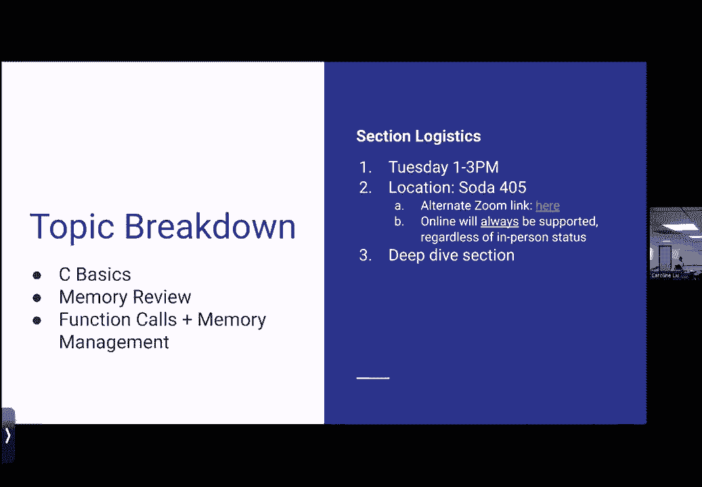

嗯是的，在我们开始之前，对物流部分有什么问题吗，对于那些在线的人来说，我打开了聊天室，所以请随意提问，我看到有，啊，那里有，嗯，我不认为，让我看看这上面没有。

所以说。

但这里没有人碰巧在变焦右，好啦，怪异，也许我会把音频调回，让我看看，进入缩放，我只有一个音频源，哎呦，现在起作用了，在线等待罐，这样好些吗，哎呦，没关系，牛逼，花式输入的东西，好啦，嗯是的。

希望你看到了后勤方面的东西，如果没有，我可以在最后再重复一遍，但我们要直接跳过去看看，为了时间，所以现在，你根本不用担心工作表，我们只是要去看看一些回顾幻灯片，所以如果你喜欢，我忘了上星期的课。

没关系，所以首先也是最重要的是输入，所以我们在C中看到的一些东西，到目前为止，事情是静态类型的，但这也意味着我们可以把东西，所以用C键入的想法是，基本上，你拿一系列一定长度的比特，所以也许四个比特。

八位吧，然后你给它一个类型，因此该类型被赋予c编译器，上面写着，好啦，我要看看这种类型，不管是整型、字符还是其他什么，都要这样解释，所以呃，上次讨论，不是说教，我们谈到了这样一个事实。

即一系列的八位可以解释，就像一个内存地址，作为无符号整数，以许多不同的方式将整数赋值为字符，例如，所以打字决定了如何解释这些，所以是的，这只是意味着有铸造的想法，所以你可能见过像Java大陆一样的铸造。

那是很久以前的事了，但选角的想法基本上是在说嘿，这就像一种类型，这可能就像一个，假设八位整数，但是我们想把它转换成一个32位的整数，所以我们要把它转换成一个32位的整数，告诉编译器，嘿嘿。

我们要看看这个，并这样解释，所以一个更令人震惊的例子可能是，假设我们有一个内存地址，然后我们现在要把它投射到一个角色身上，或者假设我们有一个角色，我们要把它投射到一个内存地址，和说嘿。

以这个随机字符为例，它的值可能是随机的，我要把它解释为记忆，所以选角真的很强大，当你想让事情按你想要的方式运作时，但它也可能有很多错误的空间，比如，例如，如果你取一个随机的整数，假装它是一个内存地址。

这可能会有问题，所以这也意味着你能够区分事物，所以这指的是说，好啦，嗯，如果我有某种类型的东西，如果我试着把它设置成不同类型的东西，那是同样的价值，从技术上讲，这将发出警告，因为它在说嘿。

这些东西是不同的类型，所以你可以区分它们，嗯，所以一些基本的定义，一个字符总是一个字节，所以在这个类中，我们基本上把一个字节定义为八个位，在现实世界中，这并不一定总是正确的，有时。

字节可能被定义为不同的字符集或不同的长度，角色呃，数据类型总是被定义为一个字节，所以这就是为什么当我们观察其他类型，我们总是说嘿，这就像，假设x字节数，这是真的，不管你在什么系统里，因为最基本的定义。

嗯仍然成立，只是基本定义，呃，长度可能会改变，那么有多少位，字节可以是可变的，视系统而定，但是基地，呃那个，但它是所有其他尺寸的基础，我刚意识到，因为我不再在这里分享，我不需要打开这个，所以有点没用。

嗯，然后还有一个简短的想法，所以你可能会看到这个，偶尔，不太常用，但这是定义为两个或更大字节的东西，一个整数将被签名，它将是四个字节或更大，Long将是8字节或更大，然后指针是内存地址。

在一个3位2位的系统中，它将是4个字节，在一个64位的系统上有8个字节，事实上，你现在使用的所有东西，iPad，膝上型计算机，随便啦，他们很可能都64岁了，但是有一点，只是我们不够刻薄不够酷。

为了让你们一直计算64个比特的价值，所以我们坚持在61C中使用三个四位系统，嗯，以后，在课堂上当你工作更多的时候，我想在记忆系统之类的东西上，你可能会有问题说，就像一个4位2位的系统，或者类似的东西。

但通常，如果它没有具体说明，一般都是三三两两的，所以很快，嗯，有人想猜猜，至于为什么这两个系统中的内存地址是它们的大小，四乘以八，啊，呃，32颗星，还有呃，八个时态是如此，是啊，是啊，的。

下半部分和白色结肠，就像时代，位的权重数，是啊，是啊，正是这样重申一下，嗯，当我们说四个字节，那是4乘以8位，一共是32位，这和32位系统部分是一样的，六十四位也一样，嗯，它的工作原理。

这是因为内存地址基本上是内存索引，所以我们来看看，记忆是如何构建的，但是内存地址的概念只是说，嘿嘿，我希望能够访问那个内存地址中的每一个字节，所以如果你有价值32比特的东西。

然后你需要一些能够解决所有这些问题的东西，所以如果我们考虑一下，就像一种较小的规模，如果我们有四个，呃，让我们说两个位，两位，我们可以有零零零一零一，四个不同的值，所以嗯，从技术上讲。

这给了我们四个不同的字节，我们可以地址，所以我们需要两个比特，因为我们取对数基数的两个，因为位一次只能表示两个值，所以如果我们把它放大一点，如果我们想代表30，二位系统。

我们需要两个到三个两个指数才能解决所有问题，但是因为我们不需要二到三个二位来表示所有这些，我们只要取其中的对数基数2，这就给了我们三个二位的地址，当你比较3位2位系统和4位系统时，那是指喜欢吗。

硬件中固有的较大存储系统，你可以在64位系统中拥有这些额外的地址，或者只是细分相同的内存地址，但更多的地址，甚至分配，是啊，是啊，这是个好问题，所以重申一下，呃，因为这可能没有捕捉到一个快速的问题，嗯。

你们在网上能回答多少问题，但弹一些，嗯是的，所以重申一下，基本上，这就像比较三个2位和64位系统，我们到底在比较什么，不管是固有的硬件内存大小，或者就像我们如何细分事物，简短的回答有点像两者。

在这节课的最后三分之一，我们会学到更多，但通常本质上，三个二位系统的内存空间会更小，所以你可以想想，就像你有更少的内存，记忆的实际工作方式和与，比如硬件，或者硬件如何与软件交互就像，就像一个更深的层次。

但我们会在以后的课上讲到，但现在你可以想想，由于用于内存存储的硬件尺寸较大，嗯真的很快，对不起，但是呃，当你回答问题的时候，或者问问题，你介意重复你的名字吗，只是因为我不知道，如果有人是这样。

你叫什么名字？约翰然后耶，好啦，冷静好的，所以从这件事中继续前进，嗯，为什么指针大小会改变，我们已经讨论过一点了，但这个想法只是指针是内存地址，我们可以互换使用这些术语，和内存地址已寻址内存。

所以我们可以看看它在这里的行为，那么我们中有多少人熟悉数组或以前使用过数组呢，好啦，六十一B完成了他们的工作，嗯，所以我的突袭基本上只是连续的记忆区域，或者连续的块，我们可以把东西放进，所以说。

如果我们在Java中有一个整数数组，这只是意味着你有一大块东西，你现在要去，指数零一二三，一直到n-1结束，就像，所以你在不同的空间，你可以用索引的方式把东西放进去，那就像，说。

数组括号零设置为等于某个值，所以我们认为记忆是这样的，所以这有点难概念化，因为我们不能，看看硬件，我们无法真正看到和观察它的行为，但我们可以把它看作是一大块，一个巨大的阵列，所以嗯。

假设h n是剩下的十六进制值，那么这实际上等于什么呢，所以如果我们解释所有的fs并选择补码，负1，负1，是啊，是啊，在2的补语中也是如此，所有的1或所有的f，如果我们把它看进去，十六进制只代表负一。

这是一个非常方便的花花公子把戏，但我们实际上要看看它，就像现在一样，我们要去看看，在某种程度上告诉我们比赛的规模，所以假设我们必须，然后我们说我们有这些内存地址，全是零，然后一直到所有的。

所以m值和这里的终值，他们完全不同，所以我们在这里说的是，我们是说这个内存地址从零开始，这个内存地址不是负1，因为我们不能有负内存地址，这将是最大的可能值，给定一定数量的比特。

现在在未说的情况下是有意义的，是呀，所以这是非常重要的事情，内存标识必须无符号，所以这里有点模糊，嗯，但这绝不是一个真正的内存地址，嗯好吧，所以如果我们真的索引到这个特定的数组中，不要把它当成记忆。

但我们现在正在看，假设我们从零一直索引到n-1，我们之前说过m不可能是内存地址，因为它现在代表负1，但是如果我们把它转换成一个无符号整数，假设无符号整数n等于m，那么最终值实际上是一个有效的内存地址。

所以在这种情况下，我们要说的是，最后一个块的最后一个可能的索引，或者数组的最后一个值是m减去1，好啦，这就是它在二进制中的模糊外观，所以嗯，我们不是说我们只有三个比特可用，我们这样写只是为了留点空间。

所以我们从所有的零到零开始，零一，零一零一，以此类推一直到m-1，然后这个特定的索引会给我们所有的，所以实际上我想我犯了一个小错误，索引本身应该是所有的吗，最后是一个零，但我们只是说这是目前的规模，嗯。

好的问题，在线内容的大小有限制吗，在数组盒内对于一个2位系统它们能超过32位吗，例如，所以嗯，里面的东西其实是一个一个的，所以限制是八位，所以这实际上到了一个重要的地步。

因为内存inc和在典型的系统中总是被认为是字节地址，所以这意味着我们通过这些碎片，一次一个字节，所以每八个比特，例如，如果，就像在课堂上，我们谈到了一个事实，即有一个蚕食，我知道有些人在讲座上说。

到底为什么，你能说出类似的东西吗，不过，咬一小口，也就是半口，热辣的双关语，嗯然后我们说嘿，如果记忆像啃咬地址一样，然后我们会检查内存，每四位检查一次，因此，我们需要两倍的索引才能索引到所有的东西。

因为我们把所有的大块分成两半，所以说，然而还有一个词的概念，它是四个字节，所以如果我们有单词地址记忆，我们需要多少指数，我保证这不是一个诡计问题，是啊，是啊，所以我们这里的指数总数除以4。

因为与其以字节的方式浏览事物，所以每八个比特，我们要从字面上看事情，即每32位或每4字节，是啊，是啊，一个字是系统的一面，对呀，一个词是系统的一面，一句话，嗯，所以它在技术上不是这样定义的，例如。

一个字都不会改变，仅仅因为64位系统，嗯，我相信一个词总是会被定义为四个字节，就像一口，呃，因为它总是以字节为单位，现在字节的大小发生了变化，位数变化，但它总是以字节来定义，是六十四位的名字吗。

八个字节，双字，呃，是啊，是啊，确切地说，这是一个双字，嗯，如果你有八个字节块，所以是的，伟大的问题，所以好吧，如果我们用十六进制来看待事物，同样的交易，嗯，我们只要一直到所有的FS，这些都是指数。

假设我们有一个叫做汽车数组的字符数组，我们要做M号的然后我们，把后面抬起来抓住，所以如果我们看看这里发生了什么，嗯，在这些块中，我们将能够存储8位，现在我们把字符定义为一个字节，也就是八位。

所以这意味着每个角色，我们将能够在一个字节中排序，所以如果我们有像，假设一个标准整数，它是四个字节，接下来会发生的是，它将占用四个块并存储整数的内容，每四块，所以就在这里，我们从侧面看事情的唯一原因。

或者我们能够按顺序存储东西是因为我们有一个字符数组，假设我们在零点位置有汽车阵列，我们将它设置为c，哪个块将被设置为c，是啊，是啊，第一个，所以看看那个，这是c的二进制ascii表示。

这样你就不用背腹股沟表了，但这只是，嗯，字符可以按位编码，所以一切都回到了整体，你听过很多次了，一切都是比特，一种想法，所以这是c，假设我们两点有车，等于6，哪个方块会被填满，六二六，是啊，是啊。

所以就在这里，所以嗯，在指数二，会装满六个，所以你可能会看着这个，啊，为什么会这样？它只是应该像，嗯零，全是零，然后一一零，原因是因为这是六的字符表示，所以我们可以注意到，嗯，在此过程中。

字符的存储方式，所以如果我们看看编码，会发生的是最低或最正确的数字，所以编码存储在块内的最小值，所以我们读到这样的东西，例如，最低的一个最多啊，最低值，第二个最低字符转到第二个最低地址。

所以这可能感觉有点直觉，比如我们为什么要用其他方式储存它，这只是我们储存记忆的方法之一，所以有一个版本可以翻转，例如，哪里嗯，呃，最高有效位存储在最低内存地址，第二个最高有效位存储在第二个地址。

这只是存储在内存中的两种方式，这种想法被称为印第安人，所以如果你把最高有效位存储在最低的内存地址，这就是所谓的大endian的概念，在系统中并不常见，在社交中很常见，我相信，诸如此类的事情。

然后这个想法是小印度，我们的大多数系统都会使用，它在说嘿，最小值位将存储在最小值地址，到目前为止还有什么问题吗？我的计算需要在这里，哦耶，所以嗯，我其实不知道理由，至于为什么，人们决定，呃，去一件事。

I，它可能是为了某种计算，比如硬件，它使它更容易一点，而不是把事情翻来覆去，我想喜欢的原因，例如联网，是吗？相反的方向是，因为对于最低的内存地址，先发出去，然后它可以读成最大的，那只是我的理论。

至于为什么，但是是的，我们的大多数系统只使用很少的印度语，嗯，是从零开始还是从七开始，4c，是呀，所以为了澄清，嗯，顶部是内部最低的内存地址，或内存地址中可能的最小值，我们把东西储存在这个方向，好啦。

所以如果我们看看，嗯，其余的储存，所以我们就这样看一遍，我们可以看到我们继续，事情以我们期待的方式被填满，这就是通常内存被填满的方式，所以嗯，是啊，是啊，有人问，解释印第安人。

所以印第安人的想法是储存叮咬的地方，所以一口之内，东西也会以同样的方式排列，所以就像在一个嗯，一口之内，你有你的八位，它们将被储存在最小的地方，最高，正如你所料，但如果你说如果我们像这些字节一样阅读。

例如，嗯，因为理论上我们储存的东西，嗯，如果我们说我们一次储存了所有这些，例如，一次四个字节，如果这是最低级的战斗，它现在储存在零位置，那叫小尾端，因为最低有效字节将存储在尽可能低的内存地址。

最重要的是恢复最高的内存地址，但如果你换了位置，其中最高有效字节存储在最低内存地址，所以一切都颠倒了，那就会被认为是一个很大的，但在字节内部，事情不会被翻转，所以只是字节被翻转，或者被翻转的字节顺序。

在字节内，零件不会被翻转，是呀，我们没有办法索引成一个位，对呀，就像特定的一点，是呀，所以这是一个很好的问题，所以索引，嗯，否，喜欢从用户端，没有嗯，如果你进入系统侧，喜欢的方式是有的，内部访问。

就像在一个偏移量，但是呃，这就像更多的颗粒，用户不应该这样做，你叫什么名字，好啦，嗯，只是短暂地继续前进，所以我可以晚点再复习一下，只是因为它是那些可能有点混乱的概念之一，所以在一秒钟内绘制图表。

我认为课堂上没有深入讨论这个问题，虽然，所以好吧，好啦，我就略过这部分，只是因为。

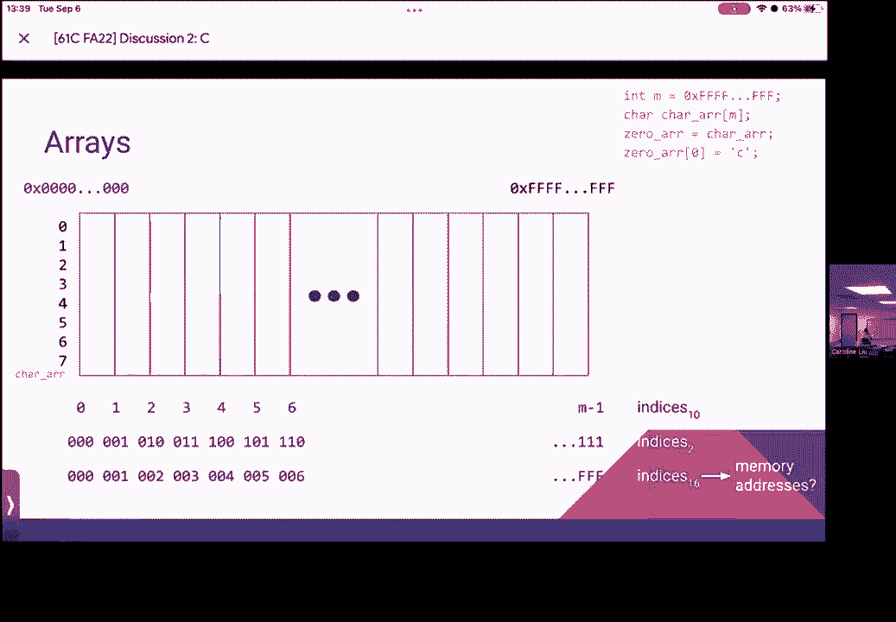

嗯，看在时间的份上，好啦，我们走吧，让我们从这里开始。

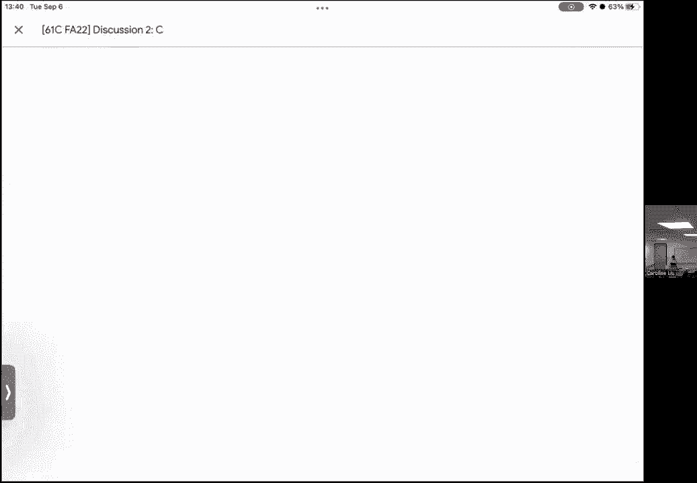

好啦，我们已经讨论了一些关于内存地址的问题，所以我们刚才用的，像零一样索引，五三等，这些将被视为内存地址，如果我们的数组完全在内存中，如果那是我们的记忆空间，嗯，我们只是从数组结构的角度来看待它。

所以在现实中，我们不会索引到数组之类的东西，就像我们不会只是看着，说，零位存储器阵列，因此，我们使用指针的概念来访问，那个，所以内存地址是地址内存的值，就像我们刚才看到的。

所以所有变量本身都是我们值的昵称，所以这是一个有点棘手的概念，明白这一点真的很重要，因为会有问题，会有一些概念围绕着，好啦，在记忆中储存着某些东西，所以变量本身只是昵称，所以说，例如，嗯。

我希望网上能看到董事会，因为我想在黑板上写一点，但是，好啦，所以我们有一些东西，例如，就像um和x等于，就两个吧，然后y等于c，好啦，所以对于这些x和y中的每一个都是变量名，所以呃。

在赋值运算符的这一边重复一些事情，哪个是在声明时的等号，这些是声明的变量，您只在赋值运算符的这一边初始化它们，所以初始化不同于声明，所以当我们谈论像，啊，变量存在内存的地方，嗯，有时我们会说。

所谓的变量的值在哪里，有时我们会说变量本身在哪里，我们一会儿再讨论这个，但是我们要记住x和y本身是不同的，我们在这里看到的字符C，所以呃，变量被声明，然后初始化--如果不初始化变量，就不能使用它。

所以通常你会在61C中看到，当我们在这里走低时，笔迹慢慢变得越来越差，但有时你会在签到上看到，假设你等待，然后你就会看到这样的东西，然后也许你会说像，哦耶，就像事情，值应该有默认值，对。

所以肯定值可以有默认值，但如果我们看到这样的东西，它只是被宣布，所以我们实际上不能使用它，因为它只是储存了一些记忆的容器，所以在记忆中，它可能只是在这里有一大块，然后说，我不知道里面有什么。

我知道里面会有一些，我只是不知道是什么，所以如果你试图利用这一点，可能会引起一些问题，因为你就像，我其实不知道里面是什么，可能是不好的事情，可能是别人种在那里的东西，所以我不会让你用它。

所以变量必须既初始化又声明才能使用，嗯说，在线放大一点，它在变焦吗，聚焦，让我们集中在这里，我想不是，或许能帮上忙，哎呦，那实际上没有帮助，我本来想在屏幕上放大的，其实可能会有帮助，让我看看。

我们只是要去简报。

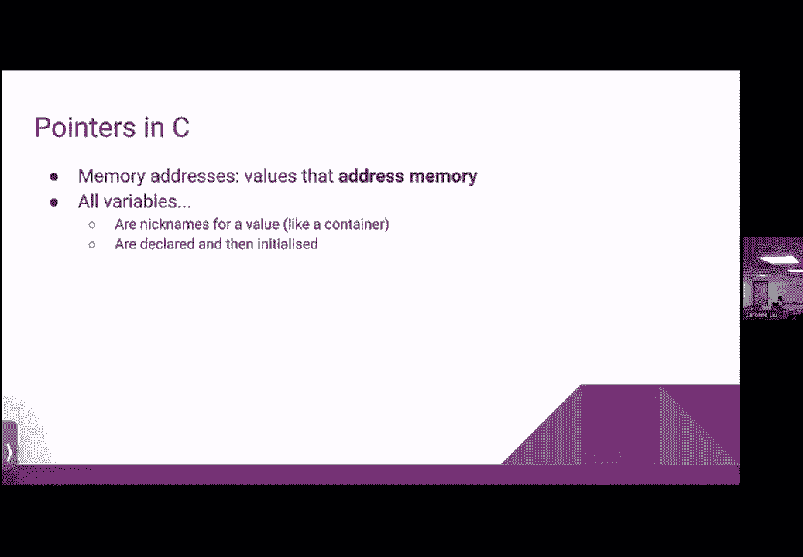

我看不见，哎呦，我在这里，我不确定这是否真的有帮助，但是，呃，之后我会试着把这些转录成幻灯片，在我们结束之后，我不知道这是否真的有帮助，为什么不呢，让我们把这个移到后面，因为它让幻灯片很难看到。

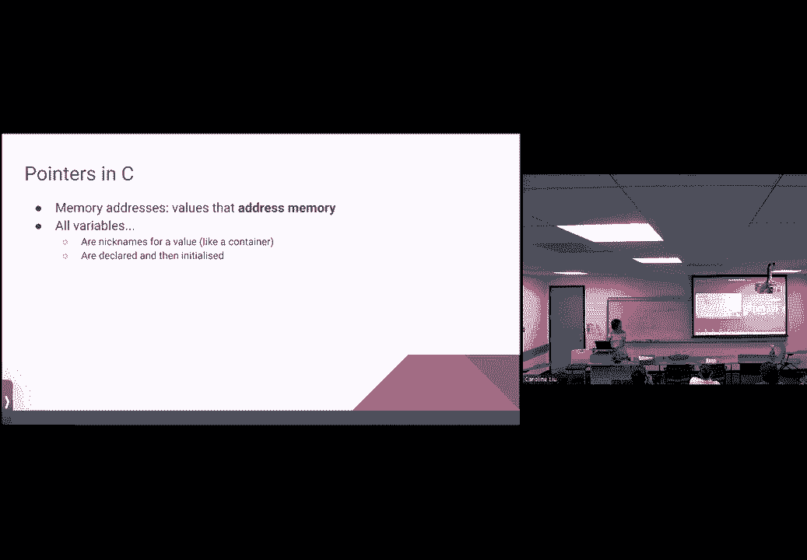

所有的变量都在内存中，所以我们知道他们储存的东西，这些东西在记忆中的某个地方是有道理的，因为我们要把他们分配到，但变量本身实际上也存在于内存中，所以这是另一个要记住的重要想法，变量是一系列的n位。

以特定的方式解释，所以在这种情况下，我们有我们的H2，是零零零，零零零一零，然后我们的性格是什么，我们之前看到的一系列八位，我真的不记得了，所以八位序列以两种不同的方式解释，内存地址只是另一种变量类型。

所以它们看起来有点不一样，但它们的行为方式与所有其他变量几乎相同，所以我们差不多，我们对整数和字符的概念感到很舒服，好的，好的，好的，好的，好的，好的，呃，内存地址只是看待它们的另一种方式。

它们只是另一种数据类型，所以它们用start类型声明，然后用有效的内存地址值初始化，那么这意味着什么呢，嗯，意思是这是肯定的，这是我的记号笔，这意味着如果我们想要一个指向整数的指针。

它看起来就像这个int星，假设一个int指针被设置为等于，我们说的是国际之星是我们喜欢的类型，所以这是一个整数指针，嗯，这个整数指针本身，它保存着一个内存地址，如果我们真的去读那个内存地址。

所以让我们假设这个内存地址而不是在问号中，假设它是a所以a本身的值，如果你试着阅读，它将是一个内存地址，但是如果我们去内存地址，看看那里存储了什么，那么它将是一个整数，所以在，换句话说，它的样子是。

假设是一些索引，所以这是内存中的索引，因为它是一个整数，我们将从四个字节的角度来看，所以这将是一个四字节的内存空间，然后假设它成立，任何让它快乐的四个字节，面部表情符号，嗯。

所以这里发生的是如果我们试着做，让我们说，打印f，a，它会给我们索引，它会给我们内存地址，但是如果我们试着打印f，不管里面是什么，所以如果我们试着读取记忆，它会给我们这里的任何东西。

所以这种情况发生的方式是，假设我们做一个printf，所以printf是标准的c打印函数，因为安全问题161不喜欢，但假设我们在里面打印一些东西，嗯，但是哒哒哒所以我们要做，假设X。

所以这只是得到十六进制的格式，在这里有一个新的行，逗号，然后我们得到那又怎样，对不起，它所做的是读取变量a，所以我们在看，嗯，不管变量存储了什么，所以这将给我们内存地址，但如果我们想要，呃。

a存储自身的实际值，然后它就会是这样的，假设printf是一个变量，到第三个是一个变量，或者问题是，啊，是啊，是啊，很抱歉，我没有啊，做任何一个，所以A是存储的内存地址，让我们使用指针，取而代之的是。

这就更有道理了，就在指针里，有点长，对不起，问得好，是啊，是啊，让我们说，让我们在指针中做，然后如果我们想得到里面的值，所以它应该是一个整数，所以，让我们做的奥迪，所以这是我们可以，使用结束指针变量。

所以不同的是，这是打印出变量的值，即内存地址，跟你说的一模一样，如果我们试着打印出，让我们用，例如，就像呃，我们知道x存储两个，每个指针都存储一些内存地址，但问题是这两张照片的区别在于这颗恒星。

这颗星被认为是一个去参考算子，所以通过取消我们所说的，我们就像储存在里面的东西一样，那个变量是内存地址，然后我们去那个内存地址，然后我们读了储存在那里的东西，因此，就如何工作而言，这可能有点令人困惑。

但我们可以这样想，让我们说，保存阻塞内存，内存中的这个块是内存地址，现在内存地址在内存中的其他地方，它装着一个四个字节的盒子，储存着我们快乐的脸，所以这里发生的是，我们可以沿着里面的箭头。

然后转到存在的新内存地址，所以这是一个存储其他东西的内存地址，这是什么，一个正在摧毁另一个东西的内存地址，通过取消这个，我们只要进入第二个内存地址，读取内存中的那个位置。

所以它将保存四个字节中第一个绑定的值，对呀，呃，所以对于一个嗯，指定的地址之类的值，将是整数或窗体的第一个字节的地址，是啊，是啊，所以这里指定的地址将是第一个字节的地址，所以不管是什么地址。

它是你储存在它开始的地方，就在这里，因为嗯，这是一个插入物，意思是这就是我们要读的东西，这里将有四个字节，所以是的，如果它看起来，例如一个汽车明星，那我们就只读一口，还有其他问题吗？是呀，哎呦。

在这里打印出来后的动机是什么，是啊，是啊，好问题，所以这些是格式化运算符，所以你用它们基本上把东西变成一个可读的字符串，所以就在这里，因为我们知道指针通常被写成HOR，我们通常把它们读成十六进制。

所以X在说嘿，我传入的第一个变量，我将格式化值，它以十六进制值存储，因为这是内存地址，这样读是有道理的，例如，而，我们把它读成一个小数，呃，注，如果我们走到这里，有道理，因为它原本是一个整数。

所以举个例子，我们走过的指针指向一个内存地址，内存地址是，然后A有一个内存地址，这表明你在寻找什么价值，做那个快乐的脸，所以整数，就这样，基本上是沿着最深处的内存地址角的两条链，我猜，嗯，不完全是这样。

我觉得很接近，所以你是对的，正是指针存储内存地址，但那个内存地址是那个内存地址，然后我们沿着那个内存地址到达我们想去的地方，所以这只是那个方向的一个层次，我觉得你想的是，指针也存储在某个地方的事实。

我觉得你想的是这样的东西，例如，如果我们说，让我们介绍双星的概念，我们要不要，因为事情并不复杂，够复杂了，就这么说吧，I指针um等于int指针的与号，因为我们知道所有变量都存储在内存中。

意味着他们有一个内存地址，这个与号获取任何变量的地址，所以理论上你可以把它应用到任何一个，所以和号x在说嘿，嗯，这个实际变量存储在内存中的什么地方，让我们看看那个，如果我们做了与号。

为什么我们可以做同样的事情，y在内存中存储在哪里，通过对int指针执行此操作，我们在说嘿，指针在哪里，比如这个内存地址在哪里，或者这是哪里，内存地址的嗯框，一个实际位于内存中的，所以它变成了两颗星。

因为它说的是，嗯，这第一关，这已经存储了内存地址，现在这个级别将存储一个内存地址到一个内存地址，是啊，是啊，我看到表情和我预期的差不多，但我们要看一下工作表，更深入地探索了这个想法，但总的来说。

发生了什么事？这里有一颗星，意思是储存的任何东西，是一个内存地址，到一个值，或某种价值，如果这样想有帮助的话，我们可以想到，这是一个内存地址，到另一个内存地址，而这里是一个内存地址，还是对不起，等一下。

这是一个内存地址，到整数，是呀，呃，是呀，所以澄清先生演员们明白这就像，表示它，就像实际价值对吧，呃，所以和号代表，呃，得到地址，所以它没有得到值，它得到了存放它的地址，星星，这里是解引用运算符。

之后我会把这些都放在幻灯片上，因为我的字写得太糟糕了，但是为了澄清你的问题，得到存储在那个地址的实际值，利用星星，哪个是解引用运算符，巧合的是这也是你用来表示，事实上，某物是一个指针。

用于获取任何变量的实际地址，你可以用与号，所以你可以用在，不仅仅是指针本身，但任何其他变量，所以与号指针是指针的地址，呃，喜欢变量，它指向喜欢实际值a，这就像我们试图储存的东西，是啊，是啊。

所以这里的a是内存地址，所以它保持这个值a，它是一个内存地址，那就是存储实际值的地方，是呀，是呀，所以你能在一个，或者因为它默认为内存地址，什么会像运行时错误一样，或者它会给你一个内存地址。

目前由我们储存，这是个好问题，好啦，为了澄清，问题是我们能不能做一个和号，这个问题有点长，因为这里我们用一个常数来表示，就像一个内存地址，就像一些十六进制值，如果你想，例如，就像，如果你想做这种事。

它不会那么喜欢的，只是因为嗯，这就更深入地了解了我们所说的记忆，但你不应该这么做，只是因为这是对常数做的一些事情，而不是我们，呃，我们可以做的是如果在某个时候我们说，假设a等于这个。

然后我们试着做与号a这是有效的，所以你只能用与号，嗯，到变量，是呀，不能取消引用，指针变量以外的任何东西，对呀，所以问题是，除了指针变量，您不能取消引用任何内容，嗯，正确答案是否定的。

你可以你不应该那样做，不好的回答是，是呀，从技术上来说，你可以做到这一点，就像你可以从技术上尝试去引用x，用它做点什么，就像在这里，它可能会给你一个分段错误，只是因为它想做的基本上是说嘿。

取消引用运算符只识别内存地址，所以它假设它解除引用的是一个内存地址，在这种情况下是两个，我们后来了解到，最低的内存地址几乎总是分配给操作系统，那么你会像什么，你想让我进入操作系统。

所以你的答案是你不应该这么做，在现实中，你可能会做到这一点，取决于可用的保护措施，所以我们可以说，几乎百分之百的地址，嗯是的，假设我们已经声明了变量，某处，你可以做a星或a和b的与号，好吧。

你确实喜欢它的5%，但仍然得到一些随机的地址，是的如果你有5个指针指向一个点，两点两点，是啊，是啊，所以我想这就变得有点复杂了，因为基本上，符号基本上是在查看记忆并说明这个特定的东西存储在哪里。

我以前没试过，也许我会嘲笑这一点，让你知道，但我想我的猜测是它会在某个时候停止，只是因为将要发生的事，它开始阅读像这样的东西就像它储存在某个地方一样，但这就像是储存东西的根部，就像你不能走得更远一样。

但我可以试试然后让你知道，是啊，是啊，所以嗯，只是再次澄清，在一个分数中，就像那个十六进制值，与号嘿，这不是得到x值，而是得到你的步点，是啊，是啊，它基本上是进入存储在内存中的位置。

因为这就像在一些代码行中，就像它在这里的一条线上，它得到了这个值，好像又取消了，呃，只是把它移到X，只是让我更容易思考，所以在X中基本上存储在内存中的某个地方，指向二，存放在这里的其他地方。

因为这个不一样，是啊，是啊，呃不完全是，所以它没有指向任何地方，所以我想我能想到的最好的方法，呃就像，对于int x，我们有一个四个字节的盒子，我们可以使用。

所以我们现在把两个字节作为四个字节存储在里面，不管这个地址是什么地方，它存放在某个地址，这个地址我们要给它起一个绰号，所以说，它说这整个盒子将是，呃，用x表示，这将从某个特定的地址开始，持续四个字节。

所以就像嗯，所以我想说的是2存储在x是点的地址上，报价，未引用，嗯，我想标签所以这不是，X指向某物，因为x标记了一些东西，但x仍然存储在内存中，是啊，是啊，所以双方，是啊，是啊。

所以x存储在内存中的某个地方，你可以用与符号X得到，这是在说嘿，我要找到这个特定的地址，知道了知道了，那么假设我们接受指针，Derefwith去引用，我们让它直接等于x，它将指向内存中的值x。

但如果我们指向与符号x，然后它直接指向两个等待，你能重复一遍你的第一遍吗？我只是要写出来，是啊，是啊，所以如果我们，指针中的默认引用，直接等于x，而不是将它设置为与号，所以对于第二个，嗯，假设。

你是在引用它吗，哦耶，好啦，所以让我换一下，好啦，好啦，这是个好问题，所以基本上，这实际上是我们如何操纵指针的一个很好的例子，所以就在这里，我们在指针中被引用，意思是好吧，我将通过取消指针的引用来查看。

我们要说的是，我们要去读什么，或者我们会在它存储的任何内存地址上做些什么，所以在这种情况下，我们要做一些存储在内存地址a的事情，所以内存地址A，我们知道四个字节的东西，所以通过做这条线。

我们要做的是把它设为x的值，我们知道应该是两个，所以现在它将覆盖笑脸，在那里写一颗牙，我们跟随，嗯，那么现在第二行，如果我们取消指针的引用，然后设置为与符号x，所以这里的与号x是一个内存地址。

我们32位系统中的内存地址也是4字节，所以如果我们做第二行，会发生什么，会是，例如：我们打电话给这个地址，B怎么样，嗯，所以如果我们现在这么做，我们要在这两个上面存储B或者内存地址，问题是它得到了。

所以第二行是一种不好的做法，我们不想那样做，原因是与符号x在说嘿，这是默认情况下，我们得到了某种内存地址，如果我们在指针中解引用，类型是IT，因为不管储存在哪里，A应该是某种整数。

所以如果我们把它设置为一个四字节的内存地址，技术上来说还可以，因为它是四个字节，我们仍然可以阅读它，然后恢复它，但因为它被标记为结束指针，这让我们很困惑，基本上后来说嘿，这里有个内存地址，但只有一英寸。

为什么呢？它还导致编译器像，你真的需要这么做吗，它可能会给你一个警告，所以这条线我不建议做，取而代之的是，你可以考虑做的是，也许像指针一样，等于给人留下深刻印象，这是一条有效的线，因为在左手边。

这是一个边缘指针，在右手边，这也是现在，又名整数地址，好啦，在一秒钟内，我们感觉如何，是内存地址，10 x指的是2的内存地址，或者x的内存地址，像x值，是苏又名的内存地址就在这里，所以不是两者的，是啊。

是啊，所以我区分这一点的原因是因为它实际上进入了，嗯另一种拉力，一点点不同的部分，让我真的很快，看看网上的问题就知道了，所以这就是通往无限星辰的路吗，追踪到原来的，嗯，所以我认为这个问题是，基本上。

你能吃点像，例如，对不起，对不起，我就用x来表示，而且有点容易，但是是的，从技术上讲，你可以拥有这样的东西，嗯，这是一种诅咒，关于那件事我要说的就这些，但是是的，从技术上来说，你可以有多少级别的明星。

原因是你可以有任意多的间接级别，它不真正起作用的唯一原因，相反的方向是，从根本上来说，像股票存储在内存中这样的东西，就像你不能无限地回去，如果它没有存储在内存中，好啦，我只是为了时间而继续前进，嗯。

之后请随时跟进问题，很乐意回答他们，也很乐意在线回答，所以它有一个值，恰好被解释为内存地址，这只是老调重弹，它碰巧保存了一个被解释为整数或字符的内存，它也有自己的内存地址，就像我们说过的符号，嗯。

所有变量都有自己的地址，因为它们必须存放在某个地方，嗯，指针和我们一样大，取决于体系结构，所以这其实是，呃，回到之前我们有一个64位的系统，指针在三个二位系统中为8字节或64位，这是我们默认的假设。

一般的例子和事情，它们是三个二位或四个字节，我们已经谈过了。

没必要再重复一遍，我要跳过，嗯，好啦，我只想简单地讨论一下，呃，我不想说太多细节，所以我们知道我们可以在一般整数上做算术，对呀，所以我们确实喜欢，呃，假设x加1是，三三是，所以x加1然后重置为。

y等于x加1等于3，如果我们说，假设z等于y加1，它等于小写d旁边的任何字母，所以我们可以对许多这些更基本的类型--数据类型--执行算术，感觉还挺舒服的，感觉很正常，嗯，我们实际上也可以在指针上做算术。

它的行为非常非常相似，唯一的问题是，例如，让我们，假设我们有一个内存地址，整数指针，i是我们之前设置的一个整数，如果我们有，嗯，整数指针加号，所以这基本上是说，整数指针等于整数指针加一。

我们将存储在指针中的值更改为指针，这是因为在指针中只是一个值，它携带一些其他的，呃，内存地址也是，所以你看看里面的内存地址，然后我们加一个，所以现在我们要改变，I，所以原来的整数，我们不改变地点。

唯一能改变地点的方法，如果我们用符号，我等于和号，我加一个，所以这有点搞乱了一些东西，嗯，所以我想去太远的算术，前任教练尼克·韦弗，他讨厌它，他就像这样被诅咒了，我们不应该这样做，它有时很有用。

也很理解，但我稍后会再介绍一点，如果我们有时间，我也很乐意稍后回答问题。

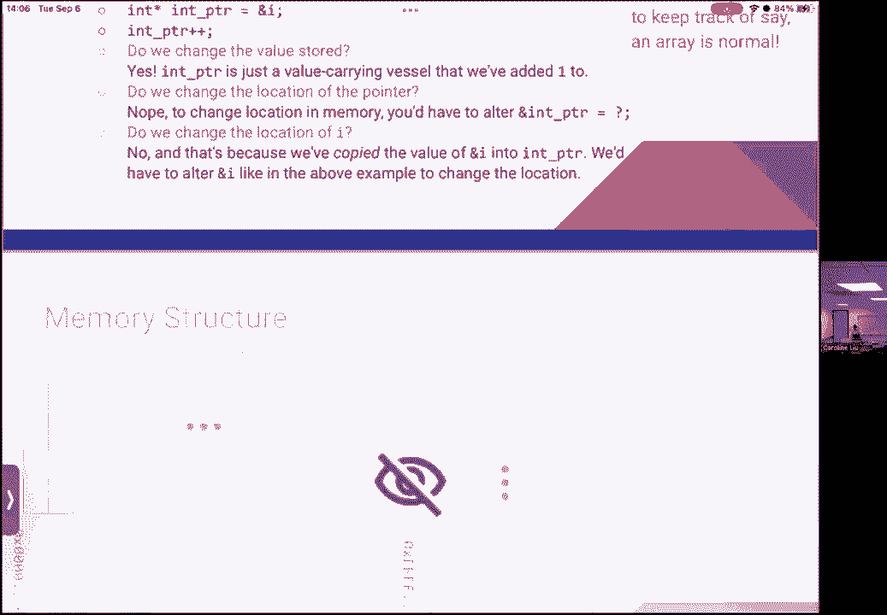

嗯好吧，浏览一堆跳过的幻灯片，让我们来看看记忆功能以及它们是如何一起工作的。

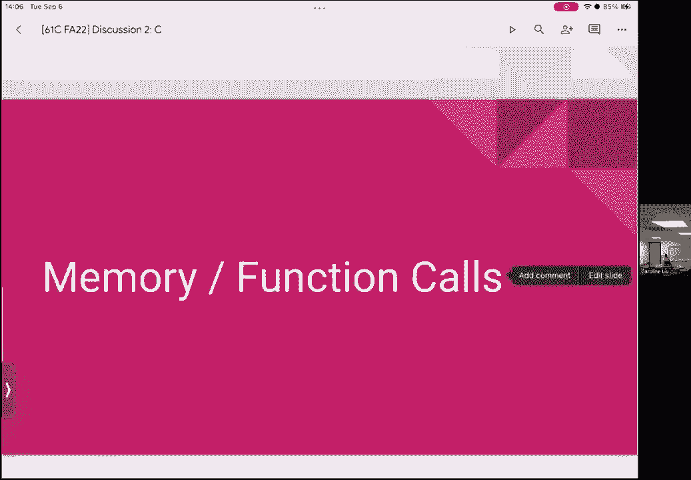

所以一些基本知识，所以我们谈了一点，编译代码与解释代码，我相信讲座和c c是汇编的，这基本上意味着它依赖于系统架构，所以说，例如，编译的代码又名可执行的代码是在，假设一个x86系统不能运行，就像。

说一个风险五系统，这是一种不同的，呃，汇编语言，所以我们使用代码和值的替换来生成一个可执行文件，它位于内存中，所以这是整个系统的一部分叫做call c a l l，我们会好好谈谈的，我想大概两三堂课。

我其实可能不止这些，嗯，但也许几周后，这是我们如何获得，从C代码到我们运行的东西，到目前为止你在实验室里一直在做，我将跳过这一切，只是因为讲课的顺序有点不同，我的朋友喜欢说C是Java，但是硬质版，嗯。

所以记忆基础，所以记忆被认为是连续的，意味着连续的内存地址，连续的内存块，所以没有什么是真的坏了，我们不喜欢混搭，嗯这有点，当然是抽象的，硬件方面是如何实现的，但那是一个62是问题，我们把东西分成四块。

我们现在从上到下读，那是什么意思，我们在下一张幻灯片上看，所以这四块是堆栈，堆，它是静态或数据部分，然后文本或代码部分，在我们将要看到的记忆图中，这是事情的顺序，所以堆栈在上面，文本和代码在底部。

以及权限方面的简要概述，所以权限是一个概念，我们将一遍又一遍地使用，在后来的讲座中也是如此，佣金的想法只是说嘿，您作为用户，你被允许做什么，就是你在看，典型记忆，所以只读记忆基本上是在说嘿，您作为用户。

你只能从这块内存中读取，你不能执行，又名在里面运行一些东西，你不能给它写信，你只能读给它听，所以这实际上是在一种叫做错误的东西中实现的，它代表隧道，只读内存嗯，你可能听说过，如果你喜欢。

看看任何与计算机有关的东西，但是是的，只读ROM，否，然后我们有一个叫呃的东西，读的组合，写内存，所以你可能会把它看作是我们的W记忆，嗯，这个许可基本上是说，你被允许阅读，你可以写，但是你不能执行。

然后你有一些被阅读的东西，写执行，所以这个，在早期系统中很常见，在那里您拥有所有可用的权限，在关心安全的现代系统中，关心事情进展顺利，走对了，并假设人天生就坏，你通常不会有这个，因为它说的是。

如果一个非常糟糕的用户，让我们来写，假设有病毒侵入你的系统，然后碰巧就像现在一样，让我们执行那个会做坏事的病毒，所以有一个概念叫做，我们的内存要么是可写的，要么是可执行的，不是两者都有，好啦。

之前有什么一般性的问题吗，所以这不是什么超级重要的事情，这只是稍后会出现的问题，好的，好的，所以是的，你会看到标有w或x的东西，现在你知道它们各自代表什么了，嘿嘿，说到记忆结构。

所以我们把我们的阵列转向它的一侧，现在呢，所以现在它看起来更像你可能看到的东西，通常，所以我们在底部和顶部都有零，就像一张纸条，这是大多数我觉得像图表的方式，底部有零的肖像，顶部有一个最大地址。

够奇怪的，一六十二，就像，两年前他们翻转了整个堆栈，所以所有的字母都在底部，所有的零都在顶部，然后就像代码一样，静态，堆和堆栈，有点奇怪，但这是呃，功能上还是一样的，但是是的，你可以对这个感到舒服。

所以从底部开始，我们有代码和文本，记住任何猜测，存放在这里的东西，就像代码一样，所以是的，您执行的代码本身，是啊，是啊，但我们会试着执行，所以它实际上不会存储你写的C代码，而是。

它将存储编译过程中创建的可执行文件，所以如果它被储存在那里，它将是可读的，它将是可执行的，不可写，因为您不希望自己修改代码，虽然它是考试的保险箱，嗯，现在我们有静态和数据，嗯有什么猜测吗。

作为这里的什么，是呀，这些都是全局变量，是像标题术语中定义的东西吗，是啊，是啊，所以嗯，从这里开始的事情之一是全局变量，这实际上是一个很好的观点，呃，在幻灯片中谈论它，但是是的，所以这些东西储存了。

呃要么，或者像所有的东西一样，在你的程序中可能想要访问，就像全局变量，或者某些事情，哎呀肯定，比如全局常数，有些信息可能不是特定于任何特定功能的，我知道，是呀，它是一种静态斜杠数据。

通常是通过解析头文件找到的，或者就像储存在那里的东西，是啊，是啊，是水听器的数据，或者嗯，是啊，是啊，这是个好问题，所以这就像，你如何找到那里储存的东西，嗯，这是一个有点长的过程，嗯。

我们谈了更多关于它的事情，并打电话给，但基本上有特定的工具或东西被编写来帮助，解析两个头文件，它基本上就像c中的库以及代码本身，所以我们要好好谈谈，我想讨论一下，我相信，嗯，好啦，然后我们就有了堆。

所以堆有点好笑，所以这种东西是动态分配的，如果你喜欢，我不知道什么动态分配是完全可以的，然后我们有东西，哪个是堆栈，这是东西，自动创建和消失的东西，这基本上是在函数执行时显示出来的。

所以如果我们快速看看这个，嗯，在最下面，我们有代码和文本，所以这是你可以执行的代码，它在读取以执行内存，它包括一些常数，所以任何关于它包括哪些常数的猜测，所以作为一个铰链，其中一些在黑板上。

幻灯片的大小与，也可能是末端的大小和字符的大小，是啊，是啊，所以它的尺寸其实是很特别的，事实上，这不是一个函数，它被认为有点像宏，但这有点像，所以说，是啊，是啊，储存的东西，或者，我想宏存储在，嗯。

代码记忆是真的，但我会推迟的，只是因为它还没有超级覆盖，简单点的，就像一个函数，你可以在主函数之外滚动，是啊，是啊，所以你写的任何函数，它会被认为是代码，所以它落在这里，任何常数，是呀，类似系统限制。

可能或系统限制，喜欢更多的东西，你知道的，东西的大小，比如预定义的东西，那就是，你知道的，是啊，是啊，所以是的，呃，预定义的东西，比如，也许一个字节有多大，是啊，是啊，呃，这实际上是进入了更多的复杂比。

我是说，嗯，比如说，两个从哪里开始，谢谢你，是呀，完全正确是的，所以这个问题是肯定的，两个最终储存在，x在哪里，但从根本上说，就像对自己一样，就像，这是一个值，当然它最终会被储存起来，嗯在X的地址。

一旦这一行被执行，所以让我们假设这是线，说出你的11个密码，执行一行11，然后呢，存储x的地方，该值被分配给，但它之前发生了什么，我们如何将它引用到右，所以像这样直接嵌入代码行的东西。

它将被存储在代码和文本存储器中，只是因为没有其他方法可以引用它，例如，X它可以储存在其他地方，但这里的两个，就像嗯，这是一个常数，这是一个二，我不能用它做别的事，所以我们要把它放在代码中，嗯。

所以在几节课中，我们还讨论了汇编代码，以及它的外观，呃，有点回想起这个，但是是的，这有道理吗，有什么问题吗？是啊，是啊，你是说所有文字基本上都存储在代码值中，对呀，是呀，所以所有呃。

文字存储在代码内存中，是呀，字符串文本除外，基本上就是，字符串，嗯，它们是字符数组，我们稍后再谈，但是是的，所以除了字符串之外的所有东西都可以是一个，就像在作业的右手边，你没有其他方法。

这也包括代码和文本内存，好啦，只是很快地向前看，我们还有静态和数据内存，所以数据是静态的，这包括，嗯，通常不需要在全局范围内改变的常数，嗯，有时在类似的主要功能中，例如。

这些常量可能存储在设置数据内存中，仅仅因为它可能也需要在其他函数的上下文中访问，但通常这些都是全局的，他们会在拉姆，即随机存取存储器，嗯，我不打算谈太多这个，只是因为它不再属于班级的范围。

但需要注意的是，静态一词通常指的是无法改变的东西，那其实是，嗯，有点用词不当，所以静态在这里说的是，呃，内存本身在硬件中实现的方式，但关键是它实际上是可以改变的，所以静态内存的某些部分是只读的。

但也有某些部分可以标记为读写，好啦，很快就向前看了，然后我们就有了堆内存，所以这是指动态分配的内存，它将被阅读，写，它通常并不总是不可执行的，除非你想做一些特别的事情是一件关键的事情。

所以这意味着我们必须释放加热的东西，所以对于你们中的许多人来说，这将是项目一的痛苦原因，可能很多次，这仍然是我的痛苦，但是你动态分配的任何东西，您必须使用free函数手动释放。

所以这与堆栈的想法有点不同，它是由系统自动分配的内存，以及自动释放的内存，所以两者的区别，假设我们有一个叫做堆指针的东西，这很像是它看起来的视觉表现，但是键指针基本上在静态内存结束后的某个地方开始。

里面通常有某种缓冲剂，但你不想表现出来，然后第二个从内存的顶部开始，这也是一个有点线，但我们现在就这么做，最后堆成这样，然后布景像这样生长和自上而下，所以最终他们会在中间相遇。

然后如果你试图分配更多的内存，那么您就没有更多的内存可以为堆栈或堆分配了，您会遇到堆栈溢出或堆溢出，堆栈溢出，是的，但是，呃，是的，现在我们知道这个名字是从哪里来的了，嗯但是是的，一般都是这样，呃。

记忆类功能，嗯，我有一个快速的演示，这有点像运行一个函数，但我们的时间不多了，所以我可能会在最后选择这样做，但是是的，关于记忆的类型或成分有什么问题吗，以及在我们进入动态分配之前的四个不同部分，好啦。

呃，我不太明白什么是读写，是啊，是啊，大问题，所以读写只是指内存中某个字节的权限，或者内存中的一组字节有或有，所以上面说我们已经阅读了许可，这意味着您可以从特定的字节或字节集读取。

您还可以写入这些字节集，所以这并不总是默认假设存在的东西，因为从理论上讲，我们不希望能够写入代码内存，因为我们不想修改我们的代码，当我们执行的时候，话虽如此，Justin前几年喜欢写自我修改代码。

但那只是假设，我们没有保护措施，嗯，好啦，任何其他当面提出的问题，是的，这是地铁吗？我就像读程序的文件一样编码，然后修改文件，是啊，是啊，所以它通过，呃，所以有不同的例子，我很乐意谈论这件事，呃之后。

以及它的工作原理基本上是短篇小说，它对代码做了一些事情，所以一旦你执行了事情，它可能执行与以前存在的不同的东西。

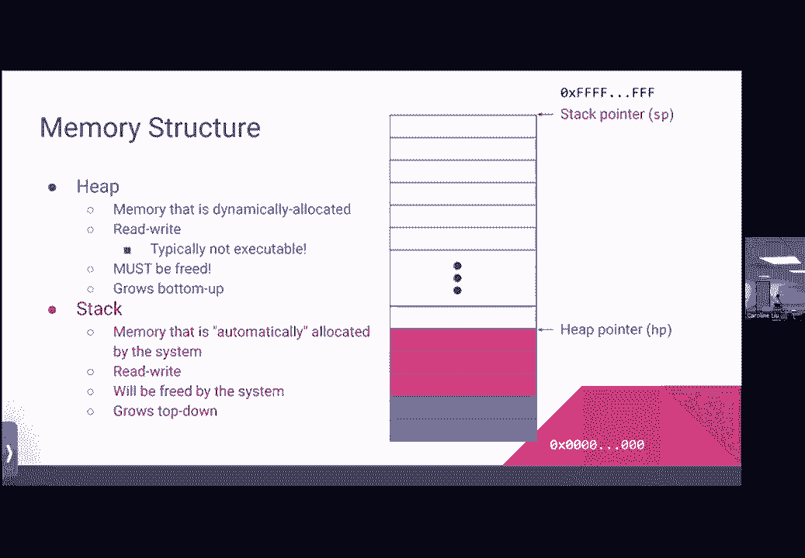

好啦，我要跳过这些例子，我只是因为，为了时间，但我很乐意稍后再谈，我只想简单地谈谈。

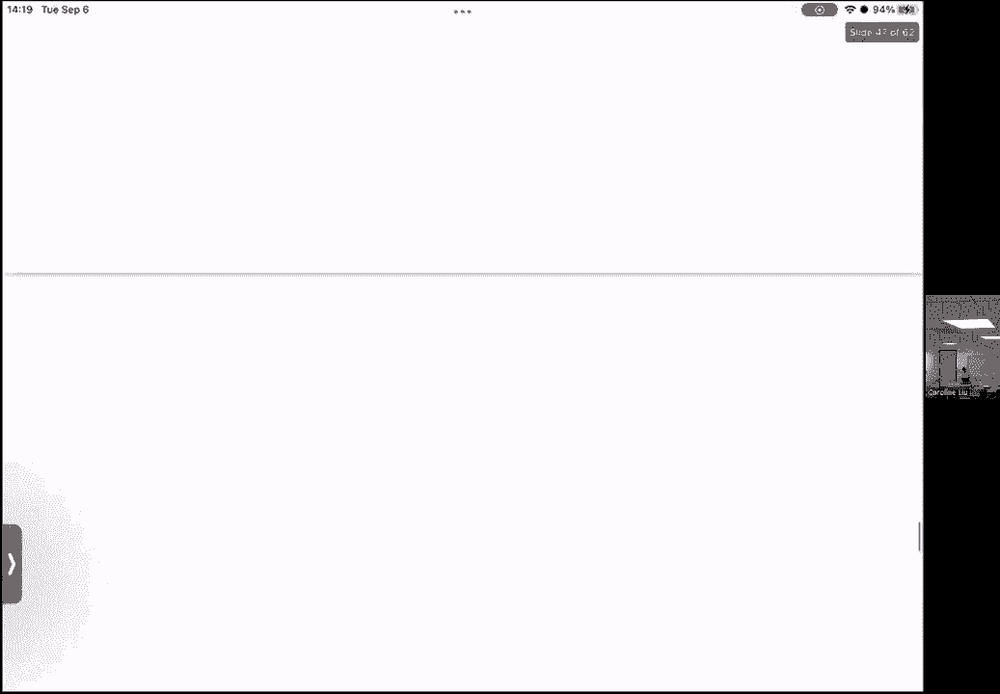

我们一会儿再回来，因为讨论结构可能很有趣。

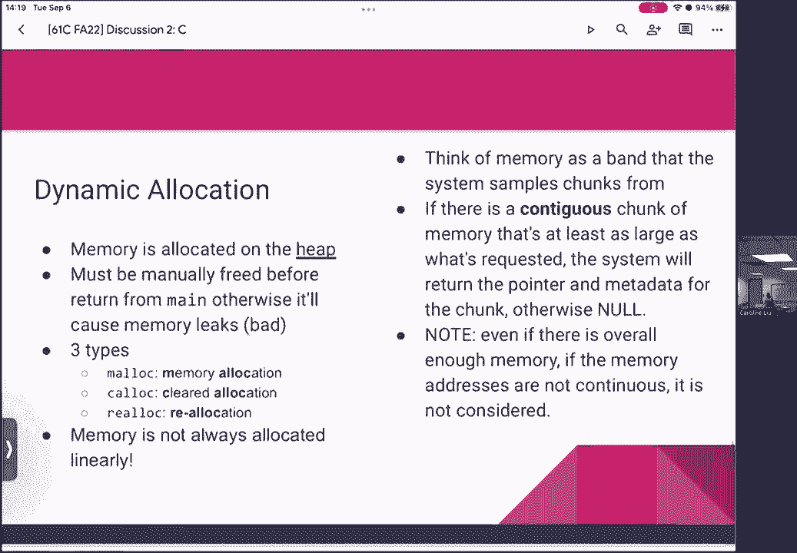

嗯好吧，所以内存分配，那么有多少，我们中有多少人使用过某种动态分配，到目前为止的功能。

是啊，是啊，好像在打电话，嗯好吧，所以动态分配会导致存储在堆上的内存，除非在从缅因州返回之前手动释放，否则，它将导致各种不同类型的内存泄漏，这通常被认为是不好的，所以内存泄漏，嗯，你不必背这个。

但是内存泄漏基本上只是说一旦我们从一个函数返回，不管是不是主要的，这意味着我们失去了刚刚分配的内存块的跟踪，所以这可能存在，例如，因为您重新分配指针变量，假设我们做了一些，呃，假设这个内存地址是。

我们发现我们在管理国王，然后在我们真正跟踪之前，我们做了这一行，它说任何指针都等于与符号x，现在我们刚刚做的是，我们基本上重新分配我们正在使用的东西，跟踪我们动态分配的变量，我们决定做点别的。

现在这导致了记忆叶，因为我们知道我们再也找不到A在哪里，或者我们不再有那个价值了，但它仍然漂浮在外面的某个地方，因为我们还没有解放它，有道理，嗯有三种类型的动态分配，Malloc，它代表一般的内存分配。

我们有钙，哪些是明确的分配，然后我们有现实C，也就是重新分配，所以嗯，两者的区别，所以他们都返回一个指针，所以他们返回一个内存地址，我们可以将其存储到Mala Good的另一个变量中，呃。

我们得到的返回要么是空的，分配失败，或者我们有一个指针指向我们要求的任何大小的内存块，所以问题是，呃，唯一的问题是，我们不能假设那个特定的内存块是我们所知道的任何东西，因为从技术上讲它被认为是垃圾。

所以我们通过说让我们做人才来解决这个问题，所以人才是一个明确的分配，因此，返回给我们的内存块现在都为零，所以所有的比特都被设为零，calc的实现及其稍微快一点的原因，如果我们做了malloc。

然后循环所有的字节并将它们设置为零，是因为计算系统，只是说让我找一块内存，它的开头都是零，请求大小的宽度，如果存在的话，我要把它还给你，否则我会手动清除一些东西，所以你不必记住所有这些，然后亚历克。

基本上它说的是我有一大块记忆，我知道我可能不会再用它了，让我们看看能不能把它重新分配给另一个，一个不同的指针，如果那个特定的指针可以容纳在我当前存在的内存块中，那我就把那个内存地址给你。

然后把剩下的放掉，否则我会释放和重新分配一些东西给你，好啦，所以是的，其中一个论点是一个很好的问题，所以这将是，呃，目标指针，源指针，然后这边，我相信源指针就像内存一样，或辞职时，或者是的，对不起。

没有destthis目标指针将是返回，嗯，源指针是您试图重新分配的东西，因为你不再需要它了，然后大小就是您想要分配的任何新大小，是的，嗯，所以这实际上是一个非常好的把戏，手册页。

我想实验室简单地讨论了一下，如果我没记错的话，但基本上如果你喜欢，我不知道如何使用这些功能中的一个，看你打不打男人，然后在终端，然后是太空，不管你想做什么，它会把你带到一个参考页面，带有返回值的参数。

以及如何使用它们，好啦，所以内存并不总是线性分配的，所以让我们来看看这意味着什么，所以我们通常认为内存是一个带，系统从，所以它说我有自由记忆的圆形旋转带，所以它被称为自由列表。

所以如果有一个连续的内存块，你要求的尺寸，我要返回内存地址，指向该块开头的指针，否则我将返回空，所以关键部分在这里是连续的，所以它在说，基本上，即使我有你想要的总内存大小，如果不是连续的。

如果它没有连续的内存地址，那就不成立了，所以我要把它都还回去，所以让我们来看看为什么这可能是，所以让我们分配一些内存，正在进行大量的分配，所以我要快速通过它们。

但是基本上我们从一些指向空闲列表开始的指针开始，所有这些都是白色的，所有这些都被认为对我们是免费的，我们能分配的一切，所以我们有一个粉红色的请求，一块大的内存很酷，我们有这个，所以我们要申请。

然后现在在空闲列表指针，这只是一个演示，以身作则，所以如果你想知道它的工作原理，我想在系统层面，很高兴以后再谈，一旦你也做了一个完整的家庭作业，嗯，然后在空闲列表的开始移动到我们上一次分配的结束。

我们的粉色箭头，也就是我们现在拥有的第一支箭，函数首先调用了它，所以我们把免费名单的开始，然后现在我们要分配一个大小的内存块，所以这将是橙色的部分，我们注意到它明显比粉红色的块小。

所以我们移动开始列表的开头，所以嗯，我们只是要经历几次，它这样做很多次了，所以我们可以看到到目前为止所有的分配请求都成功了，然后我们会要求另一大块，所以这是某种紫罗兰色的大块。

所以到目前为止我们可以看到一切都很好，所以现在我们要做的是，假设我们要解放绿色，所以免费绿色支票现在变成白色，它将进入免费名单，但我们想注意的是，这个块被认为是空闲列表的一部分。

这也是现在免费列表的一部分，但它不是毗连的，所以现在，嗯，如果我们想说，假设我们称malloc为a加f加d，是呀，呃，这是钥匙吗，是呀，这是堆，是啊，是啊，分配给热存储器的东西，是呀，因为堆栈就像。

我们根本没有做到这一点，是啊，是啊，所以堆栈是由系统自己管理的，如果我们叫malic a+d+f或者，让我们说实际上，让我们做苹果，呃，A加D，寒意，嗯哼，天气会变冷的，有点冷，很近，假设天气不冷。

是呀，是给你的绿色，哦耶，这是个好问题，所以我们用来，基本上说我们要释放这段记忆，我们会说我们不再需要它，然后它又会回到免费名单上，将用于以后的分配，所以我想我应该把它弄得更明显。

假设一个白色的前端像这样，嗯，所以我们要说粉红色，另外，原本绿色的部分实际上不适合那一端或那一端，如果我们把它叫做，不，所以是的，我们返回空，因为我们会说好，这个，我想我真的测量出来了，但我想我。

所以粉红色的部分将直接适合在那里，我们知道我们刚刚释放了绿色的部分，就在这里，所以理论上这应该放回，所以我们打电话给Malloc，粉色加绿色应该可以，因为我们有现成的，但因为它不是连续的。

它不会返回任何有效的指针，所以它会返回空，这就是所谓的记忆碎片，所以你可能会注意到在中间，就在这里，我们有一堆被分配的块，真的真的很小，所以呃，一旦像这样，这种情况定期或多次发生，嗯。

我们的记忆会变得支离破碎，例如，如果我们在这里调用另一系列非常小的块，它会把你的记忆，如果我们来回移动，那我们就只吃一点瑞士菜，记忆中的奶酪洞，现在我们的记忆支离破碎，无法超级使用，这有道理吗。

所以这是一个关键的部分，如果你打电话给Malic，你通常不想在小变量上做这件事，你想在被认为相当大的东西上做，或者你有理由需要来回传递指针，是呀，那我们怎么喜欢，也许重新排列东西，使它再次变得有用。

因为就像，如果我们能把一切都转移到最后，一切都会如此，是啊，是啊，这是个好问题，所以一个，呃，一个建议是我们为什么不把这里所有的东西，所以白色就像合并在一起，简单的回答是。

所有这些开始都在记忆中的某个地方，所以能够做到这一点，你可以就像，说，我要搬一大块硬件，别的地方，你必须做的，你要做的就是，你会说喜欢，啊，让我们在这里复制所有的记忆，现在让我们复制这里的所有内存。

并将其转移到，像这样，而这对资源来说太密集了，不可能大规模地这样做，就像这样，也许一个合理的眼神，不在实际系统中，我听到的另一个建议是，为什么我们不重新编号，就像如果我们从这里记住从零开始的事情。

然后跳过这个，记住剩下的，那岂不是又使它连成一片了吗？答案不是因为，就像我们想象一个数组，我们开始填充数组的不同部分，突然间在重新繁殖的过程中，我们决定改变指数，现在我们有两个零，两个一。

那些指数中有两个二，现在指数不再是唯一的，所以那会把一切都搞砸，它会破裂，基本上有什么问题吗，我说了很多，呃，我看看我们还剩多少时间，让我们来看看工作表。

如果我们想从函数调用的角度来讨论内存是如何工作的，也许我们可以在下一节做，或者在这之后。

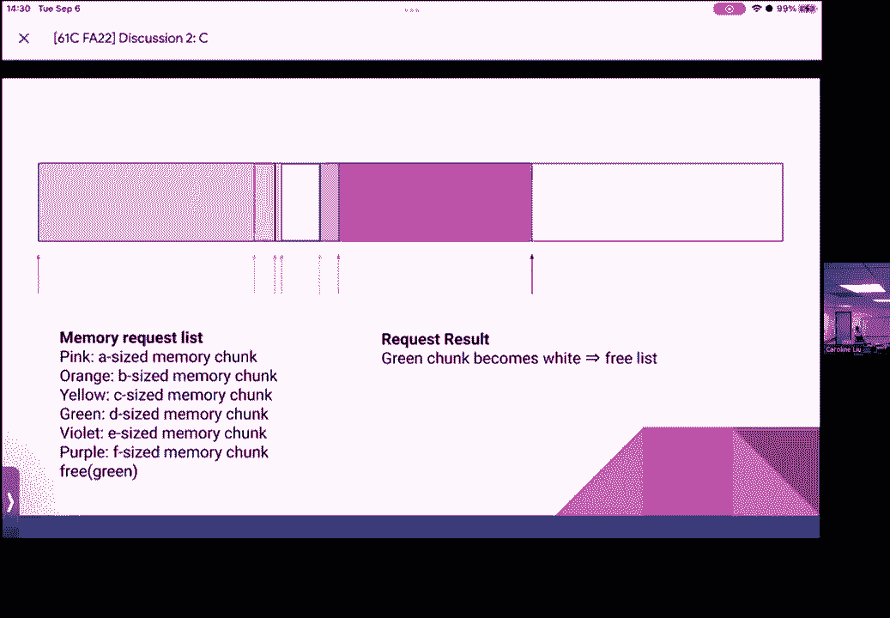

所以让我们来看看工作表本身，嗯，我不认为我真的下载了它，对我来说很好，让我们真正做到这一点，所以如果我们，如果顺便说一句，如果你亲自来，工作表上有，但是我们有几个预先检查的问题。

所以我会给你们大约3分钟的时间，这些都是真假问题，我相信是这样的，尽你最大的努力，然后我们将在，这是最好的英语之一，但要抵制起作用的东西，你可以看到两个，六个，四，八到六点，两个。

一样然后就不是一个街区了，但同样，因为我认为，然后前面的方块呢，你要穿这件这件，我们只有这个，然后你把这件事做好，像这样，然后我们就进入并结合了已经存在的64个，我把它们提交给大多数这样的人，这个权利。

只是展示这个有点，是啊，是啊，所以我会说是的，正是因为，嗯，将两者连接在一起，嗯，只是切换所有的位置完全像顶部，这里的大多数战斗都是五六，是啊，是啊，所以它得到了，嗯，它不会被转移到激光上。

因为我们读的是文字之类的东西，所以如果我们能把最后的金额一分为二，嗯，它会说你把它移到那个特定的最不重要的地方，呃词，然后五六在这里，然后看到一个在这里，可以看到这是如此的FLI，字内字节的顺序。

但你知道它看起来不像，它不会翻转位置，但是这个词后面的位置是什么，所以它不喜欢，所以用这个是没用的，因为这就是第一个找到耶的人，所以既然，他们只是我们要做一些，是啊，是啊，所以你还是需要“是”这个词。

所以只要做一些要去配合，五六六五六，是啊，是啊，对呀，这个会看这个，所以我，所以是的，你翻转单词中字节的顺序，然后你把单词的顺序放在这里，这就是为什么较低的警报不是猫这个词的最高警报。

但如果我们把它看作是一个单词中的字节翻转，然后它翻转所有单词的位置，地点，翻转后的所有东西，是啊，是啊，现在翻过来之后，我们，我们把它翻进去，回到最后，因为事情就是这样开始的，所以这就是为什么。

你觉得自己准备好回答，我很困惑为什么，这就对了，好啦，嗯酷，呃，让我们开始通过，呃，一个问题一个问题，所以第一个问题，参见按值传递语言，我们对这是真的还是假的感觉如何，真，好啦，有人想速冻一下吗。

这不仅仅是因为我在找我的苹果笔，但这不是真的，我不为真辩护，因为这就是你使用指针的原因，因为它只是超越了你使用的方向，超越了艾琳的名字，但既然你用指针来指向，就像重新提取内存地址，然后你告诉节目。

好在那边，而不仅仅是复制正确，我想是的，对雷鲁姆来说也是如此，如果你依稀记得课堂上，如果我们想说，修改任何内容的值，所以课堂上用的例子是这样的，如果我们想把1加到整数上，如果我们把这个整数。

实际上不会改变原始整数的值，因为我们复制了一份，这就是按值传递的定义，在那里我们复制任何通过的东西，把它的价值，然后嗯，在上面运行函数，所以如果你想引用任何东西，我们必须主动使用指针才能访问它，所以说。

好啦，嗯第二个问题，所以山谷，以下内容，呃是正确的，季节税，是呀，没有虚假，为什么是假的，这是个大错误，呃，如果你在Python和like和c之间来回切换，这将是你生存的祸根，不是从个人经验来说。

当然啦，但是是的，分号，它们基本上标志着一个声明的结束，所以您可以在一行中有多个语句，只要为了可读性用分号隔开，我建议你不要，但如果你因为某种原因在61年，一切都在一条线上的心态，好啦。

所以一点三在编译语言中，编译时间通常相当快，然而，运行时明显慢于解释语言false false，那么为什么我们认为这是假的呢，是啊，是啊，所以呃，其中一个关键是，如果你为某物的硬件优化任何东西。

它会比什么东西都快，这并不适合硬件，因为我们知道编译，编译将查看系统的硬件，做任何需要做的事，基于此，我们知道运行时将比解释语言更快，系统不依赖，最重要的是编译将是瓶颈，或者这个过程中最难的部分。

这只是因为编译在做所有的优化，它做的一切就像嘿，这个for循环真的没用，你为什么要写，我们把它扔了吧，就像，哎呦，我们不需要这个变量，所以它在做所有艰苦的工作，嗯，我们没有做的编译器。

所以这就是为什么它被认为是建模，所以说，好啦，嗯，声明字符数组的正确方法是car，汽车支架，真假，假的，是呀，很多这样的，基本上，这些预检查问题就像指出常见的错误一样，但我们想要声明的方式是。

无论我们的类型是什么，然后我们的数组名，然后括号告诉我它是什么，所以这是宣言，如果我们想初始化它，会有点不同，您可以用一定的大小初始化它，您可以用类似的预填充来初始化它，但是是的。

有不同的方法可以做到这一点，但这是声明的方式，是呀，呃，我们能不能说像一颗焦星，我们能说看看这个，像R星一样等待，是呀，右等于，或者，还是像一个不同的，是啊，是啊，这是个好问题，其实呢，呃。

假设右手边的内容是一样的，车阵将与车星不同，嗯，所以本质上，这实际上是一个重要的，呃，弦乐和C的有趣世界，所以字符串实际上并不存在，他们只是一系列的角色，一种被空终止符终止的，所以没有，呃。

我事后顺便把这些写下来，在笔记中，我只是不确定我们是否能走到这一步，但是一个空终结者，空终止符如下所示，所以这是一个空终止符，所以这只是一个反斜杠零的字符，所以你可能会看到这样的东西，其实是这样的。

其实呢，这次不一样，这是一个新的行字符，所以我把这两者混淆了很多次，嗯，但是是的，所以字符串基本上就是一系列字符，接下来是这个非常特别的角色，为了用字符串做任何操作，这样您就不必自己编写这样的函数。

例如，获取字符串的长度，嗯，您将导入标题，呃，你可以做一些事情，比如包括字符串点h，所以这是字符串头文件，基本上包括任何函数，你需要操纵字符串，关于弦，我要说的最重要的一点是。

就是记住空终止符告诉你字符串在哪里结束，否则，如果您没有空终止符，字符串中的函数，我不知道你的线在哪里结束，它可能会读到更多的东西，或者看到比你想象的更多的东西，最后很可能出现分段错误，因为它从未结束。

所以我决定嘿，我读了太多的记忆，这很可能是错误的，所以我要停下来，是啊，是啊，不是为了做零，嗯是的，它基本上是一个充满零的咬，所以这是一个非常明确的角色写作方式，怎么写这个，这与like空指针相同。

例如，但他们只是不同类型的演员，但弦的重要之处在于，你可以用无数不同的方式来声明它们，我将在下一次讨论开始时更多地讨论这个问题，只是因为时间，但是字符数组有一个独特的可变能力，所以这是可变的。

这意味着你可以改变它，您可以更改数组内部的内容，然而，如果你有一个汽车明星的东西，但是嗯，你基本上会有问题，所以这将是不可变的，所以你用雕刻的星星指着的任何东西基本上都在说，这将位于内存的一部分。

你将无法正确地访问，所以你最好确定那是你想要的绳子，但是如果你有一个字符数组，这对你想改变的事情有好处，它们都是有效的字符串，他们只是会有不同的行为方式，是啊，是啊，呃，我们说的那个词是什么，呃。

字符数组和括号，然后我呼吁，哦这里这里，是呀，哦对不起，这是，呃，你读对了，它应该写bd c l，但是，是啊，是啊，这就是主要的区别，嗯，我想说像问题可能是像，我们有过一个角色对吗，那不是绳子，嗯。

我想说很少，通常字符数组最终会变成字符串，所以我会很小心的，是呀，你说它是不可变的，但是有没有可能，你只是喜欢，用那个指针改变什么，正是在这一点上，就像，如果你说确实偏离了它，然后换了，是呀，嗯。

绝对有可能，我觉得行为明智，东西存储在记忆中的地方，当然要看你怎么申报，就是这样，几乎总是，默认情况下它是不可变的，只是因为存放东西的地方，但我会在，我想说下一次讨论的前十五分钟，就因为c长浮点短。

嗯是的，所以我们提出一点，一个点的其余部分，四，和字符串到下一个讨论的一个点，五个，按位和逻辑操作导致给定位的相同行为，字符串，真假，真，好啦，我们中有多少人认为这是真的，我们中有多少人认为这是假的。

我不知道，我们有多少人，我不确定很好，好啦，呃，所以对人们来说，这是真的，嗯，你为什么认为这是真的，就像如果你，如果你要，我假设逻辑运算符是这样的，和或不，是啊，是啊，他们也像。

如果您有二进制逻辑运算符，它也会被涂在每一个单独的位上两次，把它们加在一起，做对，所以我想我搞砸了，是啊，是啊，是啊，是啊，是不是超过38了，我再重复一遍，你自己在哪里，呃，我们刚从，我可以。

不管怎么说，哈哈哈哈哈哈哈，没关系的，嗯，所以是的，这是一个很好的观点，所以呃，基本上按位相对的想法，呃，像这样的逻辑运算，例如，按位结束如下所示，而合乎逻辑的只有一个安培，嗯，或者是双管对单管。

然后呃，X或等待，什么事？嗯还是不，是啊，是啊，我们不要，所以这将是按位的波浪，然后是逻辑上的感叹号，所以说，但它们的行为方式有时是相同的，所以根据位串，有时可能是一样的，唯一的区别是按位的。

它在看东西，例如，让我们说位零位一，二点点点，一路向上，七点钟吧，假设我们有一根绳子，我们正在做的二进制字符串，所以按位，它将查看这些位中的每一个，然后将它们添加到，鉴于，例如，嗯，在逻辑运算中。

它将观察整个字符串和它们，所以两者的区别是，假设我们有一个看起来像零的字符串，零，零一对决，嗯，说，零零，零零，为什么不呢？所以说，如果我们按照逻辑，呃，我们会在这里吐出什么，零零，是啊，是啊。

所以我们在这里看到的，是在说嘿，嗯，我们在看一个1和一个0，如果两者不合二为一，然后我们就会吐出零分，所以这是有道理的，但如果我们这么做了呢，嗯，如果我们聪明点，我们会得到什么，哼，我们其实。

这是一个非常可怕的例子，我刚意识到，嗯，这也会给我们，是呀，好啦，所以这是一个非常糟糕的例子，嗯，我刚意识到，但是嗯，一般来说，它们只是以不同的方式执行相同的操作，它们最终并不总是相同的值。

但有时他们确实很抱歉，是呀，如果你不归零一归零，是啊，是啊，是啊，是啊，很棒的部分是把呃放错了地方，但是是的，所以看着这两个，这将是什么，呃结果是，会是如此的，看着这些嗯，这个值将是1，然后这个值是2。

如果我们把这两个加起来，一二，它要看它，基本上就好像它不是零，它会还给我们一个，看不出来，我做不到，我不这么认为，我想呃，当我们做逻辑运算符时，它看起来就像，是否两者都为零，我再确认一下再联系你。

但它着眼于这样一个事实，例如短路，如果这是一个零，我在这里，它就会短路，但不是在相反的方向，如果第二件事是那个，我们会再检查一遍，然后给你回电，虽然，但如果我们，嗯，如果我们在这里有同样的价值。

所以让我们说0 0 0 1然后0 0 1 0，我们看着每一个单独的部分，然后说，好啦，前两个都是零，第二个都是零，然后我们有一个1和一个0，然后我们有一个零和一个一，所以这将导致所有的零，因为我不是。

双一是逻辑，而单人是价格，你只要把它，有了这个，是啊，是啊，就像你说的，是双倍和百分比，但我认为这是一个单一的和百分比，就像其他许多地方一样，哦是的，是呀，我把两个翻过来，是呀，对不起，射击正确。

但还是战争和结束，是呀，他们被翻转了，是呀，我很抱歉，你应该让你，所以我很抱歉，但是是的，呃，逻辑是双信号，然后按位是单的，所以是的，他们的行为方式，你最终会有不同的结果，经常。

但你要小心他们是如何被比较的，我想说关于位比较最有用的一点是，你可以按位操作，无需索引，我想之前有人问过，您如何将它们编入索引，你通常不能，但你仍然可以通过，比如按位或按Knox做掩码，例如，好啦。

所以我们还剩十分钟，我们聊了聊，呃，聊了一会儿，但是手术，嗯好吧，那么这些问题中，我们觉得我们想要哪一个，我们要做一些C代码的调试吗，还是要进行按位操作调试，好啦，所以是的，让我们转到第四题。

哪个是调试的，所以其中一些包含逻辑或语法错误，呃，是啊，是啊，这是一种练习如何调试自己代码的好方法，嗯，如果你喜欢，啊，我想让你做一些其他的问题，我们会在网站上有每个问题的录音。

作为前几个学期的播放列表，或者像异步录音，所以我会给出一个关于，让我看看，所以我们有四个问题，嗯，让我们一起做第一个，我们对此有何感想，然后我们就可以找到剩下的，好啦，所以第一个。

它返回传票中所有元素的总和，嗯，所以我们有事情要注意，好啦，我们想退回一英寸，呃，我们传入了一个int指针，所以就在这里你注意到，嗯，我用的符号更接近，就像国际之星，然后是空间，然后传唤。

所以这两个理论上都是正确的，嗯，关于堆栈溢出，有很多关于哪一个更正确的争论，第二个像这里所示的是官方的C标准，所以你有了变量的开始，嗯，但老实说，我只想说，哪个对你更有意义，所以对我来说，我是说，哎呦。

变量本身存储一个int指针，又名和呃，一系列ins或整数的地址，嗯，那对我来说更有意义，有人看着说，啊，这将是一个星指针，将其存储在，所以是的，好啦，然后经历，让我们看看每个和都等于零，有道理。

因为我们在试图总结，所以我们希望基值为零，然后我们要经历，让我们说，好啦，对于int，我等于零，我小于传票的大小，然后我们要去，呃，做加号等于，嗯，传票加I，然后我们开始，所以这实际上是一个很好的例子。

这是指针算术，还有一些我之前没有指出的，这里要注意的是，如果我们确实喜欢，例如二加一，这将等于三，对呀，所以对于任何整数，但我们知道如果我们这么做，如果我们有一个内存地址2，所以让我们说在他们身上。

两人的地址，如果我们加一个，就会有三个人在那个内存地址，所以我们确实和，但如果我们想说，例如，在这种情况下，将整数移动到实际上没有的整数，呃，那实际上行不通，因为，假设我们有一系列这样的整数。

这是四个字节，这是四个字节，这是四个字节，假设这是零，这将是四点，今晚八点开始，如果我们想从整数a到整数b再到整数c，如果我们只打零加一，这不会给我们下一个整数的权利，这将给我们第一个整数的偏移量。

所以我们需要做的是得到下一个整数，我们做0加4得到下一个地址，四加一等于五，那实际上不起作用，所以我们需要四加四等于八，对呀，所以我们有了下一个地址，所以关键是，这有点像很难跟踪。

因为这意味着你必须跟踪整数有多大，你在哪里，所以取而代之的是，呃，从这个意义上说，指针算术是相当神奇的，因为看看我们添加的，我们把偏移量加起来，我们加一个，嗯零分，不管我们有多少张传票。

所以它应该给我们抵消，即使我们只加一个，所以这里发生的是，我们有一个指针，然后我们要加上，I，这里实际发生的是，这将是号码，嗯，所以这里实际上添加的是，因为它认识到传票是一个int星指针。

它将沿着路径行走的每一个值，它将是四号的，或者它的大小是四个字节，所以它将以四个字节的增量递增，而不仅仅是添加，嗯，就像一个的偏移量，这有道理吗，是呀，在哪里工作，来自大问题，所以标准整数的大小，嗯。

我们可以假设通常是32位或4字节，所以你可能会注意到，在后面的代码中，我们有这样的东西，例如，你和三十二岁的人，嗯，这些只是更明确的方式，嗯，这些是英寸型的，报头。

我个人更喜欢使用这些而不仅仅是使用标准英寸之类的东西，因为这些都是非常明确的尺寸，他们实际上就像，如果你看看这个，它将是一个32位大小的无符号整数，事物有多大是毫不含糊的，而喜欢，例如。

如果你有一个int，有多大四个字节，八个字节，这取决于系统中定义了什么东西，但是在这个类中通常是四个字节，函数的大小如何，用这个案例到这里，是啊，是啊，是喜欢的大小，是啊，是啊，它如何与指针一起工作。

是呀，这是个好问题，你觉得出于好奇，嗯，我只记得与字符串的长度，它所做的就是迭代直到没有指针，然后我想也许是，它不就像指针的大小吗，但我不知道这是否有意义，你提出的这个问题很有意思。

你知道这段代码中有bug，是呀，马马虎虎，是呀，嗯，这是一个很好的观察，所以起跑线，呃，从字符串点嗯，所以你完全正确，它一直迭代，直到遇到空终止符，所以如果你没有。

然后它不知道什么时候停止每一个其他数组和每一个其他指针，它没有那个保证，例如，在本例中，int指针指向一系列整数，不能保证事情什么时候会停止，其他事情都是这样，所以你对这里大小的使用是完全正确的。

只是随便看看，呃，变量，这是并查看类型的大小，所以在这种情况下，呃，这是什么？呃，传票类型，对，所以它是英寸指针的大小，在这种情况下，四个字节有多大，如果我们按照传票的大小，然后它会说我要看看它的大小。

它将返回四个字节，所以不是说像四个字节或四个字节或其他什么，就像总是以字节为单位返回的大小，所以现在这将返回四个，这将是，我不到四岁，是呀，我应该从节目里知道的，但不是吗？呃，相似的大小，返回一个。

因为指针的大小，是呀，它返回点的大小，好啦，我在哪里，所以指针本身，因为它是一个32位的系统是4个字节，呃，一个字节在哪里，对不起，我可能有，我在想，就像一个指针，哦抓住你了，是啊，是啊，所以是的。

三位二位系统，32位指针，四个字节指针，嗯所以是的，所以东西的大小，我想到了大海，它看起来像，你会得到你指的东西的大小，但它实际上不会做到这一点，这个的问题是，有点烦人，因为如果你在数组上做大小。

它经常起作用，从这个意义上说，这有点烦人，所以指针的大小真的真的很糟糕，荣誉大小，举起来，我想有了新的C编译器，我相信它们可能真的有效，因为我已经试过很多次了，希望能证明我错了，但我认为它真的有效。

但是，使用数组和指针，带着建议的是，你总是应该通过，所以让我们用不同的颜色，所以你应该经常进来，嗯，数组的长度，数组或指针，所以在这种情况下，如果你重写标题，会是这样的，所以在一些，传票，呃，简称为。

因为太长了，然后你可能会有这样的东西，嗯，尺寸T，然后像这样躺着，然后你做你剩下的功能，所以大小t类型只是一个无符号类型，我相信也有四个字节长，它只是描述事物长度的一个非常标准的东西，或者事物的大小。

因为那必须是无签名的，而且通常在一定长度以下，所以对于for循环，你应该是，呃为了，i等于零，我比长度还短，我加加，我意识到我们实际上没有得到，呃，对不起，嗯所以呃，剩下的，让我们实际上好吧。

所以这有意义吗，好啦，所以呃，别的班很可爱，哦好吧，也许让我们看看我们是否这样做，让我们从第二个开始，大概两分钟，然后呃，我们将重温答案，然后我会让你们都自由，所以你喜欢在概念上是指留在前一个阵营。

你想让我说，就像右边的长度，是呀，好啦，呃，对不起，我在哪里，我在看哪里，呃，我们想说的是什么，而不是大小，就像，呃，是啊，是啊，所以你们得分开过去，就像概念上的一个，是啊，是啊，好啦，是呀，因此。

它应该是数组的长度，而不是大小，但它的大小可能很棘手，所以不得不喜欢，随身携带，是啊，是啊，尤其是为了加薪，只是因为嗯，我想这真的取决于编译器，它是否真的会承认这一点。

因为我很惊讶有时候我会犯这样的错误，我就像，为什么它要帮我检测，但为了安全和准确，嗯，你总是想把第二个变量，像很多人一样，好啦，我们马上就不打扰你了，好啦，你知道吗，我们现在就把它包起来，2。

我马上就到外面来讨论这个问题，如果你想谈谈，但我们被赶出来了。

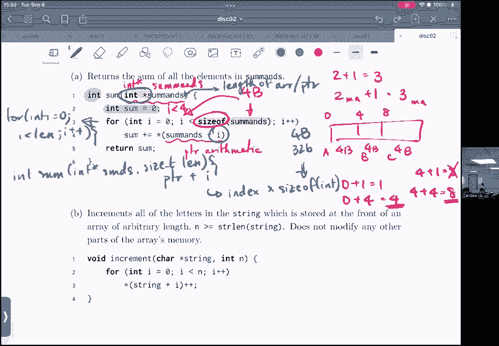

所以是的，感谢各位出席，啊，反馈环节在边缘，带有所有其他链接的帖子，所以请随意给，如果你有什么反馈给我，但让我停止录音，对不起，有人能帮我吗，哪一个，它是。

