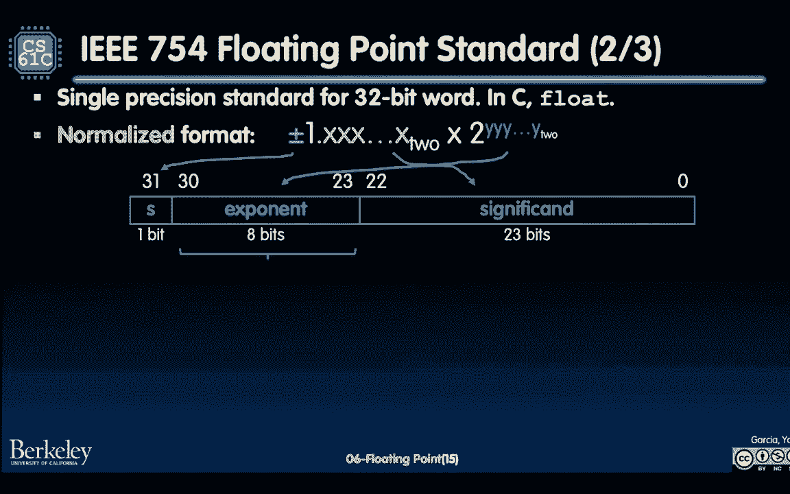
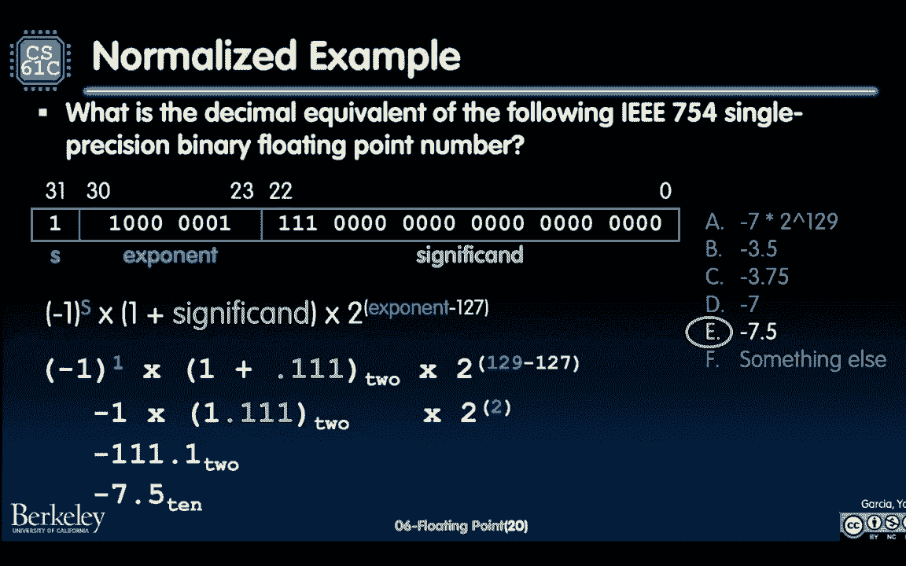

# CS 61C at UC Berkeley  - Fall 2022 - P8：Lecture 6： Floating Point - 这样好__ - BV1s7421T7XR

一天六十一个，喔喔，所以在我们开始今天的内容之前，它说的是浮点表示，我想指出部门正在发生的两件事，我觉得超级酷，为61名C级学生，第一个是明天，我们有一个苹果和电子教育和倡议的事情，它被称为新硅倡议。

会有食物的，我们要谈谈，苹果是如何参与所有这些不同的课程的，从61度一直到51度，一五二，以此类推，这将是，我听说，会有玉米煎饼和波巴，一定要来，会很酷的，但一定要回复上面的二维码，它在PDF上更新了。

现在在网站上，所以你应该可以去看看，第二件事是，那是明天，但今天下午，名誉教授戴夫帕特森要来谈谈，他在过去的一二十年里学到了，关于这些领域特定的体系结构，以及它们如何影响环境，所以这就是你感兴趣的东西。

呃，有一个，今天下午四点在惠普礼堂举行，还有一个网络研讨会链接，所以请务必出席，会很棒的，派特森教授真的很棒，他现在在谷歌工作，但他还是名誉教授，他是在回馈社会，谈论他的很多经历。

所以这两个活动都将是超级酷的，两个都不会被记录，所以一定要在网上看看这个，然后明天亲自去苹果，这就是今天的公告，我们将讨论一个叫做浮点的东西。

所以到目前为止，我们一直在讨论整数，但是有个家伙，他叫詹姆斯高斯林，他不仅仅是那个，他实际上是java语言的发明者，他是太阳人，他为计算环境做出了很多贡献，到编程语言环境，有这么一句话。

这将伴随我们今天剩下的时间，然后进入周五，当我们讨论浮点运算时，95%的人都很酷，是关于浮点的，所以在接下来的两天里，你们要学到的一件事是，你现在是百分之五，你将完全了解浮点，会很棒的，事实上。

詹姆斯·高斯林仍然非常参与社区，就像Java球体一样，在推特上关注他，他真的很酷。

到目前为止我们做了什么，我们已经讨论过整数表示，到目前为止，我们有点认为，如果我们有n位，我们可以用这n位来表示事物，地址，整数，我们看到和看到的整数有两种主要形式，其中一个是无符号整数。

其中一个是有符号整数，尤其是2的补语，就是那个，今天使用的许多建筑，你能用n位来表示什么，虽然，无论发生什么，这将是N件事的两个，在无符号整数世界中，这样做的方式，你将能够从零开始表示事物。

一直到2到n减去1，然后在正弦整数世界里，因为你想表示负数2，你用m减去m减去1来表示负2，一直到2到n减去1减去1，在那里你想象有括号，我在说话，但是你也可以看到圆括号在幻灯片上的位置。

但是其他数字呢，原来人类，也是世界运作的方式，整数不仅仅是，还有一些叫做数字的东西，里面有分数，也是超级超级大数，所以在顶部，我们有每千年的秒数，大概是三点一五五六你可以把它翻十倍，一个非常大的数字。

无法用我们现有的整数格式表示，我们也有非常小的数字，所以完全分数成分，我们有5。29乘以10的负11，所以真正的一小部分，然后我们也有整数和小数分量的数字，就像有两块六，这里是二五。

其中一些我想注意的事情，其中之一是，与其说所有的数百万和数十亿，或者零点零点，我一直在用这个叫做科学符号的措辞，你可能在课堂上见过，化学或物理，或者这些类型的东西，我们今天将讨论科学符号的细节。

对于那些不太熟悉的人来说，这对我们如何谈论浮点非常重要，但请注意，在我介绍的这三个案例中，这并不能掩盖，在整数版本中没有真正涵盖，如果我们代理第三个案子，很好那我们就能代表前两个案子了，至少那是希望。

让我们从第一个案例开始，那么我们怎样才能把一个整数和一个分数表示在一起呢，在相同的数字中，从以前的2。66 2。5，我们说好吧，我们可以用稻草人的方法，对于那些没听过稻草人这个词的人。

就像我们在展示这个，然后我们把它打下来，因为事实证明，我要呈现给你们的版本是更好的版本，嗯，让我们先谈谈简单的版本，所以这里的简单版本是我们所说的不动点表示，记住我们现在考虑的是比特。

现在我们试着把我们知道的十进制的数字，并将它们移到位表示中。

如果我们有整数和小数点在中间的分数，现在我们有整数和分数，中间有一个二进制点，下面是一个例子，如果我们有一个6，假设X，X，Y，Y，Y，Y，然后我们可以表示这些比特中的每一个，二的幂，请注意。

这和我们在无符号整数中看到的是一样的，但现在不仅仅是，不只是二的正幂，我们也有两个负的幂，所以在某种意义上，我们的固定位表示，上面说我们的固定点表示，这第五位，从右边开始数，在第四位和第三位之间。

我们有一个点那个二进制点，这将把我们两个的力量分开，让我们看看例子，假设我们有位表示，一零一零一零，这口井的定点数是多少？我们把它映射到这些位置，我们拥有的两种力量。

如果我们在这里做一点类似于以前的算术，我们有1乘以2的1，然后我们还有什么，我们有1乘以2的负数，那是第5点，然后我们也有1乘以2的负3，那是1点2点5分或1点8分，然后我们把所有的零加在一起。

如果你真的想把事情说清楚，但在一天结束时，我们把我们有的数字加在一起，当我们以10为基数得到2。6到5，所以这个不动点比较简单，它基本上说你有这个位表示，你只需选择二进制点的位置，再计算2的幂，但是。

请注意以下内容，好啦，范围会小一点，大家可以看到，我是说，我们在这里用六个比特工作，我们是，我们仍然要表示2到6个数字，但现在在这个版本中，因为我们只处理正数，嗯，它是正的和零的，我们将从零的范围。

一路走到三点九三七五，为什么我这么说，我们要从0到1，然后都是这个数字，如果我们再加一个使它成为1，这将是四个减去我们添加的一个，也就是2的负4，这就是那个数字的来源。

所以这看起来很好，让我向你展示一下我们如何，用算术，加法端有不动点的加法和乘法，这个比较简单，嗯，我们有不动点，所以我们只是把所有的数字对齐在一起，然后我们加上，就像我们在小学一样，乘法要复杂一点。

我们还在上小学，版本中学，但现在我们只是在处理一些小问题，而不是从零到九的数字，所以这意味着我们可以做的就像我们，你叫它什么？长乘法，我已经不记得它叫什么了，上面写的是嘿，第一排在这里。

这将是最高数字的零倍，然后0乘以顶部的数字，然后一路零乘以最高数字，直到这里的第四排，与第二张，在歌剧里，然后我们又有了0和0，最后我们将以零结束，零一零一零一，那太好了。

现在我们只要想想我们要把点移到哪里，如果你还记得乘法是如何很好地工作的，我们在顶部操作数的分数中有位置，底部操作数分式中的四位，所以我们要数一二三四，一二三四，我们的二进制点在这里，就像一张纸条。

只是想提醒你其中一些操作可能是如何工作的。

让我们回到代表的数量，所以我们现在看到，如果我们有六个比特，我们现在可以代表2。66到2。55很好，让我们考虑一下不动点表示中有多少位，我们需要表示这些非常大的数和非常小的数，例如，我给你做了点计算。

我没有，我没有把所有的号码都写在这里，但事实证明，对于顶部的这个非常大的数字，你需要三十四个比特才能得到这个十，为了得到代表，然后对于一个非常小的小数，你需要二进制点右边的5个8位，代表那很小的十个。

到负十一数，所以如果我们有一个不动点表示，我们需要左边的这三个四个位，右边这五个八位，所以实际上我们总共花了92位来表示这两个数字，但实际上，当你做科学计算时，你可能会经常遇到它们。

就像如果一个数学家或科学家在使用这台计算机，也许他们会用这两个号码，所以如果你用，如果你需要92位来表示这两个数字，一定有更好的办法，答案是有，这就是稻草人争论的重点。

所以这个论点的重点是表明，有一种东西叫浮点。

这比我们从固定点得到的要好，就我们如何，我们如何使用我们的比特，聪明，让我告诉你我的意思，一个浮动二进制点将是有效的，因为它使我们的数字表示更加准确，允许有效地使用比特，让我们采取，让我们举这个例子。

在这里，我们有一点六四零六二五，所以这是一个小数点，因为我打了十垒，然后我把它转换成二进制表示，好啦，所以有一堆零，然后有一个二进制点，然后是零零一，零一零一，然后一堆零，之后是表示二进制数的i。

前面的零和后面的零。

请注意以下内容，我在这里划了两个重要的部分，这就是浮点所代表的，它将代表这个数字中的能量，比特中的能量，我把这些重要的部分叫做，所以它将存储这五个比特，在某个地方，零一，零一，然后第二个。

它还将存储我所说的指数字段，也就是二进制点所在的地方，具体地说，二进制点在两个空间之外，假设能量是从哪里储存的，所以我们存储这两个字段，因此请注意，有这两个独立的字段，有效位如能量和指数场。

所以二进制点在哪里，我们实际上可以表示更多的数字，使用大致相同的数字，我的意思是，嗯，假设我有小数，一直到这里的二进制点，现在突然间，我只需要记住这个二进制点是1，2，3，5，6。

离能量正常的地方八个地方，所以这只是更多的一点，不用考虑我的不动点表示，这就是现在的浮点表示，你看着这个然后说，嗯哼，丽莎，我说了几句提示的话，到目前为止的几个关键词，科学符号，有效位。

这听起来有点可疑，就像几年前我上的化学课，这是正确的，输入十进制科学符号，所以让我们回顾一下什么是科学符号，首先浮点只是一种科学的表示法用不同的方式表示你的比特，所以在科学符号中，我只是要复习一些术语。

你以前可能见过也可能没见过，科学符号有两个组成部分，这里是1点6 1点6 4 0 6 2 5次，十到负一，这里有几点，其中之一就是尾数，或者这种能量在哪里，重要的数字在我们对我的信息中，在我们的数字中。

然后第二个是指数，所以十的负数，负1是指数，最终告诉我们，我们的小数点在哪里，我突出了小数点，只是为了让你看到，然后我还强调了我们，我们进入十垒，或者这个基数，它是十的十的一部分到负的一部分。

还有一个评论，我想在这里谈谈科学符号，这可能是一个你以前从未听说过的词，但如果你上过化学课，你就会这么做，它是规范化的形式，规范化形式意味着在科学符号中我们没有前导零，所以在小数点的左边有一个数字。

它是一个非零的数字，所以一些归一化的例子我们有三点，0乘以10到负9，非规范化的数字将是，如果我们把它移到像点，三乘以十的负八，或者如果我们是30乘以10的负10，这些都没有非零的数字，小数点左边。

然后你就像，哦耶，好啦，我想起来了，我帮你拿回来，我现在有点想起来了，当我上这门课的时候，是啊，是啊，我因为某种原因被扣分了，当我这么做的时候，我有点奇怪，所以事实证明，这实际上是非常重要的。

我们看到的浮点的一些效率，所以它是有价值的，我知道我就像。

哇塞，好啦，那么什么是浮点，然后我已经提到好几次了，但让我正式定义一下，浮点有点像，就像二进制中的科学符号一样，这意味着什么，就像二进制的科学符号，所以我们在这里又有了一个科学的科学符号。

但现在这都是二进制的，所以我们有二进制点，我们有一个二元尾数，一分，零点一分，零一，零，第二阶段，我们是基地现在是两个，我们的基数现在是二，我们的指数现在是负3，好啦，有负三的地方，这是十进制。

但那是因为，作为人类，我们更容易看到这个数字，呃，以十为基数的指数，这表示二进制点不固定的数字，与整数相反，你总是知道整数，二进制点有点像，在整数的最末端，你的力量总是在增加，二的正幂。

以及与浮点相关联的变量类型，至少在这一部分是浮动和双倍的，然后你可能会看到更多，我们会报道，我们会在阿宝的结尾看到更多。

现在这里有一个关于规范化的注意事项，这就结束了我谈论正常化的原因，看看这个很酷的东西，在二进制表示中，我们的规范化形式，它总是会有一个，它总是以一个领先，然后你就像等等什么，但不是有吗。

就像1以外的其他数字，二进制中的否，只有零和一，所以如果我定义一个非零的归一化前导形式，二进制中唯一的选项是一个，而在十进制中，你可以选择一二三四，五个，六七八九二进制，所有规范化的数字都将以1开头。

我们以1领先，这将对我们如何看待官方，我把浮点运算标准乘以75，让我们谈谈那个，所以现在我们进入了OK，我们有一个想法，我们希望表示有效位，所以我们想代表这个曼彻斯特，我们怎么把它分成32位。

变成我们所说的单一精确浮点，嗯，我写了这个，你和我的规范化格式已经用颜色编码了，我们将看到，在三个二位中，你至少可以表示，我三七五四标准，在那里我是，电话是什么，电子和电气工程师协会有点像。

所有计算机体系结构是如何构建的，这个七五四标准说可以，对于这三个二位，这就是事物在这里的表现方式，我们有一个标志，一个指数场和一个有效的手比特，一个重要的手场，让我们具体地谈谈其中的每一个。

在接下来的几张幻灯片中，我要做的是，我来解释一下标准，然后我们来看一个例子，然后我们将更深入地研究标准的不同部分，首先要做的就是说，好啦，如果我们试图表示这些归一化的数字，使用三个二位，第一点或借口。

右边的第31位将被分配位，按照惯例，我们要做的是，我们就说那个，呃，零是正的，一个是负的，你就像，哦耶，好啦，我在像这样的符号星等中看到过，我有点想起来了，我要做的第二件事是解释，一直走到右边。

解释一个重要的手场，现在是一个重要的手场，IS有时会用另一个词来形容曼彻斯特，但让我告诉你我们是如何使用它的，在这种情况下略有不同，有效位和场是有效位。

但减去前导的隐式。

好的，好的，换句话说，有效手就像小数分量，然后因为我们知道在一个规范化的形式中，事情总是以一个或重要的，只是不代表那个领先的，它说我只是要表示分数，然后呢，当你想把我转换成我应该代表的实数时。

加上那个隐式的，是零的2次方，现在请注意为什么我们要做得很好，这使得我们可以有效地使用这两个位，好啦，因此，我们实际上可以表示两个四比特的尾数，结果，最后让我们来讨论这个指数场，但这个指数你可能会喜欢。

哦耶，就像我知道所有表示整数指数的方法一样。

所以也许我可以用2的补数，或者像这样的东西在伊特罗伊七五四，我们使用偏置符号，好啦，所以你已经看到了数字的偏差表示，这实际上是用例，为什么我们在第二课介绍的时候，所以指数域表示我有一个数。

让我们把它表示为八位，然后再减去1 2 7得到，我代表，现在你可能会想，选择赞美，超好看，就像，为什么我们不在这里用补语呢？原来当我的黎波里七五，四个是设计的，大约在1980年或1977年。

设计者希望使用浮点数，即使没有特定的浮点硬件，所以他们想要一种使用整数比较硬件快速查看事物的方法，我的想法是，如果你有两个正数，较大指数字段数，所以让我们说像，呃，二比一二十五。

在位边看起来比较小的正数大，以更小的指数，感觉像二对负三什么的，你还记得有一点需要补充的是负数有一个导数，一个在他们身上，把事情搞砸了，如何对所有这些浮点数进行排序，最终的结果是如果你有一个偏差符号。

所有的数字，至少如果我们看看前九个位，不包括重要的，所有这些数字都是根据符号幅度排序的，所以你会想到快速检查的方式，看浮点数是否更大，检查一下牌子，看看它们是不是同一个牌子，然后这就会告诉你一些事情。

如果它们是相同的符号，检查指数，如果你有一个更大的偏指数，然后它将比一个较小的有偏指数更大，所以它允许在这个方向上更快地比较，这是标准，这是总结幻灯片，我们会回到如何在练习中使用这个，就一会儿。

但是请注意以下内容，我这里有一个很好的公式，这是一个公式，你应该有点喜欢，在你的大脑中植入32位的单精度，上面说每一个浮点数，如果我有三个二位来表示它，我们用的是七五四标准，会是负数，一个到正弦位。

它们要么是一，要么是零，会是一个，有效值表示指数字段乘以2的分数，我的喜欢和它的偏见负一二，七，这里应该有几个问题，你好像没事，嗯，不包括零的归一化数，对呀，我们以后会更多地讨论这个问题。

但现在让我们像一般情况一样考虑一下。

这里的这种类型的数字，现在来点超酷的，在我们看这个例子之前，为什么我们要教浮点标准，这是七五四井，它是许多计算机体系结构中使用的标准，所以实际上，在你进入子宫之前，那一秒钟的闪回。

有点像一九七七年或一九七六年，当时的威廉·汗，我想是在伯克利，和英特尔合作就像嘿，有这么多不同的浮点架构，我们真的很难，一种确定性的，假设一台机器上的一个程序将以某种方式运行它，然后它应该运行浮点数。

应该在不同的机器上以相同的方式运行，因为他们使用了不同的协议，就如何计算浮点数而言，当他在开发英特尔芯片或者咨询他的英特尔芯片时，他就像，让我们创建一个浮点数应该如何表示的标准，以及如何计算它们。

像加在一起，倍增，把所有这些东西，不仅如此，我是一名计算机科学家，我要和数学家一起工作，了解他们如何使用浮点数和整数的分数，我也会用一些对他们有意义的东西，所以标准被创建了，实际上这是使用的标准。

大多数情况下，在许多情况下，今天普遍使用处理器，我们将在这节课的最后讨论其他几个问题，哦这里的另一点，澳大两项大奖得奖者，所以请记住，这有点像诺贝尔计算奖，他是，他也是伯克利大学的名誉教授。

所以说你有多酷，你知道的，学习世界标准。

我觉得这很棒，好吧，这一点，然后让我们来看看这个例子，所以我写了我在前一张幻灯片上分享的公式，把这个32位的表示，我的问题是嘿，这就是，以十为基数的数字是多少？如果我们用浮点标准。

所以我给你一分钟来介绍，或者一两分钟来自我介绍，对你旁边的人，或者重新介绍你自己，我们会回来讨论的。

哈哈哈。

所以我做了一件事，我给每个人施加压力，展示其他人喜欢的东西，快的人穿的是什么，然后在某个时候，每个人都像，哦耶，让我们都转向选择，夏娃，因为那似乎是大多数，那很好，当你上大学的时候。

我们学到了关于个人主义的东西。

不，好吧，所以让我们稍微谈谈这个，哦耶，是啊，是啊，是啊，是啊，看我们有CNF。

是啊，是啊，是啊，是啊，是啊，是啊，牛逼，所以让我们来谈谈为什么这里的正确答案是，E，所以在这种情况下，我们在处理这个等式，我觉得这是我见过的，呃，所以在每个人的脑海中似乎都很清楚的迹象。

因为符号位是1，技术上来说，我们会有一个负的，允许这个归一化的形式是一个负数，现在重要的是，我认为是棘手的部分之一，即重要的和将有一个领先的，所以有效值只是一个分数分量，然后你总是加上这个前导的。

因为归一化形式总是有一个前导的，因此，标准甚至不能代表它，从某种意义上说，它一直在那里，它隐含地在那里，我们所做的是我们有一个重要的，这将是第一点，第一点，之后全是零，所以我写这篇文章是为了说明。

然后加上标准告诉我的隐含的，因为接下来的规范化形式，我们有指数场，因为我们要处理的是偏置符号，偏差符号会说好，拿着这个1号0 0 0 0 1，将其计算为无符号形式，那么那口井是什么呢。

我想每个人都比较熟悉上垒的下四位，上升到8，那么我们有16个32个64个1个28个，然后再加一个，所以我们的偏指数是1 2 9，然后我们减去指数-1 2 7，把它变成两个，现在在尾数方面我们有一分一。

一个是个好地方，然后现在我们用我们从固定点版本中学到的东西来转换东西，我们有2到0，这其实是一个，让我们看看我是否有分数，是啊，是啊，好啦，所以呃，我做了我做了，我以前做过一个点，即使把这个不动点。

我必须把点移动到正确的位置，那是浮点组件，所以我把这个点移动2，因为它是正二的两倍，所以我把这个浮点移过来，因为这个数字越来越大，最后，在这一点上，我有什么好的，转换这个数字的一种方法。

是将二进制点左边的左数字视为整数，所以你们看到的正整数，所以如果你有三个，这是七号，然后现在分数部分，经常，你手动计算，你说好，这里的第一个力量，这是负数的二，第一负幂，这就是第五点，最后我们得到负7。

第五点，那是十进制的表示，所以给自己拍拍背，如果你有任何问题，很高兴回答他们，布兰登在这里，我们的摇滚明星助教在聊天中回答问题，然后我们会有一堆咆哮的TA，能够在ED上回答你的问题，如果你想多练习。

你跟我一样，所以这还不够，给我多点浮点，我们在幻灯片的末尾有一些教程示例，为你而存在。

这是我想强调的一点。

因为这将是，这将是有多少人的关键。

在理解，我们实际上可以用浮点表示多少个数字，所以我们有这个号码，让我们假设这里有这个数字，为什么我们不打算转换它，但我只想说这是数字Y，现在我问你，下一个可表示的浮动是什么，在y之后或y之前。

让我们在为什么之后做一秒钟，那会是什么样子，我们有一些号码，如果我们想拿到下一个号码，紧接在这个之后，我们去我们重要的最不重要的一点，我们只要在上面加一个，所以其他东西看起来都一样，指数是一样的。

大多数重要的看起来都一样，但我们只是在上面加一个，这将是下一个可表示的数字，离这个数字最小的一步，Y，让我们看看这个数字现在会是多少，真的从这个，我想让你考虑的是，y和下一个最大的数之间的步长是。

我实际上只是计算了很多，就像我一直在做所有的浮动计算一样，所以我说，好啦，嗯，这里是点，这是我第二步的大小，两位零，然后两个三个位，这里有一只，然后用我们的指数来缩放，二对二对一二十九减去一二十七。

好啦，就像这里的步长，现在如果你仔细想想，你就像，好啦，嗯，这个点是什么？那很好地代表了什么，浮点标准中需要注意的一点是，总是只有两个，三点意义，所以如果我们暂时忽略指数。

我们只是在想零点零点零点1是什么，会是二的负二十三，因为有效值的最左边是负的2，然后是2的负2，一直到二三位二到负二三，所以这是一个重要的步长，但我们用指数来衡量它，得到可表示的数字，所以在这种情况下。

我们的步长，所以下一个还是，后面的数字是y加2的负2 1，这里的重点是什么，这里的重点是对于相同的指数，所以对于同样的1 0 0 0 0 0 1，二对二对二，我们能够表示2到2三个数字。

所以所有不同的数字在显著的，但是不同的数字之间的差距是什么，整数中的数字，差距是正负一，因为这是整数的步长，但是在浮点中，步长将是可变的，因为指数。

所以在这种情况下，我们将有这个步长，这种能够计算的能力，这将是一个关键的部分，看看什么数字是可表示的，那么外卖是什么呢，因为我们有固定数量的比特，像一个整数，就像，所以我们还在处理三个两个比特。

我们不能代表所有的数字，但如果你能计算步长，即连续数字之间的间距，这让你知道，好啦，对于较大的指数，我要有更大的步数，然后对于较小的指数，我要有更小的步数，你可能会说，好啦，为什么这很重要。

为什么这是你想要设计的东西，难道你不想把所有的数字都表示好吗？让我们回到，呃，千禧年的秒数，暂时的，是那种十到十的数字，十到十和十到十之间有什么区别，加上点赞，就像一点点，就像多了一秒钟。

那额外的一秒钟就像离所有的能量都很远一样。

就像这个十到十，因此步幅很小，当你有巨大的数字对科学家来说并不太重要，然而，当你有非常非常小的数字时，就像我之前吃了什么，就像战争是持续不断的，或者像平面常数，或者类似的东西。

小的微小的数字将有小的步长，因为在这个领域你需要非常非常高的精确度，所以关于其中一些是如何实现的，现在是热身时间，热浪广播，有多少人觉得，这几天，而今天。

LSV有轻度空调真好，但是这里的人数并没有让这里变得温暖，所以这有多暖和，是啊，是啊，是啊，是啊，是啊，是啊，是啊，是啊，让我们谈谈软件缺陷，所以你看着这个数字，你就像，这是一月二十二日的热浪。

你在开玩笑吧，这实际上是20秒前的一月，但即使这有点不可能，让我们看看这是多少，这实际上是浮动最大值，好啦，所以从某种意义上说，哦耶，冷静点，如果我们代表事物，你认为三个二位的精度。

你知道我们有这些小数点，因为温度就是这样，我们需要表示小数部分，我们把它用光了，就像我们溢出来了一样，或者你知道，稍后我们将讨论溢出和下溢，但是，让我给你们看看浮点最大值是多少，都是。

如果不是指数中的所有，它实际上是偏置指数，二五四，不是二百五十五，减去偏差好吧，所以一二七，然后所有意义上的，好啦，所以这大约是三点，四次张量三八，哪个号码。

我为什么要给你看这口井，你就像，哇丽莎，我们没有使用Max的所有指数投票，它是254偏置的，为什么是二百五十五，所以这是关键，我特别忽略了一组浮点数，到目前为止，我们将讨论，归一化的数字是从1到2，5。

4，零和二五五的偏差专业指数，这些将被保留给我们一直在浮点数中使用的特殊数字，所以让我们来谈谈这些特殊的数字。

到目前为止，我已经谈到的其中一个是零，就像我们没有讨论过零一样，让我们谈谈零，注意，0没有规范化表示，因为所有规范化表示都需要从1开始，零没有人，所以归一化表示将计算出，所以呃。

威廉·卡恩和他的团队决定说好吧，指数是零，所有的零都代表零，所以在浮点运算中，我们实际上会有两个零，结果，当符号位为零时，我们得到正的零，当符号位为1时是负零，你就像，为什么。

我想做所有整数的事情的全部意义，从几周前开始，那是因为我们没有，我们只想要一个零，事实证明，有两个零对于表示一个东西非常有用，我们称之为下溢。

所以让我们总结一下目前的情况，我们有专门的号码，到目前为止，我告诉你的是，所有的零指数，所有零显著，结果是正负零，我们一会儿再谈其他的，哈哈，不同的领域和特殊领域都将能够容纳，我要定义的溢出，底流。

也只是一般的算术错误。

让我们定义溢出和下溢，你已经看到溢出了，但你实际上没有看到下流，事实证明，整数不会下流，因为这个定义，它们只溢出或负溢出或溢出，让我们来谈谈这些可以用归一化数表示的最大和最小的数，所以在正常的数字中。

我们从天气幻灯片中看到了这一点，我们会得到2，5，4的偏指数，然后这两个中的一个很重要，所有的三个比特，在另一边我们会有最小的数字，这将是最小的，归一化指数，均为零的偏置指数，然后1是1减去1 2 7。

那将是二的负一二六，然后全是零，在意义上，这些数字会变成大数字，三分，四乘十，到十到三十八，小数是1点2乘以10到38，这就是我们的数字线的样子，所以在这个负范围内从负3。410到10到38。

一直到负1点2乘以10到负38，积极的一面是这些数字都是可表示的，除了零之外，其他所有东西都在这个中间范围内，在这些较大的范围内，它们不能使用我们的浮点规范化表示来表示。

如果一些数字超出了这个范围怎么办，我们这里有两个范围，然后太大了，我们称之为溢出，那么我们使用的溢出的具体定义是什么呢？指数字段不够大，无法实际表示，我们在正域或负域底流中的超大指数，另一方面。

指数对我们来说太小了，所以这意味着我们在这个范围内，所以你突然意识到为什么整数只有溢出，因为他们只有两个大的，两个大负数还是两个大正数，他们从来没有那种他们不能代表的微小数字。

因为它们的步长总是一个或浮点，你会有这个问题，所以这就是底流，这就是为什么有两个零很有用，因为这样你就可以看到你是否站在下流的积极一面。

或者底流的反面，好啦，所以我三倍的其他一些事情，七五四内置，就是这个无限的概念，所以在整数中，我们没有无限的概念，但对于数学家和科学家来说，它非常有用，老实说，如果你拿六十和一，你可能以前见过这个号码。

你就像，啊，一些令人兴奋的事情，是啊，是啊，我知道，所以在浮点中，除以正负零应该会产生正负无穷大，为什么要问数学专业的学生，但这里的重点是x除以y，嗯，这个y实际上可能是一个有效的作文。

如果你想做三角学，具有正负无穷大的渐近数的，那对计算很有用，弧度和圆周率，所有这些弧形棕褐色的东西，如果那是什么，那就是你的果酱，在过去，这真的很重要，尤其是像机械工程师，我乘以7乘以5乘以4表示无限。

你知道的，如果指数中的所有零都是零，然后重要的是，全是零，无穷大都是指数中的1，所以二五五备用场，然后所有意义上的零，就像零一样，但就像赞美，然后现在你就像没事一样，所以现在剩下两种场。

我们怎么处理那些井。

其中一个不是数字，这就是我们开始表示算术错误的地方，我这么说是什么意思，所以南是你经常听到的东西，我们把它表示为指数中的所有，然后任何重要的不为零的东西，好啦，所以这种情况有时会发生。

假设我们在页面上有没有，但如果你真的喜欢负三的平方根，我们只用浮点数表示实数，所以这不是一个数字，不是实数，嗯，还有一些其他的，也是，我很乐意多谈一点，如果你喜欢，但是，为什么有范威尔有用。

能够将这些信息传播到软件是很有用的，所以让我们假设你有一个复数，就像一个，你在密码里知道一个假想的数字，而不是在那里射箭，你可能想把它传播到某个地方，程序员可以看到这一点，并能够适应它，就像，哎呦。

其实呢，我们的情况很复杂，我们应该把这看作是一种软件类型的情况，在那里我们可以更好地编程，所以你可能想得很好，你知道零，我不明白，只有两个漂浮着，就像两个无限存在的表象，也只有两种表现形式。

但现在突然对NAND来说，你有两个到两个三个南的代表，就像浪费了很多空间一样，卡恩教授和他的团队说，像废物一样，不想要，没有，我们要做的是，我们会说这是一个南，它是这样定义的，所有指数中的，然后非零。

在这个重要的，然后你作为执行标准的人，你可以把任何你想要的信息放进这个重要的，所以实际上很多浮点架构所做的，他们是不是把错误的代码，或者就像产生这个nan的操作数能够做的那样。

所以这一切都有点超出了标准。

但当您在编程体系结构时，它允许灵活性，好啦，在专门数字集方面的最后一个是逐渐下流，也就是我们所说的D规范，当你不能代表数字的时候，因为它们现在太小了，给大家看一下，但是，这里有一个小问题。

关于什么数字是可表示的，我们有最小的负数1 2 6，我们以前见过，让我们把它放在数字线上，现在我们稍微放大了一下数字线，所以这是最小的数字和零之间的差距，最小正数和零，第二小的数字是多少？

记住我们要做的是，我们只是想找台阶尺寸，然后按步长增加最小的数，那么步长是多少，这里是二的负三，二对负一二六，这将是2的负149，这就是步长，那么这意味着什么呢，嗯，我们有2到负4 9。

就像负1 4 9，不过，这一步要小得多，那么零和最小数之间的差距，所以这就出现了一个问题，如果你试图喜欢，你知道吗，我会把所有不同的步长都相等，对于这里所有相同的指数，如果你想减去这两个数字。

比较一下就差不多了，也许你在做减法，把它设为零，检查它是否等于零，基本上，这个差距告诉你，如果你减去这些数字，将它们与零进行比较，他们永远是平等的，因为我们马上就会发现，好吧那么。

在最小步长和零之间没有这种粒度，它实际上会导致很多错误，尤其是对那些，极小数量，为什么这种情况会发生得很好，隐含的就在这里，含蓄的那个说得很好，无论如何，最小的数总是一个点，零，那么什么是。

解决方案是什么，呃，i-3-e-7-5-4说它做了一个叫做渐进式下流的事情，通过引入非规格化数的思想，所以从技术上讲，非规范化的数字仍然处于流动状态，但我们实际上能够更好地表示这些数字。

就像对于NAND一样，你可以表示所有不同类型的n，在本例中，您希望表示所有不同类型的下溢，所以你说这将是所有的零，然后任何非零的，我们要做的是创建一个没有隐式数字的数字，这就是范数的作用。

所以让我告诉你这是如何解决这种情况的，我们有最小的非正规化数，现在突然全是零，所以是2的负1 2 6，我们保持最小的指数，我们不会把它弄得更小的，但现在我们根本没有隐含的，所以最小的数字是2的负23。

二对负一二六，那将是二的负一四九，那么第二小的数字是多少呢？你只是增加了意义，一步一步来，所以我们得到2到负1 4 8，也就是两次，负一四九以此类推，以此类推，直到你得到最大的非正规化数，都是1。

然后你在负的1，49上加一个2的步长，你从哪里得到最小的归一化数，所以这是一种引入渐进式潜流的方法，是啊，是啊，就像在这个快乐的空间里。

好啦，今天总结一下，下节课我们来总结一下浮点运算，这些预留字段超级超级好，能够容纳溢出，底流，无限，所有零和算术错误，那么我们星期五见。

