# CS 61C at UC Berkeley  - Fall 2022 - P9：Lecture 7： Intro to Assembly Language RISC-V - 这样好__ - BV1s7421T7XR

人们和那些在线的人，欢迎欢迎，所以我们今天要结束一个浮点运算的讨论，然后进入下一个话题，也就是风险五，所以我要完成一些幻灯片，但首先我想向您展示这个非常有用的Web工具，它链接在幻灯片中。

它被称为i三元组，E七五四浮点转换器，它准确地告诉你比特是如何映射到三个两个比特中的，浮动类型so，例如，你看这些小勾号，您可以检查这些复选标记中的每一个来打开位，打开法力中的位。

然后看看我们得到了多少，例如，这上面写的是什么？上面说有偏指数是168，然后它把它转换成，呃，换算成实际指数，它告诉你实际代表的小数是多少，然后它还告诉你二进制和十六进制表示，让我给你们看一个演示。

让我们假设我想要一个非常大的数字，我可以用十进制输入数字，例如，如果我有兴趣演示1点5乘以10到3 8，我对如何用3个2位浮点数表示感兴趣，只要我输入这个十进制数字，其他一切都以位的形式填充，太棒了。

现在这些做什么，加一减一在边上做，这将增加到下一个可表示的浮点，还记得上次我们讲的一件事吗，如果你有一个给定的指数，你有23点意义，所以这意味着你只能表示2到2三个数字，这是一个很好的方法。

可以准确地计算下一个数字，下一个可表示的数字是，我再来一次，所以我们有1。5 e到38，我按回车键，它会尽量靠近，注意，发生了一点转换错误，因为浮点数不能代表每一个实数，然后现在如果我加一个。

上面写的没问题，下一个浮动是什么，你可能期望它是一分，五乘以十乘以三的八，再加上事实证明这不是因为好，你只有2到负2，离你的指数还有三个点，下一个数字是1。5，亲爱的，亲爱的，亲爱的，这里。

零一零四一六，好啦，所以你注意到这个数字实际上增加了更多，单人的，但不管怎样，这是一个非常好的工具，不幸的是，它只适用于三个二位系统，我们来谈谈我们的三个二位长相。

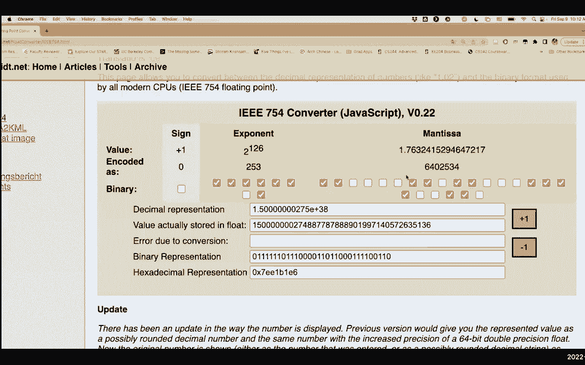

我们将讨论一些其他的表示形式，从最后一个滑梯甲板，然后我们将继续这个幻灯片。

真的很快，这有点像是给你的信息，因为事实证明，当你处理浮动时，了解其他浮动是如何工作的是很有用的，因为如果你在研究机器学习，你可能会使用双倍，或者实际上您甚至可以使用int。

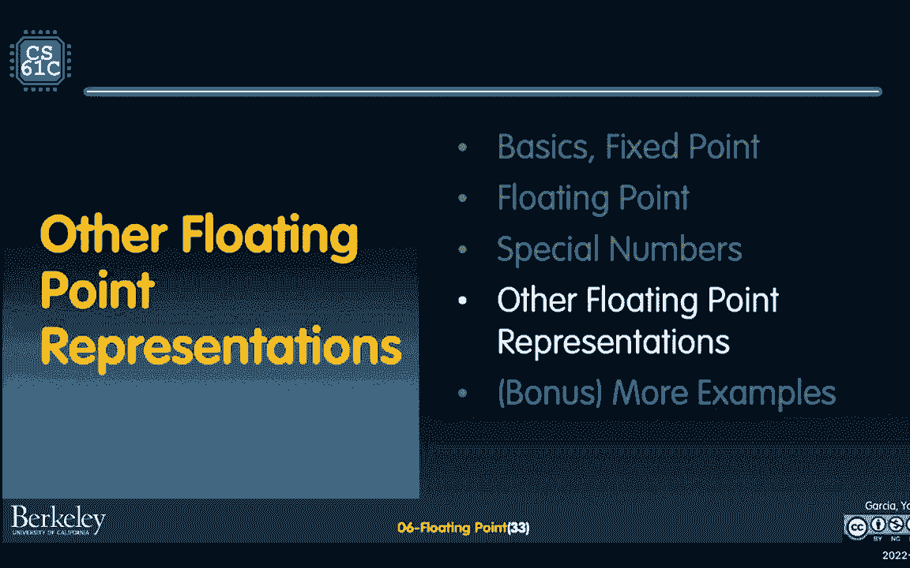

如果你以后在机器学习方面做了一些事情，所以让我们谈谈吧，首先我想澄清的是精确度和准确度之间的区别，你会想用这些术语，解释浮点数在做什么或浮点数在做什么，精度是你必须使用的位数，所以在单精度的情况下。

我们有三个二位要处理，另一方面，准确性是指数字表示实际上有多接近，计算机表示实际上是你想要表示的高精度的实际数字，你拥有的比特越多，你就能越准确，但这并不能保证，所以说，例如，假设你想表示圆周率，你说。

哦好吧，让我们，让我们把三点一四点存储成三点二比特，单精度浮井PI可以使用所有20个中的所有两个三个位表示，三位重要的，所有32位的实际浮动，但它只是圆周率真实数的近似值，即使你去三点一四一五九。

你一直都很好，你仍然不能完全得到数字圆周率的所有准确性。

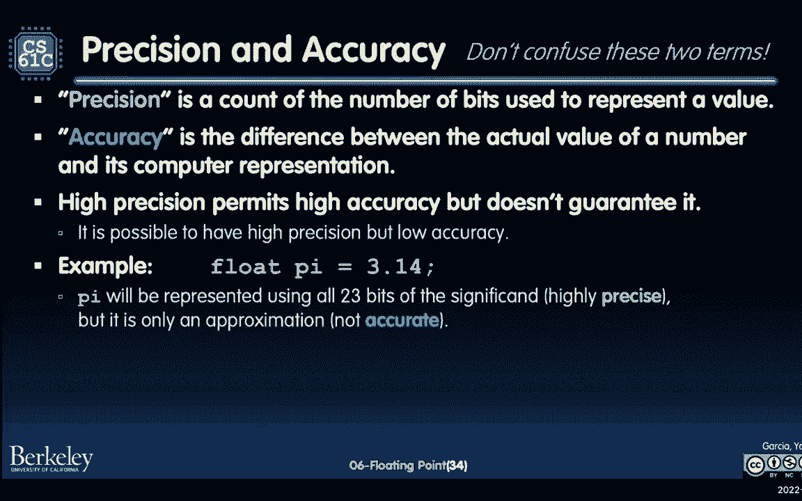

因为这是不合理的，其他几点，所以你们中的一些人昨天问的是好的，做双打，他们就像，这种工作是如何工作的什么是双精度，这就是双精度，它也被称为二进制六十四，就它的表现方式而言，与你目前所学的非常相似。

涉及我一个七五四，但现在我们有了一个更大的指数，所以现在我们不再有八位，我们实际上有11个比特要处理，因为我们总共有64个比特要处理，我们将显著值从23位增加到，呃，二十加三十到五十二块钱。

那么我们得到了什么，我们在C中得到双倍，我们得到的指数偏差是127，如果你想一下你会怎么做偏差符号，你可以表示更多的数字，所以从十分到负数，三百八十度正数三百八十度。

这里的主要优势是你确实得到了更多的准确性，因为你在重要的营地有更多的精确度，只是一张纸条，其他事情。

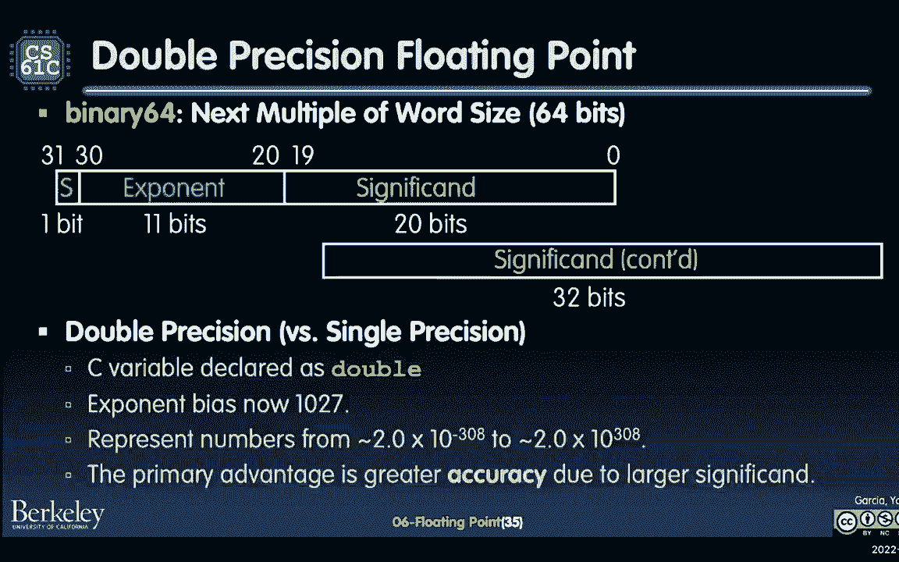

如果你好奇的话，你们会在以后的课上看到，你可以有所有不同类型的精度，你可以有四个精度，但我们有单身，我们有双倍的，你可以有四个X，那些位数。

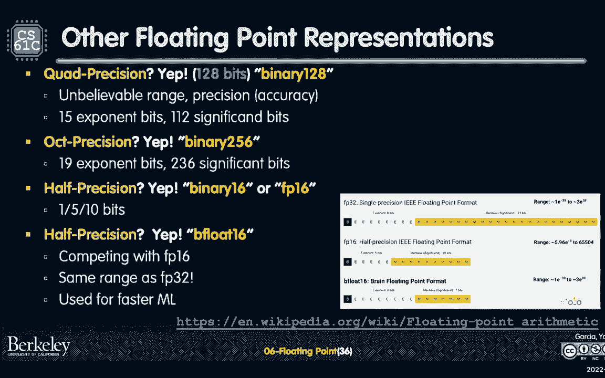

一百二十八位，你不可能有精确，你可以有一半的精度，你也可以有其他类型的东西，只是给你看照片，想想这个有点酷，请注意，这里所有这些不同类型的单词，他们都有一个符号位，指数的一些固定位数。

然后一些固定的比特数。

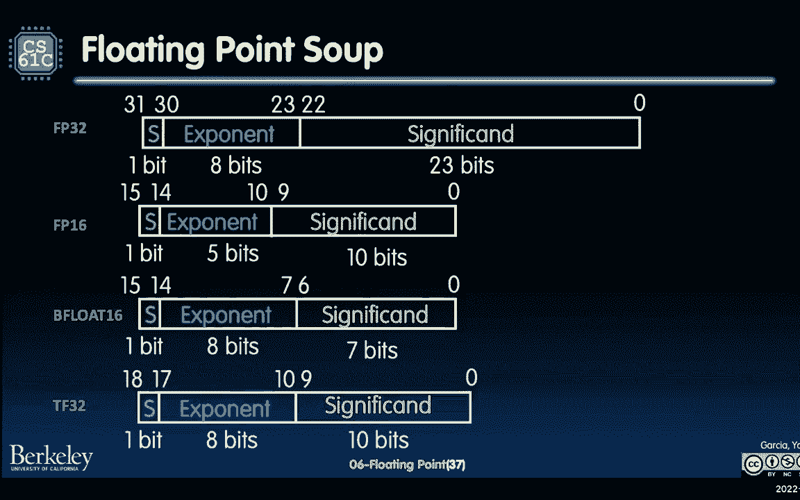

如果你好奇的话，下面是一些特定于领域的体系结构，所以这些都是不同类型的芯片，其中许多实际上用于机器学习，当你看到T代表张量，这很好，我是说，机械工程师会为此对我大喊大叫的，但这有点像向量，有点。

但不管怎样，所以这让你可以看到，所有这些不同的建筑，其中一些确实使用浮点，所以你可以看到右边的这种，你有一个浮点16，呃，二进制浮点数16浮点32，所有这些，但实际上有些架构使用int来表示。

他们所有的机器学习重量和所有这些东西，我很乐意谈谈为什么，很快就发现浮点，你还记得，你了解到的所有细节，是啊，是啊，就像你可以把所有东西都塞进整数里，然后用一个特定的指数来移动所有的东西。

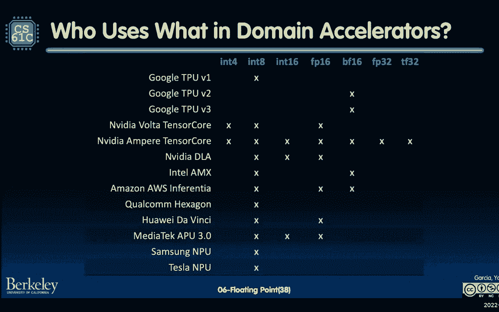

那就太好了，这实际上是，很多这样的，信息花絮，如果你好奇的话，所以到目前为止我们所看到的一切，一种固定指数场，只有一定数量的比特可以使用，代表你的指数，使用一定数量的位，在表现你的重要性方面，这家伙。

约翰·古斯塔夫森博士实际上和卡恩教授就像，好啦，嗯，实际上，如果你可以有一个可变数量的比特，假设你总共有三个二位要处理，如果你能让指数感觉更大，然后显著场更小，这就是所谓的合众，不仅如此。

但你知道这一切就像，浮点总是要近似一个数字，如果你能告诉建筑，当你接近一个数字时，当你在两个联合国之间，或者当你实际上在一个单位，你有一个节省电力的计划，如果你好奇的话，转到维基百科文章。

你可以访问他们品牌的YouTube视频，从那里开始的精彩辩论等等，所以嗯，我现在要做的是，我将讨论浮点的更多细节，你将要遇到的。

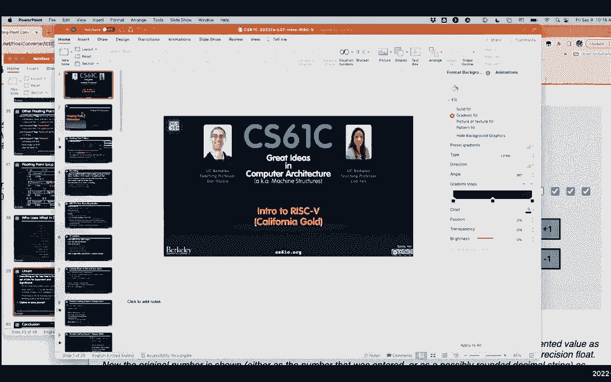

我只是想回答很多关于双杀和结束的问题，上次，幻灯片，关于浮点还有几点，啊，关联处的浮点，好啦，这是什么意思，如果我先加y加z，然后把它加到x上，这和先加x和y是一样的吗，然后加z，那是个问题，结果没有。

让我们来看看这个，所以在这里的第一部分，让我们看看我是否注意到我的幻灯片，我的点击器实际上在这里有一个额外的按钮。

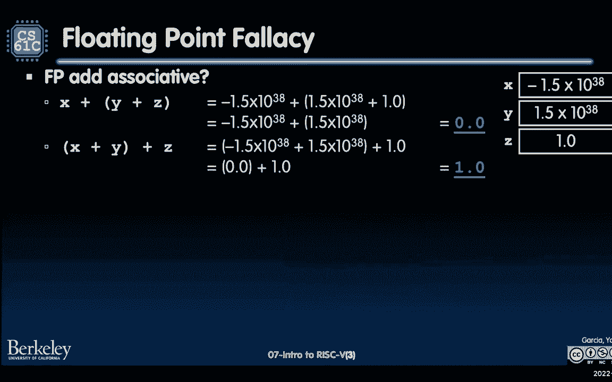

所以让我们看看它是否有效，那不是我想让它做的，好啦，所以效果不太好。

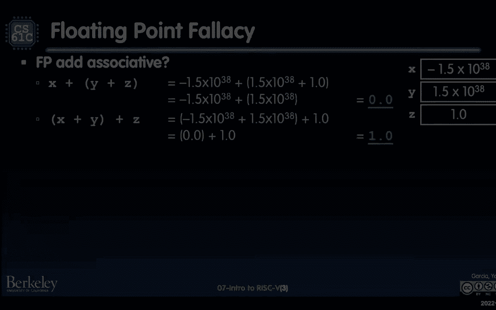

我会练习的，我在家练习，所以无论如何，上面的是如果我们决定把y加到z上，其中y是一个大数，1。5乘以10是我们之前看到的38，然后z是一个很小的数，相比之下，只要一个，我们用浮点运算把它们加在一起。

原来，因为一个点的步长，五乘以十的三十八比一大得多，它只是转换成一个点，五乘以十的三十八，它只是转换成Y，Z部分就掉下来了，那么当你把这两个数字相加的时候，所以x加y等于0，另一方面。

如果你把这两个大数字加起来，第一批，它们相互抵消，你在这里得到零，然后这个零对一，这两个挺有代表性的，而且是匹配的，步骤大小，所以你得到了一个，所以说，因此浮点不在关联的右边。

那么我们在这里实际上涵盖了什么，浮点近似真实结果，因为我们有更大的指数，步长增加，因此，你实际上不能表示微小的数字加上巨大的数字，这里有一个解释，它重复了我前面说过的话，所以它就绕了一个点。

五乘以十的三十八，加一二，就一分，五乘以十的三十八，y的这个值。

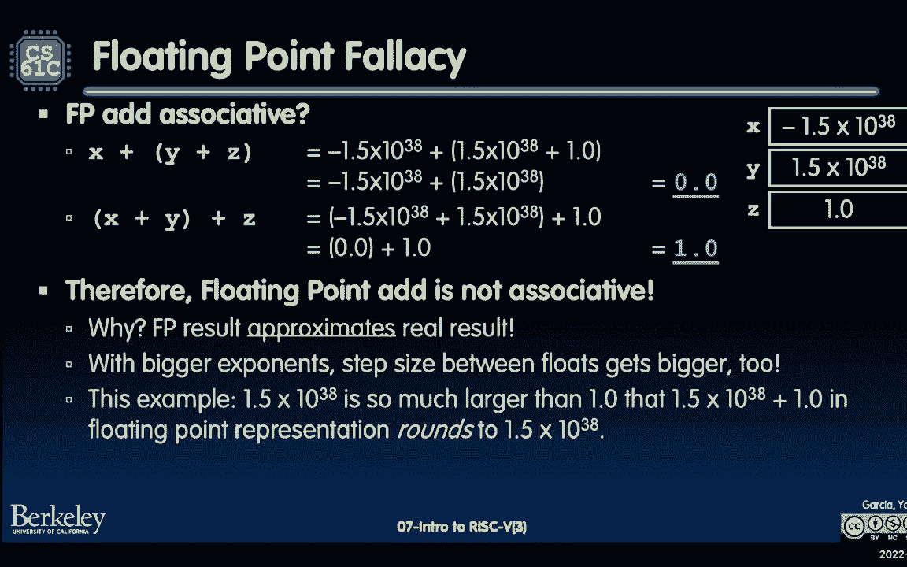

浮点我们不能真正表示所有的数字，所以，因此，标准必须处理的一件事是不同的四舍五入模式，这样架构就知道会发生什么，这在引擎盖下是如何工作的，硬件有两个额外的精度，这就是它用来决定数字的四舍五入的方法。

如何表示这个数字，这里，当你施法时也会发生，假设一个精确数的倍数，或者将浮点数转换为整数，我们将在几张幻灯片中看到这一点，但我只是想给你看四种舍入模式，它们有合理的意义，除了最后一个，我会详细解释的。

所以这些有点，呃，架构可以像这样的模式，好啦，嗯，这是我要使用的模式，这样看浮点的人，实际上可以说，好啦，我实际上总是徘徊在更大的数字加无穷大，或者我总是想四舍五入到更小的数字，负50。

或者我只是想总是截断数字，类似于整数四舍五入，一个结构看起来我们一会儿就会看到这个，但默认值实际上是一种叫做无偏四舍五入的东西，我要稍微谈谈，我们所说的无偏四舍五入是，如果你是一个数字的中间。

你会平分的，这和你可能见过的东西很相似，当你第一次学四舍五入的时候，就像在小学，或者如果你很了不起，就像在幼儿园什么的，但让我们来看看，所以2。4，嗯，它更接近两个，所以轮到两个2。26。

已经接近三发了，三点到两点五，现在我们在2到3之间，所以我们要四舍五入到偶数，在这种情况下是二，然后同样的三点五，我们还在3到4之间，但我们要四舍五入到偶数，也就是四进，所以请注意，你总是选择偶数，嗯。

就像，你知道平均来说，如果你看到偶数的偶数和奇数，或偶数和奇数相等，你要向上和向下四舍五入相等的次数，所以这使得无偏四舍五入，所以你并不总是倾向于围捕，或偏向四舍五入，这确保了计算的公平性。

实际上平衡了很多你可以看到的不准确，通孔四舍五入，通过一些对浮点如何工作至关重要的东西。

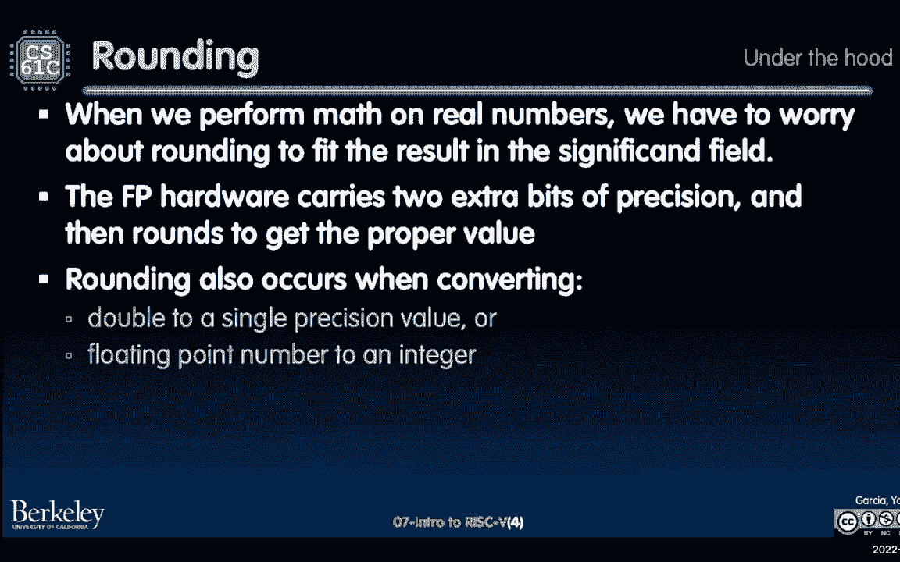

关于浮点的最后一点，啊哈又来了，我们说过定点，还记得上次我们开始的稻草人争论吗，我将简短地谈谈加法，还有关于铸造浮点版，事实证明，这比处理整数要困难一点，这比使用固定点数字要困难一点。

因为你不能把意义加在一起，然后它们有不同的指数，所以你得先重新计算指数，所以如何做到这一点的程序，同样，这有点像帮助你理解浮点是如何工作的，我们不会要求你执行这个，它是如何工作的，第一批。

你反正式化以匹配指数，你把数字对齐，然后你把意义加在一起，你保留你匹配的指数，最后，你归一化，添加一个隐含的尾数，因此，您可能必须更改指数，如果迹象不同，你只要做一个减法，相对来说，这有点像你会想到的。

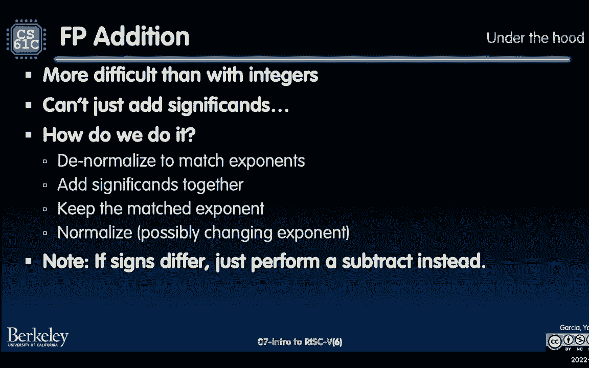

当你用不同的指数做人类版本的数字时，铸造，所以这就是选角，这是你一定会看到的东西，我们之前讨论过露骨的选角，您可以将浮点转换为int和c，我们实际上会截断所有的小数，您可以将int转换为float。

在这种情况下，您将当前整数再次转换为最近的浮点数，认识到浮点可能不能代表所有的整数，因为它现在只能同时代表这三件事中的两件，双重铸造并不总是有效的，我说的工作是什么意思，来回抛掷并不总是等于相同的数字。

假设你从一个int开始，然后你把它扔到一个浮子上，然后把它转换回一个int数，这段代码总是打印吗，真正的答案是否定的，为什么呢？因为大多数整数的大值都没有精确的浮点表示形式，事实上。

我们刚刚在这组幻灯片的第一张幻灯片上看到了，差不多是1。5乘以10的3/8，这是一个整数值，然后这个数字加1也是一个整数值，但突然间这个数字就不能再代表了，可能是因为步长加倍的情况，如果你提高精度。

你可能还是会得到这个结果，但只要有更大的，因为现在你的有效值是5 2，所以现在你有2到5的2个数字，你可以表示，但是你的数字太大了，那就不，你再也不能表示只差一个整数的单个数字了，在另一边。

让我们来看看，如果我们从一个浮动开始，然后转到一个int，然后又回到了一个花车里，所以我们这样投，这总是会被打印成真的吗，答案是否定的，因为小的浮点数，这是一种更容易思考的情况，如果你有一个。

就像一个数字，只有一个小数成分，然后把它转换成一个int数，因为它在c中被截断了，你只会得到零分，当你把它扔回一个浮子，知道如何准确地表示零，它也会得到零。

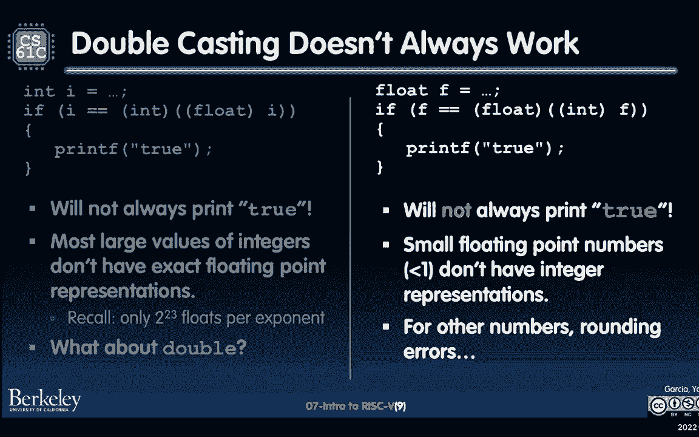

所以现在随着浮动单元的结束，你也可以开花车的玩笑，所以这是周六早上早餐评论或MDC，我不知道你能不能在这里看到，但基本上是说，嗯，就像它问你嘿，证明你是人，第一点加第二点是什么？然后机器人在第三点输入。

零零，零零四，然后他们进入了秘密机器人互联网人类，我们会认为是第三点，但如果你代表第一点，第二点是双打，你把它们加在一起，你会得到第三点，零零零，零零四d，然后再一次，这是一种提醒，就像添加。

所有这些不同的步长，如果你直接代表第三点，你实际上会得到一个不同的浮动表示，点二九九九，但是如果你代表这个双第一点，然后这个双点二，然后你把它们加在一起，因为子弹，因为所有的转换和东西。

你实际上会得到一个不同的号码，你经常看到这个吗。

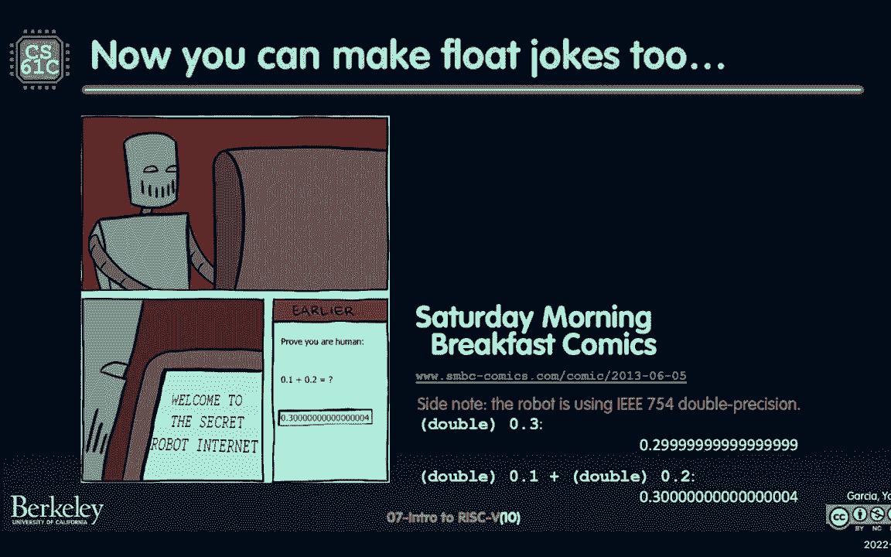

如果你好奇的话，如果你想做，这是三个两位浮点的版本，原来第三点其实就是第三点，零零零一，这就是我发现NBC使用双精度数字的原因。

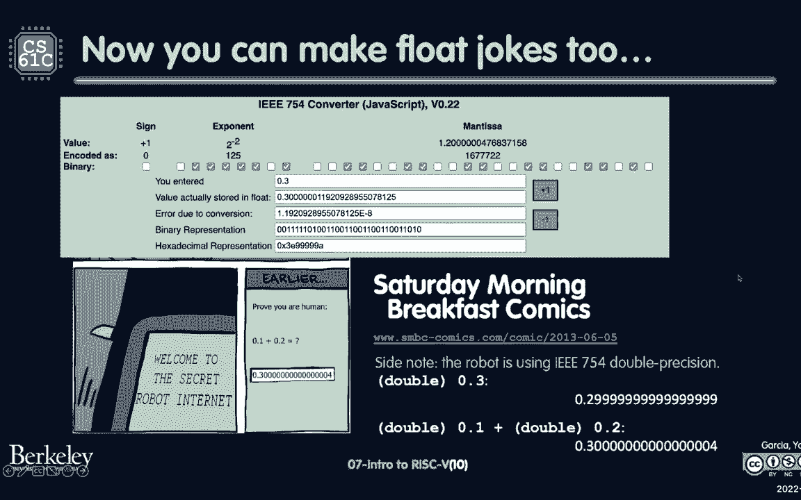

好啦，不换档，你们中有多少人知道如何，呃，你知道的，木棍船，就像汽车，好啦，在观众席上有一个人表现不错，所以这里的想法是，如果你处于高速状态，你就像疯了一样，对呀，你喜欢做这些事，你真的准备好了。

但现在我们要降到低档，从头开始，再来一次，我们在齿轮的高度，因为我们讨论的是表示比特和数字的所有不同方法，我们说的是c和malloc。

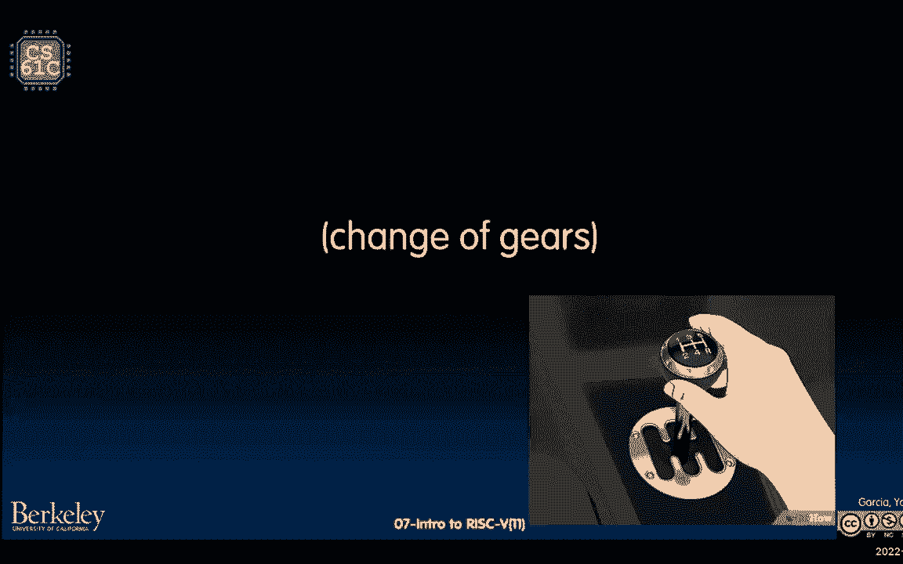

所有这些事情，现在我们要进行风险五。

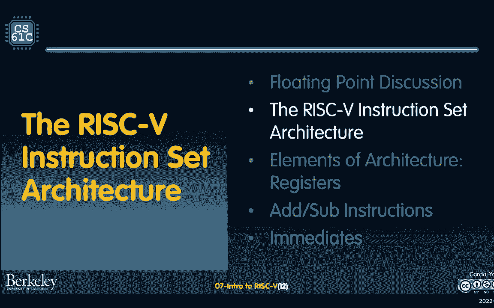

哪一层比，让我提醒你一个好主意，从第一课到我们正在研究的这个想法，最初的几周才刚刚开始，然后突然让我把浮板藏在这里，控制中的高浮动，现在我们向下移动到一层，汇编语言将看起来像，好的，好的。

所以c是一种高级语言，现在我们要转向一种汇编语言，一种叫做风险五的特殊语言，然后从那里，我们将向下移动一层，看看该语言是如何表示为，然后我们将向下移动一层，看看这些位是如何表示的，在实际的处理器中。

一个CPU，然后向下移动，看看它是如何用逻辑门表示的，或者我们从这里的第二层开始。

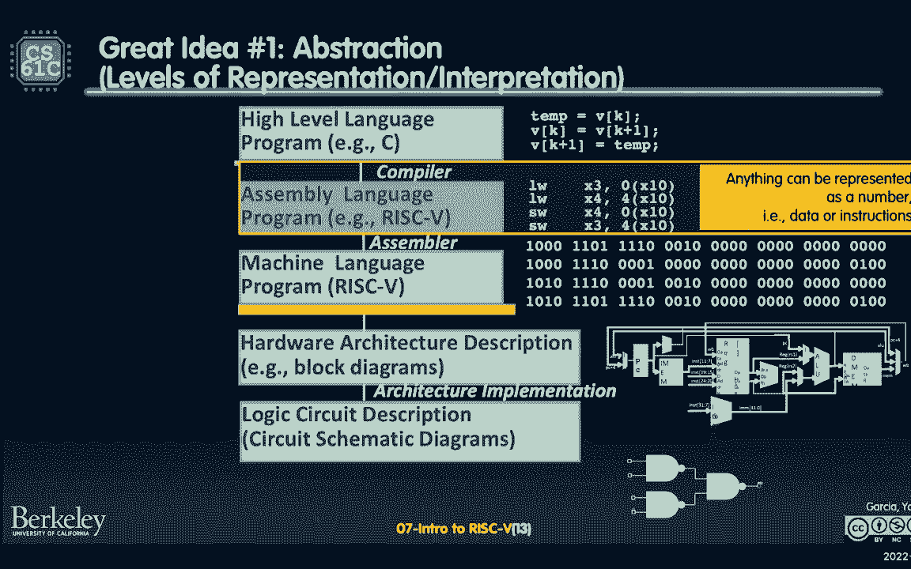

海龟又一路下来了，它有点像地球，有一只乌龟，原来是一头大象，但是现在有一只乌龟，然后支撑着那只乌龟的是另一只乌龟和另一只乌龟，这里的乌龟是一层，所以汇编语言，很多人都没见过汇编语言，没关系。

汇编语言是CPU理解语言的方式，大致，我们会，我们会在两周后看到它有什么不同，但是CPU的目标是执行指令和指令，因为它们是一种原始的操作，汇编语言是一种表示这些原语操作的方法，就像一句话。

这些操作将有操作数，因此，操作所争论的参数是在指令集上操作的，特定的CPU将使用，就是所谓的ISA或指令集体系结构，例如，你可能以前见过其中的一些词，就像ARM是一种用于手机的架构，嗯。

那是ISA英特尔x86是另一个ISA，另一个指令集，它被用在不同的芯片上，就像我九我七我五我三喜欢你橱窗里的东西，计算机，IBM摩托罗拉拥有Power PC。

所以我们将使用的是旧式Ma Five的Power PC，所以这里有一句名言，有一点，呃，它有几十年的历史了，你知道，从2004年开始，这听起来仍然是相对正确的，所以我不打算把整件事都读完，我只是要去读。

这里强调的是什么，它是关于汇编语言的，就像嘿，你知道吗，外面有本书，它教汇编语言，然后这个突出显示的引用说，那些懂汇编语言的人往往对计算机本身有更深的理解，好啦，所以就像知道汇编语言一样。

是平庸的程序员和优秀的程序员的区别，我就像，好啦，这是一个有点强烈的短语，但我要说的是，当我们用高级语言工作时，我们有一个粗略的想法，也许就像事情会如何运作，但如果你能翻译一下，计算机如何执行这些指令。

你写的那些代码行，你将成为一个更高效的程序员，这样你就能更有效地使用电脑了，我们所说的ISAS实际上有两种不同的类型或类别，其中之一就是所谓的复杂指令集计算机，我是说它在电脑上结束。

但实际上我们在这里谈论的是这些语言的一个类别，还有一种叫做简化指令集计算机或风险，回到过去，所以这就是，呃，可能是80年代或80年代前，八十年代建筑师，或者像IAS和写ISAS的人，设计建筑的人。

他们就像嘿，我们会添加更多的说明，我们想要计算的每一种类型的操作，让我们在这种语言中插入一条指令，它实际上会计算出确切的东西，VAX是70年代中期的一种建筑，它实际上有一个指令，可以将多项式相乘。

因为他们认为多项式的乘法和，从整数乘法从乘法所有这些类型的东西，所以他们实际上想用语言本身来表达这一点，然后在1980年，约翰·科克，大卫帕特森和约翰轩尼诗。

所有人都独立地提出了大致相同的想法或相同的想法，这就是为什么我们让事情变得越来越复杂，因为它使硬件实现变得如此复杂，像乘法多项式，现在我必须有一个完整的多项式架构，对呀，与我的整数体系结构。

与我的浮点架构，所以他们独立地创造了这三种不同的语言，约翰·科格实际上在IBM工作，他们把这个做得像IBM 8 0 1，是一个内部项目，1981年的第一个版本，伯克利的大卫帕特森写了第一个版本。

因为它被称为风险一，然后它在1981年转移到了风险二，所以他们都想出了同样的想法，戴夫帕特森约翰已经出版，因为学者就是这么做的，此外，他们还写了这些书，他们就像嘿，风险是可怕的。

这是我们正在使用的计算机组织和设计的书，风险五版曾是下一版，回到过去，然后他们写了另一本书，计算机体系结构或量化方法，这是你在152中使用的，但这里的想法是他们创造了这种遗产，上面写着，上面写着嘿。

复杂的建筑很棒，结构复杂伟大，但是为了编写硬件，我们需要保持硬件简单，为了让硬件变得简单，我们需要保持指令集的简单，我们相信软件将能够创造出这些更简单的程序，换句话说，很多关于如何编译东西的智能。

它将被写入编译器，从一组小指令中创建小指令，这违背了当时的传统智慧，笑到最后的人。

笑得最好，这是一种，我们在这里说的这句话，看看这两个，这两位很棒的教授在一起笑，是啊啊，我是戴夫•帕特森，他是这里的教授，我是约翰轩尼诗，也许这是斯坦福和伯克利最后一次相处，我开玩笑的。

我们一直相处得很好，他们赢得了2017年的图灵奖，和，呃，新闻稿现在是在2018年发布的，我又知道这里，有个IBM的家伙，呃，约翰·科克，实际上作为图灵奖演讲的一部分，戴夫帕特森说，不只是我们。

还有约翰·科克，但因为他没有出版，他好像没被认出来，尽管他实际上是第一个，所以这是一篇很酷的文章，你还可以观看巡回演出的颁奖典礼，每两个，这就是现在的背景，让我们更多地讨论风险五体系结构。

这就是我们要合作的，在所有这些建筑中，好啦，丽莎，为什么我们要和风险5井合作，其中之一是我们课本上写的，但事实证明，风险五的许多性质，使其易于教育，也易于收养，所以这是一个新的开源许可免费规范。

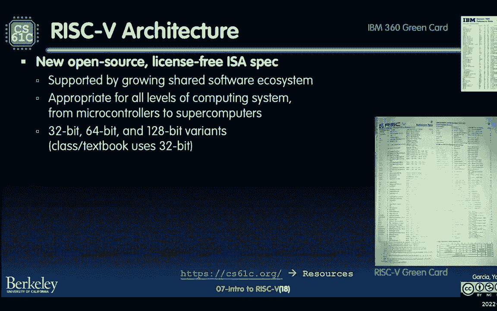

对于任何硬件公司来说，或者任何软件公司开始实现他们自己的处理器，基于风险五如何工作的信息，它简单而优雅，我们不需要陷入琐碎的细节中，而且它在各个层面都被采用，不仅仅是个人电脑，但是从微控制器。

即使是仓库式的计算机或巨型服务器，这里有一些很酷的笔记，所以以前在这里，这是IBM 360绿卡，这是一种参考表，以便人们知道哪种语言，哪些指令，原来还有一张风险五绿卡，如果你买了一本教科书。

你想要自己的绿卡，我们网站上有这张卡片的PDF版本，所以你绝对可以去看看，是啊，是啊，中间有个问题，啊，是啊，是啊，问题就像嘿，有一个水坝，我们会得到它的，是呀，是啊，是啊，我们会想出办法的，事实上。

就该死的而言，这是一个很好的观点，所以对于那些没有登记入住的人来说，请做检查，有这个星期，三个公告已经发布了关于中期选举的信息，基本上报名参加，风险五将是带回家的一部分，考试的一部分，所以是的。

默认情况下，你将可以访问它，是啊，是啊，问得好，是呀，所以一定要填好，我们下周再提醒你，这就是我们如何优先考虑，你得到了什么面对面的时间，风险五源头，是呀，这有点历史，今天的课也有一点乐趣。

所以我从2010年夏天开始，风险五，所以请记住我们从1980年风险一开始，一九八一年风险二，现在在2010年，我们有风险五，这是一个开放的研究和教学项目，就在加州大学伯克利分校。

然后它迁移到这个巨大的地基上，有点像传播风险五的福音，但也要解释如何实现以及如何帮助其他人实现这个体系结构，如果你对更多感兴趣，我确实读过，它在2016年获得了这个很酷的奖项，分析师选择，最佳技术。

是啊，是啊，很酷，太棒了，是啊，是啊，你就知道我们要谈什么了，我们现在要看真正的风险五。

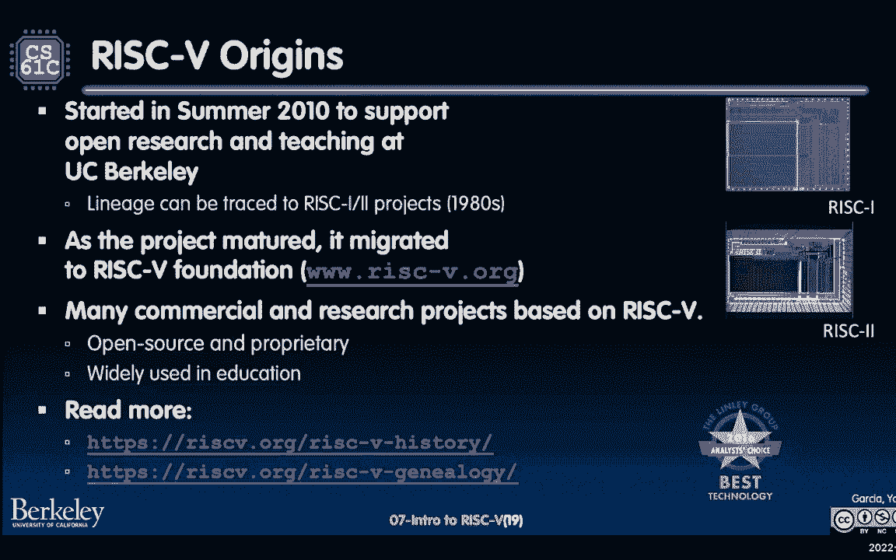

好吧好吧，好的，好的，也许过一会儿我需要再解释一件关于汇编语言的事情，就它与你所看到的高级语言有什么不同而言。

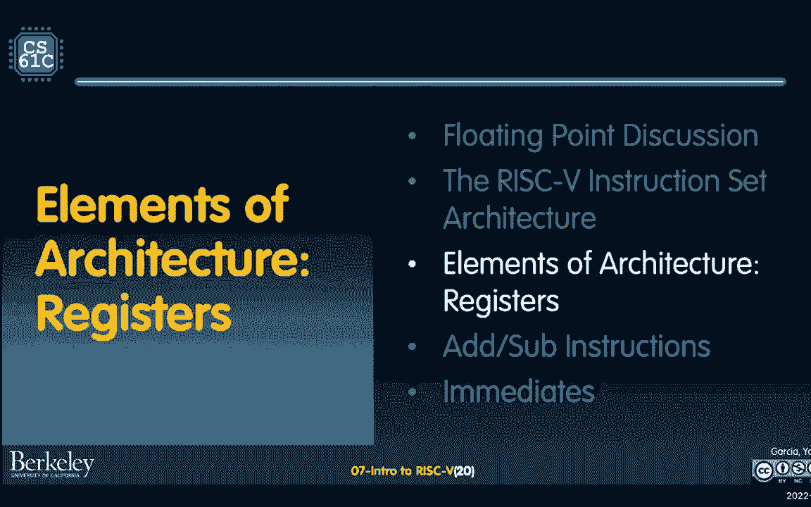

然后我们会看到一些风险，你知道它是如何谈论语言的，嗯，这里的代码是计算机的类似版本，计算机将理解的指令集，这里有一个例子。

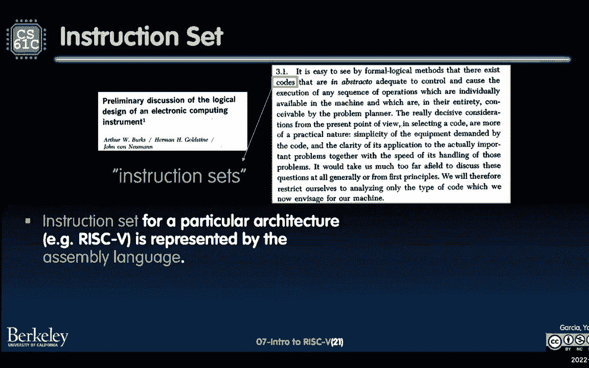

就是这里的一条指令到一行汇编代码，反之亦然，所以一行汇编代码表示这里的一条计算机指令实际上是，这是我们的第一个风险五，我们确实看到了，好啦，实际上看起来还不错，对呀，有一个行动名称，这个叫加法，所以说。

你觉得它是做什么的，是呀，让我们把我减去，它实际上增加了，我们来谈谈减法，一秒钟后，挺酷的，但不管怎样，所以这个加了一个，然后这里有寄存器，哪些是添加指令的操作数，你就像，什么是寄存器。

寄存器在汇编语言中有五个风险，作为什么，呃，变量适用于更高级别的语言，如c和java，所以我将首先讨论关于变量的几点，然后告诉你寄存器是如何不同的，但也有一点点相同，所以在C和Java中。

我们只是在处理这两种语言，就目前而言，变量通常先声明，他们被赋予了一种类型，例如，现在在这里很远的地方，到目前为止，这个变量名已经与变量类型int绑定在一起，它只能表示它的，除非强制转换它。

然后将其存储在另一个声明的变量类型中，类型，变量的类型实际上决定了操作的工作方式，这是一个更微妙的点，我真的想强调，假设你在星p中有一个指针，然后向指针添加两个，C解释这一点的方式，这样做的方式，呃。

这一行代码被解释，你真的加了八个对吧，为什么因为p代表一个地址，然后它还表示一个int的地址，所以如果你想指向两个ins，你得加八的方式，这与您添加，假设2到int x，因为在这种情况下你只要加两个。

最后甚至像，如果你喜欢三次，我们在利用时代，我们这里的操作员隐含地说，这个星号将是，那是因为我们知道x是一个整型数，如果这是一个指针，相反，我们会看到星号，我们认为取消引用。

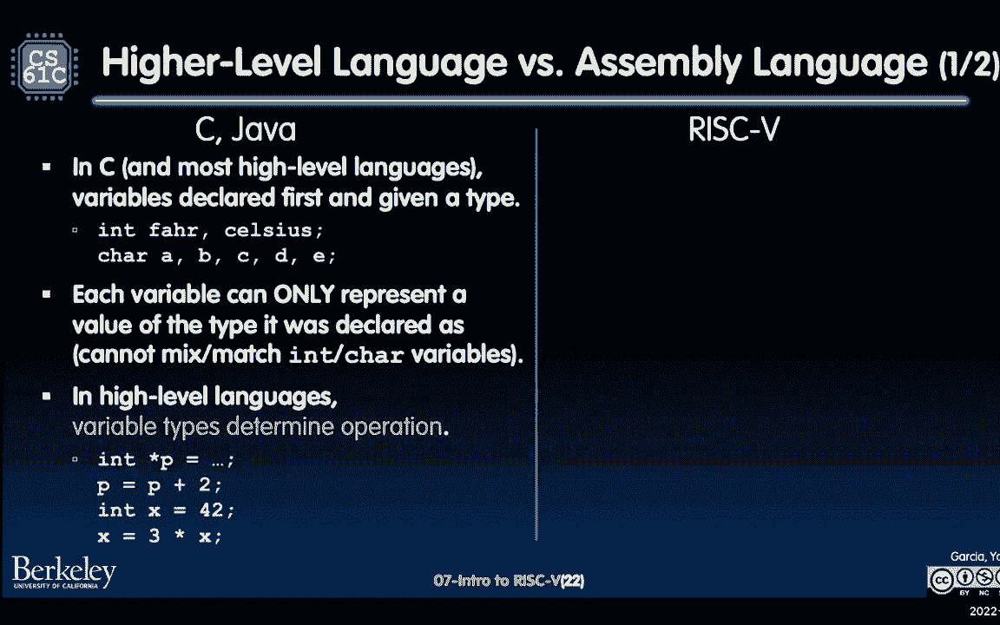

好啦，所以突然间，变量类型真的影响了操作的类型。

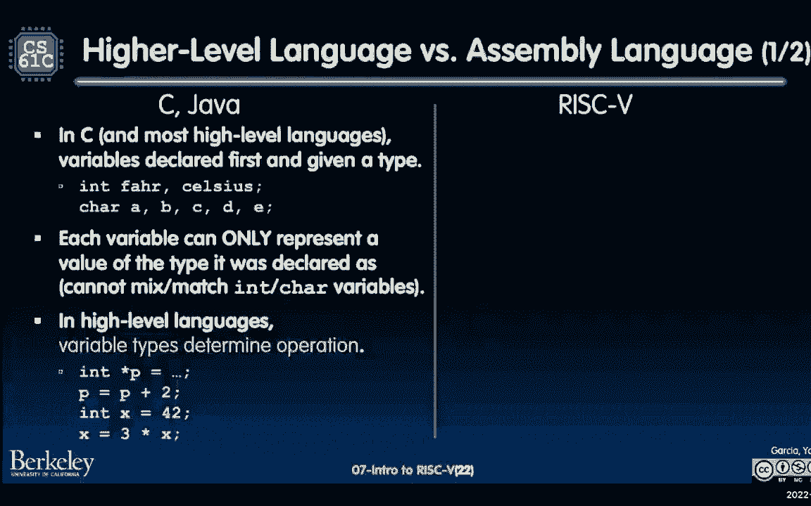

当你想到C代码本身时，你会想到你，让我们转到程序集中的寄存器，而不是对变量进行操作，您在寄存器上操作，什么是寄存器，寄存器是这些非常特殊的位置，实际上就在处理器本身上，有限的数量直接内置在硬件中。

然后这里是装配中最重要的部分，寄存器没有类型，下面是寄存器x 1的示例，为什么它没有类型，因为在幕后，所以在某种意义上，如果这是我的电脑桌，我只想有一个特殊的位置，这是一号，它只是储存一些。

但如果我说嘿，你能不能，你用这些零件做点什么，电脑会像，呃，你想让我怎么处理这些，他们只是这样，因此，关于寄存器的一件重要的事情是要知道，是操作决定了类型，我把类型放在引号里，因为寄存器没有类型。

什么什么，说明说什么，嘿嘿，1。请把这些数字加到其他数字上，然后电脑就像，哦好吧，是呀，你的意思是签字，好啦，我去签个字，呃，像两个人一样签名，立即查找整数广告，所以这就是，这是区分的一个重要部分。

寄存器总是只是位表示，运算是把这些位转换成整数的东西，无符号整数，呃，移位值，地址，所有这些不同的类型，让我给你看一个很酷的示意图，寄存器确实在处理器内部，我打了个比方，这里就像一个办公桌区。

这是我的处理器，但你可以认为处理器有这些不同的组件，我们有处理器，这是处理器，然后我们有这个与CPU分开的内存区域，然后我们在这个图中有这个输入和输出，比如输入和输出应该连接到处理器上，但没关系。

注意这里我们有一个橙色的小盒子寄存器，是啊，是啊，然后我们有一个叫做ALU算术逻辑单元的东西，这实际上是处理指令的东西，嗯，假设所有的数据都在寄存器里。

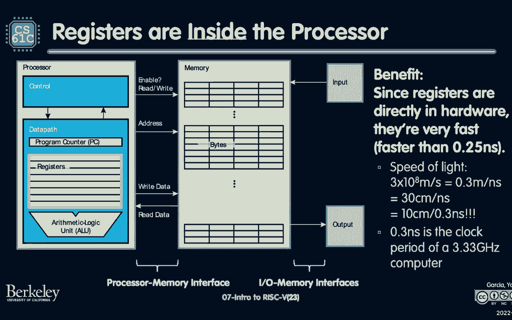

这是我们的一个好主意，好主意，三号又上来了，所以这就是局部性和内存层次结构的原理，上面写着嘿，这些登记册，因为它们直接位于处理器上，他们将是超级超级快的访问，就好像他们在我脑子里。

在上一张幻灯片上有一些数学，基本上说，实际上寄存器之间的速度大约是两点，五纳秒，这是非常，非常接近光速，十厘米就是三纳秒，但不管怎样，这是个好主意，因为寄存器是正确的，意思是会有超级，超快。

但他们只会有这么多，因为你只能在CPU中构建这么多。

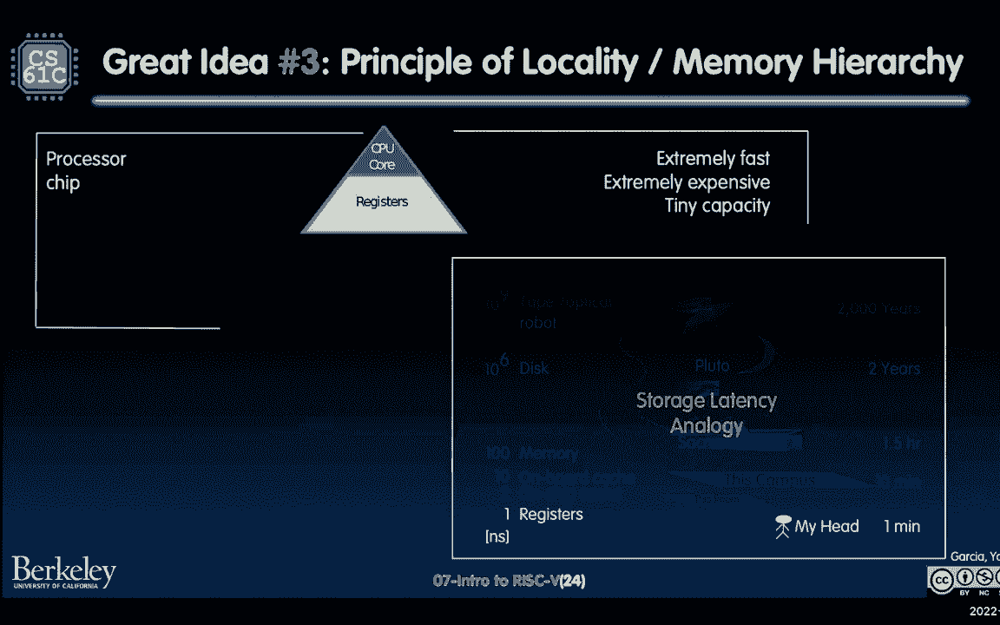

说嘿，记住，所以记住ISA就像，好啦，我将定义这种语言，然后现在每一个想要使用这个指令集的架构都将，符合本ISA的标准，因此，确定风险五ISA的方法之一是，那是风险五吗。

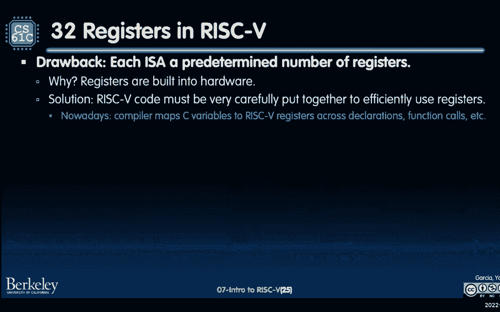

我确定会有三个，两个寄存器，为什么小三十二快，但太小就太糟糕了，有点像，嗯，呃，帕特森和他的团队正在考虑，就像他们尝试了一堆不同的版本，他们说三二是一个合理的数字，如果我们回到以前，这里的第一颗子弹。

风险五代码实际上可以编译在一起，以有效地使用所有32个寄存器，如果我们有少量的寄存器，会在软件中造成更多的错误，如果我们有太多的寄存器，我们会浪费硬件空间，但是现在编译器倾向于将c变量映射到c寄存器中。

好啦，所以再一次，编译器将C代码转换为汇编代码，它将这些变量转换成寄存器和这里的位置，风险5中需要注意的另一件事是，我们有三个两个寄存器，我们还有三个2位宽的寄存器，所以严格来说，如果我有更多的海报板。

这应该是32位。

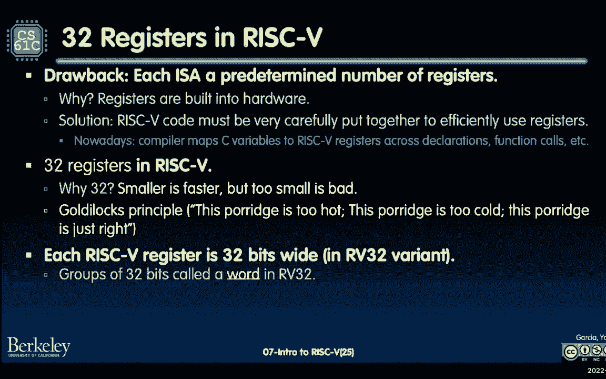

但我只有八位，我们一直在谈论寄存器，你说把我的密码给我，关于寄存器的最后一件事，在我们真正进入说明之前，它们要么，他们可以用名字或数字来称呼，所以在这种情况下，现在我们将用数字来称呼他们。

所以记住有三个两个寄存器，我们将从x零到x三，其中x零是一个特殊寄存器，它总是保持值为零，所以我们实际上有三个1寄存器，可以存储不同类型的值，把我的房车给我。

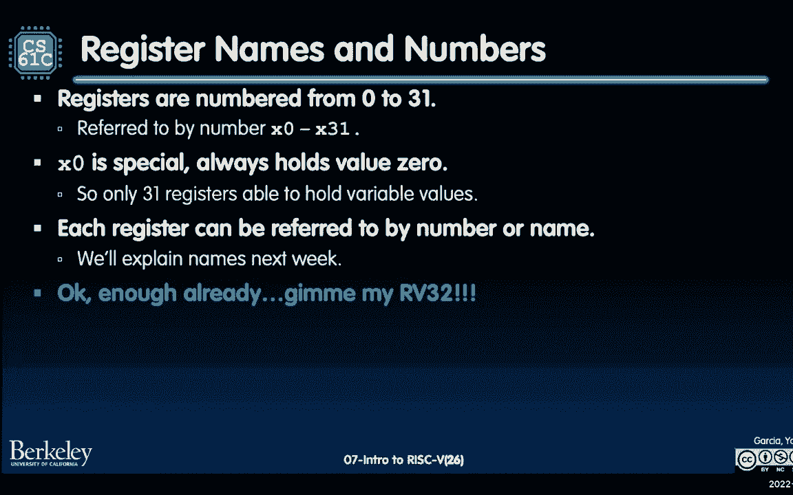

你准备好了，所以在这一点上，你就像准备好了，你就像，我知道历史，这个很酷，巡回演出奖发生了，我们有绿卡，你知道的，我们会有所有的喜欢，的，说明书，当我们做检查的时候，但我真的想看看风险五。

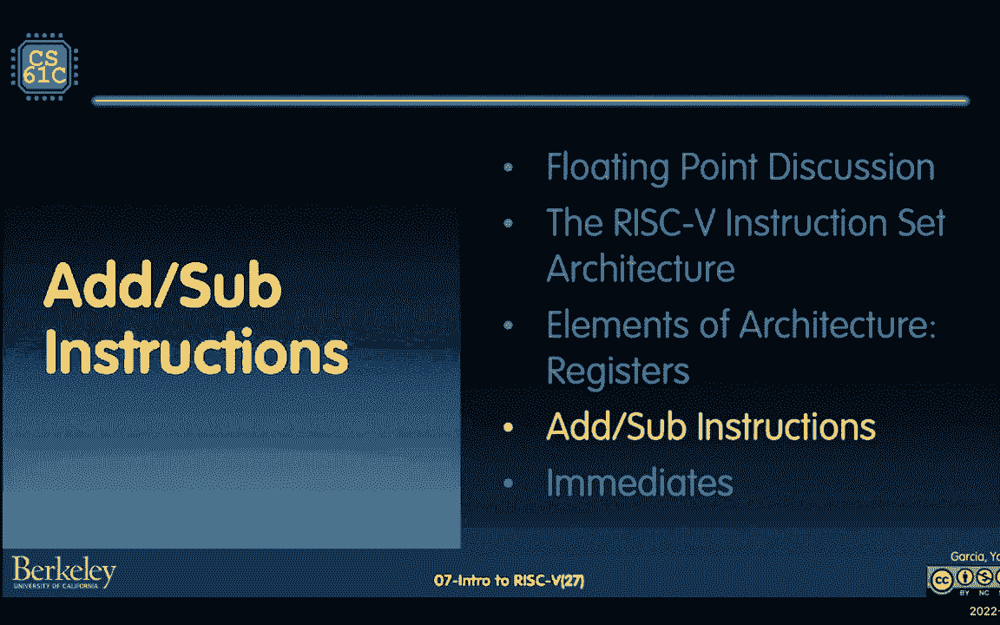

现在呢，再来一张幻灯片，解释C代码和风险五之间的区别，你只需要拿走一样东西，也就是说，在C和Java中，你可以有一行是多个操作，你只需要写一行超长的代码，然而，在风险五中，声明是一项指示。

所以一行代码实际上可能映射到多个指令，就像这张幻灯片上说的，所以本单元的目标之一是，这是真实的生活，您有一个编译器，它将更高级别的代码向下转换为程序集，本单元的目标之一是让你们都成为人类编译器。

从某种意义上说，我们将给你一个简单的C代码，或者，我们要给你们举一个例子，你绝对可以用C语言编码，然后你要把它写在风险五，所以让我们看看这些指令是如何发生的。

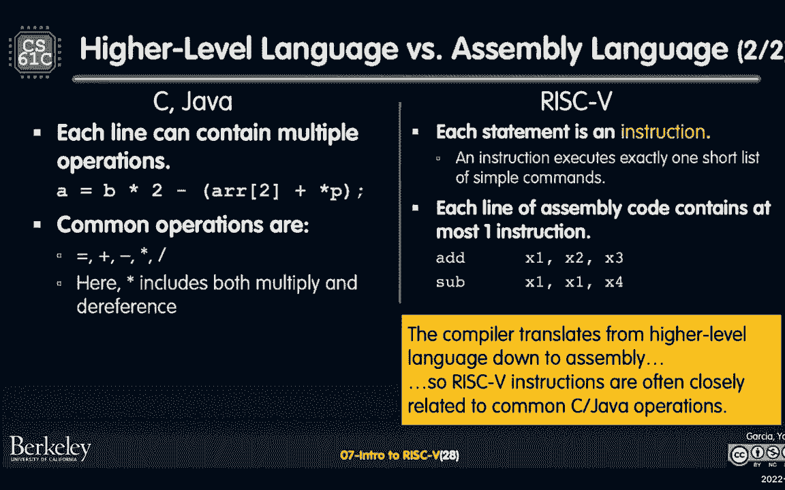

从简单的c和java操作开始，从加减法开始，所以我之前有一个版本的幻灯片，我们去看看，我们有一个行动的名字，然后我们有三个操作数，这些都将是寄存器，这就是我们所说的算术指令布局。

为什么它会在一秒钟内变得清晰，但是这些寄存器对于这些类型的算术指令总是具有相同的含义，第一个寄存器是我们所说的目标寄存器，这就是为什么我叫它RD，你可以在这个位置目标寄存器中输入x 0或x 1。

这是您存储结果的地方，接下来的两个操作数分别是源一和源二操作数寄存器，所以他们是被手术的人，一旦你有了结果，您将其存储到目标寄存器中，这里的第一个寄存器，语法是严格的，操作数永远不能超过三个。

所有这些操作数都必须注册，因为你想让硬件简单，请记住，语言是一种契约，能够开发计算机体系结构，你说，这正是你要操作的，选择名称注册目标源一，来源二，然后计算机架构说明白了，我现在要设计，然后你知道。

用胶带封住，所有这些东西，让我们看看加法是如何工作的，就是我们刚才看到的那个，加x一个逗号x两个逗号x三个，这意味着什么，让我给你看c a等于b加c，其中一个可能是存储在这个目标寄存器中的内容。

x 1然后x然后b和c是，也许从x2和x3加载的是什么，源一和源二，操作数直截了当，现在呢，另一个问题，哦耶，所以这是个好问题，上面写着，好啦，寄存器和内存地址有什么区别。

你可以把内存地址看作是另一种要存储的数据，就像存储数据一样，寄存器是您存储的位置，所述数据，寄存器，这可能是所有人的地址，你知道对电脑来说就是这样，这可能是一个int，我不知道，但这是给电脑的。

其实这里也是一样的，这是更深入的谈话，周一我们将进一步讨论地址和内存，但在这里等于b加c，我还没告诉你A和C的类型，所以这可能就像，是啊，是啊，就像，从某种意义上说，这只是说，在这个例子中。

风险五是说这两个x2和x3，它们只是要加在一起，以风险五电脑知道怎么做的方式，是啊，是啊，问得好，给大家演示一下减法，分，分，四，五，六现在我们知道什么，我们知道X4将是目的地，假设它是某个变量d。

然后x5将是源一，X6将是源二，所以现在我只知道，加法和减法的差别很小，在这种情况下，源一和源二的顺序很重要，好啦，所以如果你做x 4 x 5 x 6，这意味着用x6减去x5，如果你把这两个调换一下。

然后你就会做x 5，再从x6中减去，它将与这个添加指令有一点不同，在那里你可以切换x2和x3，也不会有多大关系，那么这又有什么意义呢？这里的重点是，操作的顺序确实，或寄存器的顺序。

操作数的顺序确实很重要，那么我们如何在这里翻译这个c语句，这不是一个真正的同伴指导问题，我只是给你一些时间来吸收知识，假设我们有下面的映射，啊，风险的C变量是这样注册的，我们都在同一个空间里。

所以我们希望我们的结果最终存储在x 10中，然后a，b，c，d和e当前存储在x，one中，x2 x3和x4，是啊，是啊，解决办法是这样的，请记住，我之前说过，在我们的C行代码中有多个操作。

让我们用我们的风险五汇编语言将其改为多个指令，那么我有什么好的，X 10从它的一些位开始，所以让我们覆盖，那些与x1和x2之和的位，现在我得到了x1和x2的和，四和十，我给它加上x3，好啦。

所以这是十加三，把它储存回x10，然后这里的第三行说，好啦，让我把x4加进去，然后把它存储成x10，好啦，所以我们在右边有一些评论，以下是注释的编写方式，他们总是排在风险五的队伍里。

他们将从人们过去所说的磅符号开始，现在它被称为标签，不像c，不会有任何多行评论，但你确实有这么好的，这个很好的标签，单行可能闯入五险不同指令，让我们看看这个的另一个版本，假设我们有以下映射。

我们希望所有东西最终都存储在x18中，然后我有这么多，我在屏幕上保留了X5和X6寄存器，因为事实证明，创建来编写这种类型的指令，一种方法是使用临时寄存器，中间寄存器，把寄存器看作是一种划痕空间。

如果你能暂时存储数据，然后把它复制回你想要的位置，你在一个好地方，那么我们先做什么呢？我们储存在x5，g加h之和，在x6，我们存储i和j的和，让我们来做吧，让我们实现它，就像在，让我们。

让我们把错别字修好，这样我们就都在同一页上了，文件在这里x18，我们将存储x5和x6之间的差值，哪些是临时值，这是做这件事的一种方法，使用我刚刚放在页面上的这两个额外的寄存器。

一个好的编译器实际上可能会重新组织你的C代码，稍微执行以下操作，也就是g加h之和，然后减去i再减去j，然后把所有这些都储存在里面，为什么这会更好，这条特别的线，如果你从左到右读。

不会使用临时寄存器x5和x6对吗，它会说“好吧”，让我们实际存储在x5中，G Plus是x18的商店，G加H，我们从x18减去，然后我们从x18j中减去，然后把它们都储存在同一个东西里，所以你知道。

有点想，如果你是人类编译器，你可以用这种方式进行优化。

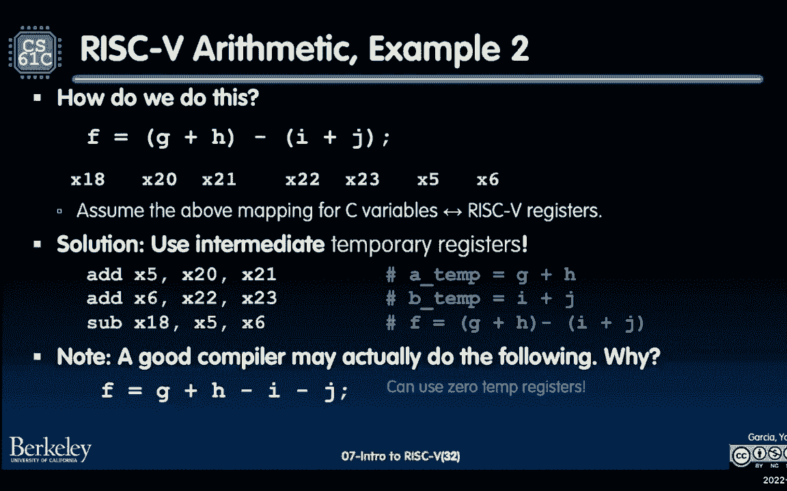

好啦，在我们进入最后一个部分之前，这里有一个很酷的插曲，嗯，说到当年的评论，这是1969年的，玛格丽特·汉密尔顿是软件工程的第一任主管，他也在麻省理工仪器实验室。

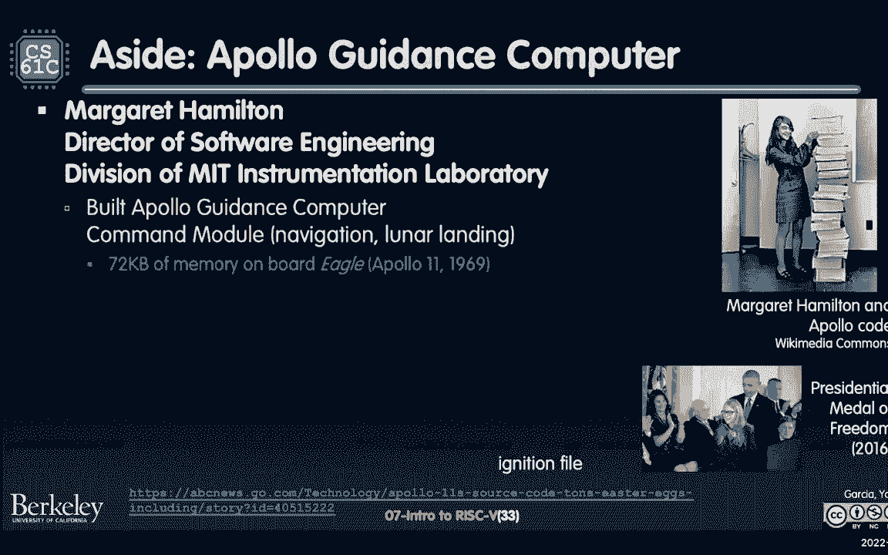

在2016年获得总统自由勋章，因为她在设计鹰着陆软件方面的工作，作为阿波罗11号任务的一部分，这里有一些很酷的代码，有点小，但基本上它说的是嘿，你有所有这些评论，他们是，它们有标签前缀。

他们基本上说就像，我希望我希望这能像，看看这个，看看飞行员是不是像按X一样撒谎，然后燃烧宝贝燃烧就像，让我们开始点火，真正登上月球，然后这个巨大的彗星是指瓦特，暴行和种族歧视，那么这意味着什么呢。

这意味着你们也是软件工程师，你可以把所有这些完整的文化评论写在，所以如果你想在你的代码里写22年的中期选举，去争取吧，是啊，是啊，你就像，是呀，好啦，是呀，是呀，真的很好，但又一次。

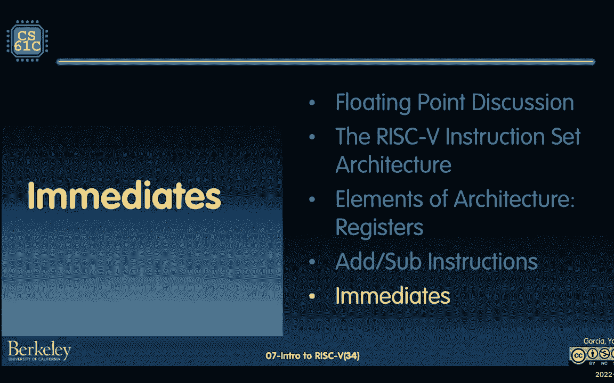

给你更多的力量，即所谓数值常数的最后一点，到目前为止，我们已经讨论了寄存器存储的数据，嗯，我们需要开始考虑如何将不同类型的数据放入寄存器，我们想要把我们的数值，所以我们有了一个新的指令。

把数值放入寄存器，这就是所谓的加法立即指令，所以在这种情况下，我们有一些x 4的值，然后我们把这个数值加10，把它储存在x3，这里的语法非常类似于添加指令，但是现在最后一个操作数必须是一个数字。

你可以用十进制写，你可以用文本写作，你可以用二进制写，你可以稍微玩一下，下周，注，尽管风险五实际上没有减法指令，减去即时指令，有一个减法指令，为什么好，看看这个，这里有点黑客攻击，但这是，上面写着。

好啦，如果我想减去，X4和10，我只要在x 4上加一个负10，这将做完全一样的事情，所以这里到底发生了什么，又是那个吗，你作为一个人类编译器，你就会说，好啦，我只有add i可以使用，所以让我继续用。

加i。

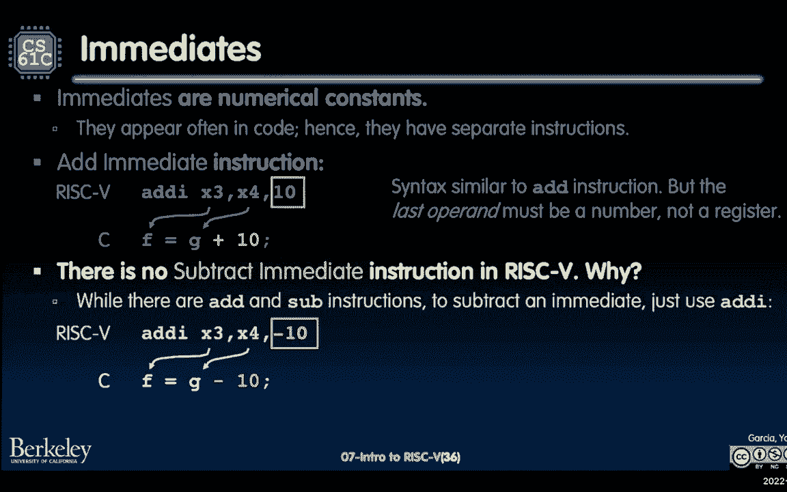

这是简化指令集计算机背后的哲学之一，把可能的指令类型减少到最小，如果某样东西可以被优化并改写成软件中的另一条指令，做到这一点，不要在ISA中包括额外的指示，最后谈谈零，所以让我结束这个零的想法。

在这里注册零，因为零是一个非常重要的常数，如此重要的眼前，我们必须硬连线零，才能都是零三，值为零的两位，这允许你做的只是简单地存储价值，这里有两个例子，假设你想把x3等于x4，使用带有x零的add指令。

假设你想要一个十六进制f到x3，只要把x x x f和x 0相加，终于又回到了零度，它是硬接线的，所以如果你试图将一些东西存储到x零，它不会做任何事情，这就是所谓的无行动，意思是电脑什么都不做。

我希望你们中的许多人有时间在这个周末做一个没有行动，会有一个美好的周末吗。

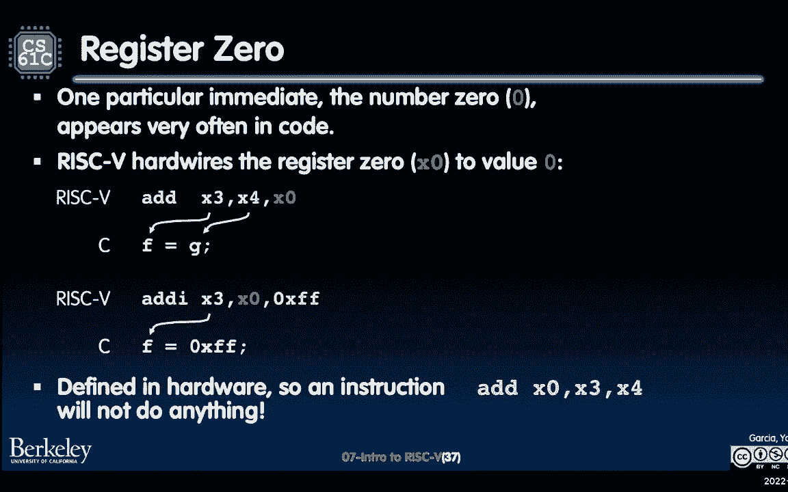