# P1：Lecture 1： Intro - 这样好__ - BV1s7421T7XR

很高兴你今天能来，我叫丹•加西亚，我们很高兴为你们带来这门课，我们总是从新闻中的计算开始，但让我们从今天的珍妮特·杰克逊的歌开始，会把窗户撞坏，XP笔记本电脑，原来这里面有一定的声音频率。

在珍妮特·杰克逊的歌曲中，不仅让笔记本电脑崩溃，它在继续播放，但它可能会让附近的笔记本电脑崩溃，我喜欢这个，各位今天的家庭作业是找到那首歌，看看你能撞倒多少台笔记本电脑，你的邻居，找点乐子。

所以我们要谈谈这门课，当然被称为计算机体系结构中的伟大思想，也称为机器结构，我要做第一部分，我把它交给了丽莎，最后把它们还给了我，让我做一些后勤工作。

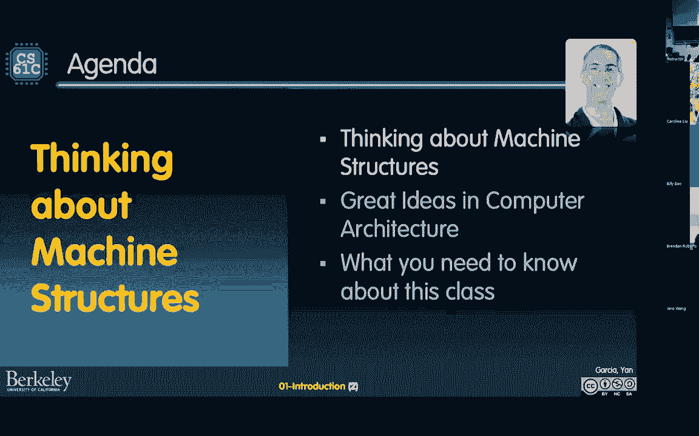

免得你以为我们把这门课叫做，教你关于c语言的知识，那是不正确的，一切都是关于奇妙的硬件，软件接口，计算机是如何工作的，但不仅仅是一台电脑，数据中心的实际工作方式，我们不谈论语言，像C更接近低层硬件。

我们称那些更接近硅的，所以这就是为什么我们用C来教你，否则，你就会在Python中四处漂浮，抓拍和计划。

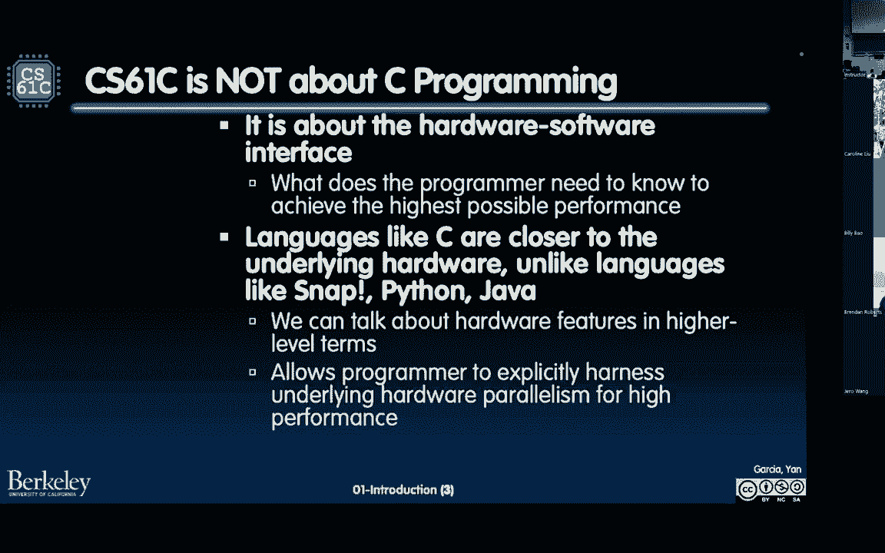

你从来没有真正使用过真正的硅，所以凯撒真的很好的语言，这是六二一C的老派版本，这是一张假照片，但这就是我们的想法，如果类比是，我们以一种新的奇妙的方式来教授这门课，这是课程的旧版本，六十一c。

这是新的61 C，这是C思考的事实，我们一直使用的，从你的特斯拉到你的无人机，输入你的手机，移动设备和网络边缘设备，今天你们将了解到所有这些是如何在一个大的图景中工作的，它们都在云中与后台一起工作。

在移动设备上与前端一起工作，或者较小设备上的前端，所以后端就是云，这个，我在数据中心的朋友们，我们将讨论这些是什么，以及如何设计它们，有什么限制，所以当你要，如果你说嘿，让我们建一个新的数据中心。

你在想什么，这是这里面的画面，我的另一台电脑是数据中心，每一个社交媒体应用程序在很大程度上都使用它作为后端，那到底是怎么起作用的，今天连电脑都是怎么工作的，今天这门课你将学习所有这些伟大的想法。

所以在旧学校里，我们只关注一台电脑，单线程的单台计算机，一个单一的进程可以运行并进行一些计算，那是老派，这是一个大局课程，太棒了，我的朋友是硬件软件界面，中间那条大黄线叫做指令集架构。

即硬件和软件接口之间的连接，他们就是这样一起工作的，你会知道，到那年年底，在旧学校，60岁的人会看到，你知道从高层，从C申请，一直到晶体管。

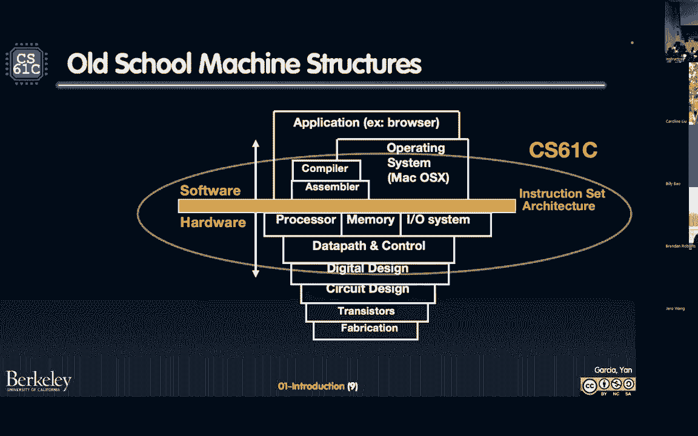

制造与电子移动，很酷的东西，那是老派的做法，大学校，有点复杂，所以我们有一个仓库秤，硬件方面的计算机，智能手机被开进里面，其中一个服务器是多核的，带着记忆，也许是缓存，很多不同的缓存，缓存级别。

输入输出设备，在那个核心里，你已经处决了行刑队，主存储器，我们将学习CPU设计，这不仅仅是，我学习如何编程和查看，你在学习如何构建，如何设计体系结构，做一个CPU，多么强大的课程，我喜欢这门课。

在最低层，你了解了逻辑门，就像你从上到下学习一样，从硬件到软件，我们是真正强大的东西。

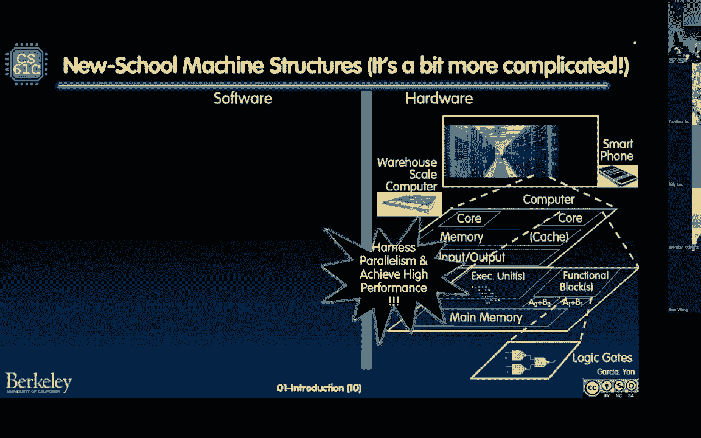

我们将以五种不同的方式利用并行性，吊杆并行请求，平行线程，你知道这些意味着什么，在本课程结束时，并行指令，并行数据和硬件描述，在那里硬件都并行运行，同时这里很滑。

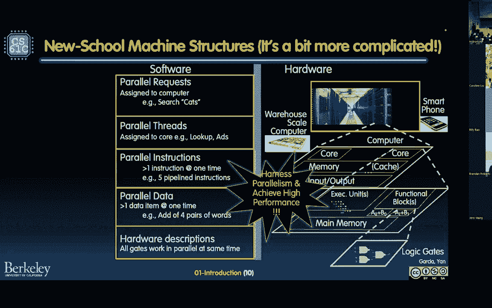

别滑倒了，这就像肥皂一样的东西，我要把它交给丽莎，接手第二部分，我们走右边，好啦，本课程名为计算机体系结构中的伟大思想，我要向你展示伟大的想法。

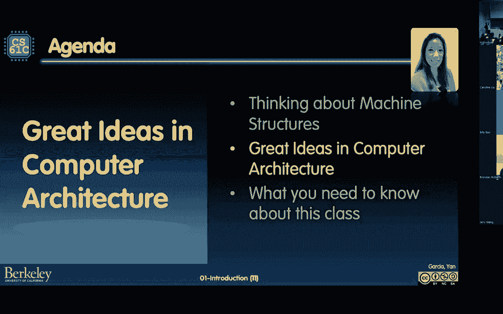

他们有六个人，十二月十二日见，为了决赛，下课了，开玩笑的啦，好啦，所以向你展示伟大想法的意义，在第一节课中，就是不断地应用它们，在接下来的14周里继续和他们见面，然后是阅读周，然后是期末考试周。

所以让我们来看看这些，当我们第一堂课介绍他们的时候。

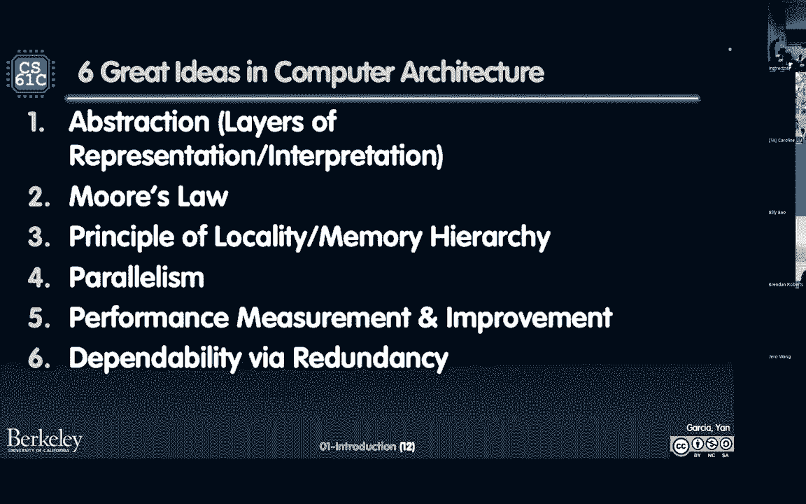

你会开始越来越了解他们，头号抽象，你们都拿了六十一，或者你们中的大多数人都拿了61分，抽象是您在Python中反复看到的东西，我们有点事情，在那里一切都可以是一个名称函数，图书馆价值。

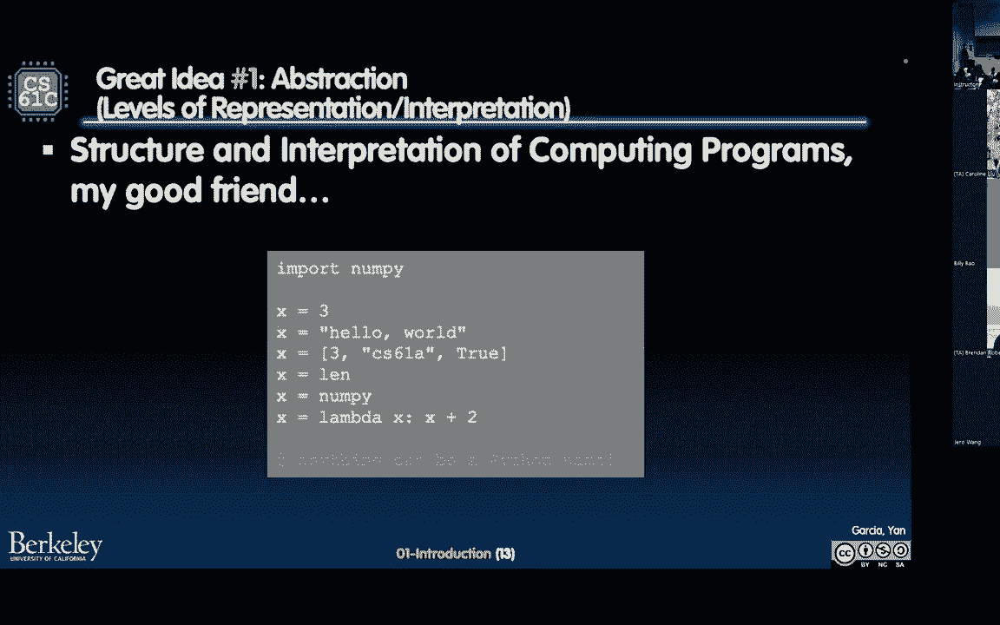

事实证明，这种抽象的想法也发生在硬件中，我们将在头五周使用的最大的抽象之一，所有东西都可以是一个数字位，零和一，这是我们将再次讨论的问题，再一次，是啊，是啊，一路下来都是乌龟，所以数字一直在下降。

所以这实际上是某种模因，在最底层好像有只世界龟，上面有只乌龟，上面的乌龟，想象一下这里的乌龟是一个抽象。

我们将有的第二大想法，这个伟大的想法叫做摩尔定律，所以戈登·摩尔实际上是奶牛的校友，去吧，在1965年就预测到了大海，十七十年左右，在最初的几个计算机芯片被创造出来之后，并说嘿，这个叫晶体管的东西。

它们是所有芯片产生的基础。

他们大约每两年翻一番。

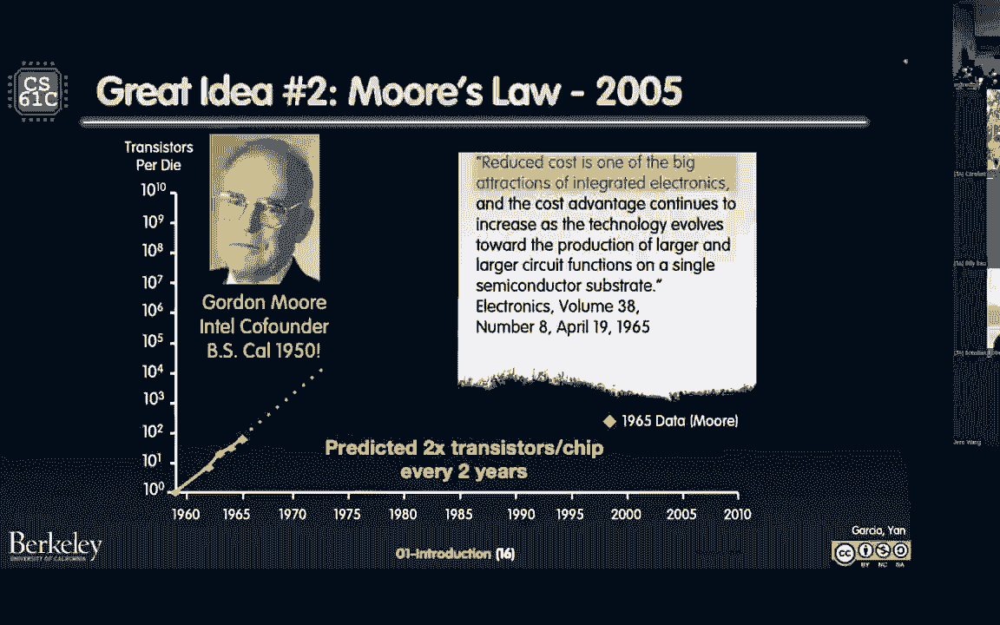

这太棒了，因为这意味着制造的东西越来越便宜，它将超越创新，所有这些在计算机体系结构级别上的东西。

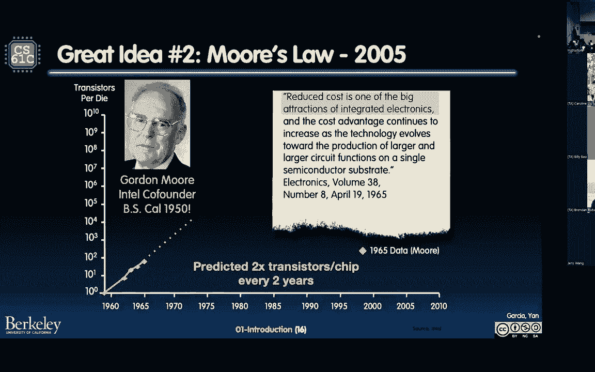

为什么叫摩尔定律，嗯，事实证明，这是一种自我实现的预言，每次芯片制造商想做什么，它们就像摩尔定律，摩尔定律，我们得让这一切，我们一定要做到这一点，所以，因此，你看，摩尔定律一直持续到2005年左右。

对于那些想知道，好啦，不是每两年两次X吗，它不像指数曲线，在y轴上发生了什么，这就是所谓的对数刻度，好啦，所以这里的每一个都是向上，向上，向上的指数，在x轴上我们有年份，这个对数线性图是一条很棒的线。

那实际上是指数级的，这里有一些很酷的薯条照片，以防你从来没有，你以前从没见过他们，回到1972年，这是情报，八千八百三十五个晶体管，不错嘛，二十年后，英特尔奔腾，有多少晶体管，三点，一百万个晶体管。

更好的是。

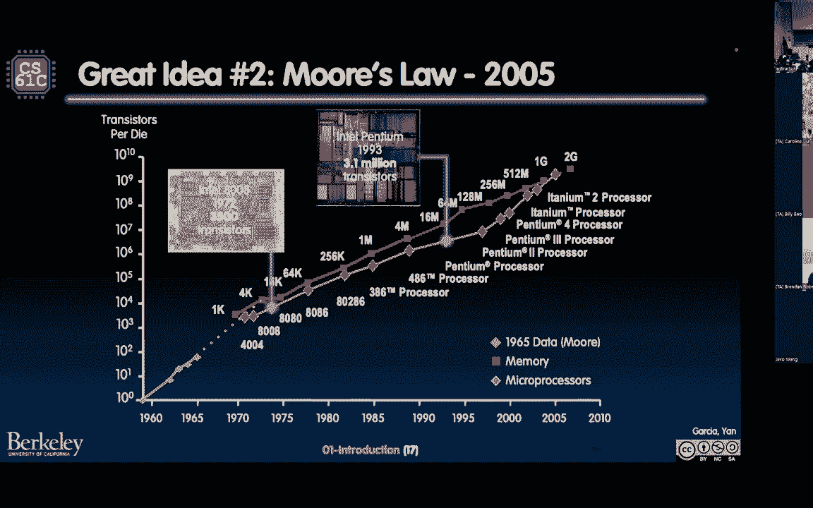

我们今天在哪里，很多晶体管，这里有一个相关的定律，叫做a定律，那么我们看到了什么，A的数字一直在上升，上升，上升，到了1970年，我们会得到百分百的A，但我们都谈过，我们将在这节课中讨论评分。

丹和我都是伟大的信徒，所以说，如果这是一个学期，我们可以得到所有年龄和61 C，我们很高兴，是吗？那我们稍后再谈，十五分钟左右真的。

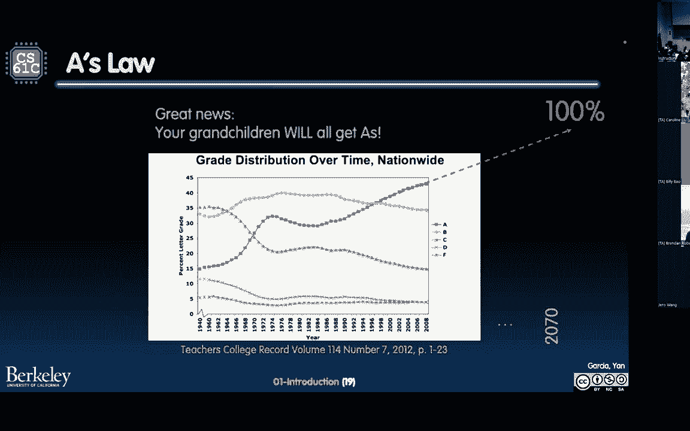

让我回到摩尔定律上一会儿，所以这是一个更新的图表，我知道这里有点不稳定，这是一九七万二千零五年，我们之前看到的大概在这里，然后这个是20，让我们来看看这个二五二五地区，好啦。

我们实际上是从摩尔定律逐渐缩小的，我们不再以指数级增长，发生什么事了，还有什么好主意，我们能再多说一点吗，稍后，第三个好主意是局部性原则。

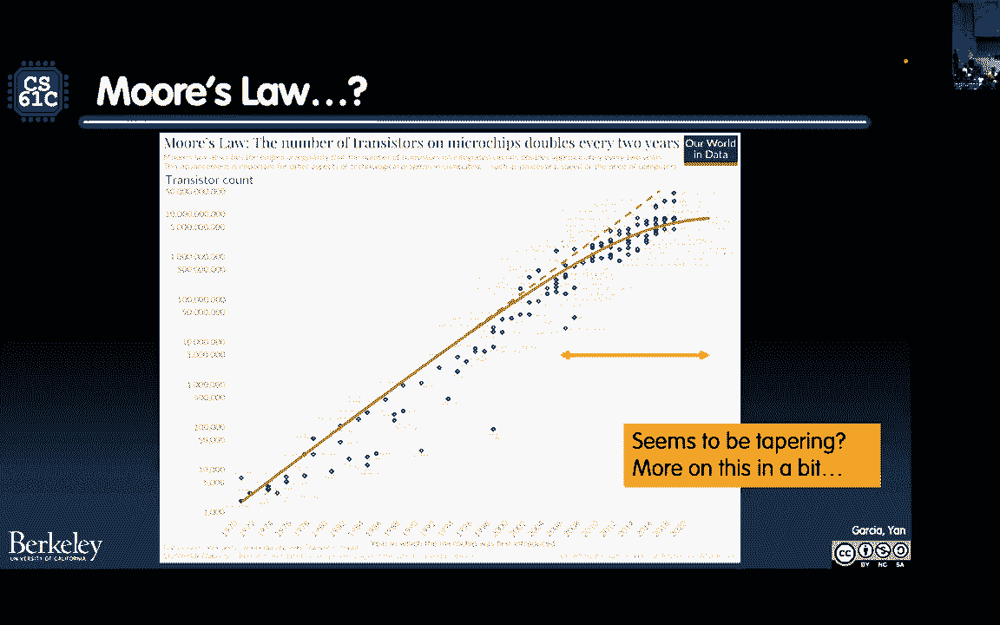

所以为了解释局部性原理。

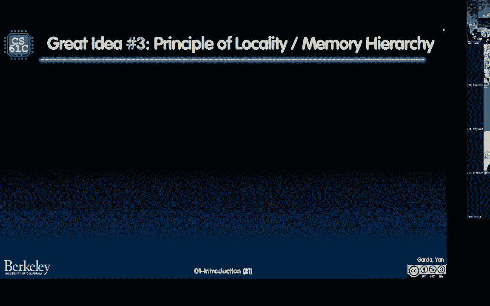

我将从我们自己的吉姆·格雷的一个不同的类比开始，他也是一个卡勒姆去啤酒，所以吉姆·格雷有了这个想法，上面写着，好啦，让我们想想从内存中检索一些东西需要多长时间，让我们想想我们的人脑，好啦。

想象一下这是我的头，站在这里的这个人，如果我想从我的大脑中恢复一些东西，理想情况下只需要一分钟，通常少一点，也许我忘了什么，虽然，就在房间的尽头，我要走过去，可能就像，你知道的，90秒左右。

也许我现在把什么东西忘在办公室了，如果他们穿过校园，又是十分钟，以此类推，同样的类比也发生在记忆上，所以这个想法是叫做计算机寄存器的东西，我们将在几周内详细讨论，如果我们想从那里取回什么，这将是一纳秒。

十比九秒，但如果我们忘了什么东西或寄存器，我们得回到储藏室，这不会太糟糕，只需要两纳秒，但如果我们忘记了什么，突然需要100纳秒，这里的类比是，也许我在加州大学忘了什么，我得去萨克拉门托。

离这里一个半小时的路程，好吧，也许我需要从内存中的磁盘中得到一些东西，一切都会好起来的，与我相似，去冥王星，试图得到一些东西等等，等等，所以这种事情很接近的想法，花了很短的时间。

这是我们将一遍又一遍地看到的事情。

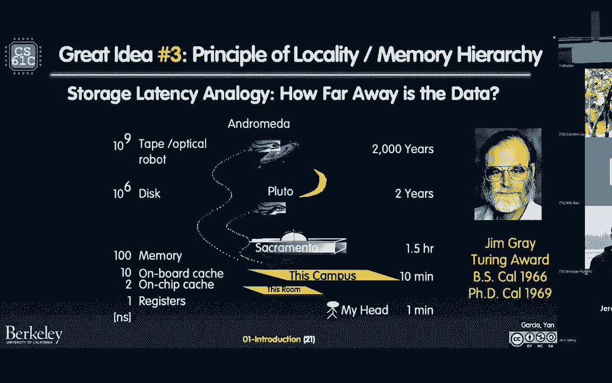

这是同一张图，只是有点翻转，所以你看，注册在这里的最上面，就在CPU核心之后，这意味着什么，这个金字塔说的是当你沿着金字塔往下走，事情的变化是一个数量级的，所以在最上面，这是极快的，极其昂贵。

当你一层一层往下走时，微小的容量，嗯，东西变得便宜了一个数量级，而东西变得更大了一个数量级，但也会慢一个数量级，所以我们会一次又一次地看到这个原理，局部性原理，你如何访问金字塔下的东西。

最后健身最后被优化。

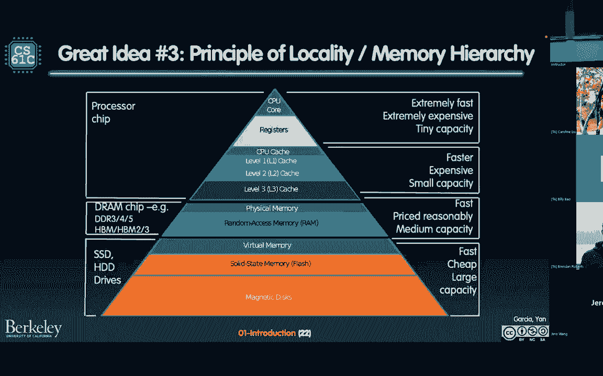

好主意4叫做平行，我们会在这节课中看到三个不同的版本，其中之一叫做指令级并行，你以前没见过这张图，你就像，这张图是什么，我有个主意，我们将在四周后再次访问它，就是这里的每一个竖条。

这些就像你CPU里的时间周期，时隙，三件事同时发生，有三种不同的指令，一个人在执行指令，另一个人在解码指令和指令，三个开始看到他们有什么指令正在从记忆中提取，这是指令级并行。

因为CPU同时被三个指令共享。

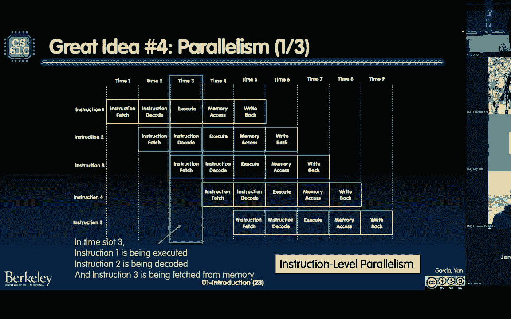

我们将要看到的另一种并行是线程级并行，计算机上的每个线程都在做一件工作。

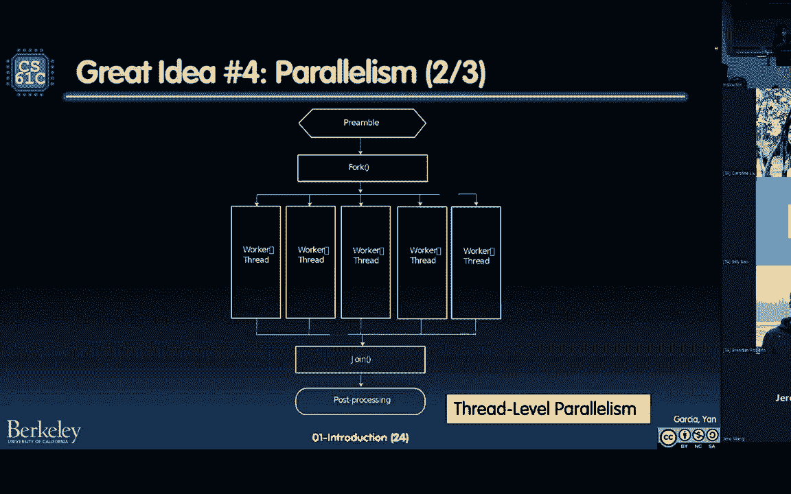

最后他们又一起回来了，最后是我们会经常看到的最后一个，右边这个叫数据级并行还是中间这个叫数据级并行，这是这个想法的旧版本，然后左边是谷歌文档的想法。

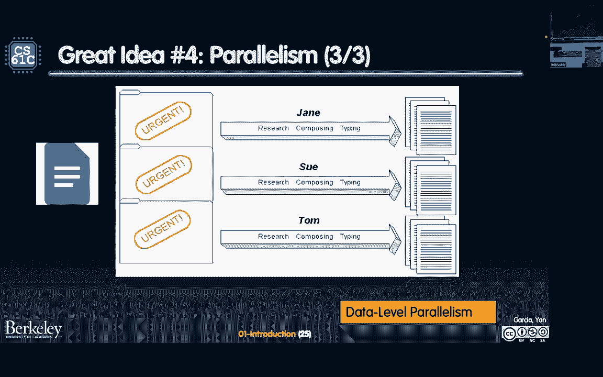

但这样想吧，你有一个庞大的团队项目，然后你有，假设三个小组成员，你把工作分给三个小组成员，他们每个人都可以做一个数据，然后在最后把它合并在一起，这就是数据级并行性--太棒了。

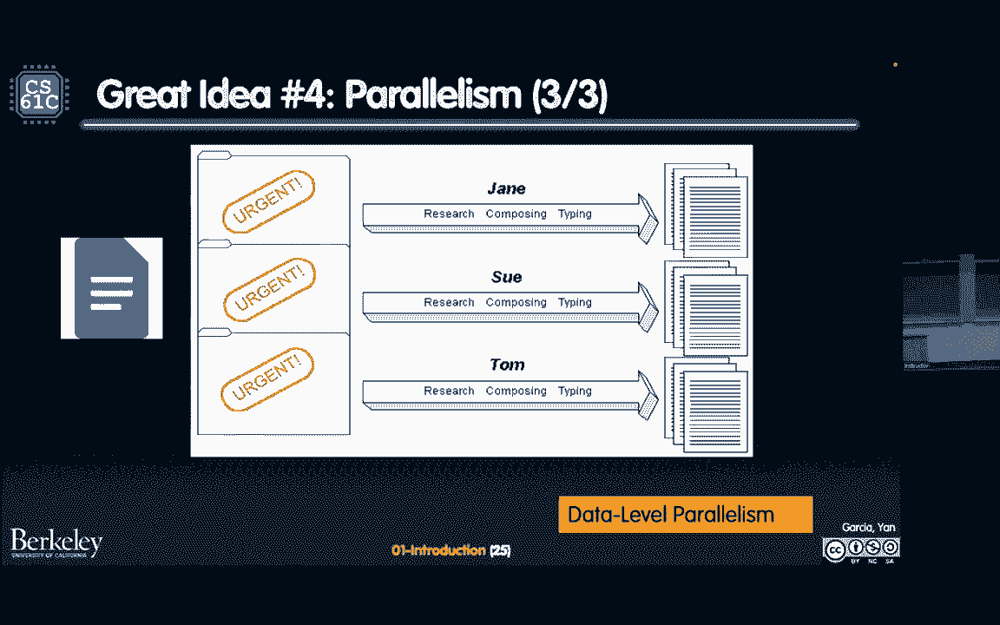

不过，有一个警告，所以这种并行的想法意味着你可以越来越快地做事情，嗯是做法律的，不过，说得很好，事实上，如果你平行行驶，你能加快多少速度是有限制的，我要强调这个词，这里。

它说性能的提高受到软件处理比率的限制，必须按顺序执行，这是什么意思，让我们再想想谷歌Dox的场景，假设你在做一个庞大的集体项目，你就像，但后来，教练说，嘿嘿，你知道你可以让尽可能多的人参与进来，你说好。

好啦，如果我让班上的每个人都这么做，也许班上有一百万人，这就是你喜欢的工人数量，我可以完成，这是超级超级快，但后来教练说，好啦，但我只打算在第七周分配，所以学期过半。

这意味着你所做的连续工作是你50%的时间，即使你有一百万人，一百万工人做同样的工作，你的速度只有2，我就是那些骗子，这种想法是等到所有这些顺序工作完成后，你真的可以优化所有并行的东西。

这是我们将一次又一次地看到的东西。

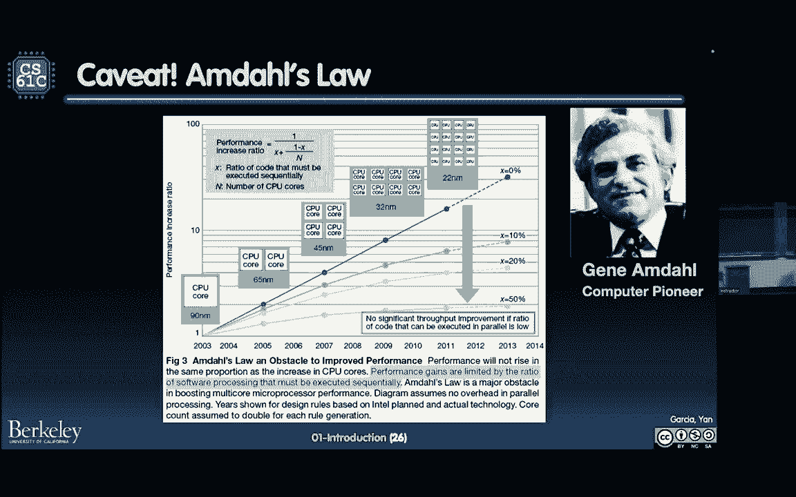

想法五，这个更微妙一点，这就是所谓的性能度量和改进，到目前为止，你在很多计算课上看到的，这种优化的想法，试图使某事尽可能快或尽可能有效，但这种高效或快速的想法，有点软，这有点像说你有一些艺术作品。

你想欣赏艺术是好是坏什么的，你知道这里缺少一些指标，所以计算机体系结构中的一个伟大的想法是如何改进这个想法，所以我们要把重点放在权衡上，这两个指标，即延迟和吞吐量，延迟是指从你得到任务到。

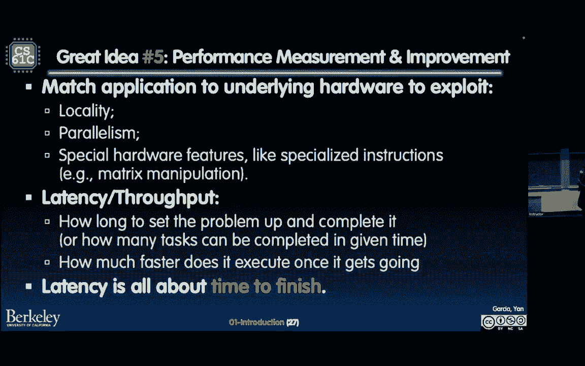

当你完成任务。

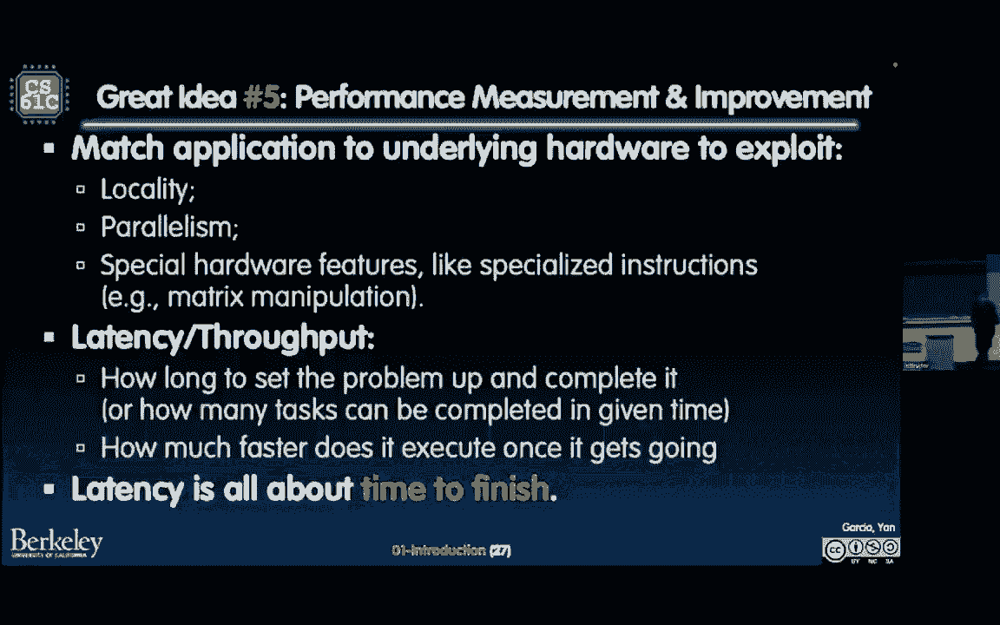

这是我们要优化的东西，这实际上是一个非常重要的指标，其中一个巡回演出奖得主，我们以后会看到的，我想出了这个主意，我就像嘿，你知道的，这是我们真正应该关注的事情，专注于这个指标，并尽可能地优化它。

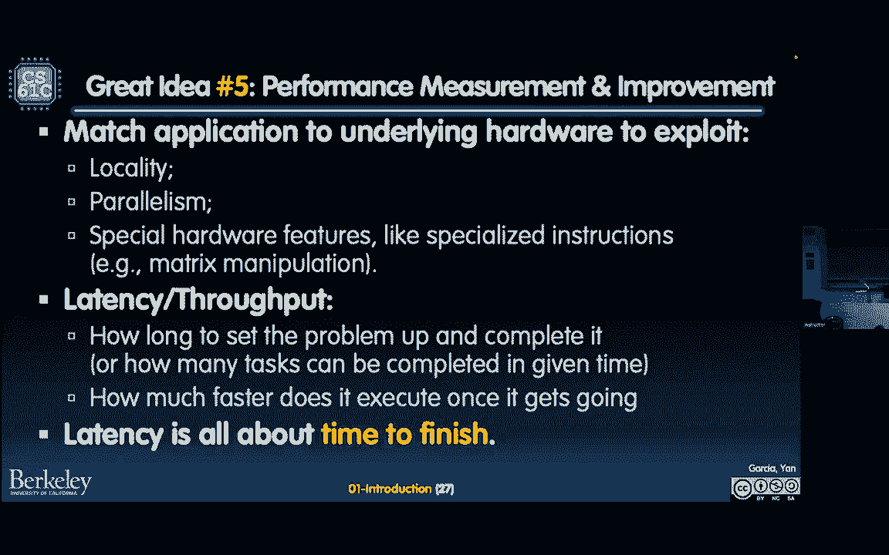

想法六，所以这是我们将要考虑的第六个好主意，会有很多其他的好主意，你认为会很好，那也不错，你可以有自己的好主意清单，但对我们来说，第六个是通过冗余来实现可靠性的想法。

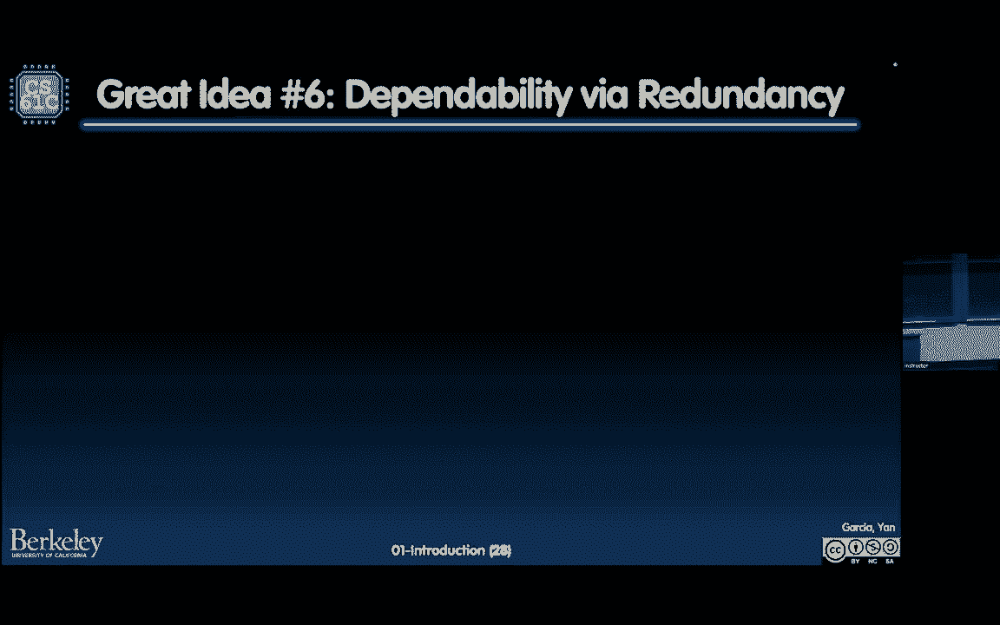

我是什么意思，嗯，这里有一个例子，也就是说，当我们考虑数据时，当我们思考正在发生的事情，事实证明，只是随机的东西可以打破，所以我要点击这个视频，也许它以前会弹清唱剧，是啊，是啊，是啊，是啊，好啦，岩石。

所以如果你没去过探险馆，这是探索馆的展品之一，叫做云室，云室是一种可视化宇宙射线的方式，就在我们周围，如果你觉得这听起来很古怪，看看这个，让我们看看更刺激的，所以你看到的所有这些不同的东西。

这些正在发生的一缕缕，那些是亚原子粒子，其中一些是电子，当这些电子一次又一次地撞击你的晶体管时，你的跃迁电子会疯狂，他们有时会随机翻转，你就像，我能控制宇宙吗，这就是51C的意义吗，没有井。

61个C是关于适应这个的，只是要知道有些事情即将发生，如果有什么事情要发生。

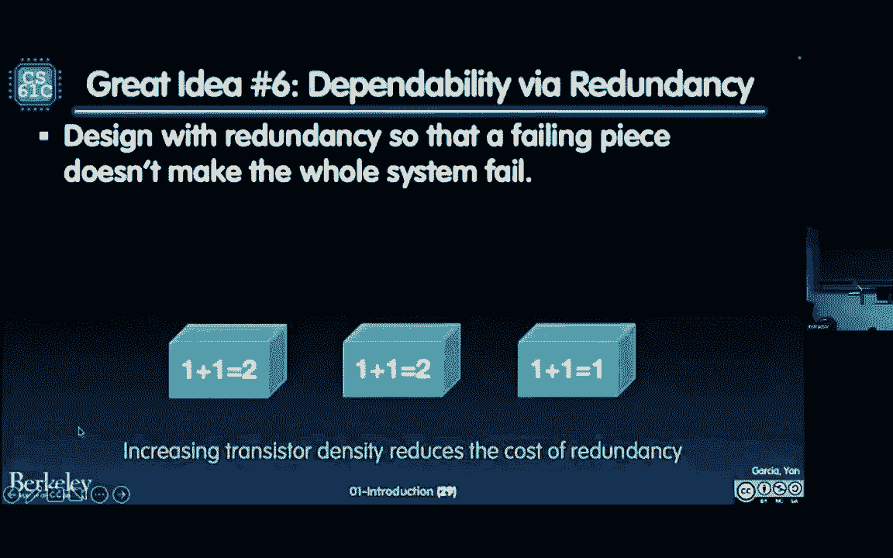

然后您希望构建冗余，所以我的意思是，假设你，你觉得有些事情非常非常重要，你想要得到正确的答案，你把它给一群人，三分之二的人给了你正确的答案，或者更确切地说，三分之二的你给，给你同样的答案，一加一等于二。

一个人流氓，然后说一加一等于一，你占了多数，你说，好啦，我只接受大多数人的回答，这种冗余的想法又是什么，我们将一遍又一遍地看到，增加晶体管密度降低冗余成本。

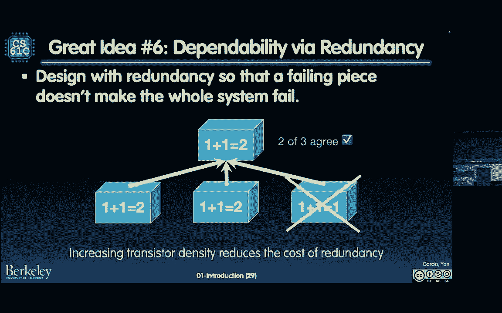

允许你创造这些东西，我们要去，所以说，下面是我们将如何一遍又一遍地看到这一点的例子，它适用于从数据中心到存储再到内存的一切，即使是像导师这样的人，让我向你展示这里的数据中心是如何。

你们中有多少人知道亚马逊建立了已经完成的蚂蚁数据中心，好的，好的，我只看到几个人，你就像，所以说，什么是冗余数据中心，甚至意味着如果有一个巨大的雷暴，或者停电了，这样。

亚马逊就不会立即丢失单个数据中心内的所有数据，它实际上在其他数据中心放置了客户数据的用户数据副本，所以如果一个数据中心坏了，整个系统不会瘫痪，它一直在运行第二层，我们将看到，这是冗余磁盘或突袭的想法。

所以这个，呃，这个突袭的想法是说，好啦，嗯，如果您可以在数据中心级别，这在现实生活中并不是这样的，从拉斯特开始，但跟赖特说，好啦，如果我们从这个开始，我们可以有多个磁盘，也许我们会有一个额外的磁盘。

如果其中一个磁盘也坏了，现在可以节省内存，或者你可以保存我们所有的数据，如果其中一个磁盘坏了，最后，在位级别上，我们也有这个，纠错码，所以一个字节是八位，这就是这应该代表的，这是德拉姆，我知道。

我知道八位的时候我们会再加一点以防万一，这样我们就能适应识别，当我们在传输中出错时，但这六个好主意你可能会想得很好，难道不是解决了计算机体系结构，我将谈谈为什么计算机体系结构在今天令人兴奋。

尤其是为什么加州大学伯克利分校。

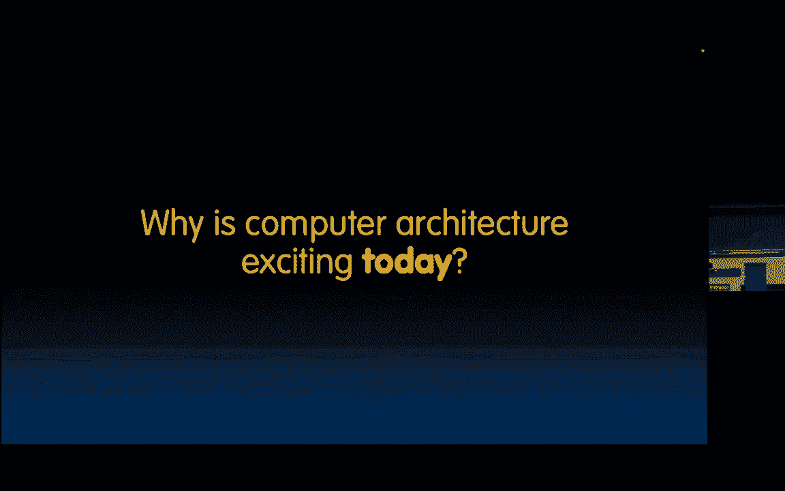

这里有一个观察，也就是说，用于所有这些不同应用的设备数量正在不断增长，正在发生的事情的不同应用也在不断多样化，所以回到1970年，我们有这些科学计算，我们有一个设备到整个房间，那是一台巨大的巨型计算机。

当我出生的时候，有这些东西叫做个人电脑，那里，还有一个叫做万维网的东西，我们也开始看到某种数据中心的工作，大约在你们中的许多人出生的时候，你看到了个人电脑，但你也看到智能手机出现在不同类型的应用程序中。

然后在未来大约2030年，甚至现在，我们看到云的增长比万维网时期多得多，有史以来，我们看到医疗保健设备，我们看到VR，我们看到AR，我们看到娱乐，我们看到所有这些具有不同应用的设备，的确。

机器学习对他们中的许多人来说是常见的，但不是全部，图形是一个非常不同的应用程序，然后机器学习，因此需要有不同的硬件来适应。

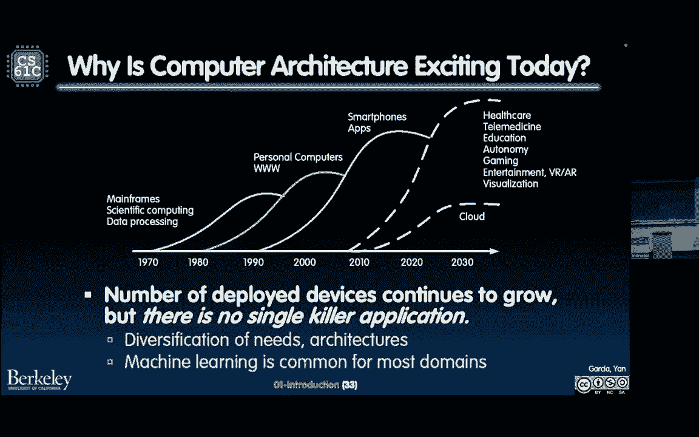

所以原因是这样的，第一名，为什么计算机体系结构令人兴奋，首先摩尔定律有些极限，我的意思是，这是晶体管的数量--它还在增长，所以我把图延伸到这里，所以你看图表是到20点10分左右，我把图表延伸到过去十年。

它在生长过程中逐渐变细了一点，所以人们所做的是说，好吧好吧，如果我们不是每两年得到两个X晶体管，让我们增加核心的数量，增加并行性，然后能够增加我们芯片上的性能，然而，有一些权衡，也就是说。

如果您使用单个线程，单线程类型的系统，单循环系统，然后你实际上受到可以输入芯片的功率的限制。

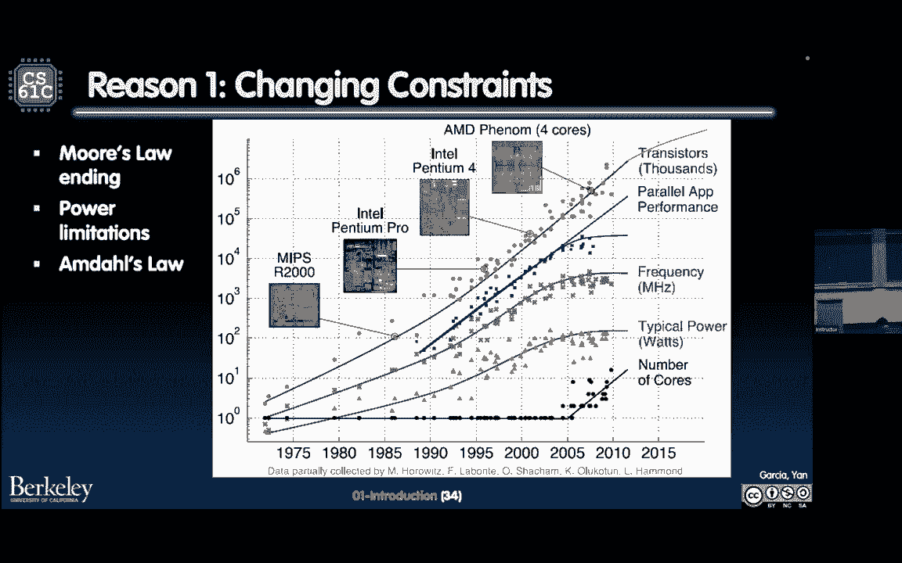

因为毕竟你们都在运行计算机，而计算机现在并没有着火，所以必须有某种现实的限制，你能以多快的速度或多少东西发送到你的设备上，这就是第二个原因，我们在两张幻灯片前的预科中看到了，就是有这个或CC。

新时代来临了，或者是一个叫做领域特定计算的时代的回归，我的意思是每个领域都需要异构的系统，之前谈到了一点图形，这与机器学习有何不同，Gpus和神经处理单元，Npus是不同的，所以这里实际上是一个15。

苹果，一个15英镑的仿生芯片，那是，呃，它已经部署在iPhone SE中，还有iPhone13和一些iPad，如果你非常非常仔细地看这张图，这里有许多不同的CPU，有一个，有一个GPU设备。

有一个NPU设备，有不同级别的缓存，所有这些不同的芯片都被放在这家潜水店。

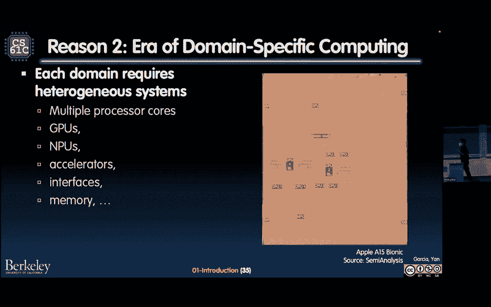

所以所有这些不同的应用意味着计算机体系结构是令人难以置信的令人兴奋的，所以这里有一个古老的传统智慧，然后我将向你们展示计算机体系结构是如何革命性的，传统的观点是，你应该把这些通用的架构，由于摩尔定律。

你将继续得到性能，实际上每周会增加一个，用专门的计算机进行设计是愚蠢的，因为当你做完的时候，设计那个美丽的东西，摩尔定律将超越你，下一代通用将会问世，这将比你所能做的任何新的传统智慧都要好。

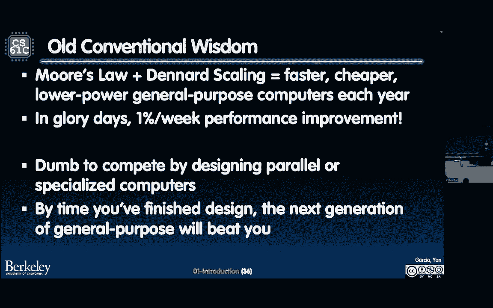

但是要设计特定领域的体系结构，下面是谷歌的张量处理单元或TPU的一个例子，其实呢，这是谷歌的TPU三号，这是发布的，我想两年前，这是一个专门训练神经网络的引擎，如果你仔细看，这里有四个不同的单元。

它们都是液冷的，这就是这里和那里的银线，仅在谷歌的数据中心可用，所以连接到这些东西并运行这些东西的唯一方法是通过云，谷歌实际上，呃，去年，我想发布了一种叫做TPU Edge的移动类型的TPU，这也很酷。

但对于不同的领域，仍然是机器学习，但现在在移动可携带设备上。

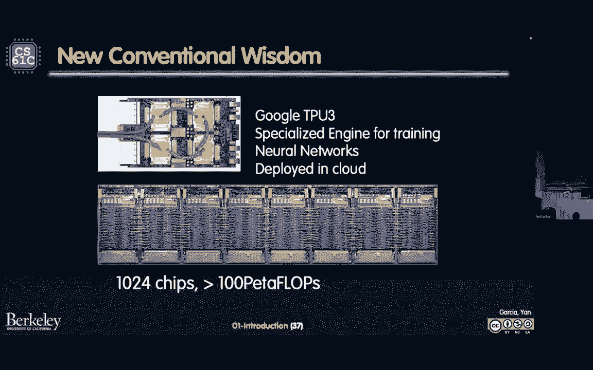

最后，为什么伯克利很重要，几年前，大卫帕特森和约翰轩尼诗凭借他们的思想获得巡回演出奖，围绕平行，以及周围的城市，呃，围绕计算机体系结构，我这里有一个小幻灯片吗，所以他们做的一件事就是。

当每个人都在为芯片设计越来越复杂的体系结构指令集时，如果我们缩减这些指令集的复杂性，做了一个叫做简化指令集的东西，原来他们被嘲笑了，它实际上是风险的概念，你将会看到，我们会我们会了解，风险五。

风险五用在很多芯片上，今天有很多很多的建筑，所以他们几年前获得了图灵奖，有一个想法真的像，无视传统智慧，每个人都像，你为什么不把所有的复杂性都放进去，他们说不，我们希望专注于吞吐量。

我们想很好地关注潜伏期，图灵奖是什么，巡回演出的奖品是什么，好问题，丹耶，所以说，所以术语，你们中有多少人听说过诺贝尔奖，太棒了，所以巡回演出奖就像ecs诺贝尔奖，所以实际上。

你之前看到的几个人吉姆·格雷也获得了图灵奖，图灵奖通常授予那些真正做出重大创新的人，它们改变并革新了计算机的工作方式，革命发生的方式之一是像，呃，从轩尼诗和帕特森这里，其实呢，他们实际上已经写了教科书。

接下来我们会讨论这个问题，关于这门课你需要知道什么，好吧，首先我们需要听听尤达的意见。

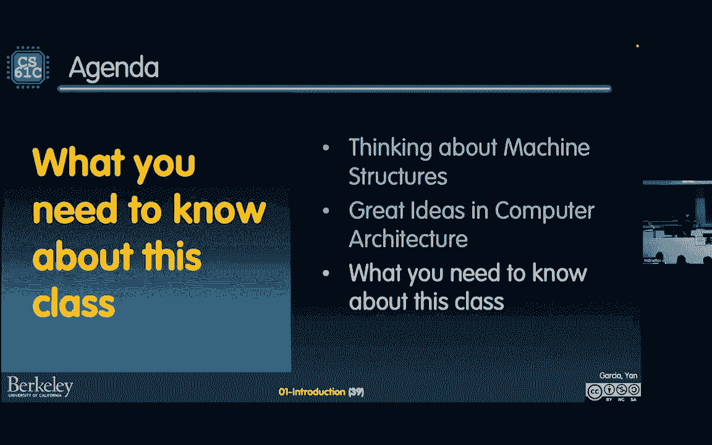

所以我们尽量把我们的日程安排好，但总是在运动，未来是，是呀，丹娜的嗓音确实比许多人都好，多年，和许多不同的61 C讲座，关于这门课，我们将简短地谈谈课程中的不同组成部分，今天剩下的课，但首先。

让我承认这门课背后的人类，所以这门课的幕后黑手是丹和我，但更重要的是，是所有的教职员工，但是，因此，工作人员为你创建了一个课程网站，我要做的是，我要点击课程网站看看会发生什么。

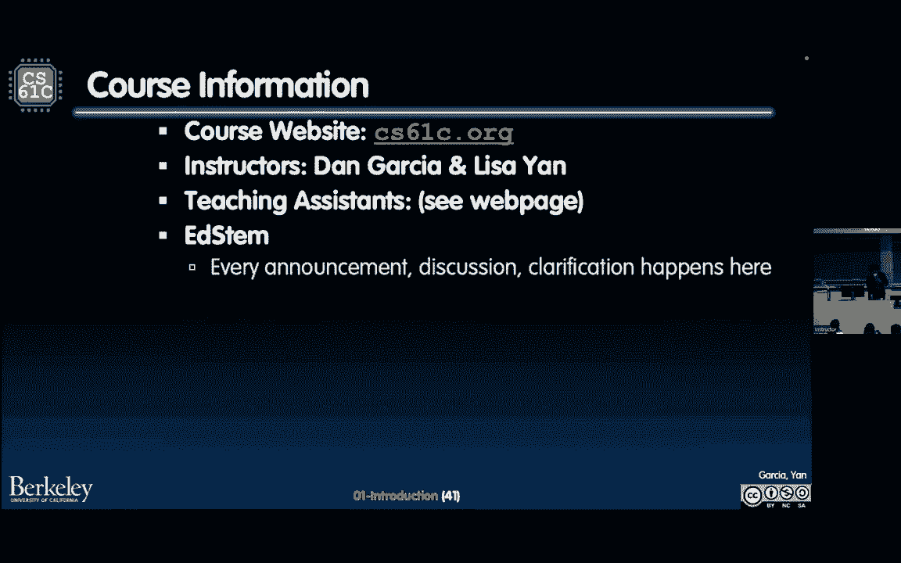

是啊，是啊，是啊，是啊，是啊，是啊，我们可以看到一点点，所以说，如果你去CS 61 C点组织，如果你去CS 61 C组织，这是课程的所有信息都很好的地方，除了ED梗，我们稍后会讲到。

所以你可以在这里看到，第一课到了，如果你点击这个链接，你会看到PDF的，我们会尽量在上课前把课堂讲稿寄出去，然后我们有时会在上课前给你们打印输出，如果你想，如果你喜欢硬拷贝，看看这里，有必修课。

哪些是课程政策，我要点击这个链接，您也可以访问这里的链接，课程政策在这里，这是我们的课程大纲，非常重要的是，你要阅读这里的每一个组件，因为如果我们坐在这里讨论整个课程大纲，可能要一个小时。

但我怀疑你们中的许多人阅读东西的速度比，我们需要谈谈，我们会指出课程大纲的重要部分，今天的课，我想让你们注意的第二件事是Ed Stem的想法。

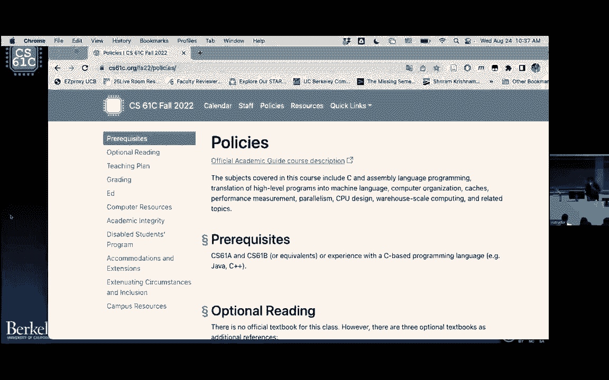

是我们的课程论坛，我们不再使用广场了，我们在用一种叫做ed的东西，所以你们所有人，如果你注册了这个班，您应该收到并邀请参加我们的课程论坛，所有的课程通知都会在这里，所有的任务发布都将被炮轰，在通知方面。

如果你有任何问题或澄清，一切都要经过这里，我们班大约有720人，好多人啊，这就是我们要使用的课程形式，因为当有人和你有同样的问题时，如果你不在这个课程表上，然而，请给我们发电子邮件。

我们的课程工作人员电子邮件在CS 61 C org上，它实际上是加州大学伯克利分校的，第二件事是读数，所以你就像，好啦，丽莎，我要在这门课上做阅读吗，一切都是可选的，除了今天的必读，阅读课程政策。

但我想向教科书大喊一声，因为我很喜欢课本，所以这里有一些，以下是一些读数，我把课本带来了，以防你对它们的样子感兴趣，其中之一出自图灵奖获得者之手，帕特森和轩尼诗，这是计算机组织和设计的风险五版。

这个有两个版本，你可以用任何一个，这里的第二个被称为C圣经，这是开襟羊毛衫和里奇，C编程语言，这是我真的很喜欢纸质的东西，但它也可以在网上免费获得PDF格式，世界上每个C程序员的桌子上都有这本书，是呀。

整本书里的每个人，这就是，但这个其实昨天在我枕头下面，当我在想今天的讲座时，你知道的，只是想稍微进入状态，但同样，这门课并不完全是关于C的，所以可能几周后就结束了，我把这个也放在枕头下面。

第三件可选读物是，它将在课堂上晚些时候出现，它被称为计算机的数据中心，这个也可以在网上免费获得PDF格式。

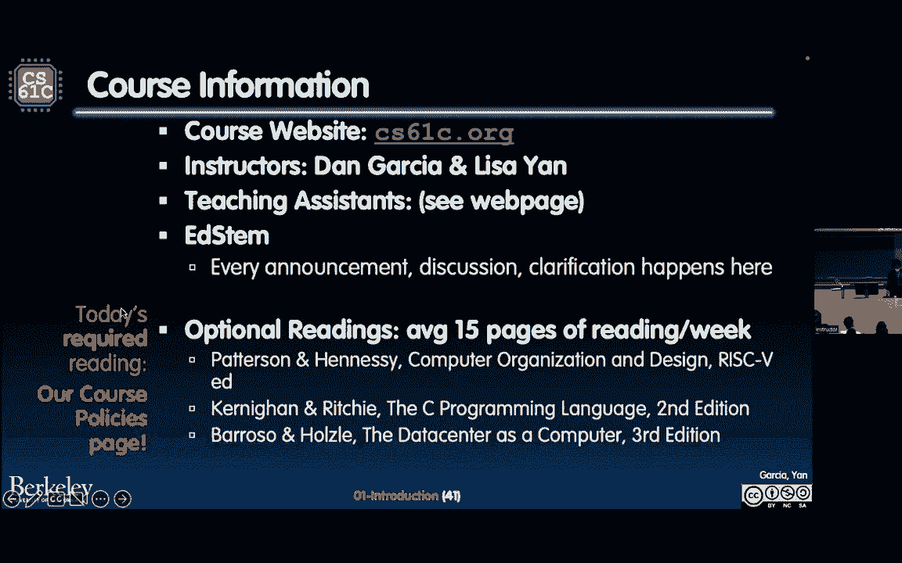

好吧，几个，合唱部分总结，其中之一就是讲座，欢迎各位亲临现场，欢迎来到Zoom的每一个人，所以这是周一周三和周五一小时，我们会录下来的，对于那些真正喜欢这门课的人来说，你们将永远有这个机会。

当我想回来的时候，我们将在下午四点钟上同样的课，如果你只是想再次感受那种感觉，我们星期五会在这里，从那里开始，我们就有这个十点的时段了，然后其他几个部分，我将成对地讨论，其中之一是讨论和家庭作业。

在这里我们将讨论概念性的东西，所以这门课的家庭作业是，实际上你要把它提交给，这个叫草原的东西，学习，整个学期你就会有很多这方面的经验，第二部分，你实际设计、调试、编码和编程，这将在实验室和项目中，好啦。

所以这是另一个，其他两对作业，只是一个关于讨论和生活的笔记，我们有一些关于井的问题，第一节是什么时候，我已经准备好从61 C开始了，我们下周将在现场直播中开始讨论，但是，我们有一个安装实验室。

只是为了确保你所有的机构账户和东西，一切都在进行，你的GitHub已经设置好了，所有这些事情，这是这将是可用的，如果今天结束前还没有在网站上，这将是应得的，下星期一，如果你对此有疑问。

我们刚发邮件给艾德，我们可以帮你安装，最后期中考试和期末考试都没了，这是课程的最后一部分，我们稍后会和丹谈谈，我想说的第二套课程元素是我们如何帮助你。

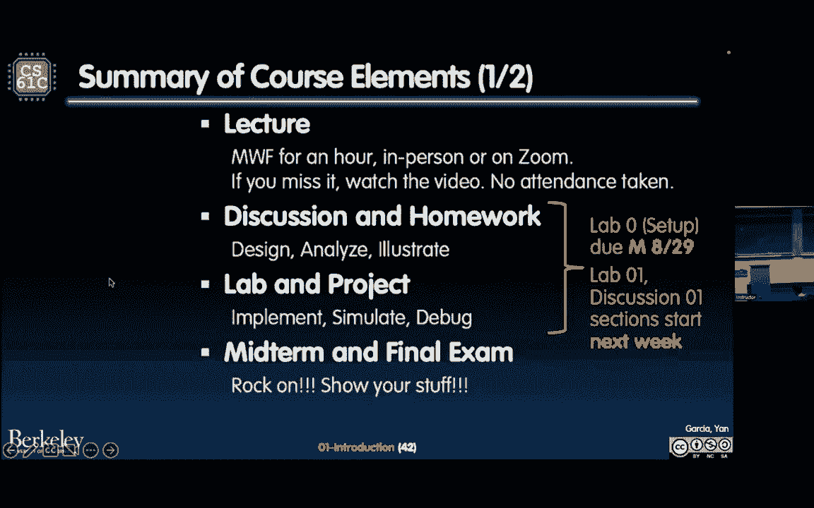

我说过教育署的课程表格，这是如何获得异步帮助的一个非常重要的部分，但如果您不需要同步帮助，请亲自帮助，我们会有办公时间，这些叫做项目方的东西，所以在办公时间，我们将有两种类型，我们将有助教类型。

那些将是亲自或混合，这些将是球杆基础，所以你要排队，所有的说明都在我们的课程政策页面上，所以导师是丹和我，这些将以个人和小组为基础，更多的是专注于概念，助教的办公时间是用来分配任务的，实验室。

家庭作业项目，所有这些事情，也为考试做准备，谈论那些考试问题，项目方，第二颗子弹，我们整个学期都有，离项目截止日期很近了，所以这样你就能玩得很开心，嗯是的，我们会在这个项目中玩得很开心，可能是明智的。

是啊，是啊，会是，会很棒的，然后这里的最后一部分是这个扩展形式，然后我们再谈谈这个，还记得我说过的王牌吗，还记得我们说过百分之百的王牌吗，我们在这门课上真正希望发生的一件事，是为了你们所有人的成功。

所以如果你需要什么，如果你赶上最后期限，如果你压力很大，只要六十一，见，你们有多少人，呃，我们的二年级学生，你们中有多少是三年级的，你们中有多少人是高年级，继续摇滚，你们中有多少人是五年级的学生。

硕士生，大一新生，大一新生，重要的是你们所有人都在经历一个非常重要的，就像你生命中的一个非常过渡的时刻，Dan和我希望能让你养成好习惯，我们想在61年养成的一个好习惯就是交流，请让我们知道。

如果我们的政策对你不起作用，如果你需要帮助，如果你需要扩展，只要把它通过表格发送，我们一会儿再谈这个。

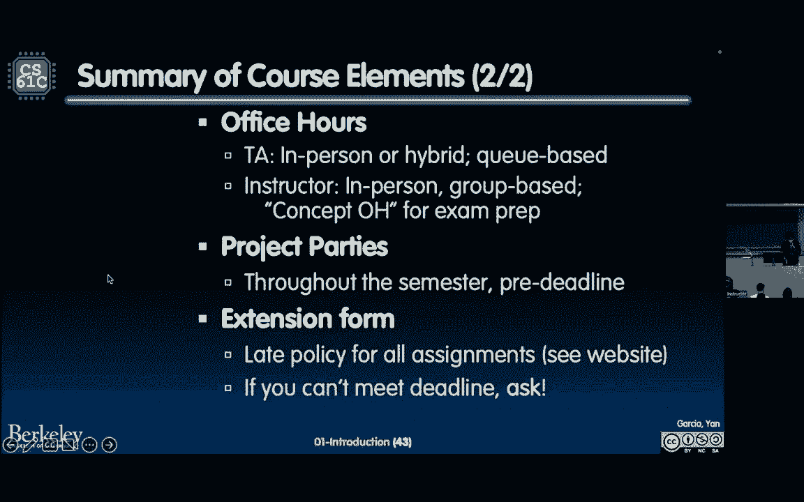

是呀，对呀，谢谢你，谢谢你，杰出工作，杰出工作，到目前为止，好极了，好啦，延期表格，所以扩展形式是，它有两个部分。

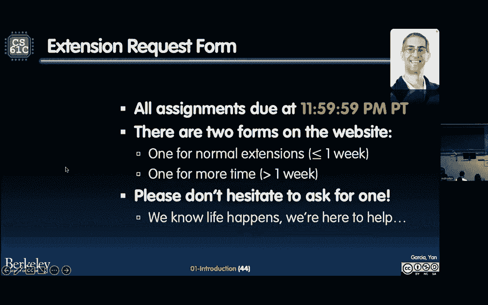

所有，做这件事的任务，午夜前一分钟，有两种形式。

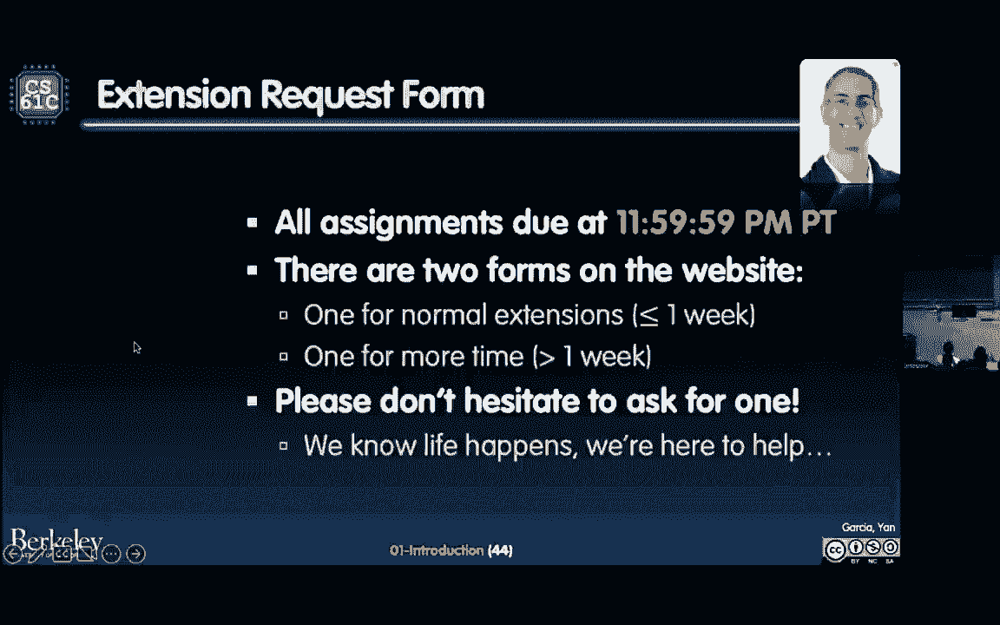

一个用于正常扩展，这就像你知道不到一周我们过去有一个叫做滑日的东西，你有几天不顺利，你可以用它们，我们用光它们，你被困住了，你真的必须在每个最后期限前完成，我们说你知道生活会阻碍。

尤其是在Covid时代，我们还在继续，所以如果你需要不到一周的时间，填写正常扩展名，就像不用担心，如果你需要更多的时间，也去吧，我们会说不用担心，但我们要好好谈谈，你需要一些支持服务吗。

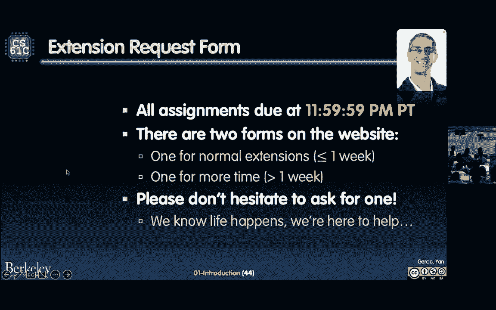

也许我们可以指引你去心理健康服务中心，身体健康服务，也许是一些Covid的东西，无论你怎么称呼你，并真正与你联系，所以如果你需要一周以上，我们会跟你谈的，但你还是很酷，如果你需要不到一周。

我们想和你谈谈，你还是很酷，但我们只是一种文件，你需要一点，仅此而已，不是翻转，日子总是问，如果你需要支持，所以不要，不要犹豫。

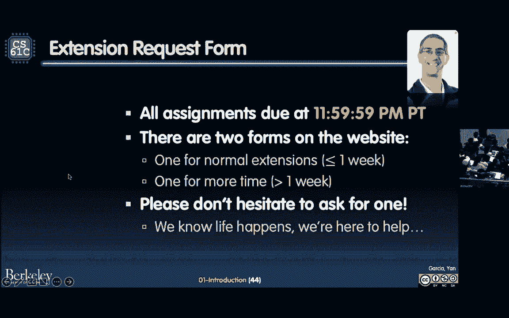

生活发生了，我们是来帮忙的，好啦，我们是站在你这边的，期中考试，我们将有两次考试，第一个将是一个创造性的新事物，我们以前从没做过，这真的很有趣，所以我们将有第一部分，他将亲自出席，我们从来没有这样做过。

闭卷，通常有一张学习表，不再有学习单，闭卷，走进去，但范围比以前小了，以前是一个很大的范围，八个星期的一切，是的，你必须有学习问题才能让你跟上，没有更小的范围，我们要把所有的程序，大C代码。

把问题带回家，那种项目就单干，自己动手，带回家花一整天的时间做这件事，连时间都没有，去吧，去吧，动手吧，只要向我们证明你能做到，很酷，就像面试，如果你有面试，他们会说嘿，教他们C，但我甚至不会给你计时。

你只管去吧，慢慢来，当你完成的时候，它在那里，我们甚至会给你这样的，你知道的，当你完成而不是喜欢，啊，我不知道，如果我做了，否则我会给你所有的测试，当你通过测试，你可以停下来，那不是很神奇吗。

那就是座位，是呀，哼，是呀，是呀，就在那里，就在那里，它是，当你填写那些小调查时，请记住这一刻，记住此刻，好啦，呃，第二个和风险五一样，我们教你如何用汇编程序编程，嗯。

为什么不给你尽可能多的时间来编写汇编程序呢，让它发挥作用，当你得到它的工作，我们会给你测试用例，它的工作原理，所以这些都是期中考试的，现在你只要慢慢来，把他们搞定，但你显然是自己做的吗。

不要指望你的邻居，但你知道谁会相信你，这件事我们相信你，再说一遍信任，伯克利荣誉守则怎么样，挺酷的，交易权，好啦，那我们就说好，那么好吧，一旦期中考试取消了，什么剩下的好。

也许一些叫做同步数字系统的SD，也许数字是如何工作的，可能是一些浮点，简单的东西，也许一些关于比特如何工作之类的C，简单的东西，你得去实验室拿，但是但是没有，没有笔记，你走进来坐在实验室里。

你知道他们会去实验室学习一些东西，我们下去坐下，在那90分钟里学点东西，现在你安静地进去，安静地参加考试，然后你走了，就这样，所以这有点像，我们把你期中考试的所有东西都拿走了，去掉了很多。

现在有一个小婴儿的部分，你必须建造它，你真的得知道，我们给你一个机会，你去做吧，这就是我的想法，所以这是我们正在尝试的新事物，我们看看它是怎么工作的，好啦，好啦，期末考试，还有一件新鲜事，我们意识到。

六一C的期末考试是最致命的，所有这些的期末考试，我相信这就是原因，这就是为什么，丽莎谈了六个好主意，这是一个很大的大约九个模块，我们教你，这九个模块都在决赛中发挥作用，比如你是怎么把这些都保持直的。

喜欢，就像很多事情一样，所以我们说，如果我们真的进了决赛，非累计，意味着你期中考试的所有东西都取消了，决赛，你测试了一次，嘿嘿，我喜欢它，我喜欢这个，六十一见，六十一看到没问题，所以一旦你测试了它。

一旦我们不再要求你考试。

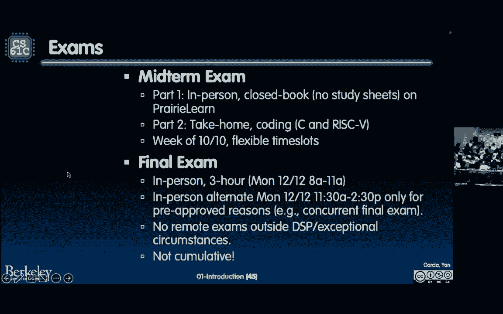

我们在沙子上钓到了一条线，突然之间你就完了。

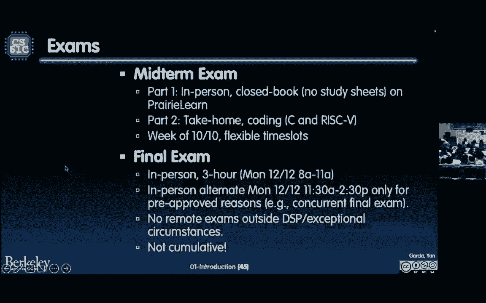

希望你能在期中考试中取得好成绩，对然后你就走开，你在这方面得到的要少得多，而不是有九件事可以玩，好像有五四个，合理多了，可查找，我们对这种新形式感到非常兴奋，我们希望你能粉碎它，我们现在要考试了。

让我们想出一个硬链接，所以让我们想出最难的问题，否，中间会有一些很温柔很好的问题，但不是把唾沫球和旋转器，然后做一个投球，像一个有曲线的不，我轻轻打，我们来了，我们来了，一个温柔的垒球球场。

然后你敲啊敲，把它敲出公园，我们想让你粉碎我们的考试，我们不骗你，我们想粉碎我们的考试，我们要问你关于这些东西的部分，这不像右段底角的小部分，不是一般的问题，我们只希望你能把它压碎。

这就是我们不打算警告你的想法，我们想让你粉碎这些考试。

好啦，开始了，以下是课程评分甚至不是很好的原因，看起来连百分之五都不到，实验室10%，百分之十的家庭作业，40%用于项目，期中考试二十强决赛，这就是为什么你会得到上一张幻灯片，呃，为了期末考试，是啊。

是啊，是呀，是呀，对不起。

去耶，我们走吧，是呀，所以期末考试，这只需要几个音符，这将是一次定期的面对面考试，但不会累积，有几个关于替代方案的问题，我们在是的问题上看到了，是呀，谢谢你，谢谢，我们会有一个候补。

它很可能是期末考试后立即出现的时段，所以我们的期末考试时间是8点到11点，阿米，星期一，你和我必须选择不，否，从字面上看，最早最可笑的时候，就像谁在琥珀里起床，计算机科学，好啦，我们开始吧。

看起来很可笑，我们将为你们中那些有预先批准的原因的人进行一次备用考试，所以这包括如果你在这段时间有一个课程，我们允许时间冲突，所以如果你在这段时间里有一个课程，在时间里有一个不可移动的决赛。

那你就可以申请候补了，是啊，是啊，那是一种形式，我们将在学期结束时发出一份，但你必须证明，不是很好，我不要不要，你必须证明，就像你需要发送，你得送你的孩子去上学什么的，我们完全理解，我们希望能够容纳。

我们会和你合作的，是啊，是啊，因为考试是，现在这一切都要亲自出马，这是学校的要求，是啊，是啊，就像一切都应该是面对面的，除了期中考试带回家的部分，我说对了，但是，我们完全理解这场大流行病仍在发生。

我们在事故中就是这么做的，因为你知道丹和我不想感染，但我们也尊重你们中的一些人有自己的承诺，所以事情可能会改变，所以如果我们回到尤达的声音，事情可能会改变，这是目前的计划，不不不，非常感谢你，太完美了。

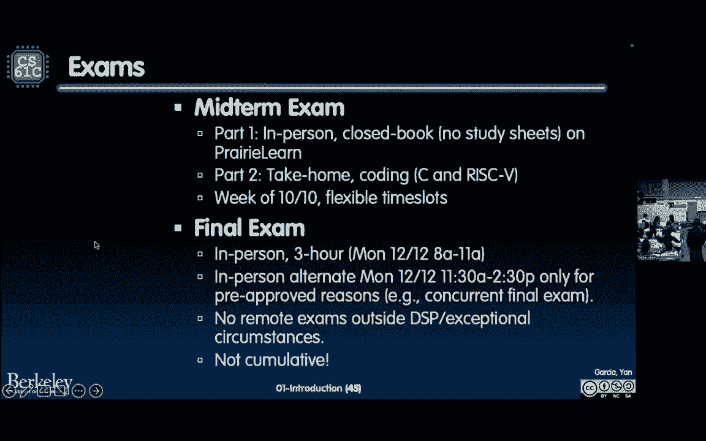

好啦，所以看看我是怎么说的，很平衡，对呀，上面有六十分，底部40分，很容易，好啦，但这也是一个新的，这是全新的，我们过去常常，这是一个老派的C，我们说过，你知道的，项目一，你得证明，你单干就知道了。

人们总是会挣扎，学习C和我对人们来说真的很难，然后你可以加入一个合伙人，在两个合伙人中工作，三和四，我们把它扔了，你可以和合作伙伴一起工作，你知道有些人学别人最好，教你，你可以合伙工作，每一个项目。

好在这里，我们去好东西。

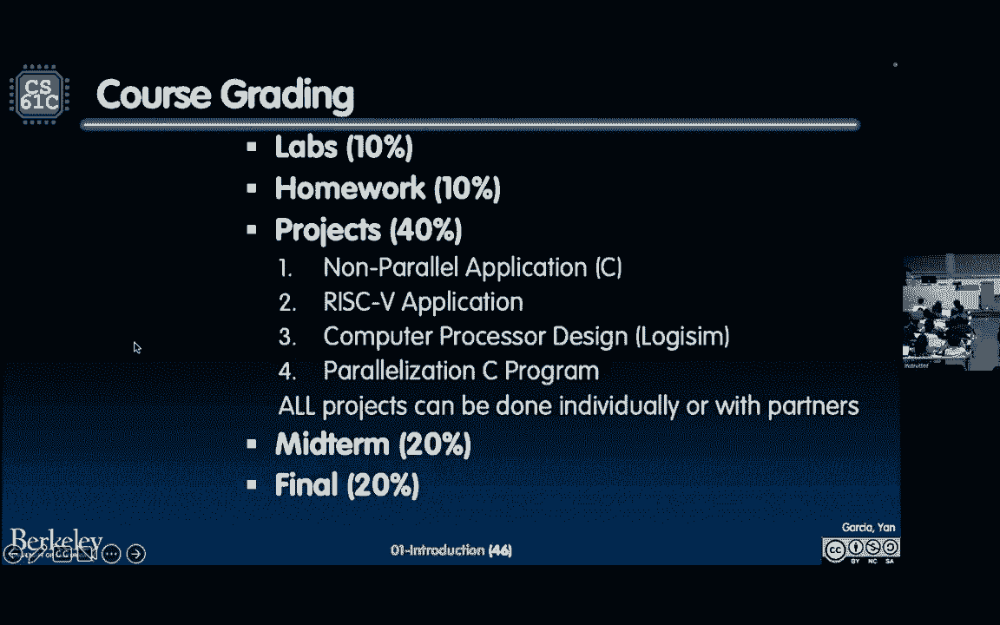

好啦，所以再一次，我们没有弯曲的评分政策，这是典型的，GPA会说A的成绩有一定的百分比，我都签在，至于我们所爱的一切，如果你们都把这门课搞砸了，而不是被我们的分形椅子严厉批评，我们会被庆祝的，扛在肩上。

就像那里，至少在那里，至少是这样，你让所有的学生都得了a，如果我们能做到这一点，我们会受到庆祝的，所以让我们在这学期实现它，那怎么样，还有工作面试，他们会用技术问题拷问你，求职面试中最重要的一堂课。

是B，但是第二道菜，求职面试的第二门课程是cs，但是第三个，第三个最重要的课程，这是一个c所以，确保你知道这给了你说“好”的好东西，说得好。

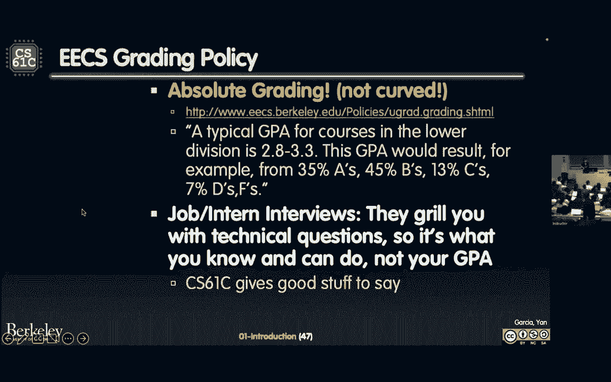

好啦，快好了，我们的目标是导师，我们想让这成为最有趣的体验，就像我们把那种能量，我们有如此多的热情，两个加州毕业生，我们都上过学，上课，你就坐在这里，所以我很荣幸，就是站在这里和你们分享这门课。

所以我们真的只是为了带来幽默热情，我们要把，带些苹果的客人来，他们可以请苹果的客人，谈GPUS，希望如果我们把这些都对齐，我们对计算机感到兴奋，新闻，每次演讲，我们在今天的新闻中证实了这一点。

就像我们要质疑这堂课，趣味作业，充满乐趣的挑战，你的第一个项目就像蛇游戏，你在开玩笑吧，做反向蛇游戏有多有趣，当你学习所有有趣的东西的时候，趣味作业，真的很亲学生，我想把这个给你，我要你。

你知道他们以前有优惠券说，如果你能找到更好的交易，给我看看，我会战胜它，我来搭配，你会发现我在校园里有一个更支持学生的政策，并把它提交给我们，也许我们会考虑，我不是在开玩笑。

在支持学习方面给我找一个更有利于学生的政策，普及辅助器具，你找到我，我在整个校园里，你给我们看，我们谈谈吧，好的，扩展右，所有的东西都很神奇，好啦，我们将保持优秀的卡利桑，一如既往，项目考试严格。

但不像软化好，免费艾滋病权利，我们不是为所有人做王牌，免费，免费，因为A条不移动，在A中的意思是不变的，但我们要让每个人都在上面，那个酒吧看起来像，这就像手段，每个人都可以在奔跑中通过终点线，你知道的。

障碍赛，差不多吧，所以我们想成为香港的七点零，如果我们不是，如果我们不粉碎它，每节课都有我们的演讲，我们的家庭作业，我们的项目，我们的考试，我们的政策对我们说话，我们会纠正的。

我们以前每周都和61 C开会，学生代表，他们会说你知道这周你有太多的作业，我们说你知道我们听了你的话，我们把任务，所以如果事情不顺利，告诉我们在伯克利大学的ED或6Two和C。

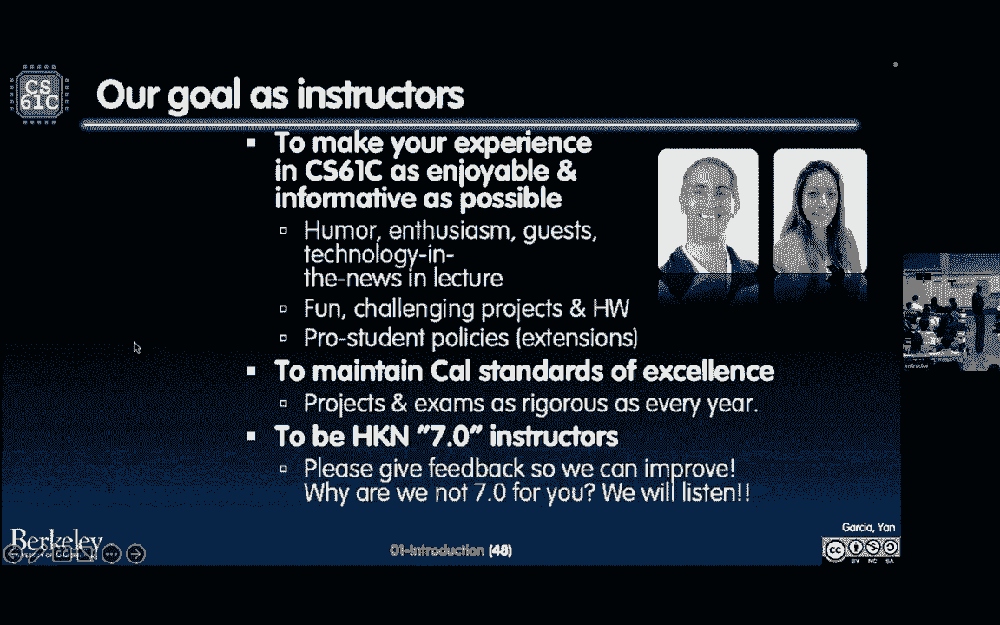

我们会纠正它，修复它，我们想成为有史以来最伟大的班级，好啦，所以现在我得变得沉重，我讨厌这部分，这是我一年中最不喜欢的幻灯片，你得对作弊耿耿于怀，好啦，我们必须谈论的那种授权。

这个项目和实验室可以两人一组单独完成，我们知道那很酷，那完全没问题，但是，你所有的作业都是家庭作业，很明显你所有的考试都是单独进行的，同样的事情--合作伙伴团队可能不会与其他合作伙伴团队合作。

所以就像一旦你找到了你的搭档，你被锁在，这就是你的同伙，他们不能，他们不能分享，鼓励您帮助教人们调试，所以一些其他的合作伙伴或其他人说我不能让这个工作，你不给他们答案，你教他们怎么教他们，如何调试。

教他们如何喜欢开车，教他们如何度过难关，但不要说你的答案就在这里，你知道吗，你想过这个，别想了，总的来说，你是怎么想的，比如教他成为一个更好的人，通过调试，你会成为一个更好的程序员。

我们不想分享方法或想法，或者代码，或者和其他学生一起白板，因为有时候整个想法，哦，我的天哪，这就是它的全部关键--这就是我们试图教的，不是给你的，所以不要做那种谈论，就像走出这里是你能做的。

你拿到了说明书，你就在听讲座，嘿嘿，等着尝尝这个，也许我会试试这个，这是一种需要考虑的谈话水平，也许你会试着，但当它深入到细节之下，不要突然白板，哎呦，这个块应该调用那个块，这个，但你知道。

不要在太低的水平上这样做，从演讲到高层走道，是呀，仅此而已，所以有时分配的重点是算法，如果你分享了这一点，他们就不必和自己在一起了，不允许通过UTER代码工作的香港和辅导课程，事实上。

我们有过你要去香港的案例，香港人不知道我们的作弊政策，他们就像真的很好地解决了这件事，所以这是枪手的密码，我不打算用C语言为你写代码，但这里是伪代码的整个代码，喜欢线和匹配看，就这样结束了，这就是演讲。

在获得该级别的帮助方面，CAN是不允许的，伪代码是，有时整点，请随时回答ED上的问题，帮助他们调试，不要共享代码，甚至片段，他们希望你所拥有的，你交的是你的，我必须很重，这就是问题所在。

所以照搬其他学生的解决方案是不可接受的，从Web复制或启动解决方案是不可接受的，不能接受留下代码，任何一个肆无忌惮的学生可以找到并偷走它的地方，我是公众的Githubs一边离开你自己一边走开。

登录我有多少次作弊案件，哦耶，我拿着笔记本电脑，然后我走到洗手间，然后他们就说人们进去了，这也是你让你的笔记本电脑开着的麻烦，当人们到了那里，你不能把东西乱放，受保护，把打印件留在里面。

我们有多年来开发的工具和方法来检测这种情况，你会被抓住的，因为这些会很严重，我让很多学生不及格，每次我不想那样做都让我心碎，所以让我们都冷静点，最起码发生了什么，所有作业负分，和一封信在你的。

这是最大的交易，你的奶牛里有一封信记录说这种情况发生了，有时候，事实上，学生们必须给学校写一封信，偶尔，你喜欢读点东西，等一下等一下，这就像一个欺骗的忏悔，他认为那个人被抓了，不得不给日报写信，卡尔。

说出他们的名字，他们认为不好，所以不要不要这样做，我们每年都抓人，有时我们有50到100个学生，乡亲们，让我们不要这样做，就是这一年，让我们像不这样做，我们在扩展方面给予了很大的灵活性，如果你卡住了。

只要要求延期就行了，我做不完，你要么欺骗你的邻居，或者只是要求延期，请要求延期，我们会给你的，好啦，只要让分机，给予者和接受者都同样有罪，不只是我从他那里拿的，但如果我把期中考试给你看。

我和你都有责任读它，就像你们两个都有权利，总之，这是总结中的一起幻灯片，丽莎分享，神奇六侠，即使是早期计算机体系结构中的六个伟大想法，允许高性能，你在学习硬件和软件接口，请随意添加任何内容。

你想要的一块是的，所以我们学会了，丽莎提到了摩尔定律，摩尔定律，有人记得摩尔定律吗？业绩指数增长，是呀，不不表现，集成电路上晶体管数量的指数增长，人们总是弄错晶体管，我明白了是那个地方意味着更近，更快。

较小，但更贵，平行，平行，损失，业绩，测量与测量，你好吗？通过冗余来优化和可靠性，我们结束了，太感谢你了，Xc one z，我们周五见，谢谢大家太棒了。

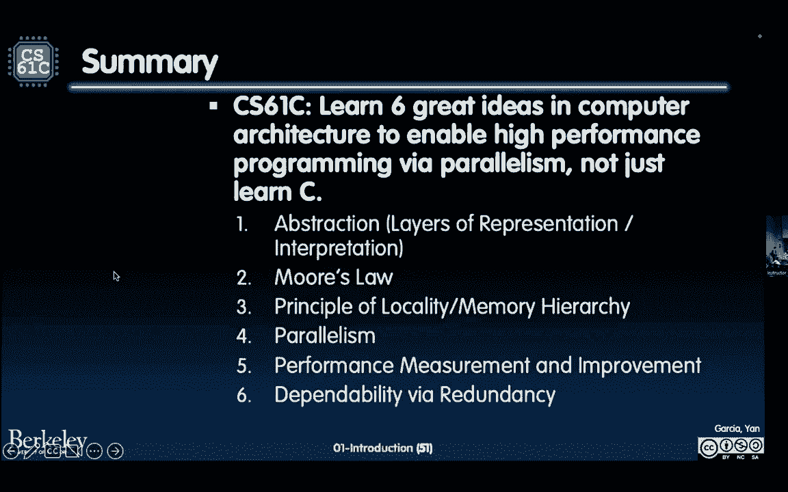