# 🖥️ 课程 P1：计算机体系结构中的伟大思想 - 引言

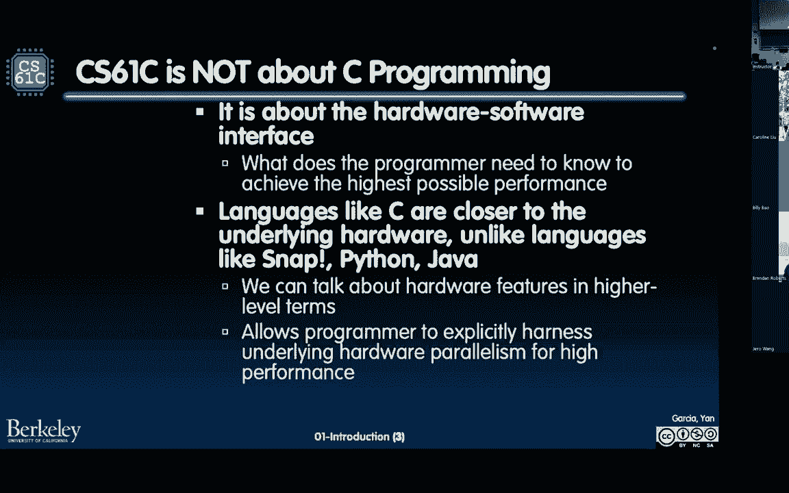

在本节课中，我们将要学习计算机体系结构课程的核心介绍。我们将了解这门课程的目标、涵盖的“伟大思想”，以及课程的基本结构和政策。课程的重点在于理解硬件与软件之间的接口，以及现代计算系统（从个人电脑到数据中心）是如何工作的。

---

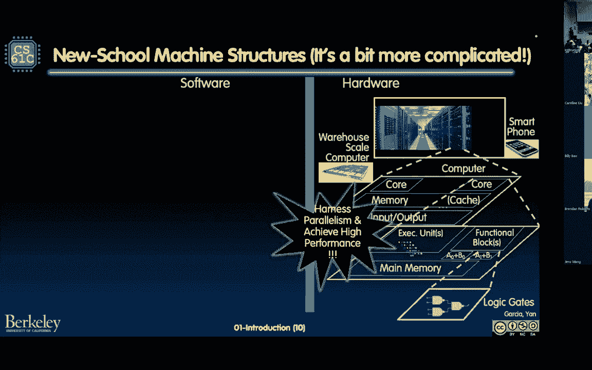

## 📰 从一则趣闻开始

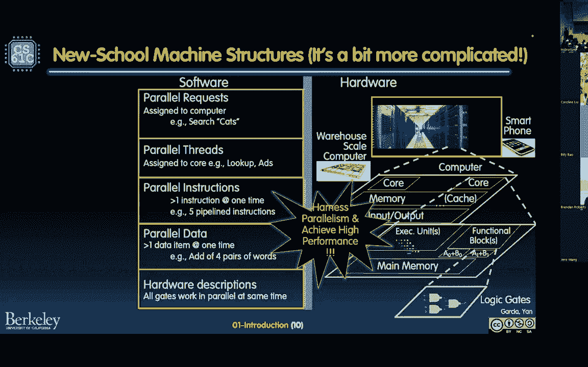

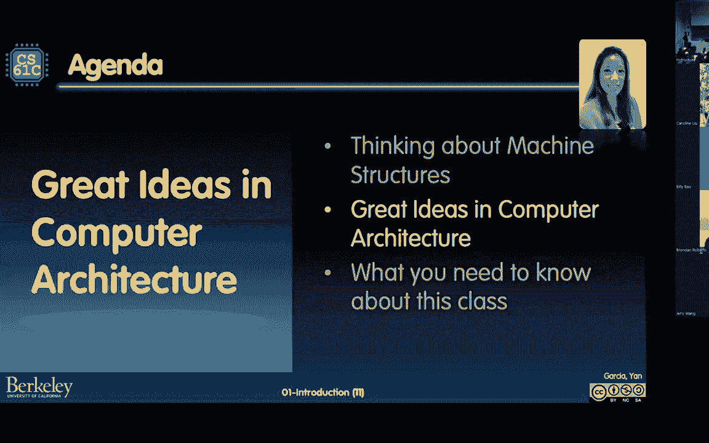

课程从一个有趣的新闻开始：珍妮特·杰克逊的某首歌曲中，特定的声音频率可能导致某些型号的笔记本电脑崩溃。这个例子生动地说明了软件（音频文件）与硬件（笔记本电脑）之间存在着意想不到的交互。

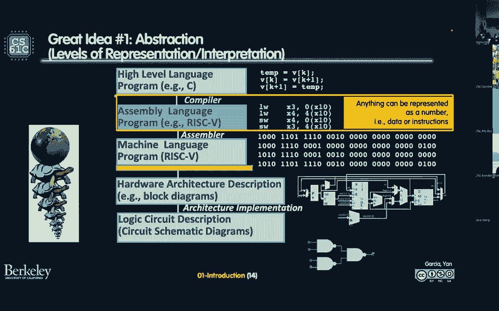

---

## 🎯 课程核心：硬件/软件接口

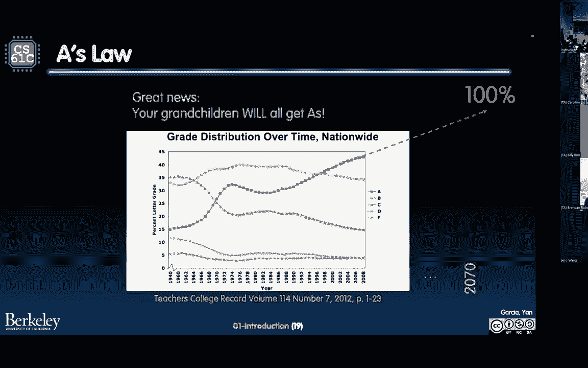

上一节我们从一个趣闻引入了硬件与软件的交互，本节中我们来看看这门课的核心主题。

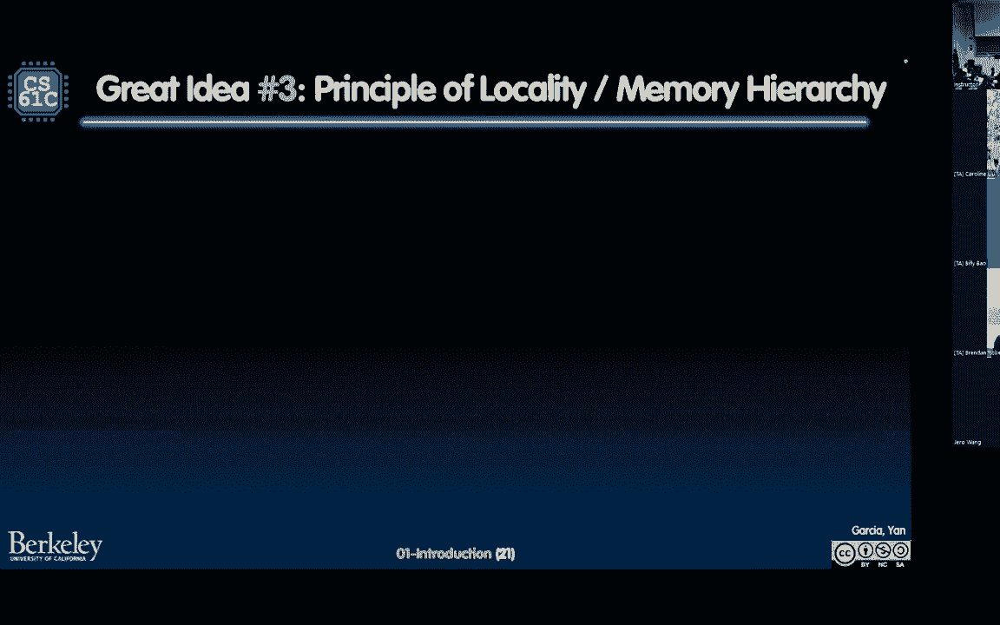

这门课的名称是“计算机体系结构中的伟大思想”，也称为“机器结构”。它**并非**一门单纯的C语言教学课程。

*   一切的核心在于奇妙的**硬件/软件接口**。
*   我们研究计算机如何工作，且不限于单台计算机，还包括数据中心的实际工作方式。
*   我们使用C语言教学，是因为它比Python等语言更接近底层硬件（更接近“硅”）。
*   课程目标是让你理解从高层应用（如C程序）到底层晶体管运作的完整链条。

---

## 🏗️ 全景视角：从单机到并行世界

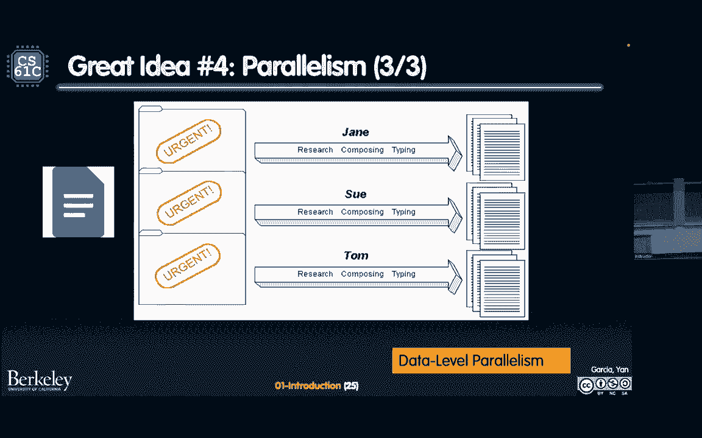

传统的计算机体系结构课程只关注单线程、单进程的计算机。本课程则采用更宏大的视角。

*   **旧视角（单机）**：关注单个CPU核心、单一线程的执行过程。
*   **新视角（全景）**：我们研究仓库规模的计算硬件，包括：
    *   多核服务器
    *   多级缓存（Cache）
    *   输入/输出设备
*   你将学习如何**设计**CPU，而不仅仅是编程。从最底层的逻辑门开始，自底向上地理解整个系统。
*   课程将探索**五种不同层次的并行性**来提升性能：
    1.  请求级并行
    2.  线程级并行
    3.  指令级并行
    4.  数据级并行
    5.  硬件描述并行

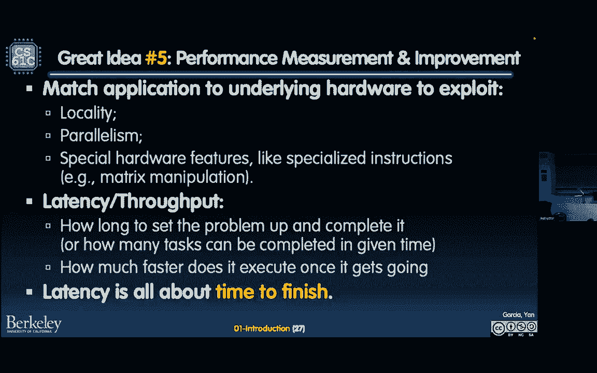

---

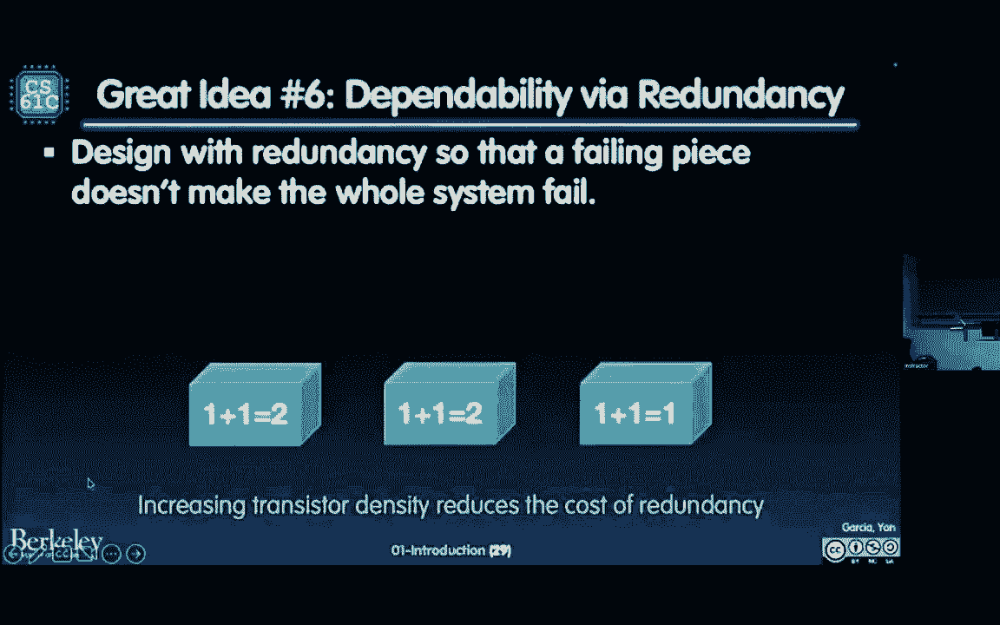

## 💡 六大“伟大思想”

以下是本课程将贯穿始终的六个核心思想，我们将在第一节课中初步介绍它们。

### 思想一：抽象

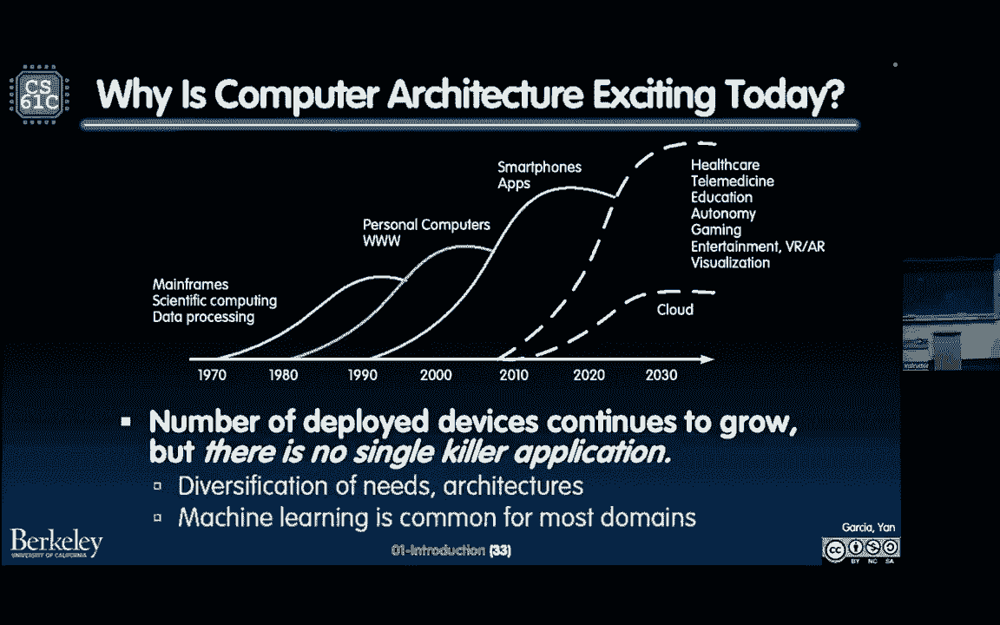

抽象是计算中的基本思想，在硬件中同样存在。我们将频繁使用的一个关键抽象是：**一切都可以用数字位（0和1）来表示**。

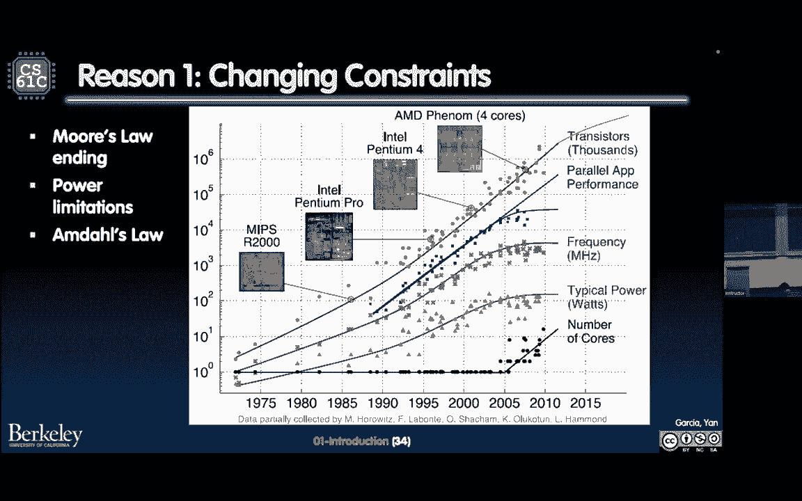

### 思想二：摩尔定律

摩尔定律由戈登·摩尔提出，预测集成电路上可容纳的晶体管数量约每两年增加一倍。这一定律驱动了计算性能的指数级增长和成本下降，但大约在2005年后，这种增长速度已经放缓。

**公式**：晶体管数量 ~ \( 2^{(年份-1970)/2} \)

### 思想三：局部性原则

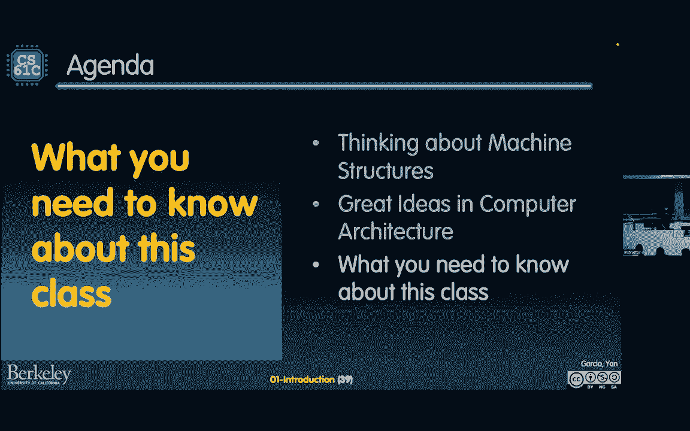

程序倾向于重复使用最近使用过的数据和指令。这类似于从大脑回忆（快） versus 去办公室取东西（慢） versus 去另一个城市取东西（更慢）。

*   在计算机中，访问不同层级存储的速度差异巨大：
    *   寄存器：~1 纳秒
    *   缓存：~2 纳秒
    *   主存：~100 纳秒
    *   磁盘：~10,000,000 纳秒
*   存储层次结构（金字塔）体现了这一原则：越往上，速度越快、容量越小、成本越高。

### 思想四：并行

通过同时执行多个操作来提升性能。我们主要学习三种并行：
1.  **指令级并行**：CPU同时处理多条指令的不同阶段（取指、解码、执行）。
2.  **线程级并行**：多个线程同时执行不同的任务。
3.  **数据级并行**：将同一操作应用于大量数据的不同部分（如多个小组成员分工处理数据）。

**阿姆达尔定律**指出，并行带来的加速受限于程序中必须顺序执行的部分。
**公式**：\( Speedup \leq \frac{1}{(1 - P) + \frac{P}{N}} \)，其中P为可并行部分比例，N为处理器数量。

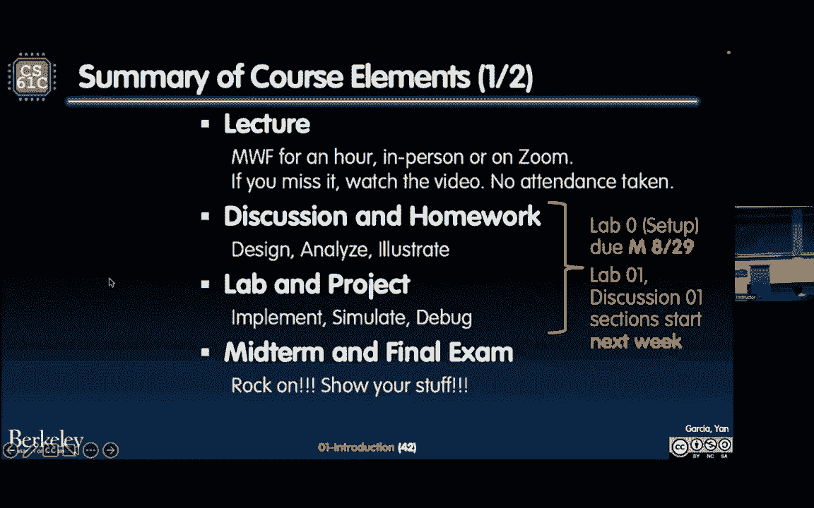

### 思想五：性能度量与改进

我们聚焦于两个关键的、可衡量的性能指标：
1.  **延迟**：从开始任务到完成任务所花费的时间。
2.  **吞吐量**：单位时间内完成的工作量。
课程将围绕这些指标进行权衡和优化。

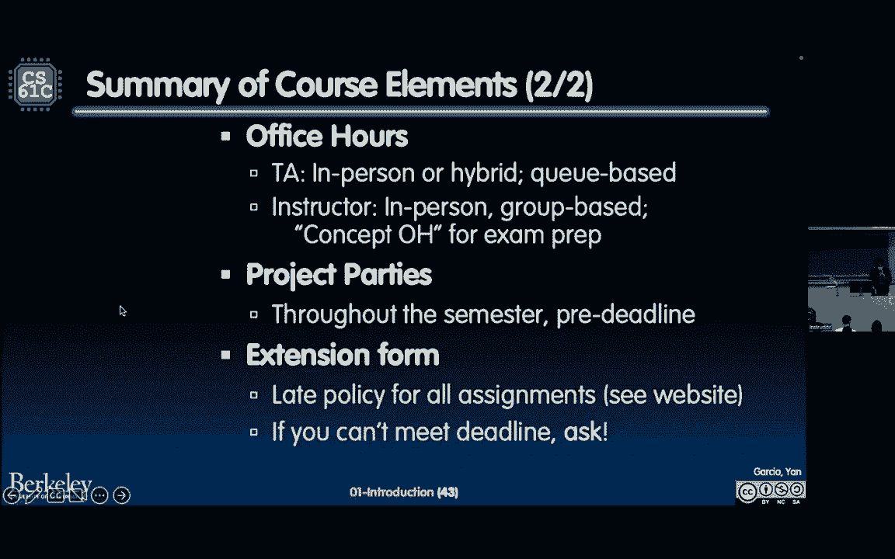

### 思想六：通过冗余实现可靠性

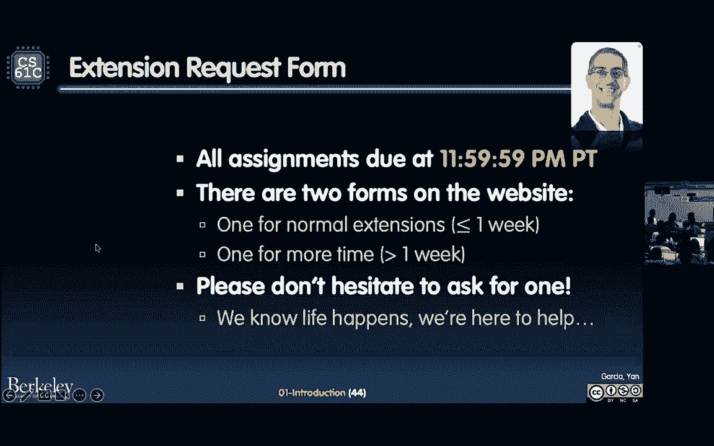

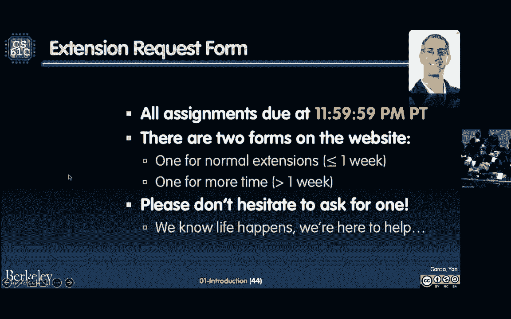

系统组件可能随机失效（如宇宙射线导致比特翻转）。通过引入冗余组件，即使部分失效，系统也能保持正确运行。

*   **示例**：
    *   **数据中心冗余**：在不同地理位置备份数据。
    *   **磁盘冗余**：使用RAID技术。
    *   **内存冗余**：使用纠错码。

---

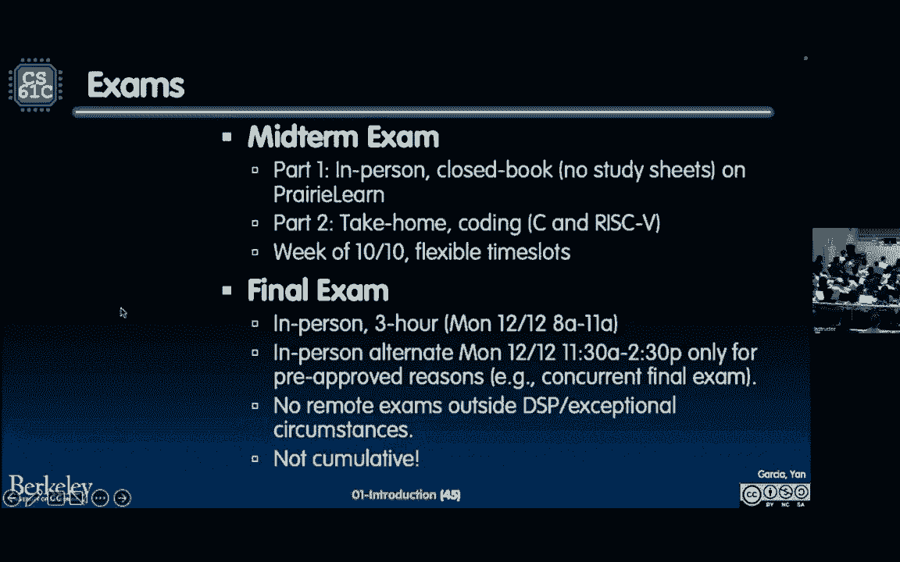

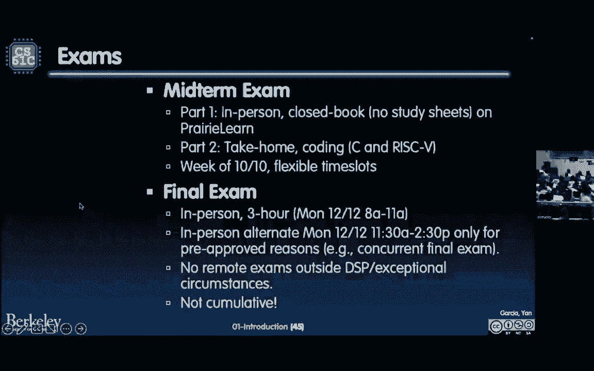

## 🚀 为什么计算机体系结构在今天依然令人兴奋？

主要有三个原因：
1.  **摩尔定律的放缓**：晶体管数量指数增长趋缓，推动我们通过增加核心数、利用并行性等新方法来提升性能。
2.  **功耗墙**：芯片功耗成为性能提升的主要限制。
3.  **领域特定计算**：不同应用（如图形处理、机器学习）需要不同的硬件架构（如GPU、NPU），导致异构计算系统的兴起。

**传统智慧**是设计通用架构。**新趋势**是设计针对特定领域优化的架构，例如谷歌的TPU用于神经网络训练。

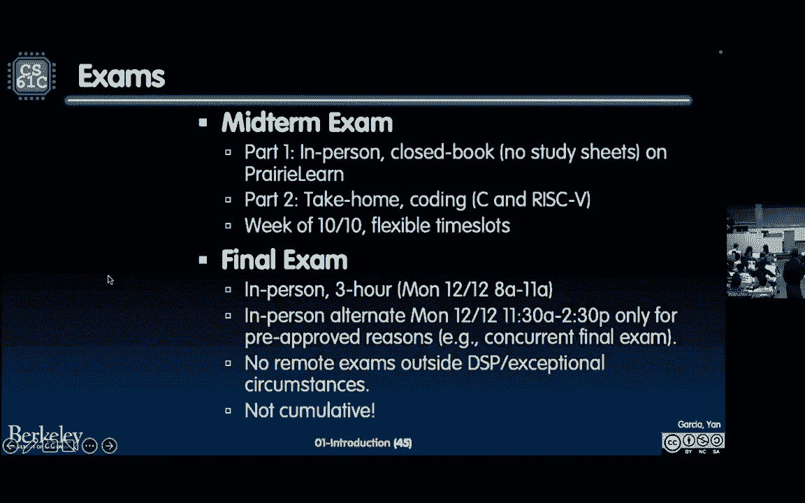

---

## 🏫 伯克利的贡献与课程信息

大卫·帕特森和约翰·轩尼诗因其在精简指令集和并行计算方面的贡献获得图灵奖。他们的思想（如RISC-V架构）深刻影响了现代计算机设计。

以下是关于本课程你需要知道的信息：

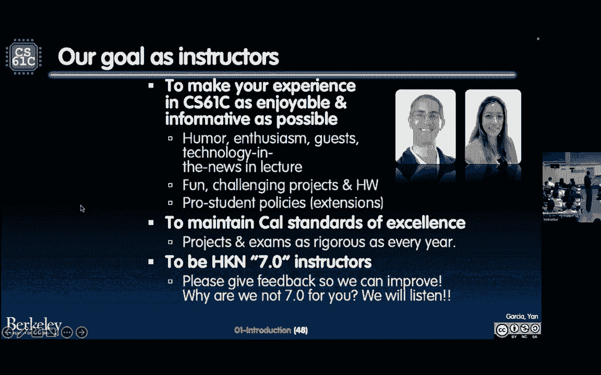

### 课程组成部分
*   **讲座**：每周三次，现场参与或观看录像。
*   **讨论与作业**：讨论课讲解概念，作业通过Prairie平台提交。
*   **实验与项目**：动手进行设计、编程和调试。
*   **考试**：两次期中考试（形式新颖，部分带回家完成）和一次非累积性的期末考试。

### 支持与政策
*   **Ed Stem论坛**：课程主要交流平台，用于通知、问答。
*   **办公时间**：由助教和导师提供，分为概念答疑和作业帮助。
*   **延期申请**：通过专用表格申请，课程团队理解并支持学生平衡学习与生活。
*   **评分目标**：课程目标是让所有努力的学生都能成功，不设固定比例曲线。
*   **学术诚信**：严禁作弊、抄袭、不当合作。违反者将面临严厉处罚。鼓励通过正当渠道（如申请延期、寻求帮助）应对困难。

---

## 📚 总结

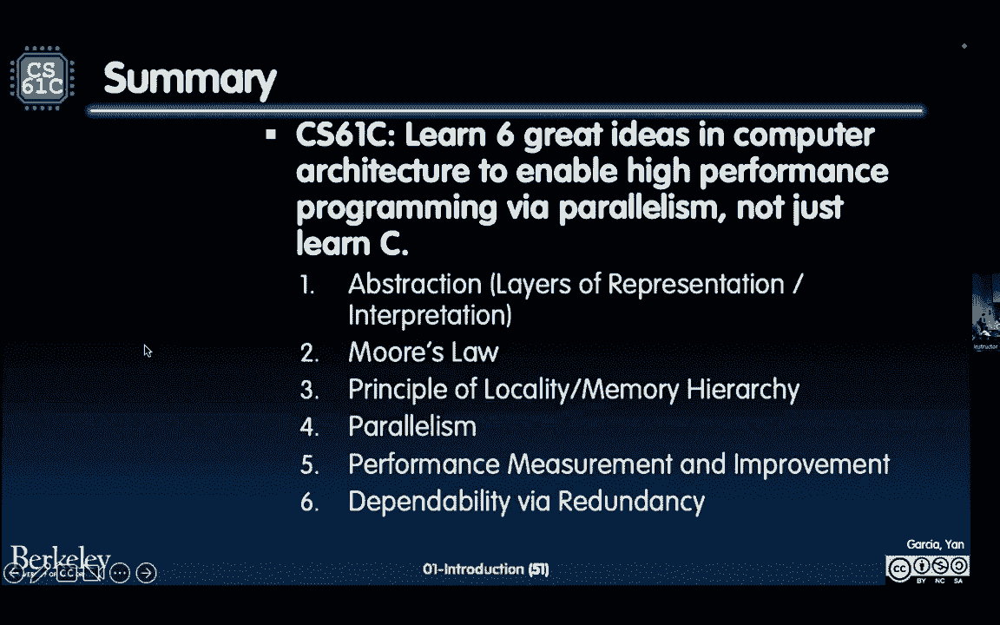

本节课我们一起学习了计算机体系结构课程的概览。我们了解了课程的核心是探索硬件与软件之间的接口，并初步认识了贯穿本课程的六大“伟大思想”：抽象、摩尔定律、局部性、并行、性能度量和通过冗余实现可靠性。我们还了解了课程的基本结构、支持政策以及学术诚信的重要性。希望你能对这门探索计算机如何从底层运作的精彩课程充满期待！