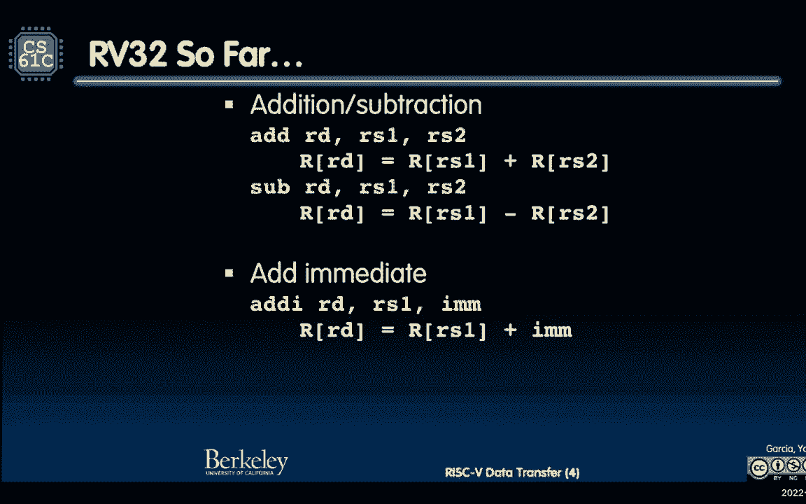
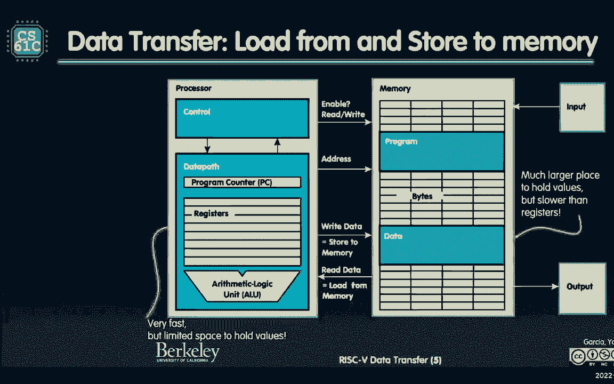
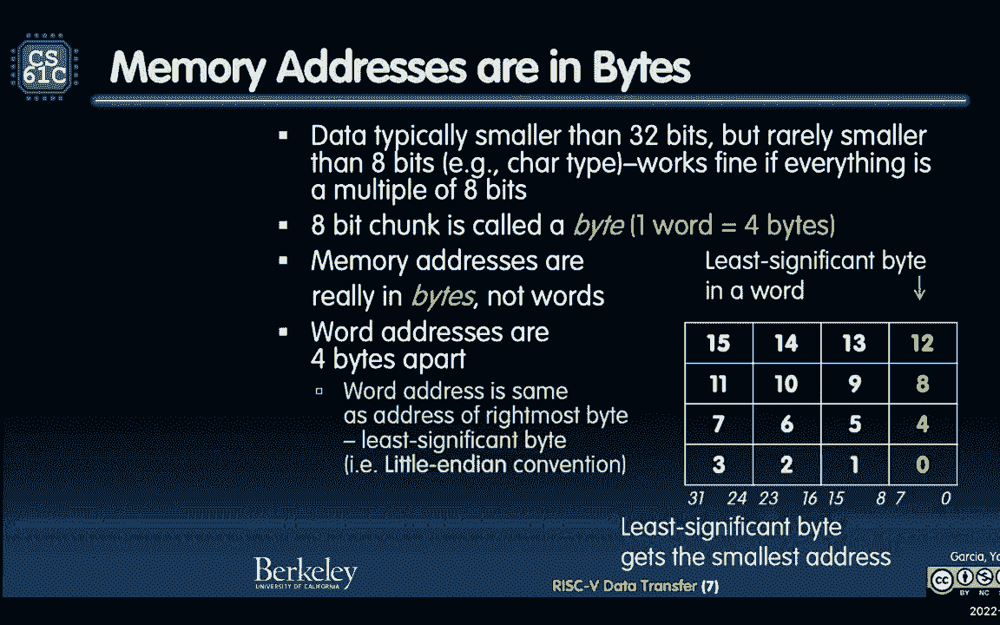
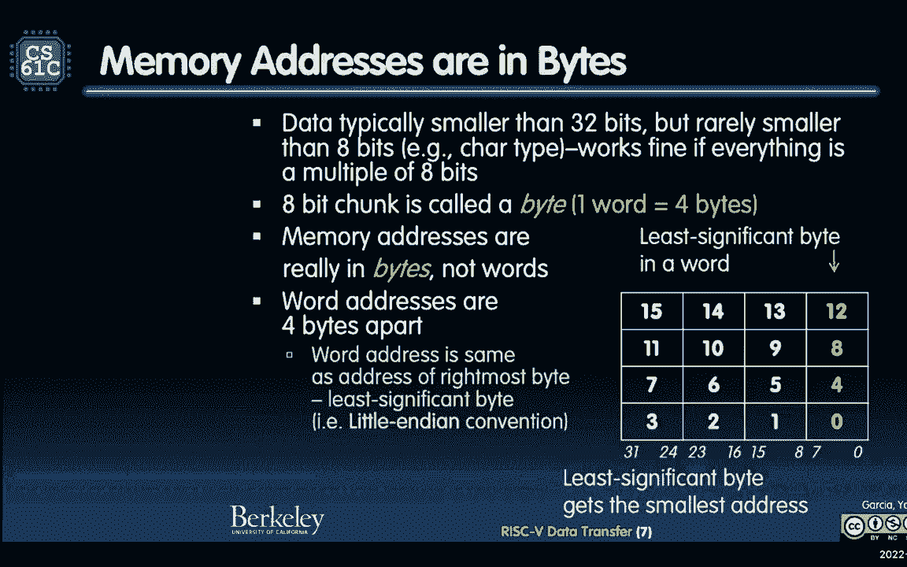
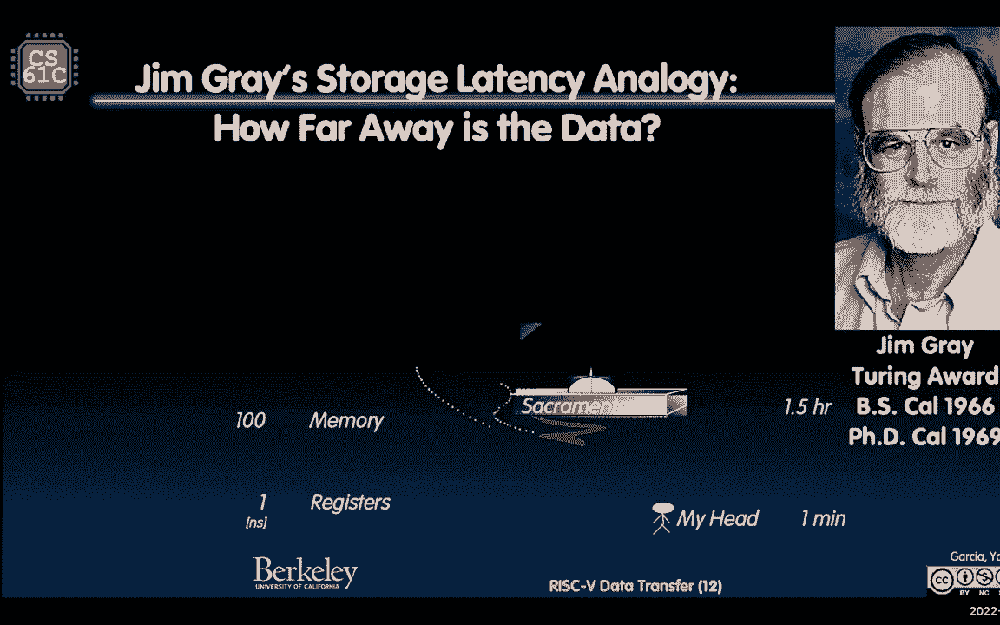
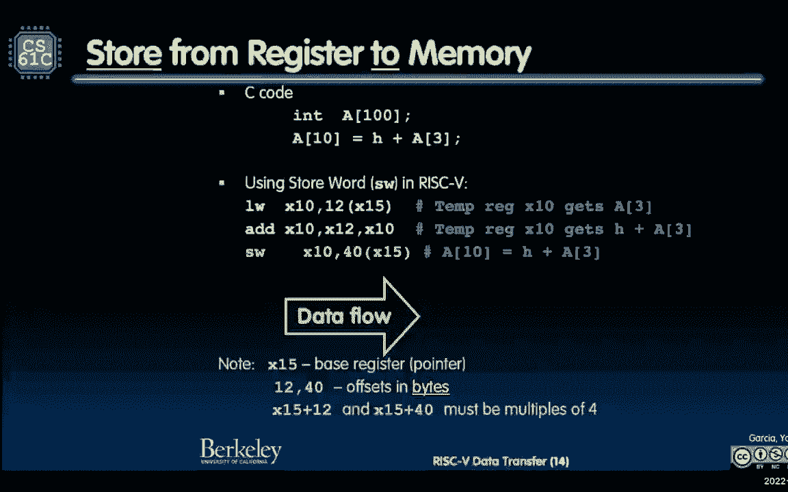
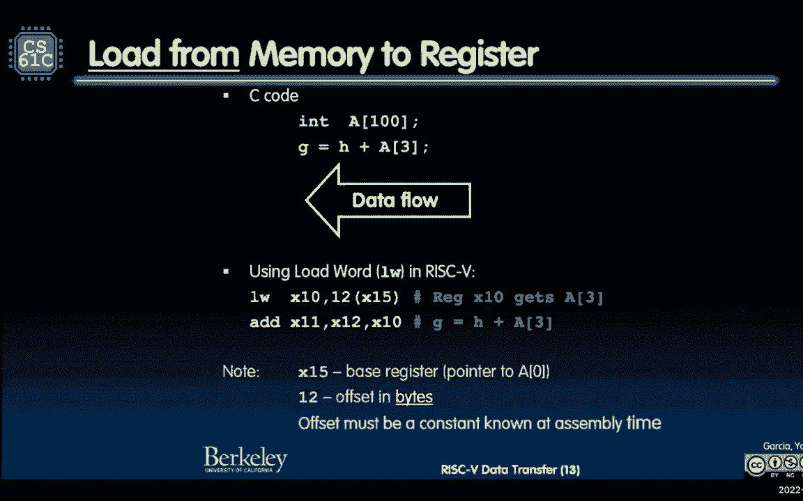
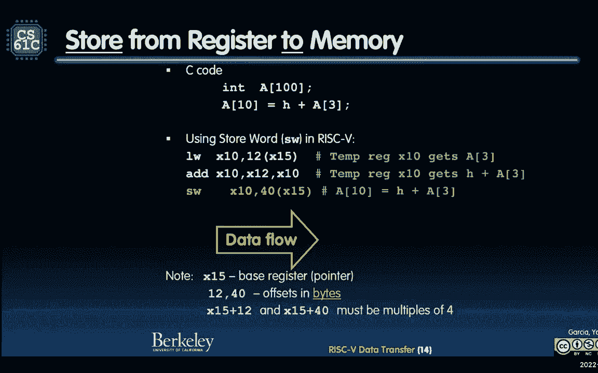
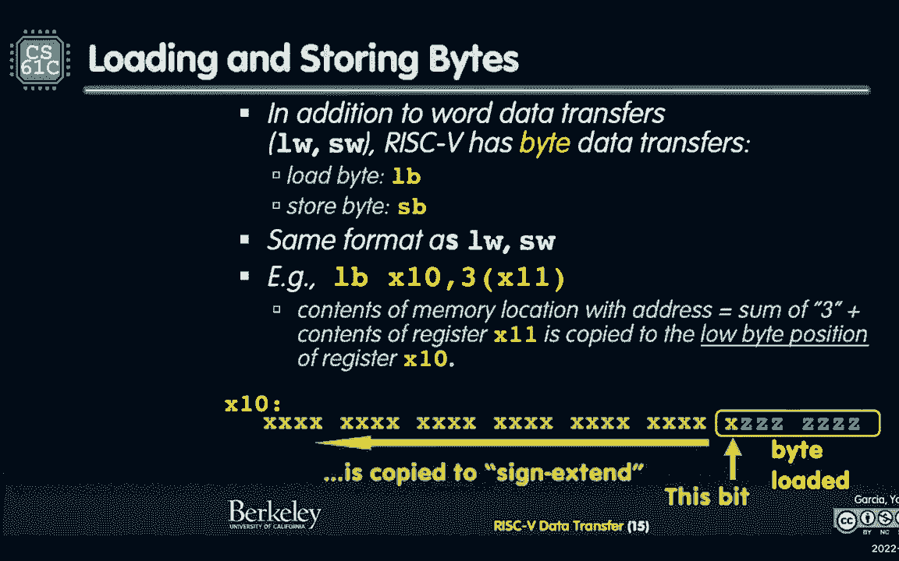

# 课程 P10：Lecture 8：RISC-V 数据传输 🚚

在本节课中，我们将要学习 RISC-V 架构中数据如何在 CPU 和内存之间传输。我们将介绍加载和存储指令，理解字节寻址与字对齐的概念，并探讨大端序与小端序的区别。

---

## 课程概述

本节课的核心是理解 RISC-V 的数据传输指令。我们将从计算机的基本结构开始，明确 CPU、寄存器和内存的角色。然后，我们将深入学习 `lw`（加载字）、`sw`（存储字）等指令的格式与用法，并解释在处理不同数据类型（如字节）时需要注意的细节。

---





## 计算机的基本结构 🧠

上一节我们介绍了课程的整体目标，本节中我们来看看计算机的基本组成部分，这对于理解数据传输至关重要。

我们有一个处理器（CPU），它包含控制单元和数据通路。程序计数器（PC）指示当前正在执行哪条指令。我们还有一组寄存器，它们数量有限但访问速度极快。算术逻辑单元（ALU）负责执行加、减等运算。所有这些部件共同构成了 CPU，也就是我们计算机的“大脑”。

与 CPU 紧密相连的是寄存器，它是我们的“家”，数据在这里处理速度最快。而内存则像是“外围”的仓库，容量更大但访问速度较慢。这种将程序和数据存储在同一内存中的思想，被称为“存储程序概念”，是计算机体系结构的一大核心思想。


内存可以被抽象地看作一个很长的字节数组。CPU 作为主动方，可以“加载”（从内存读）数据到寄存器，或“存储”（从寄存器写）数据到内存。

---

## 内存中的数据表示 🔢

上一节我们了解了内存的抽象概念，本节中我们来看看数据在内存中是如何具体排列的。




内存是**字节寻址**的，这意味着每个内存地址对应一个字节（8位）。一个字（word，在 RISC-V 中是 4 字节）的地址是其最低有效字节（最右边字节）的地址，这种约定称为**小端序**。

例如，假设我们有一个字 `0xdeadbeef` 存储在内存中。在小端序系统中，它在内存中的字节排列（从低地址到高地址）是 `ef`, `be`, `ad`, `de`。这种表示方式使得当我们按字节查看内存内容时，数值的书写顺序（从左到右是高位到低位）与内存中的物理顺序（从右到左是低位到高位）是相反的。

理解这种表示法对于后续正确使用加载和存储指令非常重要。

---

## 大端序与小端序 🥚

上一节我们接触了小端序，本节中我们系统地了解一下字节序的两种方式：大端序与小端序。



*   **小端序**：最低有效字节存储在最低的内存地址（“小端”开头）。
*   **大端序**：最高有效字节存储在最低的内存地址（“大端”开头）。

RISC-V 采用小端序。这意味着，当我们将一个寄存器中的字存入内存，再按字节加载回来时，数据在小端序机器上的表现是直观的。不同架构可能选择不同的字节序，因此在编写可移植代码时需要特别注意。


---


## RISC-V 数据传输指令 ⚙️


上一节我们讨论了数据表示，本节中我们正式学习 RISC-V 中用于数据传输的具体指令。



RISC-V 指令是固定的 32 位长度。这意味着指令的操作码、寄存器索引和立即数都必须编码在这 32 位中，因此寄存器的数量（5位索引，共32个）和立即数的大小都受到限制。

数据传输指令主要有加载和存储两类。

### 加载指令

加载指令用于将数据从内存读入寄存器。其基本格式为：
```
lw rd, offset(rs1)
```
其中：
*   `lw` 表示“加载字”（Load Word）。
*   `rd` 是目标寄存器，用于存放从内存读出的数据。
*   `offset` 是一个立即数偏移量。
*   `rs1` 是基址寄存器，其值加上偏移量构成有效内存地址。

数据流方向是：从内存（由 `rs1 + offset` 计算出的地址）读取数据，放入 `rd` 寄存器。

**示例**：假设 `x15` 寄存器保存了一个数组的起始地址。要访问该数组的第 3 个元素（每个元素占 4 字节），可以使用：
```
lw x10, 12(x15)
```
因为第3个元素的字节偏移量是 `3 * 4 = 12`。

### 存储指令


存储指令用于将寄存器中的数据写入内存。其基本格式为：
```
sw rs2, offset(rs1)
```
其中：
*   `sw` 表示“存储字”（Store Word）。
*   `rs2` 是源寄存器，其值将被写入内存。
*   `offset` 是一个立即数偏移量。
*   `rs1` 是基址寄存器。

数据流方向是：将 `rs2` 寄存器中的数据，写入到内存（由 `rs1 + offset` 计算出的地址）。请注意，其语法与加载指令相似，但语义相反。

**示例**：将寄存器 `x10` 的值存入数组（基址在 `x15`）的第 10 个元素位置：
```
sw x10, 40(x15)
```
因为第10个元素的字节偏移量是 `10 * 4 = 40`。


---







## 字节加载与存储 🔤

上一节我们学习了字（4字节）的传输，本节中我们看看如何处理单个字节。


RISC-V 提供了加载字节和存储字节的指令：
*   `lb`：加载字节（Load Byte），将内存中的一个字节读入寄存器，并进行**符号扩展**（用该字节的最高位填充目标寄存器的高24位）。
*   `lbu`：加载无符号字节（Load Byte Unsigned），将内存中的一个字节读入寄存器，并进行**零扩展**（用0填充目标寄存器的高24位）。
*   `sb`：存储字节（Store Byte），将寄存器的最低8位存入内存的指定地址。


**示例**：考虑内存中有一个字节值为 `0x93`（二进制 `1001 0011`）。
*   执行 `lb` 后，寄存器会得到 `0xffffff93`（负数）。
*   执行 `lbu` 后，寄存器会得到 `0x00000093`（正数）。



这对于处理字符数组（`char`）或有符号/无符号字节数据至关重要。

---

## 字对齐要求 📐



使用 `lw` 和 `sw` 指令时，访问的内存地址必须是**字对齐**的，即地址是 4 的倍数。基址寄存器 (`rs1`) 的值和偏移量 (`offset`) 之和也应该是 4 的倍数。非对齐访问可能导致性能下降或硬件异常。

然而，`lb`、`lbu` 和 `sb` 指令用于字节访问，没有对齐限制，可以访问任意地址。

---

## 总结


本节课中我们一起学习了 RISC-V 架构中数据传输的核心知识。

我们首先回顾了计算机的基本结构，明确了 CPU、寄存器和内存的分工与性能差异。接着，我们深入探讨了内存的字节寻址方式和小端序表示法。课程的重点是 RISC-V 的数据传输指令：`lw`（加载字）和 `sw`（存储字）的格式、语义及使用场景。我们还学习了用于处理字节数据的 `lb`、`lbu` 和 `sb` 指令，并理解了符号扩展与零扩展的区别。最后，我们强调了字对齐访问的重要性。


理解这些指令是编写高效汇编程序和控制数据在计算机层次结构中流动的基础。下一节课，我们将继续深入探讨更多指令类型和编程技巧。