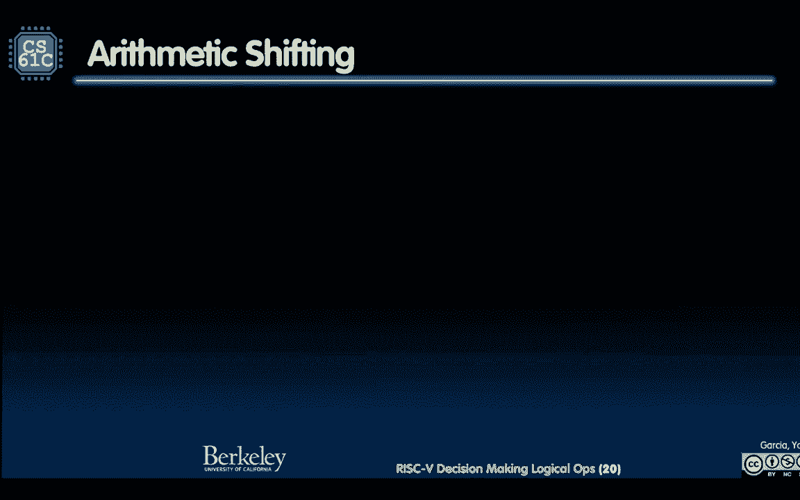

# P12：Lecture 9： RISC-V Decision Making Logic Ops - 这样好__ - BV1s7421T7XR

我更喜欢开车，很高兴参加，如果你必须有一个，这是新新闻中的计算，是在上课之前，我会有研究人员使用的第一个字母，德国马克斯的科学家，普朗克大脑研究所使用ml算法分析了三种，六百只鼹鼠在七个群体中鸣叫。

识别每个完整说唱的独特声音特征，以及每个日历的相同方言，看看这个，多种族项目希望决定抹香鲸的交流，通过ml专家的努力，海洋生物学家，机器人学家，语言学家和密码学家，该项目将包括记录鲸鱼的声音和动作。

水下麦克风，机器鱼和声学标签，你看，它起来了吗，迪斯尼起来了，狗有一点，我们可能会到这样的地步，有狗带着你狗身上的小东西，实际上说出他们所做的，我们才刚刚开始，这很令人兴奋，我也很令人兴奋，东西，松鼠。

开始了好的，女士们先生们，欢迎来到cs621c讲座，九险五，决策与逻辑运算，爸爸，你们一直都在这里。

我们上次看到什么是字节可寻址的，我们知道，在你认为内存是一个大数组字节可寻址之前，但你要访问的东西是，通常，当您索引，整数，浮动，那些，好啦，加载字和存储字使用的指针，呃，最好是4的倍数。

如果你在阅读和写作单词，我们谈过了，我们可以对它进行加减，所以你有一个基地址指针，它前面有常量，在它的背后，挺酷的，我们讨论了大印度人和小印度人，我们看到了五种新的读写记忆指令，什么也很酷。

你还记得CPU的咒语吗，你还记得中央处理器吗，我想出了一个新的咒语，CPU你，你是CPU，得到一个CPU，你是CPU，这就是为什么你认为这是一个非常以CPU为中心的对话，主的门，从我是CPU。

我推推搡搡，我不是记忆，如果我记得，全都倒过来了，你是CPU，获取要从。

好啦，这就是我所看到的，我会检讨决策。

这是我们今天学到的新东西，我们得做决定，我们必须使我们的程序智能化，使我们的程序智能化，你得做出选择，如果是这个做那个，你看到了ml算法，那肯定是一千亿，如果考虑神经网络中所有编码成数字的情况。

到目前为止我们已经看到了，加和减，我们已经看到了一些即时的加I，你也看到了五个装载和储存。

所有这些都是新的，所以决策，所以根据计算，做点不同的事，这个核心是一般的，if语句，是if语句吗，就是这样，如何将if语句编码为风险五，你在那里是这样做的，它是，这是你的假设声明，B q代表分支。

如果相等，则寄存器一寄存器二标签，你第一次在标签前看到这些东西，你可能看到过一个标签，如果你以前见过任何风险五代码，它只是一个小标签，你实际上可以有C中的标签，我们不推荐，但是你可以有C中的标签。

所以这一切都表明，有一个无形的标签，这个标签上写着标签名称冒号，如果你手上的两个寄存器，BQ是平等的控制，现在将移动到此分支相等之后的下一条指令，如果他们是平等的，转到标记为r 1的语句。

所以如果它们相等，去那里，仅此而已，如果相等就去，上面说的就是这些，如果相等，如果这里的寄存器R中的值是寄存器1的，寄存器2中的双等于值，如果不是，你说得好，如果不是，如果不是，你就当什么都没发生过。

你进入下一个语句，你总是要下一个声明，正常正常，一切都转到下一个声明，去下一个是你第一次喜欢，喔喔，喔喔，喔慢点，让我们检查一下，我可能想去那边，好的或者往下走或者往上走之类的，好啦，原来是这么回事。

如果不平等，我们也有B E分支，今天之前你第一次学希腊语，你知道5分钟前你还像个，现在那是什么，你知道的，相等的Eq分支，去那里，如果是，b和e表示分支，如果不相等，挺好的，对了，顺便说一句，好处之一。

我只是在想人们，如果你在变焦，哈喽，每个人，我们有很大的演讲空间，但实际上，上课的学生这么少的好处是，六英尺距离，所以我们实际上在保持Covid方面做得很好。

六英尺距离，只是为了让这里一切都好，我们去这样的分支，你想的分支变成了流和分支，我在搬家，我在这里分支，我好想树上的树枝，啊，我本来想这样或者这样拿一根树枝，我在走两条路，条件分支。

所以我们看到了b q b e，你还必须能够比较事物，所以你需要有小于的分支，我有BLT。

看那个，我已经饿了，我站在你和午餐之间。

那件事我很抱歉，我说过了，我在上面涂了又涂，烤得不错，突然之间，发牢骚，发牢骚，向右抱怨，好啦，BLT，你还会有大分店，如果大于或等于，所以BT和BG，现在我已经告诉你了，其中四个你会用同样的想法。

同样的想法，你有两个寄存器，但现在你要看着我，但是丹你有一点，没有类型，没有与风险五相关的类型，我如何知道这些位代表的是无符号数还是有符号数，不要，我在乎，所有1对所有0，哪个更大，所有的都是对的。

你认为所有的人，除非他们签了字，或者所有的都是负的，所有的零都意味着零，现在0变大了，所以你必须，如果你要给我啤酒，你得给我啤酒，你得告诉我我是没签名还是签名，因为它们只是碎片，如果你要有大。

你最好给我一二三，你，以为我给你，啊，顺便说一句，这也是最后一个，就像，你知道的，忘了什么，我不想要它，到那边去，去那边就叫去，我们叫它跳，你就跳过去吧，我不在乎，发生什么事了？

只是跳什么跳跳那是隐藏的游戏，是跳跳，我可以说，跳，至少，那首歌是什么来着？我不知道，现在是90年代，我知道音乐是什么跳，所以现在我给你，这是这一页，B n e c b g e b n，那是两个。

B T B G是四，BTU BG是6，跳跃是七，就是这样，仅此而已，仅此而已，在决策中。

很高兴看到我们如何使用这些，所以说，让我们说，让我们花点时间看一个例子，好吧，我们来举个例子，我得到了一些变量的赋值，F、g、h、i、j和一些x寄存器，仪表由十指定，十一十二十三十四，我得到了一段代码。

如果i=j f=g加h，现在看我在这里要做什么，我要用这个代码建立一个连接，你要说等等，为什么我要拿平等的，为什么我说B和E，让我们来看看这口井的逻辑，事实证明，当我看到双等于时，我经常。

我要你做的第一件事，我告诉过你是比尼，没告诉你，B当量，我想让你想想对不起，我没有告诉你，先烧烤，B、b和e，双等于b和e y，让我们看看这个，我们走吧，如果i是j，我要你这么做。

但你怎么能接触到这个东西，如果他们是一样的，去别的地方，但我想把这个广告放在树枝的正下方，所以我要做的是翻转，我否定这个案子，我是说看树枝，如果他们不平等，每次翻转，它翻过来了，所以说。

而不是说三个相等说，如果他们不平等，然后过去，我无论如何都要做的事，如果让我们再试一次，所以与其说这是在这里，如果这不是，从逻辑上讲，如果它是相同的，那么说它要容易得多，如果我做这个做这个广告。

我真正想做的是，把广告放在正下方，不管我在做什么测试，但我所能做的，这是走开，所以我要说看，如果他们不平等，离开我想做的事，如果是这样，我就翻转这个案子了，而不是成为B，e q i会写a b和e。

当他们不平等的时候，我去出口，就在广告的正下方，现在我只做广告，当他们一二三相等时，有道理，那有点酷，所以你认为双等号，你说呢，一二三b n e w等于b和e，好啦，我看到一个问题，给我一个名字。

它总是给一个指令，否，你跳到你的树枝上，你想去哪里就去哪里，你可以在你上面分支，在你下面，我只分出两个，是呀，出口有多远，嗯，在这种情况下，我只想在这种情况下，如果让我们看看这种情况，如果只有一条指令。

如果我有一个，如果身体里有很多东西，如果顺便说一句，顺便说一句，我要给你看，这是不好的形式，形式不好，你得有花括号，这是老派的C，这只是我想保存幻灯片上的一些字符，但我真的应该告诉你正确的，其中每一个。

如果你想有花括号，为什么谁知道为什么，顺便说一下，谁知道为什么告诉我，完全正确，我说大声一点，如果没有带，如果所有的如果只是做一个指令，我再说一遍，一条指令，所以你在你的C代码中。

你说如果没有花括号对吗，你说我也很酷，我在挖蟒蛇，对呀，所以我写如果没有花括号，然后你有一个缩进的广告，然后在代码中缩进和缩进减法，和缩进函数调用，你说哟，因为它们是凹进去的，因为我在蟒蛇，缩进不不。

如果我们说没有花括号，你得到一个指令，我只做一个，不是所有的不是，就因为你把它缩进了，不是蟒蛇，发明没有语义意义，所以你认为你在读你的C，你就像，哦，像他们都缩进，我在监狱里要做的四件事。

它只做其中一个，即使看起来是对的，那是你要自己制造的虫子，所以你应该一直这样做，如果你说什么，花括号，好啦，所以我应该在这里加上花括号，好啦，有时还好，所以回到问题上来，我的出口还有多远？

它是你想在你的，如果我想做20件事，在我离开前20行，我可以再分出20个人，好啦，你将要看到的一件事，那真是令人着迷，每条指令都将被分成三个二位，所以现在你在想，三二位等我，我得说明这是一个分支。

我的寄存器有五个位，左边的寄存器有五个位，另一个寄存器5个5位，然后一些标签在哪里的编码，所以这个标签不能是任何数字，就像，天下没有免费的午餐，我得到了三个两个比特，得付钱，有些是因为告诉世界。

告诉系统，是树枝，一些人首先决定这将是第一个注册，那是5个比特，有些是2号寄存器，然后这个东西就是剩下的东西，所以不会太远，可以很远，但不会太远，不可能是三点二到三十二，这有道理吗。

因为你需要我的其他部分来做到这一点，我有点落后了，让我稍后再说，只是有点落后，好啦，第二个问题，我们现在开始，我们有一个，如果有的话，更多问题，更多练习，你越看这个，你就像，哦，我明白了，我明白了。

我明白了我们开始吧，我试着用颜色代码，如果我希望这能有所帮助，我试着用颜色代码，所以对于那些从事彩色工作的人来说，顺便说一下，最佳做法，如果你得到了，如果你能做到，拿个药片，彩色小药片。

你可以在它上面做标记，就像我们所有的幻灯片都是提前提供的，如果没有，我们很酷，这项工作没有判断工作，有了讲义，我们有施舍给任何需要的人，我们正在制造，我们做的越来越少了，如果你不接受，那很好。

但最好的练习就在下一张幻灯片的顶部，好啦，所以让我们做吧，我加倍等于，做这个广告，否则，做减法，我们不要翻译了，在这里，我们去分支不平等，让我们做吧，分支不等于其他，好啦，所以现在当他们不平等的时候。

我应该做其他的，你说得对，如果i不等于j，我应该在另一个，所以手表不等于，我甚至会给它贴上标签，我的标签上写着，帮助您从语义上理解正在发生的事情，另一个是减法，如果他们是平等的呢，那么分支就会是假的。

那种比较，他们不是，都是，他们不等于不正确，他们是平等的，所以我不把树枝放在那里，我做我的广告，那是我的，但如果我没有这个j出口，我希望，哎呦，我希望我有一些无条件的东西，穿过潜艇，因为你猜怎么着。

风险五的工作方式，你只要做下一个指令，除非你告诉我，否则，我每次都在做下一个，试着移除这个杰伊出口，会发生什么，它是做什么的，它做广告，它不会减去，很明显你不想，你想要一个或另一个，所以你得跳来跳去。

跳来跳去，跳来跳去，你得绕着精灵跳，让我们停下来提问，这是一张很好的幻灯片，我现在如何使用这个的感觉，你知道怎么分叉，为什么你过去常常，理论上你很自在，我想我可以说这里有一个考试。

我会给你一些简单的事件，你可以让它发生，我想在这一点上你明白了，不太难，但这是一种新的思维方式，这真的是一种新的思维方式，好啦，全新的思维方式，和p，我又犯了错误，没有花括号，再次记住，我要一直说下去。

那是一个糟糕的幻灯片，从最佳做法的角度来看，在then大小写周围的花括号和在else大小写上的花括号，我们之前说过的问题，是啊，是啊，背后碾压，是啊，是啊，告诉我你的名字，现在你真的写了。

你真的把它写在风险五中，这是有效的风险五，那些标签太棒了，顺便说一句，你可以用C来标记，只是C的，我们通常不标记，因为你不会随便跳过去，这是我的问题，请进，没有名字就是一切，那些名字是我起的。

艾尔莎的武断对你来说是有意义的，对你的逻辑有意义，同样的事情，这些名字没什么特别的，就像，就像一个函数调用，给他们留下任何东西，我喜欢它，但是手来了，我爱，这太棒了，是呀，从前面，告诉我你的名字。

斯蒂芬妮，走呀，走呀，这是个很好的问题，这是个很好的问题，我一时不知道我肯定有多少，所以说，让我们确保你和标准英语站在一起，事情会好起来的，但我们应该看看标签的定义，但如果你只有一个词。

但在那里你会没事的，但一定要检查一下，这是个好问题，对于一个能接触到风险的人来说，这是一个很好的问题，五个手册去，去查查，我手头没有，谢谢好问题，那很有趣，那个男孩，这是对安雅的一个很好的问题。

你如何在32位中为标签腾出空间，所以很有趣的是32位没有标签，接下来会发生的是当我们前进并转换，机器代码，这是汇编代码英文，你应该读英语，但是当您从汇编代码转移到C语言时，它比C语言更难阅读。

把复仇者组织起来，组装成机器代码，那时标签就会消失，所以我们要谈谈，还记得我说过c l编译吗，在最后两个组装和链接标签的过程中组装和链接，走开啦，因此，当程序集划线汇编程序将您想要的所有标签。

以确保你不使用任何，不允许贴标签，喜欢关键字，不要用那些，但除此之外，当你把它组装成1和0的时候，那是你翻译的地方，每一个都精确地分成三个二位，然后在这个过程中标签会被移除。

这实际上是在链接过程的组装中，我会说的，这是个好问题，省省吧，我想我想就像四五节课一样，我看到一个关于是的问题，告诉我那种去，这些都是很好的问题，顺便说一下，谢谢你所有的问题，这太棒了。

我不会有多个同名标签，事实上，这将是一个问题，是呀，事实上，他很好，孩子，这是一个很好的，好啦，我不打算去那里，我想去那里，这是个好问题，我告诉过你我们要进行功能分解，其中编译过程有不同的文件名，对。

因为我碰了一个文件来编译那个过程，假设一个函数有foo，顺便说一句，当您调用名为foo的函数时，将调用标签，另一个库中的另一个子例程，谁不知道那个功能也是，现在当你把它们放在一起，它会说你知道吗。

你有两种食物，他们会是一支箭，所以当你编译它的时候，你看，当你说海湾合作委员会的时候，你没有意识到，它在做编译，组装和连接，但在拆掉标签放下的过程中，就像等待，我有两个不酷的东西。

所以提醒我在编译程序集链接课上再问一次这个问题，但问题是，所以不要不要那样做。

但你会知道，但我想我们会在我的伟大问题中给你一个信息，让我们继续前进好吗，所以我们讨论了小于或等于，所以我们得到了分支不太相同的想法，如果注册表1小于retwo，也不知道其中的内容，小于注册表二的内容。

我比大学还少，谈到了那个未签名的，上次我谈到BG B G E U，但没有一个分支大于，没有比你想象的更少的分支了，我不需要，如果我有一个分支比为什么少，我不需要一根更大的树枝，我可以试着拯救所有的东西。

我得处理，我们将要看到的所有指令的总数，每条指令都要花我一些钱，因为我需要说一些话，我在做什么指示，我得到的指示越多，我花的钱就越多，所以我想。

我在冒险，风险代表什么，减少风险的人的风险是多少？

我想要考虑的事情的最小数量，所以我不想要更多的指示，更多的指令意味着我要花更多的钱，因为每条指令都有自己的ID，所以我不想要更多的指示，所以我要在这里救两个，但我怎么做呢，为什么呢？

为什么我能以某种方式编写每个程序，我想在没有bgt和b l e的情况下写作，是啊，是啊，正好相反，只要翻转论点，我比我翻转红色更少，比这更伟大，在你的脑海里你就像，哦，我想做的比。

我没有比翻转这两个论点更伟大的了。

你得到了，好东西好的，所以C中有很多种循环，我们在时间上做得很好，我们真的很准时，我有两个选择题，所以希望我能在最后找到他们，而在其他语言中做野性四，就像打盹和抓挠，你一直重复直到你重复，你得到了永远。

所有这些事情最终都在最低的水平上，你所见过的一切。

从控制流，从字面上看，每个都映射到所有的东西，我刚才给你看的是线以上，在某些语义学中，您可以使任何东西，去找点乐子，语言，JavaScript，抓挠，看右边，Python，加载线路，如果你在冒险。

五件硬件，这就是你得到的，你要跳了，你得到的树枝比树枝少，比不上下面的东西，有点酷，你就像，哇塞，因为每一个都以某种方式被转化为这些东西。

我现在看到当你在VS五个硬件上运行时很酷，那是很酷的东西，每一个都可以重写为另外两个，所以这其实有点有趣，即使在风险五中有多种编写循环的方法，决策的关键是这个条件分支，你只是分支的想法。

当事情发生的时候，是不是小于等于，它等于什么，双等号右，所有这些事情，所以这就是你在这里所看到的关于决策的一切的关键。

我们有更大的麻烦，更大更长的问题，这是20的代码a，Sun is zero int i is zero i小于20i plus，加某个加等于i的a，顺便说一下，这是一种模式，P a t e r n。

谁能说出什么，这个模式的名字是，它就像一个软件，在前门，快进来，给我一个给我这个图案的名字，没人知道图案名，我在对一些，有人在干什么，但它是个动词，给我一个动词，有些人在这段代码中所做的，就像一种进步。

站在它上面十英里，低头看代码，它的尺寸很小，很小，告诉我核心是什么，这个算法的核心是什么，就在那儿左边，我在增加自己，或者我在添加，那我在做什么，我是谁说你给我一个给我，我看到一个，我们说过，高积累。

它在积聚，这是一种积累模式，一种很常见的模式，你等着瞧吧，但是记住这种模式，你等着瞧吧，这就像，哎呦，你知道的，一旦你写了很多代码，你就像，我做过无数次了，是啊，是啊，因为这是一种模式。

你会一遍又一遍地看到这个，写单词积累模式，好啦，现在谁准备好翻译这个了，你猜呢，这需要多少行来吧，只有喜欢是什么，那里有三行代码，没什么来吧，三条线都有风险，五右四，也许五个好吧，让我们看看。

让我们看看怎么样，我做的第一件事，做任何事不，你在努力，只是告诉系统，当您要移动到下一个数组时，我四点就走，这就说明了一切，实际上没有一对一的映射，我们要做的第一件事是记住零的a在哪里。

如果你一定要知道那是什么，八个存储指向数组的指针，让我们假设它，所以X9寄存器9将是我们的事情，那将是一个接一个的移动井，我们从来没有教过你怎么做，我记得加载词，它是一个基本指针和一个恒定的即时指针。

没有我，你不能在里面加"i"，所以我也向你们展示了如何做I，因为我以前没这么做过，现在我向你展示如何做一个i，那么基本指针是什么，我想是割伤了，它是在登记簿上的，八，我们暂存到九号吧，所以顺便说一句。

九个，九会是个临时的人，好啦，所以九现在指向数组的开始，我说从九点开始加载词，它会给我第一个元素，零的A，到目前为止，接下来你必须有一个总数，你得把我的累加器加起来，那将是X十，顺便说一句，看。

我把它弄黄了，所以你们这些正在研究颜色的人，你就像，嘿嘿，它符合，我很高兴，谢谢你，不客气，我需要，我需要一个I，我需要，我需要我的增量变量，好啦，我想知道，当那东西少了，什么时候，什么时候。

它是当它大于二十，所以它从零开始，它将继续上升，到20时停止，所以x11表示，顺便说一下，我真希望我能把灯关小，我希望VSB VSL的人，LLB可以帮我，他们告诉我灯坏了，这样好多了，只是为了。

屏幕上的对比度很好，所以我很抱歉，如果我必须注册，那就太好了，因为不分支我可以比较，记住分支小于右，分支和分支相等，我要做一些比较，我不到二十岁对吧，你得查查这家伙，我在分店不到二十岁。

是不是像分支寄存器常量标签，点个赞，或者你还记得两张幻灯片前的树枝，是树枝，站起来好吗，是分行注册常量标签吗，对那一根树枝竖起大拇指，因为你看，我在检查不到20个，所以我得到了这个，拇指呢？

没有人说什么，拇指朝下，那是什么，语义学的分支是什么，它的分支语法是什么，你在比较，你在比较一个寄存器和一个常量的否，你在比较什么，向另一个寄存器注册，所以这意味着这20个必须坐在收银机里，两个。

这就是我在这里做的，所以我把我的眼睛加载到11，我正在加载我的20个有颜色编码，很好地进入另一个有意义的登记册，所以现在我有20个人在等着我有我的眼睛在等着，我要比较下一个标签循环。

因为这就是我们要去的山顶，哦，我说完了吗，记住我们否定了我们的测试，我不到二十岁，这意味着当它比我少的时候，我就呆在那个循环中，我在循环中，我在循环中，我做得很好，开始吧，我什么时候退出循环。

当它大于或等于，有道理，相反，比我的意思少，当我做完，我在我的循环中，我得跳出来，猜猜我写了什么，就像你写了一些字，编写一些标签来帮助您完成此代码，顺便说一句，自动编译器将写Q17。

但它不知道它不知道什么是英语，但是当你手工创作的时候，风险五，当您执行编译时，编写它的手，然后把它放在一起，用标签是有意义的，有道理，好吧，我们开始吧，我做的第一件事，我得带一个，I。

我要把它放在x12，所以x12是暂时的值，我有很多脚印，顺便说一句，我们在这里讨论的是最小化寄存器，我已经有很多了，我正在用，想想吧，有时候你想再过一次然后说，也许我可以保存一个寄存器，我们以后再谈。

所以我喜欢这个，但是你看，没有，这是我的一个，这是我怎么说的，九的x怎么样，我和你告诉我这将是，我也许我应该把我放在这里，也许我把它，我把x9放在这里，或者一些数字一些，我在哪里，我在哪里谁是我的。

我是x11，我是不是应该把这个词，x 12 x 11 x 9，不应该，顺便说一下，是x 11 x 9，如果我听到自己，我不知道这门课，我想在下一个晚上十一点讲希腊语，好像很好笑。

如果你只是不知道它只是碰巧是一个来访的客人，欢迎欢迎来访的客人，我是希腊人，向美丽的人道歉，好啦，为什么为什么不看看这个不应该是X11在那里，这是一个我，我该怎么办，你能猜到我要做什么吗？谁知道呢。

这个数组有多宽，这个数组的每个元素有多宽，谁知道呢，从哪条线，系统中的顶线，编译器知道这是一个整数数组，因此相邻的整数距离，第四盏灯，所以我所做的就是锁定X9，零分，几分钟后，但我可能会怎么做。

那不是很酷吗，你就是这么做的，我做了一个小圆圈，做笔记，嘿妈妈，只要学会怎么做就行了，你做一个I是因为你会有一个临时的，所以我已经有了X8，我不想失去一个开始，不要覆盖x8，就是那个人。

那就是A所在的地方，我以后可能用得着，我不能移动主要的，我不会把指针弄丢的，引用未引用，但我有一个临时的叫X9，然后我就可以到处走动了，我想，事实上，我要移动四，四，四，下一个继续前进。

这是最简单的一加等于x12，右十等于十，加十二，容易，就在那里，有一个动作是，就在那里的移动，加i，九九一右一，只需移动到下一个数组元素，对不对，在我们的信用位系统中，整数有四个字节宽。

在64位系统中8字节宽，这是说i x 9 x 9 4，这就是我现在的状态，嘿嘿，x 9里有什么，现在是一个，我现在还有四个，我有两个漂亮的，真的很酷，我还有什么可做的，我得到了一个增量，有趣的是。

I独立于指针，就像这一行说的，看一个我在那里一个和我齐头并进的场景，你不能，你不能用那个去找下一个人，我和A在一起说话，否，这是两个不同的计数器，这不是很有趣吗？我上升了一个x，现在是x11。

x9上升了4，所以它只是平行向上移动，而不是以某种方式联系在一起，他们就这样往上走，什么时候，我什么时候在四点前停止下注，当我到20岁的时候，那不是很美吗？看那个吊杆，跳转到循环，那不是很酷吗。

我就是喜欢，这把美丽的东西联系在一起，然后在下面你就完成了，是呀，不不，否，标签，只是一个标签，只是一个标签，函数也得到标签，函数调用函数名冒号，但在这里它只是一个标签，我们只是用它来移动，是呀。

再问我一次，开始了，就在这里，不不不不读，它从左向右的分支，大于等于，x11大于或等于x13，眼睛的对立面，看看那里的颜色映射，如果x11大于等于30，这意味着我不到20岁不再是真的，恰恰相反。

就像当这是暴力的时候，我什么时候被侵犯了不到20次，我什么时候离开那个循环，当i大于或等于20时，当它大于等于，我受够了，正是这样，想想那个逻辑，与那很酷的相反。

好啦，我们还有整整20分钟，所有的一切，就是这张幻灯片，这是一个由两部分组成的讲座逻辑，我也有点击器，所以我们可以看到，我们穿过这条狭窄的小路。

到目前为止所看到的逻辑指令，哇塞，你在学习风险五，非常温柔，它是一个非常温柔的，每节课都比，还不错，这就是我们所看到的，我刚和这些家伙谈过，希望你们都认识。

感觉很舒服，好啦，逻辑指令，希望这将与您思考c逻辑指令联系起来，它们对操作钻头很有用，它们并行地对比特进行操作，同时，所有这些操作都会击中这三个二位，真的很酷，如果您从未玩过按位操作，请开始和他们玩。

因为你知道他们肯定在考试的范围内，他们真的很有趣，他们可以打开包装，把碎片打包成文字，你可以把它们到处移动，这些被称为逻辑运算，所以在C中，它们是单与号和单，或者哪个是竖条，单胡萝卜。

哪个是XOR 2小于哪个意味着向左移动合乎逻辑，和权利写到大于一些变化转移权利逻辑，它们有一一对应的五个逻辑运算，和五个风险，哎呦，如果你从未见过，让我们说底部和这些，这对你来说是新的。

这是同时发生在所有比特上的并行，那只是最低的一点，不只是一点。

它同时是三个二位，所以让我们在这里做这个，如果我也能不只是一起做两个寄存器就好了，但实际上要注册和一个常数，那真是太好了，所以我需要，我需要一个即时的，所以我们把一个即时的，所以我有一个，我会有一个。

我，你有一个，或者你有一个，奥里，你拍了X光片，你得到了一个XI，对着一个数字做是很好的，不仅仅是两个寄存器，如果你想，顺便说一句，你听说过掩蔽这个短语吗，你还没听说，我今天教你们。

一个面具意味着你有一些碎片，你只想要这些，其余的都应该是零，我想掩盖这件事，所以我用的是一种有趣的东西来掩盖它，如果你和它有一个，然后任何不是一个的东西，我想不是，让我们一起思考，在零和任何东西中。

它变成了零，零和任何东西，什么会变成零，对一个和任何东西来说，这变成了什么，所以一个人保存它，零压扁了它，所以看这个，我有些，你知道的，死了，B换一个，二，三，四，五，六，七八，最后一口都是。

那我在做什么，我保持最低的字节，把其他人清零，它不整洁，如果我想保持最高的字节f为6个零，而我就是那么美丽，所以掩蔽意味着。

留一点，其余的归零，这就是掩蔽的意思，这个不不在风险五，没有没有等待，但我需要能够反转位，把血倒过来，所有的平行线都倒在平行线上。

顺便说一下，那是最后一次手术，在一次行动中，32位受到影响，正如我想说的平行，这就是所谓的平行，在最低层，我有三个两个比特，你知道死牛肉什么的，我击中了这个，我立刻在一个指令中，相当于两纳秒，三纳秒。

也许一纳秒你在一台快速的机器上运行，一纳秒，32位并行受影响，这就是酷的地方，在教学的顶端，所有较低的八人都说他们都是什么，较高的二四人都归零了，立即在一个指令中并行，只要记住这不是。

这不是一个接一个地发生的，就像用循环不，只是平行的。

非常强大，好啦，没有没有，我必须能够翻转位翻转，翻过来，但你有XOR，他们就是这么聪明，现在我想让你看看这个EXO，你可能会看到一个XOR，XOR是什么意思，Xor的意思是x或x和y，英文版本是什么。

X或X，Y表示，或者为什么，但不是两者都有，你可能以前见过，这是什么意思，看什么时候什么X，这是一个，当你，但当他们都是，现在上来的不是那个，再过一个半月就是万圣节了，你听到了什么，那个人会敲什么。

当他们敲你的门，穿得像鬼或妖精，他们怎么说，全世界的孩子都怎么说，其实万圣节是一个世界性的节日，不给糖就捣蛋，它们是什么意思，虽然他们的意思是，如果你给他们一个款待，他们不会耍花招的，这就是他们的意思。

所以他们实际上是指其中一个或另一个，但如果你不好好招待他们，他们会做一个把戏，你明白这一点，那么他们到底在说什么，当一个孩子来到你的，你在说不给糖就捣蛋，你说，不好意思打扰一下。

它实际上是特技XOR治疗，对他们有点迂腐，那真是太好了，我说的对吗，我说的对吗，是异或，所以我想让你用一种新的方式来看待这张两张桌子，你以前从没见过这个，我要保持x0，Y与输出有何关系，看看这个表情。

看这里，看上面这两行，下一个零，Y与输出有何关系，所以如果我看XOR，我拿一条线，我把它标为鳍状肢线，当鱼鳍线变为零，会翻转吗不会，当我，当我说x对1时，Y与输出有何关系，正好相反。

我不可能把X变成条件逆变器，它就会倒转，当那个位说倒转时，那不是很酷吗，真的很感激这有多酷，所以让我们一起做吧，当x为1时，无论y是什么，输出都是y的对立面，下一个是零，不管Y是什么，都是Y。

如果我认为x是不对称的，x和y i标记x的一个输入，或者是我倒转还是不倒转，另一方面是我正在看的数据，当那是零，它不会反转，当它倒转的时候，它，那不是很酷吗。

一些好东西，所以这就是为什么我们用，我们就是这样向左移动的，逻辑上说，把这些东西拿过来，左，我要用什么填满它们，就像谁知道这个故事就像有很多是吗，猴子或孩子，都在床上，然后他们翻身一个从床上摔下来。

但谁持有谁填补了空缺，顺便说一下，就这样离开的人，它进入钻斗，左边偏移的那一点就消失了，它没有储存在任何地方，从里面进来的东西，默认为零，几乎总是零，所以左移逻辑幻灯片，左边的所有部分，但是。

你说的很多话，你说多少空格，用零填充它，所以我们开始是两个，和十六进制，二进制中有我的两个，看看如果我向左移动，逻辑由两点，又来了两个零，在顶部，不管是什么碎片都会从上面掉下来，有零。

但它们本可以被估价，他们应该是，他们就这样走开了，每个人都向左移动，用零填充，没那么难，这很容易，好啦，向右移动，逻辑正好相反，降档，在高端放一些零，所以向右移动，在左高移处放几个零，然后向左移动。

把它们放在低按钮上，到目前为止还好，我没看到任何问题。

数字怎么样，虽然，啊哈，如果是负面的，如果我移动一个点，变成了一个很大的数字，现在呢，这一切都很奇怪，所以向右移动，那是负面的，我应该再举一个例子，嗯是的，好吧好吧，所以向右移动，算术向右移动n位。

插入高阶标志，上位意义上的位，所以当你向右移动时，算术，而不是用零填充它，作为左轮班，逻辑，你用上面的东西填满它，然后继续涂抹，右移30，然后那个要涂抹三十个斑点，不管那是什么，这是一个，三十一。

所以是零到三十个零，所以如果寄存器x10包含负25，现在让我们把算术右移四个点，结果是负2，所以实际上这和除以2到n是不一样的，因为它对于奇数负数是失败的，这是它唯一失败的奇怪案例，所以对于正数。

它的工作原理就像它在做正确的事情一样，但顺便说一句，向左移动，我们应该回到，回到这个。

什么在向左移动，真的在做，还剩多少班次，立即真的在做，如果是个数字，我正在编码，如果是无符号号码，我正在编码，它是做什么的，乘以2等于移位量，所以如果我移动两个点，二乘二等于四，那是把那个数字乘以四。

二乘四八是多少？哦快看，产出8，不客气，所以左直接乘以2到移位，两个到动力换档。

会有一些回合和一些东西，但大多数情况下，它是这样工作的，好啦，如果它是完全看不见的，但它并不完全有效，你有奇数负数，所以只是一个小的微妙的例子，移动正确的算术几乎完成了。

这是我们以前看到的大局，我再说一遍，我做点击器，我有十分钟的时间，嘿嘿，我有，到目前为止，我们一直在讨论汇编程序，我拿到了汇编程序源文件，编译器生成这些文件，所以你所看到的风险五，这些是风险五。

汇编程序将这些人类可读的风险转换为五个注释，哪个，当与其他目标文件组合时，是个瓶颈，他们都来到一个地方，它们都被链接到一个可执行文件中，编译器产生我们一整天都在看的代码，我们正在寻找风险五代码。

那是编译器，要么是自动编译器，要么是手工编译，我们很快就会讨论另一个步骤，程序集为创建对象文件所做的操作，链接器放置所有目标文件以使其可执行，这是要做的三步过程，顺便说一句，这一切都瞒着你。

因为你只要输入GCC和奇迹，奇迹般地你得到了一个，但现在有三个阶段，编译器，汇编器和连接器，顺便说一句，错误信息是背面，关于Hey的错误消息，有两种食物，那是链接器，链接器在说。

那是唯一一个说Foo有完整程序的人，那个酒吧有食物，是链接器知道别人不会知道，除此之外，他们都是独立的，只有链接器才能把它们放在一起，是时候做，是时候一起做类似的房间了。

就是这样没关系，你知道内存是一个连续的二到三个字节数组，其中一些字节是数据，其中一些是程序，我之前说过这叫做存储程序模型，程序和数据位于相同的位置，那是个好主意，你知道我以前说过。

我一直喜欢把它链接起来，作为第一张幻灯片。

一份风险提示等于三份，两位，你以前看过这张照片这是我的处理器，这是我的回忆，我有一个特殊的指针，引用未引用，称为程序计数器，它是程序部分某个地方的指针，告诉我，我目前的指示是什么，当我想要下一个指令时。

程序计数器等于程序计数器加4，因为四字节是一条指令，它进入下一个指令，除非我得到一个分支，在这种情况下，这家伙移动到树枝所在的地方，除非我得到了一个跳跃，在这种情况下，程序计数器将成为跳转所在的位置。

所以这就是你如何跟踪，所有的分支和跳跃都是由程序计数器完成的，影响程序计数器的，不是别的。

我在下一条指令中加上四个字节之前说过，好啦，它是有用的，我只有五分钟，这很好，有一些实际的符号寄存器名称是很有用的，到目前为止，我们都在用这个丑陋的，x 0 x 1 x 3 1真的很丑。

让我们实际上有一些语义，也许在上面有一层间接的，所以我们实际上会有一个零到一个七，对于一个函数的所有参数，函数在星期五，不要错过星期五的讲座，这是一个非常有力的演讲，很多好幻灯片。

所以当我而不是用x和x和x不调用时，我将参数称为零，第一个论点，一个是第二个，那是标准，我们会有一个标准，一般的标准都是混乱的，你得有标准，所以标准是0到7，八项指示，你可能没有，是顺便说一句。

我可以用零这个词来表示x零，你见过零这个词吗，那是x零，我也有一些很酷的伪指令，这只是使编写风险五代码的过程更加愉快，例如，如果我想实际复制RS的值怎么办，把它塞进去，我讨厌这个标签，这不是移动。

它是复制移动的意思是我移动它，然后呢，它很早就离开了，对呀，如果我从伯克利搬到阿拉米达，我的东西离开伯克利去阿拉米达，这里不是这样的，在这个指令中发生了什么，从语义上讲，在那条指令中发生的事情。

我们在寄存器RS中的价值，它被加到零，已经被塞进去了，是不是变了，所以这个应该不会动，应该复制一下，所以我继续和他们说话，他们多年来一直说好，它一直在动不，它不动了，是拷贝好的，反正，不要让我开始。

取常数有时是有用的，把它塞进收银机里，在你的代码中很有用，顺便说一下，你会经常用这个，当您编写代码时，你只需要一个值，你想注册，所以说，而不是思考，哎呦，我得补充一句，我和X零不，刚刚叫加载立即。

现在呢，我不担心，事情是这样的，别搞混了，我们不是在谈论从内存存储到内存负载的负载，只是说装货和东西在寄存器里，负载就像放在寄存器里，我不是说凭记忆，所以不要有负担，一定是，我要去回忆，得到不不。

我只是说在收银机上拿一些持续的东西，没有操作说，什么都不要做，丽莎说周五之前，我希望你有一张纸条，没人明白这个笑话，我希望你周末有一个消息，什么都不要做，她希望你能放松不要动手术，什么都不要做。

所以没有操作是添加的，我记得零不能变，所以如果你把i从0加到x 0，输入x零，什么都不会改变，反正不能改变x零。

所以这意味着没有，好啦，所以，如果你没有看到行动或我现在你知道他们的意思，好啦。

让我们做一个选择题，五分钟，三分钟，好啦，我们试试看，我想把x等于y转化为风险5，我左边有八条指示，我该怎么做，有哪些步骤，也许我会放大什么的，如果你需要帮助，哦对了，如果你，如果我在这里做这个。

在这里放大给你看，我们去POV网络com，斜杠PDG或文本，敌机呼叫二二三三，然后说b c d e等，所以我想我试着用颜色编码，所以是一致的，我想用C来翻译，星x等于星y，我该怎么做，我给你做广告。

加载词，我尽量保持一些颜色，与价值一致，为了让它更容易，开始了，是呀，继续投票伙计们，我喜欢它，不要只投票，其他人会投什么，我们上次看到，实际上正确的答案是一个非常小的，像百分之十。

所以你可能是我们理解的人之一，其他人看起来很困惑，希望你不会感到困惑，让我们试试，我喜欢它，我喜欢它，看看这个漂亮的，好啦，继续走，继续投票，实时看电影很开心，那很有趣，所以我们大多认为，基本上。

我们大多数人都认为这是一个听起来不错的，是啊，是啊，是的，是的，我们大多数人认为，或者三个，一个或三个，玩一点，所以我有时间，我想我有时间，好啦，我要叫它，我要叫它血，如果我叫它，我叫它什么，什么事？

哦，那里，我会，我就叫它，它会一直移动，但我会在这里叫它，我们走，星星X我必须进入记忆，星x表示进入记忆对吧，去那个地方，点x是指针，进入指针，那个指针是内存，所以我得有负荷，所以所有的1和2都不对。

所以一定是借的，我得把它暂时放在某个地方，所以我要把它放进罐头里，我可以直接把它分成三个或五个，没有三五个指针，如果我只是加载它并把它放在一个指针，我在猛击指针，我得去装车了，把它放在临时登记簿上。

就像哦五，下一步就是把5，另一个地方我得到了两个指针，我把它装进去磨合然后跟着指针把它放进去，所以是5点到6点。

做最后一个，我会为你做的，开始了，十等于三三三四五开始，这是一个有点复杂的移位，逻辑上是10，十六进制是10，十六进制是它的一半，这意味着x12将包含，我们在十六进制中得到了三个四和四个零。

我移动了一半，三四四零，八点前我马上换班，那是什么意思？把它移到八点是一口，咬了一口，现在呢，我知道下一个十二是多少，现在仍然是，当我和这个和原来的，F与34重叠，其他都是零，其他地方都是零。

所以ff的意思是掩蔽它重叠了三个四个，所以是三十岁，四百块。

我们结束了，谢谢你十一点准时到，我们星期五见，乡亲们。

