# 课程 P12：Lecture 9： RISC-V 决策与逻辑运算 🧠💡

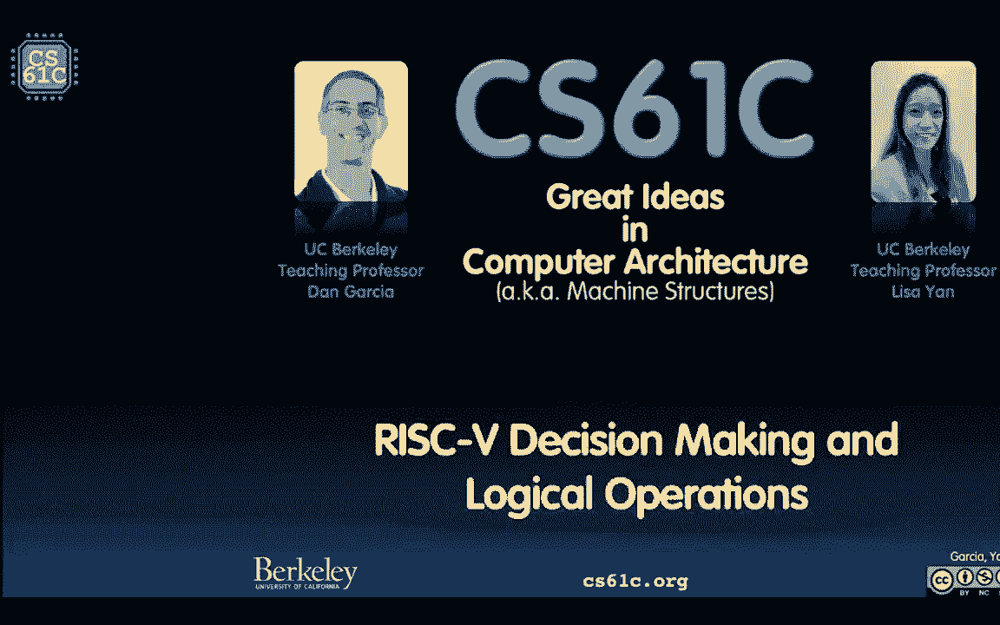

在本节课中，我们将要学习 RISC-V 架构中的决策（条件分支）和逻辑运算。这是编写智能程序（如 `if-else` 语句和循环）的基础。我们将了解如何将高级语言中的控制流转换为底层的 RISC-V 指令，并学习按位逻辑操作。

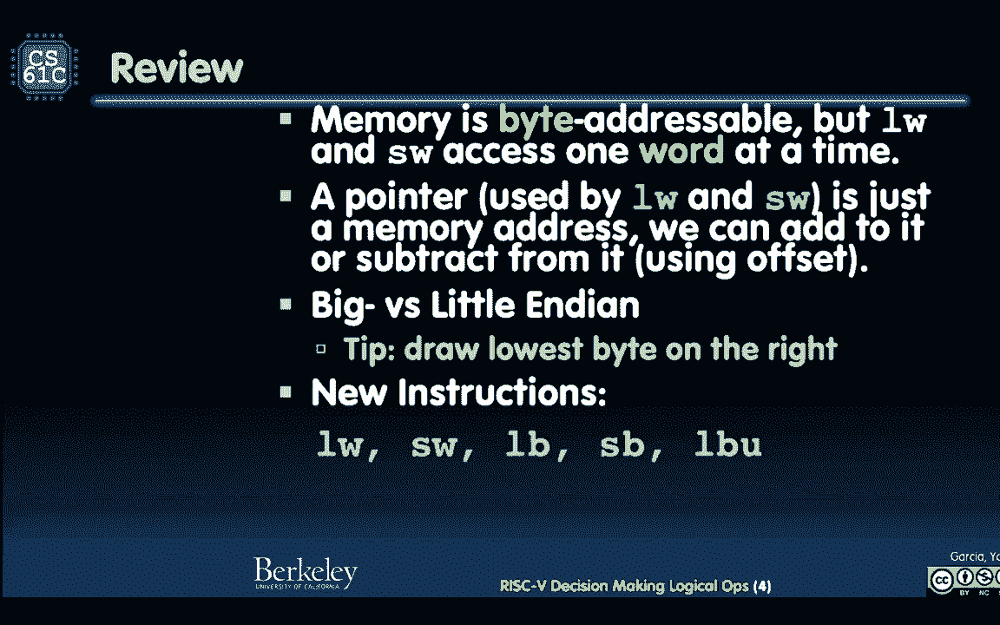

---


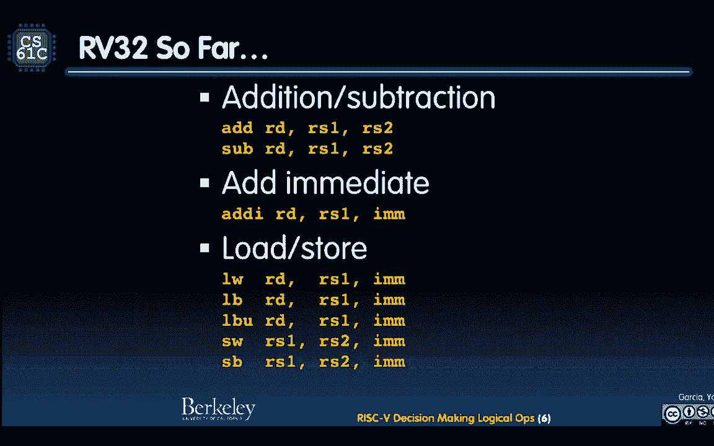

## 概述 📋

上一节我们介绍了 RISC-V 的内存访问指令（如 `lw` 和 `sw`）。本节中我们来看看如何让程序“做决定”，即根据条件执行不同的代码路径，这是通过**条件分支指令**实现的。同时，我们也会学习**逻辑运算指令**，它们用于对寄存器中的位进行并行操作。

---


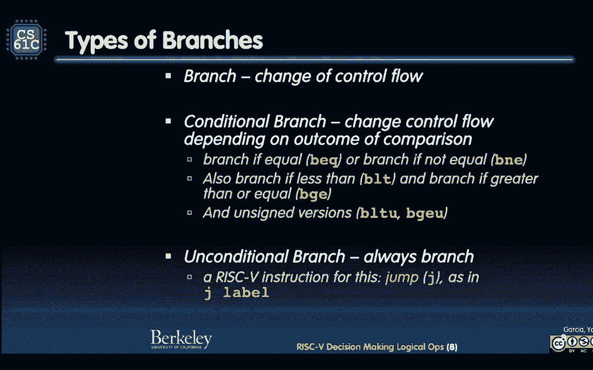


## 决策：条件分支 🚦

程序智能化的核心是能够做出选择，例如 `if` 语句。在 RISC-V 中，这是通过**分支（Branch）** 指令完成的。

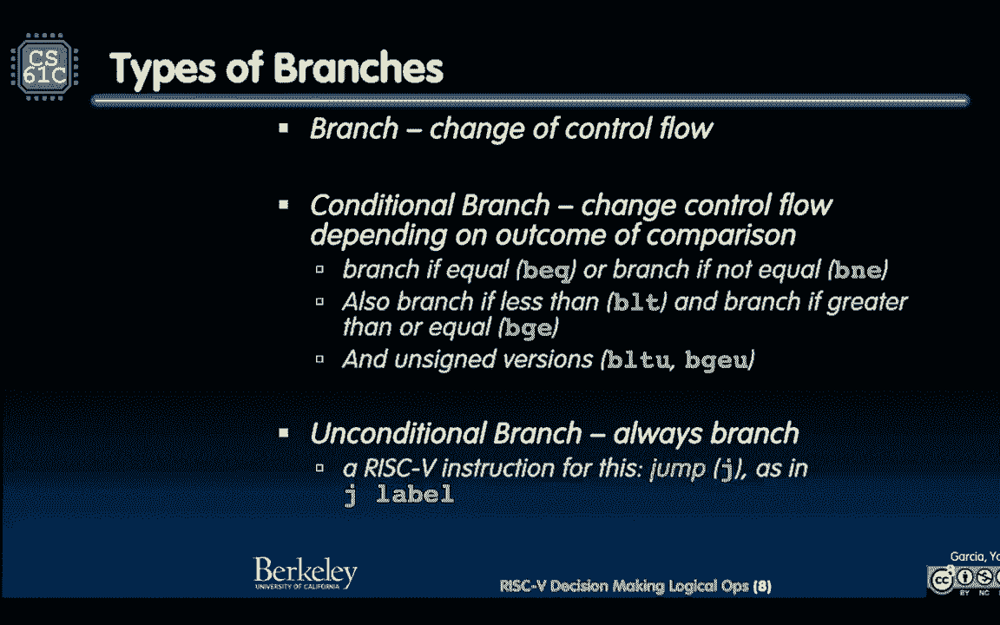

### 分支指令基础

核心指令是 `beq`（branch if equal）和 `bne`（branch if not equal）。

*   **`beq rs1, rs2, label`**：如果寄存器 `rs1` 中的值**等于**寄存器 `rs2` 中的值，则程序跳转到 `label` 处执行；否则，顺序执行下一条指令。
*   **`bne rs1, rs2, label`**：如果寄存器 `rs1` 中的值**不等于**寄存器 `rs2` 中的值，则程序跳转到 `label` 处执行。

这里的 `label` 是代码中的一个标签（如 `loop:`），用于标记跳转目标地址。

### 比较与更多分支条件

为了进行大小比较，RISC-V 提供了有符号和无符号版本的分支指令。

*   **`blt rs1, rs2, label`**：如果 `rs1` < `rs2`（有符号比较），则跳转。
*   **`bge rs1, rs2, label`**：如果 `rs1` >= `rs2`（有符号比较），则跳转。
*   **`bltu rs1, rs2, label`**：如果 `rs1` < `rs2`（无符号比较），则跳转。
*   **`bgeu rs1, rs2, label`**：如果 `rs1` >= `rs2`（无符号比较），则跳转。

**注意**：RISC-V 指令操作的是位，本身没有类型信息。因此，你必须根据数据含义选择正确的有符号（`blt`/`bge`）或无符号（`bltu`/`bgeu`）比较指令。

### 无条件跳转

除了条件分支，还有**无条件跳转**指令 `j label`，它总是跳转到指定的 `label`，用于实现 `goto` 或跳出循环。

---

## 条件分支应用示例 🔄

让我们通过一个例子来理解如何将 C 语言的 `if-else` 语句转换为 RISC-V 代码。

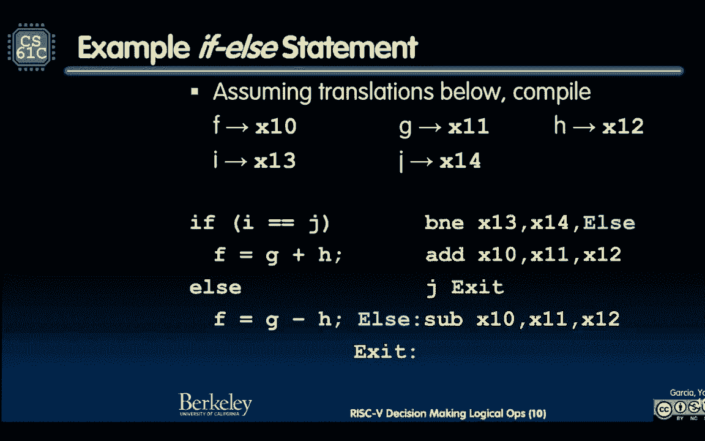

考虑以下 C 代码：
```c
if (i == j) {
    f = g + h;
} else {
    f = g - h;
}
```


转换时的一个常见技巧是“翻转条件”。我们通常使用 `bne`（如果不相等则跳过 then 块）来组织代码，这样更符合汇编的线性执行流程。

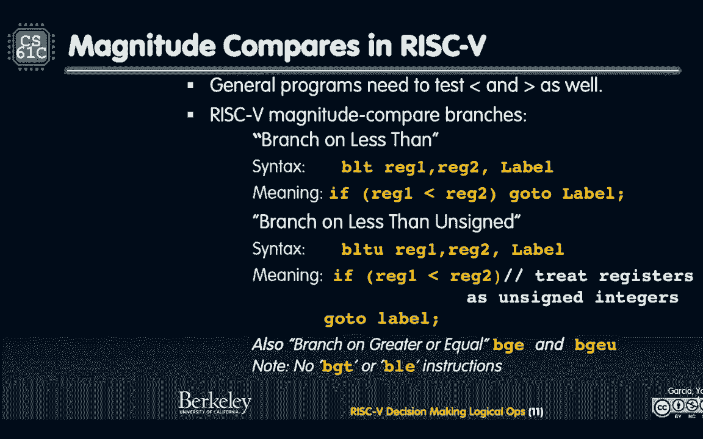


以下是可能的 RISC-V 汇编实现：
```assembly
    bne x22, x23, Else   # 如果 i != j，跳转到 Else 标签
    add x19, x20, x21    # then 块: f = g + h
    j Exit               # 跳过 else 块
Else:
    sub x19, x20, x21    # else 块: f = g - h
Exit:
    # 后续代码...
```

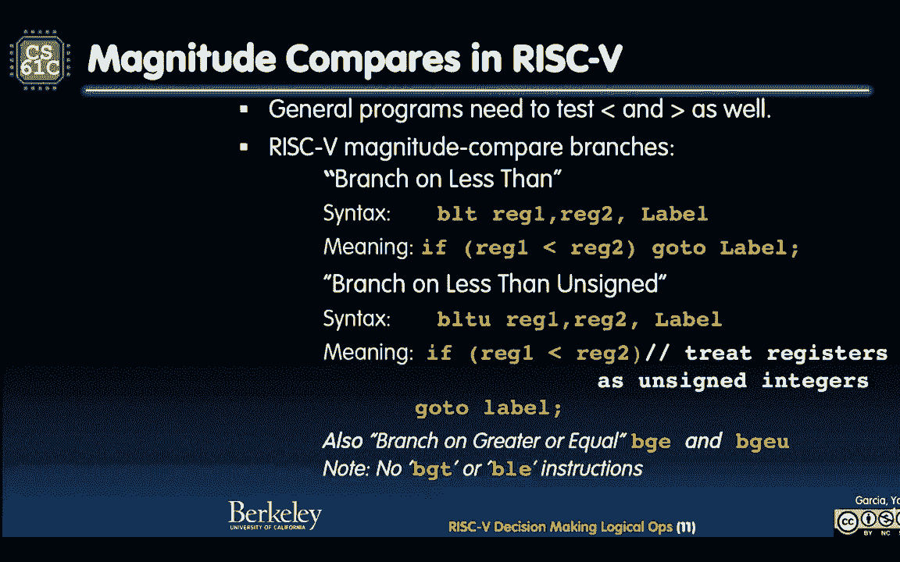

**关键点**：在汇编中，我们通过判断“条件不成立”时跳走来控制流程，然后在条件成立处顺序执行 then 块，并用 `j` 指令跳过 else 块。

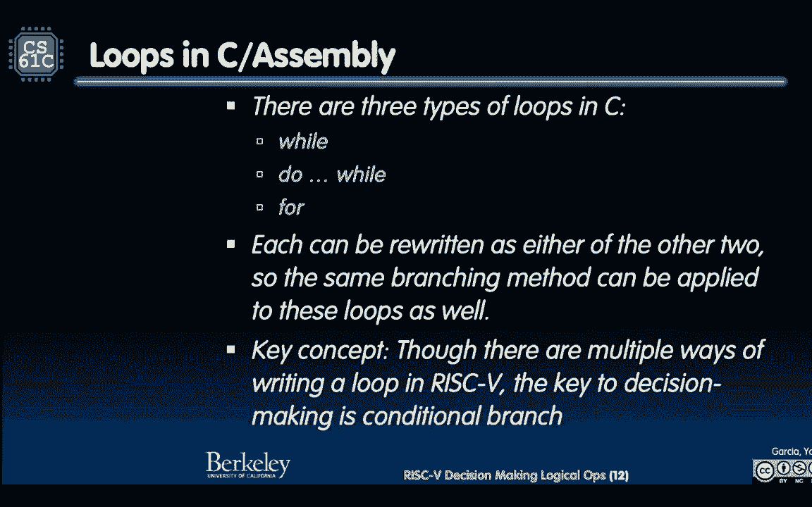

---

## 循环的实现 🔁

所有高级语言中的循环（`for`, `while`, `do-while`）最终都会转换为条件分支和跳转指令。以下是一个累加数组元素的 C 语言 `for` 循环及其 RISC-V 翻译思路。

C 代码（累加模式）：
```c
int A[20];
int sum = 0;
for (int i = 0; i < 20; i++) {
    sum += A[i];
}
```

RISC-V 汇编核心结构：
```assembly
    # 初始化: x10 (sum)=0, x11 (i)=0, x13=20, x9 指向数组 A 首地址
loop:
    bge x11, x13, done   # 如果 i >= 20，跳出循环
    lw x12, 0(x9)        # 临时加载 A[i]
    add x10, x10, x12    # sum += A[i]
    addi x9, x9, 4       # 移动指针到下一个数组元素（int 占 4 字节）
    addi x11, x11, 1     # i++
    j loop               # 跳回循环开始
done:
    # 循环结束...
```

**逻辑分析**：循环条件 `i < 20` 被转换为它的相反条件 `i >= 20` 作为分支判断。只要 `i < 20` 为真（即 `bge` 条件为假），就继续执行循环体内的指令，并在末尾跳回标签 `loop`。

---

## 逻辑运算 🛠️

逻辑运算指令对寄存器中的**所有位进行并行操作**，常用于位掩码（masking）、位设置和清零。

### 基本逻辑指令

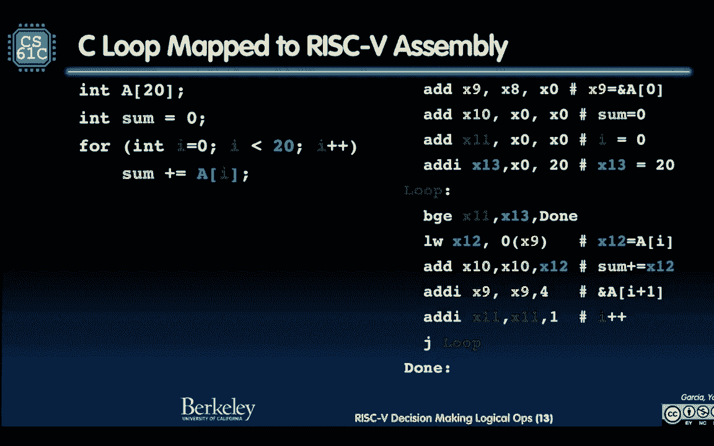


RISC-V 提供了与 C 语言位操作符对应的指令：

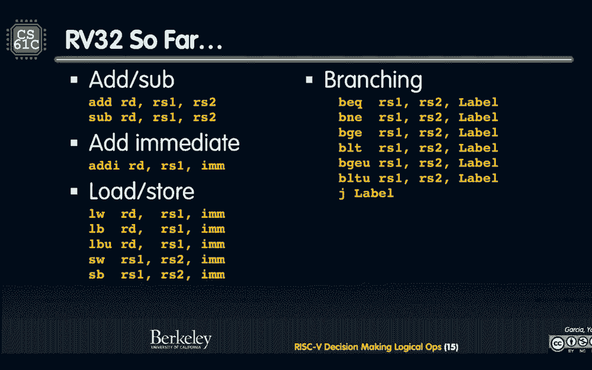

*   **`and rd, rs1, rs2`**：按位与，`rd = rs1 & rs2`
*   **`or rd, rs1, rs2`**：按位或，`rd = rs1 | rs2`
*   **`xor rd, rs1, rs2`**：按位异或，`rd = rs1 ^ rs2`

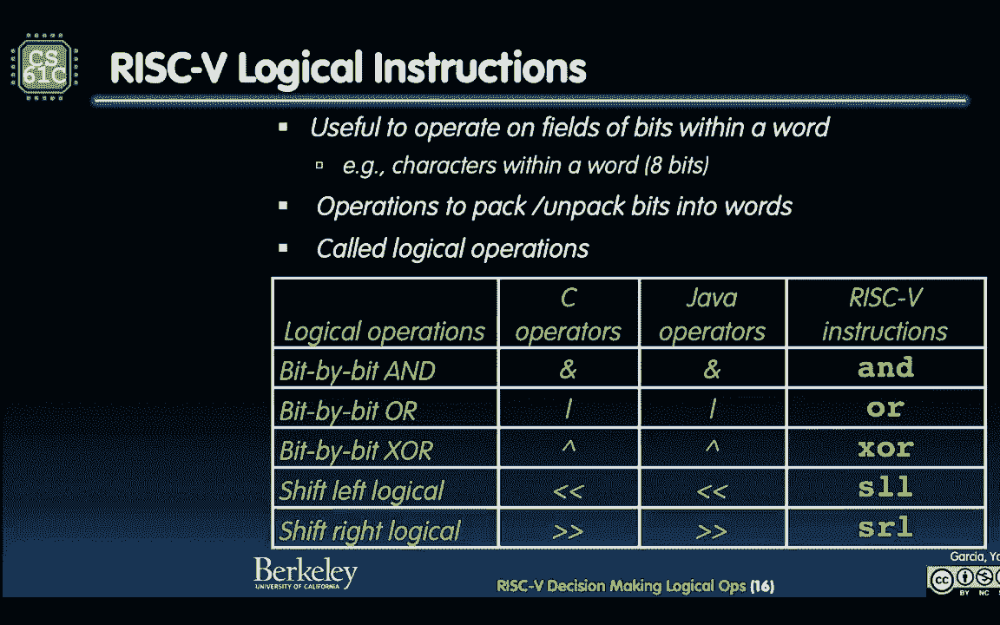

这些指令也有立即数版本（`andi`, `ori`, `xori`），可以将寄存器与一个常数进行运算。

### 移位指令

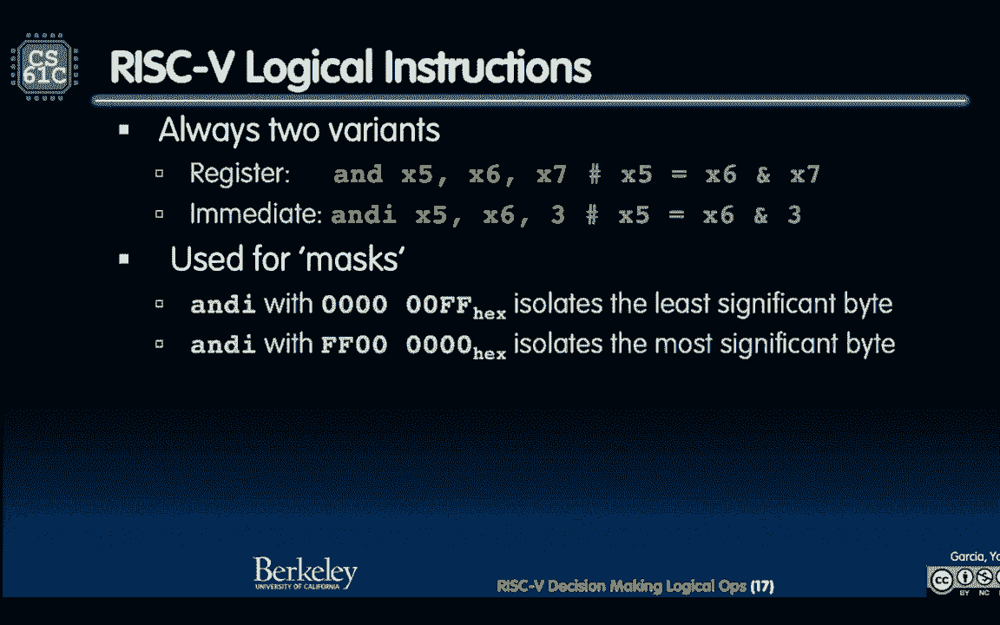

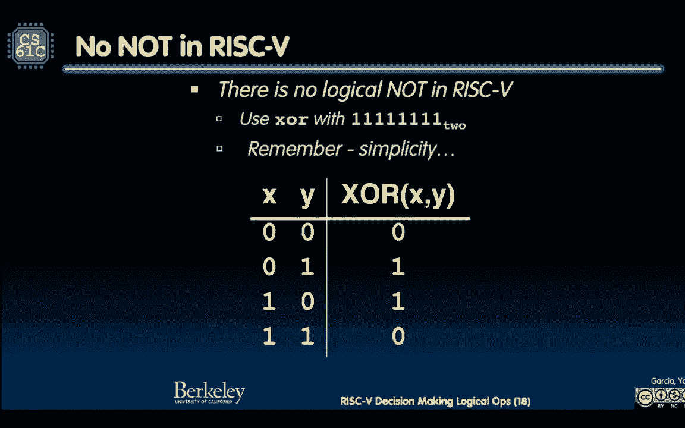

移位操作也属于逻辑运算：

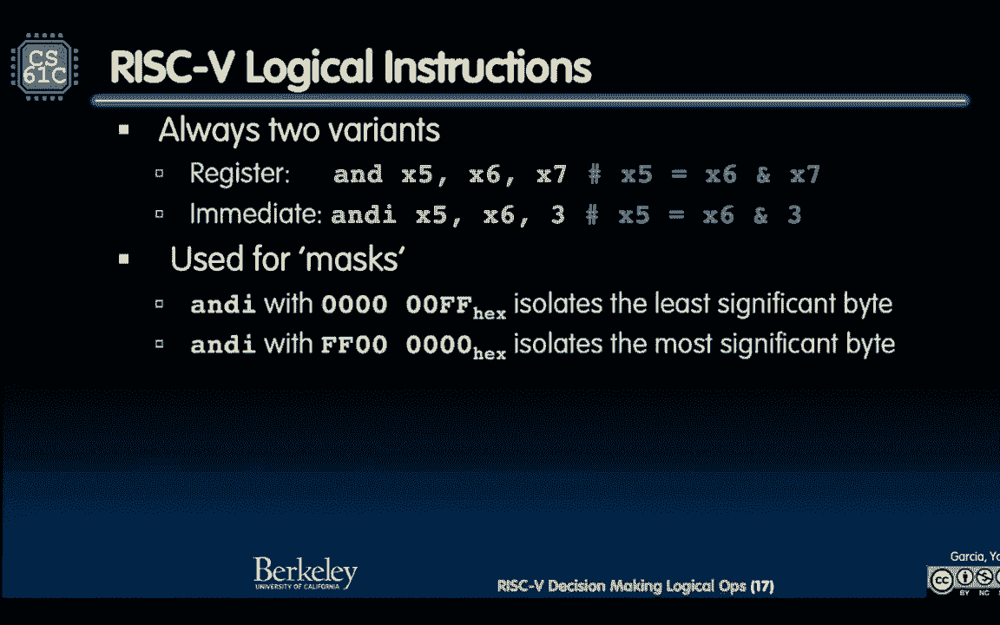

*   **`slli rd, rs1, shamt`**：逻辑左移，`rd = rs1 << shamt`。低位补 0，高位丢弃。对于无符号数，这相当于乘以 2^shamt。
*   **`srli rd, rs1, shamt`**：逻辑右移，`rd = rs1 >> shamt`。高位补 0，低位丢弃。
*   **`srai rd, rs1, shamt`**：算术右移，`rd = rs1 >> shamt`。高位用**原来的符号位**填充，低位丢弃。这对于保持有符号数的符号非常有用，相当于有符号数除以 2^shamt（向零取整）。

### 应用：位掩码（Masking）

使用 `and` 指令和特定掩码（mask）可以保留或清除某些位。例如，要保留一个寄存器的最低 8 位（一个字节），而将其他位清零：
```assembly
andi x12, x10, 0xFF  # 0xFF 的二进制是低8位为1，其余为0
```
这里，`0xFF` 就是掩码。`and` 运算的特性是：与 1 相与保留原值，与 0 相与结果为 0。

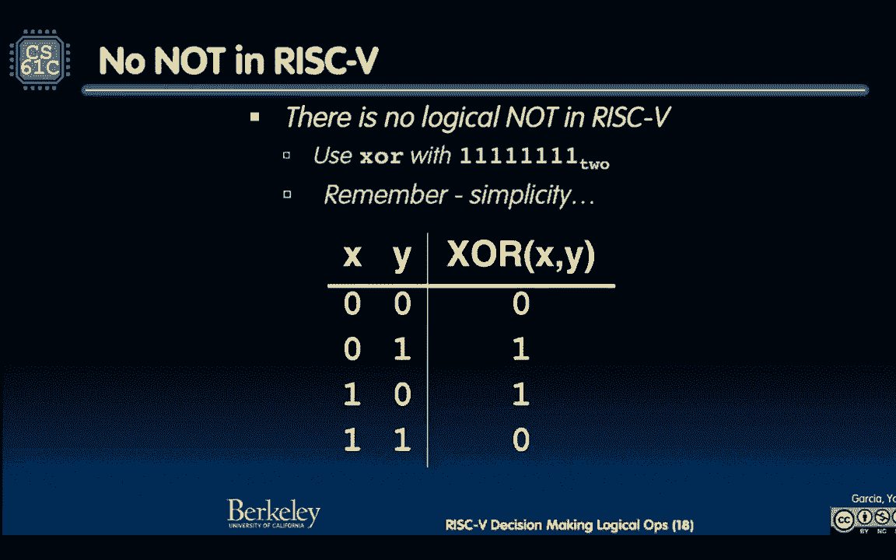

### 异或（XOR）的妙用


`xor` 指令有一个有趣特性：当其中一个操作数为 1 时，它对另一位执行“取反”操作；当为 0 时，则保留另一位不变。因此，`xori` 常被用作条件按位取反的工具。

---


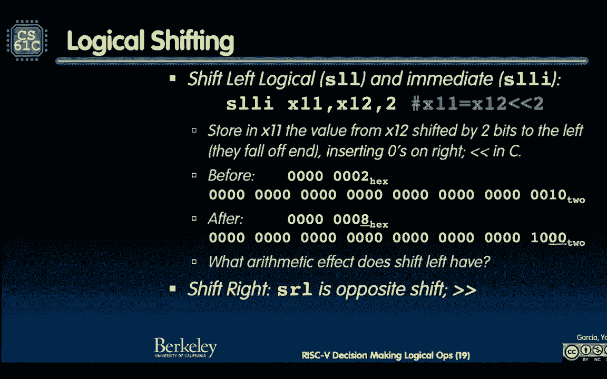

## 编译过程回顾与程序计数器 🖥️

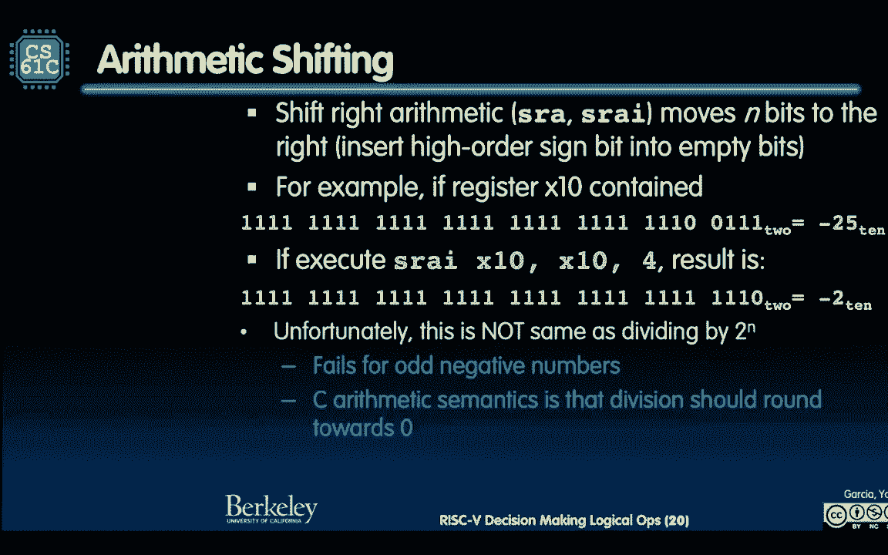

我们编写的 RISC-V 汇编代码（人类可读）需要经过以下步骤才能变成机器可执行的程序：
1.  **编译器**：将高级语言（如 C）转换为汇编语言（`.s` 文件）。
2.  **汇编器**：将汇编语言转换为机器码（目标文件 `.o`），并处理标签（`label`）。在此阶段，像 `beq` 指令中的 `label` 会被计算为具体的地址偏移量。
3.  **链接器**：将多个目标文件及库文件链接在一起，解析跨文件的函数引用（如 `foo`），生成最终的可执行文件。


在 CPU 内部，一个名为**程序计数器（Program Counter, PC）** 的特殊寄存器指向当前正在执行的指令在内存中的地址。通常，每执行完一条指令，PC 会自动加 4（因为 RISC-V 指令是 32 位/4 字节），指向下一条指令。**分支**和**跳转**指令的作用就是改变 PC 的值，从而改变程序的执行流。


---

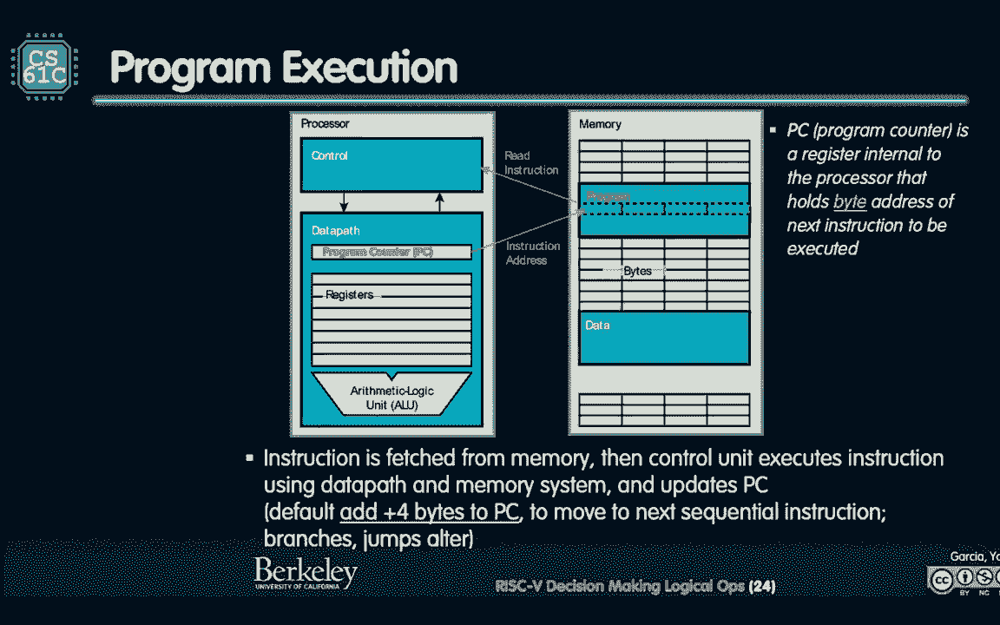

## 伪指令与寄存器别名 ✨

为了让汇编代码更易读写，RISC-V 定义了一些**伪指令**和**寄存器别名**。

*   **寄存器别名**：用有意义的名称代替数字寄存器编号。
    *   `a0`-`a7` -> `x10`-`x17`：函数参数/返回值寄存器。
    *   `zero` -> `x0`：恒为零的寄存器。
*   **常用伪指令**：
    *   `mv rd, rs`：复制寄存器，`rd = rs`（实际是 `addi rd, rs, 0`）。
    *   `li rd, constant`：加载立即数到寄存器（实际是 `addi rd, zero, constant` 或更复杂的序列）。
    *   `nop`：空操作，不执行任何效果（实际是 `addi x0, x0, 0`）。


---

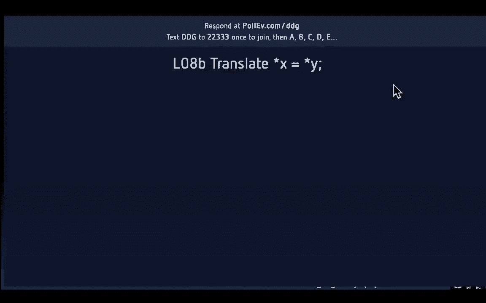

## 总结 🎯

本节课中我们一起学习了 RISC-V 架构中实现程序决策和逻辑处理的核心内容：

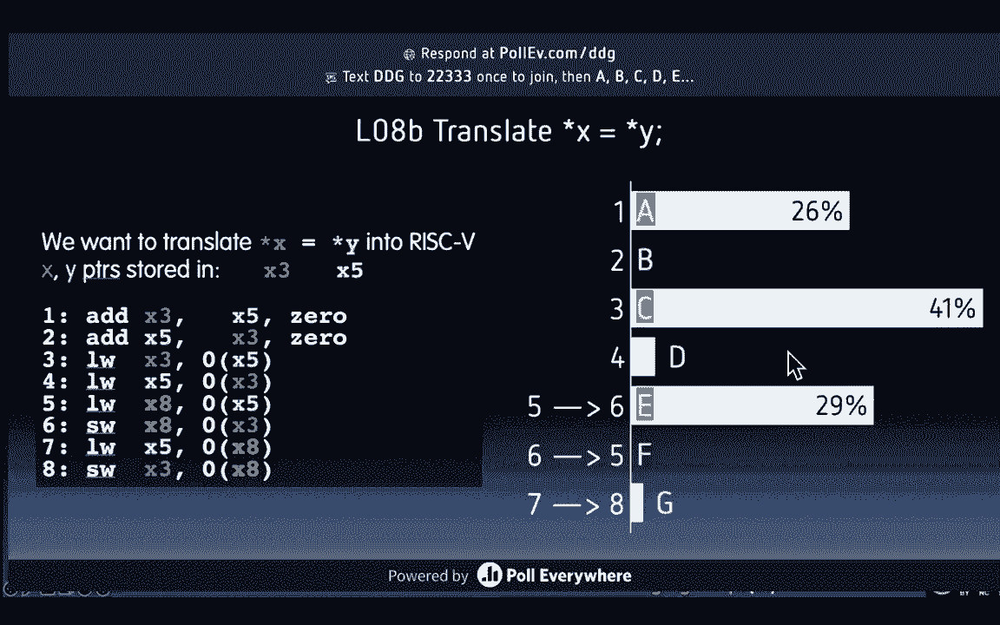

1.  **条件分支指令**：包括 `beq`、`bne`、`blt`、`bge` 等，用于实现 `if-else` 和循环控制流。关键技巧是经常使用条件的“反面”进行分支判断。
2.  **逻辑运算指令**：包括 `and`、`or`、`xor` 以及移位指令 `slli`、`srli`、`srai`。它们对位进行并行操作，用于掩码、位操作和算术辅助。
3.  **编程模式**：我们分析了如何将高级语言的 `if-else` 语句和 `for` 循环（特别是累加模式）翻译成 RISC-V 汇编代码。
4.  **底层支持**：了解了程序计数器（PC）如何控制执行流，以及伪指令如何简化代码编写。

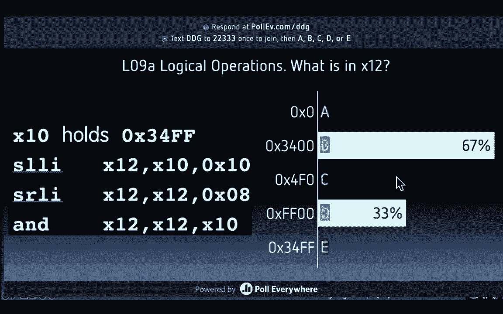


掌握这些指令是理解计算机如何执行条件判断和复杂运算的基础，也是后续学习函数调用和更高级编程概念的必备知识。