# 课程 P14：Lecture 11： RISC-V 指令格式 I 🧩

在本节课中，我们将学习 RISC-V 指令集架构中机器语言的基础知识。我们将从存储程序计算机的历史背景讲起，然后深入探讨 RISC-V 指令如何被编码为 32 位的机器码。我们将重点学习 R、I、S 这三种指令格式，理解它们的设计逻辑和字段布局，并学习如何将汇编指令翻译成对应的二进制位模式。

---

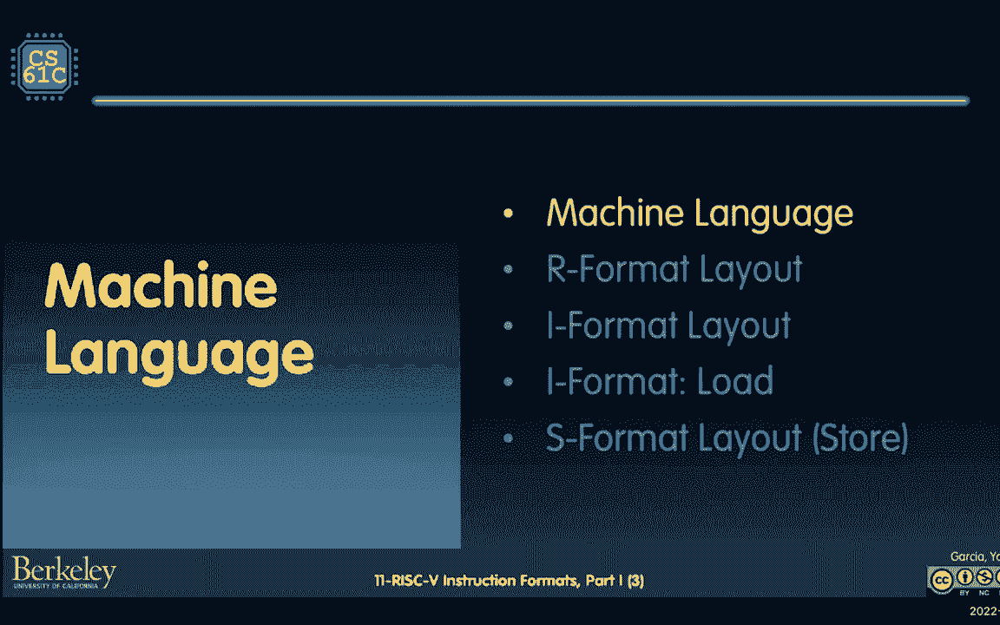

## 从汇编语言到机器语言 🖥️

上一节我们介绍了 RISC-V 的汇编语言。本节中，我们来看看软件与硬件之间的接口——指令集架构（ISA）。ISA 不仅定义了汇编指令，还定义了这些指令在硬件层面如何表示为 0 和 1 的位模式，即机器语言。

在 RISC-V 中，每条指令都被编码为一个 32 位的“字”。这个字被划分为多个“字段”，每个字段承载着指令的不同信息（如操作类型、寄存器编号、立即数等）。

## 存储程序计算机的历史背景 📜

在深入指令格式之前，了解“存储程序计算机”的概念至关重要。这个概念并非与生俱来。

早期的计算机，如 ENIAC（1946年），需要通过物理连接（如插拔线缆）来为每个新任务“编程”，这个过程可能需要数天。随后出现的 EDSAC（1949年）是第一台“存储程序”计算机，它将指令像数据一样以二进制形式存储在内存中。这使得“编程”变成了写入和加载位模式，速度大大加快。

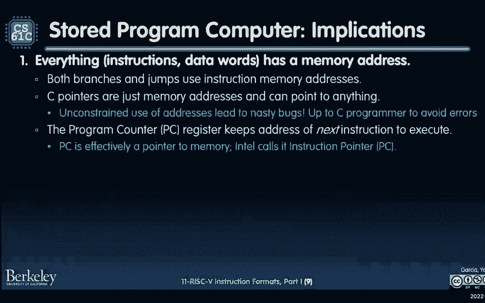

这个概念由冯·诺依曼等人提出并推广。存储程序计算机带来了两个关键影响：
1.  所有东西（指令和数据）都有一个内存地址。
2.  程序以二进制机器码的形式分发，并与特定的指令集架构绑定。

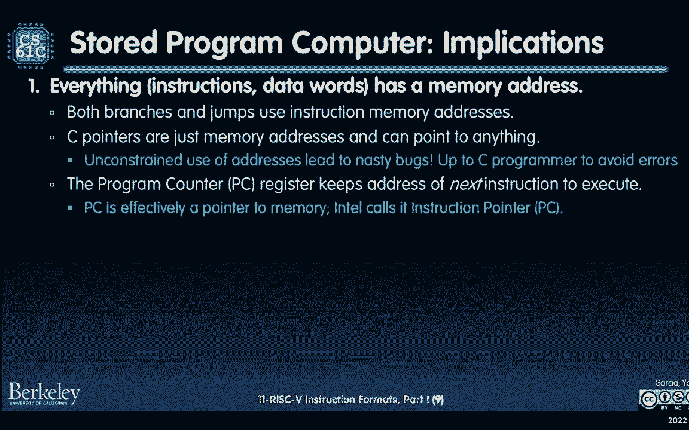

## RISC-V 指令格式概述 📊

RISC-V 没有为每条指令定义独一无二的位模式，而是将指令归类为几种固定的“格式”。这简化了 CPU 硬件的设计。本节课我们将学习前三种格式：R、I 和 S 格式。

### R 格式：寄存器-寄存器操作 🔄

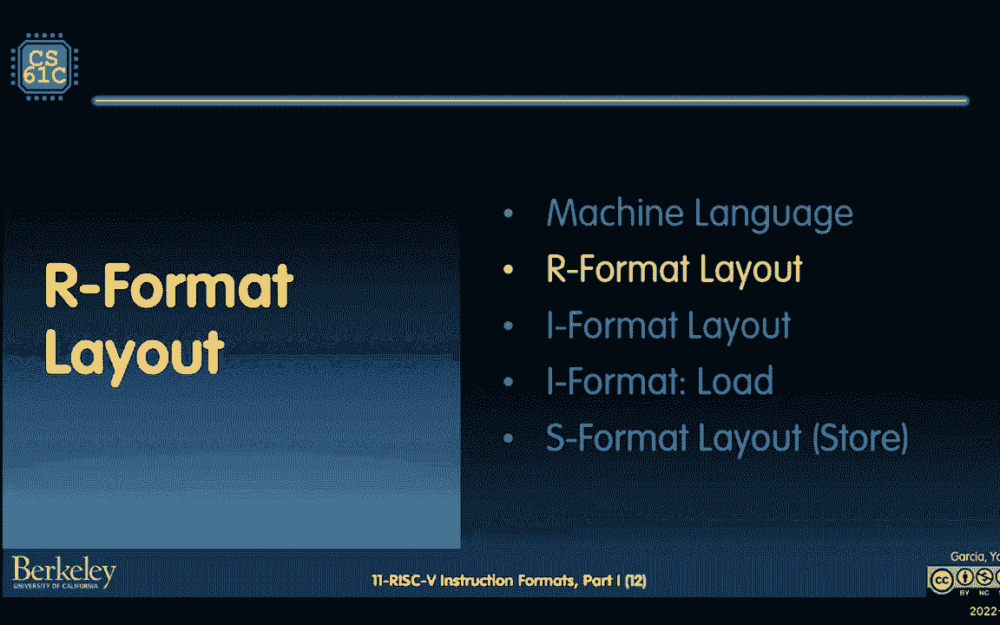

R 格式指令用于在两个寄存器上进行操作，并将结果写入第三个寄存器。例如加法 `add x10, x18, x19`。

以下是 R 格式指令的 32 位字段布局：

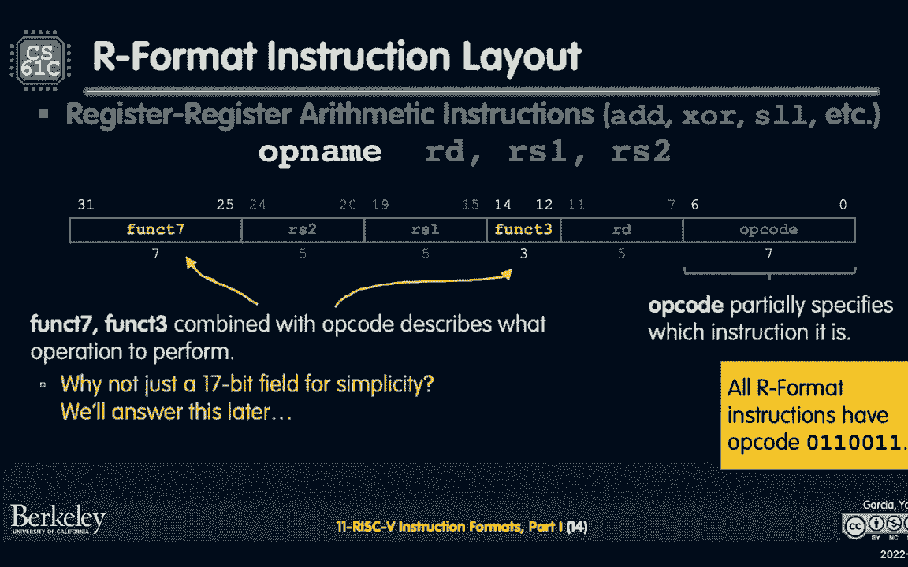

| 位区间 (bits) | 字段名 | 描述 |
| :--- | :--- | :--- |
| 31-25 | `funct7` | 功能码字段 7 |
| 24-20 | `rs2` | 第二个源寄存器编号 |
| 19-15 | `rs1` | 第一个源寄存器编号 |
| 14-12 | `funct3` | 功能码字段 3 |
| 11-7 | `rd` | 目标寄存器编号 |
| 6-0 | `opcode` | 操作码 |

**核心概念解析**：
*   **操作码 (`opcode`)**：一个 7 位字段，大致标识指令的格式和基本操作类型。对于所有 R 格式算术/逻辑指令，`opcode` 都是 `0110011`。
*   **寄存器字段 (`rd`, `rs1`, `rs2`)**：每个都是 5 位，因为 RISC-V 有 32 个寄存器（编号 0-31），5 位恰好可以表示 `2^5 = 32` 种可能。
*   **功能码 (`funct3`, `funct7`)**：与 `opcode` 结合，精确指定是哪种操作（如加、减、与、或等）。例如，`add` 指令的 `funct3` 是 `000`，`funct7` 是 `0000000`。

**示例：编码 `add x10, x18, x19`**
1.  `opcode`: `0110011`
2.  `rd` (x10): 寄存器编号 10 = `01010`
3.  `funct3`: `000`
4.  `rs1` (x18): 寄存器编号 18 = `10010`
5.  `rs2` (x19): 寄存器编号 19 = `10011`
6.  `funct7`: `0000000`

按字段顺序组合起来，就得到了该指令的 32 位机器码。

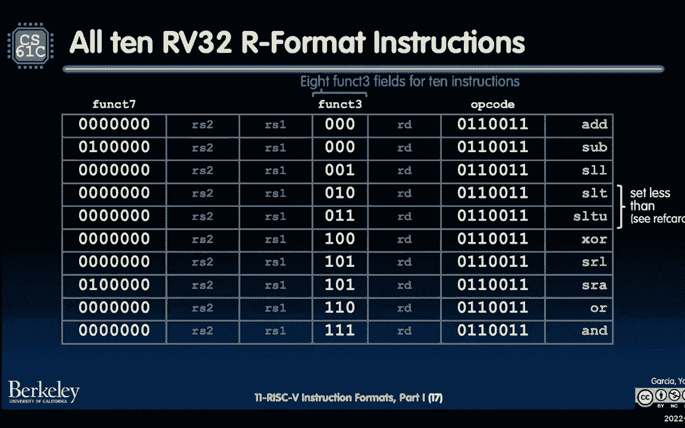

### I 格式：立即数操作 🔢

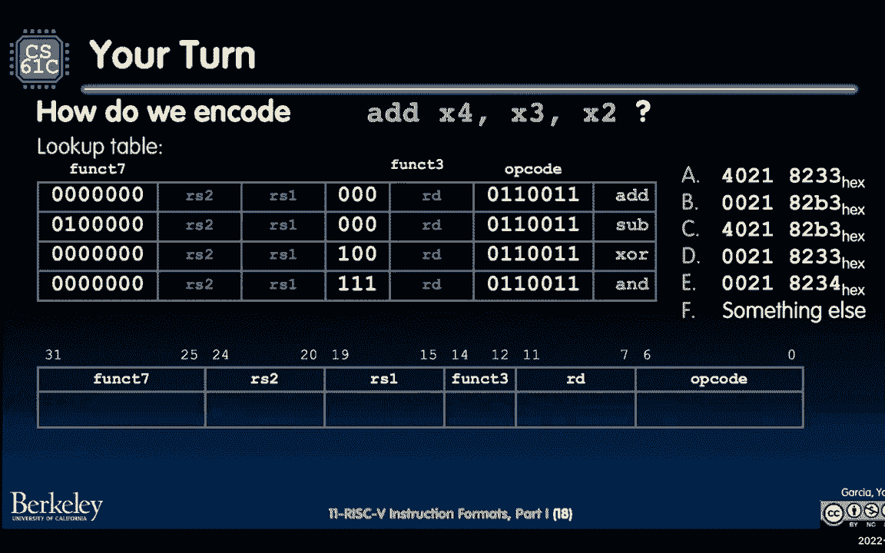

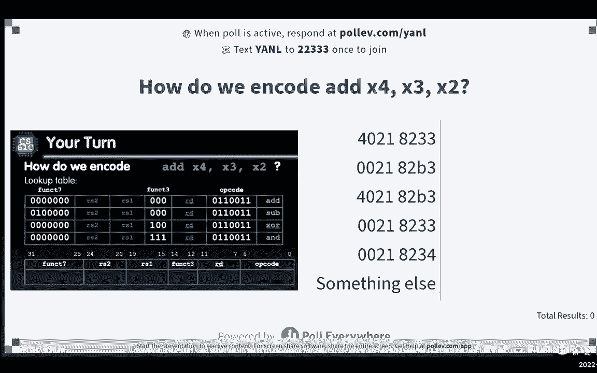

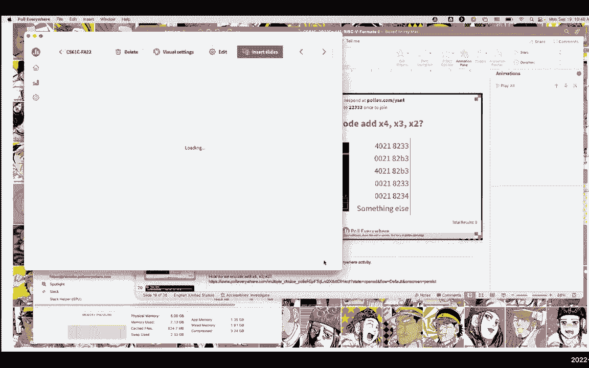

I 格式指令使用一个寄存器和一个立即数（常量）进行操作，结果写入另一个寄存器。例如立即数加法 `addi x15, x1, -50`。

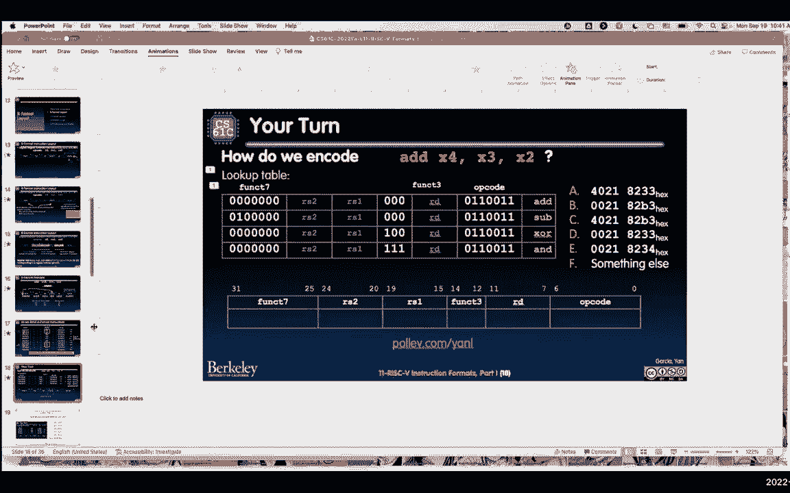

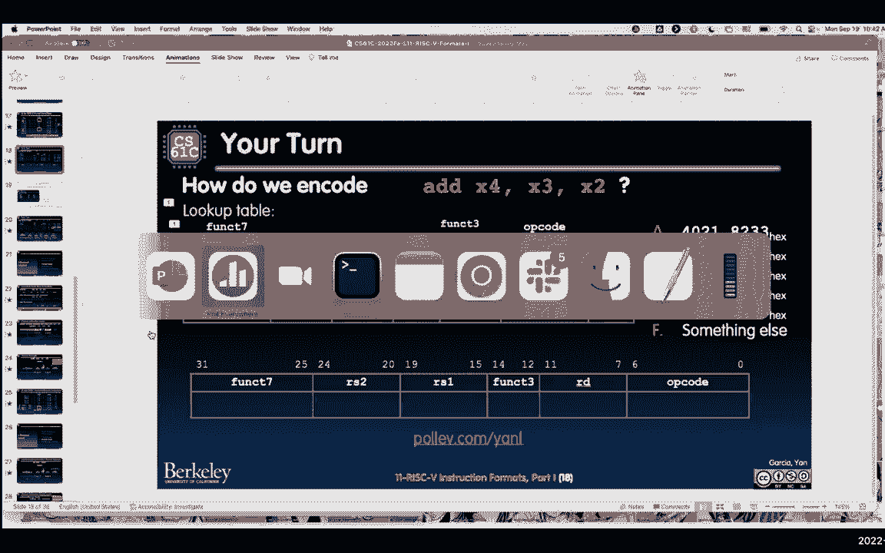

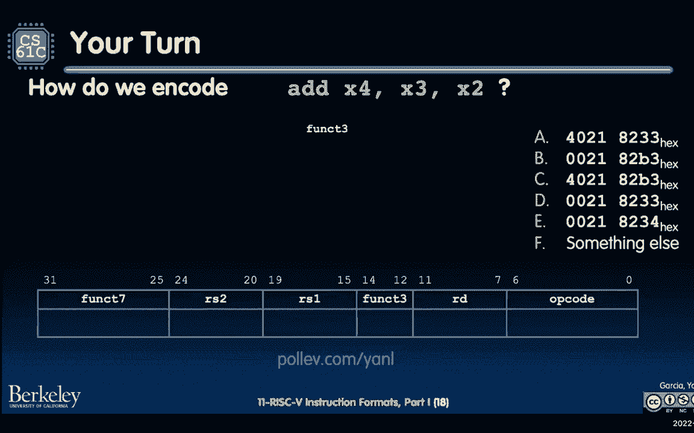

I 格式的字段布局如下：

| 位区间 (bits) | 字段名 | 描述 |
| :--- | :--- | :--- |
| 31-20 | `imm[11:0]` | 12 位立即数 |
| 24-20 | `rs1` | 源寄存器编号 |
| 19-15 | `funct3` | 功能码字段 3 |
| 11-7 | `rd` | 目标寄存器编号 |
| 6-0 | `opcode` | 操作码 |

**核心概念解析**：
*   **立即数字段 (`imm[11:0]`)**：一个 12 位字段，用于存放常量值。CPU 会将其符号扩展为 32 位后再参与运算。其表示范围为 `-2^11` 到 `2^11 - 1`（即 -2048 到 2047）。
*   **设计一致性**：`rd`、`rs1`、`funct3` 和 `opcode` 字段的位置与 R 格式保持一致。这简化了 CPU 读取寄存器编号等操作。
*   **移位指令的特殊性**：对于移位指令（如 `slli`），其移位量只需要 0-31，因此只使用立即数的最低 5 位 `imm[4:0]`，高位 `imm[11:5]` 用作额外的功能码。这在参考卡上有时被标记为 I* 格式。

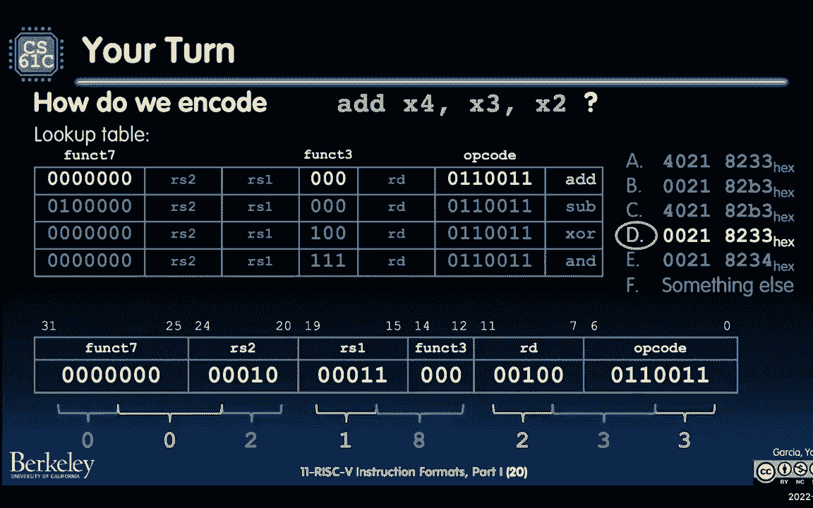

I 格式也用于**加载指令**（如 `lw`）。此时，`rs1` 是基地址寄存器，`imm[11:0]` 是偏移量，计算出的内存地址处的数据被加载到目标寄存器 `rd` 中。

### S 格式：存储指令 💾

S 格式指令用于将寄存器中的数据存储到内存中。例如 `sw x13, 8(x20)`。

S 格式的字段布局如下：

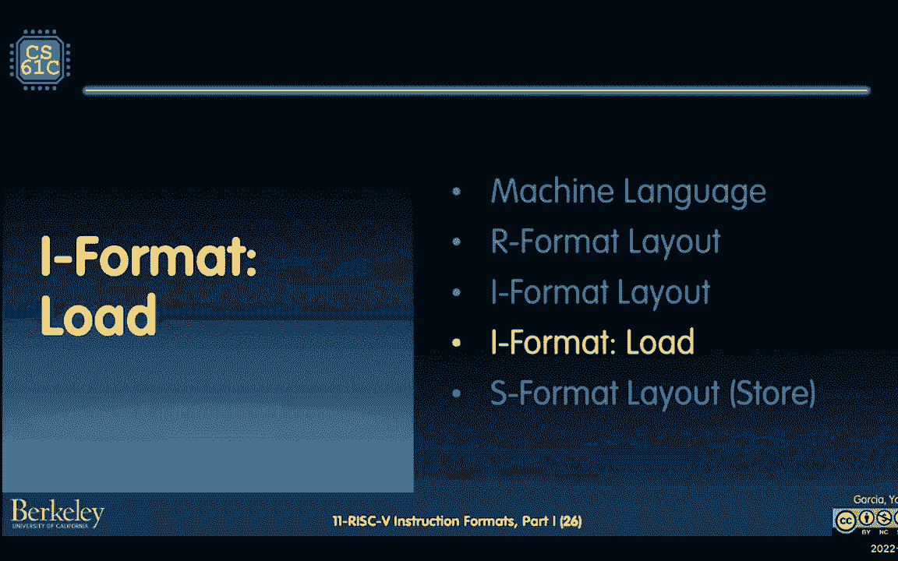

| 位区间 (bits) | 字段名 | 描述 |
| :--- | :--- | :--- |
| 31-25 | `imm[11:5]` | 立即数的高 7 位 |
| 24-20 | `rs2` | 要存储的数据所在的源寄存器 |
| 19-15 | `rs1` | 基地址寄存器 |
| 14-12 | `funct3` | 功能码字段 3 |
| 11-7 | `imm[4:0]` | 立即数的低 5 位 |
| 6-0 | `opcode` | 操作码 |

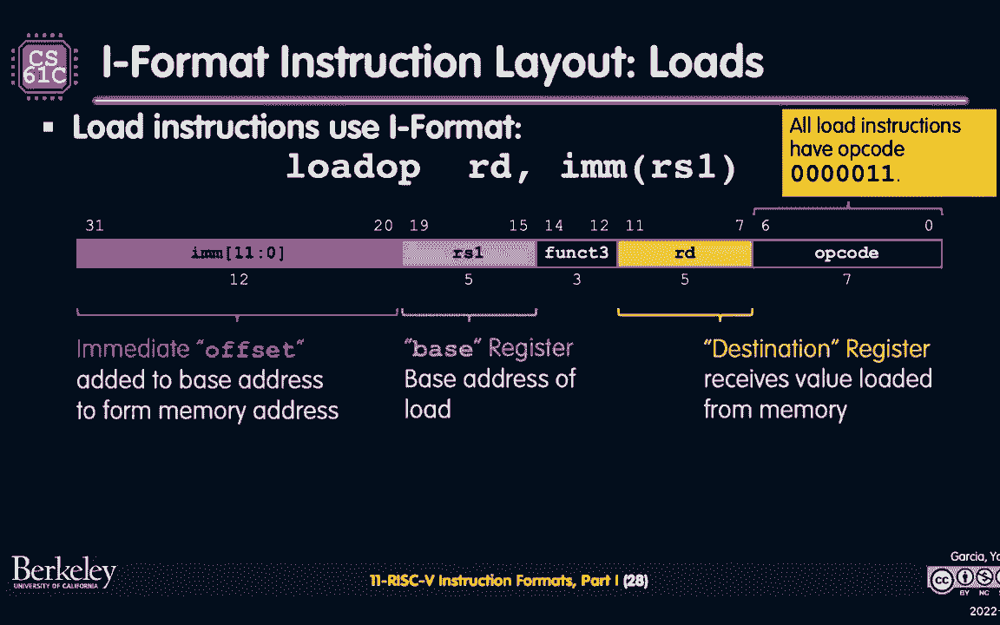

**核心概念解析**：
*   **立即数拆分**：12 位立即数被拆分到两个位置。这是为了保持**关键字段位置的一致性**。
*   **设计哲学**：CPU 解码指令时，一个关键任务是快速确定需要读取哪些寄存器。在 R 和 I 格式中，`rs1` 和 `rs2` 的位位置是固定的。S 格式为了保持 `rs1` 和 `rs2` 字段的位置与 R 格式相同，不得不将完整的 12 位立即数拆分开。这对 CPU 硬件设计更友好，尽管对人类阅读不那么直观。

---

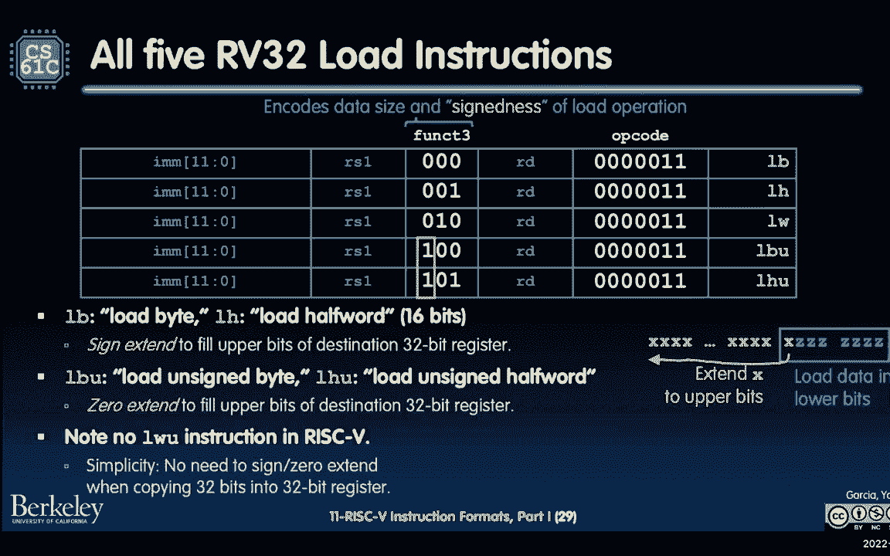

## 总结 🎯

本节课我们一起学习了 RISC-V 机器语言的基础和三种核心指令格式：
1.  **R 格式**：用于寄存器间的算术逻辑运算，包含 `funct7`、`rs2`、`rs1`、`funct3`、`rd`、`opcode` 字段。
2.  **I 格式**：用于包含立即数的操作或加载指令，包含 `imm[11:0]`、`rs1`、`funct3`、`rd`、`opcode` 字段。
3.  **S 格式**：用于存储指令，将 12 位立即数拆分以保持 `rs1` 和 `rs2` 字段位置与 R 格式一致。

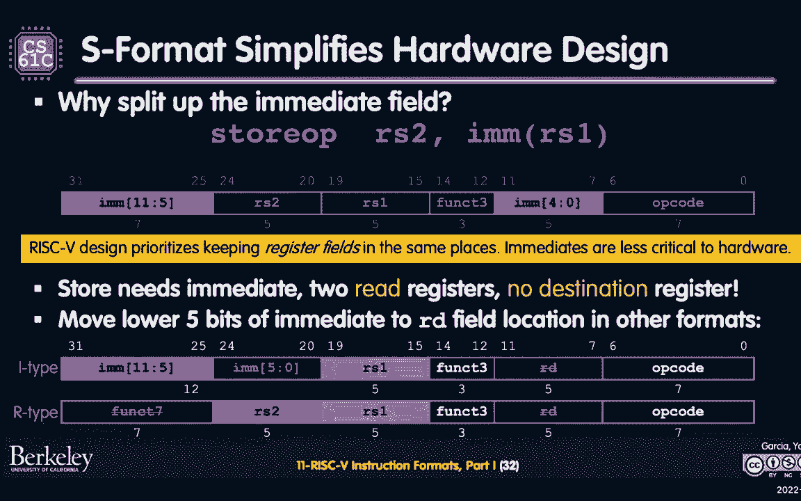

理解这些格式的关键在于领会 RISC-V 的**设计原则**：**简洁性**和**硬件友好性**。通过将指令归类为少数几种格式，并保持源/目标寄存器字段位置相对固定，极大地简化了 CPU 控制单元的设计。虽然机器码对人来说难以直接阅读，但通过参考卡和对其设计逻辑的理解，我们可以准确地在汇编指令和二进制位模式之间进行转换。